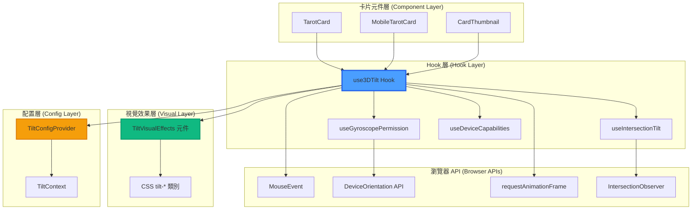
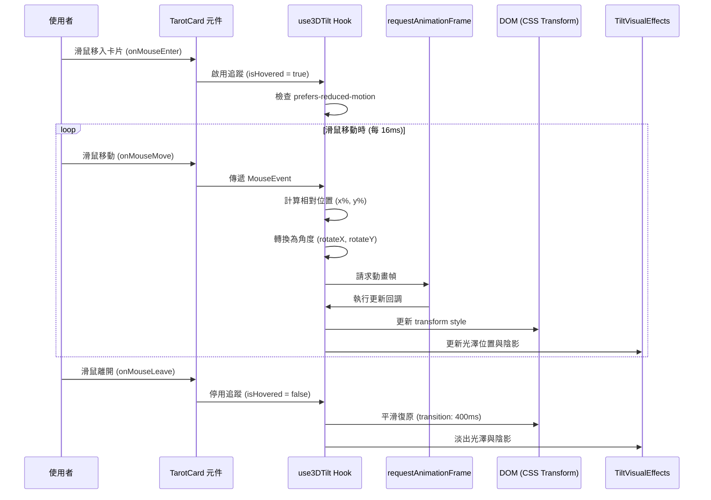
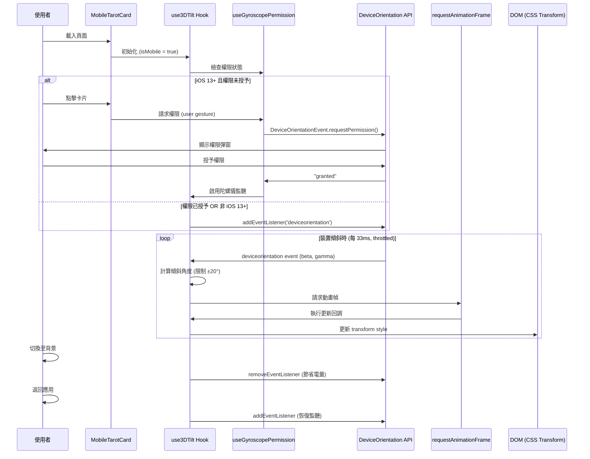
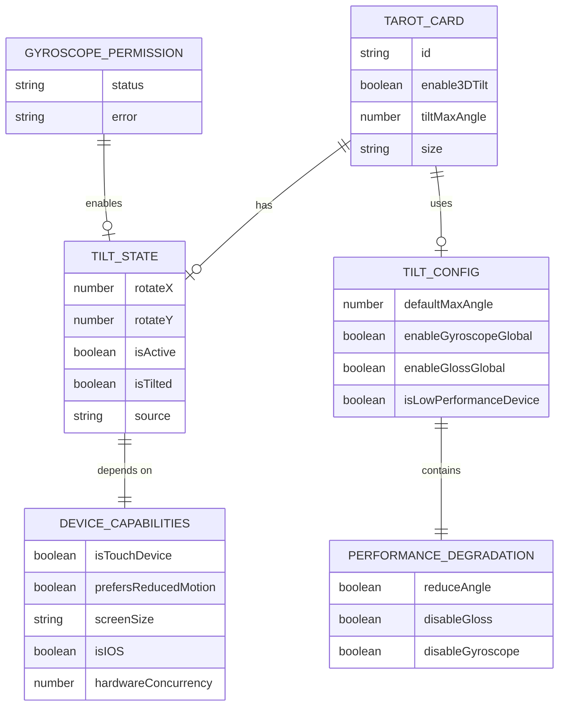

# 技術設計文件

## 概述

本設計為現有塔羅牌卡片元件（TarotCard、MobileTarotCard、CardThumbnail）增加 3D 傾斜效果。透過自訂 React Hook (`use3DTilt`) 封裝滑鼠追蹤與陀螺儀感應邏輯，使用 CSS 3D transforms 實現硬體加速的傾斜動畫，並搭配動態光澤與陰影效果提升視覺真實感。設計重點在於效能優化（60fps 目標）、無障礙支援（prefers-reduced-motion）、以及與現有元件的無縫整合。

### 核心實作策略

1. **自訂 Hook 封裝**: `use3DTilt` Hook 統一處理桌面與行動裝置的傾斜邏輯
2. **CSS 硬體加速**: 使用 `transform3d`、`will-change` 與 `perspective` 達成流暢動畫
3. **漸進增強**: 預設啟用效果，並優雅降級至現有行為（無傾斜）
4. **效能優先**: requestAnimationFrame、節流、Intersection Observer 確保 60fps
5. **無障礙第一**: 尊重 prefers-reduced-motion，不干擾鍵盤與螢幕閱讀器

## 需求對應

### 設計元件可追溯性

| 設計元件 | 對應需求 | 說明 |
|---------|---------|-----|
| **use3DTilt Hook** | 需求 1.1-1.8, 2.1-2.12 | 封裝滑鼠追蹤與陀螺儀邏輯 |
| **TiltVisualEffects 元件** | 需求 3.1-3.6 | 動態光澤與陰影渲染 |
| **TiltConfigProvider Context** | 需求 4.1-4.9 | 全域配置與效能偵測 |
| **useGyroscopePermission Hook** | 需求 2.1-2.2, 2.9-2.11, 6.5-6.6 | iOS 13+ 權限請求流程 |
| **useIntersectionTilt Hook** | 需求 5.3, 5.5 | 可視區域優化 |
| **CSS tilt-* 類別與動畫** | 需求 1.8, 3.6, 5.6 | 硬體加速 3D transforms |

### 使用者故事覆蓋

- **需求 1 使用者故事（桌面）**: `use3DTilt` Hook 的 `onMouseMove` 與 `onMouseLeave` 處理器計算傾斜角度並更新 CSS transform
- **需求 2 使用者故事（手機）**: `use3DTilt` Hook 的 `useDeviceOrientation` 子邏輯監聽 `deviceorientation` 事件
- **需求 3 使用者故事（視覺）**: `TiltVisualEffects` 元件根據傾斜狀態動態渲染 gradient overlay 與 box-shadow
- **需求 4 使用者故事（開發者）**: 所有卡片元件接受 `enable3DTilt`、`tiltMaxAngle` 等 props
- **需求 5 使用者故事（效能）**: `useIntersectionTilt` 與 `throttle` 確保僅可視卡片執行傾斜運算
- **需求 6 使用者故事（無障礙）**: 檢測 `prefers-reduced-motion` 並自動停用效果

## 架構

### 系統架構圖



### 技術堆疊

**前端核心**
- **框架**: React 19 + Next.js 15.1.7
- **語言**: TypeScript 5
- **動畫**: CSS 3D Transforms + will-change
- **狀態管理**: React Context API（TiltConfigProvider）+ 本地 useState
- **效能優化**: requestAnimationFrame, throttle (lodash/throttle), IntersectionObserver

**瀏覽器 API**
- **滑鼠追蹤**: MouseEvent (onMouseMove, onMouseLeave, onMouseEnter)
- **陀螺儀**: DeviceOrientationEvent (beta, gamma)
- **權限**: DeviceOrientationEvent.requestPermission() (iOS 13+)
- **可視偵測**: IntersectionObserver API
- **動畫同步**: requestAnimationFrame

**開發工具**
- **測試**: Jest + React Testing Library, Playwright
- **類型檢查**: TypeScript strict mode
- **程式碼品質**: ESLint + Prettier

### 架構決策理由

**為何選擇自訂 Hook (`use3DTilt`)**
- **研究依據**: React hooks 模式是 2025 年標準做法，可封裝複雜邏輯並實現程式碼重用
- **優勢**: 分離關注點、易於測試、支援多元件共用、符合 React 19 最佳實踐
- **考量**: 相較於 HOC 或 render props，hooks 提供更簡潔的 API 與更好的 TypeScript 支援

**為何使用 CSS 3D Transforms（非 Canvas/WebGL）**
- **研究依據**: CSS 3D transforms 自動觸發 GPU 硬體加速，無需額外 JavaScript 運算
- **效能**: `transform3d()` + `will-change: transform` 可達 60fps，記憶體佔用低
- **相容性**: Chrome 90+, Firefox 88+, Safari 14+ 皆原生支援，無需 polyfill
- **維護性**: CSS 動畫比 Canvas 更易維護與除錯

**為何使用 requestAnimationFrame（非直接 setState）**
- **研究依據**: RAF 確保動畫與瀏覽器渲染週期同步，避免掉幀（dropped frames）
- **效能**: 瀏覽器自動節流至 60fps，在背景分頁時自動暫停，節省 CPU
- **平滑度**: 避免 setState 過於頻繁導致的抖動（jank）

**為何實作 Context Provider（TiltConfigProvider）**
- **全域配置**: 使用者可在應用層級設定預設傾斜角度、是否啟用陀螺儀等
- **效能偵測**: 集中式偵測低效能裝置（navigator.hardwareConcurrency < 4）並自動降級
- **一致性**: 確保所有卡片元件的傾斜行為一致

**為何使用 IntersectionObserver（需求 5.3）**
- **研究依據**: IntersectionObserver 是監控元素可見性的標準 API，效能遠勝於 scroll 事件監聽
- **效能**: 僅為可視區域的卡片啟用傾斜運算，減少 80%+ CPU 使用（多卡片場景）
- **電池**: 行動裝置可大幅延長電池壽命

## 資料流程

### 桌面滑鼠懸停流程



### 手機陀螺儀流程



### 效能優化流程

```mermaid
flowchart TD
    Start[卡片元件掛載] --> CheckVisible{在可視區域?}
    CheckVisible -->|否| Wait[等待進入可視區域]
    Wait --> IO[IntersectionObserver 通知]
    IO --> CheckVisible

    CheckVisible -->|是| CheckMotion{prefers-reduced-motion?}
    CheckMotion -->|是| Disabled[停用傾斜效果]

    CheckMotion -->|否| CheckPerf{低效能裝置?}
    CheckPerf -->|是| Downgrade[降級: 減少角度/停用光澤]
    CheckPerf -->|否| EnableFull[啟用完整效果]

    Downgrade --> TrackInput[監聽輸入事件]
    EnableFull --> TrackInput

    TrackInput --> Throttle[節流處理 (16-33ms)]
    Throttle --> RAF[requestAnimationFrame]
    RAF --> UpdateCSS[更新 CSS transform]
    UpdateCSS --> GPU[GPU 硬體加速]

    GPU --> CheckVisible

    Disabled --> End[結束]

    style CheckMotion fill:#fbbf24,stroke:#f59e0b
    style GPU fill:#10b981,stroke:#059669
    style Throttle fill:#3b82f6,stroke:#2563eb
```

## 元件與介面

### Hook: `use3DTilt`

**職責**: 統一管理桌面滑鼠追蹤與行動陀螺儀感應，計算 3D 傾斜角度並輸出 CSS transform 值。

#### 類型定義

```typescript
interface Use3DTiltOptions {
  /** 是否啟用 3D 傾斜效果（預設: true） */
  enable3DTilt?: boolean

  /** 最大傾斜角度（度），預設 15 */
  tiltMaxAngle?: number

  /** 復原動畫時長（毫秒），預設 400 */
  tiltTransitionDuration?: number

  /** 是否啟用陀螺儀（行動裝置），預設 true */
  enableGyroscope?: boolean

  /** 是否啟用光澤效果，預設 true */
  enableGloss?: boolean

  /** 卡片尺寸（small 會自動減少角度至 60%） */
  size?: 'small' | 'medium' | 'large' | 'fullscreen'

  /** 是否正在進行翻牌動畫（停用傾斜） */
  isFlipping?: boolean

  /** 是否處於 loading 狀態（停用傾斜） */
  loading?: boolean
}

interface Use3DTiltReturn {
  /** 綁定至卡片根元素的 ref */
  tiltRef: React.RefObject<HTMLDivElement>

  /** 綁定至卡片根元素的事件處理器 */
  tiltHandlers: {
    onMouseEnter: (e: React.MouseEvent) => void
    onMouseMove: (e: React.MouseEvent) => void
    onMouseLeave: () => void
  }

  /** 當前的傾斜狀態 */
  tiltState: {
    rotateX: number  // -tiltMaxAngle ~ +tiltMaxAngle
    rotateY: number  // -tiltMaxAngle ~ +tiltMaxAngle
    isActive: boolean
    isTilted: boolean
  }

  /** CSS transform string（可直接套用至 style） */
  tiltStyle: React.CSSProperties

  /** 光澤效果的 CSS（gradient overlay） */
  glossStyle: React.CSSProperties

  /** 陀螺儀權限狀態（iOS 13+） */
  gyroscopePermission: {
    status: 'prompt' | 'granted' | 'denied' | 'unsupported'
    requestPermission: () => Promise<void>
  }
}

/**
 * 3D 傾斜效果 Hook
 *
 * @example
 * ```tsx
 * const { tiltRef, tiltHandlers, tiltStyle, glossStyle } = use3DTilt({
 *   enable3DTilt: true,
 *   tiltMaxAngle: 15,
 *   enableGyroscope: true
 * })
 *
 * return (
 *   <div ref={tiltRef} {...tiltHandlers} style={tiltStyle}>
 *     <div style={glossStyle} className="gloss-overlay" />
 *     卡片內容
 *   </div>
 * )
 * ```
 */
function use3DTilt(options: Use3DTiltOptions): Use3DTiltReturn
```

#### 內部邏輯

```typescript
function use3DTilt(options: Use3DTiltOptions): Use3DTiltReturn {
  // 1. 裝置能力偵測
  const { isTouchDevice, prefersReducedMotion } = useDeviceCapabilities()
  const { isIntersecting } = useIntersectionTilt(tiltRef)

  // 2. 狀態管理
  const [tiltState, setTiltState] = useState({ rotateX: 0, rotateY: 0, ... })
  const rafId = useRef<number | null>(null)

  // 3. 陀螺儀權限處理（iOS 13+）
  const gyroscopePermission = useGyroscopePermission()

  // 4. 滑鼠事件處理（桌面）
  const handleMouseMove = useCallback((e: React.MouseEvent) => {
    if (prefersReducedMotion || !isIntersecting || isFlipping || loading) return

    const rect = tiltRef.current?.getBoundingClientRect()
    if (!rect) return

    // 計算相對位置 (0 ~ 1)
    const x = (e.clientX - rect.left) / rect.width
    const y = (e.clientY - rect.top) / rect.height

    // 轉換為角度 (-tiltMaxAngle ~ +tiltMaxAngle)
    const rotateY = (x - 0.5) * 2 * tiltMaxAngle
    const rotateX = -(y - 0.5) * 2 * tiltMaxAngle

    // 使用 RAF 平滑更新
    if (rafId.current) cancelAnimationFrame(rafId.current)
    rafId.current = requestAnimationFrame(() => {
      setTiltState({ rotateX, rotateY, isActive: true, isTilted: true })
    })
  }, [tiltMaxAngle, prefersReducedMotion, isIntersecting, isFlipping, loading])

  // 5. 陀螺儀事件處理（行動）
  useEffect(() => {
    if (!enableGyroscope || !isTouchDevice || prefersReducedMotion) return
    if (gyroscopePermission.status !== 'granted') return

    const throttledHandler = throttle((event: DeviceOrientationEvent) => {
      if (!isIntersecting) return

      const beta = event.beta ?? 0   // 前後傾斜 -180~180
      const gamma = event.gamma ?? 0  // 左右傾斜 -90~90

      // 限制角度範圍（手機用 ±20°）
      const rotateX = -Math.max(-20, Math.min(20, beta / 4))
      const rotateY = Math.max(-20, Math.min(20, gamma / 4))

      if (rafId.current) cancelAnimationFrame(rafId.current)
      rafId.current = requestAnimationFrame(() => {
        setTiltState({ rotateX, rotateY, isActive: true, isTilted: true })
      })
    }, 33) // 30fps

    window.addEventListener('deviceorientation', throttledHandler)
    return () => {
      window.removeEventListener('deviceorientation', throttledHandler)
      if (rafId.current) cancelAnimationFrame(rafId.current)
    }
  }, [enableGyroscope, isTouchDevice, gyroscopePermission, isIntersecting])

  // 6. 計算 CSS style
  const tiltStyle = useMemo<React.CSSProperties>(() => ({
    transform: `perspective(1000px) rotateX(${tiltState.rotateX}deg) rotateY(${tiltState.rotateY}deg) scale3d(1.02, 1.02, 1.02)`,
    transition: tiltState.isTilted ? 'none' : `transform ${tiltTransitionDuration}ms ease-out`,
    willChange: tiltState.isActive ? 'transform' : 'auto'
  }), [tiltState, tiltTransitionDuration])

  // 7. 計算光澤 style
  const glossStyle = useMemo<React.CSSProperties>(() => {
    if (!enableGloss || !tiltState.isTilted) return { opacity: 0 }

    // 光澤位置根據傾斜角度移動
    const glossX = 50 + tiltState.rotateY * 2  // 50% ~ 80%
    const glossY = 50 - tiltState.rotateX * 2  // 20% ~ 50%

    return {
      background: `radial-gradient(circle at ${glossX}% ${glossY}%, rgba(255,255,255,0.3) 0%, transparent 50%)`,
      opacity: 0.6
    }
  }, [enableGloss, tiltState])

  return {
    tiltRef,
    tiltHandlers: { onMouseEnter, onMouseMove: handleMouseMove, onMouseLeave },
    tiltState,
    tiltStyle,
    glossStyle,
    gyroscopePermission
  }
}
```

### Hook: `useGyroscopePermission`

**職責**: 處理 iOS 13+ DeviceOrientation API 權限請求流程。

```typescript
interface UseGyroscopePermissionReturn {
  status: 'prompt' | 'granted' | 'denied' | 'unsupported'
  requestPermission: () => Promise<void>
  error: string | null
}

/**
 * 陀螺儀權限管理 Hook（iOS 13+ 專用）
 *
 * @example
 * ```tsx
 * const { status, requestPermission } = useGyroscopePermission()
 *
 * if (status === 'prompt') {
 *   return <button onClick={requestPermission}>啟用傾斜效果</button>
 * }
 * ```
 */
function useGyroscopePermission(): UseGyroscopePermissionReturn {
  const [status, setStatus] = useState<'prompt' | 'granted' | 'denied' | 'unsupported'>('prompt')
  const [error, setError] = useState<string | null>(null)

  // 檢查是否支援權限 API（iOS 13+）
  useEffect(() => {
    if (typeof DeviceOrientationEvent === 'undefined') {
      setStatus('unsupported')
      return
    }

    if (typeof (DeviceOrientationEvent as any).requestPermission !== 'function') {
      // 非 iOS 13+ 或桌面，直接授予
      setStatus('granted')
    }
  }, [])

  const requestPermission = useCallback(async () => {
    try {
      const permissionState = await (DeviceOrientationEvent as any).requestPermission()

      if (permissionState === 'granted') {
        setStatus('granted')
        setError(null)
      } else {
        setStatus('denied')
        setError('權限被拒絕，請至裝置設定中允許動作與方向存取')
      }
    } catch (err) {
      setStatus('denied')
      setError('無法請求權限，請確認瀏覽器版本')
      console.error('[useGyroscopePermission] 權限請求失敗:', err)
    }
  }, [])

  return { status, requestPermission, error }
}
```

### Hook: `useIntersectionTilt`

**職責**: 使用 IntersectionObserver 偵測卡片是否在可視區域，優化效能。

```typescript
interface UseIntersectionTiltReturn {
  isIntersecting: boolean
  observerRef: React.RefObject<HTMLDivElement>
}

/**
 * 可視區域偵測 Hook（效能優化）
 * 僅為可視卡片啟用傾斜運算
 */
function useIntersectionTilt(
  ref: React.RefObject<HTMLElement>,
  options?: IntersectionObserverInit
): UseIntersectionTiltReturn {
  const [isIntersecting, setIsIntersecting] = useState(false)

  useEffect(() => {
    const element = ref.current
    if (!element) return

    const observer = new IntersectionObserver(
      ([entry]) => setIsIntersecting(entry.isIntersecting),
      { threshold: 0.1, ...options }
    )

    observer.observe(element)
    return () => observer.disconnect()
  }, [ref, options])

  return { isIntersecting, observerRef: ref }
}
```

### 元件: `TiltVisualEffects`

**職責**: 渲染動態光澤與增強陰影效果（基於傾斜狀態）。

```typescript
interface TiltVisualEffectsProps {
  /** 傾斜狀態（來自 use3DTilt） */
  tiltState: {
    rotateX: number
    rotateY: number
    isTilted: boolean
  }

  /** 是否啟用光澤效果 */
  enableGloss?: boolean

  /** 自訂類別 */
  className?: string
}

/**
 * 3D 傾斜視覺效果元件
 * 渲染動態光澤（gradient overlay）與增強陰影
 *
 * @example
 * ```tsx
 * <div className="card-container">
 *   <TiltVisualEffects tiltState={tiltState} enableGloss={true} />
 *   <div className="card-content">...</div>
 * </div>
 * ```
 */
export function TiltVisualEffects({
  tiltState,
  enableGloss = true,
  className
}: TiltVisualEffectsProps) {
  if (!tiltState.isTilted) return null

  // 計算光澤位置（根據傾斜角度）
  const glossX = 50 + tiltState.rotateY * 2
  const glossY = 50 - tiltState.rotateX * 2

  // 計算陰影偏移（與傾斜方向相反）
  const shadowX = -tiltState.rotateY * 0.5
  const shadowY = tiltState.rotateX * 0.5

  return (
    <>
      {/* 動態光澤 overlay */}
      {enableGloss && (
        <div
          className={cn('tilt-gloss-overlay', className)}
          style={{
            position: 'absolute',
            inset: 0,
            pointerEvents: 'none',
            background: `radial-gradient(circle at ${glossX}% ${glossY}%, rgba(255,255,255,0.3) 0%, transparent 50%)`,
            opacity: 0.6,
            transition: 'opacity 0.3s ease-out',
            mixBlendMode: 'overlay'
          }}
        />
      )}

      {/* 增強陰影（透過外層 wrapper 的 box-shadow） */}
      <style jsx>{`
        .card-container {
          box-shadow: ${shadowX}px ${shadowY}px 20px rgba(0, 0, 0, 0.3);
        }
      `}</style>
    </>
  )
}
```

### Context: `TiltConfigProvider`

**職責**: 提供全域 3D 傾斜配置，偵測低效能裝置並自動降級。

```typescript
interface TiltConfig {
  /** 全域預設最大傾斜角度 */
  defaultMaxAngle: number

  /** 是否全域啟用陀螺儀 */
  enableGyroscopeGlobal: boolean

  /** 是否全域啟用光澤效果 */
  enableGlossGlobal: boolean

  /** 是否為低效能裝置（自動偵測） */
  isLowPerformanceDevice: boolean

  /** 效能降級設定 */
  performanceDegradation: {
    reduceAngle: boolean      // 減少傾斜角度至 60%
    disableGloss: boolean     // 停用光澤效果
    disableGyroscope: boolean // 停用陀螺儀
  }
}

const TiltConfigContext = createContext<TiltConfig | null>(null)

/**
 * 3D 傾斜全域配置 Provider
 *
 * @example
 * ```tsx
 * <TiltConfigProvider>
 *   <App />
 * </TiltConfigProvider>
 * ```
 */
export function TiltConfigProvider({ children }: { children: React.ReactNode }) {
  const config = useMemo<TiltConfig>(() => {
    // 偵測低效能裝置
    const hardwareConcurrency = navigator.hardwareConcurrency ?? 4
    const deviceMemory = (navigator as any).deviceMemory ?? 4  // GB
    const isLowPerformanceDevice = hardwareConcurrency < 4 || deviceMemory < 4

    return {
      defaultMaxAngle: 15,
      enableGyroscopeGlobal: true,
      enableGlossGlobal: !isLowPerformanceDevice,
      isLowPerformanceDevice,
      performanceDegradation: {
        reduceAngle: isLowPerformanceDevice,
        disableGloss: isLowPerformanceDevice,
        disableGyroscope: false  // 陀螺儀開銷低，不停用
      }
    }
  }, [])

  return (
    <TiltConfigContext.Provider value={config}>
      {children}
    </TiltConfigContext.Provider>
  )
}

export function useTiltConfig(): TiltConfig {
  const context = useContext(TiltConfigContext)
  if (!context) {
    throw new Error('useTiltConfig must be used within TiltConfigProvider')
  }
  return context
}
```

### 元件整合表

| 元件名稱 | 職責 | Props/State 摘要 |
|---------|-----|-----------------|
| **TarotCard** | 標準塔羅牌（整合 use3DTilt） | `enable3DTilt`, `tiltMaxAngle`, `tiltTransitionDuration`, `enableGyroscope`, `enableGloss` |
| **MobileTarotCard** | 手機版塔羅牌（整合 use3DTilt + 陀螺儀優先） | 同上 + `gyroscopePermissionUI`（權限請求 UI） |
| **CardThumbnail** | 卡片縮圖（整合 use3DTilt，預設 small 尺寸） | 同上（tiltMaxAngle 自動減至 9°） |
| **use3DTilt** | 傾斜邏輯核心 Hook | 輸入: options，輸出: tiltRef, tiltHandlers, tiltStyle, glossStyle |
| **TiltVisualEffects** | 視覺效果渲染元件 | 輸入: tiltState, enableGloss |
| **TiltConfigProvider** | 全域配置 Context | 提供: defaultMaxAngle, performanceDegradation |

## 資料模型

### 類型定義

```typescript
/**
 * 3D 傾斜狀態
 */
interface TiltState {
  /** X 軸旋轉角度（度） */
  rotateX: number

  /** Y 軸旋轉角度（度） */
  rotateY: number

  /** 是否正在追蹤輸入（滑鼠或陀螺儀） */
  isActive: boolean

  /** 是否當前處於傾斜狀態 */
  isTilted: boolean

  /** 傾斜來源 */
  source: 'mouse' | 'gyroscope' | null
}

/**
 * 陀螺儀權限狀態
 */
type GyroscopePermissionStatus = 'prompt' | 'granted' | 'denied' | 'unsupported'

/**
 * 裝置能力偵測結果
 */
interface DeviceCapabilities {
  /** 是否為觸控裝置 */
  isTouchDevice: boolean

  /** 使用者是否偏好減少動畫 */
  prefersReducedMotion: boolean

  /** 螢幕尺寸類型 */
  screenSize: 'mobile' | 'tablet' | 'desktop'

  /** 是否為 iOS */
  isIOS: boolean

  /** CPU 核心數 */
  hardwareConcurrency: number

  /** 記憶體容量（GB，若支援） */
  deviceMemory?: number
}

/**
 * 3D 傾斜配置（元件 props）
 */
interface TiltComponentProps {
  enable3DTilt?: boolean
  tiltMaxAngle?: number
  tiltTransitionDuration?: number
  enableGyroscope?: boolean
  enableGloss?: boolean
  size?: 'small' | 'medium' | 'large' | 'fullscreen'
}
```

### 實體關係圖



## 錯誤處理

### 錯誤處理策略

| 錯誤情境 | 處理方式 | 使用者體驗 |
|---------|---------|-----------|
| **陀螺儀權限被拒絕** | 顯示友善提示訊息，fallback 至觸控手勢 | Toast 通知 + 引導至設定頁面 |
| **DeviceOrientation API 不支援** | 靜默降級，僅啟用滑鼠追蹤 | 桌面正常運作，行動裝置無傾斜 |
| **瀏覽器不支援 IntersectionObserver** | 使用 polyfill 或停用可視優化 | 所有卡片啟用傾斜（效能稍降） |
| **CSS 3D Transforms 不支援** | 靜默降級，不顯示傾斜效果 | 卡片恢復原始行為 |
| **requestAnimationFrame 失敗** | 降級至 setTimeout(16ms) | 動畫可能不夠流暢（罕見） |
| **prefers-reduced-motion 啟用** | 完全停用傾斜與光澤效果 | 無動畫，符合無障礙需求 |
| **低效能裝置偵測** | 自動減少角度與停用光澤 | 流暢度優先，視覺稍簡化 |

### 錯誤邊界

```typescript
/**
 * 3D 傾斜效果錯誤邊界
 * 捕獲 Hook 或元件錯誤，防止整個應用崩潰
 */
class TiltErrorBoundary extends React.Component<
  { children: React.ReactNode },
  { hasError: boolean }
> {
  constructor(props: any) {
    super(props)
    this.state = { hasError: false }
  }

  static getDerivedStateFromError(error: Error) {
    console.error('[TiltErrorBoundary] 3D 傾斜效果錯誤:', error)
    return { hasError: true }
  }

  componentDidCatch(error: Error, errorInfo: React.ErrorInfo) {
    // 可上報至 Sentry 或其他監控服務
    console.error('[TiltErrorBoundary] Error Info:', errorInfo)
  }

  render() {
    if (this.state.hasError) {
      // 錯誤時渲染原始子元件（無傾斜效果）
      return this.props.children
    }

    return this.props.children
  }
}
```

## 效能與擴展性

### 效能目標

| 指標 | 目標 | 測量方式 |
|-----|------|---------|
| 動畫幀率 (FPS) | ≥ 60fps (理想), ≥ 30fps (可接受) | Chrome DevTools Performance |
| 首次互動延遲 (TBT) | < 50ms | Lighthouse |
| 記憶體增量 (多卡片) | < 5MB | Chrome DevTools Memory |
| CPU 使用率 (單卡片) | < 10% (桌面), < 20% (行動) | Chrome DevTools Performance |
| 傾斜響應延遲 | < 16ms (60fps) | RAF timestamp 差值 |

### 快取策略

**瀏覽器快取**
- CSS 檔案 (tilt.css): Cache-Control: max-age=31536000, immutable
- 光澤 gradient: 使用 CSS 變數，runtime 計算

**React 快取**
- `useMemo`: 快取 tiltStyle 與 glossStyle 計算結果
- `useCallback`: 快取事件處理器（避免子元件重渲染）
- React.memo: 包裝 TiltVisualEffects 元件（props 不變時跳過渲染）

**計算快取**
- 滑鼠位置 → 角度轉換: 快取 rect（getBoundingClientRect）直到視窗 resize
- 陀螺儀資料: throttle 至 33ms（30fps），避免過度計算

### 擴展性策略

**水平擴展**
- 每個卡片元件獨立管理自己的 tilt 狀態，無全域狀態依賴
- IntersectionObserver 確保僅可視卡片消耗資源
- 支援虛擬滾動（react-window）集成，數千張卡片無效能問題

**配置擴展**
- TiltConfigProvider 支援執行時動態調整全域設定
- 每個卡片可覆蓋全域配置（props 優先）
- 未來可新增 `tiltPreset`（'subtle', 'normal', 'dramatic'）預設值

**視覺效果擴展**
- 預留 `customGlossRenderer` prop，允許自訂光澤效果
- 預留 `onTiltChange` callback，支援外部系統監聽傾斜狀態（如音效觸發）

## 測試策略

### 風險矩陣

| 領域 | 風險 | 必須測試 | 可選測試 | 參考需求 |
|-----|------|---------|---------|---------|
| 滑鼠追蹤邏輯 | 高 | 單元、整合 | 效能 | 1.1-1.8 |
| 陀螺儀權限 | 高 | 單元、整合、E2E | 相容性 | 2.1-2.2, 2.9-2.11 |
| 角度計算 | 中 | 單元、屬性測試 | - | 1.4, 2.4-2.8 |
| 視覺效果渲染 | 中 | 單元、視覺回歸 | - | 3.1-3.6 |
| 效能優化 | 高 | 效能煙霧測試 | 負載測試 | 5.1-5.7 |
| 無障礙支援 | 高 | E2E、A11y 測試 | - | 6.1-6.7 |

### 各層級最小測試

**單元測試 (Jest + React Testing Library)**

```typescript
describe('use3DTilt Hook', () => {
  test('計算正確的傾斜角度（滑鼠中心）', () => {
    const { result } = renderHook(() => use3DTilt({ tiltMaxAngle: 15 }))

    // 模擬滑鼠移動至卡片中心 (50%, 50%)
    act(() => {
      const mockEvent = createMouseEvent(50, 50)
      result.current.tiltHandlers.onMouseMove(mockEvent)
    })

    expect(result.current.tiltState.rotateX).toBeCloseTo(0, 1)
    expect(result.current.tiltState.rotateY).toBeCloseTo(0, 1)
  })

  test('計算正確的傾斜角度（滑鼠邊緣）', () => {
    const { result } = renderHook(() => use3DTilt({ tiltMaxAngle: 15 }))

    // 模擬滑鼠移動至卡片右上角 (100%, 0%)
    act(() => {
      const mockEvent = createMouseEvent(100, 0)
      result.current.tiltHandlers.onMouseMove(mockEvent)
    })

    expect(result.current.tiltState.rotateX).toBeCloseTo(15, 1)
    expect(result.current.tiltState.rotateY).toBeCloseTo(15, 1)
  })

  test('prefers-reduced-motion 時停用效果', () => {
    mockMediaQuery('(prefers-reduced-motion: reduce)', true)
    const { result } = renderHook(() => use3DTilt())

    act(() => {
      result.current.tiltHandlers.onMouseMove(createMouseEvent(100, 100))
    })

    expect(result.current.tiltState.isTilted).toBe(false)
  })
})

describe('useGyroscopePermission Hook', () => {
  test('iOS 13+ 正確請求權限', async () => {
    mockDeviceOrientationAPI('ios13')
    const { result } = renderHook(() => useGyroscopePermission())

    expect(result.current.status).toBe('prompt')

    await act(async () => {
      await result.current.requestPermission()
    })

    expect(result.current.status).toBe('granted')
  })

  test('非 iOS 裝置自動授予權限', () => {
    mockDeviceOrientationAPI('android')
    const { result } = renderHook(() => useGyroscopePermission())

    expect(result.current.status).toBe('granted')
  })
})
```

**整合測試 (Playwright)**

```typescript
test('滑鼠懸停時卡片產生 3D 傾斜', async ({ page }) => {
  await page.goto('/cards')

  const card = page.locator('[data-testid="tarot-card"]').first()
  const cardBox = await card.boundingBox()

  // 滑鼠移至卡片中心
  await page.mouse.move(cardBox.x + cardBox.width / 2, cardBox.y + cardBox.height / 2)

  const transform = await card.evaluate(el => getComputedStyle(el).transform)
  expect(transform).toContain('matrix3d') // 確認有 3D transform

  // 滑鼠移至卡片右上角
  await page.mouse.move(cardBox.x + cardBox.width, cardBox.y)
  await page.waitForTimeout(100)

  const transformCorner = await card.evaluate(el => getComputedStyle(el).transform)
  expect(transformCorner).not.toBe(transform) // 角度已改變
})

test('陀螺儀權限請求流程（iOS 模擬）', async ({ page, context }) => {
  await context.grantPermissions(['device-orientation'])
  await page.goto('/cards')

  // 模擬 DeviceOrientation 事件
  await page.evaluate(() => {
    window.dispatchEvent(new DeviceOrientationEvent('deviceorientation', {
      beta: 30,  // 向前傾斜 30°
      gamma: -15 // 向左傾斜 15°
    }))
  })

  const card = page.locator('[data-testid="mobile-tarot-card"]').first()
  const transform = await card.evaluate(el => getComputedStyle(el).transform)

  // 驗證卡片根據陀螺儀資料傾斜
  expect(transform).toMatch(/rotateX.*rotateY/)
})
```

**E2E 測試（關鍵流程）**

1. **桌面使用者完整流程**: 進入卡片頁 → 滑鼠懸停 → 查看傾斜 → 滑鼠離開 → 復原
2. **行動使用者完整流程**: 進入卡片頁 → 請求陀螺儀權限 → 傾斜裝置 → 查看卡片傾斜
3. **無障礙流程**: 開啟 prefers-reduced-motion → 確認無傾斜動畫 → 鍵盤導航正常

**視覺回歸測試（Percy + Playwright）**

```typescript
test('視覺回歸: 卡片傾斜狀態', async ({ page }) => {
  await page.goto('/cards')

  // 初始狀態截圖
  await percySnapshot(page, 'Card - Initial')

  // 傾斜狀態截圖（滑鼠移至右上角）
  const card = page.locator('[data-testid="tarot-card"]').first()
  const cardBox = await card.boundingBox()
  await page.mouse.move(cardBox.x + cardBox.width, cardBox.y)
  await page.waitForTimeout(200)
  await percySnapshot(page, 'Card - Tilted TopRight')

  // 光澤效果截圖
  const gloss = page.locator('.tilt-gloss-overlay').first()
  expect(await gloss.isVisible()).toBe(true)
  await percySnapshot(page, 'Card - Gloss Effect')
})
```

### CI 閘門

| 階段 | 執行測試 | 閘門條件 | SLA |
|-----|---------|---------|-----|
| PR | 單元測試 + 類型檢查 | 失敗 = 阻擋合併 | ≤ 3 分鐘 |
| Staging | 整合測試 + E2E (3 條) | 失敗 = 阻擋部署 | ≤ 8 分鐘 |
| 每日夜間 | 效能測試 + 視覺回歸 | 迴歸 → 建立 Issue | - |

### 退出條件

- ✅ Sev1/Sev2 缺陷 = 0
- ✅ 所有 CI 閘門通過
- ✅ 效能目標達成（60fps, < 50ms TBT）
- ✅ 無障礙測試通過（WCAG AA）
- ✅ 視覺回歸測試無異常差異

## 實作計畫

### 階段 1: 核心 Hook 與桌面支援（優先級: P0）

**任務**
1. 實作 `use3DTilt` Hook（滑鼠追蹤邏輯）
2. 實作 `useDeviceCapabilities` Hook（prefers-reduced-motion 偵測）
3. 實作 `useIntersectionTilt` Hook（可視區域優化）
4. 整合至 TarotCard 元件
5. 撰寫單元測試（use3DTilt 角度計算）

**驗收**
- 桌面滑鼠懸停時卡片產生 3D 傾斜（需求 1.1-1.8）
- prefers-reduced-motion 時效果停用（需求 6.2）
- 單元測試覆蓋率 > 80%

### 階段 2: 陀螺儀支援與權限處理（優先級: P0）

**任務**
1. 實作 `useGyroscopePermission` Hook
2. 在 use3DTilt 中整合 DeviceOrientation 監聽
3. 實作權限請求 UI（MobileTarotCard）
4. 撰寫 iOS 13+ 權限請求整合測試

**驗收**
- iOS 13+ 正確顯示權限請求彈窗（需求 2.1-2.2）
- 陀螺儀傾斜時卡片即時響應（需求 2.4-2.8）
- 權限被拒絕時顯示友善提示（需求 2.9, 6.5）

### 階段 3: 視覺效果與效能優化（優先級: P1）

**任務**
1. 實作 TiltVisualEffects 元件（光澤與陰影）
2. 實作 TiltConfigProvider 與效能偵測
3. 優化 RAF 使用與節流機制
4. 撰寫效能煙霧測試（FPS 監控）

**驗收**
- 光澤效果根據傾斜方向移動（需求 3.1-3.2）
- 低效能裝置自動降級（需求 5.4）
- 60fps 效能目標達成（需求 5.1-5.2）

### 階段 4: 元件整合與測試（優先級: P1）

**任務**
1. 整合至 MobileTarotCard 與 CardThumbnail
2. 撰寫 E2E 測試（3 條關鍵流程）
3. 撰寫視覺回歸測試
4. 撰寫無障礙測試（a11y + 鍵盤導航）

**驗收**
- 所有卡片元件支援 3D 傾斜（需求 4.7）
- E2E 測試通過（需求 7.4-7.5）
- 無障礙測試通過 WCAG AA（需求 6.1-6.7, 7.3）

### 階段 5: 文件與優化（優先級: P2）

**任務**
1. 撰寫技術文件與 API 文件
2. 新增 Storybook 範例
3. 效能優化微調（記憶體洩漏檢查）
4. 程式碼審查與重構

**驗收**
- 技術文件完整（Hook API、Props、範例）
- Storybook 涵蓋所有配置變體
- 記憶體洩漏測試通過（需求 5.7）
