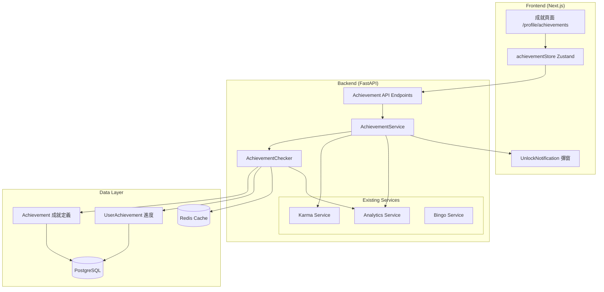
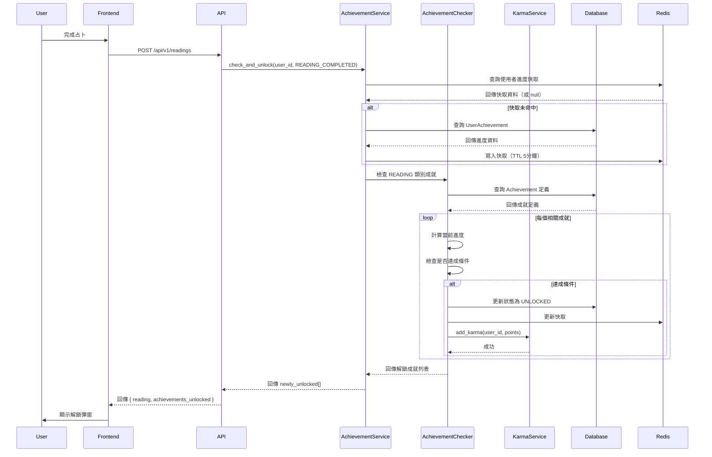
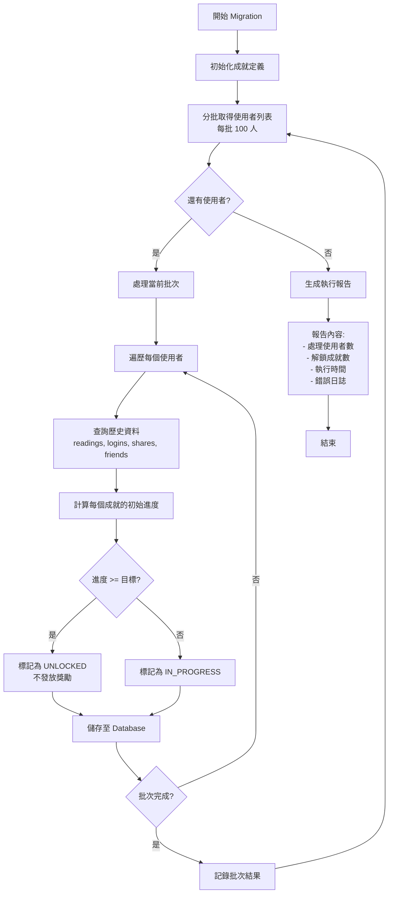
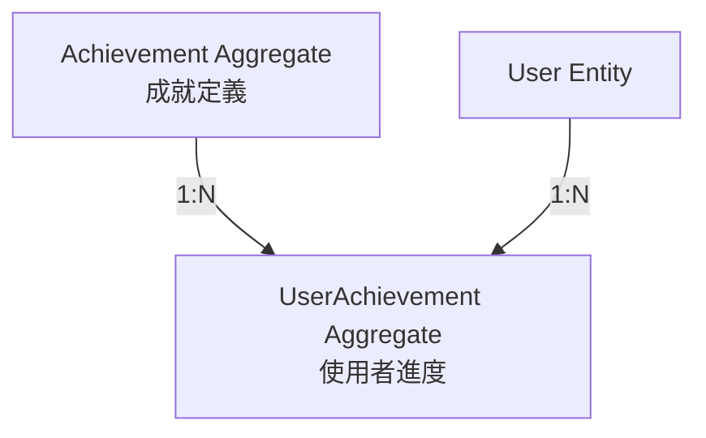
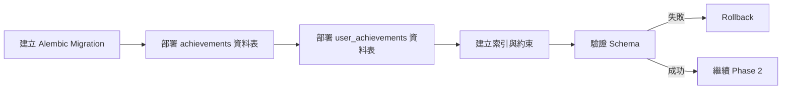
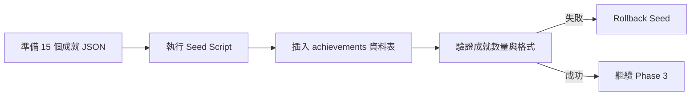
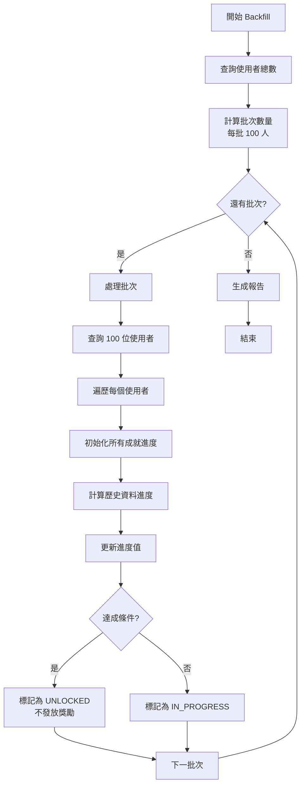
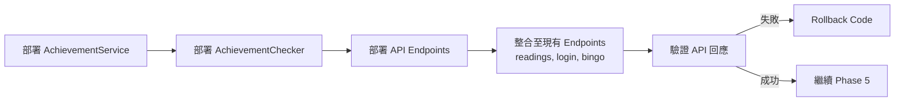
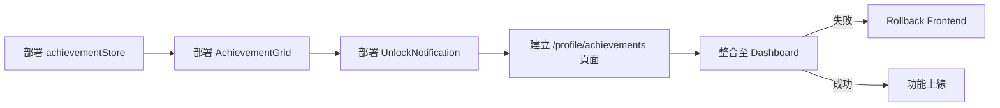

# 技術設計文件 - 成就系統

## Overview

成就系統為 Wasteland Tarot 平台提供遊戲化核心功能，透過追蹤使用者在占卜、社交、Bingo 遊戲及探索活動中的進度，並給予視覺化徽章、稱號和 Karma 獎勵，以提升使用者參與度與留存率。

**目的**: 本功能為平台使用者提供可見的進度回饋與成就感，透過里程碑式獎勵機制提升 15-20% 的使用者留存率。

**使用者**: 所有註冊使用者將透過成就系統追蹤其活動進度，新手使用者透過早期易達成的成就建立使用習慣，活躍使用者透過中期成就維持參與熱情，核心使用者透過高難度成就獲得長期目標。

**影響**: 成就系統將整合現有的 Karma、Bingo 和 Analytics 系統，新增成就定義與使用者進度追蹤機制，並在關鍵業務事件（占卜完成、登入、社交互動）時觸發成就檢查與獎勵發放。

### Goals

- 實作 15 個初始成就，涵蓋 5 大類別（占卜、社交、Bingo、Karma、探索）
- 提供即時進度追蹤與視覺化反饋（進度條、解鎖彈窗）
- 整合 Karma 系統進行獎勵發放，整合 Bingo 系統共用 UI 元件
- 達成 API 回應時間中位數 < 500ms，支援 1000+ 並發使用者
- 實現 80%+ 使用者首週解鎖率，提升 15-20% 留存率

### Non-Goals

- 動態成就生成系統（成就定義為靜態配置）
- 成就商店或成就點數兌換系統（未來擴展）
- 成就 NFT 化（未來考慮）
- 即時 WebSocket 推送（初期使用輪詢或事件回傳）
- 成就排行榜與社交分享（Phase 2 功能）

---

## Architecture

### 現有架構分析

**現有系統整合點**:

1. **Karma 系統** (`backend/app/services/karma_service.py`)
   - 使用 `KarmaRulesEngine` 計算 Karma 變化
   - 透過 `KarmaHistory` 記錄所有 Karma 變更
   - 支援多種變更原因（`KarmaChangeReason` enum）
   - 成就解鎖時將呼叫 Karma Service 新增點數

2. **Bingo 系統** (`backend/app/models/bingo.py`)
   - `UserBingoCard`: 使用者月度 Bingo 卡（5x5 grid）
   - `DailyBingoNumber`: 每日系統生成號碼
   - `BingoReward`: 獎勵發放記錄
   - 成就系統將追蹤 Bingo 相關活動（連線次數、連續簽到）

3. **Analytics 系統** (`backend/app/models/user_analytics.py`)
   - `UserAnalytics`: 追蹤使用者行為（占卜次數、分享次數、登入頻率）
   - 成就系統將從 Analytics 查詢聚合統計而非即時計算
   - 成就解鎖事件將記錄於 Analytics 供後續分析

**現有架構模式**:
- Service Layer 模式：業務邏輯封裝於 `*_service.py`
- Repository 模式：透過 SQLAlchemy ORM 存取資料
- Pydantic Schema 驗證：API 輸入輸出驗證
- Zustand 前端狀態管理：全域狀態儲存

**必須維護的整合點**:
- Karma Service 的 `add_karma()` 介面
- Analytics Service 的事件記錄機制
- Bingo Reward 的 UI 通知元件（`RewardNotification`）
- 現有資料表的外鍵關聯（`users`, `completed_readings`, `social_connections`）

### 高階架構



**架構整合說明**:

- **現有模式保留**: 遵循 Service Layer + Repository 模式
- **新增元件理由**:
  - `AchievementService`: 統一成就業務邏輯，避免邏輯散落各處
  - `AchievementChecker`: 專責成就解鎖條件檢查，支援多種觸發事件
  - Redis Cache: 快取使用者進度，減少資料庫查詢
- **技術棧對齊**: 使用現有的 FastAPI + SQLAlchemy + Pydantic
- **Steering 遵循**: 符合 `structure.md` 的 Service Layer 原則

### 技術對齊說明

本功能為**現有系統擴展**，遵循已建立的技術棧與架構模式：

**後端技術對齊**:
- FastAPI 框架：新增 `/api/v1/achievements` endpoint
- SQLAlchemy ORM：新增 `Achievement` 和 `UserAchievement` 模型
- Pydantic Schema：定義 `AchievementResponse`, `UserAchievementProgress` schema
- AsyncIO：所有資料庫操作使用 async/await
- Redis：新增進度快取層（使用現有 Redis 連線）

**前端技術對齊**:
- Next.js App Router：新增 `/profile/achievements` 頁面
- Zustand：新增 `achievementStore`（遵循 `authStore` 模式）
- Tailwind CSS v4：使用現有 Pip-Boy 配色（`#00ff88`, `#ff8800`）
- PixelIcon：使用 RemixIcon 圖示元件（避免 lucide-react）
- Cubic 11 字體：自動繼承全域字體設定

**新增依賴項**:
- 無新增外部依賴（使用現有技術棧）

### 關鍵設計決策

#### 決策 1: 成就定義儲存策略

**決策**: 成就定義儲存於 PostgreSQL 資料表，而非 JSON 配置檔

**背景**: 需要決定成就定義的儲存與管理方式，影響可維護性與擴展性

**備選方案**:
1. JSON 配置檔（如 `achievements.json`）
2. PostgreSQL 資料表（`achievements`）
3. Hardcoded 在程式碼中

**選擇方案**: PostgreSQL 資料表

**理由**:
- **動態管理**: 管理員可透過 Admin API 新增/修改成就，無需重新部署
- **查詢效能**: 可利用資料庫索引與 JOIN 查詢
- **版本追蹤**: `created_at`, `updated_at` 欄位追蹤變更歷史
- **關聯完整性**: 透過外鍵確保 `UserAchievement` 參照完整性

**取捨**:
- ✅ 獲得：動態管理能力、查詢效能、資料一致性
- ❌ 犧牲：需要資料庫 migration、略增程式碼複雜度（vs JSON 檔）

---

#### 決策 2: 進度追蹤與快取策略

**決策**: 使用者進度儲存於 PostgreSQL，並透過 Redis 快取熱資料

**背景**: 需要在查詢效能與資料一致性間取得平衡，避免頻繁資料庫查詢

**備選方案**:
1. 純資料庫儲存（無快取）
2. Redis 作為主要儲存（PostgreSQL 僅備份）
3. 混合策略（PostgreSQL + Redis cache）

**選擇方案**: 混合策略（PostgreSQL 主儲存 + Redis 快取）

**理由**:
- **資料持久性**: PostgreSQL 確保進度資料不會遺失
- **查詢效能**: Redis 快取減少 80%+ 資料庫查詢（目標 cache hit rate > 80%）
- **一致性**: 寫入時同步更新 PostgreSQL 和 Redis，讀取時優先查 Redis
- **降級策略**: Redis 失效時直接查詢 PostgreSQL

**實作細節**:
```python
# Cache key pattern
CACHE_KEY = f"achievement:progress:{user_id}"
CACHE_TTL = 300  # 5 分鐘

# Write strategy (Write-through)
async def update_progress(user_id, achievement_id, progress):
    # 1. Update PostgreSQL (source of truth)
    await db.commit()

    # 2. Update Redis cache
    await redis.set(cache_key, data, ex=CACHE_TTL)

# Read strategy (Cache-aside)
async def get_progress(user_id):
    # 1. Try Redis first
    cached = await redis.get(cache_key)
    if cached:
        return cached

    # 2. Fallback to PostgreSQL
    data = await db.query(UserAchievement).filter_by(user_id=user_id).all()

    # 3. Populate cache
    await redis.set(cache_key, data, ex=CACHE_TTL)
    return data
```

**取捨**:
- ✅ 獲得：高效能查詢、減少資料庫負載、良好擴展性
- ❌ 犧牲：需管理快取失效、略增架構複雜度

---

#### 決策 3: 成就檢查觸發機制

**決策**: 事件觸發式檢查（在關鍵 API endpoint 呼叫 `AchievementChecker`）

**背景**: 需要決定何時、如何觸發成就解鎖檢查

**備選方案**:
1. 事件觸發式（在 API endpoint 直接呼叫）
2. 訊息佇列（發送事件到 RabbitMQ/Redis Queue）
3. 定期批次檢查（cron job 每小時檢查）

**選擇方案**: 事件觸發式

**理由**:
- **即時性**: 使用者完成動作後立即檢查，5 秒內解鎖
- **簡化架構**: 無需引入訊息佇列（避免過度設計）
- **錯誤處理**: 同步呼叫易於處理錯誤與重試
- **效能可控**: 僅檢查相關類別成就（如占卜事件僅檢查 READING 類別）

**實作整合點**:
```python
# backend/app/api/v1/endpoints/readings.py
@router.post("/readings")
async def create_reading(
    reading_data: ReadingCreate,
    current_user: User = Depends(get_current_user),
    achievement_service: AchievementService = Depends()
):
    # 1. 建立占卜
    reading = await reading_service.create(reading_data)

    # 2. 觸發成就檢查（異步非阻塞）
    newly_unlocked = await achievement_service.check_and_unlock(
        current_user.id,
        AchievementEventType.READING_COMPLETED
    )

    # 3. 回傳占卜結果 + 解鎖成就
    return {
        "reading": reading,
        "achievements_unlocked": newly_unlocked
    }
```

**效能保護**:
- 超過 2 秒的檢查改為背景任務（FastAPI `BackgroundTasks`）
- 僅檢查與事件類型相關的成就（分類過濾）

**取捨**:
- ✅ 獲得：即時反饋、架構簡化、易於除錯
- ❌ 犧牲：API 回應時間略增（但透過優化控制在 <500ms）

---

## System Flows

### 成就解鎖流程（Sequence Diagram）



---

### 歷史資料回溯流程（Migration）



---

## Requirements Traceability

| 需求 | 需求摘要 | 實現元件 | 介面 | 流程 |
|------|---------|---------|------|------|
| 1.1-1.5 | 成就定義系統 | Achievement Model, AchievementService | GET /achievements | - |
| 2.1-2.6 | 進度追蹤 | UserAchievement Model, AchievementService, Redis Cache | GET /achievements/progress | - |
| 3.1-3.7 | 解鎖邏輯觸發 | AchievementChecker, Event Integration | check_and_unlock() | 成就解鎖流程圖 |
| 4.1-4.6 | 獎勵發放 | AchievementService, KarmaService | POST /achievements/{id}/claim | - |
| 5.1-5.7 | 前端 UI 展示 | AchievementGrid, UnlockNotification, achievementStore | Frontend Components | - |
| 6.1-6.6 | 歷史資料回溯 | Migration Script | backfill_achievements.py | 歷史資料回溯流程圖 |
| 7.1-7.7 | 效能與擴展性 | Redis Cache, Event Filtering | - | - |
| 8.1-8.6 | 系統整合 | KarmaService, AnalyticsService, BingoService | Existing APIs | - |
| 9.1-9.6 | 資料一致性 | Transaction Management, Error Handling | - | - |
| 10.1-10.7 | 設計與無障礙 | Pip-Boy UI, ARIA Labels, PixelIcon | Frontend Components | - |

---

## Components and Interfaces

### Backend Domain

#### AchievementService

**職責與邊界**

- **主要職責**: 協調成就系統的所有業務邏輯，包含查詢、檢查、解鎖和獎勵發放
- **領域邊界**: Achievement 領域的唯一入口，其他服務透過此 Service 存取成就功能
- **資料擁有權**: 管理 `Achievement` 和 `UserAchievement` 的 CRUD 操作
- **事務邊界**: 成就解鎖與獎勵發放在同一事務中完成，確保一致性

**依賴關係**

- **Inbound**: API Endpoints (`/api/v1/achievements`)
- **Outbound**: `AchievementChecker`, `KarmaService`, `AnalyticsService`, Database, Redis
- **External**: 無

**Contract Definition - Service Interface**

```typescript
interface AchievementService {
  // 查詢所有成就定義
  list_achievements(
    category?: AchievementCategory,
    include_hidden?: boolean
  ): Promise<Achievement[]>;

  // 查詢使用者成就進度
  get_user_progress(
    user_id: UUID
  ): Promise<Record<string, UserAchievementProgress>>;

  // 檢查並解鎖成就
  check_and_unlock(
    user_id: UUID,
    event_type: AchievementEventType
  ): Promise<Achievement[]>;

  // 領取成就獎勵
  claim_reward(
    user_id: UUID,
    achievement_code: string
  ): Promise<RewardResult>;
}
```

**前置條件**:
- `user_id` 必須為有效的已註冊使用者
- `event_type` 必須為定義的事件類型 enum

**後置條件**:
- 成就解鎖後狀態為 `UNLOCKED`，`unlocked_at` 記錄時間戳記
- 獎勵發放後 Karma 點數已增加，Analytics 已記錄事件

**不變量**:
- 使用者進度只增不減
- 已解鎖的成就不會回復為未解鎖

---

#### AchievementChecker

**職責與邊界**

- **主要職責**: 檢查成就解鎖條件，計算使用者進度，判斷是否達成目標
- **領域邊界**: 純邏輯元件，不直接存取資料庫（透過 Service 提供的資料）
- **資料擁有權**: 無資料擁有權，僅處理傳入的資料
- **事務邊界**: 無事務管理，由 AchievementService 負責

**依賴關係**

- **Inbound**: `AchievementService`
- **Outbound**: `AnalyticsService` (查詢統計資料)
- **External**: 無

**Contract Definition - Service Interface**

```typescript
interface AchievementChecker {
  // 檢查單一成就條件
  check_achievement(
    user_id: UUID,
    achievement: Achievement,
    user_data: UserActivityData
  ): Promise<AchievementCheckResult>;

  // 批次檢查多個成就
  check_achievements_batch(
    user_id: UUID,
    achievements: Achievement[],
    user_data: UserActivityData
  ): Promise<AchievementCheckResult[]>;

  // 計算成就進度
  calculate_progress(
    user_id: UUID,
    achievement: Achievement
  ): Promise<number>;
}
```

**檢查邏輯範例**:

```python
# 成就條件 JSON 格式
{
  "type": "reading_count",
  "target": 10,
  "additional_filters": {
    "spread_type": "celtic_cross"  # 選填
  }
}

# 檢查邏輯
async def check_achievement(user_id, achievement, user_data):
    criteria = achievement.criteria

    if criteria["type"] == "reading_count":
        # 從 Analytics 查詢占卜次數
        count = await analytics_service.get_reading_count(
            user_id,
            filters=criteria.get("additional_filters")
        )

        return {
            "current_progress": count,
            "target_progress": criteria["target"],
            "is_unlocked": count >= criteria["target"]
        }
```

---

### API Layer

#### Achievement API Endpoints

**API Contract**

| Method | Endpoint | Request | Response | Errors |
|--------|----------|---------|----------|--------|
| GET | /api/v1/achievements | Query: `category`, `include_hidden` | `Achievement[]` | 500 |
| GET | /api/v1/achievements/progress | - | `UserAchievementProgressMap` | 401, 500 |
| POST | /api/v1/achievements/{code}/claim | - | `RewardResult` | 400, 404, 409, 500 |

**Detailed Schemas**

```typescript
// GET /api/v1/achievements
interface Achievement {
  id: UUID;
  code: string;
  name_zh_tw: string;
  description_zh_tw: string;
  category: "READING" | "SOCIAL" | "BINGO" | "KARMA" | "EXPLORATION";
  icon: string;  // RemixIcon name
  criteria: {
    type: string;
    target: number;
    additional_filters?: Record<string, any>;
  };
  rewards: {
    karma?: number;
    title?: string;
  };
  rarity: "COMMON" | "RARE" | "EPIC" | "LEGENDARY";
  is_hidden: boolean;
  sort_order: number;
}

// GET /api/v1/achievements/progress
interface UserAchievementProgressMap {
  [achievement_code: string]: {
    current_progress: number;
    target_progress: number;
    status: "IN_PROGRESS" | "UNLOCKED" | "CLAIMED";
    unlocked_at?: string;  // ISO 8601
    claimed_at?: string;   // ISO 8601
  };
}

// POST /api/v1/achievements/{code}/claim
interface RewardResult {
  achievement_code: string;
  rewards_granted: {
    karma_points?: number;
    title?: string;
  };
  claimed_at: string;  // ISO 8601
}
```

**錯誤回應**

```typescript
// 400 Bad Request - 成就已領取
{
  "detail": "此成就獎勵已領取",
  "achievement_code": "wasteland_newbie"
}

// 404 Not Found - 成就不存在
{
  "detail": "成就不存在",
  "achievement_code": "invalid_code"
}

// 409 Conflict - 成就尚未解鎖
{
  "detail": "成就尚未解鎖，無法領取獎勵",
  "current_progress": 7,
  "target_progress": 10
}
```

---

### Frontend Domain

#### achievementStore (Zustand)

**State Management**

```typescript
interface AchievementStore {
  // State
  achievements: Achievement[];
  userProgress: Record<string, UserAchievementProgress>;
  newlyUnlocked: Achievement[];
  isLoading: boolean;
  error: string | null;

  // Actions
  fetchAchievements: () => Promise<void>;
  fetchProgress: () => Promise<void>;
  claimReward: (code: string) => Promise<void>;
  dismissUnlocked: (code: string) => void;

  // Selectors
  getAchievementsByCategory: (category: string) => Achievement[];
  getUnlockedCount: () => number;
  getProgressPercentage: (code: string) => number;
}
```

**實作範例**:

```typescript
import { create } from 'zustand';
import { persist } from 'zustand/middleware';

export const useAchievementStore = create<AchievementStore>()(
  persist(
    (set, get) => ({
      achievements: [],
      userProgress: {},
      newlyUnlocked: [],
      isLoading: false,
      error: null,

      fetchAchievements: async () => {
        set({ isLoading: true, error: null });
        try {
          const response = await fetch('/api/v1/achievements');
          const data = await response.json();
          set({ achievements: data, isLoading: false });
        } catch (error) {
          set({ error: error.message, isLoading: false });
        }
      },

      fetchProgress: async () => {
        const response = await fetch('/api/v1/achievements/progress');
        const data = await response.json();
        set({ userProgress: data });
      },

      claimReward: async (code: string) => {
        const response = await fetch(`/api/v1/achievements/${code}/claim`, {
          method: 'POST'
        });

        if (!response.ok) {
          throw new Error('領取失敗');
        }

        // 更新進度狀態
        set(state => ({
          userProgress: {
            ...state.userProgress,
            [code]: {
              ...state.userProgress[code],
              status: 'CLAIMED',
              claimed_at: new Date().toISOString()
            }
          }
        }));
      },

      dismissUnlocked: (code: string) => {
        set(state => ({
          newlyUnlocked: state.newlyUnlocked.filter(a => a.code !== code)
        }));
      },

      getAchievementsByCategory: (category: string) => {
        return get().achievements.filter(a => a.category === category);
      },

      getUnlockedCount: () => {
        return Object.values(get().userProgress).filter(
          p => p.status !== 'IN_PROGRESS'
        ).length;
      },

      getProgressPercentage: (code: string) => {
        const progress = get().userProgress[code];
        if (!progress) return 0;
        return Math.min((progress.current_progress / progress.target_progress) * 100, 100);
      }
    }),
    {
      name: 'achievement-storage',
      partiallyPersist: ['achievements', 'userProgress']  // 快取成就定義與進度
    }
  )
);
```

---

#### AchievementGrid Component

**Responsibility**: 顯示成就卡片網格，支援分類篩選與搜尋

**Props Interface**:

```typescript
interface AchievementGridProps {
  category?: AchievementCategory;
  searchQuery?: string;
  sortBy?: 'rarity' | 'progress' | 'unlock_date';
}
```

**Component Structure**:

```tsx
'use client';

import { useAchievementStore } from '@/lib/achievementStore';
import { AchievementCard } from './AchievementCard';
import { PixelIcon } from '@/components/ui/icons';

export function AchievementGrid({ category, searchQuery, sortBy }: AchievementGridProps) {
  const achievements = useAchievementStore(state => state.achievements);
  const userProgress = useAchievementStore(state => state.userProgress);

  // 篩選與排序邏輯
  const filteredAchievements = achievements
    .filter(a => !category || a.category === category)
    .filter(a => !searchQuery || a.name_zh_tw.includes(searchQuery))
    .sort((a, b) => {
      // 排序邏輯
    });

  return (
    <div className="grid grid-cols-1 md:grid-cols-2 lg:grid-cols-3 gap-4">
      {filteredAchievements.map(achievement => (
        <AchievementCard
          key={achievement.code}
          achievement={achievement}
          progress={userProgress[achievement.code]}
        />
      ))}
    </div>
  );
}
```

---

#### UnlockNotification Component

**Responsibility**: 顯示成就解鎖彈窗，Fallout Pip-Boy 風格

**Props Interface**:

```typescript
interface UnlockNotificationProps {
  achievement: Achievement;
  onClaim: () => void;
  onDismiss: () => void;
}
```

**視覺設計**:

```tsx
export function UnlockNotification({ achievement, onClaim, onDismiss }: UnlockNotificationProps) {
  return (
    <motion.div
      initial={{ opacity: 0, scale: 0.8 }}
      animate={{ opacity: 1, scale: 1 }}
      exit={{ opacity: 0, scale: 0.8 }}
      className="fixed inset-0 z-50 flex items-center justify-center bg-black/80"
      role="dialog"
      aria-labelledby="achievement-title"
      aria-describedby="achievement-description"
    >
      <div className="bg-gray-900 border-4 border-pip-boy-green p-8 max-w-md w-full">
        {/* 標題 */}
        <h2 className="text-2xl font-bold text-pip-boy-green text-center mb-4">
          [!] 成就解鎖 [!]
        </h2>

        {/* 圖示（發光動畫）*/}
        <div className="flex justify-center mb-6">
          <PixelIcon
            name={achievement.icon}
            sizePreset="xl"
            variant="primary"
            animation="pulse"
            className="glow-effect"
          />
        </div>

        {/* 成就名稱與描述 */}
        <h3 id="achievement-title" className="text-xl text-white text-center mb-2">
          {achievement.name_zh_tw}
        </h3>
        <p id="achievement-description" className="text-gray-400 text-center mb-6">
          {achievement.description_zh_tw}
        </p>

        {/* 獎勵資訊 */}
        <div className="bg-black/50 p-4 mb-6">
          <p className="text-pip-boy-green text-center">
            {achievement.rewards.karma && `Karma +${achievement.rewards.karma}`}
            {achievement.rewards.title && ` | 稱號：${achievement.rewards.title}`}
          </p>
        </div>

        {/* 按鈕 */}
        <div className="flex gap-4">
          <button
            onClick={onClaim}
            className="flex-1 bg-pip-boy-green text-black py-2 px-4 font-bold hover:bg-green-400"
          >
            領取獎勵
          </button>
          <button
            onClick={onDismiss}
            className="flex-1 border-2 border-gray-600 text-gray-400 py-2 px-4 hover:border-gray-400"
          >
            稍後查看
          </button>
        </div>
      </div>
    </motion.div>
  );
}
```

**無障礙屬性**:
- `role="dialog"`: 標示為對話框
- `aria-labelledby`: 連結標題
- `aria-describedby`: 連結描述
- 鍵盤焦點陷阱（Tab 循環於按鈕間）
- Esc 鍵關閉

---

## Data Models

### Domain Model

**Core Aggregates**:



**Entities**:

1. **Achievement** (成就定義)
   - 唯一識別：`code` (string, unique)
   - 生命週期：由系統或管理員建立，使用者無法修改
   - 行為：定義解鎖條件、獎勵內容

2. **UserAchievement** (使用者成就進度)
   - 唯一識別：`(user_id, achievement_id)` 組合
   - 生命週期：使用者註冊時初始化，進度持續更新直到解鎖
   - 行為：追蹤進度、解鎖、領取獎勵

**Value Objects**:

- `AchievementCriteria`: 解鎖條件（immutable）
- `AchievementRewards`: 獎勵內容（immutable）
- `AchievementCategory`: 類別 enum
- `AchievementRarity`: 稀有度 enum
- `UserAchievementStatus`: 狀態 enum

**Domain Events**:

- `AchievementUnlocked`: 成就解鎖時觸發
- `RewardClaimed`: 獎勵領取時觸發
- `ProgressUpdated`: 進度更新時觸發（可選，用於 Analytics）

**Business Rules & Invariants**:

1. 成就定義一旦建立，`code` 不可修改
2. 使用者進度只增不減（`current_progress` 單調遞增）
3. 成就狀態流轉：`IN_PROGRESS` → `UNLOCKED` → `CLAIMED`（單向）
4. 隱藏成就在解鎖前不得向前端回傳
5. 成就條件 JSON 必須包含 `type` 和 `target` 欄位

---

### Physical Data Model

#### Achievement Table

```sql
CREATE TABLE achievements (
    id UUID PRIMARY KEY DEFAULT gen_random_uuid(),
    code VARCHAR(100) UNIQUE NOT NULL,
    name_zh_tw VARCHAR(200) NOT NULL,
    description_zh_tw TEXT NOT NULL,
    category VARCHAR(50) NOT NULL,  -- READING, SOCIAL, BINGO, KARMA, EXPLORATION
    icon VARCHAR(100) NOT NULL,     -- RemixIcon name
    criteria JSONB NOT NULL,
    rewards JSONB NOT NULL,
    rarity VARCHAR(50) NOT NULL,    -- COMMON, RARE, EPIC, LEGENDARY
    is_hidden BOOLEAN DEFAULT FALSE,
    sort_order INTEGER DEFAULT 0,
    created_at TIMESTAMP DEFAULT NOW(),
    updated_at TIMESTAMP DEFAULT NOW(),

    CONSTRAINT chk_category CHECK (category IN ('READING', 'SOCIAL', 'BINGO', 'KARMA', 'EXPLORATION')),
    CONSTRAINT chk_rarity CHECK (rarity IN ('COMMON', 'RARE', 'EPIC', 'LEGENDARY')),
    CONSTRAINT chk_criteria_required CHECK (criteria ? 'type' AND criteria ? 'target')
);

-- Indexes
CREATE INDEX idx_achievements_category ON achievements(category);
CREATE INDEX idx_achievements_rarity ON achievements(rarity);
CREATE INDEX idx_achievements_sort_order ON achievements(sort_order);
CREATE INDEX idx_achievements_hidden ON achievements(is_hidden) WHERE is_hidden = FALSE;
```

**Criteria JSON Schema**:

```json
{
  "type": "reading_count",           // 必填：條件類型
  "target": 10,                       // 必填：目標數值
  "additional_filters": {             // 選填：額外篩選
    "spread_type": "celtic_cross"
  }
}
```

**Rewards JSON Schema**:

```json
{
  "karma": 10,           // 選填：Karma 點數
  "title": "廢土新手"    // 選填：稱號
}
```

---

#### UserAchievement Table

```sql
CREATE TABLE user_achievements (
    id UUID PRIMARY KEY DEFAULT gen_random_uuid(),
    user_id UUID NOT NULL REFERENCES users(id) ON DELETE CASCADE,
    achievement_id UUID NOT NULL REFERENCES achievements(id) ON DELETE CASCADE,
    current_progress INTEGER DEFAULT 0,
    target_progress INTEGER NOT NULL,
    status VARCHAR(50) DEFAULT 'IN_PROGRESS',  -- IN_PROGRESS, UNLOCKED, CLAIMED
    unlocked_at TIMESTAMP NULL,
    claimed_at TIMESTAMP NULL,
    created_at TIMESTAMP DEFAULT NOW(),
    updated_at TIMESTAMP DEFAULT NOW(),

    CONSTRAINT uq_user_achievement UNIQUE (user_id, achievement_id),
    CONSTRAINT chk_progress_positive CHECK (current_progress >= 0),
    CONSTRAINT chk_status CHECK (status IN ('IN_PROGRESS', 'UNLOCKED', 'CLAIMED')),
    CONSTRAINT chk_unlock_sequence CHECK (
        (status = 'IN_PROGRESS' AND unlocked_at IS NULL AND claimed_at IS NULL) OR
        (status = 'UNLOCKED' AND unlocked_at IS NOT NULL AND claimed_at IS NULL) OR
        (status = 'CLAIMED' AND unlocked_at IS NOT NULL AND claimed_at IS NOT NULL)
    )
);

-- Indexes
CREATE INDEX idx_user_achievements_user_id ON user_achievements(user_id);
CREATE INDEX idx_user_achievements_status ON user_achievements(status);
CREATE INDEX idx_user_achievements_unlocked_at ON user_achievements(unlocked_at) WHERE unlocked_at IS NOT NULL;
CREATE INDEX idx_user_achievements_user_status ON user_achievements(user_id, status);
```

**Partitioning Strategy** (未來擴展):
```sql
-- 若使用者數量超過 100 萬，可考慮按 user_id hash 分區
CREATE TABLE user_achievements PARTITION BY HASH (user_id);
```

---

### Data Contracts & Integration

#### API Data Transfer Objects

**AchievementResponse** (Pydantic Schema):

```python
from pydantic import BaseModel, Field
from typing import Optional, Dict, Any
from datetime import datetime
from enum import Enum

class AchievementCategory(str, Enum):
    READING = "READING"
    SOCIAL = "SOCIAL"
    BINGO = "BINGO"
    KARMA = "KARMA"
    EXPLORATION = "EXPLORATION"

class AchievementRarity(str, Enum):
    COMMON = "COMMON"
    RARE = "RARE"
    EPIC = "EPIC"
    LEGENDARY = "LEGENDARY"

class AchievementResponse(BaseModel):
    id: str
    code: str
    name_zh_tw: str
    description_zh_tw: str
    category: AchievementCategory
    icon: str
    criteria: Dict[str, Any]
    rewards: Dict[str, Any]
    rarity: AchievementRarity
    is_hidden: bool
    sort_order: int

    class Config:
        from_attributes = True
```

**UserAchievementProgressResponse**:

```python
class UserAchievementStatus(str, Enum):
    IN_PROGRESS = "IN_PROGRESS"
    UNLOCKED = "UNLOCKED"
    CLAIMED = "CLAIMED"

class UserAchievementProgressResponse(BaseModel):
    achievement_code: str
    current_progress: int
    target_progress: int
    status: UserAchievementStatus
    unlocked_at: Optional[datetime] = None
    claimed_at: Optional[datetime] = None
    progress_percentage: float = Field(ge=0, le=100)

    @property
    def is_complete(self) -> bool:
        return self.status in [UserAchievementStatus.UNLOCKED, UserAchievementStatus.CLAIMED]
```

---

## Error Handling

### Error Strategy

成就系統採用**分層錯誤處理**策略：

1. **資料驗證層**：Pydantic schema 驗證輸入
2. **業務邏輯層**：Service 層拋出自訂 Exception
3. **持久化層**：資料庫約束檢查
4. **API 層**：FastAPI exception handler 統一回應格式

### Error Categories and Responses

#### User Errors (4xx)

**400 Bad Request - 成就已領取**
```python
class AchievementAlreadyClaimedError(Exception):
    """成就獎勵已領取"""
    pass

# Handler
@app.exception_handler(AchievementAlreadyClaimedError)
async def achievement_claimed_handler(request, exc):
    return JSONResponse(
        status_code=400,
        content={
            "detail": "此成就獎勵已領取",
            "error_code": "ACHIEVEMENT_ALREADY_CLAIMED"
        }
    )
```

**404 Not Found - 成就不存在**
```python
class AchievementNotFoundError(Exception):
    """成就不存在"""
    pass
```

**409 Conflict - 成就尚未解鎖**
```python
class AchievementNotUnlockedError(Exception):
    """成就尚未解鎖，無法領取獎勵"""
    def __init__(self, current: int, target: int):
        self.current = current
        self.target = target
```

#### System Errors (5xx)

**500 Internal Server Error - Karma Service 失敗**
```python
# 獎勵發放失敗處理
try:
    await karma_service.add_karma(user_id, karma_points)
except Exception as e:
    # 記錄錯誤，標記獎勵為 PENDING
    logger.error(f"Failed to grant karma reward: {e}")

    # 不阻塞解鎖流程，稍後重試
    await achievement_repo.mark_reward_pending(user_id, achievement_id)

    # 回傳部分成功狀態
    return {
        "unlocked": True,
        "reward_status": "PENDING",
        "retry_scheduled": True
    }
```

**503 Service Unavailable - Redis 連線失敗**
```python
# Redis 降級策略
try:
    progress = await redis.get(cache_key)
except RedisConnectionError:
    logger.warning("Redis unavailable, falling back to PostgreSQL")
    progress = await db.query(UserAchievement).filter_by(user_id=user_id).all()
```

#### Business Logic Errors (422)

**422 Unprocessable Entity - 進度回溯錯誤**
```python
class ProgressCannotDecrease(Exception):
    """使用者進度不可回溯減少"""
    pass
```

### Monitoring

**錯誤追蹤與日誌**:

```python
import logging
from app.core.logger import get_logger

logger = get_logger(__name__)

# 結構化日誌
logger.error(
    "Achievement unlock failed",
    extra={
        "user_id": user_id,
        "achievement_code": achievement_code,
        "error_type": type(e).__name__,
        "error_message": str(e),
        "stack_trace": traceback.format_exc()
    }
)
```

**Metrics 監控**:

- 成就檢查執行時間（P50, P95, P99）
- 成就解鎖失敗率
- Redis cache 命中率
- Karma Service 呼叫成功率
- API endpoint 錯誤率（4xx, 5xx）

---

## Testing Strategy

### Unit Tests

**AchievementService Tests** (10 項):

1. `test_list_achievements_filter_by_category`: 驗證分類篩選功能
2. `test_list_achievements_exclude_hidden_for_non_admin`: 驗證隱藏成就過濾
3. `test_get_user_progress_cache_hit`: 驗證 Redis cache 命中
4. `test_get_user_progress_cache_miss_fallback`: 驗證 cache miss 降級至 PostgreSQL
5. `test_check_and_unlock_reading_achievement`: 驗證占卜類成就解鎖
6. `test_check_and_unlock_batch_multiple_achievements`: 驗證批次解鎖多個成就
7. `test_claim_reward_success`: 驗證成功領取獎勵
8. `test_claim_reward_already_claimed_error`: 驗證重複領取錯誤
9. `test_claim_reward_not_unlocked_error`: 驗證未解鎖無法領取
10. `test_karma_grant_failure_marks_pending`: 驗證 Karma Service 失敗時標記為 PENDING

**AchievementChecker Tests** (8 項):

1. `test_calculate_progress_reading_count`: 驗證占卜次數計算
2. `test_calculate_progress_with_filters`: 驗證帶篩選條件的進度計算
3. `test_check_achievement_unlocked`: 驗證達成條件時解鎖
4. `test_check_achievement_in_progress`: 驗證未達成條件時保持進行中
5. `test_check_hidden_achievement_unlock`: 驗證隱藏成就解鎖
6. `test_check_streak_achievement`: 驗證連續簽到成就
7. `test_check_karma_threshold_achievement`: 驗證 Karma 門檻成就
8. `test_event_type_filtering`: 驗證事件類型篩選（僅檢查相關成就）

### Integration Tests

**Achievement Flow Tests** (7 項):

1. `test_user_registration_initializes_achievements`: 驗證註冊時初始化成就進度
2. `test_reading_completion_triggers_achievement_check`: 驗證占卜完成觸發檢查
3. `test_login_triggers_streak_achievement_check`: 驗證登入觸發連續簽到檢查
4. `test_unlock_achievement_grants_karma`: 驗證解鎖時 Karma Service 整合
5. `test_unlock_achievement_records_analytics_event`: 驗證解鎖時 Analytics 記錄
6. `test_migration_script_backfills_progress`: 驗證 migration script 正確計算歷史進度
7. `test_concurrent_progress_updates_consistency`: 驗證並發更新時資料一致性

### E2E Tests (Frontend + Backend)

**User Journey Tests** (5 項):

1. `test_view_achievements_page`: 驗證成就頁面顯示所有成就與進度
2. `test_unlock_achievement_shows_notification`: 驗證解鎖後彈窗顯示
3. `test_claim_reward_updates_ui`: 驗證領取獎勵後 UI 更新
4. `test_filter_achievements_by_category`: 驗證分類篩選功能
5. `test_achievement_unlocked_in_reading_flow`: 完整流程測試（註冊 → 占卜 → 解鎖 → 領取）

### Performance Tests

**Load Tests** (4 項):

1. `test_1000_concurrent_achievement_checks`: 1000 並發成就檢查，P95 < 1秒
2. `test_redis_cache_hit_rate_above_80_percent`: 驗證 cache 命中率 > 80%
3. `test_api_response_time_p95_below_500ms`: 驗證 API P95 回應時間 < 500ms
4. `test_migration_script_handles_10k_users`: 驗證 migration script 處理 10,000 使用者

---

## Performance & Scalability

### Target Metrics

- **API 回應時間**: P50 < 200ms, P95 < 500ms, P99 < 1s
- **成就檢查邏輯**: < 2 秒（超過則異步處理）
- **並發支援**: 1000+ 同時進行成就檢查
- **Redis Cache 命中率**: > 80%
- **資料庫查詢**: 單一查詢 < 100ms

### Scaling Approaches

**水平擴展 (Horizontal Scaling)**:

1. **API Layer**: FastAPI 無狀態，可透過 Load Balancer 水平擴展
2. **Redis Cluster**: 進度快取分散至多個 Redis 節點（hash-based sharding）
3. **Database Read Replicas**: 進度查詢使用 Read Replica，減輕主資料庫負載

**垂直擴展 (Vertical Scaling)**:

1. **Database**: 提升 PostgreSQL 資源（CPU, Memory）處理複雜查詢
2. **Redis**: 增加記憶體容量儲存更多快取資料

### Caching Strategies

**Multi-Layer Cache**:

```
User Request
    ↓
[1] Zustand Store (Frontend)  ← 快取 5 分鐘
    ↓ (cache miss)
[2] Redis Cache (Backend)     ← 快取 5 分鐘
    ↓ (cache miss)
[3] PostgreSQL (Database)     ← Source of Truth
```

**Cache Invalidation**:

- **Write-through**: 更新進度時同步寫入 PostgreSQL 和 Redis
- **TTL-based**: Redis 快取 5 分鐘後自動過期
- **Event-based**: 成就解鎖時主動清除相關快取

**Cache Key Design**:

```
achievement:progress:{user_id}          # 使用者所有進度
achievement:unlocked:{user_id}          # 使用者已解鎖成就
achievement:definitions:all             # 所有成就定義（全域快取）
achievement:definitions:category:{cat}  # 分類成就定義
```

### Optimization Techniques

**Query Optimization**:

1. 使用複合索引加速查詢：`(user_id, status)`
2. 僅查詢必要欄位（避免 `SELECT *`）
3. 使用 `EXPLAIN ANALYZE` 分析慢查詢

**Event Filtering**:

```python
# 僅檢查與事件類型相關的成就
EVENT_TYPE_TO_CATEGORY = {
    AchievementEventType.READING_COMPLETED: [AchievementCategory.READING],
    AchievementEventType.LOGIN: [AchievementCategory.BINGO, AchievementCategory.EXPLORATION],
    AchievementEventType.FRIEND_ADDED: [AchievementCategory.SOCIAL],
    AchievementEventType.BINGO_MATCHED: [AchievementCategory.BINGO],
}

async def check_and_unlock(user_id, event_type):
    categories = EVENT_TYPE_TO_CATEGORY.get(event_type, [])
    achievements = await get_achievements_by_categories(categories)  # 減少查詢範圍
```

**Background Task Processing**:

```python
from fastapi import BackgroundTasks

@router.post("/readings")
async def create_reading(
    reading_data: ReadingCreate,
    background_tasks: BackgroundTasks,
    achievement_service: AchievementService = Depends()
):
    reading = await reading_service.create(reading_data)

    # 成就檢查超過 2 秒則背景處理
    background_tasks.add_task(
        achievement_service.check_and_unlock,
        current_user.id,
        AchievementEventType.READING_COMPLETED
    )

    return {"reading": reading}
```

---

## Migration Strategy

### Phase 1: 資料庫 Schema 部署



**Rollback Trigger**: Schema 驗證失敗、約束衝突

**Validation Checkpoint**:
```sql
-- 驗證資料表是否建立成功
SELECT table_name FROM information_schema.tables
WHERE table_name IN ('achievements', 'user_achievements');

-- 驗證約束是否生效
SELECT constraint_name, constraint_type FROM information_schema.table_constraints
WHERE table_name = 'user_achievements';
```

---

### Phase 2: 成就定義資料種子 (Seed Data)



**Seed Script 範例**:

```python
# backend/app/db/seed_achievements.py
async def seed_achievements():
    achievements = [
        {
            "code": "wasteland_newbie",
            "name_zh_tw": "廢土新手",
            "description_zh_tw": "完成第一次占卜",
            "category": "READING",
            "icon": "book-open",
            "criteria": {"type": "reading_count", "target": 1},
            "rewards": {"karma": 5},
            "rarity": "COMMON",
            "is_hidden": False,
            "sort_order": 1
        },
        # ... 其他 14 個成就
    ]

    for achievement in achievements:
        await db.execute(insert(Achievement).values(**achievement))

    await db.commit()
```

**Rollback**: `DELETE FROM achievements;`

**Validation**:
```sql
SELECT COUNT(*) FROM achievements;  -- 應為 15
SELECT code FROM achievements WHERE criteria IS NULL;  -- 應為空
```

---

### Phase 3: 歷史資料回溯 (Backfill)



**Backfill Script**:

```python
# backend/scripts/backfill_achievements.py
import asyncio
from app.db.database import AsyncSessionLocal
from app.models.user import User
from app.models.achievement import Achievement, UserAchievement
from app.services.analytics_service import AnalyticsService

async def backfill_user_achievements():
    batch_size = 100
    total_users = 0
    total_unlocked = 0
    errors = []

    async with AsyncSessionLocal() as db:
        # 查詢所有使用者
        users = await db.execute(select(User))
        users = users.scalars().all()
        total_users = len(users)

        # 查詢所有成就定義
        achievements = await db.execute(select(Achievement))
        achievements = achievements.scalars().all()

        # 分批處理
        for i in range(0, total_users, batch_size):
            batch = users[i:i+batch_size]

            for user in batch:
                try:
                    for achievement in achievements:
                        # 計算歷史進度
                        progress = await calculate_historical_progress(
                            user.id,
                            achievement,
                            db
                        )

                        # 建立 UserAchievement 記錄
                        user_achievement = UserAchievement(
                            user_id=user.id,
                            achievement_id=achievement.id,
                            current_progress=progress,
                            target_progress=achievement.criteria["target"],
                            status="UNLOCKED" if progress >= achievement.criteria["target"] else "IN_PROGRESS",
                            unlocked_at=datetime.now() if progress >= achievement.criteria["target"] else None
                        )

                        db.add(user_achievement)

                        if user_achievement.status == "UNLOCKED":
                            total_unlocked += 1

                except Exception as e:
                    errors.append({"user_id": user.id, "error": str(e)})

            await db.commit()
            print(f"Processed batch {i//batch_size + 1}/{(total_users + batch_size - 1)//batch_size}")

    # 生成報告
    print(f"""
    Backfill Report:
    - Total users processed: {total_users}
    - Total achievements unlocked: {total_unlocked}
    - Errors: {len(errors)}
    """)

    if errors:
        print("Error details:")
        for error in errors:
            print(f"  User {error['user_id']}: {error['error']}")

async def calculate_historical_progress(user_id, achievement, db):
    """計算使用者歷史進度"""
    criteria = achievement.criteria

    if criteria["type"] == "reading_count":
        result = await db.execute(
            select(func.count(CompletedReading.id))
            .where(CompletedReading.user_id == user_id)
        )
        return result.scalar() or 0

    elif criteria["type"] == "share_count":
        result = await db.execute(
            select(func.count(SharedReading.id))
            .where(SharedReading.user_id == user_id)
        )
        return result.scalar() or 0

    # ... 其他條件類型

    return 0

if __name__ == "__main__":
    asyncio.run(backfill_user_achievements())
```

**Rollback**: `DELETE FROM user_achievements;`

**Validation**:
```sql
-- 驗證每個使用者都有進度記錄
SELECT u.id FROM users u
LEFT JOIN user_achievements ua ON u.id = ua.user_id
WHERE ua.id IS NULL;  -- 應為空

-- 驗證解鎖數量合理
SELECT status, COUNT(*) FROM user_achievements GROUP BY status;
```

---

### Phase 4: 後端 API 部署



**Rollback**: Git revert to previous commit

**Validation**:
```bash
# 測試 API endpoints
curl -X GET http://localhost:8000/api/v1/achievements
curl -X GET http://localhost:8000/api/v1/achievements/progress \
  -H "Authorization: Bearer $TOKEN"
```

---

### Phase 5: 前端 UI 部署



**Rollback**: Git revert + redeploy

**Validation**: E2E 測試驗證完整流程

---

### Phase 6: 監控與調整

- 監控 API 回應時間（目標 P95 < 500ms）
- 監控 Redis cache 命中率（目標 > 80%）
- 監控成就解鎖率（目標首週 80%+ 使用者解鎖至少 1 個）
- 收集使用者反饋調整成就難度

---

*本技術設計文件將在 Tasks 階段轉化為可執行的實作計畫*
