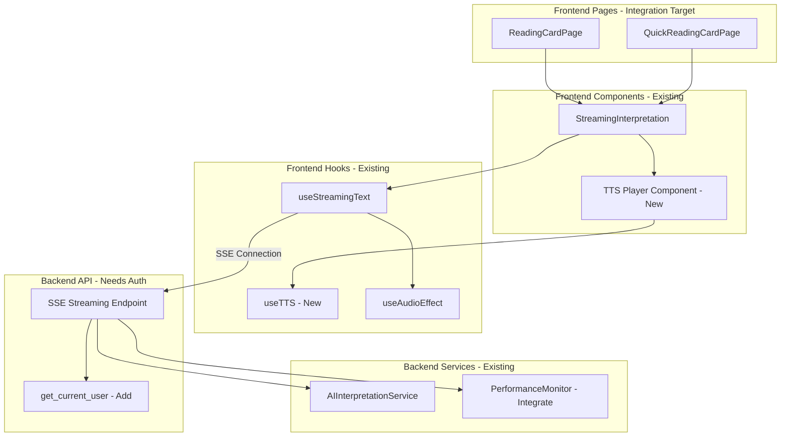
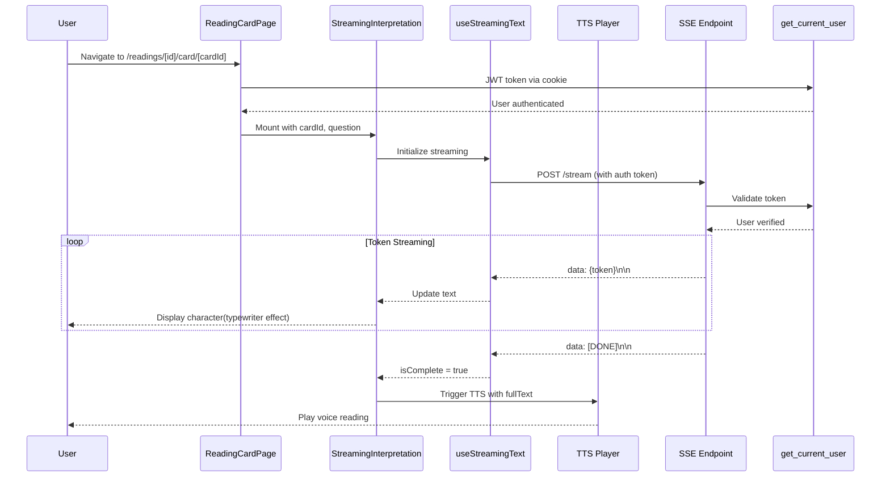
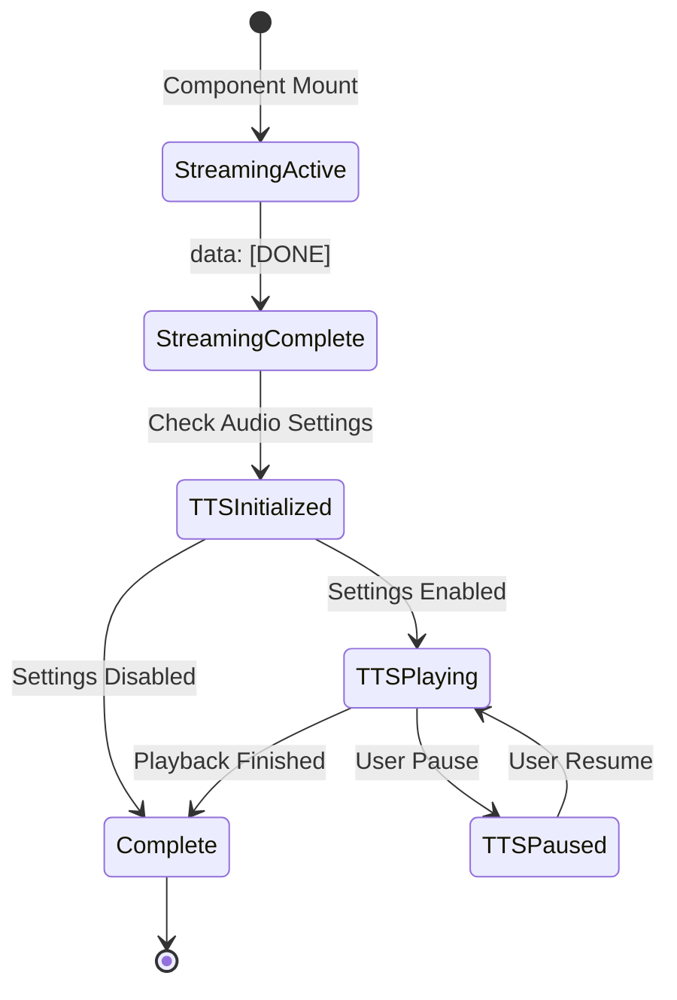

# AI 串流完成整合設計文件

## Overview

此功能整合現有 85% 完成的 AI 串流基礎建設,將串流解讀體驗導入實際使用者流程。核心工作為整合 `StreamingInterpretation` 元件到解讀頁面、加入 TTS 語音播放、補強安全性驗證、實作效能監控,以及完善 E2E 測試。

**Purpose**: 啟用已開發完成的串流文字功能,補充 TTS 整合、安全性修復與監控機制,確保生產就緒。

**Users**: 所有塔羅牌解讀使用者將透過此功能獲得即時 AI 解讀文字與語音播放,提升參與感與體驗流暢度。

**Impact**: 啟用現有串流基礎建設(85% 已完成),將靜態顯示轉換為動態串流 + TTS 體驗,提升使用者滿意度與留存率。此為整合專案,而非從零開始的新功能開發。

### Goals

- 整合 StreamingInterpretation 元件到 `/readings/[id]/card/[cardId]` 和 `/readings/quick/card/[cardId]` 頁面
- 實作 TTS 語音播放(串流完成後自動觸發)
- 加入 Backend streaming endpoint 認證保護(`get_current_user`)
- 實作 Backend timeout 保護機制(60 秒預設值,可配置)
- 整合 PerformanceMonitor 至 streaming endpoints
- 補充 E2E 測試覆蓋完整流程(Playwright)
- 確保符合無障礙標準(WCAG AA)

### Non-Goals

- 不重新實作串流核心(已完成於 `.kiro/specs/ai-text-streaming/`)
- 不重新設計 Audio 系統(已完成於 `.kiro/specs/web-audio-system/`)
- 不實作 Chirp3 TTS 系統本體(僅整合,系統參考 `.kiro/specs/chirp3-hd-tts-system/`)
- 不支援多卡牌陣串流整合(本階段聚焦單卡)

## Architecture

### Existing Architecture Analysis

根據程式碼分析(2025-11-13),現有系統狀態:

**✅ Backend 層(100% 完成)**:
- `backend/app/api/v1/endpoints/readings_stream.py` - SSE endpoints 完整實作
- `backend/app/services/ai_interpretation_service.py` - 串流方法完整
- 支援所有 AI providers(Anthropic, OpenAI, Gemini)

**✅ Frontend Hook 層(100% 完成)**:
- `src/hooks/useStreamingText.ts` - 完整實作(自動重試、錯誤分類、音效整合、控制按鈕)
- 1586 行 TDD 測試覆蓋(`.kiro/specs/ai-text-streaming/IMPLEMENTATION_COMPLETE.md`)

**✅ UI 元件層(100% 完成)**:
- `src/components/readings/StreamingInterpretation.tsx` - 完整 UI 元件

**⚠️ 整合狀況(0% 完成)**:
- 實際解讀頁面**未使用** StreamingInterpretation 元件(使用靜態顯示)
- TTS 觸發邏輯未實作
- Backend endpoints 缺少 auth dependency
- Backend timeout 保護未實作
- Performance metrics 未整合

**整合策略**: 擴展現有實作,完成缺少的整合點與安全性修復,無需重構架構。

### Architecture Pattern & Boundary Map

**Selected Pattern**: **Layered Architecture**(保留現有架構,加入整合點)



**Architecture Integration**:
- **Pattern**: Layered with clear separation(保留現有分層)
- **Domain Boundaries**:
  - **UI Domain**: Reading pages(整合目標)
  - **Component Domain**: StreamingInterpretation + TTS Player(新增 TTS)
  - **Hook Domain**: useStreamingText(現有)+ useTTS(新增)
  - **API Domain**: SSE endpoint(加入 auth + timeout + monitoring)
  - **Service Domain**: AI interpretation(保持不變)
- **Existing Patterns Preserved**: Factory pattern, SSE streaming, error handling
- **New Components**: TTS Player, TTS hook, auth dependency, timeout wrapper, performance metrics
- **Steering Compliance**: Type safety, error handling, React 19, FastAPI, Zustand

### Technology Stack

| Layer | Choice / Version | Role in Feature | Notes |
|-------|------------------|-----------------|-------|
| **Frontend Pages** | Next.js 15 App Router | Integration target pages | Existing routes |
| **Frontend Components** | React 19 + TypeScript 5 | StreamingInterpretation(existing), TTS Player(new) | Add TTS UI |
| **Frontend Hooks** | Custom React Hooks | useStreamingText(existing), useTTS(new) | Add TTS hook |
| **Frontend Audio** | Web Audio API | AudioEngine(existing) | Already integrated |
| **Backend Auth** | FastAPI Depends | get_current_user dependency | Add to endpoints |
| **Backend Timeout** | Python asyncio.timeout | Timeout context manager | Python 3.11+ |
| **Backend Monitoring** | PerformanceMonitor | Metrics collection | Existing class |
| **Testing** | Playwright 1.55+ | E2E test framework | Existing setup |

**Rationale**:
- **No new dependencies**: All required tools already in stack(除 TTS API 參考 chirp3-hd-tts-system spec)
- **Minimal changes**: 保留現有架構,僅加入整合點
- **Type safety**: 全面型別定義,無 `any`
- **Security**: 認證與 timeout 保護

## System Flows

### Page Integration Flow



**Key Decisions**:
- **Page mounting**: StreamingInterpretation 替換現有靜態顯示元件
- **Auth flow**: 透過現有 JWT cookie 機制驗證
- **TTS trigger**: 僅在 `isComplete = true` 時觸發,避免中途打斷
- **Error handling**: 保留現有 retry 機制,auth 失敗顯示友善訊息

### TTS Integration Flow



**Key Decisions**:
- **Auto-trigger**: TTS 自動在串流完成後啟動(可透過設定停用)
- **User control**: 提供 pause/resume/stop 控制按鈕
- **Settings respect**: 檢查 audioStore 設定,尊重使用者偏好
- **Cleanup**: 頁面離開時停止播放,釋放資源

## Requirements Traceability

| Requirement | Summary | Components | Interfaces | Flows |
|-------------|---------|------------|------------|-------|
| 1 | StreamingInterpretation 整合到解讀頁面 | ReadingCardPage, QuickReadingCardPage, StreamingInterpretation | Page Props, Component Props | Page Integration |
| 2 | TTS 語音播放整合 | TTS Player, useTTS hook | TTS Service, Audio Controls | TTS Integration |
| 3 | Streaming endpoint 認證保護 | SSE Endpoint, get_current_user | Auth Dependency | Page Integration |
| 4 | Backend timeout 保護機制 | SSE Endpoint, asyncio.timeout | Timeout Context | (Backend internal) |
| 5 | Performance monitoring 整合 | SSE Endpoint, PerformanceMonitor | Metrics Interface | (Backend internal) |
| 6 | E2E 測試補充 | Playwright test suite | Test Scenarios | All flows |

## Components and Interfaces

### Component Summary

| Component | Domain/Layer | Intent | Req Coverage | Key Dependencies (P0/P1) | Contracts |
|-----------|--------------|--------|--------------|--------------------------|-----------|
| ReadingCardPage | Frontend Page | 整合 StreamingInterpretation 到解讀頁面 | 1 | StreamingInterpretation (P0) | UI |
| QuickReadingCardPage | Frontend Page | 整合 StreamingInterpretation 到快速解讀頁面 | 1 | StreamingInterpretation (P0) | UI |
| TTS Player | Frontend Component | 控制 TTS 播放 | 2 | useTTS (P0), audioStore (P1) | UI, Event |
| useTTS Hook | Frontend Hook | TTS 狀態管理與播放控制 | 2 | TTS API (P0), audioStore (P1) | State, Event |
| SSE Endpoint (Auth) | Backend API | 加入認證保護 | 3 | get_current_user (P0) | API |
| SSE Endpoint (Timeout) | Backend API | 加入 timeout 保護 | 4 | asyncio.timeout (P0) | API |
| SSE Endpoint (Monitoring) | Backend API | 整合效能監控 | 5 | PerformanceMonitor (P0) | API |

### Frontend / Page Layer

#### ReadingCardPage & QuickReadingCardPage

| Field | Detail |
|-------|--------|
| Intent | 替換靜態顯示為 StreamingInterpretation 元件 |
| Requirements | 1 |
| Owner / Reviewers | Frontend Team |

**Responsibilities & Constraints**
- 移除現有靜態解讀顯示元件
- Mount StreamingInterpretation with correct props
- 傳遞 cardId, question, characterVoice, karma, faction 等參數
- 處理 onComplete 與 onError callbacks
- 保留現有 URL routing patterns
- Transaction scope: Read-only(不修改資料)

**Dependencies**
- Inbound: Next.js router — Page routing (P0)
- Outbound: StreamingInterpretation — Display streaming interpretation (P0)
- Outbound: TTS Player — Voice reading (P1)

**Contracts**: UI [x]

**Base UI Props Interface**:
```typescript
// Passed to StreamingInterpretation
interface StreamingInterpretationProps {
  cardId: string;
  question: string;
  characterVoice?: string;              // Default: 'pip_boy'
  karmaAlignment?: string;              // Default: 'neutral'
  factionAlignment?: string | null;
  positionMeaning?: string | null;
  apiUrl?: string;                      // Default: '/api/v1/readings/interpretation/stream'
  enabled?: boolean;                    // Default: true
  charsPerSecond?: number;              // Default: 40
  onComplete?: (text: string) => void;
  onError?: (error: Error) => void;
}
```

**Implementation Notes**
- **Integration**: 保留現有頁面結構,僅替換解讀顯示元件
- **Validation**: cardId 存在性由 backend 驗證,頁面傳遞即可
- **Risks**: None(單純 UI 元件替換)

---

### Frontend / Component Layer

#### TTS Player Component

| Field | Detail |
|-------|--------|
| Intent | 提供 TTS 播放控制 UI |
| Requirements | 2 |
| Owner / Reviewers | Frontend Team |

**Responsibilities & Constraints**
- 在 StreamingInterpretation 完成後顯示
- 提供 play, pause, resume, stop 按鈕
- 顯示播放進度與狀態
- 尊重 audioStore 設定(muted, volume)
- Accessibility: ARIA labels for controls
- Domain boundary: TTS 控制 UI only(不處理音訊生成邏輯)

**Dependencies**
- Inbound: StreamingInterpretation — Trigger on completion (P0)
- Outbound: useTTS hook — TTS state and controls (P0)
- Outbound: audioStore (Zustand) — Audio settings (P1)

**Contracts**: UI [x] / Event [x]

##### Event Contract
- **Subscribed events**: StreamingInterpretation `onComplete(fullText: string)`
- **Published events**: User control actions(play, pause, stop)

**UI Props Interface**:
```typescript
interface TTSPlayerProps {
  text: string;                         // Full interpretation text
  enabled?: boolean;                    // Auto-play when mounted (default: check settings)
  characterVoice?: string;              // Voice character (default: 'pip_boy')
  onPlaybackComplete?: () => void;
}
```

**Implementation Notes**
- **Integration**: Mount as sibling to StreamingInterpretation when `isComplete = true`
- **Validation**: Check `audioStore.muted.tts` before auto-play
- **Risks**: TTS API 失敗不應阻斷文字顯示(graceful degradation)

---

### Frontend / Hook Layer

#### useTTS Hook

| Field | Detail |
|-------|--------|
| Intent | 管理 TTS 播放狀態與控制 |
| Requirements | 2 |
| Owner / Reviewers | Frontend Team |

**Responsibilities & Constraints**
- 呼叫 TTS API 生成語音
- 管理播放狀態(idle, loading, playing, paused, stopped, error)
- 提供 play, pause, resume, stop 控制方法
- 處理 TTS API 錯誤(network, timeout, 4xx, 5xx)
- 監聽 audioStore 設定變更
- Cleanup on unmount(停止播放,釋放資源)
- Domain boundary: TTS state management only

**Dependencies**
- Inbound: TTS Player Component — Hook invocation (P0)
- Outbound: TTS API — Voice generation (P0, 參考 chirp3-hd-tts-system spec)
- Outbound: audioStore (Zustand) — Audio settings (P1)
- External: Fetch API — HTTP request (P0)

**Contracts**: State [x] / Event [x]

##### State Management

**State Model**:
```typescript
interface TTSState {
  // Playback state
  isLoading: boolean;                   // Whether loading TTS audio
  isPlaying: boolean;                   // Whether currently playing
  isPaused: boolean;                    // Whether paused
  isComplete: boolean;                  // Whether playback finished

  // Error state
  error: Error | null;                  // Technical error object
  userFriendlyError: string | null;     // User-facing error message

  // Progress state
  progress: number;                     // Playback progress (0-100)
  duration: number;                     // Total duration in seconds

  // Control methods
  play: () => void;                     // Start playback
  pause: () => void;                    // Pause playback
  resume: () => void;                   // Resume playback
  stop: () => void;                     // Stop and reset
  setVolume: (volume: number) => void;  // Adjust volume
}
```

**Persistence**: None(ephemeral per session)

**Consistency**: Single source of truth in refs with derived React state for UI updates

**Concurrency Strategy**: Serial(one playback per hook instance)

##### Event Contract

- **Subscribed events**: audioStore 設定變更
- **Published events**: `onPlaybackComplete()` callback

**Implementation Notes**
- **Integration**: 由 TTS Player component 呼叫
- **Validation**: Text 長度檢查(不應超過 TTS API 限制)
- **Risks**: TTS API 失敗 → 顯示錯誤訊息但不影響文字顯示

---

### Backend / API Layer

#### SSE Streaming Endpoint (Auth Integration)

| Field | Detail |
|-------|--------|
| Intent | 加入認證保護到 streaming endpoints |
| Requirements | 3 |
| Owner / Reviewers | Backend Team |

**Responsibilities & Constraints**
- 加入 `current_user: User = Depends(get_current_user)` 到 endpoint signature
- 驗證 JWT token 有效性
- 檢查 reading ownership(reading_id 若提供,須驗證屬於該 user)
- 認證失敗返回 401 Unauthorized(在 SSE 連線建立前)
- 記錄 user ID with streaming session for monitoring
- Transaction scope: Read-only(驗證用)

**Dependencies**
- Inbound: Frontend useStreamingText — SSE connection (P0)
- Outbound: get_current_user — JWT validation (P0)
- Outbound: Database — Reading ownership check (P1, optional)

**Contracts**: API [x]

##### API Contract Update

| Method | Endpoint | Request | Response | Errors |
|--------|----------|---------|----------|--------|
| POST | `/api/v1/readings/interpretation/stream` | `StreamInterpretationRequest` + **JWT token** | `text/event-stream` | **401 (unauthorized)**, 404 (card not found), 503 (AI unavailable) |

**Code Change Example**:
```python
@router.post("/interpretation/stream")
async def stream_card_interpretation(
    request: StreamInterpretationRequest,
    db: AsyncSession = Depends(get_db),
    ai_service: AIInterpretationService = Depends(get_ai_interpretation_service),
    current_user: User = Depends(get_current_user)  # ← Add this
):
    """串流單卡解讀 (with authentication)"""

    # Optional: Verify reading ownership if reading_id provided
    # (Implementation depends on whether reading_id is in request)

    # Log user ID for monitoring
    logger.info(f"User {current_user.id} starting streaming session")

    # Existing logic continues...
```

**Implementation Notes**
- **Integration**: Add dependency to existing endpoint signature
- **Validation**: get_current_user raises HTTPException if token invalid
- **Risks**: Existing middleware(CORS, Rate Limiting) 已配置,無衝突風險

---

#### SSE Streaming Endpoint (Timeout Protection)

| Field | Detail |
|-------|--------|
| Intent | 加入 server-side timeout 保護 |
| Requirements | 4 |
| Owner / Reviewers | Backend Team |

**Responsibilities & Constraints**
- 使用 `asyncio.timeout(timeout_seconds)` 包裝 async generator
- 預設 timeout 60 秒(可透過環境變數配置)
- Timeout 發生時發送 SSE error event 並關閉連線
- 記錄 timeout 事件 with context(user ID, provider, metadata)
- Cleanup AI provider resources on timeout
- Transaction scope: N/A(streaming only)

**Dependencies**
- Inbound: Frontend useStreamingText — SSE connection (P0)
- Outbound: AIInterpretationService — Token generation (P0)
- External: Python asyncio.timeout — Timeout context manager (P0)

**Contracts**: API [x]

**Code Change Example**:
```python
import asyncio
from app.config import settings  # For timeout_seconds config

@router.post("/interpretation/stream")
async def stream_card_interpretation(...):
    """串流單卡解讀 (with timeout protection)"""

    async def generate_stream():
        try:
            # Wrap streaming with timeout
            async with asyncio.timeout(settings.streaming_timeout):
                async for chunk in ai_service.generate_interpretation_stream(...):
                    yield f"data: {json.dumps(chunk, ensure_ascii=False)}\n\n"
                yield "data: [DONE]\n\n"

        except asyncio.TimeoutError:
            logger.error(f"Streaming timeout after {settings.streaming_timeout}s")
            yield "data: [ERROR] 連線逾時，請重新整理或檢查網路連線\n\n"
        except Exception as e:
            logger.error(f"Error during streaming: {e}", exc_info=True)
            yield f"data: [ERROR] {str(e)}\n\n"

    return StreamingResponse(...)
```

**Configuration**:
```python
# backend/app/config.py
class Settings(BaseSettings):
    streaming_timeout: int = 60  # seconds (default 60)
```

**Implementation Notes**
- **Integration**: Wrap existing async generator with timeout context
- **Validation**: Timeout duration 可透過環境變數調整
- **Risks**: 正常完成的 streaming 不受影響(timeout 僅在超時觸發)

---

#### SSE Streaming Endpoint (Performance Monitoring)

| Field | Detail |
|-------|--------|
| Intent | 整合 PerformanceMonitor 到 streaming endpoints |
| Requirements | 5 |
| Owner / Reviewers | Backend Team |

**Responsibilities & Constraints**
- 記錄 streaming session 開始時間
- 計算並記錄 first-token latency(請求到首個 token 的時間)
- 記錄 total duration, total tokens, average tokens/second
- 整合現有 PerformanceMonitor instance(`app/monitoring/performance.py`)
- Emit metrics to `/metrics` endpoint(P95 latency, avg tokens/sec, error rate)
- 分開追蹤不同 AI provider 的 metrics
- 使用 background task 避免影響 streaming latency
- Transaction scope: Metrics only(不影響資料庫)

**Dependencies**
- Inbound: Frontend useStreamingText — SSE connection (P0)
- Outbound: PerformanceMonitor — Metrics collection (P0)
- Outbound: AIInterpretationService — Token generation (P0)

**Contracts**: API [x]

**Code Change Example**:
```python
from app.monitoring.performance import PerformanceMonitor
from datetime import datetime

# Assuming PerformanceMonitor is a singleton or injected dependency
performance_monitor = PerformanceMonitor.get_instance()

@router.post("/interpretation/stream")
async def stream_card_interpretation(...):
    """串流單卡解讀 (with performance monitoring)"""

    session_start = datetime.utcnow()
    first_token_time = None
    token_count = 0

    async def generate_stream():
        nonlocal first_token_time, token_count

        try:
            async with asyncio.timeout(settings.streaming_timeout):
                async for chunk in ai_service.generate_interpretation_stream(...):
                    # Record first token latency
                    if first_token_time is None:
                        first_token_time = datetime.utcnow()
                        first_token_latency_ms = (first_token_time - session_start).total_seconds() * 1000
                        performance_monitor.record_first_token_latency(first_token_latency_ms)

                    token_count += 1
                    yield f"data: {json.dumps(chunk, ensure_ascii=False)}\n\n"

                # Record completion
                total_duration_ms = (datetime.utcnow() - session_start).total_seconds() * 1000
                performance_monitor.record_streaming_completion(total_duration_ms, token_count)

                yield "data: [DONE]\n\n"

        except Exception as e:
            # Record error
            performance_monitor.record_streaming_error()
            logger.error(f"Error during streaming: {e}", exc_info=True)
            yield f"data: [ERROR] {str(e)}\n\n"

    return StreamingResponse(...)
```

**Implementation Notes**
- **Integration**: 使用現有 PerformanceMonitor class(參考 `research.md`)
- **Validation**: Metrics 不應影響 streaming latency(異步記錄)
- **Risks**: PerformanceMonitor 需擴展支援 streaming metrics(新增方法)

---

## Data Models

### Domain Model

**No domain model changes** — 此為整合專案,不修改核心資料模型。

**Ephemeral State** (in-memory only):
- **Frontend**: TTS playback state(isPlaying, isPaused, progress)
- **Backend**: Performance metrics(first-token latency, token count, duration)

### Logical Data Model

**Not applicable** — 不涉及資料庫 schema 變更。

### Data Contracts & Integration

**TTS API Request** (參考 chirp3-hd-tts-system spec):
```typescript
interface TTSRequest {
  text: string;                         // Full interpretation text
  voice: string;                        // Character voice ID (e.g., 'pip_boy')
  language?: string;                    // Default: 'zh-TW'
  speed?: number;                       // Speed multiplier (default: 1.0)
}
```

**TTS API Response**:
```typescript
interface TTSResponse {
  audio_url: string;                    // URL to audio file
  duration: number;                     // Duration in seconds
  format: string;                       // Audio format (e.g., 'mp3')
}
```

**Performance Metrics Data** (Backend internal):
```python
@dataclass
class StreamingMetrics:
    first_token_latency_ms: float
    total_duration_ms: float
    token_count: int
    avg_tokens_per_second: float
    error_occurred: bool
    provider: str                       # AI provider name
    user_id: str
```

## Error Handling

### Error Strategy

**Graceful Degradation** — TTS 失敗不應阻斷文字顯示;Backend 認證失敗應在 SSE 連線前返回。

### Error Categories and Responses

#### TTS Errors (Frontend)
- **TTS API 404/5xx**: Display error message "語音播放功能暫時無法使用,您仍可閱讀文字內容"
- **Network timeout**: "語音載入逾時,請稍後重試"
- **User action**: Provide manual retry button

#### Auth Errors (Backend)
- **401 Unauthorized**: Return before SSE connection established
  - Frontend receives HTTP 401 → Display "請重新登入後再試"
- **403 Forbidden**: Reading ownership check failed
  - Return "您沒有權限存取此解讀"

#### Timeout Errors (Backend)
- **asyncio.TimeoutError**: Send SSE error event `[ERROR] 連線逾時`
  - Frontend receives error → Display recovery suggestion
  - Log timeout event for monitoring

### Monitoring

**Metrics to Track**:
- TTS success/failure rate per character voice
- Streaming auth failure rate(401/403)
- Backend timeout occurrence frequency per AI provider
- First-token latency P95 per provider
- Average tokens/second per provider

**Logging Strategy**:
- **Backend**: Log all auth failures, timeouts, errors with user ID and context
- **Frontend**: Log TTS failures and user recovery actions
- **Integration**: Use existing `logger` in backend, `console` in frontend

## Testing Strategy

### Unit Tests

**Backend** (Pytest):
1. **Auth Dependency** (`test_streaming_auth.py`):
   - Test `get_current_user` integration with streaming endpoint
   - Verify 401 when token invalid or missing
   - Verify reading ownership check(if implemented)

2. **Timeout Protection** (`test_streaming_timeout.py`):
   - Mock AI provider with delayed response(>60s)
   - Verify `asyncio.TimeoutError` caught and SSE error event sent
   - Verify normal streaming unaffected

3. **Performance Monitoring** (`test_streaming_metrics.py`):
   - Verify first-token latency recorded
   - Verify completion metrics recorded(duration, token count)
   - Verify error metrics incremented on failure

**Frontend** (Jest + React Testing Library):
1. **TTS Hook** (`useTTS.test.ts`):
   - State updates on TTS API response
   - Play, pause, resume, stop functionality
   - Error handling(network, timeout, 4xx, 5xx)
   - Settings respect(muted, volume)

2. **TTS Player Component** (`TTSPlayer.test.tsx`):
   - Render control buttons(play, pause, stop)
   - Display playback progress
   - Trigger callbacks(onPlaybackComplete)

### Integration Tests

**Backend** (Pytest + httpx):
1. **Auth + Streaming Flow** (`test_streaming_auth_integration.py`):
   - POST with valid token → Streaming succeeds
   - POST with invalid token → 401 before streaming
   - POST with expired token → 401 error

2. **Timeout + Error Event** (`test_streaming_timeout_integration.py`):
   - Simulate AI provider hang(>60s)
   - Verify SSE error event `[ERROR] 連線逾時` received
   - Verify connection closed

**Frontend** (Jest + MSW):
1. **Page Integration** (`ReadingCardPage.integration.test.tsx`):
   - Mount page → StreamingInterpretation renders
   - Streaming completes → TTS Player appears
   - TTS plays → Audio controls visible

### E2E Tests

**Playwright**:
1. **Complete Reading Flow** (`streaming-reading-complete.spec.ts`):
   - Login → Navigate to reading page → See streaming text → Hear TTS playback
   - Verify typewriter animation visible
   - Verify TTS controls appear after completion

2. **Auth Failure Flow** (`streaming-auth-failure.spec.ts`):
   - Invalid token → Navigate to reading page → See 401 error
   - Verify "請重新登入" message displayed

3. **TTS Control Flow** (`tts-controls.spec.ts`):
   - Streaming completes → TTS auto-plays
   - Click pause → Audio pauses
   - Click resume → Audio resumes
   - Click stop → Audio stops and player resets

4. **Timeout Scenario** (`streaming-timeout.spec.ts`):
   - Mock AI provider with long delay(>60s)
   - Verify timeout error message displayed
   - Verify retry button available

## Security Considerations

### Authentication
- **JWT Validation**: All streaming endpoints require valid JWT token via `get_current_user`
- **Token Format**: Accept both Cookie-based and Authorization header
- **Ownership Check**: Optional reading ownership validation(reading belongs to user)

### Rate Limiting
- **Existing Middleware**: Global rate limiter already configured(10 requests/minute per user)
- **No Changes**: 保留現有設定

### Input Validation
- **Card ID**: Validated via database query(404 if not found)
- **Question**: Max length 500 characters(Pydantic validation)
- **TTS Text**: Sanitize before sending to TTS API(防止 injection)

## Performance & Scalability

### Target Metrics

- **First Token Latency**: P95 <2 seconds(unchanged)
- **Streaming Throughput**: ≥50 tokens/second(unchanged)
- **TTS Load Time**: <3 seconds for audio generation
- **Page Load Impact**: StreamingInterpretation integration <200ms overhead

### Optimization Strategies

**Backend**:
- **Timeout Protection**: 防止 hanging connections 消耗資源
- **Metrics Collection**: Async logging 避免影響 streaming latency
- **Auth Caching**: JWT validation result 可 cache(依現有實作)

**Frontend**:
- **TTS Lazy Loading**: TTS Player component lazy load(僅在完成後載入)
- **Audio Preloading**: TTS API 可預載音訊檔案(依 chirp3-hd-tts-system spec)

## Migration Strategy

### Deployment Plan

**Phase 1: Backend Security & Monitoring** (Week 1)
- Add auth dependency to streaming endpoints
- Add timeout protection wrapper
- Integrate PerformanceMonitor
- Deploy to staging
- Verify auth flow works, timeout triggers correctly

**Phase 2: Frontend Integration** (Week 2)
- Integrate StreamingInterpretation to reading pages
- Implement TTS Player component and useTTS hook
- Add E2E tests
- Deploy to staging
- Verify page integration and TTS playback

**Phase 3: Production Rollout** (Week 3)
- Deploy backend + frontend to production
- Monitor error rates, latency, TTS success rate
- Feature flag: Enable for 10% of users
- Gradual rollout: 25% → 50% → 100% over 3 days

**Rollback Triggers**:
- Auth error rate >5%
- TTS failure rate >30%
- Backend timeout rate >10%
- P95 latency >5 seconds

**Validation Checkpoints**:
- ✅ Backend tests passing(auth, timeout, monitoring)
- ✅ Frontend tests passing(TTS, integration)
- ✅ E2E tests passing(all critical flows)
- ✅ Performance metrics within targets
- ✅ Accessibility WCAG AA compliant

---

## Supporting References

### TypeScript Type Definitions

```typescript
// TTS Hook State (Complete)
export interface TTSState {
  // Playback state
  isLoading: boolean;
  isPlaying: boolean;
  isPaused: boolean;
  isComplete: boolean;

  // Error state
  error: Error | null;
  userFriendlyError: string | null;

  // Progress state
  progress: number;                     // 0-100
  duration: number;                     // seconds

  // Control methods
  play: () => void;
  pause: () => void;
  resume: () => void;
  stop: () => void;
  setVolume: (volume: number) => void;
}

// TTS Hook Options
export interface TTSOptions {
  text: string;
  voice?: string;                       // Default: 'pip_boy'
  language?: string;                    // Default: 'zh-TW'
  speed?: number;                       // Default: 1.0
  autoPlay?: boolean;                   // Default: check settings
  onPlaybackComplete?: () => void;
}
```

### Backend Configuration Example

```python
# backend/app/config.py (relevant settings)
class Settings(BaseSettings):
    # Streaming Configuration
    streaming_timeout: int = 60  # seconds
    streaming_max_tokens: int = 500

    # TTS Configuration (參考 chirp3-hd-tts-system spec)
    tts_api_url: str = "https://api.example.com/tts"
    tts_api_key: Optional[str] = None

    # Performance Monitoring
    enable_performance_monitoring: bool = True

    # Existing settings...
    ai_enabled: bool = True
    ai_cache_ttl: int = 3600
    ai_provider_max_concurrent: int = 10
    rate_limit_per_minute: int = 10
```

---

**設計文件版本**: 2.0
**最後更新**: 2025-11-13
**狀態**: 待審查
