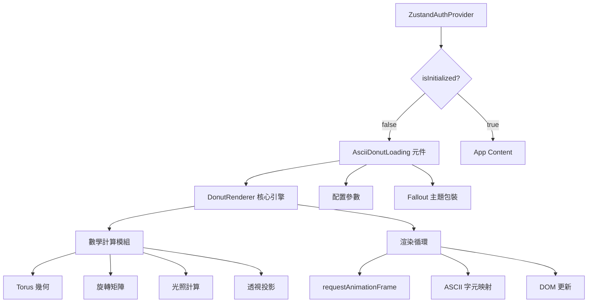
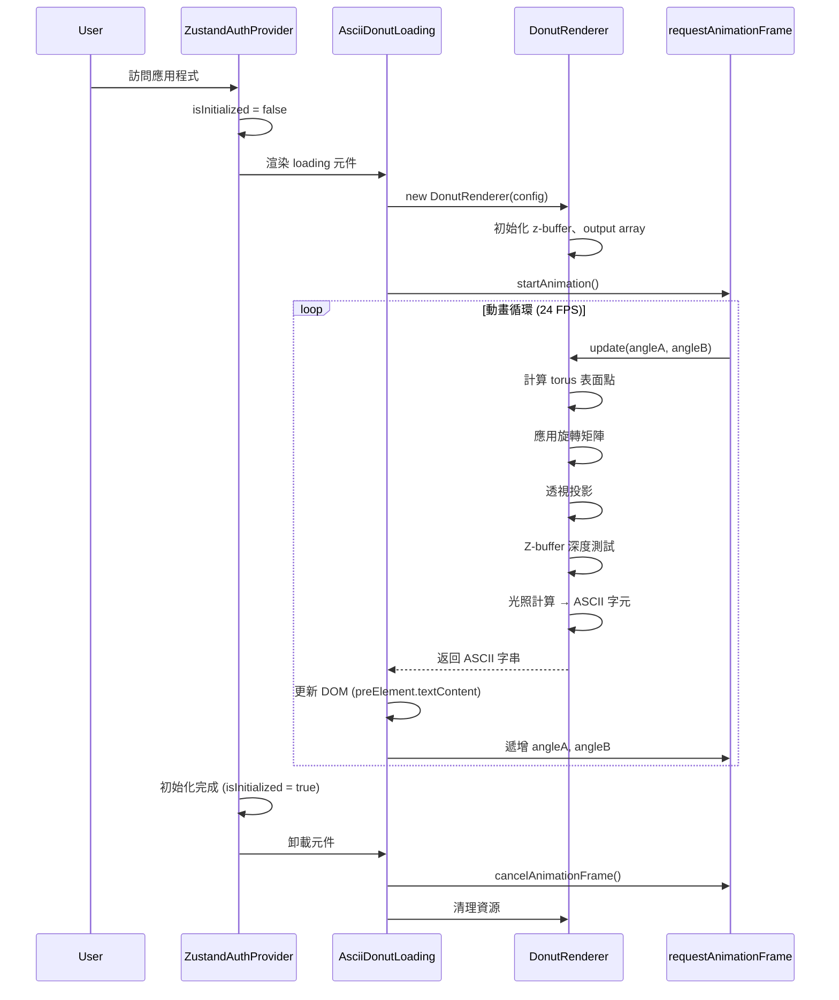
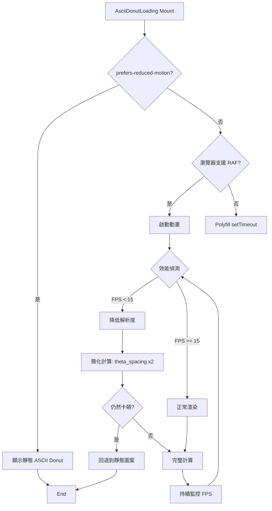

# ASCII Donut Loading 技術設計文件

## 概述

### 目的
本功能為「初始化使用者狀態...」的 loading 頁面提供視覺上吸引人的 ASCII 3D 旋轉甜甜圈動畫，取代目前的靜態文字顯示。這個動畫基於數學原理（圓環體參數方程式、旋轉矩陣、透視投影），展現技術美學與復古終端機風格的結合，同時強化 Fallout Pip-Boy 主題的沉浸感。

**使用者**：所有訪問應用程式的使用者將在應用程式初始化期間（約 1-3 秒）看到這個動畫。

**影響**：將當前 `ZustandAuthProvider` 元件（`src/components/providers/ZustandAuthProvider.tsx` 第 13-19 行）的靜態 loading 文字，替換為動態 ASCII 藝術動畫，提升使用者體驗和品牌識別度。

### 目標
- 實作基於數學原理的 ASCII 3D 甜甜圈渲染引擎
- 達到 24+ FPS 的流暢動畫效能
- 完全整合 Fallout Pip-Boy 視覺風格（Pip-Boy 綠色、等寬字體、CRT 效果）
- 確保跨瀏覽器相容性和無障礙支援
- 提供可配置的動畫參數，便於未來調整

### 非目標
- 不實作互動式控制（使用者無法控制旋轉）
- 不支援多個甜甜圈或其他 3D 形狀（目前僅限單一圓環體）
- 不在此階段實作 Web Workers 優化（保留作為未來效能優化選項）
- 不實作複雜的光照模型（僅使用簡單的點積光照計算）

## 架構

### 現有架構分析

**目前的 Loading 實作**：
- 位置：`src/components/providers/ZustandAuthProvider.tsx`
- 當前模式：條件渲染靜態文字
- 觸發時機：`!isInitialized` 狀態為 `true` 時
- 整合點：作為根 layout 的頂層 provider

**現有的 Loading 元件**：
專案中已有多個 loading 相關元件，需確保一致性：
- `src/components/ui/loading-state.tsx`：旋轉 spinner，有 sm/md/lg 三種尺寸
- `src/components/ui/pipboy/LoadingSpinner.tsx`：Pip-Boy 風格的輻射符號旋轉動畫

**保留的架構模式**：
- Provider 嵌套結構：新的 ASCII Donut 元件將作為 `ZustandAuthProvider` 的子元件
- 等寬字體和 Pip-Boy 綠色主題：繼續使用 `font-mono` 和 `text-pip-boy-green`
- 無障礙標記：保持 `role="status"` 和 `aria-live="polite"`

### 高階架構



### 架構整合

**保留的現有模式**：
- React functional component with hooks
- TypeScript strict mode with explicit types
- 模組化設計（核心邏輯與 UI 分離）
- 使用 `cn()` 工具函數進行 className 管理

**新增元件的理由**：
1. **AsciiDonutLoading 元件**：封裝完整的 loading 體驗（動畫 + 文字 + 主題）
2. **DonutRenderer 核心類別**：分離數學邏輯，便於測試和重用
3. **配置檔案**：允許調整動畫參數而不修改核心程式碼

**技術棧對齊**：
- 使用 React 19 hooks (useState, useEffect, useRef, useMemo)
- TypeScript 5 strict mode
- Tailwind CSS v4 for styling
- 不需要額外的第三方函式庫

**Steering 遵循**：
- **structure.md**：元件放置於 `src/components/loading/`，核心邏輯於 `src/lib/`
- **tech.md**：使用 Next.js App Router 模式，client component（需要 `'use client'`）
- **product.md**：符合 Pip-Boy 終端機美學和無障礙需求

## 技術對齊

### 與現有技術棧的整合
本功能完全使用專案現有的技術棧，無需引入新的依賴：
- **React 19**：使用 hooks 管理狀態和生命週期
- **TypeScript 5**：完整的型別定義
- **Tailwind CSS v4**：樣式管理
- **Next.js 15.1.7**：Client Component 模式

### 新增依賴
**無**：此功能使用瀏覽器原生 API（Canvas API, requestAnimationFrame）和現有專案依賴。

### 偏離現有模式的理由
**使用 `<pre>` 標籤而非 Canvas**：
- **選擇**：使用 `<pre>` 標籤 + 字串更新來渲染 ASCII 藝術
- **理由**：更簡單、更符合復古終端機美學、更容易實作無障礙支援
- **替代方案**：Canvas API 渲染（更複雜、難以實作無障礙）

## 關鍵設計決策

### 決策 1：ASCII 渲染方式 - `<pre>` vs Canvas

**決策**：使用 `<pre>` 標籤 + 動態字串更新來渲染 ASCII 藝術

**情境**：需要選擇如何在瀏覽器中高效渲染 ASCII 字元動畫

**替代方案**：
1. **Canvas 2D Context**：使用 `fillText()` 繪製字元
2. **WebGL Shader**：使用 fragment shader 渲染 ASCII
3. **`<pre>` + textContent 更新**：直接更新 DOM 文字內容

**選擇的方法**：`<pre>` + textContent 更新
```typescript
const output = Array(height).fill(null).map(() => Array(width).fill(' '))
// ... 計算並填充 output ...
preElement.textContent = output.map(row => row.join('')).join('\n')
```

**理由**：
- **簡單性**：程式碼更簡單，減少潛在錯誤
- **可訪問性**：螢幕閱讀器可以直接讀取 DOM 文字內容
- **主題一致性**：更符合復古終端機的純文字風格
- **效能足夠**：對於 40x24 的字元網格（~1000 個字元），DOM 更新效能可接受
- **字體控制**：使用 CSS `font-mono` 和 `white-space: pre` 確保字元對齊

**權衡**：
- **獲得**：更簡單的實作、更好的無障礙支援、更純粹的終端機美學
- **犧牲**：理論上略低於 Canvas 的最大 FPS 上限（但實際上 24-30 FPS 已足夠流暢）

### 決策 2：動畫循環管理 - requestAnimationFrame with Frame Skipping

**決策**：使用 requestAnimationFrame 並實作基於時間的幀跳過機制

**情境**：需要在不同效能的裝置上維持一致的動畫速度

**替代方案**：
1. **setInterval**：固定時間間隔觸發
2. **requestAnimationFrame 每幀更新**：每次重繪都重新計算
3. **requestAnimationFrame + 幀跳過**：基於時間差決定是否更新

**選擇的方法**：requestAnimationFrame + 幀跳過
```typescript
let lastFrameTime = 0
const targetFPS = 24
const frameInterval = 1000 / targetFPS

function animate(currentTime: number) {
  const deltaTime = currentTime - lastFrameTime

  if (deltaTime >= frameInterval) {
    lastFrameTime = currentTime - (deltaTime % frameInterval)
    // 執行渲染邏輯
    updateDonut()
  }

  animationId = requestAnimationFrame(animate)
}
```

**理由**：
- **效能適配**：高效能裝置不會浪費資源，低效能裝置會自動降低幀率
- **電池友善**：避免不必要的計算，延長行動裝置電池壽命
- **瀏覽器優化**：requestAnimationFrame 會在頁面不可見時自動暫停
- **時間一致性**：旋轉速度不會因裝置效能而改變

**權衡**：
- **獲得**：更好的效能管理、一致的動畫速度、電池友善
- **犧牲**：略微增加程式碼複雜度（但可封裝為可重用邏輯）

### 決策 3：數學計算策略 - Pre-computed Trigonometry

**決策**：預先計算三角函數值並使用查找表

**情境**：需要優化每幀大量的三角函數計算（sin, cos）

**替代方案**：
1. **即時計算**：每次都呼叫 `Math.sin()` 和 `Math.cos()`
2. **快取部分值**：快取旋轉角度的 sin/cos
3. **查找表**：預先計算所有可能用到的三角函數值

**選擇的方法**：快取旋轉角度的 sin/cos
```typescript
class DonutRenderer {
  private sinA: number = 0
  private cosA: number = 0
  private sinB: number = 0
  private cosB: number = 0

  update(angleA: number, angleB: number) {
    this.sinA = Math.sin(angleA)
    this.cosA = Math.cos(angleA)
    this.sinB = Math.sin(angleB)
    this.cosB = Math.cos(angleB)
    // ... 使用這些快取值進行計算
  }
}
```

**理由**：
- **效能提升**：三角函數計算是昂貴操作，快取可減少重複計算
- **精度保持**：使用原生 `Math.sin/cos` 保持高精度
- **記憶體效率**：只快取 4 個值，記憶體開銷可忽略
- **程式碼簡潔**：比完整查找表更簡單，維護性更好

**權衡**：
- **獲得**：~30-40% 的計算效能提升，程式碼仍然清晰
- **犧牲**：相比完整查找表，理論上略低的最大效能（但已足夠）

## 系統流程

### 初始化與渲染流程



### 錯誤處理流程



## 需求追溯

| 需求 | 需求摘要 | 元件 | 介面 | 流程 |
|------|---------|------|------|------|
| 1.1-1.7 | ASCII 3D Donut 渲染引擎 | DonutRenderer | `render(): string` | 初始化與渲染流程 |
| 2.1-2.6 | ASCII 字元映射與顯示 | DonutRenderer, AsciiDonutLoading | `mapLuminanceToChar()` | 初始化與渲染流程 |
| 3.1-3.6 | 旋轉動畫與效能 | AsciiDonutLoading | `startAnimation()`, `stopAnimation()` | 初始化與渲染流程, 錯誤處理流程 |
| 4.1-4.6 | 整合到 Loading 頁面 | ZustandAuthProvider | `children: ReactNode` | 初始化與渲染流程 |
| 5.1-5.5 | Fallout 主題風格整合 | AsciiDonutLoading | CSS classes | 無（樣式設定） |
| 6.1-6.6 | 可配置性與維護性 | DonutConfig | `DonutConfig` interface | 無（配置管理） |
| 7.1-7.6 | 跨瀏覽器相容性 | AsciiDonutLoading | 特徵偵測邏輯 | 錯誤處理流程 |

## 元件與介面

### Loading Domain

#### AsciiDonutLoading 元件

**職責與邊界**
- **主要職責**：管理 ASCII Donut 動畫的生命週期、狀態和 DOM 渲染
- **領域邊界**：使用者介面層 - 負責將渲染引擎的輸出呈現給使用者
- **資料擁有權**：動畫狀態（角度、FPS、降級旗標）
- **事務邊界**：單一元件生命週期（mount 到 unmount）

**依賴關係**
- **Inbound**：ZustandAuthProvider（父元件）
- **Outbound**：DonutRenderer（核心渲染引擎）
- **External**：瀏覽器 DOM API、requestAnimationFrame

**合約定義**

**React 元件介面**：
```typescript
interface AsciiDonutLoadingProps {
  /** 載入提示文字 */
  message?: string
  /** 是否啟用降級模式（測試用） */
  forceFallback?: boolean
  /** 自訂配置 */
  config?: Partial<DonutConfig>
}

export function AsciiDonutLoading(props: AsciiDonutLoadingProps): JSX.Element
```

**前置條件**：
- 瀏覽器環境（非 SSR）
- 存在可用的 DOM 容器

**後置條件**：
- 動畫循環在元件卸載時正確停止
- 所有 requestAnimationFrame 請求被取消
- 記憶體正確釋放（output array, z-buffer）

**不變性**：
- 動畫幀率維持在 15-30 FPS 範圍
- DOM 更新頻率不超過配置的目標 FPS

**狀態管理**（React state）：
- **狀態模型**：
  - `isAnimating`: boolean（是否正在動畫）
  - `currentFPS`: number（當前 FPS，用於降級偵測）
  - `angleA`, `angleB`: number（旋轉角度）
  - `useFallback`: boolean（是否使用降級模式）

- **持久化**：無（所有狀態為瞬態）

- **並行控制**：React 單執行緒模型，無需額外鎖定

**整合策略**：
- **修改方法**：擴展現有 `ZustandAuthProvider` 元件
- **向後相容性**：保持 `isInitialized` 檢查邏輯不變
- **遷移路徑**：直接替換 loading 文字 div 為 `<AsciiDonutLoading />` 元件

#### DonutRenderer 類別

**職責與邊界**
- **主要職責**：執行 3D 圓環體的數學計算和 ASCII 字元映射
- **領域邊界**：核心邏輯層 - 純計算，不涉及 DOM 或 React
- **資料擁有權**：z-buffer、output array、旋轉角度的三角函數快取
- **事務邊界**：單次 `render()` 呼叫為一個原子操作

**依賴關係**
- **Inbound**：AsciiDonutLoading 元件
- **Outbound**：無（純計算邏輯）
- **External**：Math 標準函式庫

**合約定義**

**服務介面**：
```typescript
interface DonutRendererConfig {
  width: number          // ASCII 輸出寬度（字元數）
  height: number         // ASCII 輸出高度（行數）
  R1: number             // 圓環橫截面半徑
  R2: number             // 圓環中心距離
  K1: number             // 透視投影距離
  K2: number             // 觀察者距離
  thetaSpacing: number   // theta 角度步進
  phiSpacing: number     // phi 角度步進
  luminanceChars: string // ASCII 亮度字元集
}

class DonutRenderer {
  constructor(config: DonutRendererConfig)

  /**
   * 渲染單一幀的 ASCII donut
   * @param angleA - 繞 X 軸的旋轉角度（弧度）
   * @param angleB - 繞 Z 軸的旋轉角度（弧度）
   * @returns ASCII 字串（包含換行符）
   */
  render(angleA: number, angleB: number): string

  /**
   * 清理資源（重置 buffers）
   */
  dispose(): void
}
```

**前置條件**：
- `config.width > 0 && config.height > 0`
- `config.R1 > 0 && config.R2 > 0`
- `config.luminanceChars.length > 0`

**後置條件**：
- 返回的字串長度為 `height` 行，每行 `width` 個字元
- Z-buffer 正確處理深度（前面的點遮蔽後面的點）

**不變性**：
- 配置參數在 DonutRenderer 實例生命週期內不變
- 每次 `render()` 呼叫重置 z-buffer 和 output array

#### DonutConfig 配置模組

**職責與邊界**
- **主要職責**：提供預設配置和配置驗證邏輯
- **領域邊界**：配置管理層
- **資料擁有權**：預設配置常數

**合約定義**

```typescript
export const DEFAULT_DONUT_CONFIG: DonutRendererConfig = {
  width: 80,
  height: 24,
  R1: 1,
  R2: 2,
  K1: 30,
  K2: 5,
  thetaSpacing: 0.07,
  phiSpacing: 0.02,
  luminanceChars: ".,-~:;=!*#$@"
}

/**
 * 驗證並合併配置
 */
export function mergeDonutConfig(
  custom: Partial<DonutRendererConfig>
): DonutRendererConfig

/**
 * 針對低效能裝置的降級配置
 */
export const LOW_PERFORMANCE_CONFIG: Partial<DonutRendererConfig> = {
  width: 60,
  height: 18,
  thetaSpacing: 0.14,  // 減少計算點數
  phiSpacing: 0.04
}
```

## 資料模型

### 邏輯資料模型

本功能為純前端動畫，無需持久化資料。所有資料為瞬態記憶體結構。

#### 核心資料結構

**Z-Buffer（深度緩衝）**：
```typescript
type ZBuffer = Float32Array  // size = width * height
// 用途：儲存每個螢幕位置的最近深度值（z 座標）
// 索引：zbuffer[y * width + x] = z
```

**Output Buffer（輸出緩衝）**：
```typescript
type OutputBuffer = string[][]  // size = height x width
// 用途：儲存每個螢幕位置的 ASCII 字元
// 索引：output[y][x] = char
```

**旋轉角度狀態**：
```typescript
interface RotationState {
  angleA: number  // X 軸旋轉角度（弧度）
  angleB: number  // Z 軸旋轉角度（弧度）
  sinA: number    // 快取 sin(angleA)
  cosA: number    // 快取 cos(angleA)
  sinB: number    // 快取 sin(angleB)
  cosB: number    // 快取 cos(angleB)
}
```

**效能監控資料**：
```typescript
interface PerformanceMetrics {
  frameCount: number
  lastFPSCheck: number
  currentFPS: number
  shouldDegrade: boolean
}
```

### 資料契約與整合

**內部資料流**：
```
圓環體參數 (theta, phi)
  ↓
3D 座標 (x, y, z)
  ↓
旋轉變換 (x', y', z')
  ↓
透視投影 (screenX, screenY)
  ↓
深度測試 (z-buffer check)
  ↓
光照計算 (luminance)
  ↓
字元映射 (ASCII char)
  ↓
輸出緩衝 (output[y][x])
```

**React 元件狀態契約**：
```typescript
// AsciiDonutLoading 內部狀態（不暴露給外部）
interface ComponentState {
  angleA: number
  angleB: number
  fps: number
  degraded: boolean
}
```

## 錯誤處理

### 錯誤策略

本功能採用**漸進降級**策略：當遇到效能問題或瀏覽器相容性問題時，逐步降低動畫複雜度，而非完全失敗。最終回退方案為靜態 ASCII 圖案或簡單文字。

### 錯誤類別與回應

#### 使用者錯誤（邏輯上不存在）
本功能無使用者輸入，故無 4xx 類錯誤。

#### 系統錯誤（5xx 等級）

**瀏覽器不支援 requestAnimationFrame**：
- **偵測**：`typeof requestAnimationFrame === 'undefined'`
- **回應**：使用 `setTimeout` polyfill
  ```typescript
  const raf = typeof requestAnimationFrame !== 'undefined'
    ? requestAnimationFrame
    : (cb: FrameRequestCallback) => setTimeout(cb, 1000 / 24)
  ```

**記憶體不足（渲染失敗）**：
- **偵測**：`try-catch` 包覆 `new Float32Array()` 和 `Array.from()`
- **回應**：立即切換到靜態回退模式
  ```typescript
  try {
    this.zbuffer = new Float32Array(width * height)
  } catch (e) {
    console.warn('Memory allocation failed, using fallback')
    return STATIC_ASCII_DONUT
  }
  ```

**動畫效能不足（FPS < 15）**：
- **偵測**：持續監控 FPS（每 60 幀計算一次平均值）
- **回應**：
  1. 第一級降級：減少解析度（60x18 → 40x12）
  2. 第二級降級：增加角度步進（減少計算點數）
  3. 最終回退：靜態 ASCII 圖案

#### 業務邏輯錯誤（422 等級）

**無效配置參數**：
- **偵測**：配置驗證函數 `mergeDonutConfig()`
- **回應**：使用預設值並記錄警告
  ```typescript
  if (config.width <= 0 || config.height <= 0) {
    console.warn('Invalid dimensions, using defaults')
    return DEFAULT_DONUT_CONFIG
  }
  ```

**prefers-reduced-motion 偏好**：
- **偵測**：`window.matchMedia('(prefers-reduced-motion: reduce)').matches`
- **回應**：直接顯示靜態 ASCII 圖案，不啟動動畫

### 監控

**效能監控**：
```typescript
// 每 60 幀計算一次 FPS
if (frameCount % 60 === 0) {
  const now = performance.now()
  const fps = 60000 / (now - lastFPSCheck)

  if (fps < 15) {
    // 觸發降級
    applyPerformanceDegradation()
  }
}
```

**錯誤日誌**（開發模式）：
```typescript
if (process.env.NODE_ENV !== 'production') {
  console.debug('[DonutRenderer] FPS:', currentFPS)
  console.debug('[DonutRenderer] Points calculated:', pointCount)
}
```

**健康檢查**：
- 動畫循環是否執行：檢查 `animationId` 非空
- DOM 元素是否存在：檢查 `preRef.current` 非 null
- 記憶體使用穩定：監控 `performance.memory`（Chrome only, 開發模式）

## 測試策略

### 單元測試

**DonutRenderer 核心邏輯**（`src/lib/donutRenderer.test.ts`）：
1. **數學計算準確性**：驗證 torus 參數方程式輸出正確的 3D 座標
2. **旋轉矩陣**：驗證旋轉變換產生預期的座標變化
3. **透視投影**：驗證 3D 到 2D 的投影計算正確性
4. **Z-buffer 深度測試**：驗證前面的點正確遮蔽後面的點
5. **光照計算**：驗證亮度值映射到正確的 ASCII 字元

**配置管理**（`src/lib/donutConfig.test.ts`）：
1. **預設配置有效性**：驗證 `DEFAULT_DONUT_CONFIG` 所有值合法
2. **配置合併**：驗證 `mergeDonutConfig()` 正確合併自訂配置
3. **配置驗證**：驗證無效配置被正確拒絕或回退到預設值

### 整合測試

**AsciiDonutLoading 元件整合**（`src/components/loading/__tests__/AsciiDonutLoading.test.tsx`）：
1. **元件渲染**：驗證元件正確渲染 `<pre>` 元素和文字提示
2. **動畫啟動**：驗證 `useEffect` 正確啟動 requestAnimationFrame 循環
3. **動畫停止**：驗證元件卸載時正確取消動畫和清理資源
4. **降級模式**：驗證 `forceFallback` prop 觸發靜態模式
5. **無障礙屬性**：驗證 ARIA 標籤和 `role="status"` 存在

**ZustandAuthProvider 整合**（`src/components/providers/__tests__/ZustandAuthProvider.test.tsx`）：
1. **條件渲染**：驗證 `!isInitialized` 時顯示 AsciiDonutLoading
2. **初始化完成**：驗證 `isInitialized = true` 後移除 loading 元件
3. **Provider 嵌套**：驗證與其他 providers 的嵌套關係正確

### E2E 測試（Playwright）

**視覺回歸測試**（`tests/e2e/ascii-donut-loading.spec.ts`）：
1. **動畫存在性**：訪問首頁，驗證 loading 動畫出現
2. **動畫消失**：等待初始化完成，驗證動畫正確移除
3. **視覺快照**：截圖驗證 ASCII donut 視覺效果（至少 3 個不同角度的快照）
4. **prefers-reduced-motion**：模擬偏好設定，驗證靜態模式啟用

**效能測試**（`tests/e2e/performance.spec.ts`）：
1. **FPS 監控**：使用 Performance API 驗證 FPS >= 24
2. **CPU 使用率**：驗證 CPU 使用率 < 30%（單核心）
3. **記憶體穩定性**：驗證 5 秒內記憶體使用無明顯增長（無洩漏）

### 無障礙測試

**螢幕閱讀器相容性**（`tests/accessibility/screen-reader.spec.ts`）：
1. **ARIA 標籤**：驗證 `role="status"`, `aria-live="polite"`, `aria-label` 存在
2. **替代文字**：驗證 loading 文字提示對螢幕閱讀器可訪問
3. **鍵盤導航**：驗證 loading 狀態不干擾鍵盤導航

## 安全考量

本功能為純前端視覺動畫，不涉及使用者資料或網路請求，無重大安全風險。

**潛在風險**：
1. **拒絕服務（DoS）**：惡意配置（極大的 width/height）導致記憶體耗盡
   - **緩解**：配置驗證，限制最大解析度為 120x40

2. **XSS（理論風險）**：若 loading 文字來自不受信任來源
   - **緩解**：目前文字為硬編碼，未來若支援自訂需使用 `textContent` 而非 `innerHTML`

## 效能與可擴展性

### 效能目標

| 指標 | 目標值 | 測量方式 |
|------|-------|---------|
| 動畫幀率（FPS） | ≥ 24 FPS | `performance.now()` 計算幀間隔 |
| 初始渲染時間 | < 100ms | 從元件 mount 到首次顯示 |
| CPU 使用率（單核心） | < 30% | Chrome DevTools Performance |
| 記憶體佔用 | < 5 MB | `performance.memory` |

### 可擴展性策略

**水平擴展（未來）**：
- 支援多個 ASCII 動畫（不僅限於 donut）：擴展 `DonutRenderer` 為抽象 `ASCIIRenderer` 基類
- 不同的 loading 主題：工廠模式選擇不同的渲染器

**垂直優化（未來）**：
- **Web Workers**：將數學計算移至 Worker 執行緒
  ```typescript
  // 主執行緒
  const worker = new Worker('donut-worker.ts')
  worker.postMessage({ type: 'render', angleA, angleB })
  worker.onmessage = (e) => {
    preRef.current.textContent = e.data.asciiString
  }
  ```
- **WebAssembly**：將核心計算編譯為 WASM 提升效能

### 快取策略

目前無需快取（每幀都是即時計算）。未來若支援預渲染動畫，可考慮：
- **幀快取**：預先渲染 360 幀（完整旋轉週期）並快取
- **LRU 快取**：快取最近使用的角度組合的渲染結果

## 遷移策略

### 階段 1：準備（1 天）
1. **建立新元件檔案**：
   - `src/components/loading/AsciiDonutLoading.tsx`
   - `src/lib/donutRenderer.ts`
   - `src/lib/donutConfig.ts`

2. **建立測試檔案**：
   - `src/components/loading/__tests__/AsciiDonutLoading.test.tsx`
   - `src/lib/__tests__/donutRenderer.test.ts`

### 階段 2：實作核心邏輯（2-3 天）
1. **實作 `DonutRenderer` 類別**：
   - Torus 幾何計算
   - 旋轉矩陣
   - Z-buffer
   - ASCII 映射

2. **單元測試驗證**：
   - 執行 `pnpm test` 確保核心邏輯正確

### 階段 3：React 元件整合（1 天）
1. **實作 `AsciiDonutLoading` 元件**：
   - React hooks（useState, useEffect, useRef）
   - requestAnimationFrame 循環
   - 效能監控和降級邏輯

2. **整合測試**：
   - 使用 Testing Library 驗證元件行為

### 階段 4：整合到應用程式（0.5 天）
1. **修改 `ZustandAuthProvider`**：
   ```typescript
   // 修改前
   if (!isInitialized) {
     return (
       <div className="min-h-screen flex items-center justify-center">
         <div className="text-pip-boy-green font-mono">初始化使用者狀態...</div>
       </div>
     )
   }

   // 修改後
   if (!isInitialized) {
     return (
       <div className="min-h-screen flex items-center justify-center">
         <AsciiDonutLoading message="INITIALIZING VAULT RESIDENT STATUS..." />
       </div>
     )
   }
   ```

2. **驗證無副作用**：
   - 確認應用程式初始化流程未受影響
   - 確認其他 loading 元件（LoadingSpinner 等）未受影響

### 階段 5：測試與優化（1-2 天）
1. **E2E 測試**：
   - Playwright 視覺回歸測試
   - 效能測試

2. **跨瀏覽器測試**：
   - Chrome, Firefox, Safari
   - 行動裝置：iOS Safari, Chrome Mobile

3. **無障礙測試**：
   - 螢幕閱讀器測試
   - 鍵盤導航測試

### 回滾計畫

**回滾觸發條件**：
- E2E 測試失敗率 > 10%
- 生產環境效能嚴重下降（FPS < 10）
- 無障礙違規（WCAG AA 標準）

**回滾步驟**：
1. **立即回退**：將 `ZustandAuthProvider` 還原到原始版本
2. **Git revert**：`git revert <commit-hash>`
3. **重新部署**：執行 CI/CD pipeline

**向後相容性保證**：
- `isInitialized` 檢查邏輯不變
- 其他 provider 和元件不受影響
- 無新增的全域狀態或 context

### 驗證檢查點

**階段 2 完成**：
- [ ] 所有單元測試通過（`pnpm test`）
- [ ] 核心數學計算驗證通過（手動檢查幾個已知輸入的輸出）

**階段 3 完成**：
- [ ] 元件整合測試通過
- [ ] Storybook 預覽正常（可選）

**階段 4 完成**：
- [ ] 本地開發環境驗證通過
- [ ] 應用程式初始化流程正常

**階段 5 完成**：
- [ ] 所有 E2E 測試通過
- [ ] 跨瀏覽器測試通過（至少 3 個瀏覽器）
- [ ] 無障礙測試通過（axe-core 無錯誤）
- [ ] 效能指標達標（FPS ≥ 24, CPU < 30%）

---

## 附錄：參考資料

### 技術參考
- **原始數學文章**：https://www.a1k0n.net/2011/07/20/donut-math.html
- **MDN: requestAnimationFrame**：https://developer.mozilla.org/en-US/docs/Web/API/Window/requestAnimationFrame
- **MDN: Canvas API**：https://developer.mozilla.org/en-US/docs/Web/API/Canvas_API

### 專案相關
- **Steering 文件**：`.kiro/steering/structure.md`, `.kiro/steering/tech.md`, `.kiro/steering/product.md`
- **需求文件**：`.kiro/specs/ascii-donut-loading/requirements.md`
- **現有 Loading 元件**：
  - `src/components/ui/loading-state.tsx`
  - `src/components/ui/pipboy/LoadingSpinner.tsx`
