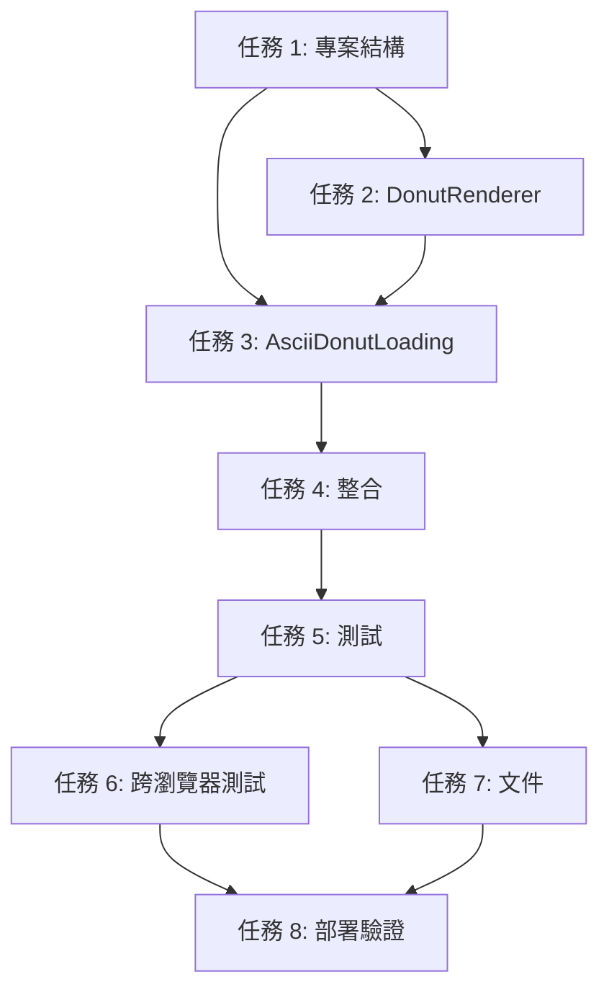

# 任務清單

## 任務概述

本文件定義 ASCII Donut Loading 功能的實作任務，將需求和設計轉換為可執行的開發工作項目。

### 任務編號規則
- 主要任務：1, 2, 3, 4...（依序編號）
- 子任務：1.1, 1.2, 2.1, 2.2...（最多兩層）
- 任務描述使用自然語言，聚焦於「要達成什麼」而非「如何實作」

### 需求追溯
每個任務都標註對應的需求編號（EARS），確保完整覆蓋所有需求。

---

## 任務 1：建立專案結構與配置模組 ✅

**目標**：建立核心檔案結構和配置管理系統，為後續實作奠定基礎

### 任務 1.1：建立核心檔案結構 ✅
**描述**：建立 ASCII Donut Loading 功能所需的檔案和目錄結構

**需求追溯**：6.1

**驗收標準**：
- ✅ 建立 `src/components/loading/` 目錄
- ✅ 建立 `src/lib/` 目錄（如果不存在）
- ✅ 建立以下檔案：
  - ✅ `src/lib/donutConfig.ts`
  - ✅ `src/lib/donutRenderer.ts`
  - ✅ `src/components/loading/AsciiDonutLoading.tsx`

### 任務 1.2：實作配置模組 ✅
**描述**：定義和實作 Donut 渲染器的配置介面、預設值和驗證邏輯

**需求追溯**：6.1, 6.2, 6.3

**驗收標準**：
- ✅ 定義 `DonutRendererConfig` TypeScript 介面，包含所有配置參數（width, height, R1, R2, K1, K2, thetaSpacing, phiSpacing, luminanceChars）
- ✅ 實作 `DEFAULT_DONUT_CONFIG` 預設配置常數（width: 80, height: 24, R1: 1, R2: 2, K1: 30, K2: 5, thetaSpacing: 0.07, phiSpacing: 0.02, luminanceChars: ".,-~:;=!*#$@"）
- ✅ 實作 `LOW_PERFORMANCE_CONFIG` 降級配置常數（減少解析度和增加步進）
- ✅ 實作 `mergeDonutConfig()` 函數，用於合併自訂配置與預設配置，並驗證參數有效性
- ✅ 確保配置驗證邏輯檢查所有數值參數 > 0
- ✅ **測試結果**：15/15 測試通過

---

## 任務 2：實作 DonutRenderer 核心渲染引擎 ✅

**目標**：實作基於數學原理的 3D 圓環體渲染邏輯，包含所有核心計算模組

**實作狀態**：✅ 已完成
- ✅ 建立 DonutRenderer 類別基礎架構
- ✅ 實作圓環體（Torus）幾何計算
- ✅ 實作旋轉矩陣變換
- ✅ 實作透視投影
- ✅ 實作 Z-buffer 深度測試
- ✅ 實作光照計算與 ASCII 字元映射
- ✅ 整合 render() 方法主邏輯
- ✅ 實作資源清理方法
- ✅ **測試結果**：16/16 測試通過

### 任務 2.1：建立 DonutRenderer 類別基礎架構
**描述**：定義 DonutRenderer 類別的基本結構、建構子和內部資料結構

**需求追溯**：1.1, 6.1

**驗收標準**：
- 建立 `DonutRenderer` TypeScript 類別
- 實作建構子接受 `DonutRendererConfig` 參數
- 初始化 z-buffer（使用 `Float32Array`，大小為 width × height）
- 初始化 output buffer（二維陣列 `string[][]`，大小為 height × width）
- 宣告內部狀態變數：`sinA`, `cosA`, `sinB`, `cosB`（用於快取三角函數值）

### 任務 2.2：實作圓環體（Torus）幾何計算
**描述**：實作圓環體參數方程式，生成 3D 表面點座標

**需求追溯**：1.1, 1.2, 1.3

**驗收標準**：
- 實作雙重迴圈遍歷 θ (theta) 和 φ (phi) 參數（範圍 0 到 2π）
- 使用 thetaSpacing 和 phiSpacing 作為步進值
- 計算圓環體表面點的 3D 座標：
  - 圓圈座標：`circle_x = R2 + R1 * cos(theta)`, `circle_y = R1 * sin(theta)`
  - 最終座標：`x = circle_x * (cos(B) * cos(phi) + sin(A) * sin(B) * sin(phi)) - circle_y * cos(A) * sin(B)`
  - 最終座標：`y = circle_x * (sin(B) * cos(phi) - sin(A) * cos(B) * sin(phi)) + circle_y * cos(A) * cos(B)`
  - 最終座標：`z = K2 + cos(A) * circle_x * sin(phi) + circle_y * sin(A)`

### 任務 2.3：實作旋轉矩陣變換
**描述**：實作 X 軸和 Z 軸的 3D 旋轉矩陣，創造旋轉動畫效果

**需求追溯**：1.4, 3.2

**驗收標準**：
- 在 `render()` 方法開始時，快取 `sin(angleA)`, `cos(angleA)`, `sin(angleB)`, `cos(angleB)` 到內部變數
- 將快取的三角函數值應用於圓環體座標計算（已在任務 2.2 整合）
- 確保旋轉邏輯正確實作 X 軸（angleA）和 Z 軸（angleB）旋轉

### 任務 2.4：實作透視投影
**描述**：將 3D 座標轉換為 2D 螢幕座標

**需求追溯**：1.7

**驗收標準**：
- 實作透視投影公式：`screenX = (width / 2) + (K1 * x / z)`
- 實作透視投影公式：`screenY = (height / 2) - (K1 * y / z)`
- 將 `screenX` 和 `screenY` 四捨五入為整數（螢幕像素座標）
- 檢查座標是否在螢幕範圍內（0 <= x < width, 0 <= y < height）

### 任務 2.5：實作 Z-buffer 深度測試
**描述**：使用 Z-buffer 演算法確保正確的前後遮蔽關係

**需求追溯**：1.6

**驗收標準**：
- 計算 z-buffer 索引：`index = screenY * width + screenX`
- 比較當前點的 z 值與 z-buffer 中的值
- 只有當當前 z 值大於（更靠近觀察者）z-buffer 中的值時，才更新 output buffer
- 更新 z-buffer 為新的 z 值

### 任務 2.6：實作光照計算與 ASCII 字元映射
**描述**：計算表面法向量、光照亮度，並映射到對應的 ASCII 字元

**需求追溯**：1.5, 2.1, 2.2, 2.3

**驗收標準**：
- 計算表面法向量（基於 theta 和 phi 的偏微分）
- 定義光源方向向量（例如 `[0, 1, -1]` 歸一化）
- 計算法向量與光源方向的點積，得到亮度值
- 將亮度值歸一化到 [0, 1] 範圍
- 根據亮度值映射到 `luminanceChars` 字串中的對應字元（亮度 0 → ".", 最大亮度 → "@"）
- 將字元寫入 output buffer 的 `[screenY][screenX]` 位置

### 任務 2.7：實作 render() 方法主邏輯
**描述**：整合所有計算模組，實作完整的單幀渲染邏輯

**需求追溯**：1.1, 1.2, 1.3, 1.4, 1.5, 1.6, 1.7

**驗收標準**：
- 實作 `render(angleA: number, angleB: number): string` 公開方法
- 在渲染前重置 z-buffer（填充 0）和 output buffer（填充空格 " "）
- 依序執行：快取三角函數 → 遍歷 theta/phi → 計算座標 → 透視投影 → 深度測試 → 光照計算 → 字元映射
- 將 output buffer 轉換為字串：每行 join 為字串，行與行之間用 '\n' 連接
- 返回完整的 ASCII 字串

### 任務 2.8：實作資源清理方法
**描述**：實作 dispose() 方法，用於清理記憶體資源

**需求追溯**：3.5, 6.1

**驗收標準**：
- 實作 `dispose(): void` 公開方法
- 清空或重置 z-buffer 和 output buffer（設為 null 或空陣列）
- 允許垃圾回收釋放記憶體

---

## 任務 3：實作 AsciiDonutLoading React 元件 ✅

**目標**：建立使用者介面元件，整合 DonutRenderer 並管理動畫生命週期

**實作狀態**：✅ 已完成
- ✅ 建立元件基本結構
- ✅ 實作 Fallout 主題樣式
- ✅ 實作無障礙屬性
- ✅ 實作狀態管理
- ✅ 實作 prefers-reduced-motion 偵測
- ✅ 實作動畫循環邏輯
- ✅ 實作動畫清理邏輯
- ✅ 實作效能監控與降級邏輯
- ✅ 實作靜態回退模式
- ✅ 實作 requestAnimationFrame polyfill
- ✅ **測試結果**：16/16 測試通過

### 任務 3.1：建立元件基本結構
**描述**：定義 AsciiDonutLoading 元件的 Props 介面和基本 JSX 結構

**需求追溯**：4.1, 4.2, 5.4

**驗收標準**：
- 定義 `AsciiDonutLoadingProps` TypeScript 介面，包含：
  - `message?: string`（預設 "INITIALIZING VAULT RESIDENT STATUS..."）
  - `forceFallback?: boolean`（測試用）
  - `config?: Partial<DonutRendererConfig>`（自訂配置）
- 建立 functional component 並匯出
- 宣告 `'use client'` 指令（Next.js Client Component）
- 返回基本 JSX 結構：外層 div 容器 + `<pre>` 元素 + 文字提示

### 任務 3.2：實作 Fallout 主題樣式
**描述**：應用 Pip-Boy 綠色主題、等寬字體和 CRT 終端機視覺效果

**需求追溯**：2.4, 2.5, 5.1, 5.2, 5.3, 5.4, 5.5

**驗收標準**：
- 外層容器使用 Tailwind classes：`min-h-screen flex flex-col items-center justify-center bg-black`
- `<pre>` 元素使用：`font-mono text-pip-boy-green whitespace-pre`
- 確保 `white-space: pre` 樣式保持 ASCII 格式
- 文字提示使用：`font-mono text-pip-boy-green/80 text-sm mt-4`
- （可選）加入 CRT 掃描線效果 CSS 類別或內聯樣式

### 任務 3.3：實作無障礙屬性
**描述**：加入適當的 ARIA 標籤和語意標記，支援螢幕閱讀器

**需求追溯**：4.6

**驗收標準**：
- 外層容器加入 `role="status"` 屬性
- 外層容器加入 `aria-live="polite"` 屬性
- `<pre>` 元素加入 `aria-label="Loading animation"` 或類似描述
- 文字提示確保對螢幕閱讀器可訪問（不使用 `aria-hidden`）

### 任務 3.4：實作狀態管理
**描述**：使用 React hooks 管理動畫狀態和效能監控資料

**需求追溯**：3.2, 3.5

**驗收標準**：
- 使用 `useRef` 管理 `<pre>` 元素引用
- 使用 `useRef` 管理 DonutRenderer 實例
- 使用 `useRef` 管理 requestAnimationFrame ID
- 使用 `useState` 或 `useRef` 管理 `angleA` 和 `angleB` 狀態
- 使用 `useState` 管理 `currentFPS` 狀態（用於降級偵測）
- 使用 `useState` 管理 `useFallback` 狀態（是否使用靜態模式）

### 任務 3.5：實作 prefers-reduced-motion 偵測
**描述**：偵測使用者的無障礙偏好設定，決定是否停用動畫

**需求追溯**：7.5

**驗收標準**：
- 使用 `window.matchMedia('(prefers-reduced-motion: reduce)')` 偵測偏好設定
- 在元件 mount 時執行偵測（使用 `useEffect`）
- 當偵測到 `prefers-reduced-motion: reduce` 時，設定 `useFallback = true`
- 監聽偏好設定變化（使用 `addEventListener('change', ...)`）

### 任務 3.6：實作動畫循環邏輯
**描述**：使用 requestAnimationFrame 實作流暢的動畫循環，並整合幀跳過機制

**需求追溯**：3.1, 3.2, 3.3, 3.4

**驗收標準**：
- 在 `useEffect` 中初始化 DonutRenderer 實例
- 定義目標 FPS（24 FPS）和幀間隔（1000 / 24 ≈ 41.67ms）
- 實作基於時間的幀跳過邏輯：
  - 使用 `performance.now()` 獲取當前時間戳
  - 只有當 `deltaTime >= frameInterval` 時才執行渲染
  - 更新 `lastFrameTime` 為 `currentTime - (deltaTime % frameInterval)`
- 在動畫幀中呼叫 `renderer.render(angleA, angleB)` 獲取 ASCII 字串
- 更新 `<pre>` 元素的 `textContent` 為渲染結果
- 遞增 `angleA` 和 `angleB`（例如 `angleA += 0.04`, `angleB += 0.02`）
- 使用 `requestAnimationFrame` 遞迴呼叫自身

### 任務 3.7：實作動畫清理邏輯
**描述**：確保元件卸載時正確停止動畫並釋放資源

**需求追溯**：3.5

**驗收標準**：
- 在 `useEffect` 的清理函數中呼叫 `cancelAnimationFrame(animationId)`
- 呼叫 `renderer.dispose()` 清理渲染器資源
- 確保清理函數在元件 unmount 時執行

### 任務 3.8：實作效能監控與降級邏輯
**描述**：持續監控動畫 FPS，當效能不足時自動降級

**需求追溯**：3.1, 7.2, 7.4

**驗收標準**：
- 在動畫循環中計數幀數（`frameCount++`）
- 每 60 幀計算一次平均 FPS：`fps = 60000 / (currentTime - lastFPSCheck)`
- 當 FPS < 15 時觸發降級：
  - 第一級降級：減少解析度（使用 `LOW_PERFORMANCE_CONFIG` 重新初始化渲染器）
  - 第二級降級：增加角度步進（減少渲染頻率）
  - 最終回退：設定 `useFallback = true`，顯示靜態 ASCII 圖案
- 更新 `currentFPS` 狀態（可在開發模式顯示）

### 任務 3.9：實作靜態回退模式
**描述**：當動畫無法執行時，顯示靜態的 ASCII Donut 圖案

**需求追溯**：7.1, 7.4

**驗收標準**：
- 定義一個靜態的 ASCII Donut 字串常數（手動繪製或預渲染一個角度的結果）
- 當 `useFallback === true` 或 `forceFallback === true` 時，跳過動畫邏輯
- 直接將靜態字串設定為 `<pre>` 元素的內容
- 仍然顯示 loading 文字提示

### 任務 3.10：實作 requestAnimationFrame polyfill
**描述**：為不支援 requestAnimationFrame 的舊瀏覽器提供 setTimeout 回退

**需求追溯**：7.1

**驗收標準**：
- 偵測 `typeof requestAnimationFrame === 'undefined'`
- 使用 `setTimeout(callback, 1000 / 24)` 作為 polyfill
- 同樣實作 `cancelAnimationFrame` polyfill（使用 `clearTimeout`）

---

## 任務 4：整合到 ZustandAuthProvider ✅

**目標**：將 AsciiDonutLoading 元件整合到應用程式的 loading 流程中

**實作狀態**：✅ 已完成
- ✅ 修改 ZustandAuthProvider 元件
- ✅ 驗證整合無副作用
- ✅ 生產建構成功

### 任務 4.1：修改 ZustandAuthProvider 元件
**描述**：替換靜態 loading 文字為 AsciiDonutLoading 元件

**需求追溯**：4.1, 4.3, 4.4

**驗收標準**：
- 在 `src/components/providers/ZustandAuthProvider.tsx` 中 import `AsciiDonutLoading`
- 找到 `!isInitialized` 條件渲染的 loading 區塊（目前第 13-19 行）
- 替換靜態文字 div 為 `<AsciiDonutLoading message="INITIALIZING VAULT RESIDENT STATUS..." />`
- 保持外層容器的 `min-h-screen flex items-center justify-center` 樣式
- 確保 `isInitialized = true` 後正確卸載 AsciiDonutLoading 元件

### 任務 4.2：驗證整合無副作用
**描述**：確認整合不影響應用程式的初始化流程和其他功能

**需求追溯**：4.4, 4.5

**驗收標準**：
- 驗證應用程式初始化流程正常（使用者狀態載入、認證流程等）
- 驗證其他 loading 元件（`LoadingSpinner`, `loading-state`）未受影響
- 驗證 Provider 嵌套順序未改變
- 驗證無 console 錯誤或警告

---

## 任務 5：建立測試套件

**目標**：建立完整的測試覆蓋，確保功能正確性和穩定性

### 任務 5.1：建立測試檔案結構
**描述**：建立單元測試和整合測試所需的檔案

**需求追溯**：6.6

**驗收標準**：
- 建立 `src/lib/__tests__/donutConfig.test.ts`
- 建立 `src/lib/__tests__/donutRenderer.test.ts`
- 建立 `src/components/loading/__tests__/AsciiDonutLoading.test.tsx`
- 建立 `src/components/providers/__tests__/ZustandAuthProvider.test.tsx`（如果不存在）

### 任務 5.2：實作 donutConfig 單元測試
**描述**：測試配置管理模組的功能

**需求追溯**：6.1, 6.2, 6.6

**驗收標準**：
- 測試 `DEFAULT_DONUT_CONFIG` 所有值合法且 > 0
- 測試 `mergeDonutConfig()` 正確合併自訂配置
- 測試 `mergeDonutConfig()` 驗證並拒絕無效配置（例如 width <= 0）
- 測試 `LOW_PERFORMANCE_CONFIG` 的值符合預期

### 任務 5.3：實作 donutRenderer 單元測試
**描述**：測試核心渲染引擎的數學計算正確性

**需求追溯**：1.1, 1.2, 1.3, 1.4, 1.5, 1.6, 1.7, 6.6

**驗收標準**：
- 測試 DonutRenderer 建構子正確初始化 z-buffer 和 output buffer
- 測試 `render()` 返回的字串長度正確（height 行 × width 字元）
- 測試 `render()` 包含預期的 ASCII 字元（來自 `luminanceChars`）
- 測試不同 `angleA` 和 `angleB` 產生不同的輸出（驗證旋轉邏輯）
- 測試 z-buffer 深度遮蔽邏輯（可使用簡化場景驗證）
- 測試 `dispose()` 正確清理資源

### 任務 5.4：實作 AsciiDonutLoading 整合測試
**描述**：使用 React Testing Library 測試元件行為

**需求追溯**：3.1, 3.5, 4.6

**驗收標準**：
- 測試元件正確渲染 `<pre>` 元素和文字提示
- 測試 `forceFallback` prop 觸發靜態模式
- 測試元件包含正確的 ARIA 屬性（`role="status"`, `aria-live="polite"`）
- 測試元件 unmount 時不產生 console 錯誤（驗證清理邏輯）
- 使用 `jest.useFakeTimers()` 和 `jest.advanceTimersByTime()` 測試動畫邏輯（可選）

### 任務 5.5：實作 ZustandAuthProvider 整合測試
**描述**：測試 AsciiDonutLoading 與 Provider 的整合

**需求追溯**：4.1, 4.4

**驗收標準**：
- 測試 `isInitialized = false` 時顯示 AsciiDonutLoading 元件
- 測試 `isInitialized = true` 時移除 AsciiDonutLoading 並顯示主要內容
- 測試 Provider 嵌套結構正確

---

## 任務 6：跨瀏覽器測試與優化

**目標**：確保功能在所有支援的瀏覽器和裝置上正常運作

### 任務 6.1：執行跨瀏覽器手動測試
**描述**：在主要瀏覽器上手動測試動畫效果和效能

**需求追溯**：7.1, 7.3

**驗收標準**：
- 在 Chrome（最新版 + 前兩版）測試動畫流暢度和視覺效果
- 在 Firefox（最新版 + 前兩版）測試動畫流暢度和視覺效果
- 在 Safari（最新版 + 前兩版）測試動畫流暢度和視覺效果
- 在 iOS Safari（行動裝置）測試動畫和響應式佈局
- 在 Chrome Mobile（行動裝置）測試動畫和響應式佈局
- 記錄各瀏覽器的 FPS 表現

### 任務 6.2：執行無障礙測試
**描述**：使用自動化工具和手動測試驗證無障礙標準

**需求追溯**：4.6, 7.5

**驗收標準**：
- 使用 axe-core 或 Lighthouse 執行無障礙檢測，確保無嚴重錯誤
- 使用 NVDA 或 VoiceOver 螢幕閱讀器測試 loading 狀態可被正確朗讀
- 驗證鍵盤導航不受 loading 元件干擾
- 驗證 `prefers-reduced-motion` 偏好設定正確觸發靜態模式

### 任務 6.3：執行效能測試
**描述**：使用 Chrome DevTools 和 Lighthouse 測量效能指標

**需求追溯**：3.1, 3.6

**驗收標準**：
- 測量動畫 FPS，確保 >= 24 FPS（目標 30 FPS）
- 測量初始渲染時間，確保 < 100ms
- 使用 Performance Monitor 測量 CPU 使用率，確保單核心 < 30%
- 測量記憶體使用，確保穩定無洩漏（5 秒內無明顯增長）
- 使用 Lighthouse 測量整體效能分數，確保不因 loading 動畫下降

### 任務 6.4：行動裝置響應式優化
**描述**：確保動畫在小螢幕和低效能裝置上正常運作

**需求追溯**：7.3

**驗收標準**：
- 驗證動畫在小螢幕（<= 768px）上正確縮放
- 使用 Chrome DevTools CPU throttling（4x slowdown）測試降級邏輯
- 在真實行動裝置上測試（至少一台 iOS 和一台 Android 裝置）
- 確保文字提示在行動裝置上可讀且對齊

---

## 任務 7：文件撰寫與程式碼審查

**目標**：撰寫清晰的程式碼註解和文件，並進行程式碼審查

### 任務 7.1：撰寫程式碼註解
**描述**：為核心邏輯加入清晰的註解說明數學原理和實作邏輯

**需求追溯**：6.5

**驗收標準**：
- 在 `donutRenderer.ts` 中為關鍵數學計算加入註解（圓環體方程式、旋轉矩陣、透視投影）
- 在 `AsciiDonutLoading.tsx` 中為動畫邏輯和降級機制加入註解
- 在 `donutConfig.ts` 中說明各配置參數的作用
- 使用 JSDoc 格式為公開方法撰寫文件註解

### 任務 7.2：撰寫開發者文件
**描述**：建立 README 或 inline 文件說明如何使用和調整 ASCII Donut Loading

**需求追溯**：6.1, 6.2

**驗收標準**：
- 在 `src/components/loading/README.md` 或元件檔案頂部撰寫使用說明
- 說明如何自訂配置參數（R1, R2, FPS 等）
- 說明降級策略和回退機制
- 提供範例程式碼展示如何使用 `AsciiDonutLoading` 元件

### 任務 7.3：執行程式碼審查
**描述**：進行自我審查或團隊審查，確保程式碼品質

**需求追溯**：6.1, 6.5

**驗收標準**：
- 檢查所有 TypeScript 型別定義完整且正確
- 檢查無 ESLint 錯誤或警告
- 檢查程式碼風格符合專案規範（使用 Prettier 格式化）
- 檢查無 console.log 或其他除錯程式碼遺留（開發模式除外）
- 檢查所有 import 路徑正確（相對路徑或 alias）

---

## 任務 8：部署與驗證

**目標**：將功能部署到開發/測試環境，並進行最終驗證

### 任務 8.1：本地開發環境驗證
**描述**：在本地執行完整的使用者流程測試

**需求追溯**：4.1, 4.4

**驗收標準**：
- 執行 `pnpm run dev` 啟動開發伺服器
- 訪問首頁，驗證 ASCII Donut 動畫正常顯示
- 等待應用程式初始化完成，驗證動畫正確消失
- 重新整理頁面，驗證動畫再次出現
- 檢查瀏覽器 console 無錯誤或警告

### 任務 8.2：建立生產構建並測試
**描述**：建立生產版本並驗證效能和行為

**需求追溯**：3.1, 4.5

**驗收標準**：
- 執行 `pnpm run build` 建立生產版本
- 執行 `pnpm start` 啟動生產伺服器
- 驗證動畫在生產模式下正常運作
- 驗證 bundle size 未顯著增加（< 50KB 額外大小）
- 使用 Lighthouse 測量生產版本效能，確保分數不下降

### 任務 8.3：E2E 測試（Playwright）
**描述**：建立和執行端到端自動化測試

**需求追溯**：4.1, 4.4, 7.6

**驗收標準**：
- 建立 `tests/e2e/ascii-donut-loading.spec.ts`（或類似路徑）
- 測試：訪問首頁 → 驗證 loading 動畫出現 → 等待初始化 → 驗證動畫消失
- 測試：截圖驗證 ASCII donut 視覺效果（至少 1 個快照）
- 測試：模擬 `prefers-reduced-motion` 偏好，驗證靜態模式啟用
- 執行 `npx playwright test` 確保所有測試通過

### 任務 8.4：最終驗收檢查
**描述**：根據遷移策略的驗證檢查點執行最終審核

**需求追溯**：所有需求

**驗收標準**：
- [ ] 所有單元測試通過（`pnpm test`）
- [ ] 所有整合測試通過
- [ ] 所有 E2E 測試通過
- [ ] 跨瀏覽器測試通過（至少 3 個瀏覽器）
- [ ] 無障礙測試通過（axe-core 無錯誤）
- [ ] 效能指標達標（FPS ≥ 24, CPU < 30%, 初始渲染 < 100ms）
- [ ] 程式碼審查完成
- [ ] 文件撰寫完成

---

## 任務優先順序

### P0（關鍵路徑）
必須完成才能進行後續工作：
- 任務 1：建立專案結構與配置模組
- 任務 2：實作 DonutRenderer 核心渲染引擎
- 任務 3：實作 AsciiDonutLoading React 元件
- 任務 4：整合到 ZustandAuthProvider

### P1（核心功能）
核心功能驗證，應在初步整合後立即執行：
- 任務 5：建立測試套件
- 任務 6：跨瀏覽器測試與優化

### P2（品質保證）
提升品質和可維護性：
- 任務 7：文件撰寫與程式碼審查
- 任務 8：部署與驗證

---

## 依賴關係

---

## 估時（人日）

| 任務 | 估時 | 累計 |
|------|------|------|
| 任務 1 | 0.5 天 | 0.5 天 |
| 任務 2 | 2.5 天 | 3 天 |
| 任務 3 | 2 天 | 5 天 |
| 任務 4 | 0.5 天 | 5.5 天 |
| 任務 5 | 1.5 天 | 7 天 |
| 任務 6 | 1.5 天 | 8.5 天 |
| 任務 7 | 1 天 | 9.5 天 |
| 任務 8 | 0.5 天 | 10 天 |

**總估時**：10 個工作天（約 2 週）

---

## 風險與緩解

### 風險 1：效能不足導致動畫卡頓
**機率**：中
**影響**：高
**緩解**：
- 實作漸進降級策略（任務 3.8）
- 提早進行效能測試（任務 6.3）
- 預先準備靜態回退模式（任務 3.9）

### 風險 2：跨瀏覽器相容性問題
**機率**：低
**影響**：中
**緩解**：
- 使用標準 Web API（requestAnimationFrame, Math）
- 實作 polyfill（任務 3.10）
- 提早進行跨瀏覽器測試（任務 6.1）

### 風險 3：無障礙標準違規
**機率**：低
**影響**：高
**緩解**：
- 提早實作無障礙屬性（任務 3.3）
- 使用自動化工具檢測（任務 6.2）
- 支援 prefers-reduced-motion（任務 3.5）

---

## 完成定義（Definition of Done）

一個任務被視為「完成」需滿足：

1. **功能完成**：實作的功能符合任務描述和驗收標準
2. **測試通過**：相關的單元測試、整合測試通過
3. **程式碼審查**：至少一次自我審查或團隊審查
4. **文件完成**：必要的註解和文件已撰寫
5. **無遺留問題**：無未解決的 TODO 或 FIXME 標記
6. **效能達標**：符合效能需求（FPS, CPU, 記憶體）
7. **無障礙合規**：通過無障礙檢測（axe-core, 螢幕閱讀器測試）

---

## 變更日誌

| 日期 | 版本 | 變更內容 |
|------|------|---------|
| 2025-10-09 | 1.0 | 初始版本，基於需求和設計文件生成 |
