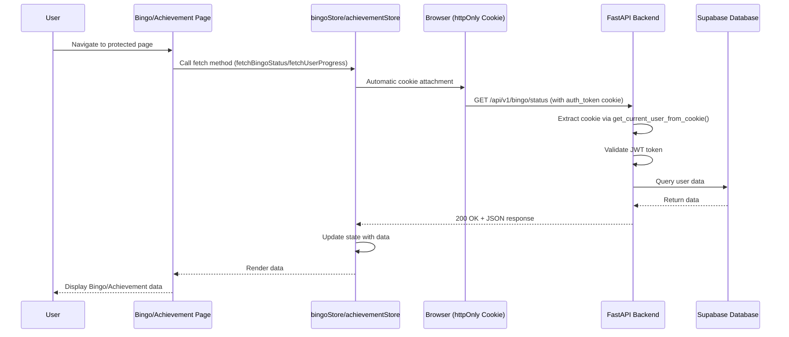
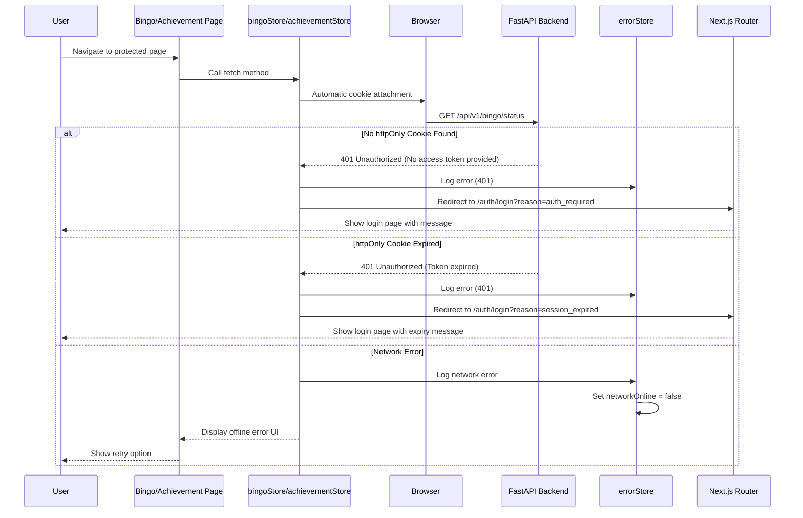
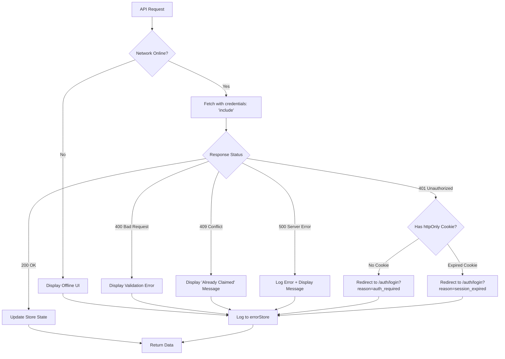
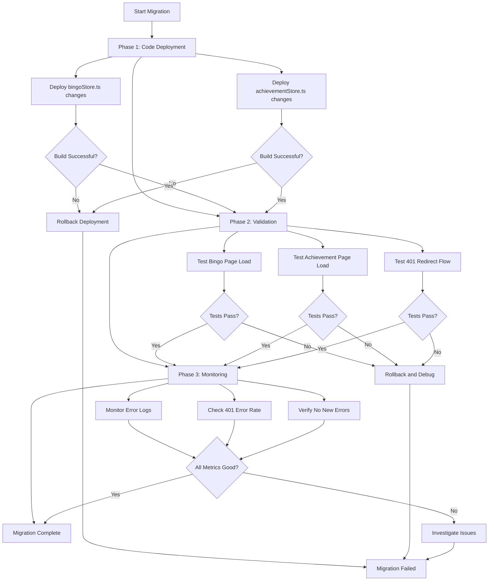

# Design Document: Authentication Token Error Fix

## Overview

**Purpose**: This fix eliminates critical authentication token errors affecting Bingo and Achievement pages by aligning token retrieval with the existing httpOnly cookie-based architecture. The current implementation incorrectly attempts to retrieve tokens from localStorage, causing "No access token provided" and "ReferenceError: token is not defined" errors.

**Users**: All authenticated users accessing Bingo and Achievement features will benefit from seamless authentication without page crashes or error messages.

**Impact**: Modifies token retrieval mechanisms in `bingoStore.ts` and `achievementStore.ts` to use httpOnly cookies (via credentials) instead of localStorage, aligning with the established frontend-backend architecture refactor (completed in earlier spec).

### Goals
- Eliminate "No access token provided" errors on Bingo page
- Fix "ReferenceError: token is not defined" crashes on Achievement page
- Align token handling with httpOnly cookie architecture
- Ensure consistent authentication across all protected pages

### Non-Goals
- Implementing new authentication mechanisms (httpOnly cookies already exist)
- Modifying backend authentication logic (already correctly validates cookies)
- Changing global API client architecture (already supports credentials)

## Architecture

### Existing Architecture Analysis

**Current Architecture Pattern** (Established in `frontend-backend-architecture-refactor`):
- **Authentication Storage**: JWT tokens stored in httpOnly cookies (set by backend)
- **Token Transmission**: Automatic via `credentials: 'include'` in fetch requests
- **Token Management**: Backend sets/clears cookies via `/api/v1/auth/login` and `/api/v1/auth/logout`
- **Frontend State**: `authStore.ts` manages user state and token expiry tracking via localStorage (expiry timestamp only, not token itself)

**Current Problem**:
- `bingoStore.ts` and `achievementStore.ts` both implement legacy token retrieval:
  ```typescript
  const getAuthToken = (): string | null => {
    if (typeof window === 'undefined') return null
    return localStorage.getItem('pip-boy-token') // WRONG: Token not in localStorage
  }

  const createAuthHeaders = (): HeadersInit => {
    const token = getAuthToken()
    return {
      'Content-Type': 'application/json',
      ...(token ? { 'Authorization': `Bearer ${token}` } : {}) // WRONG: Manual header
    }
  }
  ```
- This code predates the architecture refactor and never retrieves a valid token, causing backend to reject requests with 401 Unauthorized

**Existing Integration Points to Preserve**:
- `authStore.ts` initialization and token expiry monitoring
- Backend dependency injection via `get_current_user_from_cookie()` (in `dependencies.py`)
- API client's httpOnly cookie handling via `credentials: 'include'`
- Error handling in `errorStore.ts`

### High-Level Architecture

```mermaid
graph TB
    subgraph Frontend["Frontend (Browser)"]
        BingoPage[Bingo Page]
        AchievementPage[Achievement Page]
        BingoStore[bingoStore.ts]
        AchievementStore[achievementStore.ts]
        AuthStore[authStore.ts]
        ErrorStore[errorStore.ts]
    end

    subgraph Browser["Browser Storage"]
        HttpOnlyCookie[httpOnly Cookie<br/>auth_token]
        LocalStorage[localStorage<br/>pip-boy-auth-state]
    end

    subgraph Backend["Backend (FastAPI)"]
        AuthEndpoints[/api/v1/auth/*]
        BingoEndpoints[/api/v1/bingo/*]
        AchievementEndpoints[/api/v1/achievements/*]
        Dependencies[dependencies.py<br/>get_current_user_from_cookie]
    end

    BingoPage --> BingoStore
    AchievementPage --> AchievementStore
    BingoStore --> HttpOnlyCookie
    AchievementStore --> HttpOnlyCookie
    BingoStore --> BingoEndpoints
    AchievementStore --> AchievementEndpoints
    AuthStore --> LocalStorage
    AuthStore --> AuthEndpoints
    AuthEndpoints --> HttpOnlyCookie
    BingoEndpoints --> Dependencies
    AchievementEndpoints --> Dependencies
    Dependencies --> HttpOnlyCookie
    BingoStore --> ErrorStore
    AchievementStore --> ErrorStore

    style HttpOnlyCookie fill:#90EE90
    style LocalStorage fill:#FFD700
    style Dependencies fill:#87CEEB
```

**Architecture Integration**:
- **Existing Pattern Preserved**: httpOnly cookie-based authentication (no changes to authStore or backend)
- **New Components**: None (only modifications to existing stores)
- **Technology Alignment**: Uses existing fetch API with `credentials: 'include'`
- **Steering Compliance**: Maintains type safety, error handling, and authentication principles from tech.md

### Technology Alignment

**Frontend Technology Stack** (No Changes Required):
- **Existing**: Zustand stores with timedFetch for API calls
- **Existing**: httpOnly cookie authentication via `credentials: 'include'`
- **Existing**: Error tracking via errorStore.ts
- **Modification**: Remove legacy localStorage token retrieval from bingoStore and achievementStore

**Backend Technology Stack** (No Changes Required):
- **Existing**: FastAPI dependency injection via `get_current_user_from_cookie()`
- **Existing**: Cookie parsing and JWT validation
- **Existing**: 401 Unauthorized responses for missing/invalid tokens

## System Flows

### Successful Authentication Flow (Existing - No Changes)



### Error Handling Flow (Corrected)



## Requirements Traceability

| Requirement | Summary | Components Modified | Flows |
|-------------|---------|---------------------|-------|
| 1.1-1.5 | Token Retrieval from Supabase Auth | authStore.ts (existing), bingoStore.ts, achievementStore.ts | No new flows (reuses existing httpOnly cookie mechanism) |
| 2.1-2.5 | Authorization Header Management | bingoStore.ts, achievementStore.ts | Successful Authentication Flow |
| 3.1-3.5 | Bingo Page Token Error Resolution | bingoStore.ts | Successful Authentication Flow, Error Handling Flow |
| 4.1-4.6 | Achievement Page Token Error Resolution | achievementStore.ts | Successful Authentication Flow, Error Handling Flow |
| 5.1-5.6 | Error Handling and User Redirection | bingoStore.ts, achievementStore.ts, errorStore.ts | Error Handling Flow |
| 6.1-6.5 | Global Authentication State Consistency | authStore.ts (existing - no changes) | Existing auth initialization flow |
| 7.1-7.5 | Token Validation and Refresh | authStore.ts (existing - no changes) | Existing token expiry monitoring |
| 8.1-8.5 | Defensive Error Handling | bingoStore.ts, achievementStore.ts | Error Handling Flow |
| 9.1-9.5 | Audit and Logging | bingoStore.ts, achievementStore.ts, errorStore.ts | Error Handling Flow |

## Components and Interfaces

### Authentication Layer (Existing - Reference Only)

#### authStore.ts (No Changes Required)

**Responsibility & Boundaries**:
- **Primary Responsibility**: Manage user authentication state and token expiry tracking
- **Domain Boundary**: Authentication domain (login, logout, session management)
- **Data Ownership**: User object, OAuth state, token expiry timestamp (stored in localStorage as `pip-boy-auth-state`)
- **Transaction Boundary**: Single-user authentication lifecycle

**Current Implementation** (Already Correct):
- Uses httpOnly cookies for token storage (set by backend)
- Tracks token expiry via localStorage (timestamp only, not token itself)
- Monitors token expiry every 5 minutes via `startTokenExpiryMonitor()`
- Redirects to login when token expires

**Why No Changes Needed**:
- authStore correctly delegates token storage to httpOnly cookies
- Only stores expiry timestamp in localStorage for client-side expiry detection
- All authentication flows already work correctly with httpOnly cookies

### Data Access Layer (Modifications Required)

#### bingoStore.ts

**Responsibility & Boundaries**:
- **Primary Responsibility**: Manage bingo game state (card, numbers, claims, rewards)
- **Domain Boundary**: Bingo feature domain
- **Data Ownership**: Bingo card data, claimed numbers, line counts, rewards
- **Transaction Boundary**: Single user's bingo game state

**Dependencies**:
- **Inbound**: Bingo page component (`src/app/bingo/page.tsx`)
- **Outbound**:
  - Backend API (`/api/v1/bingo/*` endpoints)
  - errorStore (for error tracking)
  - timedFetch (for performance metrics)
- **External**: Browser httpOnly cookie (automatic via credentials)

**Current Implementation Issues**:
```typescript
// INCORRECT: Attempts to retrieve token from localStorage
const getAuthToken = (): string | null => {
  if (typeof window === 'undefined') return null
  return localStorage.getItem('pip-boy-token') // Token never exists here
}

// INCORRECT: Manually constructs Authorization header
const createAuthHeaders = (): HeadersInit => {
  const token = getAuthToken()
  return {
    'Content-Type': 'application/json',
    ...(token ? { 'Authorization': `Bearer ${token}` } : {}) // Always empty
  }
}
```

**Corrected Implementation**:

**Service Interface**:
```typescript
interface BingoStore {
  // State (no changes)
  dailyNumber: number | null
  userCard: number[][] | null
  claimedNumbers: Set<number>
  lineCount: number
  hasReward: boolean
  isLoading: boolean
  error: string | null
  hasClaimed: boolean
  hasCard: boolean

  // Actions (signatures unchanged)
  fetchBingoStatus: () => Promise<void>
  createCard: (numbers: number[]) => Promise<void>
  claimDailyNumber: () => Promise<void>
  checkLines: () => Promise<void>
  fetchHistory: (month: string) => Promise<BingoHistoryRecord | null>
  fetchRewards: () => Promise<RewardRecord[]>
  reset: () => void
  clearError: () => void
}
```

**API Contract**:

| Method | Endpoint | Request Headers | Response | Error Handling |
|--------|----------|----------------|----------|----------------|
| GET | /api/v1/bingo/status | credentials: 'include' | BingoStatusResponse | 401 → Redirect to login |
| POST | /api/v1/bingo/card | credentials: 'include' + JSON body | BingoCardResponse | 401 → Redirect, 400 → Validation error |
| POST | /api/v1/bingo/claim | credentials: 'include' | ClaimResult | 401 → Redirect, 409 → Already claimed |
| GET | /api/v1/bingo/check-lines | credentials: 'include' | LineCheckResult | 401 → Redirect |

**Implementation Changes**:
```typescript
// REMOVE: getAuthToken() function entirely
// REMOVE: createAuthHeaders() function entirely

// REPLACE apiRequest function to use credentials:
async function apiRequest<T>(endpoint: string, options: RequestInit = {}): Promise<T> {
  const url = `${API_BASE_URL}${endpoint}`

  try {
    // Network check (existing)
    if (typeof navigator !== 'undefined' && !navigator.onLine) {
      useErrorStore.getState().setNetworkOnline(false)
      throw new Error('Network offline')
    }

    // Corrected fetch with credentials
    const response = await timedFetch(url, {
      ...options,
      credentials: 'include', // CRITICAL: Enables httpOnly cookie transmission
      headers: {
        'Content-Type': 'application/json',
        ...options.headers,
        // NO Authorization header needed - cookies are automatic
      },
    })

    // Handle 401 responses
    if (response.status === 401) {
      // Redirect to login
      if (typeof window !== 'undefined') {
        const reason = response.statusText === 'Token expired'
          ? 'session_expired'
          : 'auth_required'
        window.location.href = `/auth/login?reason=${reason}`
      }
      throw new Error('Authentication required')
    }

    // Handle other errors (existing logic)
    if (!response.ok) {
      const errorData = await response.json().catch(() => ({ detail: 'Unknown error' }))
      useErrorStore.getState().pushError({
        source: 'api',
        message: errorData.detail || `HTTP ${response.status}`,
        statusCode: response.status,
      })
      throw new Error(errorData.detail || `HTTP ${response.status}`)
    }

    return await response.json()
  } catch (error: any) {
    // Error logging (existing logic, enhanced)
    console.error(`[BingoStore] API Error: ${endpoint}`, error)
    useErrorStore.getState().pushError({
      source: 'api',
      message: error.message || 'API request failed',
      detail: { endpoint, method: options.method || 'GET' },
    })
    throw error
  }
}
```

**Preconditions**:
- User must be authenticated (httpOnly cookie must exist)
- Browser must support httpOnly cookies
- Network must be available

**Postconditions**:
- On success: State updated with API response data
- On 401: User redirected to login page
- On error: Error logged to errorStore and thrown to caller

**Invariants**:
- httpOnly cookie is never accessed directly by JavaScript
- All API requests use `credentials: 'include'`
- Token is never stored in localStorage

#### achievementStore.ts

**Responsibility & Boundaries**:
- **Primary Responsibility**: Manage achievement system state (definitions, progress, rewards)
- **Domain Boundary**: Achievement/gamification domain
- **Data Ownership**: Achievement definitions, user progress, claim status
- **Transaction Boundary**: Single user's achievement progress

**Dependencies**:
- **Inbound**: Achievement page component (`src/app/achievements/page.tsx`)
- **Outbound**:
  - Backend API (`/api/v1/achievements/*` endpoints)
  - errorStore (for error tracking)
  - timedFetch (for performance metrics)
- **External**: Browser httpOnly cookie (automatic via credentials)

**Current Implementation Issues**:
```typescript
// IDENTICAL ISSUE to bingoStore.ts
const getAuthToken = (): string | null => {
  if (typeof window === 'undefined') return null
  return localStorage.getItem('pip-boy-token') // Token never exists
}

const createAuthHeaders = (): HeadersInit => {
  const token = getAuthToken()
  return {
    'Content-Type': 'application/json',
    ...(token ? { 'Authorization': `Bearer ${token}` } : {}) // Always empty
  }
}
```

**Corrected Implementation**:

**Service Interface**:
```typescript
interface AchievementStore {
  // State (no changes)
  achievements: Achievement[]
  userProgress: UserAchievementProgress[]
  summary: AchievementSummary | null
  newlyUnlockedAchievements: UserAchievementProgress[]
  currentFilter: AchievementCategory | null
  isLoading: boolean
  error: string | null
  isClaiming: boolean

  // Actions (signatures unchanged)
  fetchAchievements: (category?: AchievementCategory) => Promise<void>
  fetchUserProgress: (category?: AchievementCategory) => Promise<void>
  fetchSummary: () => Promise<void>
  claimReward: (code: string) => Promise<ClaimRewardResponse | null>
  setFilter: (category: AchievementCategory | null) => void
  clearNewlyUnlocked: () => void
  reset: () => void
  clearError: () => void
}
```

**API Contract**:

| Method | Endpoint | Request Headers | Response | Error Handling |
|--------|----------|----------------|----------|----------------|
| GET | /api/v1/achievements | credentials: 'include' | AchievementListResponse | 401 → Redirect to login |
| GET | /api/v1/achievements/progress | credentials: 'include' | UserProgressSummaryResponse | 401 → Redirect |
| GET | /api/v1/achievements/summary | credentials: 'include' | AchievementSummary | 401 → Redirect |
| POST | /api/v1/achievements/{code}/claim | credentials: 'include' | ClaimRewardResponse | 401 → Redirect, 409 → Already claimed |

**Implementation Changes**:
```typescript
// REMOVE: getAuthToken() function entirely
// REMOVE: createAuthHeaders() function entirely

// REPLACE apiRequest function (IDENTICAL to bingoStore changes):
async function apiRequest<T>(endpoint: string, options: RequestInit = {}): Promise<T> {
  const url = `${API_BASE_URL}${endpoint}`

  try {
    // Network check
    if (typeof navigator !== 'undefined' && !navigator.onLine) {
      useErrorStore.getState().setNetworkOnline(false)
      throw new Error('Network offline')
    }

    // Corrected fetch with credentials
    const response = await timedFetch(url, {
      ...options,
      credentials: 'include', // CRITICAL: Enables httpOnly cookie transmission
      headers: {
        'Content-Type': 'application/json',
        ...options.headers,
        // NO Authorization header needed
      },
    })

    // Handle 401 responses (IDENTICAL to bingoStore)
    if (response.status === 401) {
      if (typeof window !== 'undefined') {
        const reason = response.statusText === 'Token expired'
          ? 'session_expired'
          : 'auth_required'
        window.location.href = `/auth/login?reason=${reason}`
      }
      throw new Error('Authentication required')
    }

    // Handle other errors
    if (!response.ok) {
      const errorData = await response.json().catch(() => ({ detail: 'Unknown error' }))
      useErrorStore.getState().pushError({
        source: 'api',
        message: errorData.detail || `HTTP ${response.status}`,
        statusCode: response.status,
      })
      throw new Error(errorData.detail || `HTTP ${response.status}`)
    }

    return await response.json()
  } catch (error: any) {
    console.error(`[AchievementStore] API Error: ${endpoint}`, error)
    useErrorStore.getState().pushError({
      source: 'api',
      message: error.message || 'API request failed',
      detail: { endpoint, method: options.method || 'GET' },
    })
    throw error
  }
}
```

**Preconditions**: (Identical to bingoStore)
- User must be authenticated (httpOnly cookie must exist)
- Browser must support httpOnly cookies
- Network must be available

**Postconditions**: (Identical to bingoStore)
- On success: State updated with API response data
- On 401: User redirected to login page
- On error: Error logged to errorStore and thrown to caller

**Invariants**: (Identical to bingoStore)
- httpOnly cookie is never accessed directly by JavaScript
- All API requests use `credentials: 'include'`
- Token is never stored in localStorage

### Integration Strategy

**Modification Approach**:
- **Refactor existing code** in `bingoStore.ts` and `achievementStore.ts`
- Remove legacy token retrieval functions (`getAuthToken`, `createAuthHeaders`)
- Update `apiRequest` function to use `credentials: 'include'`
- Add 401 error handling with login redirection

**Backward Compatibility**:
- **No breaking changes**: Store interfaces remain unchanged
- **No migration needed**: httpOnly cookies already exist and work
- **Existing pages continue to function**: Only internal implementation changes

**Migration Path**:
1. Deploy code changes to stores (no database or backend changes)
2. Verify existing users' httpOnly cookies still work (they will)
3. Monitor error logs for any 401 responses (should disappear)
4. Confirm Bingo and Achievement pages load without errors

## Data Models

### Authentication State (Existing - No Changes)

**Domain Model**:
- **User Entity**: Managed by authStore (id, email, OAuth provider, profile picture)
- **Token Expiry State**: Stored in localStorage as `pip-boy-auth-state` (JSON with `expiresAt` timestamp)
- **httpOnly Cookie**: Stored by browser (name: `auth_token`, contains JWT, httpOnly=true, secure=true, sameSite=strict)

**Business Rules & Invariants**:
- Token expiry timestamp in localStorage must match JWT expiry claim (validated on backend)
- httpOnly cookie must exist for all authenticated API requests
- authStore.user must be null when httpOnly cookie is absent or expired

**No Changes Required**: This model is already correct and operational.

## Error Handling

### Error Strategy

**Error Categories and Responses**:

**User Errors (Authentication)**:
- **401 Unauthorized (No token)**: Redirect to `/auth/login?reason=auth_required` with message "請先登入以存取此功能"
- **401 Unauthorized (Token expired)**: Redirect to `/auth/login?reason=session_expired` with message "您的登入已過期，請重新登入"
- **403 Forbidden**: Display error message "無權限存取此資源" (rare, indicates backend authorization issue)

**System Errors**:
- **Network Offline**: Display offline indicator, log to errorStore, enable retry button
- **500 Internal Server Error**: Log to errorStore, display generic error message "伺服器錯誤，請稍後再試"
- **Timeout**: Retry request (existing timedFetch logic), display timeout message if all retries fail

**Business Logic Errors**:
- **400 Bad Request (Invalid input)**: Display field-level validation errors
- **409 Conflict (Already claimed)**: Display "今日已領取" message for Bingo, "成就已領取" for Achievements

### Error Flow Visualization



### Monitoring

**Error Tracking**:
- All API errors logged to `errorStore.ts` with:
  - `source: 'api'`
  - `message`: User-friendly error message
  - `detail`: Technical details (endpoint, method, status code)
  - `statusCode`: HTTP status code

**Logging Enhancements**:
```typescript
// Enhanced error logging in apiRequest
catch (error: any) {
  console.error(`[${storeName}] API Error: ${endpoint}`, {
    status: error.status,
    message: error.message,
    endpoint,
    method: options.method || 'GET',
    timestamp: new Date().toISOString(),
  })

  useErrorStore.getState().pushError({
    source: 'api',
    message: error.message || 'API request failed',
    detail: {
      endpoint,
      method: options.method || 'GET',
      statusCode: error.status,
    },
  })

  throw error
}
```

**Health Monitoring**:
- Existing errorStore network status tracking continues to function
- 401 errors should disappear from logs after fix deployment
- Monitor for unexpected 403 errors (would indicate backend authorization bugs)

## Testing Strategy

### Unit Tests

**bingoStore.ts**:
1. `apiRequest` function uses `credentials: 'include'`
2. `apiRequest` redirects to login on 401 response
3. `apiRequest` logs errors to errorStore
4. `getAuthToken` and `createAuthHeaders` functions removed (verify deletion)
5. All store actions call `apiRequest` correctly (no manual Authorization headers)

**achievementStore.ts**:
1. `apiRequest` function uses `credentials: 'include'` (identical to bingoStore)
2. `apiRequest` redirects to login on 401 response (identical to bingoStore)
3. `apiRequest` logs errors to errorStore (identical to bingoStore)
4. `getAuthToken` and `createAuthHeaders` functions removed (verify deletion)
5. All store actions call `apiRequest` correctly (no manual Authorization headers)

### Integration Tests

**Bingo Page Authentication Flow**:
1. User with valid httpOnly cookie navigates to `/bingo` → Page loads successfully with bingo data
2. User with no httpOnly cookie navigates to `/bingo` → Redirected to `/auth/login?reason=auth_required`
3. User with expired httpOnly cookie navigates to `/bingo` → Redirected to `/auth/login?reason=session_expired`
4. User claims daily number → API request succeeds with valid cookie
5. Network goes offline during request → Display offline UI with retry option

**Achievement Page Authentication Flow**:
1. User with valid httpOnly cookie navigates to `/achievements` → Page loads successfully with achievement data
2. User with no httpOnly cookie navigates to `/achievements` → Redirected to `/auth/login?reason=auth_required`
3. User with expired httpOnly cookie navigates to `/achievements` → Redirected to `/auth/login?reason=session_expired`
4. User claims achievement reward → API request succeeds with valid cookie
5. User attempts to claim already-claimed achievement → Display "成就已領取" error

### E2E Tests

**Critical User Paths**:
1. **Login → Bingo Page**:
   - User logs in at `/auth/login` → httpOnly cookie set
   - User navigates to `/bingo` → Page loads without errors
   - User sees bingo card and daily number
   - User claims daily number → Success message displayed

2. **Login → Achievement Page**:
   - User logs in at `/auth/login` → httpOnly cookie set
   - User navigates to `/achievements` → Page loads without errors
   - User sees achievement list and progress
   - User claims unlocked achievement → Success message and reward displayed

3. **Session Expiry Handling**:
   - User has valid session → Navigates to `/bingo` → Page loads
   - Wait for token expiry (simulate by clearing cookie)
   - User attempts to claim daily number → Redirected to login with expiry message
   - User logs in again → Redirected back to `/bingo`

4. **Offline Handling**:
   - User navigates to `/achievements` while offline
   - Display offline indicator
   - User goes back online → Retry button enabled
   - User clicks retry → Achievement data loads successfully

### Performance Tests

**API Response Times** (Baseline: Existing, Target: No degradation):
1. `/api/v1/bingo/status` with valid cookie: <100ms (no change expected)
2. `/api/v1/achievements/progress` with valid cookie: <200ms (no change expected)
3. 401 response handling overhead: <50ms (new, should be negligible)
4. errorStore logging overhead: <10ms (existing, should remain unchanged)

**Notes**:
- Performance should not degrade (only removing unnecessary localStorage lookups)
- 401 redirect adds minimal overhead (single location.href assignment)
- httpOnly cookie transmission is automatic and has no JavaScript overhead

## Security Considerations

**Authentication Security** (No Changes - Already Secure):
- **httpOnly Cookie Protection**: Tokens inaccessible to JavaScript (prevents XSS token theft)
- **Secure Flag**: Cookies only transmitted over HTTPS in production
- **SameSite=Strict**: Prevents CSRF attacks
- **Token Expiry**: JWT tokens expire after 30 minutes (enforced by backend)

**Improvements from This Fix**:
- **Eliminates localStorage Token Storage Attempt**: Code no longer tries to access non-existent `pip-boy-token` in localStorage (was a potential confusion vector)
- **Consistent Security Model**: All stores now use same httpOnly cookie mechanism (reduces attack surface)
- **No Token Exposure**: Tokens never appear in JavaScript scope (previously, code attempted to retrieve them but failed - now code doesn't even try)

**Threat Model** (Unchanged):
- **XSS Attacks**: Mitigated by httpOnly cookies (already in place)
- **CSRF Attacks**: Mitigated by SameSite=Strict (already in place)
- **Token Theft**: Impossible via JavaScript (httpOnly flag, already in place)
- **Session Fixation**: Prevented by backend token rotation on login (already in place)

**No New Security Risks Introduced**:
- This fix only removes incorrect code; it does not add new functionality
- Security posture improves slightly (reduces code complexity and potential confusion)

## Migration Strategy



**Process**:

**Phase 1: Code Deployment (No Backend Changes Required)**
1. Deploy updated `bingoStore.ts` with:
   - Removed `getAuthToken()` and `createAuthHeaders()`
   - Updated `apiRequest()` to use `credentials: 'include'`
   - Added 401 error handling with login redirection
2. Deploy updated `achievementStore.ts` with identical changes
3. Verify Next.js build succeeds without TypeScript errors
4. **Rollback Trigger**: Build failures or TypeScript errors

**Phase 2: Validation (Immediate Post-Deployment)**
1. Test Bingo page load with valid authentication
   - Expected: Page loads successfully, no console errors
2. Test Achievement page load with valid authentication
   - Expected: Page loads successfully, no console errors
3. Test 401 redirect flow (simulate by clearing httpOnly cookie)
   - Expected: Redirect to `/auth/login?reason=auth_required`
4. Test session expiry flow (wait for token expiry)
   - Expected: Redirect to `/auth/login?reason=session_expired`
5. **Rollback Trigger**: Any test fails, or new errors appear in console

**Phase 3: Monitoring (First 24 Hours)**
1. Monitor error logs for:
   - Reduced 401 errors (should approach zero for authenticated users)
   - No new ReferenceError or TypeError related to token
   - No increase in other error types
2. Check user reports for:
   - Bingo page load failures (should be zero)
   - Achievement page crashes (should be zero)
3. Verify metrics:
   - Page load success rate increases
   - API request success rate increases
   - No performance degradation
4. **Validation Checkpoints**:
   - After 1 hour: Quick check of error logs
   - After 6 hours: Comprehensive error analysis
   - After 24 hours: Full validation (migration complete if metrics good)

**Rollback Strategy**:
- Git revert to previous commit (stores only, no database changes)
- Redeploy previous version of `bingoStore.ts` and `achievementStore.ts`
- No data loss risk (no database changes, no state migrations)
- Rollback time: <5 minutes

**Success Criteria**:
- Zero "No access token provided" errors in backend logs
- Zero "ReferenceError: token is not defined" errors in frontend logs
- Bingo and Achievement pages load successfully for all authenticated users
- 401 redirect flow works correctly (users redirected to login when not authenticated)
- No performance degradation in API response times
