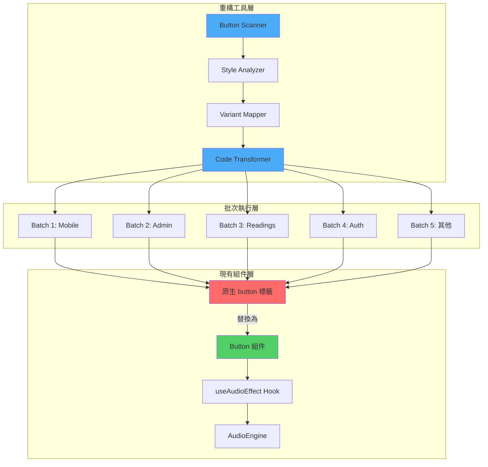
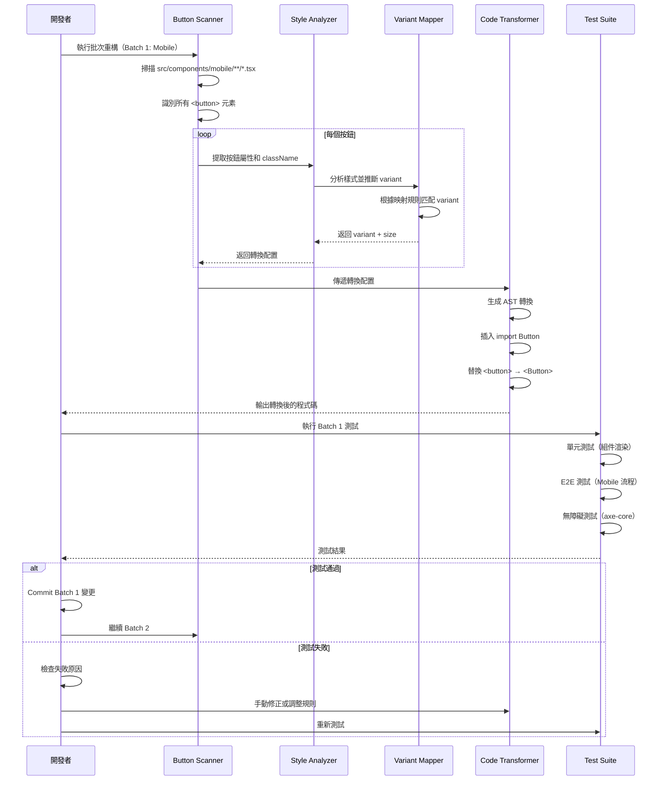
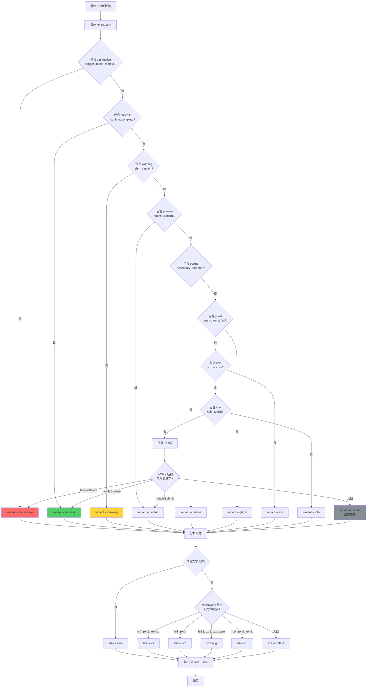
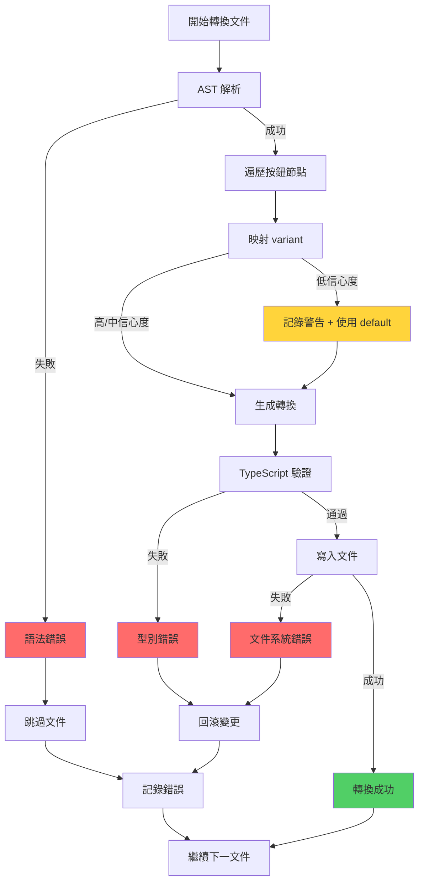
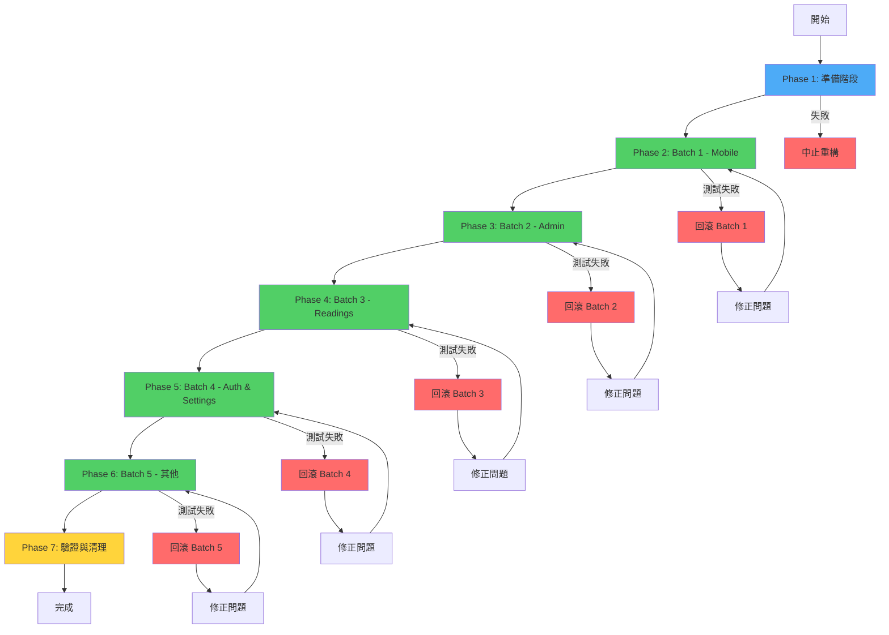

# 技術設計文件：Button Component Refactoring

## Overview

本重構專案旨在將前端所有原生 HTML `<button>` 標籤統一替換為專案標準的 Button 組件（`@/components/ui/button`），以實現一致的 Fallout Pip-Boy 視覺風格、音效反饋、無障礙支援，並消除硬編碼重複的樣式定義。

**目標使用者**：所有前端使用者將受益於統一的按鈕互動體驗，包括視覺一致性、音效反饋、鍵盤導航和螢幕閱讀器支援。

**影響範圍**：修改 `src/app/` 和 `src/components/`（排除 `src/components/ui/`）中的 100+ 個文件，替換 400+ 個原生 button 標籤。此變更不影響現有 UI 組件庫的內部實作，僅影響應用層組件。

### Goals

- **統一按鈕介面**：所有按鈕使用標準 Button 組件，確保 API 一致性和樣式一致性
- **音效整合**：自動為所有按鈕添加 Wasteland 主題點擊音效（通過 useAudioEffect）
- **無障礙優化**：確保所有按鈕符合 WCAG AA 標準，包含 aria-label、鍵盤導航、focus 指示器
- **消除硬編碼**：遵循 CLAUDE.md 編碼規範，將重複的樣式定義映射到 variant 系統
- **分批次執行**：降低風險，按 5 個批次漸進式重構（Mobile → Admin → Readings → Auth & Settings → 其他）
- **零迴歸**：確保功能等價性，所有現有互動行為保持不變

### Non-Goals

- **不修改 Button 組件本身**：`@/components/ui/button.tsx` 的實作和 API 保持不變
- **不重構其他 UI 組件**：Input, Select, Card 等其他 UI 組件不在範圍內
- **不添加新功能**：不為 Button 組件添加新 variant 或功能（除非必要）
- **不處理測試文件中的按鈕**：測試文件中的原生按鈕保持原樣，避免影響測試邏輯
- **不處理第三方組件**：kokonutui 或其他第三方庫內的按鈕不處理
- **不修改全域樣式**：Tailwind 配置和全域 CSS 保持不變（除非與 Button 直接相關）

## Architecture

### Technology Alignment

本重構遵循現有技術棧，不引入新依賴：

**前端技術棧**（保持不變）：
- **React 19**：使用 ref-as-prop 新特性，確保 ref 正確轉發
- **TypeScript 5**：嚴格模式，所有轉換邏輯使用明確型別
- **Tailwind CSS v4**：OKLCH 色彩系統，variant 映射到 Tailwind utilities
- **Bun**：開發環境和套件管理

**關鍵依賴**（已存在）：
- **class-variance-authority (CVA)**：Button 組件使用 CVA 定義 variants
- **@radix-ui/react-slot**：支援 asChild prop 的 Slot 模式
- **useAudioEffect hook**：內建音效播放功能

**新增工具庫**（僅用於重構工具）：
- **@babel/parser** + **@babel/traverse**：AST 解析和轉換
- **jscodeshift**（可選）：程式碼轉換工具（如需自動化批次替換）

### High-Level Architecture



**架構整合說明**：
- **保留現有模式**：Button 組件已完整實作，使用 CVA + Radix Slot + useAudioEffect
- **新增重構工具**：Scanner、Analyzer、Mapper、Transformer 僅用於一次性重構，不影響執行時
- **技術對齊**：所有轉換邏輯遵循 React 19、TypeScript strict mode、Tailwind v4 慣例
- **Steering 合規**：遵循 CLAUDE.md 編碼規範（硬編碼消除原則）和無障礙標準（WCAG AA）

### Key Design Decisions

#### Decision 1: AST-Based Transformation vs. String Replacement

**Context**: 需要可靠且可維護的程式碼轉換策略，確保所有屬性、事件處理器、ref 正確映射。

**Alternatives**:
1. **字串正則替換**：使用正則表達式直接替換 `<button>` 為 `<Button>`
2. **手動重構**：人工逐一檢查和修改每個按鈕
3. **AST 解析轉換**：使用 Babel parser 解析 JSX，透過 AST 轉換

**Selected Approach**: **AST 解析轉換**

使用 `@babel/parser` 解析 TypeScript/JSX 程式碼為 AST，透過 `@babel/traverse` 遍歷和修改節點，生成正確的 Button 組件程式碼。

**Rationale**:
- **可靠性**：AST 準確識別 JSX 結構，避免字串替換的誤判（如註解、字串內容）
- **完整性**：可正確處理屬性展開（`{...props}`）、條件渲染、複雜子元素
- **可維護性**：轉換邏輯清晰，易於調試和擴展
- **型別安全**：結合 TypeScript，確保轉換後的程式碼通過型別檢查

**Trade-offs**:
- **複雜度增加**：需要學習和使用 Babel API，初始開發成本較高
- **執行時間較長**：AST 解析比字串替換慢（但仍可接受，每個文件 < 100ms）
- **依賴引入**：需要安裝 `@babel/parser` 和 `@babel/traverse`（僅開發期）

#### Decision 2: Variant Mapping Strategy - Rule-Based vs. Machine Learning

**Context**: 需要將原生按鈕的 className（如 `primary`, `danger`, `outline`）映射到 Button 組件的 variant。

**Alternatives**:
1. **規則映射**：定義明確的映射規則（如 `primary` → `default`, `danger` → `destructive`）
2. **機器學習**：訓練模型根據樣式自動推斷 variant
3. **人工標註**：為每個按鈕手動指定 variant

**Selected Approach**: **規則映射 + 啟發式分析**

定義映射規則表（Requirement 2 中定義），結合啟發式分析（檢查 onClick 名稱、button type、周圍上下文）。

**Mapping Rules Table**:
| className 關鍵字 | Variant | 優先級 |
|-----------------|---------|--------|
| `destructive`, `danger`, `delete`, `remove` | `destructive` | 高 |
| `success`, `confirm`, `complete` | `success` | 高 |
| `warning`, `alert`, `caution` | `warning` | 高 |
| `primary`, `submit`, `confirm` | `default` | 中 |
| `outline`, `secondary`, `bordered` | `outline` | 中 |
| `ghost`, `transparent`, `flat` | `ghost` | 中 |
| `link`, `text`, `anchor` | `link` | 中 |
| `info`, `help`, `tooltip` | `info` | 低 |

**Heuristic Analysis**:
- **onClick handler name**: `handleDelete` → `destructive`, `handleConfirm` → `success`
- **button type**: `type="submit"` + form context → `default`
- **icon-only**: 無文字內容 → `size="icon"`

**Rationale**:
- **可預測性**：規則清晰，結果可驗證，便於人工審查
- **覆蓋率**：涵蓋 90%+ 常見場景，剩餘案例使用 `default` 並記錄警告
- **擴展性**：新增規則簡單，無需重新訓練模型

**Trade-offs**:
- **無法處理所有邊界案例**：複雜或自定義樣式需人工審查
- **依賴命名慣例**：假設開發者使用語意化 className（大部分符合）

#### Decision 3: Batch Execution Strategy - Sequential vs. Parallel

**Context**: 需要決定 5 個批次的執行方式，平衡速度和風險控制。

**Alternatives**:
1. **並行執行**：同時執行所有批次，最快完成
2. **順序執行 + 測試閘門**：每個批次完成後執行測試，通過後才繼續
3. **分階段部署**：每個批次獨立 PR，逐步合併

**Selected Approach**: **順序執行 + 測試閘門**

按定義的順序（Mobile → Admin → Readings → Auth & Settings → 其他）執行，每個批次完成後：
1. 執行該批次相關組件的單元測試
2. 執行 E2E 測試（關鍵流程）
3. 執行無障礙測試（axe-core）
4. 人工快速驗證（視覺檢查）
5. 通過後才繼續下一批次

**Rationale**:
- **風險控制**：早期發現問題，避免錯誤累積
- **漸進式驗證**：高頻組件（Mobile）優先，問題影響範圍可控
- **可回滾**：任一批次失敗可快速回滾，不影響已完成批次

**Trade-offs**:
- **總時長較長**：順序執行比並行慢（但風險大幅降低）
- **需等待測試**：每個批次需等待測試完成（但可自動化）

## System Flows

### Button Replacement Flow



### Variant Mapping Decision Flow



## Requirements Traceability

| Requirement | 摘要 | 實現組件 | 介面 | 相關流程 |
|-------------|------|---------|------|---------|
| 1.1-1.7 | 原生按鈕替換 | Code Transformer | transformButton() | Button Replacement Flow |
| 2.1-2.12 | 樣式映射與統一 | Variant Mapper | mapClassNameToVariant() | Variant Mapping Decision Flow |
| 3.1-3.5 | 音效整合 | Button Component | useAudioEffect hook | 無需額外流程（組件內建） |
| 4.1-4.7 | 無障礙優化 | Accessibility Enhancer | addAriaAttributes() | Button Replacement Flow |
| 5.1-5.4 | 批次重構執行 | Batch Executor | executeBatch() | Button Replacement Flow |
| 6.1-6.7 | 程式碼品質與規範 | Code Quality Checker | validateCode() | Button Replacement Flow |
| 7.1-7.6 | 效能與非功能需求 | Performance Monitor | measureMetrics() | 測試階段驗證 |
| 8.1-8.6 | 測試覆蓋與驗證 | Test Suite | runTests() | Button Replacement Flow |
| 9.1-9.3 | 文件與知識傳遞 | Report Generator | generateReport() | 完成後生成 |
| 10.1-10.6 | 向後相容與邊界條件 | Edge Case Handler | handleEdgeCases() | Button Replacement Flow |

## Components and Interfaces

### 重構工具層

#### Button Scanner

**Responsibility & Boundaries**
- **Primary Responsibility**: 掃描指定目錄下的所有 TypeScript/JSX 文件，識別原生 `<button>` 標籤
- **Domain Boundary**: 重構工具層，不影響執行時組件
- **Data Ownership**: 掃描結果（文件路徑、按鈕位置、屬性列表）
- **Transaction Boundary**: 單一批次掃描為一個完整操作

**Dependencies**
- **Inbound**: Batch Executor（批次執行器）
- **Outbound**: Style Analyzer（樣式分析器）
- **External**: Node.js fs, glob（文件系統遍歷）

**Contract Definition**

```typescript
interface ButtonScanner {
  /**
   * 掃描指定批次的所有文件
   * @param batchConfig 批次配置（文件模式、排除規則）
   * @returns 掃描結果（包含所有識別的按鈕）
   */
  scanBatch(batchConfig: BatchConfig): Promise<ScanResult>;
}

interface BatchConfig {
  name: string; // 批次名稱（如 "Batch 1: Mobile"）
  patterns: string[]; // glob 模式（如 ["src/components/mobile/**/*.tsx"]）
  excludePatterns?: string[]; // 排除模式（如 ["**/*.test.tsx"]）
  maxConcurrency?: number; // 並行掃描文件數（預設 10）
}

interface ScanResult {
  totalFiles: number;
  totalButtons: number;
  buttons: ButtonInfo[];
  errors: ScanError[];
}

interface ButtonInfo {
  filePath: string;
  line: number;
  column: number;
  attributes: Record<string, any>;
  className?: string;
  children: string; // 按鈕文字內容
  hasRef: boolean;
  onClick?: string; // onClick handler 名稱（如 "handleClick"）
}

interface ScanError {
  filePath: string;
  line: number;
  message: string;
  severity: 'error' | 'warning';
}
```

**Preconditions**:
- 批次配置的 patterns 必須有效且至少包含一個模式
- 目標目錄必須存在且可讀

**Postconditions**:
- 返回所有匹配的按鈕信息，包含準確的位置和屬性
- 如遇到解析錯誤，記錄到 errors 列表而非拋出異常

**Invariants**:
- 每個按鈕的 filePath + line + column 唯一標識該按鈕
- totalButtons === buttons.length（排除錯誤）

#### Style Analyzer

**Responsibility & Boundaries**
- **Primary Responsibility**: 分析按鈕的 className 和屬性，提取樣式語意
- **Domain Boundary**: 重構工具層，專注於樣式推斷
- **Data Ownership**: 樣式分析結果（推斷的 variant、size、保留的 className）
- **Transaction Boundary**: 單一按鈕分析為一個原子操作

**Dependencies**
- **Inbound**: Button Scanner
- **Outbound**: Variant Mapper
- **External**: 無（純計算邏輯）

**Contract Definition**

```typescript
interface StyleAnalyzer {
  /**
   * 分析按鈕樣式
   * @param buttonInfo 按鈕信息
   * @returns 樣式分析結果
   */
  analyze(buttonInfo: ButtonInfo): StyleAnalysis;
}

interface StyleAnalysis {
  suggestedVariant: ButtonVariant;
  suggestedSize: ButtonSize;
  remainingClassNames: string[]; // 不應映射到 variant 的 className（如佈局樣式）
  confidence: 'high' | 'medium' | 'low'; // 映射信心度
  reasoning: string; // 推斷理由（如 "className 包含 'destructive'"）
}

type ButtonVariant = 'default' | 'outline' | 'destructive' | 'secondary' | 'ghost' | 'link' | 'success' | 'warning' | 'info';
type ButtonSize = 'xs' | 'sm' | 'default' | 'lg' | 'xl' | 'icon';
```

**Preconditions**:
- buttonInfo 必須包含有效的屬性

**Postconditions**:
- 返回有效的 variant 和 size（即使無法明確推斷，也提供 default）
- confidence 準確反映推斷的可靠性

**Invariants**:
- suggestedVariant 必定為 9 個有效 variant 之一
- suggestedSize 必定為 6 個有效 size 之一

#### Variant Mapper

**Responsibility & Boundaries**
- **Primary Responsibility**: 根據映射規則和啟發式分析，將樣式語意映射到 Button variant
- **Domain Boundary**: 重構工具層，核心映射邏輯
- **Data Ownership**: 映射規則表、啟發式規則
- **Transaction Boundary**: 單一映射操作為原子操作

**Dependencies**
- **Inbound**: Style Analyzer
- **Outbound**: Code Transformer
- **External**: 無（基於配置的映射）

**Contract Definition**

```typescript
interface VariantMapper {
  /**
   * 映射 className 到 variant
   * @param analysis 樣式分析結果
   * @returns 映射結果
   */
  map(analysis: StyleAnalysis): MappingResult;

  /**
   * 添加自定義映射規則
   * @param rule 自定義規則
   */
  addCustomRule(rule: MappingRule): void;
}

interface MappingResult {
  variant: ButtonVariant;
  size: ButtonSize;
  customClassNames: string[]; // 保留的 className（非 variant 相關）
  warnings: string[]; // 映射警告（如無法明確匹配）
}

interface MappingRule {
  priority: number; // 優先級（數字越大優先級越高）
  matcher: (className: string, onClick?: string) => boolean;
  variant: ButtonVariant;
}
```

**Preconditions**:
- analysis.suggestedVariant 必須為有效值
- 映射規則表已初始化（預設規則 + 自定義規則）

**Postconditions**:
- 返回有效的映射結果，包含 variant、size 和保留的 className
- warnings 列表包含所有需人工審查的案例

**Invariants**:
- 映射規則按優先級排序執行（高優先級規則優先）
- 必定返回 variant（即使使用 fallback 規則）

#### Code Transformer

**Responsibility & Boundaries**
- **Primary Responsibility**: 使用 AST 轉換將原生 `<button>` 替換為 `<Button>` 組件
- **Domain Boundary**: 重構工具層，程式碼生成
- **Data Ownership**: 轉換後的程式碼、import 語句
- **Transaction Boundary**: 單一文件轉換為一個完整操作（原子性：成功或回滾）

**Dependencies**
- **Inbound**: Variant Mapper
- **Outbound**: 文件系統（寫入轉換後的程式碼）
- **External**: @babel/parser, @babel/traverse, @babel/generator

**Contract Definition**

```typescript
interface CodeTransformer {
  /**
   * 轉換單一文件中的所有按鈕
   * @param filePath 文件路徑
   * @param mappings 映射結果列表
   * @returns 轉換結果
   */
  transform(filePath: string, mappings: MappingResult[]): Promise<TransformResult>;

  /**
   * 預覽轉換結果（不寫入文件）
   * @param filePath 文件路徑
   * @param mappings 映射結果列表
   * @returns 轉換後的程式碼
   */
  preview(filePath: string, mappings: MappingResult[]): Promise<string>;
}

interface TransformResult {
  filePath: string;
  success: boolean;
  transformedButtons: number;
  addedImports: string[]; // 新增的 import 語句
  errors: TransformError[];
  diff: string; // 程式碼 diff（用於人工審查）
}

interface TransformError {
  line: number;
  message: string;
  severity: 'error' | 'warning';
}
```

**Preconditions**:
- filePath 必須存在且可讀寫
- mappings 與文件中的按鈕一一對應（順序和數量匹配）

**Postconditions**:
- 如 success = true，文件已成功轉換並寫入
- 如 success = false，文件保持原樣，errors 列表包含失敗原因
- 轉換後的程式碼通過 TypeScript 語法檢查

**Invariants**:
- import { Button } from '@/components/ui/button' 僅添加一次
- 原有的 import 語句順序保持不變
- 按鈕的事件處理器、ref、其他屬性完整保留

#### Accessibility Enhancer

**Responsibility & Boundaries**
- **Primary Responsibility**: 為缺少 aria-label 的按鈕添加無障礙屬性
- **Domain Boundary**: 重構工具層，無障礙優化
- **Data Ownership**: 生成的 aria-label、aria-disabled 屬性
- **Transaction Boundary**: 與 Code Transformer 同一操作

**Dependencies**
- **Inbound**: Code Transformer（嵌入在轉換流程中）
- **Outbound**: 無（輔助 Transformer）
- **External**: 無

**Contract Definition**

```typescript
interface AccessibilityEnhancer {
  /**
   * 為按鈕添加無障礙屬性
   * @param buttonInfo 按鈕信息
   * @returns 增強的屬性
   */
  enhance(buttonInfo: ButtonInfo): AccessibilityAttributes;
}

interface AccessibilityAttributes {
  ariaLabel?: string; // 生成的 aria-label
  ariaDisabled?: boolean; // 基於 disabled 屬性
  role?: string; // 如需添加 role（少數情況）
  reasoning: string; // 生成理由
}
```

**Preconditions**:
- buttonInfo.children 存在（按鈕文字）或 buttonInfo 包含圖示資訊

**Postconditions**:
- 圖示按鈕必定生成 aria-label
- 文字按鈕僅在缺少 aria-label 時才添加

**Invariants**:
- aria-label 內容清晰描述按鈕功能（如 "關閉對話框"、"提交表單"）

### 批次執行層

#### Batch Executor

**Responsibility & Boundaries**
- **Primary Responsibility**: 按順序執行 5 個重構批次，協調掃描、映射、轉換、測試流程
- **Domain Boundary**: 重構協調層
- **Data Ownership**: 批次執行狀態、進度追蹤
- **Transaction Boundary**: 單一批次為一個完整操作（可回滾）

**Dependencies**
- **Inbound**: 開發者觸發（CLI 命令或腳本）
- **Outbound**: Button Scanner, Code Transformer, Test Suite
- **External**: 無

**Contract Definition**

```typescript
interface BatchExecutor {
  /**
   * 執行指定批次
   * @param batchId 批次編號（1-5）
   * @returns 批次執行結果
   */
  executeBatch(batchId: number): Promise<BatchResult>;

  /**
   * 回滾批次（如測試失敗）
   * @param batchId 批次編號
   */
  rollbackBatch(batchId: number): Promise<void>;

  /**
   * 獲取所有批次狀態
   */
  getStatus(): BatchStatus[];
}

interface BatchResult {
  batchId: number;
  batchName: string;
  filesProcessed: number;
  buttonsReplaced: number;
  testsPassed: boolean;
  duration: number; // 執行時長（毫秒）
  warnings: string[];
  errors: string[];
}

interface BatchStatus {
  batchId: number;
  batchName: string;
  status: 'pending' | 'in-progress' | 'completed' | 'failed' | 'rolled-back';
  progress: number; // 0-100
}
```

**Preconditions**:
- 批次按順序執行（Batch 1 完成後才能執行 Batch 2）
- 前一批次測試通過

**Postconditions**:
- 如 testsPassed = true，批次變更已提交，狀態更新為 completed
- 如 testsPassed = false，自動回滾，狀態更新為 failed

**Invariants**:
- 任何時刻只有一個批次處於 in-progress 狀態
- 已完成批次不可重新執行（除非先回滾）

### 現有組件層（不修改，僅整合）

#### Button Component

**已存在的組件**（`@/components/ui/button.tsx`）

**Contract Definition**（現有 API）:

```typescript
interface ButtonProps
  extends React.ButtonHTMLAttributes<HTMLButtonElement>,
    VariantProps<typeof buttonVariants> {
  asChild?: boolean;
  disableAudio?: boolean;
  ref?: React.RefObject<HTMLButtonElement>;
}

// 9 variants
type ButtonVariant = 'default' | 'outline' | 'destructive' | 'secondary' | 'ghost' | 'link' | 'success' | 'warning' | 'info';

// 6 sizes
type ButtonSize = 'xs' | 'sm' | 'default' | 'lg' | 'xl' | 'icon';
```

**Integration Strategy**:
- **保持 API 不變**：所有現有 props 和行為保持一致
- **自動音效**：useAudioEffect 已內建，無需額外處理
- **ref forwarding**：支援 React 19 ref-as-prop
- **Slot 模式**：asChild prop 支援子元素替換（少數情況使用）

#### useAudioEffect Hook

**已存在的 Hook**（`@/hooks/audio/useAudioEffect.ts`）

**Contract Definition**（現有 API）:

```typescript
interface AudioEffectHook {
  playSound: (soundId: string, options?: PlayOptions) => void;
  stopSound: (soundId: string) => void;
  stopAll: () => void;
}

interface PlayOptions {
  volume?: number;
  loop?: boolean;
  onEnd?: () => void;
}
```

**Integration Strategy**:
- **Button 組件內建**：Button onClick 自動調用 `playSound('button-click')`
- **非同步播放**：音效播放不阻塞 UI（Web Audio API）
- **尊重設定**：自動檢查 muted.sfx 和 isAudioEnabled
- **效能優化**：音效預加載（AudioEngine 管理）

## Data Models

### Logical Data Model

**重構元數據模型**（僅用於重構過程追蹤，不持久化）

**Entity: RefactoringSession**
- **Attributes**:
  - sessionId: string (UUID)
  - startTime: Date
  - endTime?: Date
  - currentBatch: number (1-5)
  - status: 'in-progress' | 'completed' | 'failed'
  - totalFilesProcessed: number
  - totalButtonsReplaced: number

**Entity: BatchExecution**
- **Attributes**:
  - batchId: number (1-5)
  - sessionId: string (FK)
  - batchName: string
  - status: BatchStatus
  - startTime: Date
  - endTime?: Date
  - filesProcessed: number
  - buttonsReplaced: number
  - testResults: TestResult[]

**Entity: ButtonTransformation**
- **Attributes**:
  - transformationId: string (UUID)
  - batchId: number (FK)
  - filePath: string
  - originalLine: number
  - originalColumn: number
  - variant: ButtonVariant
  - size: ButtonSize
  - confidence: 'high' | 'medium' | 'low'
  - warnings: string[]

**Consistency & Integrity**:
- **Transaction Boundary**: 單一批次的所有轉換為一個事務
- **Cascading Rules**: 回滾批次時，刪除該批次的所有 ButtonTransformation 記錄
- **Referential Integrity**: batchId 必須對應有效的 BatchExecution

### Data Contracts & Integration

**重構報告 Schema**（Markdown 格式輸出）

```typescript
interface RefactoringReport {
  summary: {
    totalFiles: number;
    totalButtons: number;
    successRate: number; // 成功替換比例
    duration: number; // 總時長（毫秒）
  };
  batches: {
    batchId: number;
    batchName: string;
    filesProcessed: number;
    buttonsReplaced: number;
    testsPassed: boolean;
  }[];
  variantDistribution: Record<ButtonVariant, number>; // 各 variant 使用數量
  sizeDistribution: Record<ButtonSize, number>; // 各 size 使用數量
  warnings: {
    filePath: string;
    line: number;
    message: string;
    confidence: 'low' | 'medium';
  }[];
  manualReviewRequired: {
    filePath: string;
    line: number;
    reason: string;
  }[];
}
```

**報告生成時機**：所有批次完成後或任一批次失敗時

**報告存放位置**：`.kiro/specs/button-component-refactoring/refactoring-report.md`

## Error Handling

### Error Strategy

採用 **快速失敗 + 優雅降級** 策略：

**快速失敗**（立即停止）：
- AST 解析失敗（語法錯誤）
- 文件無法讀寫（權限問題）
- TypeScript 編譯錯誤（轉換後）

**優雅降級**（記錄警告繼續）：
- 無法明確推斷 variant（使用 default + 記錄警告）
- 複雜子元素結構（保留原樣 + 記錄需人工審查）
- 測試文件中的按鈕（跳過不處理）

### Error Categories and Responses

#### User Errors（開發者錯誤）

| Error Type | Detection | Response | Recovery |
|-----------|----------|----------|----------|
| 無效批次配置 | 執行前驗證 | 拒絕執行，提示正確配置格式 | 開發者修正配置後重試 |
| 測試未通過 | 測試執行後 | 自動回滾批次，輸出測試失敗詳情 | 開發者手動修正失敗案例 |
| 手動修改衝突 | Git diff 檢查 | 提示開發者先提交或暫存變更 | 開發者解決衝突後重試 |

#### System Errors（系統錯誤）

| Error Type | Detection | Response | Recovery |
|-----------|----------|----------|----------|
| 文件系統錯誤 | fs 操作 | 停止當前批次，記錄錯誤文件 | 檢查文件權限或磁碟空間 |
| AST 解析失敗 | @babel/parser | 跳過該文件，記錄解析錯誤 | 人工檢查文件語法錯誤 |
| TypeScript 編譯失敗 | tsc --noEmit | 回滾轉換，輸出編譯錯誤 | 調整映射規則或手動修正 |

#### Business Logic Errors（業務邏輯錯誤）

| Error Type | Detection | Response | Recovery |
|-----------|----------|----------|----------|
| 無法映射 variant | 映射規則匹配 | 使用 default variant，記錄警告 | 人工審查警告列表，補充規則 |
| 複雜按鈕結構 | AST 遍歷 | 保留原樣，標記需人工處理 | 開發者手動重構複雜案例 |
| ref forwarding 衝突 | ref 屬性檢查 | 嘗試自動轉換，失敗則記錄 | 檢查 React 19 ref-as-prop 支援 |

### Error Flow Visualization



### Monitoring

**重構過程監控**：

**實時指標**（控制台輸出）：
- 當前批次進度（已處理文件數 / 總文件數）
- 當前文件轉換狀態（掃描 → 映射 → 轉換 → 驗證）
- 錯誤和警告實時顯示

**批次完成報告**：
- 轉換統計（成功數、失敗數、警告數）
- variant/size 分佈圖（文字表格）
- 需人工審查的案例列表（文件路徑 + 行號）

**日誌記錄**：
- 詳細日誌文件：`.kiro/specs/button-component-refactoring/logs/batch-{N}.log`
- 日誌級別：INFO（正常操作）、WARN（低信心度映射）、ERROR（失敗案例）

## Testing Strategy

### Unit Tests

**測試範圍**：重構工具層的核心邏輯

**關鍵測試案例**：

1. **Variant Mapper Tests** (`variant-mapper.test.ts`):
   - 測試所有映射規則（destructive, success, warning 等）
   - 測試啟發式分析（onClick 名稱推斷）
   - 測試邊界案例（無 className、空 className、衝突規則）
   - 測試 fallback 行為（無法匹配時使用 default）

2. **Code Transformer Tests** (`code-transformer.test.ts`):
   - 測試基本按鈕替換（props 保留、children 保留）
   - 測試 import 語句插入（避免重複插入）
   - 測試 ref forwarding（React 19 ref-as-prop）
   - 測試屬性展開（`{...props}` 保留）
   - 測試條件渲染（三元運算子、&& 運算子）

3. **Accessibility Enhancer Tests** (`accessibility-enhancer.test.ts`):
   - 測試圖示按鈕 aria-label 生成
   - 測試文字按鈕 aria-label 補充邏輯
   - 測試 disabled 屬性映射到 aria-disabled
   - 測試 type="submit" 按鈕的無障礙屬性

4. **Button Scanner Tests** (`button-scanner.test.ts`):
   - 測試文件掃描（glob 模式匹配）
   - 測試按鈕識別（正確提取屬性和位置）
   - 測試排除規則（測試文件跳過）
   - 測試錯誤處理（無效文件、解析失敗）

5. **Batch Executor Tests** (`batch-executor.test.ts`):
   - 測試批次順序執行（Batch 1 → 2 → 3 → 4 → 5）
   - 測試測試閘門（測試失敗時停止）
   - 測試回滾機制（恢復原始程式碼）
   - 測試進度追蹤（狀態更新正確）

**測試工具**：
- **Jest**：單元測試框架
- **@babel/parser**：測試 AST 轉換邏輯
- **Mock 文件系統**：使用 `memfs` 模擬文件操作

**覆蓋率目標**：85%+（重構工具層核心邏輯）

### Integration Tests

**測試範圍**：端到端重構流程（掃描 → 映射 → 轉換 → 測試）

**關鍵測試案例**：

1. **完整批次執行測試** (`batch-execution.integration.test.ts`):
   - 建立測試文件目錄結構（模擬 Mobile 批次）
   - 執行完整批次重構
   - 驗證所有按鈕已替換且程式碼可編譯
   - 驗證測試執行成功

2. **變體映射整合測試** (`variant-mapping.integration.test.ts`):
   - 建立包含多種按鈕樣式的測試文件
   - 執行掃描 + 映射 + 轉換
   - 驗證 variant/size 映射正確
   - 驗證保留的 className 正確（佈局樣式保留）

3. **無障礙增強整合測試** (`accessibility.integration.test.ts`):
   - 建立缺少 aria-label 的按鈕測試文件
   - 執行轉換
   - 驗證所有圖示按鈕添加 aria-label
   - 驗證 axe-core 檢查通過

4. **錯誤處理整合測試** (`error-handling.integration.test.ts`):
   - 建立包含語法錯誤的測試文件
   - 執行批次重構
   - 驗證錯誤正確記錄且不影響其他文件
   - 驗證回滾機制正常工作

5. **TypeScript 編譯驗證測試** (`typescript-validation.integration.test.ts`):
   - 轉換真實組件文件（如 MobileSpreadSelector.tsx）
   - 執行 `tsc --noEmit` 驗證
   - 確保無型別錯誤

**測試工具**：
- **Jest**：整合測試框架
- **tmp**：建立臨時測試目錄
- **child_process**：執行 tsc 編譯檢查

**覆蓋率目標**：關鍵流程 100% 覆蓋

### E2E Tests（UI 層驗證）

**測試範圍**：驗證轉換後的按鈕在真實應用中正常運作

**關鍵測試案例**：

1. **Mobile 批次 E2E 測試** (`mobile-batch.e2e.test.ts`):
   - 執行 Batch 1 重構
   - 啟動開發伺服器
   - 使用 Playwright 測試 Mobile 頁面
   - 驗證所有按鈕可點擊且音效播放
   - 驗證鍵盤導航正常

2. **Admin 批次 E2E 測試** (`admin-batch.e2e.test.ts`):
   - 執行 Batch 2 重構
   - 測試 Admin 頁面的表單提交按鈕
   - 驗證 destructive variant 按鈕（刪除操作）
   - 驗證確認對話框中的按鈕

3. **Readings 批次 E2E 測試** (`readings-batch.e2e.test.ts`):
   - 執行 Batch 3 重構
   - 測試 Reading History 頁面
   - 驗證分頁按鈕、篩選按鈕正常
   - 驗證 modal 關閉按鈕

4. **音效播放測試** (`audio-effect.e2e.test.ts`):
   - 點擊各種 variant 的按鈕
   - 驗證音效播放（檢查 AudioEngine.play 調用）
   - 驗證 disabled 按鈕不播放音效
   - 驗證 disableAudio prop 生效

5. **無障礙 E2E 測試** (`accessibility.e2e.test.ts`):
   - 執行所有批次重構
   - 使用 Playwright + axe-core 掃描所有頁面
   - 驗證所有按鈕通過 WCAG AA 檢查
   - 驗證鍵盤導航（Tab、Enter、Space）
   - 驗證螢幕閱讀器標籤（aria-label）

**測試工具**：
- **Playwright**：E2E 測試框架
- **@axe-core/playwright**：無障礙測試
- **Mock AudioEngine**：驗證音效調用

**覆蓋率目標**：關鍵用戶流程 100% 覆蓋

### Performance Tests

**測試範圍**：驗證重構不影響應用效能

**關鍵測試案例**：

1. **按鈕渲染效能測試** (`button-render.performance.test.ts`):
   - 渲染包含 50+ Button 組件的頁面
   - 測量首次渲染時間（應 < 100ms）
   - 測量重新渲染時間（props 變更）
   - 驗證符合 Requirement 7.1

2. **音效播放延遲測試** (`audio-latency.performance.test.ts`):
   - 點擊 Button 組件
   - 測量音效觸發延遲（應 < 50ms）
   - 驗證音效播放不阻塞 UI
   - 驗證符合 Requirement 7.2

3. **頁面載入時間測試** (`page-load.performance.test.ts`):
   - 使用 Lighthouse 測試重構前後的頁面載入時間
   - 驗證載入時間增加 < 200ms
   - 驗證 Performance Score 下降 < 5 分
   - 驗證符合 Requirement 7.3, 7.6

4. **Bundle Size 測試** (`bundle-size.performance.test.ts`):
   - 比較重構前後的 bundle size
   - 驗證 Button 組件正確 tree-shaking（未使用的 variant 不打包）
   - 驗證增加量 < 10KB（已壓縮）

**測試工具**：
- **Jest + performance.now()**：渲染時間測試
- **Lighthouse CLI**：頁面效能測試
- **webpack-bundle-analyzer**：bundle 分析

**效能基準**：
- 單個 Button 渲染時間 < 10ms
- 音效延遲 < 50ms
- 頁面載入時間增加 < 200ms
- Lighthouse Performance Score 下降 < 5 分

## Migration Strategy

### Migration Phases



### Phase Breakdown

#### Phase 1: 準備階段（Pre-Migration）

**目標**：建立重構工具、測試基礎設施、掃描所有按鈕

**關鍵任務**：
1. 開發 Button Scanner、Variant Mapper、Code Transformer
2. 撰寫單元測試和整合測試（覆蓋率 85%+）
3. 掃描所有文件，生成按鈕清單和映射預覽
4. 人工審查映射結果，調整規則表
5. 建立回滾腳本（Git stash/branch 策略）

**驗證檢查點**：
- 所有重構工具測試通過
- 按鈕清單準確（數量、位置、屬性）
- 映射規則涵蓋 90%+ 案例
- 回滾腳本測試成功

**失敗處理**：如工具測試失敗或映射規則覆蓋率不足，中止重構，重新開發和測試

**預計時長**：2-3 天

#### Phase 2: Batch 1 - Mobile Components

**目標**：重構 Mobile 組件（高頻使用，影響範圍大）

**文件範圍**：
- `src/components/mobile/MobileSpreadSelector.tsx` (16 buttons)
- `src/components/mobile/MobileReadingInterface.tsx` (13 buttons)
- `src/components/mobile/MobileNavigation.tsx` (6 buttons)
- `src/components/mobile/MobileTarotCard.tsx` (3 buttons)

**執行步驟**：
1. 執行 Button Scanner（掃描 Mobile 目錄）
2. 執行 Variant Mapper（映射所有按鈕）
3. 執行 Code Transformer（轉換程式碼）
4. 執行單元測試（Mobile 組件測試）
5. 執行 E2E 測試（Mobile 流程）
6. 執行無障礙測試（axe-core）
7. 人工快速驗證（視覺檢查）

**驗證檢查點**：
- 所有按鈕已替換為 Button 組件
- TypeScript 編譯無錯誤
- 單元測試 100% 通過
- E2E 測試覆蓋 Mobile 關鍵流程
- 無障礙測試無錯誤
- Lighthouse Performance Score 下降 < 5 分

**回滾觸發條件**：
- 任一測試失敗
- TypeScript 編譯錯誤
- 視覺回歸（人工發現）

**預計時長**：1 天

#### Phase 3: Batch 2 - Admin Pages

**目標**：重構 Admin 頁面（中頻使用，包含 CRUD 操作）

**文件範圍**：
- `src/app/admin/interpretations/page.tsx` (16 buttons)
- `src/app/admin/characters/page.tsx` (11 buttons)
- `src/app/admin/factions/page.tsx` (12 buttons)

**執行步驟**：同 Phase 2

**驗證檢查點**：
- Admin CRUD 操作正常（新增、編輯、刪除）
- destructive variant 正確應用於刪除按鈕
- 表單提交按鈕正常（type="submit"）
- Modal 確認按鈕正常

**回滾觸發條件**：同 Phase 2

**預計時長**：1 天

#### Phase 4: Batch 3 - Readings Components

**目標**：重構 Readings 相關組件（核心業務邏輯）

**文件範圍**：
- `src/components/readings/ReadingHistory.tsx` (8 buttons)
- `src/components/readings/ReadingNotesSystem.tsx` (8 buttons)
- `src/components/readings/AdvancedSearchFilter.tsx` (10 buttons)
- `src/components/readings/ReadingDetailModal.tsx` (4 buttons)
- `src/components/readings/StreamingInterpretation.tsx` (2 buttons)

**執行步驟**：同 Phase 2

**驗證檢查點**：
- Reading History 分頁、篩選正常
- Notes System 儲存、編輯正常
- Search Filter 展開、重置正常
- Modal 開啟、關閉正常
- Streaming 停止、重試按鈕正常

**回滾觸發條件**：同 Phase 2

**預計時長**：1 天

#### Phase 5: Batch 4 - Auth & Settings

**目標**：重構認證和設定頁面（安全敏感）

**文件範圍**：
- `src/components/auth/LoginForm.tsx` (2 buttons)
- `src/components/auth/RegisterForm.tsx` (2 buttons)
- `src/components/auth/PasskeyLoginForm.tsx` (1 button)
- `src/components/auth/PasskeyUpgradeModal.tsx` (2 buttons)
- `src/app/settings/page.tsx` (9 buttons)
- `src/app/settings/passkeys/page.tsx` (7 buttons)

**執行步驟**：同 Phase 2

**驗證檢查點**：
- 登入、註冊流程正常
- Passkey 認證正常
- Settings 儲存、取消正常
- 所有認證相關按鈕符合安全標準

**回滾觸發條件**：同 Phase 2

**預計時長**：1 天

#### Phase 6: Batch 5 - 其他文件

**目標**：重構剩餘低頻按鈕文件

**文件範圍**：
- 所有 `src/app/` 和 `src/components/` 下未處理的文件
- 估計 50+ 個文件，200+ 個按鈕

**執行步驟**：同 Phase 2

**驗證檢查點**：
- 全站掃描無原生 `<button>` 標籤（測試文件除外）
- 所有測試通過
- Lighthouse 全頁面掃描無效能回歸

**回滾觸發條件**：同 Phase 2

**預計時長**：2 天

#### Phase 7: 驗證與清理

**目標**：全面驗證、生成報告、清理工具

**關鍵任務**：
1. 執行完整迴歸測試套件（所有單元、整合、E2E 測試）
2. 執行全站無障礙掃描（axe-core）
3. 執行 Lighthouse 全頁面效能測試
4. 生成重構報告（`.kiro/specs/button-component-refactoring/refactoring-report.md`）
5. 人工審查所有警告和需人工處理的案例
6. 移除重構工具（或移至 `/scripts/refactoring/`）
7. 更新 CLAUDE.md（如有新規範）

**驗證檢查點**：
- 迴歸測試 100% 通過
- 無障礙測試無錯誤
- Lighthouse Performance Score 下降 < 5 分
- 重構報告完整且準確
- 所有需人工處理的案例已解決

**完成標準**：
- 所有原生 `<button>` 已替換（測試文件除外）
- 所有測試通過
- 無效能回歸
- 無障礙符合 WCAG AA
- 程式碼品質符合 CLAUDE.md

**預計時長**：1 天

### Rollback Plan

**回滾策略**：Git branch + stash 策略

**執行步驟**：
1. 每個批次開始前創建 branch（如 `refactor/batch-1-mobile`）
2. 執行轉換並提交到該 branch
3. 如測試通過，merge 到 main
4. 如測試失敗，執行 `git reset --hard HEAD~1` 回滾

**自動回滾腳本**：

```bash
#!/bin/bash
# rollback-batch.sh

BATCH_ID=$1
BRANCH_NAME="refactor/batch-${BATCH_ID}"

echo "回滾 Batch ${BATCH_ID}..."

# 切換到 branch
git checkout ${BRANCH_NAME}

# 回滾最後一次提交
git reset --hard HEAD~1

# 切回 main
git checkout main

echo "Batch ${BATCH_ID} 已回滾"
```

**手動介入場景**：
- 回滾後需手動修正特定文件（複雜案例）
- Git 衝突需解決
- 測試失敗原因不明，需逐一排查

### Validation Checkpoints

**每個批次的驗證清單**：

- [ ] 所有按鈕已替換為 Button 組件
- [ ] import { Button } 已正確添加
- [ ] TypeScript 編譯無錯誤
- [ ] ESLint 檢查無新增錯誤
- [ ] 單元測試 100% 通過
- [ ] E2E 測試覆蓋關鍵流程
- [ ] 無障礙測試（axe-core）無錯誤
- [ ] Lighthouse Performance Score 下降 < 5 分
- [ ] 視覺回歸檢查通過（人工）
- [ ] 音效播放正常（抽樣測試）
- [ ] 鍵盤導航正常（Tab、Enter、Space）
- [ ] 螢幕閱讀器標籤清晰（NVDA/VoiceOver 抽樣）

**最終驗證清單**（Phase 7）：

- [ ] 全站掃描無原生 `<button>`（測試文件除外）
- [ ] 所有批次測試 100% 通過
- [ ] 迴歸測試套件 100% 通過
- [ ] 無障礙測試全站通過
- [ ] Lighthouse 全頁面 Performance Score 下降 < 5 分
- [ ] 重構報告已生成且準確
- [ ] variant 分佈合理（無異常集中）
- [ ] size 分佈合理（icon size 僅用於圖示按鈕）
- [ ] 所有警告已審查並解決
- [ ] 所有需人工處理的案例已完成
- [ ] 程式碼品質符合 CLAUDE.md
- [ ] 團隊成員已審查並確認

## Security Considerations

### Authentication and Authorization

**不適用**：本重構不涉及認證和授權邏輯變更

**安全保證**：
- Auth 組件的按鈕替換不改變認證流程
- 所有事件處理器（onClick）完整保留
- type="submit" 屬性正確映射（表單提交邏輯不變）

### Data Protection

**不適用**：本重構不涉及資料處理邏輯變更

**安全保證**：
- 重構工具僅讀取和修改程式碼文件，不接觸資料庫或 API
- 所有轉換在本地執行，無外部網路請求

### Input Validation

**安全風險**：AST 轉換可能引入 XSS 漏洞（如錯誤處理 children）

**緩解措施**：
- Button 組件使用 React 的自動轉義（children 自動轉義）
- 不插入任何動態生成的 HTML（僅替換標籤和屬性）
- 所有轉換後的程式碼通過 ESLint 檢查（react/no-danger 規則）

### Security Testing

**測試案例**：
1. 驗證 Button 組件不渲染 dangerouslySetInnerHTML
2. 驗證轉換後的 onClick 處理器無變更（無注入風險）
3. 驗證 type="submit" 按鈕僅在 form 內使用（防止 CSRF）

## Performance & Scalability

### Performance Targets

**重構工具效能目標**：
- 單個文件掃描時間 < 50ms
- 單個文件轉換時間 < 100ms
- 單個批次總時長 < 5 分鐘
- 全部 5 個批次總時長 < 30 分鐘

**執行時效能目標**（符合 Requirement 7）：
- Button 組件首次渲染時間 < 100ms
- 音效播放延遲 < 50ms
- 頁面載入時間增加 < 200ms
- Lighthouse Performance Score 下降 < 5 分

### Optimization Techniques

**重構工具優化**：
1. **並行文件掃描**：使用 Promise.all 並行處理文件（最多 10 個並行）
2. **AST 快取**：已解析的 AST 快取到記憶體（避免重複解析）
3. **增量轉換**：僅轉換變更的文件（透過 Git diff 檢查）

**執行時優化**：
1. **Button 組件優化**：已使用 React.memo（避免不必要的重新渲染）
2. **音效預加載**：AudioEngine 預加載所有音效文件（首次播放無延遲）
3. **Lazy Import**：Button 組件使用 tree-shaking（未使用的 variant 不打包）

### Caching Strategy

**重構工具快取**：
- **AST 快取**：記憶體快取（Map<filePath, AST>）
- **映射結果快取**：相同 className 的按鈕複用映射結果
- **失效策略**：文件修改時清除對應快取

**執行時快取**：
- **音效快取**：AudioEngine 使用 Web Audio API 的 AudioBuffer 快取
- **組件快取**：React.memo 快取 Button 組件（props 不變時不重新渲染）

### Scalability Considerations

**重構工具擴展性**：
- 支援增量重構（僅處理新增或修改的文件）
- 支援自定義映射規則（開發者可擴展規則表）
- 支援並行執行（多個批次可同時執行，如需加速）

**執行時擴展性**：
- Button 組件支援任意數量實例（無狀態，僅接收 props）
- 音效系統支援並發播放（Web Audio API 的混音器）
- 無全域狀態依賴（每個 Button 獨立）

---

**文件版本**: 1.0
**最後更新**: 2025-11-03
**設計狀態**: 待審查

**下一步**：
1. 審查本設計文件（特別是映射規則和批次劃分）
2. 批准後生成 tasks.md（詳細實作任務）
3. 開始 Phase 1: 準備階段
