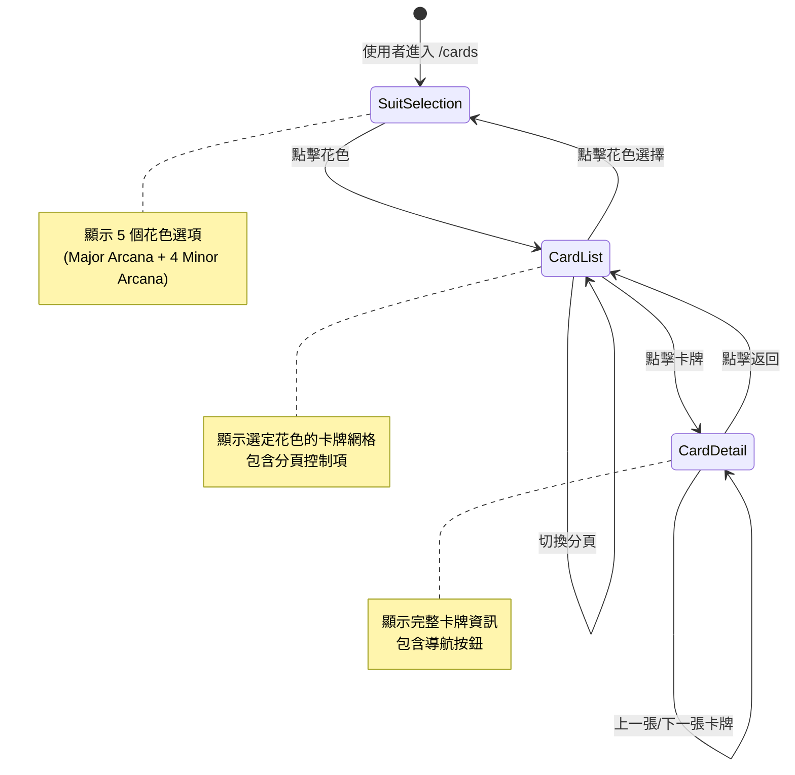
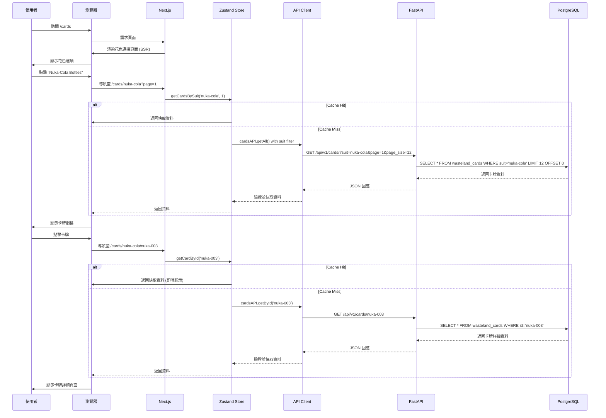
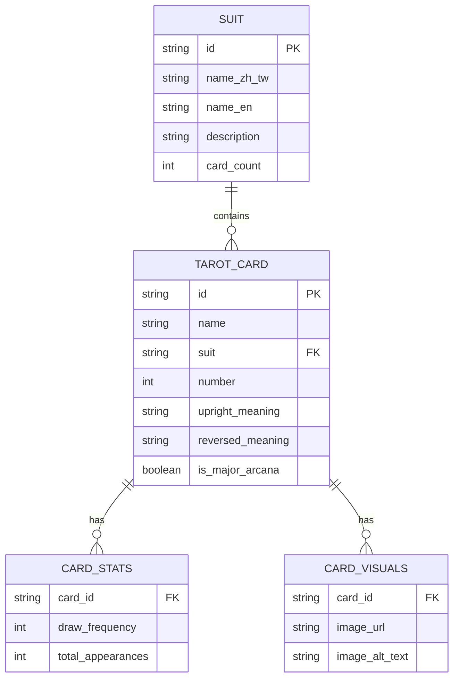

# 技術設計文件

## 概述

本設計文件詳述卡牌頁面重構的技術實作方案，重點在於建立以花色為導向的三層導航結構：花色選擇 → 卡牌列表（分頁）→ 卡牌詳細頁面。此重構將改善使用者體驗，提供更直觀的卡牌瀏覽方式，同時保持 Fallout 主題的 Pip-Boy 介面風格。

### 技術目標

1. **改善導航結構**：從平面的單一卡牌列表改為階層式的花色導向瀏覽
2. **效能優化**：實作分頁、延遲載入和智慧快取機制
3. **無障礙性**：符合 WCAG 2.1 AA 標準
4. **響應式設計**：在所有裝置上提供最佳體驗
5. **主題一致性**：保持 Pip-Boy 風格與廢土美學

## 需求映射

### 設計元件可追溯性

每個設計元件對應特定需求：

- **SuitSelectionPage 元件** → 需求 1.1-1.8：花色選擇介面
- **CardListPage 元件** → 需求 2.1-2.13：卡牌列表與分頁瀏覽
- **CardDetailPage 元件** → 需求 4.1-4.12：卡牌詳細說明頁面
- **PaginationControls 元件** → 需求 2.4-2.11：分頁導航控制項
- **CardGrid 元件** → 需求 2.3, 2.10, 2.12：網格佈局顯示
- **CardThumbnail 元件** → 需求 3.1-3.2：卡牌縮圖與點擊互動
- **NavigationBreadcrumb 元件** → 需求 2.13, 4.4：導航選項
- **API 整合層** → 需求 8.1-8.8：資料整合與 API
- **路由系統** → 需求 9.1-9.8：URL 路由與瀏覽歷史
- **Pip-Boy UI 元件庫** → 需求 10.1-10.8：視覺設計與主題一致性

### 使用者故事覆蓋

- **US-1 (花色選擇)**：透過 SuitSelectionPage 與 NavigationButton 元件實現
- **US-2 (分頁瀏覽)**：透過 CardListPage、PaginationControls 與 usePagination hook 實現
- **US-3 (卡牌點擊導航)**：透過 CardThumbnail 元件與 Next.js 路由系統實現
- **US-4 (卡牌詳細資訊)**：透過 CardDetailPage 與 CardDetailSection 元件實現
- **US-5 (響應式設計)**：透過 Tailwind CSS 響應式工具類與 useMediaQuery hook 實現
- **US-6 (無障礙性)**：透過語意化 HTML、ARIA 標籤與鍵盤導航支援實現
- **US-7 (效能優化)**：透過延遲載入、預先載入與本地狀態快取實現
- **US-8 (API 整合)**：透過 cardsAPI 服務層與 Zod 驗證 schema 實現
- **US-9 (URL 路由)**：透過 Next.js App Router 與動態路由實現
- **US-10 (視覺設計)**：透過 PipBoyTheme 元件與 Tailwind 客製化配置實現

## 架構

### 系統架構圖

```mermaid
graph TB
    A[使用者] --> B[Next.js Frontend]
    B --> C[App Router]
    C --> D[/cards - 花色選擇]
    C --> E[/cards/[suit] - 卡牌列表]
    C --> F[/cards/[suit]/[cardId] - 卡牌詳細]

    D --> G[SuitSelectionPage]
    E --> H[CardListPage]
    F --> I[CardDetailPage]

    G --> J[API Client Layer]
    H --> J
    I --> J

    J --> K[FastAPI Backend]
    K --> L[API Endpoints]
    L --> M[GET /api/v1/cards/]
    L --> N[GET /api/v1/cards/?suit=X]
    L --> O[GET /api/v1/cards/:cardId]

    M --> P[Database Layer]
    N --> P
    O --> P

    P --> Q[(PostgreSQL via Supabase)]

    J --> R[Local State Cache]
    R --> S[SessionStorage]
```

### 技術堆疊

基於現有專案架構與需求分析，選擇以下技術堆疊：

- **前端框架**：Next.js 15.1.7 (App Router)
- **UI 函式庫**：React 19
- **型別系統**：TypeScript 5
- **樣式框架**：Tailwind CSS v4.1.13
- **狀態管理**：Zustand 用於本地 UI 狀態與簡單快取
- **表單處理**：React Hook Form v7 + Zod v4 驗證
- **動畫**：Motion v12 (Framer Motion 替代品)
- **路由**：Next.js App Router (動態路由與搜尋參數)
- **API 客戶端**：現有的 `apiClient` (fetch-based) + Zod schemas
- **測試**：Jest + React Testing Library + Playwright

### 架構決策理由

#### 為何選擇 Next.js App Router

- **伺服器元件**：花色選擇頁面可作為伺服器元件，減少初始 JavaScript bundle
- **動態路由**：原生支援 `[suit]` 和 `[cardId]` 動態路由
- **Layout 系統**：共享的 Pip-Boy 主題 layout 跨所有卡牌頁面
- **SEO 友善**：卡牌詳細頁面可被搜尋引擎索引
- **效能優化**：自動程式碼分割與預先載入

#### 為何選擇 Zustand 進行狀態管理

- **與專案一致**：專案已使用 Zustand 管理認證狀態
- **輕量級**：相比 React Query，Zustand 更適合簡單的快取場景
- **TypeScript 支援**：完整的型別推斷
- **SessionStorage 持久化**：Zustand middleware 支援 session 快取

#### 為何選擇 Tailwind CSS v4

- **原子化 CSS**：與專案現有設計系統一致
- **客製化配色**：已配置 Pip-Boy 綠色主題
- **響應式工具類**：快速實現行動裝置支援
- **效能**：生產環境自動 purge 未使用的樣式

#### 為何選擇 Zod 驗證

- **型別安全**：TypeScript 型別自動推斷
- **執行時驗證**：確保 API 回應符合預期格式
- **與專案一致**：現有專案已使用 Zod schemas

### 頁面轉換流程



### 資料流

#### 主要使用者流程：瀏覽卡牌詳細資訊



## 元件與介面

### 前端元件架構

#### 頁面元件

##### 1. SuitSelectionPage (`/src/app/cards/page.tsx`)

**職責**：顯示花色選擇介面，作為卡牌瀏覽的入口點

**元件層級**：

```typescript
// 可作為 Server Component
export default function SuitSelectionPage() {
  return (
    <div className="min-h-screen bg-vault-dark p-4">
      <PageHeader title="塔羅牌圖書館" subtitle="選擇花色開始探索廢土占卜" />
      <SuitGrid>
        <SuitCard suit="major_arcana" />
        <SuitCard suit="nuka_cola" />
        <SuitCard suit="combat_weapons" />
        <SuitCard suit="bottle_caps" />
        <SuitCard suit="radiation_rods" />
      </SuitGrid>
    </div>
  )
}
```

**Props/State**：無需本地狀態（靜態內容）

---

##### 2. CardListPage (`/src/app/cards/[suit]/page.tsx`)

**職責**：顯示特定花色的卡牌列表，支援分頁

**元件層級**：

```typescript
// Client Component
'use client'

export default function CardListPage({ params, searchParams }: {
  params: { suit: string }
  searchParams: { page?: string }
}) {
  const page = Number(searchParams.page) || 1
  const { cards, isLoading, error, totalPages } = useCardsBySuit(params.suit, page)

  return (
    <div className="min-h-screen bg-vault-dark p-4">
      <Breadcrumb items={[
        { label: '花色選擇', href: '/cards' },
        { label: getSuitName(params.suit) }
      ]} />

      <SuitHeader suit={params.suit} cardCount={cards?.length || 0} />

      {isLoading && <CardGridSkeleton />}
      {error && <ErrorDisplay error={error} />}

      {cards && (
        <>
          <CardGrid cards={cards} />
          <PaginationControls
            currentPage={page}
            totalPages={totalPages}
            baseUrl={`/cards/${params.suit}`}
          />
        </>
      )}
    </div>
  )
}
```

**Props**：
- `params.suit`: string (動態路由參數)
- `searchParams.page`: string (分頁參數)

**State**：
- Zustand store 管理卡牌資料與快取

---

##### 3. CardDetailPage (`/src/app/cards/[suit]/[cardId]/page.tsx`)

**職責**：顯示卡牌完整詳細資訊

**元件層級**：

```typescript
'use client'

export default function CardDetailPage({ params }: {
  params: { suit: string; cardId: string }
}) {
  const { card, isLoading } = useCardDetail(params.cardId)
  const { previousCard, nextCard } = useAdjacentCards(params.suit, params.cardId)

  return (
    <div className="min-h-screen bg-vault-dark p-4">
      <Breadcrumb items={[
        { label: '花色選擇', href: '/cards' },
        { label: getSuitName(params.suit), href: `/cards/${params.suit}` },
        { label: card?.name }
      ]} />

      {isLoading && <CardDetailSkeleton />}

      {card && (
        <>
          <CardDetailHeader card={card} />
          <CardDetailImage card={card} />
          <CardDetailContent card={card} />
          <CardNavigation
            previous={previousCard}
            next={nextCard}
            backTo={`/cards/${params.suit}`}
          />
          <ShareButtons cardId={params.cardId} cardName={card.name} />
        </>
      )}
    </div>
  )
}
```

**Props**：
- `params.suit`: string
- `params.cardId`: string

**State**：
- Zustand store 管理卡牌資料

---

#### UI 元件

| 元件名稱 | 職責 | Props/State 摘要 |
|---------|------|----------------|
| `SuitCard` | 顯示單一花色選項，包含圖示、名稱與卡牌數量 | `suit: SuitType`, `onClick?: () => void` |
| `CardGrid` | 響應式網格佈局顯示卡牌縮圖 | `cards: TarotCard[]` |
| `CardThumbnail` | 單一卡牌縮圖，支援懸停效果與點擊 | `card: TarotCard` |
| `PaginationControls` | 分頁導航按鈕與頁碼指示器 | `currentPage: number`, `totalPages: number`, `baseUrl: string` |
| `Breadcrumb` | 麵包屑導航 | `items: BreadcrumbItem[]` |
| `CardDetailImage` | 全尺寸卡牌圖像 | `card: TarotCard` |
| `CardDetailContent` | 卡牌詳細內容（牌義、關鍵字等） | `card: TarotCard` |
| `CardNavigation` | 上一張/下一張/返回按鈕 | `previous?: TarotCard`, `next?: TarotCard`, `backTo: string` |
| `ShareButtons` | 分享功能按鈕組 | `cardId: string`, `cardName: string` |
| `ErrorDisplay` | 錯誤訊息顯示 | `error: Error` |
| `LoadingSpinner` | Pip-Boy 風格的載入動畫 | `size?: "sm" \| "md" \| "lg"` |

---

### API 端點

| 方法 | 路由 | 用途 | 需認證 | 狀態碼 |
|------|------|------|--------|--------|
| GET | `/api/v1/cards/` | 取得所有卡牌（分頁） | 否 | 200, 422, 500 |
| GET | `/api/v1/cards/?suit={suit}` | 取得特定花色的卡牌（透過現有端點的 suit 參數） | 否 | 200, 422, 500 |
| GET | `/api/v1/cards/{cardId}` | 取得單一卡牌詳細資料 | 否 | 200, 404, 500 |

**注意**：現有 API 已支援所需功能，無需新增端點。使用現有的：
- `GET /api/v1/cards/?suit={suit}&page={page}&page_size={size}` 用於卡牌列表
- `GET /api/v1/cards/{cardId}` 用於卡牌詳細資料

---

## 資料模型

### 領域實體

1. **TarotCard**：塔羅牌卡牌實體（已存在）
2. **Suit**：花色類型枚舉（Major Arcana, Nuka-Cola, Combat Weapons, Bottle Caps, Radiation Rods）
3. **PaginationMetadata**：分頁元資料（page, page_size, total_count, has_more）
4. **SuitMetadata**：花色元資料（name, description, card_count）

### 實體關係圖



### 資料模型定義

#### TypeScript 介面

```typescript
// 花色類型
export enum SuitType {
  MAJOR_ARCANA = 'major_arcana',
  NUKA_COLA = 'nuka_cola',
  COMBAT_WEAPONS = 'combat_weapons',
  BOTTLE_CAPS = 'bottle_caps',
  RADIATION_RODS = 'radiation_rods',
}

// 花色元資料
export interface SuitMetadata {
  suit: SuitType
  name_zh_tw: string
  name_en: string
  description: string
  card_count: number
}

// 花色配置（前端靜態資料）
export const SUIT_CONFIG: Record<SuitType, SuitMetadata> = {
  [SuitType.MAJOR_ARCANA]: {
    suit: SuitType.MAJOR_ARCANA,
    name_zh_tw: '大阿爾克那',
    name_en: 'Major Arcana',
    description: '代表生命中的重大主題與轉折點',
    card_count: 22,
  },
  [SuitType.NUKA_COLA]: {
    suit: SuitType.NUKA_COLA,
    name_zh_tw: 'Nuka-Cola 瓶（聖杯）',
    name_en: 'Nuka-Cola Bottles (Cups)',
    description: '代表情感、關係與內在體驗',
    card_count: 14,
  },
  // ... 其他花色
}

// 麵包屑項目
export interface BreadcrumbItem {
  label: string
  href?: string
}
```

### 資料庫 Schema

現有的 `wasteland_cards` 表已足夠支援此功能，無需新增表格。但需要確保以下索引存在以優化查詢效能：

```sql
-- 確保花色欄位有索引（用於依花色篩選）
CREATE INDEX IF NOT EXISTS idx_wasteland_cards_suit
ON wasteland_cards (suit);

-- 複合索引：花色 + 編號（用於排序）
CREATE INDEX IF NOT EXISTS idx_wasteland_cards_suit_number
ON wasteland_cards (suit, number);
```

### 遷移策略

**無需資料遷移**：此功能重構純屬前端導航結構改變，資料庫 schema 無需修改。

**索引優化**：
1. 檢查現有索引
2. 如缺少，在開發環境執行上述索引建立 SQL
3. 驗證查詢效能改善

---

## 錯誤處理

### 錯誤處理策略

#### 前端錯誤處理

```typescript
// 錯誤類型定義
export class CardNotFoundError extends Error {
  constructor(cardId: string) {
    super(`找不到卡牌：${cardId}`)
    this.name = 'CardNotFoundError'
  }
}

export class SuitNotFoundError extends Error {
  constructor(suit: string) {
    super(`找不到花色：${suit}`)
    this.name = 'SuitNotFoundError'
  }
}

// Zustand store 錯誤處理
export const useCardsStore = create<CardsState>((set, get) => ({
  cards: [],
  error: null,
  isLoading: false,

  fetchCardsBySuit: async (suit: string, page: number) => {
    set({ isLoading: true, error: null })
    try {
      const data = await cardsAPI.getAll({ suit, page, page_size: 12 })
      set({
        cards: data.cards,
        pagination: {
          page: data.page,
          totalPages: Math.ceil(data.total_count / 12),
          hasMore: data.has_more,
        },
        isLoading: false,
      })
    } catch (error) {
      set({ error, isLoading: false })
    }
  },
}))

// 錯誤邊界元件
export function CardPageErrorBoundary({ error }: { error: Error }) {
  return (
    <div className="min-h-screen flex items-center justify-center bg-vault-dark p-4">
      <div className="border-2 border-red-500 bg-red-500/10 p-6 max-w-md">
        <h2 className="text-red-400 font-mono text-xl mb-4">
          {error.name === 'CardNotFoundError' && '卡牌不存在'}
          {error.name === 'SuitNotFoundError' && '花色不存在'}
          {error.name === 'NetworkError' && '網路連線失敗'}
          {!['CardNotFoundError', 'SuitNotFoundError', 'NetworkError'].includes(error.name) && '發生未知錯誤'}
        </h2>
        <p className="text-red-300 font-mono text-sm mb-4">{error.message}</p>
        <a
          href="/cards"
          className="px-4 py-2 border-2 border-pip-boy-green bg-pip-boy-green/10 text-pip-boy-green font-mono hover:bg-pip-boy-green/20"
        >
          返回花色選擇
        </a>
      </div>
    </div>
  )
}
```

---

## 效能與擴展性

### 效能目標

| 指標 | 目標值 | 測量方式 |
|------|--------|----------|
| 花色選擇頁面首次渲染 (FCP) | < 1.5 秒 | Lighthouse |
| 卡牌列表頁面載入 (LCP) | < 2.5 秒 | Lighthouse |
| 卡牌詳細頁面載入 | < 2 秒 | Lighthouse |
| 分頁切換時間 | < 1 秒 | Custom Performance API |
| API 回應時間 (p95) | < 200ms | Backend 監控 |

### 快取策略

#### Zustand SessionStorage 快取

```typescript
// Zustand store with session storage persistence
import { create } from 'zustand'
import { persist, createJSONStorage } from 'zustand/middleware'

export const useCardsStore = create<CardsState>()(
  persist(
    (set, get) => ({
      // Store state
      cardsBysuit: {}, // { [suit]: { [page]: cards[] } }
      cardsById: {}, // { [cardId]: card }

      // Actions
      fetchCardsBySuit: async (suit: string, page: number) => {
        const cached = get().cardsBySuit[suit]?.[page]
        if (cached && Date.now() - cached.timestamp < 5 * 60 * 1000) {
          return cached.data
        }

        const data = await cardsAPI.getAll({ suit, page, page_size: 12 })
        set((state) => ({
          cardsBySuit: {
            ...state.cardsBySuit,
            [suit]: {
              ...state.cardsBySuit[suit],
              [page]: { data, timestamp: Date.now() },
            },
          },
        }))
      },
    }),
    {
      name: 'cards-storage',
      storage: createJSONStorage(() => sessionStorage),
    }
  )
)
```

#### 卡牌圖片路徑映射

**圖片資源結構**：

```
/public/assets/cards/
├── major-arcana/
│   ├── 00.png  (The Wanderer)
│   ├── 01.png  (The Vault Dweller)
│   └── ... (共 22 張，00-21.png)
│
├── minor-arcana/
│   ├── nuka-cola-bottles/
│   │   └── 01.png - 14.png
│   ├── combat-weapons/
│   │   └── 01.png - 14.png
│   ├── bottle-caps/
│   │   └── 01.png - 14.png
│   └── radiation-rods/
│       └── 01.png - 14.png
│
└── card-backs/
    └── (卡背圖片)
```

**圖片 URL 生成函式**：

```typescript
// 根據卡牌資料生成正確的圖片路徑
export function getCardImageUrl(card: TarotCard): string {
  const baseUrl = '/assets/cards'

  // Major Arcana 卡牌
  if (card.is_major_arcana || card.suit === 'major_arcana') {
    const cardNumber = String(card.number).padStart(2, '0')
    return `${baseUrl}/major-arcana/${cardNumber}.png`
  }

  // Minor Arcana 卡牌
  const suitFolderMap: Record<string, string> = {
    'nuka_cola': 'nuka-cola-bottles',
    'combat_weapons': 'combat-weapons',
    'bottle_caps': 'bottle-caps',
    'radiation_rods': 'radiation-rods',
  }

  const suitFolder = suitFolderMap[card.suit]
  if (!suitFolder) {
    console.warn(`Unknown suit: ${card.suit}`)
    return `${baseUrl}/card-backs/default.png` // Fallback
  }

  const cardNumber = String(card.number).padStart(2, '0')
  return `${baseUrl}/minor-arcana/${suitFolder}/${cardNumber}.png`
}

// 為卡牌圖片生成 alt 文字
export function getCardImageAlt(card: TarotCard): string {
  return card.visuals?.image_alt_text || `${card.name} - Wasteland Tarot Card`
}
```

#### 圖片延遲載入

```typescript
// Card thumbnail with lazy loading
export function CardThumbnail({ card }: { card: TarotCard }) {
  const imageUrl = getCardImageUrl(card)
  const imageAlt = getCardImageAlt(card)

  return (
    <Link href={`/cards/${card.suit}/${card.id}`}>
      <div className="border border-pip-boy-green/30 p-4 hover:border-pip-boy-green transition">
        <div className="h-32 bg-pip-boy-green/20 border border-pip-boy-green/50 mb-2 flex items-center justify-center overflow-hidden">
           {
              // Fallback 圖片
              e.currentTarget.src = '/assets/cards/card-backs/default.png'
            }}
          />
        </div>
        <p className="text-pip-boy-green font-mono text-sm font-bold truncate">{card.name}</p>
        <p className="text-pip-boy-green/70 font-mono text-xs">{getSuitDisplayName(card.suit)}</p>
      </div>
    </Link>
  )
}

// Next.js Image 元件版本（優化效能）
import Image from 'next/image'

export function CardThumbnailOptimized({ card }: { card: TarotCard }) {
  const imageUrl = getCardImageUrl(card)
  const imageAlt = getCardImageAlt(card)

  return (
    <Link href={`/cards/${card.suit}/${card.id}`}>
      <div className="border border-pip-boy-green/30 p-4 hover:border-pip-boy-green transition group">
        <div className="relative h-32 bg-pip-boy-green/20 border border-pip-boy-green/50 mb-2 overflow-hidden">
          <Image
            src={imageUrl}
            alt={imageAlt}
            fill
            sizes="(max-width: 768px) 50vw, (max-width: 1200px) 33vw, 25vw"
            className="object-cover transition-transform group-hover:scale-105"
            loading="lazy"
          />
        </div>
        <p className="text-pip-boy-green font-mono text-sm font-bold truncate">{card.name}</p>
        <p className="text-pip-boy-green/70 font-mono text-xs">{getSuitDisplayName(card.suit)}</p>
      </div>
    </Link>
  )
}
```

#### 卡牌詳細頁面圖片

```typescript
// 卡牌詳細頁面的全尺寸圖片
export function CardDetailImage({ card }: { card: TarotCard }) {
  const imageUrl = getCardImageUrl(card)
  const imageAlt = getCardImageAlt(card)

  return (
    <div className="relative w-full max-w-md mx-auto mb-8">
      <div className="relative aspect-[2/3] border-2 border-pip-boy-green bg-pip-boy-green/5 overflow-hidden">
        <Image
          src={imageUrl}
          alt={imageAlt}
          fill
          sizes="(max-width: 768px) 100vw, 500px"
          className="object-contain"
          priority // 詳細頁面的圖片優先載入
        />
      </div>

      {/* Pip-Boy 風格的掃描線效果 */}
      <div className="absolute inset-0 pointer-events-none scanlines opacity-30" />
    </div>
  )
}
```

---

## 測試策略

### 測試範圍與風險矩陣

| 領域 | 風險 | 必須 | 可選 | 參考需求 |
|------|------|------|------|----------|
| 路由與導航 | H | 單元、E2E | 整合 | 需求 9.1-9.8 |
| API 整合 | H | 單元、契約 | 整合 | 需求 8.1-8.8 |
| 分頁邏輯 | M | 單元 | E2E | 需求 2.4-2.11 |
| 關鍵 UX 流程 | H | E2E (≤3) | 無障礙性 | 需求 1-4 |
| 效能 | M | 效能煙霧測試 | 負載測試 | 需求 7.1-7.8 |

### 各層級測試

#### 單元測試

```typescript
// useCardsBySuit hook 測試
describe('useCardsBySuit', () => {
  it('should fetch cards for valid suit', async () => {
    const { result } = renderHook(() => useCardsStore())

    await act(async () => {
      await result.current.fetchCardsBySuit('nuka_cola', 1)
    })

    expect(result.current.cardsBySuit['nuka_cola'][1]).toBeDefined()
  })
})

// PaginationControls 元件測試
describe('PaginationControls', () => {
  it('should disable previous button on first page', () => {
    render(
      <PaginationControls
        currentPage={1}
        totalPages={5}
        baseUrl="/cards/nuka-cola"
      />
    )

    const prevButton = screen.getByLabelText('上一頁')
    expect(prevButton).toHaveAttribute('aria-disabled', 'true')
  })
})
```

#### E2E 測試（≤3 關鍵流程）

```typescript
// E2E 測試：完整卡牌瀏覽流程
test('should navigate from suit selection to card detail', async ({ page }) => {
  await page.goto('/cards')
  await page.getByText('Nuka-Cola Bottles').click()
  await expect(page).toHaveURL(/\/cards\/nuka-cola/)

  await page.getByTestId('card-thumbnail').first().click()
  await expect(page).toHaveURL(/\/cards\/nuka-cola\/[\w-]+/)
  await expect(page.getByText(/正位牌義/)).toBeVisible()
})
```

### CI 門檻

| 階段 | 執行測試 | 門檻條件 | SLA |
|------|---------|---------|-----|
| PR | 單元 + 契約 | 失敗 = 阻擋合併 | ≤ 3 分鐘 |
| Staging | 整合 + E2E | 失敗 = 阻擋部署 | ≤ 10 分鐘 |

### 測試完成條件

- **Sev1/Sev2 bug** = 0
- **所有 CI 門檻**通過
- **效能目標**達成（LCP < 2.5s, FCP < 1.5s）
- **程式碼覆蓋率**：單元測試 > 80%

---

## 附錄

### 花色定義與映射

| 花色 ID | 中文名稱 | 英文名稱 | 對應傳統塔羅 | 卡牌數量 |
|---------|---------|---------|-------------|---------|
| `major_arcana` | 大阿爾克那 | Major Arcana | Major Arcana | 22 |
| `nuka_cola` | Nuka-Cola 瓶 | Nuka-Cola Bottles | Cups (聖杯) | 14 |
| `combat_weapons` | 戰鬥武器 | Combat Weapons | Swords (寶劍) | 14 |
| `bottle_caps` | 瓶蓋 | Bottle Caps | Pentacles (錢幣) | 14 |
| `radiation_rods` | 輻射棒 | Radiation Rods | Wands (權杖) | 14 |

### Pip-Boy 設計規範

#### 配色

```css
:root {
  --pip-boy-green: #33ff33;
  --pip-boy-green-dark: #00cc00;
  --pip-boy-green-light: #66ff66;
  --pip-boy-bg: #0a0a0a;
  --pip-boy-border: #33ff33;
}
```

#### 字體

- **主要字體**：Monospace (Courier New, Consolas)
- **標題**：`font-mono font-bold`
- **內文**：`font-mono`

### 卡牌圖片資源規範

#### 檔案命名規則

**Major Arcana（大阿爾克那）**：
- 路徑：`/public/assets/cards/major-arcana/`
- 格式：`{number}.png`（例如：`00.png`, `01.png`, ... `21.png`）
- 數量：22 張（00-21）
- 編號補零：使用兩位數字（`00` 而非 `0`）

**Minor Arcana（小阿爾克那）**：
- 基礎路徑：`/public/assets/cards/minor-arcana/`
- 花色資料夾：
  - `nuka-cola-bottles/` → Nuka-Cola 瓶（聖杯）
  - `combat-weapons/` → 戰鬥武器（寶劍）
  - `bottle-caps/` → 瓶蓋（錢幣）
  - `radiation-rods/` → 輻射棒（權杖）
- 格式：`{number}.png`（例如：`01.png`, `02.png`, ... `14.png`）
- 數量：每個花色 14 張（01-14）

#### 花色資料夾映射表

| 資料庫 suit 值 | 資料夾名稱 | 中文名稱 |
|---------------|-----------|---------|
| `major_arcana` | `major-arcana` | 大阿爾克那 |
| `nuka_cola` | `nuka-cola-bottles` | Nuka-Cola 瓶 |
| `combat_weapons` | `combat-weapons` | 戰鬥武器 |
| `bottle_caps` | `bottle-caps` | 瓶蓋 |
| `radiation_rods` | `radiation-rods` | 輻射棒 |

#### 圖片規格建議

- **格式**：PNG（支援透明背景）
- **尺寸**：建議 800x1200px（2:3 比例）
- **檔案大小**：< 500KB/張（優化後）
- **色彩模式**：RGB
- **背景**：可選透明或深色背景

#### 工具函式使用範例

```typescript
// 範例 1：Major Arcana 卡牌
const foolCard = {
  id: 'wanderer-000',
  name: 'The Wanderer',
  suit: 'major_arcana',
  number: 0,
  is_major_arcana: true,
  // ...
}
const imageUrl = getCardImageUrl(foolCard)
// 結果：'/assets/cards/major-arcana/00.png'

// 範例 2：Minor Arcana 卡牌
const aceOfCups = {
  id: 'nuka-cola-01',
  name: 'Ace of Nuka-Cola',
  suit: 'nuka_cola',
  number: 1,
  is_major_arcana: false,
  // ...
}
const imageUrl = getCardImageUrl(aceOfCups)
// 結果：'/assets/cards/minor-arcana/nuka-cola-bottles/01.png'
```

#### 錯誤處理

```typescript
// 圖片載入失敗時的 fallback 機制
 {
    // 嘗試載入預設卡背
    e.currentTarget.src = '/assets/cards/card-backs/default.png'
  }}
/>
```

#### Next.js Image 優化配置

在 `next.config.ts` 中確保靜態資源優化：

```typescript
const config: NextConfig = {
  images: {
    formats: ['image/webp', 'image/png'],
    deviceSizes: [640, 750, 828, 1080, 1200],
    imageSizes: [16, 32, 48, 64, 96, 128, 256, 384],
  },
}
```

### 文件版本記錄

| 版本 | 日期 | 作者 | 變更摘要 |
|------|------|------|---------|
| 1.0 | 2025-10-08 | Claude Code | 初始版本：完整技術設計文件 |
| 1.1 | 2025-10-08 | Claude Code | 新增卡牌圖片路徑映射、`getCardImageUrl()` 工具函式、圖片資源規範與使用範例 |
