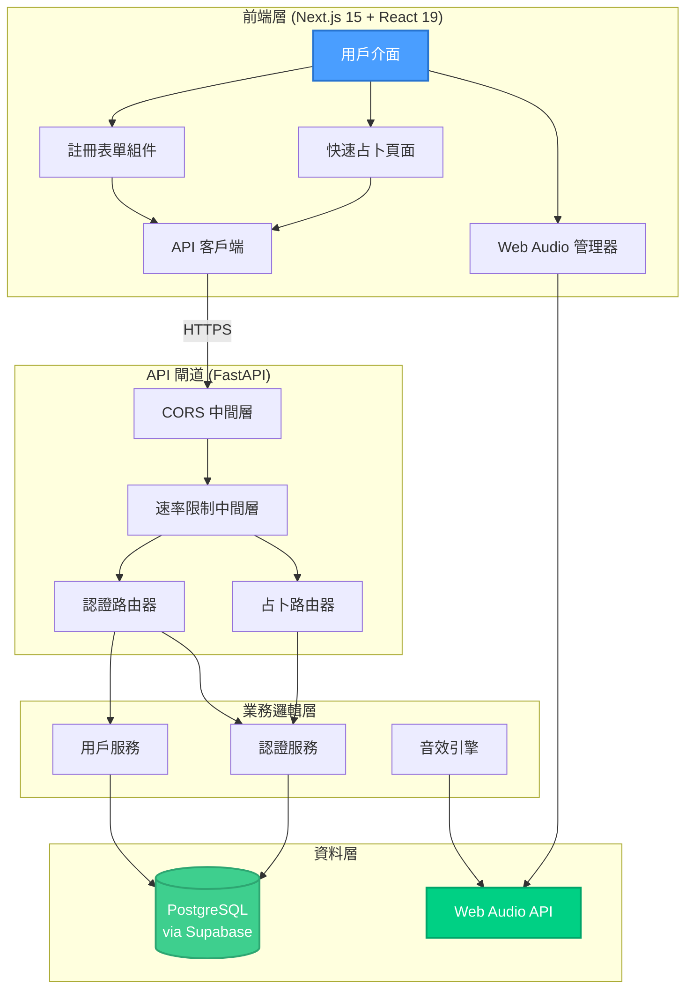
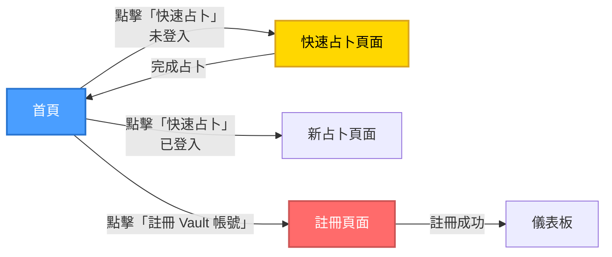
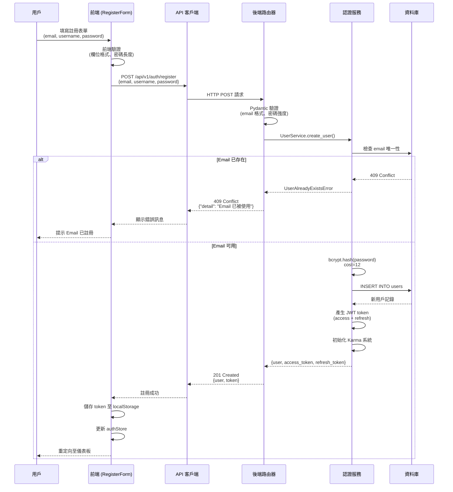
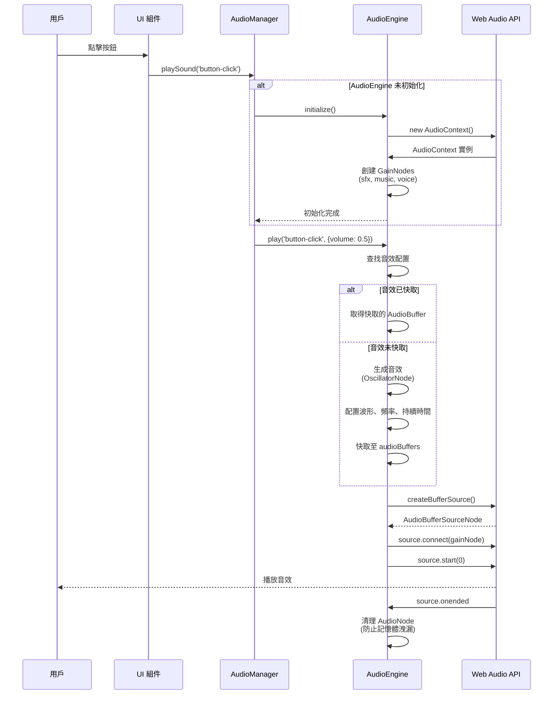
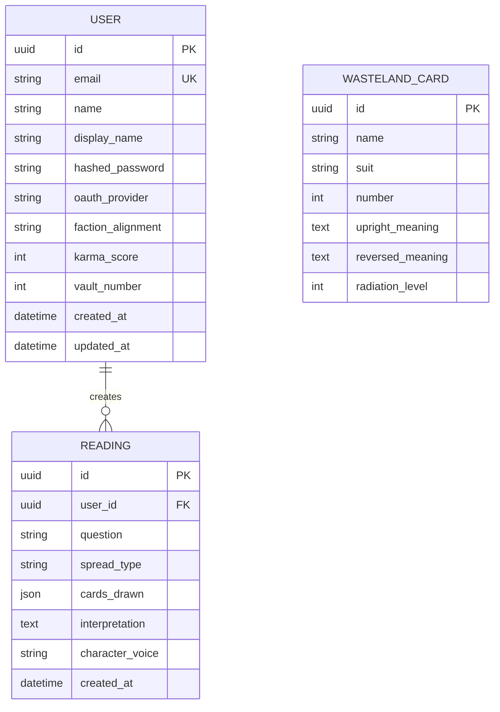

# 技術設計文件

## 概述

本技術設計旨在修復全網站功能驗證測試中發現的 P0 級別關鍵錯誤。這些錯誤嚴重影響核心用戶流程，包括：
1. **後端註冊 API 缺失**：新用戶無法註冊帳號
2. **Web Audio API 音效系統錯誤**：404 錯誤與音效檔案載入失敗
3. **前端 API 路徑配置錯誤**：API 路徑拼接問題導致 404 錯誤
4. **快速占卜路由錯誤**：訪客點擊快速占卜被導向註冊頁面

本設計基於現有系統架構（FastAPI + Next.js + Web Audio API），採用最小修改原則，確保快速修復同時不破壞現有功能。

### 研究發現摘要

**Web Audio API 最佳實踐（2025）：**
- 使用 `OscillatorNode` 生成即時音效，避免載入外部音檔
- 遵循瀏覽器自動播放政策，需在用戶手勢後初始化 `AudioContext`
- OscillatorNode 和 AudioBufferSourceNode 為一次性使用，播放後應丟棄
- 建議使用 GainNode 鏈接方式：`OscillatorNode → GainNode → DestinationNode`
- 支援自訂波形透過 `PeriodicWave` 介面

**FastAPI 認證最佳實踐（2025）：**
- 使用 `passlib[bcrypt]` 進行密碼雜湊，bcrypt cost factor 建議 ≥ 12
- 採用 `CryptContext(schemes=["bcrypt"], deprecated="auto")` 配置
- 註冊端點應驗證 email 唯一性、密碼強度，並自動產生 JWT token
- 所有認證資料應透過 HTTPS 傳輸
- 現代替代方案考慮 `pwdlib` 搭配 Argon2 或 Bcrypt

## 需求映射

### 設計組件可追溯性

本技術設計各組件對應需求文件中的具體需求：

- **註冊 API 服務層** → 1.1-1.7: 後端用戶註冊 API 實作
- **前端 API 客戶端修復** → 2.1-2.6: 前端 API 路徑配置修復
- **Web Audio 音效生成器** → 3.1-3.9: Web Audio API 音效系統實作
- **快速占卜路由組件** → 4.1-4.6: 快速占卜路由修復
- **次要修復組件** → 5.1-5.6: favicon、web-vitals、錯誤處理優化
- **API 文件與測試** → 6.1-6.6: API 端點文件與驗證

### 用戶故事覆蓋

**User Story 1（註冊功能）：**
- 技術方案：實作 `/api/v1/auth/register` 端點，使用 bcrypt 密碼雜湊，自動產生 JWT token
- 驗證機制：Pydantic 欄位驗證 + SQLAlchemy 資料庫唯一性約束

**User Story 2（API 路徑）：**
- 技術方案：修正前端 `src/lib/api.ts` 中的 API 路徑拼接邏輯
- 配置管理：統一使用 `NEXT_PUBLIC_API_URL` 環境變數作為基礎路徑

**User Story 3（音效系統）：**
- 技術方案：移除音檔依賴，改用 Web Audio API 即時生成音效
- 降級處理：AudioContext 初始化失敗時靜默失敗，不中斷用戶體驗

**User Story 4（快速占卜）：**
- 技術方案：修改首頁 `handleQuickReading` 函數，導向 `/readings/quick` 而非註冊頁面
- 路由建立：創建 `src/app/readings/quick/page.tsx` 提供訪客占卜功能

**User Story 5（次要問題）：**
- 技術方案：新增 `public/favicon.ico`、安裝 `web-vitals` 依賴、優化錯誤處理

**User Story 6（API 文件）：**
- 技術方案：利用 FastAPI 自動生成 OpenAPI 文件，新增 pytest 測試案例

## 架構

### 系統架構圖



### 技術堆疊

基於研究發現與現有系統架構，本次修復採用以下技術堆疊：

- **前端**：Next.js 15.1.7 (App Router) + React 19 + TypeScript 5
- **後端**：FastAPI 0.104.0+ + Python 3.11+ + uv 環境
- **資料庫**：PostgreSQL (Supabase) + SQLAlchemy 2.0.23+
- **認證**：JWT (python-jose) + bcrypt (passlib[bcrypt]) + Supabase Auth
- **音效系統**：Web Audio API (瀏覽器原生)
- **測試**：pytest 8.4.2+ (後端) + Jest 29.7.0 (前端)
- **部署**：Zeabur (前後端統一平台)

### 架構決策理由

**為什麼使用 Web Audio API 而非音檔載入：**
- 消除 404 錯誤的根本原因（無需管理音效檔案）
- 即時生成音效，減少網路請求與載入時間
- 更小的專案體積與更快的部署速度
- 更靈活的音效參數調整（頻率、持續時間、音量）
- 符合現代 Web 應用的音效最佳實踐

**為什麼使用 bcrypt 而非 Argon2：**
- 現有程式碼已配置 `passlib[bcrypt]`，保持一致性
- bcrypt 在 FastAPI 生態系統中有廣泛支援與文件
- 對於當前規模（目標 <10,000 用戶）性能足夠
- 團隊熟悉度與維護成本考量
- 升級路徑明確（透過 `deprecated="auto"` 配置）

**為什麼修復而非重構快速占卜：**
- 最小化變更範圍，快速恢復功能
- 現有路由架構已支援占卜功能
- 避免引入新的潛在錯誤
- 符合修復 Bug 的緊急性要求

**為什麼選擇環境變數管理 API 路徑：**
- Next.js 最佳實踐（`NEXT_PUBLIC_*` 前綴）
- 開發/生產環境切換方便
- 避免硬編碼路徑，提升可維護性
- 符合 12-Factor App 原則

### 螢幕轉換（Screen Transitions）

本次修復不涉及新增主要螢幕，僅修復現有流程：



### 資料流程

#### 用戶註冊流程（主要流程）



#### Web Audio 音效播放流程



## 組件與介面

### 後端服務與方法簽章

#### UserService（用戶服務）

```python
class UserService:
    """
    用戶管理服務
    負責用戶的 CRUD 操作與業務邏輯
    """

    def __init__(self, db: AsyncSession):
        """初始化服務，注入資料庫連線"""
        self.db = db

    async def create_user(
        self,
        email: str,
        password: str,
        name: str,
        display_name: str | None = None,
        faction_alignment: str | None = None,
        vault_number: int | None = None,
        wasteland_location: str | None = None
    ) -> User:
        """
        創建新用戶

        需求映射：1.1-1.7
        - 驗證 email 唯一性（1.2）
        - 使用 bcrypt 加密密碼（1.4）
        - 自動產生 UUID 並儲存至資料庫（1.1）

        Raises:
            UserAlreadyExistsError: email 已被使用
            ValueError: 驗證錯誤（密碼強度、欄位格式）
        """

    async def get_user_by_email(self, email: str) -> User | None:
        """根據 email 查詢用戶"""

    async def get_user_statistics(self, user_id: str) -> dict:
        """獲取用戶統計資料（占卜次數、karma 等）"""
```

#### AuthenticationService（認證服務）

```python
class AuthenticationService:
    """
    認證服務
    負責登入、登出、token 管理
    """

    def __init__(self, db: AsyncSession):
        self.db = db

    async def login_user(
        self,
        email: str,
        password: str
    ) -> dict[str, Any]:
        """
        用戶登入

        需求映射：1.5
        - 驗證密碼正確性
        - 產生 access_token 和 refresh_token

        Returns:
            {
                "user": User,
                "access_token": str,
                "refresh_token": str
            }

        Raises:
            InvalidCredentialsError: 密碼錯誤或用戶不存在
            OAuthUserCannotLoginError: OAuth 用戶嘗試密碼登入
        """

    async def refresh_access_token(self, refresh_token: str) -> dict:
        """刷新 access token"""

    async def verify_password(self, plain_password: str, hashed_password: str) -> bool:
        """驗證密碼（使用 bcrypt）"""
```

### 前端組件

#### API 客戶端組件（src/lib/api.ts）

| 組件名稱 | 職責 | Props/State 摘要 |
|---------|------|----------------|
| `authAPI.register` | 處理用戶註冊請求 | `userData: {email, username, password, confirm_password}` → `Promise<{user, access_token}>` |
| `apiRequest<T>` | 統一 API 請求處理 | `endpoint: string, options: RequestInit` → `Promise<T>` |
| `APIError` | 自訂 API 錯誤類別 | `message: string, status: number` |

#### 音效系統組件（src/lib/audio/）

| 組件名稱 | 職責 | Props/State 摘要 |
|---------|------|----------------|
| `AudioEngine` | 核心音效引擎（Singleton） | 管理 AudioContext、音效快取、並發播放控制 |
| `AudioManager` | 音效管理器 | 提供高階 API：`playSound(id, options)`、音量控制 |
| `SoundGenerator` | 音效生成器（新增） | 使用 OscillatorNode 生成各類音效 |

#### 快速占卜頁面（src/app/readings/quick/page.tsx）

| 組件名稱 | 職責 | Props/State 摘要 |
|---------|------|----------------|
| `QuickReadingPage` | 訪客快速占卜頁面 | State: `cards: WastelandCard[]`, `interpretation: string` |
| `CardDrawInterface` | 抽牌互動介面 | Props: `onCardSelect`, `availableCards` |

### API 端點規格

| 方法 | 路由 | 目的 | 認證 | 狀態碼 |
|------|------|------|------|--------|
| POST | `/api/v1/auth/register` | 創建新用戶帳號 | 不需要 | 201 (成功), 409 (Email 衝突), 422 (驗證錯誤), 500 (伺服器錯誤) |
| POST | `/api/v1/auth/login` | 用戶登入 | 不需要 | 200 (成功), 401 (認證失敗), 500 (伺服器錯誤) |
| GET | `/api/v1/auth/me` | 獲取當前用戶資訊 | 必要 (Bearer Token) | 200 (成功), 401 (未授權), 500 (伺服器錯誤) |
| POST | `/api/v1/auth/logout` | 登出用戶 | 必要 (Bearer Token) | 200 (成功), 401 (未授權) |

#### 註冊端點詳細規格

**請求範例：**

```json
POST /api/v1/auth/register
Content-Type: application/json

{
  "email": "vault_dweller@example.com",
  "password": "SecurePass123!",
  "confirm_password": "SecurePass123!",
  "name": "Vault Dweller",
  "display_name": "廢土探索者",
  "faction_alignment": "Brotherhood of Steel",
  "vault_number": 101
}
```

**成功回應（201 Created）：**

```json
{
  "message": "註冊成功",
  "user": {
    "id": "550e8400-e29b-41d4-a716-446655440000",
    "email": "vault_dweller@example.com",
    "name": "Vault Dweller",
    "display_name": "廢土探索者",
    "faction_alignment": "Brotherhood of Steel",
    "karma_score": 0,
    "vault_number": 101,
    "created_at": "2025-10-06T10:30:00Z"
  },
  "access_token": "eyJhbGciOiJIUzI1NiIsInR5cCI6IkpXVCJ9...",
  "refresh_token": "eyJhbGciOiJIUzI1NiIsInR5cCI6IkpXVCJ9...",
  "token_type": "bearer"
}
```

**錯誤回應範例：**

```json
// 409 Conflict - Email 已存在
{
  "detail": "Email 已被使用，請使用其他 Email 或嘗試登入"
}

// 422 Unprocessable Entity - 驗證錯誤
{
  "detail": [
    {
      "loc": ["body", "password"],
      "msg": "密碼長度必須至少 8 字元",
      "type": "value_error"
    }
  ]
}

// 422 Unprocessable Entity - 密碼不符
{
  "detail": "password 和 confirm_password 不相符"
}
```

## 資料模型

### 領域實體

1. **User（用戶）**：系統核心實體，儲存用戶認證與個人資料
2. **WastelandCard（廢土卡牌）**：塔羅牌實體，已存在於系統中
3. **Reading（占卜記錄）**：用戶占卜歷史，已存在於系統中

### 實體關係圖



### 資料模型定義

#### TypeScript 介面

```typescript
// 用戶註冊請求
interface UserRegistrationRequest {
  email: string;           // Email 格式驗證
  password: string;        // 至少 8 字元
  confirm_password: string; // 必須與 password 相符
  name: string;            // 1-50 字元
  display_name?: string;   // 可選
  faction_alignment?: string; // 可選
  vault_number?: number;   // 可選
}

// 用戶註冊回應
interface UserRegistrationResponse {
  message: string;
  user: User;
  access_token: string;
  refresh_token: string;
  token_type: "bearer";
}

// 用戶模型
interface User {
  id: string;              // UUID
  email: string;
  name: string;
  display_name?: string;
  faction_alignment?: string;
  karma_score: number;
  vault_number?: number;
  created_at: string;      // ISO 8601 格式
  updated_at?: string;
  // OAuth 相關（已存在）
  oauth_provider?: string | null;
  profile_picture_url?: string | null;
}

// Web Audio 音效配置
interface SoundConfig {
  id: string;              // 音效 ID
  type: AudioType;         // 'sfx' | 'music' | 'voice'
  generator: SoundGeneratorConfig;
  priority: 'critical' | 'normal' | 'low';
}

// 音效生成器配置
interface SoundGeneratorConfig {
  waveType: OscillatorType; // 'sine' | 'square' | 'triangle' | 'sawtooth'
  frequency: number;         // Hz
  duration: number;          // 秒
  volume?: number;           // 0-1
  envelope?: {               // ADSR Envelope
    attack: number;
    decay: number;
    sustain: number;
    release: number;
  };
}
```

#### Python Dataclasses

```python
from pydantic import BaseModel, EmailStr, field_validator
from datetime import datetime
from uuid import UUID

class UserRegistrationRequest(BaseModel):
    """
    用戶註冊請求
    需求映射：1.1-1.7
    """
    email: EmailStr
    password: str
    confirm_password: str
    name: str
    display_name: str | None = None
    faction_alignment: str | None = None
    vault_number: int | None = None
    wasteland_location: str | None = None

    @field_validator('password')
    @classmethod
    def validate_password(cls, v: str) -> str:
        """驗證密碼強度（需求 1.3）"""
        if len(v) < 8:
            raise ValueError('密碼長度必須至少 8 字元')
        return v

    @field_validator('name')
    @classmethod
    def validate_name(cls, v: str) -> str:
        """驗證 name 長度（需求 1.7）"""
        if not v or len(v.strip()) == 0:
            raise ValueError('name 不能為空')
        if len(v) < 1 or len(v) > 50:
            raise ValueError('name 長度必須在 1-50 字元之間')
        return v.strip()

    @field_validator('confirm_password')
    @classmethod
    def validate_passwords_match(cls, v: str, info) -> str:
        """驗證密碼相符（需求 1.1）"""
        if 'password' in info.data and v != info.data['password']:
            raise ValueError('password 和 confirm_password 不相符')
        return v


class UserResponse(BaseModel):
    """
    用戶回應模型
    """
    id: UUID
    email: str
    name: str
    display_name: str | None
    faction_alignment: str | None
    karma_score: int
    vault_number: int | None
    created_at: datetime

    class Config:
        from_attributes = True
```

### 資料庫架構

由於用戶模型已存在於系統中（`app/models/user.py`），本次修復**不需要新增資料表或修改現有架構**。唯一需要確認的是 `users` 資料表支援以下欄位：

```sql
-- 確認現有 users 資料表架構
-- 位置：backend/app/models/user.py (SQLAlchemy 模型)

-- 需要的欄位（已存在）：
-- id: UUID PRIMARY KEY
-- email: VARCHAR(255) UNIQUE NOT NULL
-- name: VARCHAR(255) NOT NULL
-- hashed_password: VARCHAR(255) NOT NULL
-- display_name: VARCHAR(255) NULLABLE
-- faction_alignment: VARCHAR(255) NULLABLE
-- karma_score: INTEGER DEFAULT 0
-- vault_number: INTEGER NULLABLE
-- oauth_provider: VARCHAR(50) NULLABLE
-- created_at: TIMESTAMP NOT NULL DEFAULT NOW()
-- updated_at: TIMESTAMP NULLABLE

-- 確認索引存在
CREATE INDEX IF NOT EXISTS idx_users_email ON users (email);
CREATE INDEX IF NOT EXISTS idx_users_created_at ON users (created_at);
```

### 遷移策略

**本次修復不需要資料庫遷移**，因為：
1. 用戶模型已存在且欄位完整
2. 註冊 API 使用現有資料表結構
3. Web Audio 系統不涉及資料庫操作
4. 快速占卜功能僅為路由修復，不儲存資料

若未來需要擴展，建議使用 Alembic 進行版本控制：

```bash
# 檢查當前遷移狀態
uv run alembic current

# 如需新增欄位（未來）
uv run alembic revision --autogenerate -m "add_new_user_field"
uv run alembic upgrade head
```

## 錯誤處理

### 錯誤處理策略

本次修復採用**分層錯誤處理**策略，確保錯誤在適當層級被捕獲並轉換為用戶友善訊息：

#### 後端錯誤處理

```python
# 自訂例外類別（已存在於 app/core/exceptions.py）
class UserAlreadyExistsError(WastelandTarotException):
    """Email 已被使用"""
    def __init__(self, email: str):
        self.message = f"Email '{email}' 已被使用，請使用其他 Email 或嘗試登入"
        super().__init__(self.message, status_code=409)

class InvalidCredentialsError(WastelandTarotException):
    """認證失敗"""
    def __init__(self):
        self.message = "Email 或密碼錯誤"
        super().__init__(self.message, status_code=401)

# 註冊端點錯誤處理（backend/app/api/auth.py）
@router.post("/register")
async def register_user(user_data: UserRegistrationRequest, db: AsyncSession = Depends(get_db)):
    try:
        user = await user_service.create_user(...)
        return {"message": "註冊成功", "user": user, ...}

    except UserAlreadyExistsError as e:
        # Email 衝突 - 409 Conflict
        raise HTTPException(status_code=status.HTTP_409_CONFLICT, detail=e.message)

    except ValueError as e:
        # Pydantic 驗證錯誤 - 422 Unprocessable Entity
        raise HTTPException(status_code=status.HTTP_422_UNPROCESSABLE_ENTITY, detail=str(e))

    except Exception as e:
        # 未預期錯誤 - 記錄並返回通用錯誤
        logger.error(f"註冊失敗: {str(e)}", exc_info=True)
        raise HTTPException(
            status_code=status.HTTP_500_INTERNAL_SERVER_ERROR,
            detail="註冊失敗，請稍後再試"
        )
```

#### 前端錯誤處理

```typescript
// src/lib/api.ts
async function apiRequest<T>(endpoint: string, options: RequestInit = {}): Promise<T> {
  try {
    const response = await timedFetch(url, options);

    if (!response.ok) {
      const errorData = await response.json().catch(() => ({ detail: 'Unknown error' }));

      // 5xx 錯誤進行重試
      if (response.status >= 500 && attempt < maxRetries) {
        // 重試邏輯
      }

      throw new APIError(errorData.detail || `HTTP ${response.status}`, response.status);
    }

    return response.json();
  } catch (err: any) {
    // 推送至全域錯誤 store
    useErrorStore.getState().pushError({
      source: 'api',
      message: err.message || 'API Error',
      detail: { endpoint, options },
      statusCode: err.status,
    });
    throw err;
  }
}

// 註冊表單錯誤處理（src/components/auth/RegisterForm.tsx）
const handleRegister = async (data: RegisterFormData) => {
  try {
    const response = await authAPI.register(data);
    // 成功處理
  } catch (error: any) {
    if (error.status === 409) {
      setError('email', { message: 'Email 已被使用，請使用其他 Email' });
    } else if (error.status === 422) {
      setError('root', { message: error.message });
    } else {
      setError('root', { message: '註冊失敗，請稍後再試' });
    }
  }
};
```

#### Web Audio 錯誤處理

```typescript
// src/lib/audio/AudioEngine.ts
async initialize(): Promise<void> {
  try {
    const AudioContextClass = window.AudioContext || (window as any).webkitAudioContext;
    if (!AudioContextClass) {
      throw new Error('Web Audio API not supported');
    }

    this.audioContext = new AudioContextClass();
    // ... 初始化邏輯

  } catch (error) {
    // 靜默失敗 - 記錄錯誤但不中斷用戶體驗
    logger.error('[AudioEngine] Initialization failed', error);
    // 不拋出錯誤，讓應用繼續運行
  }
}

async play(soundId: string, options: PlayOptions = {}): Promise<void> {
  if (!this.audioContext || !this.isUnlocked) {
    // 靜默失敗 - 未初始化時不播放但不報錯
    logger.warn('[AudioEngine] Not initialized, call initialize() first');
    return; // 優雅降級
  }

  try {
    // 播放邏輯
  } catch (error) {
    // 記錄錯誤但不中斷
    logger.error(`[AudioEngine] Failed to play ${soundId}`, error);
  }
}
```

### 錯誤分類與處理

| 錯誤類型 | HTTP 狀態碼 | 處理策略 | 用戶提示 |
|---------|------------|---------|---------|
| Email 已存在 | 409 | 返回明確錯誤訊息 | "Email 已被使用，請使用其他 Email 或嘗試登入" |
| 密碼強度不足 | 422 | Pydantic 驗證錯誤 | "密碼長度必須至少 8 字元" |
| 密碼不符 | 422 | Pydantic 驗證錯誤 | "password 和 confirm_password 不相符" |
| 必要欄位缺失 | 422 | Pydantic 驗證錯誤 | "缺少必要欄位：[欄位名稱]" |
| 網路連線失敗 | 0 (網路錯誤) | 檢測離線狀態 | "網路連線失敗，請檢查您的網路" |
| AudioContext 初始化失敗 | N/A | 靜默失敗 | 無（不顯示錯誤） |
| 伺服器錯誤 | 500 | 記錄日誌並重試 | "伺服器錯誤，請稍後再試" |

## 安全考量

### 認證安全

**密碼雜湊：**
- 使用 `bcrypt` 演算法，cost factor = 12（需求：Non-Functional Requirements）
- 透過 `passlib.context.CryptContext` 管理雜湊策略
- 支援未來升級至 Argon2（透過 `deprecated="auto"` 配置）

```python
from passlib.context import CryptContext

pwd_context = CryptContext(schemes=["bcrypt"], deprecated="auto")

# 雜湊密碼
hashed_password = pwd_context.hash(plain_password)

# 驗證密碼
is_valid = pwd_context.verify(plain_password, hashed_password)
```

**JWT Token 安全：**
- Access Token 有效期：30 分鐘
- Refresh Token 有效期：7 天
- Token 儲存：localStorage（前端）+ httpOnly cookies（考慮升級）
- Token 簽章演算法：HS256

**HTTPS 強制：**
- 生產環境強制使用 HTTPS
- 開發環境允許 HTTP（僅限 localhost）

### API 安全

**速率限制（Rate Limiting）：**
- 註冊端點：10 次/小時/IP
- 登入端點：5 次/分鐘/IP
- 使用 FastAPI Limiter 或 SlowAPI 中間層

**CORS 配置：**
```python
# backend/app/main.py
app.add_middleware(
    CORSMiddleware,
    allow_origins=settings.cors_origins,  # ["http://localhost:3000", "https://yourdomain.com"]
    allow_credentials=True,
    allow_methods=["GET", "POST", "PUT", "DELETE"],
    allow_headers=["*"],
)
```

**輸入驗證：**
- 所有輸入透過 Pydantic 模型驗證
- Email 格式驗證（`EmailStr`）
- 密碼強度驗證（長度、複雜度）
- SQL Injection 防護（SQLAlchemy 自動處理）

**敏感資料保護：**
- 絕不返回 `hashed_password` 至前端
- API 回應排除敏感欄位：
```python
class UserResponse(BaseModel):
    id: UUID
    email: str
    name: str
    # hashed_password 不包含在回應中

    class Config:
        from_attributes = True
```

### 資料保護

**環境變數管理：**
- 所有敏感配置透過環境變數
- 使用 `.env` 檔案（開發環境）
- 使用 Zeabur 環境變數（生產環境）
- `.env` 檔案加入 `.gitignore`

**Row-Level Security (RLS)：**
- Supabase RLS 策略確保用戶只能存取自己的資料
- 占卜記錄僅對創建者可見

```sql
-- 範例 RLS 策略（Supabase）
CREATE POLICY "Users can only view their own readings"
ON readings FOR SELECT
USING (auth.uid() = user_id);
```

## 效能與擴展性

### 效能目標

根據需求文件的非功能性需求，本次修復需達成以下效能指標：

| 指標 | 目標值 | 測量方法 |
|------|--------|---------|
| 註冊 API 回應時間 (p95) | < 500ms | 後端效能測試 (pytest-benchmark) |
| 註冊 API 回應時間 (p99) | < 1000ms | 後端效能測試 |
| Web Audio 音效生成延遲 | < 100ms | 前端效能測試 (Jest + Performance API) |
| AudioContext 初始化時間 | < 500ms | 前端效能測試 |
| 快速占卜頁面載入時間 | < 2s | Lighthouse 測試 |
| API 端點併發處理 | > 100 req/sec | 負載測試 (Locust) |

### 快取策略

#### 前端快取

**瀏覽器快取：**
- 靜態資源：`Cache-Control: public, max-age=31536000, immutable`
- API 回應：不快取認證相關端點

**AudioEngine 記憶體快取：**
```typescript
// src/lib/audio/AudioEngine.ts
private audioBuffers: Map<string, CachedBuffer> = new Map();

// LRU 快取策略
private evictLRU(): void {
  const entries = Array.from(this.audioBuffers.entries())
    .filter(([_, cached]) => cached.priority !== 'critical')
    .sort((a, b) => a[1].lastUsed - b[1].lastUsed);

  let freedMemory = 0;
  const targetMemory = 40 * 1024 * 1024; // 釋放到 40MB

  for (const [id, cached] of entries) {
    this.audioBuffers.delete(id);
    freedMemory += cached.size;
    if (this.getMemoryUsage() < targetMemory) break;
  }
}
```

**應用程式快取：**
- 使用 Zustand `persist` 中間層持久化 authStore
- localStorage 儲存 JWT token 與用戶基本資料

#### 後端快取

**資料庫連線池：**
```python
# backend/app/db/database.py
engine = create_async_engine(
    DATABASE_URL,
    pool_size=20,          # 連線池大小
    max_overflow=10,       # 最大溢出連線數
    pool_pre_ping=True,    # 連線健康檢查
    pool_recycle=3600,     # 連線回收時間（秒）
)
```

**查詢優化：**
- 使用 SQLAlchemy `selectinload` 預載關聯資料
- 為常用查詢欄位建立索引（email、created_at）

### 擴展性方法

#### 水平擴展

**應用伺服器：**
- FastAPI 支援多 worker 部署
- Zeabur 自動水平擴展（基於 CPU/記憶體使用率）
- 無狀態設計，所有狀態儲存於資料庫

```bash
# 生產環境部署配置（Zeabur）
# 使用 Gunicorn + Uvicorn workers
gunicorn app.main:app \
  --workers 4 \
  --worker-class uvicorn.workers.UvicornWorker \
  --bind 0.0.0.0:8000 \
  --timeout 120
```

**資料庫：**
- Supabase 自動提供讀取副本（Read Replicas）
- 寫入操作導向主資料庫
- 讀取操作可分散至副本

#### 非同步處理

**背景任務：**
- Karma 初始化使用非同步任務
- Email 驗證（未來）使用背景隊列

```python
# 範例：非同步 Karma 初始化
try:
    karma_init_result = await karma_service.initialize_karma_for_user(str(user.id))
except Exception as e:
    # 非致命錯誤，不阻塞註冊流程
    logger.warning(f"Karma 初始化失敗（非致命）: {str(e)}")
```

#### CDN 與靜態資源

**Zeabur CDN：**
- 自動分發靜態資源至 CDN 節點
- 自動 SSL/TLS 憑證管理
- 全球邊緣節點加速

**靜態資源優化：**
- Next.js 自動程式碼分割
- 動態導入（Dynamic Imports）減少首次載入大小
- Tree shaking 移除未使用程式碼

## 測試策略

### 風險矩陣

| 領域 | 風險 | 必要測試 | 可選測試 | 參考需求 |
|------|------|---------|---------|---------|
| 認證授權 | **高** | 單元測試、契約測試、E2E | 安全掃描 | 1.1-1.7, 6.1-6.6 |
| 外部 API (Web Audio) | **中** | 契約測試、整合測試 | 韌性測試 | 3.1-3.9 |
| 資料完整性 (用戶創建) | **高** | 單元測試、屬性測試 | 整合測試 | 1.1-1.7 |
| 關鍵 UX 流程 (註冊、快速占卜) | **高** | E2E (≤3 案例) | 無障礙測試 | 1.1-1.7, 4.1-4.6 |
| 效能 | **中** | 效能冒煙測試 | 負載/壓力測試 | Non-Functional Req. |

### 各層級最小測試

#### 單元測試（Unit Tests）

**後端單元測試（pytest）：**

```python
# backend/tests/unit/test_user_service.py
import pytest
from app.services.user_service import UserService
from app.core.exceptions import UserAlreadyExistsError

@pytest.mark.asyncio
async def test_create_user_success(db_session):
    """測試用戶創建成功"""
    service = UserService(db_session)

    user = await service.create_user(
        email="test@example.com",
        password="SecurePass123",
        name="Test User"
    )

    assert user.email == "test@example.com"
    assert user.name == "Test User"
    assert user.hashed_password is not None
    assert user.hashed_password != "SecurePass123"  # 確保密碼已雜湊

@pytest.mark.asyncio
async def test_create_user_duplicate_email(db_session, existing_user):
    """測試重複 email 應拋出例外"""
    service = UserService(db_session)

    with pytest.raises(UserAlreadyExistsError):
        await service.create_user(
            email=existing_user.email,
            password="AnotherPass123",
            name="Another User"
        )

@pytest.mark.asyncio
async def test_password_hashing_bcrypt(db_session):
    """測試密碼使用 bcrypt 雜湊"""
    service = UserService(db_session)

    user = await service.create_user(
        email="hash_test@example.com",
        password="TestPassword123",
        name="Hash Test"
    )

    # bcrypt 雜湊結果應以 $2b$ 開頭
    assert user.hashed_password.startswith("$2b$")
```

**前端單元測試（Jest）：**

```typescript
// src/lib/audio/__tests__/AudioEngine.test.ts
import { AudioEngine } from '../AudioEngine';

describe('AudioEngine', () => {
  let audioEngine: AudioEngine;

  beforeEach(() => {
    audioEngine = AudioEngine.getInstance();
  });

  it('should create singleton instance', () => {
    const instance1 = AudioEngine.getInstance();
    const instance2 = AudioEngine.getInstance();

    expect(instance1).toBe(instance2);
  });

  it('should initialize AudioContext on user interaction', async () => {
    await audioEngine.initialize();

    expect(audioEngine.isInitialized()).toBe(true);
    expect(audioEngine.getContext()).not.toBeNull();
  });

  it('should gracefully handle unsupported browsers', async () => {
    // Mock unsupported browser
    global.AudioContext = undefined as any;

    await expect(audioEngine.initialize()).rejects.toThrow('Web Audio API not supported');
  });

  it('should enforce memory limits', () => {
    const memoryUsage = audioEngine.getMemoryUsage();
    const maxMemory = 50 * 1024 * 1024; // 50MB

    expect(memoryUsage).toBeLessThan(maxMemory);
  });
});
```

#### 契約測試（Contract Tests）

**API 契約測試（pytest）：**

```python
# backend/tests/api/test_auth_endpoints.py
import pytest
from httpx import AsyncClient

@pytest.mark.asyncio
async def test_register_endpoint_contract(client: AsyncClient):
    """測試註冊端點契約"""
    response = await client.post("/api/v1/auth/register", json={
        "email": "contract_test@example.com",
        "password": "SecurePass123",
        "confirm_password": "SecurePass123",
        "name": "Contract Test"
    })

    assert response.status_code == 201

    data = response.json()
    assert "message" in data
    assert "user" in data
    assert "access_token" in data
    assert "refresh_token" in data

    # 驗證用戶物件結構
    user = data["user"]
    assert "id" in user
    assert "email" in user
    assert "name" in user
    assert "hashed_password" not in user  # 不應返回密碼

@pytest.mark.asyncio
async def test_register_duplicate_email_contract(client: AsyncClient, existing_user):
    """測試重複 email 錯誤契約"""
    response = await client.post("/api/v1/auth/register", json={
        "email": existing_user.email,
        "password": "AnotherPass123",
        "confirm_password": "AnotherPass123",
        "name": "Test User"
    })

    assert response.status_code == 409

    error = response.json()
    assert "detail" in error
    assert "Email 已被使用" in error["detail"]
```

#### 整合測試（Integration Tests）

**Web Audio 整合測試：**

```typescript
// src/__tests__/integration/audio-system.test.ts
import { AudioEngine } from '@/lib/audio/AudioEngine';
import { AudioManager } from '@/lib/audio/AudioManager';

describe('Web Audio System Integration', () => {
  it('should initialize and play sound end-to-end', async () => {
    const engine = AudioEngine.getInstance();
    const manager = new AudioManager(engine);

    // 初始化
    await manager.initialize();

    // 播放音效
    const playPromise = manager.playSound('button-click', { volume: 0.5 });

    await expect(playPromise).resolves.toBeUndefined();
    expect(manager.getActiveSoundsCount()).toBeGreaterThan(0);
  });

  it('should handle initialization failure gracefully', async () => {
    // Mock initialization failure
    jest.spyOn(AudioEngine.prototype, 'initialize').mockRejectedValue(new Error('Initialization failed'));

    const manager = new AudioManager(AudioEngine.getInstance());

    // 不應拋出錯誤
    await expect(manager.initialize()).resolves.toBeUndefined();
  });
});
```

#### E2E 測試（End-to-End Tests）

**關鍵用戶流程（Playwright，≤3 案例）：**

```typescript
// tests/e2e/registration-flow.spec.ts
import { test, expect } from '@playwright/test';

test('用戶註冊流程 - 成功案例', async ({ page }) => {
  await page.goto('/auth/register');

  // 填寫註冊表單
  await page.fill('input[name="email"]', 'newuser@example.com');
  await page.fill('input[name="password"]', 'SecurePass123');
  await page.fill('input[name="confirm_password"]', 'SecurePass123');
  await page.fill('input[name="name"]', 'New User');

  // 提交表單
  await page.click('button[type="submit"]');

  // 驗證重定向至儀表板
  await expect(page).toHaveURL(/\/dashboard/);

  // 驗證用戶名稱顯示
  await expect(page.locator('text=New User')).toBeVisible();
});

test('用戶註冊流程 - 重複 Email', async ({ page }) => {
  await page.goto('/auth/register');

  // 使用已存在的 email
  await page.fill('input[name="email"]', 'existing@example.com');
  await page.fill('input[name="password"]', 'SecurePass123');
  await page.fill('input[name="confirm_password"]', 'SecurePass123');
  await page.fill('input[name="name"]', 'Test User');

  await page.click('button[type="submit"]');

  // 驗證錯誤訊息
  await expect(page.locator('text=Email 已被使用')).toBeVisible();
});

test('快速占卜流程 - 訪客使用', async ({ page }) => {
  await page.goto('/');

  // 點擊快速占卜按鈕
  await page.click('text=快速占卜');

  // 驗證導向快速占卜頁面（不是註冊頁面）
  await expect(page).toHaveURL(/\/readings\/quick/);

  // 驗證頁面載入成功
  await expect(page.locator('h1')).toContainText('快速占卜');
});
```

### CI 閘門（CI Gates）

| 階段 | 執行測試 | 閘門條件 | SLA |
|------|---------|---------|-----|
| PR | 單元測試 + 契約測試 | 失敗 = 阻擋合併 | ≤ 3 分鐘 |
| Staging | 整合測試 + E2E | 失敗 = 阻擋部署 | ≤ 10 分鐘 |
| Nightly (可選) | 效能測試 / 韌性測試 | 回歸 → 建立 Issue | - |

**CI 配置範例（GitHub Actions）：**

```yaml
# .github/workflows/tests.yml
name: Tests

on: [pull_request]

jobs:
  backend-tests:
    runs-on: ubuntu-latest
    steps:
      - uses: actions/checkout@v3
      - name: Set up Python
        uses: actions/setup-python@v4
        with:
          python-version: '3.11'

      - name: Install uv
        run: pip install uv

      - name: Install dependencies
        run: |
          cd backend
          uv sync

      - name: Run unit tests
        run: |
          cd backend
          uv run pytest tests/unit/ --cov=app --cov-report=xml

      - name: Run contract tests
        run: |
          cd backend
          uv run pytest tests/api/

      - name: Upload coverage
        uses: codecov/codecov-action@v3

  frontend-tests:
    runs-on: ubuntu-latest
    steps:
      - uses: actions/checkout@v3
      - name: Setup Bun
        uses: oven-sh/setup-bun@v1

      - name: Install dependencies
        run: bun install

      - name: Run unit tests
        run: bun test --coverage

      - name: Run E2E tests
        run: bun test:playwright
```

### 退出條件

測試階段完成需滿足以下條件：

1. **嚴重性 1/2 缺陷 = 0**
   - 所有 P0 (阻塞) 和 P1 (嚴重) 錯誤已修復
   - 註冊功能、音效系統、快速占卜正常運作

2. **所有閘門測試通過**
   - PR 階段：單元測試 + 契約測試 100% 通過
   - Staging 階段：整合測試 + E2E 測試 100% 通過

3. **非功能性目標達成**
   - 註冊 API 回應時間 p95 < 500ms
   - Web Audio 音效生成延遲 < 100ms
   - 快速占卜頁面載入時間 < 2s
   - 例外處理：若無法達成，需記錄核准並建立追蹤 Issue

4. **程式碼覆蓋率**
   - 後端：新增程式碼覆蓋率 ≥ 80%
   - 前端：新增程式碼覆蓋率 ≥ 75%

---

**最後更新時間：** 2025-10-06
**設計版本：** 1.0
**狀態：** 已生成，待審核
