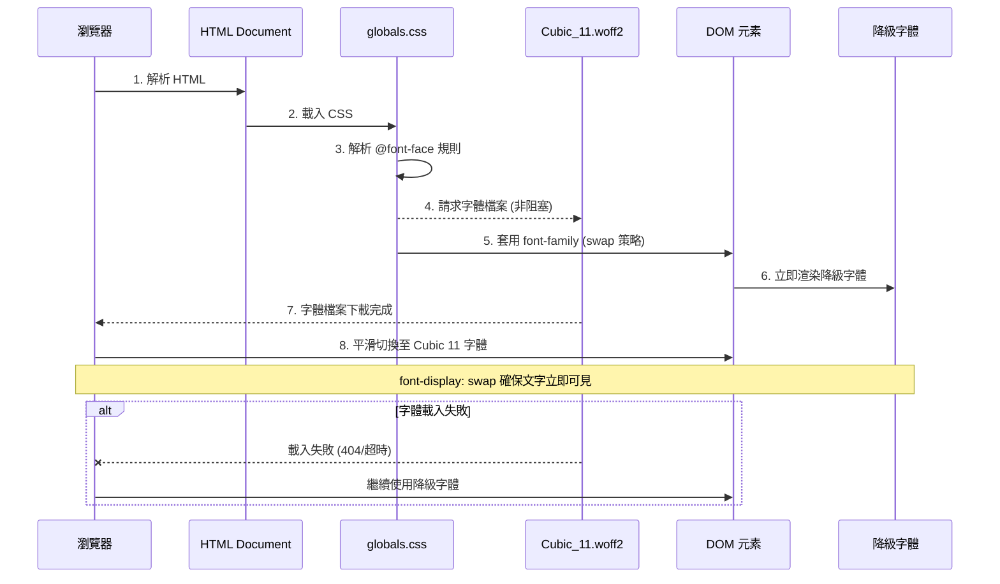
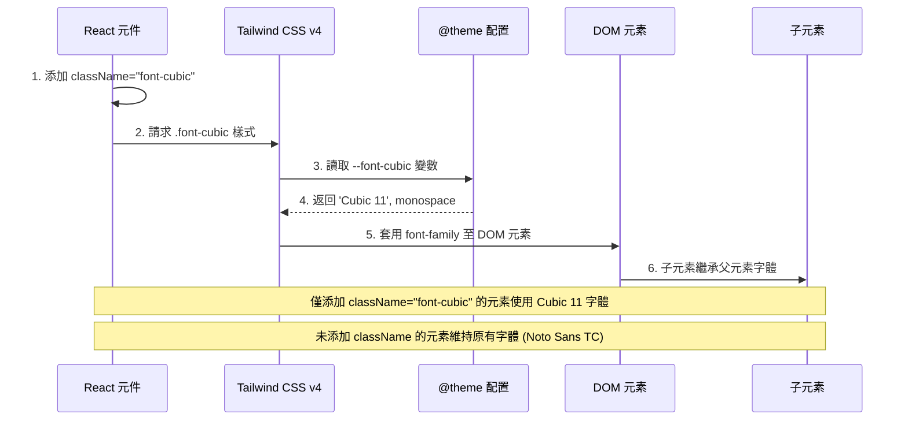
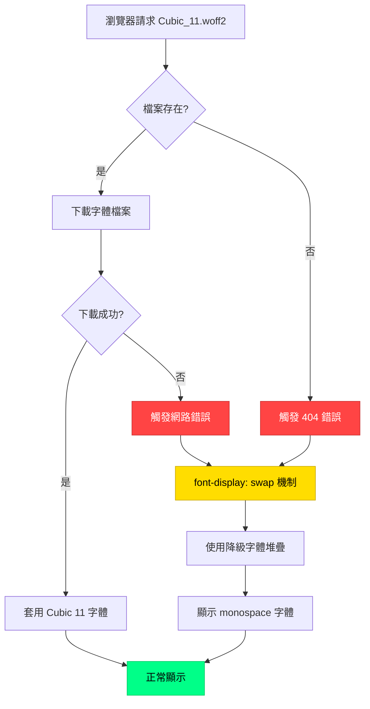
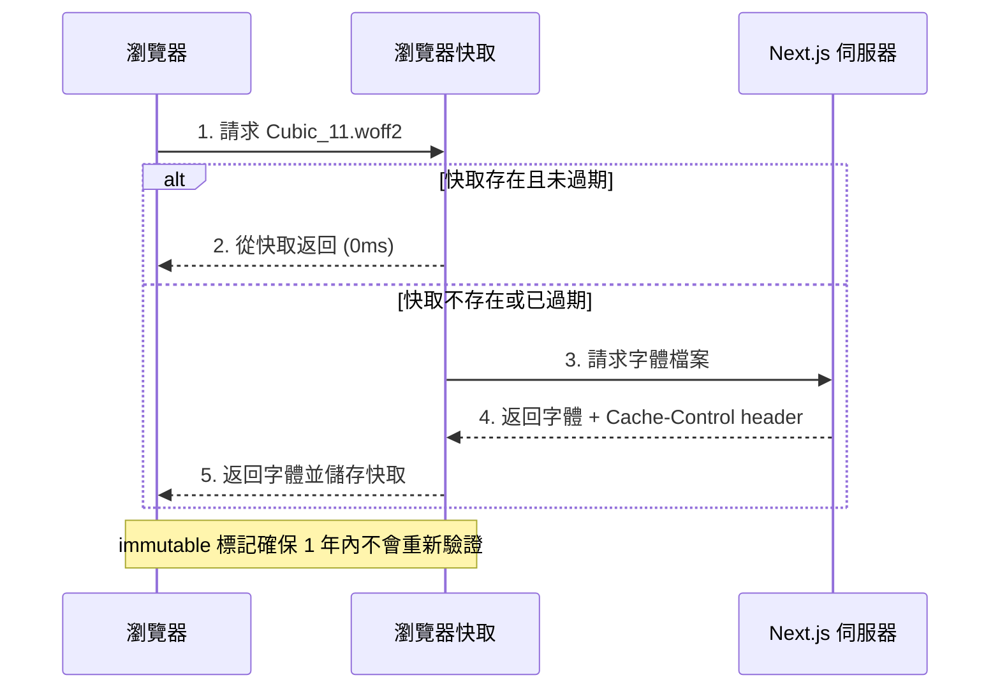

# 技術設計文件

## 概述

本技術設計文件描述如何將 Cubic_11 像素風格字體整合至 Wasteland Tarot 平台的前端系統。設計採用 className 驅動的字體應用策略,透過 @font-face 宣告和 Tailwind CSS v4 自訂 utility class 實現元件層級的字體控制,同時確保效能、相容性和無障礙性。

### 核心設計原則
- **簡潔性優先**: 避免過度設計,使用標準 CSS 和 Tailwind 配置
- **元件層級控制**: 透過 className 在元件層級套用字體,避免全域污染
- **關注點分離**: 字體樣式由元件自主決定,不強制全域替換
- **效能第一**: font-display: swap 策略優化首次繪製速度
- **降級友善**: 完整的字體堆疊確保在任何情況下的可讀性
- **WCAG AA 合規**: 維持文字對比度和無障礙性標準

## 需求映射

### 設計元件可追溯性

每個設計元件對應特定需求:

- **@font-face 宣告模組** → 需求 1.1-1.5: 字體檔案宣告與載入
- **Tailwind 自訂 Utility Class** → 需求 3.1-3.5: Tailwind CSS v4 主題配置更新
- **元件層級 className 應用策略** → 需求 2.1-2.5, 4.1-4.5: 全域字體系統與樣式類別遷移
- **降級機制模組** → 需求 5.1-5.5: 字體降級與瀏覽器相容性
- **效能最佳化層** → 需求 6.1-6.5: 效能與載入最佳化
- **無障礙性檢查層** → 需求 8.1-8.5: 無障礙性與 WCAG 相容性

### 使用者故事覆蓋

| 使用者故事 | 技術實作方式 |
|-----------|-------------|
| **需求 1**: 前端開發者需要在全域 CSS 中正確宣告字體 | @font-face 規則在 globals.css 頂部宣告,使用標準 CSS 語法 |
| **需求 2**: 平台使用者希望看到一致的像素風格字體 | 透過自訂 `font-cubic` utility class 在元件層級套用字體 |
| **需求 3**: 前端開發者需要更新 Tailwind 配置 | 在 @theme 區塊定義 `--font-cubic` 變數,生成 `font-cubic` 工具類別 |
| **需求 4**: 前端開發者需要遷移現有字體樣式類別 | 在 React 元件中添加 `className="font-cubic"` 來套用字體 |
| **需求 5**: 不同瀏覽器環境使用者需要字體降級 | 定義完整字體堆疊和 @supports 降級區塊 |
| **需求 6**: 使用者需要快速的頁面載入速度 | font-display: swap 策略避免阻塞渲染 |
| **需求 7**: QA 測試人員需要驗證視覺呈現 | 提供測試檢查清單和視覺回歸測試指引 |
| **需求 8**: 螢幕閱讀器使用者需要無障礙性 | 確保字體變更不影響語意,維持 WCAG AA 對比度 |
| **需求 9**: 未來維護者需要清楚的文件 | 詳細的程式碼註解和文件說明字體選擇理由 |
| **需求 10**: 跨平台使用者需要一致的字體呈現 | WOFF2 格式支援所有現代瀏覽器,降級機制覆蓋舊版瀏覽器 |

## 架構

### 系統架構圖

```mermaid
graph TB
    A[瀏覽器] --> B[Next.js App]
    B --> C[globals.css]
    C --> D[@font-face 宣告]
    C --> E[@theme 配置: --font-cubic]
    D --> F[Cubic_11.woff2]
    E --> G[Tailwind CSS v4 引擎]
    G --> H[生成 .font-cubic 類別]

    B --> I[React 元件]
    I --> J[添加 className='font-cubic']
    H --> J
    J --> K[DOM 元素]
    K --> L[瀏覽器渲染]

    F -.載入失敗.-> M[降級字體]
    M --> L

    style D fill:#00ff88,stroke:#00cc66,color:#000
    style E fill:#00ff88,stroke:#00cc66,color:#000
    style H fill:#00ddff,stroke:#0099cc,color:#000
    style J fill:#ffaa00,stroke:#cc8800,color:#000
    style F fill:#ffdd00,stroke:#ccaa00,color:#000
    style M fill:#ff8800,stroke:#cc6600,color:#000
```

### 技術堆疊

基於研究發現和需求分析,技術堆疊如下:

- **前端框架**: Next.js 15.1.7 (App Router)
- **樣式系統**: Tailwind CSS v4.1.13
- **字體格式**: WOFF2 (Web Open Font Format 2)
- **CSS 預處理器**: PostCSS 8 (Tailwind CSS 內建)
- **字體檔案**: Cubic_11.woff2 (400KB, 像素風格)
- **測試框架**: Playwright (視覺回歸測試)

### 架構決策理由

#### 為什麼使用 className 驅動的字體應用策略?
- **元件層級控制**: 每個元件可獨立決定是否使用 Cubic 11 字體
- **避免全域污染**: 不修改 body 或所有元素的預設字體,減少副作用
- **更好的可維護性**: 明確知道哪些元件使用了 Cubic 11 字體
- **React 最佳實踐**: 符合 React/Next.js 的元件化設計思維
- **漸進式遷移**: 可逐步為元件添加 `font-cubic` className,不需一次性替換
- **測試友善**: 元件測試時可明確驗證 className 的存在

#### 為什麼使用 @font-face 宣告?
- **標準化**: W3C 標準,所有現代瀏覽器支援
- **控制粒度**: 可精確控制字體載入行為 (font-display, unicode-range)
- **效能最佳化**: 瀏覽器可快取字體檔案,減少重複載入
- **降級機制**: src 屬性支援多個格式降級 (WOFF2 → WOFF → TTF)

#### 為什麼使用 WOFF2 格式?
- **最佳壓縮比**: 比 WOFF 格式小 30%,比 TTF 小 50%
- **瀏覽器支援度**: Chrome 36+, Firefox 39+, Safari 10+, Edge 14+ (覆蓋 >98% 使用者)
- **效能優勢**: 壓縮演算法 (Brotli) 提供更快的傳輸速度
- **現代標準**: Google Fonts 和 Adobe Fonts 的預設格式

#### 為什麼使用 Tailwind CSS v4 @theme 配置?
- **CSS 變數原生支援**: 直接在 CSS 中定義變數,無需 JavaScript 配置檔
- **效能提升**: 減少 JavaScript 運行時開銷,CSS 變數由瀏覽器原生處理
- **一致性**: 所有 Tailwind 工具類別自動使用定義的字體變數
- **可維護性**: 集中配置於 globals.css,避免多處修改

#### 為什麼使用 font-display: swap?
- **避免 FOIT**: 不會出現文字不可見的情況,立即顯示降級字體
- **改善 FCP**: 提升 First Contentful Paint 分數
- **使用者體驗**: 使用者可立即閱讀內容,字體載入完成後平滑切換
- **Google 推薦**: Lighthouse 和 PageSpeed Insights 的最佳實踐建議

### 資料流

#### 字體載入流程



#### 樣式套用流程



## 元件與介面

### CSS 模組設計

#### 1. @font-face 宣告模組

**檔案位置**: `src/app/globals.css` (檔案頂部)

```css
/**
 * Cubic_11 字體宣告
 *
 * 字體來源: public/fonts/Cubic_11.woff2
 * 字體風格: 80 年代復古像素風格
 * 授權: [待確認授權資訊]
 *
 * 使用 font-display: swap 策略以優化效能
 * - 立即顯示降級字體,避免文字不可見 (FOIT)
 * - 字體載入完成後平滑切換至 Cubic 11
 */
@font-face {
  font-family: 'Cubic 11';
  src: url('/fonts/Cubic_11.woff2') format('woff2');
  font-weight: normal;
  font-style: normal;
  font-display: swap;
}
```

**設計說明**:
- **src 路徑**: `/fonts/` 對應 Next.js 的 `public/` 目錄
- **font-weight**: normal (400) - Cubic_11 僅提供單一字重
- **font-display: swap**: 非阻塞載入,優先顯示降級字體

#### 2. Tailwind 主題配置模組

**檔案位置**: `src/app/globals.css` (@theme 區塊)

```css
@theme {
  /* === FONT FAMILY CONFIGURATION === */
  /**
   * Cubic 11 字體系統配置
   *
   * 主要字體: Cubic 11 (80 年代像素風格)
   * 降級堆疊: ui-monospace → SFMono-Regular → Consolas → Monaco → monospace
   *
   * 理由:
   * - Cubic 11 為像素字體,monospace 降級最為接近視覺風格
   * - ui-monospace: macOS/iOS 系統等寬字體
   * - SFMono-Regular: macOS 開發者字體
   * - Consolas: Windows 等寬字體
   * - Monaco: 傳統 macOS 等寬字體
   * - monospace: 通用降級
   *
   * 使用方式: 在元件中添加 className="font-cubic"
   */
  --font-cubic: 'Cubic 11', ui-monospace, 'SFMono-Regular', 'SF Mono', Consolas, Monaco, monospace;

  /* 保持原有 --font-sans 不變,避免影響現有元件 */
  --font-sans: 'Noto Sans TC', -apple-system, BlinkMacSystemFont, 'Segoe UI', sans-serif;

  /* 其他 Tailwind 變數保持不變... */
}
```

**設計說明**:
- **新增變數**: `--font-cubic` 專門用於 Cubic 11 字體
- **保留原有變數**: `--font-sans` 維持使用 Noto Sans TC,避免破壞現有元件
- **降級順序**: 從最接近的等寬字體逐步降級至通用 monospace
- **CSS 變數**: 可在任何地方透過 `var(--font-cubic)` 引用
- **生成 Utility Class**: Tailwind v4 自動生成 `.font-cubic` 類別

#### 3. 元件層級字體應用策略

**應用方式**: 在 React/Next.js 元件中添加 `className="font-cubic"`

```tsx
// 範例 1: 單一元件應用
export function MyComponent() {
  return (
    <div className="font-cubic">
      <h1>這段文字使用 Cubic 11 字體</h1>
      <p>所有子元素都會繼承父元素的字體</p>
    </div>
  );
}

// 範例 2: 結合其他 Tailwind 類別
export function Button({ children }: { children: React.ReactNode }) {
  return (
    <button className="font-cubic text-lg font-bold px-4 py-2">
      {children}
    </button>
  );
}

// 範例 3: Layout 層級應用
export default function RootLayout({ children }: { children: React.ReactNode }) {
  return (
    <html lang="zh-TW">
      <body className="font-cubic bg-wasteland-dark text-pip-boy-green">
        {children}
      </body>
    </html>
  );
}

// 範例 4: 條件式應用
export function ConditionalFont({ useCustomFont }: { useCustomFont: boolean }) {
  return (
    <div className={useCustomFont ? 'font-cubic' : 'font-sans'}>
      根據條件使用不同字體
    </div>
  );
}
```

**設計說明**:
- **元件層級控制**: 在需要的元件上添加 `className="font-cubic"`
- **繼承機制**: 子元素自動繼承父元素的 `font-cubic` 字體
- **漸進式遷移**: 可選擇性地為特定元件添加 className,不需一次性全域替換
- **Tailwind 組合**: 可與其他 Tailwind utility classes 自由組合
- **TypeScript 支援**: 完全支援 TypeScript 的類型檢查

#### 4. 自訂樣式類別整合策略

**策略選項**:

有兩種整合自訂樣式類別的方式:

**選項 A: 保留現有類別,使用 className 組合**
```tsx
// 使用現有 .numeric 類別 + font-cubic
<span className="numeric font-cubic">12345</span>

// 使用現有 .heading-1 類別 + font-cubic
<h1 className="heading-1 font-cubic">標題</h1>
```

**優點**:
- 不修改現有 CSS,向後相容
- 靈活性高,可隨時切換字體
- 易於 A/B 測試

**選項 B: 修改現有類別,內建 Cubic 11 字體** (建議)
```css
/* 修改現有類別,直接使用 var(--font-cubic) */
.numeric {
  font-family: var(--font-cubic);
  font-variant-numeric: tabular-nums;
  letter-spacing: 0.05em;
}

.text-pip-boy {
  font-family: var(--font-cubic);
  color: var(--color-pip-boy-green);
  text-shadow: 0 0 10px rgba(0, 255, 136, 0.5);
}
```

**優點**:
- 一次性修改,所有使用該類別的元件自動更新
- 減少 className 冗長度
- 保持樣式封裝性

**建議採用**: 選項 B (修改現有類別)

**需修改的類別清單**:

| 類別名稱 | 目前字體 | 修改方式 | 位置 |
|---------|---------|---------|------|
| `.numeric` | Noto Sans TC | 改為 `var(--font-cubic)` | globals.css:918-922 |
| `.stat-number` | Noto Sans TC | 改為 `var(--font-cubic)` | globals.css:925-945 |
| `.counter` | Noto Sans TC | 改為 `var(--font-cubic)` | globals.css:948-960 |
| `.text-pip-boy` | Noto Sans TC | 改為 `var(--font-cubic)` | globals.css:501-504 |
| `.interface-header` | Noto Sans TC | 改為 `var(--font-cubic)` | globals.css:522-531 |
| `.heading-1` ~ `.heading-6` | Noto Sans TC | 改為 `var(--font-cubic)` | globals.css:996-1036 |
| `.body-lg` ~ `.body-xs` | Noto Sans TC | 改為 `var(--font-cubic)` | globals.css:1039-1061 |

**替換範例**:

```css
/* 修改前 */
.numeric {
  font-family: 'Noto Sans TC', -apple-system, BlinkMacSystemFont, sans-serif;
  font-variant-numeric: tabular-nums;
  letter-spacing: 0.05em;
}

/* 修改後 - 使用 CSS 變數 */
.numeric {
  font-family: var(--font-cubic);
  font-variant-numeric: tabular-nums;
  letter-spacing: 0.05em;
}
```

**注意事項**:
- 使用 `var(--font-cubic)` 而非硬編碼字體名稱
- 保持降級堆疊在 `--font-cubic` 變數定義中統一管理
- 未來若需更換字體,只需修改 `--font-cubic` 變數

#### 5. 降級機制模組

**檔案位置**: `src/app/globals.css` (@theme 區塊)

降級機制已內建於 `--font-cubic` 變數定義中:

```css
@theme {
  /**
   * Cubic 11 字體降級堆疊
   *
   * 降級順序:
   * 1. Cubic 11 - 主要像素字體
   * 2. ui-monospace - macOS/iOS 系統等寬字體
   * 3. SFMono-Regular - macOS 開發者字體
   * 4. SF Mono - macOS 舊版等寬字體
   * 5. Consolas - Windows 等寬字體
   * 6. Monaco - 傳統 macOS 等寬字體
   * 7. monospace - 通用降級
   */
  --font-cubic: 'Cubic 11', ui-monospace, 'SFMono-Regular', 'SF Mono', Consolas, Monaco, monospace;
}
```

**設計說明**:
- **內建降級**: 降級堆疊直接定義在 CSS 變數中,無需額外 @supports 規則
- **自動降級**: 若 Cubic_11.woff2 載入失敗,瀏覽器自動使用堆疊中的下一個字體
- **font-display: swap**: 確保在字體載入期間先顯示降級字體
- **跨平台相容**: 涵蓋 macOS, Windows, Linux 的主流等寬字體

**降級觸發條件**:
1. Cubic_11.woff2 檔案 404 或載入失敗
2. 字體檔案損毀無法解析
3. 網路超時導致載入中斷
4. 瀏覽器不支援 WOFF2 格式 (極舊瀏覽器)

**不需額外 @supports 規則的理由**:
- CSS `font-family` 屬性的降級機制是原生支援的
- 瀏覽器會自動從左到右嘗試字體堆疊中的每個字體
- 使用 `font-display: swap` 確保文字立即可見
- 減少 CSS 複雜度,避免過度設計

### 前端元件影響分析

採用 className 驅動策略後,元件需要明確添加 `font-cubic` 類別才會受影響:

#### 需要添加 `font-cubic` 的元件清單

| 元件類型 | 受影響元件 | 修改方式 | 優先級 |
|---------|-----------|---------|--------|
| **Layout** | `src/app/layout.tsx` (RootLayout) | 在 `<body>` 添加 `className="font-cubic"` | P0 (最高) |
| **UI 元件** | Button, Card, Modal | 根據設計需求選擇性添加 | P1 |
| **排版元件** | Heading, Paragraph | 若使用 `.heading-*` 類別,自動繼承 | P2 |
| **數字顯示** | Stats, Counter, Dashboard | 使用 `.numeric`, `.stat-number` 類別,自動繼承 | P1 |
| **Pip-Boy 介面** | Terminal, Scanlines, Interface | 使用 `.text-pip-boy`, `.interface-header` 類別,自動繼承 | P0 |

#### 實作策略

**策略 1: Layout 層級應用 (建議)**
```tsx
// src/app/layout.tsx
export default function RootLayout({ children }: { children: React.ReactNode }) {
  return (
    <html lang="zh-TW">
      <body className="font-cubic bg-wasteland-dark text-pip-boy-green">
        {children}
      </body>
    </html>
  );
}
```

**優點**: 所有子元素自動繼承 Cubic 11 字體,無需逐一修改

**策略 2: 元件層級選擇性應用**
```tsx
// 特定元件選擇使用 Cubic 11
export function WastelandButton({ children }: { children: React.ReactNode }) {
  return (
    <button className="font-cubic btn-pip-boy">
      {children}
    </button>
  );
}

// 特定元件選擇使用 Noto Sans TC
export function InfoCard({ children }: { children: React.ReactNode }) {
  return (
    <div className="font-sans card">
      {children}
    </div>
  );
}
```

**優點**: 細粒度控制,可混用不同字體

**建議**: 採用 **策略 1 (Layout 層級)**,在 `<body>` 添加 `font-cubic`,達到全域效果但保持 className 驅動的架構

### API 端點

**不適用** - 此專案純前端字體整合,無需後端 API 變更。

## 資料模型

### 不適用

此專案為純前端 CSS 字體整合,不涉及資料模型變更。

## 錯誤處理

### 字體載入錯誤處理策略



### 錯誤情境與應對

| 錯誤情境 | 觸發條件 | 瀏覽器行為 | 使用者體驗 |
|---------|---------|-----------|-----------|
| **404 - 檔案不存在** | 字體路徑錯誤或檔案遺失 | 自動降級至 monospace | 文字正常顯示,但使用系統字體 |
| **網路超時** | 網路速度慢或連線中斷 | swap 策略先顯示降級字體 | 立即看到內容,字體可能不同 |
| **字體檔案損毀** | WOFF2 檔案格式錯誤 | 瀏覽器解析失敗,觸發降級 | 使用降級字體,不影響可讀性 |
| **瀏覽器不支援 woff2** | IE11 或極舊瀏覽器 | @supports 規則檢測並降級 | 使用系統等寬字體 |
| **CSS 載入失敗** | CDN 故障或網路問題 | 瀏覽器使用預設樣式 | 使用瀏覽器預設 serif 字體 |

### 除錯與監控

#### 開發環境除錯

```javascript
// 在瀏覽器 Console 檢查字體載入狀態
document.fonts.ready.then(() => {
  const cubicFont = document.fonts.check('16px "Cubic 11"');
  console.log('Cubic 11 字體載入狀態:', cubicFont ? '✅ 成功' : '❌ 失敗');

  // 列出所有已載入字體
  document.fonts.forEach(font => {
    console.log(`字體: ${font.family}, 狀態: ${font.status}`);
  });
});
```

#### 效能監控指標

```javascript
// 使用 Performance API 監控字體載入時間
const fontLoadStart = performance.now();

document.fonts.load('16px "Cubic 11"').then(() => {
  const fontLoadEnd = performance.now();
  const loadTime = fontLoadEnd - fontLoadStart;
  console.log(`Cubic 11 字體載入時間: ${loadTime.toFixed(2)}ms`);

  // 檢查是否超過 100ms (效能目標)
  if (loadTime > 100) {
    console.warn('字體載入時間超過建議值 (100ms)');
  }
});
```

## 安全性考量

### 字體來源驗證

- **Same-Origin Policy**: 字體檔案由同源 `/fonts/` 路徑提供,無 CORS 問題
- **Content-Type 驗證**: 確保伺服器回傳正確的 MIME type (`font/woff2`)
- **Subresource Integrity (SRI)**: 考慮未來使用 SRI 雜湊驗證字體檔案完整性

```html
<!-- 未來考慮使用 SRI (需預先計算雜湊) -->
<link rel="preload"
      href="/fonts/Cubic_11.woff2"
      as="font"
      type="font/woff2"
      crossorigin="anonymous"
      integrity="sha384-[BASE64_HASH]">
```

### XSS 防護

- **無動態字體 URL**: 不使用使用者輸入或外部來源的字體 URL
- **靜態路徑**: 字體路徑硬編碼於 CSS,避免注入攻擊

### CSP (Content Security Policy) 配置

確保 Next.js 的 CSP 配置允許字體載入:

```typescript
// next.config.ts
const nextConfig = {
  async headers() {
    return [
      {
        source: '/:path*',
        headers: [
          {
            key: 'Content-Security-Policy',
            value: "font-src 'self' data:;" // 允許同源字體和 data URI
          }
        ]
      }
    ];
  }
};
```

## 效能與可擴展性

### 效能目標

| 指標 | 目標值 | 測量方式 |
|------|--------|---------|
| 字體檔案大小 | < 500KB | 檔案系統檢查 |
| 字體載入時間 (p95) | < 100ms | Performance API |
| 字體載入時間 (p99) | < 200ms | Performance API |
| FCP 影響 | +0ms (non-blocking) | Lighthouse |
| LCP 影響 | < +50ms | Lighthouse |
| CLS 影響 | 0 (swap 策略) | Lighthouse |

### 快取策略

#### Next.js 靜態資源快取

```typescript
// next.config.ts - 字體快取配置
const nextConfig = {
  async headers() {
    return [
      {
        source: '/fonts/:path*',
        headers: [
          {
            key: 'Cache-Control',
            value: 'public, max-age=31536000, immutable' // 1 年快取
          }
        ]
      }
    ];
  }
};
```

**理由**:
- **immutable**: 字體檔案不會變更,可永久快取
- **max-age=31536000**: 1 年有效期 (秒)
- **public**: 允許 CDN 和瀏覽器快取

#### 瀏覽器快取行為



### 可擴展性設計

#### 未來支援多字重/變體

```css
/* 目前實作 - 單一字重 */
@font-face {
  font-family: 'Cubic 11';
  src: url('/fonts/Cubic_11.woff2') format('woff2');
  font-weight: normal;
  font-style: normal;
  font-display: swap;
}

/* 未來擴展 - 多字重支援 */
@font-face {
  font-family: 'Cubic 11';
  src: url('/fonts/Cubic_11_Bold.woff2') format('woff2');
  font-weight: bold; /* 700 */
  font-style: normal;
  font-display: swap;
}

@font-face {
  font-family: 'Cubic 11';
  src: url('/fonts/Cubic_11_Light.woff2') format('woff2');
  font-weight: 300;
  font-style: normal;
  font-display: swap;
}
```

#### 未來支援字體子集 (Subsetting)

```css
/* Unicode Range 子集優化 - 僅載入所需字元 */
@font-face {
  font-family: 'Cubic 11';
  src: url('/fonts/Cubic_11_Latin.woff2') format('woff2');
  font-weight: normal;
  font-style: normal;
  font-display: swap;
  unicode-range: U+0000-00FF, U+0131, U+0152-0153; /* 拉丁字元 */
}

@font-face {
  font-family: 'Cubic 11';
  src: url('/fonts/Cubic_11_CJK.woff2') format('woff2');
  font-weight: normal;
  font-style: normal;
  font-display: swap;
  unicode-range: U+4E00-9FFF; /* 中文常用字 */
}
```

**優勢**:
- **減少初始載入**: 僅載入實際使用的字元範圍
- **按需載入**: 瀏覽器自動根據頁面內容決定載入哪些子集
- **檔案大小**: 可將單一 400KB 檔案拆分為多個 50-100KB 子集

### 效能監控與最佳化

#### Lighthouse 效能檢查

```bash
# 使用 Lighthouse CLI 檢查字體載入效能
npx lighthouse https://localhost:3000 \
  --only-categories=performance \
  --chrome-flags="--headless" \
  --output=html \
  --output-path=./lighthouse-font-report.html
```

**關鍵指標**:
- **First Contentful Paint (FCP)**: 應與字體變更前相同 (swap 策略)
- **Largest Contentful Paint (LCP)**: 影響應 < 50ms
- **Cumulative Layout Shift (CLS)**: 應為 0 (字體度量相似)

#### Bundle Analyzer 檢查

```bash
# 檢查字體檔案是否意外打包進 JavaScript bundle
ANALYZE=true bun run build
```

**確保**:
- Cubic_11.woff2 **不應出現** 在 JavaScript bundle 中
- 字體應由 Next.js 的 `public/` 目錄靜態提供

## 測試策略

### 風險矩陣

| 領域 | 風險等級 | 必須測試 | 可選測試 | 需求參考 |
|------|---------|---------|---------|---------|
| 字體載入 | 高 | 單元測試 (CSS 語法), E2E (字體渲染) | 效能測試 | 1.1-1.5 |
| 視覺回歸 | 高 | 視覺回歸測試 (截圖比對) | - | 7.1-7.5 |
| 跨瀏覽器相容性 | 高 | E2E (Chrome, Firefox, Safari, Edge) | 舊版瀏覽器 | 10.1-10.5 |
| 無障礙性 | 中 | A11y 測試 (對比度, 語意) | 螢幕閱讀器 | 8.1-8.5 |
| 效能影響 | 中 | 效能測試 (Lighthouse) | 負載測試 | 6.1-6.5 |
| 降級機制 | 中 | 單元測試 (@supports), Integration | - | 5.1-5.5 |

### 分層測試策略

#### 1. 單元測試 - CSS 語法驗證

**工具**: PostCSS, stylelint

```bash
# 驗證 CSS 語法正確性
bunx stylelint "src/app/globals.css"

# 檢查 @font-face 宣告
grep -A 5 "@font-face" src/app/globals.css
```

**測試檢查清單**:
- [ ] @font-face 規則語法正確
- [ ] font-family 名稱拼寫正確 ('Cubic 11')
- [ ] src 路徑指向正確位置 (/fonts/Cubic_11.woff2)
- [ ] font-display: swap 已設定
- [ ] --font-sans 變數定義正確

#### 2. 整合測試 - 字體載入驗證

**工具**: Playwright

**測試檔案**: `tests/integration/font-loading.spec.ts`

```typescript
import { test, expect } from '@playwright/test';

test.describe('Cubic_11 字體整合測試', () => {
  test('應該成功載入 Cubic_11 字體', async ({ page }) => {
    await page.goto('/');

    // 等待字體載入完成
    await page.waitForLoadState('networkidle');

    // 檢查 @font-face 規則
    const fontFaces = await page.evaluate(() => {
      return Array.from(document.fonts.values())
        .filter(font => font.family === 'Cubic 11')
        .map(font => ({
          family: font.family,
          status: font.status,
          weight: font.weight,
        }));
    });

    expect(fontFaces.length).toBeGreaterThan(0);
    expect(fontFaces[0].status).toBe('loaded');
  });

  test('添加 font-cubic className 的元素應使用 Cubic 11 字體', async ({ page }) => {
    await page.goto('/');

    // 測試 body 元素 (假設在 layout.tsx 添加了 font-cubic)
    const bodyFont = await page.$eval('body', el =>
      window.getComputedStyle(el).fontFamily
    );
    expect(bodyFont).toContain('Cubic 11');

    // 測試特定元件
    const buttonFont = await page.$eval('.font-cubic', el =>
      window.getComputedStyle(el).fontFamily
    );
    expect(buttonFont).toContain('Cubic 11');
  });

  test('未添加 font-cubic className 的元素應使用 Noto Sans TC', async ({ page }) => {
    await page.goto('/');

    // 測試未添加 font-cubic 的元素
    const defaultFont = await page.$eval('.font-sans', el =>
      window.getComputedStyle(el).fontFamily
    );
    expect(defaultFont).toContain('Noto Sans TC');
  });

  test('降級機制應該正常運作', async ({ page }) => {
    // 模擬字體載入失敗
    await page.route('/fonts/Cubic_11.woff2', route => route.abort());
    await page.goto('/');

    const bodyFont = await page.$eval('body', el =>
      window.getComputedStyle(el).fontFamily
    );

    // 應該降級至 monospace 堆疊
    expect(bodyFont).toMatch(/monospace|Consolas|Monaco/);
  });
});
```

#### 3. E2E 測試 - 跨瀏覽器驗證

**測試矩陣**:

| 瀏覽器 | 版本 | 平台 | 測試重點 |
|--------|------|------|---------|
| Chrome | Latest | macOS, Windows, Linux | WOFF2 支援, font-display |
| Firefox | Latest | macOS, Windows, Linux | @supports 規則 |
| Safari | Latest | macOS, iOS | WebKit 字體渲染 |
| Edge | Latest | Windows | Chromium 引擎一致性 |

**Playwright 配置**:

```typescript
// playwright.config.ts
export default defineConfig({
  projects: [
    {
      name: 'chromium',
      use: { ...devices['Desktop Chrome'] },
    },
    {
      name: 'firefox',
      use: { ...devices['Desktop Firefox'] },
    },
    {
      name: 'webkit',
      use: { ...devices['Desktop Safari'] },
    },
    {
      name: 'mobile-chrome',
      use: { ...devices['Pixel 5'] },
    },
    {
      name: 'mobile-safari',
      use: { ...devices['iPhone 13'] },
    },
  ],
});
```

#### 4. 視覺回歸測試

**工具**: Playwright + @percy/playwright

**測試檔案**: `tests/visual/font-regression.spec.ts`

```typescript
import { test } from '@playwright/test';
import percySnapshot from '@percy/playwright';

test.describe('字體視覺回歸測試', () => {
  const pages = [
    { url: '/', name: 'Homepage' },
    { url: '/dashboard', name: 'Dashboard' },
    { url: '/readings/new', name: 'New Reading' },
    { url: '/cards', name: 'Cards Page' },
  ];

  for (const { url, name } of pages) {
    test(`${name} - Cubic 11 字體視覺回歸`, async ({ page }) => {
      await page.goto(url);
      await page.waitForLoadState('networkidle');

      // 等待字體載入
      await page.evaluate(() => document.fonts.ready);

      // 截圖比對
      await percySnapshot(page, `${name} - Cubic 11 Font`);
    });
  }

  test('關鍵 UI 元件截圖', async ({ page }) => {
    await page.goto('/');

    // Header
    await percySnapshot(page, 'Header - Cubic 11 Font', {
      scope: 'header',
    });

    // Button 元件
    await percySnapshot(page, 'Button - Cubic 11 Font', {
      scope: '.btn-pip-boy',
    });

    // Card 元件
    await percySnapshot(page, 'Card - Cubic 11 Font', {
      scope: '.tarot-card',
    });
  });
});
```

#### 5. 無障礙性測試

**工具**: @axe-core/playwright

**測試檔案**: `tests/accessibility/font-a11y.spec.ts`

```typescript
import { test, expect } from '@playwright/test';
import { injectAxe, checkA11y } from 'axe-playwright';

test.describe('字體無障礙性測試', () => {
  test('應符合 WCAG AA 對比度標準', async ({ page }) => {
    await page.goto('/');
    await injectAxe(page);

    // 檢查所有文字元素的對比度
    await checkA11y(page, null, {
      detailedReport: true,
      detailedReportOptions: {
        html: true,
      },
      rules: {
        'color-contrast': { enabled: true }, // WCAG AA 4.5:1
      },
    });
  });

  test('文字內容應保持語意正確', async ({ page }) => {
    await page.goto('/');

    // 檢查標題層級
    const h1Count = await page.locator('h1').count();
    expect(h1Count).toBe(1); // 每頁應只有一個 h1

    // 檢查 ARIA 標籤
    const ariaLabels = await page.$$eval('[aria-label]', els =>
      els.map(el => el.getAttribute('aria-label'))
    );
    expect(ariaLabels.every(label => label && label.length > 0)).toBe(true);
  });

  test('鍵盤焦點狀態應清晰可見', async ({ page }) => {
    await page.goto('/');

    // Tab 鍵導覽
    await page.keyboard.press('Tab');

    // 檢查焦點環可見性
    const focusRing = await page.$eval(':focus', el => {
      const styles = window.getComputedStyle(el);
      return {
        outline: styles.outline,
        outlineOffset: styles.outlineOffset,
        boxShadow: styles.boxShadow,
      };
    });

    expect(focusRing.outline).not.toBe('none');
  });
});
```

#### 6. 效能測試

**工具**: Lighthouse CLI

**測試腳本**: `scripts/test-font-performance.sh`

```bash
#!/bin/bash

# 啟動開發伺服器
bun dev &
SERVER_PID=$!

# 等待伺服器啟動
sleep 5

# 執行 Lighthouse 測試
npx lighthouse http://localhost:3000 \
  --only-categories=performance \
  --chrome-flags="--headless" \
  --output=json \
  --output-path=./lighthouse-results.json

# 提取關鍵指標
FCP=$(jq '.audits."first-contentful-paint".numericValue' lighthouse-results.json)
LCP=$(jq '.audits."largest-contentful-paint".numericValue' lighthouse-results.json)
CLS=$(jq '.audits."cumulative-layout-shift".numericValue' lighthouse-results.json)

echo "=== 字體載入效能指標 ==="
echo "First Contentful Paint: ${FCP}ms"
echo "Largest Contentful Paint: ${LCP}ms"
echo "Cumulative Layout Shift: ${CLS}"

# 檢查是否符合目標
if (( $(echo "$FCP < 1500" | bc -l) )); then
  echo "✅ FCP 符合目標 (< 1500ms)"
else
  echo "❌ FCP 超過目標"
  exit 1
fi

if (( $(echo "$LCP < 2500" | bc -l) )); then
  echo "✅ LCP 符合目標 (< 2500ms)"
else
  echo "❌ LCP 超過目標"
  exit 1
fi

if (( $(echo "$CLS < 0.1" | bc -l) )); then
  echo "✅ CLS 符合目標 (< 0.1)"
else
  echo "❌ CLS 超過目標"
  exit 1
fi

# 關閉開發伺服器
kill $SERVER_PID
```

### CI 檢查點

| 階段 | 執行測試 | 檢查點 | SLA |
|------|---------|--------|-----|
| **PR (Pull Request)** | 單元測試 + CSS 語法驗證 | 失敗 = 阻擋合併 | ≤ 2 分鐘 |
| **Staging** | 整合測試 + E2E + 視覺回歸 | 失敗 = 阻擋部署 | ≤ 10 分鐘 |
| **Nightly (每日)** | 效能測試 + 跨瀏覽器測試 | 回歸 → 建立 Issue | - |

### 測試退出標準

**完成條件**:
- [ ] 所有 Sev1/Sev2 缺陷 = 0
- [ ] 所有 CI 檢查點通過
- [ ] 視覺回歸測試通過 (無非預期變更)
- [ ] 無障礙性測試通過 (WCAG AA)
- [ ] 效能目標達成 (FCP < 1.5s, LCP < 2.5s, CLS < 0.1)
- [ ] 跨瀏覽器測試通過 (Chrome, Firefox, Safari, Edge)

**例外處理**:
- 非功能性目標未達成需記錄批准 (Product Owner 簽核)
- Sev3 缺陷可延後修復 (建立 Backlog)
