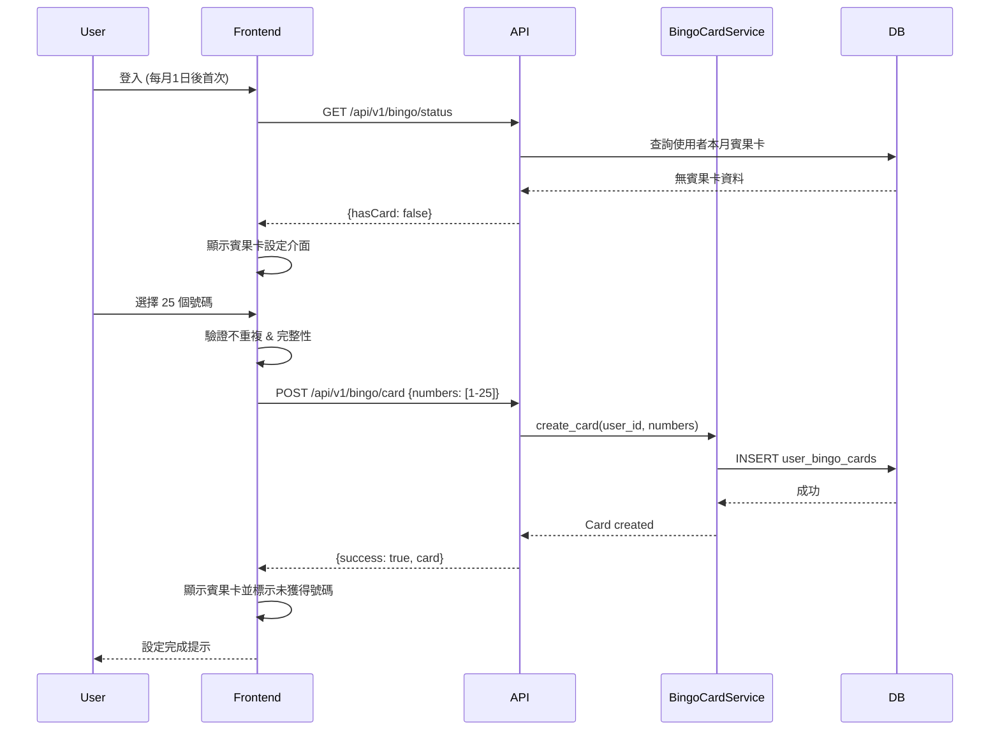
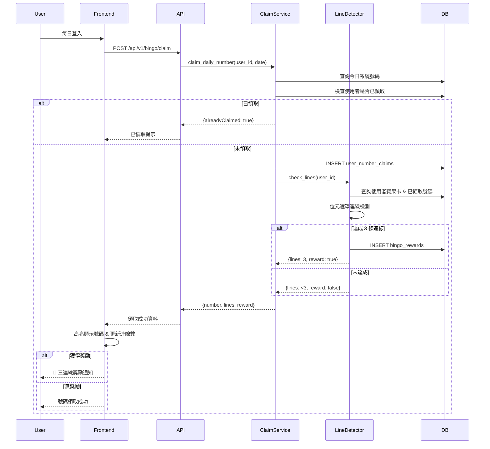
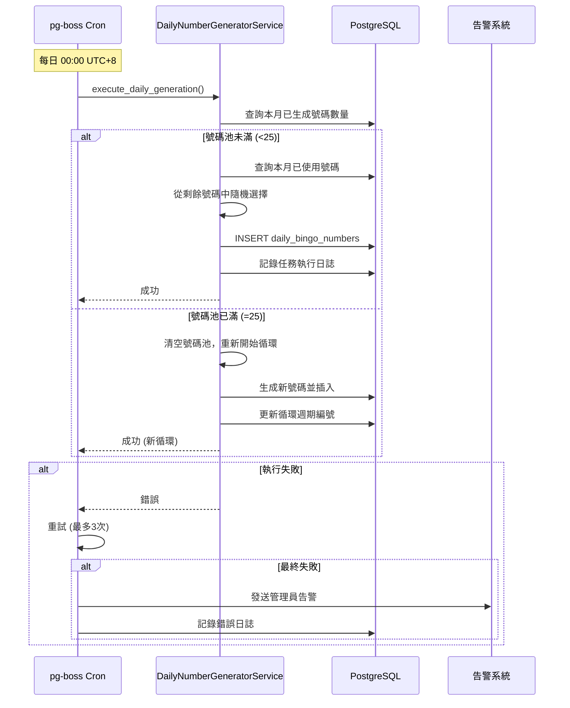
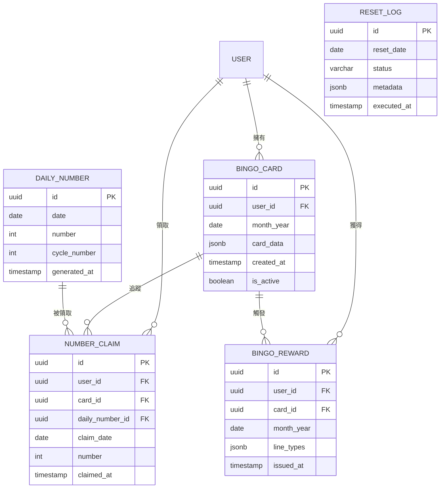

# 技術設計文件

## 概述

每日登入賓果遊戲系統採用前後端分離架構，整合現有 Wasteland Tarot 平台的 Next.js + FastAPI 技術棧。系統核心包含自動化號碼生成、使用者賓果卡管理、連線檢測與獎勵機制。透過 PostgreSQL 資料持久化、pg-boss 任務排程與 Zustand 狀態管理，實現高效能、可擴展的每日簽到遊戲系統。

本設計文件完整映射需求文件中的 8 大需求領域，採用位元遮罩演算法優化連線檢測、Fisher-Yates 洗牌確保隨機性，並利用 PostgreSQL 表分區實現高效的月度資料歸檔。

## 需求映射

### 設計元件追溯表

| 設計元件 | 對應需求 | EARS 參考 | 說明 |
|---------|---------|-----------|------|
| **DailyNumberGeneratorService** | 需求 1: 系統每日號碼生成機制 | 1.1-1.5 | 自動產生每日號碼並管理25日循環 |
| **BingoCardManagerService** | 需求 2: 使用者賓果卡設定機制 | 2.1-2.5 | 處理賓果卡初始化與驗證 |
| **DailyClaimService** | 需求 3: 每日登入號碼領取機制 | 3.1-3.5 | 管理使用者每日號碼領取邏輯 |
| **LineDetectionService** | 需求 4: 賓果連線檢測與獎勵機制 | 4.1-4.5 | 檢測連線與觸發獎勵發放 |
| **MonthlyResetScheduler** | 需求 5: 每月重置機制 | 5.1-5.5 | 執行每月重置與資料歸檔 |
| **Database Schema** | 需求 6: 資料持久化與查詢 | 6.1-6.5 | 完整資料庫表結構設計 |
| **BingoUI Components** | 需求 7: 使用者介面與互動 | 7.1-7.6 | React 前端互動介面 |
| **pg-boss Job Scheduler** | 需求 8: 系統定時任務與自動化 | 8.1-8.5 | 定時任務排程與重試機制 |

### User Story 覆蓋分析

1. **系統管理者 - 自動號碼生成**: DailyNumberGeneratorService + pg-boss Cron Job (需求 1, 8)
2. **使用者 - 賓果卡設定**: BingoCardManagerService + BingoCardSetup Component (需求 2, 7)
3. **使用者 - 每日號碼領取**: DailyClaimService + DailyCheckin Component (需求 3, 7)
4. **使用者 - 連線獎勵**: LineDetectionService + RewardNotification Component (需求 4, 7)
5. **系統管理者 - 每月重置**: MonthlyResetScheduler + Data Archive (需求 5, 6)
6. **開發者 - 資料持久化**: PostgreSQL Schema + SQLAlchemy Models (需求 6)
7. **使用者 - 清晰介面**: Complete UI Component Suite (需求 7)
8. **系統管理者 - 自動化**: pg-boss with retry & logging (需求 8)

## 架構設計

### 系統架構圖

```mermaid
graph TB
    subgraph "Frontend Layer (Next.js 15 + React 19)"
        A[BingoCardSetup Component]
        B[DailyCheckin Component]
        C[BingoGrid Display]
        D[RewardNotification]
        E[Zustand BingoStore]
        A --> E
        B --> E
        C --> E
        D --> E
    end

    subgraph "API Gateway (FastAPI)"
        F[/api/v1/bingo/card]
        G[/api/v1/bingo/claim]
        H[/api/v1/bingo/status]
        I[/api/v1/bingo/history]
    end

    subgraph "Business Logic (Python Services)"
        J[BingoCardManagerService]
        K[DailyClaimService]
        L[LineDetectionService]
        M[DailyNumberGeneratorService]
        N[MonthlyResetScheduler]
    end

    subgraph "Task Scheduler (pg-boss)"
        O[Daily Cron: 00:00 UTC+8]
        P[Monthly Cron: 1st 00:00 UTC+8]
    end

    subgraph "Data Layer (PostgreSQL + SQLAlchemy)"
        Q[(user_bingo_cards)]
        R[(daily_bingo_numbers)]
        S[(user_number_claims)]
        T[(bingo_rewards)]
        U[(bingo_card_history)]
    end

    E -->|HTTP Requests| F
    E -->|HTTP Requests| G
    E -->|HTTP Requests| H
    E -->|HTTP Requests| I

    F --> J
    G --> K
    H --> L
    I --> J

    K --> L
    L --> T

    O --> M
    P --> N

    M --> R
    N --> U
    N --> Q

    J --> Q
    K --> S
    L --> Q
```

### 技術棧選擇

#### 前端技術棧
- **框架**: Next.js 15.1.7 (App Router)
- **UI 函式庫**: React 19
- **語言**: TypeScript 5
- **狀態管理**: Zustand 4.5.7
- **樣式**: Tailwind CSS v4.1.13
- **HTTP 客戶端**: Fetch API (原生)
- **執行環境**: Bun

#### 後端技術棧
- **框架**: FastAPI 0.104.0+
- **語言**: Python 3.11+
- **ORM**: SQLAlchemy 2.0.23+
- **資料庫**: PostgreSQL (via Supabase)
- **任務排程**: pg-boss (PostgreSQL-based job queue)
- **認證**: 整合現有 Supabase Auth + JWT
- **套件管理**: uv

#### 資料庫與基礎設施
- **主資料庫**: Supabase PostgreSQL
- **任務佇列**: pg-boss (使用 PostgreSQL)
- **部署**: Frontend (Vercel) + Backend (Railway)

### 架構決策理由

#### 1. 為何選擇 pg-boss 作為任務排程？
**研究發現**:
- **原生 PostgreSQL 整合**: 無需額外 Redis/MongoDB，降低基礎設施複雜度
- **分散式鎖機制**: 內建鎖機制防止多實例環境下任務重複執行
- **持久化任務記錄**: 任務執行歷史直接存於 PostgreSQL，易於追蹤與除錯
- **重試與錯誤處理**: 支援自動重試（最多 3 次）與錯誤告警

**替代方案分析**:
- node-cron: 適合單一伺服器，但無分散式鎖
- BullMQ: 功能強大但需要 Redis 額外成本
- Agenda: 基於 MongoDB，不符合現有技術棧

#### 2. 為何採用位元遮罩連線檢測？
**研究發現**:
- **O(1) 檢測效能**: 使用位元運算，常數時間複雜度檢測 12 種連線
- **記憶體效率**: 25-bit 整數即可表示整張賓果卡狀態
- **易於擴展**: 可快速新增新的連線模式（如四角連線）

**實作範例**:
```typescript
const LINE_PATTERNS = [
  0x1F00000, 0x3E0000, 0x7C00, 0xF80, 0x1F,        // 5 rows
  0x1084210, 0x2108420, 0x4210840, 0x8421080, 0x10842100,  // 5 cols
  0x11111000, 0x1041040                              // 2 diagonals
];

function countLines(claimedMask: number): number {
  return LINE_PATTERNS.filter(pattern =>
    (claimedMask & pattern) === pattern
  ).length;
}
```

#### 3. 為何使用 Fisher-Yates 預生成號碼序列？
**研究發現**:
- **真隨機性**: Fisher-Yates 演算法確保均勻隨機分佈
- **效能優化**: 每月1日一次性生成 25 個號碼，減少每日運算
- **可驗證性**: 預生成序列可提前驗證完整性（1-25 不重複）

**實作邏輯**:
```python
def generate_monthly_sequence() -> list[int]:
    numbers = list(range(1, 26))
    random.shuffle(numbers)  # Fisher-Yates shuffle
    return numbers
```

#### 4. 為何採用 PostgreSQL 表分區？
**研究發現**:
- **查詢效能**: RANGE 分區按月份分表，熱資料查詢快速
- **資料歸檔**: 歷史月份自動分離，易於管理與備份
- **自動化管理**: 可透過 Cron Job 自動建立新月份分區

**分區策略**:
```sql
CREATE TABLE user_bingo_cards (
  id UUID PRIMARY KEY,
  user_id UUID NOT NULL,
  month_year DATE NOT NULL,
  card_data JSONB NOT NULL,
  created_at TIMESTAMP DEFAULT NOW()
) PARTITION BY RANGE (month_year);

-- 每月自動建立分區
CREATE TABLE user_bingo_cards_2025_10 PARTITION OF user_bingo_cards
  FOR VALUES FROM ('2025-10-01') TO ('2025-11-01');
```

## 資料流設計

### 主要使用者流程

#### 流程 1: 每月初設定賓果卡



#### 流程 2: 每日登入領取號碼



#### 流程 3: 每日自動號碼生成 (Cron Job)



## 元件與介面設計

### 後端服務與方法簽章

#### BingoCardManagerService
```python
class BingoCardManagerService:
    """賓果卡管理服務 - 對應需求 2"""

    def create_card(self, user_id: str, numbers: list[int], month_year: date) -> BingoCard:
        """
        建立使用者賓果卡
        - 驗證 25 個號碼不重複且範圍 1-25
        - 儲存至 user_bingo_cards 表
        - 關聯使用者與月份
        """
        pass

    def get_user_card(self, user_id: str, month_year: date) -> Optional[BingoCard]:
        """查詢使用者指定月份的賓果卡"""
        pass

    def has_card_for_month(self, user_id: str, month_year: date) -> bool:
        """檢查使用者本月是否已設定賓果卡"""
        pass

    def validate_card_numbers(self, numbers: list[int]) -> bool:
        """驗證賓果卡號碼合法性 (1-25, 不重複, 數量=25)"""
        pass
```

#### DailyClaimService
```python
class DailyClaimService:
    """每日號碼領取服務 - 對應需求 3"""

    def claim_daily_number(self, user_id: str, claim_date: date) -> ClaimResult:
        """
        領取每日號碼
        - 檢查是否已領取
        - 獲取當日系統號碼
        - 記錄領取歷史
        - 觸發連線檢測
        """
        pass

    def has_claimed_today(self, user_id: str, date: date) -> bool:
        """檢查使用者今日是否已領取號碼"""
        pass

    def get_claimed_numbers(self, user_id: str, month_year: date) -> list[int]:
        """取得使用者本月已領取的所有號碼"""
        pass
```

#### LineDetectionService
```python
class LineDetectionService:
    """連線檢測服務 - 對應需求 4"""

    LINE_PATTERNS: list[int] = [
        # 5 rows
        0x1F00000, 0x3E0000, 0x7C00, 0xF80, 0x1F,
        # 5 cols
        0x1084210, 0x2108420, 0x4210840, 0x8421080, 0x10842100,
        # 2 diagonals
        0x11111000, 0x1041040
    ]

    def check_lines(self, user_id: str, month_year: date) -> LineCheckResult:
        """
        檢測賓果連線
        - 查詢使用者賓果卡與已領取號碼
        - 計算位元遮罩
        - 使用位元運算檢測連線
        - 返回連線數與類型
        """
        pass

    def create_bitmask(self, card: list[int], claimed: list[int]) -> int:
        """將賓果卡與已領取號碼轉換為 25-bit 遮罩"""
        pass

    def count_lines(self, bitmask: int) -> int:
        """計算連線數量 (O(1) 位元運算)"""
        pass

    def issue_reward(self, user_id: str, month_year: date, line_types: list[str]) -> None:
        """發放三連線獎勵 (僅首次)"""
        pass
```

#### DailyNumberGeneratorService
```python
class DailyNumberGeneratorService:
    """每日號碼生成服務 - 對應需求 1, 8"""

    def generate_daily_number(self, date: date) -> int:
        """
        生成當日賓果號碼
        - 查詢本月已生成號碼
        - 若號碼池已滿 (25個) 則重置循環
        - 從剩餘號碼隨機選擇
        - 記錄至 daily_bingo_numbers
        """
        pass

    def get_current_cycle_numbers(self, month_year: date) -> list[int]:
        """取得當前循環週期已生成的號碼"""
        pass

    def reset_cycle(self, month_year: date) -> int:
        """重置號碼池，返回新循環週期編號"""
        pass
```

#### MonthlyResetScheduler
```python
class MonthlyResetScheduler:
    """每月重置排程器 - 對應需求 5"""

    def execute_monthly_reset(self, reset_date: date) -> None:
        """
        執行每月重置
        - 歸檔上月資料至歷史表
        - 清空當月號碼池
        - 重置所有使用者賓果卡狀態
        - 清除當月領取記錄
        - 記錄重置執行日誌
        """
        pass

    def archive_previous_month(self, month_year: date) -> None:
        """將指定月份資料移至歷史表"""
        pass

    def clear_current_month_data(self) -> None:
        """清空當月遊戲資料"""
        pass
```

### 前端元件設計

| 元件名稱 | 職責 | Props/State 摘要 | 對應需求 |
|---------|------|-----------------|---------|
| **BingoCardSetup** | 賓果卡設定介面 | `selectedNumbers: number[]`, `onSubmit: (numbers) => void` | 需求 2, 7 |
| **BingoGrid** | 5x5 賓果卡顯示 | `card: number[][]`, `claimedNumbers: Set<number>`, `highlightNumber?: number` | 需求 7 |
| **DailyCheckin** | 每日簽到按鈕與號碼顯示 | `dailyNumber: number`, `onClaim: () => void`, `claimed: boolean` | 需求 3, 7 |
| **LineIndicator** | 連線狀態顯示 | `lineCount: number`, `lineTypes: string[]` | 需求 4, 7 |
| **RewardNotification** | 獎勵通知彈窗 | `show: boolean`, `rewardType: string`, `onClose: () => void` | 需求 4, 7 |
| **BingoHistory** | 歷史記錄查詢 | `userId: string`, `month: string` | 需求 6, 7 |

### API 端點設計

| Method | Route | 用途 | 認證 | 狀態碼 | 對應需求 |
|--------|-------|------|------|--------|---------|
| GET | `/api/v1/bingo/status` | 查詢使用者本月賓果狀態 | Required | 200, 401, 500 | 需求 2, 3 |
| POST | `/api/v1/bingo/card` | 建立使用者賓果卡 | Required | 201, 400, 401, 409, 500 | 需求 2 |
| GET | `/api/v1/bingo/card` | 取得使用者賓果卡 | Required | 200, 401, 404, 500 | 需求 2 |
| POST | `/api/v1/bingo/claim` | 領取每日號碼 | Required | 200, 400, 401, 409, 500 | 需求 3 |
| GET | `/api/v1/bingo/daily-number` | 取得今日系統號碼 | Optional | 200, 500 | 需求 1 |
| GET | `/api/v1/bingo/lines` | 查詢連線狀態 | Required | 200, 401, 500 | 需求 4 |
| GET | `/api/v1/bingo/history/{month}` | 查詢歷史月份記錄 | Required | 200, 401, 404, 500 | 需求 6 |
| GET | `/api/v1/bingo/rewards` | 查詢獎勵記錄 | Required | 200, 401, 500 | 需求 4 |

### API 請求/回應範例

#### POST `/api/v1/bingo/card` - 建立賓果卡
```typescript
// Request
{
  "numbers": [
    [1, 2, 3, 4, 5],
    [6, 7, 8, 9, 10],
    [11, 12, 13, 14, 15],
    [16, 17, 18, 19, 20],
    [21, 22, 23, 24, 25]
  ]
}

// Response 201
{
  "success": true,
  "card": {
    "id": "uuid",
    "userId": "uuid",
    "monthYear": "2025-10",
    "numbers": [[1,2,3,4,5], ...],
    "createdAt": "2025-10-01T08:00:00Z"
  }
}

// Response 409 (已設定)
{
  "error": "CARD_ALREADY_EXISTS",
  "message": "本月已設定賓果卡，無法重新設定"
}
```

#### POST `/api/v1/bingo/claim` - 領取每日號碼
```typescript
// Request (無 body，使用當日日期)

// Response 200
{
  "success": true,
  "dailyNumber": 7,
  "isOnCard": true,
  "lineCount": 2,
  "hasReward": false,
  "claimedAt": "2025-10-15T08:30:00Z"
}

// Response 200 (達成三連線)
{
  "success": true,
  "dailyNumber": 13,
  "isOnCard": true,
  "lineCount": 3,
  "hasReward": true,
  "reward": {
    "id": "uuid",
    "type": "THREE_LINES",
    "issuedAt": "2025-10-15T08:30:00Z"
  }
}

// Response 409 (已領取)
{
  "error": "ALREADY_CLAIMED",
  "message": "今日已領取號碼"
}
```

## 資料模型設計

### 領域實體

1. **BingoCard (賓果卡)**: 使用者每月設定的 5x5 號碼網格
2. **DailyNumber (每日號碼)**: 系統每日產生的賓果號碼
3. **NumberClaim (號碼領取記錄)**: 使用者每日領取號碼的歷史
4. **BingoReward (賓果獎勵)**: 三連線獎勵發放記錄
5. **ResetLog (重置日誌)**: 每月重置執行記錄

### 實體關係圖



### 資料模型定義

#### TypeScript 介面
```typescript
interface BingoCard {
  id: string;
  userId: string;
  monthYear: string;  // YYYY-MM format
  cardData: number[][];  // 5x5 grid
  createdAt: Date;
  isActive: boolean;
}

interface DailyNumber {
  id: string;
  date: Date;
  number: number;  // 1-25
  cycleNumber: number;
  generatedAt: Date;
}

interface NumberClaim {
  id: string;
  userId: string;
  cardId: string;
  dailyNumberId: string;
  claimDate: Date;
  number: number;
  claimedAt: Date;
}

interface BingoReward {
  id: string;
  userId: string;
  cardId: string;
  monthYear: string;
  lineTypes: string[];  // ['row-0', 'col-2', 'diagonal-main']
  issuedAt: Date;
}

interface ResetLog {
  id: string;
  resetDate: Date;
  status: 'SUCCESS' | 'FAILED' | 'PARTIAL';
  metadata: {
    cardsArchived: number;
    claimsArchived: number;
    rewardsArchived: number;
    errors?: string[];
  };
  executedAt: Date;
}
```

#### Python Dataclass / Pydantic Models
```python
from datetime import date, datetime
from typing import Optional
from pydantic import BaseModel

class BingoCardCreate(BaseModel):
    """賓果卡建立請求"""
    numbers: list[list[int]]  # 5x5 grid

class BingoCardResponse(BaseModel):
    """賓果卡回應"""
    id: str
    user_id: str
    month_year: str
    card_data: list[list[int]]
    created_at: datetime
    is_active: bool

class DailyNumberResponse(BaseModel):
    """每日號碼回應"""
    id: str
    date: date
    number: int
    cycle_number: int
    generated_at: datetime

class ClaimResult(BaseModel):
    """領取結果"""
    success: bool
    daily_number: int
    is_on_card: bool
    line_count: int
    has_reward: bool
    reward: Optional[dict] = None
    claimed_at: datetime

class LineCheckResult(BaseModel):
    """連線檢測結果"""
    line_count: int
    line_types: list[str]
    has_three_lines: bool
    reward_issued: bool
```

### 資料庫 Schema

#### 主要資料表
```sql
-- 使用者賓果卡表 (使用月份分區)
CREATE TABLE user_bingo_cards (
    id UUID PRIMARY KEY DEFAULT gen_random_uuid(),
    user_id UUID NOT NULL REFERENCES users(id) ON DELETE CASCADE,
    month_year DATE NOT NULL,
    card_data JSONB NOT NULL,  -- 5x5 array of numbers
    created_at TIMESTAMP NOT NULL DEFAULT NOW(),
    is_active BOOLEAN NOT NULL DEFAULT true,
    UNIQUE(user_id, month_year)
) PARTITION BY RANGE (month_year);

-- 建立當月分區 (範例)
CREATE TABLE user_bingo_cards_2025_10 PARTITION OF user_bingo_cards
    FOR VALUES FROM ('2025-10-01') TO ('2025-11-01');

CREATE INDEX idx_user_bingo_cards_user_month ON user_bingo_cards(user_id, month_year);

-- 每日系統號碼表
CREATE TABLE daily_bingo_numbers (
    id UUID PRIMARY KEY DEFAULT gen_random_uuid(),
    date DATE NOT NULL UNIQUE,
    number INT NOT NULL CHECK (number BETWEEN 1 AND 25),
    cycle_number INT NOT NULL DEFAULT 1,
    generated_at TIMESTAMP NOT NULL DEFAULT NOW()
);

CREATE INDEX idx_daily_numbers_date ON daily_bingo_numbers(date);
CREATE INDEX idx_daily_numbers_cycle ON daily_bingo_numbers(cycle_number);

-- 使用者號碼領取記錄表
CREATE TABLE user_number_claims (
    id UUID PRIMARY KEY DEFAULT gen_random_uuid(),
    user_id UUID NOT NULL REFERENCES users(id) ON DELETE CASCADE,
    card_id UUID NOT NULL REFERENCES user_bingo_cards(id) ON DELETE CASCADE,
    daily_number_id UUID NOT NULL REFERENCES daily_bingo_numbers(id) ON DELETE CASCADE,
    claim_date DATE NOT NULL,
    number INT NOT NULL,
    claimed_at TIMESTAMP NOT NULL DEFAULT NOW(),
    UNIQUE(user_id, claim_date)
);

CREATE INDEX idx_claims_user_date ON user_number_claims(user_id, claim_date);
CREATE INDEX idx_claims_card ON user_number_claims(card_id);

-- 賓果獎勵記錄表
CREATE TABLE bingo_rewards (
    id UUID PRIMARY KEY DEFAULT gen_random_uuid(),
    user_id UUID NOT NULL REFERENCES users(id) ON DELETE CASCADE,
    card_id UUID NOT NULL REFERENCES user_bingo_cards(id) ON DELETE CASCADE,
    month_year DATE NOT NULL,
    line_types JSONB NOT NULL,  -- ['row-0', 'col-2', 'diagonal-main']
    issued_at TIMESTAMP NOT NULL DEFAULT NOW(),
    UNIQUE(user_id, month_year)  -- 每月僅發放一次獎勵
);

CREATE INDEX idx_rewards_user_month ON bingo_rewards(user_id, month_year);

-- 每月重置日誌表
CREATE TABLE monthly_reset_logs (
    id UUID PRIMARY KEY DEFAULT gen_random_uuid(),
    reset_date DATE NOT NULL,
    status VARCHAR(20) NOT NULL CHECK (status IN ('SUCCESS', 'FAILED', 'PARTIAL')),
    metadata JSONB,  -- {cardsArchived: 100, claimsArchived: 2500, errors: [...]}
    executed_at TIMESTAMP NOT NULL DEFAULT NOW()
);

CREATE INDEX idx_reset_logs_date ON monthly_reset_logs(reset_date);
```

#### 歷史資料表 (用於月度歸檔)
```sql
-- 歷史賓果卡表
CREATE TABLE user_bingo_cards_history (
    id UUID PRIMARY KEY,
    user_id UUID NOT NULL,
    month_year DATE NOT NULL,
    card_data JSONB NOT NULL,
    created_at TIMESTAMP NOT NULL,
    archived_at TIMESTAMP NOT NULL DEFAULT NOW()
);

CREATE INDEX idx_cards_history_user_month ON user_bingo_cards_history(user_id, month_year);

-- 歷史領取記錄表
CREATE TABLE user_number_claims_history (
    id UUID PRIMARY KEY,
    user_id UUID NOT NULL,
    card_id UUID NOT NULL,
    claim_date DATE NOT NULL,
    number INT NOT NULL,
    claimed_at TIMESTAMP NOT NULL,
    archived_at TIMESTAMP NOT NULL DEFAULT NOW()
);

CREATE INDEX idx_claims_history_user_month ON user_number_claims_history(user_id, claim_date);

-- 歷史獎勵記錄表
CREATE TABLE bingo_rewards_history (
    id UUID PRIMARY KEY,
    user_id UUID NOT NULL,
    month_year DATE NOT NULL,
    line_types JSONB NOT NULL,
    issued_at TIMESTAMP NOT NULL,
    archived_at TIMESTAMP NOT NULL DEFAULT NOW()
);

CREATE INDEX idx_rewards_history_user_month ON bingo_rewards_history(user_id, month_year);
```

### 遷移策略

#### 資料庫遷移步驟
1. **初始遷移**: 使用 Alembic 建立所有主表與索引
2. **月度分區管理**: 透過 pg-boss Cron Job 每月1日自動建立新分區
3. **資料歸檔**: 每月重置時將上月資料移至歷史表
4. **索引優化**: 按查詢模式定期分析並調整索引

#### 向後相容性考量
- **API 版本控制**: 使用 `/api/v1/bingo` 路徑，未來可擴展 v2
- **資料庫欄位擴展**: 使用 JSONB 欄位 (card_data, metadata) 允許彈性擴展
- **歷史資料保留**: 歸檔資料永久保留，支援未來分析需求

#### 索引策略
- **複合索引**: (user_id, month_year) 加速使用者月度查詢
- **部分索引**: 僅為 is_active=true 的賓果卡建立索引
- **分區索引**: 每個月度分區自動繼承父表索引

## 錯誤處理

### 錯誤分類與處理策略

#### 1. 業務邏輯錯誤
| 錯誤碼 | 情境 | HTTP 狀態碼 | 處理方式 |
|--------|------|------------|---------|
| `CARD_ALREADY_EXISTS` | 本月已設定賓果卡 | 409 | 返回現有賓果卡資訊 |
| `ALREADY_CLAIMED` | 今日已領取號碼 | 409 | 返回已領取狀態 |
| `INVALID_CARD_NUMBERS` | 賓果卡號碼不合法 | 400 | 返回驗證錯誤詳情 |
| `NO_CARD_FOUND` | 使用者無賓果卡 | 404 | 提示需先設定賓果卡 |
| `PAST_DATE_CLAIM` | 嘗試補領過期號碼 | 400 | 明確拒絕並說明規則 |

#### 2. 系統錯誤
| 錯誤類型 | 處理策略 | 監控 |
|---------|---------|------|
| **Database Connection** | 自動重試 3 次，超時 5s | Sentry 告警 |
| **Cron Job Failure** | pg-boss 自動重試，記錄日誌 | 管理員 Email 通知 |
| **Number Generation Error** | 回退至備用演算法，記錄異常 | 即時告警 |
| **Line Detection Error** | 記錄錯誤，返回預設值 (0 連線) | 錯誤日誌分析 |

#### 3. 認證與授權錯誤
| 錯誤碼 | HTTP 狀態碼 | 處理方式 |
|--------|------------|---------|
| `UNAUTHORIZED` | 401 | 重導向至登入頁 |
| `FORBIDDEN` | 403 | 顯示權限不足提示 |
| `TOKEN_EXPIRED` | 401 | 自動刷新 Token |

### 錯誤回應格式
```typescript
interface ErrorResponse {
  error: string;  // 錯誤碼
  message: string;  // 使用者可讀訊息 (繁體中文)
  details?: object;  // 額外錯誤詳情
  timestamp: string;
  path: string;
}

// 範例
{
  "error": "INVALID_CARD_NUMBERS",
  "message": "賓果卡號碼不符合規則：必須包含 1-25 所有數字且不重複",
  "details": {
    "duplicates": [7, 13],
    "missing": [18, 22]
  },
  "timestamp": "2025-10-15T08:30:00Z",
  "path": "/api/v1/bingo/card"
}
```

## 安全性考量

### 認證與授權
- **JWT Token 驗證**: 整合現有 Supabase Auth，所有 API 端點需驗證 JWT
- **Row-Level Security**: 使用者僅能存取自己的賓果卡與領取記錄
- **API Rate Limiting**: 防止暴力領取攻擊 (每使用者每日最多 10 次請求)

### 輸入驗證
- **賓果卡號碼驗證**:
  - 長度必須為 25
  - 數字範圍 1-25
  - 無重複數字
  - 使用 Pydantic 驗證器
- **SQL Injection 防護**: 使用 SQLAlchemy ORM，避免原生 SQL 拼接
- **XSS 防護**: React 自動轉義，JSONB 欄位存取前驗證

### 資料加密
- **傳輸加密**: HTTPS (TLS 1.3)
- **資料庫加密**: Supabase 預設啟用資料庫加密
- **敏感資料處理**: 獎勵資訊使用 JSONB 儲存，避免明文暴露

### OWASP 最佳實踐
- **CORS 配置**: 僅允許前端域名 (Vercel deployment URL)
- **Content Security Policy**: 設定 CSP header 防止 XSS
- **依賴安全掃描**: 使用 `pip-audit` (Python) 和 `bun audit` (Frontend) 定期掃描
- **最小權限原則**: 資料庫連線使用專用服務帳號，非 root 權限

## 效能與擴展性

### 效能目標

| 指標 | 目標值 | 測量方式 | 對應需求 |
|------|-------|---------|---------|
| API 回應時間 (p95) | < 200ms | FastAPI middleware 監控 | 全部 API |
| API 回應時間 (p99) | < 500ms | APM 工具 | 全部 API |
| 資料庫查詢 (p99) | < 50ms | PostgreSQL slow query log | 需求 6 |
| 連線檢測運算 | < 10ms | 函式計時 | 需求 4 |
| 每日號碼生成 | < 100ms | Cron job 日誌 | 需求 1 |
| 並發使用者 | > 10,000 | 負載測試 | 全系統 |
| 每秒請求數 | > 1,000 req/sec | Artillery 壓測 | 全系統 |

### 快取策略

#### 應用層快取
- **Redis 快取** (整合現有 Redis):
  - 每日號碼: `bingo:daily:{date}` (TTL: 24h)
  - 使用者賓果卡: `bingo:card:{user_id}:{month}` (TTL: 30d)
  - 連線狀態: `bingo:lines:{user_id}:{month}` (TTL: 30d)

#### 資料庫快取
- **PostgreSQL Query Cache**: 啟用 shared_buffers 增加記憶體快取
- **Materialized Views**: 歷史統計資料使用物化檢視表

#### 瀏覽器快取
- **靜態資源**: CDN 快取 (max-age=31536000)
- **API 回應**: 設定適當的 Cache-Control header
  - 每日號碼: `public, max-age=3600` (1小時)
  - 賓果卡: `private, max-age=86400` (24小時)

### 擴展性設計

#### 水平擴展
- **無狀態 API**: FastAPI 服務無狀態，可任意擴展實例
- **pg-boss 分散式鎖**: 確保 Cron Job 僅執行一次，支援多實例部署
- **Database Read Replicas**: 使用 Supabase 讀取副本分散查詢負載

#### 資料分區
- **月度分區**: user_bingo_cards 按月份 RANGE 分區
- **自動分區建立**: Cron Job 於每月1日建立下月分區
- **分區裁剪**: PostgreSQL 自動分區裁剪優化查詢

#### 非同步處理
- **背景任務**: 使用 pg-boss 處理耗時任務
  - 每月重置與資料歸檔
  - 獎勵發放與通知
  - 統計資料計算

#### 效能優化技巧
1. **批次寫入**: 每月重置時使用批次 INSERT 提升效能
2. **Connection Pooling**: SQLAlchemy 連線池 (min=5, max=20)
3. **索引優化**: 定期使用 EXPLAIN ANALYZE 分析慢查詢
4. **JSONB 索引**: 為 card_data 建立 GIN 索引加速 JSONB 查詢

## 測試策略

### 風險矩陣

| 領域 | 風險等級 | 必須測試 | 可選測試 | 需求參考 |
|------|---------|---------|---------|---------|
| 號碼生成邏輯 | 高 (H) | Unit, Integration | Property-based | 需求 1 |
| 連線檢測演算法 | 高 (H) | Unit, Property | Performance | 需求 4 |
| 賓果卡驗證 | 中 (M) | Unit, Contract | Fuzzing | 需求 2 |
| 每日領取流程 | 高 (H) | Integration, E2E | Load | 需求 3 |
| 每月重置機制 | 高 (H) | Integration | Resilience | 需求 5 |
| 資料完整性 | 高 (H) | Integration, Unit | Migration | 需求 6 |
| UI 互動流程 | 中 (M) | E2E (≤3), A11y | Visual Regression | 需求 7 |
| Cron Job 排程 | 中 (M) | Integration | Chaos | 需求 8 |

### 分層測試策略

#### 1. 單元測試 (Unit Tests)
**後端 (pytest)**:
```python
# tests/unit/test_line_detection.py
def test_line_detection_three_lines():
    """測試三連線檢測 - 需求 4.1"""
    service = LineDetectionService()
    bitmask = 0x1F00000 | 0x1084210 | 0x11111000  # 1 row + 1 col + 1 diagonal
    assert service.count_lines(bitmask) == 3

def test_daily_number_generation_no_duplicates():
    """測試號碼生成不重複 - 需求 1.2"""
    service = DailyNumberGeneratorService()
    numbers = [service.generate_daily_number(date(2025, 10, i)) for i in range(1, 26)]
    assert len(set(numbers)) == 25  # 確保 25 天內無重複
```

**前端 (Jest + React Testing Library)**:
```typescript
// src/components/bingo/__tests__/BingoGrid.test.tsx
describe('BingoGrid - 需求 7.3', () => {
  it('正確標示已獲得號碼', () => {
    const card = [[1,2,3,4,5], [6,7,8,9,10], ...];
    const claimed = new Set([1, 7, 13]);

    render(<BingoGrid card={card} claimedNumbers={claimed} />);

    expect(screen.getByText('1')).toHaveClass('claimed');
    expect(screen.getByText('2')).not.toHaveClass('claimed');
  });
});
```

#### 2. 整合測試 (Integration Tests)
```python
# tests/integration/test_daily_claim_flow.py
async def test_claim_flow_with_reward(async_client, db_session):
    """測試完整領取流程含獎勵 - 需求 3, 4"""
    # 1. 建立使用者賓果卡
    card = await create_bingo_card(user_id, numbers)

    # 2. 生成每日號碼
    await generate_daily_number(date.today(), number=13)

    # 3. 領取號碼 (假設達成 3 連線)
    response = await async_client.post("/api/v1/bingo/claim")

    assert response.status_code == 200
    data = response.json()
    assert data["lineCount"] == 3
    assert data["hasReward"] is True

    # 4. 驗證資料庫記錄
    claim = db_session.query(NumberClaim).filter_by(user_id=user_id).first()
    assert claim is not None

    reward = db_session.query(BingoReward).filter_by(user_id=user_id).first()
    assert reward is not None
```

#### 3. 端對端測試 (E2E - Playwright)
```typescript
// tests/e2e/bingo-flow.spec.ts
test('完整賓果遊戲流程 - 需求 2, 3, 4, 7', async ({ page }) => {
  // 1. 登入使用者
  await page.goto('/auth/login');
  await login(page, 'user@example.com', 'password');

  // 2. 進入賓果頁面，設定賓果卡
  await page.goto('/bingo');
  await page.waitForSelector('[data-testid="bingo-card-setup"]');

  // 選擇 25 個號碼
  for (let i = 1; i <= 25; i++) {
    await page.click(`[data-number="${i}"]`);
  }
  await page.click('button:has-text("確認設定")');

  // 3. 驗證賓果卡顯示
  await expect(page.locator('[data-testid="bingo-grid"]')).toBeVisible();

  // 4. 領取每日號碼
  await page.click('button:has-text("領取今日號碼")');
  await expect(page.locator('[data-testid="daily-number"]')).toBeVisible();

  // 5. 驗證連線數顯示
  const lineCount = await page.locator('[data-testid="line-count"]').textContent();
  expect(parseInt(lineCount)).toBeGreaterThanOrEqual(0);
});
```

#### 4. 契約測試 (Contract Tests)
```python
# tests/contract/test_bingo_api_contract.py
def test_claim_api_contract():
    """驗證 Claim API 契約 - 需求 3"""
    from pydantic import ValidationError

    # 正確格式
    response = ClaimResult(
        success=True,
        daily_number=7,
        is_on_card=True,
        line_count=2,
        has_reward=False,
        claimed_at=datetime.now()
    )
    assert response.success is True

    # 錯誤格式應拋出驗證錯誤
    with pytest.raises(ValidationError):
        ClaimResult(success=True)  # 缺少必要欄位
```

#### 5. 效能測試 (Performance Tests)
```python
# tests/performance/test_line_detection_performance.py
import pytest
from time import perf_counter

@pytest.mark.benchmark
def test_line_detection_performance():
    """連線檢測效能測試 - 需求 4, 目標 <10ms"""
    service = LineDetectionService()
    bitmask = 0x1FFFFFF  # All numbers claimed

    start = perf_counter()
    for _ in range(1000):
        service.count_lines(bitmask)
    duration = (perf_counter() - start) / 1000

    assert duration < 0.01  # < 10ms per operation
```

### CI/CD 測試閘門

| 階段 | 執行測試 | 閘門條件 | SLA |
|------|---------|---------|-----|
| **Pull Request** | Unit + Contract | 失敗 = 阻擋合併 | ≤ 3 分鐘 |
| **Staging 部署** | Integration + E2E | 失敗 = 阻擋部署 | ≤ 10 分鐘 |
| **Nightly Build** | Performance + Resilience | 回歸 → 建立 Issue | - |
| **Production 部署** | Smoke Tests | 失敗 = 自動回滾 | ≤ 2 分鐘 |

### 退出準則

#### 測試完成條件
- ✅ Sev1/Sev2 缺陷數 = 0
- ✅ 所有 CI/CD 閘門通過
- ✅ 程式碼覆蓋率 ≥ 85% (後端), ≥ 80% (前端)
- ✅ 效能目標達成 (API p95 < 200ms)
- ✅ E2E 測試通過率 ≥ 95%
- ✅ 無安全漏洞 (OWASP Top 10)

#### 非功能性需求驗證
- 並發 10,000 使用者負載測試通過
- 每月重置機制正確歸檔資料
- Cron Job 重試機制有效運作
- 所有 EARS 需求驗收標準滿足

---

## 附錄

### A. 位元遮罩連線檢測演算法詳解

#### 演算法原理
5x5 賓果卡可表示為 25-bit 整數，每個位元代表一個格子：
```
Position:  0  1  2  3  4
           5  6  7  8  9
          10 11 12 13 14
          15 16 17 18 19
          20 21 22 23 24

Bitmask:  0b 0000_0000_0000_0000_0000_0000_0 (25 bits)
```

#### 連線模式預計算
```typescript
const LINE_PATTERNS = {
  rows: [
    0b00000_00000_00000_00000_11111,  // Row 0
    0b00000_00000_00000_11111_00000,  // Row 1
    0b00000_00000_11111_00000_00000,  // Row 2
    0b00000_11111_00000_00000_00000,  // Row 3
    0b11111_00000_00000_00000_00000,  // Row 4
  ],
  cols: [
    0b00001_00001_00001_00001_00001,  // Col 0
    0b00010_00010_00010_00010_00010,  // Col 1
    0b00100_00100_00100_00100_00100,  // Col 2
    0b01000_01000_01000_01000_01000,  // Col 3
    0b10000_10000_10000_10000_10000,  // Col 4
  ],
  diagonals: [
    0b10000_01000_00100_00010_00001,  // Main diagonal
    0b00001_00010_00100_01000_10000,  // Anti diagonal
  ]
};
```

#### 檢測邏輯
```typescript
function checkLine(claimedMask: number, linePattern: number): boolean {
  // 位元 AND 運算，若結果等於 pattern，則該連線完成
  return (claimedMask & linePattern) === linePattern;
}

function countLines(claimedMask: number): number {
  const allPatterns = [
    ...LINE_PATTERNS.rows,
    ...LINE_PATTERNS.cols,
    ...LINE_PATTERNS.diagonals
  ];

  return allPatterns.filter(pattern =>
    checkLine(claimedMask, pattern)
  ).length;
}
```

### B. Fisher-Yates 洗牌演算法實作

#### Python 實作
```python
import random
from datetime import date

def generate_monthly_number_sequence(month_year: date) -> list[int]:
    """
    使用 Fisher-Yates 演算法生成當月 25 個隨機不重複號碼序列

    時間複雜度: O(n) where n=25
    空間複雜度: O(n)
    """
    numbers = list(range(1, 26))  # [1, 2, 3, ..., 25]

    # Fisher-Yates shuffle
    for i in range(24, 0, -1):
        j = random.randint(0, i)
        numbers[i], numbers[j] = numbers[j], numbers[i]

    return numbers

# 使用範例
october_numbers = generate_monthly_number_sequence(date(2025, 10, 1))
print(october_numbers)  # [7, 13, 2, 19, 5, 24, 11, ...]
```

#### TypeScript 實作
```typescript
function generateMonthlySequence(): number[] {
  const numbers = Array.from({length: 25}, (_, i) => i + 1);

  // Fisher-Yates shuffle
  for (let i = 24; i > 0; i--) {
    const j = Math.floor(Math.random() * (i + 1));
    [numbers[i], numbers[j]] = [numbers[j], numbers[i]];
  }

  return numbers;
}
```

### C. PostgreSQL 分區管理腳本

#### 自動建立下月分區 (pg-boss Cron Job)
```python
from datetime import date, timedelta
from sqlalchemy import text

async def create_next_month_partition(db: AsyncSession):
    """每月1日自動建立下月分區"""
    today = date.today()
    next_month = (today.replace(day=1) + timedelta(days=32)).replace(day=1)
    partition_name = f"user_bingo_cards_{next_month.strftime('%Y_%m')}"

    start_date = next_month
    end_date = (next_month.replace(day=1) + timedelta(days=32)).replace(day=1)

    create_partition_sql = text(f"""
        CREATE TABLE IF NOT EXISTS {partition_name}
        PARTITION OF user_bingo_cards
        FOR VALUES FROM ('{start_date}') TO ('{end_date}');
    """)

    await db.execute(create_partition_sql)
    await db.commit()
```

---

*設計文件版本: 1.0*
*最後更新: 2025-10-01*
*語言: 繁體中文 (zh-TW)*
