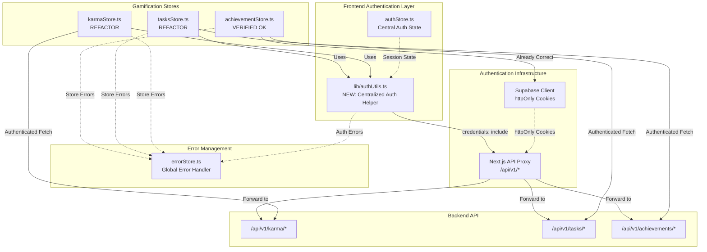
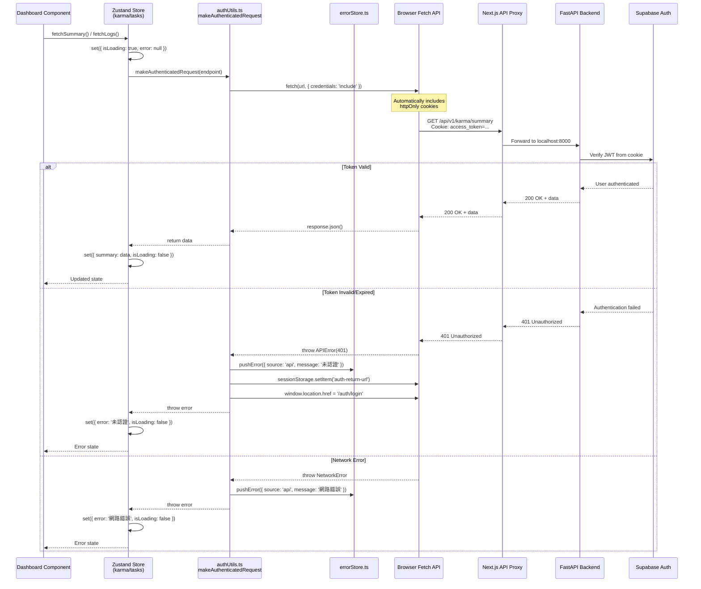
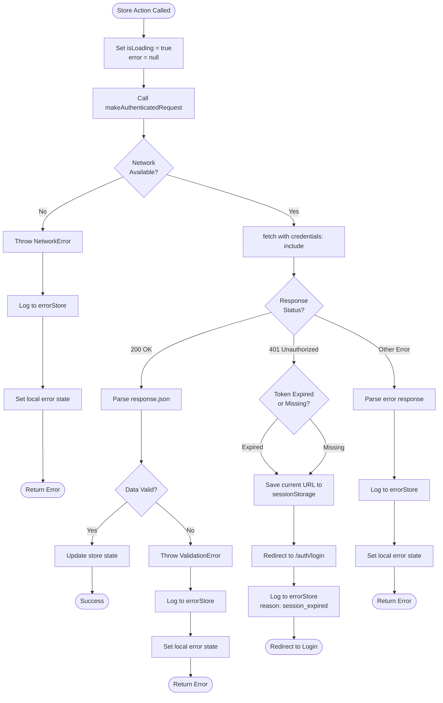
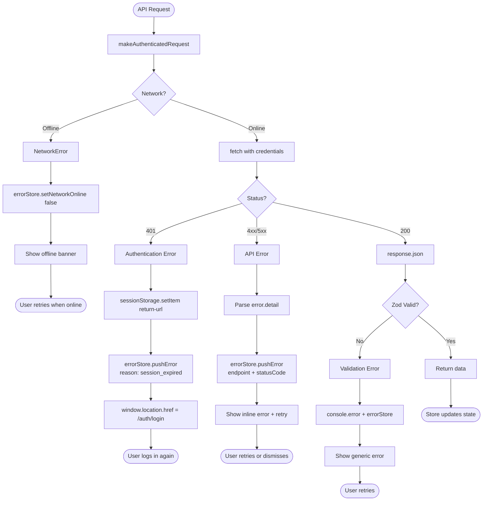
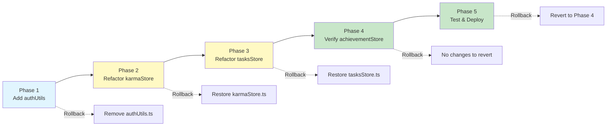

# Technical Design Document

## Overview

This design addresses critical authentication failures in Dashboard gamification stores (Karma, Tasks, Achievement) where duplicated authentication logic causes API request failures. The fix consolidates authentication token retrieval into a centralized utility module, eliminating code duplication and ensuring consistent authentication across all gamification features.

**Purpose**: Eliminate authentication errors in Dashboard gamification components by replacing inconsistent localStorage-based token retrieval with centralized Supabase session management.

**Users**: Authenticated users accessing Dashboard gamification features (karma summary/logs, daily/weekly tasks, achievement progress).

**Impact**: Changes existing `karmaStore.ts`, `tasksStore.ts`, and ensures `achievementStore.ts` follows the correct authentication pattern. Introduces new authentication utility module for consistent token management.

### Goals

- Eliminate authentication token retrieval errors in gamification stores
- Centralize authentication logic into reusable utility module
- Maintain backward compatibility with existing authStore and Supabase integration
- Ensure consistent error handling and user feedback across all stores
- Achieve <100ms token retrieval performance

### Non-Goals

- Modifying Supabase authentication flow or session management
- Changing API endpoint authentication requirements
- Adding new gamification features
- Implementing token refresh logic (handled by existing Supabase client)
- Modifying achievementStore (already using correct httpOnly cookie pattern)

## Architecture

### Existing Architecture Analysis

**Current Authentication Patterns**:

1. **karmaStore.ts & tasksStore.ts** (Incorrect Pattern):
   - Duplicated `getAccessToken()` parsing localStorage `auth` key
   - Duplicated `makeAuthenticatedRequest()` with manual `Authorization` header
   - Fragile JSON parsing: `parsed.state?.session?.access_token`
   - No integration with central authStore

2. **achievementStore.ts** (Correct Pattern):
   - Uses `credentials: 'include'` for httpOnly cookie transmission
   - No manual token retrieval or Authorization header
   - Centralized `apiRequest()` helper with proper error handling
   - Integrated with errorStore for global error management

3. **authStore.ts** (Central Authority):
   - Manages Supabase session via `authAPI.getCurrentUser()`
   - Uses `persist` middleware for localStorage synchronization
   - Contains `isAuthStateValid()` for token expiration checking
   - Includes token expiry monitoring (10-minute intervals)

**Integration Points to Maintain**:
- authStore's `user` state and `isInitialized` flag
- errorStore's `pushError()` for global error management
- Supabase httpOnly cookies (`access_token`, `refresh_token`)
- API proxy at `/api/v1/*` forwarding to backend

**Technical Debt Addressed**:
- Remove duplicated authentication logic (3 instances of `getAccessToken()` and `makeAuthenticatedRequest()`)
- Eliminate fragile localStorage parsing
- Unify error handling patterns across stores

### High-Level Architecture



**Architecture Integration**:
- **Existing patterns preserved**:
  - Zustand stores for state management
  - httpOnly cookie-based authentication
  - Next.js API proxy for CORS handling
  - errorStore for global error display

- **New components rationale**:
  - `lib/authUtils.ts` - Single source of truth for authenticated API requests
  - Prevents future duplication when adding new gamification stores

- **Technology alignment**:
  - TypeScript 5 with strict mode
  - Zustand state management (existing pattern)
  - Supabase Auth integration (existing)
  - Next.js 15 App Router (existing)

- **Steering compliance**:
  - No `any` types (Type Safety principle)
  - Single Responsibility for authentication logic
  - Fail Fast with immediate auth error detection
  - Backward compatibility with existing auth flow

### Technology Alignment

**Existing Technology Stack Alignment**:

| Layer | Technology | Usage | Modification |
|-------|-----------|-------|--------------|
| State Management | Zustand 4.5.7 | karmaStore, tasksStore, achievementStore | REFACTOR (karma, tasks) |
| Authentication | Supabase Client | httpOnly cookies via `credentials: 'include'` | USE AS-IS |
| HTTP Client | Fetch API | All API requests | STANDARDIZE |
| Error Handling | errorStore.ts | Global error state | INTEGRATE |
| Type System | TypeScript 5 | Strict mode, no `any` | MAINTAIN |

**New Dependencies**: None - uses existing Supabase client and Fetch API

**Justification for Changes**:
- **Why centralize auth logic?** Eliminates 3 duplicated implementations, reduces maintenance burden
- **Why follow achievementStore pattern?** Already proven to work correctly with Supabase httpOnly cookies
- **Why not use authStore directly?** Separation of concerns - authStore manages auth *state*, authUtils handles auth *requests*

### Key Design Decision 1: Centralized Authentication Utility

**Decision**: Create `lib/authUtils.ts` with `makeAuthenticatedRequest()` function following achievementStore's pattern

**Context**: Three stores (karma, tasks, achievement) need authenticated API requests, but only achievementStore implements it correctly using httpOnly cookies.

**Alternatives**:
1. **Copy achievementStore's pattern to each store** - Duplicates code (anti-pattern)
2. **Use authStore directly for requests** - Violates separation of concerns
3. **Create authentication middleware** - Over-engineered for simple request wrapper

**Selected Approach**: Centralized utility module
```typescript
// lib/authUtils.ts
export async function makeAuthenticatedRequest<T>(
  endpoint: string,
  options?: RequestInit
): Promise<T>
```

**Rationale**:
- Single source of truth - one implementation to test and maintain
- Reusable across all stores (karma, tasks, achievement, future stores)
- Follows achievementStore's proven pattern (httpOnly cookies + credentials: 'include')
- Minimal refactoring - drop-in replacement for existing functions
- Type-safe with generic return type

**Trade-offs**:
- **Gain**: No duplication, consistent error handling, easier testing
- **Gain**: Future stores automatically get correct authentication
- **Sacrifice**: Additional file to import (minimal cognitive overhead)
- **Sacrifice**: Cannot customize per-store (acceptable - auth should be uniform)

### Key Design Decision 2: httpOnly Cookie Authentication

**Decision**: Use `credentials: 'include'` with Supabase httpOnly cookies instead of manual Authorization headers

**Context**: Backend sets `access_token` and `refresh_token` as httpOnly cookies. Manual localStorage parsing is fragile and bypasses Supabase's session management.

**Alternatives**:
1. **Fix localStorage parsing** - Still duplicates logic, doesn't leverage Supabase
2. **Use Authorization header from authStore** - Requires store coupling
3. **Switch to Bearer token in header** - Breaks existing httpOnly cookie setup

**Selected Approach**: Leverage httpOnly cookies via `credentials: 'include'`

```typescript
const response = await fetch(url, {
  ...options,
  credentials: 'include', // Auto-sends httpOnly cookies
  headers: {
    'Content-Type': 'application/json',
    ...options.headers,
    // NO Authorization header - cookies handle this
  },
})
```

**Rationale**:
- **Security**: httpOnly cookies immune to XSS attacks (localStorage is vulnerable)
- **Simplicity**: No manual token management or parsing logic needed
- **Reliability**: Supabase handles token refresh automatically
- **Consistency**: Matches achievementStore's working implementation
- **Browser-native**: Fetch API handles cookie transmission

**Trade-offs**:
- **Gain**: More secure (httpOnly protects tokens)
- **Gain**: Less code (no parsing, no manual header construction)
- **Gain**: Automatic refresh (Supabase handles expiry)
- **Sacrifice**: Requires backend httpOnly cookie support (already implemented)
- **Sacrifice**: Can't read token value from frontend (acceptable - security feature)

### Key Design Decision 3: Unified Error Handling

**Decision**: Integrate all authentication errors with errorStore for consistent user feedback

**Context**: Current stores have inconsistent error handling - some set local `error` state, others don't integrate with global errorStore.

**Alternatives**:
1. **Keep local error states only** - User sees inconsistent error messages
2. **Only use errorStore** - Loses per-store loading/error state granularity
3. **Custom error boundaries** - Over-engineered for this scope

**Selected Approach**: Hybrid pattern - local state + errorStore integration

```typescript
catch (err: any) {
  const errorMessage = err.message || 'API request failed'

  // Local state for component-level handling
  set({ error: errorMessage, isLoading: false })

  // Global errorStore for toast/banner notifications
  useErrorStore.getState().pushError({
    source: 'api',
    message: errorMessage,
    detail: { endpoint, method }
  })

  throw err // Re-throw for caller handling
}
```

**Rationale**:
- **Local state**: Components can display inline errors and loading spinners
- **Global store**: User gets toast notifications for critical errors
- **Re-throw**: Caller can handle error if needed (e.g., retry logic)
- **Consistency**: All stores follow same pattern (already in achievementStore)

**Trade-offs**:
- **Gain**: User sees errors both inline and as notifications
- **Gain**: Components can react to error state (disable buttons, show retry)
- **Gain**: Centralized error logging for debugging
- **Sacrifice**: Slight redundancy (error in 2 places) - acceptable for UX

## System Flows

### Sequence Diagram: Authenticated API Request Flow



### Process Flow: Token Validation and Error Recovery



## Requirements Traceability

| Requirement | Component(s) | Interface/Method | Flow Reference |
|-------------|--------------|------------------|----------------|
| **1.1-1.4**: Token Retrieval | `authUtils.ts` | `makeAuthenticatedRequest()` | Sequence Diagram: "Automatically includes httpOnly cookies" |
| **2.1-2.4**: API Request Transmission | `authUtils.ts` | `fetch({ credentials: 'include' })` | Sequence Diagram: "Browser Fetch API" step |
| **3.1-3.5**: Karma Store Fix | `karmaStore.ts` | `fetchSummary()`, `fetchLogs()` | Sequence Diagram: "Store Action" path |
| **4.1-4.5**: Tasks Store Fix | `tasksStore.ts` | `fetchDailyTasks()`, `fetchWeeklyTasks()`, `claimDailyTaskReward()`, `claimWeeklyTaskReward()` | Sequence Diagram: "Store Action" path |
| **5.1-5.5**: Achievement Store Verification | `achievementStore.ts` | `fetchUserProgress()`, `claimReward()` | Already Correct (no changes) |
| **6.1-6.5**: Error Handling | `authUtils.ts`, all stores | Error catch blocks + `errorStore.pushError()` | Process Flow: Error paths |
| **7.1-7.4**: Auth State Sync | `authUtils.ts`, `authStore.ts` | Shared httpOnly cookie session | Sequence Diagram: "Supabase Auth" interaction |
| **8.1-8.4**: Backward Compatibility | No breaking changes | Existing authStore API unchanged | All stores maintain public API |
| **9.1-9.4**: Testing | Unit tests, integration tests | Jest test files | See Testing Strategy section |
| **10.1-10.5**: Performance | `authUtils.ts` | Cache-Control headers, <100ms target | Sequence Diagram: Single round-trip |

## Components and Interfaces

### Authentication Layer

#### authUtils Module

**Responsibility & Boundaries**:
- **Primary Responsibility**: Provide centralized authenticated API request function for all Zustand stores
- **Domain Boundary**: Authentication layer - handles token transmission, not token management
- **Data Ownership**: None - stateless utility module
- **Transaction Boundary**: Single API request scope

**Dependencies**:
- **Inbound**: karmaStore, tasksStore, achievementStore (will refactor to use this)
- **Outbound**: errorStore (for global error handling), Next.js Fetch API
- **External**: Supabase httpOnly cookies (browser-managed), Next.js API proxy

**Contract Definition**:

**Service Interface**:
```typescript
/**
 * Make authenticated API request using Supabase httpOnly cookies
 *
 * @template T - Expected response type
 * @param endpoint - API endpoint path (e.g., '/api/v1/karma/summary')
 * @param options - Fetch RequestInit options (method, body, etc.)
 * @returns Promise resolving to typed response data
 * @throws {APIError} When authentication fails or API returns error
 * @throws {NetworkError} When network is unavailable
 */
export async function makeAuthenticatedRequest<T>(
  endpoint: string,
  options?: RequestInit
): Promise<T>
```

**Preconditions**:
- User must be authenticated (httpOnly cookie present in browser)
- Browser must support `credentials: 'include'` (all modern browsers)
- Network must be available

**Postconditions**:
- On success: Returns parsed JSON response of type `T`
- On 401 error: Redirects to login with saved return URL
- On other errors: Throws error with descriptive message + logs to errorStore

**Invariants**:
- Always includes `credentials: 'include'` for cookie transmission
- Always includes `Content-Type: application/json` header
- Always integrates errors with errorStore
- Never exposes token values to application code

**Error Types**:
```typescript
interface APIError extends Error {
  status: number // HTTP status code
  detail?: string // Error detail from backend
}

interface NetworkError extends Error {
  // Thrown when navigator.onLine === false
}
```

#### karmaStore Refactoring

**Responsibility & Boundaries**:
- **Primary Responsibility**: Manage karma summary and logs state for Dashboard
- **Domain Boundary**: Karma gamification domain
- **Data Ownership**: `summary`, `logs`, pagination state
- **Transaction Boundary**: Individual karma API requests

**Dependencies**:
- **Inbound**: Dashboard components
- **Outbound**: `authUtils.makeAuthenticatedRequest()`, errorStore
- **External**: Backend `/api/v1/karma/*` endpoints

**Contract Definition**:

**Service Interface** (Unchanged - public API maintains compatibility):
```typescript
interface KarmaStore {
  // State (unchanged)
  summary: KarmaSummary | null
  logs: KarmaLog[]
  isLoading: boolean
  error: string | null
  currentPage: number
  totalPages: number
  totalLogs: number

  // Actions (unchanged signatures)
  fetchSummary: () => Promise<void>
  fetchLogs: (page?: number) => Promise<void>
  clearError: () => void
  reset: () => void
}
```

**Integration Strategy**:
- **Modification Approach**: Replace internal `getAccessToken()` and `makeAuthenticatedRequest()` with `authUtils.makeAuthenticatedRequest()`
- **Backward Compatibility**: Public API unchanged - components don't need updates
- **Migration Path**:
  1. Import `makeAuthenticatedRequest` from `@/lib/authUtils`
  2. Remove internal `getAccessToken()` function
  3. Remove internal `makeAuthenticatedRequest()` function
  4. Replace function calls with utility import

#### tasksStore Refactoring

**Responsibility & Boundaries**:
- **Primary Responsibility**: Manage daily/weekly tasks state and reward claiming
- **Domain Boundary**: Tasks gamification domain
- **Data Ownership**: `dailyTasks`, `weeklyTasks`, claiming state
- **Transaction Boundary**: Individual task API requests

**Dependencies**:
- **Inbound**: Dashboard components
- **Outbound**: `authUtils.makeAuthenticatedRequest()`, errorStore
- **External**: Backend `/api/v1/tasks/*` endpoints

**Contract Definition**:

**Service Interface** (Unchanged - public API maintains compatibility):
```typescript
interface TasksStore {
  // State (unchanged)
  dailyTasks: DailyTasksData | null
  weeklyTasks: WeeklyTasksData | null
  isLoading: boolean
  error: string | null
  isClaimingDaily: Record<string, boolean>
  isClaimingWeekly: Record<string, boolean>

  // Actions (unchanged signatures)
  fetchDailyTasks: () => Promise<void>
  fetchWeeklyTasks: () => Promise<void>
  claimDailyTaskReward: (taskId: string) => Promise<boolean>
  claimWeeklyTaskReward: (taskId: string) => Promise<boolean>
  clearError: () => void
  reset: () => void
}
```

**Integration Strategy**:
- **Modification Approach**: Replace internal `getAccessToken()` and `makeAuthenticatedRequest()` with `authUtils.makeAuthenticatedRequest()`
- **Backward Compatibility**: Public API unchanged - components don't need updates
- **Migration Path**: Same as karmaStore (remove duplicated functions, import utility)

#### achievementStore Verification

**Responsibility & Boundaries**:
- **Primary Responsibility**: Manage achievement progress and reward claiming
- **Domain Boundary**: Achievement gamification domain
- **Data Ownership**: `achievements`, `userProgress`, `summary`
- **Transaction Boundary**: Individual achievement API requests

**Dependencies**:
- **Inbound**: Dashboard components, Achievement pages
- **Outbound**: Internal `apiRequest()` (already correct), errorStore
- **External**: Backend `/api/v1/achievements/*` endpoints

**Contract Definition**:

**Verification Status**: ✅ Already Correct
- Uses `credentials: 'include'` for httpOnly cookies
- Integrates with errorStore for error handling
- Handles 401 errors with redirect to login
- No changes required - serves as reference implementation

**Service Interface** (No changes):
```typescript
interface AchievementStore {
  // State (unchanged)
  achievements: Achievement[]
  userProgress: UserAchievementProgress[]
  summary: AchievementSummary | null
  // ... other state fields

  // Actions (unchanged)
  fetchAchievements: (category?: AchievementCategory) => Promise<void>
  fetchUserProgress: (category?: AchievementCategory) => Promise<void>
  claimReward: (code: string) => Promise<ClaimRewardResponse | null>
  // ... other actions
}
```

## Data Models

### API Request/Response Schemas

**Karma API Schemas** (Unchanged - existing backend contracts):
```typescript
interface KarmaSummary {
  total_karma: number
  current_level: number
  karma_to_next_level: number
  rank: number | null
  today_earned: number
  level_title: string
}

interface KarmaLog {
  id: string
  action_type: string
  karma_amount: number
  description: string
  created_at: string
  metadata: Record<string, any>
}

interface KarmaLogsResponse {
  logs: KarmaLog[]
  pagination: {
    page: number
    limit: number
    total: number
    total_pages: number
  }
}
```

**Tasks API Schemas** (Unchanged - existing backend contracts):
```typescript
interface Task {
  id: string
  task_key: string
  name: string
  description: string
  target_value: number
  current_value: number
  karma_reward: number
  is_completed: boolean
  is_claimed: boolean
  progress_percentage: number
}

interface DailyTasksData {
  tasks: Task[]
  reset_time: string
  completed_count: number
  total_count: number
}

interface WeeklyTasksData {
  tasks: Task[]
  reset_time: string
  completed_count: number
  total_count: number
}

interface ClaimRewardResponse {
  success: boolean
  karma_earned: number
  total_karma: number
  message: string
}
```

**Achievement API Schemas** (Unchanged - already correct):
```typescript
// See achievementStore.ts lines 34-103 for full schemas
// No changes required
```

### Error Response Schemas

**Standardized Error Response**:
```typescript
interface APIErrorResponse {
  detail: string | {
    error: string
    message: string
    detail?: any
  }
  status: number
}

// Error handling pattern (consistent across all stores)
catch (err: any) {
  const errorMessage =
    typeof err.detail === 'string'
      ? err.detail
      : err.detail?.message || 'Unknown error'

  set({ error: errorMessage, isLoading: false })

  useErrorStore.getState().pushError({
    source: 'api',
    message: errorMessage,
    detail: { endpoint, method, statusCode: err.status }
  })

  throw err
}
```

## Error Handling

### Error Strategy

All authentication and API errors follow a unified three-tier handling strategy:

1. **Browser-Level**: httpOnly cookies handle token transmission automatically
2. **Request-Level**: `makeAuthenticatedRequest()` catches and categorizes errors
3. **Store-Level**: Each store sets local error state and integrates with errorStore

### Error Categories and Responses

**Authentication Errors (401 Unauthorized)**:
- **User Errors**: Missing or expired token
- **Detection**: `response.status === 401`
- **Response**:
  1. Save current URL to `sessionStorage` for post-login redirect
  2. Log error to errorStore with reason (`auth_required` or `session_expired`)
  3. Redirect to `/auth/login?reason={reason}`
  4. Set local error state: `"未認證：請先登入"` or `"登入已過期：請重新登入"`

**Network Errors**:
- **System Errors**: Network unavailable, DNS failure, timeout
- **Detection**: `navigator.onLine === false` or `fetch()` throws
- **Response**:
  1. Set `errorStore.setNetworkOnline(false)`
  2. Push error to errorStore: `{ source: 'api', message: '網路連線中斷' }`
  3. Set local error state with network icon indicator
  4. Components show offline banner with retry button

**API Errors (4xx, 5xx)**:
- **Business Logic Errors**: Invalid input (422), resource not found (404), rate limit (429)
- **System Errors**: Server error (500), service unavailable (503)
- **Detection**: `!response.ok`
- **Response**:
  1. Parse error detail from response body
  2. Push error to errorStore with endpoint context
  3. Set local error state with actionable message
  4. Components show inline error with retry/dismiss options

**Validation Errors (Zod)**:
- **Data Format Errors**: Backend response doesn't match expected schema
- **Detection**: `ZodSchema.safeParse()` returns `success: false`
- **Response**:
  1. Log validation error details to console (development aid)
  2. Push error to errorStore: `"資料格式錯誤"`
  3. Set local error state
  4. Components show generic error (no schema details to user)

### Error Flow Visualization



### Monitoring

**Error Logging Strategy**:
```typescript
// Console logging (development + production)
console.error('[StoreName] API Error:', {
  endpoint,
  method,
  status,
  message,
  timestamp: new Date().toISOString()
})

// errorStore integration (user-facing)
useErrorStore.getState().pushError({
  source: 'api',
  message: 'User-friendly error message',
  detail: { endpoint, method, statusCode }
})
```

**Health Monitoring**:
- Network status: `navigator.onLine` monitoring in `errorStore`
- Token expiry: Existing `authStore.startTokenExpiryMonitor()` (10-minute intervals)
- API availability: 401/503 errors trigger health checks
- Error rate: errorStore tracks error count per source

## Testing Strategy

### Unit Tests

**authUtils.makeAuthenticatedRequest()**:
1. **Success Case**: Returns typed response data when API responds 200 OK
2. **401 Error**: Redirects to login and saves return URL to sessionStorage
3. **Network Error**: Throws NetworkError when `navigator.onLine === false`
4. **Generic API Error**: Throws APIError with status code and message
5. **Credentials Inclusion**: Verifies `credentials: 'include'` in fetch options

**karmaStore** (post-refactor):
1. **fetchSummary**: Calls `makeAuthenticatedRequest` with correct endpoint
2. **fetchLogs**: Handles pagination parameters correctly
3. **Error Handling**: Sets local error state and integrates with errorStore
4. **Loading State**: Sets `isLoading` before request and clears after
5. **Reset**: Clears all state to initial values

**tasksStore** (post-refactor):
1. **fetchDailyTasks**: Calls `makeAuthenticatedRequest` with correct endpoint
2. **claimDailyTaskReward**: POST request with task ID, refreshes tasks on success
3. **Claiming State**: Tracks per-task claiming state in `isClaimingDaily`
4. **Error Handling**: Sets local error state and integrates with errorStore
5. **Reset**: Clears all state including claiming maps

### Integration Tests

**Karma Store + authUtils Integration**:
1. **Happy Path**: User with valid token fetches karma summary successfully
2. **Token Expired**: 401 error triggers redirect to login with saved return URL
3. **Network Offline**: Network error shows offline banner, retry works when online
4. **Concurrent Requests**: Multiple concurrent `fetchSummary` calls don't cause race conditions

**Tasks Store + authUtils Integration**:
1. **Task Claiming Flow**: User claims daily task, karma updates, task refreshes
2. **Claim Idempotency**: Attempting to claim already-claimed task shows appropriate error
3. **Weekly Tasks Reset**: Tasks refresh after weekly reset time
4. **Error Recovery**: Failed claim request doesn't corrupt task state

**Achievement Store Verification**:
1. **Existing Pattern Validation**: Verify `apiRequest()` uses `credentials: 'include'`
2. **Error Handling**: Verify 401 errors redirect to login
3. **Zod Validation**: Verify schema validation catches malformed responses
4. **No Regression**: All existing achievement tests pass without changes

### E2E Tests

**Dashboard Gamification Flow**:
1. **Authenticated User Dashboard**: User logs in → Dashboard loads karma, tasks, achievements without errors
2. **Session Expiry During Use**: User active for 30+ minutes → Session expires → Redirects to login → Returns to Dashboard after re-login
3. **Network Interruption**: User offline → Dashboard shows offline banner → User goes online → Data refreshes automatically
4. **Task Completion Flow**: User completes task → Claims reward → Karma increases → Task marked as claimed

### Performance Tests

**Token Retrieval Performance**:
1. **httpOnly Cookie Transmission**: Measure time for `credentials: 'include'` cookie transmission (<10ms)
2. **Request Round-Trip**: Full API request time including auth (<100ms for summary endpoints)
3. **Concurrent Store Initialization**: Dashboard loading all 3 stores in parallel (<500ms total)
4. **Error Response Time**: 401 error detection and redirect (<50ms)

## Security Considerations

**httpOnly Cookie Security**:
- **Threat**: XSS attacks attempting to steal access tokens
- **Mitigation**: Tokens stored in httpOnly cookies, inaccessible to JavaScript
- **Enforcement**: Frontend never accesses or stores token values
- **Validation**: All API requests use `credentials: 'include'` - no manual token handling

**CSRF Protection**:
- **Threat**: Cross-Site Request Forgery attacks
- **Mitigation**: Backend enforces CORS policy + SameSite cookie attribute
- **Enforcement**: Next.js API proxy at `/api/v1/*` handles CORS headers
- **Validation**: Supabase client validates request origin

**Token Exposure Prevention**:
- **Threat**: Tokens leaked in logs, error messages, or localStorage
- **Mitigation**: `makeAuthenticatedRequest()` never logs token values
- **Enforcement**: Remove all localStorage token parsing code
- **Validation**: Security audit of console.log statements

**Session Management**:
- **Threat**: Stale sessions allowing unauthorized access
- **Mitigation**: Existing `authStore.startTokenExpiryMonitor()` checks every 10 minutes
- **Enforcement**: 401 errors immediately redirect to login
- **Validation**: Token expiry test in integration tests

## Performance & Scalability

### Performance Targets

| Metric | Target | Measurement |
|--------|--------|-------------|
| Token retrieval | <10ms | Cookie transmission time |
| API request (summary) | <100ms | Round-trip time for karma/tasks summary |
| API request (logs) | <200ms | Round-trip time for paginated logs |
| Error detection | <50ms | Time from 401 response to redirect |
| Store initialization | <500ms | All 3 stores loading concurrently |

### Optimization Techniques

**Request Optimization**:
- **Connection Reuse**: Browser automatically reuses HTTP/2 connections
- **Compression**: Backend enables gzip/brotli compression for JSON responses
- **Minimal Payloads**: Summary endpoints return aggregated data, not full lists

**State Management Optimization**:
- **Lazy Loading**: Stores only fetch data when Dashboard mounts
- **Caching**: Zustand persist middleware caches static data (achievements)
- **Concurrent Fetching**: Dashboard calls all 3 stores in parallel via `Promise.all`

**Error Handling Optimization**:
- **Fast-Fail**: 401 errors redirect immediately without retry
- **Debouncing**: Error notifications debounced to prevent spam
- **Local State**: Error display doesn't trigger re-renders of unrelated components

### Scalability Considerations

**Browser Scalability**:
- **Cookie Size**: httpOnly cookies limited to 4KB - tokens well below this
- **Concurrent Requests**: Browser limits 6 concurrent requests per domain - Dashboard uses 3
- **Memory**: Zustand stores minimal state, no memory leaks

**Backend Scalability**:
- **Token Validation**: Supabase handles JWT validation efficiently
- **Rate Limiting**: Backend enforces rate limits per user (out of scope for this fix)
- **Database Queries**: Karma/tasks/achievement queries optimized with indexes

## Migration Strategy

### Migration Phases



### Phase Breakdown

**Phase 1: Add authUtils Module** (Safe - no breaking changes)
- Create `src/lib/authUtils.ts` with `makeAuthenticatedRequest()`
- Add unit tests for authUtils
- Verify build passes, no runtime impact
- **Rollback**: Delete authUtils.ts if issues found

**Phase 2: Refactor karmaStore** (Isolated change)
- Import `makeAuthenticatedRequest` from authUtils
- Remove internal `getAccessToken()` and `makeAuthenticatedRequest()`
- Update `fetchSummary()` and `fetchLogs()` to use utility
- Run karmaStore unit tests + integration tests
- Test Dashboard karma section manually
- **Rollback**: Restore karmaStore.ts from git if tests fail

**Phase 3: Refactor tasksStore** (Isolated change)
- Import `makeAuthenticatedRequest` from authUtils
- Remove internal `getAccessToken()` and `makeAuthenticatedRequest()`
- Update all 4 actions to use utility
- Run tasksStore unit tests + integration tests
- Test Dashboard tasks section manually
- **Rollback**: Restore tasksStore.ts from git if tests fail

**Phase 4: Verify achievementStore** (No code changes)
- Run existing achievementStore tests
- Verify no regressions
- Document as reference implementation
- **Rollback**: N/A (no changes)

**Phase 5: Integration Testing & Deployment** (Final validation)
- Run full E2E test suite (Dashboard gamification flow)
- Test with real users in staging environment
- Performance testing (API response times)
- Security audit (no token leaks in logs)
- Deploy to production with monitoring
- **Rollback**: Revert all files to Phase 4 if critical issues found

### Validation Checkpoints

**After Each Phase**:
1. ✅ All unit tests pass
2. ✅ All integration tests pass
3. ✅ Manual testing shows expected behavior
4. ✅ No console errors in browser
5. ✅ No TypeScript compilation errors

**Before Production Deployment**:
1. ✅ Full E2E test suite passes (100% success rate)
2. ✅ Performance tests meet targets (<100ms API response)
3. ✅ Security audit confirms no token exposure
4. ✅ Staging environment tested with real user accounts
5. ✅ Rollback procedure tested and documented
