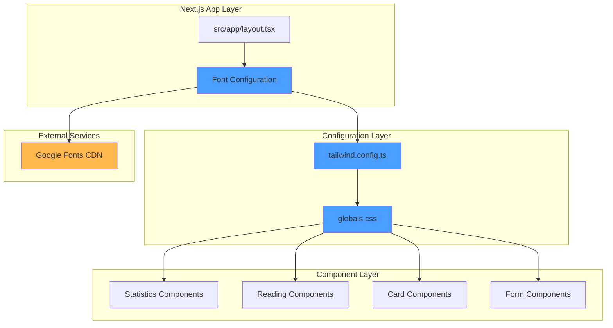
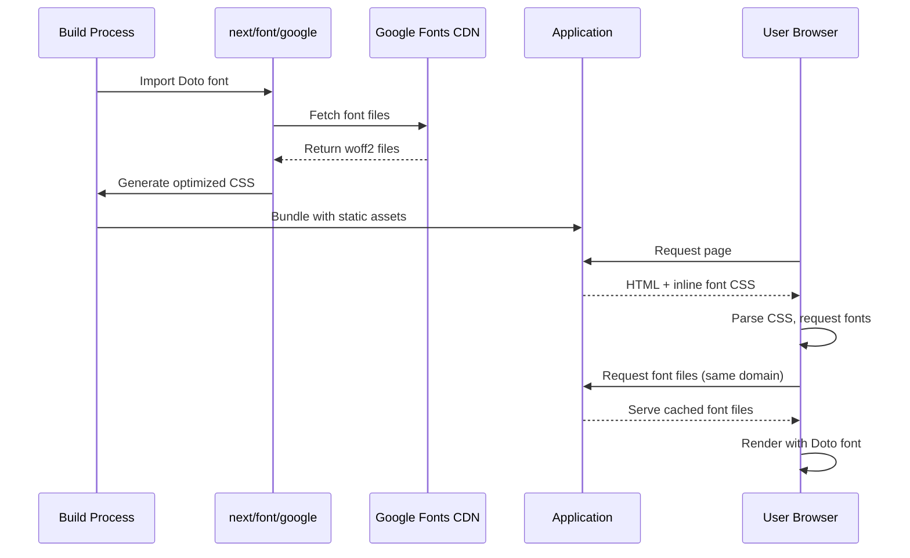
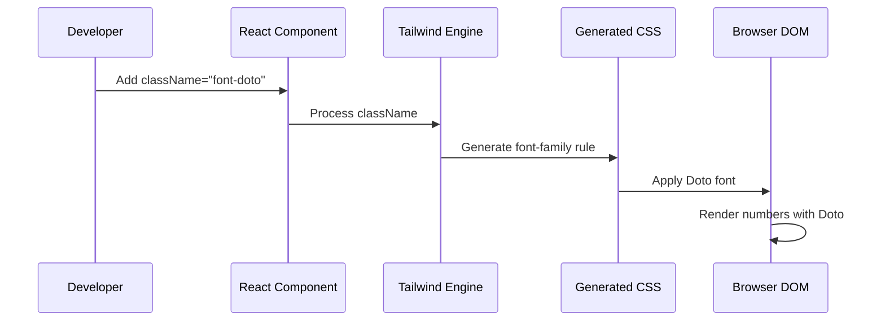

# 技術設計文件

## 概述

本設計實作 Google Font Doto 字體整合到 Wasteland Tarot 平台的所有數字顯示元素。Doto 是一款基於 6x10 像素網格的點陣風格可變字體，具有兩個可調整軸：像素大小和像素圓角度。此字體的復古美學與專案的 Fallout Pip-Boy 主題完美契合，同時提供清晰的數字可讀性。

技術實作將利用 Next.js 15 的內建字體優化系統，確保零佈局偏移（Zero Layout Shift）和最佳效能。透過 Tailwind CSS v4 配置系統和可重複使用的樣式類別，我們將在整個應用程式中一致性地套用 Doto 字體到所有數字元素。

### 研究發現摘要

#### Google Font Doto 特性
- **字體類型**：點陣/像素風格可變字體
- **可變軸**：
  - 像素大小控制（調整個別像素尺寸）
  - 像素圓角控制（調整像素圓滑度）
- **網格結構**：6x10 像素網格系統
- **適用場景**：復古、未來科技、數位主題專案

#### Next.js 15 字體優化最佳實踐
- **自動自託管**：Google Fonts 自動轉為靜態資源，與部署同域
- **零外部請求**：瀏覽器不會向 Google 發送請求
- **建置時預載**：字體在建置時快取和預載
- **零佈局偏移**：CLS < 0.1，改善 Core Web Vitals
- **字體子集化**：可指定僅載入特定字符集以優化效能

#### Tailwind CSS 自訂字體配置
- **Tailwind v4**：使用 `--font-*` 命名空間的主題變數
- **font-variant-numeric**：支援 lining-nums、tabular-nums 等數字顯示變體
- **font-feature-settings**：可為字體提供預設特性設定

## 需求映射

### 設計組件可追溯性

每個設計組件對應特定需求：

- **Next.js Font 配置模組** → 1.1-1.4: Google Font Doto 字體整合
- **Tailwind 擴展配置** → 2.1-2.4: 全域數字樣式配置
- **CSS 實用類別系統** → 2.2: 可重複使用的樣式類別
- **數字組件更新** → 3.1-7.4: 各功能領域數字顯示
- **響應式字體配置** → 8.1-8.4: 裝置相容性
- **效能優化配置** → 9.1-9.4: 載入與效能
- **文件與維護指南** → 10.1-10.4: 可維護性

### 使用者故事覆蓋

- **開發者整合故事（需求 1）**：透過 Next.js Font Optimization 和 Tailwind 配置實現
- **開發者樣式配置故事（需求 2）**：透過擴展 Tailwind 主題和 CSS 類別實現
- **使用者儀表板體驗故事（需求 3）**：透過更新 StatisticsCard、AnalyticsDashboard 等組件實現
- **使用者閱讀歷史體驗故事（需求 4）**：透過更新 ReadingHistory 和日期顯示組件實現
- **使用者 Karma 系統體驗故事（需求 5）**：透過更新 Karma 和 Faction Affinity 顯示組件實現
- **使用者卡牌體驗故事（需求 6）**：透過更新 TarotCard、CardFrequency 等組件實現
- **使用者表單體驗故事（需求 7）**：透過更新輸入欄位和計數器組件實現
- **使用者跨裝置體驗故事（需求 8）**：透過響應式字體配置實現
- **使用者效能體驗故事（需求 9）**：透過 Next.js Font Optimization 實現
- **開發者維護故事（需求 10）**：透過集中式配置和文件實現

## 架構

### 系統架構圖



### 技術堆疊

基於專案現有技術堆疊和需求分析：

- **前端框架**: Next.js 15.1.7 (App Router)
- **語言**: TypeScript 5
- **樣式系統**: Tailwind CSS v4.1.13
- **字體系統**: Next.js Font Optimization (`next/font/google`)
- **套件管理**: Bun
- **字體來源**: Google Fonts (Doto)

### 架構決策理由

#### 為何選擇 Next.js Font Optimization

- **自動自託管**：減少外部依賴，提升載入速度和隱私保護
- **建置時優化**：字體在建置階段預載和快取，執行時無額外負擔
- **零佈局偏移**：內建防止 CLS（Cumulative Layout Shift）機制
- **與專案整合**：已使用 Next.js 15，無需引入額外工具
- **效能目標達成**：滿足需求 9 中 2 秒內載入和 CLS < 0.1 的要求

#### 為何選擇 Tailwind CSS 擴展配置

- **集中式管理**：所有字體配置集中在 `tailwind.config.ts`，符合需求 10.1
- **類型安全**：TypeScript 配置提供編譯時檢查
- **可重複使用**：`font-doto` 類別可在任何組件中使用，符合需求 2.2
- **與現有系統一致**：專案已使用 Tailwind v4，保持技術堆疊統一

#### 為何選擇 Doto 可變字體

- **視覺契合**：點陣風格與 Fallout Pip-Boy 主題完美搭配
- **可調整性**：可變軸允許微調像素大小和圓角度
- **效能優勢**：單一字體檔案包含多種變體，減少 HTTP 請求
- **現代化**：2024 年加入 Google Fonts，使用最新字體技術

### 資料流程

#### 字體載入流程



#### 組件樣式應用流程



## 組件與介面

### 前端組件

| 組件名稱 | 職責 | 需更新部分 | 對應需求 |
|---------|------|-----------|---------|
| `StatisticsCard` | 顯示統計數據卡片 | 數值顯示部分加入 `font-doto` | 3.3 |
| `AnalyticsDashboard` | 分析儀表板主容器 | 所有數字顯示元素 | 3.1 |
| `ReadingStatsDashboard` | 閱讀統計儀表板 | 統計數字、圖表數值 | 3.2 |
| `ReadingHistory` | 閱讀歷史列表 | 閱讀次數、日期數字 | 4.1, 4.2 |
| `CardFrequency` | 卡牌使用頻率 | 使用次數計數 | 6.2 |
| `TarotCard` | 塔羅卡牌組件 | 卡牌編號顯示 | 6.1 |
| `Input` (數字型) | 數字輸入欄位 | 輸入值顯示 | 7.1 |
| `CharacterCounter` | 字數計數器 | 計數數字 | 7.3 |

### 核心配置模組

#### 1. Font Configuration Module (`src/lib/fonts.ts`)

```typescript
import { Doto } from 'next/font/google';

/**
 * Doto 字體配置
 * - 點陣風格可變字體，適用於所有數字顯示
 * - 支援像素大小和圓角度調整
 * - 自動優化載入與快取
 */
export const doto = Doto({
  subsets: ['latin'],
  variable: '--font-doto',
  display: 'swap',
  fallback: ['monospace', 'Courier New'],
  // 可變字體軸配置（如需要）
  // axes: ['ROND', 'PIXL'], // 圓角度、像素大小
  preload: true,
  adjustFontFallback: true,
});
```

#### 2. Tailwind Configuration Extension

在 `tailwind.config.ts` 的 `theme.extend.fontFamily` 中加入：

```typescript
fontFamily: {
  mono: ["JetBrains Mono", "Consolas", "Monaco", "Courier New", "monospace"],
  doto: ["var(--font-doto)", "monospace"], // 新增 Doto 字體
},
```

#### 3. Global CSS Variables (`src/app/globals.css`)

```css
:root {
  --font-doto: 'Doto', monospace;
}

/* 數字專用樣式類別 */
.numeric {
  font-family: var(--font-doto);
  font-variant-numeric: tabular-nums;
  letter-spacing: 0.05em;
}

/* 統計數據大號顯示 */
.stat-number {
  @apply font-doto text-3xl font-bold tabular-nums;
}

/* 小型計數器 */
.counter {
  @apply font-doto text-sm tabular-nums;
}
```

### API 介面

此功能為純前端實作，無需 API 變更。

## 資料模型

### 字體配置型別定義

```typescript
/**
 * Doto 字體實例型別
 */
interface DotoFontInstance {
  className: string;        // 'doto_abc123'
  style: {
    fontFamily: string;     // "'__Doto_abc123', '__Doto_Fallback_def456'"
    fontStyle?: string;
  };
  variable: string;         // '--font-doto'
}

/**
 * 字體變數軸配置
 */
interface FontVariableAxes {
  ROND?: number;  // 圓角度 (0-100)
  PIXL?: number;  // 像素大小 (6-12)
}
```

### 組件 Props 擴展

更新現有組件以支援數字字體樣式：

```typescript
/**
 * StatisticsCard Props 擴展
 */
interface StatisticsCardProps {
  title: string;
  value: string | number;
  icon: LucideIcon;
  trend?: {
    value: number;
    label: string;
    isPositive: boolean;
  };
  description?: string;
  className?: string;
  // 新增：是否對數字套用 Doto 字體（預設 true）
  useNumericFont?: boolean;
}
```

## 實作策略

### 第一階段：基礎設定（優先級：高）

1. **建立字體配置模組** (`src/lib/fonts.ts`)
   - 匯入並配置 Doto 字體
   - 設定變數名稱、子集、顯示策略
   - 配置備用字體

2. **更新 Root Layout** (`src/app/layout.tsx`)
   - 匯入 Doto 字體實例
   - 將字體變數加入 `<html>` 或 `<body>` className
   - 移除舊有被註解的字體配置

3. **擴展 Tailwind 配置** (`tailwind.config.ts`)
   - 在 `fontFamily` 中新增 `doto` 鍵
   - 配置字體變數對應

4. **定義全域樣式** (`src/app/globals.css`)
   - 新增 `.numeric`、`.stat-number`、`.counter` 等實用類別
   - 配置 `font-variant-numeric` 以優化數字顯示

### 第二階段：核心組件更新（優先級：高）

更新以下高頻使用的數字顯示組件：

1. **StatisticsCard** (`src/components/analytics/StatisticsCard.tsx`)
   ```tsx
   <p className="text-3xl font-bold font-doto mt-2">{value}</p>
   ```

2. **AnalyticsDashboard** (`src/components/analytics/AnalyticsDashboard.tsx`)
   - 所有數值顯示加入 `font-doto`

3. **ReadingStatsDashboard** (`src/components/readings/ReadingStatsDashboard.tsx`)
   - 統計數字、百分比、計數器加入 `font-doto`

### 第三階段：擴展組件更新（優先級：中）

1. **閱讀與歷史組件**
   - `ReadingHistory`: 閱讀次數、日期數字
   - `ReadingDetailModal`: 閱讀 ID、時間戳

2. **Karma 與 Faction 組件**
   - Karma 數值顯示
   - Faction Affinity 分數（0-100）

3. **卡牌相關組件**
   - `TarotCard`: 卡牌編號
   - `CardFrequency`: 使用次數
   - `CardDetailModal`: 卡牌位置資訊

### 第四階段：表單與輸入（優先級：中）

1. **數字輸入欄位**
   ```tsx
   <input
     type="number"
     className="font-doto tabular-nums ..."
   />
   ```

2. **字數計數器**
   ```tsx
   <span className="font-doto text-sm tabular-nums">
     {currentLength}/{maxLength}
   </span>
   ```

### 第五階段：測試與優化（優先級：中）

1. **視覺回歸測試**
   - 截圖對比主要頁面
   - 確認數字對齊和視覺一致性

2. **效能驗證**
   - Lighthouse 測試 CLS < 0.1
   - 字體載入時間 < 2 秒

3. **響應式測試**
   - 桌面、平板、手機三種尺寸
   - 確認字體可讀性

## 錯誤處理

### 字體載入失敗降級策略

```typescript
// src/lib/fonts.ts
export const doto = Doto({
  subsets: ['latin'],
  variable: '--font-doto',
  display: 'swap',  // 使用 swap 策略，先顯示備用字體
  fallback: ['monospace', 'Courier New', 'Monaco'], // 多層備用字體
  adjustFontFallback: true, // 自動調整備用字體度量以減少佈局偏移
});
```

### CSS 降級處理

```css
/* globals.css */
.font-doto {
  font-family: var(--font-doto, monospace);
}

/* 如果瀏覽器不支援 CSS 變數 */
@supports not (font-family: var(--font-doto)) {
  .font-doto {
    font-family: 'Courier New', monospace;
  }
}
```

### 組件層級錯誤處理

```typescript
// StatisticsCard.tsx
export function StatisticsCard({
  value,
  useNumericFont = true,
  ...props
}: StatisticsCardProps) {
  const numericClass = useNumericFont ? 'font-doto' : 'font-mono';

  return (
    <Card>
      <p className={`text-3xl font-bold ${numericClass} mt-2`}>
        {value}
      </p>
    </Card>
  );
}
```

## 安全性考量

本功能為前端字體整合，主要安全考量如下：

### 1. 內容安全政策 (CSP)

如果專案使用 CSP headers，需確保允許從 Google Fonts 載入資源（僅開發階段，生產環境為自託管）：

```http
Content-Security-Policy:
  font-src 'self' data:;
  style-src 'self' 'unsafe-inline';
```

由於 Next.js Font Optimization 會自動將字體轉為自託管，生產環境無需允許外部字體源。

### 2. 子資源完整性 (SRI)

Next.js Font Optimization 自動處理字體檔案的完整性驗證，無需手動配置 SRI。

### 3. 隱私保護

- ✅ 無外部請求：Next.js 自託管確保不會向 Google Fonts CDN 發送使用者請求
- ✅ 無追蹤：不洩漏使用者 IP 或瀏覽器資訊給第三方

## 效能與可擴展性

### 效能目標

| 指標 | 目標 | 測量方式 |
|-----|------|---------|
| 字體載入時間 (初次) | < 2 秒 | Lighthouse, Chrome DevTools |
| 字體載入時間 (快取) | < 100ms | Chrome DevTools Network |
| Cumulative Layout Shift (CLS) | < 0.1 | Lighthouse, Core Web Vitals |
| First Contentful Paint (FCP) | < 1.5 秒 | Lighthouse |
| 字體檔案大小 | < 50KB (woff2) | Network tab |

### 快取策略

#### 1. 瀏覽器快取

Next.js 自動為字體檔案設定 Cache-Control headers：

```http
Cache-Control: public, max-age=31536000, immutable
```

#### 2. CDN 快取 (Vercel)

Vercel 自動將字體檔案快取到全球 Edge Network，確保低延遲載入。

#### 3. Service Worker 快取 (可選)

如未來實作 PWA，可在 Service Worker 中預快取字體：

```javascript
// service-worker.js
self.addEventListener('install', (event) => {
  event.waitUntil(
    caches.open('fonts-v1').then((cache) => {
      return cache.addAll([
        '/_next/static/media/doto-*.woff2',
      ]);
    })
  );
});
```

### 可擴展性策略

#### 1. 支援多種數字字體

如未來需要支援其他數字字體（如 Orbitron、Rajdhani），可擴展配置：

```typescript
// src/lib/fonts.ts
export const doto = Doto({ /* ... */ });
export const orbitron = Orbitron({
  subsets: ['latin'],
  variable: '--font-orbitron',
});

// tailwind.config.ts
fontFamily: {
  doto: ["var(--font-doto)", "monospace"],
  orbitron: ["var(--font-orbitron)", "sans-serif"],
}
```

#### 2. 主題化數字字體

支援不同主題使用不同數字字體：

```css
/* globals.css */
.theme-pipboy {
  --numeric-font: var(--font-doto);
}

.theme-modern {
  --numeric-font: var(--font-orbitron);
}

.font-numeric {
  font-family: var(--numeric-font, monospace);
}
```

#### 3. 動態字體載入

如需根據使用者偏好動態載入字體，可使用 Next.js 的動態匯入：

```typescript
// 未來擴展示例（當前不需要）
const loadDotoFont = async () => {
  const { Doto } = await import('next/font/google');
  return Doto({ subsets: ['latin'] });
};
```

## 測試策略

### 風險矩陣

| 領域 | 風險 | 必須測試 | 可選測試 | 對應需求 |
|-----|------|---------|---------|---------|
| 字體載入 | H | 單元、整合、E2E | 效能 | 1.1-1.4, 9.1-9.4 |
| 視覺一致性 | M | 視覺回歸 | 截圖對比 | 2.3, 3.1-7.4 |
| 響應式顯示 | M | E2E (多裝置) | 可訪問性 | 8.1-8.4 |
| CSS 降級 | L | 整合 | 瀏覽器相容性 | 1.3, 8.4 |
| 效能影響 | H | 效能煙霧測試 | 負載測試 | 9.1-9.4 |

### 最小化測試覆蓋

#### 單元測試

```typescript
// __tests__/fonts.test.ts
import { doto } from '@/lib/fonts';

describe('Doto Font Configuration', () => {
  it('should have correct variable name', () => {
    expect(doto.variable).toBe('--font-doto');
  });

  it('should have fallback fonts', () => {
    expect(doto.style.fontFamily).toContain('monospace');
  });
});
```

#### 整合測試

```typescript
// __tests__/components/StatisticsCard.test.tsx
import { render, screen } from '@testing-library/react';
import { StatisticsCard } from '@/components/analytics/StatisticsCard';

describe('StatisticsCard with Doto Font', () => {
  it('should apply font-doto class to numeric value', () => {
    render(<StatisticsCard title="Test" value={42} icon={TestIcon} />);
    const valueElement = screen.getByText('42');
    expect(valueElement).toHaveClass('font-doto');
  });

  it('should handle fallback when useNumericFont is false', () => {
    render(
      <StatisticsCard
        title="Test"
        value={42}
        icon={TestIcon}
        useNumericFont={false}
      />
    );
    const valueElement = screen.getByText('42');
    expect(valueElement).not.toHaveClass('font-doto');
  });
});
```

#### E2E 測試 (主要使用者流程)

```typescript
// tests/e2e/numeric-font-display.spec.ts
import { test, expect } from '@playwright/test';

test.describe('Doto Font Display', () => {
  test('should display statistics with Doto font on desktop', async ({ page }) => {
    await page.goto('/dashboard');
    await page.waitForSelector('[data-testid="statistics-card"]');

    const valueElement = page.locator('[data-testid="stat-value"]').first();
    const fontFamily = await valueElement.evaluate(
      (el) => window.getComputedStyle(el).fontFamily
    );

    expect(fontFamily).toContain('Doto');
  });

  test('should maintain readability on mobile devices', async ({ page }) => {
    await page.setViewportSize({ width: 375, height: 667 });
    await page.goto('/dashboard');

    const valueElement = page.locator('[data-testid="stat-value"]').first();
    const fontSize = await valueElement.evaluate(
      (el) => window.getComputedStyle(el).fontSize
    );

    // 確保字體大小在行動裝置上仍可讀（至少 14px）
    expect(parseInt(fontSize)).toBeGreaterThanOrEqual(14);
  });
});
```

#### 效能測試

```typescript
// tests/performance/font-loading.spec.ts
import { test, expect } from '@playwright/test';

test('should load Doto font within 2 seconds', async ({ page }) => {
  const startTime = Date.now();

  await page.goto('/');
  await page.waitForLoadState('networkidle');

  const loadTime = Date.now() - startTime;
  expect(loadTime).toBeLessThan(2000);
});

test('should have acceptable CLS score', async ({ page }) => {
  await page.goto('/dashboard');

  const cls = await page.evaluate(() => {
    return new Promise((resolve) => {
      new PerformanceObserver((list) => {
        const entries = list.getEntries();
        const clsEntry = entries.find((entry) => entry.entryType === 'layout-shift');
        if (clsEntry) {
          resolve((clsEntry as any).value);
        }
      }).observe({ entryTypes: ['layout-shift'] });

      setTimeout(() => resolve(0), 3000);
    });
  });

  expect(cls).toBeLessThan(0.1);
});
```

### CI 關卡

| 階段 | 執行測試 | 關卡條件 | SLA |
|-----|---------|---------|-----|
| PR | 單元測試 + 整合測試 | 失敗 = 阻擋 | ≤ 2 分鐘 |
| Staging | E2E 測試 (主要流程) | 失敗 = 阻擋 | ≤ 5 分鐘 |
| 每夜建置 | 效能測試 | 回歸 → 建立 issue | - |

### 驗收條件

- ✅ Sev1/Sev2 錯誤 = 0
- ✅ 所有 CI 關卡通過
- ✅ 效能目標達成（CLS < 0.1, 載入 < 2s）
- ✅ 視覺回歸測試通過（無非預期佈局變更）
- ✅ 在桌面、平板、手機三種裝置上測試通過

## 實作檢查清單

### Phase 1: 基礎設定
- [ ] 建立 `src/lib/fonts.ts` 並配置 Doto 字體
- [ ] 更新 `src/app/layout.tsx` 引入字體變數
- [ ] 擴展 `tailwind.config.ts` 加入 `font-doto`
- [ ] 在 `globals.css` 定義 `.numeric`、`.stat-number`、`.counter` 類別

### Phase 2: 核心組件
- [ ] 更新 `StatisticsCard` 組件
- [ ] 更新 `AnalyticsDashboard` 組件
- [ ] 更新 `ReadingStatsDashboard` 組件

### Phase 3: 擴展組件
- [ ] 更新閱讀歷史相關組件
- [ ] 更新 Karma 和 Faction 顯示
- [ ] 更新卡牌相關組件

### Phase 4: 表單與輸入
- [ ] 更新數字輸入欄位
- [ ] 更新字數計數器

### Phase 5: 測試與驗證
- [ ] 執行單元測試
- [ ] 執行整合測試
- [ ] 執行 E2E 測試（3 個主要流程）
- [ ] 執行效能測試（Lighthouse）
- [ ] 執行視覺回歸測試

### Phase 6: 文件
- [ ] 更新專案 README（如何使用 Doto 字體）
- [ ] 建立組件樣式指南文件
- [ ] 記錄常見問題與解決方案

## 參考資料

### 官方文件
- [Next.js Font Optimization](https://nextjs.org/docs/app/getting-started/fonts)
- [Google Font Doto](https://fonts.google.com/specimen/Doto)
- [Tailwind CSS Font Family](https://tailwindcss.com/docs/font-family)
- [Tailwind CSS Font Variant Numeric](https://tailwindcss.com/docs/font-variant-numeric)

### 最佳實踐
- [Web Font Optimization - web.dev](https://web.dev/font-best-practices/)
- [Core Web Vitals - CLS](https://web.dev/cls/)
- [CSS Font Display](https://developer.mozilla.org/en-US/docs/Web/CSS/@font-face/font-display)
