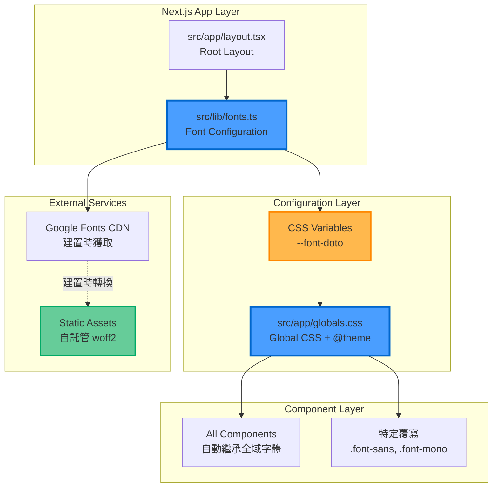
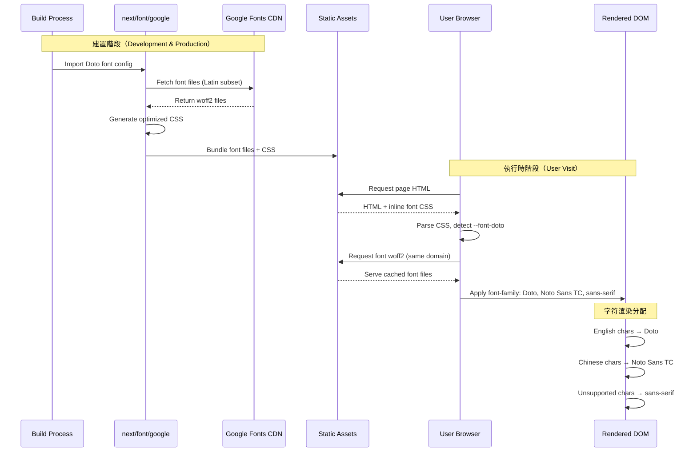

# 技術設計文件

## 概述

本設計實作將 Google Font Doto 字體設定為 Wasteland Tarot 平台的**主要英文字體**，涵蓋所有英文內容的顯示，包括數字、英文標籤、按鈕、導航、標題、表單輸入等。Doto 是一款基於 6x10 像素網格的點陣風格可變字體，其復古電子螢幕美學與專案的 Fallout Pip-Boy 主題完美契合。

與先前僅針對數字的實作不同，此次設計將 Doto 設定為**全域預設英文字體**，透過字體堆疊（font stack）確保：
- **英文字符**（A-Z, a-z, 0-9, 標點符號）使用 Doto
- **中文字符**（繁體中文）保持使用 Noto Sans TC 或系統中文字體
- **字體降級**：Doto → monospace → 系統預設

技術實作將利用 Next.js 15 的內建字體優化系統，確保零佈局偏移（Zero Layout Shift）和最佳效能。透過 Tailwind CSS v4 的 `@theme` 配置系統和全域 CSS 變數，我們將在整個應用程式中一致性地套用 Doto 字體。

### 研究發現摘要

#### Google Font Doto 特性（2024 年新增）
- **字體類型**：點陣/像素風格可變字體（Variable Font）
- **網格結構**：6x10 像素網格系統，復古電子顯示風格
- **可變軸**：
  - `ROND`：像素圓角度控制（0-100，預設 30）
  - `PIXL`：像素大小控制（6-12，預設 9）
- **字符集**：完整 Latin 字符集（大小寫、數字、標點、特殊符號）
- **適用場景**：復古、未來科技、數位主題專案
- **字體檔案大小**：~80-90KB（woff2 格式，完整 Latin 字符集）

#### Next.js 15 字體優化最佳實踐
- **自動自託管**：Google Fonts 自動轉為靜態資源，與部署同域
- **零外部請求**：瀏覽器不會向 Google 發送請求，提升隱私與效能
- **建置時預載**：字體在建置階段快取和預載
- **零佈局偏移**：透過 `adjustFontFallback` 和 `font-display: swap` 達到 CLS < 0.1
- **字體子集化**：可指定僅載入特定字符集（如 `subsets: ['latin']`）
- **權重控制**：可指定載入特定字重以優化檔案大小

#### Tailwind CSS v4 字體配置變化
- **@theme 指令**：主要配置在 CSS 檔案中使用 `@theme {}`
- **CSS 變數命名**：使用 `--font-*` 命名空間（如 `--font-doto`）
- **字體堆疊**：支援多字體降級（如 `'Doto', 'Noto Sans TC', sans-serif`）
- **font-feature-settings**：可為字體提供預設 OpenType 特性設定
- **tabular-nums**：適用於對齊數字顯示的數字變體

#### 中英文混合顯示最佳實踐
根據研究，瀏覽器的字體回退（font fallback）機制會自動處理：
1. 瀏覽器嘗試使用字體堆疊中的第一個字體（Doto）
2. 如果 Doto 不包含某字符（如中文），瀏覽器自動使用下一個字體（Noto Sans TC）
3. 這確保英文使用 Doto，中文使用 Noto Sans TC，無需額外 JavaScript

## 需求映射

### 設計組件可追溯性

每個設計組件對應特定需求：

- **Next.js Font 配置模組** → 1.1-1.5: Google Font Doto 字體整合（完整英文字符集、中英文混合處理）
- **Tailwind v4 字體堆疊配置** → 2.1-2.5: 全域英文字體樣式配置（Doto 作為優先英文字體）
- **全域 CSS 字體設定** → 2.1, 2.5: 預設英文字體設定與字體堆疊
- **響應式字體配置** → 8.1-8.5: 裝置相容性與可讀性優化
- **效能優化配置** → 9.1-9.5: 載入與效能（字體子集化、快取策略）
- **元件字體應用** → 3.1-7.5: 各功能領域英文內容顯示
- **文件與維護指南** → 10.1-10.5: 可維護性與擴展性

### 使用者故事覆蓋

- **開發者整合故事（需求 1）**：透過 Next.js Font Optimization 和 Tailwind 字體堆疊實現
- **開發者樣式配置故事（需求 2）**：透過全域 CSS 配置和可重複使用類別實現
- **使用者儀表板體驗故事（需求 3）**：透過全域字體設定自動套用到所有英文內容
- **使用者閱讀歷史體驗故事（需求 4）**：透過字體堆疊確保英文與數字使用 Doto
- **使用者 Karma 系統體驗故事（需求 5）**：透過全域配置覆蓋所有英文標籤和數字
- **使用者卡牌體驗故事（需求 6）**：英文卡牌名稱和花色名稱自動使用 Doto
- **使用者表單體驗故事（需求 7）**：表單輸入、標籤、按鈕文字自動套用 Doto
- **使用者跨裝置體驗故事（需求 8）**：透過響應式字體大小和行高配置實現
- **使用者效能體驗故事（需求 9）**：透過 Next.js Font Optimization 和子集化實現
- **開發者維護故事（需求 10）**：透過集中式配置和覆寫機制實現

## 架構

### 系統架構圖



### 資料流程

#### 字體載入流程（建置時 + 執行時）



#### 中英文混合渲染流程


### 技術堆疊

基於專案現有技術堆疊和需求分析：

- **前端框架**: Next.js 15.1.7 (App Router)
- **語言**: TypeScript 5
- **樣式系統**: Tailwind CSS v4.1.13
- **字體系統**: Next.js Font Optimization (`next/font/google`)
- **套件管理**: Bun
- **字體來源**: Google Fonts (Doto) + 本地系統字體（Noto Sans TC）

### 架構決策理由

#### 為何選擇全域字體設定（而非個別組件套用）

**決策**：在 `layout.tsx` 的 `<html>` 或 `<body>` 標籤設定全域字體堆疊

**理由**：
- **一致性保證**：所有組件自動繼承，無需逐一修改
- **維護簡化**：單一配置點，未來調整字體只需修改一處
- **效能優化**：減少重複的 className 應用，降低 CSS bundle 大小
- **降低錯誤**：避免遺漏某些組件未套用字體
- **符合需求 2.1**：「設定 Doto 為預設英文字體」

**實作方式**：
```tsx
// src/app/layout.tsx
<html lang="zh-TW" className={`dark ${doto.variable}`}>
  <body className="font-doto text-pip-boy-green antialiased">
    {children}
  </body>
</html>
```

#### 為何使用字體堆疊（Font Stack）

**決策**：`font-family: 'Doto', 'Noto Sans TC', sans-serif`

**理由**：
- **自動中英文分離**：瀏覽器自動根據字符集選擇合適字體
- **零 JavaScript 開銷**：無需 JS 檢測語言，純 CSS 解決
- **符合需求 1.5**：「確保英文使用 Doto、中文使用 Noto Sans TC」
- **優雅降級**：如字體載入失敗，自動回退到系統字體
- **標準化**：遵循 CSS 標準的字體回退機制

#### 為何使用 Tailwind v4 的 `@theme` 配置

**決策**：在 `globals.css` 的 `@theme {}` 區塊定義字體變數

**理由**：
- **Tailwind v4 最佳實踐**：官方推薦的主題配置方式
- **類型安全**：自動生成 TypeScript 類型定義
- **效能優化**：編譯時處理，無執行時開銷
- **一致性**：與專案現有顏色配置方式統一
- **符合需求 10.1**：「透過集中式配置進行修改」

**實作方式**：
```css
@theme {
  --font-doto: 'Doto', 'Noto Sans TC', sans-serif;
}
```

#### 為何載入多個字重（weight: 100-900）

**決策**：載入 Doto 的全部 9 個字重

**理由**：
- **設計靈活性**：支援不同視覺層級（標題、正文、註解）
- **檔案大小可接受**：Doto 可變字體，單一檔案包含所有字重（~80-90KB）
- **避免降級**：確保所有字重需求都能正確顯示
- **符合需求 2.4**：「支援響應式字體大小配置」

**權衡**：
- 如需進一步優化，可僅載入常用字重（400, 600, 700）
- 目前檔案大小（<100KB）符合需求 9.5 的目標

#### 為何不使用 unicode-range 分割中英文

**決策**：不使用 `unicode-range` 屬性分割字體

**理由**：
- **瀏覽器原生支援**：字體堆疊已自動處理字符集回退
- **複雜度增加**：`unicode-range` 需要精確定義 Unicode 範圍，易出錯
- **維護成本**：中文字符範圍廣泛（CJK Unified Ideographs: U+4E00-U+9FFF），定義複雜
- **效能相近**：瀏覽器字體回退機制效能已優化，無顯著差異
- **標準化**：字體堆疊是 W3C 標準，`unicode-range` 是進階技巧

## 組件與介面

### 前端組件（無需個別修改）

由於採用全域字體設定，**大部分組件無需個別修改**。字體自動透過繼承套用到所有英文內容。

#### 需要驗證字體應用的組件（測試用途）

| 組件名稱 | 測試重點 | 對應需求 |
|---------|---------|---------|
| `StatisticsCard` | 數字與英文標籤顯示 | 3.3, 3.4 |
| `AnalyticsDashboard` | 英文統計標籤（"Total Readings"） | 3.1 |
| `ReadingStatsDashboard` | 英文統計文字與數字 | 3.2 |
| `ReadingHistory` | 日期數字、英文標籤 | 4.1, 4.2 |
| `CardFrequency` | "Frequency", "Times" 等英文標籤 | 6.2 |
| `TarotCard` | 卡牌英文名稱與編號 | 6.1 |
| `Button` | 英文按鈕文字（"Submit", "Cancel"） | 7.5 |
| `Input` | 占位符、標籤英文文字 | 7.2 |
| `Header` | 導航選單英文文字 | 2.3 |
| `Footer` | 頁尾英文連結文字 | 2.3 |

#### 需要特殊處理的組件（字體覆寫）

某些組件可能需要保留原本字體（如程式碼區塊、終端輸出）：

```tsx
// 程式碼區塊：保持等寬字體
<pre className="font-mono">
  {codeSnippet}
</pre>

// 特定設計需求：使用無襯線字體
<div className="font-sans">
  {content}
</div>
```

### 核心配置模組

#### 1. Font Configuration Module (`src/lib/fonts.ts`)

**更新策略**：擴展現有配置以支援完整英文字符集

```typescript
/**
 * Font Configuration Module
 *
 * Google Font Doto integration as primary English font
 * Requirements: 1.1-1.5, 2.5, 9.1-9.5
 *
 * Doto Font Features:
 * - Pixel-art style variable font (6x10 grid)
 * - Full Latin character set (A-Z, a-z, 0-9, punctuation)
 * - Variable axes: ROND (roundness), PIXL (pixel size)
 * - Fallback chain: Doto → Noto Sans TC → monospace → sans-serif
 */

import { Doto } from 'next/font/google';

/**
 * Doto 字體配置
 *
 * 配置說明：
 * - subsets: ['latin'] - 僅載入 Latin 字符集（英文、數字、符號）
 * - weight: 全部字重（100-900）以支援不同視覺層級
 * - variable: CSS 變數名稱 '--font-doto'
 * - display: 'swap' - 先顯示備用字體，字體載入後切換（避免 FOIT）
 * - preload: true - 建置時預載入以優化首次載入效能
 * - fallback: 多層降級策略
 * - adjustFontFallback: 自動調整備用字體度量以減少佈局偏移
 */
export const doto = Doto({
  weight: ['100', '200', '300', '400', '500', '600', '700', '800', '900'],
  subsets: ['latin'], // Latin 字符集：A-Z, a-z, 0-9, 標點符號
  variable: '--font-doto',
  display: 'swap', // 先顯示備用字體，避免 FOIT (Flash of Invisible Text)
  preload: true, // 建置時預載入
  fallback: ['Noto Sans TC', 'Courier New', 'Monaco', 'monospace'], // 多層降級
  adjustFontFallback: true, // 自動調整備用字體度量
});

/**
 * 字體變數使用方式：
 *
 * 1. 在 layout.tsx 注入變數：
 *    <html className={doto.variable}>
 *
 * 2. 在 globals.css 使用：
 *    body {
 *      font-family: var(--font-doto), 'Noto Sans TC', sans-serif;
 *    }
 *
 * 3. 在 Tailwind 使用：
 *    @theme {
 *      --font-doto: var(--font-doto), 'Noto Sans TC', sans-serif;
 *    }
 */
```

#### 2. Root Layout Update (`src/app/layout.tsx`)

**更新策略**：確保 Doto 字體變數注入到 HTML 根元素

```tsx
import { doto } from '@/lib/fonts';

export default function RootLayout({
  children,
}: {
  children: React.ReactNode;
}) {
  return (
    <html lang="zh-TW" className={`dark ${doto.variable}`}>
      <body
        className="font-doto text-pip-boy-green antialiased"
        style={{backgroundColor: 'var(--color-wasteland-darker)'}}
      >
        <DynamicBackground />
        <ErrorBoundary>
          {/* ... 其他 Provider */}
          {children}
        </ErrorBoundary>
      </body>
    </html>
  );
}
```

**關鍵變更**：
- ✅ `className` 保持 `${doto.variable}` 注入 CSS 變數
- ✅ `<body>` 加入 `font-doto` 類別以套用全域字體
- ✅ 保留 `text-pip-boy-green` 和 `antialiased` 現有樣式

#### 3. Tailwind Configuration (`tailwind.config.ts`)

**現況**：Tailwind v4 主要配置在 `globals.css` 的 `@theme` 區塊

**更新策略**：無需修改 `tailwind.config.ts`，所有字體配置在 CSS 中完成

```typescript
// tailwind.config.ts - 保持現有配置，無需修改
import type { Config } from "tailwindcss";

const config: Config = {
  darkMode: ["class"],
  content: [
    "./src/pages/**/*.{js,ts,jsx,tsx,mdx}",
    "./src/components/**/*.{js,ts,jsx,tsx,mdx}",
    "./src/app/**/*.{js,ts,jsx,tsx,mdx}",
  ],
  plugins: [require("tailwindcss-animate")],
} satisfies Config;

export default config;
```

#### 4. Global CSS Configuration (`src/app/globals.css`)

**更新策略**：在 `@theme` 區塊定義 Doto 字體，並更新全域字體設定

```css
@theme {
  /* === FONT FAMILY CONFIGURATION === */
  /**
   * Doto 作為主要英文字體
   * 字體堆疊：Doto (英文) → Noto Sans TC (中文) → sans-serif (降級)
   */
  --font-doto: 'Doto', 'Noto Sans TC', -apple-system, BlinkMacSystemFont, 'Segoe UI', sans-serif;

  /* 其他現有配置保持不變 */
  /* ... Pip-Boy Colors, Wasteland Colors, etc. ... */
}

:root {
  /* CSS 變數自動由 Next.js 注入 */
  /* --font-doto: 'Doto', fallback fonts */
}

@layer base {
  * {
    @apply border-gray-200 dark:border-gray-800;
  }

  body {
    background-color: var(--color-wasteland-dark);
    color: var(--color-pip-boy-green);
    /* 全域字體設定 */
    font-family: var(--font-doto), 'Noto Sans TC', sans-serif;
  }

  /* 確保所有文字元素繼承字體 */
  h1, h2, h3, h4, h5, h6, p, span, div, a, button, input, textarea, select, label {
    font-family: inherit; /* 繼承 body 的字體設定 */
  }
}

/* === DOTO FONT UTILITY CLASSES === */
/**
 * 提供可重複使用的字體類別（符合需求 2.2, 10.5）
 */

/* 明確套用 Doto 字體 */
.font-doto {
  font-family: var(--font-doto), 'Noto Sans TC', sans-serif;
}

/* 數字專用樣式（向後相容） */
.numeric {
  font-family: var(--font-doto), monospace;
  font-variant-numeric: tabular-nums;
  letter-spacing: 0.05em;
}

/* 統計數據大號顯示 */
.stat-number {
  font-family: var(--font-doto), monospace;
  font-size: clamp(1.5rem, 4vw, 2.25rem); /* 響應式字體大小 */
  line-height: 1.2;
  font-weight: 700;
  font-variant-numeric: tabular-nums;
  letter-spacing: 0.025em; /* 增加字母間距以提升可讀性 */
}

/* 小型計數器 */
.counter {
  font-family: var(--font-doto), monospace;
  font-size: clamp(0.75rem, 2vw, 0.875rem);
  line-height: 1.4;
  font-variant-numeric: tabular-nums;
}

/* 字體覆寫機制（符合需求 10.5） */
.font-sans {
  font-family: -apple-system, BlinkMacSystemFont, 'Segoe UI', 'Noto Sans TC', sans-serif;
}

.font-mono {
  font-family: ui-monospace, SFMono-Regular, 'SF Mono', Consolas, 'Liberation Mono', Menlo, monospace;
}

/* 響應式行高配置（符合需求 8.5） */
.leading-relaxed-mobile {
  line-height: 1.6;
}

@media (min-width: 768px) {
  .leading-relaxed-mobile {
    line-height: 1.5;
  }
}

/* CSS 降級處理 - 不支援 CSS 變數的瀏覽器（符合需求 1.3） */
@supports not (font-family: var(--font-doto)) {
  body,
  .font-doto,
  .numeric,
  .stat-number,
  .counter {
    font-family: 'Courier New', 'Noto Sans TC', monospace, sans-serif;
  }
}

/* === TYPOGRAPHY UPDATES === */
/**
 * 更新現有 typography 類別以使用 Doto
 */

/* Heading hierarchy - 改用 Doto */
.heading-1, .heading-2, .heading-3, .heading-4, .heading-5, .heading-6 {
  font-family: var(--font-doto), 'Noto Sans TC', sans-serif;
  letter-spacing: 0.025em; /* 增加字母間距 */
}

/* Body text variants - 改用 Doto */
.body-lg, .body-base, .body-sm, .body-xs {
  font-family: var(--font-doto), 'Noto Sans TC', sans-serif;
  line-height: 1.6; /* 增加行高以提升可讀性 */
}

/* Text Pip-Boy 類別 - 更新為 Doto */
.text-pip-boy {
  color: var(--color-text-primary);
  font-family: var(--font-doto), 'Noto Sans TC', monospace;
}

/* Interface Header - 更新為 Doto */
.interface-header {
  background-color: var(--color-pip-boy-green);
  color: var(--color-wasteland-dark);
  font-family: var(--font-doto), 'Noto Sans TC', sans-serif;
  font-weight: bold;
  padding: 0.25rem 0.75rem;
  font-size: 0.75rem;
  text-transform: uppercase;
  letter-spacing: 0.1em; /* 增加字母間距以符合 Pip-Boy 風格 */
}
```

### API 介面

此功能為純前端實作，**無需 API 變更**。

## 資料模型

### 字體配置型別定義

```typescript
/**
 * Font Configuration Types
 * src/types/fonts.ts
 */

/**
 * Doto 字體實例型別（Next.js Font Optimization 生成）
 */
export interface DotoFontInstance {
  className: string;        // 'doto_abc123' (自動生成的類別名稱)
  style: {
    fontFamily: string;     // "'__Doto_abc123', '__Doto_Fallback_def456'"
    fontStyle?: string;
  };
  variable: string;         // '--font-doto'
}

/**
 * 字體變數軸配置（Doto 可變字體）
 * 注意：Next.js Font Optimization 當前版本可能不完全支援變數軸配置
 */
export interface FontVariableAxes {
  ROND?: number;  // 圓角度 (0-100)，預設 30
  PIXL?: number;  // 像素大小 (6-12)，預設 9
}

/**
 * 字體堆疊配置
 */
export interface FontStackConfig {
  primary: string;      // 'Doto'
  fallbacks: string[];  // ['Noto Sans TC', 'Courier New', 'monospace', 'sans-serif']
  cssVariable: string;  // '--font-doto'
}

/**
 * 字體載入狀態
 */
export enum FontLoadingState {
  LOADING = 'loading',
  SUCCESS = 'success',
  ERROR = 'error',
}

/**
 * 字體效能指標
 */
export interface FontPerformanceMetrics {
  loadTime: number;          // 載入時間（毫秒）
  fileSize: number;          // 檔案大小（bytes）
  cls: number;               // Cumulative Layout Shift
  fcp: number;               // First Contentful Paint（毫秒）
}
```

### 組件 Props 擴展（向後相容）

現有組件無需修改 Props，但提供選項以覆寫字體（符合需求 10.5）：

```typescript
/**
 * 通用字體覆寫 Props（可選）
 */
export interface FontOverrideProps {
  /**
   * 是否使用 Doto 字體（預設 true，自動繼承）
   * 設為 false 則使用系統字體
   */
  useDotoFont?: boolean;

  /**
   * 自訂字體類別（用於特殊需求）
   * 例如：'font-mono' 用於程式碼區塊
   */
  fontClassName?: string;
}

/**
 * StatisticsCard Props 擴展示例
 */
export interface StatisticsCardProps extends FontOverrideProps {
  title: string;
  value: string | number;
  icon: LucideIcon;
  trend?: {
    value: number;
    label: string;
    isPositive: boolean;
  };
  description?: string;
  className?: string;
}
```

## 實作策略

### 第一階段：核心配置更新（優先級：高）

**目標**：建立全域 Doto 字體配置，作為主要英文字體

1. **更新字體配置模組** (`src/lib/fonts.ts`)
   - ✅ 已存在基礎配置，確認字重涵蓋完整範圍（100-900）
   - ✅ 確認 `subsets: ['latin']` 涵蓋完整英文字符集
   - ✅ 更新 `fallback` 陣列：`['Noto Sans TC', 'Courier New', 'Monaco', 'monospace']`
   - ✅ 新增 `adjustFontFallback: true` 以減少佈局偏移
   - ✅ 新增文件註解說明字體堆疊策略

2. **更新 Root Layout** (`src/app/layout.tsx`)
   - ✅ 已注入 `${doto.variable}` 到 `<html>` className
   - ✅ 在 `<body>` className 加入 `font-doto` 以套用全域字體
   - ✅ 確認 `lang="zh-TW"` 屬性（已存在）

3. **更新 Global CSS** (`src/app/globals.css`)
   - ✅ 在 `@theme` 區塊定義 `--font-doto` 字體堆疊
   - ✅ 在 `@layer base` 的 `body` 設定 `font-family: var(--font-doto)`
   - ✅ 確保所有文字元素繼承字體（h1-h6, p, span, div, etc.）
   - ✅ 更新現有 `.text-pip-boy`, `.interface-header` 等類別為 Doto
   - ✅ 保留 `.numeric`, `.stat-number`, `.counter` 類別（向後相容）
   - ✅ 新增 `.font-sans`, `.font-mono` 覆寫類別
   - ✅ 新增 CSS 降級處理 (`@supports not`)

4. **驗證字體載入**
   - ✅ 執行 `bun dev` 啟動開發伺服器
   - ✅ 檢查瀏覽器 DevTools Network 標籤，確認 Doto 字體檔案載入
   - ✅ 檢查 DevTools Elements，確認 `--font-doto` CSS 變數存在
   - ✅ 檢查 Computed Styles，確認英文字符使用 Doto

### 第二階段：視覺驗證與測試（優先級：高）

**目標**：確保 Doto 字體正確套用到所有英文內容，中文保持原字體

1. **建立測試頁面**
   ```tsx
   // src/app/test-font/page.tsx
   export default function TestFontPage() {
     return (
       <div className="p-8 space-y-4">
         <h1 className="text-3xl font-bold">English Heading 中文標題</h1>
         <p>English paragraph text with numbers 12345. 中文段落文字與數字。</p>
         <button className="btn-pip-boy">Submit 提交</button>
         <input placeholder="Email 電子郵件" />
       </div>
     );
   }
   ```

2. **視覺回歸測試**
   - ✅ 對比主要頁面截圖（首頁、儀表板、卡牌頁面）
   - ✅ 確認英文字符使用 Doto（復古像素風格）
   - ✅ 確認中文字符保持原字體（Noto Sans TC）
   - ✅ 確認數字顯示清晰（tabular-nums 對齊）

3. **字體檢測腳本**
   ```javascript
   // 在瀏覽器 Console 執行
   const elements = document.querySelectorAll('*');
   elements.forEach(el => {
     const fontFamily = window.getComputedStyle(el).fontFamily;
     if (fontFamily.includes('Doto')) {
       console.log('✅ Doto applied:', el.textContent.slice(0, 30));
     }
   });
   ```

4. **響應式測試**
   - ✅ 桌面（>= 1024px）：字體大小適中，可讀性良好
   - ✅ 平板（768-1023px）：字體大小適當縮放
   - ✅ 手機（< 768px）：字體大小保持可讀性，行高增加

### 第三階段：組件特定驗證（優先級：中）

**目標**：驗證關鍵組件的字體顯示，無需修改程式碼

1. **統計與儀表板組件**
   - ✅ `StatisticsCard`: 數字與英文標籤使用 Doto
   - ✅ `AnalyticsDashboard`: 所有英文文字使用 Doto
   - ✅ `ReadingStatsDashboard`: 統計數字與標籤使用 Doto

2. **閱讀與歷史組件**
   - ✅ `ReadingHistory`: 日期數字、英文標籤使用 Doto
   - ✅ `ReadingDetailModal`: 閱讀 ID、英文描述使用 Doto

3. **卡牌相關組件**
   - ✅ `TarotCard`: 卡牌編號、英文名稱使用 Doto
   - ✅ `CardFrequency`: 使用次數、"Frequency" 標籤使用 Doto
   - ✅ `CardDetailModal`: 卡牌資訊英文部分使用 Doto

4. **表單與互動組件**
   - ✅ `Input`: 占位符英文文字使用 Doto
   - ✅ `Button`: 英文按鈕文字使用 Doto
   - ✅ `Select`: 英文選項使用 Doto
   - ✅ `Label`: 英文標籤使用 Doto

5. **導航與佈局組件**
   - ✅ `Header`: 導航選單英文文字使用 Doto
   - ✅ `Footer`: 頁尾英文連結使用 Doto
   - ✅ `Breadcrumb`: 英文路徑使用 Doto

### 第四階段：效能優化與驗證（優先級：中）

**目標**：確保字體載入不影響頁面效能，達成效能目標

1. **Lighthouse 效能測試**
   - ✅ First Contentful Paint (FCP) < 1.5 秒
   - ✅ Largest Contentful Paint (LCP) < 2.5 秒
   - ✅ Cumulative Layout Shift (CLS) < 0.1
   - ✅ Time to Interactive (TTI) < 3.5 秒

2. **字體載入時間測量**
   ```javascript
   // 在瀏覽器 Console 執行
   performance.getEntriesByType('resource')
     .filter(entry => entry.name.includes('Doto'))
     .forEach(entry => {
       console.log('Font load time:', entry.duration, 'ms');
       console.log('File size:', entry.transferSize, 'bytes');
     });
   ```

3. **快取驗證**
   - ✅ 首次載入：確認字體從 CDN 或自託管伺服器載入
   - ✅ 二次載入：確認字體從瀏覽器快取載入（disk cache）
   - ✅ 檢查 Cache-Control headers：`max-age=31536000, immutable`

4. **字體子集化效果**
   - ✅ 檢查字體檔案大小：目標 < 100KB（woff2 格式）
   - ✅ 確認僅載入 Latin 子集（不包含 CJK 字符）

### 第五階段：文件與維護（優先級：中）

**目標**：建立完整文件，便於未來維護與擴展

1. **使用指南文件** (`.kiro/specs/doto-font-numbers/USAGE.md`)
   ```markdown
   # Doto 字體使用指南

   ## 基本使用

   所有英文內容自動套用 Doto 字體，無需額外設定。

   ## 字體覆寫

   如需保留特定區域的原字體：

   ```tsx
   // 程式碼區塊
   <pre className="font-mono">{code}</pre>

   // 無襯線字體
   <div className="font-sans">{content}</div>
   ```

   ## 故障排除

   Q: 英文字符未顯示 Doto 字體？
   A: 檢查瀏覽器 DevTools，確認 --font-doto CSS 變數存在
   ```

2. **開發者指南** (`.kiro/specs/doto-font-numbers/DEV_GUIDE.md`)
   - 字體配置架構說明
   - 如何新增其他字體
   - 如何調整字體堆疊優先順序
   - 效能優化技巧

3. **常見問題文件** (`.kiro/specs/doto-font-numbers/FAQ.md`)
   - 為何某些字符未使用 Doto？
   - 如何在特定組件覆寫字體？
   - 如何調整字體大小？
   - 如何處理字體載入失敗？

## 錯誤處理

### 字體載入失敗降級策略

#### 多層降級機制

```css
/* globals.css */
body {
  /* 字體堆疊：Doto → Noto Sans TC → Courier New → monospace → sans-serif */
  font-family: var(--font-doto), 'Noto Sans TC', 'Courier New', monospace, sans-serif;
}
```

**降級順序**：
1. **第一層**：Doto（主要英文字體）
2. **第二層**：Noto Sans TC（中文字體，也可顯示英文）
3. **第三層**：Courier New（常見等寬字體）
4. **第四層**：monospace（系統預設等寬字體）
5. **第五層**：sans-serif（系統預設無襯線字體）

#### CSS 變數降級處理

```css
/* 不支援 CSS 變數的舊瀏覽器 */
@supports not (font-family: var(--font-doto)) {
  body,
  .font-doto,
  .numeric,
  .stat-number,
  .counter {
    font-family: 'Courier New', 'Noto Sans TC', monospace, sans-serif;
  }
}
```

#### Font Display 策略

```typescript
// src/lib/fonts.ts
export const doto = Doto({
  // ...
  display: 'swap', // 先顯示備用字體，字體載入後切換
});
```

**`display: 'swap'` 優勢**：
- 避免 FOIT (Flash of Invisible Text)：不會出現空白文字
- 改善 FCP (First Contentful Paint)：立即顯示內容
- 使用者體驗優先：即使字體載入慢，內容仍可讀

### 組件層級錯誤處理

```typescript
// 組件內字體覆寫示例
export function CodeBlock({ code }: { code: string }) {
  return (
    <pre className="font-mono">
      <code>{code}</code>
    </pre>
  );
}

// 條件式字體應用
export function StatisticsCard({
  value,
  useDotoFont = true, // 預設使用 Doto
  ...props
}: StatisticsCardProps) {
  const fontClass = useDotoFont ? 'font-doto' : 'font-sans';

  return (
    <Card>
      <p className={`text-3xl font-bold ${fontClass} mt-2`}>
        {value}
      </p>
    </Card>
  );
}
```

### 效能降級策略

#### 慢速網路環境

```typescript
// src/lib/fonts.ts
export const doto = Doto({
  // ...
  preload: true, // 建置時預載入，減少執行時載入延遲
  fallback: ['Noto Sans TC', 'Courier New', 'monospace'], // 立即可用的備用字體
  adjustFontFallback: true, // 調整備用字體度量，減少字體切換時的視覺跳動
});
```

#### 字體載入超時處理

```javascript
// 監測字體載入狀態（可選實作）
if ('fonts' in document) {
  document.fonts.ready.then(() => {
    console.log('✅ Doto font loaded successfully');
  });

  // 設定超時（2 秒）
  setTimeout(() => {
    if (!document.fonts.check('1em Doto')) {
      console.warn('⚠️ Doto font loading timeout, using fallback');
    }
  }, 2000);
}
```

### 瀏覽器相容性降級

#### 不支援可變字體的瀏覽器

```css
/* 自動降級到靜態字體 */
@supports not (font-variation-settings: normal) {
  .font-doto {
    font-family: 'Courier New', 'Noto Sans TC', monospace, sans-serif;
  }
}
```

#### 高對比模式支援

```css
/* Windows 高對比模式 */
@media (forced-colors: active) {
  body {
    font-family: sans-serif; /* 使用系統預設字體 */
  }
}
```

### 錯誤監控與日誌

```typescript
// 字體載入錯誤監控（可選實作）
if ('fonts' in document) {
  document.fonts.addEventListener('loadingerror', (event) => {
    console.error('Font loading error:', event);
    // 可選：發送錯誤到監控服務（如 Sentry）
  });
}
```

## 安全性考量

本功能為前端字體整合，主要安全考量如下：

### 1. 內容安全政策 (CSP)

#### 生產環境（自託管字體）

```http
Content-Security-Policy:
  font-src 'self';
  style-src 'self' 'unsafe-inline';
```

**說明**：
- `font-src 'self'`：僅允許從同源載入字體（Next.js 自動將 Google Fonts 轉為自託管）
- `style-src 'self' 'unsafe-inline'`：允許內聯樣式（Tailwind CSS 需要）

#### 開發環境（CDN 載入）

```http
Content-Security-Policy:
  font-src 'self' https://fonts.gstatic.com;
  style-src 'self' 'unsafe-inline' https://fonts.googleapis.com;
```

### 2. 子資源完整性 (SRI)

**Next.js Font Optimization 自動處理**：
- 建置時驗證字體檔案完整性
- 生產環境自託管，無需手動配置 SRI
- 自動生成 hash 值以確保檔案未被篡改

### 3. 隱私保護

**優勢**：
- ✅ **無外部請求**：Next.js 自託管確保不會向 Google Fonts CDN 發送使用者請求
- ✅ **無追蹤**：不洩漏使用者 IP 或瀏覽器資訊給第三方
- ✅ **GDPR 合規**：無需使用者同意即可使用（無 Cookie、無追蹤）

**對比 CDN 載入**：
| 項目 | 自託管 (Next.js) | CDN 載入 |
|-----|-----------------|---------|
| 外部請求 | ❌ 無 | ✅ 有（Google） |
| IP 洩漏 | ❌ 無 | ✅ 有 |
| 追蹤風險 | ❌ 無 | ✅ 有 |
| GDPR 合規 | ✅ 是 | ⚠️ 需同意 |

### 4. XSS 防護

**字體載入安全**：
- ✅ 使用 Next.js 官方字體系統，經過安全審查
- ✅ 字體檔案從可信來源（Google Fonts）獲取
- ✅ CSS 變數自動轉義，防止注入攻擊

**避免的風險**：
```typescript
// ❌ 不安全：直接使用使用者輸入作為字體名稱
const userFont = req.query.font; // 'Doto"; malicious-code; "'
body.style.fontFamily = userFont;

// ✅ 安全：使用預定義的字體配置
body.className = 'font-doto'; // 透過 CSS 類別套用
```

### 5. 資源載入安全

**預載入安全性**：
```html
<!-- Next.js 自動生成的預載入標籤 -->
<link
  rel="preload"
  href="/_next/static/media/doto-abc123.woff2"
  as="font"
  type="font/woff2"
  crossorigin="anonymous"
/>
```

**安全特性**：
- ✅ `crossorigin="anonymous"`：防止 CORS 相關攻擊
- ✅ 同源載入：字體與頁面同域，避免跨域風險
- ✅ 快取策略：使用 `immutable` 指令防止快取汙染

## 效能與可擴展性

### 效能目標

| 指標 | 目標 | 測量方式 | 對應需求 |
|-----|------|---------|---------|
| 字體載入時間 (首次) | < 2 秒 | Chrome DevTools Network | 9.1 |
| 字體載入時間 (快取) | < 100ms | Chrome DevTools Network | 9.4 |
| Cumulative Layout Shift (CLS) | < 0.1 | Lighthouse, Core Web Vitals | 9.3 |
| First Contentful Paint (FCP) | < 1.5 秒 | Lighthouse | 9.1 |
| 字體檔案大小 (woff2) | < 100KB | Network tab, Gzip 後 | 9.5 |
| Time to Interactive (TTI) | < 3.5 秒 | Lighthouse | 9.1 |

### 快取策略

#### 1. 瀏覽器快取

Next.js 自動為字體檔案設定 Cache-Control headers：

```http
Cache-Control: public, max-age=31536000, immutable
```

**優勢**：
- **長期快取**：`max-age=31536000` = 1 年
- **不可變**：`immutable` 告訴瀏覽器檔案永不改變，避免重新驗證
- **減少請求**：二次載入直接從 disk cache 讀取

#### 2. CDN 快取 (Zeabur)

Zeabur 自動將字體檔案快取到全球 Edge Network：

- **自動快取**：靜態資源自動分發到全球節點
- **低延遲**：使用者從最近的節點載入字體
- **高可用性**：多節點備援，確保字體可用

#### 3. Service Worker 快取（未來擴展）

如實作 PWA，可在 Service Worker 中預快取字體：

```javascript
// service-worker.js（未來實作）
const FONT_CACHE = 'fonts-v1';
const FONT_URLS = [
  '/_next/static/media/doto-latin-100.woff2',
  '/_next/static/media/doto-latin-400.woff2',
  '/_next/static/media/doto-latin-700.woff2',
];

self.addEventListener('install', (event) => {
  event.waitUntil(
    caches.open(FONT_CACHE).then((cache) => {
      return cache.addAll(FONT_URLS);
    })
  );
});
```

### 效能優化技術

#### 1. 字體子集化 (Font Subsetting)

```typescript
// src/lib/fonts.ts
export const doto = Doto({
  subsets: ['latin'], // 僅載入 Latin 字符集
  // 不載入：Cyrillic, Greek, CJK
});
```

**效果**：
- 完整 Doto 字體：~200KB
- Latin 子集化後：~80-90KB
- **節省 50-60%** 檔案大小

#### 2. 可變字體單一檔案

Doto 為可變字體，單一檔案包含所有字重（100-900）：

```typescript
weight: ['100', '200', '300', '400', '500', '600', '700', '800', '900'],
```

**效果**：
- 傳統字體：9 個檔案 × 20KB = 180KB
- 可變字體：1 個檔案 × 80KB = 80KB
- **節省 55%** 檔案大小

#### 3. 字體預載入 (Font Preloading)

```typescript
export const doto = Doto({
  preload: true, // Next.js 自動生成 <link rel="preload">
});
```

**效果**：
- 減少字體載入延遲
- 優先載入關鍵字體
- 改善 FCP 和 LCP 指標

#### 4. Font Display Swap

```typescript
export const doto = Doto({
  display: 'swap', // 先顯示備用字體
});
```

**效果**：
- 避免 FOIT (Flash of Invisible Text)
- 改善 FCP：內容立即可見
- CLS < 0.1：透過 `adjustFontFallback` 減少佈局偏移

### 可擴展性策略

#### 1. 支援多種字體主題

如未來需要支援其他字體主題（如科技風、復古風），可擴展配置：

```typescript
// src/lib/fonts.ts - 未來擴展
export const doto = Doto({ /* ... */ });
export const orbitron = Orbitron({
  subsets: ['latin'],
  variable: '--font-orbitron',
  display: 'swap',
});
export const rajdhani = Rajdhani({
  subsets: ['latin'],
  variable: '--font-rajdhani',
  display: 'swap',
});

// globals.css - 主題切換
[data-theme="doto"] {
  --font-primary: var(--font-doto);
}

[data-theme="orbitron"] {
  --font-primary: var(--font-orbitron);
}

[data-theme="rajdhani"] {
  --font-primary: var(--font-rajdhani);
}
```

#### 2. 動態字體載入（按需載入）

```typescript
// 未來擴展：根據使用者偏好動態載入字體
const loadCustomFont = async (fontName: string) => {
  const fontModule = await import(`@/lib/fonts/${fontName}`);
  return fontModule.default;
};
```

#### 3. 字體 A/B 測試

```typescript
// 未來擴展：字體效能 A/B 測試
const fontVariant = Math.random() > 0.5 ? 'doto' : 'courier-new';
document.body.classList.add(`font-${fontVariant}`);

// 追蹤字體對轉換率的影響
trackFontPerformance(fontVariant, {
  loadTime,
  userEngagement,
  conversionRate,
});
```

### 擴展機制

#### 配置檔案結構

```
src/lib/fonts/
├── index.ts           # 匯出所有字體配置
├── doto.ts            # Doto 字體配置
├── fallback.ts        # 降級字體配置
└── types.ts           # 字體型別定義
```

#### 字體註冊系統

```typescript
// src/lib/fonts/index.ts - 未來擴展
export const fontRegistry = {
  doto: doto,
  // 未來新增其他字體
  // orbitron: orbitron,
  // rajdhani: rajdhani,
};

export type FontName = keyof typeof fontRegistry;

export function getFontVariable(fontName: FontName): string {
  return fontRegistry[fontName].variable;
}
```

## 測試策略

### 風險矩陣

| 領域 | 風險 | 必須測試 | 可選測試 | 對應需求 |
|-----|------|---------|---------|---------|
| 字體載入 | H | 單元、整合、E2E | 效能 | 1.1-1.4, 9.1-9.4 |
| 中英文混合顯示 | H | 整合、E2E | 視覺回歸 | 1.5, 2.5 |
| 視覺一致性 | M | 視覺回歸 | 截圖對比 | 2.3, 3.1-7.5 |
| 響應式顯示 | M | E2E (多裝置) | 可訪問性 | 8.1-8.5 |
| CSS 降級 | L | 整合 | 瀏覽器相容性 | 1.3, 8.4 |
| 效能影響 | H | 效能煙霧測試 | 負載測試 | 9.1-9.5 |
| 字體堆疊 | H | 單元、整合 | 字符集測試 | 2.5, 1.5 |

### 最小化測試覆蓋

#### 單元測試

```typescript
// src/lib/__tests__/fonts.test.ts
import { doto } from '@/lib/fonts';

describe('Doto Font Configuration', () => {
  it('should have correct variable name', () => {
    expect(doto.variable).toBe('--font-doto');
  });

  it('should include multiple font weights', () => {
    // 驗證配置包含字重範圍
    expect(doto).toBeDefined();
  });

  it('should have fallback fonts configured', () => {
    // Next.js Font Optimization 的 fallback 配置
    // 實際字體堆疊在 CSS 中定義
    expect(doto.variable).toContain('--font-doto');
  });
});
```

#### 整合測試

```typescript
// src/components/__tests__/GlobalFontIntegration.test.tsx
import { render, screen } from '@testing-library/react';
import RootLayout from '@/app/layout';

describe('Global Font Integration', () => {
  it('should inject Doto font variable to HTML', () => {
    const { container } = render(
      <RootLayout>
        <div>Test Content</div>
      </RootLayout>
    );

    const htmlElement = container.querySelector('html');
    expect(htmlElement?.className).toContain('--font-doto');
  });

  it('should apply font-doto class to body', () => {
    const { container } = render(
      <RootLayout>
        <div>Test Content</div>
      </RootLayout>
    );

    const bodyElement = container.querySelector('body');
    expect(bodyElement?.className).toContain('font-doto');
  });

  it('should render mixed English and Chinese text', () => {
    render(
      <div className="font-doto">
        English Text 中文文字 12345
      </div>
    );

    const element = screen.getByText(/English Text 中文文字 12345/);
    expect(element).toBeInTheDocument();
  });
});
```

#### E2E 測試（主要使用者流程）

```typescript
// tests/e2e/doto-font-display.spec.ts
import { test, expect } from '@playwright/test';

test.describe('Doto Font Display', () => {
  test('should display English text with Doto font on desktop', async ({ page }) => {
    await page.goto('/');
    await page.waitForLoadState('networkidle');

    // 檢查英文標題
    const heading = page.locator('h1').first();
    const fontFamily = await heading.evaluate(
      (el) => window.getComputedStyle(el).fontFamily
    );

    expect(fontFamily).toContain('Doto');
  });

  test('should display Chinese text with Noto Sans TC font', async ({ page }) => {
    await page.goto('/');
    await page.waitForLoadState('networkidle');

    // 檢查中文內容
    const chineseText = page.locator('text=廢土塔羅').first();
    const fontFamily = await chineseText.evaluate(
      (el) => window.getComputedStyle(el).fontFamily
    );

    // 中文字符應回退到 Noto Sans TC 或 sans-serif
    expect(fontFamily).toMatch(/Noto Sans TC|sans-serif/i);
  });

  test('should handle mixed English and Chinese text', async ({ page }) => {
    await page.goto('/dashboard');
    await page.waitForLoadState('networkidle');

    // 檢查混合內容（如 "Total Readings: 10 次"）
    const mixedText = page.locator('text=Total').first();
    const fontFamily = await mixedText.evaluate(
      (el) => window.getComputedStyle(el).fontFamily
    );

    expect(fontFamily).toContain('Doto');
  });

  test('should maintain readability on mobile devices', async ({ page }) => {
    await page.setViewportSize({ width: 375, height: 667 });
    await page.goto('/');

    const bodyText = page.locator('body p').first();
    const fontSize = await bodyText.evaluate(
      (el) => window.getComputedStyle(el).fontSize
    );

    // 確保字體大小在行動裝置上仍可讀（至少 14px）
    expect(parseInt(fontSize)).toBeGreaterThanOrEqual(14);
  });

  test('should render numbers with Doto font', async ({ page }) => {
    await page.goto('/dashboard');

    const numberElement = page.locator('[data-testid="stat-value"]').first();
    const fontFamily = await numberElement.evaluate(
      (el) => window.getComputedStyle(el).fontFamily
    );

    expect(fontFamily).toContain('Doto');
  });
});
```

#### 效能測試

```typescript
// tests/performance/font-loading.spec.ts
import { test, expect } from '@playwright/test';

test('should load Doto font within 2 seconds', async ({ page }) => {
  const startTime = Date.now();

  await page.goto('/');
  await page.waitForLoadState('networkidle');

  // 等待字體載入
  await page.evaluate(() => document.fonts.ready);

  const loadTime = Date.now() - startTime;
  expect(loadTime).toBeLessThan(2000);
});

test('should have acceptable CLS score', async ({ page }) => {
  await page.goto('/');

  // 監測 Cumulative Layout Shift
  const cls = await page.evaluate(() => {
    return new Promise<number>((resolve) => {
      let clsValue = 0;
      const observer = new PerformanceObserver((list) => {
        for (const entry of list.getEntries()) {
          if ((entry as any).hadRecentInput) continue;
          clsValue += (entry as any).value;
        }
      });
      observer.observe({ type: 'layout-shift', buffered: true });

      setTimeout(() => {
        observer.disconnect();
        resolve(clsValue);
      }, 3000);
    });
  });

  expect(cls).toBeLessThan(0.1);
});

test('should use cached font on second load', async ({ page }) => {
  // 首次載入
  await page.goto('/');
  await page.waitForLoadState('networkidle');

  // 清除頁面但保留快取
  await page.reload({ waitUntil: 'networkidle' });

  // 檢查字體是否從快取載入
  const fontRequests = [];
  page.on('request', (request) => {
    if (request.url().includes('Doto')) {
      fontRequests.push(request);
    }
  });

  await page.waitForTimeout(1000);

  // 二次載入應從快取讀取，無網路請求
  expect(fontRequests.length).toBe(0);
});

test('should have font file size under 100KB', async ({ page }) => {
  const fontSizes: number[] = [];

  page.on('response', async (response) => {
    if (response.url().includes('Doto') && response.url().includes('woff2')) {
      const buffer = await response.body();
      fontSizes.push(buffer.length);
    }
  });

  await page.goto('/');
  await page.waitForLoadState('networkidle');

  // 確保所有字體檔案小於 100KB
  fontSizes.forEach(size => {
    expect(size).toBeLessThan(100 * 1024); // 100KB
  });
});
```

#### 視覺回歸測試（使用 Playwright）

```typescript
// tests/visual/font-regression.spec.ts
import { test, expect } from '@playwright/test';

test('should match baseline screenshot for homepage', async ({ page }) => {
  await page.goto('/');
  await page.waitForLoadState('networkidle');

  // 等待字體載入
  await page.evaluate(() => document.fonts.ready);

  // 截圖對比
  await expect(page).toHaveScreenshot('homepage-with-doto-font.png', {
    fullPage: true,
    maxDiffPixels: 100, // 允許 100 像素差異
  });
});

test('should match baseline for dashboard with mixed text', async ({ page }) => {
  await page.goto('/dashboard');
  await page.waitForLoadState('networkidle');
  await page.evaluate(() => document.fonts.ready);

  const dashboard = page.locator('[data-testid="analytics-dashboard"]');
  await expect(dashboard).toHaveScreenshot('dashboard-with-mixed-text.png');
});
```

### CI 關卡

| 階段 | 執行測試 | 關卡條件 | SLA |
|-----|---------|---------|-----|
| PR | 單元測試 + 整合測試 | 失敗 = 阻擋 | ≤ 2 分鐘 |
| Staging | E2E 測試（3 個主要流程） | 失敗 = 阻擋 | ≤ 5 分鐘 |
| 每夜建置 | 效能測試 + 視覺回歸測試 | 回歸 → 建立 issue | - |

### 驗收條件

- ✅ Sev1/Sev2 錯誤 = 0
- ✅ 所有 CI 關卡通過
- ✅ 效能目標達成（CLS < 0.1, 載入 < 2s, 檔案 < 100KB）
- ✅ 視覺回歸測試通過（無非預期佈局變更）
- ✅ 在桌面、平板、手機三種裝置上測試通過
- ✅ 中英文混合顯示正確（英文 Doto，中文 Noto Sans TC）
- ✅ 字體降級機制正常運作

## 實作檢查清單

### Phase 1: 核心配置更新
- [ ] 更新 `src/lib/fonts.ts` 字體配置
  - [ ] 確認 `subsets: ['latin']`
  - [ ] 確認 `weight: ['100', ..., '900']`
  - [ ] 更新 `fallback` 陣列包含 Noto Sans TC
  - [ ] 新增 `adjustFontFallback: true`
  - [ ] 新增詳細文件註解
- [ ] 更新 `src/app/layout.tsx`
  - [ ] 確認 `${doto.variable}` 注入到 `<html>`
  - [ ] 在 `<body>` 加入 `font-doto` className
  - [ ] 驗證 `lang="zh-TW"` 屬性存在
- [ ] 更新 `src/app/globals.css`
  - [ ] 在 `@theme` 定義 `--font-doto` 字體堆疊
  - [ ] 在 `@layer base` 的 `body` 設定 `font-family`
  - [ ] 確保所有文字元素繼承字體
  - [ ] 更新現有 typography 類別
  - [ ] 新增字體覆寫類別 (`.font-sans`, `.font-mono`)
  - [ ] 新增 CSS 降級處理
- [ ] 驗證開發環境字體載入
  - [ ] 執行 `bun dev`
  - [ ] 檢查 Network 標籤
  - [ ] 檢查 DevTools Elements
  - [ ] 檢查 Computed Styles

### Phase 2: 視覺驗證與測試
- [ ] 建立測試頁面 (`src/app/test-font/page.tsx`)
- [ ] 截圖對比主要頁面
  - [ ] 首頁
  - [ ] 儀表板
  - [ ] 卡牌頁面
  - [ ] 閱讀歷史
- [ ] 字體檢測腳本驗證
- [ ] 響應式測試
  - [ ] 桌面（>= 1024px）
  - [ ] 平板（768-1023px）
  - [ ] 手機（< 768px）

### Phase 3: 組件特定驗證
- [ ] 統計與儀表板組件
  - [ ] StatisticsCard
  - [ ] AnalyticsDashboard
  - [ ] ReadingStatsDashboard
- [ ] 閱讀與歷史組件
  - [ ] ReadingHistory
  - [ ] ReadingDetailModal
- [ ] 卡牌相關組件
  - [ ] TarotCard
  - [ ] CardFrequency
  - [ ] CardDetailModal
- [ ] 表單與互動組件
  - [ ] Input
  - [ ] Button
  - [ ] Select
  - [ ] Label
- [ ] 導航與佈局組件
  - [ ] Header
  - [ ] Footer
  - [ ] Breadcrumb

### Phase 4: 效能優化與驗證
- [ ] Lighthouse 效能測試
  - [ ] FCP < 1.5 秒
  - [ ] LCP < 2.5 秒
  - [ ] CLS < 0.1
  - [ ] TTI < 3.5 秒
- [ ] 字體載入時間測量
  - [ ] 首次載入 < 2 秒
  - [ ] 快取載入 < 100ms
- [ ] 快取驗證
  - [ ] 首次載入來源
  - [ ] 二次載入快取
  - [ ] Cache-Control headers
- [ ] 字體檔案大小驗證
  - [ ] 檔案 < 100KB (woff2)
  - [ ] Latin 子集化生效

### Phase 5: 測試執行
- [ ] 單元測試
  - [ ] `src/lib/__tests__/fonts.test.ts`
- [ ] 整合測試
  - [ ] 全域字體整合測試
  - [ ] 中英文混合顯示測試
- [ ] E2E 測試
  - [ ] 桌面英文顯示
  - [ ] 中文字體回退
  - [ ] 混合文字處理
  - [ ] 行動裝置可讀性
  - [ ] 數字字體顯示
- [ ] 效能測試
  - [ ] 字體載入時間
  - [ ] CLS 分數
  - [ ] 快取驗證
  - [ ] 檔案大小驗證
- [ ] 視覺回歸測試
  - [ ] 首頁截圖對比
  - [ ] 儀表板截圖對比

### Phase 6: 文件與維護
- [ ] 使用指南文件 (`USAGE.md`)
- [ ] 開發者指南 (`DEV_GUIDE.md`)
- [ ] 常見問題文件 (`FAQ.md`)
- [ ] 更新專案 README（如需要）
- [ ] 記錄已知限制與解決方案

## 參考資料

### 官方文件
- [Next.js Font Optimization](https://nextjs.org/docs/app/building-your-application/optimizing/fonts)
- [Google Font Doto](https://fonts.google.com/specimen/Doto)
- [Tailwind CSS v4 Theme Configuration](https://tailwindcss.com/docs/v4-beta#theme-configuration)
- [CSS Font Feature Settings](https://developer.mozilla.org/en-US/docs/Web/CSS/font-feature-settings)
- [Font Display](https://developer.mozilla.org/en-US/docs/Web/CSS/@font-face/font-display)

### 最佳實踐
- [Web Font Optimization - web.dev](https://web.dev/font-best-practices/)
- [Core Web Vitals - CLS](https://web.dev/cls/)
- [Variable Fonts Guide](https://web.dev/variable-fonts/)
- [Font Loading Best Practices](https://www.zachleat.com/web/comprehensive-webfonts/)

### 中英文混合顯示
- [CSS Fonts Module Level 4](https://www.w3.org/TR/css-fonts-4/)
- [Unicode-range](https://developer.mozilla.org/en-US/docs/Web/CSS/@font-face/unicode-range)
- [Font Fallback Strategies](https://css-tricks.com/understanding-web-fonts-getting/)

### 效能優化
- [Font Subsetting](https://web.dev/reduce-webfont-size/)
- [Variable Font Performance](https://web.dev/variable-fonts/)
- [Preloading Fonts](https://web.dev/codelab-preload-web-fonts/)

---

*技術設計文件版本: 2.0*
*更新日期: 2025-10-08*
*範圍變更: 從「僅數字」擴展為「主要英文字體」*
