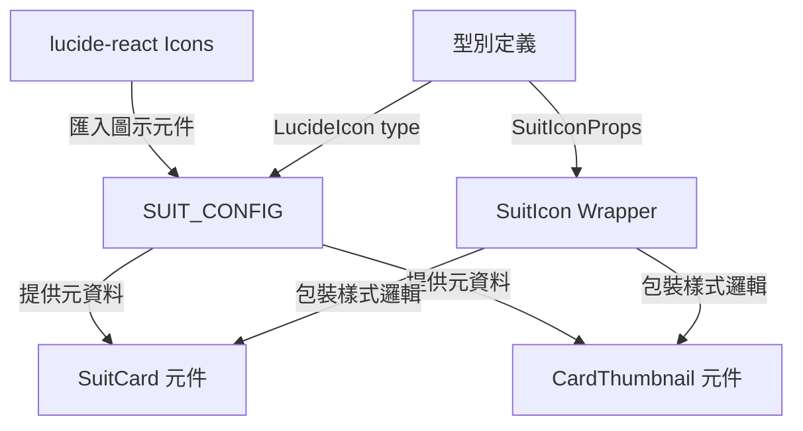
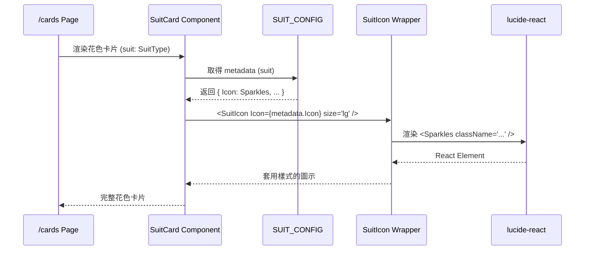
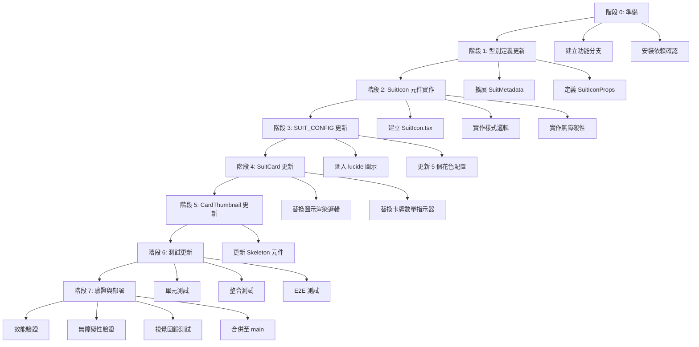

# 技術設計文件 - Emoji 替換為 Lucide React Icons

## Overview

本功能將 Wasteland Tarot 應用程式中的 emoji 圖示替換為 lucide-react 圖示庫元件,以提供更好的視覺一致性、可自訂性和跨平台相容性。

**目的**: 此功能為開發者和終端使用者提供一致且可自訂的圖示系統,消除 emoji 在不同作業系統和瀏覽器上的渲染差異。

**使用者**: 終端使用者將在瀏覽 /cards 頁面時看到一致的花色圖示,開發者將獲得型別安全且可重用的圖示配置系統。

**影響**: 此變更修改現有的花色配置系統 (suits.ts)、SuitCard 元件和 CardThumbnail 元件,將 emoji 字串屬性轉換為 React 元件引用,同時保持向後相容的視覺樣式。

### Goals

- 將所有花色 emoji 圖示替換為對應的 lucide-react 圖示元件
- 建立型別安全且可重用的圖示配置系統
- 確保完整的無障礙性支援 (ARIA 屬性)
- 維持現有的 Fallout Pip-Boy 視覺風格 (pip-boy-green 顏色、發光效果)
- 確保效能無顯著影響 (FCP +50ms、bundle +10KB 限制內)

### Non-Goals

- 替換純裝飾性 emoji (文字內容中的情感表達)
- 替換使用者生成內容中的 emoji
- 實作複雜的圖示動畫效果 (保持現有簡單 hover 效果)
- 遷移至其他圖示庫 (僅使用 lucide-react)

## Architecture

### Existing Architecture Analysis

**當前架構模式**:
- **型別系統**: 使用 TypeScript 嚴格模式,所有花色配置定義於 `src/types/suits.ts`
- **元件架構**: React 客戶端元件,使用 PipBoyCard 作為基礎容器
- **樣式系統**: Tailwind CSS v4 + inline styles for glow effects
- **資料流**: 靜態配置 (SUIT_CONFIG) → 元件 props → 渲染

**現有領域邊界**:
- `src/types/suits.ts`: 花色型別定義和配置 (資料層)
- `src/components/cards/`: 卡牌相關 UI 元件 (展示層)
- 兩者通過 SuitMetadata 介面解耦

**必須維護的整合點**:
- SuitCard 和 CardThumbnail 的現有 API (props interface)
- Fallout 主題視覺樣式 (pip-boy-green 顏色、drop-shadow 效果)
- 無障礙性屬性 (aria-label、aria-hidden)
- 響應式尺寸系統 (text-5xl md:text-6xl lg:text-7xl)

### High-Level Architecture



**架構整合**:
- **保留現有模式**: 靜態配置驅動的元件渲染模式,維持 SUIT_CONFIG 作為單一資料來源
- **新元件理由**: 引入 SuitIcon 包裝元件統一處理圖示樣式和無障礙性,避免在每個使用處重複邏輯
- **技術對齊**: lucide-react 已安裝於專案 (v0.544.0),與現有 React 19 + TypeScript 5 技術棧完美整合
- **Steering 合規**: 遵循 structure.md 的領域驅動架構 (cards domain)、type safety 原則,以及 tech.md 的前端技術棧標準

### Technology Alignment

**與現有技術棧對齊**:
- **前端框架**: Next.js 15.1.7 App Router + React 19 (已建立)
- **型別系統**: TypeScript 5 strict mode (已建立)
- **UI 元件**: 繼續使用 PipBoyCard 作為基礎容器
- **樣式系統**: Tailwind CSS v4 (已建立) + inline styles for effects
- **測試框架**: Jest + Playwright (已建立)

**新增依賴**:
- `lucide-react` v0.544.0 (已安裝): 用於取得圖示元件
  - **選擇理由**: 輕量、樹搖優化、完整 TypeScript 支援、與 shadcn/ui 生態系整合
  - **API 使用**: 直接匯入命名圖示元件 (如 `import { Sparkles, Swords } from 'lucide-react'`)

**無架構模式變更**: 此功能為現有系統的增強,不引入新的架構模式,遵循既有的靜態配置 + 元件渲染模式。

### Key Design Decisions

#### Decision 1: 使用 React 元件引用而非圖示名稱字串

**Context**: 需要將 SUIT_CONFIG 中的 emoji 字串替換為 lucide-react 圖示的表示方式。

**Alternatives**:
1. **字串名稱 + 動態查找**: 儲存圖示名稱字串 (如 "Sparkles"),渲染時動態查找對應元件
2. **React 元件引用**: 直接儲存圖示元件建構函式於配置中
3. **混合方式**: 配置中儲存字串,建立對映表於模組頂層

**Selected Approach**: React 元件引用

```typescript
import { Sparkles, Swords, Coins } from 'lucide-react'
import type { LucideIcon } from 'lucide-react'

export interface SuitMetadata {
  suit: SuitType
  name_zh_tw: string
  name_en: string
  description: string
  card_count: number
  Icon: LucideIcon // 改為儲存元件引用
}

export const SUIT_CONFIG: Record<SuitType, SuitMetadata> = {
  [SuitType.MAJOR_ARCANA]: {
    // ...
    Icon: Sparkles,
  },
  // ...
}
```

**Rationale**:
- **型別安全**: TypeScript 可在編譯時驗證元件引用,字串名稱需執行時驗證
- **Tree-shaking 優化**: 直接匯入確保 bundler 可正確移除未使用的圖示
- **簡化渲染**: 直接使用 `<metadata.Icon />` 無需查找邏輯
- **IDE 支援**: 自動完成和重構工具可追蹤元件使用

**Trade-offs**:
- **獲得**: 編譯時型別安全、更好的 tree-shaking、簡化程式碼
- **犧牲**: 配置稍微不夠「資料導向」(需 import 語句),但在 TypeScript 專案中這是標準做法

#### Decision 2: 建立 SuitIcon 包裝元件統一處理樣式和無障礙性

**Context**: 花色圖示需要應用一致的樣式 (顏色、大小、發光效果) 和無障礙性屬性,避免在每個使用處重複邏輯。

**Alternatives**:
1. **直接渲染**: 在 SuitCard 和 CardThumbnail 中直接使用 `<Icon className="..." />`
2. **包裝元件**: 建立 SuitIcon 元件封裝樣式和 a11y 邏輯
3. **HOC 模式**: 使用高階元件包裝 lucide 圖示

**Selected Approach**: 包裝元件

```typescript
interface SuitIconProps {
  Icon: LucideIcon
  size?: 'sm' | 'md' | 'lg' | 'xl'
  className?: string
  ariaLabel?: string
  ariaHidden?: boolean
}

export function SuitIcon({
  Icon,
  size = 'lg',
  className,
  ariaLabel,
  ariaHidden = false
}: SuitIconProps) {
  const sizeClasses = {
    sm: 'w-8 h-8',
    md: 'w-12 h-12',
    lg: 'w-16 h-16 md:w-20 md:h-20 lg:w-24 lg:h-24',
    xl: 'w-20 h-20 md:w-24 md:h-24 lg:w-28 lg:h-28'
  }

  return (
    <Icon
      className={cn(
        sizeClasses[size],
        'text-pip-boy-green transition-transform duration-300',
        className
      )}
      style={{
        filter: 'drop-shadow(0 0 10px rgba(51, 255, 51, 0.4))'
      }}
      aria-label={ariaLabel}
      aria-hidden={ariaHidden}
      strokeWidth={1.5}
    />
  )
}
```

**Rationale**:
- **DRY 原則**: 樣式邏輯集中於單一元件,易於維護和更新
- **一致性**: 確保所有花色圖示使用相同的視覺規範
- **無障礙性**: 集中管理 ARIA 屬性,降低遺漏風險
- **可測試性**: 包裝元件可獨立測試樣式和 a11y 行為

**Trade-offs**:
- **獲得**: 程式碼重用、一致性、可維護性、集中的無障礙性管理
- **犧牲**: 額外一層元件抽象 (微小的抽象成本,但換來顯著的可維護性提升)

#### Decision 3: Emoji 圖示保留於 CardThumbnail 骨架屏作為過渡視覺回饋

**Context**: CardThumbnail 骨架屏 (loading state) 目前使用 🃏 emoji,需決定是否替換為 lucide-react 圖示。

**Alternatives**:
1. **完全替換**: 使用 lucide-react 的 Image 或 FileImage 圖示
2. **保留 emoji**: 維持 🃏 emoji 用於載入狀態
3. **移除圖示**: 僅顯示空白骨架框

**Selected Approach**: 完全替換為 lucide-react 圖示 (Image 或 Sparkles)

```typescript
import { Image as ImageIcon } from 'lucide-react'

// 在 CardThumbnailSkeleton 中
<ImageIcon
  className="w-8 h-8 text-pip-boy-green/30"
  aria-hidden="true"
/>
```

**Rationale**:
- **視覺一致性**: 所有圖示統一使用 lucide-react,消除 emoji 混用
- **效能**: lucide 圖示載入與渲染效能優於 emoji (特別是在某些瀏覽器)
- **可自訂**: lucide 圖示可精確控制大小和顏色,emoji 受限於字體

**Trade-offs**:
- **獲得**: 完全一致的圖示系統、更好的視覺控制、跨瀏覽器一致性
- **犧牲**: 需更新骨架屏元件 (微小的額外工作量)

## System Flows

### Icon Rendering Flow



**流程說明**:
1. /cards 頁面渲染 5 個 SuitCard 元件,傳入對應的 SuitType
2. SuitCard 從 SUIT_CONFIG 取得該花色的 metadata (包含 Icon 元件)
3. SuitCard 使用 SuitIcon wrapper 渲染圖示,傳入 Icon、size 和其他 props
4. SuitIcon 套用統一的樣式類別和發光效果,然後渲染 lucide-react 圖示
5. 最終渲染出符合 Pip-Boy 風格的花色圖示

## Requirements Traceability

| Requirement | Requirement Summary | Components | Interfaces | Flows |
|-------------|---------------------|------------|------------|-------|
| 1.1-1.5 | 花色圖示替換與樣式 | SUIT_CONFIG, SuitIcon, SuitCard | SuitMetadata.Icon: LucideIcon, SuitIconProps | Icon Rendering Flow |
| 2.1-2.3 | 載入圖示替換 | CardThumbnailSkeleton, SuitCardSkeleton | 使用 lucide Image 圖示 | Icon Rendering Flow |
| 3.1-3.4 | 無障礙性支援 | SuitIcon | ariaLabel, ariaHidden props | N/A |
| 4.1-4.4 | 可重用圖示系統 | SuitIcon, SUIT_CONFIG | SuitIconProps, LucideIcon type | N/A |
| 5.1-5.4 | 跨裝置一致性 | SuitIcon | 響應式 size prop | N/A |
| 6.1-6.4 | 測試更新 | 測試檔案 | N/A | N/A |
| 8.1-8.4 | 效能需求 | Tree-shaking 配置 | N/A | N/A |
| 9.1-9.4 | TypeScript 型別安全 | 型別定義 | LucideIcon, SuitIconProps | N/A |

## Components and Interfaces

### UI Components Domain

#### SuitIcon 包裝元件

**Responsibility & Boundaries**
- **Primary Responsibility**: 統一處理 lucide-react 圖示的樣式、尺寸和無障礙性屬性
- **Domain Boundary**: 屬於 UI primitives 層,為 cards domain 的共享元件
- **Data Ownership**: 無狀態元件,不擁有資料,僅負責視覺展示

**Dependencies**
- **Inbound**: SuitCard, CardThumbnailSkeleton, SuitCardSkeleton (任何需要顯示花色圖示的元件)
- **Outbound**: lucide-react (圖示元件庫)
- **External**: lucide-react v0.544.0

**Contract Definition**

**Component Interface**:
```typescript
import type { LucideIcon } from 'lucide-react'

interface SuitIconProps {
  /**
   * lucide-react 圖示元件
   */
  Icon: LucideIcon

  /**
   * 圖示尺寸預設值
   * - sm: 小尺寸 (32px)
   * - md: 中尺寸 (48px)
   * - lg: 大尺寸 (64-96px,響應式)
   * - xl: 超大尺寸 (80-112px,響應式)
   */
  size?: 'sm' | 'md' | 'lg' | 'xl'

  /**
   * 額外的 CSS 類別 (用於覆寫或擴展樣式)
   */
  className?: string

  /**
   * ARIA label (當圖示傳達重要資訊時使用)
   */
  ariaLabel?: string

  /**
   * ARIA hidden (當圖示為裝飾性或與文字並存時使用)
   * @default false
   */
  ariaHidden?: boolean

  /**
   * 筆畫寬度 (lucide-react strokeWidth prop)
   * @default 1.5
   */
  strokeWidth?: number
}

/**
 * SuitIcon Component
 *
 * 為 lucide-react 圖示提供一致的 Pip-Boy 風格樣式
 *
 * @example
 * ```tsx
 * import { Sparkles } from 'lucide-react'
 *
 * <SuitIcon Icon={Sparkles} size="lg" ariaHidden />
 * ```
 */
export function SuitIcon(props: SuitIconProps): JSX.Element
```

**Preconditions**:
- Icon 必須是有效的 lucide-react 圖示元件
- ariaLabel 和 ariaHidden 不應同時設定

**Postconditions**:
- 渲染出套用 Pip-Boy 樣式 (pip-boy-green 顏色、drop-shadow 效果) 的圖示
- 包含適當的 ARIA 屬性以確保無障礙性

**Invariants**:
- 圖示始終保持 pip-boy-green 顏色主題 (可通過 className 覆寫)
- 圖示始終具有 drop-shadow 發光效果 (可通過 className 覆寫)

#### SuitCard 元件 (修改)

**Responsibility & Boundaries**
- **Primary Responsibility**: 顯示花色選項卡片,包含圖示、名稱、描述和卡牌數量
- **Domain Boundary**: cards domain 的核心 UI 元件
- **Data Ownership**: 從 SUIT_CONFIG 取得資料,不擁有狀態

**Integration Strategy**:
- **Modification Approach**: 擴展現有元件,將 `{metadata.icon || '🃏'}` 替換為 `<SuitIcon Icon={metadata.Icon} size="lg" ariaHidden />`
- **Backward Compatibility**: 維持現有 SuitCardProps interface,無 breaking changes
- **Migration Path**: 單檔案修改,無需漸進式遷移

**Contract Definition**

**Component Interface** (無變更):
```typescript
export interface SuitCardProps {
  suit: SuitType
  className?: string
}

export function SuitCard({ suit, className }: SuitCardProps): JSX.Element
```

**變更點**:
- 圖示渲染邏輯從 `<div>{metadata.icon}</div>` 改為 `<SuitIcon Icon={metadata.Icon} size="lg" ariaHidden />`
- 卡牌數量指示器從 🃏 emoji 改為 `<SuitIcon Icon={Layers} size="sm" ariaHidden />`

#### CardThumbnailSkeleton 元件 (修改)

**Responsibility & Boundaries**
- **Primary Responsibility**: 顯示卡牌載入中的骨架屏佔位符
- **Domain Boundary**: cards domain 的載入狀態 UI 元件

**Integration Strategy**:
- **Modification Approach**: 擴展現有元件,將 🃏 emoji 替換為 `<SuitIcon Icon={ImageIcon} size="sm" className="text-pip-boy-green/30" ariaHidden />`
- **Backward Compatibility**: 維持現有 API,無 props 變更

**Contract Definition**

**Component Interface** (無變更):
```typescript
export function CardThumbnailSkeleton(): JSX.Element
```

**變更點**:
- 骨架屏圖示從 🃏 emoji 改為 lucide-react Image 圖示

### Data Configuration Domain

#### SUIT_CONFIG 配置 (修改)

**Responsibility & Boundaries**
- **Primary Responsibility**: 提供所有花色的元資料,作為單一資料來源
- **Domain Boundary**: 型別定義層的靜態配置
- **Data Ownership**: 擁有並定義所有花色的規範資料

**Integration Strategy**:
- **Modification Approach**: 擴展現有配置,將 `icon?: string` 改為 `Icon: LucideIcon`
- **Backward Compatibility**: 舊的 icon 屬性可暫時保留以支援漸進式遷移 (optional)

**Contract Definition**

**Data Structure**:
```typescript
import type { LucideIcon } from 'lucide-react'
import { Sparkles, Wine, Swords, Coins, Zap } from 'lucide-react'

export interface SuitMetadata {
  suit: SuitType
  name_zh_tw: string
  name_en: string
  description: string
  card_count: number
  Icon: LucideIcon // 新增: 圖示元件引用
  icon?: string     // 保留 (標記為 deprecated): 向後相容
}

export const SUIT_CONFIG: Record<SuitType, SuitMetadata> = {
  [SuitType.MAJOR_ARCANA]: {
    suit: SuitType.MAJOR_ARCANA,
    name_zh_tw: '大阿爾克那',
    name_en: 'Major Arcana',
    description: '代表生命中的重大主題與轉折點',
    card_count: 22,
    Icon: Sparkles,
  },
  [SuitType.NUKA_COLA_BOTTLES]: {
    suit: SuitType.NUKA_COLA_BOTTLES,
    name_zh_tw: 'Nuka-Cola 瓶',
    name_en: 'Nuka-Cola Bottles (Cups)',
    description: '代表情感、關係與內在體驗',
    card_count: 14,
    Icon: Wine,
  },
  [SuitType.COMBAT_WEAPONS]: {
    suit: SuitType.COMBAT_WEAPONS,
    name_zh_tw: '戰鬥武器',
    name_en: 'Combat Weapons (Swords)',
    description: '代表衝突、挑戰與智慧行動',
    card_count: 14,
    Icon: Swords,
  },
  [SuitType.BOTTLE_CAPS]: {
    suit: SuitType.BOTTLE_CAPS,
    name_zh_tw: '瓶蓋',
    name_en: 'Bottle Caps (Pentacles)',
    description: '代表物質、資源與實際成就',
    card_count: 14,
    Icon: Coins,
  },
  [SuitType.RADIATION_RODS]: {
    suit: SuitType.RADIATION_RODS,
    name_zh_tw: '輻射棒',
    name_en: 'Radiation Rods (Wands)',
    description: '代表能量、創造力與靈性追求',
    card_count: 14,
    Icon: Zap,
  },
}
```

**圖示映射選擇理由**:
- **Major Arcana** 🌟 → `Sparkles`: 代表閃耀、重要性和魔法元素
- **Nuka-Cola Bottles** 🥤 → `Wine`: 代表液體容器,符合「杯」的象徵意義
- **Combat Weapons** ⚔️ → `Swords`: 直接對應,武器和衝突的象徵
- **Bottle Caps** 💰 → `Coins`: 直接對應,貨幣和物質財富
- **Radiation Rods** ☢️ → `Zap`: 代表能量、電力和危險輻射

## Data Models

本功能主要修改既有的型別定義,無需定義新的資料模型。關鍵變更為 SuitMetadata 介面的擴展。

### Type Definitions

```typescript
import type { LucideIcon } from 'lucide-react'

/**
 * Suit Metadata Interface
 *
 * 花色元資料介面 (擴展版本)
 */
export interface SuitMetadata {
  /** 花色類型枚舉 */
  suit: SuitType

  /** 繁體中文名稱 */
  name_zh_tw: string

  /** 英文名稱 */
  name_en: string

  /** 花色描述 */
  description: string

  /** 該花色的卡牌數量 */
  card_count: number

  /** lucide-react 圖示元件 (新增) */
  Icon: LucideIcon

  /** emoji 圖示字串 (已棄用,向後相容) */
  icon?: string
}

/**
 * Suit Icon Props Interface
 *
 * SuitIcon 元件的 props 型別定義
 */
export interface SuitIconProps {
  /** lucide-react 圖示元件 */
  Icon: LucideIcon

  /** 圖示尺寸 */
  size?: 'sm' | 'md' | 'lg' | 'xl'

  /** 額外 CSS 類別 */
  className?: string

  /** ARIA label */
  ariaLabel?: string

  /** ARIA hidden */
  ariaHidden?: boolean

  /** 筆畫寬度 */
  strokeWidth?: number
}
```

**型別安全保證**:
- 使用 `LucideIcon` 型別確保只能傳入有效的 lucide-react 圖示
- TypeScript strict mode 將在編譯時捕捉型別錯誤
- IDE 將提供自動完成和型別檢查

## Error Handling

### Error Strategy

本功能的錯誤處理策略專注於開發時型別安全和執行時容錯。

**開發時錯誤預防**:
- TypeScript 編譯器強制型別檢查,防止傳入錯誤的圖示型別
- ESLint 規則檢查未使用的匯入和潛在的無障礙性問題

**執行時容錯**:
- SuitIcon 元件使用預設值處理缺失的 props
- 如果 Icon prop 未提供,元件應回退至預設圖示 (或顯示警告)

### Error Categories and Responses

**開發錯誤 (編譯時)**:
- **型別錯誤**: 傳入非 LucideIcon 型別 → TypeScript 編譯失敗,顯示型別不匹配錯誤
- **匯入錯誤**: 圖示名稱拼寫錯誤 → 模組解析失敗,編譯時錯誤

**執行時錯誤 (極少發生)**:
- **缺失 Icon prop**: SuitIcon 未傳入 Icon → 顯示 console.error 並渲染 fallback (空 div 或預設圖示)
- **無效 size prop**: 傳入非預期的 size 值 → 回退至預設 'lg' 尺寸

```typescript
export function SuitIcon({
  Icon,
  size = 'lg',
  className,
  ariaLabel,
  ariaHidden = false,
  strokeWidth = 1.5
}: SuitIconProps) {
  // 執行時保護 (TypeScript 應在編譯時捕捉此錯誤)
  if (!Icon) {
    console.error('[SuitIcon] Icon prop is required')
    return null
  }

  const sizeClasses = {
    sm: 'w-8 h-8',
    md: 'w-12 h-12',
    lg: 'w-16 h-16 md:w-20 md:h-20 lg:w-24 lg:h-24',
    xl: 'w-20 h-20 md:w-24 md:h-24 lg:w-28 lg:h-28'
  }

  // 回退至預設 size 如果提供的 size 無效
  const sizeClass = sizeClasses[size] || sizeClasses.lg

  return (
    <Icon
      className={cn(
        sizeClass,
        'text-pip-boy-green transition-transform duration-300',
        className
      )}
      style={{
        filter: 'drop-shadow(0 0 10px rgba(51, 255, 51, 0.4))'
      }}
      aria-label={ariaLabel}
      aria-hidden={ariaHidden}
      strokeWidth={strokeWidth}
    />
  )
}
```

### Monitoring

**開發時監控**:
- TypeScript 編譯器輸出 (tsc --noEmit)
- ESLint 警告和錯誤報告
- 測試覆蓋率報告 (應涵蓋 SuitIcon 元件的所有分支)

**執行時監控**:
- 瀏覽器 Console 錯誤和警告 (透過 console.error 記錄)
- React DevTools 元件檢查 (驗證 props 正確傳遞)

本功能無需特殊的錯誤追蹤服務整合,依賴現有的開發工具鏈和瀏覽器開發者工具。

## Testing Strategy

### Unit Tests

**SuitIcon 元件測試** (`src/components/icons/__tests__/SuitIcon.test.tsx`):
1. **渲染基本圖示**: 驗證 SuitIcon 正確渲染傳入的 lucide-react 圖示
2. **尺寸變體**: 測試 sm、md、lg、xl 四種尺寸正確套用對應的 CSS 類別
3. **無障礙性屬性**: 驗證 ariaLabel 和 ariaHidden props 正確傳遞至渲染的元素
4. **自訂樣式**: 測試 className prop 正確合併至預設樣式
5. **預設值行為**: 驗證未傳入 size 時預設為 'lg',ariaHidden 預設為 false

**SUIT_CONFIG 測試** (`src/types/__tests__/suits.test.ts`):
1. **所有花色具有 Icon 屬性**: 驗證 5 個花色配置皆包含有效的 Icon 元件引用
2. **Icon 型別正確**: 驗證 Icon 屬性符合 LucideIcon 型別 (編譯時已驗證,執行時可驗證為 function)
3. **向後相容性**: 驗證保留的 icon 字串屬性仍存在 (如果採用漸進式遷移策略)

**SuitCard 元件測試** (`src/components/cards/__tests__/SuitCard.test.tsx`):
1. **圖示渲染**: 驗證 SuitCard 正確渲染 SuitIcon 元件,並傳入 metadata.Icon
2. **視覺回歸**: 快照測試確保樣式無意外變更
3. **卡牌數量指示器**: 驗證使用 lucide-react 圖示而非 emoji

### Integration Tests

**/cards 頁面整合測試** (`tests/e2e/cards-page-icons.spec.ts`):
1. **所有花色圖示顯示**: 驗證 /cards 頁面顯示 5 個花色卡片,每個皆包含正確的 lucide-react 圖示 (通過 SVG 元素檢測)
2. **響應式尺寸**: 在不同視窗尺寸下驗證圖示尺寸正確調整 (mobile、tablet、desktop)
3. **視覺一致性**: 跨瀏覽器測試 (Chrome、Firefox、Safari) 確保圖示渲染一致
4. **無障礙性驗證**: 使用 axe-core 檢查圖示的 ARIA 屬性正確設定

**CardThumbnail 整合測試** (`tests/e2e/card-thumbnail-icons.spec.ts`):
1. **載入骨架屏圖示**: 驗證 CardThumbnailSkeleton 使用 lucide-react 圖示而非 emoji
2. **載入到完成轉換**: 測試從骨架屏到實際卡牌圖片的過渡過程圖示正確顯示

### E2E/UI Tests

**視覺回歸測試** (`tests/e2e/visual-regression.spec.ts`):
1. **花色卡片視覺快照**: 對每個花色卡片進行 Playwright 截圖比對,確保圖示替換後無非預期的視覺變更
2. **Hover 狀態快照**: 驗證懸停效果仍正確作用於 lucide-react 圖示
3. **暗色模式快照**: 如果支援暗色模式,驗證圖示在兩種模式下皆正確顯示

**無障礙性 E2E 測試** (`tests/accessibility/icon-accessibility.spec.ts`):
1. **螢幕閱讀器相容性**: 使用 Playwright + axe-core 驗證圖示的 aria-label 和 aria-hidden 屬性正確設定
2. **鍵盤導航**: 測試使用 Tab 鍵導航花色卡片時,圖示不干擾焦點管理
3. **顏色對比度**: 驗證 pip-boy-green 圖示與黑色背景的對比度符合 WCAG AA 標準

### Performance/Load Tests

**Bundle Size 測試** (`tests/performance/bundle-size.spec.ts`):
1. **圖示 tree-shaking**: 驗證 production build 僅包含使用的 5-6 個 lucide-react 圖示,而非整個圖示庫
2. **Bundle 大小增量**: 測量替換前後 bundle size 差異,確保增量 < 10KB (gzipped)
3. **Code splitting**: 驗證圖示程式碼正確分割至適當的 chunk

**渲染效能測試** (`tests/performance/render-performance.spec.ts`):
1. **FCP 影響測量**: 使用 Lighthouse CI 測量 /cards 頁面的 FCP,確保增加 < 50ms
2. **CLS 測試**: 驗證圖示替換不引入佈局偏移 (Cumulative Layout Shift)
3. **大量圖示渲染**: 模擬顯示多個花色卡片和卡牌縮圖,測量渲染效能無顯著退化

## Security Considerations

**無重大安全影響**: 本功能僅涉及客戶端 UI 圖示渲染,不處理使用者輸入、身份驗證或敏感資料。

**已考慮的安全層面**:
1. **XSS 防護**: lucide-react 圖示元件渲染為 SVG,React 的預設 JSX 轉義機制防止 XSS 攻擊
2. **依賴安全性**: lucide-react 為知名開源專案,定期接受安全審計,透過 npm audit 監控已知漏洞
3. **型別安全**: TypeScript 嚴格模式防止非預期的程式碼執行或型別混淆

**無需額外安全控制**: 此功能不涉及資料傳輸、儲存或處理,無需額外的加密、驗證或授權機制。

## Performance & Scalability

### Target Metrics

**效能目標** (基於 requirements.md):
- **FCP (First Contentful Paint)**: 增加 < 50ms (相較於 emoji 版本)
- **Bundle Size**: 增加 < 10KB (gzipped)
- **CLS (Cumulative Layout Shift)**: 無增加 (維持 < 0.1)
- **渲染時間**: 50 個圖示渲染 < 100ms (正常使用情境)

### Measurement Strategies

**開發時測量**:
1. **Webpack Bundle Analyzer**: 分析 production build,確認 lucide-react 圖示的 bundle size
2. **React DevTools Profiler**: 測量 SuitIcon 和 SuitCard 元件的渲染時間
3. **Lighthouse CI**: 整合至 CI/CD pipeline,自動測量每次提交的 FCP、LCP、CLS 指標

**生產環境監控**:
1. **Web Vitals**: 使用 web-vitals 庫收集真實使用者的 Core Web Vitals 資料
2. **Zeabur Analytics**: 利用 Zeabur 內建的前端分析工具監控頁面載入效能

### Scaling Approaches

**Tree-shaking 優化**:
- 使用命名匯入 (`import { Sparkles } from 'lucide-react'`) 而非預設匯入或萬用字元匯入
- 確保 webpack/bundler 配置正確啟用 tree-shaking (production mode)

**程式碼分割**:
- lucide-react 圖示與 SuitIcon 元件將自然包含於 /cards 路由的 chunk 中,不影響首頁載入

**未來擴展性**:
- 如果未來新增更多花色或圖示使用處,SuitIcon 包裝元件提供統一的渲染邏輯,無需複製樣式程式碼
- 圖示配置集中於 SUIT_CONFIG,易於新增或替換圖示

### Caching Strategies

**靜態資源快取**:
- lucide-react 圖示為 SVG inline 於 JavaScript bundle,受益於標準的 JavaScript chunk 快取策略 (hash-based filenames)
- 無需額外的圖示檔案快取機制 (不同於圖片檔案)

**執行時最佳化**:
- SuitIcon 為純函式元件,React 可自動記憶化 (memoization) 相同 props 的渲染結果
- 如果效能分析顯示必要,可手動使用 React.memo 包裝 SuitIcon

## Migration Strategy



### Process

**階段 0: 準備** (預估時間: 30 分鐘)
1. 建立功能分支: `git checkout -b feat/emoji-to-lucide-icons`
2. 確認 lucide-react v0.544.0 已安裝: `bun list lucide-react`
3. 建立 `.kiro/specs/emoji-to-lucide-icons/` 目錄用於追蹤

**階段 1: 型別定義更新** (預估時間: 30 分鐘)
1. 編輯 `src/types/suits.ts`:
   - 匯入 `import type { LucideIcon } from 'lucide-react'`
   - 擴展 SuitMetadata 介面,新增 `Icon: LucideIcon` 屬性
   - 標記 `icon?: string` 為 deprecated (加入 JSDoc @deprecated 註解)
2. 建立 `src/types/icons.ts` 定義 SuitIconProps 介面
3. 執行 TypeScript 編譯驗證: `bun run tsc --noEmit`

**階段 2: SuitIcon 元件實作** (預估時間: 1 小時)
1. 建立 `src/components/icons/SuitIcon.tsx`
2. 實作元件邏輯 (如 Components and Interfaces 章節所述)
3. 撰寫單元測試 `src/components/icons/__tests__/SuitIcon.test.tsx`
4. 執行測試: `bun test SuitIcon`

**階段 3: SUIT_CONFIG 更新** (預估時間: 30 分鐘)
1. 編輯 `src/types/suits.ts`:
   - 匯入 lucide-react 圖示: `import { Sparkles, Wine, Swords, Coins, Zap } from 'lucide-react'`
   - 為每個花色新增 Icon 屬性 (如 Data Models 章節所述)
2. 執行 TypeScript 編譯驗證: `bun run tsc --noEmit`
3. 撰寫/更新測試驗證 Icon 屬性存在

**階段 4: SuitCard 元件更新** (預估時間: 1 小時)
1. 編輯 `src/components/cards/SuitCard.tsx`:
   - 匯入 SuitIcon 元件和 Layers 圖示
   - 替換花色圖示渲染邏輯
   - 替換卡牌數量指示器 emoji
2. 更新單元測試驗證圖示正確渲染
3. 執行測試: `bun test SuitCard`

**階段 5: CardThumbnail 元件更新** (預估時間: 45 分鐘)
1. 編輯 `src/components/cards/CardThumbnail.tsx`:
   - 匯入 SuitIcon 和 Image 圖示
   - 更新 CardThumbnailSkeleton 使用 lucide-react 圖示
2. 更新單元測試
3. 執行測試: `bun test CardThumbnail`

**階段 6: 測試更新** (預估時間: 2 小時)
1. 撰寫 E2E 測試: `tests/e2e/cards-page-icons.spec.ts`
2. 撰寫視覺回歸測試: `tests/e2e/visual-regression.spec.ts`
3. 撰寫無障礙性測試: `tests/accessibility/icon-accessibility.spec.ts`
4. 執行所有測試: `bun test && bun test:playwright`

**階段 7: 驗證與部署** (預估時間: 1 小時)
1. 執行效能測試: `bun run build && bun run test:performance`
2. 執行 Lighthouse CI: 驗證 FCP、CLS 指標
3. 執行無障礙性審計: `bun test:accessibility`
4. 視覺回歸測試: 比對截圖,確認無非預期變更
5. 建立 Pull Request,請求 code review
6. 通過 CI/CD pipeline 後合併至 main

### Rollback Triggers

**自動回滾觸發條件** (CI/CD pipeline 應監控):
1. **編譯失敗**: TypeScript 編譯錯誤 → 自動阻止部署
2. **測試失敗**: 單元測試或整合測試失敗率 > 0% → 自動阻止部署
3. **Bundle Size 超標**: Production bundle 增加 > 10KB (gzipped) → 警告,需手動審查

**手動回滾觸發條件** (需人工判斷):
1. **視覺回歸**: 截圖比對顯示非預期的視覺變更 → 需設計師審查
2. **效能退化**: FCP 增加 > 50ms 或 CLS 增加 > 0.05 → 需效能優化或回滾
3. **無障礙性問題**: axe-core 報告嚴重違規 (critical/serious) → 需修復或回滾
4. **使用者回報**: 生產環境使用者回報圖示顯示異常 → 緊急回滾

**回滾程序**:
1. 如果功能已合併但未部署: 使用 `git revert` 建立反向提交
2. 如果功能已部署至生產環境: 使用 Zeabur 回滾功能回到前一版本,同時準備修復提交

### Validation Checkpoints

**階段驗證檢查點**:

**階段 1 完成檢查**:
- [ ] TypeScript 編譯無錯誤
- [ ] SuitMetadata 介面包含 Icon: LucideIcon 屬性

**階段 2 完成檢查**:
- [ ] SuitIcon 元件單元測試通過率 100%
- [ ] 所有尺寸變體正確渲染
- [ ] ARIA 屬性正確設定

**階段 3 完成檢查**:
- [ ] SUIT_CONFIG 包含 5 個花色的 Icon 屬性
- [ ] 所有 Icon 屬性為有效的 LucideIcon 元件
- [ ] 型別檢查通過

**階段 4 完成檢查**:
- [ ] SuitCard 單元測試通過
- [ ] 視覺快照測試無回歸
- [ ] 卡牌數量指示器使用 lucide 圖示

**階段 5 完成檢查**:
- [ ] CardThumbnail 測試通過
- [ ] 骨架屏使用 lucide 圖示

**階段 6 完成檢查**:
- [ ] 所有單元測試通過率 100%
- [ ] E2E 測試涵蓋關鍵使用者流程
- [ ] 無障礙性測試無嚴重違規

**階段 7 完成檢查**:
- [ ] Bundle size 增量 < 10KB (gzipped)
- [ ] FCP 增量 < 50ms
- [ ] CLS 無增加
- [ ] 視覺回歸測試通過
- [ ] 無障礙性 WCAG AA 合規
- [ ] Code review 批准

---

**最後更新**: 2025-10-09
**設計版本**: v1.0
**狀態**: 待審查
