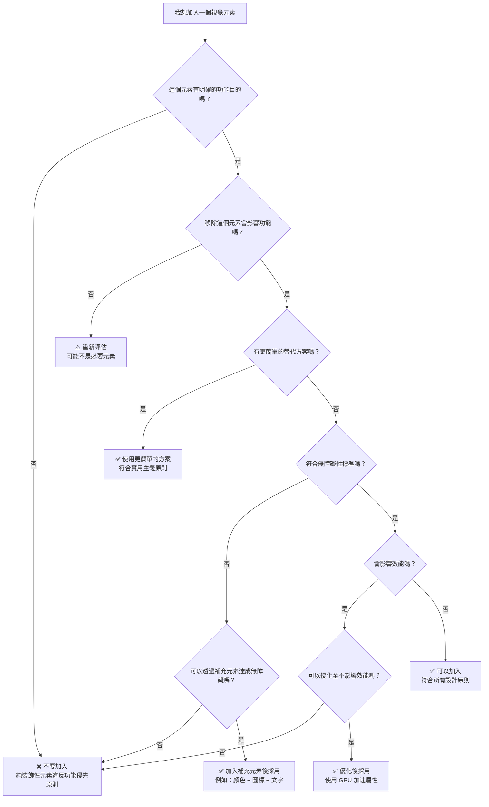
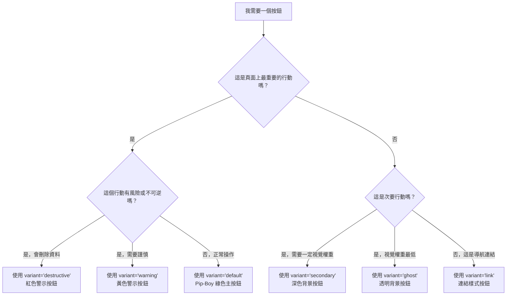

# 設計哲學：實用主義廢土風格

> **核心原則**：每個視覺元素都必須服務於明確的功能目的（資訊層級、使用者引導或互動反饋），同時透過細膩的效果、有意圖的色彩運用以及終端機風格介面，維持《異塵餘生》宇宙標誌性的後末日氛圍。

## 概述

本文件定義了「實用主義廢土」（Utilitarian Fallout）設計系統的核心哲學與指導原則，融合了《異塵餘生》系列的復古未來主義美學與實用主義設計原則。

**最後更新**：2025-10-04
**版本**：1.0.0
**相關需求**：Requirements 1.1, 1.2, 1.3, 1.4

---

## 目錄

- [核心設計原則](#核心設計原則)
- [功能優先於形式](#功能優先於形式)
- [視覺元素目的驗證](#視覺元素目的驗證)
- [衝突解決準則](#衝突解決準則)
- [實踐範例](#實踐範例)
- [決策樹](#決策樹)

---

## 核心設計原則

### 1. 功能優先於形式（Function Over Form）

所有設計決策必須從功能需求出發，裝飾性元素只有在不妨礙可用性的前提下才能加入。

**原則說明**：
- ✅ 每個視覺元素都有明確的功能目的
- ✅ 色彩用於傳達狀態和引導注意力
- ✅ 動畫提供互動反饋和狀態變化提示
- ❌ 避免純粹裝飾性的視覺效果
- ❌ 拒絕複雜但無意義的動畫

**範例**：
```tsx
// ✅ 好的範例：按鈕顏色傳達功能意義
<Button variant="destructive">刪除帳戶</Button>  // 紅色表示危險操作
<Button variant="default">確認選擇</Button>      // Pip-Boy 綠色表示主要操作

// ❌ 壞的範例：顏色選擇缺乏功能意義
<Button className="bg-purple-500">刪除帳戶</Button>  // 紫色與操作性質無關
```

### 2. 廢土美學的克制運用

《異塵餘生》主題元素（掃描線、輻射效果、終端機字體）應作為氛圍營造的點綴，而非主導設計。

**原則說明**：
- ✅ 背景效果不透明度上限 30%
- ✅ 動畫效果簡短且有目的（≤ 600ms）
- ✅ 終端機風格用於品牌識別區域（標題、導航）
- ❌ 避免過度使用輻射圖標和骷髏頭元素
- ❌ 拒絕全屏掃描線或閃爍效果干擾閱讀

**範例**：
```css
/* ✅ 好的範例：細膩的背景效果 */
.wasteland-background {
  background: linear-gradient(135deg, var(--color-wasteland-darker), var(--color-wasteland-medium));
  position: relative;
}

.wasteland-background::after {
  content: '';
  position: absolute;
  inset: 0;
  background-image: url('data:image/svg+xml,...'); /* 網格紋理 */
  opacity: 0.1; /* 僅 10% 不透明度 */
  pointer-events: none;
}

/* ❌ 壞的範例：過度干擾的效果 */
.bad-background {
  animation: screen-glitch 0.5s infinite; /* 持續閃爍干擾閱讀 */
  filter: contrast(2) saturate(3); /* 過度飽和影響可讀性 */
}
```

### 3. 無障礙設計為基準要求

所有元件預設必須符合 WCAG 2.1 AA 標準，關鍵使用者路徑需達到 AAA 等級。

**原則說明**：
- ✅ 文字對比度最低 4.5:1（正文）、3:1（大文字）
- ✅ 所有互動元素最小觸控目標 44×44px
- ✅ 鍵盤導航支援完整功能
- ✅ 螢幕閱讀器可完整理解內容結構
- ❌ 不依賴純色彩傳達資訊（需補充圖標或文字）

**範例**：
```tsx
// ✅ 好的範例：多重提示傳達狀態
<div className="form-field">
  <Input
    aria-invalid="true"
    aria-describedby="error-message"
    className="border-error"
  />
  <p id="error-message" role="alert" className="text-error">
    <AlertCircle size={16} aria-hidden="true" />
    <span>此欄位必須填寫</span>
  </p>
</div>

// ❌ 壞的範例：僅依賴顏色
<Input className="border-red-500" /> {/* 色盲使用者無法識別錯誤 */}
```

### 4. 效能為設計限制

視覺效果必須維持流暢效能（60fps），優先使用 GPU 加速屬性。

**原則說明**：
- ✅ 動畫僅使用 `transform` 和 `opacity`
- ✅ 背景效果使用 CSS 漸層而非大型圖片
- ✅ 字型載入使用 `font-display: swap` 避免 FOIT
- ❌ 避免使用會觸發重排（reflow）的屬性（width, height, left, top）

---

## 功能優先於形式

### 視覺元素的三大功能目的

每個設計元素必須符合以下至少一項功能目的：

#### 1. 資訊層級（Information Hierarchy）

**目的**：引導使用者注意力至最重要的內容。

**實踐方式**：
- 字型大小梯度（H1: 56px → Body: 16px）
- 顏色對比（主要內容 vs. 次要內容）
- 空間分組（使用 8px 基準單位的間距系統）

**範例**：
```tsx
<div className="card-wasteland">
  <header className="interface-header text-2xl mb-4">
    {/* H2 標題：最重要的資訊 */}
    遭遇戰鬥結果
  </header>
  <p className="text-text-primary text-base mb-2">
    {/* 主要內容：正常大小和對比度 */}
    你在廢土中遭遇了一隻死亡爪。
  </p>
  <p className="text-text-muted text-sm">
    {/* 次要資訊：較小且較淡 */}
    消耗彈藥：15 發 5mm 子彈
  </p>
</div>
```

#### 2. 使用者引導（User Guidance）

**目的**：協助使用者理解可互動元素和操作流程。

**實踐方式**：
- 按鈕樣式明確區分行動層級（primary, secondary, ghost）
- 表單欄位狀態清晰（default, focus, error, success）
- 導航路徑視覺化（breadcrumbs, active states）

**範例**：
```tsx
<div className="flex gap-3">
  {/* 主要行動：顯眼的綠色按鈕 */}
  <Button variant="default" size="lg">
    接受任務
  </Button>

  {/* 次要行動：較低視覺權重 */}
  <Button variant="outline" size="lg">
    查看詳情
  </Button>

  {/* 危險操作：紅色警示 */}
  <Button variant="destructive" size="lg">
    放棄任務
  </Button>
</div>
```

#### 3. 互動反饋（Interaction Feedback）

**目的**：確認使用者操作已被系統接收並處理。

**實踐方式**：
- Hover 狀態變化（亮度提升 10%+）
- Active 狀態壓下效果（transform: scale(0.98)）
- 音效反饋（按鈕點擊的 Pip-Boy 音效）
- 載入狀態動畫（旋轉器、進度條）

**範例**：
```tsx
// Button 元件內建互動反饋
const Button = ({ children, ...props }) => {
  const playClickSound = () => {
    // Web Audio API 音效反饋
    const audioContext = new AudioContext();
    // ... 產生 Pip-Boy 點擊音效
  };

  return (
    <button
      onClick={(e) => {
        playClickSound();
        props.onClick?.(e);
      }}
      className="
        btn-pip-boy
        transition-all duration-200
        hover:brightness-110
        active:scale-98
        focus:ring-3 focus:ring-offset-2
      "
    >
      {children}
    </button>
  );
};
```

---

## 視覺元素目的驗證

### 驗證清單

在加入任何視覺元素前，請完成以下驗證：

1. **功能性問題**：
   - [ ] 這個元素解決了什麼使用者需求？
   - [ ] 移除這個元素會影響功能嗎？
   - [ ] 這個元素傳達了什麼資訊或狀態？

2. **替代方案評估**：
   - [ ] 有更簡單的方式達成相同目的嗎？
   - [ ] 可以重用現有元件嗎？
   - [ ] 這個元素與設計系統一致嗎？

3. **無障礙性檢查**：
   - [ ] 色盲使用者可以理解這個元素嗎？
   - [ ] 螢幕閱讀器使用者會接收到什麼資訊？
   - [ ] 鍵盤使用者可以操作這個元素嗎？

4. **效能影響**：
   - [ ] 這個元素會影響頁面載入速度嗎？
   - [ ] 動畫保持在 60fps 嗎？
   - [ ] 是否使用 GPU 加速屬性？

### 驗證範例

#### ✅ 通過驗證的範例

**元素**：表單錯誤訊息的紅色邊框 + 圖標 + 文字

**驗證結果**：
- ✅ **功能性**：告知使用者輸入無效，需要修正
- ✅ **替代方案**：已是最簡方案，重用了 Input 元件的 error variant
- ✅ **無障礙性**：
  - 色盲：圖標形狀 + 文字補充顏色
  - 螢幕閱讀器：`aria-invalid="true"` + `role="alert"`
  - 鍵盤：自動聚焦至錯誤欄位
- ✅ **效能**：純 CSS，無效能影響

#### ❌ 未通過驗證的範例

**元素**：按鈕上的 3D 浮起動畫（按下時旋轉 360 度）

**驗證結果**：
- ❌ **功能性**：旋轉動畫無法傳達任何資訊
- ❌ **替代方案**：簡單的 scale(0.98) 壓下效果已足夠
- ⚠️ **無障礙性**：可能觸發動作敏感使用者不適
- ❌ **效能**：360 度旋轉需 600ms，超出建議範圍（≤ 300ms）

**決策**：拒絕加入此動畫，使用標準壓下效果。

---

## 衝突解決準則

當廢土美學與可用性產生衝突時，依循以下優先順序：

### 優先級順序（由高至低）

1. **無障礙性（Accessibility）** - 絕不妥協
   - 對比度、鍵盤導航、螢幕閱讀器支援

2. **可用性（Usability）** - 核心體驗
   - 清晰的互動提示、明確的錯誤訊息、直觀的導航

3. **效能（Performance）** - 流暢體驗
   - 60fps 動畫、快速載入時間、低資源消耗

4. **主題一致性（Thematic Consistency）** - 品牌識別
   - 《異塵餘生》色彩、終端機字體、輻射圖標

### 衝突解決範例

#### 情境 1：掃描線效果 vs. 文字可讀性

**衝突**：全屏掃描線動畫營造終端機氛圍，但可能降低文字對比度。

**解決方案**：
- ✅ **採用**：掃描線效果限制在背景層，不透明度 ≤ 10%
- ✅ **採用**：文字區域加入半透明暗色背景提升對比
- ❌ **拒絕**：移除掃描線以確保可讀性

**原則應用**：可用性優先，但透過技術手段保留主題氛圍。

#### 情境 2：Pip-Boy 綠色 vs. 色盲友善

**衝突**：Pip-Boy 綠色 (#00ff88) 作為主要互動色，但紅綠色盲使用者可能難以區分成功/錯誤狀態。

**解決方案**：
- ✅ **採用**：成功狀態 = 綠色 + 勾選圖標
- ✅ **採用**：錯誤狀態 = 紅色 + X 圖標
- ✅ **採用**：所有狀態補充文字說明
- ❌ **拒絕**：放棄 Pip-Boy 綠色

**原則應用**：無障礙性優先，透過多重提示（顏色 + 圖標 + 文字）解決衝突。

#### 情境 3：終端機字體 vs. 閱讀效率

**衝突**：等寬字型（monospace）符合終端機主題，但閱讀長文時效率較低。

**解決方案**：
- ✅ **採用**：標題、導航、數據使用 JetBrains Mono（等寬）
- ✅ **採用**：長文內容（超過 200 字）維持等寬字型，但提升字級至 16px+ 並增加行距至 1.75
- ✅ **採用**：數字顯示使用 Doto 字型（已實作）
- ❌ **拒絕**：切換至非等寬字型

**原則應用**：透過字級與行距優化兼顧主題與可用性。

---

## 實踐範例

### 範例 1：設計一個任務接受頁面

**需求**：顯示任務詳情，包含標題、描述、獎勵、接受/拒絕按鈕。

**設計思考過程**：

1. **資訊層級**：
   - 標題最重要 → H1 (56px)
   - 任務描述次之 → Body (16px, line-height: 1.75)
   - 獎勵資訓第三 → Body small (14px)
   - 按鈕最後但需顯眼 → Large size (40px height)

2. **使用者引導**：
   - 「接受任務」為主要行動 → `variant="default"`（綠色）
   - 「拒絕任務」為次要行動 → `variant="outline"`（透明邊框）

3. **互動反饋**：
   - 按鈕 hover 提升亮度 10%
   - 點擊播放 Pip-Boy 音效
   - 接受後顯示載入狀態動畫

**程式碼實作**：

```tsx
<div className="container-standard py-8">
  {/* 資訊層級：H1 標題 */}
  <h1 className="text-6xl font-bold text-text-primary mb-6">
    清理廢水處理廠
  </h1>

  {/* 資訊層級：主要描述 */}
  <div className="prose prose-wasteland mb-6">
    <p className="text-base text-text-primary leading-relaxed">
      廢水處理廠已被變種生物佔據。我們需要有人清理這個區域，
      確保水源供應恢復正常。預計會遭遇 5-8 隻輻射蟑螂。
    </p>
  </div>

  {/* 資訊層級：次要資訊（獎勵） */}
  <div className="card-wasteland mb-8">
    <h2 className="interface-header text-xl mb-3">任務獎勵</h2>
    <ul className="space-y-2 text-sm text-text-secondary">
      <li className="flex items-center gap-2">
        <BottleCapIcon size={16} />
        <span className="numeric">150</span> 瓶蓋
      </li>
      <li className="flex items-center gap-2">
        <RadiationIcon size={16} />
        <span className="numeric">+50</span> 經驗值
      </li>
    </ul>
  </div>

  {/* 使用者引導：行動按鈕 */}
  <div className="flex gap-4">
    <Button variant="default" size="lg" onClick={handleAccept}>
      {isAccepting ? <LoadingSpinner /> : '接受任務'}
    </Button>
    <Button variant="outline" size="lg" onClick={handleDecline}>
      拒絕任務
    </Button>
  </div>
</div>
```

**哲學應用說明**：
- ✅ 功能優先：所有元素都有明確目的（傳達資訊或觸發行動）
- ✅ 廢土美學克制：僅在數字使用 `.numeric` 類別，卡片使用細膩邊框
- ✅ 無障礙性：語意化 HTML、清晰對比、鍵盤可導航
- ✅ 效能優化：無大型圖片、動畫僅用於載入狀態

---

### 範例 2：設計表單驗證反饋

**需求**：使用者輸入電子郵件時，即時驗證格式並顯示錯誤。

**設計思考過程**：

1. **資訊層級**：
   - 錯誤訊息需立即可見 → 紅色文字 + 圖標
   - 正確輸入需視覺確認 → 綠色邊框 + 勾選圖標

2. **使用者引導**：
   - 錯誤時聚焦至欄位，螢幕閱讀器朗讀錯誤
   - 提供範例格式協助使用者修正

3. **互動反饋**：
   - 輸入時即時驗證（debounce 300ms）
   - 狀態變化平滑過渡（200ms）

**程式碼實作**：

```tsx
<div className="form-field">
  <Label htmlFor="email">電子郵件地址</Label>

  <Input
    id="email"
    type="email"
    value={email}
    onChange={handleEmailChange}
    variant={emailError ? 'error' : email ? 'success' : 'default'}
    aria-invalid={!!emailError}
    aria-describedby="email-helper email-error"
  />

  {/* 輔助文字 */}
  <p id="email-helper" className="text-sm text-text-muted mt-1">
    例如：vault-dweller@wasteland.com
  </p>

  {/* 錯誤訊息（僅在有錯誤時顯示） */}
  {emailError && (
    <p id="email-error" role="alert" className="text-sm text-error mt-1 flex items-center gap-1">
      <AlertCircle size={16} aria-hidden="true" />
      <span>{emailError}</span>
    </p>
  )}

  {/* 成功訊息（僅在驗證通過時顯示） */}
  {email && !emailError && (
    <p className="text-sm text-success mt-1 flex items-center gap-1">
      <CheckCircle size={16} aria-hidden="true" />
      <span>電子郵件格式正確</span>
    </p>
  )}
</div>
```

**哲學應用說明**：
- ✅ 功能優先：錯誤訊息清晰說明問題，提供範例協助修正
- ✅ 多重提示：顏色 + 圖標 + 文字（支援色盲使用者）
- ✅ 無障礙性：`aria-invalid`, `role="alert"`, `aria-describedby`
- ✅ 廢土美學：使用設計系統的 error/success 顏色（紅色/綠色）

---

## 決策樹

### 「我應該加入這個視覺元素嗎？」



### 「我應該選擇哪個按鈕變體？」



---

## 版本紀錄

| 版本 | 日期 | 變更內容 |
|------|------|----------|
| 1.0.0 | 2025-10-04 | 初始版本 - 核心設計哲學定義 |

---

## 參考資源

- **WCAG 2.1 無障礙指南**: [W3C WCAG 2.1](https://www.w3.org/WAI/WCAG21/quickref/)
- **設計系統研究**: Howik, M. (2025). "Design system success through clear communication"
- **實用主義設計**: [實用主義設計原則](https://lawsofux.com/)
- **Fallout 視覺設計參考**: Bethesda Softworks, Fallout Series UI/UX

---

**下一步**：閱讀 [01-tokens.md](/Users/sean/Documents/React/tarot-card-nextjs-app/.kiro/specs/fallout-utilitarian-design/design-system/01-tokens.md) 了解設計代幣系統。
