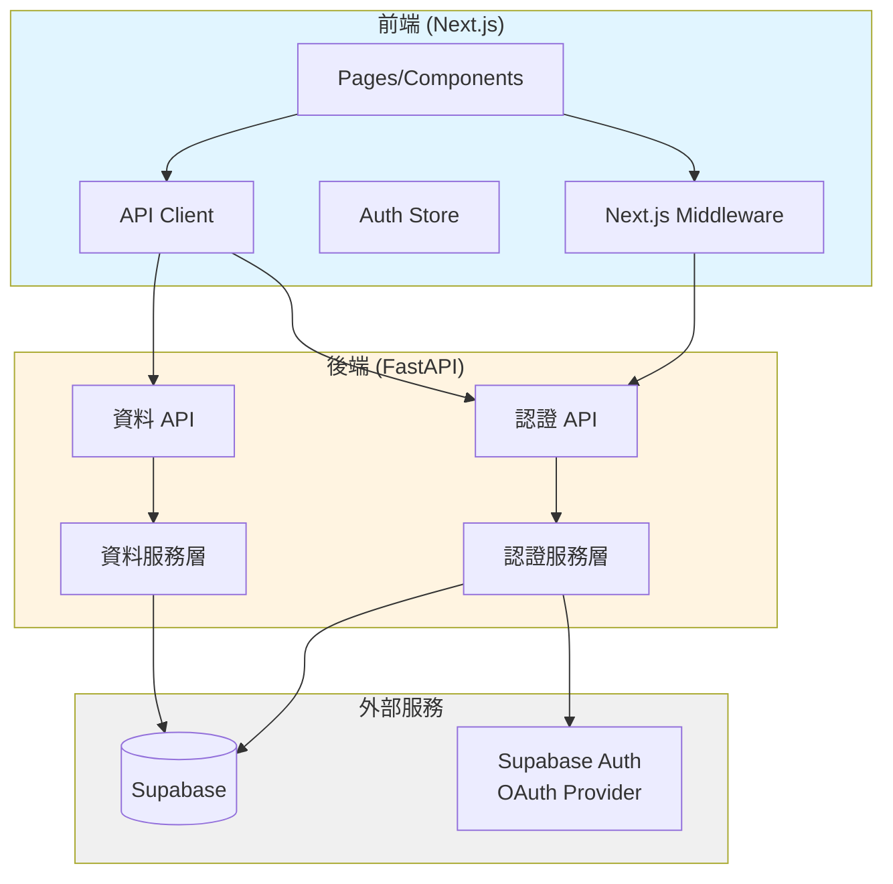
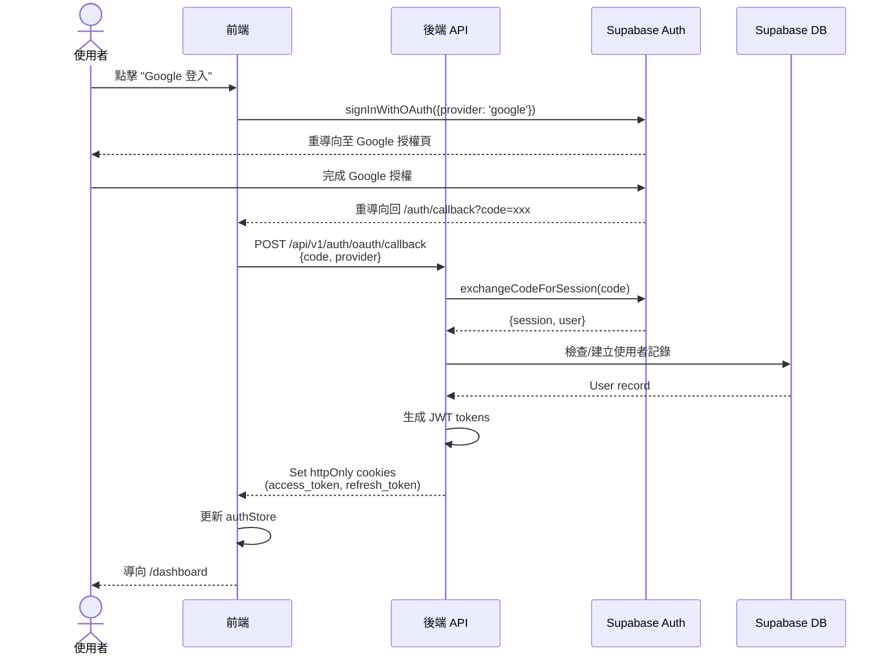
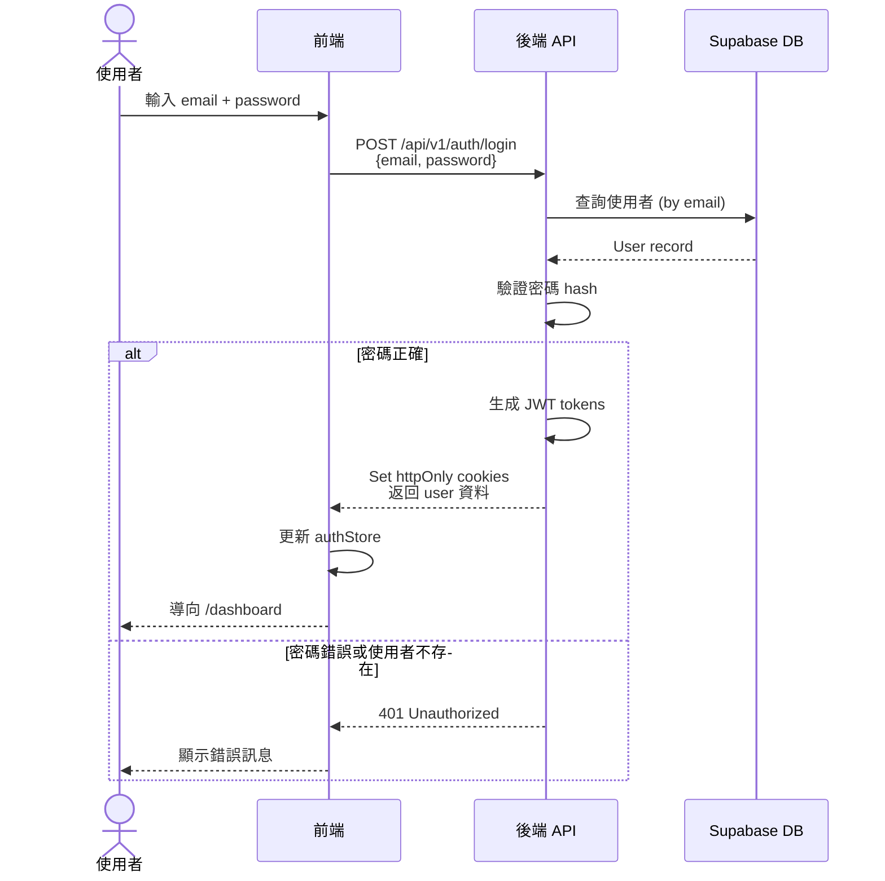
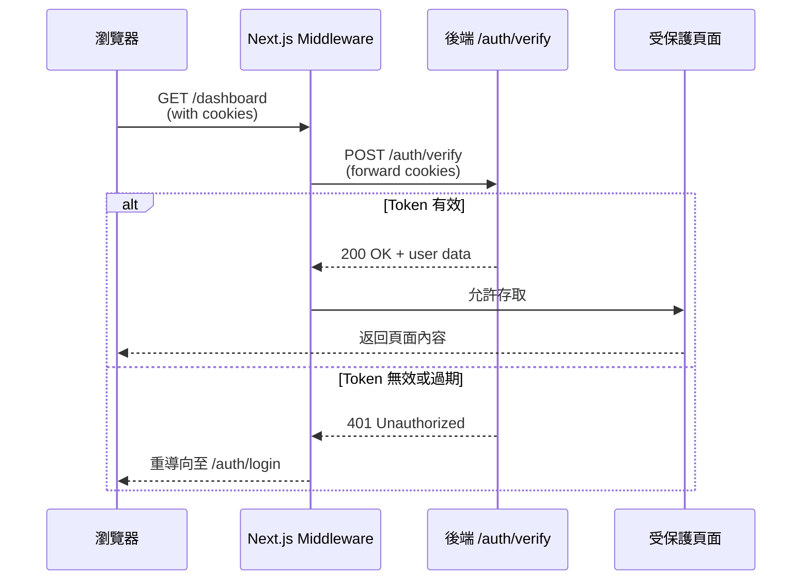
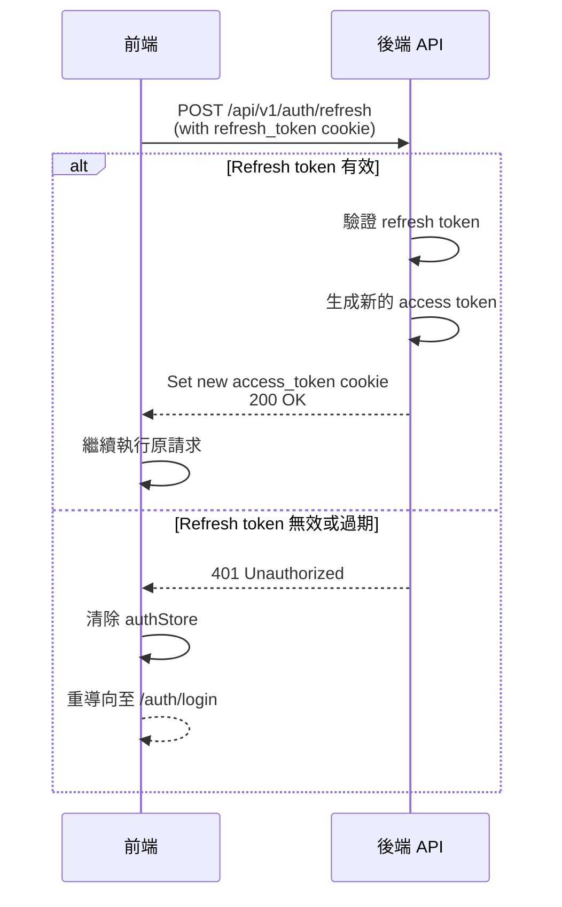
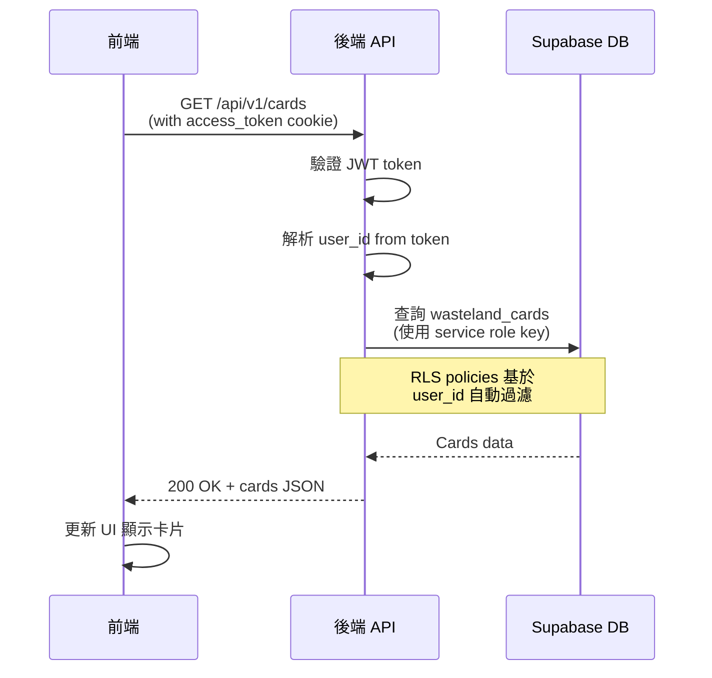
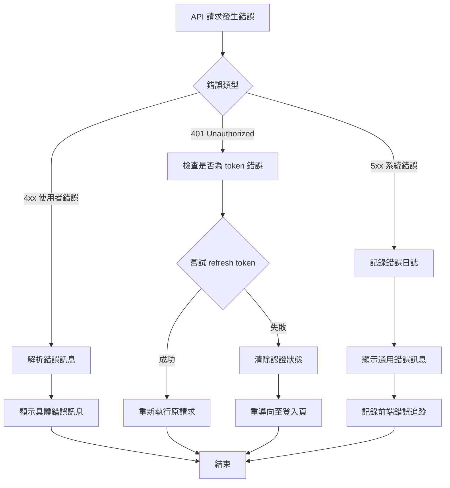
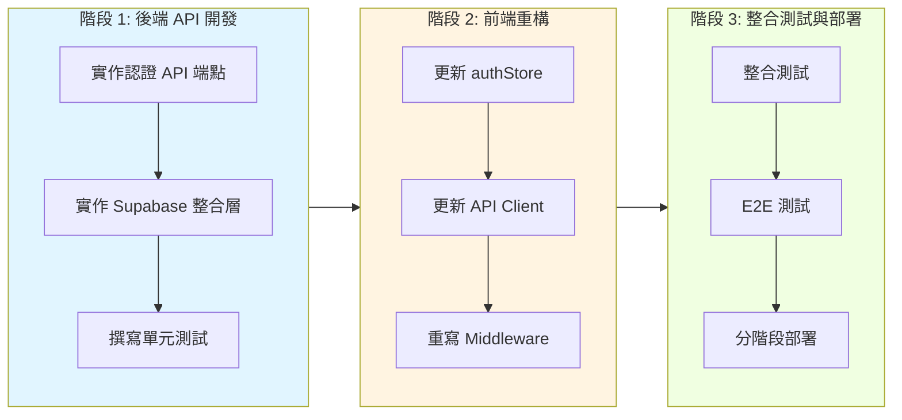

# 技術設計文件 - 前後端架構重構

## 概述

本重構專案旨在解決當前架構的根本性問題：前端直接使用 Supabase 客戶端存取資料庫和認證服務，違反分層架構原則。重構後，所有資料存取和認證邏輯將集中在後端 API 層，前端僅透過 RESTful API 與後端互動。

**目標使用者：** 開發團隊將透過此重構獲得更清晰的架構分層、更好的安全性控制、以及更容易維護的程式碼庫。

**系統影響：** 此重構將改變前端與資料層的互動方式，從直接存取 Supabase 轉變為透過後端 API 統一存取。這是一個基礎性架構變更，影響認證流程、資料存取、以及 middleware 運作機制。

### 目標

- 消除前端對 Supabase 的直接依賴，建立清晰的 API 邊界
- 集中認證和授權邏輯在後端，提升安全性
- 使用 httpOnly cookies 儲存 JWT tokens，防止 XSS 攻擊
- 保持向後相容，確保現有資料和使用者體驗不受影響

### 非目標

- 不改變 Supabase 資料庫 schema（除非絕對必要）
- 不重寫現有的業務邏輯和 UI 元件
- OAuth 重導向流程仍保留在前端（僅 token 交換移至後端）
- 不實作新的功能特性（純粹架構重構）

## 架構

### 現有架構分析

當前系統存在以下架構問題：

**前端直接存取 Supabase：**
- `src/utils/supabase/client.ts` 和 `server.ts` 直接建立 Supabase 連線
- Middleware 直接呼叫 `supabase.auth.getUser()` 驗證 session
- `authStore.ts` 混合使用後端 API 和 Supabase 客戶端
- `sessionManager.ts` 直接管理 Supabase session 刷新

**安全性風險：**
- Supabase anon key 暴露在前端程式碼
- 無法在後端統一實施資料存取控制
- 前端 token 管理增加 XSS 攻擊面

**維護問題：**
- 資料存取邏輯分散在前後端
- 認證狀態同步複雜（Supabase session vs. backend JWT）
- 測試困難（前端直接依賴外部服務）

### 高階架構



**架構整合說明：**

1. **保留的模式：**
   - FastAPI 服務層模式（`services/` 目錄結構）
   - Zustand 狀態管理（但移除 Supabase 依賴）
   - Next.js App Router 和 middleware 模式
   - RESTful API 設計原則

2. **新增元件理由：**
   - **認證 Middleware (Next.js)：** 在路由層驗證 JWT，保護受限頁面
   - **JWT Cookie Handler：** 安全管理 httpOnly cookies
   - **Supabase 整合層：** 封裝所有 Supabase 操作在後端

3. **技術棧對齊：**
   - 使用現有的 FastAPI + Python-JOSE 進行 JWT 處理
   - 保持現有的 Pydantic schemas 和 SQLAlchemy models
   - 使用現有的錯誤處理機制（`exceptions.py`）

4. **Steering 合規性：**
   - 遵循 `structure.md` 定義的分層架構
   - 符合 `tech.md` 的安全性和效能要求
   - 維持 `product.md` 強調的使用者體驗

### 技術對齊

本重構是對現有系統的**架構調整**，而非新功能開發，因此採用技術對齊而非技術選型：

**現有技術棧保持不變：**
- **前端：** Next.js 15, React 19, TypeScript 5, Zustand
- **後端：** FastAPI, Python 3.11, SQLAlchemy, Python-JOSE
- **基礎設施：** Supabase (PostgreSQL), httpOnly Cookies

**新增依賴說明：**
- **前端無新增依賴** - 移除 `@supabase/ssr` 依賴
- **後端無新增依賴** - 使用現有的 `supabase-py` 和 `python-jose`

### 關鍵設計決策

#### 決策 1：使用 httpOnly Cookies 儲存 JWT Tokens

**決策：** 使用 httpOnly, Secure, SameSite=Lax cookies 儲存 access token 和 refresh token

**背景：** 現有系統將 tokens 儲存在 localStorage，容易受到 XSS 攻擊。需要更安全的 token 儲存機制。

**考慮的替代方案：**
1. **localStorage (現狀)：** 簡單但不安全，JavaScript 可存取導致 XSS 風險
2. **Session Storage：** 與 localStorage 類似的安全問題
3. **httpOnly Cookies：** 無法被 JavaScript 存取，更安全

**選擇的方案：** httpOnly Cookies

httpOnly cookies 提供以下優勢：
- **XSS 防護：** JavaScript 無法存取，即使頁面被注入惡意腳本也無法竊取 token
- **自動傳送：** 瀏覽器自動在請求中包含 cookies，簡化前端邏輯
- **Secure 標記：** 在 HTTPS 環境中確保 cookies 僅透過加密連線傳輸
- **SameSite 保護：** 防止 CSRF 攻擊

**設定範例：**
```python
response.set_cookie(
    key="access_token",
    value=access_token,
    httponly=True,  # 防止 JavaScript 存取
    secure=True,    # 僅 HTTPS (生產環境)
    samesite="lax", # CSRF 防護
    max_age=1800    # 30 分鐘
)
```

**取捨：**
- **優點：** 顯著提升安全性，符合 OWASP 最佳實踐，簡化前端 token 管理
- **缺點：** 需要 CORS 設定 `credentials: 'include'`，跨域請求需要更謹慎處理

#### 決策 2：Middleware 使用後端 API 驗證 Token

**決策：** Next.js middleware 呼叫後端 `/api/v1/auth/verify` 端點驗證 JWT token

**背景：** 現有 middleware 直接呼叫 Supabase `getUser()`，違反分層架構原則，且無法與後端 JWT session 同步。

**考慮的替代方案：**
1. **前端自行驗證 JWT：** 需要暴露 JWT secret 在前端，安全風險極高
2. **Middleware 直接查詢資料庫：** 增加 middleware 複雜度，違反單一職責原則
3. **呼叫後端 API 驗證：** 集中驗證邏輯，安全且可維護

**選擇的方案：** 呼叫後端 API 驗證端點

實作方式：
```typescript
// middleware.ts
const verifyResponse = await fetch(`${API_URL}/api/v1/auth/verify`, {
  headers: {
    Cookie: request.headers.get('cookie') || ''
  },
  credentials: 'include'
})

if (!verifyResponse.ok) {
  // Token 無效或過期，重導向登入頁
  return NextResponse.redirect(new URL('/auth/login', request.url))
}
```

**取捨：**
- **優點：** 認證邏輯集中在後端，易於更新和維護；Token 驗證統一，無需前後端同步邏輯
- **缺點：** 每個受保護路由請求增加一次後端 API 呼叫（可透過 Redis 快取緩解）

#### 決策 3：保留前端 OAuth 重導向，後端處理 Token 交換

**決策：** 前端觸發 OAuth 重導向和接收回調，但授權碼交換由後端執行

**背景：** OAuth 流程涉及 Supabase Auth 重導向，前端必須參與流程啟動和回調接收。

**考慮的替代方案：**
1. **完全由後端處理 OAuth：** 複雜，需要後端管理重導向 URL 和狀態參數
2. **完全由前端處理 OAuth：** 現狀，但導致前端直接持有 Supabase session
3. **混合模式：** 前端觸發和接收回調，後端處理 token 交換

**選擇的方案：** 混合模式

流程設計：
1. 前端呼叫 Supabase `signInWithOAuth()` 觸發重導向
2. 使用者完成 OAuth 授權後，Supabase 重導向回前端 `/auth/callback?code=xxx`
3. 前端提取 `code` 參數並呼叫後端 `/api/v1/auth/oauth/callback`
4. 後端使用 Supabase 客戶端和 service role key 交換 code 為 session
5. 後端建立 JWT tokens 並設定 httpOnly cookies
6. 前端接收成功回應後更新 authStore

**取捨：**
- **優點：** 符合 OAuth 標準流程，利用 Supabase Auth 的成熟實作；前端不持有長期 token，安全性提升
- **缺點：** 流程稍微複雜，需要前後端協同；需要在後端安全儲存 Supabase service role key

## 系統流程

### 認證流程

#### OAuth 登入流程



#### 傳統登入流程



#### Middleware Token 驗證流程



#### Token 刷新流程



### 資料存取流程



## 需求追溯

| 需求 ID | 需求摘要 | 對應元件 | 介面/API | 相關流程 |
|---------|---------|----------|---------|---------|
| 1.1 | 前端透過後端 API 存取資料 | API Client, Data Services | GET /api/v1/cards, /readings | 資料存取流程 |
| 1.2 | 前端使用後端認證 API | Auth Store, Auth API | POST /api/v1/auth/login | 傳統登入流程 |
| 1.3 | 移除前端 Supabase 查詢 | - | - | (移除舊程式碼) |
| 1.4 | OAuth code 交換由後端處理 | OAuth Service | POST /api/v1/auth/oauth/callback | OAuth 登入流程 |
| 2.1 | Middleware 透過後端 API 驗證 | Next.js Middleware, Auth API | POST /api/v1/auth/verify | Middleware 驗證流程 |
| 2.2 | Middleware 使用 session 驗證端點 | Next.js Middleware | POST /api/v1/auth/verify | Middleware 驗證流程 |
| 2.4 | Middleware 呼叫 refresh token 端點 | Next.js Middleware | POST /api/v1/auth/refresh | Token 刷新流程 |
| 3.1 | OAuth 回調端點處理授權碼 | OAuth Service | POST /api/v1/auth/oauth/callback | OAuth 登入流程 |
| 3.2 | 傳統登入端點 | Authentication Service | POST /api/v1/auth/login | 傳統登入流程 |
| 3.3 | 登出端點清除 cookies | Authentication Service | POST /api/v1/auth/logout | - |
| 3.4 | 設定 httpOnly cookies | JWT Cookie Handler | - | 所有認證流程 |
| 3.5 | 提供當前使用者資訊端點 | User Service | GET /api/v1/auth/me | - |
| 4.1-4.5 | 後端 Supabase 整合層 | Data Services | GET /api/v1/cards, /readings | 資料存取流程 |
| 5.1-5.6 | 更新前端 authStore 和 API 客戶端 | Auth Store, API Client | - | 所有認證流程 |
| 6.1-6.5 | 後端認證 API 端點 | Auth API Endpoints | POST /auth/verify, /auth/refresh, GET /auth/me | 驗證和刷新流程 |

## 元件與介面

### 後端 - 認證服務層

#### AuthenticationService

**職責與邊界**
- **主要職責：** 處理所有認證相關業務邏輯，包含傳統登入、OAuth、JWT token 管理
- **領域邊界：** 認證與授權領域
- **資料擁有權：** JWT token 生命週期管理
- **事務邊界：** 單一認證操作（登入、登出、token 刷新）

**依賴關係**
- **Inbound：** Auth API endpoints (`/auth/login`, `/auth/logout`, `/auth/refresh`)
- **Outbound：** UserService (使用者查詢), Supabase Auth (OAuth), Database (session 追蹤)
- **External：** python-jose (JWT), passlib (密碼 hash), supabase-py (OAuth)

**服務介面**

```python
class AuthenticationService:
    """
    認證服務 - 處理登入、登出、token 管理
    """

    async def login_user(
        self,
        email: str,
        password: str
    ) -> dict[str, Any]:
        """
        使用 email + password 登入

        Preconditions:
        - email 格式有效
        - password 不為空

        Postconditions:
        - 若成功：返回 access_token, refresh_token, user
        - 若失敗：拋出 InvalidCredentialsError 或 OAuthUserCannotLoginError

        Invariants:
        - Tokens 使用 JWT 格式並簽署
        """
        pass

    async def oauth_callback(
        self,
        code: str,
        provider: str
    ) -> dict[str, Any]:
        """
        處理 OAuth 授權碼交換

        Preconditions:
        - code 為有效的授權碼
        - provider in ['google'] (目前僅支援 Google)

        Postconditions:
        - 建立或更新使用者記錄
        - 返回 JWT tokens

        Invariants:
        - OAuth 使用者標記為 is_oauth_user=True
        """
        pass

    async def verify_token(
        self,
        access_token: str
    ) -> dict[str, Any]:
        """
        驗證 JWT access token

        Preconditions:
        - access_token 為 JWT 格式字串

        Postconditions:
        - 若有效：返回 decoded payload
        - 若無效：拋出 InvalidTokenError

        Invariants:
        - Token 簽章必須正確
        - Token 未過期
        """
        pass

    async def refresh_access_token(
        self,
        refresh_token: str
    ) -> dict[str, Any]:
        """
        使用 refresh token 換取新的 access token

        Preconditions:
        - refresh_token 為有效的 JWT refresh token

        Postconditions:
        - 返回新的 access_token 和 refresh_token
        - 舊的 refresh_token 失效

        Invariants:
        - Refresh token type 必須為 "refresh"
        """
        pass
```

#### SupabaseService

**職責與邊界**
- **主要職責：** 封裝所有 Supabase 資料庫操作，提供統一的資料存取介面
- **領域邊界：** 資料存取層
- **資料擁有權：** 不擁有資料，僅提供存取介面
- **事務邊界：** 單一資料庫操作或簡單事務

**依賴關係**
- **Inbound：** 所有需要資料存取的 services (UserService, ReadingService, CardService)
- **Outbound：** Supabase PostgreSQL database
- **External：** supabase-py SDK

**服務介面**

```python
class SupabaseService:
    """
    Supabase 資料存取服務 - 統一管理資料庫操作
    """

    def __init__(self, service_role_key: str):
        """
        使用 service role key 初始化 Supabase 客戶端
        """
        self.client = create_client(supabase_url, service_role_key)

    async def query_table(
        self,
        table_name: str,
        filters: dict[str, Any] = None,
        user_id: str | None = None
    ) -> list[dict[str, Any]]:
        """
        查詢資料表

        Preconditions:
        - table_name 為有效的資料表名稱
        - 若 user_id 提供，RLS policies 將自動套用

        Postconditions:
        - 返回符合條件的記錄列表

        Invariants:
        - RLS policies 始終被執行
        """
        pass

    async def insert_record(
        self,
        table_name: str,
        data: dict[str, Any],
        user_id: str
    ) -> dict[str, Any]:
        """
        插入新記錄

        Preconditions:
        - data 符合資料表 schema
        - user_id 為有效的使用者 ID

        Postconditions:
        - 記錄成功插入
        - 返回插入的完整記錄（含 ID）

        Invariants:
        - RLS policies 檢查 user_id 權限
        """
        pass

    async def update_record(
        self,
        table_name: str,
        record_id: str,
        data: dict[str, Any],
        user_id: str
    ) -> dict[str, Any]:
        """
        更新記錄

        Preconditions:
        - record_id 存在
        - user_id 有權限更新此記錄

        Postconditions:
        - 記錄更新成功
        - 返回更新後的記錄

        Invariants:
        - RLS policies 驗證權限
        """
        pass
```

### 後端 - API 端點

**API Contract**

| Method | Endpoint | Request | Response | Errors |
|--------|----------|---------|----------|--------|
| POST | /api/v1/auth/login | `{email, password}` | `{access_token, refresh_token, user}` | 400, 401 |
| POST | /api/v1/auth/logout | - (cookies) | `{message}` | 401 |
| POST | /api/v1/auth/oauth/callback | `{code, provider}` | `{access_token, refresh_token, user}` | 400, 500 |
| POST | /api/v1/auth/verify | - (cookies) | `{user}` | 401 |
| POST | /api/v1/auth/refresh | - (refresh_token cookie) | `{access_token}` | 401 |
| GET | /api/v1/auth/me | - (cookies) | `{user, statistics}` | 401 |
| GET | /api/v1/cards | `?page=1&limit=20` | `{cards: [...]}` | 401, 500 |
| GET | /api/v1/readings | `?page=1&limit=10` | `{readings: [...]}` | 401, 500 |

**詳細 Schema (關鍵端點)**

```python
# POST /api/v1/auth/login
class LoginRequest(BaseModel):
    email: EmailStr
    password: str

class LoginResponse(BaseModel):
    access_token: str
    refresh_token: str
    user: UserSchema
    token_type: str = "bearer"

# POST /api/v1/auth/oauth/callback
class OAuthCallbackRequest(BaseModel):
    code: str  # 授權碼
    provider: str  # "google"

class OAuthCallbackResponse(BaseModel):
    access_token: str
    refresh_token: str
    user: UserSchema
    token_type: str = "bearer"

# POST /api/v1/auth/verify
class VerifyResponse(BaseModel):
    user: UserSchema
    is_valid: bool = True
```

**Cookie 設定**

```python
# Access Token Cookie
{
    "key": "access_token",
    "httponly": True,
    "secure": True,  # Production only
    "samesite": "lax",
    "max_age": 1800,  # 30 分鐘
    "path": "/"
}

# Refresh Token Cookie
{
    "key": "refresh_token",
    "httponly": True,
    "secure": True,  # Production only
    "samesite": "lax",
    "max_age": 604800,  # 7 天
    "path": "/api/v1/auth/refresh"  # 僅限於刷新端點
}
```

### 前端 - Auth Store

#### AuthStore (Zustand)

**職責與邊界**
- **主要職責：** 管理前端認證狀態，提供登入/登出 actions
- **領域邊界：** 前端認證狀態管理
- **資料擁有權：** 當前使用者資訊（user object）
- **狀態管理：** Zustand store with persistence

**依賴關係**
- **Inbound：** React Components (useAuthStore hook)
- **Outbound：** API Client (`/api/v1/auth/*`)
- **External：** 無（移除 Supabase 依賴）

**狀態管理**

```typescript
interface AuthState {
  user: User | null
  isLoading: boolean
  isInitialized: boolean
  error: string | null

  // OAuth 相關
  isOAuthUser: boolean
  oauthProvider: string | null
  profilePicture: string | null

  // Actions
  initialize: () => Promise<void>
  login: (email: string, password: string) => Promise<void>
  logout: () => Promise<void>
  refreshToken: () => Promise<void>
  clearError: () => void
  setOAuthUser: (user: User) => void  // 用於 OAuth callback
}
```

**整合策略**

**修改方式：** 擴展現有 authStore，移除 Supabase 依賴

**向後相容性：** 保持 authStore API 不變，僅更改內部實作

**遷移路徑：**
1. 移除 `import { createClient } from '@/utils/supabase/client'`
2. 更新 `login()` 改為呼叫 `POST /api/v1/auth/login`
3. 更新 `logout()` 改為呼叫 `POST /api/v1/auth/logout`
4. 移除 `localStorage` token 管理（改用 httpOnly cookies）
5. 更新 `initialize()` 改為呼叫 `GET /api/v1/auth/me`

### 前端 - Middleware

#### Next.js Middleware

**職責與邊界**
- **主要職責：** 在路由層級驗證認證狀態，保護受限頁面
- **領域邊界：** 路由存取控制
- **狀態管理：** Stateless（每次請求獨立驗證）

**依賴關係**
- **Inbound：** Next.js routing system
- **Outbound：** Backend `/api/v1/auth/verify`
- **External：** Next.js middleware API

**介面設計**

```typescript
// middleware.ts
export async function middleware(request: NextRequest) {
  const { pathname } = request.nextUrl

  // 檢查是否為受保護路由
  const isProtectedRoute = protectedRoutes.some(route =>
    pathname.startsWith(route)
  )

  if (!isProtectedRoute) {
    return NextResponse.next()
  }

  // 驗證 token
  const verifyResponse = await fetch(`${API_URL}/api/v1/auth/verify`, {
    headers: {
      Cookie: request.headers.get('cookie') || ''
    },
    credentials: 'include'
  })

  if (!verifyResponse.ok) {
    // 清除無效 cookies
    const response = NextResponse.redirect(
      new URL('/auth/login', request.url)
    )
    response.cookies.delete('access_token')
    response.cookies.delete('refresh_token')
    return response
  }

  return NextResponse.next()
}
```

**整合策略**

**修改方式：** 重寫 middleware.ts

**向後相容性：** 保持相同的受保護路由配置

**遷移路徑：**
1. 移除 `import { updateSession } from '@/utils/supabase/middleware'`
2. 實作新的 `verifyTokenWithBackend()` 函式
3. 更新路由保護邏輯使用後端驗證
4. 保留 `protectedRoutes` 和 `publicRoutes` 配置

## 資料模型

### JWT Payload Schema

```typescript
interface JWTPayload {
  // Standard JWT claims
  sub: string          // User ID
  email: string
  exp: number         // Expiration timestamp
  iat: number         // Issued at timestamp
  type: "access" | "refresh"

  // Custom claims
  name: string
  is_oauth_user: boolean
  oauth_provider?: string
  karma_score?: number
  faction_alignment?: string
}
```

### User Model (保持不變)

現有的 Supabase `users` 資料表 schema 保持不變：

```sql
CREATE TABLE users (
  id UUID PRIMARY KEY DEFAULT uuid_generate_v4(),
  email TEXT UNIQUE NOT NULL,
  name TEXT NOT NULL,
  display_name TEXT,
  password_hash TEXT,  -- NULL for OAuth users
  oauth_provider TEXT,  -- 'google' | NULL
  profile_picture_url TEXT,
  karma_score INTEGER DEFAULT 0,
  faction_alignment TEXT,
  vault_number INTEGER,
  wasteland_location TEXT,
  is_verified BOOLEAN DEFAULT FALSE,
  is_active BOOLEAN DEFAULT TRUE,
  created_at TIMESTAMPTZ DEFAULT NOW(),
  updated_at TIMESTAMPTZ DEFAULT NOW()
);
```

**一致性與完整性：**
- **主鍵：** `id` (UUID)
- **唯一約束：** `email` 必須唯一
- **參照完整性：** `users.id` 被 `readings`, `karma_history` 等資料表參照

**RLS Policies（保持不變）：**
```sql
-- 使用者只能讀取自己的記錄
CREATE POLICY users_select_own ON users
  FOR SELECT USING (auth.uid() = id);

-- 使用者可以更新自己的 profile
CREATE POLICY users_update_own ON users
  FOR UPDATE USING (auth.uid() = id);
```

### 資料契約與整合

**API 資料傳輸：**

```python
# UserSchema (Pydantic)
class UserSchema(BaseModel):
    id: str
    email: str
    name: str
    display_name: str | None = None
    oauth_provider: str | None = None
    profile_picture_url: str | None = None
    karma_score: int = 0
    karma_alignment: str = "neutral"
    faction_alignment: str | None = None
    is_oauth_user: bool = False
    is_verified: bool = False
    created_at: datetime

    class Config:
        from_attributes = True
```

**跨服務資料管理：**

由於前後端透過 RESTful API 溝通，使用最終一致性：
- 前端 authStore 的 user 狀態可能暫時與後端不同步
- 透過定期呼叫 `/api/v1/auth/me` 同步最新資料
- 關鍵操作（如更新 profile）立即更新 authStore

## 錯誤處理

### 錯誤策略

採用分層錯誤處理機制：

1. **後端錯誤處理：** 使用現有的 `app/core/exceptions.py` custom exceptions
2. **API 錯誤回應：** 標準化 HTTP 錯誤格式（FastAPI 內建）
3. **前端錯誤處理：** 使用現有的 `errorStore` (Zustand) 統一管理

### 錯誤分類與回應

**使用者錯誤 (4xx)：**

| 錯誤類型 | HTTP 狀態碼 | 處理方式 |
|---------|------------|---------|
| 無效的 email 格式 | 400 | 前端表單驗證 + 後端 Pydantic 驗證，顯示欄位錯誤訊息 |
| 密碼長度不足 | 400 | 前端即時驗證 + 後端驗證，顯示密碼要求 |
| Email 已註冊 | 409 | 後端檢查，前端顯示 "此 Email 已被使用" |
| 無效的登入憑證 | 401 | 後端通用錯誤訊息，前端顯示 "Email 或密碼錯誤" |
| Token 過期 | 401 | 前端自動嘗試 refresh，失敗則重導向登入頁 |
| 未認證存取 | 401 | Middleware 攔截，重導向至登入頁 |
| 權限不足 | 403 | 後端檢查，前端顯示錯誤訊息並導向適當頁面 |

**系統錯誤 (5xx)：**

| 錯誤類型 | HTTP 狀態碼 | 處理方式 |
|---------|------------|---------|
| Supabase 連線失敗 | 503 | 後端 retry 機制（最多 3 次），前端顯示 "服務暫時無法使用" |
| 資料庫查詢逾時 | 500 | 後端記錄錯誤，前端顯示通用錯誤訊息 |
| JWT 簽署失敗 | 500 | 後端記錄嚴重錯誤，前端顯示 "認證服務異常" |
| 未預期的錯誤 | 500 | 後端記錄完整 stack trace，前端顯示 "發生未預期錯誤" |

**業務邏輯錯誤 (422)：**

| 錯誤類型 | HTTP 狀態碼 | 處理方式 |
|---------|------------|---------|
| OAuth 使用者嘗試密碼登入 | 400 | 後端檢查，前端顯示 "請使用 Google 登入" 並提供 OAuth 按鈕 |
| 密碼使用者嘗試 OAuth 登入 | 400 | 後端檢查，前端顯示引導訊息 |

### 錯誤處理流程



### 監控

**錯誤追蹤：**
- 後端使用 Python logging 記錄所有認證相關錯誤
- 錯誤日誌包含：timestamp, user_id, request_id, error_type, stack_trace
- 前端使用 errorStore 追蹤錯誤狀態，並透過 actionTracker 記錄關鍵錯誤事件

**日誌格式：**
```python
logger.error(
    f"Authentication failed: {error_type}",
    extra={
        "user_id": user_id,
        "request_id": request_id,
        "ip_address": client_ip,
        "user_agent": user_agent,
        "timestamp": datetime.utcnow().isoformat()
    }
)
```

**健康檢查：**
- `/api/health` 端點檢查 Supabase 連線狀態
- Middleware 驗證端點回應時間監控（目標 < 50ms）

## 測試策略

### 後端單元測試

**認證服務測試：**
- `test_login_with_valid_credentials()` - 正確的 email/password 登入
- `test_login_with_invalid_password()` - 錯誤密碼返回 401
- `test_login_oauth_user_with_password()` - OAuth 使用者無法用密碼登入
- `test_oauth_callback_creates_new_user()` - OAuth 回調建立新使用者
- `test_oauth_callback_updates_existing_user()` - OAuth 回調更新現有使用者

**JWT Token 測試：**
- `test_create_access_token()` - 生成有效的 access token
- `test_create_refresh_token()` - 生成有效的 refresh token
- `test_verify_valid_token()` - 驗證有效 token
- `test_verify_expired_token()` - 過期 token 被拒絕
- `test_verify_invalid_signature()` - 簽章錯誤的 token 被拒絕

**Supabase 整合測試：**
- `test_query_table_with_rls()` - RLS policies 正確套用
- `test_insert_record_with_user_id()` - 插入記錄並套用 RLS
- `test_supabase_connection_failure()` - Supabase 連線失敗的錯誤處理

### 前端單元測試

**AuthStore 測試：**
- `test_login_updates_state()` - 登入成功更新 user 狀態
- `test_login_failure_sets_error()` - 登入失敗設定錯誤訊息
- `test_logout_clears_state()` - 登出清除所有狀態
- `test_initialize_fetches_current_user()` - 初始化時載入當前使用者
- `test_oauth_user_flag_set()` - OAuth 使用者正確標記

**API Client 測試：**
- `test_api_request_includes_credentials()` - API 請求包含 credentials: 'include'
- `test_401_triggers_token_refresh()` - 401 錯誤觸發 token 刷新
- `test_refresh_retry_on_failure()` - Token 刷新失敗後清除狀態並重導向

### 整合測試

**認證流程端對端：**
- `test_traditional_login_flow()` - 完整傳統登入流程（前端 → 後端 → Supabase）
- `test_oauth_login_flow()` - 完整 OAuth 流程（前端 → Supabase Auth → 後端）
- `test_middleware_protects_routes()` - Middleware 正確保護受限路由
- `test_token_refresh_flow()` - Token 自動刷新流程

**資料存取整合：**
- `test_fetch_cards_with_auth()` - 認證使用者成功取得 cards
- `test_fetch_cards_without_auth()` - 未認證請求被拒絕
- `test_rls_filters_user_data()` - RLS 正確過濾使用者資料

### E2E 測試 (Playwright)

**關鍵使用者路徑：**
- `test_user_registration_and_login()` - 註冊 → 登入 → 導向 dashboard
- `test_google_oauth_login()` - Google OAuth 完整流程
- `test_protected_page_redirect()` - 未登入存取受保護頁面 → 重導向登入頁
- `test_logout_clears_session()` - 登出後無法存取受保護頁面

**邊界情況：**
- `test_expired_token_auto_refresh()` - Token 過期時自動刷新
- `test_network_error_handling()` - 網路錯誤時的使用者體驗
- `test_concurrent_tabs_session()` - 多個分頁共享 session

## 安全性考量

### 威脅建模

**識別的威脅：**

1. **XSS 攻擊竊取 Token：**
   - **攻擊向量：** 惡意 script 嘗試存取 localStorage 或 cookies
   - **緩解措施：** 使用 httpOnly cookies 儲存 tokens，JavaScript 無法存取

2. **CSRF 攻擊：**
   - **攻擊向量：** 第三方網站發送惡意請求使用受害者的 cookies
   - **緩解措施：** SameSite=Lax cookies + CORS 配置限制來源

3. **Man-in-the-Middle 攻擊：**
   - **攻擊向量：** 網路攔截竊取未加密的 tokens
   - **緩解措施：** 生產環境強制 HTTPS (Secure cookie flag)

4. **Token 重放攻擊：**
   - **攻擊向量：** 攻擊者取得舊 token 重複使用
   - **緩解措施：** 短期 access token (15 分鐘) + token 過期驗證

5. **Supabase Service Role Key 洩漏：**
   - **攻擊向量：** Service role key 意外暴露在前端或版本控制
   - **緩解措施：** 僅在後端使用 + 環境變數 + .gitignore 保護

### 安全控制

**認證與授權：**
- JWT tokens 使用 HS256 演算法簽署
- Access token 有效期 15 分鐘，限制潛在損害
- Refresh token 有效期 7 天，平衡安全性與使用者體驗
- 所有後端 API 端點驗證 JWT token 有效性和過期時間

**資料保護與隱私：**
- 密碼使用 bcrypt hash (12 rounds) 儲存，永不明文儲存或傳輸
- Supabase service role key 僅在後端環境變數，從不暴露至前端
- RLS policies 確保使用者只能存取自己的資料
- 敏感資料（如 email）傳輸時使用 HTTPS 加密

**CORS 與 Cookie 配置：**
```python
# CORS 配置
CORS_ORIGINS = [
    "http://localhost:3000",  # 開發環境
    "https://wasteland-tarot.com"  # 生產環境
]

# Cookie 安全配置
COOKIE_SETTINGS = {
    "httponly": True,     # 防止 JavaScript 存取
    "secure": True,       # HTTPS only (生產環境)
    "samesite": "lax",    # CSRF 防護
}
```

**合規性：**
- 遵循 OWASP Top 10 安全性最佳實踐
- 符合 GDPR 要求（使用者資料存取控制和刪除）

## 效能與擴展性

### 目標指標

**後端效能：**
- 認證 API 端點回應時間 < 200ms (P95)
- Middleware token 驗證延遲 < 50ms
- Supabase 查詢回應時間 < 100ms (P95)

**前端效能：**
- 登入後導向 dashboard < 1 秒
- Middleware 路由驗證不顯著增加頁面載入時間 (< 100ms)

### 擴展策略

**水平擴展：**
- FastAPI 應用程式無狀態設計，可部署多個實例
- Supabase 提供托管的 PostgreSQL，支援自動擴展

**快取策略：**
- **Token 驗證快取 (Redis)：**
  - 快取已驗證的 access token (TTL: token 剩餘有效期)
  - 減少重複驗證的資料庫查詢
  - Middleware 驗證時先檢查 Redis cache

```python
# Pseudo code
async def verify_token_with_cache(token: str):
    # 檢查 Redis cache
    cached_user = await redis.get(f"token:{token}")
    if cached_user:
        return cached_user

    # Cache miss，驗證 token
    user = await verify_token(token)

    # 快取結果
    ttl = get_token_remaining_ttl(token)
    await redis.setex(f"token:{token}", ttl, user)

    return user
```

**資料庫優化：**
- Supabase 連線池：使用 asyncpg 連線池（pool_size=20）
- 索引優化：確保 `users.email`, `users.id` 有索引

## 遷移策略

### 遷移階段



### 遷移程序

**階段 1: 後端 API 開發 (估計 3-5 天)**

1. **實作核心認證服務** (1-2 天)
   - 更新 `AuthenticationService` 實作 OAuth callback
   - 實作 `verify_token()` 和 `refresh_access_token()`
   - 確保 httpOnly cookies 正確設定

2. **實作 Supabase 整合層** (1 天)
   - 建立 `SupabaseService` 封裝資料存取
   - 更新現有 services 使用 `SupabaseService`

3. **新增認證 API 端點** (1 天)
   - `POST /api/v1/auth/verify`
   - `POST /api/v1/auth/refresh`
   - 更新 `POST /api/v1/auth/oauth/callback`

4. **撰寫後端測試** (1 天)
   - 單元測試覆蓋所有認證邏輯
   - 整合測試驗證 Supabase 互動

**階段 2: 前端重構 (估計 2-3 天)**

1. **更新 authStore** (1 天)
   - 移除 Supabase 客戶端引用
   - 更新 login/logout/initialize 實作
   - 移除 localStorage token 管理

2. **更新 API Client** (0.5 天)
   - 確保所有請求包含 `credentials: 'include'`
   - 實作自動 token 刷新邏輯

3. **重寫 Middleware** (1 天)
   - 實作後端 API token 驗證
   - 處理 token 刷新流程
   - 更新路由保護邏輯

4. **移除舊程式碼** (0.5 天)
   - 刪除 `src/utils/supabase/client.ts`
   - 刪除 `src/utils/supabase/middleware.ts`
   - 清理未使用的 imports

**階段 3: 整合測試與部署 (估計 2-3 天)**

1. **整合測試** (1 天)
   - 驗證完整認證流程（傳統登入 + OAuth）
   - 驗證 Middleware 路由保護
   - 驗證資料存取透過後端 API

2. **E2E 測試** (1 天)
   - 使用 Playwright 測試關鍵使用者路徑
   - 測試多瀏覽器和裝置

3. **分階段部署** (1 天)
   - **部署後端：** 先部署後端 API，向後相容
   - **部署前端：** 前端切換使用新的認證邏輯
   - **監控：** 觀察錯誤率和效能指標
   - **Rollback 準備：** 如有問題可快速回滾

### 驗證檢查點

**階段 1 完成檢查：**
- [ ] 所有認證 API 端點正常運作
- [ ] 單元測試通過率 > 90%
- [ ] Supabase 整合正確套用 RLS policies

**階段 2 完成檢查：**
- [ ] 前端不再有任何 Supabase 直接引用
- [ ] authStore 使用後端 API 正常運作
- [ ] Middleware 正確保護受限路由

**階段 3 完成檢查：**
- [ ] E2E 測試全部通過
- [ ] 生產環境錯誤率 < 1%
- [ ] 認證 API 回應時間 < 200ms (P95)
- [ ] 無使用者回報認證問題

### Rollback 觸發條件

如果遇到以下情況，應立即 rollback：

- 認證成功率 < 95%
- API 錯誤率 > 5%
- 關鍵使用者路徑無法完成（登入/登出失敗）
- Supabase RLS policies 發生權限問題

**Rollback 程序：**
1. 回滾前端部署至舊版本（恢復 Supabase 直接存取）
2. 保留後端新 API 端點（向後相容）
3. 分析問題根因
4. 修正問題後重新部署
