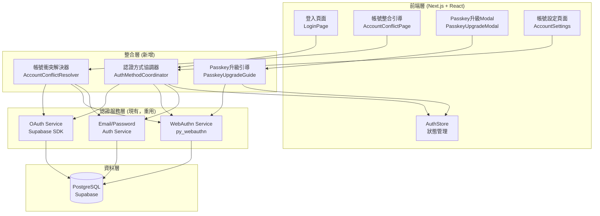
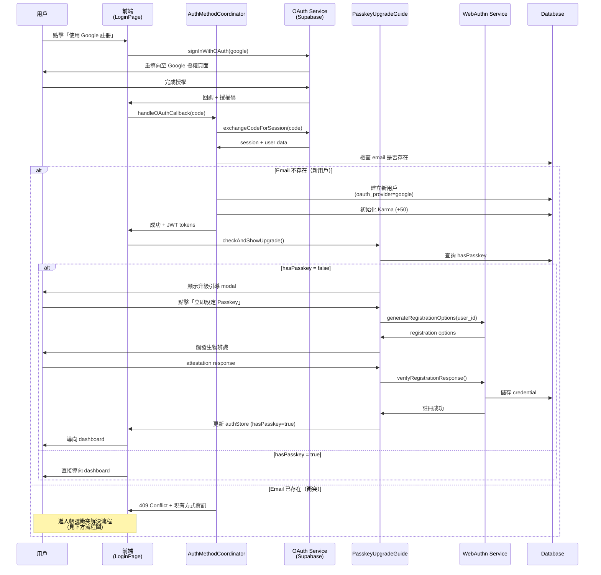
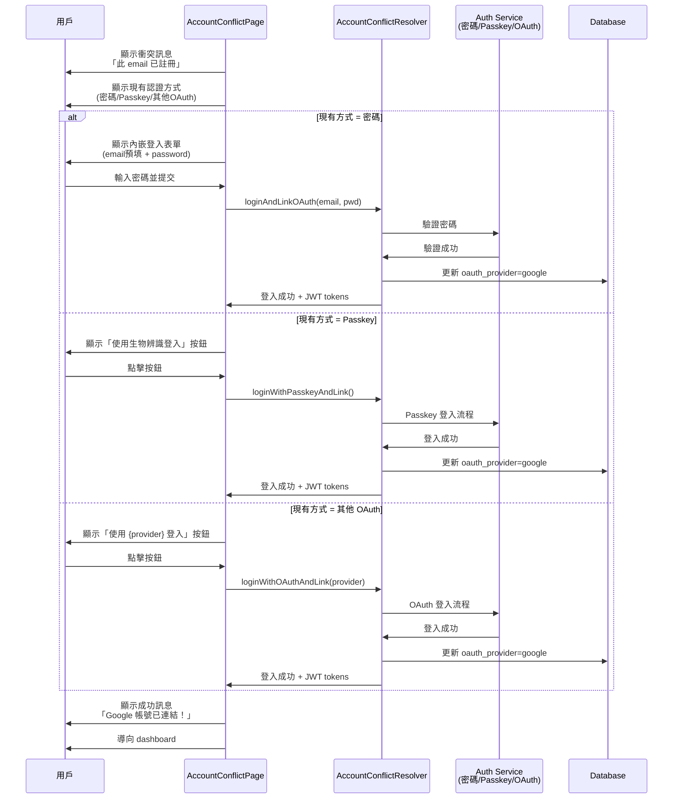
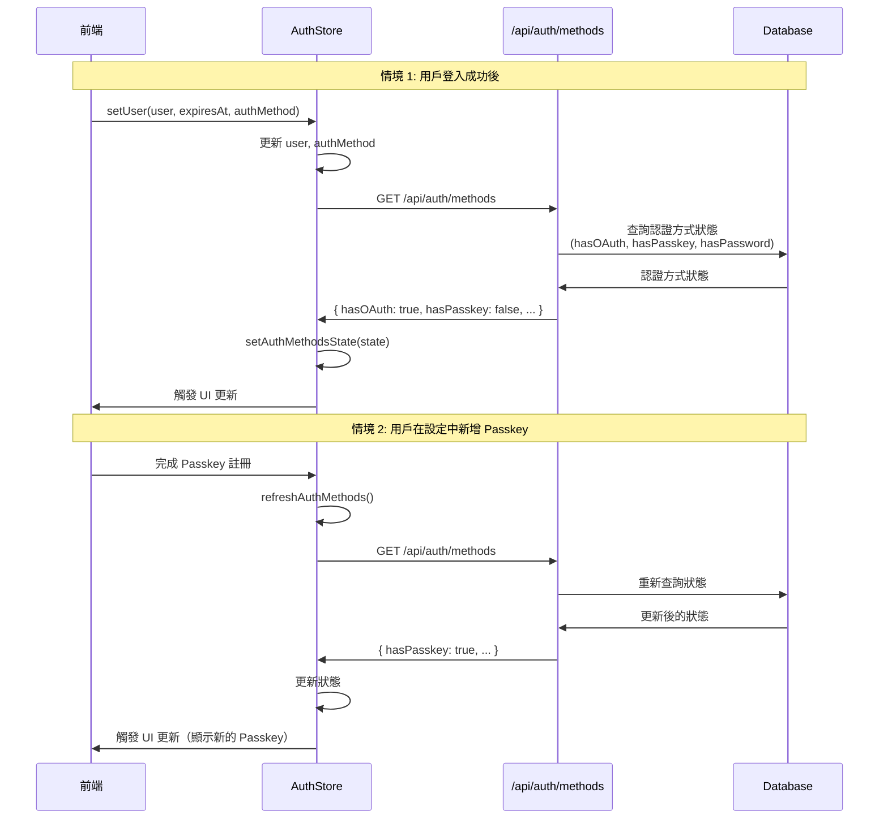
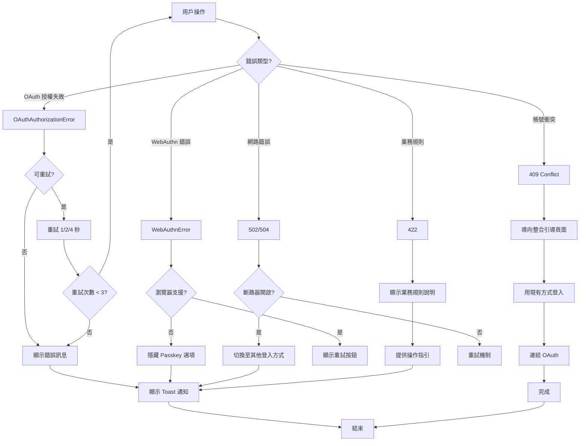
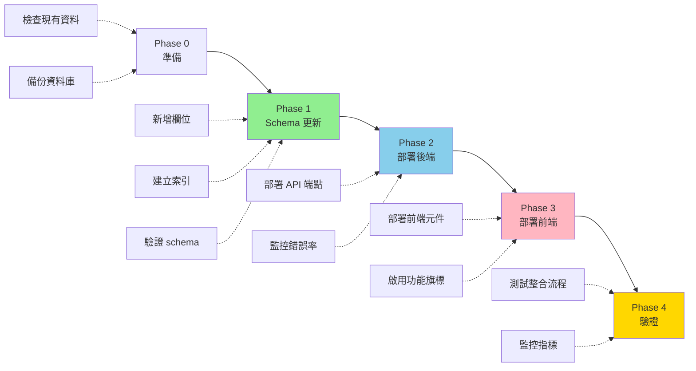

# 技術設計文件

## 概述

本功能實作 Google OAuth 與 Passkey 無密碼認證的**整合層**，建立在現有的 Supabase OAuth（`backend/app/api/oauth.py`）和 WebAuthn 服務（`backend/app/services/webauthn_service.py`）之上。此設計專注於**認證方式協調**、**升級引導流程**和**帳號衝突解決**，而非重複實作基礎認證邏輯。

**目的**：為廢土塔羅平台提供多層次認證生態系統，讓用戶可以使用 Google OAuth 快速註冊，並透過智能引導流程升級至 Passkey 生物辨識登入，同時支援三種認證方式（OAuth、Passkey、Email/密碼）和平共存。

**用戶**：
- **新用戶**：使用 Google 一鍵註冊，無需記憶密碼 → 引導升級至 Passkey
- **現有用戶**：可自由在帳號設定中新增/管理多種認證方式
- **開發者**：透過統一的認證協調層管理多認證方式邏輯

**影響**：擴展現有認證系統，透過新增整合層元件（AuthMethodCoordinator、PasskeyUpgradeGuide、AccountConflictResolver）實現跨認證方式的協調和引導，現有 OAuth 和 WebAuthn 模組保持獨立且不受影響。

### 目標

- 整合 Google OAuth 與 Passkey 認證，提供無縫的跨認證方式體驗
- 實作智能引導流程，引導 OAuth 用戶升級至 Passkey
- 解決帳號衝突問題（相同 email 使用不同認證方式註冊）
- 確保三種認證方式（OAuth、Passkey、Email/密碼）能和平共存
- 提供統一的認證狀態管理和追蹤機制

### 非目標

- 不修改現有 OAuth 和 WebAuthn 的核心邏輯（完全重用）
- 不實作 OAuth 多提供者支援（本階段僅支援 Google）
- 不實作多因素認證（MFA）（未來功能）
- 不修改現有 Email/密碼認證流程（保持獨立）

---

## 架構

### 現有架構分析

**現有認證架構**（三個獨立模組）：

1. **OAuth 認證模組**（`backend/app/api/oauth.py`）
   - 處理 Supabase OAuth 授權碼交換
   - 建立/更新 OAuth 使用者（`create_or_update_oauth_user`）
   - 產生 JWT tokens 並設定 httpOnly cookies
   - **保留**：完整重用，無需修改

2. **WebAuthn 服務模組**（`backend/app/services/webauthn_service.py`）
   - 產生 Passkey 註冊/登入選項（`generate_registration_options`）
   - 驗證 attestation/assertion responses
   - 管理 credential CRUD 操作
   - **保留**：完整重用，無需修改

3. **AuthStore 狀態管理**（`src/lib/authStore.ts`）
   - 已支援多認證方式狀態（`hasPasskey`, `hasPassword`, `hasOAuth`）
   - 已支援認證方式查詢（`refreshAuthMethods()`）
   - **擴展**：新增引導流程相關狀態管理

**現有領域邊界**：
- **認證領域**：OAuth 和 WebAuthn 為獨立子領域，不互相依賴
- **用戶管理領域**：User 模型已支援多認證方式欄位（`oauth_provider`, `webauthn_user_handle`）
- **Karma 系統領域**：獨立領域，透過事件整合

### 高階架構



**架構整合說明**：

- **現有模式保留**：OAuth、WebAuthn、Email/Password 三個認證模組保持獨立，互不依賴
- **新增元件理由**：
  - **AuthMethodCoordinator**：統一協調多認證方式的流程，避免各頁面重複邏輯
  - **AccountConflictResolver**：專門處理帳號衝突（409 Conflict），提供統一的整合引導
  - **PasskeyUpgradeGuide**：封裝 Passkey 升級引導邏輯，可在 OAuth 登入後和帳號設定中重用
- **技術對齊**：
  - 後端使用 FastAPI + SQLAlchemy（現有技術棧）
  - 前端使用 Next.js 15 App Router + React 19 + Zustand（現有技術棧）
  - 認證 Token 使用 httpOnly cookies + JWT（現有機制）
- **Steering 合規**：
  - 符合 `structure.md` 的服務層模式（Service Layer Pattern）
  - 符合 `tech.md` 的 Zustand 狀態管理原則
  - 符合 `product.md` 的漸進式體驗提升策略

---

## 技術對齊

**現有技術棧對齊**：

本功能完全對齊現有技術棧，無需引入新的技術或框架：

| 技術層 | 現有技術 | 使用方式 |
|--------|---------|---------|
| **後端框架** | FastAPI 0.104+ | 新增 API 端點（整合層） |
| **前端框架** | Next.js 15 + React 19 | 新增頁面和元件（引導流程） |
| **狀態管理** | Zustand 4.5+ | 擴展 authStore（引導狀態） |
| **OAuth 整合** | Supabase Auth SDK | 重用現有 OAuth 服務 |
| **WebAuthn 整合** | py_webauthn 2.0+ | 重用現有 WebAuthn 服務 |
| **資料庫** | PostgreSQL (Supabase) | 使用現有 User 模型欄位 |
| **認證 Token** | JWT (httpOnly cookies) | 重用現有 token 機制 |

**新增依賴項**：
- **無** - 完全重用現有依賴

**偏離現有模式的理由**：
- **無偏離** - 完全遵循現有架構模式和技術選擇

---

## 關鍵設計決策

### 決策 1：整合層架構（Integration Layer）

**決策**：在現有 OAuth 和 WebAuthn 服務之上建立輕量級整合層，而非修改現有服務。

**背景**：現有 OAuth 和 WebAuthn 服務已完整實作且獨立運作，需要一種方式讓它們協同工作而不破壞獨立性。

**替代方案**：
1. **修改現有服務**：在 OAuth/WebAuthn 服務中直接加入跨認證邏輯
2. **整合層架構**：建立新的協調層元件
3. **前端協調**：所有整合邏輯在前端處理

**選擇方案**：整合層架構（方案 2）

**運作方式**：
- **後端整合層**：`AuthMethodCoordinator` 協調 OAuth、WebAuthn、Email 三個服務
- **前端整合層**：`PasskeyUpgradeGuide`、`AccountConflictResolver` 處理引導流程
- **清晰邊界**：整合層透過公開 API 呼叫現有服務，不直接修改服務內部

**理由**：
- **關注點分離**：OAuth/WebAuthn 服務專注於各自的認證邏輯，整合層專注於協調
- **可測試性**：可以獨立測試整合邏輯，不影響現有服務的測試
- **未來擴展**：新增其他 OAuth 提供者（Facebook, Apple）時只需擴展整合層
- **向後相容**：現有使用 OAuth/WebAuthn 的功能不受影響

**取捨**：
- **優點**：低耦合、易維護、易測試、易擴展
- **缺點**：增加一層抽象（但複雜度可控）

---

### 決策 2：帳號衝突解決策略（409 Conflict + 引導頁面）

**決策**：當偵測到 email 衝突時，回傳 409 Conflict 並導向專門的引導頁面，而非自動合併帳號。

**背景**：用戶可能先用 Email/密碼註冊，後來又嘗試用 Google OAuth 登入（相同 email），需要一種安全且使用者友善的方式整合帳號。

**替代方案**：
1. **自動合併**：直接將 OAuth 資訊加入現有帳號
2. **拒絕註冊**：顯示錯誤訊息要求用密碼登入
3. **引導整合**：導向引導頁面，要求用戶先用現有方式登入再連結 OAuth

**選擇方案**：引導整合（方案 3）

**運作方式**：
1. 後端偵測 email 衝突 → 回傳 `409 Conflict` + 現有認證方式資訊
2. 前端收到 409 → 導向 `AccountConflictPage`
3. 引導頁面顯示現有認證方式 → 提供對應的登入選項
4. 用戶成功登入 → 後端自動連結 OAuth 資訊 → 完成整合

**理由**：
- **安全性**：防止帳號劫持（需要驗證用戶擁有現有帳號）
- **用戶體驗**：清楚說明情況並提供明確的操作步驟
- **靈活性**：支援各種現有認證方式（密碼、Passkey、其他 OAuth）
- **追蹤性**：可以追蹤衝突發生率和解決成功率

**取捨**：
- **優點**：安全、清楚、靈活、可追蹤
- **缺點**：多一個步驟（但對安全性至關重要）

---

### 決策 3：Passkey 升級引導時機（OAuth 登入後立即顯示）

**決策**：在 OAuth 用戶首次登入且沒有 Passkey 時，立即顯示升級引導 modal，而非延遲到後續訪問。

**背景**：希望最大化 Passkey 採用率，需要選擇最佳的引導時機。

**替代方案**：
1. **立即引導**：OAuth 登入成功後立即顯示 modal
2. **延遲引導**：在 dashboard 或帳號設定頁面顯示提示
3. **被動引導**：僅在帳號設定中提供按鈕，不主動提示

**選擇方案**：立即引導（方案 1）+ 智能重提醒機制

**運作方式**：
1. OAuth 登入成功 → 檢查 `hasPasskey` → 若為 false 則顯示引導 modal
2. 用戶點擊「稍後再說」→ 記錄 `passkey_prompt_skipped_at` 時間戳
3. 下次登入時檢查 → 若距離上次跳過超過 7 天 → 再次顯示（最多 3 次）
4. 跳過 3 次後 → 不再自動顯示（但帳號設定仍可手動新增）

**理由**：
- **最佳時機**：用戶剛完成認證，對安全性最敏感
- **轉換率**：立即引導的轉換率通常高於延遲引導
- **不打擾**：智能重提醒機制避免過度騷擾用戶
- **保留選擇權**：用戶可以選擇跳過，且隨時可在設定中新增

**取捨**：
- **優點**：高轉換率、時機佳、不過度打擾
- **缺點**：增加登入流程一個步驟（但可跳過）

---

## 系統流程

### OAuth 註冊與 Passkey 升級流程



### 帳號衝突解決流程



### 認證方式狀態同步流程



---

## 需求追溯性

| 需求 | 需求摘要 | 元件 | 介面 | 流程 |
|------|---------|------|------|------|
| 1 | Google OAuth 快速註冊 | OAuth Service, AuthMethodCoordinator | POST /api/auth/oauth/callback | OAuth 註冊流程 |
| 2 | Passkey 升級引導 | PasskeyUpgradeGuide, WebAuthn Service | PasskeyUpgradeModal | OAuth 註冊與升級流程 |
| 3 | 登入頁面整合 | LoginPage, AuthMethodCoordinator | 前端元件 API | - |
| 4 | 帳號設定管理 | AccountSettings, AuthMethodCoordinator | 前端元件 API + 後端 API | - |
| 5 | 認證狀態同步 | AuthStore, AuthMethodCoordinator | GET /api/auth/methods | 狀態同步流程 |
| 6 | Passkey 優先引導 | PasskeyUpgradeGuide | 前端元件 API | - |
| 7 | 向後相容遷移 | Database Migration | Alembic Migration | - |
| 8 | 安全性與合規 | AccountConflictResolver | 後端 API + 前端驗證 | 帳號衝突解決流程 |
| 8.5 | 帳號衝突解決 | AccountConflictResolver, AccountConflictPage | POST /api/auth/login?link_oauth=true | 帳號衝突解決流程 |
| 9 | 監控與分析 | Analytics Service | 事件追蹤 API | - |
| 10 | 錯誤處理降級 | 所有元件 | 錯誤處理機制 | - |
| 11 | Pip-Boy 風格 UX | 前端 UI 元件 | 前端元件 API | - |

---

## 元件與介面

### 整合層元件

#### AuthMethodCoordinator（後端）

**職責與邊界**
- **主要職責**：協調 OAuth、WebAuthn、Email 三種認證服務，提供統一的多認證方式管理介面
- **領域邊界**：整合層，不屬於任何特定認證子領域
- **資料擁有權**：不擁有資料，透過呼叫認證服務讀寫用戶認證狀態
- **交易邊界**：不直接管理交易，由各認證服務管理各自的交易

**依賴關係**
- **入站依賴**：前端認證元件（LoginPage, AccountSettings）、API 路由層
- **出站依賴**：OAuth Service, WebAuthn Service, Email Auth Service, User Service, Karma Service
- **外部依賴**：Supabase Auth SDK（透過 OAuth Service）

**契約定義**

**服務介面**：
```python
from typing import Dict, Any, Optional, List
from enum import Enum

class AuthMethod(Enum):
    """認證方式列舉"""
    OAUTH = "oauth"
    PASSKEY = "passkey"
    PASSWORD = "password"

class AuthMethodInfo:
    """認證方式資訊"""
    has_oauth: bool
    oauth_provider: Optional[str]
    profile_picture: Optional[str]
    has_passkey: bool
    passkey_count: int
    has_password: bool

class ConflictInfo:
    """帳號衝突資訊"""
    conflict_type: str  # "existing_account"
    email: str
    existing_auth_methods: List[str]  # ["password", "oauth_google", "passkey"]
    suggested_action: str  # "login_first" or "link_account"

class AuthMethodCoordinatorService:
    """
    認證方式協調器服務

    職責：協調多種認證方式的整合邏輯
    """

    async def handle_oauth_callback(
        self,
        code: str,
        db: AsyncSession
    ) -> Dict[str, Any]:
        """
        處理 OAuth 回調並協調整合邏輯

        參數：
            code: OAuth 授權碼
            db: 資料庫 session

        回傳：
            成功：{ success: True, user: {...}, tokens: {...} }
            衝突：{ success: False, conflict: ConflictInfo }

        前置條件：
            - code 必須有效且未過期
            - Supabase OAuth 服務可用

        後置條件：
            - 成功：建立新用戶或回傳現有用戶
            - 衝突：回傳衝突資訊供前端處理

        不變量：
            - 不會自動覆蓋現有用戶的認證方式
            - JWT tokens 必須包含認證方式資訊
        """
        pass

    async def get_auth_methods(
        self,
        user_id: UUID,
        db: AsyncSession
    ) -> AuthMethodInfo:
        """
        查詢用戶的所有認證方式狀態

        參數：
            user_id: 用戶 ID
            db: 資料庫 session

        回傳：
            AuthMethodInfo 物件

        前置條件：
            - user_id 必須存在

        後置條件：
            - 回傳完整的認證方式資訊
        """
        pass

    async def link_oauth_to_existing_account(
        self,
        user_id: UUID,
        oauth_provider: str,
        oauth_id: str,
        profile_picture: Optional[str],
        db: AsyncSession
    ) -> bool:
        """
        將 OAuth 資訊連結至現有帳號

        參數：
            user_id: 用戶 ID
            oauth_provider: OAuth 提供者（google）
            oauth_id: OAuth 提供者的使用者 ID
            profile_picture: 頭像 URL
            db: 資料庫 session

        回傳：
            True: 連結成功
            False: 連結失敗

        前置條件：
            - 用戶必須已登入（已驗證 user_id）
            - oauth_provider 和 oauth_id 不能為 NULL

        後置條件：
            - users 表的 oauth_provider 和 oauth_id 欄位已更新
            - JWT tokens 需要重新產生（包含 has_oauth=true）

        不變量：
            - 不能覆蓋已存在的 OAuth 連結（若 oauth_provider 已設定）
        """
        pass
```

**前置條件**：
- 所有方法要求資料庫 session 已建立
- OAuth 相關方法要求 Supabase 服務可用

**後置條件**：
- `handle_oauth_callback`：成功則回傳用戶資訊和 tokens，衝突則回傳衝突資訊
- `get_auth_methods`：回傳完整且一致的認證方式狀態
- `link_oauth_to_existing_account`：成功連結後 OAuth 資訊已寫入資料庫

**不變量**：
- 永遠不會自動覆蓋現有認證方式（需用戶明確操作）
- JWT tokens 永遠包含正確的認證方式標記

---

#### PasskeyUpgradeGuide（前端）

**職責與邊界**
- **主要職責**：管理 Passkey 升級引導流程，包含 modal 顯示、WebAuthn 註冊呼叫、狀態追蹤
- **領域邊界**：認證引導子領域
- **資料擁有權**：管理引導狀態（已顯示次數、上次跳過時間）
- **交易邊界**：前端狀態管理，無交易概念

**依賴關係**
- **入站依賴**：LoginPage（OAuth 登入後）、AccountSettings（手動觸發）
- **出站依賴**：WebAuthn Service API（`/api/webauthn/*`）、AuthStore
- **外部依賴**：瀏覽器 WebAuthn API（`navigator.credentials`）

**契約定義**

**React Hook 介面**：
```typescript
interface PasskeyUpgradeGuideState {
  // 狀態
  isModalVisible: boolean
  isRegistering: boolean
  error: string | null
  skipCount: number
  lastSkippedAt: string | null

  // 動作
  checkAndShowUpgrade: () => Promise<void>
  startRegistration: () => Promise<void>
  skipUpgrade: () => void
  closeModal: () => void
}

interface PasskeyUpgradeGuideProps {
  userId: string
  email: string
  name: string
  onSuccess?: () => void
  onSkip?: () => void
}

export function usePasskeyUpgradeGuide(
  props: PasskeyUpgradeGuideProps
): PasskeyUpgradeGuideState {
  /**
   * Passkey 升級引導 Hook
   *
   * 功能：
   * - 檢查是否應顯示引導（基於 hasPasskey 和 skipCount）
   * - 管理 modal 顯示/隱藏
   * - 處理 WebAuthn 註冊流程
   * - 追蹤跳過次數和時間
   *
   * 智能提醒邏輯：
   * - skipCount < 3 且距離上次跳過超過 7 天 → 再次顯示
   * - skipCount >= 3 → 永久不再自動顯示
   *
   * 前置條件：
   * - userId, email, name 必須有效
   * - AuthStore 已初始化
   *
   * 後置條件：
   * - 註冊成功：authStore.hasPasskey = true
   * - 跳過：skipCount +1, lastSkippedAt 更新
   *
   * 不變量：
   * - skipCount 只增不減
   * - modal 顯示時 isModalVisible = true
   */
  // Implementation...
}
```

**前置條件**：
- 用戶必須已登入（有效的 userId）
- AuthStore 必須已初始化
- 瀏覽器必須支援 WebAuthn API（或有降級處理）

**後置條件**：
- `checkAndShowUpgrade`：根據規則決定是否顯示 modal
- `startRegistration`：成功則更新 authStore.hasPasskey，失敗則顯示錯誤
- `skipUpgrade`：更新 skipCount 和 lastSkippedAt

**不變量**：
- skipCount 只增不減（持久化至 localStorage）
- 同一時間只能有一個 modal 顯示

---

#### AccountConflictResolver（前後端整合）

**職責與邊界**
- **主要職責**：處理帳號衝突解決流程，協調前端引導頁面和後端帳號連結邏輯
- **領域邊界**：認證衝突解決子領域
- **資料擁有權**：不擁有資料，透過認證服務讀寫用戶狀態
- **交易邊界**：後端部分參與用戶更新交易

**依賴關係**
- **入站依賴**：AccountConflictPage（前端）、OAuth callback 處理器
- **出站依賴**：Email Auth Service, WebAuthn Service, OAuth Service
- **外部依賴**：無

**契約定義**

**API 契約**：

| 方法 | 端點 | 請求 | 回應 | 錯誤 |
|------|------|-----|------|------|
| POST | /api/auth/login | LoginWithLinkRequest | LoginResponse | 400, 401, 500 |
| POST | /api/auth/passkey/login-and-link | PasskeyLoginLinkRequest | LoginResponse | 400, 401, 500 |

**請求/回應 Schema**：

```python
from pydantic import BaseModel, EmailStr

class LoginWithLinkRequest(BaseModel):
    """登入並連結 OAuth 請求"""
    email: EmailStr
    password: str
    link_oauth: bool = True
    oauth_provider: str  # "google"
    oauth_id: str
    profile_picture: Optional[str] = None

class PasskeyLoginLinkRequest(BaseModel):
    """Passkey 登入並連結 OAuth 請求"""
    assertion_response: Dict[str, Any]  # WebAuthn assertion
    link_oauth: bool = True
    oauth_provider: str
    oauth_id: str
    profile_picture: Optional[str] = None

class LoginResponse(BaseModel):
    """登入回應"""
    access_token: str
    refresh_token: str
    user: UserInfo
    token_type: str = "bearer"
    linked_oauth: bool = False  # 是否成功連結 OAuth
```

**前端元件介面**：

```typescript
interface AccountConflictPageProps {
  email: string
  existingAuthMethods: string[]  // ["password", "passkey", "oauth_facebook"]
  oauthProvider: string  // "google"
  oauthId: string
  profilePicture?: string
}

export function AccountConflictPage(
  props: AccountConflictPageProps
): React.ReactElement {
  /**
   * 帳號衝突解決頁面
   *
   * 功能：
   * - 顯示衝突訊息和現有認證方式
   * - 根據現有方式顯示對應的登入選項
   * - 處理登入並自動連結 OAuth
   *
   * 前置條件：
   * - props 必須包含完整的衝突資訊
   *
   * 後置條件：
   * - 登入成功：導向 dashboard
   * - 連結成功：顯示成功訊息
   */
  // Implementation...
}
```

**前置條件**：
- 後端：OAuth 衝突資訊必須完整（email, existing_methods, oauth_id）
- 前端：用戶必須完成現有方式的身份驗證

**後置條件**：
- 登入成功且 OAuth 連結成功
- AuthStore 狀態已更新（hasOAuth = true）
- 用戶被導向至 dashboard

**不變量**：
- 必須先驗證用戶擁有現有帳號才能連結 OAuth
- 連結成功後 users 表的 oauth_provider 和 oauth_id 必須已更新

---

### 前端 UI 元件

#### LoginPage（整合層）

**職責與邊界**
- **主要職責**：顯示登入頁面，整合三種認證方式（OAuth、Passkey、Email/密碼）
- **領域邊界**：UI 呈現層
- **資料擁有權**：管理表單狀態（email、password 輸入值）

**依賴關係**
- **入站依賴**：Next.js App Router（`/auth/login` 路由）
- **出站依賴**：AuthStore, AuthMethodCoordinator API, WebAuthn Service API
- **外部依賴**：Supabase Auth SDK（前端）, 瀏覽器 WebAuthn API

**契約定義**

**React 元件介面**：
```typescript
interface LoginPageProps {
  redirectUrl?: string  // 登入成功後導向的 URL
  showPasskeyFirst?: boolean  // 是否優先顯示 Passkey（若瀏覽器支援）
}

export default function LoginPage(
  props: LoginPageProps
): React.ReactElement {
  /**
   * 登入頁面元件
   *
   * 功能：
   * - 顯示三種認證方式選項（視覺優先級：OAuth > Passkey > Email/密碼）
   * - 處理 OAuth 流程啟動
   * - 處理 Passkey 登入流程
   * - 處理 Email/密碼登入流程
   * - 支援 WebAuthn Conditional UI（autofill）
   *
   * 狀態：
   * - emailInput: string
   * - passwordInput: string
   * - isEmailPasswordVisible: boolean  // Email/密碼區塊是否展開
   * - isLoading: boolean
   * - error: string | null
   *
   * 前置條件：
   * - AuthStore 已初始化
   *
   * 後置條件：
   * - 登入成功：導向 redirectUrl 或 dashboard
   * - OAuth 衝突：導向 AccountConflictPage
   * - Passkey 升級：顯示 PasskeyUpgradeModal
   */
  // Implementation...
}
```

**狀態管理**：
- 使用 React useState 管理本地表單狀態
- 認證狀態由 AuthStore 管理

---

### 後端 API 端點

#### GET /api/auth/methods

**職責**：查詢當前用戶的所有認證方式狀態

**API 契約**：

| 方法 | 端點 | 請求 | 回應 | 錯誤 |
|------|------|-----|------|------|
| GET | /api/auth/methods | 無 (需 JWT) | AuthMethodsResponse | 401, 500 |

**回應 Schema**：
```python
class AuthMethodsResponse(BaseModel):
    """認證方式查詢回應"""
    has_oauth: bool
    oauth_provider: Optional[str]  # "google", "facebook", etc.
    profile_picture: Optional[str]
    has_passkey: bool
    passkey_count: int
    passkey_credentials: List[CredentialInfo]  # 簡化的 credential 資訊
    has_password: bool

class CredentialInfo(BaseModel):
    """Credential 簡化資訊"""
    id: str
    name: str
    created_at: datetime
    last_used_at: Optional[datetime]
    device_type: str  # 推測的裝置類型
```

**前置條件**：
- 用戶必須已登入（有效的 JWT token）

**後置條件**：
- 回傳完整且一致的認證方式資訊

**整合策略**：
- **新增端點**：完全新的 API 端點
- **向後相容**：不影響現有 API

---

## 資料模型

### 邏輯資料模型

**User 模型擴展**（現有欄位，無需修改）：

```python
class User(BaseModel):
    """
    用戶模型（現有，已支援多認證方式）
    """
    __tablename__ = "users"

    # 基本資訊
    id: UUID
    email: str  # 唯一索引
    name: str

    # 認證方式相關欄位（已存在）
    password_hash: Optional[str]  # NULL 表示未設定密碼
    oauth_provider: Optional[str]  # "google", "facebook", etc.
    oauth_id: Optional[str]  # OAuth 提供者的 user ID
    profile_picture_url: Optional[str]  # OAuth 頭像
    webauthn_user_handle: Optional[bytes]  # Passkey user handle

    # 認證追蹤
    last_login_method: Optional[str]  # "password", "oauth_google", "passkey"

    # Passkey 引導追蹤（新增欄位）
    passkey_prompt_skipped_at: Optional[datetime]  # 上次跳過引導時間
    passkey_prompt_skip_count: int = 0  # 跳過引導次數

    # 關聯
    credentials: List[Credential]  # Passkey credentials（一對多）
```

**Credential 模型**（現有，無需修改）：

```python
class Credential(BaseModel):
    """
    WebAuthn Credential 模型（現有）
    """
    __tablename__ = "credentials"

    id: UUID
    user_id: UUID  # 外鍵 → users.id
    credential_id: str  # WebAuthn credential ID
    public_key: str
    counter: int
    transports: List[str]
    name: str  # 用戶自訂名稱（例如：「我的 iPhone」）
    created_at: datetime
    last_used_at: Optional[datetime]
    usage_count: int
```

**新增欄位說明**：

```sql
-- 新增 Passkey 引導追蹤欄位
ALTER TABLE users
ADD COLUMN passkey_prompt_skipped_at TIMESTAMP WITH TIME ZONE,
ADD COLUMN passkey_prompt_skip_count INTEGER DEFAULT 0;

-- 建立索引（選擇性，用於查詢優化）
CREATE INDEX idx_users_passkey_prompt ON users(passkey_prompt_skipped_at, passkey_prompt_skip_count);
```

---

### 資料契約與整合

**JWT Token Payload**（擴展）：

```typescript
interface JWTPayload {
  sub: string  // user_id
  email: string
  exp: number  // 過期時間
  iat: number  // 發行時間

  // 認證方式標記（新增）
  auth_method: "oauth" | "passkey" | "password"
  has_oauth: boolean
  has_passkey: boolean
  has_password: boolean
}
```

**事件 Schema**（分析追蹤）：

```typescript
interface AuthEvent {
  event_type: string
  user_id: string
  timestamp: string
  metadata: Record<string, any>
}

// 事件類型範例
interface OAuthConflictDetectedEvent extends AuthEvent {
  event_type: "oauth_account_conflict_detected"
  metadata: {
    email: string
    existing_methods: string[]  // ["password", "passkey"]
    oauth_provider: string  // "google"
  }
}

interface PasskeyUpgradePromptEvent extends AuthEvent {
  event_type: "passkey_upgrade_prompt_accepted" | "passkey_upgrade_prompt_skipped"
  metadata: {
    skip_count?: number
    source: "oauth_prompt" | "settings_manual"
  }
}
```

---

## 錯誤處理

### 錯誤策略

本功能採用**分層錯誤處理**策略，每一層負責處理特定類型的錯誤並提供適當的降級方案：

1. **後端層**：捕獲服務層錯誤，轉換為 HTTP 錯誤碼和使用者友善訊息
2. **前端層**：捕獲 API 錯誤和瀏覽器錯誤，顯示 UI 反饋並提供重試選項
3. **整合層**：處理跨服務協調錯誤，確保不會因單一服務失敗而中斷整個流程

### 錯誤分類與回應

#### 使用者錯誤（4xx）

**400 Bad Request** - 無效輸入
- **觸發條件**：缺少必要參數、格式錯誤
- **回應**：欄位級別驗證錯誤訊息
- **前端處理**：顯示具體欄位錯誤，引導用戶修正

**401 Unauthorized** - 未授權
- **觸發條件**：JWT token 無效或過期、OAuth 授權失敗
- **回應**：清楚的身份驗證錯誤訊息
- **前端處理**：清除 authStore，導向登入頁面

**409 Conflict** - 帳號衝突
- **觸發條件**：Email 已存在但使用不同認證方式註冊
- **回應**：衝突詳細資訊（email, existing_methods, suggested_action）
- **前端處理**：導向 AccountConflictPage 進行整合引導

#### 系統錯誤（5xx）

**500 Internal Server Error** - 服務層錯誤
- **觸發條件**：資料庫錯誤、服務邏輯錯誤
- **回應**：通用錯誤訊息「系統錯誤，請稍後再試」
- **前端處理**：顯示錯誤 toast，提供重試按鈕
- **降級方案**：記錄錯誤日誌，發送警報

**502 Bad Gateway** - 外部服務錯誤
- **觸發條件**：Supabase API 無法連線、OAuth 提供者錯誤
- **回應**：「Google 登入服務暫時無法使用」
- **前端處理**：隱藏 OAuth 按鈕，突出顯示其他登入方式
- **降級方案**：啟用斷路器（Circuit Breaker），暫停 OAuth 流程

**504 Gateway Timeout** - 外部服務逾時
- **觸發條件**：Supabase 授權碼交換超時（>5秒）
- **回應**：「網路連線逾時，請重試」
- **前端處理**：顯示重試按鈕，建議用戶檢查網路
- **降級方案**：重試機制（最多 3 次，間隔 1/2/4 秒）

#### 業務邏輯錯誤（422）

**422 Unprocessable Entity** - 業務規則違反
- **觸發條件**：
  - WebAuthn 不支援（瀏覽器過舊）
  - 達到最大 Passkey 數量（10 個）
  - 嘗試移除唯一認證方式
- **回應**：具體的業務規則說明
- **前端處理**：
  - WebAuthn 不支援：隱藏 Passkey 選項，顯示提示
  - 達到上限：禁用「新增 Passkey」按鈕，顯示提示
  - 唯一認證方式：阻止移除操作，顯示警告

#### 錯誤處理流程圖



### 監控與告警

**錯誤追蹤指標**：
- OAuth 授權失敗率（按提供者）
- WebAuthn 不支援率（按瀏覽器）
- 帳號衝突發生率
- 整合引導完成率
- 外部服務錯誤率

**告警閾值**：
- OAuth 失敗率 > 5%：發送警報
- Supabase 連線錯誤 > 3 次/分鐘：啟用斷路器
- 帳號衝突解決失敗率 > 20%：通知產品團隊

---

## 測試策略

### 單元測試

**後端服務層**（pytest）：

1. **AuthMethodCoordinatorService**
   - `test_handle_oauth_callback_new_user()`：新用戶註冊流程
   - `test_handle_oauth_callback_conflict_password()`：Email 衝突（現有密碼）
   - `test_handle_oauth_callback_conflict_passkey()`：Email 衝突（現有 Passkey）
   - `test_get_auth_methods_multiple()`：查詢多種認證方式
   - `test_link_oauth_success()`：OAuth 連結成功

2. **AccountConflictResolver**
   - `test_login_and_link_oauth_password()`：密碼登入並連結
   - `test_login_and_link_oauth_passkey()`：Passkey 登入並連結
   - `test_login_and_link_oauth_invalid_password()`：密碼錯誤

**前端元件層**（Jest + React Testing Library）：

1. **LoginPage**
   - `test_render_all_auth_options()`：顯示三種認證選項
   - `test_oauth_button_click()`：OAuth 按鈕點擊流程
   - `test_passkey_button_click()`：Passkey 按鈕點擊流程
   - `test_email_password_expand()`：Email/密碼區塊展開

2. **PasskeyUpgradeGuide**
   - `test_check_and_show_upgrade_first_time()`：首次顯示引導
   - `test_skip_upgrade_increment_count()`：跳過次數遞增
   - `test_skip_upgrade_max_times()`：跳過 3 次後不再顯示

3. **AccountConflictPage**
   - `test_render_conflict_info()`：顯示衝突資訊
   - `test_password_login_form()`：密碼登入表單
   - `test_passkey_login_button()`：Passkey 登入按鈕

### 整合測試

**認證流程整合**（pytest + httpx）：

1. **OAuth 註冊與 Passkey 升級完整流程**
   - 用戶使用 Google OAuth 註冊
   - 系統顯示 Passkey 升級引導
   - 用戶完成 Passkey 註冊
   - 驗證 authStore 狀態（hasOAuth=true, hasPasskey=true）

2. **帳號衝突解決完整流程**
   - 用戶先用 Email/密碼註冊
   - 用戶嘗試用 Google OAuth 登入（相同 email）
   - 系統回傳 409 Conflict
   - 用戶在引導頁面輸入密碼並登入
   - 系統自動連結 OAuth
   - 驗證 OAuth 資訊已寫入資料庫

3. **多認證方式管理流程**
   - 用戶使用 OAuth 登入
   - 用戶在帳號設定中新增 Passkey
   - 用戶在帳號設定中設定密碼
   - 驗證三種認證方式都可正常登入

### E2E 測試（Playwright）

**關鍵用戶旅程**：

1. **新用戶 Google OAuth 註冊並升級 Passkey**
   - 訪問登入頁面
   - 點擊「使用 Google 登入」
   - 完成 Google 授權（模擬）
   - 看到 Passkey 升級引導 modal
   - 點擊「立即設定 Passkey」
   - 完成生物辨識（模擬）
   - 成功導向 dashboard

2. **帳號衝突解決（密碼登入並連結）**
   - 已有 Email/密碼帳號
   - 嘗試用 Google OAuth 登入（相同 email）
   - 看到帳號整合引導頁面
   - 輸入密碼並提交
   - 看到「Google 帳號已連結」成功訊息
   - 導向 dashboard

3. **多認證方式登入切換**
   - 用戶擁有 OAuth + Passkey + 密碼
   - 使用 OAuth 登入 → 登出
   - 使用 Passkey 登入 → 登出
   - 使用 Email/密碼登入
   - 驗證三種方式都可成功

### 效能測試

**API 效能基準**（pytest-benchmark）：

1. **GET /api/auth/methods**
   - 目標：<500ms（包含資料庫查詢）
   - 測試場景：用戶有 5 個 Passkey credentials

2. **POST /api/auth/oauth/callback**
   - 目標：<3 秒（包含 Supabase API 呼叫）
   - 測試場景：新用戶註冊 + Karma 初始化

3. **POST /api/auth/login?link_oauth=true**
   - 目標：<1.5 秒（包含密碼驗證 + OAuth 連結）
   - 測試場景：現有用戶登入並連結 OAuth

---

## 安全性考量

### 威脅建模

**威脅 1：帳號劫持（Account Takeover）**

- **攻擊向量**：攻擊者嘗試用受害者的 email 進行 OAuth 註冊，企圖覆蓋現有帳號
- **安全控制**：
  - 偵測到 email 衝突時回傳 409 Conflict（不自動合併）
  - 要求用戶先用現有方式登入才能連結 OAuth
  - 記錄所有認證方式變更事件（audit log）
- **合規要求**：符合 OWASP Top 10 的身份認證最佳實踐

**威脅 2：OAuth CSRF 攻擊**

- **攻擊向量**：攻擊者誘使受害者點擊惡意 OAuth 回調連結
- **安全控制**：
  - 使用 Supabase OAuth state 參數驗證（CSRF token）
  - 驗證 OAuth 回調 origin 正確性
  - 確保 OAuth 回調 URL 在白名單中
- **合規要求**：符合 OAuth 2.0 安全最佳實踐（RFC 6819）

**威脅 3：WebAuthn Credential 複製攻擊**

- **攻擊向量**：攻擊者複製受害者的 Passkey credential 並嘗試重放
- **安全控制**：
  - 驗證 counter 值（必須遞增，由 WebAuthn Service 處理）
  - 偵測到 counter 異常時記錄安全警報
  - 可選擇性阻擋異常的 credential
- **合規要求**：符合 FIDO2/WebAuthn 規範

### 認證與授權模式

**JWT Token 管理**：
- **儲存方式**：httpOnly cookies（防止 XSS 攻擊）
- **過期時間**：access_token 30 分鐘，refresh_token 7 天
- **Token Payload**：包含認證方式標記（`auth_method`, `has_oauth`, etc.）
- **刷新機制**：token 過期前自動刷新（前端 AuthStore 負責）

**認證方式變更追蹤**：
- 記錄所有認證方式變更（新增、移除、連結）
- 包含：操作類型、時間戳、IP 地址、User Agent
- 用於安全稽核和異常偵測

**多認證方式安全規則**：
- 至少保留一種認證方式（防止帳號鎖定）
- OAuth email 必須與帳號 email 一致（連結時）
- 短時間內多次認證方式變更觸發安全警報

### 資料保護

**敏感資料處理**：
- **OAuth Token**：不儲存 OAuth access token（僅用於用戶資料提取）
- **Passkey Credential**：public_key 和 credential_id 儲存於資料庫，private key 由用戶裝置保管
- **密碼**：bcrypt 加密（cost factor >= 12）

**隱私合規**：
- 用戶可查看所有已連結的認證方式
- 用戶可隨時移除認證方式（需保留至少一種）
- OAuth profile_picture 儲存為 URL，不複製圖片

---

## 效能與可擴展性

### 目標效能指標

| 操作 | 目標時間 | 測量方式 |
|------|---------|---------|
| OAuth 登入（含 Supabase 呼叫）| <3 秒 | 後端 API 回應時間 |
| Passkey 登入 | <1.5 秒 | 後端 API 回應時間 |
| GET /api/auth/methods | <500ms | 後端 API 回應時間 |
| Passkey 升級引導顯示 | <200ms | 前端 modal 渲染時間 |
| 帳號衝突頁面載入 | <1 秒 | 前端頁面 FCP |

### 可擴展性策略

**水平擴展**：
- **無狀態設計**：所有認證狀態儲存於 JWT token 或資料庫，後端 API 完全無狀態
- **資料庫連線池**：使用 SQLAlchemy 連線池（pool_size=20, max_overflow=0）
- **Supabase 自動擴展**：Supabase 平台提供自動擴展

**快取策略**：
- **GET /api/auth/methods**：
  - 快取策略：短期快取（5 分鐘）
  - 快取失效：認證方式變更時立即失效
  - 實作方式：前端 SWR 快取（stale-while-revalidate）

**資料庫優化**：
- **索引設計**：
  - `users.email`：唯一索引（已存在）
  - `users.oauth_provider, users.oauth_id`：複合索引（已存在）
  - `credentials.user_id`：外鍵索引（已存在）
  - `users.passkey_prompt_skipped_at, users.passkey_prompt_skip_count`：選擇性索引（新增）

---

## 遷移策略

### 資料庫遷移階段



**Phase 0：準備階段**
1. 檢查現有 users 表結構（確認 oauth_provider, oauth_id, webauthn_user_handle 欄位已存在）
2. 備份 Supabase 資料庫
3. 準備 rollback 腳本

**Phase 1：Schema 更新**
```sql
-- Alembic migration: add_passkey_prompt_tracking
BEGIN;

-- 新增 Passkey 引導追蹤欄位
ALTER TABLE users
ADD COLUMN IF NOT EXISTS passkey_prompt_skipped_at TIMESTAMP WITH TIME ZONE,
ADD COLUMN IF NOT EXISTS passkey_prompt_skip_count INTEGER DEFAULT 0;

-- 建立索引（選擇性）
CREATE INDEX IF NOT EXISTS idx_users_passkey_prompt
ON users(passkey_prompt_skipped_at, passkey_prompt_skip_count)
WHERE passkey_prompt_skip_count < 3;

-- 驗證欄位已建立
DO $$
BEGIN
    IF NOT EXISTS (
        SELECT 1 FROM information_schema.columns
        WHERE table_name='users' AND column_name='passkey_prompt_skipped_at'
    ) THEN
        RAISE EXCEPTION 'Migration failed: passkey_prompt_skipped_at not created';
    END IF;
END $$;

COMMIT;
```

**Rollback 腳本**：
```sql
BEGIN;

-- 移除索引
DROP INDEX IF EXISTS idx_users_passkey_prompt;

-- 移除欄位
ALTER TABLE users
DROP COLUMN IF EXISTS passkey_prompt_skipped_at,
DROP COLUMN IF EXISTS passkey_prompt_skip_count;

COMMIT;
```

**Phase 2：後端部署**
1. 部署新的 API 端點（`/api/auth/methods`, `/api/auth/login?link_oauth=true`）
2. 部署 AuthMethodCoordinator 和 AccountConflictResolver
3. 監控 API 錯誤率（目標：<1%）

**Phase 3：前端部署**
1. 部署新的前端元件（LoginPage 更新、AccountConflictPage、PasskeyUpgradeModal）
2. 使用功能旗標段階段啟用（先 10% 用戶，再 50%，最後 100%）
3. 監控前端錯誤率和用戶行為

**Phase 4：驗證階段**
1. 測試關鍵用戶旅程（E2E 測試）
2. 監控指標：
   - OAuth 註冊成功率
   - Passkey 升級轉換率
   - 帳號衝突解決成功率
3. 收集用戶反饋

### 驗證檢查點

| 階段 | 檢查點 | 成功標準 | Rollback 觸發條件 |
|------|--------|---------|-------------------|
| Phase 1 | Schema 部署 | migration 成功執行 | migration 失敗 |
| Phase 2 | 後端 API | 錯誤率 <1%, 回應時間 <3s | 錯誤率 >5% 或回應時間 >5s |
| Phase 3 | 前端部署 | 前端錯誤率 <1%, 功能正常運作 | 前端錯誤率 >5% |
| Phase 4 | 整合驗證 | E2E 測試通過率 >95% | 測試通過率 <80% |

### Rollback 觸發條件

**立即 Rollback**：
- 資料庫 migration 失敗
- 後端 API 錯誤率 >10%
- 前端嚴重錯誤（白屏、無法登入）

**計劃 Rollback**：
- 後端 API 錯誤率 5-10%（持續 15 分鐘）
- Passkey 升級成功率 <20%（可能是引導流程問題）
- 帳號衝突解決失敗率 >50%

**Rollback 步驟**：
1. 停用功能旗標（前端）
2. Rollback 後端部署（前一版本）
3. Rollback 資料庫 migration（執行 rollback 腳本）
4. 驗證系統恢復正常
5. 分析失敗原因並修正

---

## 附錄

### 技術名詞對照表

| 英文 | 繁體中文 | 說明 |
|------|---------|------|
| Integration Layer | 整合層 | 協調多個認證服務的抽象層 |
| Account Conflict | 帳號衝突 | 相同 email 使用不同認證方式註冊 |
| Passkey Upgrade | Passkey 升級 | 從 OAuth 升級至 Passkey 認證 |
| Conditional UI | Conditional UI | WebAuthn 的 autofill 功能 |
| Circuit Breaker | 斷路器 | 防止外部服務錯誤擴散的機制 |
| JWT Payload | JWT Token 內容 | JWT token 中包含的資料 |

### 相關文件參考

- `.kiro/specs/passkey-authentication/requirements.md` - Passkey 認證需求
- `.kiro/specs/supabase-oauth-integration/requirements.md` - OAuth 整合需求
- `backend/app/api/oauth.py` - 現有 OAuth 實作
- `backend/app/services/webauthn_service.py` - 現有 WebAuthn 服務
- `src/lib/authStore.ts` - 現有認證狀態管理

### 設計變更記錄

| 版本 | 日期 | 變更內容 | 理由 |
|------|------|---------|------|
| 1.0 | 2025-10-28 | 初始設計 | 需求文件已批准 |
