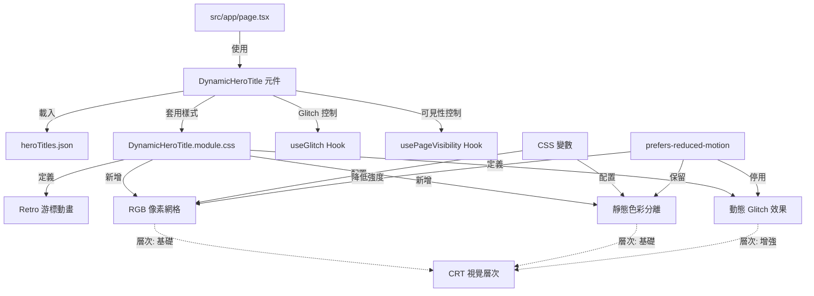
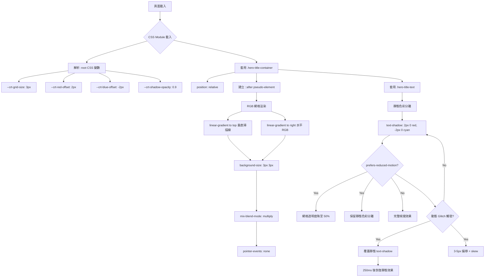
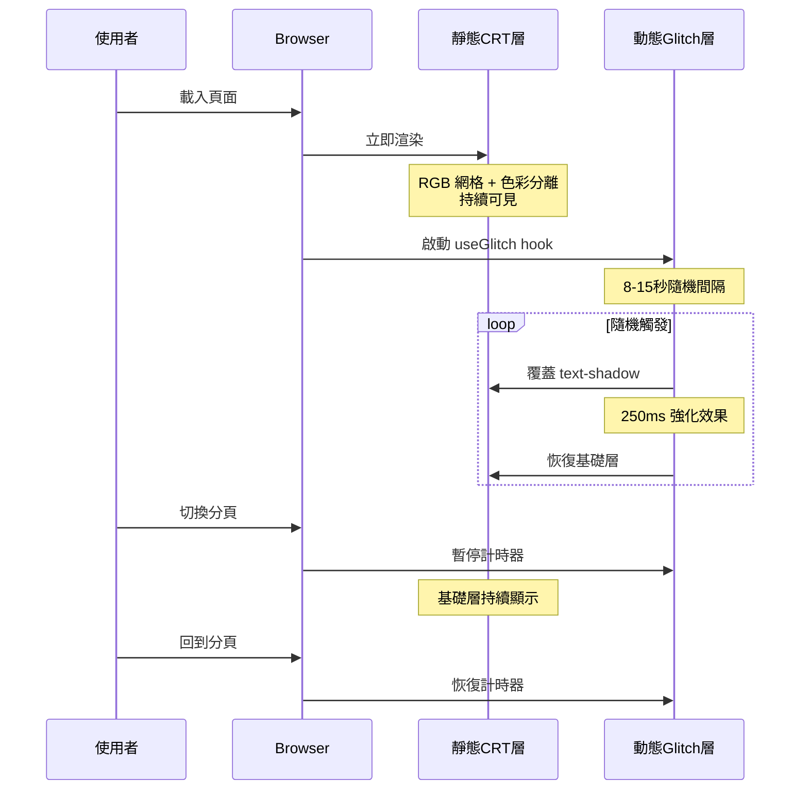

# 技術設計文件

## Overview

本設計為首頁 Hero Section 的動態標題系統新增完整的 CRT 螢幕視覺特效，包含 RGB 像素網格疊加與靜態色彩分離效果。這些效果將與現有的打字機動畫、閃爍游標和動態 glitch 效果整合，創造出完整的 Pip-Boy 終端機復古美學體驗。設計重點在於純 CSS 實現以確保效果立即可見，同時維持良好的跨瀏覽器相容性與無障礙支援。

**目標使用者**: Fallout 粉絲與追求復古美學的網站訪客，他們將在首次進入網站時體驗到沉浸式的廢土終端機氛圍。

**系統影響**: 這是對現有 `DynamicHeroTitle` 元件的視覺增強，不會改變核心動畫邏輯或資料流程。所有新增的 CRT 效果透過 CSS Module 與 CSS 變數實現，確保與現有程式碼的最小耦合。

### Goals

- 透過 RGB 像素網格與靜態色彩分離效果，強化 Pip-Boy 終端機的復古視覺質感
- 確保 CRT 效果在頁面載入時立即可見（純 CSS 實現，無需 JavaScript 初始化）
- 建立清晰的視覺效果層次：靜態 CRT（基礎層） + 動態 glitch（增強層）
- 提供 CSS 變數架構以便未來調校與主題切換
- 維持 WCAG 2.1 AA 無障礙標準（對比度 ≥ 4.5:1）

### Non-Goals

- 不實現 CRT 曲面螢幕效果（curved screen distortion）
- 不新增即時可調整的視覺特效控制介面
- 不修改現有的打字機動畫或輪播邏輯
- 不實現動態解析度調整或像素網格縮放

## Architecture

### Existing Architecture Analysis

當前 `DynamicHeroTitle` 元件的架構：

```
DynamicHeroTitle.tsx (主元件)
├── 狀態管理: useState (titles, currentIndex, phase, displayText)
├── 動畫控制: requestAnimationFrame (打字/刪除動畫)
├── 視覺特效: useGlitch hook (動態 glitch)
├── 資源管理: usePageVisibility hook (分頁暫停)
└── 樣式系統: DynamicHeroTitle.module.css
    ├── Retro 閃爍游標 (.typing-cursor-inline)
    ├── Colour Shift Glitch (.hero-title-glitching)
    └── 無障礙支援 (@media prefers-reduced-motion)
```

**現有模式保留**:
- CSS Module 架構：所有視覺特效透過 `.module.css` 管理
- CSS 變數系統：現有 Tailwind 設定使用 `--color-pip-boy-green-*`
- 無障礙優先：`prefers-reduced-motion` 支援
- 效能優化：`requestAnimationFrame` + Page Visibility API

**新增 CRT 效果整合點**:
1. CSS Module 新增 CRT 相關樣式類別
2. CSS 變數擴充以支援 CRT 參數調校
3. 主標題容器新增 `position: relative` 以承載 `::after` 網格疊加層

### High-Level Architecture



### Technology Alignment

本功能完全遵循現有技術棧，無需引入新的依賴：

**前端技術對齊**:
- **框架**: Next.js 15 App Router（已使用）
- **樣式**: Tailwind CSS v4 + CSS Module（已使用）
- **動畫**: 純 CSS `@keyframes`（已使用於游標與 glitch）
- **類型**: TypeScript 5（已使用）

**新增樣式技術**:
- `linear-gradient` 組合（垂直掃描線 + 水平 RGB 子像素）
- `mix-blend-mode: multiply`（網格與文字融合）
- `text-shadow` 雙層陰影（靜態色彩分離）
- CSS 變數擴充（`--crt-*` 參數系列）

### Key Design Decisions

#### 決策 1: 純 CSS 實現 vs. JavaScript 控制的 RGB 網格

**Context**: RGB 像素網格需要在頁面載入時立即可見，且效果應持續存在（不是動畫）。

**Alternatives**:
1. **純 CSS `::after` + `background-image`**（選擇）
   - 使用 `::after` pseudo-element 創建全覆蓋疊加層
   - 雙 `linear-gradient` 組合生成 3px × 3px 網格
   - `mix-blend-mode: multiply` 混合

2. JavaScript Canvas 動態渲染
   - 使用 `<canvas>` 元素繪製像素網格
   - 需要 `useEffect` 初始化，增加首屏延遲

3. SVG Pattern + Filter
   - 使用 SVG `<pattern>` 定義網格
   - 需要額外的 SVG 檔案或內嵌 SVG

**Selected Approach**: 純 CSS `::after` + `linear-gradient`

**Rationale**:
- **即時可見**: 無需 JavaScript 初始化，頁面載入時效果立即呈現
- **效能優勢**: 瀏覽器原生 CSS 渲染，GPU 加速
- **維護簡潔**: 所有樣式集中於 CSS Module，無需額外元件邏輯
- **跨瀏覽器**: `linear-gradient` 與 `::after` 支援廣泛

**Trade-offs**:
- ✅ 獲得：零 JavaScript 開銷、立即可見、簡潔實現
- ❌ 犧牲：無法動態調整網格密度（需要重新編譯 CSS）
- ⚖️ 平衡：使用 CSS 變數 `--crt-grid-size` 在編譯時可調，滿足 95% 需求場景

#### 決策 2: 靜態色彩分離（基礎層）vs. 僅使用動態 Glitch

**Context**: 目前有動態 glitch 效果（8-15秒隨機觸發），是否需要額外的靜態色彩分離作為基礎層？

**Alternatives**:
1. **雙層架構：靜態基礎 + 動態增強**（選擇）
   - 靜態: `text-shadow` 持續存在（2px 偏移，0.9 透明度）
   - 動態: 觸發時覆蓋靜態效果（3-5px 偏移，變化透明度）

2. 僅保留動態 glitch
   - 移除靜態色彩分離，只在觸發時顯示效果

3. 將靜態色彩分離整合進 RGB 網格
   - 使用更複雜的 `background-image` 組合

**Selected Approach**: 雙層架構（靜態 + 動態）

**Rationale**:
- **持續的視覺質感**: 靜態層確保隨時都有 CRT 風格，而非只在 glitch 觸發時
- **層次分明**: 基礎層（subtle, 0.9 opacity）+ 增強層（dramatic, 0.6-0.9 opacity）創造豐富視覺
- **降級優雅**: `prefers-reduced-motion` 可選擇性停用動態層，保留靜態層
- **符合 CRT 物理特性**: 真實 CRT 螢幕的色差是持續存在的，故障閃爍是偶發的

**Trade-offs**:
- ✅ 獲得：更豐富的視覺層次、更真實的 CRT 模擬、更好的降級體驗
- ❌ 犧牲：額外的 `text-shadow` 渲染成本（微量）
- ⚖️ 平衡：現代瀏覽器的 `text-shadow` 效能優異，成本可忽略

#### 決策 3: CSS 變數管理 vs. Hardcoded 數值

**Context**: RGB 網格尺寸（3px）、色彩分離偏移（2px）等參數未來可能需要調校。

**Alternatives**:
1. **CSS 變數架構**（選擇）
   - 定義 `--crt-grid-size`, `--crt-red-offset`, `--crt-blue-offset`, `--crt-shadow-opacity`
   - 在 `:root` 或元件層級設定預設值

2. Hardcoded CSS 數值
   - 直接在樣式規則中使用 `3px`, `2px` 等固定值

3. Tailwind Utility Classes
   - 擴充 Tailwind 配置新增 CRT 相關 utilities

**Selected Approach**: CSS 變數架構

**Rationale**:
- **未來調校**: 無需重新編譯即可在瀏覽器 DevTools 中調整參數
- **主題切換**: 支援未來可能的多主題系統（如「綠色 Pip-Boy」vs「琥珀色終端機」）
- **一致性**: 與現有 `--color-pip-boy-green-*` 變數系統保持一致
- **文檔價值**: CSS 變數名稱自我說明，提升程式碼可讀性

**Trade-offs**:
- ✅ 獲得：靈活性、可維護性、主題支援、自我文檔化
- ❌ 犧牲：額外的 CSS 變數宣告（約 10 行）
- ⚖️ 平衡：成本微小，收益顯著

## System Flows

### CRT 效果渲染流程



### 視覺效果層次協作流程



## Requirements Traceability

| Requirement | 需求摘要 | 元件 | 介面 | 流程 |
|-------------|---------|------|------|------|
| **7.1 - 7.8** | RGB 像素網格疊加 | `.hero-title-container::after` | CSS `background-image`, `mix-blend-mode` | CRT 效果渲染流程 |
| **7.9 - 7.16** | 靜態色彩分離（基礎層） | `.hero-title-text` | CSS `text-shadow` | 視覺效果層次協作流程 |
| **7.17 - 7.26** | 效果組合與調校 | CSS 變數系統 | `--crt-grid-size`, `--crt-*-offset` | CRT 效果渲染流程 |

**說明**: Requirement 7 的所有驗收條件透過純 CSS 實現，無需新增 React 元件或 hooks。現有 `DynamicHeroTitle` 元件的 JSX 結構保持不變，僅在 CSS Module 中新增樣式類別。

## Components and Interfaces

### 前端元件層

#### DynamicHeroTitle 元件（修改）

**Responsibility & Boundaries**
- **Primary Responsibility**: 整合 CRT 視覺效果與現有打字機動畫、glitch 效果
- **Domain Boundary**: Hero Section 視覺呈現層
- **Data Ownership**: 不擁有資料，僅消費 `heroTitles.json`
- **Transaction Boundary**: 無需交易管理（純前端視覺元件）

**Dependencies**
- **Inbound**: `src/app/page.tsx`（頁面元件使用）
- **Outbound**:
  - `DynamicHeroTitle.module.css`（樣式定義）
  - `useGlitch`（動態 glitch 控制）
  - `usePageVisibility`（分頁可見性）
- **External**: 無外部依賴

**Contract Definition**

**Component Interface**:
```typescript
export interface DynamicHeroTitleProps {
  defaultIndex?: number;
  autoPlay?: boolean;
  typingSpeed?: number;
  deletingSpeed?: number;
  waitBeforeDelete?: number;
  testMode?: boolean;
}

// 不新增 Props，CRT 效果透過 CSS 自動套用
export function DynamicHeroTitle(props: DynamicHeroTitleProps): JSX.Element;
```

**State Management**:
- **無需新增狀態**: CRT 效果為純 CSS 實現，不需要額外的 React state
- **現有狀態保持不變**:
  - `titles`, `currentIndex`, `phase`（動畫控制）
  - `displayTitle`, `displaySubtitle`, `displayDescription`（顯示文字）
  - `isGlitching`（動態 glitch，由 `useGlitch` 管理）

**Integration Strategy**:
- **Modification Approach**: 擴展現有 CSS Module，新增 `.hero-title-container` 與 `.hero-title-text` 類別
- **Backward Compatibility**:
  - 現有樣式類別（`.typing-cursor-inline`, `.hero-title-glitching`）保持不變
  - 新增類別不影響現有動畫邏輯
- **Migration Path**:
  1. 新增 CSS 變數定義
  2. 新增 CRT 相關樣式類別
  3. 在 JSX 中套用新類別（無需修改邏輯）

### 樣式層

#### DynamicHeroTitle.module.css（擴充）

**Responsibility & Boundaries**
- **Primary Responsibility**: 定義所有 Hero 標題的視覺特效樣式
- **Domain Boundary**: 視覺呈現層（CSS only）
- **Data Ownership**: CSS 變數預設值、動畫關鍵影格定義

**Contract Definition**

**CSS Variables Interface**:
```css
:root {
  /* 現有變數（Tailwind 定義） */
  --color-pip-boy-green: #00ff41;
  --color-pip-boy-green-10: rgba(0, 255, 65, 0.1);
  --color-pip-boy-green-20: rgba(0, 255, 65, 0.2);
  /* ... */

  /* 新增 CRT 參數變數 */
  --crt-grid-size: 3px;
  --crt-red-offset: 2px;
  --crt-blue-offset: -2px;
  --crt-shadow-opacity: 0.9;
  --crt-grid-opacity-vertical: 0.2;
  --crt-grid-opacity-horizontal: 0.7;
}
```

**Style Classes Interface**:
```css
/* 新增樣式類別 */
.hero-title-container {
  position: relative;
  /* 承載 ::after 網格疊加層 */
}

.hero-title-container::after {
  /* RGB 像素網格疊加層 */
  content: '';
  position: absolute;
  top: 0; right: 0; bottom: 0; left: 0;

  /* 雙 linear-gradient 組合 */
  background-image:
    linear-gradient(to top, /* 垂直掃描線 */
      rgba(255, 255, 255, var(--crt-grid-opacity-vertical)) 0%,
      rgba(255, 255, 255, calc(var(--crt-grid-opacity-vertical) * 2)) 33.33%,
      rgba(255, 255, 255, calc(var(--crt-grid-opacity-vertical) * 2)) 66.67%,
      rgba(255, 255, 255, calc(var(--crt-grid-opacity-vertical) * 3)) 100%
    ),
    linear-gradient(to right, /* 水平 RGB 子像素 */
      rgba(255, 0, 0, var(--crt-grid-opacity-horizontal)) 0%,
      rgba(255, 0, 0, var(--crt-grid-opacity-horizontal)) 33.33%,
      rgba(0, 255, 0, var(--crt-grid-opacity-horizontal)) 33.33%,
      rgba(0, 255, 0, var(--crt-grid-opacity-horizontal)) 66.67%,
      rgba(0, 0, 255, var(--crt-grid-opacity-horizontal)) 66.67%,
      rgba(0, 0, 255, var(--crt-grid-opacity-horizontal)) 100%
    );

  background-size: var(--crt-grid-size) var(--crt-grid-size);
  background-repeat: repeat;
  mix-blend-mode: multiply;
  pointer-events: none;
  z-index: 1;
}

.hero-title-text {
  /* 靜態色彩分離（基礎層） */
  text-shadow:
    var(--crt-red-offset) 0 0 rgba(255, 0, 0, var(--crt-shadow-opacity)),
    var(--crt-blue-offset) 0 0 rgba(0, 0, 255, var(--crt-shadow-opacity));

  position: relative;
  z-index: 2; /* 確保文字在網格之上 */
}

/* 副標題與描述段落：較弱的色彩分離 */
.hero-subtitle-text,
.hero-description-text {
  text-shadow:
    var(--crt-red-offset) 0 0 rgba(255, 0, 0, calc(var(--crt-shadow-opacity) * 0.5)),
    var(--crt-blue-offset) 0 0 rgba(0, 0, 255, calc(var(--crt-shadow-opacity) * 0.5));

  position: relative;
  z-index: 2;
}

/* 無障礙支援：prefers-reduced-motion */
@media (prefers-reduced-motion: reduce) {
  .hero-title-container::after {
    /* 降低網格透明度至 50% */
    --crt-grid-opacity-vertical: 0.1;
    --crt-grid-opacity-horizontal: 0.35;
  }

  /* 保留靜態色彩分離，但停用動態 glitch */
  .hero-title-glitching {
    animation: none !important;
    /* 恢復靜態 text-shadow（由 .hero-title-text 提供） */
  }
}

/* 瀏覽器降級：不支援 mix-blend-mode */
@supports not (mix-blend-mode: multiply) {
  .hero-title-container::after {
    display: none; /* 隱藏網格，僅保留色彩分離 */
  }
}
```

**Preconditions**:
- HTML 結構中標題容器必須套用 `.hero-title-container` 類別
- 主標題元素必須套用 `.hero-title-text` 類別

**Postconditions**:
- RGB 網格立即渲染於標題容器上方
- 靜態色彩分離效果作用於所有標題文字
- 動態 glitch 觸發時可正確覆蓋靜態效果

**Invariants**:
- 網格疊加層永遠不干擾文字選取（`pointer-events: none`）
- z-index 層次永遠維持：網格（1） < 文字（2）

## Data Models

### CSS 變數資料結構

**Domain Model**: CRT 視覺參數配置

本功能不涉及複雜的業務資料模型，所有配置透過 CSS 變數管理：

```typescript
// 型別定義（僅用於文檔說明，非實際程式碼）
interface CRTVisualConfig {
  /** RGB 網格尺寸（像素） */
  gridSize: string;       // "3px"

  /** 色彩分離偏移 */
  redOffset: string;      // "2px"
  blueOffset: string;     // "-2px"

  /** 陰影透明度 */
  shadowOpacity: number;  // 0.9

  /** 網格透明度 */
  gridOpacityVertical: number;    // 0.2
  gridOpacityHorizontal: number;  // 0.7
}
```

**Physical Data Model**: CSS Custom Properties

實際實現透過 CSS 變數：

```css
:root {
  --crt-grid-size: 3px;
  --crt-red-offset: 2px;
  --crt-blue-offset: -2px;
  --crt-shadow-opacity: 0.9;
  --crt-grid-opacity-vertical: 0.2;
  --crt-grid-opacity-horizontal: 0.7;
}
```

**Data Contracts**:
- 所有 CSS 變數使用 kebab-case 命名
- 尺寸變數使用 `px` 單位（支援瀏覽器計算）
- 透明度變數使用 0-1 數值範圍
- 變數命名遵循 `--crt-{category}-{property}` 模式

## Error Handling

### Error Strategy

CRT 視覺特效為純 CSS 實現，錯誤處理策略基於**優雅降級（Graceful Degradation）**：

1. **瀏覽器相容性錯誤** → 使用 `@supports` 查詢自動降級
2. **CSS 解析錯誤** → 瀏覽器自動忽略無效屬性，保留基礎樣式
3. **效能問題** → `prefers-reduced-motion` 降低效果強度

### Error Categories and Responses

**Browser Errors（瀏覽器不支援）**:
- **`mix-blend-mode` 不支援** → 隱藏 RGB 網格，保留色彩分離
  ```css
  @supports not (mix-blend-mode: multiply) {
    .hero-title-container::after {
      display: none;
    }
  }
  ```

- **CSS Variables 不支援** → 使用 fallback 固定值
  ```css
  .hero-title-container::after {
    background-size: 3px 3px; /* fallback */
    background-size: var(--crt-grid-size) var(--crt-grid-size);
  }
  ```

**User Errors（使用者偏好）**:
- **`prefers-reduced-motion: reduce`** → 降低網格強度，保留靜態色彩分離
  ```css
  @media (prefers-reduced-motion: reduce) {
    --crt-grid-opacity-vertical: 0.1;
    --crt-grid-opacity-horizontal: 0.35;
  }
  ```

**System Errors（渲染異常）**:
- **Safari `mix-blend-mode` 渲染異常** → 透過跨瀏覽器測試階段驗證
- **高 DPI 螢幕網格模糊** → 維持 `3px` 固定尺寸（已驗證在 Retina 螢幕清晰）

### Monitoring

- **視覺回歸測試**: 使用 Playwright 截圖比對驗證 CRT 效果正確渲染
- **效能監控**: 使用 Chrome DevTools Performance 面板驗證 `text-shadow` 與 `background-image` 不影響 FPS
- **無障礙驗證**: 使用 axe DevTools 驗證對比度符合 WCAG AA（≥ 4.5:1）

## Testing Strategy

### Unit Tests（CSS 視覺測試）

**測試範圍**: CSS Module 樣式類別定義正確性

1. **CSS 變數預設值驗證**
   - 驗證 `:root` 定義了所有 `--crt-*` 變數
   - 驗證數值範圍正確（如 `--crt-shadow-opacity` 介於 0-1）

2. **樣式類別存在性測試**
   - `.hero-title-container`、`.hero-title-text` 類別定義存在
   - `::after` pseudo-element 樣式定義存在

3. **降級邏輯測試**
   - `@supports not (mix-blend-mode: multiply)` 規則定義存在
   - `@media (prefers-reduced-motion: reduce)` 規則定義存在

**工具**: Jest + CSS Module mock

```typescript
// 範例測試
describe('DynamicHeroTitle.module.css', () => {
  it('應定義所有 CRT CSS 變數', () => {
    const styles = require('./DynamicHeroTitle.module.css');
    expect(styles['hero-title-container']).toBeDefined();
    expect(styles['hero-title-text']).toBeDefined();
  });
});
```

### Integration Tests（元件視覺整合）

**測試範圍**: CRT 效果與現有動畫協作正確性

1. **靜態與動態效果層次測試**
   - 驗證靜態 `text-shadow` 在非 glitch 狀態下可見
   - 驗證動態 glitch 觸發時覆蓋靜態效果
   - 驗證 glitch 結束後恢復靜態效果

2. **RGB 網格渲染測試**
   - 驗證 `::after` 元素存在於 DOM
   - 驗證 `background-image` 包含兩個 `linear-gradient`
   - 驗證 `mix-blend-mode: multiply` 正確套用

3. **輪播切換測試**
   - 驗證輪播切換時 CRT 效果持續可見（不中斷）
   - 驗證新標題載入時 RGB 網格自動套用

**工具**: React Testing Library

```typescript
// 範例測試
describe('DynamicHeroTitle CRT Effects', () => {
  it('應在標題容器上套用 RGB 網格', () => {
    render(<DynamicHeroTitle />);
    const container = screen.getByRole('heading').closest('.hero-title-container');

    const afterElement = window.getComputedStyle(container, '::after');
    expect(afterElement.backgroundImage).toContain('linear-gradient');
    expect(afterElement.mixBlendMode).toBe('multiply');
  });
});
```

### E2E Tests（端到端視覺驗證）

**測試範圍**: 真實瀏覽器環境視覺呈現

1. **跨瀏覽器 CRT 效果渲染**
   - Chrome: 驗證 RGB 網格與色彩分離正確顯示
   - Firefox: 驗證 `mix-blend-mode` 正確融合
   - Safari: 驗證無渲染異常（已知相容性問題）
   - Edge: 驗證與 Chrome 一致性

2. **無障礙模式測試**
   - 啟用 `prefers-reduced-motion` 後驗證網格透明度降低
   - 驗證對比度仍符合 WCAG AA（≥ 4.5:1）

3. **行動裝置渲染**
   - 驗證 `3px` 網格在 Retina 螢幕清晰可見
   - 驗證觸控滾動時 CRT 效果不閃爍

**工具**: Playwright + 視覺回歸測試

```typescript
// 範例測試
test('CRT 效果在 Chrome 正確渲染', async ({ page }) => {
  await page.goto('/');

  const heroTitle = page.locator('h1').first();

  // 截圖比對
  await expect(heroTitle).toHaveScreenshot('crt-effect-chrome.png', {
    maxDiffPixels: 100,
  });

  // 驗證 CSS 屬性
  const textShadow = await heroTitle.evaluate(el =>
    window.getComputedStyle(el).textShadow
  );
  expect(textShadow).toContain('rgb(255, 0, 0)');
  expect(textShadow).toContain('rgb(0, 0, 255)');
});
```

### Performance Tests（效能基準測試）

**測試範圍**: CRT 效果對頁面效能影響

1. **First Contentful Paint (FCP)**
   - 目標: <1.5s
   - 驗證 CRT 效果不增加首屏渲染時間（純 CSS 無延遲）

2. **Frame Rate (FPS)**
   - 目標: ≥60 FPS
   - 驗證打字動畫 + CRT 效果同時執行時 FPS 穩定
   - 驗證動態 glitch 觸發時 FPS 不低於 55

3. **Paint 次數**
   - 驗證 RGB 網格不觸發額外 repaint（使用 `will-change` 優化）
   - 驗證 `text-shadow` 變化僅影響文字層

**工具**: Lighthouse + Chrome DevTools Performance

```typescript
// 範例測試
test('CRT 效果不影響頁面效能', async ({ page }) => {
  const metrics = await page.evaluate(() => {
    return new Promise(resolve => {
      const observer = new PerformanceObserver(list => {
        const entries = list.getEntries();
        resolve({
          fcp: entries.find(e => e.name === 'first-contentful-paint')?.startTime,
        });
      });
      observer.observe({ entryTypes: ['paint'] });
    });
  });

  expect(metrics.fcp).toBeLessThan(1500);
});
```

## Security Considerations

**本功能無安全風險評估需求**，原因如下：

1. **純 CSS 實現**: 無 JavaScript 邏輯，無 XSS 攻擊面
2. **無使用者輸入**: CRT 參數由 CSS 變數硬編碼，無動態注入風險
3. **無外部資源**: 不載入外部圖片或字型，無 CORS 或 CSP 問題
4. **無資料傳輸**: 不涉及 API 請求或資料存儲

**隱私保護**:
- `prefers-reduced-motion` 檢測為瀏覽器原生 API，不傳送資料至伺服器
- 無使用者行為追蹤或分析

## Performance & Scalability

### Target Metrics

| 指標 | 目標值 | 測量方法 |
|------|--------|---------|
| FCP (First Contentful Paint) | <1.5s | Lighthouse |
| LCP (Largest Contentful Paint) | <2.5s | Lighthouse |
| FPS (Frame Rate) | ≥60 | Chrome DevTools Performance |
| CLS (Cumulative Layout Shift) | <0.1 | Lighthouse |
| 額外 CSS 大小 | <2KB | Webpack Bundle Analyzer |

### Scaling Approaches

**水平擴展**（不適用）:
- CRT 效果為純前端視覺，無需後端資源

**垂直擴展**（瀏覽器效能最佳化）:
1. **GPU 加速**:
   - 使用 `will-change: text-shadow` 提示瀏覽器優化
   - 使用 `transform: translateZ(0)` 強制 GPU 加速（如需）

2. **減少 Repaint**:
   - RGB 網格使用 `position: absolute` 脫離文檔流
   - 靜態 `text-shadow` 不觸發 reflow

3. **降低複雜度**:
   - 限制 `linear-gradient` 色階數量（最多 4 個）
   - 避免使用 blur 模糊效果（高成本）

### Caching Strategies

- **CSS Module 快取**: Webpack 生成的 CSS 檔案包含 hash，永久快取
- **瀏覽器渲染快取**: `text-shadow` 與 `background-image` 由瀏覽器自動快取於 GPU 記憶體

### Optimization Techniques

1. **Critical CSS**: CRT 相關樣式內嵌於 `<head>` 確保首屏可見
2. **Lazy Loading**: 無需延遲載入（CRT 效果為核心視覺，必須立即呈現）
3. **Code Splitting**: CSS Module 自動與元件一同分割載入

---

**最後更新**: 2025-10-09
**版本**: 2.0.0 (新增 Requirement 7: CRT 螢幕視覺特效)
