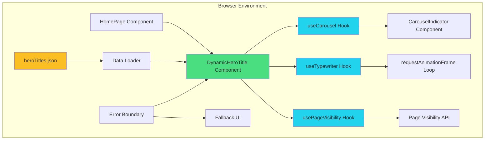
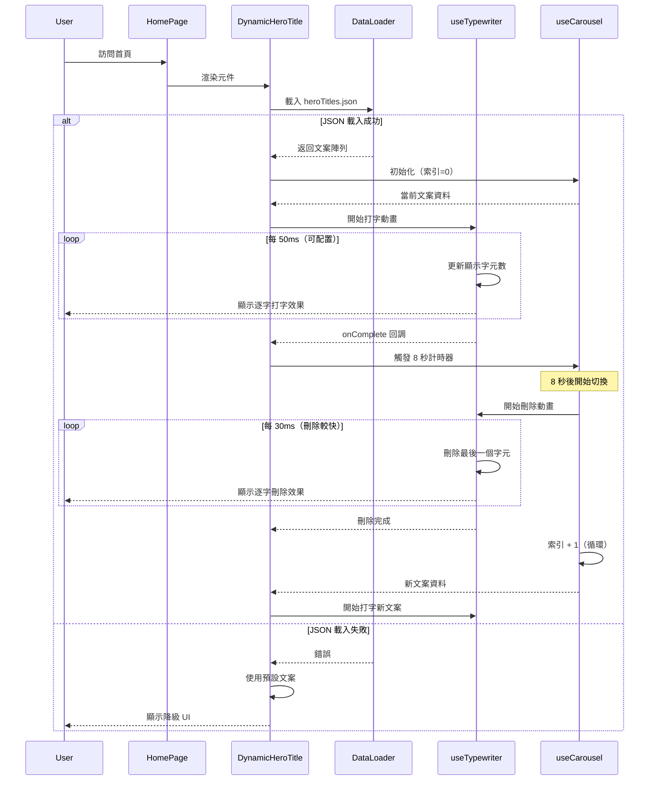
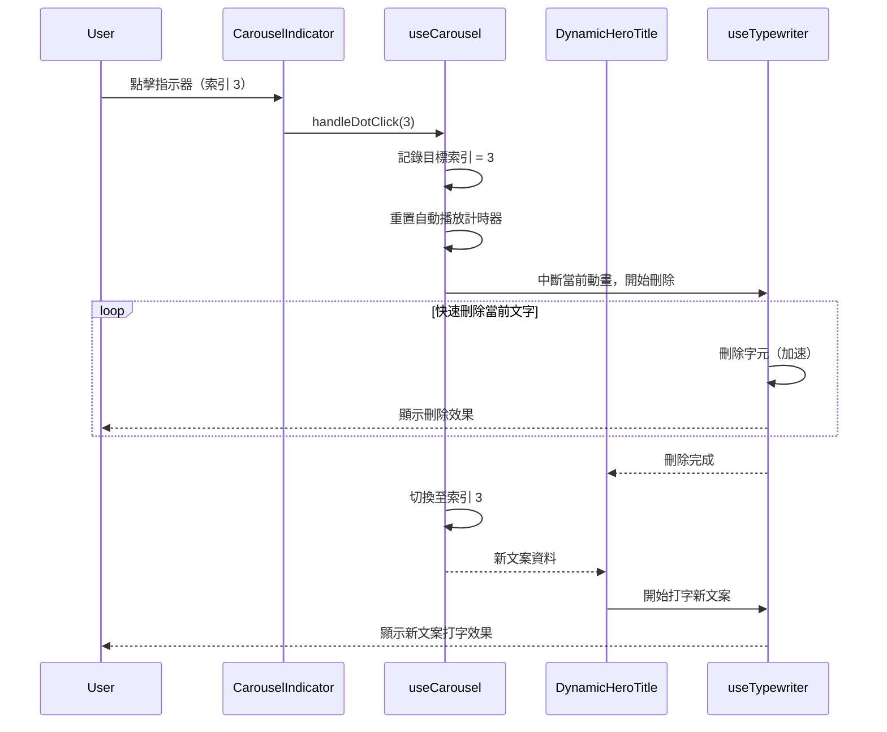
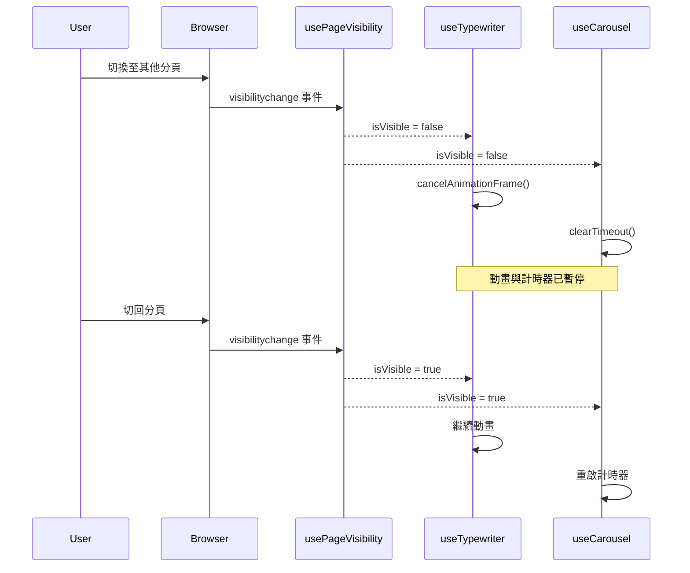

# Technical Design

## Overview

本技術設計文件定義首頁 Hero Section 動態標題系統的完整技術架構。系統採用純前端實作，透過自訂 React hooks 管理打字動畫、輪播邏輯與狀態管理，並整合 Page Visibility API 確保效能優化。核心設計理念為：**最小化依賴、最大化效能、完全可控**。

### 設計核心原則

1. **零外部動畫庫依賴**：使用 `requestAnimationFrame` 與 React hooks 實作自訂打字動畫，避免引入額外套件
2. **終端機擬真體驗**：文案切換時先「反向刪除」每個字元，再開始打下一組文字，模擬真實終端機行為
3. **效能優先**：利用 `useRef` 避免不必要的 re-render，全程使用 `requestAnimationFrame` 動畫
4. **可測試性**：清楚分離邏輯（hooks）與呈現（components），便於單元測試
5. **無障礙至上**：完整的 ARIA 屬性支援與鍵盤導航

### 研究背景與技術決策

基於 2025 年 React 動畫最佳實踐研究：

**打字動畫實作策略**：
- 使用 `requestAnimationFrame` 而非 `setInterval`，確保動畫與瀏覽器 repaint 同步，達到流暢的 60 FPS
- 使用 `useRef` 儲存動畫狀態，避免頻繁的 React re-render 導致效能下降
- 參考來源：[Performant animations with requestAnimationFrame() and React hooks](https://layonez.medium.com/performant-animations-with-requestanimationframe-and-react-hooks-99a32c5c9fbf)

**輪播控制機制**：
- 整合 Page Visibility API 檢測分頁切換，在背景分頁時暫停動畫節省資源
- 實作互動偵測（滑鼠移動、觸控）以暫停自動輪播，提升使用者體驗
- 參考來源：[Harnessing the Page Visibility API with React](https://blog.sethcorker.com/harnessing-the-page-visibility-api-with-react/)

## Requirements Mapping

### Design Component Traceability

每個設計元件對應的需求追蹤：

| 設計元件 | 對應需求 | 說明 |
|---------|---------|------|
| **`heroTitles.json`** | Req 1.1-1.7 | JSON 資料結構與文案管理 |
| **`useTypewriter` Hook** | Req 2.1-2.9, 3.3 | 打字機動畫核心邏輯（打字與刪除） |
| **`useCarousel` Hook** | Req 3.1-3.11 | 輪播控制、自動播放、互動暫停 |
| **`usePageVisibility` Hook** | Req 3.10-3.11, 6.3 | 分頁可見性偵測 |
| **`DynamicHeroTitle` Component** | Req 4.1-4.10 | 主要 UI 元件，視覺整合 |
| **`CarouselIndicator` Component** | Req 3.4-3.6, 5.3-5.8 | 輪播指示器，無障礙支援 |
| **TypeScript Interfaces** | Req 1.3 | 型別安全與資料驗證 |
| **Error Boundary** | Req 1.7, 5.10 | 錯誤處理與降級體驗 |
| **Performance Monitoring** | Req 6.1-6.8 | 效能監控與優化 |

### User Story Coverage

**User Story 1（系統管理員 - 文案管理）**：
- 技術實作：`heroTitles.json` 檔案 + TypeScript interface 驗證
- 工具支援：VS Code JSON schema 驗證，開發模式下的 console 警告

**User Story 2（網站訪客 - 打字動畫體驗）**：
- 技術實作：`useTypewriter` hook + `requestAnimationFrame` 動畫迴圈
- 動畫模式：typing（打字）與 deleting（刪除）雙向動畫
- 無障礙支援：`prefers-reduced-motion` 偵測，`aria-live` 即時更新

**User Story 3（網站訪客 - 輪播體驗）**：
- 技術實作：`useCarousel` hook + 自動播放計時器 + 打字刪除過渡
- 切換流程：完整文案 → 逐字刪除 → 清空 → 逐字打字新文案
- 互動控制：滑鼠/觸控事件監聽，Page Visibility API 整合

**User Story 4（產品設計師 - 視覺一致性）**：
- 技術實作：保留現有 Tailwind 樣式類別，無侵入式整合
- 視覺保證：繼承 `pip-boy-green` CSS 變數，維持掃描線效果

**User Story 5（無障礙使用者 - 輔助技術支援）**：
- 技術實作：完整 ARIA 屬性、鍵盤事件處理
- 測試工具：axe-core 自動化檢測，手動鍵盤導航驗證

**User Story 6（效能工程師 - 資源管理）**：
- 技術實作：`useEffect` cleanup、`cancelAnimationFrame`、記憶體快取
- 監控工具：React DevTools Profiler、瀏覽器 Performance tab

## Architecture

### System Architecture



### Technology Stack

基於 requirements.md 技術約束與專案現有架構：

- **Framework**: Next.js 15.1.7 (App Router) - 已存在於專案
- **Language**: TypeScript 5 - 嚴格模式，完整型別註解
- **Runtime**: Bun - 用於開發與套件管理
- **Styling**: Tailwind CSS v4 - 使用現有 Pip-Boy 主題變數
- **Animation**: 自訂 `requestAnimationFrame` 實作（零外部庫）
- **State Management**: React hooks（useState, useRef, useEffect）
- **Testing**: Jest + React Testing Library

### Architecture Decision Rationale

**為何不使用 reactbits.dev text-type 元件？**
- **決策**：自訂實作打字動畫
- **理由**：
  1. reactbits.dev 缺乏清晰的 npm 套件與文檔（WebFetch 未找到詳細 API）
  2. 需要精確控制動畫生命週期（onAnimationComplete、暫停/恢復）
  3. 自訂實作可完全掌控效能與行為，避免黑盒依賴
  4. 程式碼量少（<100 行），維護成本低
- **參考**：Motion.dev Typewriter 元件僅 1.3KB，自訂實作複雜度相當

**為何使用 `useRef` 而非 `useState` 儲存動畫狀態？**
- **決策**：使用 `useRef` 追蹤動畫幀 ID 與當前字元索引
- **理由**：
  1. 動畫每幀更新不需觸發 React re-render（60 FPS = 每秒 60 次更新）
  2. 避免 state 更新導致的效能瓶頸
  3. 只在動畫完成時更新 state 觸發 UI 變化
- **參考**：[React Animation Best Practices 2025](https://layonez.medium.com/performant-animations-with-requestanimationframe-and-react-hooks-99a32c5c9fbf)

**為何整合 Page Visibility API？**
- **決策**：使用 `document.visibilityState` 偵測分頁切換
- **理由**：
  1. 需求 3.10 明確要求背景分頁暫停動畫
  2. 節省使用者裝置資源（CPU、電池）
  3. 標準 Web API，所有現代瀏覽器支援
- **參考**：[MDN Page Visibility API](https://developer.mozilla.org/en-US/docs/Web/API/Page_Visibility_API)

**為何使用打字刪除效果而非 CSS 淡出切換？**
- **決策**：文案切換時使用「反向打字刪除」效果，而非單純的淡入淡出
- **理由**：
  1. 更符合 Pip-Boy 終端機的真實使用體驗
  2. 視覺上更具吸引力，強化互動感
  3. 統一使用 `requestAnimationFrame` 動畫，程式碼架構一致
  4. 符合 Fallout 世界觀的「復古未來主義」美學
- **實作**：typing → deleting → typing next（三階段動畫循環）

### Data Flow

#### Primary User Flow: 頁面載入與首次動畫



#### User Flow: 手動切換文案



#### User Flow: 分頁切換暫停/恢復



## Components and Interfaces

### Frontend Component Hierarchy

```
HomePage (src/app/page.tsx)
└── DynamicHeroTitle (新增)
    ├── TypewriterText (內部子元件)
    │   └── TerminalCursor (內部子元件)
    └── CarouselIndicator (新增)
```

### Component Specifications

#### 1. DynamicHeroTitle Component

**責任**：
- 載入與管理文案資料
- 協調 useTypewriter 與 useCarousel hooks
- 管理動畫生命週期（打字 → 停留 → 刪除 → 切換 → 打字）
- 處理錯誤狀態與降級 UI
- 整合無障礙屬性

**Props**：
```typescript
interface DynamicHeroTitleProps {
  /** 預設顯示的文案索引 */
  defaultIndex?: number;
  /** 是否啟用自動輪播（預設 true） */
  autoPlay?: boolean;
  /** 自動輪播間隔時間（毫秒，預設 8000） */
  autoPlayInterval?: number;
  /** 打字速度（毫秒/字元，預設 50） */
  typingSpeed?: number;
  /** 測試模式：跳過動畫直接顯示（預設 false） */
  testMode?: boolean;
}
```

**State**：
```typescript
interface DynamicHeroTitleState {
  titles: HeroTitle[];           // 所有文案
  currentIndex: number;          // 當前索引
  isLoading: boolean;            // 載入狀態
  error: Error | null;           // 錯誤狀態
  isAnimating: boolean;          // 動畫執行中
}
```

#### 2. CarouselIndicator Component

**責任**：
- 顯示輪播指示器（dots）
- 處理點擊與鍵盤事件
- 提供無障礙屬性

**Props**：
```typescript
interface CarouselIndicatorProps {
  /** 文案總數 */
  totalCount: number;
  /** 當前索引 */
  currentIndex: number;
  /** 點擊回調 */
  onDotClick: (index: number) => void;
  /** 是否顯示（單一文案時隱藏） */
  visible: boolean;
}
```

**Accessibility Features**：
- `role="tablist"` on container
- `role="tab"` on each dot
- `aria-label="第 X 組文案，共 Y 組"`
- `aria-current="true"` on active dot
- `tabIndex={0}` for keyboard focus
- `onKeyDown` handler for Enter/Space keys

### Custom Hooks

#### 1. useTypewriter Hook

**目的**：管理打字機動畫邏輯（包含打字與刪除）

**API**：
```typescript
function useTypewriter(options: UseTypewriterOptions): UseTypewriterReturn {
  // Implementation
}

interface UseTypewriterOptions {
  text: string;                    // 要顯示的文字
  typingSpeed?: number;            // 打字速度（ms/字元，預設 50）
  deletingSpeed?: number;          // 刪除速度（ms/字元，預設 30，較快）
  onTypingComplete?: () => void;   // 打字完成回調
  onDeletingComplete?: () => void; // 刪除完成回調
  enabled?: boolean;               // 是否啟用動畫
  prefersReducedMotion?: boolean;  // 無障礙：減少動畫
  mode?: 'typing' | 'deleting';    // 動畫模式
}

interface UseTypewriterReturn {
  displayText: string;           // 當前顯示的文字
  isAnimating: boolean;          // 是否正在執行動畫
  animationMode: 'typing' | 'deleting' | 'idle';  // 當前動畫模式
  progress: number;              // 進度（0-1）
  startTyping: () => void;       // 開始打字
  startDeleting: () => void;     // 開始刪除
  reset: () => void;             // 重置動畫
  pause: () => void;             // 暫停動畫
  resume: () => void;            // 恢復動畫
}
```

**核心實作邏輯**：
```typescript
// 使用 useRef 避免 re-render
const charIndexRef = useRef(0);
const animationFrameIdRef = useRef<number | null>(null);
const lastTimestampRef = useRef<number>(0);
const [animationMode, setAnimationMode] = useState<'typing' | 'deleting' | 'idle'>('idle');

// 統一的 requestAnimationFrame 動畫迴圈
const animate = useCallback((timestamp: number) => {
  const currentSpeed = animationMode === 'typing' ? typingSpeed : deletingSpeed;

  if (timestamp - lastTimestampRef.current >= currentSpeed) {
    if (animationMode === 'typing') {
      // 打字模式：逐字增加
      if (charIndexRef.current < text.length) {
        charIndexRef.current++;
        setDisplayText(text.slice(0, charIndexRef.current));
        lastTimestampRef.current = timestamp;
      } else {
        // 打字完成
        setAnimationMode('idle');
        onTypingComplete?.();
        return;
      }
    } else if (animationMode === 'deleting') {
      // 刪除模式：逐字減少
      if (charIndexRef.current > 0) {
        charIndexRef.current--;
        setDisplayText(text.slice(0, charIndexRef.current));
        lastTimestampRef.current = timestamp;
      } else {
        // 刪除完成
        setAnimationMode('idle');
        onDeletingComplete?.();
        return;
      }
    }
  }

  animationFrameIdRef.current = requestAnimationFrame(animate);
}, [text, typingSpeed, deletingSpeed, animationMode, onTypingComplete, onDeletingComplete]);

// 開始打字
const startTyping = useCallback(() => {
  charIndexRef.current = 0;
  setAnimationMode('typing');
  setDisplayText('');
  animationFrameIdRef.current = requestAnimationFrame(animate);
}, [animate]);

// 開始刪除
const startDeleting = useCallback(() => {
  charIndexRef.current = displayText.length;
  setAnimationMode('deleting');
  animationFrameIdRef.current = requestAnimationFrame(animate);
}, [animate, displayText]);

// Cleanup
useEffect(() => {
  return () => {
    if (animationFrameIdRef.current) {
      cancelAnimationFrame(animationFrameIdRef.current);
    }
  };
}, []);
```

#### 2. useCarousel Hook

**目的**：管理輪播邏輯、自動播放、互動偵測

**API**：
```typescript
function useCarousel(options: UseCarouselOptions): UseCarouselReturn {
  // Implementation
}

interface UseCarouselOptions {
  totalCount: number;           // 文案總數
  autoPlay?: boolean;           // 自動播放
  interval?: number;            // 間隔時間（ms）
  pauseOnInteraction?: boolean; // 互動時暫停
  onIndexChange?: (index: number) => void; // 索引變更回調
}

interface UseCarouselReturn {
  currentIndex: number;         // 當前索引
  goToIndex: (index: number) => void;  // 跳轉至指定索引
  next: () => void;             // 下一個
  previous: () => void;         // 上一個
  pause: () => void;            // 暫停自動播放
  resume: () => void;           // 恢復自動播放
  isPlaying: boolean;           // 是否正在播放
}
```

**互動暫停邏輯**：
```typescript
// 監聽滑鼠移動與觸控事件
useEffect(() => {
  if (!pauseOnInteraction) return;

  let interactionTimeout: NodeJS.Timeout;

  const handleInteraction = () => {
    pause();
    clearTimeout(interactionTimeout);
    // 5 秒後恢復
    interactionTimeout = setTimeout(() => resume(), 5000);
  };

  window.addEventListener('mousemove', handleInteraction);
  window.addEventListener('touchstart', handleInteraction);

  return () => {
    window.removeEventListener('mousemove', handleInteraction);
    window.removeEventListener('touchstart', handleInteraction);
    clearTimeout(interactionTimeout);
  };
}, [pauseOnInteraction, pause, resume]);
```

#### 3. usePageVisibility Hook

**目的**：偵測頁面可見性狀態

**API**：
```typescript
function usePageVisibility(): boolean {
  const [isVisible, setIsVisible] = useState(true);

  useEffect(() => {
    const handleVisibilityChange = () => {
      setIsVisible(document.visibilityState === 'visible');
    };

    document.addEventListener('visibilitychange', handleVisibilityChange);

    return () => {
      document.removeEventListener('visibilitychange', handleVisibilityChange);
    };
  }, []);

  return isVisible;
}
```

## Data Models

### Domain Entities

1. **HeroTitle**: 單一文案配置
2. **HeroTitlesCollection**: 所有文案集合（JSON 根物件）

### TypeScript Interface Definitions

```typescript
/**
 * 單一 Hero Section 文案配置
 */
interface HeroTitle {
  /** 唯一識別碼 */
  id: string;
  /** 主標題（打字動畫） */
  title: string;
  /** 副標題（立即顯示） */
  subtitle: string;
  /** 描述段落（淡入顯示） */
  description: string;
  /** 是否啟用此文案 */
  enabled: boolean;
}

/**
 * 文案集合（JSON 根結構）
 */
interface HeroTitlesCollection {
  /** 版本號（用於未來相容性） */
  version: string;
  /** 文案陣列 */
  titles: HeroTitle[];
  /** 預設配置 */
  defaultConfig?: {
    /** 預設打字速度 */
    typingSpeed?: number;
    /** 預設輪播間隔 */
    autoPlayInterval?: number;
  };
}

/**
 * 降級預設文案（當 JSON 載入失敗時）
 */
const FALLBACK_TITLE: HeroTitle = {
  id: 'fallback-0',
  title: '玄學的盡頭是科學™',
  subtitle: '由 Nuka-Cola 量子科學部贊助播出',
  description: '「經過 200 年的實驗室驗證與田野測試，我們證實了一件事：命運不是迷信，而是尚未被完全理解的統計學。現在就用 Pip-Boy 量測你的概率吧。」',
  enabled: true,
};
```

### JSON Data Structure

**檔案位置**：`src/data/heroTitles.json`

**範例內容**：
```json
{
  "version": "1.0.0",
  "defaultConfig": {
    "typingSpeed": 50,
    "autoPlayInterval": 8000
  },
  "titles": [
    {
      "id": "title-1",
      "title": "玄學的盡頭是科學™",
      "subtitle": "由 Nuka-Cola 量子科學部贊助播出",
      "description": "「經過 200 年的實驗室驗證與田野測試，我們證實了一件事：命運不是迷信，而是尚未被完全理解的統計學。現在就用 Pip-Boy 量測你的概率吧。」",
      "enabled": true
    },
    {
      "id": "title-2",
      "title": "科學的起點是玄學",
      "subtitle": "Vault-Tec 實驗倫理委員會認證",
      "description": "「我們的祖先用占卜預測未來，我們用機器學習。本質上都是在尋找模式，只是工具不同罷了。誰說 AI 不是現代版的水晶球呢？」",
      "enabled": true
    },
    {
      "id": "title-3",
      "title": "量子力學證明了塔羅牌的可行性",
      "subtitle": "Brotherhood of Steel 技術評估報告",
      "description": "「薛丁格的貓既生又死，你的未來也是。觀察者效應告訴我們：你看牌的瞬間，命運就坍縮了。這不是玄學，這是量子物理。」",
      "enabled": true
    },
    {
      "id": "title-4",
      "title": "統計學才是最大的占卜術",
      "subtitle": "NCR 數據分析局背書",
      "description": "「Monte Carlo 模擬、貝氏推論、迴歸分析——聽起來很科學對吧？但本質上都在『預測未來』。科學家只是不願意承認自己在算命而已。」",
      "enabled": true
    },
    {
      "id": "title-5",
      "title": "機率論：現代版的命運解讀",
      "subtitle": "Institute 合成人倫理研究所出品",
      "description": "「擲骰子和抽塔羅牌有什麼區別？都是隨機事件。但加上『信念』這個變數後，機率就不再純粹是數學了。歡迎來到廢土量子神學。」",
      "enabled": true
    }
  ]
}
```

### Data Validation

**Runtime Validation**（開發模式）：
```typescript
function validateHeroTitles(data: unknown): HeroTitlesCollection {
  // 基本結構檢查
  if (!data || typeof data !== 'object') {
    throw new Error('Invalid JSON structure');
  }

  const collection = data as HeroTitlesCollection;

  // 必要欄位檢查
  if (!Array.isArray(collection.titles) || collection.titles.length === 0) {
    throw new Error('titles array is required and must not be empty');
  }

  // 每個文案驗證
  collection.titles.forEach((title, index) => {
    const requiredFields: (keyof HeroTitle)[] = ['id', 'title', 'subtitle', 'description'];
    requiredFields.forEach(field => {
      if (!title[field] || typeof title[field] !== 'string') {
        throw new Error(`Title at index ${index}: ${field} is required and must be a string`);
      }
    });

    if (typeof title.enabled !== 'boolean') {
      console.warn(`Title ${title.id}: enabled field missing, defaulting to true`);
      title.enabled = true;
    }
  });

  return collection;
}
```

## Error Handling

### Error Handling Strategy

**分層錯誤處理**：

1. **Data Loading Layer**（資料載入層）
   - JSON 解析錯誤 → 使用降級預設文案
   - 網路錯誤 → 重試 1 次，失敗後使用預設文案
   - 驗證錯誤 → console.error 記錄，過濾無效文案

2. **Component Layer**（元件層）
   - React Error Boundary 包裹 `DynamicHeroTitle`
   - 捕獲 rendering 錯誤並顯示友善訊息
   - 不影響頁面其他部分功能

3. **Hook Layer**（Hook 層）
   - Try-catch 包裹關鍵操作
   - 清理資源（cancelAnimationFrame、clearTimeout）
   - 回傳錯誤狀態而非拋出例外

### Error Boundary Implementation

```typescript
class DynamicHeroTitleErrorBoundary extends React.Component<
  { children: React.ReactNode },
  { hasError: boolean; error: Error | null }
> {
  constructor(props: { children: React.ReactNode }) {
    super(props);
    this.state = { hasError: false, error: null };
  }

  static getDerivedStateFromError(error: Error) {
    return { hasError: true, error };
  }

  componentDidCatch(error: Error, errorInfo: React.ErrorInfo) {
    console.error('DynamicHeroTitle Error:', error, errorInfo);
    // 可選：發送至錯誤追蹤服務（如 Sentry）
  }

  render() {
    if (this.state.hasError) {
      // 降級 UI：顯示靜態預設文案
      return (
        <div className="text-center mb-12">
          <h1 className="text-5xl md:text-7xl font-bold mb-6 font-mono tracking-tight text-pip-boy-green">
            玄學的盡頭是科學™
          </h1>
          <p className="text-xl md:text-2xl mb-8 text-pip-boy-green/80">
            由 Nuka-Cola 量子科學部贊助播出
          </p>
          <p className="text-sm font-mono text-pip-boy-green/60 max-w-2xl mx-auto leading-relaxed">
            「經過 200 年的實驗室驗證與田野測試，我們證實了一件事：
            命運不是迷信，而是尚未被完全理解的統計學。現在就用 Pip-Boy 量測你的概率吧。」
          </p>
        </div>
      );
    }

    return this.props.children;
  }
}
```

### Error Messages

**使用者友善的錯誤訊息**（僅在開發模式顯示）：

| 錯誤類型 | 訊息內容 | 處理方式 |
|---------|---------|---------|
| JSON 解析失敗 | `Failed to parse heroTitles.json. Using fallback content.` | 顯示預設文案 |
| 網路錯誤 | `Unable to load dynamic titles. Displaying default title.` | 顯示預設文案 |
| 驗證錯誤 | `Invalid title data at index X: missing field 'Y'` | 過濾該筆資料 |
| 動畫錯誤 | `Animation error occurred. Displaying static text.` | 停用動畫 |

## Security Considerations

由於此功能為純前端實作，無後端 API，安全考量主要集中在：

### Content Security

1. **XSS Prevention**（防止跨站腳本攻擊）
   - React 自動 escape 文字內容，防止注入攻擊
   - JSON 資料不包含 HTML 或可執行程式碼
   - 不使用 `dangerouslySetInnerHTML`

2. **Content Integrity**（內容完整性）
   - JSON 檔案由開發團隊管理，非使用者輸入
   - 生產環境下 JSON 經過 build process 驗證
   - 考慮在 CI/CD 中加入 JSON schema 驗證

### Client-Side Security

1. **Resource Loading**（資源載入）
   - JSON 檔案與應用程式同源，無 CORS 問題
   - 使用相對路徑 `/data/heroTitles.json` 避免 CDN 劫持

2. **Performance DoS Prevention**（效能 DoS 防護）
   - JSON 檔案大小限制 <20KB（需求 6.7）
   - 動畫使用 `requestAnimationFrame` 節流
   - 背景分頁自動暫停，防止資源耗盡

## Performance & Scalability

### Performance Targets

基於 requirements.md 需求 6：

| 指標 | 目標值 | 量測方式 |
|-----|--------|---------|
| JSON 載入時間 | <100ms | `performance.mark()` |
| 首次打字動畫開始 | <200ms after JSON loaded | React DevTools Profiler |
| 動畫幀率（打字/刪除） | ≥60 FPS | Chrome Performance tab |
| 完整動畫週期時間 | <15 秒（打字 + 停留 + 刪除） | 手動計時 |
| 記憶體使用 | <5MB additional | Chrome Memory Profiler |
| 元件 re-render 次數 | <10 次/動畫週期 | React DevTools Profiler |
| LCP 影響 | <100ms additional | Lighthouse |
| CLS 影響 | <0.05 | Lighthouse |

### Optimization Strategies

**1. 減少 Re-renders**
```typescript
// ✅ 使用 useRef 儲存動畫狀態
const charIndexRef = useRef(0);  // 不觸發 re-render

// ❌ 避免使用 useState 儲存高頻更新狀態
const [charIndex, setCharIndex] = useState(0);  // 每幀觸發 re-render
```

**2. Memoization**
```typescript
// 快取文案資料
const enabledTitles = useMemo(
  () => titles.filter(t => t.enabled),
  [titles]
);

// 快取事件處理函式
const handleDotClick = useCallback(
  (index: number) => goToIndex(index),
  [goToIndex]
);
```

**3. CSS 動畫優先**
```css
/* ✅ 使用 CSS transition（GPU 加速） */
.hero-title {
  transition: opacity 300ms ease-in-out;
}

/* ❌ 避免 JS 動畫 */
element.style.opacity = `${progress}`;  // 觸發 layout recalculation
```

**4. Lazy Loading**（可選）
```typescript
// 若 JSON 檔案過大（>20KB），考慮動態載入
const loadHeroTitles = () => import('@/data/heroTitles.json');
```

### Scalability Approach

**目前設計**：
- 靜態 JSON 檔案，隨應用程式打包
- 適合文案數量 <20 組

**未來擴展（Out of Scope，但架構預留）**：
- 若文案數量 >50 組，可改用 CDN 託管 JSON
- 若需動態更新，可接 CMS API（不修改元件介面）
- 若需 A/B Testing，可在 DataLoader 層注入邏輯

## Testing Strategy

### Testing Philosophy

- **單元測試**：覆蓋核心邏輯（hooks）
- **整合測試**：覆蓋元件互動
- **E2E 測試**：覆蓋關鍵使用者流程（≤2 scenarios）
- **無障礙測試**：自動化 axe-core 檢測

### Risk Matrix

| 領域 | 風險等級 | 必要測試 | 選擇性測試 | 對應需求 |
|-----|---------|---------|-----------|---------|
| 動畫邏輯 | **H** | Unit: useTypewriter hook | Property-based | Req 2.1-2.9 |
| 輪播邏輯 | **H** | Unit: useCarousel hook | Integration | Req 3.1-3.11 |
| 資料載入 | **M** | Unit: DataLoader, 錯誤處理 | Contract | Req 1.7 |
| 視覺整合 | **M** | Snapshot: 樣式一致性 | Visual regression | Req 4.1-4.10 |
| 無障礙 | **H** | E2E: axe-core 自動化 | 手動鍵盤測試 | Req 5.1-5.11 |
| 效能 | **M** | Perf: 動畫幀率監控 | Load testing | Req 6.1-6.8 |

### Test Coverage by Layer

**Unit Tests（Jest + React Testing Library）**：

```typescript
describe('useTypewriter', () => {
  it('should display text character by character (typing mode)', async () => {
    const { result } = renderHook(() =>
      useTypewriter({ text: 'Hello', typingSpeed: 10 })
    );

    expect(result.current.displayText).toBe('');

    act(() => {
      result.current.startTyping();
    });

    await waitFor(() => {
      expect(result.current.displayText).toBe('Hello');
      expect(result.current.animationMode).toBe('idle');
    });
  });

  it('should delete text character by character (deleting mode)', async () => {
    const { result } = renderHook(() =>
      useTypewriter({ text: 'Hello', deletingSpeed: 10 })
    );

    // 先設定完整文字
    act(() => {
      result.current.startTyping();
    });

    await waitFor(() => expect(result.current.displayText).toBe('Hello'));

    // 開始刪除
    act(() => {
      result.current.startDeleting();
    });

    await waitFor(() => {
      expect(result.current.displayText).toBe('');
      expect(result.current.animationMode).toBe('idle');
    });
  });

  it('should call onTypingComplete when typing finishes', async () => {
    const onTypingComplete = jest.fn();
    const { result } = renderHook(() =>
      useTypewriter({ text: 'Hi', typingSpeed: 10, onTypingComplete })
    );

    act(() => result.current.startTyping());

    await waitFor(() => expect(onTypingComplete).toHaveBeenCalledTimes(1));
  });

  it('should call onDeletingComplete when deleting finishes', async () => {
    const onDeletingComplete = jest.fn();
    const { result } = renderHook(() =>
      useTypewriter({ text: 'Hi', deletingSpeed: 10, onDeletingComplete })
    );

    act(() => result.current.startTyping());
    await waitFor(() => expect(result.current.displayText).toBe('Hi'));

    act(() => result.current.startDeleting());
    await waitFor(() => expect(onDeletingComplete).toHaveBeenCalledTimes(1));
  });

  it('should respect prefers-reduced-motion', () => {
    // Mock matchMedia
    window.matchMedia = jest.fn().mockImplementation(query => ({
      matches: query === '(prefers-reduced-motion: reduce)',
      media: query,
      addEventListener: jest.fn(),
      removeEventListener: jest.fn(),
    }));

    const { result } = renderHook(() =>
      useTypewriter({ text: 'Hello', prefersReducedMotion: true })
    );

    // 應立即顯示完整文字
    expect(result.current.displayText).toBe('Hello');
  });
});

describe('useCarousel', () => {
  it('should auto-advance after interval', async () => {
    jest.useFakeTimers();
    const onIndexChange = jest.fn();

    const { result } = renderHook(() =>
      useCarousel({
        totalCount: 3,
        autoPlay: true,
        interval: 1000,
        onIndexChange
      })
    );

    expect(result.current.currentIndex).toBe(0);

    act(() => {
      jest.advanceTimersByTime(1000);
    });

    expect(result.current.currentIndex).toBe(1);
    expect(onIndexChange).toHaveBeenCalledWith(1);

    jest.useRealTimers();
  });

  it('should pause on interaction', () => {
    const { result } = renderHook(() =>
      useCarousel({ totalCount: 3, pauseOnInteraction: true })
    );

    act(() => {
      fireEvent.mouseMove(window);
    });

    expect(result.current.isPlaying).toBe(false);
  });
});
```

**Integration Tests（React Testing Library）**：

```typescript
describe('DynamicHeroTitle Integration', () => {
  it('should load titles and start typing animation', async () => {
    render(<DynamicHeroTitle />);

    // 等待資料載入
    await waitFor(() => {
      expect(screen.queryByText(/loading/i)).not.toBeInTheDocument();
    });

    // 驗證第一個文案開始顯示
    const title = await screen.findByRole('heading', { level: 1 });
    expect(title).toBeInTheDocument();
  });

  it('should display fallback content on JSON load error', async () => {
    // Mock fetch failure
    global.fetch = jest.fn(() => Promise.reject('Network error'));

    render(<DynamicHeroTitle />);

    await waitFor(() => {
      expect(screen.getByText(/玄學的盡頭是科學/)).toBeInTheDocument();
    });
  });

  it('should switch titles when dot indicator is clicked', async () => {
    render(<DynamicHeroTitle />);

    await waitFor(() => screen.findByRole('tablist'));

    const dots = screen.getAllByRole('tab');

    act(() => {
      fireEvent.click(dots[2]);
    });

    await waitFor(() => {
      const indicator = dots[2];
      expect(indicator).toHaveAttribute('aria-current', 'true');
    });
  });
});
```

**E2E Tests（Playwright）**：

```typescript
test.describe('Hero Section Dynamic Titles', () => {
  test('should display typing animation on page load', async ({ page }) => {
    await page.goto('/');

    // 等待動畫開始
    await page.waitForSelector('h1.text-pip-boy-green');

    // 驗證文字逐漸出現（snapshot 測試）
    const title = page.locator('h1');
    await expect(title).toContainText(/玄學/);
  });

  test('keyboard navigation for carousel indicators', async ({ page }) => {
    await page.goto('/');

    // Tab 到第一個指示器
    await page.keyboard.press('Tab');
    await page.keyboard.press('Tab');  // 假設需要 Tab 兩次到達指示器

    // 驗證焦點環
    const firstDot = page.locator('[role="tab"]').first();
    await expect(firstDot).toBeFocused();

    // 按 Enter 切換
    await page.keyboard.press('Enter');

    // 驗證文案切換
    await expect(firstDot).toHaveAttribute('aria-current', 'true');
  });
});
```

**Accessibility Tests（axe-core）**：

```typescript
describe('DynamicHeroTitle Accessibility', () => {
  it('should have no accessibility violations', async () => {
    const { container } = render(<DynamicHeroTitle />);

    await waitFor(() => {
      expect(screen.getByRole('heading')).toBeInTheDocument();
    });

    const results = await axe(container);
    expect(results).toHaveNoViolations();
  });

  it('should have proper ARIA labels on carousel indicators', async () => {
    render(<DynamicHeroTitle />);

    const tablist = await screen.findByRole('tablist');
    expect(tablist).toHaveAttribute('aria-label', expect.stringContaining('文案'));

    const tabs = screen.getAllByRole('tab');
    tabs.forEach((tab, index) => {
      expect(tab).toHaveAttribute('aria-label', expect.stringMatching(/第 \d+ 組文案/));
    });
  });
});
```

### CI Gates

| 階段 | 執行測試 | 通過條件 | SLA |
|-----|---------|---------|-----|
| PR 提交 | Unit + Integration + Lint | 全部通過 + 覆蓋率 ≥80% | ≤3 分鐘 |
| Merge 前 | E2E + Accessibility | 全部通過 + axe 0 violations | ≤5 分鐘 |
| 每日定期 | Performance + Visual Regression | 效能目標達成 + 視覺一致 | - |

### Exit Criteria

專案可部署至生產環境的條件：

- ✅ 所有 Sev1/Sev2 bugs 已修復
- ✅ 所有 CI gates 通過
- ✅ 程式碼覆蓋率 ≥80%（unit + integration）
- ✅ axe-core 無障礙檢測 0 violations
- ✅ Lighthouse 分數：Performance ≥90, Accessibility = 100
- ✅ 所有需求驗收標準經人工驗證通過
- ✅ 效能目標達成（60 FPS, <100ms load impact）

---

## Implementation Notes

### Development Phases

**Phase 1: 基礎架構（1 天）**
- 建立 TypeScript interfaces
- 實作 `useTypewriter` hook（不含動畫）
- 建立 JSON 資料檔案與範例文案
- 實作資料載入邏輯與錯誤處理

**Phase 2: 動畫系統（1.5 天）**
- 實作 `requestAnimationFrame` 動畫迴圈
- 實作雙向動畫（typing + deleting）
- 整合 `prefers-reduced-motion` 偵測
- 加入終端機游標閃爍效果
- 調整打字/刪除速度參數
- 單元測試 `useTypewriter`（包含刪除模式）

**Phase 3: 輪播功能（1 天）**
- 實作 `useCarousel` hook
- 整合刪除動畫作為切換過渡
- 建立 `CarouselIndicator` 元件
- 整合 `usePageVisibility`
- 實作互動暫停邏輯
- 調整動畫時序（打字完成 → 停留 8 秒 → 刪除 → 切換）

**Phase 4: 視覺整合（0.5 天）**
- 整合至 `src/app/page.tsx`
- 套用 Tailwind 樣式
- 調整間距與動畫時序
- Error Boundary 包裹

**Phase 5: 無障礙與測試（1 天）**
- 加入 ARIA 屬性
- 實作鍵盤導航
- 撰寫單元/整合測試
- axe-core 檢測與修正

**Phase 6: 效能優化（0.5 天）**
- React DevTools Profiler 分析
- 優化 re-render
- Lighthouse 測試
- 文檔撰寫

**總計：約 5.5 個工作天**

### File Structure

```
src/
├── app/
│   └── page.tsx                    # 修改：整合 DynamicHeroTitle
├── components/
│   └── hero/                       # 新增資料夾
│       ├── DynamicHeroTitle.tsx    # 新增：主元件
│       ├── CarouselIndicator.tsx   # 新增：指示器元件
│       ├── __tests__/              # 新增：測試
│       │   ├── DynamicHeroTitle.test.tsx
│       │   ├── CarouselIndicator.test.tsx
│       │   └── useTypewriter.test.ts
│       └── index.ts                # 新增：匯出
├── hooks/
│   ├── useTypewriter.ts            # 新增：打字動畫 hook
│   ├── useCarousel.ts              # 新增：輪播 hook
│   └── usePageVisibility.ts        # 新增：分頁可見性 hook
├── data/
│   └── heroTitles.json             # 新增：文案資料
└── types/
    └── hero.ts                     # 新增：型別定義
```

### Dependencies

無需新增外部套件，完全使用專案現有依賴：

- `react` (19)
- `typescript` (5)
- `tailwindcss` (4)
- `@testing-library/react` (開發環境)
- `jest` (開發環境)

### Migration Strategy

**從現有靜態標題遷移至動態系統**：

1. **第一階段：並存運行**
   - 保留現有靜態標題程式碼
   - 使用 feature flag 切換（環境變數 `ENABLE_DYNAMIC_HERO`）
   - 小流量測試（10% 使用者）

2. **第二階段：逐步推廣**
   - 監控效能指標與錯誤率
   - 若指標正常，逐步增加至 50% → 100%
   - 收集使用者反饋

3. **第三階段：完全切換**
   - 移除 feature flag
   - 刪除舊程式碼
   - 更新文檔

---

**設計文件版本**：v1.0
**最後更新日期**：2025-10-09
**設計者**：Claude (Anthropic)
**審核狀態**：待審核