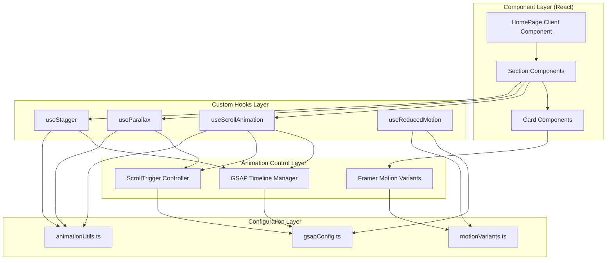
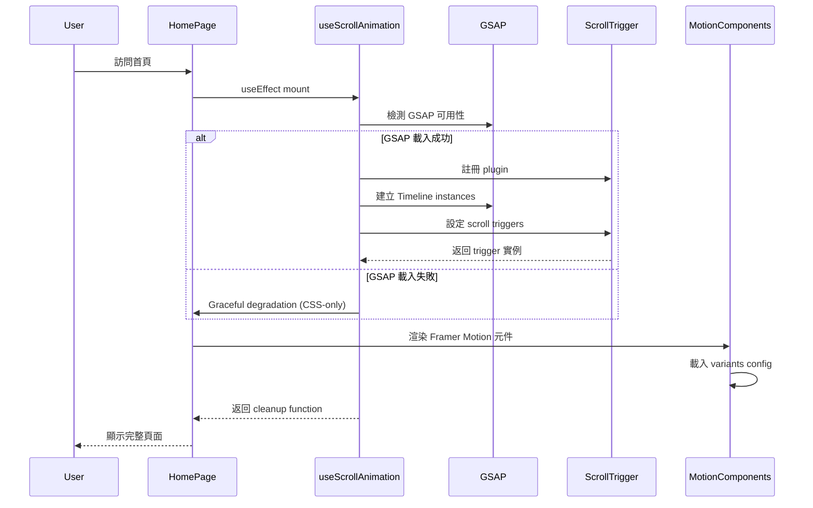
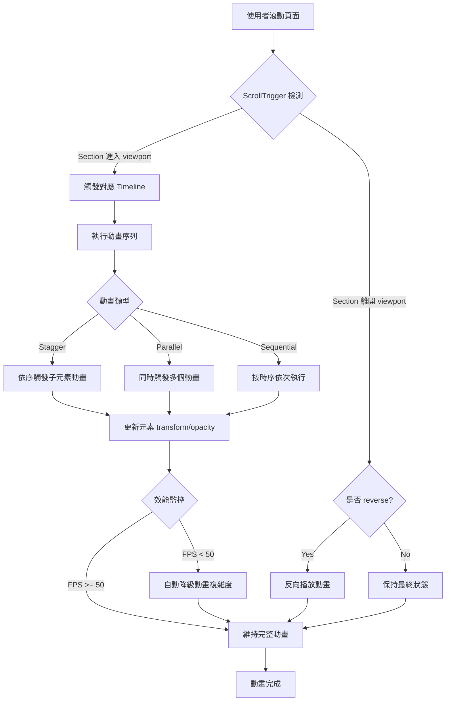
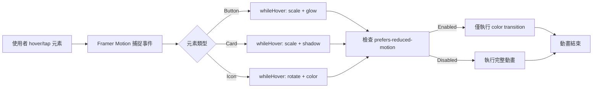
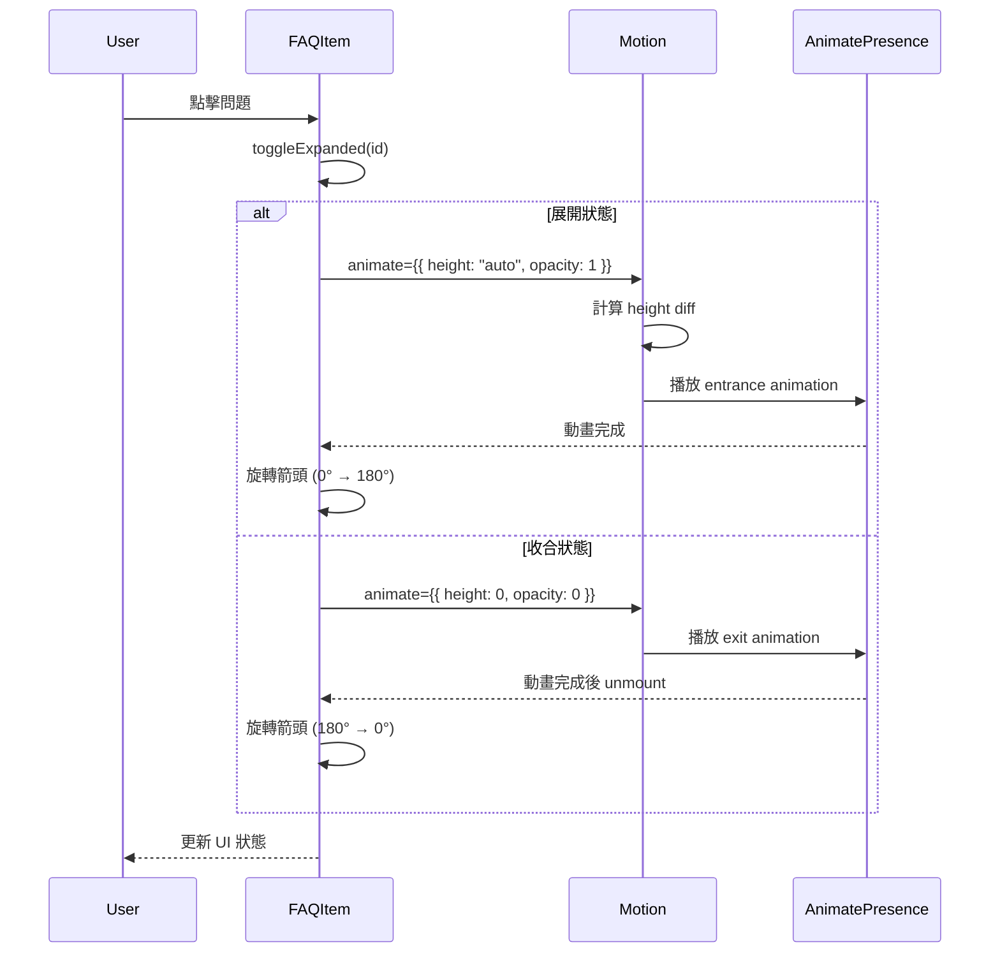
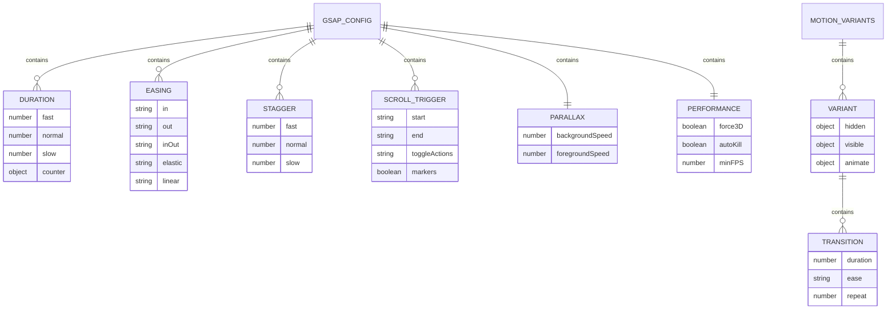
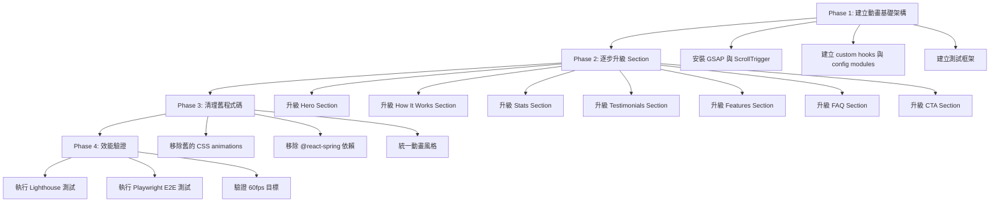

# 設計文件：首頁動畫系統

## Overview

本功能旨在升級 Wasteland Tarot 平台的首頁動畫體驗，整合 GSAP（GreenSock Animation Platform）和 Framer Motion 兩大專業動畫庫，打造統一、高效且具沉浸感的滾動動畫系統。系統將以 GSAP Timeline 和 ScrollTrigger 作為核心滾動動畫控制架構，搭配 Framer Motion 實作微動畫與互動效果，同時確保 60fps 效能、響應式設計和無障礙支援。

**使用者價值**：網站訪客將體驗到流暢、專業且具沉浸感的首頁動畫效果，強化 Fallout 廢土主題的視覺識別，提升品牌專業度與使用者參與度。

**目標使用者**：所有首次訪問或回訪 Wasteland Tarot 首頁的使用者，包括 Fallout 粉絲、塔羅愛好者、以及尋求獨特占卜體驗的潛在用戶。

**影響範圍**：此功能將完全重構首頁 (`/src/app/client-page.tsx`) 的動畫實作，從基礎 CSS transitions 升級至專業動畫庫控制，並建立統一的動畫配置系統供未來擴展使用。

### Goals

- **整合 GSAP + ScrollTrigger**：建立核心滾動動畫控制架構，統一管理所有視窗滾動觸發的動畫
- **整合 Framer Motion**：實作微動畫與使用者互動效果（hover、tap、layout animations）
- **七大區塊動畫升級**：Hero、How It Works、Stats、Testimonials、Features、FAQ、CTA 全面升級
- **60fps 效能保證**：所有動畫維持 60fps 流暢度，確保最佳使用者體驗
- **響應式 + 無障礙**：支援多裝置響應式動畫調整，並完整實作 `prefers-reduced-motion` 支援
- **可維護性**：建立統一的動畫配置系統，簡化未來動畫調整與擴展

### Non-Goals

- **不包含**：其他頁面的動畫系統（僅限首頁範圍）
- **不包含**：3D 動畫效果（專案已使用 Three.js 於背景效果，此處聚焦於 2D 滾動與互動動畫）
- **不包含**：影片動畫或 Lottie 動畫整合
- **延後考量**：動畫編輯器 GUI 工具（配置檔案採用 TypeScript，暫不提供視覺化編輯器）
- **延後考量**：A/B 測試動畫效果（此階段專注於建立基礎架構）

---

## Architecture

### Existing Architecture Analysis

**現有架構模式**：
- **Next.js 15 App Router** + **React 19**：Server Component (`page.tsx`) + Client Component (`client-page.tsx`) 分離架構
- **Zustand**：全域狀態管理（auth、UI state）
- **Tailwind CSS v4**：樣式系統
- **現有動畫依賴**：
  - `motion` (Framer Motion) v12.23.22：已安裝但未充分利用
  - `@react-spring/web` v9.7.5：僅用於部分動畫，將逐步由 Framer Motion 替代
  - `@use-gesture/react` v10.3.1：手勢處理（保留）

**現有動畫實作限制**：
- 主要依賴 CSS transitions 和 Tailwind 的 `animate-*` classes
- 缺乏滾動觸發動畫控制（無 ScrollTrigger）
- 缺乏 Timeline 統一管理（動畫時序難以協調）
- FAQ 展開動畫僅使用簡單的條件渲染（無平滑高度動畫）

### Architecture Pattern & Boundary Map

**選定模式**：Layered Animation Architecture（分層動畫架構）



**架構整合說明**：

| 層級 | 職責 | 技術選擇 |
|------|------|----------|
| **Component Layer** | 呈現 UI 元素與接收使用者互動 | React 19 Client Components |
| **Animation Control Layer** | 控制動畫執行與時序協調 | GSAP Timeline + ScrollTrigger, Framer Motion |
| **Configuration Layer** | 定義動畫參數與共用常數 | TypeScript config modules |
| **Custom Hooks Layer** | 封裝動畫邏輯與生命週期管理 | React Hooks (useEffect, useRef, useMemo) |

**責任分離原則**：
- **GSAP**：負責滾動觸發動畫、視差效果、複雜時序控制
- **Framer Motion**：負責使用者互動動畫（hover、tap）、layout animations、FAQ 展開動畫
- **CSS Transitions**：極簡單的狀態切換（color、opacity 單一屬性變化）

**現有模式保持**：
- Next.js 15 Server/Client Component 分離架構維持不變
- Zustand 狀態管理架構不受影響
- Tailwind CSS 樣式系統持續使用（動畫庫不取代 Tailwind，而是增強）

**新增元件理由**：
- **Custom Animation Hooks**：封裝 GSAP 與 Framer Motion 的複雜邏輯，避免元件程式碼過於臃腫
- **Animation Config Modules**：統一管理動畫參數，確保視覺一致性與可維護性
- **Animation Utils**：提供共用工具函式（如 viewport detection、performance monitoring）

**Steering 合規性**：
- 遵循專案 "DO NOT OVERDESIGN" 原則，僅建立必要的抽象層
- 使用專案既有的 Bun 套件管理工具
- 符合 Fallout 風格主題（Pip-Boy Green、Radiation Orange 色彩系統）
- 完整支援 TypeScript 型別安全

### Technology Stack

| 層級 | 選擇 / 版本 | 在本功能中的角色 | 備註 |
|------|-------------|------------------|------|
| **動畫核心** | GSAP 3.12.5+ | ScrollTrigger 滾動動畫控制、Timeline 時序管理、視差效果 | 業界標準，效能最佳 |
| **微動畫** | Framer Motion (motion) 12.23.22 | 互動動畫（hover/tap）、FAQ 展開動畫、layout animations | 已安裝，充分利用 |
| **React 整合** | React 19.2.0 | 元件生命週期管理、狀態同步、Hooks 封裝 | 專案既有版本 |
| **Next.js** | Next.js 15.1.7 | App Router、Client Component、SSR 最佳化 | 專案既有版本 |
| **型別系統** | TypeScript 5.9.3 | 配置檔案型別定義、Hooks 型別安全 | 專案既有版本 |
| **樣式系統** | Tailwind CSS v4.1.14 | GPU-accelerated classes、響應式斷點 | 與動畫庫協作 |
| **套件管理** | Bun | 安裝 GSAP 與 ScrollTrigger plugin | 專案指定工具 |

**GSAP 選擇理由**：
- **效能優勢**：GSAP 針對 JavaScript 動畫進行深度最佳化，能達到 60fps 甚至 120fps
- **ScrollTrigger**：業界最強大的滾動動畫控制插件，支援視差、pin、snap 等進階效果
- **Timeline 系統**：精確控制多個動畫的時序關係（sequential、parallel、stagger）
- **瀏覽器相容性**：完美支援所有現代瀏覽器與 Safari（避免 CSS animations 的 Safari bugs）
- **社群資源**：豐富的範例與文件，降低學習曲線

**Framer Motion 選擇理由**：
- **React 原生**：declarative API 與 React 狀態系統無縫整合
- **Layout Animations**：自動計算 layout 變化並產生平滑過渡（FAQ 展開動畫）
- **Variants 系統**：可重用的動畫模式，減少程式碼重複
- **Accessibility**：內建 `prefers-reduced-motion` 支援
- **專案既有**：motion 套件已安裝，無需額外依賴

**技術決策記錄**：
- 選擇 GSAP 而非 anime.js：GSAP 的 ScrollTrigger 功能更完整
- 選擇 Framer Motion 而非 React Spring：專案已安裝 motion，且 declarative API 更適合 React 19
- 不使用 CSS Scroll-Driven Animations：瀏覽器支援度不足（Safari 尚未完全支援）

---

## System Flows

### 1. Animation Initialization Flow (首次載入)



**關鍵決策點**：
- **GSAP 載入失敗處理**：若 GSAP 或 ScrollTrigger 載入失敗，系統降級至 CSS transitions，不會破壞 UI
- **Lazy Registration**：ScrollTrigger 實例僅在對應 section 進入 viewport 時建立（透過 Intersection Observer 預檢）
- **Timeline 初始化時機**：所有 Timeline 在 `useEffect` 中建立，確保 DOM 已渲染

### 2. Scroll-Triggered Animation Flow



**流程級決策**：
- **單次播放 vs 可逆播放**：大部分 section 採用 `toggleActions: "play none none none"`（僅播放一次），避免反覆進出 viewport 時重複觸發
- **效能監控**：若檢測到 FPS 低於 50，自動減少 stagger 元素數量或簡化動畫路徑
- **Scroll Jacking 避免**：不使用 `pin` 或 `snap` 功能，保持自然滾動體驗

### 3. User Interaction Animation Flow (Hover/Tap)



**互動動畫原則**：
- **即時回饋**：hover 動畫延遲 <= 0.1s，確保即時回應
- **區分裝置**：觸控裝置使用 `whileTap` 替代 `whileHover`
- **減少動畫模式**：`prefers-reduced-motion` 啟用時，僅保留顏色變化，移除 transform 動畫

### 4. FAQ Expand/Collapse Animation Flow



**實作細節**：
- **Height Auto 處理**：Framer Motion 自動計算 `height: auto` 的實際像素值並產生平滑過渡
- **防止 Layout Shift**：使用 `overflow: hidden` 在動畫期間避免內容溢出
- **Accordion 行為**：僅允許單一 FAQ 展開（點擊其他項目時自動收合當前項目）

---

## Requirements Traceability

| Requirement | 摘要 | 元件 | 介面 | 流程 |
|-------------|------|------|------|------|
| 1 | GSAP 核心架構整合 | `useScrollAnimation`, `gsapConfig.ts` | GSAP Timeline API | 初始化流程 |
| 2 | Framer Motion 微動畫 | `motionVariants.ts`, Feature Cards | Motion Components | 互動動畫流程 |
| 3 | Hero Section 視差 | `useParallax`, Hero Section | GSAP ScrollTrigger | 滾動動畫流程 |
| 4 | How It Works 錯開 | `useStagger`, StepCard | GSAP Stagger | 滾動動畫流程 |
| 5 | Stats 數字滾動 | StatCounter, `useScrollAnimation` | GSAP onUpdate | 滾動動畫流程 |
| 6 | Testimonials 浮入 | TestimonialCard, `useScrollAnimation` | GSAP Timeline | 滾動動畫流程 |
| 7 | Features 圖示特效 | Feature Cards, `motionVariants.ts` | Framer Motion whileHover | 互動動畫流程 |
| 8 | FAQ 展開動畫 | FAQ Section | Framer Motion AnimatePresence | FAQ 動畫流程 |
| 9 | CTA 呼吸發光 | CTA Section | Framer Motion infinite loop | - |
| 10 | 響應式設計 | `gsapConfig.ts` (matchMedia), All Sections | GSAP matchMedia | 所有流程 |
| 11 | 無障礙支援 | `useReducedMotion`, All Sections | CSS media query | 所有流程 |
| 12 | 效能優化 | `animationUtils.ts`, All Sections | GSAP force3D, passive listeners | 效能監控流程 |
| 13 | React 整合 | All Custom Hooks | useEffect cleanup | 初始化流程 |
| 14 | 配置檔案管理 | `gsapConfig.ts`, `motionVariants.ts` | TypeScript exports | - |
| 15 | Fallout 主題一致 | All Sections | Tailwind color classes | - |
| 16 | 開發者體驗 | README.md, JSDoc | - | - |
| 17 | 測試與 QA | Test files | Jest, Playwright | - |

---

## Components and Interfaces

### 元件摘要

| 元件 | 層級 | 用途 | 需求覆蓋 | 關鍵依賴 (優先度) | 合約類型 |
|------|------|------|----------|-------------------|----------|
| `useScrollAnimation` | Custom Hook | 統一 GSAP 滾動動畫管理 | 1, 3, 4, 5, 6, 12 | GSAP (P0), ScrollTrigger (P0) | Service |
| `useParallax` | Custom Hook | Hero Section 視差效果 | 3, 12 | GSAP ScrollTrigger (P0) | Service |
| `useStagger` | Custom Hook | 錯開入場動畫 | 4, 12 | GSAP Timeline (P0) | Service |
| `useReducedMotion` | Custom Hook | 偵測無障礙動畫偏好 | 11 | CSS media query (P0) | State |
| `gsapConfig.ts` | Config Module | GSAP 動畫參數中央配置 | 1, 10, 14 | None | - |
| `motionVariants.ts` | Config Module | Framer Motion variants 定義 | 2, 7, 14 | None | - |
| `animationUtils.ts` | Util Module | 動畫工具函式（效能監控、viewport 檢測） | 12 | None | - |
| Hero Section | React Component | 首頁 Hero 區塊（視差 + 入場動畫） | 3, 15 | `useParallax` (P0), `useScrollAnimation` (P0) | - |
| How It Works Section | React Component | 操作步驟區塊（錯開動畫） | 4, 15 | `useStagger` (P0), StepCard (P0) | - |
| Stats Section | React Component | 數據統計區塊（數字滾動） | 5, 15 | `useScrollAnimation` (P0), StatCounter (P0) | - |
| Testimonials Section | React Component | 用戶評價區塊（浮入動畫） | 6, 15 | `useScrollAnimation` (P0), TestimonialCard (P0) | - |
| Features Section | React Component | 功能展示區塊（圖示特效） | 7, 15 | `motionVariants` (P0), PixelIcon (P0) | - |
| FAQ Section | React Component | 常見問題區塊（展開動畫） | 8, 15 | Framer Motion AnimatePresence (P0) | - |
| CTA Section | React Component | 行動呼籲區塊（呼吸發光） | 9, 15 | `motionVariants` (P0) | - |

### Animation Control Layer

#### useScrollAnimation Hook

| 欄位 | 細節 |
|------|------|
| **Intent** | 統一管理 GSAP ScrollTrigger 滾動動畫，提供 declarative API 給元件使用 |
| **Requirements** | 1, 3, 4, 5, 6, 12, 13 |

**Responsibilities & Constraints**
- **主要職責**：封裝 GSAP Timeline 與 ScrollTrigger 的初始化、配置、清理邏輯
- **領域邊界**：僅處理滾動觸發動畫，不包含互動動畫（交由 Framer Motion）
- **資料擁有權**：擁有 GSAP Timeline 和 ScrollTrigger 實例的生命週期管理
- **不變量**：每個 section 對應一個獨立的 ScrollTrigger instance，避免衝突

**Dependencies**
- **Inbound**: Section Components (Hero, HowItWorks, Stats, etc.) — 傳入 ref 和動畫配置 (P0)
- **Outbound**: `gsapConfig.ts` — 讀取預設動畫參數 (P0)
- **Outbound**: `animationUtils.ts` — 使用效能監控工具 (P1)
- **External**: GSAP v3.12.5+, ScrollTrigger plugin — 核心動畫引擎 (P0)

**Contracts**: [x] Service [ ] API [ ] Event [ ] Batch [x] State

##### Service Interface

```typescript
interface UseScrollAnimationOptions {
  /** ScrollTrigger 觸發元素的 ref */
  triggerRef: React.RefObject<HTMLElement>;

  /** 動畫目標元素的 ref（可選，預設為 triggerRef） */
  targetRef?: React.RefObject<HTMLElement>;

  /** ScrollTrigger 配置 */
  scrollTriggerConfig?: {
    start?: string;          // 預設: "top 80%"
    end?: string;            // 預設: "bottom 20%"
    scrub?: boolean | number; // 預設: false
    toggleActions?: string;  // 預設: "play none none none"
    markers?: boolean;       // 預設: false (僅開發模式)
  };

  /** GSAP Timeline 動畫配置 */
  animations: Array<{
    target: string | HTMLElement; // CSS selector 或 element ref
    from?: gsap.TweenVars;
    to: gsap.TweenVars;
    position?: string | number;   // Timeline 位置標記
  }>;

  /** 是否啟用（支援條件式動畫） */
  enabled?: boolean;
}

interface UseScrollAnimationReturn {
  /** ScrollTrigger 實例（供手動控制） */
  scrollTrigger: ScrollTrigger | null;

  /** GSAP Timeline 實例（供手動控制） */
  timeline: gsap.core.Timeline | null;

  /** 動畫是否已初始化 */
  isReady: boolean;

  /** 手動重新整理 ScrollTrigger（窗口 resize 時使用） */
  refresh: () => void;
}

function useScrollAnimation(
  options: UseScrollAnimationOptions
): UseScrollAnimationReturn;
```

**Preconditions**:
- `triggerRef.current` 必須已渲染至 DOM（通常在 `useLayoutEffect` 中使用）
- GSAP 和 ScrollTrigger plugin 已載入
- `animations` 陣列至少包含一個動畫配置

**Postconditions**:
- 返回的 `scrollTrigger` 和 `timeline` 實例已註冊並可使用
- 元件 unmount 時自動清理（kill ScrollTrigger 和 Timeline）
- Resize 事件觸發時自動 refresh ScrollTrigger

**Invariants**:
- 每次 re-render 時不會重複建立 Timeline（透過 `useRef` 保持實例穩定）
- 若 `enabled` 為 `false`，ScrollTrigger 不會被建立

**Implementation Notes**:
- 使用 `useLayoutEffect` 而非 `useEffect`，確保動畫在 DOM layout 完成後初始化
- 整合 `useReducedMotion` hook，當偵測到 `prefers-reduced-motion: reduce` 時，將所有 duration 設為 0
- 使用 GSAP 的 `matchMedia` API 實作響應式動畫調整（mobile/tablet/desktop 不同參數）

---

#### useParallax Hook

| 欄位 | 細節 |
|------|------|
| **Intent** | 簡化 Hero Section 視差效果實作，提供 declarative parallax API |
| **Requirements** | 3, 10, 12 |

**Responsibilities & Constraints**
- **主要職責**：為背景層與前景層建立不同滾動速率，產生視差深度效果
- **領域邊界**：僅限 Hero Section 使用，其他 section 不套用視差
- **效能限制**：Mobile 裝置自動停用視差（避免效能問題）

**Dependencies**
- **Inbound**: Hero Section Component — 傳入背景與前景 refs (P0)
- **Outbound**: GSAP ScrollTrigger — 使用 `scrub` 模式建立視差 (P0)
- **Outbound**: `gsapConfig.ts` — 讀取視差速率參數 (P0)

**Contracts**: [x] Service [ ] API [ ] Event [ ] Batch [ ] State

##### Service Interface

```typescript
interface UseParallaxOptions {
  /** 背景層 ref（移動速度較慢） */
  backgroundRef: React.RefObject<HTMLElement>;

  /** 前景層 ref（移動速度正常） */
  foregroundRef?: React.RefObject<HTMLElement>;

  /** 背景層滾動速率（預設 0.5，表示 50% 滾動速度） */
  backgroundSpeed?: number;

  /** 前景層滾動速率（預設 1，正常速度） */
  foregroundSpeed?: number;

  /** 是否在 mobile 裝置停用（預設 true） */
  disableOnMobile?: boolean;
}

function useParallax(options: UseParallaxOptions): void;
```

**Preconditions**:
- `backgroundRef.current` 必須已渲染
- GSAP ScrollTrigger plugin 已載入

**Postconditions**:
- 背景層與前景層綁定至 ScrollTrigger，產生視差效果
- Mobile 裝置（viewport width < 768px）自動停用視差

**Invariants**:
- 視差效果不影響頁面 layout（使用 `transform` 而非 `position` 調整）

---

#### useStagger Hook

| 欄位 | 細節 |
|------|------|
| **Intent** | 簡化錯開入場動畫實作，統一管理 stagger 時序 |
| **Requirements** | 4, 10, 12 |

**Responsibilities & Constraints**
- **主要職責**：為一組元素建立錯開入場動畫（fade in + translate up）
- **領域邊界**：適用於 How It Works、Testimonials 等 section
- **響應式調整**：Mobile 裝置減少 stagger delay（提升載入感知速度）

**Dependencies**
- **Inbound**: Section Components — 傳入容器 ref 和子元素 selector (P0)
- **Outbound**: GSAP Timeline — 使用 `stagger` 參數建立錯開效果 (P0)
- **Outbound**: `gsapConfig.ts` — 讀取 stagger delay 參數 (P0)

**Contracts**: [x] Service [ ] API [ ] Event [ ] Batch [ ] State

##### Service Interface

```typescript
interface UseStaggerOptions {
  /** 容器元素 ref */
  containerRef: React.RefObject<HTMLElement>;

  /** 子元素選擇器（預設 "> *"） */
  childrenSelector?: string;

  /** Stagger delay（預設 0.15s） */
  stagger?: number;

  /** 從何處開始（預設 { opacity: 0, y: 40 }） */
  from?: gsap.TweenVars;

  /** 到何處結束（預設 { opacity: 1, y: 0 }） */
  to?: gsap.TweenVars;

  /** 動畫持續時間（預設 0.6s） */
  duration?: number;

  /** ScrollTrigger start 位置（預設 "top 80%"） */
  scrollTriggerStart?: string;
}

function useStagger(options: UseStaggerOptions): void;
```

**Preconditions**:
- 容器內的子元素已渲染至 DOM
- 子元素數量 > 0

**Postconditions**:
- 子元素依序觸發入場動畫，delay 為 `stagger` 參數
- 動畫僅播放一次（不可逆）

**Invariants**:
- Stagger 順序固定（按 DOM 順序）

---

#### useReducedMotion Hook

| 欄位 | 細節 |
|------|------|
| **Intent** | 偵測使用者的 `prefers-reduced-motion` 設定，提供無障礙動畫支援 |
| **Requirements** | 11 |

**Responsibilities & Constraints**
- **主要職責**：偵測 CSS media query `(prefers-reduced-motion: reduce)` 並返回 boolean
- **領域邊界**：純偵測邏輯，不直接控制動畫（由各 hook 和元件使用此狀態）

**Dependencies**
- **External**: `window.matchMedia` API — 偵測 media query (P0)

**Contracts**: [ ] Service [ ] API [ ] Event [ ] Batch [x] State

##### State Management

```typescript
function useReducedMotion(): boolean;
```

**State Model**:
- 返回值：`true` 表示使用者啟用減少動畫模式，`false` 表示正常模式

**Persistence & Consistency**:
- 使用 `useEffect` 監聽 `matchMedia` 的 `change` 事件，即時更新狀態
- 不需要持久化（每次載入重新偵測）

**Concurrency Strategy**:
- 使用 React state，確保多個元件可共享同一偵測結果

**Implementation Notes**:
- 當 `useReducedMotion()` 返回 `true` 時：
  - GSAP 動畫的 `duration` 設為 0
  - Framer Motion 的 `transition.duration` 設為 0
  - 僅保留顏色變化，移除 transform 動畫

---

### Configuration Layer

#### gsapConfig.ts

| 欄位 | 細節 |
|------|------|
| **Intent** | 中央化 GSAP 動畫參數配置，確保全站動畫一致性 |
| **Requirements** | 1, 10, 12, 14, 15 |

**Structure Definition**:

```typescript
/**
 * GSAP 動畫配置
 * 所有時間單位為秒（s）
 */
export const gsapConfig = {
  /** 預設動畫持續時間 */
  durations: {
    /** 快速動畫（按鈕 hover 等） */
    fast: 0.2,
    /** 標準動畫（入場、退場） */
    normal: 0.6,
    /** 慢速動畫（視差、複雜序列） */
    slow: 1.0,
    /** 數字滾動動畫 */
    counter: {
      small: 1.2,   // < 100
      medium: 1.5,  // 100-10,000
      large: 2.0,   // > 10,000
    },
  },

  /** Easing 函數 */
  easings: {
    /** 入場動畫（從靜止加速） */
    in: 'power2.in',
    /** 退場動畫（減速至靜止） */
    out: 'power2.out',
    /** 雙向緩動 */
    inOut: 'power2.inOut',
    /** 彈性效果（CTA 按鈕） */
    elastic: 'elastic.out(1, 0.5)',
    /** 平滑線性（視差） */
    linear: 'none',
  },

  /** Stagger 延遲 */
  staggers: {
    /** 快速錯開（mobile） */
    fast: 0.075,
    /** 標準錯開（desktop） */
    normal: 0.15,
    /** 慢速錯開（大量元素） */
    slow: 0.25,
  },

  /** ScrollTrigger 預設配置 */
  scrollTrigger: {
    /** 入場觸發位置（元素頂部到達 viewport 80% 位置時觸發） */
    start: 'top 80%',
    /** 退場位置（元素底部離開 viewport 20% 位置） */
    end: 'bottom 20%',
    /** 預設 toggleActions（僅播放一次） */
    toggleActions: 'play none none none',
    /** 開發模式顯示 markers */
    markers: process.env.NODE_ENV === 'development',
  },

  /** 視差效果速率 */
  parallax: {
    /** 背景層速率（50% 滾動速度） */
    backgroundSpeed: 0.5,
    /** 前景層速率（正常速度） */
    foregroundSpeed: 1.0,
  },

  /** 響應式斷點（與 Tailwind 一致） */
  breakpoints: {
    mobile: '(max-width: 767px)',
    tablet: '(min-width: 768px) and (max-width: 1023px)',
    desktop: '(min-width: 1024px)',
  },

  /** 效能最佳化 */
  performance: {
    /** 強制 GPU 加速 */
    force3D: true,
    /** 自動 kill 已完成的 tween */
    autoKill: true,
    /** 效能監控閾值（FPS） */
    minFPS: 50,
  },

  /** Fallout 主題色彩（供 glow 效果使用） */
  colors: {
    pipBoyGreen: '#00ff88',
    radiationOrange: '#ff8800',
  },
} as const;

/** TypeScript 型別匯出 */
export type GSAPConfig = typeof gsapConfig;
```

**Implementation Notes**:
- 使用 `as const` 確保配置為 readonly，防止執行時被修改
- 提供完整 TypeScript 型別定義，IDE 自動完成支援
- 支援環境變數覆寫（如 `NEXT_PUBLIC_GSAP_DEBUG=true` 啟用 markers）

---

#### motionVariants.ts

| 欄位 | 細節 |
|------|------|
| **Intent** | 定義可重用的 Framer Motion 動畫 variants，減少程式碼重複 |
| **Requirements** | 2, 7, 14, 15 |

**Structure Definition**:

```typescript
import type { Variants, Transition } from 'motion/react';

/**
 * Framer Motion 動畫 Variants
 * 遵循 Fallout 主題風格
 */

/** 淡入動畫（通用） */
export const fadeInVariants: Variants = {
  hidden: { opacity: 0 },
  visible: {
    opacity: 1,
    transition: { duration: 0.6, ease: 'easeOut' },
  },
};

/** 向上滑入動畫（卡片入場） */
export const slideUpVariants: Variants = {
  hidden: { opacity: 0, y: 40 },
  visible: {
    opacity: 1,
    y: 0,
    transition: { duration: 0.6, ease: 'easeOut' },
  },
};

/** 縮放入場動畫（圖示、按鈕） */
export const scaleInVariants: Variants = {
  hidden: { opacity: 0, scale: 0.9 },
  visible: {
    opacity: 1,
    scale: 1,
    transition: { duration: 0.5, ease: 'easeOut' },
  },
};

/** CTA 呼吸發光動畫（infinite loop） */
export const breathingGlowVariants: Variants = {
  initial: {
    boxShadow: '0 0 10px rgba(0, 255, 136, 0.3), 0 0 20px rgba(0, 255, 136, 0.2)',
  },
  animate: {
    boxShadow: [
      '0 0 10px rgba(0, 255, 136, 0.3), 0 0 20px rgba(0, 255, 136, 0.2)',
      '0 0 20px rgba(0, 255, 136, 0.6), 0 0 40px rgba(0, 255, 136, 0.4)',
      '0 0 10px rgba(0, 255, 136, 0.3), 0 0 20px rgba(0, 255, 136, 0.2)',
    ],
    transition: {
      duration: 2,
      ease: 'easeInOut',
      repeat: Infinity,
    },
  },
};

/** Feature Card Hover 動畫 */
export const featureCardHoverVariants: Variants = {
  rest: { scale: 1 },
  hover: {
    scale: 1.02,
    boxShadow: '0 0 15px rgba(0, 255, 136, 0.4), 0 0 30px rgba(0, 255, 136, 0.2)',
    transition: { duration: 0.3, ease: 'easeOut' },
  },
};

/** Feature Icon Hover 動畫（360° 旋轉 + 顏色變化） */
export const featureIconHoverVariants: Variants = {
  rest: { rotate: 0, color: '#00ff88' },
  hover: {
    rotate: 360,
    color: '#00ff88', // 維持 Pip-Boy Green
    transition: { duration: 0.6, ease: 'easeInOut' },
  },
};

/** FAQ 展開動畫 */
export const faqExpandVariants: Variants = {
  collapsed: {
    height: 0,
    opacity: 0,
    transition: { duration: 0.3, ease: 'easeIn' },
  },
  expanded: {
    height: 'auto',
    opacity: 1,
    transition: { duration: 0.3, ease: 'easeOut' },
  },
};

/** FAQ 箭頭旋轉動畫 */
export const faqArrowVariants: Variants = {
  collapsed: { rotate: 0 },
  expanded: { rotate: 180 },
};

/** 減少動畫模式（prefers-reduced-motion） */
export const reducedMotionTransition: Transition = {
  duration: 0,
};
```

**Implementation Notes**:
- 所有 variants 遵循 Fallout 主題色彩（Pip-Boy Green #00ff88）
- 提供 `reducedMotionTransition` 供 `useReducedMotion` 搭配使用
- 使用 TypeScript `Variants` 型別確保型別安全

---

#### animationUtils.ts

| 欄位 | 細節 |
|------|------|
| **Intent** | 提供動畫系統共用工具函式（效能監控、viewport 檢測等） |
| **Requirements** | 12 |

**Structure Definition**:

```typescript
/**
 * 動畫系統工具函式
 */

/**
 * 檢測元素是否在 viewport 內
 * @param element - 目標元素
 * @param threshold - 可見度閾值（0-1，預設 0.5 表示 50% 可見）
 */
export function isInViewport(
  element: HTMLElement,
  threshold: number = 0.5
): boolean {
  const rect = element.getBoundingClientRect();
  const windowHeight = window.innerHeight || document.documentElement.clientHeight;
  const windowWidth = window.innerWidth || document.documentElement.clientWidth;

  const vertInView = rect.top <= windowHeight && rect.top + rect.height * threshold >= 0;
  const horInView = rect.left <= windowWidth && rect.left + rect.width * threshold >= 0;

  return vertInView && horInView;
}

/**
 * 效能監控：計算當前 FPS
 * 使用 requestAnimationFrame 測量
 */
export class FPSMonitor {
  private fps: number = 60;
  private lastTime: number = performance.now();
  private frames: number = 0;
  private rafId: number | null = null;

  start() {
    const measure = (time: number) => {
      this.frames++;
      if (time >= this.lastTime + 1000) {
        this.fps = Math.round((this.frames * 1000) / (time - this.lastTime));
        this.frames = 0;
        this.lastTime = time;
      }
      this.rafId = requestAnimationFrame(measure);
    };
    this.rafId = requestAnimationFrame(measure);
  }

  stop() {
    if (this.rafId) {
      cancelAnimationFrame(this.rafId);
      this.rafId = null;
    }
  }

  getFPS(): number {
    return this.fps;
  }
}

/**
 * 檢測裝置是否為觸控裝置
 */
export function isTouchDevice(): boolean {
  return (
    'ontouchstart' in window ||
    navigator.maxTouchPoints > 0 ||
    (navigator as any).msMaxTouchPoints > 0
  );
}

/**
 * 取得當前 viewport 尺寸分類
 * @returns 'mobile' | 'tablet' | 'desktop'
 */
export function getViewportCategory(): 'mobile' | 'tablet' | 'desktop' {
  const width = window.innerWidth;
  if (width < 768) return 'mobile';
  if (width < 1024) return 'tablet';
  return 'desktop';
}

/**
 * Graceful Degradation：檢查 GSAP 是否可用
 */
export function isGSAPAvailable(): boolean {
  try {
    return typeof window !== 'undefined' && 'gsap' in window;
  } catch {
    return false;
  }
}

/**
 * 計算元素的實際高度（包含 margin）
 */
export function getElementFullHeight(element: HTMLElement): number {
  const styles = window.getComputedStyle(element);
  const margin = parseFloat(styles.marginTop) + parseFloat(styles.marginBottom);
  return element.offsetHeight + margin;
}
```

**Implementation Notes**:
- `FPSMonitor` 用於開發模式監控效能，若 FPS < 50 則 console.warn 提示
- `isGSAPAvailable()` 用於 graceful degradation 檢測

---

### Component Layer (React Components)

由於七個 section 的實作模式類似，以下僅詳細說明 **Hero Section** 與 **FAQ Section** 作為代表，其餘 section 簡述。

#### Hero Section

| 欄位 | 細節 |
|------|------|
| **Intent** | 首頁 Hero 區塊，整合視差效果與入場動畫，提供強烈視覺衝擊 |
| **Requirements** | 3, 10, 11, 12, 15 |

**Responsibilities & Constraints**
- **主要職責**：渲染 Hero 標題、副標題、CTA 按鈕，執行入場動畫與視差效果
- **領域邊界**：不包含導覽列（導覽列為獨立元件）
- **效能限制**：視差效果在 mobile 裝置自動停用

**Dependencies**
- **Inbound**: HomePage Client Component — 接收 user 狀態 (P1)
- **Outbound**: `useParallax` hook — 建立視差效果 (P0)
- **Outbound**: `useScrollAnimation` hook — 建立入場動畫 (P0)
- **Outbound**: DynamicHeroTitle Component — 動態標題元件 (P0)
- **Outbound**: PixelIcon Component — 圖示系統 (P0)

**Contracts**: [ ] Service [ ] API [ ] Event [ ] Batch [ ] State

**Implementation Notes**:

```typescript
'use client';

import { useRef, useEffect } from 'react';
import { useParallax } from '@/lib/animations/useParallax';
import { useScrollAnimation } from '@/lib/animations/useScrollAnimation';
import { useReducedMotion } from '@/lib/animations/useReducedMotion';
import { DynamicHeroTitle } from '@/components/hero/DynamicHeroTitle';
import { PixelIcon } from '@/components/ui/icons';

export function HeroSection() {
  const backgroundRef = useRef<HTMLDivElement>(null);
  const foregroundRef = useRef<HTMLDivElement>(null);
  const prefersReducedMotion = useReducedMotion();

  // 視差效果（僅 desktop 且非 reduced motion）
  useParallax({
    backgroundRef,
    foregroundRef,
    backgroundSpeed: 0.5,
    disableOnMobile: true,
  });

  // 入場動畫
  useScrollAnimation({
    triggerRef: foregroundRef,
    animations: [
      {
        target: '.hero-title',
        from: { opacity: 0, y: -40 },
        to: { opacity: 1, y: 0, duration: 0.8, ease: 'power2.out' },
      },
      {
        target: '.hero-subtitle',
        from: { opacity: 0, y: -20 },
        to: { opacity: 1, y: 0, duration: 0.6, ease: 'power2.out' },
        position: '+=0.3', // 0.3s 後執行
      },
      {
        target: '.hero-cta',
        from: { opacity: 0, scale: 0.8 },
        to: { opacity: 1, scale: 1, duration: 0.4, ease: 'elastic.out(1, 0.5)' },
        position: '+=0.5', // 再 0.5s 後執行
      },
    ],
    enabled: !prefersReducedMotion,
  });

  return (
    <section className="relative">
      {/* 背景層（視差移動） */}
      <div ref={backgroundRef} className="absolute inset-0 -z-10">
        <div className="scanline-overlay" />
      </div>

      {/* 前景內容層 */}
      <div ref={foregroundRef} className="max-w-6xl mx-auto px-4 py-16">
        {/* Terminal Header */}
        <div className="hero-title text-center mb-12">
          <DynamicHeroTitle />
        </div>

        {/* Subtitle */}
        <p className="hero-subtitle text-center text-pip-boy-green/70 mb-8">
          結合 Fallout 世界觀的獨特塔羅占卜體驗
        </p>

        {/* CTA Buttons */}
        <div className="hero-cta flex gap-4 justify-center">
          {/* CTA 按鈕實作（使用 Framer Motion whileHover） */}
        </div>
      </div>
    </section>
  );
}
```

**整合說明**：
- 使用 `useParallax` 建立背景層與前景層的視差效果
- 使用 `useScrollAnimation` 建立標題、副標題、CTA 按鈕的入場動畫序列
- 整合 `useReducedMotion` 自動停用動畫（當使用者啟用減少動畫模式）

---

#### FAQ Section

| 欄位 | 細節 |
|------|------|
| **Intent** | 常見問題區塊，實作平滑的展開/收合動畫 |
| **Requirements** | 8, 11, 15 |

**Responsibilities & Constraints**
- **主要職責**：渲染 FAQ 列表，處理展開/收合狀態，執行平滑動畫
- **領域邊界**：僅處理 FAQ UI，不包含 FAQ 資料管理（資料在 component 內定義）
- **Accordion 行為**：同一時間僅允許一個 FAQ 展開

**Dependencies**
- **Outbound**: Framer Motion — 使用 `motion.div` 和 `AnimatePresence` (P0)
- **Outbound**: `motionVariants.ts` — 使用 FAQ variants (P0)
- **Outbound**: `useReducedMotion` hook — 偵測減少動畫模式 (P0)
- **Outbound**: PixelIcon Component — 箭頭圖示 (P0)

**Contracts**: [ ] Service [ ] API [ ] Event [ ] Batch [x] State

**State Management**:
- **State Model**: `expandedFaq: number | null`（當前展開的 FAQ ID，null 表示全部收合）
- **Persistence**: 不持久化（每次載入重置為 null）
- **Concurrency**: 使用 React useState，確保狀態同步

**Implementation Notes**:

```typescript
'use client';

import { useState } from 'react';
import { motion, AnimatePresence } from 'motion/react';
import { useReducedMotion } from '@/lib/animations/useReducedMotion';
import { faqExpandVariants, faqArrowVariants, reducedMotionTransition } from '@/lib/animations/motionVariants';
import { PixelIcon } from '@/components/ui/icons';

const FAQ_ITEMS = [
  { id: 1, question: '什麼是廢土塔羅？', answer: '...' },
  { id: 2, question: '我需要註冊才能使用嗎？', answer: '...' },
  // ... 其他 FAQ
];

export function FAQSection() {
  const [expandedFaq, setExpandedFaq] = useState<number | null>(null);
  const prefersReducedMotion = useReducedMotion();

  const toggleFaq = (id: number) => {
    setExpandedFaq(expandedFaq === id ? null : id);
  };

  return (
    <section className="border-t-2 border-pip-boy-green">
      <div className="max-w-4xl mx-auto px-4 py-16">
        <h2 className="text-3xl font-bold text-pip-boy-green mb-12 text-center">
          常見問題
        </h2>

        <div className="space-y-4">
          {FAQ_ITEMS.map((faq) => (
            <div
              key={faq.id}
              className="border-2 border-pip-boy-green bg-[var(--color-pip-boy-green-10)]"
            >
              {/* Question Button */}
              <button
                onClick={() => toggleFaq(faq.id)}
                className="w-full flex items-center justify-between p-4 text-left hover:bg-[var(--color-pip-boy-green-20)] transition-colors"
                aria-expanded={expandedFaq === faq.id}
              >
                <span className="font-semibold text-pip-boy-green pr-4">
                  {faq.question}
                </span>

                {/* Animated Arrow Icon */}
                <motion.div
                  variants={faqArrowVariants}
                  initial="collapsed"
                  animate={expandedFaq === faq.id ? 'expanded' : 'collapsed'}
                  transition={prefersReducedMotion ? reducedMotionTransition : { duration: 0.3 }}
                >
                  <PixelIcon
                    name="arrow-down-s"
                    sizePreset="sm"
                    className="flex-shrink-0 text-pip-boy-green"
                    aria-hidden="true"
                  />
                </motion.div>
              </button>

              {/* Answer Panel (AnimatePresence for exit animation) */}
              <AnimatePresence initial={false}>
                {expandedFaq === faq.id && (
                  <motion.div
                    variants={faqExpandVariants}
                    initial="collapsed"
                    animate="expanded"
                    exit="collapsed"
                    transition={prefersReducedMotion ? reducedMotionTransition : undefined}
                    className="border-t-2 border-pip-boy-green overflow-hidden"
                  >
                    <div className="p-4 bg-black/20">
                      <p className="text-pip-boy-green/80 text-sm leading-relaxed">
                        {faq.answer}
                      </p>
                    </div>
                  </motion.div>
                )}
              </AnimatePresence>
            </div>
          ))}
        </div>
      </div>
    </section>
  );
}
```

**整合說明**：
- 使用 Framer Motion 的 `AnimatePresence` 處理 exit animation（收合時的平滑退場）
- 使用 `motion.div` 的 `variants` 系統，確保動畫可重用
- 箭頭圖示使用 `motion.div` 包裹，實作旋轉動畫（0° ↔ 180°）
- 整合 `useReducedMotion`，當啟用減少動畫模式時，使用 `reducedMotionTransition`（duration: 0）

---

#### 其他 Section 簡述

**How It Works Section**:
- 使用 `useStagger` hook 建立 StepCard 的錯開入場動畫
- Stagger delay: 0.15s（desktop），0.075s（mobile）

**Stats Section**:
- 使用 `useScrollAnimation` hook，搭配 GSAP 的 `onUpdate` callback 更新 React state
- 數字格式化使用 `Intl.NumberFormat`（千位分隔符）

**Testimonials Section**:
- 使用 `useStagger` hook 建立 TestimonialCard 的浮入動畫
- 每張卡片使用 Framer Motion 的 `whileHover` 實作 hover 效果（scale + shadow）

**Features Section**:
- Feature Cards 使用 `useScrollAnimation` 建立入場動畫
- PixelIcon 使用 `motionVariants.ts` 的 `featureIconHoverVariants` 實作 360° 旋轉 + 顏色變化

**CTA Section**:
- CTA 按鈕使用 `motionVariants.ts` 的 `breathingGlowVariants` 實作呼吸發光動畫（infinite loop）
- 使用 Framer Motion 的 `whileHover` 暫停呼吸動畫並增強發光效果

---

## Data Models

本功能主要涉及動畫配置資料，不涉及業務資料模型或資料庫變更。

### Domain Model

**Animation Configuration Domain**:
- **Aggregates**: Animation Config (GSAP Config + Motion Variants)
- **Value Objects**: Duration, Easing, Stagger, ScrollTrigger Config
- **Business Rules**:
  - 所有動畫 duration 必須 > 0（除非 `prefers-reduced-motion` 啟用）
  - Stagger delay 必須 < animation duration（避免動畫重疊）
  - ScrollTrigger 的 `start` 必須早於 `end`

### Logical Data Model

**Animation Config Structure**:



**Consistency & Integrity**:
- Animation Config 為純配置資料，不涉及 transaction（readonly）
- 使用 TypeScript `as const` 確保 runtime immutability

---

## Error Handling

### Error Strategy

動畫系統採用 **Graceful Degradation** 策略，確保動畫載入失敗時不會破壞核心功能。

### Error Categories and Responses

**GSAP 載入失敗 (Library Error)**:
- **錯誤情境**: GSAP 或 ScrollTrigger plugin 載入失敗（網路問題、CDN 故障）
- **檢測方式**: `isGSAPAvailable()` 返回 `false`
- **處理策略**:
  1. Console warn 警告訊息（開發模式）
  2. 降級至 CSS-only animations（使用 Tailwind 的 `animate-*` classes）
  3. 不阻塞頁面渲染

**ScrollTrigger 註冊失敗 (Plugin Error)**:
- **錯誤情境**: ScrollTrigger plugin 註冊失敗（GSAP 版本不相容）
- **檢測方式**: `gsap.registerPlugin(ScrollTrigger)` throws error
- **處理策略**:
  1. Catch error 並 console.error
  2. 停用所有滾動觸發動畫
  3. 僅保留入場動畫（無需 ScrollTrigger）

**Ref 未渲染 (Runtime Error)**:
- **錯誤情境**: `useScrollAnimation` 的 `triggerRef.current` 為 `null`（DOM 未渲染）
- **檢測方式**: 在 `useLayoutEffect` 中檢查 `ref.current`
- **處理策略**:
  1. Early return，不建立 Timeline
  2. Console warn 提示開發者檢查 ref 綁定

**效能降級 (Performance Error)**:
- **錯誤情境**: FPS 持續低於 50（`FPSMonitor` 檢測）
- **檢測方式**: 連續 3 秒 FPS < 50
- **處理策略**:
  1. Console warn 警告效能問題
  2. 自動減少 stagger 元素數量（從 10 個減至 5 個）
  3. 簡化視差效果（background speed 從 0.5 提升至 0.8，減少位移量）

### Monitoring

**Development Mode**:
- GSAP Timeline 啟用 markers（`markers: true`）顯示觸發點
- FPSMonitor 自動啟動，每秒 console.log FPS 數值
- ScrollTrigger 事件 log（onEnter, onLeave）

**Production Mode**:
- 關閉所有 console logs（使用 `babel-plugin-transform-remove-console`）
- 僅保留 error-level logs（GSAP 載入失敗）
- 整合 Sentry error tracking（optional，若專案有使用）

---

## Testing Strategy

### Unit Tests (Vitest)

**Custom Hooks 測試**:
1. **useScrollAnimation**:
   - 測試 Timeline 是否正確建立
   - 測試 cleanup function 是否正確 kill Timeline
   - 測試 `prefers-reduced-motion` 時 duration 是否為 0
   - Mock GSAP 與 ScrollTrigger

2. **useParallax**:
   - 測試視差速率是否正確套用
   - 測試 mobile 裝置時是否停用視差
   - Mock window.innerWidth 模擬響應式

3. **useStagger**:
   - 測試 stagger delay 是否正確計算
   - 測試子元素數量變化時是否重新計算
   - Mock DOM elements

4. **useReducedMotion**:
   - 測試 `matchMedia` 返回值是否正確反映
   - 測試 media query change 事件是否觸發 re-render
   - Mock `window.matchMedia`

**Config Modules 測試**:
5. **gsapConfig.ts**:
   - 測試所有配置值型別是否正確
   - 測試 readonly 屬性（嘗試修改應報錯）

### Integration Tests (Vitest + React Testing Library)

**Section Components 測試**:
6. **Hero Section**:
   - 測試 component mount 時是否呼叫 `useParallax` 和 `useScrollAnimation`
   - 測試 `prefers-reduced-motion` 時動畫是否停用
   - Mock custom hooks

7. **FAQ Section**:
   - 測試點擊問題時是否正確展開/收合
   - 測試 Accordion 行為（僅允許單一展開）
   - 測試 AnimatePresence 是否正確處理 exit animation
   - Snapshot test（確保 DOM 結構不變）

### E2E Tests (Playwright)

**滾動動畫測試**:
8. **Hero Section 入場動畫**:
   - 訪問首頁，檢查 Hero 標題、副標題、CTA 按鈕是否依序出現
   - 使用 `page.waitForSelector` 等待動畫完成
   - Screenshot 比對（Visual Regression）

9. **Stats Section 數字滾動**:
   - 滾動至 Stats Section，檢查數字是否從 0 滾動至目標值
   - 使用 `page.locator` 檢查最終數字是否正確

10. **FAQ 展開動畫**:
    - 點擊 FAQ 項目，檢查內容是否平滑展開
    - 使用 `expect(locator).toBeVisible()` 驗證內容可見性

**效能測試**:
11. **60fps 驗證** (Lighthouse CI):
    - 執行 Lighthouse Performance 測試
    - 驗證 FPS >= 60（使用 Chrome DevTools Performance API）
    - 驗證 CLS <= 0.1（無 layout shift）

### Performance Tests (Playwright)

12. **Scroll Performance**:
    - 使用 `page.evaluate` 注入 FPSMonitor
    - 自動滾動整個頁面，記錄 FPS 數值
    - Assert: 平均 FPS >= 55

13. **Animation Jank Detection**:
    - 使用 Chrome DevTools Protocol 記錄 long tasks
    - Assert: 無 long task > 50ms

14. **Memory Leak Detection**:
    - 重複 mount/unmount HomePage 100 次
    - 檢查 heap size 是否穩定（無記憶體洩漏）

---

## Optional Sections

### Security Considerations

**不適用**：本功能為純前端動畫系統，不涉及使用者資料處理、驗證、授權或 API 呼叫，無安全風險。

### Performance & Scalability

**效能目標**:
- **60fps 保證**：所有動畫維持 60fps（16.67ms/frame）
- **First Contentful Paint**: < 1.5s（不受動畫影響）
- **Cumulative Layout Shift**: < 0.1（動畫不觸發 layout shift）
- **JavaScript Bundle Size**: 動畫庫總計 < 100KB (gzipped)
  - GSAP Core: ~50KB
  - ScrollTrigger: ~20KB
  - Framer Motion: 已安裝，無額外成本

**最佳化策略**:
1. **GPU 加速**:
   - 僅使用 `transform` 和 `opacity`（GPU-accelerated properties）
   - 避免 `width`, `height`, `top`, `left`, `margin` 等觸發 layout 的屬性
   - 啟用 GSAP `force3D: true` 強制 GPU 渲染

2. **Lazy Initialization**:
   - ScrollTrigger 僅在對應 section 進入 viewport 時建立（使用 Intersection Observer 預檢）
   - 避免一次建立所有 Timeline，減少初始化時間

3. **Passive Event Listeners**:
   - ScrollTrigger 使用 passive scroll listeners，不阻塞 main thread

4. **Memoization**:
   - 使用 `useMemo` cache animation configs
   - 使用 `useCallback` cache event handlers

5. **Code Splitting**:
   - GSAP 與 ScrollTrigger 透過 dynamic import 載入（僅首頁需要）
   - 其他頁面不載入動畫庫

**擴展性**:
- **新增 Section**: 僅需建立新的 Section Component 並使用既有 custom hooks
- **新增動畫模式**: 在 `motionVariants.ts` 新增 variants，無需修改元件邏輯
- **調整動畫參數**: 修改 `gsapConfig.ts`，全站動畫自動更新

### Migration Strategy

**不適用**：本功能為新增功能，不涉及資料庫 schema 變更或資料遷移。

**程式碼遷移（現有首頁升級）**:



**Rollback 策略**:
- 每個 Phase 完成後建立 git tag（如 `animation-phase-1`）
- 若發現效能問題，可 rollback 至前一個 Phase
- 保留舊的 CSS animations 作為 fallback（使用 feature flag 控制）

**驗證檢查點**:
- Phase 1: 確認 GSAP 與 ScrollTrigger 正確載入，無 console errors
- Phase 2: 每個 Section 升級後執行 visual regression test，確保 UI 無異常
- Phase 3: 執行 bundle size 分析，確認移除 @react-spring 後 bundle 減少
- Phase 4: Lighthouse Performance score >= 90，FPS >= 60

---

## Supporting References

### GSAP 官方文件
- GSAP Core Documentation: https://gsap.com/docs/v3/
- ScrollTrigger Documentation: https://gsap.com/docs/v3/Plugins/ScrollTrigger/
- GSAP Easing Visualizer: https://gsap.com/docs/v3/Eases/

### Framer Motion 官方文件
- Framer Motion API Reference: https://www.framer.com/motion/
- Animation Variants: https://www.framer.com/motion/animation/#variants
- AnimatePresence: https://www.framer.com/motion/animate-presence/

### 效能最佳化參考
- Web.dev - Optimize for Performance: https://web.dev/fast/
- GSAP Performance Tips: https://gsap.com/resources/Performance/
- React Performance Optimization: https://react.dev/learn/render-and-commit

### 無障礙支援參考
- WCAG 2.1 Animation Guidelines: https://www.w3.org/WAI/WCAG21/Understanding/animation-from-interactions
- prefers-reduced-motion MDN: https://developer.mozilla.org/en-US/docs/Web/CSS/@media/prefers-reduced-motion

### 專案相關文件
- Gap Analysis: `.kiro/specs/homepage-animation-system/gap-analysis.md`
- Requirements: `.kiro/specs/homepage-animation-system/requirements.md`
- Fallout Design Principles: `.kiro/specs/fallout-utilitarian-design/design.md`

---

**文件版本**: 1.0
**最後更新**: 2025-11-17
**作者**: Claude (Linus Torvalds Mode)
**狀態**: Draft - Pending User Approval
