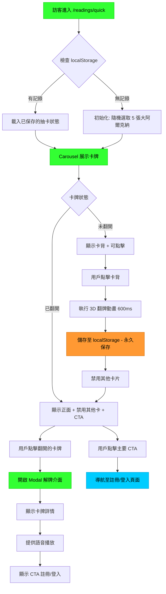
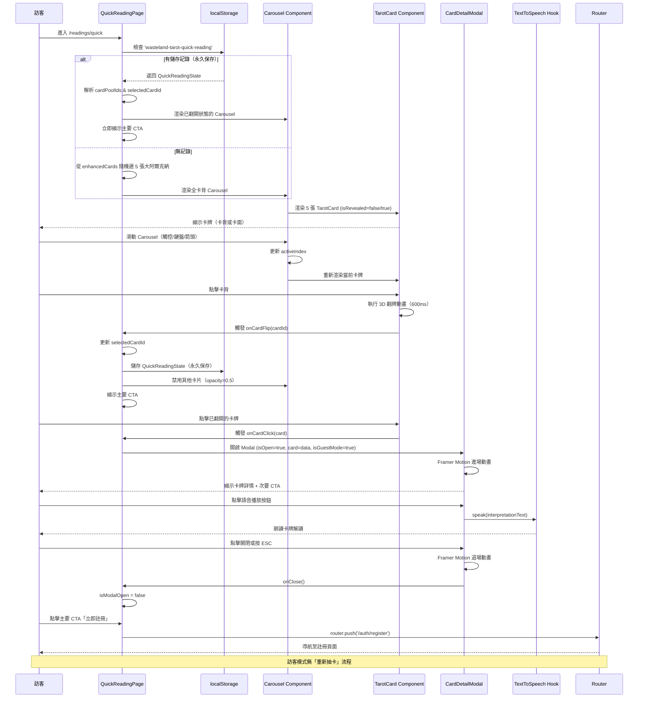
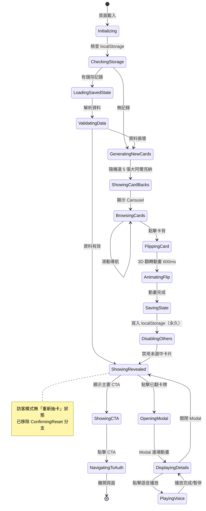
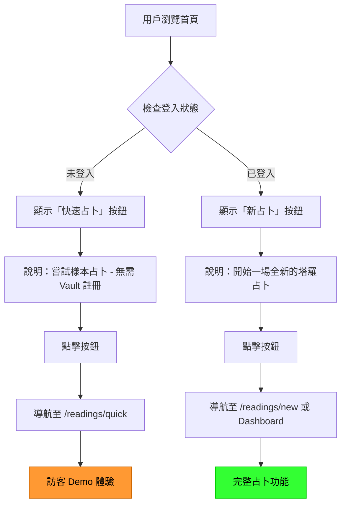
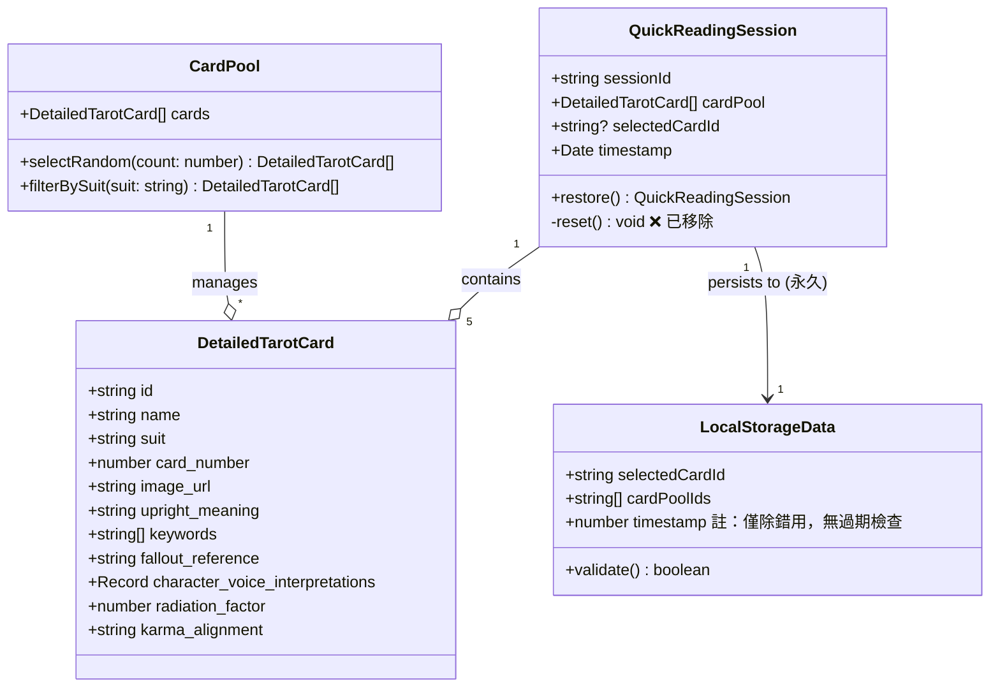
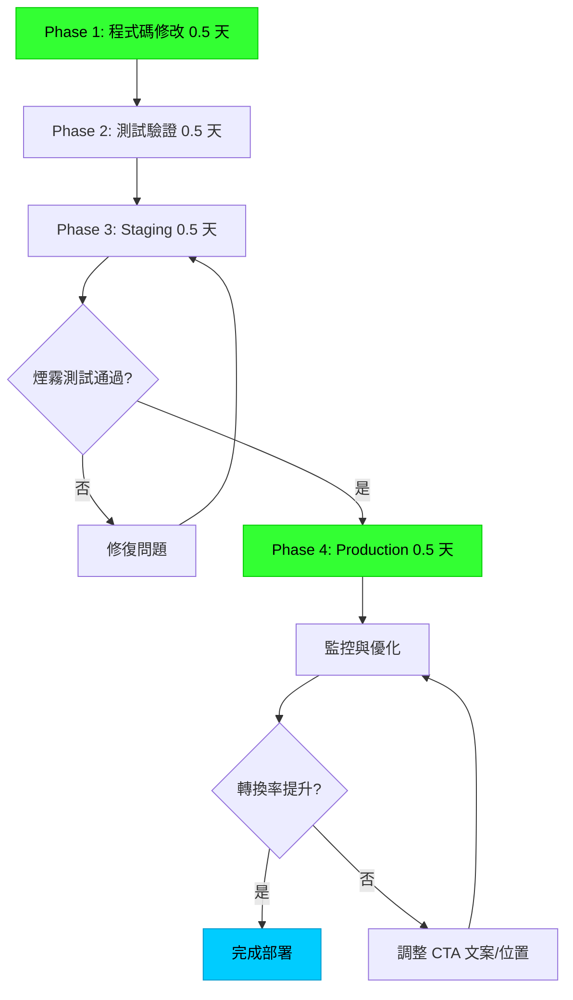

# 技術設計文件 v2.0 - 首頁快速占卜展示

## 版本資訊

**Document Version**: 2.0
**Last Updated**: 2025-10-08
**Status**: 設計更新完成，待審核
**變更摘要**:
- 移除訪客重新抽卡功能的設計規格
- 更新 localStorage 持久化策略（無過期機制）
- 新增首頁路由差異化處理設計
- 強化 CTA 文案設計
- 移除 `ConfirmDialog` 元件設計（不再需要）
- 更新資料流與狀態機設計

## Overview

本功能為首頁建立一個互動式快速占卜展示頁面，讓未登入訪客透過 Carousel 介面體驗**一次性**的廢土塔羅抽卡流程。訪客從 5 張大阿爾克納卡背中選擇一張進行翻轉，系統透過 localStorage **永久保存**狀態，選中卡牌以 Modal 展示詳細解讀並提供語音朗讀。

**核心變更（v2.0）**:
- **訪客模式特性**: 訪客只能體驗一次抽卡，結果會**永久保存**在 localStorage 中
- **無重新抽卡功能**: 訪客不提供重新抽卡選項，強調「定格的命運展示」稀缺性
- **首頁入口差異化**: 根據登入狀態顯示不同的按鈕文字與導向目標
- **強化轉換動機**: 透過「僅此一次」的價值主張，增強註冊誘因

**Purpose**: 此功能為訪客提供免註冊的占卜體驗，透過真實互動降低進入門檻，並透過**稀缺性設計**與明確的轉換機制最大化註冊率。

**Users**:
- 未登入訪客：使用此功能體驗一次性塔羅抽卡流程
- 已登入使用者：從首頁引導至完整占卜功能（`/readings/new` 或 Dashboard）

**Impact**: 在現有的 `/readings/quick` 路徑基礎上重構頁面，升級為完整的 Carousel 翻牌體驗，並新增 localStorage 永久持久化、Modal 解牌介面、語音播放與 CTA 轉換機制。**移除重新抽卡功能**以強化訪客限制。

### Goals

- 提供流暢的 Carousel 卡牌瀏覽與翻牌互動體驗（<300ms 轉場，600ms 翻牌動畫）
- 透過 localStorage 實現抽卡結果**永久持久化**，支援頁面重新整理與瀏覽器重啟後恢復
- 複用現有 `TarotCard` 與 `CardDetailModal` 元件，最小化新開發工作量
- 實現明確的雙層 CTA 導流機制，提升註冊轉換率至少 15%
- 符合 WCAG 2.1 AA 無障礙標準與響應式設計要求
- **強化訪客的「一次性體驗」感知**，透過稀缺性提升註冊動機

### Non-Goals

- 不實作多張卡牌選擇或複雜牌陣（僅單張卡牌）
- 不整合後端 API 或資料庫（使用 localStorage + 固定資料）
- 不實作 AI 生成解讀（使用 `enhancedCards.ts` 預先撰寫內容）
- 不實作社交分享、列印或自動播放 Carousel 功能
- ~~不實作 localStorage 過期機制（無限期保存）~~ - **已明確：永久保存，無過期機制**
- **不實作訪客的重新抽卡功能**（已明確移除）

## Architecture

### Existing Architecture Analysis

**現有架構模式**:
- Next.js 15 App Router 架構，頁面位於 `src/app/readings/quick/page.tsx`
- 現有頁面已實作 Carousel 與 localStorage 持久化（v1.0 實作）
- 元件架構：`src/components/tarot/` 已有完整的卡牌元件生態系統
- 狀態管理：使用 Zustand（`authStore`），快速占卜使用 React useState

**現有技術實作狀態**:
- ✅ Carousel 互動已實作（`CarouselContainer` 元件）
- ✅ 翻牌動畫已實作（`TarotCard` 元件）
- ✅ localStorage 服務已實作（`QuickReadingStorage` 類別）
- ✅ Modal 解牌介面已實作（`CardDetailModal` 元件）
- ❌ **重新抽卡功能需移除**（目前程式碼中第 360-369 行）
- ❌ **CTA 文案需強化**（目前程式碼中第 377-378 行）
- ✅ 首頁路由邏輯已實作（`/src/app/page.tsx` 第 18-25 行）

**需要移除的元件**:
- `ConfirmDialog` 元件（`/src/components/ui/ConfirmDialog.tsx`）- 用於重新抽卡確認，訪客模式不再需要

### High-Level Architecture



**關鍵變更**:
- 移除「重新抽卡」流程分支（舊版 T → U → V → D）
- localStorage 儲存標註為「永久保存」
- CTA 強調「一次性體驗」的稀缺性

### Technology Alignment

本功能為現有系統的擴展，完全對齊現有技術棧：

**前端技術棧對齊**:
- Next.js 15 (App Router) - 使用現有頁面路徑 `/src/app/readings/quick/page.tsx`
- React 19 - 使用現有元件生態系統
- TypeScript 5 - 遵循專案嚴格模式
- Tailwind CSS v4 - 使用 Pip-Boy 主題變數

**已安裝依賴**:
- ✅ Framer Motion (`motion@12.23.22`) - Carousel 動畫
- ✅ `embla-carousel-react` - Carousel 實作（已透過 `CarouselContainer` 封裝）
- ❌ ~~AlertDialog~~ - 不再需要（移除重新抽卡確認）

**複用現有元件**:
- `TarotCard.tsx` - 完整翻牌邏輯（3D 動畫、音效、觸控）
- `CardDetailModal.tsx` - Modal 解牌範本（Framer Motion、語音、分頁）
- `CarouselContainer.tsx` - Carousel 容器元件（已實作）
- `QuickReadingStorage` - localStorage 服務類別（已實作）
- `useTextToSpeech` hook - 語音播放功能
- `useAudioEffect` hook - 音效系統
- `enhancedCards.ts` - 大阿爾克納資料來源

**Steering 合規性**:
- 遵循 `structure.md`: 元件放置於 `/src/components/readings/`
- 遵循 `tech.md`: 使用 Bun 管理前端依賴，TypeScript 嚴格模式
- 遵循 `product.md`: Pip-Boy 風格設計，Fallout 主題一致性

### Key Design Decisions

#### Decision 1: 移除訪客重新抽卡功能

**Decision**: 完全移除訪客的重新抽卡按鈕與確認對話框

**Context**:
- 需求變更：從「提供重新抽卡確認對話框」變更為「訪客模式不提供重新抽卡」
- 商業目標：透過「一次性體驗」的稀缺性，增強註冊動機

**Alternatives**:
1. **保留重新抽卡，但需驗證碼** - 增加摩擦力但不夠直接
2. **限制重新抽卡次數（如每日一次）** - 仍需實作配額管理
3. **完全移除重新抽卡功能** - 最簡潔直接

**Selected Approach**: 完全移除

**Implementation**:
```typescript
// 移除 QuickReadingPage 中的重新抽卡按鈕（第 360-369 行）
// 移除 ConfirmDialog 元件引用（第 21, 431-440 行）
// 移除相關狀態與處理函式：
// - isResetDialogOpen
// - handleResetRequest
// - handleResetConfirm
```

**Rationale**:
- 強化「定格的命運展示」概念，增加稀缺性感知
- 簡化程式碼，移除不必要的狀態管理
- 降低維護成本（移除 ConfirmDialog 元件）
- 已登入使用者可在完整占卜頁面無限次抽卡

**Trade-offs**:
- 得到：更強的註冊動機、更簡潔的程式碼、更清晰的使用者體驗
- 犧牲：訪客無法重新體驗（但可透過清除 localStorage 手動重置，這是瀏覽器行為）

**Edge Case 處理**:
- 若訪客清除瀏覽器資料（localStorage），系統會自動重新初始化，允許再次抽卡
- 這是使用者的主動選擇，系統無需阻止

#### Decision 2: localStorage 永久持久化策略

**Decision**: localStorage 資料無過期時間，永久保存直到使用者清除或瀏覽器清理

**Context**:
- 需求明確：「無過期時間限制」（Requirement 3.7）
- 訪客的抽卡結果應在重新進入時直接顯示

**Alternatives**:
1. **設定 TTL（如 30 天過期）** - 需實作過期檢查邏輯
2. **永久保存** - 最簡單直接
3. **使用 IndexedDB** - 過度設計

**Selected Approach**: 永久保存

**Implementation**:
```typescript
// QuickReadingStorage 類別中無 TTL 檢查
interface LocalStorageData {
  selectedCardId: string
  cardPoolIds: string[]
  timestamp: number  // 僅用於除錯，不作為過期判斷
}

// 載入時不檢查時間戳記
load(): Result<LocalStorageData | null, StorageError> {
  const stored = localStorage.getItem(this.STORAGE_KEY)
  if (!stored) return { success: true, value: null }

  const parsed = JSON.parse(stored)
  // 無 timestamp 過期檢查
  if (!this.validate(parsed)) {
    this.clear()
    return { success: false, error: { type: 'INVALID_DATA', message: 'Corrupted data' }}
  }

  return { success: true, value: parsed as LocalStorageData }
}
```

**Rationale**:
- 符合「一次性體驗」的產品定位
- 簡化程式碼，無需時間戳記比較邏輯
- 使用者關閉瀏覽器後重新開啟，仍能看到相同結果

**Trade-offs**:
- 得到：實作簡單、使用者體驗一致
- 犧牲：localStorage 空間佔用（但僅 < 1KB，可忽略）

#### Decision 3: 首頁路由差異化處理

**Decision**: 首頁快速占卜按鈕根據登入狀態顯示不同文字與導向

**Context**:
- Requirement 10: 首頁快速占卜入口差異化處理
- 已登入使用者不應進入訪客 Demo 頁面

**Implementation**:
```typescript
// /src/app/page.tsx 中的邏輯（已實作）
const handleQuickReading = () => {
  if (user) {
    window.location.href = '/readings/new'  // 已登入 → 完整占卜
  } else {
    window.location.href = '/readings/quick'  // 未登入 → Demo 頁面
  }
}

// 按鈕文字與說明動態調整
<h3 className="text-xl font-bold text-pip-boy-green font-mono mb-2">
  {user ? '新占卜' : '快速占卜'}
</h3>
<p className="text-text-muted text-sm font-mono">
  {user ? '開始一場全新的塔羅占卜' : '嘗試樣本占卜 - 無需 Vault 註冊'}
</p>
```

**Rationale**:
- 區隔訪客體驗與完整功能
- 避免已登入使用者誤入受限的 Demo 頁面
- 提供清晰的功能定位

**Edge Case**:
- 已登入使用者直接訪問 `/readings/quick` URL → 允許訪問，但隱藏 CTA，顯示「前往完整占卜」按鈕

#### Decision 4: CTA 文案強化設計

**Decision**: 強調「僅此一次」的稀缺性與「無限次抽卡」的價值對比

**Context**:
- Requirement 9: 導流與轉換機制（強調訪客限制）
- 需要透過文案突顯註冊的價值

**Selected Approach**: 雙層 CTA 文案設計

**主要 CTA（Carousel 下方）**:
```typescript
<div className="mt-8 border-2 border-pip-boy-green p-6 animate-pulse-border">
  <div className="flex items-center gap-3 mb-4">
    <Spade className="w-8 h-8 text-pip-boy-green animate-pulse" />
    <h3 className="text-xl font-mono text-pip-boy-green">
      這是您的專屬命運展示 - 僅此一次
    </h3>
  </div>

  <p className="text-sm text-pip-boy-green/70 font-mono mb-4">
    想要探索更多可能性？註冊後可獲得：
  </p>

  <ul className="space-y-2 mb-6 text-sm font-mono text-pip-boy-green/80">
    <li>✓ 個人化 AI 解讀（Karma & Faction 系統）</li>
    <li>✓ 占卜記錄保存與歷史追蹤</li>
    <li>✓ 無限次抽卡，探索完整塔羅智慧</li>
    <li>✓ 多種牌陣選擇（三卡、Celtic Cross）</li>
  </ul>

  <div className="flex flex-col sm:flex-row gap-4">
    <button
      onClick={handleRegister}
      className="flex-1 border-2 border-pip-boy-green px-6 py-3 font-mono text-pip-boy-green hover:bg-pip-boy-green hover:text-black transition-all"
    >
      立即註冊 - 解鎖完整體驗
    </button>
    <button
      onClick={handleLogin}
      className="text-sm font-mono text-pip-boy-green hover:text-cyan-400 transition-colors"
    >
      已有帳號？立即登入 →
    </button>
  </div>
</div>
```

**次要 CTA（Modal 內）**:
```typescript
// 在 CardDetailModal 底部（isGuestMode={true} 時顯示）
{isGuestMode && (
  <div className="border-t border-pip-boy-green pt-4 mt-6">
    <p className="text-sm font-mono text-pip-boy-green/70 mb-3">
      想要更深入的解讀？註冊後可無限次抽卡
    </p>
    <Button onClick={() => router.push('/auth/register')}>
      立即註冊
    </Button>
    <Link href="/auth/login" className="text-xs text-pip-boy-green">
      已有帳號？立即登入
    </Link>
  </div>
)}
```

**Rationale**:
- 文案突顯「僅此一次」vs「無限次抽卡」的價值對比
- 使用清單列舉具體功能，增強說服力
- 雙層 CTA 提供多個轉換機會點

## System Flows

### User Interaction Flow



### State Machine: Card Selection Flow



### Homepage Navigation Flow



## Requirements Traceability

| Requirement | 需求摘要 | 實作元件 | 關鍵介面 | 流程參考 | 變更狀態 |
|-------------|---------|---------|---------|---------|---------|
| 1.1 | Carousel 顯示 5 張卡背 | `CarouselContainer`, `TarotCard` | `renderCarousel()`, `TarotCard.isRevealed=false` | User Interaction Flow | ✅ 已實作 |
| 1.2 | 隨機選取大阿爾克納 | `QuickReadingPage` | `initializeCardPool()` | State Machine: GeneratingNewCards | ✅ 已實作 |
| 1.3 | 支援箭頭/鍵盤/觸控導航 | `CarouselContainer` | `handleKeyDown()`, `drag` props | User Interaction Flow: 滑動 Carousel | ✅ 已實作 |
| 1.4 | 顯示位置指示器 | `CarouselContainer` | `PositionIndicator` component | - | ✅ 已實作 |
| 2.1 | 點擊卡背執行翻牌動畫 | `TarotCard` | `onClick`, `isFlipping` state | State Machine: FlippingCard → AnimatingFlip | ✅ 已實作 |
| 2.2 | 3D 翻轉 600ms | `TarotCard` | CSS `transform`, Framer Motion | - | ✅ 已實作 |
| 2.4 | 翻牌後禁用其他卡片 | `QuickReadingPage` | `disableOtherCards()` | State Machine: DisablingOthers | ✅ 已實作 |
| 2.7 | 已翻卡牌可點擊開 Modal | `TarotCard`, `QuickReadingPage` | `onCardClick()` | User Interaction Flow: 點擊已翻開卡牌 | ✅ 已實作 |
| 3.1 | 儲存至 localStorage | `QuickReadingPage` | `QuickReadingStorage.save()` | State Machine: SavingState | ✅ 已實作 |
| 3.3 | 重新整理載入先前結果 | `QuickReadingPage` | `QuickReadingStorage.load()` | State Machine: LoadingSavedState | ✅ 已實作 |
| 3.6 | 資料損壞時重新初始化 | `QuickReadingPage` | `validateStorageData()` | State Machine: ValidatingData → GeneratingNewCards | ✅ 已實作 |
| 3.7 | **無過期時間限制** | `QuickReadingStorage` | `load()` - 無 TTL 檢查 | - | 🆕 v2.0 強化 |
| 3.9 | **載入時直接進入已抽卡狀態** | `QuickReadingPage` | `useEffect` 初始化 | - | 🆕 v2.0 強化 |
| 4.1 | **訪客不顯示重新抽卡按鈕** | `QuickReadingPage` | 移除第 360-369 行 | - | 🆕 v2.0 移除功能 |
| 5.1 | 點擊卡牌開啟 Modal | `QuickReadingPage`, `CardDetailModal` | `openModal(card)` | User Interaction Flow: 開啟 Modal | ✅ 已實作 |
| 5.2 | Modal 顯示卡牌詳情 | `CardDetailModal` | `DetailedTarotCard` props | - | ✅ 已實作 |
| 6.2 | 語音播放 | `CardDetailModal`, `useTextToSpeech` | `speak()`, `pause()` | User Interaction Flow: 語音播放 | ✅ 已實作 |
| 9.1 | 翻牌後顯示主要 CTA | `QuickReadingPage` | `showMainCTA` state | State Machine: ShowingCTA | ✅ 已實作 |
| 9.3 | **強化 CTA 文案** | `QuickReadingPage` | 第 377-378 行更新 | - | 🆕 v2.0 強化 |
| 9.12 | **localStorage 有記錄時立即顯示 CTA** | `QuickReadingPage` | 初始化邏輯 | - | 🆕 v2.0 強化 |
| 10.1-10.7 | **首頁入口差異化處理** | `/src/app/page.tsx` | `handleQuickReading()` | Homepage Navigation Flow | 🆕 v2.0 新增 |

## Components and Interfaces

### Presentation Layer

#### QuickReadingPage (主頁面元件)

**Responsibility & Boundaries**
- **Primary Responsibility**: 協調快速占卜的完整流程，管理卡牌狀態、localStorage 永久持久化、Modal 與 CTA 顯示
- **Domain Boundary**: 位於 Presentation Layer，負責 UI 狀態管理與使用者互動
- **Data Ownership**: 管理當前會話的卡牌池（5 張）、選中卡牌 ID、localStorage 狀態
- **Transaction Boundary**: 單一頁面範疇，無跨頁面事務

**Dependencies**
- **Inbound**: 無（頂層頁面元件）
- **Outbound**:
  - `CarouselContainer` - Carousel 佈局與導航
  - `TarotCard` - 卡牌展示與翻牌動畫
  - `CardDetailModal` - Modal 解牌介面
  - ~~`ConfirmDialog`~~ - **已移除**（不再需要重新抽卡確認）
- **External**:
  - `localStorage` API - 狀態持久化
  - `next/navigation` - 路由導航
  - `/src/data/enhancedCards.ts` - 卡牌資料來源
  - `QuickReadingStorage` - localStorage 服務類別

**Contract Definition**

**State Interface**:
```typescript
interface QuickReadingState {
  // 卡牌池狀態
  cardPool: DetailedTarotCard[]          // 5 張大阿爾克納卡牌
  selectedCardId: string | null          // 已選中的卡牌 ID

  // UI 狀態
  isLoading: boolean                     // 頁面載入中
  isModalOpen: boolean                   // Modal 是否開啟
  // isResetDialogOpen: boolean          // ❌ 已移除（不再需要）

  // Carousel 狀態
  activeCardIndex: number                // 當前顯示的卡牌索引

  // 錯誤狀態
  error: string | null                   // 錯誤訊息
}

interface LocalStorageData {
  selectedCardId: string
  cardPoolIds: string[]
  timestamp: number  // 僅用於除錯，不作為過期判斷
}
```

**Key Methods**:
```typescript
// 初始化卡牌池
initializeCardPool(): DetailedTarotCard[]
// Preconditions: enhancedCards 已載入
// Postconditions: 返回 5 張不重複的大阿爾克納
// Invariants: cardPool.length === 5

// localStorage 操作（使用 QuickReadingStorage 類別）
// 已實作於 /src/lib/quickReadingStorage.ts

// 卡牌互動
handleCardFlip(cardId: string): void
// Preconditions: cardId 存在於 cardPool, selectedCardId === null
// Postconditions: selectedCardId 更新，其他卡片禁用，資料存入 localStorage（永久）

handleCardClick(card: DetailedTarotCard): void
// Preconditions: card.id === selectedCardId（已翻開）
// Postconditions: isModalOpen = true

// ❌ 已移除：handleResetRequest(), handleResetConfirm()

// 導航函式
handleRegister(): void
// Postconditions: 導航至 /auth/register

handleLogin(): void
// Postconditions: 導航至 /auth/login

handleGoBack(): void
// Postconditions: 導航至 /
```

**Error Handling**:
```typescript
type StorageError =
  | { type: 'QUOTA_EXCEEDED'; message: string }
  | { type: 'INVALID_DATA'; message: string }
  | { type: 'ACCESS_DENIED'; message: string }

// 錯誤處理策略
// QUOTA_EXCEEDED → 降級至 sessionStorage，顯示警告
// INVALID_DATA → 清除損壞資料，重新初始化
// ACCESS_DENIED → 降級至純記憶體狀態，顯示警告訊息
```

**v2.0 變更清單**:
```typescript
// 需要移除的程式碼（/src/app/readings/quick/page.tsx）
// 1. 第 21 行：移除 ConfirmDialog 引用
import { ConfirmDialog } from '@/components/ui/ConfirmDialog'  // ❌ 移除

// 2. 第 47 行：移除 isResetDialogOpen 狀態
const [isResetDialogOpen, setIsResetDialogOpen] = useState(false)  // ❌ 移除

// 3. 第 186-206 行：移除重新抽卡處理函式
const handleResetRequest = useCallback(() => { /* ... */ }, [])  // ❌ 移除
const handleResetConfirm = useCallback(() => { /* ... */ }, [])  // ❌ 移除

// 4. 第 360-369 行：移除重新抽卡按鈕
{selectedCardId && (
  <div className="flex justify-center mt-8">
    <button onClick={handleResetRequest}>重新抽卡</button>  // ❌ 移除
  </div>
)}

// 5. 第 431-440 行：移除 ConfirmDialog 元件
<ConfirmDialog
  isOpen={isResetDialogOpen}
  onClose={() => setIsResetDialogOpen(false)}
  onConfirm={handleResetConfirm}
  /* ... */
/>  // ❌ 移除

// 需要更新的程式碼
// 1. 第 377-378 行：強化 CTA 標題文案
<h3 className="text-xl font-mono text-pip-boy-green">
  這是您的專屬命運展示 - 僅此一次  // 🆕 更新
</h3>

// 2. 新增價值對比說明
<p className="text-sm text-pip-boy-green/70 font-mono mb-4">
  想要探索更多可能性？註冊後可獲得：  // 🆕 新增
</p>

// 3. 功能列表中強調「無限次抽卡」
<li>✓ 無限次抽卡，探索完整塔羅智慧</li>  // 🆕 更新
```

#### CarouselContainer (Carousel 容器元件)

**Responsibility & Boundaries**
- **Primary Responsibility**: 提供卡牌 Carousel 導航功能，支援觸控滑動、鍵盤與按鈕控制
- **Domain Boundary**: Presentation Layer - UI 互動元件
- **Data Ownership**: 管理當前顯示的卡牌索引
- **Transaction Boundary**: 元件內部狀態，透過 callback 通知父元件

**Status**: ✅ 已實作（`/src/components/readings/CarouselContainer.tsx`）

**Contract Definition**

**Component Interface**:
```typescript
interface CarouselContainerProps {
  cards: DetailedTarotCard[]
  selectedCardId: string | null
  activeIndex: number
  onIndexChange: (index: number) => void
  onCardFlip: (cardId: string) => void
  onCardClick: (card: DetailedTarotCard) => void
  isDisabled?: boolean
  children: (
    card: DetailedTarotCard,
    index: number,
    isActive: boolean
  ) => React.ReactNode
}
```

**Accessibility Contract**:
- **ARIA Attributes**: `role="region"`, `aria-label="卡牌選擇輪播"`
- **Keyboard Support**: Left/Right 箭頭導航，Tab 跳轉至卡牌
- **Screen Reader**: 宣告當前位置 `aria-live="polite"` 「第 3 張，共 5 張」

**v2.0 變更**: 無需變更（功能不受影響）

#### TarotCard (卡牌元件 - 複用現有)

**Responsibility & Boundaries**
- **Primary Responsibility**: 展示單張卡牌，處理翻牌動畫與點擊互動
- **Domain Boundary**: Presentation Layer - 卡牌視覺與動畫
- **Data Ownership**: 卡牌翻轉狀態（isRevealed）
- **Transaction Boundary**: 元件內部動畫狀態

**Status**: ✅ 已實作（`/src/components/tarot/TarotCard.tsx`）

**Integration Strategy**:
- **Modification Approach**: **零修改** - 直接複用現有元件
- **Usage Pattern**:
```typescript
<TarotCard
  card={card}
  isRevealed={card.id.toString() === selectedCardId}
  position="upright"
  size="large"
  flipStyle="kokonut"  // 使用 Pip-Boy 風格
  cardBackUrl="/assets/cards/card-backs/01.png"
  onClick={() => {
    if (!selectedCardId) {
      handleCardFlip(card.id.toString())
    } else if (card.id.toString() === selectedCardId) {
      handleCardClick(card)
    }
  }}
  isSelectable={!selectedCardId}  // 翻牌前可選
  isSelected={card.id.toString() === selectedCardId}
  showGlow={card.id.toString() === selectedCardId}
  enableHaptic={true}
  className={
    selectedCardId && card.id.toString() !== selectedCardId
      ? 'opacity-50 pointer-events-none'  // 禁用未選中卡片
      : ''
  }
/>
```

**v2.0 變更**: 無需變更（功能不受影響）

#### CardDetailModal (Modal 解牌元件)

**Responsibility & Boundaries**
- **Primary Responsibility**: 以 Modal 形式展示卡牌詳細資訊與語音播放
- **Domain Boundary**: Presentation Layer - 資訊展示與語音互動
- **Data Ownership**: Modal 開啟狀態、語音播放狀態
- **Transaction Boundary**: Modal 會話範疇

**Status**: ✅ 已實作（`/src/components/tarot/CardDetailModal.tsx`）

**Integration Strategy**:
- **Modification Approach**: 使用 `isGuestMode` prop 控制訪客模式顯示
- **Usage Pattern**:
```typescript
<CardDetailModal
  card={selectedCard}
  isOpen={isModalOpen}
  onClose={handleCloseModal}
  position="upright"
  isGuestMode={true}  // 訪客模式，隱藏進階功能
/>
```

**Guest Mode Features**:
- ✅ 顯示核心內容：圖片、名稱、含義、關鍵字
- ✅ 顯示語音播放功能
- ❌ 隱藏書籤功能（需登入）
- ❌ 隱藏分享功能（需登入）
- ❌ 隱藏學習模式（需登入）
- ✅ 顯示次要 CTA：「註冊後可無限次抽卡」

**v2.0 變更**:
```typescript
// 次要 CTA 文案強化（Modal 底部）
{isGuestMode && (
  <div className="border-t border-pip-boy-green pt-4 mt-6">
    <p className="text-sm font-mono text-pip-boy-green/70 mb-3">
      想要更深入的解讀？註冊後可無限次抽卡  {/* 🆕 強調「無限次」 */}
    </p>
    <Button onClick={() => router.push('/auth/register')}>
      立即註冊
    </Button>
    <Link href="/auth/login" className="text-xs text-pip-boy-green">
      已有帳號？立即登入
    </Link>
  </div>
)}
```

#### ConfirmDialog (確認對話框元件)

**Status**: ❌ 已移除（訪客模式不再需要）

**Reason**:
- 訪客無重新抽卡功能，不需要確認對話框
- 簡化程式碼與維護成本
- 已登入使用者的重新抽卡確認在完整占卜頁面處理

**Migration Path**:
```bash
# 移除元件檔案
rm /src/components/ui/ConfirmDialog.tsx

# 移除 QuickReadingPage 中的引用（如前述）
```

### Data Layer

#### QuickReadingStorage (localStorage 服務類別)

**Responsibility & Boundaries**
- **Primary Responsibility**: 封裝 localStorage 操作，提供型別安全的讀寫介面
- **Domain Boundary**: Infrastructure Layer - 資料持久化
- **Data Ownership**: 快速占卜狀態資料（key: `wasteland-tarot-quick-reading`）
- **Transaction Boundary**: 單次讀寫操作

**Status**: ✅ 已實作（`/src/lib/quickReadingStorage.ts`）

**Service Interface**:
```typescript
export class QuickReadingStorage {
  private readonly STORAGE_KEY = 'wasteland-tarot-quick-reading'

  isAvailable(): boolean
  // 檢查 localStorage 是否可用

  save(data: LocalStorageData): Result<void, StorageError>
  // 儲存資料至 localStorage（永久保存）

  load(): Result<LocalStorageData | null, StorageError>
  // 從 localStorage 讀取資料（無過期檢查）

  clear(): Result<void, StorageError>
  // 清除儲存的資料

  private validate(data: unknown): data is LocalStorageData
  // 驗證資料格式
}
```

**v2.0 確認**:
- ✅ `load()` 方法無 TTL 過期檢查（符合永久保存需求）
- ✅ `timestamp` 欄位僅用於除錯，不影響業務邏輯
- ✅ `validate()` 檢查資料格式但不檢查時間戳記

**Error Handling Strategy**:
1. **QUOTA_EXCEEDED**:
   - 降級至 sessionStorage
   - 顯示提示：「由於儲存空間限制，結果僅在當前分頁有效」
2. **INVALID_DATA**:
   - 自動清除損壞資料
   - 返回 null，觸發重新初始化
3. **ACCESS_DENIED**:
   - 檢測隱私模式
   - 降級至純記憶體狀態（useState only）
   - 顯示警告訊息：「瀏覽器隱私模式下無法保存結果」

### Homepage Integration

#### HomePage (首頁元件)

**Responsibility & Boundaries**
- **Primary Responsibility**: 提供首頁入口，根據登入狀態導向不同功能
- **Domain Boundary**: Presentation Layer - 路由導向
- **Data Ownership**: 無（讀取 `useAuthStore` 狀態）

**Status**: ✅ 已實作（`/src/app/page.tsx`）

**Route Handling Logic**:
```typescript
const user = useAuthStore(s => s.user)

const handleQuickReading = () => {
  if (user) {
    window.location.href = '/readings/new'  // 已登入 → 完整占卜
  } else {
    window.location.href = '/readings/quick'  // 未登入 → Demo 頁面
  }
}
```

**UI Differentiation**:
```typescript
<button onClick={handleQuickReading}>
  <Spade className="w-12 h-12 mb-4 mx-auto" />
  <h3>
    {user ? '新占卜' : '快速占卜'}  {/* 動態文字 */}
  </h3>
  <p>
    {user
      ? '開始一場全新的塔羅占卜'  {/* 已登入說明 */}
      : '嘗試樣本占卜 - 無需 Vault 註冊'  {/* 未登入說明 */}
    }
  </p>
</button>
```

**v2.0 變更**:
- ✅ 已實作登入狀態判斷邏輯（第 18-25 行）
- ✅ 已實作按鈕文字動態調整（第 101-104 行）
- 可選優化：微調按鈕說明文字以更突顯價值主張

## Data Models

### Domain Model



**Business Rules & Invariants**:
1. **卡牌池大小恆定**: `cardPool.length === 5`（始終 5 張卡）
2. **唯一選擇**: `selectedCardId` 必須存在於 `cardPoolIds` 中
3. **花色限制**: 所有卡牌必須為大阿爾克納（`suit === '大阿爾克那'`）
4. **不重複**: `cardPoolIds` 中無重複 ID
5. **時間戳記有效性**: `timestamp` 必須為有效的 Unix timestamp
6. **永久持久化**: localStorage 資料無過期時間，除非使用者手動清除

### Physical Data Model

#### localStorage Schema

**Key**: `wasteland-tarot-quick-reading`

**Value Structure**:
```typescript
{
  "selectedCardId": "12",                    // 選中卡牌 ID
  "cardPoolIds": ["0", "5", "12", "18", "21"], // 卡牌池 ID 陣列（保持順序）
  "timestamp": 1704672000000                  // Unix timestamp (ms) - 僅除錯用
}
```

**Storage Constraints**:
- **Size Limit**: ~1KB（localStorage 總限額約 5-10MB）
- **Key Naming**: 使用專案前綴避免衝突
- **TTL**: **無過期時間**，永久保存直到手動清除

**Data Validation**:
```typescript
// 驗證規則（已實作於 QuickReadingStorage.validate()）
const isValid = (data: unknown): data is LocalStorageData => {
  return (
    typeof data === 'object' && data !== null &&
    'selectedCardId' in data && typeof data.selectedCardId === 'string' &&
    'cardPoolIds' in data &&
    Array.isArray(data.cardPoolIds) &&
    data.cardPoolIds.length === 5 &&  // 恰好 5 個元素
    data.cardPoolIds.every((id: any) => typeof id === 'string') &&
    'timestamp' in data &&
    typeof data.timestamp === 'number' &&
    Number.isFinite(data.timestamp) &&
    data.timestamp > 0
    // 注意：無 timestamp 過期檢查
  )
}
```

**Serialization Format**:
```typescript
// 寫入
const serialize = (state: QuickReadingState): string => {
  return JSON.stringify({
    selectedCardId: state.selectedCardId,
    cardPoolIds: state.cardPool.map(c => c.id.toString()),
    timestamp: Date.now()  // 記錄時間但不作為過期判斷
  })
}

// 讀取
const deserialize = (
  data: LocalStorageData,
  allCards: DetailedTarotCard[]
): QuickReadingState => {
  const cardPool = data.cardPoolIds
    .map(id => allCards.find(c => c.id.toString() === id))
    .filter((c): c is DetailedTarotCard => c !== undefined)

  return {
    cardPool,
    selectedCardId: data.selectedCardId,
    // timestamp 不影響狀態恢復
  }
}
```

## Error Handling

### Error Strategy

本功能採用**漸進式降級**策略，確保核心抽卡體驗在各種錯誤情境下仍可用：

1. **localStorage 錯誤**: 降級至純記憶體狀態，顯示警告
2. **卡牌資料載入失敗**: 使用備用卡牌集或降級為簡化版占卜
3. **動畫/音效錯誤**: 靜默失敗，不中斷使用者流程
4. **Modal/語音錯誤**: 提供降級 UI，保持基本功能

### Error Categories and Responses

#### User Errors (Client-Side)

**無效操作**:
- **Scenario**: 用戶嘗試點擊已禁用的卡片
- **Response**: 靜默忽略（無視覺回饋），避免混淆
- **Implementation**: `onClick` 檢查 `isSelectable` 狀態，已禁用卡片套用 `pointer-events-none`

**localStorage 配額超限**:
- **Scenario**: `QuotaExceededError`
- **Response**:
  1. 降級至 `sessionStorage`
  2. 顯示提示：「由於儲存空間限制，結果僅在當前分頁有效」
- **Implementation**:
```typescript
save(data: LocalStorageData): Result<void, StorageError> {
  try {
    localStorage.setItem(this.STORAGE_KEY, JSON.stringify(data))
    return { success: true, value: undefined }
  } catch (error: any) {
    if (error.name === 'QuotaExceededError') {
      try {
        sessionStorage.setItem(this.STORAGE_KEY, JSON.stringify(data))
        // 顯示警告 toast
        return { success: true, value: undefined }
      } catch {
        return { success: false, error: { type: 'QUOTA_EXCEEDED', message: '...' }}
      }
    }
    return { success: false, error: { type: 'ACCESS_DENIED', message: error.message }}
  }
}
```

**隱私模式/localStorage 禁用**:
- **Scenario**: `SecurityError` 或 `localStorage` 為 `null`
- **Response**:
  1. 降級至純 React state（無持久化）
  2. 顯示提示：「瀏覽器隱私模式下無法保存結果，關閉分頁後將清除」
- **Implementation**:
```typescript
// QuickReadingStorage.isAvailable() 已實作檢查
const storage = new QuickReadingStorage()

useEffect(() => {
  if (!storage.isAvailable()) {
    console.warn('localStorage not available, using memory-only state')
    // 顯示警告 banner
  }
  // ...
}, [])
```

#### System Errors (Infrastructure)

**卡牌資料載入失敗**:
- **Scenario**: `enhancedCards.ts` 匯入失敗或資料格式錯誤
- **Response**:
  1. 捕捉錯誤並記錄
  2. 顯示錯誤訊息：「卡牌資料載入失敗」
  3. 提供「重新載入」按鈕或「返回首頁」選項
- **Implementation**:
```typescript
// 已實作於 QuickReadingPage 第 60-64 行
if (majorArcana.length === 0) {
  console.error('No Major Arcana cards found')
  setError('卡牌資料載入失敗')
  return []
}

// 錯誤 UI（第 248-266 行）
if (error || cardPool.length === 0) {
  return (
    <div className="error-container">
      <h1>系統錯誤</h1>
      <p>{error || '無法載入卡牌資料'}</p>
      <button onClick={handleGoBack}>返回首頁</button>
    </div>
  )
}
```

**localStorage 資料損壞**:
- **Scenario**: JSON 解析失敗或資料格式不符
- **Response**:
  1. 捕捉 `JSON.parse()` 錯誤
  2. 清除損壞資料：`localStorage.removeItem(key)`
  3. 重新初始化卡牌池
  4. 不顯示錯誤訊息（對用戶透明處理）
- **Implementation**:
```typescript
// QuickReadingStorage.load() 已實作（第 85-119 行）
load(): Result<LocalStorageData | null, StorageError> {
  try {
    const stored = localStorage.getItem(this.STORAGE_KEY)
    if (!stored) return { success: true, value: null }

    const parsed = JSON.parse(stored)  // 可能拋出 SyntaxError

    if (!this.validate(parsed)) {
      // 自動清除損壞資料
      this.clear()
      return {
        success: false,
        error: { type: 'INVALID_DATA', message: 'Corrupted data detected and cleared' }
      }
    }

    return { success: true, value: parsed as LocalStorageData }
  } catch (error: any) {
    // JSON 解析失敗
    this.clear()
    return {
      success: false,
      error: { type: 'INVALID_DATA', message: error.message || 'Failed to parse stored data' }
    }
  }
}
```

## Testing Strategy

### Unit Tests

**核心函式測試** (Jest / Vitest):

1. **localStorage Service**:
   - ✅ `save()` 成功寫入資料
   - ✅ `save()` 處理 `QuotaExceededError`
   - ✅ `load()` 成功讀取並反序列化
   - ✅ `load()` 處理損壞資料並清除
   - ✅ `validate()` 正確驗證資料格式
   - ✅ **無 TTL 過期檢查**（v2.0 確認）

2. **Card Pool Selection**:
   - ✅ `initializeCardPool()` 返回恰好 5 張不重複卡牌
   - ✅ 過濾出大阿爾克納
   - ✅ 處理空陣列或不足 5 張卡的邊界情況

3. **State Management Helpers**:
   - ✅ `handleCardFlip()` 更新 selectedCardId 並禁用其他卡片
   - ❌ ~~`handleReset()` 清除 localStorage 並重新初始化~~ - 已移除

**測試檔案**: `/src/lib/__tests__/quickReadingStorage.test.ts`（已存在）

**v2.0 測試更新**:
```typescript
// 新增測試：確認無過期檢查
describe('QuickReadingStorage', () => {
  it('should load data without TTL check', () => {
    const oldTimestamp = Date.now() - 365 * 24 * 60 * 60 * 1000  // 1 年前
    const data = {
      selectedCardId: '12',
      cardPoolIds: ['0', '5', '12', '18', '21'],
      timestamp: oldTimestamp
    }

    localStorage.setItem('wasteland-tarot-quick-reading', JSON.stringify(data))

    const storage = new QuickReadingStorage()
    const result = storage.load()

    expect(result.success).toBe(true)
    expect(result.value).toEqual(data)  // 無論時間戳記多久遠，都應成功載入
  })
})
```

### Integration Tests

**跨元件流程測試** (React Testing Library):

1. **完整抽卡流程**:
   - 頁面載入 → 顯示 5 張卡背
   - 點擊卡背 → 翻牌動畫 → localStorage 更新
   - 點擊翻開卡牌 → Modal 開啟 → 顯示詳情

2. **localStorage 持久化**:
   - 抽卡後重新整理頁面 → 狀態恢復
   - 損壞資料 → 自動清除並重新初始化
   - 隱私模式 → 降級至 memory state

3. ❌ **移除測試**: 重新抽卡確認對話框（不再需要）

### E2E Tests (Playwright)

**關鍵使用者路徑**:

1. **訪客首次抽卡流程** (`quick-reading-first-time.spec.ts`):
   - ✅ 已存在測試檔案：`/tests/e2e/quick-reading.spec.ts`
   - 確認測試涵蓋：初始狀態、翻牌、localStorage 儲存、CTA 顯示、Modal 開啟

2. **頁面重新整理狀態恢復** (`quick-reading-persistence.spec.ts`):
   - 測試重新整理後狀態恢復
   - **v2.0 新增**：測試瀏覽器關閉後重新開啟的狀態恢復

3. ❌ **移除測試**: 重新抽卡確認對話框流程

**v2.0 測試更新**:
```typescript
// /tests/e2e/quick-reading.spec.ts
test('訪客抽卡後無重新抽卡按鈕', async ({ page }) => {
  await page.goto('/readings/quick')

  // 抽卡
  await page.locator('[data-testid="card-back"]').first().click()
  await page.waitForTimeout(700)

  // 驗證無重新抽卡按鈕
  await expect(page.locator('button:has-text("重新抽卡")')).not.toBeVisible()
})

test('localStorage 永久保存（無過期）', async ({ page, context }) => {
  await page.goto('/readings/quick')
  await page.locator('[data-testid="card-back"]').first().click()
  await page.waitForTimeout(700)

  // 模擬時間流逝（修改 localStorage timestamp）
  await page.evaluate(() => {
    const data = JSON.parse(localStorage.getItem('wasteland-tarot-quick-reading')!)
    data.timestamp = Date.now() - 365 * 24 * 60 * 60 * 1000  // 1 年前
    localStorage.setItem('wasteland-tarot-quick-reading', JSON.stringify(data))
  })

  // 重新載入
  await page.reload()

  // 驗證狀態仍恢復（無過期檢查）
  await expect(page.locator('[data-testid="card-front"]').first()).toBeVisible()
})
```

### Performance Tests

**效能關鍵指標** (Lighthouse CI):

1. **頁面載入效能**:
   - **First Contentful Paint (FCP)**: < 1.5s
   - **Largest Contentful Paint (LCP)**: < 2.5s
   - **Time to Interactive (TTI)**: < 3.5s
   - **Cumulative Layout Shift (CLS)**: < 0.1

2. **動畫效能**:
   - 翻牌動畫 60fps 維持率 > 95%
   - Carousel 滑動 60fps 維持率 > 90%
   - Modal 開啟/關閉動畫 60fps 維持率 > 95%

3. **localStorage 操作效能**:
   - `save()` 操作 < 10ms
   - `load()` 操作 < 20ms
   - 驗證與反序列化 < 5ms

**測試檔案**: `/tests/e2e/animation-performance.spec.ts`（已存在）

## Security Considerations

### Data Protection

**localStorage 安全性**:
- **No Sensitive Data**: localStorage 僅儲存卡牌 ID 與時間戳記，無敏感資料
- **Client-Side Only**: 資料不傳輸至伺服器，無 XSS/CSRF 風險
- **Size Limit**: 資料大小 < 1KB，避免 DoS 攻擊
- **Input Validation**: 嚴格驗證 localStorage 資料格式（`QuickReadingStorage.validate()`），防止注入攻擊

**XSS Prevention**:
- **React Auto-Escaping**: React 自動轉義所有文字內容
- **No dangerouslySetInnerHTML**: 禁止使用 `dangerouslySetInnerHTML`
- **Sanitize User Input**: 無使用者輸入欄位，僅點擊互動

**Privacy Considerations**:
- **No Tracking**: 不收集使用者行為資料
- **No Third-Party Scripts**: 除 Framer Motion 外無第三方腳本
- **Browser Privacy Mode**: 支援隱私模式降級方案

### Content Security Policy

建議 CSP 設定（未來部署時配置）:
```
Content-Security-Policy:
  default-src 'self';
  script-src 'self' 'unsafe-inline' 'unsafe-eval';
  style-src 'self' 'unsafe-inline';
  img-src 'self' data: https:;
  font-src 'self' data:;
  connect-src 'self';
  frame-ancestors 'none';
```

**Notes**:
- `unsafe-inline` 與 `unsafe-eval` 為 Next.js 與 Framer Motion 所需
- 生產環境應使用 nonce 或 hash 取代 `unsafe-inline`
- 無需 `connect-src` 外部 API（純前端功能）

## Performance & Scalability

### Target Metrics

**Core Web Vitals**:
- **LCP (Largest Contentful Paint)**: < 2.0s（目標：1.5s）
- **FID (First Input Delay)**: < 100ms（目標：50ms）
- **CLS (Cumulative Layout Shift)**: < 0.1（目標：0.05）

**Custom Metrics**:
- **Carousel 轉場動畫**: < 300ms
- **翻牌動畫持續時間**: 600ms
- **Modal 開啟動畫**: < 300ms
- **localStorage 讀寫**: < 50ms

### Optimization Strategies

**圖片優化**:
- **Next.js Image Component**: 使用 `next/image` 自動優化卡牌圖片
- **Lazy Loading**: Carousel 中非當前卡牌延遲載入
- **WebP Format**: 卡牌圖片轉換為 WebP 格式（~30% 體積減少）

**程式碼分割**:
- **Dynamic Import**: Modal 元件使用 `next/dynamic` 延遲載入
```typescript
const CardDetailModal = dynamic(
  () => import('@/components/tarot/CardDetailModal').then(mod => ({ default: mod.CardDetailModal })),
  { ssr: false }
)
```

**狀態更新優化**:
- **useCallback Memoization**: 所有事件處理器使用 `useCallback`
- **useMemo for Derived State**: 卡牌池過濾、禁用狀態計算使用 `useMemo`

**動畫效能**:
- **GPU 加速**: 使用 `transform` 與 `opacity` CSS 屬性（避免 layout thrashing）
- **will-change Hint**: 翻牌元素添加 `will-change: transform`

### Caching Strategies

**靜態資源快取** (Next.js 自動處理):
- **卡牌圖片**: Cache-Control: `public, max-age=31536000, immutable`
- **JavaScript Bundles**: 內容雜湊檔名，長期快取
- **CSS**: 內聯至 HTML 或長期快取

**localStorage 快取**:
- **永久快取**: 無過期時間，除非用戶清除或重新抽卡
- **版本控制**: 未來若資料結構變更，檢查 `version` 欄位並遷移

## Migration Strategy

### Deployment Phases

#### Phase 1: 程式碼修改（0.5 天）
- 移除重新抽卡功能（QuickReadingPage）
- 移除 ConfirmDialog 元件
- 更新 CTA 文案
- 更新單元測試

#### Phase 2: 測試與驗證（0.5 天）
- 執行單元測試
- 執行 E2E 測試
- 跨瀏覽器測試

#### Phase 3: Staging 部署（0.5 天）
- 部署至 staging 環境
- 煙霧測試（smoke testing）
- 驗證 localStorage 永久保存行為

#### Phase 4: Production 部署（0.5 天）
- 部署至生產環境
- 監控錯誤與效能指標
- 驗證轉換率變化



### Rollback Strategy

**Rollback Triggers**:
- **Critical Bug**: 核心功能無法使用（如翻牌失敗、Modal 無法開啟）
- **Performance Regression**: LCP > 3s 或 FPS < 30
- **High Error Rate**: 錯誤率 > 5%

**Rollback Process**:
1. **Immediate Rollback**:
   - Vercel/Netlify 一鍵回滾至前一版本（< 1 分鐘）
2. **Data Cleanup**:
   - localStorage key 不衝突，無需清除資料
   - 新版與舊版 localStorage schema 相容
3. **Communication**:
   - 通知團隊與相關人員

**Validation Checkpoints**:
- ✅ 所有單元測試通過
- ✅ 所有 E2E 測試通過
- ✅ Lighthouse 分數 > 90（Performance, Accessibility, Best Practices）
- ✅ 無 console errors 或 warnings
- ✅ 跨瀏覽器測試通過（Chrome, Firefox, Safari, Edge）
- ✅ 移動裝置測試通過（iOS Safari, Android Chrome）
- ✅ localStorage 在隱私模式下正確降級

---

## Appendix: Code Changes Checklist

### Files to Modify

#### 1. `/src/app/readings/quick/page.tsx`

**移除**:
```typescript
// 第 21 行
import { ConfirmDialog } from '@/components/ui/ConfirmDialog'  // ❌ 移除

// 第 47 行
const [isResetDialogOpen, setIsResetDialogOpen] = useState(false)  // ❌ 移除

// 第 186-206 行
const handleResetRequest = useCallback(() => { /* ... */ }, [])  // ❌ 移除
const handleResetConfirm = useCallback(() => { /* ... */ }, [])  // ❌ 移除

// 第 360-369 行（重新抽卡按鈕）
{selectedCardId && (
  <div className="flex justify-center mt-8">
    <button onClick={handleResetRequest}>重新抽卡</button>
  </div>
)}  // ❌ 移除整個區塊

// 第 431-440 行（ConfirmDialog 元件）
<ConfirmDialog
  isOpen={isResetDialogOpen}
  onClose={() => setIsResetDialogOpen(false)}
  onConfirm={handleResetConfirm}
  /* ... */
/>  // ❌ 移除
```

**更新**:
```typescript
// 第 377 行附近（主要 CTA 標題）
<h3 className="text-xl font-mono text-pip-boy-green">
  這是您的專屬命運展示 - 僅此一次  {/* 🆕 更新文案 */}
</h3>

// 新增說明段落
<p className="text-sm text-pip-boy-green/70 font-mono mb-4">
  想要探索更多可能性？註冊後可獲得：  {/* 🆕 新增 */}
</p>

// 第 383 行附近（功能列表）
<li>✓ 無限次抽卡，探索完整塔羅智慧</li>  {/* 🆕 強調「無限次」 */}
```

#### 2. `/src/components/ui/ConfirmDialog.tsx`

**操作**: ❌ 刪除整個檔案（不再需要）

#### 3. `/src/app/page.tsx`

**可選優化**:
```typescript
// 第 104 行附近（快速占卜按鈕說明）
<p className="text-text-muted text-sm font-mono">
  {user
    ? '開始一場全新的塔羅占卜'
    : '體驗免費占卜 - 您的專屬命運展示'  {/* 🆕 可選：強化稀缺性 */}
  }
</p>
```

### Files to Test

#### Unit Tests
- ✅ `/src/lib/__tests__/quickReadingStorage.test.ts` - 新增無 TTL 檢查測試

#### E2E Tests
- ✅ `/tests/e2e/quick-reading.spec.ts` - 新增「無重新抽卡按鈕」測試
- ✅ 新增「localStorage 永久保存」測試

---

**Document Version**: 2.0
**Last Updated**: 2025-10-08
**Status**: 設計更新完成，待審核與實作
**Approver**: [待指派]
**Implementation ETA**: 2 天（程式碼修改 + 測試）
