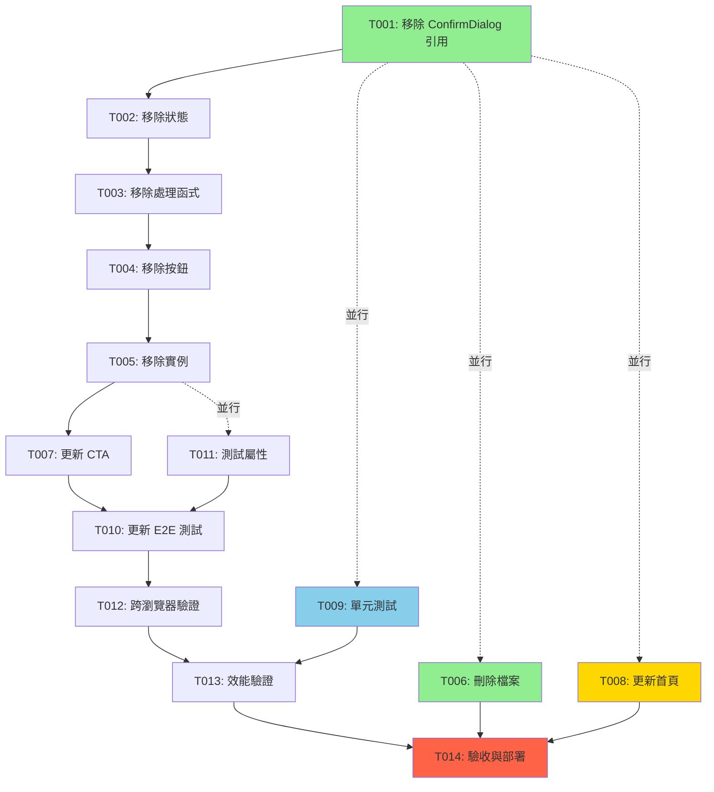

# 任務分解文件 v2.0 - 首頁快速占卜 Demo 更新

## 文件資訊

**Document Version**: 2.0
**Last Updated**: 2025-10-08
**Status**: 待審核
**Base Requirements**: requirements.md v2.0
**Base Design**: design.md v2.0
**Previous Version**: tasks.md v1.0 (初始實作已完成)
**Change Summary**: 移除訪客重新抽卡功能、強化 CTA 文案、更新測試

**Total Estimated Time**: 2 天（16 小時）

---

## 1. 專案摘要

### 專案名稱
首頁快速占卜 Demo - v2.0 更新（移除訪客重新抽卡功能）

### 更新背景
基於 v1.0 已完成的實作（tasks.md v1.0），根據新的產品策略進行以下核心變更：
1. **移除訪客重新抽卡功能** - 強化「一次性體驗」的稀缺性
2. **localStorage 永久持久化** - 移除 TTL 過期機制（已符合，需驗證）
3. **強化 CTA 文案** - 突顯「僅此一次」vs「無限次抽卡」價值對比
4. **首頁入口差異化** - 根據登入狀態調整按鈕文字與導向（已實作，可選優化）

### 總任務數
14 個任務（6 個核心變更任務 + 3 個測試任務 + 2 個驗收任務 + 3 個可選任務）

### 關鍵路徑
```
T001 → T002 → T003 → T004 → T005 → T007 → T010 → T012 → T013 → T014
```

### 並行執行機會
- **Phase 1**: T001-T005 可序列執行，T006 可並行
- **Phase 2**: T007, T008 可並行執行
- **Phase 3**: T009, T010, T011 可並行執行
- **Phase 4**: T012, T013 可並行執行

---

## 2. 執行階段

### Phase 1 - 程式碼移除（0.5 天，4 小時）
**目標**: 移除訪客重新抽卡功能的所有相關程式碼

**核心任務**:
- T001: 移除 ConfirmDialog 元件引用
- T002: 移除重新抽卡相關狀態
- T003: 移除重新抽卡處理函式
- T004: 移除重新抽卡按鈕 UI
- T005: 移除 ConfirmDialog 元件實例
- T006: 刪除 ConfirmDialog 元件檔案（並行）

**Quality Gate**:
- [ ] 專案編譯無錯誤（`bun run build`）
- [ ] 無 TypeScript 型別錯誤
- [ ] Git diff 確認變更範圍正確（約移除 50-60 行）
- [ ] 手動測試：頁面可正常載入

---

### Phase 2 - CTA 文案強化（0.25 天，2 小時）
**目標**: 更新 CTA 文案以強調「僅此一次」稀缺性

**核心任務**:
- T007: 更新主要 CTA 文案（Carousel 下方）
- T008: 更新首頁快速占卜按鈕說明（可選）

**Quality Gate**:
- [ ] 視覺檢查：CTA 文案清晰易讀
- [ ] 文案符合 requirements.md v2.0 Requirement 9
- [ ] 繁體中文用詞正確，無錯別字

---

### Phase 3 - 測試更新（0.5 天，4 小時）
**目標**: 更新測試以反映新行為，確保無迴歸問題

**核心任務**:
- T009: 新增單元測試 - localStorage 永久保存驗證
- T010: 更新 E2E 測試 - 移除重新抽卡測試 + 新增驗證測試
- T011: 更新 TarotCard 測試資料屬性（可選）

**Quality Gate**:
- [ ] 單元測試通過（`bun test`）
- [ ] E2E 測試通過（`npx playwright test`）
- [ ] 測試覆蓋率 > 85%（變更檔案）

---

### Phase 4 - 驗收與部署（0.75 天，6 小時）
**目標**: 跨瀏覽器測試、效能驗證、部署至 Production

**核心任務**:
- T012: 跨瀏覽器功能驗證
- T013: 效能與無障礙驗證
- T014: 最終驗收與部署

**Quality Gate**:
- [ ] Lighthouse Performance 分數 ≥ 90
- [ ] 跨瀏覽器測試通過（Chrome, Firefox, Safari, Edge）
- [ ] 無 Critical/High Bug
- [ ] Production 環境驗證通過

---

## 3. 任務清單

### T001: 移除 ConfirmDialog 元件引用

**Category**: Infrastructure / Code Cleanup
**Priority**: P0（必須）
**Estimated Effort**: 0.5 小時
**Dependencies**: 無

**Description**:
從 `/src/app/readings/quick/page.tsx` 中移除 `ConfirmDialog` 元件的 import 語句（第 21 行）。

**Inputs**:
- `/src/app/readings/quick/page.tsx`

**Outputs**:
- 更新的 `/src/app/readings/quick/page.tsx`（移除第 21 行）

**Implementation**:
```typescript
// 第 21 行 - 移除此行
// import { ConfirmDialog } from '@/components/ui/ConfirmDialog'
```

**Acceptance Criteria**:
- [ ] 第 21 行已移除
- [ ] 檔案編譯無錯誤
- [ ] 無 TypeScript 型別錯誤

**Responsible Role**: Frontend Developer

---

### T002: 移除重新抽卡相關狀態

**Category**: Frontend / State Management
**Priority**: P0（必須）
**Estimated Effort**: 0.5 小時
**Dependencies**: T001

**Description**:
從 `QuickReadingPage` 元件中移除 `isResetDialogOpen` state（第 47 行）。

**Inputs**:
- `/src/app/readings/quick/page.tsx`

**Outputs**:
- 更新的 `/src/app/readings/quick/page.tsx`（移除第 47 行）

**Implementation**:
```typescript
// 第 47 行 - 移除此行
// const [isResetDialogOpen, setIsResetDialogOpen] = useState(false)
```

**Acceptance Criteria**:
- [ ] 第 47 行已移除
- [ ] 元件編譯無錯誤
- [ ] 無未使用變數警告

**Responsible Role**: Frontend Developer

---

### T003: 移除重新抽卡處理函式

**Category**: Frontend / Business Logic
**Priority**: P0（必須）
**Estimated Effort**: 1 小時
**Dependencies**: T002

**Description**:
移除 `handleResetRequest` 與 `handleResetConfirm` 兩個 callback 函式（第 186-206 行）。

**Inputs**:
- `/src/app/readings/quick/page.tsx`

**Outputs**:
- 更新的 `/src/app/readings/quick/page.tsx`（移除第 186-206 行）

**Implementation**:
```typescript
// 第 186-206 行 - 移除這些函式
/*
const handleResetRequest = useCallback(() => {
  setIsResetDialogOpen(true)
}, [])

const handleResetConfirm = useCallback(() => {
  console.log('Resetting card pool...')
  storage.clear()
  const newCardPool = initializeCardPool()
  setCardPool(newCardPool)
  setSelectedCardId(null)
  setActiveCardIndex(0)
  setIsResetDialogOpen(false)
}, [initializeCardPool])
*/
```

**Acceptance Criteria**:
- [ ] 第 186-206 行已移除
- [ ] 元件編譯無錯誤
- [ ] 無未使用函式警告

**Responsible Role**: Frontend Developer

**Technical Notes**:
- 訪客無法主動清除 localStorage（僅能透過瀏覽器設定）
- 已登入使用者的重新抽卡功能在 `/readings/new` 完整占卜頁面提供

---

### T004: 移除重新抽卡按鈕 UI

**Category**: Frontend / UI Component
**Priority**: P0（必須）
**Estimated Effort**: 0.5 小時
**Dependencies**: T003

**Description**:
移除 Carousel 下方的「重新抽卡」按鈕（第 360-369 行）。

**Inputs**:
- `/src/app/readings/quick/page.tsx`

**Outputs**:
- 更新的 `/src/app/readings/quick/page.tsx`（移除第 360-369 行）

**Implementation**:
```typescript
// 第 360-369 行 - 移除整個區塊
/*
{selectedCardId && (
  <div className="flex justify-center mt-8">
    <button
      onClick={handleResetRequest}
      className="flex items-center gap-2 border-2 border-pip-boy-green px-6 py-3 font-mono text-pip-boy-green hover:bg-pip-boy-green hover:text-black transition-all duration-300"
    >
      <RefreshCw className="w-4 h-4" />
      重新抽卡
    </button>
  </div>
)}
*/
```

**Acceptance Criteria**:
- [ ] 第 360-369 行已移除
- [ ] UI 渲染正常（Carousel 下方直接顯示 CTA）
- [ ] 視覺檢查：無「重新抽卡」按鈕

**Responsible Role**: Frontend Developer

---

### T005: 移除 ConfirmDialog 元件實例

**Category**: Frontend / UI Component
**Priority**: P0（必須）
**Estimated Effort**: 0.5 小時
**Dependencies**: T004

**Description**:
移除頁面底部的 `ConfirmDialog` 元件實例（第 431-440 行）。

**Inputs**:
- `/src/app/readings/quick/page.tsx`

**Outputs**:
- 更新的 `/src/app/readings/quick/page.tsx`（移除第 431-440 行）

**Implementation**:
```typescript
// 第 431-440 行 - 移除整個區塊
/*
<ConfirmDialog
  isOpen={isResetDialogOpen}
  onClose={() => setIsResetDialogOpen(false)}
  onConfirm={handleResetConfirm}
  title="重新抽卡確認"
  message="此操作將清除當前的抽卡結果。您確定要重新開始嗎？"
  confirmText="確認重新抽卡"
  cancelText="取消"
  variant="warning"
/>
*/
```

**Acceptance Criteria**:
- [ ] 第 431-440 行已移除
- [ ] 頁面渲染正常
- [ ] 功能測試：翻牌後無對話框彈出

**Responsible Role**: Frontend Developer

---

### T006: 刪除 ConfirmDialog 元件檔案

**Category**: Infrastructure / File Cleanup
**Priority**: P0（必須）
**Estimated Effort**: 0.25 小時
**Dependencies**: T001（可並行執行）

**Description**:
刪除 `/src/components/ui/ConfirmDialog.tsx` 元件檔案。

**Inputs**:
- `/src/components/ui/ConfirmDialog.tsx`

**Outputs**:
- 刪除的檔案

**Implementation**:
```bash
# 使用 Git 刪除檔案
git rm src/components/ui/ConfirmDialog.tsx
```

**Acceptance Criteria**:
- [ ] 檔案已刪除
- [ ] 專案編譯無錯誤
- [ ] 全域搜尋確認無殘留引用

**Responsible Role**: Frontend Developer

**Technical Notes**:
- 此任務可與 T001-T005 並行執行
- 刪除前建議全域搜尋 `ConfirmDialog` 確認僅 quick reading 使用

---

### T007: 更新主要 CTA 文案

**Category**: Frontend / Content Update
**Priority**: P0（必須）
**Estimated Effort**: 1 小時
**Dependencies**: T005

**Description**:
強化主要 CTA（Carousel 下方）的文案，突顯「僅此一次」稀缺性與「無限次抽卡」價值對比。

**Inputs**:
- `/src/app/readings/quick/page.tsx`（第 377-390 行）
- requirements.md v2.0 Requirement 9

**Outputs**:
- 更新的 `/src/app/readings/quick/page.tsx`

**Implementation**:
```typescript
{/* 主要 CTA - 翻牌後顯示 */}
{selectedCardId && (
  <div className="mt-8 border-2 border-pip-boy-green p-6 animate-pulse-border">
    <div className="flex items-center gap-3 mb-4">
      <Spade className="w-8 h-8 text-pip-boy-green animate-pulse" />
      <h3 className="text-xl font-mono text-pip-boy-green">
        這是您的專屬命運展示 - 僅此一次  {/* 🆕 強調稀缺性 */}
      </h3>
    </div>

    <p className="text-sm text-pip-boy-green/70 font-mono mb-4">
      想要探索更多可能性？註冊後可獲得：  {/* 🆕 價值引導 */}
    </p>

    <ul className="space-y-2 mb-6 text-sm font-mono text-pip-boy-green/80">
      <li>✓ 個人化 AI 解讀（Karma & Faction 系統）</li>
      <li>✓ 占卜記錄保存與歷史追蹤</li>
      <li>✓ 無限次抽卡，探索完整塔羅智慧</li>  {/* 🆕 強調「無限次」 */}
      <li>✓ 多種牌陣選擇（三卡、Celtic Cross）</li>
    </ul>

    <div className="flex flex-col sm:flex-row gap-4">
      <button
        onClick={handleRegister}
        className="flex-1 border-2 border-pip-boy-green px-6 py-3 font-mono text-pip-boy-green hover:bg-pip-boy-green hover:text-black transition-all"
      >
        立即註冊 - 解鎖完整體驗  {/* 🆕 更新按鈕文案 */}
      </button>
      <button
        onClick={handleLogin}
        className="text-sm font-mono text-pip-boy-green hover:text-cyan-400 transition-colors"
      >
        已有帳號？立即登入 →
      </button>
    </div>
  </div>
)}
```

**Acceptance Criteria**:
- [ ] 標題包含「僅此一次」
- [ ] 說明段落包含「想要探索更多可能性？註冊後可獲得：」
- [ ] 功能列表包含「無限次抽卡，探索完整塔羅智慧」
- [ ] 按鈕文案更新為「立即註冊 - 解鎖完整體驗」
- [ ] 視覺檢查通過

**Responsible Role**: Frontend Developer + UX Writer（可選）

---

### T008: 更新首頁按鈕說明（可選）

**Category**: Frontend / Content Update
**Priority**: P2（可選）
**Estimated Effort**: 0.5 小時
**Dependencies**: 無

**Description**:
微調首頁快速占卜按鈕的說明文字，強化稀缺性感知（可選優化）。

**Inputs**:
- `/src/app/page.tsx`（第 104 行）

**Outputs**:
- 更新的 `/src/app/page.tsx`

**Implementation**:
```typescript
<p className="text-text-muted text-sm font-mono">
  {user
    ? '開始一場全新的塔羅占卜'
    : '體驗免費占卜 - 您的專屬命運展示'  {/* 🆕 可選優化 */}
  }
</p>
```

**Acceptance Criteria**:
- [ ] 文案更新（若執行）
- [ ] 視覺檢查通過

**Responsible Role**: Frontend Developer

**Technical Notes**:
- 此任務為可選優化（Priority: P2）
- 若時間緊迫，可跳過

---

### T009: 新增單元測試 - localStorage 永久保存

**Category**: Testing / Unit Test
**Priority**: P1（重要）
**Estimated Effort**: 1 小時
**Dependencies**: 無（可並行）

**Description**:
在 `/src/lib/__tests__/quickReadingStorage.test.ts` 新增測試案例，驗證 localStorage 無 TTL 過期檢查。

**Inputs**:
- `/src/lib/quickReadingStorage.ts`
- `/src/lib/__tests__/quickReadingStorage.test.ts`

**Outputs**:
- 更新的測試檔案

**Implementation**:
```typescript
describe('QuickReadingStorage - 永久保存驗證', () => {
  let storage: QuickReadingStorage

  beforeEach(() => {
    storage = new QuickReadingStorage()
    localStorage.clear()
  })

  it('should load data without TTL check - 1 year old', () => {
    const oldTimestamp = Date.now() - 365 * 24 * 60 * 60 * 1000
    const data: LocalStorageData = {
      selectedCardId: '12',
      cardPoolIds: ['0', '5', '12', '18', '21'],
      timestamp: oldTimestamp,
    }

    localStorage.setItem('wasteland-tarot-quick-reading', JSON.stringify(data))

    const result = storage.load()

    expect(result.success).toBe(true)
    expect(result.value).toEqual(data)
  })

  it('should load data without TTL check - 10 years old', () => {
    const veryOldTimestamp = Date.now() - 10 * 365 * 24 * 60 * 60 * 1000
    const data: LocalStorageData = {
      selectedCardId: '5',
      cardPoolIds: ['1', '3', '5', '9', '13'],
      timestamp: veryOldTimestamp,
    }

    localStorage.setItem('wasteland-tarot-quick-reading', JSON.stringify(data))

    const result = storage.load()

    expect(result.success).toBe(true)
    expect(result.value).toEqual(data)
  })

  it('should accept any valid positive timestamp', () => {
    const minTimestamp = 1
    const data: LocalStorageData = {
      selectedCardId: '0',
      cardPoolIds: ['0', '1', '2', '3', '4'],
      timestamp: minTimestamp,
    }

    localStorage.setItem('wasteland-tarot-quick-reading', JSON.stringify(data))

    const result = storage.load()

    expect(result.success).toBe(true)
    expect(result.value?.timestamp).toBe(minTimestamp)
  })

  it('should reject invalid timestamps', () => {
    const invalidData = {
      selectedCardId: '7',
      cardPoolIds: ['2', '7', '11', '15', '20'],
      timestamp: -1,
    }

    localStorage.setItem('wasteland-tarot-quick-reading', JSON.stringify(invalidData))

    const result = storage.load()

    expect(result.success).toBe(false)
    expect(result.error?.type).toBe('INVALID_DATA')
  })
})
```

**Acceptance Criteria**:
- [ ] 至少 4 個測試案例
- [ ] 所有測試通過
- [ ] 測試覆蓋率 > 90%

**Responsible Role**: Frontend Developer / QA Engineer

---

### T010: 更新 E2E 測試

**Category**: Testing / E2E Test
**Priority**: P1（重要）
**Estimated Effort**: 1.5 小時
**Dependencies**: T005

**Description**:
更新 `/tests/e2e/quick-reading.spec.ts`，移除重新抽卡測試，新增驗證測試。

**Inputs**:
- `/tests/e2e/quick-reading.spec.ts`

**Outputs**:
- 更新的測試檔案

**Implementation**:
```typescript
import { test, expect } from '@playwright/test'

test.describe('Quick Reading - Guest Mode (v2.0)', () => {
  test.beforeEach(async ({ page }) => {
    await page.goto('/readings/quick')
    await page.evaluate(() => localStorage.clear())
    await page.reload()
  })

  test('訪客抽卡後無重新抽卡按鈕', async ({ page }) => {
    await page.goto('/readings/quick')
    await page.waitForSelector('[data-testid="carousel-container"]')

    const firstCard = page.locator('[data-testid="card-back"]').first()
    await firstCard.click()
    await page.waitForTimeout(700)

    const resetButton = page.locator('button:has-text("重新抽卡")')
    await expect(resetButton).not.toBeVisible()

    const ctaBlock = page.locator('text=這是您的專屬命運展示 - 僅此一次')
    await expect(ctaBlock).toBeVisible()
  })

  test('localStorage 永久保存', async ({ page }) => {
    await page.goto('/readings/quick')
    await page.waitForSelector('[data-testid="carousel-container"]')

    const firstCard = page.locator('[data-testid="card-back"]').first()
    await firstCard.click()
    await page.waitForTimeout(700)

    const selectedCardId = await page.evaluate(() => {
      const data = JSON.parse(localStorage.getItem('wasteland-tarot-quick-reading') || '{}')
      return data.selectedCardId
    })

    expect(selectedCardId).toBeTruthy()

    // 模擬 1 年前的時間戳記
    await page.evaluate(() => {
      const data = JSON.parse(localStorage.getItem('wasteland-tarot-quick-reading')!)
      data.timestamp = Date.now() - 365 * 24 * 60 * 60 * 1000
      localStorage.setItem('wasteland-tarot-quick-reading', JSON.stringify(data))
    })

    await page.reload()
    await page.waitForTimeout(500)

    const cardFront = page.locator('[data-testid="card-front"]').first()
    await expect(cardFront).toBeVisible()
  })

  test('訪客重新進入頁面直接顯示已翻開卡牌', async ({ page }) => {
    await page.goto('/readings/quick')
    await page.waitForSelector('[data-testid="carousel-container"]')

    const firstCard = page.locator('[data-testid="card-back"]').first()
    await firstCard.click()
    await page.waitForTimeout(700)

    await page.close()

    const newPage = await page.context().newPage()
    await newPage.goto('/readings/quick')
    await newPage.waitForTimeout(500)

    const cardFront = newPage.locator('[data-testid="card-front"]').first()
    await expect(cardFront).toBeVisible()

    const ctaBlock = newPage.locator('text=這是您的專屬命運展示 - 僅此一次')
    await expect(ctaBlock).toBeVisible()

    await newPage.close()
  })
})
```

**Acceptance Criteria**:
- [ ] 移除重新抽卡相關測試
- [ ] 新增至少 3 個驗證測試
- [ ] 所有測試通過

**Responsible Role**: QA Engineer / Frontend Developer

---

### T011: 更新測試資料屬性（可選）

**Category**: Testing / UI Component
**Priority**: P2（可選）
**Estimated Effort**: 0.5 小時
**Dependencies**: 無

**Description**:
在 `TarotCard` 與 `CarouselContainer` 元件中新增 `data-testid` 屬性（如尚未存在）。

**Inputs**:
- `/src/components/tarot/TarotCard.tsx`
- `/src/components/readings/CarouselContainer.tsx`

**Outputs**:
- 更新的元件檔案

**Implementation**:
```typescript
// TarotCard 元件
<div
  data-testid={isRevealed ? 'card-front' : 'card-back'}
  className={/* ... */}
>
  {/* 內容 */}
</div>

// CarouselContainer 元件
<div
  data-testid="carousel-container"
  className={/* ... */}
>
  {/* 內容 */}
</div>
```

**Acceptance Criteria**:
- [ ] 元件包含 `data-testid`
- [ ] E2E 測試可使用 `data-testid` 定位

**Responsible Role**: Frontend Developer

**Technical Notes**:
- 此任務為可選優化（Priority: P2）

---

### T012: 跨瀏覽器功能驗證

**Category**: Testing / Cross-Browser
**Priority**: P1（重要）
**Estimated Effort**: 2 小時
**Dependencies**: T010

**Description**:
在 Chrome、Firefox、Safari、Edge 中手動測試更新後的功能。

**Inputs**:
- 更新後的 `/src/app/readings/quick/page.tsx`
- 測試環境：Chrome, Firefox, Safari, Edge

**Outputs**:
- 測試報告（含截圖）

**Testing Checklist**:
- [ ] Chrome: 載入 → 翻牌 → 無重新抽卡按鈕 → CTA 顯示
- [ ] Firefox: 同上
- [ ] Safari: 同上
- [ ] Edge: 同上
- [ ] 所有瀏覽器：重新整理後狀態恢復
- [ ] 所有瀏覽器：關閉瀏覽器後重新開啟狀態恢復
- [ ] 隱私模式：狀態清除（預期行為）

**Acceptance Criteria**:
- [ ] 所有瀏覽器測試通過
- [ ] localStorage 行為一致
- [ ] 無 console errors

**Responsible Role**: QA Engineer

---

### T013: 效能與無障礙驗證

**Category**: Testing / Performance & Accessibility
**Priority**: P1（重要）
**Estimated Effort**: 1.5 小時
**Dependencies**: T012

**Description**:
使用 Lighthouse 與 axe DevTools 驗證效能與無障礙性。

**Inputs**:
- 更新後的頁面
- Lighthouse CLI
- axe DevTools

**Outputs**:
- Lighthouse 報告
- 無障礙檢測報告

**Testing Checklist**:
- [ ] Performance ≥ 90
- [ ] Accessibility ≥ 90
- [ ] Best Practices ≥ 90
- [ ] LCP < 2.5s
- [ ] FID < 100ms
- [ ] CLS < 0.1
- [ ] 無 Critical/Serious 無障礙問題
- [ ] 鍵盤導航可用

**Acceptance Criteria**:
- [ ] Lighthouse Performance ≥ 90
- [ ] 無無障礙問題
- [ ] Core Web Vitals 達標

**Responsible Role**: QA Engineer / Performance Engineer

---

### T014: 最終驗收與部署

**Category**: Deployment / Production Validation
**Priority**: P0（必須）
**Estimated Effort**: 2 小時
**Dependencies**: T013

**Description**:
執行最終驗收，部署至 Staging 與 Production 環境。

**Inputs**:
- 所有完成的程式碼變更
- Staging 環境
- Production 環境

**Outputs**:
- Staging 部署
- Production 部署
- 驗收報告

**Deployment Checklist**:
- [ ] 所有程式碼變更已提交至 Git
- [ ] PR 已建立並審核通過
- [ ] 無 TypeScript/ESLint 錯誤
- [ ] 單元測試通過
- [ ] E2E 測試通過
- [ ] 跨瀏覽器測試通過
- [ ] 效能驗證通過
- [ ] Staging 煙霧測試通過
- [ ] Production 部署成功
- [ ] Production 煙霧測試通過
- [ ] 無 Critical Bug
- [ ] 產品負責人驗收通過

**Rollback Plan**:
- [ ] 若發現 Critical Bug，執行一鍵回滾
- [ ] 通知團隊與相關人員

**Acceptance Criteria**:
- [ ] Staging 驗證通過
- [ ] Production 部署成功
- [ ] 無 Critical/High Bug
- [ ] PO 驗收通過

**Responsible Role**: DevOps Engineer / Tech Lead

---

## 4. 資源分配

### Frontend Developers
**需求**: 1-2 名
**任務**: T001-T009, T011
**預估工時**: 8 小時（1 名開發者）或 5 小時（2 名開發者）

---

### QA Engineers
**需求**: 1 名
**任務**: T010, T012-T013
**預估工時**: 5 小時

---

### DevOps Engineers
**需求**: 0.5 名
**任務**: T014
**預估工時**: 2 小時

---

## 5. 品質閘門

### After Phase 1 (程式碼移除完成)
- [ ] 專案編譯無錯誤
- [ ] 無 TypeScript 型別錯誤
- [ ] Git diff 確認變更範圍正確
- [ ] 手動測試：頁面可正常載入

**負責人**: Frontend Developer

---

### After Phase 2 (CTA 更新完成)
- [ ] 視覺檢查：CTA 文案清晰易讀
- [ ] 文案符合需求規格
- [ ] 繁體中文用詞正確

**負責人**: UX Writer + Frontend Developer

---

### After Phase 3 (測試完成)
- [ ] 單元測試通過
- [ ] E2E 測試通過
- [ ] 測試覆蓋率 > 85%

**負責人**: QA Engineer

---

### Final Delivery (最終交付)
- [ ] Lighthouse Performance ≥ 90
- [ ] 無無障礙問題
- [ ] 跨瀏覽器測試通過
- [ ] Production 驗證通過
- [ ] 無 Critical Bug
- [ ] PO 驗收通過

**負責人**: Tech Lead + PO

---

## 6. 風險與緩解策略

### 風險 1: localStorage 資料損壞
**機率**: 中
**影響**: 中
**緩解**: 已實作驗證與自動清除機制

---

### 風險 2: 跨瀏覽器行為不一致
**機率**: 低
**影響**: 中
**緩解**: T012 跨瀏覽器測試涵蓋主流瀏覽器

---

### 風險 3: 效能回歸
**機率**: 低
**影響**: 中
**緩解**: T013 Lighthouse 監控，移除程式碼實際上可減少 bundle size

---

### 風險 4: 文案更新後使用者體驗下降
**機率**: 低
**影響**: 低
**緩解**: 部署後監控註冊轉換率（目標：提升 15%）

---

## 7. 任務相依圖



---

## 8. 驗收標準總覽

### 功能驗收
- [ ] 訪客抽卡後無「重新抽卡」按鈕
- [ ] localStorage 永久保存（無 TTL）
- [ ] 訪客重新進入直接顯示已翻開卡牌
- [ ] 首頁按鈕根據登入狀態調整
- [ ] CTA 文案包含「僅此一次」與「無限次抽卡」

---

### 技術驗收
- [ ] 專案編譯無錯誤
- [ ] 單元測試覆蓋率 > 85%
- [ ] E2E 測試通過
- [ ] Lighthouse Performance ≥ 90
- [ ] 無 console errors

---

### 跨瀏覽器驗收
- [ ] Chrome 正常
- [ ] Firefox 正常
- [ ] Safari 正常
- [ ] Edge 正常

---

### 效能驗證
- [ ] LCP < 2.5s
- [ ] FID < 100ms
- [ ] CLS < 0.1
- [ ] 動畫 60fps

---

### 無障礙驗證
- [ ] axe 無 Critical/Serious 問題
- [ ] 鍵盤導航可用
- [ ] 螢幕閱讀器支援
- [ ] 色彩對比度符合 WCAG AA

---

## 9. 交付清單

### 程式碼交付
- [ ] 更新的 `/src/app/readings/quick/page.tsx`
- [ ] 刪除的 `/src/components/ui/ConfirmDialog.tsx`
- [ ] 更新的 `/src/app/page.tsx`（可選）
- [ ] 更新的 `/src/lib/__tests__/quickReadingStorage.test.ts`
- [ ] 更新的 `/tests/e2e/quick-reading.spec.ts`

---

### 測試交付
- [ ] 單元測試報告
- [ ] E2E 測試報告
- [ ] 跨瀏覽器測試報告
- [ ] Lighthouse 報告
- [ ] axe 檢測報告

---

### 文件交付
- [ ] 更新的 `tasks.md`（本文件）
- [ ] Git commit messages
- [ ] PR 描述
- [ ] Deployment 日誌

---

### 驗收交付
- [ ] PO 簽核
- [ ] UX 設計師簽核
- [ ] 技術負責人簽核

---

## 10. 時程預估

### 最佳情境（12 小時）
2 名開發者並行執行，無阻塞問題

| Phase | 時間 | 並行執行 |
|-------|------|---------|
| Phase 1 | 2 小時 | T001-T005 (開發者 A), T006 (開發者 B) |
| Phase 2 | 1 小時 | T007 (開發者 A), T008 (開發者 B) |
| Phase 3 | 3 小時 | T009 (開發者 A), T010 (QA) |
| Phase 4 | 6 小時 | T012-T014 (QA + DevOps) |

---

### 現實情境（16 小時 / 2 天）
1 名開發者 + 1 名 QA，序列執行

| Phase | 時間 | 執行方式 |
|-------|------|---------|
| Phase 1 | 4 小時 | 開發者序列執行 |
| Phase 2 | 2 小時 | 開發者執行 |
| Phase 3 | 4 小時 | 開發者 + QA 並行 |
| Phase 4 | 6 小時 | QA + DevOps |

---

### 最壞情境（24 小時 / 3 天）
遇到阻塞問題

| Phase | 時間 | 潛在風險 |
|-------|------|---------|
| Phase 1 | 6 小時 | TypeScript 錯誤需修復 |
| Phase 2 | 3 小時 | CTA 文案多次迭代 |
| Phase 3 | 6 小時 | E2E 測試不穩定 |
| Phase 4 | 9 小時 | 效能回歸需優化 |

---

## 11. 聯絡人與責任

### 產品負責人（PO）
**姓名**: [待指派]
**責任**: 需求確認、驗收簽核、文案審核

---

### 技術負責人（Tech Lead）
**姓名**: [待指派]
**責任**: 程式碼審查、架構決策、風險管理

---

### Frontend Developer
**姓名**: [待指派]
**責任**: 執行 T001-T009, T011

---

### QA Engineer
**姓名**: [待指派]
**責任**: 執行 T010, T012-T013

---

### DevOps Engineer
**姓名**: [待指派]
**責任**: 執行 T014

---

## 12. 版本歷史

| 版本 | 日期 | 變更摘要 | 作者 |
|-----|------|---------|------|
| 1.0 | [v1.0 日期] | 初始實作（已完成） | [原作者] |
| 2.0 | 2025-10-08 | 移除重新抽卡功能、強化 CTA 文案、更新測試 | Claude Code |

---

## 13. 附錄：快速參考

### 關鍵檔案路徑
```
/src/app/readings/quick/page.tsx          # 主要修改檔案
/src/components/ui/ConfirmDialog.tsx      # 需刪除檔案
/src/app/page.tsx                         # 可選修改檔案
/src/lib/quickReadingStorage.ts           # 驗證無 TTL
/src/lib/__tests__/quickReadingStorage.test.ts  # 單元測試
/tests/e2e/quick-reading.spec.ts          # E2E 測試
```

---

### 關鍵命令
```bash
# 執行單元測試
bun test

# 執行 E2E 測試
npx playwright test

# 編譯專案
bun run build

# 啟動開發伺服器
bun dev

# Lighthouse 測試
lighthouse http://localhost:3000/readings/quick --output html

# 部署至 Staging
vercel --prod --scope=staging
```

---

### 關鍵 localStorage Key
```
wasteland-tarot-quick-reading
```

---

### 關鍵文案（繁體中文）
```
標題：這是您的專屬命運展示 - 僅此一次
說明：想要探索更多可能性？註冊後可獲得：
功能：無限次抽卡，探索完整塔羅智慧
按鈕：立即註冊 - 解鎖完整體驗
```

---

**Document End**

**Last Updated**: 2025-10-08
**Next Review**: 實作完成後更新驗收結果
**Status**: 待審核與實作
