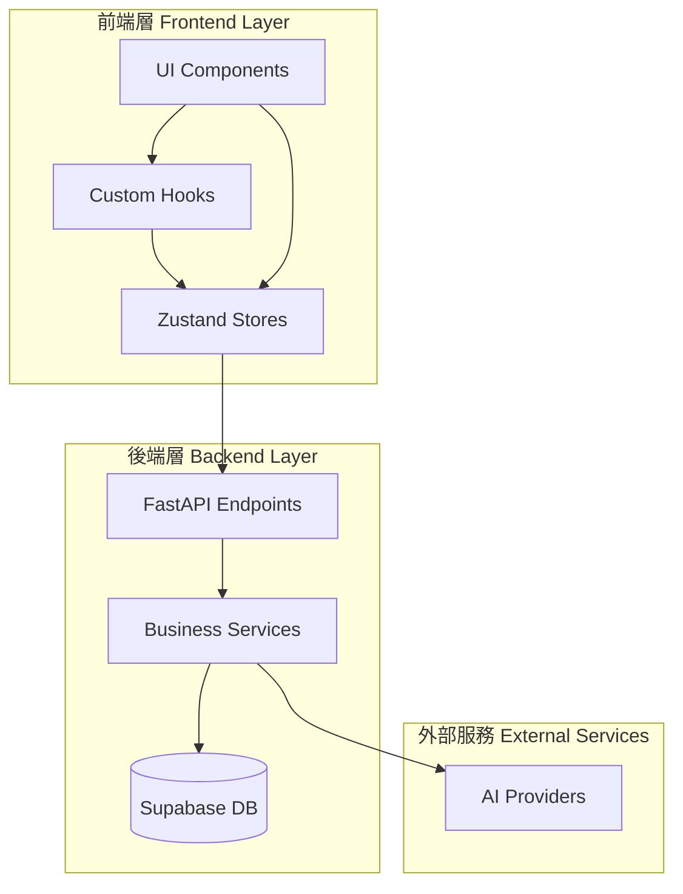
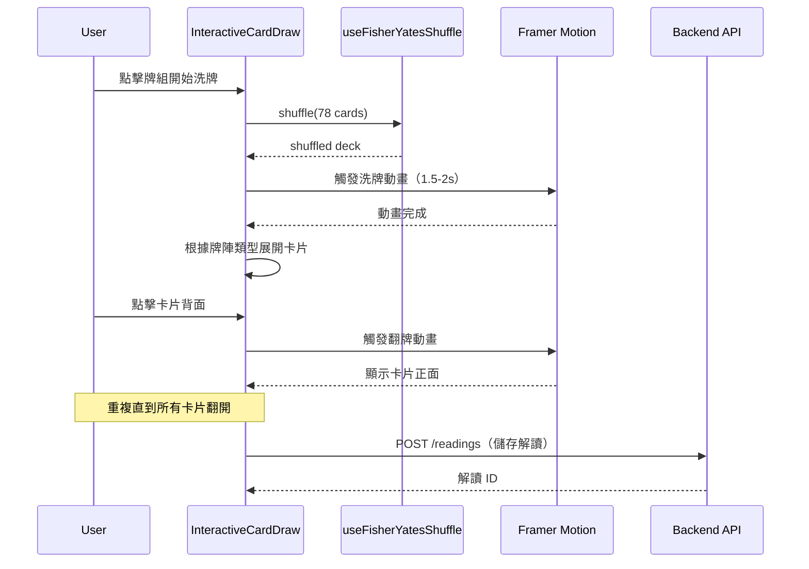
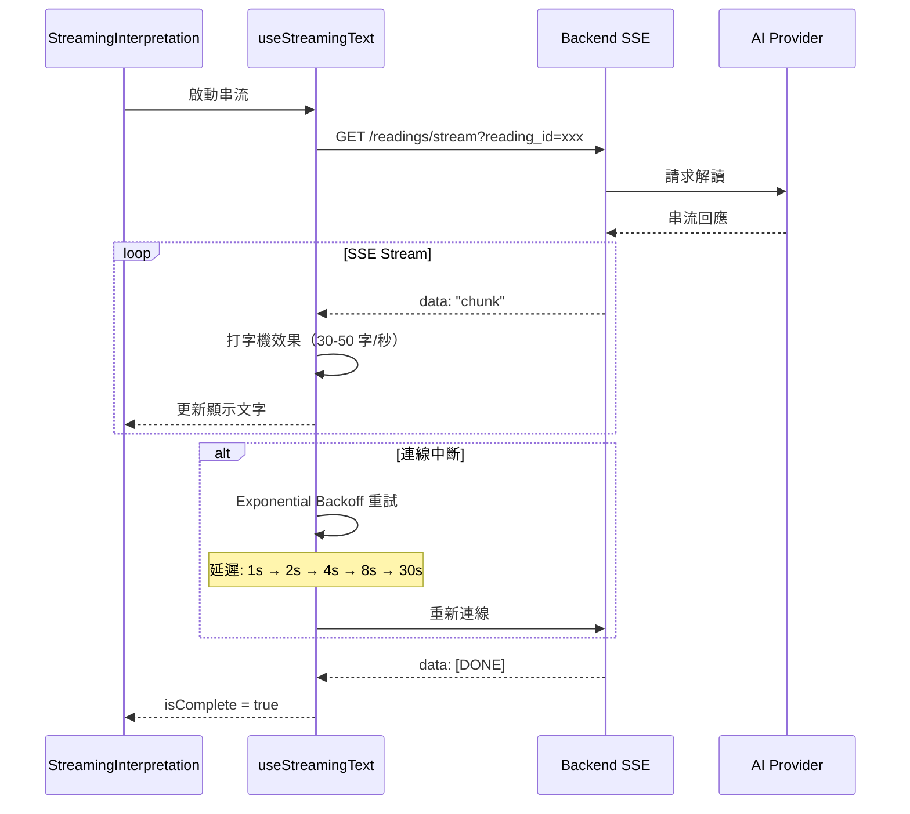
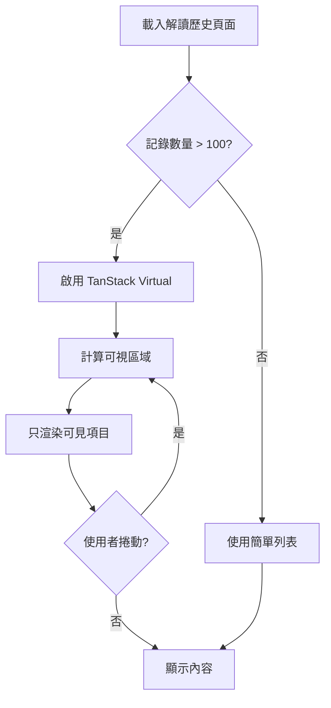
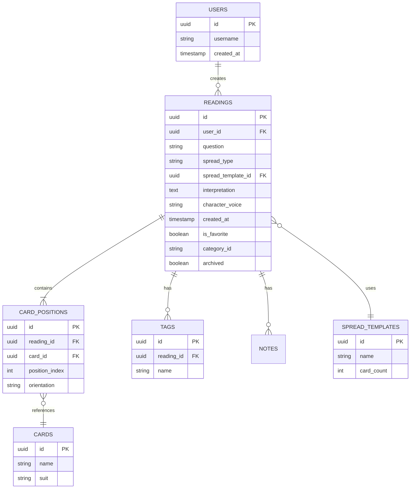
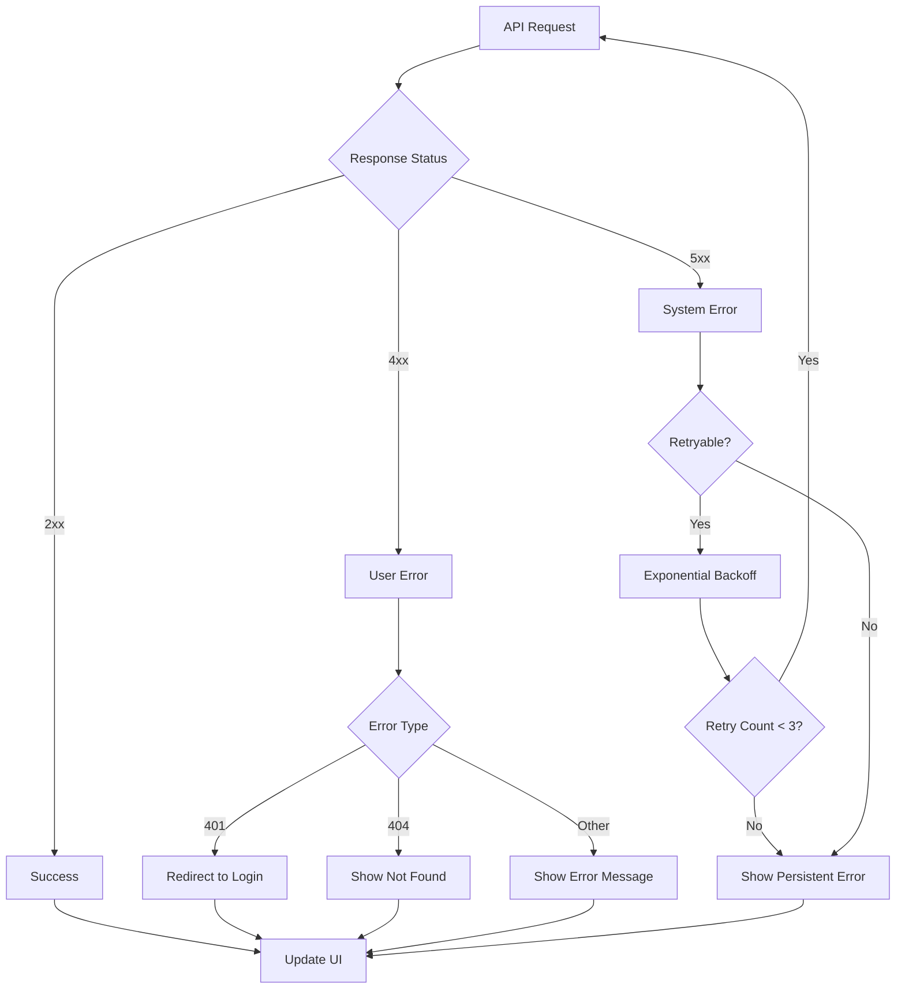
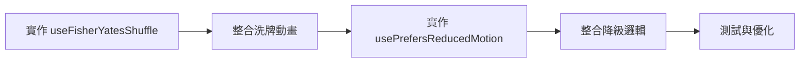

# 技術設計文件 - 互動式解讀體驗

## Overview

**Purpose**: 本功能為廢土塔羅平台提供沉浸式的卡牌抽取與解讀體驗，透過互動式洗牌、翻牌動畫、AI 即時解讀串流、以及解讀歷史管理系統，解決當前缺乏儀式感與使用者留存率低的問題。

**Users**: 所有註冊與訪客使用者將使用此功能進行塔羅牌解讀，特別是：
- **首次使用者**：透過互動式抽卡建立與平台的情感連結
- **回訪使用者**：透過歷史記錄查看過往解讀，建立使用習慣
- **重度使用者**：透過標籤、篩選、統計功能深度管理解讀記錄

**Impact**:
- **改變現狀**：從靜態隨機分配卡片變更為互動式抽卡流程
- **新增功能**：完整的解讀歷史管理系統（Holotape Archive）
- **效能優化**：支援 500+ 筆解讀記錄的流暢瀏覽

### Goals

- **提升參與感**：透過互動式洗牌與翻牌動畫，讓使用者感受「我選擇了這張牌」的儀式感
- **增加留存率**：提供完整的解讀歷史功能，讓使用者能回顧與管理過往記錄
- **確保效能**：所有動畫維持 60 FPS，歷史列表支援虛擬捲動，載入時間 < 5 秒
- **無障礙友善**：支援 `prefers-reduced-motion`，確保所有使用者都能順暢使用

### Non-Goals

- **不做 3D 動畫**：避免過度複雜的物理引擎或 3D 渲染，專注於流暢的 2D 動畫
- **不改變隨機邏輯**：保留現有的隨機性演算法，只改變前端體驗
- **不修改 API 結構**：向後相容現有的 API 端點，只新增必要的端點

## Architecture

### Existing Architecture Analysis

**現有架構模式**：
- **前端**：Next.js 15 App Router + React 19 + Zustand 狀態管理
- **後端**：FastAPI + PostgreSQL（Supabase）
- **現有元件**：
  - `CardDraw.tsx`：現有抽卡元件，支援手動/自動翻牌模式
  - `StreamingInterpretation.tsx`：AI 解讀串流顯示
  - `ReadingHistory.tsx`：基礎解讀歷史列表
  - `useStreamingText.ts`：SSE 串流 hook，已實現重試機制

**技術債務處理**：
- ✅ **SSE 重試機制已實現**：`useStreamingText.ts` 已包含 Exponential Backoff
- 🔧 **需增強**：Fisher-Yates 洗牌演算法（當前未實現）
- 🔧 **需增強**：TanStack Virtual 虛擬捲動（當前為簡單分頁）
- ✅ **已支援**：Framer Motion 動畫庫（motion v12.23.22）

### Architecture Pattern & Boundary Map

**Selected pattern**: **Feature-Driven Architecture** with **Clean Separation of Concerns**



**Domain/Feature Boundaries**:
- **抽卡體驗（Card Draw Experience）**：
  - Components: `InteractiveCardDraw`, `ShuffleAnimation`, `FlipAnimation`
  - Hooks: `useFisherYatesShuffle`, `usePrefersReducedMotion`
  - Responsibility: 管理洗牌、選牌、翻牌的互動邏輯

- **AI 解讀（AI Interpretation）**：
  - Components: `StreamingInterpretation`（已存在）
  - Hooks: `useStreamingText`（已存在）
  - Responsibility: 處理 AI 解讀的串流顯示與重試

- **解讀歷史（Reading History）**：
  - Components: `VirtualizedReadingList`, `ReadingFilters`, `ReadingDetail`
  - Hooks: `useVirtualScroll`, `useReadingFilters`
  - Store: `readingsStore`（已存在）
  - Responsibility: 管理解讀記錄的 CRUD、篩選、虛擬捲動

**Existing Patterns Preserved**:
- Zustand 用於全域狀態管理
- React Hook Form + Zod 用於表單驗證
- Framer Motion 用於動畫效果
- SSE 用於 AI 串流回應

**New Components Rationale**:
- `useFisherYatesShuffle`：需要無偏差的洗牌演算法
- `usePrefersReducedMotion`：無障礙性需求
- `VirtualizedReadingList`：效能需求（500+ 筆記錄）
- `ReadingFilters`：使用者體驗需求（搜尋與篩選）

### Technology Stack

| Layer | Choice / Version | Role in Feature | Notes |
|-------|------------------|-----------------|-------|
| **Frontend** |
| Animation | Framer Motion 12.23.22 | 洗牌、翻牌、過渡動畫 | ✅ 已安裝，使用 LazyMotion 減小 bundle |
| Virtual Scroll | TanStack Virtual 3.x | 解讀歷史虛擬捲動 | 🆕 需新增依賴（~6kb） |
| State | Zustand 5.0.8 | 全域狀態管理 | ✅ 已安裝 |
| Forms | React Hook Form 7.62 + Zod 4.1.9 | 篩選器表單驗證 | ✅ 已安裝 |
| **Backend** |
| Framework | FastAPI 0.104+ | API 端點 | ✅ 已安裝，只需新增端點 |
| Database | Supabase PostgreSQL | 解讀記錄持久化 | ✅ 已安裝，需新增欄位 |
| Streaming | SSE (Server-Sent Events) | AI 解讀串流 | ✅ 已實現 |
| **Algorithms** |
| Shuffle | Fisher-Yates (Durstenfeld) | 無偏差洗牌 | 🆕 需實作（純函式） |
| Retry | Exponential Backoff | SSE 重連機制 | ✅ 已實現於 `useStreamingText` |

**Rationale Summary**:
- **Framer Motion**：業界標準，GPU 加速，已安裝
- **TanStack Virtual**：2024 年最流行的虛擬捲動庫，bundle size 最小
- **Fisher-Yates**：數學驗證無偏差，O(n) 時間複雜度，業界標準
- **SSE**：相較 WebSocket 更輕量，單向串流適合 AI 解讀場景

更多技術選型細節請參考 `research.md`。

## System Flows

### 1. 互動式抽卡流程（Interactive Card Draw Flow）



**Key Decisions**:
- **洗牌在前端執行**：避免後端負擔，提供即時回饋
- **動畫時長控制**：洗牌 1.5-2s，翻牌每張 0.5s，確保不會過長
- **降級策略**：若幀率 < 30 FPS，自動切換為簡單淡入淡出

### 2. AI 解讀串流流程（AI Interpretation Stream Flow）



**Key Decisions**:
- **打字機速度**：30-50 字/秒（±20% 隨機變化模擬真人）
- **重試機制**：已實現於 `useStreamingText`，最多重試 5 次
- **降級處理**：若重試失敗，提供「重新生成」按鈕

### 3. 解讀歷史虛擬捲動流程（Virtualized History Flow）



**Key Decisions**:
- **100 筆為閾值**：< 100 筆使用簡單列表，≥ 100 筆啟用虛擬捲動
- **動態切換**：根據記錄數量自動決定渲染策略
- **Skeleton Screen**：載入時使用骨架屏，不使用 Loading Spinner

## Requirements Traceability

| Requirement | Summary | Components | Interfaces | Flows |
|-------------|---------|------------|------------|-------|
| 1.1 - 1.13 | 互動式卡牌抽取 | InteractiveCardDraw, ShuffleAnimation, FlipAnimation | useFisherYatesShuffle, usePrefersReducedMotion | 互動式抽卡流程 |
| 2.1 - 2.12 | AI 解讀串流 | StreamingInterpretation（已存在） | useStreamingText（已存在） | AI 解讀串流流程 |
| 3.1 - 3.14 | 解讀歷史儀表板 | VirtualizedReadingList, ReadingFilters, ReadingDetail | useVirtualScroll, useReadingFilters | 虛擬捲動流程 |
| 4.1 - 4.7 | 標籤與分類系統 | TagManager, CategorySelector | readingsStore（擴充） | - |
| 5.1 - 5.8 | 流程整合與導航 | NavigationBar, QuickActions | 路由整合 | - |
| 7.1 - 7.8 | 效能與載入優化 | 所有元件 | LazyMotion, TanStack Virtual | - |
| 8.1 - 8.11 | 無障礙性 | 所有元件 | usePrefersReducedMotion | - |

## Components and Interfaces

### Component Summary

| Component | Domain/Layer | Intent | Req Coverage | Key Dependencies | Contracts |
|-----------|--------------|--------|--------------|------------------|-----------|
| InteractiveCardDraw | UI/抽卡 | 互動式卡牌抽取主元件 | 1.1-1.13 | useFisherYatesShuffle (P0), Framer Motion (P0) | Service, State |
| useFisherYatesShuffle | Hooks/演算法 | 無偏差洗牌演算法 | 1.3 | 無外部依賴 (P0) | Service |
| usePrefersReducedMotion | Hooks/無障礙 | 偵測動畫偏好設定 | 8.8-8.9 | 無外部依賴 (P0) | Service |
| VirtualizedReadingList | UI/歷史記錄 | 虛擬捲動解讀列表 | 3.1-3.14 | TanStack Virtual (P0), readingsStore (P0) | Service, State |
| ReadingFilters | UI/歷史記錄 | 搜尋與篩選控制 | 3.4-3.6 | React Hook Form (P0), Zod (P0) | Service |
| StreamingInterpretation | UI/解讀 | AI 解讀串流顯示 | 2.1-2.12 | useStreamingText (P0) | Service, State |

### 抽卡體驗層（Card Draw Experience）

#### InteractiveCardDraw

| Field | Detail |
|-------|--------|
| Intent | 提供完整的互動式抽卡體驗，包含洗牌、選牌、翻牌動畫 |
| Requirements | 1.1, 1.2, 1.3, 1.4, 1.5, 1.6, 1.7, 1.8, 1.9, 1.10, 1.11, 1.12, 1.13 |

**Responsibilities & Constraints**
- 管理抽卡流程狀態（洗牌中、選牌中、翻牌中、完成）
- 觸發洗牌演算法與動畫
- 處理卡片選擇與翻牌互動
- 支援多種牌陣類型（單張、3 張、5 張、10 張）
- 確保動畫效能（60 FPS 目標）
- 尊重使用者的 `prefers-reduced-motion` 設定

**Dependencies**
- Inbound: CardDraw.tsx（既有元件）— 重用現有抽卡邏輯 (P1)
- Outbound: useFisherYatesShuffle — 洗牌演算法 (P0)
- Outbound: usePrefersReducedMotion — 動畫偏好偵測 (P0)
- Outbound: Framer Motion — 動畫效果 (P0)
- External: cardsAPI — 卡片資料 (P0)

**Contracts**: Service [x] / State [x]

##### Service Interface

```typescript
interface InteractiveCardDrawProps {
  spreadType: string;
  positionsMeta?: { id: string; label: string }[];
  onCardsDrawn: (cards: CardWithPosition[]) => void;
  onDrawingStateChange?: (state: DrawingState) => void;
  enableAnimation?: boolean;
  animationDuration?: number;
}

interface CardWithPosition {
  id: string;
  name: string;
  suit: string;
  position: 'upright' | 'reversed';
  imageUrl: string;
  positionIndex: number;
}

type DrawingState =
  | 'idle'
  | 'shuffling'
  | 'selecting'
  | 'flipping'
  | 'complete';
```

**Preconditions**:
- `spreadType` 必須為有效的牌陣類型
- `positionsMeta` 若提供，長度必須與牌陣卡片數量匹配

**Postconditions**:
- 所有卡片翻開後觸發 `onCardsDrawn` 回調
- 狀態變更時觸發 `onDrawingStateChange` 回調
- 動畫完成後釋放資源

**Invariants**:
- 同一時間只能有一個動畫執行
- 卡片總數永遠為 78 張（大阿爾克那 22 + 小阿爾克那 56）

##### State Management

- **Local State**:
  - `drawingState`: 當前流程狀態
  - `shuffledDeck`: 洗牌後的牌組
  - `drawnCards`: 已抽取的卡片
  - `revealedIndices`: 已翻開的卡片索引

- **Persistence**:
  - 不持久化（抽卡為一次性操作）

- **Concurrency Strategy**:
  - 使用 `useRef` 防止動畫重疊
  - 動畫執行期間禁用使用者互動

**Implementation Notes**
- **Integration**:
  - 重用現有 `CardDraw.tsx` 的部分邏輯（卡片渲染、modal 整合）
  - 新增洗牌與翻牌動畫層
  - 整合 `usePrefersReducedMotion` 實現動畫降級

- **Validation**:
  - 驗證 `spreadType` 是否在允許清單中
  - 檢查 `positionsMeta` 長度是否正確
  - 偵測動畫幀率，若 < 30 FPS 自動降級

- **Risks**:
  - 低階裝置可能無法達到 60 FPS（緩解：自動降級）
  - 複雜牌陣（10 張）動畫時長可能過長（緩解：支援跳過動畫）

---

#### useFisherYatesShuffle

| Field | Detail |
|-------|--------|
| Intent | 提供無偏差的 Fisher-Yates 洗牌演算法 |
| Requirements | 1.3 |

**Responsibilities & Constraints**
- 實現 Durstenfeld 優化版的 Fisher-Yates 演算法
- 確保每種排列的機率完全相等（無偏差）
- 時間複雜度 O(n)，空間複雜度 O(1)
- 純函式，無副作用

**Dependencies**
- Inbound: InteractiveCardDraw — 洗牌請求 (P0)
- Outbound: 無外部依賴
- External: 無

**Contracts**: Service [x]

##### Service Interface

```typescript
interface UseFisherYatesShuffleReturn<T> {
  shuffle: (array: T[]) => T[];
  shuffleInPlace: (array: T[]) => void;
}

function useFisherYatesShuffle<T>(): UseFisherYatesShuffleReturn<T>;
```

**Preconditions**:
- 輸入陣列長度 > 0

**Postconditions**:
- `shuffle`: 返回新陣列，原陣列不變
- `shuffleInPlace`: 修改原陣列

**Invariants**:
- 每種排列出現的機率為 1/n!（n 為陣列長度）
- 陣列長度不變

**Implementation Notes**
- **Algorithm**: Durstenfeld 優化版 Fisher-Yates
  ```typescript
  for (let i = array.length - 1; i > 0; i--) {
    const j = Math.floor(Math.random() * (i + 1));
    [array[i], array[j]] = [array[j], array[i]];
  }
  ```
- **Validation**:
  - 驗證輸入陣列非空
  - 使用 `Math.random()` 生成隨機數（足夠隨機，無需 crypto）

- **Risks**:
  - 無重大風險（演算法已數學驗證）

---

#### usePrefersReducedMotion

| Field | Detail |
|-------|--------|
| Intent | 偵測使用者的 `prefers-reduced-motion` 系統設定 |
| Requirements | 8.8, 8.9 |

**Responsibilities & Constraints**
- 偵測系統動畫偏好設定
- SSR 安全（預設值為 `true`）
- 即時監聽設定變化
- 整合 Framer Motion 的 `MotionConfig`

**Dependencies**
- Inbound: InteractiveCardDraw — 動畫配置 (P0)
- Outbound: 無外部依賴
- External: 瀏覽器 Media Query API

**Contracts**: Service [x]

##### Service Interface

```typescript
interface UsePrefersReducedMotionReturn {
  prefersReducedMotion: boolean;
  isLoading: boolean; // SSR 階段為 true
}

function usePrefersReducedMotion(): UsePrefersReducedMotionReturn;
```

**Preconditions**:
- 在瀏覽器環境中執行

**Postconditions**:
- 返回當前動畫偏好設定
- 設定變更時自動更新

**Invariants**:
- SSR 階段 `prefersReducedMotion` 永遠為 `true`
- 客戶端掛載後根據實際設定更新

**Implementation Notes**
- **Integration**:
  - 使用 `window.matchMedia('(prefers-reduced-motion: reduce)')`
  - 監聽 `change` 事件即時更新
  - 整合 Framer Motion 的 `MotionConfig` 全域配置

- **SSR Safety**:
  - 預設值為 `true`（保守策略）
  - 使用 `useEffect` 在客戶端更新實際值

- **Validation**:
  - 檢查 `window.matchMedia` 是否可用（舊瀏覽器降級）

- **Risks**:
  - 無重大風險（標準 Web API）

---

### 解讀歷史層（Reading History）

#### VirtualizedReadingList

| Field | Detail |
|-------|--------|
| Intent | 使用虛擬捲動技術渲染大量解讀記錄 |
| Requirements | 3.1, 3.2, 3.3, 3.7, 3.8, 3.14 |

**Responsibilities & Constraints**
- 渲染解讀記錄列表（支援 500+ 筆）
- 使用 TanStack Virtual 實現虛擬捲動
- 顯示 Skeleton Screen 載入狀態
- 支援展開/收合詳細內容
- 確保滾動流暢度（60 FPS 目標）

**Dependencies**
- Inbound: ReadingHistory.tsx（既有元件）— 重用邏輯 (P1)
- Outbound: TanStack Virtual — 虛擬捲動 (P0)
- Outbound: readingsStore — 資料來源 (P0)
- External: Supabase — 資料持久化 (P0)

**Contracts**: Service [x] / State [x]

##### Service Interface

```typescript
interface VirtualizedReadingListProps {
  readings: Reading[];
  onSelect?: (readingId: string) => void;
  isLoading?: boolean;
  enableVirtualization?: boolean; // 預設 true
  itemHeight?: number; // 預設 120px
}

interface Reading {
  id: string;
  question: string;
  spread_type: string;
  cards_drawn: CardWithPosition[];
  interpretation?: string;
  created_at: string;
  is_favorite?: boolean;
  category_id?: string;
  tags?: string[];
}
```

**Preconditions**:
- `readings` 陣列可為空（顯示空狀態）
- `itemHeight` 必須 > 0

**Postconditions**:
- 只渲染可見區域的項目
- 滾動時動態更新渲染項目

**Invariants**:
- 可見項目數量 ≤ 視窗高度 / 項目高度 + 緩衝區

##### State Management

- **Local State**:
  - `virtualizer`: TanStack Virtual 實例
  - `expandedIds`: 已展開的項目 ID 集合

- **Global State**:
  - 使用 `readingsStore` 管理解讀記錄

- **Persistence**:
  - 記錄持久化於 Supabase
  - 展開狀態為 session-only

- **Concurrency Strategy**:
  - 使用 Zustand 內建的樂觀更新
  - 刪除操作前顯示確認對話框

**Implementation Notes**
- **Integration**:
  - 安裝 `@tanstack/react-virtual` (~6kb)
  - 重用現有 `ReadingHistory.tsx` 的篩選與排序邏輯
  - 整合 `ReadingDetailModal`（既有元件）

- **Validation**:
  - 驗證 `readings` 陣列結構
  - 檢查 `itemHeight` 合理性

- **Performance**:
  - 閾值設定：記錄數 < 100 使用簡單列表，≥ 100 啟用虛擬捲動
  - 估計項目高度以減少重新計算（具體實作見下方）

- **Variable Height Handling**:
  ```typescript
  // TanStack Virtual 的變動高度實作
  const rowVirtualizer = useVirtualizer({
    count: readings.length,
    getScrollElement: () => parentRef.current,
    estimateSize: (index) => {
      const reading = readings[index];
      const cardCount = reading.cards_drawn?.length || 1;

      // 基準高度計算：
      // - Header: 60px（日期、牌陣類型、標題）
      // - Card thumbnails: cardCount × 40px（每張卡片縮圖）
      // - Footer: 40px（標籤、動作按鈕）
      // - Padding: 20px
      const estimatedHeight = 60 + cardCount * 40 + 40 + 20;

      return estimatedHeight;
    },
    overscan: 5, // 提前渲染 5 個項目以減少白屏
  });
  ```

- **Risks & Mitigation**:
  - **風險**：變動高度項目可能導致滾動跳動（scrollbar jump）
  - **緩解措施**：
    1. 使用基於卡片數量的精確估計（而非平均值）
    2. `overscan: 5` 提前渲染項目，減少測量延遲
    3. 若滾動跳動仍明顯，考慮降級為 `react-virtuoso`（更擅長變動高度）
  - **驗證方式**：
    - 手動測試：快速滾動 500+ 筆記錄，觀察 scrollbar 是否平滑
    - 自動化測試：使用 Playwright 模擬滾動，檢測 `scrollTop` 變化是否異常

- **Alternative Solution (If Needed)**:
  ```typescript
  // 若 TanStack Virtual 的變動高度處理不佳，改用 react-virtuoso
  import { Virtuoso } from 'react-virtuoso';

  <Virtuoso
    data={readings}
    itemContent={(index, reading) => <ReadingCard reading={reading} />}
    // react-virtuoso 自動測量每個項目的實際高度
  />
  ```

---

#### ReadingFilters

| Field | Detail |
|-------|--------|
| Intent | 提供搜尋與篩選功能 |
| Requirements | 3.4, 3.5, 3.6 |

**Responsibilities & Constraints**
- 即時搜尋（300ms debounce）
- 多條件篩選（日期、標籤、類別）
- Chips/Pills UI 顯示已選篩選器
- 顯示每個選項的可用項目數量

**Dependencies**
- Inbound: VirtualizedReadingList — 篩選請求 (P0)
- Outbound: React Hook Form — 表單管理 (P0)
- Outbound: Zod — 驗證 schema (P0)
- External: 無

**Contracts**: Service [x]

##### Service Interface

```typescript
interface ReadingFiltersProps {
  onFilterChange: (filters: FilterCriteria) => void;
  availableTags: string[];
  availableCategories: string[];
  initialFilters?: FilterCriteria;
}

interface FilterCriteria {
  searchQuery?: string;
  dateRange?: { start: Date; end: Date };
  tags?: string[];
  categories?: string[];
  favoriteOnly?: boolean;
}
```

**Preconditions**:
- `availableTags` 與 `availableCategories` 可為空陣列

**Postconditions**:
- 篩選變更時觸發 `onFilterChange` 回調
- 搜尋輸入 300ms 後觸發過濾

**Invariants**:
- 至少保留一個篩選條件可用（不允許全部禁用）

**Implementation Notes**
- **Integration**:
  - 使用 React Hook Form 管理表單狀態
  - 使用 Zod 驗證日期範圍合法性
  - 實現 `useDebouncedValue` hook 處理搜尋輸入

- **UI Pattern**:
  - 使用 Chips/Pills 顯示已選篩選器
  - 每個選項顯示可用數量（例如：「愛情 (12)」）
  - 提供「清除全部」按鈕

- **Validation**:
  - 驗證日期範圍（start ≤ end）
  - 驗證標籤與類別在允許清單中

- **Risks**:
  - 過多篩選條件可能導致無結果（緩解：顯示可用數量避免零結果）

---

### AI 解讀層（AI Interpretation）

#### StreamingInterpretation

**Status**: ✅ **已存在**（重用現有元件）

| Field | Detail |
|-------|--------|
| Intent | 顯示 AI 解讀並支援串流打字機效果 |
| Requirements | 2.1-2.12 |

**Reuse Strategy**:
- 直接使用現有 `StreamingInterpretation.tsx`
- 已實現 SSE 串流
- 已實現 Exponential Backoff 重試（via `useStreamingText`）
- 已支援打字機效果與跳過功能

**Enhancement Needed**:
- 無需修改，現有實現已滿足需求

**Dependencies**:
- Outbound: useStreamingText — SSE 處理（✅ 已存在）
- External: Backend SSE endpoint（✅ 已存在）

---

### 標籤與分類層（Tags & Categories）

#### TagManager

| Field | Detail |
|-------|--------|
| Intent | 管理解讀記錄的自訂標籤 |
| Requirements | 4.1, 4.2, 4.6, 4.7 |

**Responsibilities & Constraints**
- 新增、編輯、刪除標籤
- 合併重複標籤
- 限制標籤數量（最多 20 個）
- 提供標籤使用統計

**Dependencies**
- Inbound: ReadingDetailModal — 標籤編輯 (P0)
- Outbound: readingsStore — 狀態管理 (P0)
- External: Supabase — 資料持久化 (P0)

**Contracts**: Service [x] / API [x]

##### Service Interface

```typescript
interface TagManagerProps {
  readingId: string;
  currentTags: string[];
  onTagsChange: (tags: string[]) => void;
}

interface TagOperations {
  addTag: (tag: string) => Promise<void>;
  removeTag: (tag: string) => Promise<void>;
  mergeTags: (sourceTags: string[], targetTag: string) => Promise<void>;
}
```

##### API Contract

| Method | Endpoint | Request | Response | Errors |
|--------|----------|---------|----------|--------|
| PATCH | /api/v1/readings/{id}/tags | { tags: string[] } | { tags: string[] } | 400, 404, 409 |

**Implementation Notes**
- **Validation**:
  - 標籤長度 1-50 字元
  - 標籤總數 ≤ 20
  - 不允許重複標籤

- **UI**:
  - 使用 Chips UI 顯示標籤
  - 支援拖放排序
  - 提供自動完成建議

- **Risks**:
  - 標籤過多影響效能（緩解：限制數量並提示合併）

---

## Data Models

### Domain Model

**Aggregates**:
- **Reading Aggregate**：解讀記錄（Aggregate Root）
  - Entities: Reading, CardPosition, Tag, Note
  - Value Objects: Interpretation, Metadata
  - Domain Events: ReadingCreated, ReadingCompleted, InterpretationGenerated

**Transactional Boundaries**:
- 單一解讀記錄的所有操作（CRUD、標籤、註記）屬於同一交易
- 解讀記錄與使用者為弱關聯（允許匿名解讀）

**Business Rules**:
- 一筆解讀記錄至少包含一張卡片
- 標籤數量不超過 20 個
- 解讀記錄刪除後保留 30 天（軟刪除）

### Logical Data Model

#### Entity Relationships



**Consistency & Integrity**:
- **Transaction Boundaries**：
  - 單一解讀記錄的建立與更新為原子操作
  - 標籤與註記的變更需與解讀記錄同步

- **Cascading Rules**：
  - 刪除解讀記錄時級聯軟刪除標籤與註記
  - 保留卡片資料（多對多關聯）

- **Temporal Aspects**：
  - 所有記錄包含 `created_at` 與 `updated_at`
  - 軟刪除使用 `deleted_at` 欄位

### Physical Data Model

#### Table: readings（擴充現有表）

**New Columns**:
```sql
ALTER TABLE readings ADD COLUMN IF NOT EXISTS category_id UUID;
ALTER TABLE readings ADD COLUMN IF NOT EXISTS archived BOOLEAN DEFAULT FALSE;
ALTER TABLE readings ADD COLUMN IF NOT EXISTS deleted_at TIMESTAMP;
```

**Indexes**:
```sql
CREATE INDEX idx_readings_user_created ON readings(user_id, created_at DESC);
CREATE INDEX idx_readings_category ON readings(category_id) WHERE category_id IS NOT NULL;
CREATE INDEX idx_readings_archived ON readings(archived) WHERE archived = FALSE;
```

**Rationale**:
- 移除 `tags` 欄位，改用標準的多對多關聯表（見 `reading_tags`）
- 部分索引（`WHERE archived = FALSE`）減少索引大小
- 分類使用 UUID 外鍵，支援未來的多層分類

#### Table: reading_categories（新增）

```sql
CREATE TABLE reading_categories (
  id UUID PRIMARY KEY DEFAULT gen_random_uuid(),
  user_id UUID NOT NULL REFERENCES users(id) ON DELETE CASCADE,
  name TEXT NOT NULL,
  color TEXT NOT NULL,
  description TEXT,
  icon TEXT,
  created_at TIMESTAMP DEFAULT NOW(),
  UNIQUE(user_id, name)
);

CREATE INDEX idx_categories_user ON reading_categories(user_id);
```

#### Table: reading_tags（新增）

**Purpose**: 標準的多對多關聯表，用於管理解讀記錄的標籤

```sql
CREATE TABLE reading_tags (
  id UUID PRIMARY KEY DEFAULT gen_random_uuid(),
  reading_id UUID NOT NULL REFERENCES readings(id) ON DELETE CASCADE,
  tag TEXT NOT NULL CHECK (LENGTH(tag) BETWEEN 1 AND 50),
  created_at TIMESTAMP DEFAULT NOW(),
  UNIQUE(reading_id, tag)
);

CREATE INDEX idx_reading_tags_reading ON reading_tags(reading_id);
CREATE INDEX idx_reading_tags_tag ON reading_tags(tag);
```

**Constraints & Business Logic**:
```sql
-- 資料庫層級的標籤數量限制（最多 20 個）
CREATE OR REPLACE FUNCTION check_tag_limit()
RETURNS TRIGGER AS $$
BEGIN
  IF (SELECT COUNT(*) FROM reading_tags WHERE reading_id = NEW.reading_id) >= 20 THEN
    RAISE EXCEPTION 'Maximum 20 tags per reading';
  END IF;
  RETURN NEW;
END;
$$ LANGUAGE plpgsql;

CREATE TRIGGER enforce_tag_limit
BEFORE INSERT ON reading_tags
FOR EACH ROW EXECUTE FUNCTION check_tag_limit();
```

**Rationale**:
- ✅ **Good Taste**：標準的關聯表設計，符合資料庫範式
- ✅ **可擴展性**：未來可輕鬆新增標籤屬性（如顏色、權重、父標籤）
- ✅ **效能**：避免 GIN 索引在高併發寫入時的瓶頸
- ✅ **資料完整性**：使用 Trigger 在資料庫層級強制執行業務邏輯
- ✅ **查詢彈性**：支援「找出使用特定標籤的所有解讀」、「標籤使用統計」等查詢

**Performance Considerations**:
- 標籤查詢使用 `idx_reading_tags_reading` 索引（O(log n)）
- 反向查詢（找出使用某標籤的解讀）使用 `idx_reading_tags_tag` 索引
- JOIN 操作效能優於 GIN 索引的陣列搜尋（特別是在寫入頻繁的情況下）

### Data Contracts & Integration

#### API Data Transfer

**Request Schema: CreateReadingRequest**
```typescript
interface CreateReadingRequest {
  question: string;
  spread_template_id: string;
  cards_drawn: {
    card_id: string;
    position_index: number;
    orientation: 'upright' | 'reversed';
  }[];
  character_voice?: string;
  karma_alignment?: string;
  faction_alignment?: string;
  tags?: string[];
  category_id?: string;
}
```

**Response Schema: ReadingResponse**
```typescript
interface ReadingResponse {
  id: string;
  question: string;
  spread_template: SpreadTemplateBasic;
  cards_drawn: CardPositionDetail[];
  interpretation?: string;
  created_at: string;
  is_favorite: boolean;
  tags: string[];
  category: CategoryBasic | null;
}
```

**Validation Rules**:
- `question`: 1-500 字元
- `cards_drawn`: 陣列長度 1-10
- `tags`: 每個標籤 1-50 字元，最多 20 個

## Error Handling

### Error Strategy

**Error Categories and Responses**:

**User Errors (4xx)**:
- **Invalid Input (400)**：
  - Scenario: 卡片數量與牌陣類型不符
  - Response: 「卡片數量錯誤，此牌陣需要 {expected} 張卡片」
  - Recovery: 顯示正確的卡片數量並提供重試按鈕

- **Unauthorized (401)**：
  - Scenario: Token 過期或無效
  - Response: 「登入已過期，請重新登入」
  - Recovery: 導向登入頁面，成功後返回原頁面

- **Not Found (404)**：
  - Scenario: 解讀記錄不存在
  - Response: 「找不到此解讀記錄，可能已被刪除」
  - Recovery: 導向解讀歷史頁面

**System Errors (5xx)**:
- **Infrastructure Failures (500)**：
  - Scenario: 資料庫連線失敗
  - Response: 「系統暫時無法回應，請稍後再試」
  - Recovery: 自動重試 3 次（Exponential Backoff），失敗後顯示聯絡支援資訊

- **Timeouts (504)**：
  - Scenario: AI 解讀超時
  - Response: 「解讀生成時間過長，已自動儲存卡片」
  - Recovery: 提供「重新生成解讀」按鈕

- **Rate Limiting (429)**：
  - Scenario: 超過 API 頻率限制
  - Response: 「操作過於頻繁，請稍候 {seconds} 秒」
  - Recovery: 自動倒數計時後啟用重試

**Business Logic Errors (422)**:
- **State Conflict**：
  - Scenario: 嘗試修改已刪除的解讀記錄
  - Response: 「此解讀已被刪除，無法修改」
  - Recovery: 導向解讀歷史頁面

### Error Flow Visualization



### Monitoring

**Error Tracking**:
- 使用 `errorStore`（Zustand）記錄所有錯誤
- 前端錯誤透過 Error Boundary 捕獲
- 後端錯誤透過 FastAPI 中介軟體記錄

**Logging Strategy**:
```typescript
interface ErrorLog {
  timestamp: string;
  userId?: string;
  errorType: string;
  errorMessage: string;
  stackTrace?: string;
  context: {
    component: string;
    action: string;
    metadata: Record<string, any>;
  };
}
```

**Health Monitoring**:
- 監控 API 回應時間（目標 < 5 秒）
- 監控 SSE 連線成功率（目標 > 95%）
- 監控動畫幀率（目標 > 30 FPS）

## Testing Strategy

### Unit Tests

**Core Functions**:
1. `useFisherYatesShuffle`：
   - 驗證洗牌後陣列長度不變
   - 驗證每個元素都存在（無遺失）
   - 統計測試：運行 10,000 次驗證分佈均勻

2. `usePrefersReducedMotion`：
   - 驗證 SSR 預設值為 `true`
   - 驗證客戶端根據系統設定更新
   - 模擬設定變更並驗證即時更新

3. `readingsStore` (標籤操作)：
   - 驗證標籤新增、刪除、合併
   - 驗證標籤數量限制（最多 20 個）
   - 驗證重複標籤拒絕

### Integration Tests

**Cross-Component Flows**:
1. **完整抽卡流程**：
   - 點擊牌組 → 洗牌動畫 → 選擇卡片 → 翻牌 → 儲存解讀
   - 驗證狀態轉換正確
   - 驗證 API 呼叫時機

2. **解讀歷史篩選**：
   - 輸入搜尋關鍵字 → 套用篩選器 → 驗證結果正確
   - 驗證 debounce 延遲（300ms）
   - 驗證 Chips UI 更新

3. **AI 解讀串流與重試**：
   - 正常串流完成
   - 模擬連線中斷 → 自動重試
   - 模擬連續失敗 → 顯示錯誤訊息

### E2E Tests

**Critical User Paths**（使用 Playwright）：
1. **首次抽卡體驗**：
   - 訪客進入首頁 → 選擇牌陣 → 完成抽卡 → 查看解讀
   - 驗證動畫流暢度（目視檢查）

2. **解讀歷史管理**：
   - 登入 → 進入歷史頁面 → 搜尋解讀 → 展開詳情 → 新增標籤 → 刪除解讀
   - 驗證虛擬捲動正常運作

3. **無障礙性測試**：
   - 啟用 `prefers-reduced-motion` → 驗證動畫停用
   - 使用鍵盤導航完成抽卡流程
   - 使用螢幕閱讀器驗證 ARIA 標籤

### Performance Tests

**Load & Concurrency**：
1. **虛擬捲動效能**：
   - 測試 500 筆解讀記錄的載入時間（目標 < 5 秒）
   - 測試快速滾動時的幀率（目標 > 30 FPS）

2. **動畫效能**：
   - 使用 Chrome DevTools 記錄洗牌動畫幀率
   - 測試低階裝置的降級行為

3. **SSE 串流效能**：
   - 測試首批資料渲染延遲（目標 < 200ms）
   - 測試打字機效果的 CPU 使用率

## Optional Sections

### Security Considerations

**Authentication**:
- 使用 Supabase JWT Token 驗證身份
- 解讀記錄透過 Row-Level Security (RLS) 隔離

**Data Protection**:
- 敏感資料（問題內容、解讀結果）透過 HTTPS 加密傳輸
- 軟刪除的記錄 30 天後永久清除

**Input Validation**:
- 所有使用者輸入透過 Zod schema 驗證
- 標籤與類別名稱過濾 SQL 注入風險字元

### Performance & Scalability

**Target Metrics**:
- **Initial Load**: < 3 秒（Lighthouse FCP）
- **Card Draw Animation**: 60 FPS（降級閾值 30 FPS）
- **AI Streaming**: 首批文字 < 2 秒
- **History List**: 載入 500 筆 < 5 秒

**Optimization Techniques**:
- **LazyMotion**：減小 Framer Motion bundle size（34kb → 6kb）
  - ⚠️ **功能限制檢查清單**（務必驗證）：
    ```typescript
    // LazyMotion 使用 domAnimation 功能集
    import { LazyMotion, domAnimation, m } from 'framer-motion';

    // ✅ 支援的功能：
    // - transform（x, y, scale, rotate）
    // - opacity
    // - 基本 transition（duration, ease, delay）
    // - 基本 variants

    // ❌ 不支援的功能：
    // - layout animations（layoutId, layout prop）
    // - SVG path animations
    // - Advanced animations（spring physics beyond basic）
    // - Drag gestures（需要額外的 drag feature）

    // 實作方式：
    <LazyMotion features={domAnimation} strict>
      {/* 只能使用 m.div，不能使用 motion.div */}
      <m.div
        initial={{ opacity: 0, scale: 0.8 }}
        animate={{ opacity: 1, scale: 1 }}
        transition={{ duration: 0.3, ease: 'easeOut' }}
      >
        Content
      </m.div>
    </LazyMotion>
    ```

  - **洗牌動畫驗證**：
    - [ ] 卡片位置變化（transform: translateX/Y）—— ✅ 支援
    - [ ] 卡片堆疊效果（z-index + scale）—— ✅ 支援
    - [ ] 卡片淡入淡出（opacity）—— ✅ 支援
    - [ ] 是否需要 layout animations？—— ⚠️ 若需要，bundle size 會增加

  - **翻牌動畫驗證**：
    - [ ] 卡片旋轉（rotateY）—— ✅ 支援
    - [ ] 卡片縮放（scale）—— ✅ 支援
    - [ ] 是否需要 3D perspective？—— ⚠️ 需驗證 CSS perspective 是否足夠

  - **降級策略**：
    - 若發現 LazyMotion 功能不足，有兩個選項：
      1. 使用完整版 Framer Motion（bundle size +28kb）
      2. 簡化動畫效果（只用 CSS transitions）

- **TanStack Virtual**：虛擬捲動減少 DOM 節點
- **Code Splitting**：按路由分割 bundle
- **Image Optimization**：使用 Next.js Image 元件

**Scaling Approach**:
- **Frontend**：Zeabur CDN 自動擴展
- **Backend**：FastAPI 無狀態設計，Zeabur 自動擴展
- **Database**：Supabase 自動擴展（Read Replicas）

### Migration Strategy

#### Phase 1: 核心體驗增強（Week 1-2）



**Tasks**:
1. 實作 `useFisherYatesShuffle` hook（2h）
2. 整合洗牌動畫到 `CardDraw`（4h）
3. 實作 `usePrefersReducedMotion` hook（2h）
4. 整合降級邏輯到所有動畫（3h）
5. 撰寫單元與整合測試（3h）

**Rollback Trigger**:
- 動畫幀率 < 30 FPS 影響超過 20% 使用者

**Validation Checkpoint**:
- 動畫流暢度達標（60 FPS）
- 無障礙性測試通過

---

#### Phase 2: 歷史記錄虛擬化（Week 3-4）


**Tasks**:
1. 安裝 `@tanstack/react-virtual`（0.5h）
2. 實作 `VirtualizedReadingList` 元件（6h）
3. 實作 `ReadingFilters` 元件（4h）
4. 整合到 `ReadingHistory` 頁面（3h）
5. 效能測試（500+ 筆記錄）（2h）

**Rollback Trigger**:
- 載入時間 > 10 秒
- 滾動幀率 < 20 FPS

**Validation Checkpoint**:
- 500 筆記錄載入 < 5 秒
- 滾動流暢度達標（> 30 FPS）

---

#### Phase 3: 標籤與分類系統（Week 5-6）


**Tasks**:
1. 執行資料庫遷移（新增欄位與表）（1h）
2. 實作 `TagManager` 元件（4h）
3. 實作 `CategorySelector` 元件（3h）
4. 新增 API 端點（2h）
5. 整合到解讀詳情頁面（2h）
6. 測試與 Bug 修復（2h）

**Rollback Trigger**:
- 資料庫遷移失敗
- 標籤操作錯誤率 > 5%

**Validation Checkpoint**:
- 所有標籤操作測試通過
- 效能無明顯衰退

---

## Supporting References

### TypeScript Interface Definitions

#### CardWithPosition (完整定義)

```typescript
interface CardWithPosition {
  id: string;
  name: string;
  suit: 'major_arcana' | 'nuka_cola' | 'combat_weapons' | 'bottle_caps' | 'radiation_rods';
  number?: number;
  upright_meaning: string;
  reversed_meaning: string;
  image_url: string;
  keywords: string[];
  position: 'upright' | 'reversed';
  positionIndex: number; // 在牌陣中的位置
  positionLabel?: string; // 位置標籤（例如「過去」、「現在」）
}
```

#### SpreadTemplateBasic (簡化版)

```typescript
interface SpreadTemplateBasic {
  id: string;
  name: string;
  display_name: string;
  card_count: number;
  difficulty_level: 'beginner' | 'intermediate' | 'advanced';
}
```

#### FilterCriteria (完整定義)

```typescript
interface FilterCriteria {
  searchQuery?: string; // 搜尋關鍵字
  dateRange?: {
    start: Date;
    end: Date;
  };
  tags?: string[]; // 標籤過濾（OR 邏輯）
  categories?: string[]; // 類別過濾（OR 邏輯）
  favoriteOnly?: boolean; // 只顯示收藏
  archivedOnly?: boolean; // 只顯示封存
  spreadTypes?: string[]; // 牌陣類型過濾
}
```

### API Endpoint Specifications

#### POST /api/v1/readings（新增解讀記錄）

**Request**:
```json
{
  "question": "我的事業未來如何？",
  "spread_template_id": "550e8400-e29b-41d4-a716-446655440000",
  "cards_drawn": [
    {
      "card_id": "the-fool",
      "position_index": 0,
      "orientation": "upright"
    }
  ],
  "character_voice": "pip_boy",
  "karma_alignment": "neutral",
  "tags": ["事業", "未來"],
  "category_id": "660e8400-e29b-41d4-a716-446655440001"
}
```

**Response**:
```json
{
  "id": "770e8400-e29b-41d4-a716-446655440002",
  "question": "我的事業未來如何？",
  "spread_template": {
    "id": "550e8400-e29b-41d4-a716-446655440000",
    "name": "single_card",
    "display_name": "單卡解讀",
    "card_count": 1
  },
  "cards_drawn": [...],
  "created_at": "2025-11-11T10:30:00Z",
  "is_favorite": false,
  "tags": ["事業", "未來"],
  "category": {
    "id": "660e8400-e29b-41d4-a716-446655440001",
    "name": "事業",
    "color": "#ff8800"
  }
}
```

**Error Responses**:
- `400 Bad Request`: 驗證失敗（缺少必填欄位、卡片數量錯誤）
- `401 Unauthorized`: Token 無效或過期
- `409 Conflict`: 重複的解讀記錄（5 分鐘內相同問題）
- `500 Internal Server Error`: 資料庫錯誤

---

#### GET /api/v1/readings（查詢解讀記錄）

**Query Parameters**:
```
?page=1
&limit=20
&search=愛情
&tags=愛情,未來
&category_id=660e8400-e29b-41d4-a716-446655440001
&favorite_only=true
&archived=false
&sort_by=created_at
&sort_order=desc
```

**Response**:
```json
{
  "total": 156,
  "page": 1,
  "limit": 20,
  "readings": [
    {
      "id": "770e8400-e29b-41d4-a716-446655440002",
      "question": "我的愛情未來如何？",
      "spread_template": {...},
      "cards_drawn": [...],
      "interpretation": "...",
      "created_at": "2025-11-11T10:30:00Z",
      "is_favorite": true,
      "tags": ["愛情", "未來"],
      "category": {...}
    }
  ]
}
```

---

### Research References

詳細的技術研究與比較請參考：
- `.kiro/specs/interactive-reading-experience/research.md`
- `.kiro/specs/interactive-reading-experience/gap-analysis.md`

**Key Research Topics**:
1. Fisher-Yates 演算法數學驗證
2. Framer Motion vs React Spring 效能比較
3. TanStack Virtual vs react-virtuoso 功能對比
4. prefers-reduced-motion 業界實踐案例
5. SSE Exponential Backoff 最佳參數調校

---

**文件版本**: 1.0
**建立日期**: 2025-11-11
**作者**: Claude Code + Kiro Spec System
**審核狀態**: 待審核
