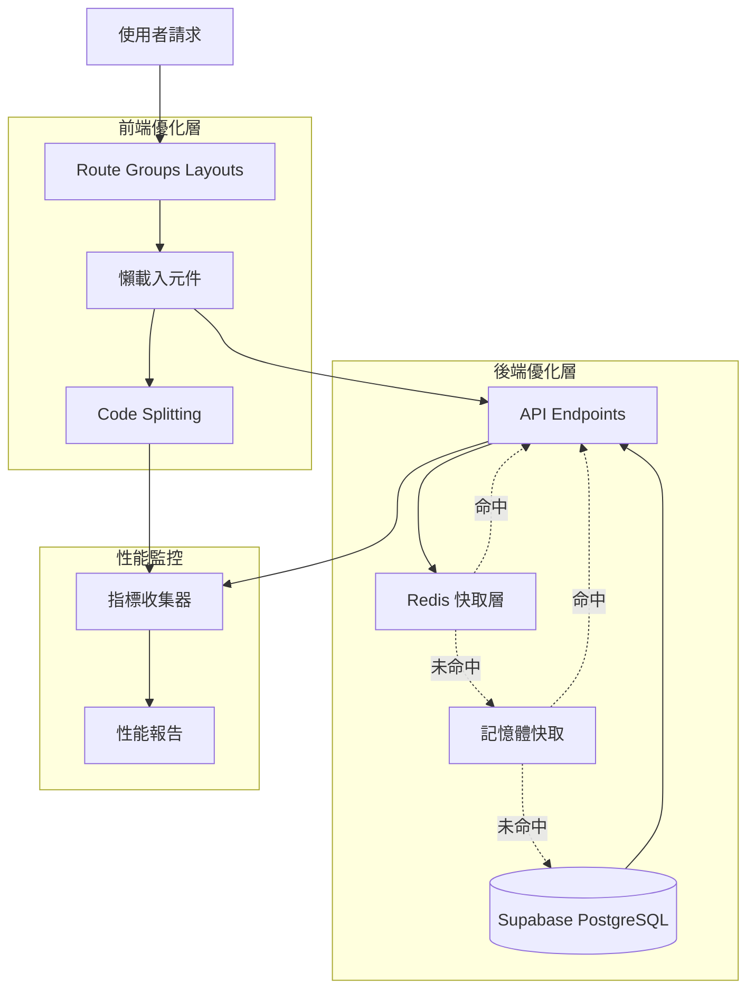
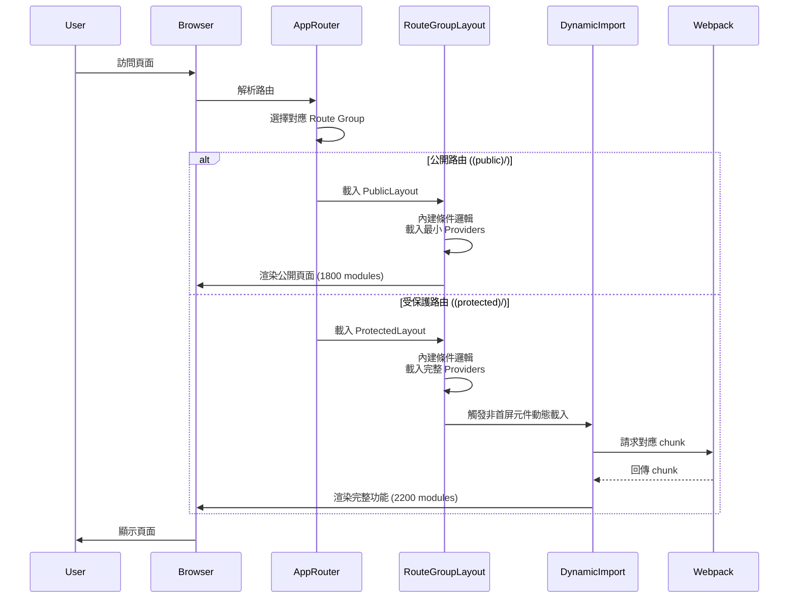
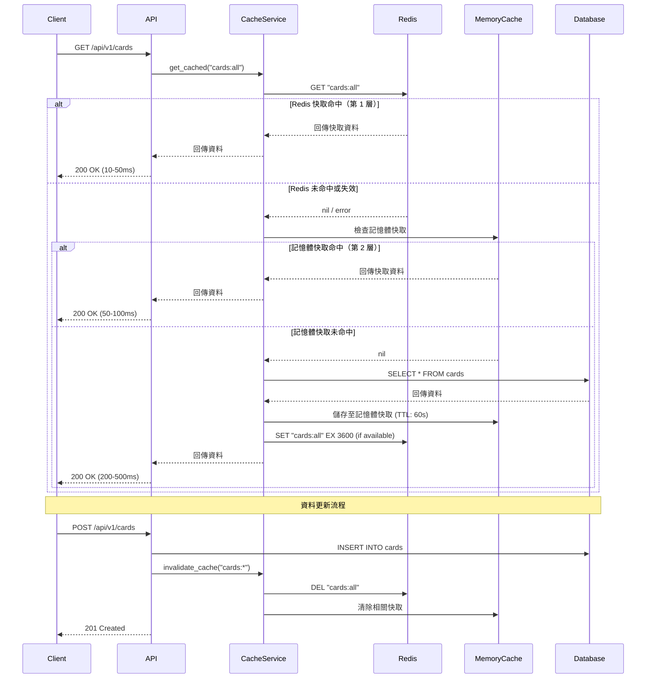
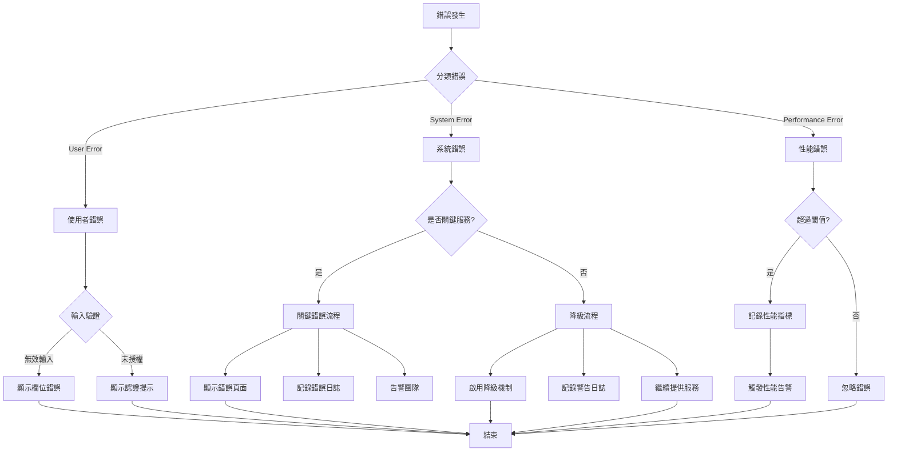
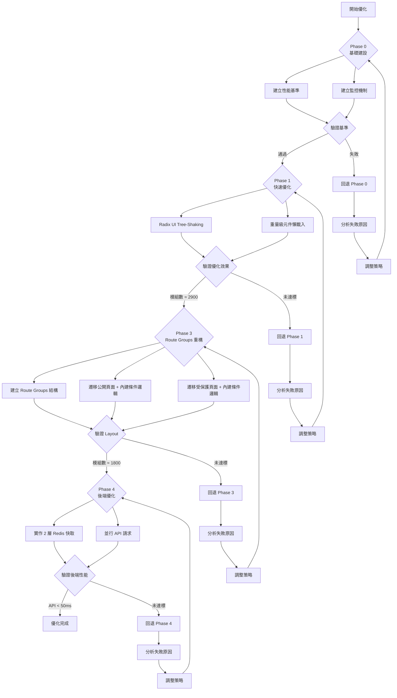

# Technical Design Document - Module Loading Optimization

## Overview

本功能針對 Next.js 15 應用程式進行全面的模組載入優化，解決當前 3142 個模組載入導致首次編譯時間達 13.8 秒的效能問題。優化範圍涵蓋前端模組載入策略（tree-shaking、動態載入、code splitting）、後端 API 優化（快取、並行請求）、以及性能監控與使用者體驗改善。

**目標使用者**：開發團隊與終端使用者均受益。開發者將體驗到更快的編譯速度與 HMR 更新，終端使用者將獲得更快的頁面載入速度與更流暢的互動體驗。

**影響範圍**：此功能將改變當前全域 layout 載入所有依賴的架構模式，引入路由特定 layout 策略（Route Groups），預計將模組載入數量從 3142 降低至約 1800 個，並將首次編譯時間從 13.8 秒降低至 10 秒以內。

### Goals

- **減少模組載入數量**：從 3142 個降至約 1800 個（降低 43%）
- **改善編譯速度**：首次編譯從 13.8 秒降至 10 秒以內（改善 27%）
- **提升 HMR 性能**：平均 HMR 時間從當前水平降至 300ms 以下
- **優化 Bundle Size**：確保首頁 bundle size 不超過 150KB (gzip)
- **改善使用者體驗**：提供適當的載入狀態與錯誤處理，確保功能無感知升級

### Non-Goals

- **完全重寫架構**：保持現有 App Router 與 Zustand 架構，僅優化載入策略
- **移除現有功能**：所有現有功能保持正常運作，確保向後相容
- **後端語言遷移**：不改變 FastAPI + Python 技術棧
- **資料庫架構變更**：不改變 Supabase PostgreSQL 資料結構

## Architecture

### Existing Architecture Analysis

當前架構採用 Next.js 15 App Router 模式，全域 `layout.tsx` 載入所有系統初始化元件與 providers，導致無論訪問哪個路由都載入完整依賴。

**現有架構限制**：

1. **全域 Layout 過度載入**：`layout.tsx` 包含 7 個初始化元件（ZustandAuthInitializer、AnalyticsProvider、MetricsInitializer、AudioInitializer、ActivityTrackerInitializer、MusicPlayerInitializer、AchievementNotificationInitializer），所有路由均載入
2. **Barrel Export 過度依賴**：`@/components` 與 `@radix-ui` 使用 barrel exports 導致連鎖載入
3. **缺乏路由特定 Layout**：所有頁面共用同一 layout，公開頁面與受保護頁面未分離
4. **未充分利用 webpack cache**：僅開發環境啟用 filesystem cache，無細緻的 splitChunks 配置
5. **後端無快取層**：雖有 Redis 基礎設施，但靜態資料 API 未實作快取策略

**保留的架構模式**：

- Next.js App Router 與 Server Components
- Zustand 狀態管理（authStore、readingsStore、uiStore）
- Supabase PostgreSQL + FastAPI 後端
- Redis 快取基礎設施
- 現有 `lazyComponents.tsx` 動態載入模式

**整合點**：

- 擴展現有 `lazyComponents.tsx` 模式到更多元件
- 基於現有 Redis client (`app/core/redis.py`) 實作 API 快取
- 保持現有 webpack cache 配置並擴展 splitChunks 策略
- 利用現有 Next.js experimental `optimizePackageImports` 配置

### High-Level Architecture



**架構整合說明**：

- **保留模式**：現有 `lazyComponents.tsx` 模式作為懶載入基礎模式，擴展到更多非首屏元件
- **新增架構**：使用 Next.js Route Groups 建立頁面特定 layout，在 layout 層級內建輕量級條件載入邏輯
- **快取策略**：採用 2 層降級架構（Redis → 記憶體快取 + 資料庫），確保高可用性
- **技術對齊**：利用 Next.js 15 原生 `dynamic()` 與 `optimizePackageImports` 實驗功能
- **Steering 合規**：遵循產品導向的 "無感知性能提升" 原則，保持 Fallout 主題 UI/UX 一致性

### Technology Stack and Design Decisions

**技術對齊**：

本功能擴展現有技術棧，不引入新的框架或語言。前端延續 Next.js 15 + React 19 + Bun，後端延續 FastAPI + Python 3.11 + uv。

**新增依賴**：

- **前端**：無新增外部套件（利用 Next.js 原生 `dynamic()` 與 webpack 配置）
- **後端**：無新增套件（利用現有 `redis` 與 `asyncio` 套件）

**與現有棧對齊**：

- **Next.js experimental features**：擴展現有 `optimizePackageImports` 配置，加入 `@radix-ui/react-label`、`@radix-ui/react-select`
- **Webpack cache**：延續現有 `filesystem` cache 配置，新增 `splitChunks.cacheGroups` 細緻控制
- **Redis client**：基於現有 `app/core/redis.py` 單例模式，擴展到 API 快取服務
- **Zustand stores**：無變更，保持現有 store 架構

**偏離現有模式的理由**：

- **引入 Route Groups**：使用 Next.js 原生 Route Groups (`(public)`, `(protected)`) 實作頁面特定 layout，此為 App Router 推薦模式
- **條件式 Provider 載入**：打破現有全域 layout 載入所有 providers 的模式，採用路由偵測條件載入，降低非必要路由的模組數量

**關鍵技術決策**：

#### Decision 1: 使用 Route Groups 實作頁面特定 Layout

**決策**：使用 Next.js Route Groups (`(public)`, `(protected)`) 建立頁面特定 layout，而非單一全域 layout。

**情境**：公開頁面（首頁、關於、隱私政策）與受保護頁面（Dashboard、閱讀歷史）需要不同的 layout 與依賴。

**替代方案**：
1. **單一 Layout + ConditionalProviders**：保持單一 `layout.tsx`，建立 ConditionalProviders 元件條件載入（缺點：需要獨立元件維護，Phase 3 會被 Route Groups 取代，浪費工時）
2. **頁面級別 Layout**：每個頁面自行決定 layout（缺點：程式碼重複，無法共用基礎結構）
3. **自訂 Layout HOC**：建立高階元件包裝頁面（缺點：與 App Router 設計背離，失去原生優化）

**選擇方案**：直接使用 Route Groups 建立 `(public)/layout.tsx` 與 `(protected)/layout.tsx`，在各 layout 中內建輕量級條件載入邏輯（20-30 行）。

**理由**：
- **Next.js 原生模式**：Route Groups 為 App Router 官方推薦模式，充分利用框架優化
- **依賴隔離**：不同 layout 完全獨立的依賴圖，webpack 可正確 tree-shake
- **路由清晰**：路由結構明確反映頁面類型，降低認知負荷
- **型別推斷**：TypeScript 可根據路由自動推斷可用的 context 與 hooks
- **簡化架構**：避免 Phase 2 建立 ConditionalProviders 後又在 Phase 3 移除的工時浪費
- **內建邏輯**：在 layout 內部用 20-30 行條件邏輯處理 provider 載入，無需獨立元件

**權衡取捨**：
- **得到**：
  - 40-50% 模組數量降低（公開頁面從 3142 直接降至約 1800）
  - 節省 3-4 天開發時間（跳過 Phase 2 ConditionalProviders）
  - 更簡潔的架構，無中間層
- **犧牲**：需重構現有路由結構，移動檔案到對應 Route Group，初期遷移成本約 3-4 小時

#### Decision 2: 2 層降級快取策略

**決策**：後端 API 實作 2 層快取架構，第 1 層為 Redis 快取（靜態資料 1 小時 TTL，動態資料 5 分鐘 TTL），第 2 層為記憶體快取（Python `cachetools.TTLCache`，TTL 60 秒）+ 資料庫備援。

**情境**：靜態資料 API（如牌卡列表、展開排列定義）每次請求均查詢資料庫，造成不必要的延遲與資料庫負載。若 Redis 在高流量時段失效，直接降級至資料庫可能引發連線池耗盡與雪崩效應。

**替代方案**：
1. **單層 Redis 快取 + 直接資料庫降級**：Redis 失敗時直接查詢資料庫（缺點：高流量時資料庫負載瞬間增加 5 倍，可能引發雪崩）
2. **4 層降級（Redis → Memory → Rate Limiting → Static）**：增加限流與靜態回應層級（缺點：過度設計，複雜度高，限流會返回 429 影響使用者體驗）
3. **前端快取**：將快取邏輯移至前端（缺點：每個使用者獨立快取，無法共享，增加前端複雜度）
4. **CDN 快取**：使用 Zeabur CDN 快取 API 回應（缺點：失效控制困難，需學習 CDN purge API）

**選擇方案**：2 層降級快取（Redis → 記憶體快取 + 資料庫）+ TTL + 手動失效混合策略。

**理由**：
- **高可用性**：記憶體快取作為 Redis 失效時的緩衝層，避免資料庫瞬間過載
- **使用者體驗優先**：始終返回資料（不返回 429 錯誤），即使是短暫的記憶體快取
- **記憶體效率**：TTL 確保過期資料自動清理，避免無限增長
- **資料一致性**：手動失效機制確保關鍵資料更新立即生效
- **多 worker 共享**：Redis 層多個 Uvicorn worker 共享，記憶體快取為 worker 私有
- **簡單務實**：相比 4 層降級，2 層方案實作簡單，無需額外依賴（`cachetools` 為輕量級標準庫）
- **適合靜態資料**：牌卡資料變動頻率低，60 秒記憶體快取 TTL 足夠

**實作示意**：
```python
from cachetools import TTLCache

# 全域記憶體快取（第 2 層，每個 worker 獨立）
fallback_cache = TTLCache(maxsize=100, ttl=60)

async def get_cached_data(key: str):
    # 第 1 層：Try Redis
    redis = await get_async_redis_client()
    if redis:
        try:
            cached = await redis.get(key)
            if cached:
                return json.loads(cached)
        except Exception:
            pass  # Fall through to Layer 2

    # 第 2 層：Try in-memory cache
    if key in fallback_cache:
        return fallback_cache[key]

    # 最終降級：Query database
    data = await db.query(...)

    # Populate both caches
    fallback_cache[key] = data
    if redis:
        try:
            await redis.set(key, json.dumps(data), ex=3600)
        except Exception:
            pass  # Silent fail

    return data
```

**權衡取捨**：
- **得到**：
  - 靜態資料 API 回應時間：Redis 命中 <50ms，記憶體快取命中 <100ms，資料庫查詢 <500ms
  - 高可用性：Redis 失效時不會引發資料庫雪崩
  - 使用者體驗：始終返回資料，無 429 錯誤
- **犧牲**：
  - Redis 記憶體使用約 50-100MB
  - 每個 worker 額外記憶體快取約 1MB（100 項目 × 10KB）
  - 需監控 Redis 連線健康狀態

## System Flows

### Frontend Module Loading Flow



### Backend API Caching Flow



### Module Loading Decision Tree

```mermaid
flowchart TD
    Start[頁面請求] --> DetectRouteGroup{App Router<br/>選擇 Route Group}

    DetectRouteGroup -->|公開路由<br/>(public)/about| PublicLayout[PublicLayout]
    DetectRouteGroup -->|受保護路由<br/>(protected)/dashboard| ProtectedLayout[ProtectedLayout]
    DetectRouteGroup -->|認證路由<br/>(auth)/login| AuthLayout[AuthLayout]

    PublicLayout --> PublicProviders[內建條件邏輯<br/>載入最小 Providers]
    PublicProviders --> CheckFirstScreen{是否首屏元件?}

    ProtectedLayout --> CheckAuth{認證狀態?}
    CheckAuth -->|已登入| ProtectedProviders[內建條件邏輯<br/>載入完整 Providers]
    CheckAuth -->|未登入| RedirectLogin[重導向登入]

    AuthLayout --> AuthProviders[載入認證相關元件]

    CheckFirstScreen -->|是| RenderImmediate[立即渲染<br/>1800 modules]
    CheckFirstScreen -->|否| DynamicLoad[動態載入]

    ProtectedProviders --> CheckHeavy{是否重量級元件?}
    CheckHeavy -->|是<br/>Modal, Drawer| LazyLoad[懶載入<br/>next/dynamic]
    CheckHeavy -->|否| RenderImmediate2[立即渲染<br/>2200 modules]

    DynamicLoad --> RenderImmediate
    LazyLoad --> RenderImmediate2
    AuthProviders --> RenderImmediate3[立即渲染<br/>1900 modules]
    RedirectLogin --> End[結束]
    RenderImmediate --> End
    RenderImmediate2 --> End
    RenderImmediate3 --> End
```

## Requirements Traceability

| Requirement | Summary | Components | Interfaces | Flows |
|-------------|---------|------------|------------|-------|
| 1 | Radix UI Tree-Shaking | `next.config.ts`<br/>`webpack.splitChunks` | webpack config<br/>`optimizePackageImports` | - |
| 2 | 重量級元件動態載入 | `lazyComponents.tsx`<br/>`ConditionalModals.tsx` | `dynamic()`<br/>`preloadComponent()` | Frontend Module Loading |
| 3 | 系統初始化條件載入 | `(public)/layout.tsx`<br/>`(protected)/layout.tsx`<br/>內建條件邏輯 | Route Groups<br/>條件 Provider 載入 | Module Loading Decision Tree |
| 4 | Barrel Export 重構 | 各 `index.ts` 檔案 | 直接 import paths | - |
| 5 | 頁面特定 Layout | `(public)/layout.tsx`<br/>`(protected)/layout.tsx`<br/>`(auth)/layout.tsx` | Route Groups | Frontend Module Loading |
| 6 | Webpack 建置優化 | `next.config.ts` | `splitChunks.cacheGroups`<br/>`optimization` | - |
| 7 | 開發環境性能優化 | `next.config.ts` | `webpack.cache`<br/>`Fast Refresh` | - |
| 8 | 生產 Bundle 優化 | `next.config.ts` | `minification`<br/>`compression` | - |
| 9 | 性能監控追蹤 | `PerformanceMonitor.tsx`<br/>`MetricsCollector.ts` | `performance.measure()`<br/>`reportWebVitals()` | - |
| 10 | 使用者體驗最佳化 | `LoadingSpinner.tsx`<br/>`ErrorBoundary.tsx` | `Suspense`<br/>`fallback` | Frontend Module Loading |
| 11 | API 並行請求優化 | 各 page.tsx | `Promise.all()`<br/>`Promise.allSettled()` | - |
| 12 | API 快取策略 | `CacheService.py`<br/>`CacheDecorator.py` | `@cached()`<br/>`invalidate_cache()` | Backend API Caching |
| 13 | 階段性目標追蹤 | `PerformanceReport.tsx` | `ModuleCountMetric`<br/>`CompileTimeMetric` | - |
| 14 | 向後相容穩定性 | 所有元件 | 降級機制<br/>fallback | Module Loading Decision Tree |
| 15 | 文件知識傳承 | `OPTIMIZATION.md`<br/>`MIGRATION.md` | 最佳實踐指南 | - |

## Components and Interfaces

### Frontend Layer

#### LazyComponentsExtension

**Responsibility & Boundaries**

- **Primary Responsibility**: 擴展現有 `lazyComponents.tsx`，新增更多非首屏元件的懶載入定義
- **Domain Boundary**: 前端元件載入層
- **Data Ownership**: 懶載入元件定義與 loading fallback
- **Transaction Boundary**: 無事務邊界

**Dependencies**

- **Inbound**: 各頁面元件引用懶載入元件
- **Outbound**: 依賴原始元件檔案（透過 dynamic import）
- **External**: `next/dynamic`, `React.Suspense`

**Contract Definition**

```typescript
interface LazyLoadOptions {
  loading?: () => JSX.Element;
  ssr?: boolean;
  preload?: boolean;
}

interface LazyComponentsService {
  createLazyComponent<P>(
    loader: () => Promise<{ default: React.ComponentType<P> }>,
    options?: LazyLoadOptions
  ): React.ComponentType<P>;

  preloadComponent(component: React.ComponentType<any>): void;

  withSuspense<P>(
    Component: React.ComponentType<P>,
    fallback?: JSX.Element
  ): React.ComponentType<P>;
}

// 新增懶載入元件定義
const LazyReadingDetailModal: React.ComponentType<ReadingDetailModalProps>;
const LazyMusicPlayerDrawer: React.ComponentType<MusicPlayerDrawerProps>;
const LazyAchievementPanel: React.ComponentType<AchievementPanelProps>;
```

**Integration Strategy**:
- **Modification Approach**: 擴展現有 `lazyComponents.tsx` 檔案，保留現有 API
- **Backward Compatibility**: 現有懶載入元件保持不變
- **Migration Path**: 逐步將重量級元件遷移至懶載入，優先處理大於 50KB 的元件

#### RouteGroupLayouts

**Responsibility & Boundaries**

- **Primary Responsibility**: 為不同路由類型提供專屬 layout 配置
- **Domain Boundary**: 前端 layout 層，負責頁面結構組織
- **Data Ownership**: Layout 結構定義與頁面特定 providers
- **Transaction Boundary**: 無事務邊界

**Dependencies**

- **Inbound**: Next.js App Router 根據路由自動選擇對應 layout
- **Outbound**: 依賴 `Header`, `Footer`, `DynamicBackground` 等 layout 元件
- **External**: Next.js Route Groups 機制

**Contract Definition**

```typescript
// (public)/layout.tsx
interface PublicLayoutProps {
  children: React.ReactNode;
}

interface PublicLayoutService {
  renderMinimalProviders(children: React.ReactNode): JSX.Element;
  renderPublicHeader(): JSX.Element;
  renderPublicFooter(): JSX.Element;
}

// (protected)/layout.tsx
interface ProtectedLayoutProps {
  children: React.ReactNode;
}

interface ProtectedLayoutService {
  renderFullProviders(children: React.ReactNode): JSX.Element;
  renderDashboardHeader(): JSX.Element;
  renderDashboardFooter(): JSX.Element;
  checkAuthentication(): Promise<boolean>;
}
```

**Preconditions**:
- 路由必須位於對應 Route Group 資料夾中
- 受保護 layout 必須檢查認證狀態

**Postconditions**:
- 公開 layout 載入最小依賴（約 1800 modules）
- 受保護 layout 載入完整功能（約 2200 modules）
- 認證失敗時重導向至登入頁

**Integration Strategy**:
- **Modification Approach**: 建立新的 Route Groups 資料夾結構，保留原始 `layout.tsx` 作為 fallback
- **Backward Compatibility**: 原有路由保持運作，逐步遷移至對應 Route Group
- **Migration Path**: Phase 3 執行，分為 Phase 3.1 (建立結構) → Phase 3.2 (遷移公開頁面) → Phase 3.3 (遷移受保護頁面)

### Backend Layer

#### CacheService

**Responsibility & Boundaries**

- **Primary Responsibility**: 提供統一的 Redis 快取介面，封裝快取存取與失效邏輯
- **Domain Boundary**: 後端快取層，負責快取生命週期管理
- **Data Ownership**: 快取鍵命名規則、TTL 配置、失效策略
- **Transaction Boundary**: 快取操作為獨立事務，不與資料庫事務綁定

**Dependencies**

- **Inbound**: 各 service 層元件（`WastelandCardService`, `ReadingService` 等）
- **Outbound**: `app/core/redis.py` Redis client
- **External**: `redis.asyncio` 套件

**External Dependencies Investigation**:

基於現有 `app/core/redis.py` 實作，已完成連線管理與降級策略。Redis client 使用 `redis.asyncio.Redis` 非同步介面，支援：
- **連線池管理**: 自動重用連線，避免頻繁建立
- **健康檢查**: `health_check_interval=30` 秒週期性 ping
- **逾時控制**: `socket_connect_timeout=5`, `socket_timeout=5`
- **重試機制**: `retry_on_timeout=True`

無需額外調查，現有實作已符合需求。

**Contract Definition**

```python
from typing import Optional, Any, Callable
from datetime import timedelta

class CacheService:
    """Redis 快取服務，提供統一的快取存取介面"""

    async def get(self, key: str) -> Optional[Any]:
        """
        從快取中取得資料

        Preconditions: key 不為空字串
        Postconditions:
            - 若快取存在且未過期，回傳資料
            - 若快取不存在或已過期，回傳 None
            - Redis 連線失敗時回傳 None（降級）

        Raises: 無異常（降級處理）
        """
        ...

    async def set(
        self,
        key: str,
        value: Any,
        ttl: Optional[int] = None
    ) -> bool:
        """
        設定快取資料

        Preconditions: key 不為空，value 可序列化為 JSON
        Postconditions:
            - 快取成功設定，回傳 True
            - Redis 連線失敗時回傳 False（降級）

        Args:
            key: 快取鍵
            value: 快取值（必須可 JSON 序列化）
            ttl: 過期時間（秒），None 使用預設 300 秒
        """
        ...

    async def delete(self, key: str) -> bool:
        """刪除快取鍵"""
        ...

    async def invalidate_pattern(self, pattern: str) -> int:
        """
        失效符合模式的所有快取鍵

        Args:
            pattern: Redis SCAN 模式（如 "cards:*"）

        Returns: 失效的鍵數量
        """
        ...

def cached(
    ttl: int = 300,
    key_prefix: str = "",
    invalidate_on: Optional[list[str]] = None
) -> Callable:
    """
    快取裝飾器，自動處理快取存取

    Usage:
        @cached(ttl=3600, key_prefix="cards")
        async def get_all_cards() -> list[WastelandCard]:
            return await db.query(WastelandCard).all()

    Args:
        ttl: 快取過期時間（秒）
        key_prefix: 快取鍵前綴
        invalidate_on: 觸發失效的事件列表（如 ["card.created", "card.updated"]）
    """
    ...
```

**State Management**:
- **State Model**: 無狀態服務，快取狀態儲存於 Redis
- **Persistence**: Redis 持久化機制（RDB + AOF）
- **Concurrency**: Redis 原子操作保證並發安全

**Integration Strategy**:
- **Modification Approach**: 建立新的 `CacheService` 類別，包裝現有 `app/core/redis.py` client
- **Backward Compatibility**: 現有 Redis 使用者（如 `challenge_store.py`, `achievement_cache_service.py`）保持運作
- **Migration Path**: 新 API endpoints 優先使用 `CacheService`，舊 endpoints 逐步遷移

#### ParallelAPIService

**Responsibility & Boundaries**

- **Primary Responsibility**: 協調多個 API 請求並行執行，處理部分失敗情境
- **Domain Boundary**: 前端資料載入層
- **Data Ownership**: API 請求配置與結果聚合
- **Transaction Boundary**: 無事務邊界（前端服務）

**Dependencies**

- **Inbound**: 各頁面元件（如 `DashboardPage`, `ReadingHistoryPage`）
- **Outbound**: 各 API endpoint（透過 `fetch` 或 API client）
- **External**: `Promise.all()`, `Promise.allSettled()` JavaScript 原生 API

**Contract Definition**

```typescript
interface APIRequest<T> {
  url: string;
  options?: RequestInit;
  transform?: (data: any) => T;
}

interface APIResult<T> {
  data?: T;
  error?: Error;
  status: 'fulfilled' | 'rejected';
}

interface ParallelAPIService {
  /**
   * 並行執行多個 API 請求，所有請求必須成功
   *
   * Preconditions: requests 陣列不為空
   * Postconditions:
   *   - 所有請求成功時回傳結果陣列
   *   - 任一請求失敗時拋出異常
   *
   * Throws: APIError（包含所有失敗請求資訊）
   */
  executeAll<T>(requests: APIRequest<T>[]): Promise<T[]>;

  /**
   * 並行執行多個 API 請求，允許部分失敗
   *
   * Preconditions: requests 陣列不為空
   * Postconditions:
   *   - 回傳所有請求結果（成功或失敗）
   *   - 不拋出異常
   */
  executeAllSettled<T>(requests: APIRequest<T>[]): Promise<APIResult<T>[]>;

  /**
   * 批次請求輔助函式
   */
  createBatchRequest<T>(
    baseUrl: string,
    ids: string[],
    transform?: (data: any) => T
  ): APIRequest<T>[];
}
```

**Preconditions**:
- 所有 API endpoint 必須回傳 JSON 格式
- 網路環境允許並行請求（無嚴格 rate limiting）

**Postconditions**:
- `executeAll`: 所有請求成功或拋出 `APIError`
- `executeAllSettled`: 回傳所有結果，不拋出異常

**Invariants**:
- 請求執行順序不保證（並行執行）
- 結果陣列順序與請求陣列順序對應

### Monitoring Layer

#### PerformanceMonitor

**Responsibility & Boundaries**

- **Primary Responsibility**: 收集與追蹤模組載入、編譯時間、bundle size、執行時性能指標
- **Domain Boundary**: 前端性能監控層
- **Data Ownership**: 性能指標資料與報告格式
- **Transaction Boundary**: 無事務邊界（僅收集與上報）

**Dependencies**

- **Inbound**: `MetricsInitializer` 系統初始化元件
- **Outbound**: 瀏覽器 `performance` API, `reportWebVitals` Next.js API
- **External**: `web-vitals` 套件（Next.js 內建）

**Contract Definition**

```typescript
interface PerformanceMetrics {
  moduleCount: number;
  compileTime: number;
  bundleSize: {
    raw: number;
    gzip: number;
    brotli: number;
  };
  webVitals: {
    FCP: number; // First Contentful Paint
    LCP: number; // Largest Contentful Paint
    TTI: number; // Time to Interactive
    FID: number; // First Input Delay
    CLS: number; // Cumulative Layout Shift
  };
  hmrTime?: number;
}

interface PerformanceMonitorService {
  /**
   * 記錄性能指標
   */
  recordMetric(metric: keyof PerformanceMetrics, value: number): void;

  /**
   * 產生性能報告
   */
  generateReport(): PerformanceReport;

  /**
   * 比較兩個報告的差異
   */
  compareReports(baseline: PerformanceReport, current: PerformanceReport): ReportDiff;

  /**
   * 匯出報告為 JSON
   */
  exportJSON(): string;

  /**
   * 匯出報告為 HTML
   */
  exportHTML(): string;
}

interface PerformanceReport {
  timestamp: string;
  metrics: PerformanceMetrics;
  phase: 'baseline' | 'phase-1' | 'phase-2' | 'phase-3' | 'phase-4';
  environment: 'development' | 'production';
}

interface ReportDiff {
  moduleCountDiff: number;
  compileTimeDiff: number;
  bundleSizeDiff: number;
  improvements: string[];
  regressions: string[];
}
```

**Preconditions**:
- 瀏覽器支援 `performance` API
- Next.js `reportWebVitals` 已配置

**Postconditions**:
- 所有指標正確記錄
- 報告格式符合規範
- 比較結果準確反映差異

**Invariants**:
- 指標值永遠非負數
- 時間戳記為 ISO 8601 格式

## Data Models

### Frontend Configuration Models

#### RouteConfigModel

```typescript
/**
 * 路由配置模型
 *
 * 定義路由模式與需載入的 providers 對應關係
 */
interface RouteConfigModel {
  /**
   * 路由模式（RegExp 或字串路徑）
   */
  pattern: RegExp | string;

  /**
   * 路由類型
   */
  type: 'public' | 'protected' | 'auth';

  /**
   * 需載入的 providers
   */
  providers: ProviderType[];

  /**
   * 是否需要認證
   */
  requiresAuth: boolean;

  /**
   * 重導向規則（未認證時）
   */
  redirectTo?: string;
}

/**
 * Provider 類型枚舉
 */
enum ProviderType {
  ErrorBoundary = 'errorBoundary',       // 永遠載入
  GlobalErrorDisplay = 'globalErrorDisplay', // 永遠載入
  ZustandAuth = 'zustandAuth',           // 受保護路由
  Analytics = 'analytics',                // 受保護路由
  Metrics = 'metrics',                    // 所有路由（開發環境）
  Audio = 'audio',                        // 需要音效的頁面
  ActivityTracker = 'activityTracker',    // 受保護路由
  MusicPlayer = 'musicPlayer',            // 所有路由（使用者偏好）
  Achievement = 'achievement',            // 受保護路由
  TiltConfig = 'tiltConfig',              // 含卡片的頁面
  DailyCardBack = 'dailyCardBack',        // 含卡片的頁面
  Notification = 'notification',          // 受保護路由
  LoyaltyReward = 'loyaltyReward',        // 受保護路由
}

/**
 * 預設路由配置
 */
const DEFAULT_ROUTE_CONFIGS: RouteConfigModel[] = [
  {
    pattern: /^\/(about|privacy|terms|contact)$/,
    type: 'public',
    providers: [ProviderType.ErrorBoundary, ProviderType.GlobalErrorDisplay],
    requiresAuth: false,
  },
  {
    pattern: /^\/auth\//,
    type: 'auth',
    providers: [
      ProviderType.ErrorBoundary,
      ProviderType.GlobalErrorDisplay,
    ],
    requiresAuth: false,
  },
  {
    pattern: /^\/(dashboard|readings|profile|bingo|achievements)/,
    type: 'protected',
    providers: [
      ProviderType.ErrorBoundary,
      ProviderType.GlobalErrorDisplay,
      ProviderType.ZustandAuth,
      ProviderType.Analytics,
      ProviderType.Metrics,
      ProviderType.Audio,
      ProviderType.ActivityTracker,
      ProviderType.MusicPlayer,
      ProviderType.Achievement,
      ProviderType.TiltConfig,
      ProviderType.DailyCardBack,
      ProviderType.Notification,
      ProviderType.LoyaltyReward,
    ],
    requiresAuth: true,
    redirectTo: '/auth/login',
  },
  {
    pattern: '/',
    type: 'public',
    providers: [
      ProviderType.ErrorBoundary,
      ProviderType.GlobalErrorDisplay,
      ProviderType.TiltConfig,
      ProviderType.DailyCardBack,
    ],
    requiresAuth: false,
  },
];
```

**Consistency & Integrity**:
- 路由模式不得重複
- `requiresAuth: true` 必須設定 `redirectTo`
- Provider 類型必須對應實際存在的元件

### Backend Cache Models

#### CacheKeyModel

```python
from typing import Optional, Literal
from pydantic import BaseModel, Field
from datetime import datetime

class CacheKeyModel(BaseModel):
    """
    快取鍵模型

    定義快取鍵命名規則與結構
    """
    prefix: str = Field(..., description="快取鍵前綴（如 'cards', 'readings'）")
    entity: str = Field(..., description="實體類型（如 'all', 'by_id', 'by_user'）")
    identifier: Optional[str] = Field(None, description="實體識別碼（如 user_id, card_id）")

    def to_key(self) -> str:
        """
        生成完整快取鍵

        格式: {prefix}:{entity}:{identifier}
        範例: "cards:all", "readings:by_user:123"
        """
        parts = [self.prefix, self.entity]
        if self.identifier:
            parts.append(self.identifier)
        return ":".join(parts)

    @classmethod
    def from_key(cls, key: str) -> "CacheKeyModel":
        """從快取鍵字串解析回模型"""
        parts = key.split(":")
        if len(parts) == 2:
            return cls(prefix=parts[0], entity=parts[1])
        elif len(parts) == 3:
            return cls(prefix=parts[0], entity=parts[1], identifier=parts[2])
        else:
            raise ValueError(f"Invalid cache key format: {key}")

class CacheConfigModel(BaseModel):
    """
    快取配置模型

    定義不同資料類型的 TTL 與失效策略
    """
    resource_type: Literal["static", "dynamic", "transient"]
    ttl_seconds: int = Field(..., ge=0, description="快取過期時間（秒）")
    invalidate_on_write: bool = Field(True, description="寫入時是否自動失效")
    invalidate_patterns: list[str] = Field(default_factory=list, description="關聯的失效模式")

    class Config:
        json_schema_extra = {
            "examples": [
                {
                    "resource_type": "static",
                    "ttl_seconds": 3600,
                    "invalidate_on_write": True,
                    "invalidate_patterns": ["cards:*"]
                },
                {
                    "resource_type": "dynamic",
                    "ttl_seconds": 300,
                    "invalidate_on_write": True,
                    "invalidate_patterns": ["readings:by_user:*"]
                }
            ]
        }

# 預設快取配置
DEFAULT_CACHE_CONFIGS: dict[str, CacheConfigModel] = {
    "cards": CacheConfigModel(
        resource_type="static",
        ttl_seconds=3600,  # 1 小時
        invalidate_on_write=True,
        invalidate_patterns=["cards:*"]
    ),
    "spreads": CacheConfigModel(
        resource_type="static",
        ttl_seconds=3600,  # 1 小時
        invalidate_on_write=True,
        invalidate_patterns=["spreads:*"]
    ),
    "readings": CacheConfigModel(
        resource_type="dynamic",
        ttl_seconds=300,  # 5 分鐘
        invalidate_on_write=True,
        invalidate_patterns=["readings:by_user:*"]
    ),
    "user_profile": CacheConfigModel(
        resource_type="dynamic",
        ttl_seconds=600,  # 10 分鐘
        invalidate_on_write=True,
        invalidate_patterns=["user:*"]
    ),
}
```

**Cross-Service Data Management**:
- **快取失效傳播**：使用 Redis Pub/Sub 廣播失效事件，多個 Uvicorn worker 同步清除快取
- **分散式鎖**：關鍵操作（如快取預熱）使用 Redis SETNX 實作分散式鎖，避免多 worker 重複執行
- **降級策略**：Redis 連線失敗時自動降級至直接資料庫查詢，記錄警告日誌但不中斷服務

## Error Handling

### Error Strategy

採用分層錯誤處理策略，前端與後端各自處理對應層級的錯誤，並提供適當的降級機制。

**錯誤分類**：

1. **User Errors (4xx)**: 使用者輸入錯誤、未授權存取
2. **System Errors (5xx)**: 基礎設施故障、第三方服務異常
3. **Performance Errors**: 載入逾時、快取失效、模組載入失敗

### Error Categories and Responses

#### Frontend Errors

**Module Loading Errors**:
- **Dynamic Import Failed**: 模組載入失敗
  - **Response**: 顯示錯誤訊息，提供重試按鈕，記錄錯誤日誌
  - **Fallback**: 降級至靜態載入（若可用）或顯示功能不可用提示

**Route Detection Errors**:
- **Unknown Route Pattern**: 路由模式無法匹配
  - **Response**: 回退至預設 provider 配置（載入所有 providers）
  - **Logging**: 記錄未知路由，供後續分析

**Provider Initialization Errors**:
- **Provider Mount Failed**: Provider 初始化失敗
  - **Response**: 跳過該 provider，繼續載入其他 providers
  - **Logging**: 記錄失敗的 provider 與錯誤訊息
  - **User Feedback**: 顯示非阻塞性警告訊息

#### Backend Errors

**Cache Errors**:
- **Redis Connection Failed**: Redis 連線失敗
  - **Response**: 自動降級至直接資料庫查詢
  - **Logging**: 記錄 Redis 連線失敗事件
  - **Monitoring**: 觸發告警，通知維運團隊

**Cache Serialization Errors**:
- **JSON Serialization Failed**: 快取值無法序列化
  - **Response**: 跳過快取，直接回傳資料
  - **Logging**: 記錄無法序列化的資料類型
  - **Remediation**: 檢查資料模型是否包含不可序列化欄位（如 datetime 未轉換）

**Cache Invalidation Errors**:
- **Pattern Invalidation Failed**: 批次失效失敗
  - **Response**: 記錄失敗，繼續處理請求
  - **Impact**: 可能提供短暫的過期資料（下次 TTL 過期時自動清除）

#### Performance Errors

**Compilation Timeout**:
- **Webpack Compilation Exceeded Threshold**: 編譯時間超過 20 秒
  - **Response**: 顯示警告訊息，繼續等待編譯完成
  - **Monitoring**: 記錄編譯時間，觸發性能告警

**HMR Update Failed**:
- **Hot Module Replacement Failed**: HMR 更新失敗
  - **Response**: 提示完整重載頁面
  - **Logging**: 記錄失敗的模組路徑

**Bundle Size Exceeded**:
- **Bundle Size > 244KB**: Bundle 大小超過閾值
  - **Response**: 建置仍成功，但發出警告
  - **Monitoring**: 記錄超大 bundle，供後續優化分析

### Error Handling Flow



### Monitoring

**錯誤追蹤**：
- **Frontend**: 使用 Next.js 內建 `error.tsx` 與 `global-error.tsx` 捕捉錯誤
- **Backend**: FastAPI 異常處理器記錄所有 HTTP 5xx 錯誤
- **Logging**: 使用結構化日誌（JSON 格式），包含錯誤類型、堆疊、使用者 context

**健康監控**：
- **Redis Health Check**: 每 30 秒 ping Redis，連線失敗時切換降級模式
- **Compilation Time Monitor**: 記錄每次編譯時間，超過閾值時發出告警
- **Bundle Size Monitor**: 建置時檢查 bundle size，超過 244KB 時警告

**告警規則**：
- **Critical**: Redis 連線中斷超過 5 分鐘
- **Warning**: 編譯時間超過 15 秒
- **Info**: Bundle size 接近 200KB（80% 閾值）

## Testing Strategy

### Unit Tests

**Frontend Unit Tests** (Jest + React Testing Library):

1. **ConditionalProviders.test.tsx**
   - 測試路由偵測邏輯正確性（公開/受保護/認證路由）
   - 測試 provider 條件載入邏輯
   - 測試未知路由的降級行為

2. **LazyComponentsExtension.test.tsx**
   - 測試 `createLazyComponent` 高階函式
   - 測試 `preloadComponent` 預載入邏輯
   - 測試 Suspense fallback 正確渲染

3. **RouteGroupLayouts.test.tsx**
   - 測試公開 layout 僅載入最小 providers
   - 測試受保護 layout 完整 providers 載入
   - 測試認證檢查與重導向邏輯

**Backend Unit Tests** (pytest):

1. **test_cache_service.py**
   - 測試 `get()`, `set()`, `delete()` 基本操作
   - 測試 TTL 過期邏輯
   - 測試 `invalidate_pattern()` 模式匹配
   - 測試 Redis 連線失敗時的降級行為

2. **test_cache_decorator.py**
   - 測試 `@cached()` 裝飾器快取行為
   - 測試自動鍵生成邏輯
   - 測試快取失效事件觸發

3. **test_parallel_api_service.py**
   - 測試 `executeAll()` 所有請求成功情境
   - 測試 `executeAll()` 部分請求失敗情境
   - 測試 `executeAllSettled()` 回傳所有結果

### Integration Tests

**Frontend Integration Tests** (Playwright):

1. **test_conditional_loading.spec.ts**
   - 驗證公開頁面模組載入數量約 1800 個
   - 驗證受保護頁面模組載入數量約 2200 個
   - 驗證頁面切換時正確載入/卸載 providers

2. **test_lazy_loading.spec.ts**
   - 驗證重量級元件（Modal, Drawer）懶載入
   - 驗證 loading fallback 正確顯示
   - 驗證預載入機制（hover 觸發）

3. **test_route_group_navigation.spec.ts**
   - 驗證公開路由訪問無需認證
   - 驗證受保護路由未認證時重導向
   - 驗證 layout 切換平順無閃爍

**Backend Integration Tests** (pytest + httpx):

1. **test_api_caching_flow.py**
   - 驗證靜態資料 API 快取命中
   - 驗證 TTL 過期後重新查詢
   - 驗證資料更新後快取失效

2. **test_parallel_requests.py**
   - 驗證並行請求正確回傳所有結果
   - 驗證部分請求失敗時錯誤處理

3. **test_redis_fallback.py**
   - 模擬 Redis 連線失敗
   - 驗證 API 仍正常回應（降級至資料庫）
   - 驗證錯誤日誌正確記錄

### E2E Tests

**Critical User Paths** (Playwright):

1. **test_homepage_loading.spec.ts**
   - 驗證首頁載入時間 < 3 秒
   - 驗證 FCP < 1.5 秒, LCP < 2.5 秒
   - 驗證 bundle size < 150KB (gzip)

2. **test_dashboard_loading.spec.ts**
   - 驗證登入後 Dashboard 載入時間 < 5 秒
   - 驗證並行 API 請求正確顯示資料
   - 驗證重量級元件懶載入不阻塞首屏

3. **test_reading_flow.spec.ts**
   - 驗證閱讀流程完整功能（從選牌到解讀）
   - 驗證音效系統懶載入後正常運作
   - 驗證快取資料正確顯示

### Performance Tests

**Load & Compilation Tests**:

1. **test_module_count.py**
   - 驗證 Phase 1 後模組數量 ≈ 2900
   - 驗證 Phase 2 後模組數量 ≈ 2200
   - 驗證 Phase 3 後模組數量 ≈ 1800

2. **test_compilation_time.py**
   - 驗證首次編譯時間 < 10 秒
   - 驗證二次編譯時間 < 3 秒（webpack cache）
   - 驗證 HMR 更新時間 < 500ms

3. **test_bundle_size.py**
   - 驗證首頁 bundle size < 150KB (gzip)
   - 驗證 Dashboard bundle size < 200KB (gzip)
   - 驗證共用 chunk 正確分離（React, Radix UI）

4. **test_api_cache_performance.py**
   - 驗證靜態資料快取命中時 < 50ms
   - 驗證動態資料快取命中時 < 100ms
   - 驗證快取未命中時 < 500ms

## Security Considerations

**快取安全**：
- **資料隔離**：使用者相關快取包含 `user_id` 在鍵中，避免資料洩漏
- **敏感資料**：密碼、token 等敏感資料永不快取
- **快取污染**：驗證輸入參數防止惡意快取鍵注入

**認證邊界**：
- **受保護 Layout**：確保認證檢查在 layout 層執行，避免 client-side 繞過
- **API 快取**：受保護資源快取鍵包含 `user_id`，避免跨使用者存取

**降級安全**：
- **Redis 失敗降級**：確保降級模式不洩漏額外資訊
- **錯誤訊息**：避免錯誤訊息包含系統內部結構資訊

## Performance & Scalability

### Target Metrics

**開發環境**：
- 首次編譯時間: < 10 秒（目標從 13.8 秒改善 27%）
- 二次編譯時間: < 3 秒（webpack cache）
- HMR 更新時間: < 300ms（平均）

**生產環境**：
- 首頁 FCP: < 1.5 秒
- 首頁 LCP: < 2.5 秒
- 首頁 TTI: < 3.5 秒
- Dashboard 載入時間: < 5 秒（包含並行 API 請求）
- API 回應時間（快取命中）: < 50ms
- API 回應時間（快取未命中）: < 500ms

**模組載入目標**：
- Phase 1: 3142 → 2900 (-8%)
- Phase 3: 2900 → 1800 (-38%)
- 總計: 3142 → 1800 (-43%)

### Scaling Approaches

**前端擴展**：
- **Horizontal**: 透過 Zeabur CDN 分散靜態資源載入
- **Vertical**: 優化 bundle size，減少網路傳輸時間
- **Code Splitting**: 路由級別 code splitting，按需載入

**後端擴展**：
- **Horizontal**: 多個 Uvicorn worker 共享 Redis 快取
- **Vertical**: Redis 記憶體擴展（預計 50-100MB 快取使用）
- **Caching Strategy**: 高 cache hit rate（目標 > 80%）降低資料庫負載

### Caching Strategies

**Multi-tier Caching**：
1. **Browser Cache**: 靜態資源（JS, CSS）使用 `immutable` cache header
2. **Redis Cache**: API 回應快取（靜態資料 1 小時，動態資料 5 分鐘）
3. **Webpack Cache**: 開發環境 filesystem cache 加速編譯

**Cache Warming**：
- 應用程式啟動時預載入高頻存取資料（牌卡列表、展開排列）
- 使用分散式鎖避免多 worker 重複預熱

**Invalidation Strategy**：
- **TTL-based**: 自動過期清理
- **Event-based**: 資料更新時主動失效
- **Pattern-based**: 批次失效相關快取（如 `cards:*`）

### Module Count Measurement

為確保優化效果可量化驗證，建立標準化的模組數量測量流程。

**測量方法**：
- **工具**: Webpack Bundle Analyzer + 自動化測量腳本
- **資料來源**: Webpack stats.json 中的 `modules` 陣列長度
- **測量時機**: 生產環境建置（`bun build`）完成後
- **基準來源**: gap-analysis.md 中記錄的「當前載入 3142 個模組」來自 agent 根據啟動時載入過久反查前端程式碼得出

**自動化測量腳本**：

```typescript
// scripts/measure-modules.ts
import fs from 'fs';
import { exec } from 'child_process';
import { promisify } from 'util';

const execAsync = promisify(exec);

interface ModuleMetrics {
  timestamp: string;
  moduleCount: number;
  phase: string;
  bundleSize: {
    raw: number;
    gzip: number;
  };
}

async function measureModules() {
  console.log('🔍 Building project with stats output...');

  // Build with stats output
  await execAsync('ANALYZE=true bun run build');

  // Parse stats.json
  const stats = JSON.parse(
    fs.readFileSync('.next/analyze/client.json', 'utf-8')
  );

  const moduleCount = stats.modules.length;
  const timestamp = new Date().toISOString();
  const phase = process.env.PHASE || 'baseline';

  const report: ModuleMetrics = {
    timestamp,
    moduleCount,
    phase,
    bundleSize: {
      raw: calculateRawSize(stats),
      gzip: calculateGzipSize(stats),
    },
  };

  // Append to history
  const historyPath = '.build-metrics.json';
  const history: ModuleMetrics[] = fs.existsSync(historyPath)
    ? JSON.parse(fs.readFileSync(historyPath, 'utf-8'))
    : [];

  history.push(report);
  fs.writeFileSync(historyPath, JSON.stringify(history, null, 2));

  // Display results
  console.log(`📊 Module count: ${moduleCount}`);

  if (history.length > 1) {
    const baseline = history.find(h => h.phase === 'baseline');
    if (baseline) {
      const diff = moduleCount - baseline.moduleCount;
      const percentage = ((diff / baseline.moduleCount) * 100).toFixed(1);
      console.log(`📈 Baseline: ${baseline.moduleCount} → Current: ${moduleCount} (${percentage}%)`);
    }
  }

  return report;
}

function calculateRawSize(stats: any): number {
  return stats.assets.reduce((sum: number, asset: any) => sum + asset.size, 0);
}

function calculateGzipSize(stats: any): number {
  // Estimate gzip size (actual size * 0.3)
  return Math.round(calculateRawSize(stats) * 0.3);
}

measureModules().catch(console.error);
```

**使用方式**：

```bash
# Phase 0: 建立 baseline
PHASE=baseline bun run measure-modules

# Phase 1 完成後
PHASE=phase1 bun run measure-modules

# Phase 3 完成後
PHASE=phase3 bun run measure-modules
```

**輸出範例**：

```
🔍 Building project with stats output...
📊 Module count: 2900
📈 Baseline: 3142 → Current: 2900 (-7.7%)
✅ Phase 1 target achieved (target: ~2900)
```

**CI/CD 整合**：
- 在 Phase 1-3 PR 中自動執行測量腳本
- 生成模組數量報告並留言至 PR
- 設定閾值警告（如模組數量未降低或反而增加 > 5%）

## Migration Strategy

採用 3 階段漸進式優化（跳過 Phase 2），每階段完成後驗證效果再進行下一階段，確保風險可控。



### Phase 0: 基礎建設與基準測量（預估 1 天）

**目標**：建立性能基準與監控機制，為後續優化提供量化比較基礎。

**執行步驟**：

1. **建立性能監控元件**
   - 實作 `PerformanceMonitor` 元件記錄模組載入數量
   - 整合 Next.js `reportWebVitals` 追蹤 Web Vitals
   - 建立 webpack plugin 記錄編譯時間與 bundle size

2. **測量當前基準**
   - 記錄當前模組載入數量: 3142
   - 記錄首次編譯時間: 13.8 秒
   - 記錄各頁面 bundle size 與載入時間
   - 記錄 HMR 更新時間

3. **建立性能報告模板**
   - 設計 JSON/HTML 報告格式
   - 實作報告比較功能（baseline vs current）

**驗證標準**：
- ✅ 性能指標正確記錄（模組數、編譯時間、bundle size）
- ✅ 報告生成功能正常運作
- ✅ 基準資料已儲存供後續比較

**回退觸發條件**：
- ❌ 性能監控元件導致編譯失敗
- ❌ 記錄的指標與手動測量差異 > 10%

**回退步驟**：
1. 移除 `PerformanceMonitor` 元件
2. 移除 webpack plugin
3. 使用手動測量方式記錄基準

### Phase 1: 快速優化（預估 2 天）

**目標**：透過 Radix UI tree-shaking 與重量級元件懶載入，快速降低模組數量至 2900 個左右。

**執行步驟**：

1. **Radix UI Tree-Shaking**
   - 擴展 `next.config.ts` 的 `optimizePackageImports` 配置
   - 重構直接引用 Radix UI 的程式碼（從 barrel export 改為直接路徑）
   - 驗證 build 產出的 Radix UI chunk 大小降低

2. **重量級元件懶載入**
   - 擴展 `lazyComponents.tsx`，新增以下元件：
     - `LazyReadingDetailModal`
     - `LazyCardDetailModal`（已存在，檢查使用情況）
     - `LazyMusicPlayerDrawer`
     - `LazyAchievementPanel`
   - 更新引用這些元件的頁面，改用懶載入版本
   - 實作 loading fallback UI（使用現有 `ModalLoading`, `LoadingSpinner`）

3. **驗證優化效果**
   - 記錄優化後模組載入數量
   - 比較與基準的差異
   - 確認功能正常運作（手動測試關鍵流程）

**驗證標準**：
- ✅ 模組載入數量降至 2900 ± 100 個
- ✅ 所有懶載入元件正常運作
- ✅ Loading fallback 正確顯示
- ✅ 無功能回歸（E2E 測試通過）

**回退觸發條件**：
- ❌ 模組數量未降低或增加
- ❌ 懶載入元件載入失敗率 > 1%
- ❌ 功能回歸（E2E 測試失敗）

**回退步驟**：
1. 還原 `next.config.ts` 的 `optimizePackageImports` 變更
2. 還原所有元件引用為原始非懶載入版本
3. 移除新增的懶載入定義
4. 驗證回退後功能正常

### Phase 3: Route Groups 重構（預估 3 天）

**目標**：直接使用 Route Groups 建立頁面特定 layout，在各 layout 中內建輕量級條件載入邏輯（20-30 行），將模組數量從 2900 降至 1800 個左右。

**執行步驟**：

1. **建立 Route Groups 結構（Phase 3.1）**
   - 建立 `(public)/layout.tsx` - 公開頁面 layout，內建條件邏輯僅載入最小 providers
   - 建立 `(protected)/layout.tsx` - 受保護頁面 layout，內建條件邏輯載入完整 providers
   - 建立 `(auth)/layout.tsx` - 認證頁面 layout，內建條件邏輯載入認證相關 providers
   - 保留原始 `layout.tsx` 作為 fallback

2. **實作內建條件邏輯（Phase 3.2）**
   - 在 PublicLayout 中直接用 20-30 行條件邏輯判斷需載入的 providers
   - 在 ProtectedLayout 中實作認證檢查與重導向邏輯
   - 在各 layout 中使用 `usePathname()` 或 `pathname` prop 進行細粒度控制
   - 範例：
     ```tsx
     // (public)/layout.tsx
     export default function PublicLayout({ children }) {
       return (
         <ErrorBoundary>
           <GlobalErrorDisplay />
           {/* 僅載入最小 providers，無 Auth、Analytics 等 */}
           <DynamicBackground />
           {children}
         </ErrorBoundary>
       )
     }
     ```

3. **遷移公開頁面（Phase 3.3）**
   - 移動 `/about`, `/privacy`, `/terms`, `/contact` 至 `(public)/`
   - 測試公開頁面功能與樣式
   - 驗證模組數量降低至約 1800 個

4. **遷移受保護頁面（Phase 3.4）**
   - 移動 `/dashboard`, `/readings`, `/profile`, `/bingo`, `/achievements` 至 `(protected)/`
   - 測試受保護頁面功能與認證流程
   - 驗證模組數量約 2200 個

5. **遷移認證頁面與清理（Phase 3.5）**
   - 移動 `/auth/login`, `/auth/register` 至 `(auth)/`
   - 更新所有內部連結（若 Route Groups 改變 URL）
   - 清理未使用的程式碼

**驗證標準**：
- ✅ 公開頁面模組數 ≈ 1800 個
- ✅ 受保護頁面模組數 ≈ 2200 個
- ✅ 認證頁面模組數 ≈ 1900 個
- ✅ 所有路由正常訪問
- ✅ 認證重導向邏輯正確
- ✅ 無功能回歸

**回退觸發條件**：
- ❌ Route Groups 導致路由無法訪問
- ❌ Layout 切換造成 UI 閃爍或錯誤
- ❌ 認證邏輯失效（未認證可訪問受保護頁面）
- ❌ 模組數量未降低或反而增加

**回退步驟**：
1. 還原所有頁面至原始位置（移出 Route Groups）
2. 刪除 `(public)`, `(protected)`, `(auth)` 資料夾
3. 恢復 `ConditionalProviders` 邏輯（Phase 2 架構）
4. 驗證所有路由與功能正常

### Phase 4: 後端優化（預估 3 天）

**目標**：實作 Redis 快取層與並行 API 請求，改善 API 回應時間與整體載入速度。

**執行步驟**：

1. **實作 CacheService（Phase 4.1）**
   - 建立 `app/services/cache_service.py`
   - 實作 `get()`, `set()`, `delete()`, `invalidate_pattern()` 方法
   - 實作 `@cached()` 裝飾器
   - 整合現有 `app/core/redis.py` client

2. **應用快取至靜態資料 API（Phase 4.2）**
   - 為牌卡列表 API 加入快取（TTL: 1 小時）
   - 為展開排列 API 加入快取（TTL: 1 小時）
   - 實作資料更新時的快取失效邏輯

3. **應用快取至動態資料 API（Phase 4.3）**
   - 為閱讀歷史 API 加入快取（TTL: 5 分鐘）
   - 為使用者資料 API 加入快取（TTL: 10 分鐘）
   - 測試並行請求時的快取行為

4. **實作並行 API 請求（Phase 4.4）**
   - 更新 Dashboard 頁面使用 `Promise.all()` 並行載入資料
   - 實作部分失敗處理（`Promise.allSettled()`）
   - 優化 loading 狀態顯示

5. **性能測量**
   - 記錄快取命中率
   - 記錄 API 回應時間（快取命中 vs 未命中）
   - 記錄 Dashboard 載入時間改善

**驗證標準**：
- ✅ 靜態資料 API 快取命中時 < 50ms
- ✅ 動態資料 API 快取命中時 < 100ms
- ✅ Dashboard 載入時間降低 30-50%
- ✅ 快取命中率 > 80%（穩定運行 1 小時後）
- ✅ Redis 連線失敗時自動降級（功能不中斷）

**回退觸發條件**：
- ❌ 快取導致資料一致性問題（顯示過期資料）
- ❌ Redis 記憶體使用超過 200MB
- ❌ 快取命中率 < 50%
- ❌ 並行請求導致錯誤率增加

**回退步驟**：
1. 移除所有 `@cached()` 裝飾器
2. 還原 API endpoints 為原始直接資料庫查詢
3. 還原 Dashboard 為序列化 API 請求
4. 保留 `CacheService` 程式碼但不使用（供後續分析）
5. 驗證 API 功能正常

### Rollback Strategy Overview

**回退決策流程**：

1. **自動回退觸發**：監控系統偵測到關鍵指標異常（如錯誤率 > 5%），自動執行回退
2. **手動回退觸發**：開發者或使用者回報嚴重問題，手動執行回退
3. **回退驗證**：每次回退後必須驗證功能恢復正常
4. **問題分析**：回退後進行根本原因分析，調整策略後重新執行

**回退保護機制**：

- **Git 分支策略**：每個 Phase 建立獨立分支，回退時 merge 回主分支
- **Feature Flag**：關鍵優化使用 feature flag 控制，可即時開關
- **資料庫遷移**：Phase 4 如涉及資料庫變更，提供回退遷移腳本
- **監控告警**：設定自動告警，及早發現問題

### Phase Completion Checklist

每個 Phase 完成前必須通過以下檢查：

- [ ] 目標模組數量達成（±10% 容許誤差）
- [ ] 所有 E2E 測試通過
- [ ] 效能指標記錄完整
- [ ] 回退流程已測試
- [ ] 文件已更新（CHANGELOG, MIGRATION.md）
- [ ] 團隊 Code Review 通過
- [ ] 使用者驗收測試通過（UAT）

---

**設計文件版本**: 1.0
**最後更新**: 2025-10-31
**狀態**: 待審核
