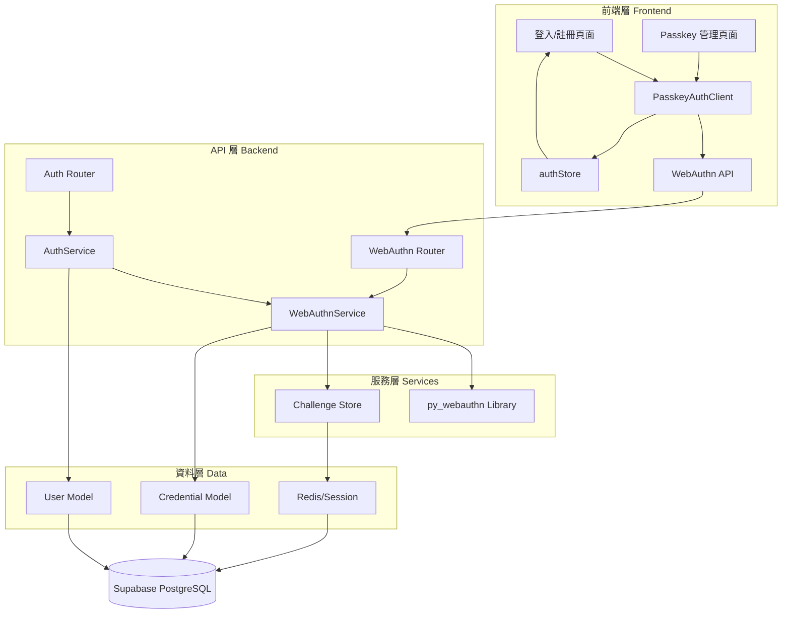
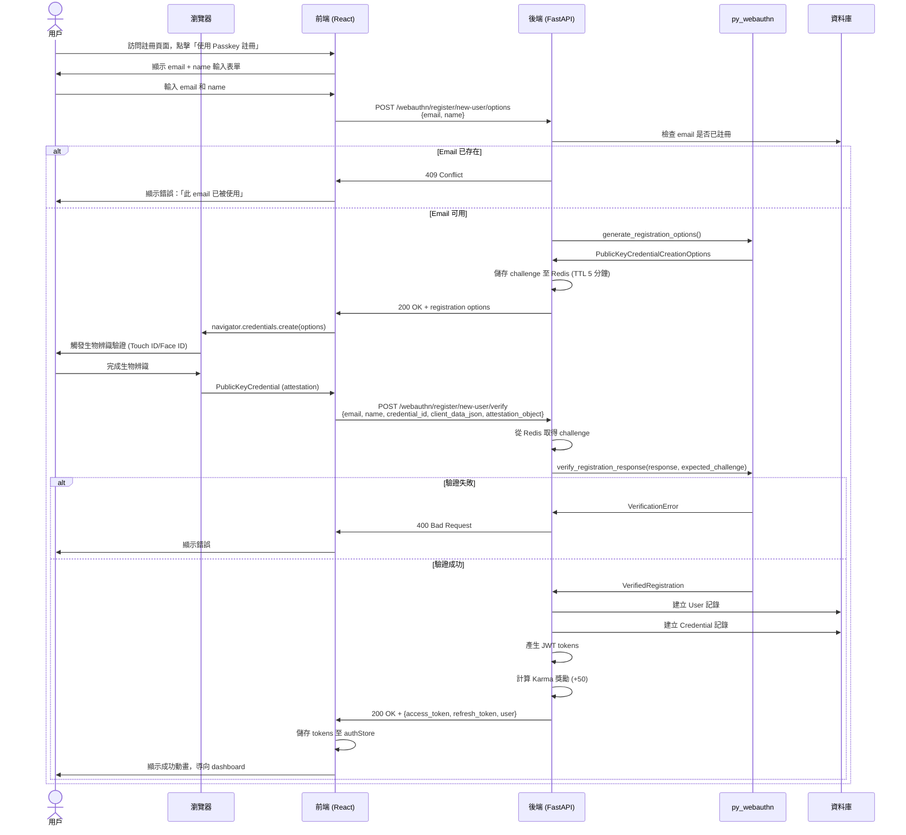
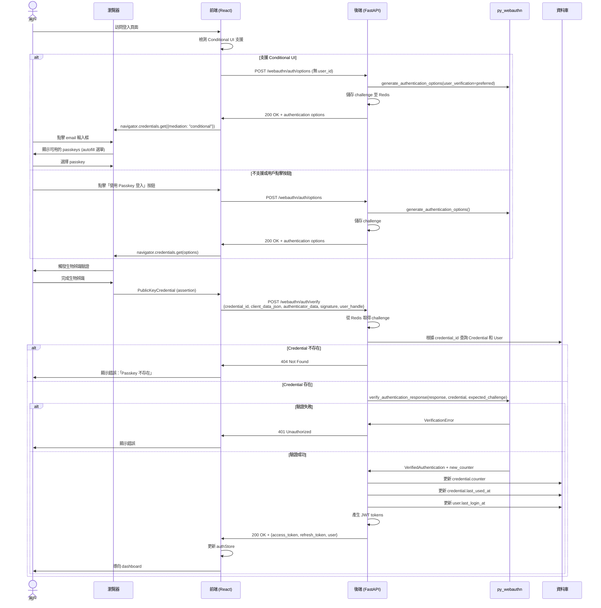
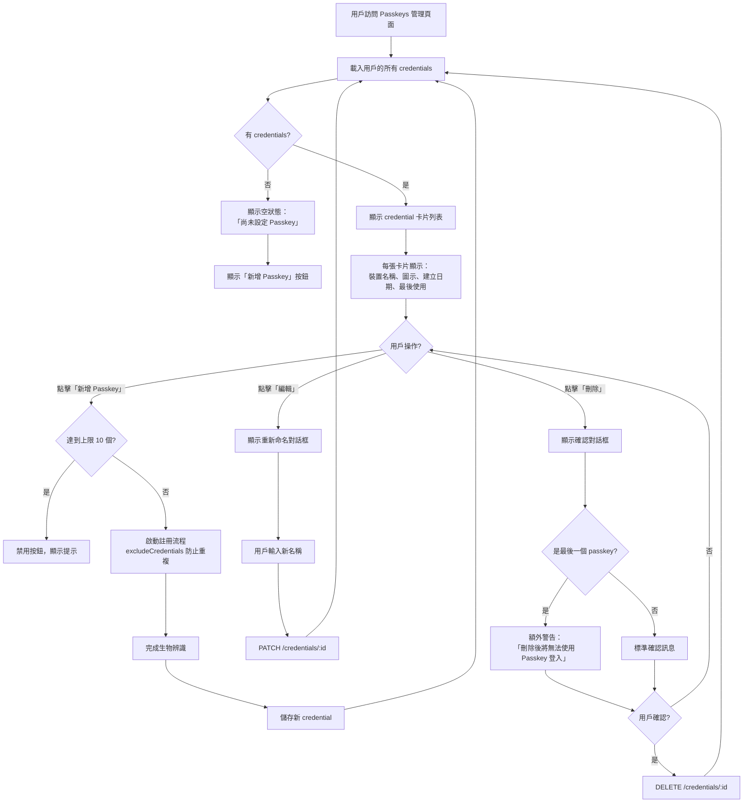
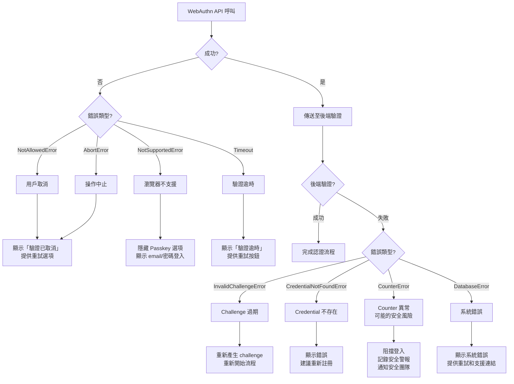
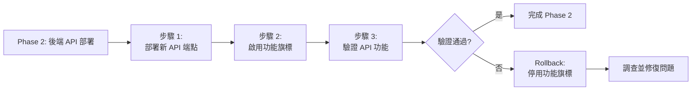
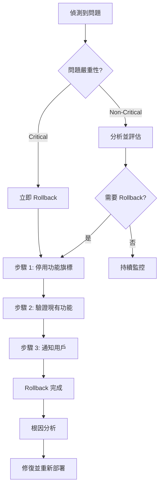

# Technical Design Document - Passkey Authentication

## Overview

本設計文件定義廢土塔羅平台的 Passkey 無密碼認證系統技術架構。該系統建立在現有的 WebAuthn 基礎實作之上，完善註冊、登入、credential 管理功能，並整合 Conditional UI (Autofill) 以提供流暢的使用者體驗。系統符合 FIDO2/WebAuthn 標準，使用生物辨識或安全金鑰進行無密碼認證，並與現有的 email/密碼和 OAuth 認證方式共存。

**Purpose**: 為用戶提供安全、便利的無密碼登入方式，消除密碼洩露風險，同時保持與現有認證系統的相容性。

**Users**: 廢土塔羅平台的所有用戶，特別是希望使用生物辨識（指紋、Face ID）或安全金鑰登入的用戶。

**Impact**: 在現有 email/密碼和 OAuth 認證方式之外，新增 passkey 無密碼認證選項。現有用戶可以選擇性啟用 passkey，新用戶可以直接使用 passkey 註冊。

### Goals

- 實作符合 FIDO2/WebAuthn 標準的 passkey 認證系統
- 提供流暢的註冊、登入、credential 管理流程
- 整合 Conditional UI (Autofill) 以提升用戶體驗
- 確保安全性：challenge 驗證、counter 檢查、origin 驗證
- 與現有認證系統無縫整合，不破壞現有功能

### Non-Goals

- 不強制用戶使用 passkey（保持現有 email/密碼登入方式）
- 不實作跨裝置 passkey 同步（依賴作業系統原生機制，如 iCloud Keychain）
- 不支援 FIDO U2F（僅支援 FIDO2/WebAuthn）
- 不實作管理後台的 passkey 統計儀表板（留待未來擴展）

## Architecture

### Existing Architecture Analysis

廢土塔羅平台現有認證系統包含：
- **Email/密碼認證**: 使用 bcrypt 雜湊，JWT tokens
- **OAuth 認證**: 支援 Google, GitHub 等第三方登入
- **JWT Token 管理**: Access token (30 分鐘) + Refresh token (7 天)
- **Karma 系統**: 認證行為會影響 karma 分數

**現有 WebAuthn 基礎實作**:
- ✅ `backend/app/core/webauthn.py`: WebAuthn 配置管理
- ✅ `backend/app/models/credential.py`: Credential 資料模型
- ✅ `backend/app/services/webauthn_service.py`: 註冊/驗證邏輯
- ✅ `backend/app/schemas/webauthn.py`: API Schema
- ✅ `backend/app/api/webauthn.py`: API 端點（部分實作）
- ✅ `src/lib/webauthn.ts`: 前端 WebAuthn 工具函式
- ✅ `src/lib/authStore.ts`: Zustand 認證狀態管理

**本設計保留的架構模式**:
- 三層架構：API → Service → Model
- JWT-based 認證機制
- Zustand 狀態管理
- Supabase 作為資料庫
- FastAPI + Next.js 前後端分離

### High-Level Architecture



### Technology Alignment

本功能完全使用現有技術棧，無新增技術依賴：

**後端現有技術**:
- FastAPI + Python 3.11+
- py_webauthn 2.x (已安裝於 `pyproject.toml`)
- SQLAlchemy ORM
- Supabase PostgreSQL
- Redis (選用，用於 challenge 儲存)

**前端現有技術**:
- Next.js 15.1.7 (App Router)
- TypeScript 5
- Zustand (狀態管理)
- @simplewebauthn/types (TypeScript 型別定義)
- Sonner (Toast 通知)

**新增依賴**:
- 無（所有必要套件已存在）

**整合點**:
- 與現有 `authStore.ts` 整合，共用 token 管理邏輯
- 與現有 `User` 模型關聯（`user.credentials` relationship）
- 與 Karma 系統整合（首次使用 passkey 獎勵 50 Karma）
- 與現有錯誤處理機制整合（`WastelandTarotException`）

## Key Design Decisions

### Decision 1: Challenge 儲存策略

**Context**: WebAuthn 需要在註冊/登入流程中產生 challenge 並在驗證時檢查一致性。Challenge 必須是短期有效（5 分鐘）且單次使用的。

**Alternatives**:
1. **Session Cookie**: 儲存在加密的 session cookie 中
2. **Redis**: 使用 Redis 作為 challenge 快取，設定 TTL
3. **資料庫**: 儲存在 PostgreSQL 並手動管理過期

**Selected Approach**: **Redis (首選) + Session Cookie (降級)**

實作兩層儲存機制：
- **生產環境**: 使用 Redis 儲存 challenge，key 為 `webauthn:challenge:{user_id or session_id}`，TTL 5 分鐘
- **開發環境/降級**: 如果 Redis 不可用，使用加密的 session cookie

**Rationale**:
- **性能優勢**: Redis 提供毫秒級讀寫，適合短期資料
- **自動過期**: TTL 機制自動清理過期 challenge
- **可擴展**: 支援多實例部署（與 session cookie 不同）
- **降級方案**: Session cookie 確保開發環境易用性

**Trade-offs**:
- **增加依賴**: 需要 Redis 實例（但專案已有 Redis 配置）
- **複雜性**: 需維護兩套儲存邏輯
- **收益**: 生產環境的可擴展性 + 開發環境的簡便性

### Decision 2: Conditional UI 實作策略

**Context**: Conditional UI (Autofill) 允許用戶在登入表單的 email 輸入框中直接選擇 passkey，無需額外按鈕。但並非所有瀏覽器都支援此功能。

**Alternatives**:
1. **僅實作 Conditional UI**: 假設所有用戶瀏覽器支援
2. **僅實作按鈕流程**: 不使用 Conditional UI，僅提供「使用 Passkey 登入」按鈕
3. **雙軌實作**: 同時支援 Conditional UI 和按鈕流程

**Selected Approach**: **雙軌實作 (Conditional UI + Button Fallback)**

實作邏輯：
1. 頁面載入時檢測 `PublicKeyCredential.isConditionalMediationAvailable()`
2. 如果支援，啟用 `<input autocomplete="webauthn">` 並呼叫 `navigator.credentials.get({ mediation: "conditional" })`
3. 同時顯示「使用 Passkey 登入」按鈕作為降級方案
4. 用戶可選擇 autofill 或按鈕任一方式

**Rationale**:
- **最佳體驗**: 支援瀏覽器的用戶享受無縫 autofill
- **向後相容**: 不支援的瀏覽器仍可使用按鈕流程
- **漸進增強**: 符合 Web 標準的漸進增強理念
- **用戶選擇**: 用戶可依習慣選擇操作方式

**Trade-offs**:
- **UI 複雜度**: 需同時顯示 autofill 提示和按鈕
- **測試負擔**: 需測試兩種流程的行為
- **收益**: 覆蓋所有瀏覽器，提供最佳體驗

### Decision 3: Credential 管理 UI 設計

**Context**: 用戶可能在多個裝置上註冊 passkey（MacBook, iPhone, iPad, 安全金鑰等），需要一個清晰的介面管理這些 credentials。

**Alternatives**:
1. **簡單列表**: 僅顯示 credential 名稱和建立日期
2. **詳細卡片**: 顯示裝置類型、最後使用時間、備份狀態等
3. **分組管理**: 依裝置類型分組（平台 vs. 可移除）

**Selected Approach**: **詳細卡片 + 裝置類型推測**

實作細節：
- 每個 credential 顯示為卡片，包含：
  - 裝置名稱（可編輯）
  - 裝置類型圖示（根據 `transports` 推測）
  - 建立日期、最後使用日期
  - 備份狀態指示器（iCloud Keychain 等）
  - 操作按鈕（編輯名稱、刪除）
- 使用 PixelIcon 顯示裝置圖示：
  - `internal` → 手機/電腦圖示
  - `usb/nfc/ble` → USB 金鑰圖示
- 限制最多 10 個 credentials

**Rationale**:
- **清晰度**: 用戶一眼了解每個 credential 的用途和狀態
- **實用性**: 最後使用時間幫助用戶識別活躍的 credentials
- **Fallout 主題**: PixelIcon 符合專案視覺風格
- **安全性**: 限制 10 個防止濫用

**Trade-offs**:
- **開發成本**: 比簡單列表需要更多前端工作
- **推測限制**: 裝置類型推測不一定準確
- **收益**: 大幅提升用戶體驗和管理能力

## System Flows

### Sequence Diagram: Passkey 註冊流程（新用戶）



### Sequence Diagram: Passkey 登入流程（已註冊用戶）



### Process Flow: Credential 管理流程



## Requirements Traceability

| 需求 ID | 需求摘要 | 實作元件 | 介面/API | 流程圖 |
|---------|----------|----------|----------|--------|
| 1.1-1.11 | Passkey 註冊流程 | WebAuthnService.generate_registration_options()<br/>WebAuthnService.verify_registration_response()<br/>PasskeyRegistrationForm (前端) | POST /webauthn/register/new-user/options<br/>POST /webauthn/register/new-user/verify | 註冊流程序列圖 |
| 2.1-2.10 | Passkey 登入流程 | WebAuthnService.generate_authentication_options()<br/>WebAuthnService.verify_authentication_response()<br/>PasskeyLoginButton (前端) | POST /webauthn/auth/options<br/>POST /webauthn/auth/verify | 登入流程序列圖 |
| 3.1-3.5 | Conditional UI 支援 | isConditionalUISupported() (前端)<br/>ConditionalUIHandler | POST /webauthn/auth/options (無 user_id) | 登入流程序列圖 (Conditional UI 分支) |
| 4.1-4.12 | Passkey 管理 | PasskeyManagementPage (前端)<br/>WebAuthnService.list_credentials()<br/>WebAuthnService.update_credential()<br/>WebAuthnService.delete_credential() | GET /credentials<br/>PATCH /credentials/:id<br/>DELETE /credentials/:id | Credential 管理流程圖 |
| 5.1-5.7 | 錯誤處理與降級 | ErrorBoundary (前端)<br/>WastelandTarotException (後端)<br/>isWebAuthnSupported() | 所有 API 錯誤回應 | 各流程圖的錯誤分支 |
| 6.1-6.10 | 安全性與合規 | Challenge 儲存機制 (Redis)<br/>Counter 驗證邏輯<br/>Origin 驗證 | 後端所有驗證邏輯 | 註冊/登入流程的驗證步驟 |
| 7.1-7.8 | 使用者體驗優化 | Pip-Boy 主題 UI 元件<br/>Sonner Toast<br/>PixelIcon | 前端所有元件 | UI 互動流程 |
| 8.1-8.8 | 整合現有認證系統 | AuthService 整合<br/>KarmaService 獎勵機制 | JWT token payload<br/>users.last_login_method | 認證流程整合 |
| 9.1-9.7 | 監控與分析 | 事件記錄系統 | 分析系統 API | - |
| 10.1-10.6 | 資料遷移 | Alembic migration script | 資料庫 schema | - |

## Components and Interfaces

### 後端服務層 Backend Services

#### WebAuthnService

**Responsibility & Boundaries**
- **Primary Responsibility**: 處理所有 WebAuthn/FIDO2 passkey 註冊、驗證、管理邏輯
- **Domain Boundary**: 屬於認證領域 (Authentication Domain)，與 AuthService 平行但獨立
- **Data Ownership**: 擁有 Credential 資料的生命週期管理（創建、更新、刪除）
- **Transaction Boundary**: 單一 credential 操作為一個事務；新用戶註冊時 User + Credential 創建為一個事務

**Dependencies**
- **Inbound**: WebAuthn API Router, AuthService (用於整合認證流程)
- **Outbound**:
  - `py_webauthn` 官方函式庫 (v2.x)
  - Credential Model (SQLAlchemy)
  - User Model (SQLAlchemy)
  - Redis (challenge 儲存，可選)
  - KarmaService (首次使用 passkey 獎勵)
- **External**:
  - py_webauthn: WebAuthn 標準實作 (https://github.com/duo-labs/py_webauthn)
  - Redis: Challenge 快取 (可選，降級至 session)

**External Dependencies Investigation**:

**py_webauthn 2.x**:
- **版本**: 2.2.0+ (專案 `pyproject.toml` 已包含 `webauthn>=2.0.0`)
- **核心功能**:
  - `generate_registration_options()`: 產生註冊選項
  - `verify_registration_response()`: 驗證註冊回應
  - `generate_authentication_options()`: 產生驗證選項
  - `verify_authentication_response()`: 驗證驗證回應
- **Counter 驗證**: 自動檢查 counter 值，如果 counter 減少或不變會拋出異常
- **Attestation 模式**: 支援 `none`, `indirect`, `direct`（預設使用 `none` 以保護隱私）
- **User Verification**: 支援 `required`, `preferred`, `discouraged`（預設 `preferred`）
- **已知問題**: 無重大已知問題，維護活躍
- **遷移指南**: 從 1.x 升級需注意 API 變更，但專案已使用 2.x 無需遷移

**Contract Definition**

**Service Interface**:
```typescript
interface WebAuthnService {
  // 註冊相關
  generate_registration_options(
    user: User,
    device_name?: string
  ): Result<PublicKeyCredentialCreationOptions, WebAuthnRegistrationError>;

  verify_registration_response(
    user: User,
    credential_id: str,
    client_data_json: str,
    attestation_object: str,
    expected_challenge: bytes,
    device_name?: str
  ): Result<Credential, WebAuthnRegistrationError>;

  // 新用戶註冊
  register_new_user_with_passkey(
    email: str,
    name: str,
    credential_id: str,
    client_data_json: str,
    attestation_object: str,
    expected_challenge: bytes,
    device_name?: str
  ): Result<(User, Credential), UserAlreadyExistsError | WebAuthnRegistrationError>;

  // 驗證相關
  generate_authentication_options(
    user_id?: UUID
  ): Result<PublicKeyCredentialRequestOptions, WebAuthnAuthenticationError>;

  verify_authentication_response(
    credential_id: str,
    client_data_json: str,
    authenticator_data: str,
    signature: str,
    user_handle: str,
    expected_challenge: bytes
  ): Result<(User, Credential), CredentialNotFoundError | WebAuthnAuthenticationError>;

  // Credential 管理
  list_user_credentials(user_id: UUID): List<Credential>;
  update_credential_name(credential_id: UUID, new_name: str): Result<Credential, CredentialNotFoundError>;
  delete_credential(credential_id: UUID, user_id: UUID): Result<bool, CredentialNotFoundError>;
}
```

**Preconditions**:
- 註冊：User 物件必須存在或 email 未被註冊
- 驗證：Challenge 必須存在於 Redis 且未過期
- 管理：User 必須已登入且具有權限

**Postconditions**:
- 註冊成功：Credential 記錄已儲存，challenge 已從 Redis 刪除
- 驗證成功：Counter 已更新，last_used_at 已更新
- 刪除成功：Credential 記錄已從資料庫移除

**Invariants**:
- 每個 credential_id 全域唯一
- Counter 值只能遞增，不能減少
- 每個 user 最多 10 個 credentials

#### AuthService (整合點)

**Responsibility & Boundaries**
- **Primary Responsibility**: 統一認證入口，協調 email/密碼、OAuth、Passkey 三種認證方式
- **Domain Boundary**: 認證領域的聚合根
- **Integration Strategy**: 在現有 email/OAuth 認證邏輯中新增 passkey 路徑

**新增方法**:
```typescript
interface AuthService {
  // 新增：Passkey 登入整合
  authenticate_with_passkey(
    credential_id: str,
    assertion_response: dict
  ): Result<(User, Tokens), AuthenticationError>;

  // 新增：檢查用戶是否有 passkey
  user_has_passkey(user_id: UUID): bool;

  // 新增：記錄認證方式
  record_login_method(user_id: UUID, method: "passkey" | "email" | "oauth"): void;
}
```

**Integration Strategy**:
- **Modification Approach**: 擴展現有 AuthService，新增 passkey 相關方法
- **Backward Compatibility**: 現有 email/OAuth 登入邏輯完全不變
- **Migration Path**: 無需遷移，新功能為可選項

#### Challenge Store Service

**Responsibility & Boundaries**
- **Primary Responsibility**: 管理 WebAuthn challenge 的儲存、檢索、過期
- **Domain Boundary**: 認證基礎設施層
- **Data Ownership**: 擁有 challenge 的短期儲存

**Contract Definition**:
```typescript
interface ChallengeStore {
  store_challenge(
    key: str,  // "webauthn:challenge:{user_id or session_id}"
    challenge: bytes,
    ttl_seconds: int = 300
  ): Result<void, StorageError>;

  get_challenge(key: str): Result<bytes, ChallengeNotFoundError>;

  delete_challenge(key: str): void;
}
```

**Implementation**: 雙層儲存機制
- **Primary**: Redis with TTL (生產環境)
- **Fallback**: Encrypted session cookie (開發環境)

### 後端 API 層 Backend API

#### WebAuthn Router

**API Contract**:

| Method | Endpoint | Request | Response | Errors |
|--------|----------|---------|----------|--------|
| POST | /api/v1/webauthn/register/new-user/options | `{"email": str, "name": str}` | `{"options": dict, "challenge": str}` | 409 (email 已註冊), 500 |
| POST | /api/v1/webauthn/register/new-user/verify | `NewUserRegistrationVerificationRequest` | `NewUserRegistrationResponse` | 400 (驗證失敗), 409 (email 已註冊), 500 |
| POST | /api/v1/webauthn/register/options | `RegistrationOptionsRequest` | `RegistrationOptionsResponse` | 401 (未登入), 500 |
| POST | /api/v1/webauthn/register/verify | `RegistrationVerificationRequest` | `RegistrationVerificationResponse` | 400 (驗證失敗), 401 (未登入), 500 |
| POST | /api/v1/webauthn/auth/options | `AuthenticationOptionsRequest` (可選 user_id) | `AuthenticationOptionsResponse` | 500 |
| POST | /api/v1/webauthn/auth/verify | `AuthenticationVerificationRequest` | `AuthenticationVerificationResponse` | 400 (驗證失敗), 404 (credential 不存在), 500 |
| GET | /api/v1/credentials | - | `CredentialListResponse` | 401 (未登入), 500 |
| PATCH | /api/v1/credentials/:id | `UpdateCredentialNameRequest` | `UpdateCredentialNameResponse` | 401 (未登入), 404, 500 |
| DELETE | /api/v1/credentials/:id | - | `DeleteCredentialResponse` | 401 (未登入), 404, 500 |

**Request/Response Schemas** (詳見 `backend/app/schemas/webauthn.py`):

**NewUserRegistrationOptionsRequest**:
```json
{
  "email": "user@example.com",
  "name": "廢土旅者"
}
```

**NewUserRegistrationVerificationRequest**:
```json
{
  "email": "user@example.com",
  "name": "廢土旅者",
  "credential_id": "base64url_encoded_id",
  "client_data_json": "base64url_encoded_json",
  "attestation_object": "base64url_encoded_object",
  "device_name": "MacBook Touch ID"
}
```

**AuthenticationVerificationRequest**:
```json
{
  "credential_id": "base64url_encoded_id",
  "client_data_json": "base64url_encoded_json",
  "authenticator_data": "base64url_encoded_data",
  "signature": "base64url_encoded_signature",
  "user_handle": "base64url_encoded_handle"
}
```

**NewUserRegistrationResponse**:
```json
{
  "success": true,
  "access_token": "jwt_token",
  "refresh_token": "jwt_token",
  "user": {
    "id": "uuid",
    "email": "user@example.com",
    "name": "廢土旅者",
    "karma": 50
  },
  "credential": {
    "id": "uuid",
    "device_name": "MacBook Touch ID",
    "created_at": "2025-10-27T12:00:00Z"
  },
  "message": "Passkey 註冊成功，歡迎加入！"
}
```

### 前端元件層 Frontend Components

#### PasskeyAuthClient

**Responsibility & Boundaries**
- **Primary Responsibility**: 前端 WebAuthn API 互動、Base64URL 編解碼、錯誤處理
- **Domain Boundary**: 前端認證領域的核心服務
- **Dependencies**:
  - 瀏覽器 WebAuthn API (`navigator.credentials`)
  - `@simplewebauthn/types` (TypeScript 型別)
  - `authStore` (Zustand)

**Contract Definition**:
```typescript
interface PasskeyAuthClient {
  // 功能檢測
  isWebAuthnSupported(): boolean;
  isConditionalUISupported(): Promise<boolean>;

  // 註冊流程
  startRegistration(
    options: PublicKeyCredentialCreationOptionsJSON
  ): Promise<RegistrationResponseJSON>;

  // 登入流程
  startAuthentication(
    options: PublicKeyCredentialRequestOptionsJSON,
    useBrowserAutofill?: boolean
  ): Promise<AuthenticationResponseJSON>;

  // 編解碼工具
  base64URLEncode(buffer: ArrayBuffer): string;
  base64URLDecode(str: string): ArrayBuffer;
}
```

**實作檔案**: `src/lib/webauthn.ts` (已存在，需擴充)

**新增功能**:
- Conditional UI 檢測與啟用
- 錯誤訊息本地化（zh-TW）
- Timeout 處理（60 秒）

#### PasskeyRegistrationForm

**Responsibility & Boundaries**
- **Primary Responsibility**: 新用戶使用 passkey 註冊的表單 UI
- **Domain Boundary**: 前端認證 UI 層
- **State Management**: React Hook Form + Zod validation

**Component Structure**:
```typescript
interface PasskeyRegistrationFormProps {
  onSuccess?: (tokens: Tokens, user: User) => void;
  onError?: (error: Error) => void;
}

const PasskeyRegistrationForm: React.FC<PasskeyRegistrationFormProps> = ({
  onSuccess,
  onError
}) => {
  // 狀態：loading, error, deviceName
  // 表單：email, name 欄位
  // 按鈕：「使用 Passkey 註冊」
  // 流程：
  // 1. 驗證 email + name
  // 2. 呼叫 /webauthn/register/new-user/options
  // 3. 觸發 navigator.credentials.create()
  // 4. 呼叫 /webauthn/register/new-user/verify
  // 5. 儲存 tokens，導向 dashboard
};
```

**整合位置**: `src/components/auth/RegisterForm.tsx` (擴充現有元件)

#### PasskeyLoginButton

**Responsibility & Boundaries**
- **Primary Responsibility**: 提供「使用 Passkey 登入」按鈕，支援 Conditional UI 和標準流程
- **Domain Boundary**: 前端認證 UI 層
- **Integration Strategy**: 整合至現有 `LoginForm.tsx`

**Component Structure**:
```typescript
interface PasskeyLoginButtonProps {
  enableConditionalUI?: boolean;  // 預設 true
  onSuccess?: (tokens: Tokens, user: User) => void;
  onError?: (error: Error) => void;
}

const PasskeyLoginButton: React.FC<PasskeyLoginButtonProps> = ({
  enableConditionalUI = true,
  onSuccess,
  onError
}) => {
  // 流程：
  // 1. 檢測 Conditional UI 支援
  // 2. 如果支援且 enableConditionalUI=true，啟用 autofill
  // 3. 同時顯示按鈕作為降級方案
  // 4. 用戶觸發後呼叫認證流程
};
```

**Conditional UI 實作**:
```typescript
// 在 LoginForm 載入時
useEffect(() => {
  const initConditionalUI = async () => {
    const supported = await isConditionalUISupported();
    if (supported) {
      // 在 email input 加上 autocomplete="webauthn"
      // 呼叫 startAuthentication(options, true)
    }
  };
  initConditionalUI();
}, []);
```

#### PasskeyManagementPage

**Responsibility & Boundaries**
- **Primary Responsibility**: 顯示和管理用戶的所有 passkeys
- **Domain Boundary**: 前端帳號設定 UI 層
- **State Management**: React Query (或 SWR) 用於資料獲取

**Component Structure**:
```typescript
const PasskeyManagementPage: React.FC = () => {
  const { data: credentials, isLoading, refetch } = useCredentials();
  const { mutate: updateName } = useUpdateCredentialName();
  const { mutate: deleteCredential } = useDeleteCredential();

  return (
    <div>
      <h2>Passkeys 管理</h2>
      {isLoading ? (
        <LoadingSpinner />
      ) : credentials.length === 0 ? (
        <EmptyState message="尚未設定 Passkey" />
      ) : (
        <CredentialList
          credentials={credentials}
          onUpdate={updateName}
          onDelete={deleteCredential}
        />
      )}
      <AddPasskeyButton
        disabled={credentials.length >= 10}
        onSuccess={refetch}
      />
    </div>
  );
};
```

**子元件**:
- `CredentialCard`: 顯示單一 credential 資訊
- `AddPasskeyButton`: 新增 passkey 按鈕
- `EditNameDialog`: 編輯 credential 名稱對話框
- `DeleteConfirmDialog`: 刪除確認對話框

#### authStore (整合)

**State Management**:
```typescript
interface AuthStore {
  // 現有狀態
  isAuthenticated: boolean;
  user: User | null;
  tokens: Tokens | null;

  // 新增狀態
  loginMethod: "email" | "oauth" | "passkey" | null;
  hasPasskey: boolean;

  // 現有方法
  login: (tokens: Tokens, user: User) => void;
  logout: () => void;

  // 新增方法
  loginWithPasskey: (tokens: Tokens, user: User) => void;
  checkPasskeyStatus: () => Promise<boolean>;
}
```

**Integration Strategy**:
- 擴充現有 `authStore.ts`，新增 passkey 相關狀態和方法
- `loginWithPasskey` 與 `login` 行為相同，額外記錄 `loginMethod: "passkey"`
- 保持與現有 email/OAuth 登入的相容性

## Data Models

### Domain Model

**Core Concepts**:

**Aggregate: User Authentication**
- **Aggregate Root**: User
- **Entities**:
  - User (認證主體)
  - Credential (Passkey 憑證，支援多個)
- **Value Objects**:
  - Challenge (短期驗證碼，不持久化至資料庫)
  - PublicKey (CBOR 編碼的公鑰)
- **Domain Events**:
  - PasskeyRegistered (用戶註冊新 passkey)
  - PasskeyAuthenticated (用戶使用 passkey 登入)
  - PasskeyDeleted (用戶刪除 passkey)

**Business Rules & Invariants**:
- 每個 User 最多 10 個 Credentials
- Credential.counter 只能遞增，不能減少（防止 replay attack）
- Challenge 必須在 5 分鐘內使用，且單次有效
- 刪除 User 時必須級聯刪除所有 Credentials

### Physical Data Model

**Relational Database (PostgreSQL via Supabase)**:

**Table: credentials** (已存在，無需遷移)

| Column | Type | Constraints | Description |
|--------|------|-------------|-------------|
| id | UUID | PRIMARY KEY, DEFAULT gen_random_uuid() | Primary key |
| user_id | UUID | FOREIGN KEY (users.id) ON DELETE CASCADE, NOT NULL, INDEX | 關聯的用戶 ID |
| credential_id | TEXT | UNIQUE, NOT NULL, INDEX | WebAuthn credential ID (Base64URL) |
| public_key | TEXT | NOT NULL | 公鑰 (CBOR encoded) |
| counter | BIGINT | NOT NULL, DEFAULT 0 | Signature counter |
| transports | TEXT[] | NULLABLE | Supported transports: usb, nfc, ble, internal |
| device_name | TEXT | NULLABLE | User-friendly device name |
| aaguid | UUID | NULLABLE | Authenticator AAGUID |
| backup_eligible | BOOLEAN | NOT NULL, DEFAULT false | 是否支援備份 |
| backup_state | BOOLEAN | NOT NULL, DEFAULT false | 是否已備份 |
| created_at | TIMESTAMP | NOT NULL, DEFAULT CURRENT_TIMESTAMP | 建立時間 |
| last_used_at | TIMESTAMP | NULLABLE | 最後使用時間 |

**Indexes**:
```sql
CREATE INDEX idx_credentials_user_id ON credentials(user_id);
CREATE INDEX idx_credentials_credential_id ON credentials(credential_id);
CREATE INDEX idx_credentials_last_used_at ON credentials(last_used_at);
```

**Relationship**:
```sql
ALTER TABLE users ADD COLUMN last_login_method TEXT;  -- 'email', 'oauth', 'passkey'
```

**Table: users** (擴充，需新增欄位)

新增欄位：
- `last_login_method` (TEXT): 記錄最後一次登入方式

**Redis Schema** (Challenge 儲存):

```
Key: webauthn:challenge:{user_id or session_id}
Value: bytes (原始 challenge)
TTL: 300 seconds (5 minutes)
```

### Data Contracts & Integration

**API Data Transfer**:

所有 WebAuthn 相關資料使用 **Base64URL 編碼** (符合 WebAuthn 規範)：
- `credential_id`: Base64URL string
- `client_data_json`: Base64URL string
- `attestation_object`: Base64URL string
- `authenticator_data`: Base64URL string
- `signature`: Base64URL string

**Event Schemas** (用於分析系統):

**PasskeyRegistrationSuccess**:
```json
{
  "event": "passkey_registration_success",
  "user_id": "uuid",
  "credential_id": "truncated_id",
  "device_type": "platform" | "roaming",
  "timestamp": "2025-10-27T12:00:00Z"
}
```

**PasskeyAuthenticationSuccess**:
```json
{
  "event": "passkey_login_success",
  "user_id": "uuid",
  "credential_id": "truncated_id",
  "timestamp": "2025-10-27T12:00:00Z"
}
```

**Cross-Service Data Management**:
- **Karma 獎勵**: PasskeyRegistered event → KarmaService.add_karma(user_id, 50, "首次使用 Passkey")
- **使用者分析**: 所有 passkey 事件 → Analytics Service

## Error Handling

### Error Strategy

採用分層錯誤處理策略，確保錯誤訊息清晰、可操作，並符合 Fallout 主題：

**Layer 1: WebAuthn API Errors** (瀏覽器層)
- 捕捉 `DOMException` 並轉換為用戶友善訊息
- 錯誤類型對應：
  - `NotAllowedError`: 用戶取消驗證或瀏覽器阻擋
  - `NotSupportedError`: 瀏覽器不支援 WebAuthn
  - `AbortError`: 操作被中止
  - `Timeout`: 驗證逾時

**Layer 2: Backend Validation Errors** (後端層)
- 使用自訂 Exception 類別繼承 `WastelandTarotException`
- 錯誤類型：
  - `WebAuthnRegistrationError`: 註冊驗證失敗
  - `WebAuthnAuthenticationError`: 登入驗證失敗
  - `CredentialNotFoundError`: Credential 不存在
  - `InvalidChallengeError`: Challenge 無效或過期
  - `CounterError`: Counter 值異常（可能的 replay attack）
  - `UserAlreadyExistsError`: Email 已被註冊

**Layer 3: Infrastructure Errors** (基礎設施層)
- Redis 連線失敗 → 降級至 session cookie
- 資料庫連線失敗 → 標準 500 錯誤

### Error Categories and Responses

**User Errors (4xx)**:

| Error Code | HTTP Status | User Message (zh-TW) | Recovery Action |
|------------|-------------|----------------------|-----------------|
| `WEBAUTHN_NOT_SUPPORTED` | 501 | 你的瀏覽器不支援 Passkey 功能，請改用 email/密碼登入 | 顯示 email 登入表單 |
| `USER_CANCELLED` | 400 | 驗證已取消，請重試或使用其他登入方式 | 返回登入頁面 |
| `CREDENTIAL_NOT_FOUND` | 404 | Passkey 不存在，請重新註冊或使用其他登入方式 | 顯示註冊選項 |
| `EMAIL_ALREADY_EXISTS` | 409 | 此 email 已被使用，請使用登入功能 | 導向登入頁面 |
| `INVALID_CHALLENGE` | 400 | 驗證碼已過期，請重新開始 | 重新產生 challenge |
| `TIMEOUT` | 408 | 驗證逾時，請重試 | 顯示重試按鈕 |

**System Errors (5xx)**:

| Error Code | HTTP Status | User Message (zh-TW) | Recovery Action |
|------------|-------------|----------------------|-----------------|
| `INTERNAL_SERVER_ERROR` | 500 | 系統故障，請稍後再試 | 顯示重試按鈕，記錄錯誤 |
| `REDIS_CONNECTION_ERROR` | 500 | 系統暫時不可用，請稍後再試 | 自動降級至 session |
| `DATABASE_ERROR` | 500 | 資料庫錯誤，請稍後再試 | 記錄錯誤，顯示支援連結 |

**Business Logic Errors (422)**:

| Error Code | HTTP Status | User Message (zh-TW) | Recovery Action |
|------------|-------------|----------------------|-----------------|
| `COUNTER_REGRESSION` | 422 | 偵測到異常的 Passkey 使用，請使用其他登入方式並聯繫支援 | 記錄安全警報，阻擋登入 |
| `MAX_CREDENTIALS_REACHED` | 422 | 已達到 Passkey 數量上限 (10 個)，請先刪除不使用的 Passkey | 禁用「新增」按鈕 |
| `ATTESTATION_VERIFICATION_FAILED` | 422 | Passkey 驗證失敗，請重試 | 顯示重試按鈕 |

**Process Flow Visualization**:



### Monitoring

**Error Tracking**:
- 使用現有的 logging 系統記錄所有 WebAuthn 錯誤
- 記錄欄位：
  - `user_id` (如果有)
  - `error_type` (錯誤類別)
  - `error_message` (錯誤訊息)
  - `ip_address`
  - `user_agent`
  - `timestamp`
  - `stack_trace` (僅伺服器端錯誤)

**Security Alerts**:
- `CounterError` 發生時立即發送警報至安全團隊
- 連續 5 次驗證失敗（同一 credential）觸發警報
- 異常的 authenticator 行為（如 attestation 驗證失敗）記錄並分析

**Health Monitoring**:
- 監控 WebAuthn API 成功率（目標 >95%）
- 監控平均驗證時間（目標 <3 秒）
- 監控 Redis 連線狀態
- 監控 challenge 過期率（應 <5%）

**Dashboard Metrics** (未來擴展):
- Passkey 註冊數 / 天
- Passkey 登入成功率
- 常見錯誤類型分佈
- 裝置類型分佈（platform vs. roaming）

## Testing Strategy

### Unit Tests

**後端 WebAuthnService 核心測試**:

1. **Challenge 產生與驗證**
   ```python
   def test_generate_challenge_returns_32_bytes():
       challenge = secrets.token_bytes(32)
       assert len(challenge) == 32

   def test_challenge_stored_in_redis_with_ttl():
       challenge = generate_challenge()
       store_challenge(user_id, challenge, ttl=300)
       assert get_challenge(user_id) == challenge
       # 等待 5 分鐘後應過期
   ```

2. **Counter 驗證邏輯**
   ```python
   def test_counter_increment_success():
       credential = Credential(counter=10)
       credential.increment_counter(11)  # 應成功
       assert credential.counter == 11

   def test_counter_regression_raises_error():
       credential = Credential(counter=10)
       with pytest.raises(ValueError):
           credential.increment_counter(9)  # Counter 減少，應拋出異常
   ```

3. **Attestation 驗證**
   ```python
   def test_verify_registration_response_with_valid_attestation():
       response = mock_attestation_response()
       verified = webauthn_service.verify_registration_response(
           user, response, expected_challenge
       )
       assert verified.credential_id is not None

   def test_verify_registration_response_with_invalid_challenge():
       response = mock_attestation_response()
       with pytest.raises(InvalidChallengeError):
           webauthn_service.verify_registration_response(
               user, response, wrong_challenge
           )
   ```

4. **Origin 驗證**
   ```python
   def test_origin_verification_production():
       config = WebAuthnConfig(origin="https://wastelandtarot.com")
       assert validate_origin("https://wastelandtarot.com")  # 應通過
       assert not validate_origin("http://localhost:3000")  # 應失敗
   ```

5. **Credential 管理**
   ```python
   def test_list_user_credentials():
       credentials = webauthn_service.list_user_credentials(user_id)
       assert len(credentials) > 0

   def test_delete_credential_success():
       result = webauthn_service.delete_credential(credential_id, user_id)
       assert result is True
       assert db.query(Credential).filter_by(id=credential_id).first() is None
   ```

**前端 PasskeyAuthClient 測試**:

1. **WebAuthn 支援檢測**
   ```typescript
   it('should detect WebAuthn support', () => {
     expect(isWebAuthnSupported()).toBe(true);
   });

   it('should detect Conditional UI support', async () => {
     const supported = await isConditionalUISupported();
     expect(supported).toBe(true);
   });
   ```

2. **Base64URL 編解碼**
   ```typescript
   it('should encode and decode ArrayBuffer correctly', () => {
     const buffer = new Uint8Array([1, 2, 3, 4, 5]).buffer;
     const encoded = base64URLEncode(buffer);
     const decoded = base64URLDecode(encoded);
     expect(new Uint8Array(decoded)).toEqual(new Uint8Array(buffer));
   });
   ```

### Integration Tests

**API 端點整合測試**:

1. **新用戶 Passkey 註冊流程**
   ```python
   async def test_new_user_passkey_registration_flow():
       # Step 1: 取得 registration options
       response = await client.post(
           "/api/v1/webauthn/register/new-user/options",
           json={"email": "test@example.com", "name": "Test User"}
       )
       assert response.status_code == 200
       options = response.json()["options"]
       challenge = response.json()["challenge"]

       # Step 2: 模擬瀏覽器產生 attestation
       mock_attestation = create_mock_attestation(challenge)

       # Step 3: 驗證註冊
       response = await client.post(
           "/api/v1/webauthn/register/new-user/verify",
           json={
               "email": "test@example.com",
               "name": "Test User",
               **mock_attestation
           }
       )
       assert response.status_code == 200
       assert "access_token" in response.json()
       assert "user" in response.json()
   ```

2. **Passkey 登入流程**
   ```python
   async def test_passkey_authentication_flow():
       # 前置條件：用戶已註冊 passkey
       user = await create_user_with_passkey()

       # Step 1: 取得 authentication options
       response = await client.post("/api/v1/webauthn/auth/options")
       options = response.json()["options"]
       challenge = response.json()["challenge"]

       # Step 2: 模擬瀏覽器產生 assertion
       mock_assertion = create_mock_assertion(challenge, user.credentials[0])

       # Step 3: 驗證登入
       response = await client.post(
           "/api/v1/webauthn/auth/verify",
           json=mock_assertion
       )
       assert response.status_code == 200
       assert "access_token" in response.json()
   ```

3. **Credential 管理流程**
   ```python
   async def test_credential_management_flow():
       user = await create_authenticated_user()

       # 新增 credential
       response = await client.post(
           "/api/v1/webauthn/register/options",
           headers={"Authorization": f"Bearer {user.access_token}"}
       )
       # ... 完成註冊流程

       # 列出 credentials
       response = await client.get(
           "/api/v1/credentials",
           headers={"Authorization": f"Bearer {user.access_token}"}
       )
       credentials = response.json()["credentials"]
       assert len(credentials) > 0

       # 重新命名 credential
       credential_id = credentials[0]["id"]
       response = await client.patch(
           f"/api/v1/credentials/{credential_id}",
           json={"name": "New Name"},
           headers={"Authorization": f"Bearer {user.access_token}"}
       )
       assert response.status_code == 200

       # 刪除 credential
       response = await client.delete(
           f"/api/v1/credentials/{credential_id}",
           headers={"Authorization": f"Bearer {user.access_token}"}
       )
       assert response.status_code == 200
   ```

4. **Karma 整合測試**
   ```python
   async def test_first_passkey_usage_karma_reward():
       # 首次使用 passkey 註冊應獲得 50 Karma
       response = await complete_passkey_registration()
       user = response.json()["user"]
       assert user["karma"] == 50
   ```

### E2E/UI Tests (Playwright)

**關鍵使用者路徑測試**:

1. **新用戶 Passkey 註冊**
   ```typescript
   test('should complete passkey registration for new user', async ({ page }) => {
     await page.goto('/auth/register');
     await page.click('text=使用 Passkey 註冊');
     await page.fill('input[name="email"]', 'test@example.com');
     await page.fill('input[name="name"]', '廢土旅者');
     await page.click('button[type="submit"]');

     // 等待瀏覽器 WebAuthn 對話框（需手動操作或 mock）
     await page.waitForURL('/dashboard');
     await expect(page.locator('text=歡迎，廢土旅者')).toBeVisible();
   });
   ```

2. **Conditional UI Autofill 登入**
   ```typescript
   test('should show passkey in autofill menu', async ({ page }) => {
     await page.goto('/auth/login');
     await page.click('input[name="email"]');

     // 檢查 autofill 選單是否顯示 passkey（瀏覽器行為，難以測試）
     // 可能需要使用 Chrome DevTools Protocol
   });
   ```

3. **Passkey 管理操作**
   ```typescript
   test('should manage passkeys in settings', async ({ page, context }) => {
     // 前置條件：已登入用戶
     await login(page);

     await page.goto('/settings/passkeys');

     // 檢查 credential 列表
     await expect(page.locator('.credential-card')).toHaveCount(1);

     // 新增 passkey
     await page.click('text=新增 Passkey');
     // ... 完成註冊流程
     await expect(page.locator('.credential-card')).toHaveCount(2);

     // 編輯名稱
     await page.click('.credential-card:first-child .edit-button');
     await page.fill('input[name="deviceName"]', 'MacBook Pro');
     await page.click('text=儲存');
     await expect(page.locator('text=MacBook Pro')).toBeVisible();

     // 刪除 passkey
     await page.click('.credential-card:first-child .delete-button');
     await page.click('text=確定刪除');
     await expect(page.locator('.credential-card')).toHaveCount(1);
   });
   ```

4. **錯誤處理測試**
   ```typescript
   test('should handle unsupported browser gracefully', async ({ page }) => {
     // Mock WebAuthn 不支援
     await page.addInitScript(() => {
       delete (window as any).PublicKeyCredential;
     });

     await page.goto('/auth/login');
     await expect(page.locator('text=使用 Passkey 登入')).not.toBeVisible();
     await expect(page.locator('text=你的瀏覽器不支援 Passkey')).toBeVisible();
   });

   test('should handle user cancellation', async ({ page }) => {
     await page.goto('/auth/login');
     await page.click('text=使用 Passkey 登入');

     // 模擬用戶取消（需 mock WebAuthn API）
     await expect(page.locator('text=驗證已取消')).toBeVisible();
   });
   ```

5. **Pip-Boy 主題視覺測試**
   ```typescript
   test('should render passkey UI with Fallout theme', async ({ page }) => {
     await page.goto('/auth/login');

     // 檢查 Pip-Boy 綠色主題
     const button = page.locator('text=使用 Passkey 登入');
     await expect(button).toHaveCSS('color', 'rgb(0, 255, 136)');  // #00ff88

     // 檢查 PixelIcon 圖示
     await expect(page.locator('.ri-fingerprint-line')).toBeVisible();
   });
   ```

### Performance/Load Tests

**負載測試場景**:

1. **並發註冊壓力測試**
   ```python
   async def test_concurrent_registrations():
       # 模擬 100 個用戶同時註冊 passkey
       tasks = [register_user_with_passkey(i) for i in range(100)]
       results = await asyncio.gather(*tasks, return_exceptions=True)

       success_count = sum(1 for r in results if not isinstance(r, Exception))
       assert success_count >= 95  # 至少 95% 成功率
   ```

2. **Challenge 過期處理**
   ```python
   async def test_challenge_expiration_under_load():
       # 產生 1000 個 challenges
       for i in range(1000):
           challenge = generate_challenge()
           store_challenge(f"user_{i}", challenge)

       # 等待 5 分鐘
       await asyncio.sleep(300)

       # 檢查所有 challenges 已過期
       for i in range(1000):
           assert get_challenge(f"user_{i}") is None
   ```

3. **Redis 降級測試**
   ```python
   async def test_redis_failover_to_session():
       # 關閉 Redis
       await redis_client.close()

       # 註冊流程應自動降級至 session
       response = await register_with_passkey()
       assert response.status_code == 200

       # 驗證 challenge 儲存在 session cookie 中
       assert "webauthn_challenge" in response.cookies
   ```

4. **Counter 更新競爭條件測試**
   ```python
   async def test_concurrent_counter_updates():
       credential = await create_credential(counter=0)

       # 模擬 10 個並發登入（應按序更新 counter）
       tasks = [authenticate_with_credential(credential.id) for _ in range(10)]
       results = await asyncio.gather(*tasks)

       # 檢查最終 counter 值
       updated_credential = await get_credential(credential.id)
       assert updated_credential.counter == 10
   ```

## Security Considerations

### Threat Modeling

**識別的威脅與對策**:

| 威脅 | 嚴重性 | 攻擊向量 | 對策 |
|------|--------|----------|------|
| **Replay Attack** | 高 | 攻擊者重放先前捕獲的 assertion | Counter 驗證機制：每次驗證後 counter 必須遞增 |
| **Phishing** | 高 | 假冒網站誘騙用戶註冊 passkey | Origin 驗證：後端強制檢查 origin 必須為 `https://wastelandtarot.com` |
| **Credential Cloning** | 高 | 攻擊者複製 authenticator | Counter 值檢查：counter 減少觸發安全警報並阻擋登入 |
| **Man-in-the-Middle** | 中 | 攻擊者攔截通訊 | HTTPS 強制：生產環境僅接受 HTTPS origin |
| **Challenge Reuse** | 中 | 攻擊者重用舊 challenge | Challenge 單次使用：驗證後立即刪除，TTL 5 分鐘 |
| **Credential Enumeration** | 低 | 攻擊者列舉有效的 credential IDs | 統一錯誤訊息：登入失敗時不透露 credential 是否存在 |

### Security Controls

**Authentication & Authorization**:

1. **Challenge 安全性**
   ```python
   # 使用密碼學安全的隨機數產生器
   challenge = secrets.token_bytes(32)  # 256 bits

   # 儲存至 Redis with TTL
   redis.setex(f"webauthn:challenge:{user_id}", 300, challenge)

   # 驗證後立即刪除
   redis.delete(f"webauthn:challenge:{user_id}")
   ```

2. **Origin 驗證**
   ```python
   def verify_origin(client_data_json: dict, expected_origin: str) -> bool:
       actual_origin = client_data_json.get("origin")
       if actual_origin != expected_origin:
           raise WebAuthnAuthenticationError(
               f"Origin mismatch: expected {expected_origin}, got {actual_origin}"
           )
       return True
   ```

3. **Counter 驗證與警報**
   ```python
   def update_and_verify_counter(credential: Credential, new_counter: int) -> bool:
       if new_counter <= credential.counter:
           # Counter 異常，記錄安全警報
           logger.warning(
               f"Counter regression detected for credential {credential.id}: "
               f"expected > {credential.counter}, got {new_counter}"
           )
           send_security_alert(
               "Possible credential cloning detected",
               credential_id=credential.id,
               user_id=credential.user_id
           )
           raise CounterError("Counter regression detected")

       credential.counter = new_counter
       return True
   ```

4. **RP ID 驗證**
   ```python
   # 後端配置
   WEBAUTHN_RP_ID = "wastelandtarot.com"  # 僅 domain，無 protocol

   # 驗證時確認 RP ID 一致
   def verify_rp_id(authenticator_data: bytes) -> bool:
       rp_id_hash = authenticator_data[0:32]
       expected_hash = hashlib.sha256(WEBAUTHN_RP_ID.encode()).digest()
       if rp_id_hash != expected_hash:
           raise WebAuthnAuthenticationError("RP ID mismatch")
       return True
   ```

**Data Protection & Privacy**:

1. **Sensitive Data Handling**
   - `public_key`: 儲存於資料庫，加密欄位（使用 Supabase 欄位加密）
   - `challenge`: 僅儲存於 Redis，短期（5 分鐘）
   - `credential_id`: 在 API 回應中截斷顯示（前 20 字元 + "..."）
   - `user_handle`: 不記錄敏感資訊，僅用於 credential 關聯

2. **Attestation 模式選擇**
   ```python
   # 預設使用 "none" attestation（保護用戶隱私）
   attestation = "none"

   # 如需企業級驗證，可選 "direct"（記錄 authenticator 資訊）
   # attestation = "direct"
   ```

3. **User Verification 要求**
   ```python
   # 預設 "preferred"（優先但非強制）
   user_verification = UserVerificationRequirement.PREFERRED

   # 敏感操作可提升至 "required"
   # user_verification = UserVerificationRequirement.REQUIRED
   ```

**Compliance Requirements**:

- **FIDO2/WebAuthn 標準**: 完全符合 W3C WebAuthn Level 2 規範
- **GDPR**: 用戶可隨時刪除 credentials，不強制使用 passkey
- **CCPA**: 提供資料匯出功能（credential 列表）
- **台灣個資法**: 明確告知 passkey 資料用途，提供刪除選項

### Secure Configuration

**生產環境配置檢查清單**:

```bash
# 環境變數設定
WEBAUTHN_ENABLED=true
WEBAUTHN_RP_ID=wastelandtarot.com  # 僅 domain
WEBAUTHN_RP_NAME="Wasteland Tarot"
WEBAUTHN_ORIGIN=https://wastelandtarot.com  # 完整 HTTPS URL
WEBAUTHN_CHALLENGE_TTL=300  # 5 分鐘

# Redis 配置
REDIS_URL=redis://redis:6379/1
REDIS_PASSWORD=***

# 安全標頭
SECURE_COOKIES=true
HTTPS_ONLY=true
```

**開發環境配置**:
```bash
WEBAUTHN_ENABLED=true
WEBAUTHN_RP_ID=localhost
WEBAUTHN_ORIGIN=http://localhost:3000
WEBAUTHN_CHALLENGE_TTL=300
REDIS_URL=redis://localhost:6379/0  # 可選
```

## Migration Strategy

### Phase 1: 基礎設施準備

**目標**: 確保資料庫 schema 和依賴套件就緒

**步驟**:
1. 檢查 `credentials` 資料表是否存在
   ```bash
   psql -c "SELECT EXISTS (SELECT FROM pg_tables WHERE tablename = 'credentials');"
   ```

2. 如果不存在，執行 Alembic migration
   ```bash
   alembic upgrade head
   ```

3. 新增 `users.last_login_method` 欄位
   ```sql
   ALTER TABLE users ADD COLUMN IF NOT EXISTS last_login_method TEXT;
   ```

4. 驗證 Redis 連線
   ```bash
   redis-cli ping  # 應回傳 PONG
   ```

**Rollback Trigger**: 資料庫 migration 失敗

**Validation**:
- 資料表結構正確
- Indexes 已建立
- Redis 可連線

### Phase 2: 後端 API 部署



**目標**: 部署 WebAuthn API 端點，但暫不對外開放

**步驟**:
1. 部署後端程式碼（包含所有 WebAuthn API）
   ```bash
   git deploy backend passkey-authentication
   ```

2. 設定功能旗標（初始為 false）
   ```bash
   # .env
   WEBAUTHN_ENABLED=false
   ```

3. 重啟後端服務
   ```bash
   systemctl restart wasteland-tarot-backend
   ```

4. 驗證 API 健康檢查
   ```bash
   curl https://api.wastelandtarot.com/health
   # 應回傳 200 OK
   ```

5. 測試 WebAuthn API（應回傳 501 Not Implemented）
   ```bash
   curl -X POST https://api.wastelandtarot.com/api/v1/webauthn/register/new-user/options
   # 應回傳 {"error": "Passkey 功能目前未啟用"}
   ```

**Rollback Trigger**:
- 健康檢查失敗
- 現有 API 功能受影響

**Validation**:
- 所有現有 API 正常運作
- WebAuthn API 回傳預期的 501 錯誤

### Phase 3: 前端 UI 部署（灰度測試）

**目標**: 部署前端 Passkey UI，僅對內部測試用戶開放

**步驟**:
1. 部署前端程式碼
   ```bash
   git deploy frontend passkey-authentication
   bun run build
   bun run start
   ```

2. 在後端啟用功能旗標（僅測試環境）
   ```bash
   # staging .env
   WEBAUTHN_ENABLED=true
   ```

3. 內部測試（5-10 位內部用戶）
   - 測試新用戶 passkey 註冊
   - 測試 passkey 登入
   - 測試 credential 管理
   - 測試錯誤處理

4. 收集測試反饋並修復問題

**Rollback Trigger**:
- 內部測試發現重大問題
- 用戶體驗不佳

**Validation**:
- 所有測試場景通過
- 無重大 bug
- 性能符合預期

### Phase 4: 生產環境部署（漸進式推出）

**目標**: 逐步對所有用戶開放 passkey 功能

**步驟**:
1. 啟用生產環境功能旗標
   ```bash
   # production .env
   WEBAUTHN_ENABLED=true
   WEBAUTHN_RP_ID=wastelandtarot.com
   WEBAUTHN_ORIGIN=https://wastelandtarot.com
   ```

2. 推出階段（建議 3 階段）:
   - **Week 1**: 10% 用戶（隨機抽樣）
   - **Week 2**: 50% 用戶
   - **Week 3**: 100% 用戶

3. 監控關鍵指標:
   - Passkey 註冊率
   - Passkey 登入成功率
   - 錯誤率
   - 用戶反饋

4. 根據監控結果調整推出速度

**Rollback Trigger**:
- 錯誤率超過 5%
- 用戶大量負評
- 系統性能下降

**Validation**:
- Passkey 註冊率 > 10%
- 登入成功率 > 95%
- 無重大投訴

### Phase 5: 功能優化與推廣

**目標**: 優化用戶體驗並推廣 passkey 使用

**步驟**:
1. 在 dashboard 顯示「設定 Passkey」提示（已登入用戶）
2. 在登入頁面突出顯示 passkey 選項
3. 提供 Karma 獎勵（50 分）以鼓勵採用
4. 發布部落格文章介紹 passkey 功能
5. 收集用戶反饋並持續優化

**成功指標**:
- 30% 活躍用戶啟用 passkey（6 個月內）
- Passkey 登入佔比 > 20%
- 用戶滿意度評分 > 4.5/5

### Rollback Plan

**完整 Rollback 流程**:



**Rollback 步驟**:

1. **緊急停用**（<5 分鐘）
   ```bash
   # 設定功能旗標為 false
   heroku config:set WEBAUTHN_ENABLED=false --app wasteland-tarot-backend

   # 驗證 API 回傳 501
   curl https://api.wastelandtarot.com/api/v1/webauthn/auth/options
   ```

2. **資料完整性檢查**（<15 分鐘）
   ```sql
   -- 檢查是否有受影響的用戶
   SELECT COUNT(*) FROM users WHERE last_login_method = 'passkey';

   -- 檢查 credentials 資料
   SELECT COUNT(*) FROM credentials;
   ```

3. **通知用戶**（<30 分鐘）
   - 在網站顯示公告：「Passkey 功能暫時維護中，請使用 email/密碼登入」
   - 發送 email 給受影響用戶

4. **根因分析**（1-2 天）
   - 分析錯誤日誌
   - 重現問題
   - 修復 bug

5. **重新部署**（依 Phase 2-4 流程）

**資料保護**:
- Rollback 不刪除已註冊的 credentials
- 用戶重新啟用功能後可繼續使用現有 passkeys
- 備份所有 credentials 資料至 S3（每日備份）

---

*設計文件版本: 1.0*
*最後更新: 2025-10-27*
*狀態: 待審查*
