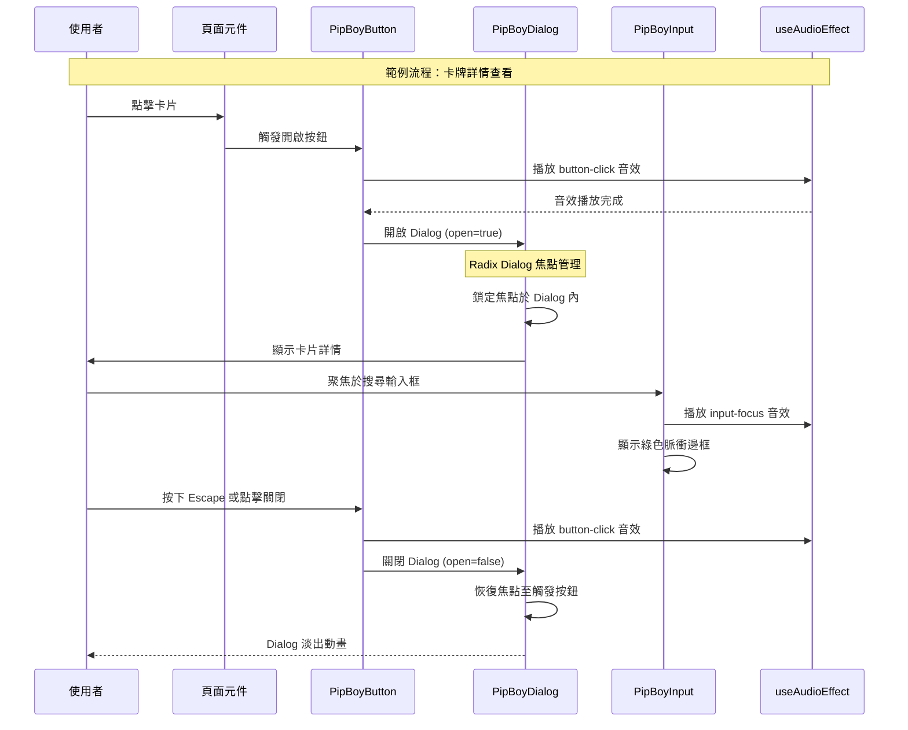
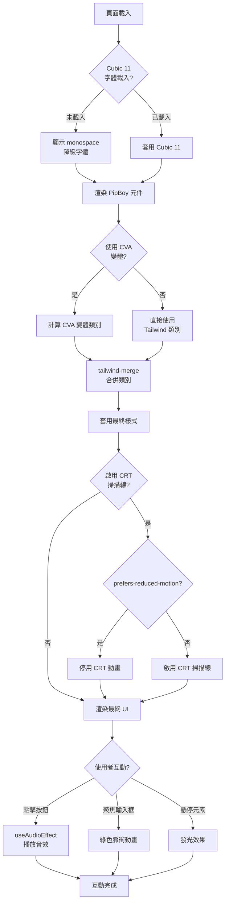
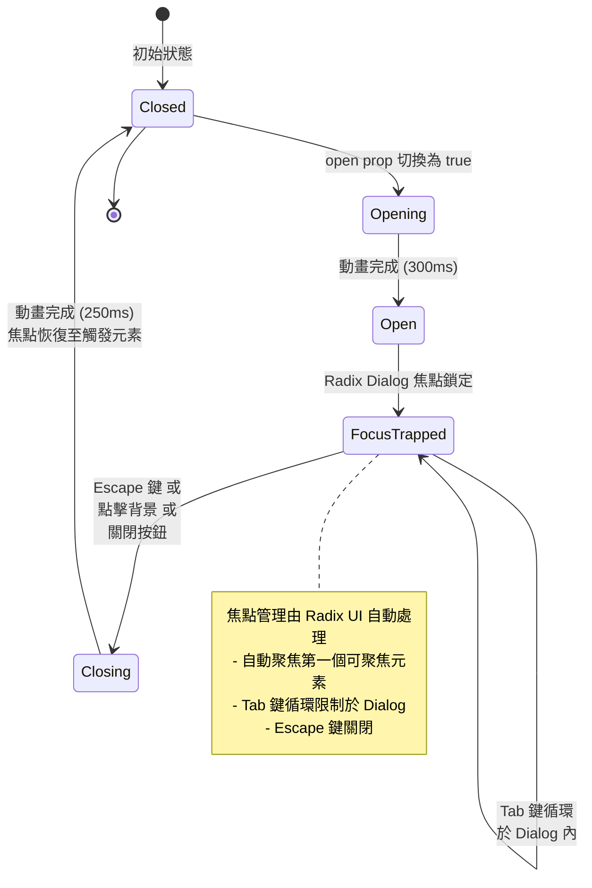
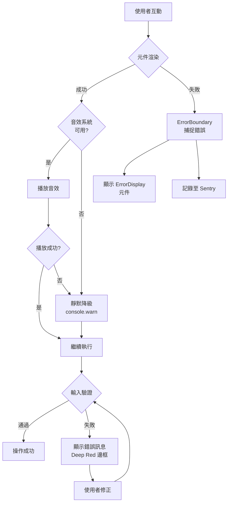
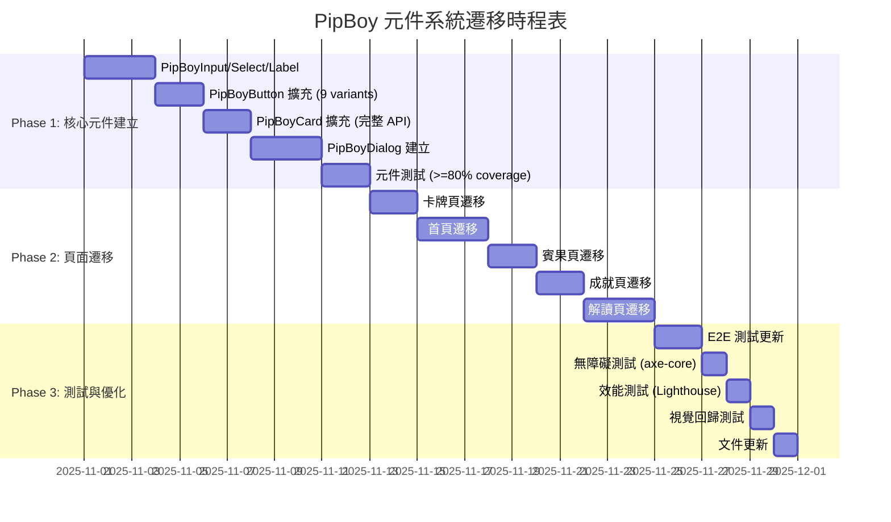
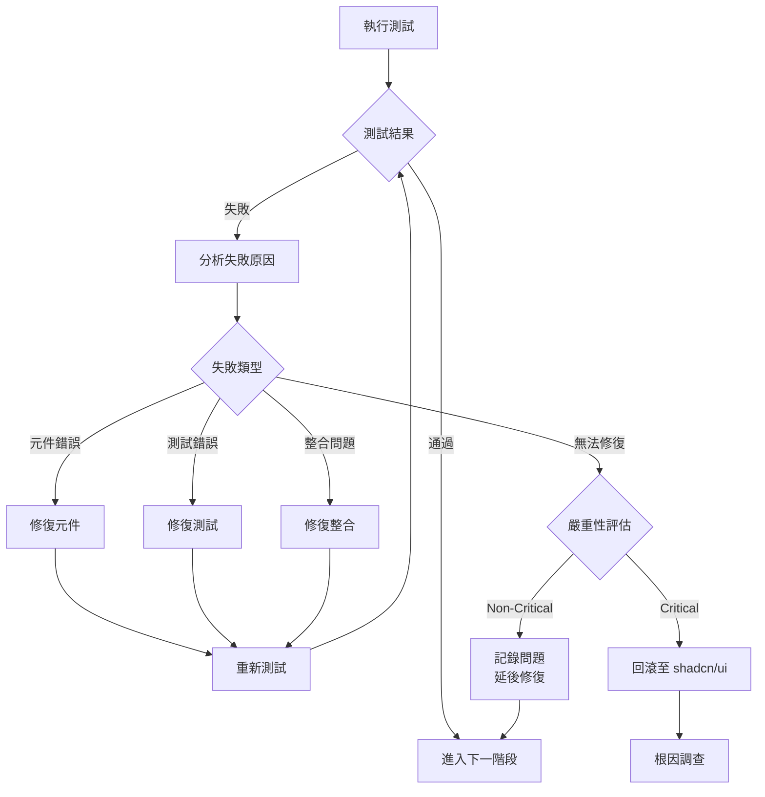

# 技術設計文件：PipBoy UI 元件系統整合

## 概述

本功能透過擴充並統一現有的 PipBoy UI 元件系統 (`src/components/ui/pipboy/`)，將 Wasteland Tarot 平台的所有頁面從 shadcn/ui 元件遷移至完整的 Fallout 風格元件體系。專案現已具備基礎 PipBoy 元件（PipBoyButton、PipBoyCard、LoadingSpinner、ErrorDisplay）以及完整的基礎設施（Cubic 11 字體、Pip-Boy Green 配色、CRT 掃描線效果、PixelIcon 圖示系統、音效系統）。

**目標**：
- 補齊缺少的表單控制元件（Input、Select、Label）與對話框元件（Dialog）
- 擴充現有 PipBoyButton 與 PipBoyCard 元件以對齊 shadcn/ui API
- 將 5 個主要頁面（首頁、卡牌、賓果、成就、解讀）從 shadcn/ui 遷移至 PipBoy 元件系統
- 確保全站視覺風格統一、無障礙支援完整、TypeScript 類型安全

**使用者**：
- 前端開發人員：使用 PipBoy 元件建構功能頁面
- 終端使用者：體驗一致的 Pip-Boy 終端機介面風格
- 輔助技術使用者：透過鍵盤導航與螢幕閱讀器無障礙存取

**影響範圍**：
- 新增 4 個核心元件（PipBoyInput、PipBoySelect、PipBoyLabel、PipBoyDialog）
- 擴充 2 個現有元件（PipBoyButton、PipBoyCard）
- 遷移 5 個頁面的 UI 元件
- 保留 shadcn/ui 作為底層依賴（Radix UI Primitives）

### Goals

- 建立完整的 PipBoy 元件系統，涵蓋所有常用 UI 控制項
- 對齊 shadcn/ui API 設計，降低遷移學習成本
- 確保 WCAG AA 無障礙合規性（色彩對比、鍵盤導航、螢幕閱讀器支援）
- 維持效能標準（60fps CRT 效果、Lighthouse Performance Score ≥ 90）
- 提供完整的 TypeScript 類型定義與開發體驗

### Non-Goals

- 不移除 shadcn/ui 依賴（Radix UI Primitives 仍為底層基礎）
- 不建立完全獨立的元件庫（保持與專案整合）
- 不支援 shadcn/ui 的所有變體（僅實作專案需要的變體）
- 不提供 Storybook（以 README 與範例頁面替代）
- 不支援暗色模式切換（固定 Pip-Boy 綠色主題）

---

## 架構

### 現有架構分析

**目前元件生態系統**：
```
src/components/ui/
├── pipboy/                      # PipBoy 元件（部分實作）
│   ├── PipBoyButton.tsx        # ✅ 已實作（2 variants, 3 sizes）
│   ├── PipBoyCard.tsx          # ✅ 已實作（基礎版）
│   ├── LoadingSpinner.tsx      # ✅ 已實作
│   ├── ErrorDisplay.tsx        # ✅ 已實作
│   └── index.ts                # ✅ 統一匯出
│
├── button.tsx                   # shadcn/ui Button（使用 CVA，9 variants）
├── card.tsx                     # shadcn/ui Card（完整 API）
├── input.tsx                    # shadcn/ui Input（需遷移）
├── label.tsx                    # shadcn/ui Label（需遷移）
├── select.tsx                   # shadcn/ui Select（Radix UI）
├── dialog.tsx                   # shadcn/ui Dialog（Radix UI）
└── ...                          # 其他 shadcn/ui 元件
```

**現有基礎設施**：
- ✅ Cubic 11 字體系統已整合（`@font-face` 於 `globals.css`）
- ✅ Pip-Boy 配色系統已定義（6 semantic colors，CSS 變數）
- ✅ CRT 掃描線動畫已實作（`@keyframes scanline` 於 `globals.css`）
- ✅ PixelIcon 統一圖示系統（RemixIcon 2800+ 圖示）
- ✅ 音效系統已整合（`useAudioEffect` hook，Web Audio API）
- ✅ Tailwind CSS v4 配置完成
- ✅ Radix UI Primitives 已安裝（Dialog, Select, Label）
- ✅ CVA (class-variance-authority) 已安裝並使用於 shadcn/ui Button

**領域邊界**：
- **PipBoy 元件系統**：負責提供 Fallout 風格 UI 元件，遵循 shadcn/ui API 規範
- **shadcn/ui 元件**：作為參考實作與降級選項，保留於 `src/components/ui/`
- **Radix UI Primitives**：提供無障礙的底層原語（Dialog, Select, Label）
- **樣式系統**：Tailwind CSS v4 + 自訂 CSS 動畫（CRT 效果）

**整合點**：
- PipBoy 元件使用 Radix UI Primitives 作為無障礙基礎
- 繼承現有的音效系統（`useAudioEffect`）整合至互動元件
- 遵循現有的 Cubic 11 字體與 Pip-Boy 配色系統
- 保持與現有測試框架相容（Jest, Playwright, axe-core）

**技術債務處理**：
- PipBoyButton 目前僅支援 2 variants，需擴充至 9 variants 以對齊 shadcn/ui
- PipBoyCard 缺少 `CardDescription` 子元件，需補齊
- 無現有的表單控制元件（Input, Select, Label）需完整建立
- 無對話框元件（Dialog）需完整建立

### 高階架構

```mermaid
graph TB
    subgraph "PipBoy 元件層 (新增/擴充)"
        PipBoyButton[PipBoyButton<br/>9 variants]
        PipBoyCard[PipBoyCard<br/>完整 API]
        PipBoyInput[PipBoyInput<br/>新建]
        PipBoySelect[PipBoySelect<br/>新建]
        PipBoyLabel[PipBoyLabel<br/>新建]
        PipBoyDialog[PipBoyDialog<br/>新建]
    end

    subgraph "Radix UI Primitives (底層)"
        RadixDialog[@radix-ui/react-dialog]
        RadixSelect[@radix-ui/react-select]
        RadixLabel[@radix-ui/react-label]
    end

    subgraph "樣式與工具層"
        CVA[class-variance-authority]
        TailwindCSS[Tailwind CSS v4]
        CubicFont[Cubic 11 Font]
        AudioSystem[useAudioEffect Hook]
    end

    subgraph "應用頁面層"
        Homepage[首頁]
        CardsPage[卡牌頁]
        BingoPage[賓果頁]
        AchievementsPage[成就頁]
        ReadingPage[解讀頁]
    end

    PipBoyDialog --> RadixDialog
    PipBoySelect --> RadixSelect
    PipBoyLabel --> RadixLabel

    PipBoyButton --> CVA
    PipBoyButton --> AudioSystem
    PipBoyCard --> TailwindCSS
    PipBoyInput --> TailwindCSS
    PipBoySelect --> CVA
    PipBoyDialog --> CVA

    Homepage --> PipBoyButton
    Homepage --> PipBoyCard
    Homepage --> PipBoyInput

    CardsPage --> PipBoyCard
    CardsPage --> PipBoyDialog

    BingoPage --> PipBoyButton
    BingoPage --> PipBoyDialog

    AchievementsPage --> PipBoyCard
    AchievementsPage --> PipBoyDialog

    ReadingPage --> PipBoyInput
    ReadingPage --> PipBoyCard
    ReadingPage --> PipBoyButton
```

**架構整合說明**：
- **保留的現有模式**：Radix UI Primitives 作為無障礙基礎，CVA 作為變體管理工具，Tailwind CSS v4 作為樣式系統
- **新增元件理由**：
  - PipBoyInput/Select/Label：專案缺少 Fallout 風格的表單控制項
  - PipBoyDialog：需統一的對話框元件以替換 `sheet.tsx` 與 `morphing-dialog.tsx`
  - PipBoyButton/Card 擴充：對齊 shadcn/ui API 以簡化遷移
- **技術對齊**：所有 PipBoy 元件遵循 shadcn/ui 的 API 設計模式（props 命名、變體系統、TypeScript 類型）
- **Steering 合規性**：遵循「Type Safety is Mandatory」原則，使用 CVA 提供強類型變體系統

### 技術棧對齊

**現有技術棧整合**（無新增依賴）：
- **React 19**：使用新的 ref-as-prop 模式（不使用 `forwardRef`）
- **TypeScript 5**：Strict mode，完整類型定義
- **Tailwind CSS v4**：使用 `@theme` 定義 PipBoy 主題變數
- **Radix UI Primitives**：
  - `@radix-ui/react-dialog` (^1.1.15) - PipBoyDialog 底層
  - `@radix-ui/react-select` (^2.2.6) - PipBoySelect 底層
  - `@radix-ui/react-label` (^2.1.7) - PipBoyLabel 底層
- **class-variance-authority** (^0.7.1)：變體管理
- **現有工具**：
  - `tailwind-merge` (^3.3.1)：類別名稱合併
  - `clsx` (^2.1.1)：條件類別
  - `useAudioEffect` hook：音效整合

**新增 Tailwind 主題變數**（於 `globals.css`）：
```css
@theme {
  /* PipBoy Colors */
  --color-pip-boy-green: #00ff88;
  --color-pip-boy-green-bright: #00ff41;
  --color-radiation-orange: #ff8800;
  --color-warning-yellow: #ffdd00;
  --color-deep-red: #ef4444;
  --color-vault-blue: #0055aa;

  /* Component-specific tokens */
  --radius-pip-boy: 0;  /* 終端機風格無圓角 */
  --shadow-pip-boy-glow: 0 0 15px rgba(0, 255, 136, 0.5);
}
```

### 關鍵設計決策

#### 決策 1: 使用 CVA 而非手動條件邏輯管理變體

**決策**：採用 class-variance-authority (CVA) 套件統一管理所有 PipBoy 元件的變體系統

**背景**：現有 PipBoyButton 與 PipBoyCard 使用手動 `cn()` 條件邏輯管理樣式變體，而 shadcn/ui Button 已使用 CVA 提供更好的類型安全與可維護性

**替代方案**：
1. **純手動條件邏輯**（目前 PipBoyButton/Card 方式）
   - 優點：無額外依賴，直觀
   - 缺點：TypeScript 類型推斷差，變體組合複雜度高，維護困難
2. **Vanilla Extract**
   - 優點：零運行時 CSS-in-TS，完美類型安全
   - 缺點：需重寫整個樣式系統，與 Tailwind CSS v4 衝突
3. **CVA**（選擇）
   - 優點：與 Tailwind CSS 完美整合，強類型變體，複合變體支援
   - 缺點：輕量級額外依賴（已安裝）

**選擇方法**：CVA 提供以下核心能力
```typescript
const buttonVariants = cva(
  "base-classes",  // 基礎類別
  {
    variants: {
      variant: { default: "...", destructive: "..." },
      size: { sm: "...", md: "...", lg: "..." }
    },
    compoundVariants: [  // 複合變體
      { variant: "default", size: "lg", class: "..." }
    ],
    defaultVariants: { variant: "default", size: "md" }
  }
)

type ButtonProps = VariantProps<typeof buttonVariants>  // 自動推斷類型
```

**理由**：
- **類型安全**：`VariantProps<typeof buttonVariants>` 自動生成強類型，符合「Type Safety is Mandatory」原則
- **API 對齊**：shadcn/ui 元件已使用 CVA，保持一致性降低認知負擔
- **可維護性**：變體定義集中，複合變體（如 hover 狀態）易於管理
- **開發體驗**：IDE 自動完成變體選項，減少錯誤

**取捨**：
- **獲得**：強類型、可維護性、與 shadcn/ui API 一致性
- **犧牲**：需重構現有 PipBoyButton/Card（~2 小時工作量，可控）

#### 決策 2: 使用 Radix UI Primitives 而非自建無障礙元件

**決策**：PipBoyDialog、PipBoySelect、PipBoyLabel 底層使用 Radix UI Primitives 實作

**背景**：無障礙性要求 WCAG AA 合規，需正確的 ARIA 屬性、焦點管理、鍵盤導航。shadcn/ui 已使用 Radix UI，專案已安裝相關套件。

**替代方案**：
1. **自建原生 HTML + ARIA**
   - 優點：無依賴，完全控制
   - 缺點：需手動實作焦點陷阱、鍵盤事件、ARIA 屬性（數週工作量），易出錯
2. **Headless UI**
   - 優點：Tailwind Labs 官方，與 Tailwind CSS 整合佳
   - 缺點：需額外安裝，API 與 shadcn/ui 不一致
3. **Radix UI Primitives**（選擇）
   - 優點：已安裝，shadcn/ui 使用相同底層，符合 WAI-ARIA 標準
   - 缺點：需學習 Radix Primitives API

**選擇方法**：Radix UI 提供以下保證
- **焦點管理**：自動焦點陷阱（Dialog），焦點恢復（關閉後回到觸發元素）
- **鍵盤導航**：Escape 關閉、Tab 循環、方向鍵選擇（Select）
- **ARIA 屬性**：自動設定 `role`, `aria-labelledby`, `aria-describedby`, `aria-modal`
- **螢幕閱讀器**：正確的語意宣告與狀態通知

**理由**：
- **無障礙保證**：Radix UI 通過嚴格的無障礙測試，符合 WCAG 2.1 Level AA
- **降低風險**：避免自建元件的無障礙缺陷，專案已有 95 個測試與 7 個 Playwright E2E 測試
- **API 一致性**：shadcn/ui Dialog/Select/Label 底層即 Radix UI，保持相同模式
- **維護成本**：Radix UI 持續更新無障礙支援，跟隨最新標準

**取捨**：
- **獲得**：WCAG AA 合規、鍵盤導航、螢幕閱讀器支援、減少測試負擔
- **犧牲**：依賴外部套件（但已存在於專案，無額外成本）

#### 決策 3: 漸進式遷移策略而非大爆炸式重寫

**決策**：採用漸進式遷移，每個頁面獨立遷移，保留 shadcn/ui 元件作為降級選項

**背景**：專案有 5 個主要頁面需遷移，95 個單元測試與 7 個 E2E 測試需保持通過

**替代方案**：
1. **大爆炸式重寫**
   - 優點：一次性完成，無雙軌並行
   - 缺點：高風險，測試失敗難以定位，回滾困難
2. **功能開關 (Feature Flags)**
   - 優點：可動態切換新舊元件
   - 缺點：增加程式碼複雜度，需維護兩套 UI
3. **漸進式遷移**（選擇）
   - 優點：風險可控，每頁獨立測試，易回滾
   - 缺點：需維護雙軌（短期），遷移週期較長

**選擇方法**：
```
Phase 1: 核心元件建立 (Week 1-2)
├── PipBoyInput, PipBoySelect, PipBoyLabel
├── PipBoyButton 擴充 (9 variants)
├── PipBoyCard 擴充 (完整 API)
├── PipBoyDialog
└── 元件測試 (>=80% coverage)

Phase 2: 頁面遷移 - 優先級排序 (Week 3-4)
├── 卡牌頁（優先，已部分使用 PipBoy 元件）
├── 首頁（次優先，流量最高）
├── 賓果頁
├── 成就頁
└── 解讀頁

Phase 3: 測試與優化 (Week 5)
├── E2E 測試更新
├── 無障礙測試（axe-core）
├── 效能測試（Lighthouse）
└── 視覺回歸測試
```

**理由**：
- **風險控制**：每頁遷移後執行測試，失敗只影響單一頁面
- **優先級明確**：卡牌頁已部分遷移，首頁流量最高優先保證
- **可回滾性**：遷移失敗可單頁回滾至 shadcn/ui
- **團隊節奏**：符合 spec-driven development 流程，每個 phase 可獨立驗收

**取捨**：
- **獲得**：低風險、可追蹤進度、易於除錯、測試覆蓋率保證
- **犧牲**：遷移週期較長（5 週 vs 2 週大爆炸），短期需維護雙軌元件

#### 決策 4: React 19 Ref-as-Prop 模式而非 forwardRef

**決策**：所有 PipBoy 元件使用 React 19 的 ref-as-prop 模式，不使用 `forwardRef`

**背景**：React 19 已將 `forwardRef` 標記為 deprecated，推薦直接將 `ref` 作為 props 傳遞

**替代方案**：
1. **使用 forwardRef（舊模式）**
   ```typescript
   const PipBoyInput = forwardRef<HTMLInputElement, Props>((props, ref) => {
     return <input ref={ref} {...props} />
   })
   ```
   - 優點：向後相容 React 18
   - 缺點：React 19 deprecated，額外包裝層
2. **Ref-as-Prop（新模式，選擇）**
   ```typescript
   interface PipBoyInputProps {
     ref?: React.RefObject<HTMLInputElement>
     // 其他 props
   }
   const PipBoyInput = ({ ref, ...props }: PipBoyInputProps) => {
     return <input ref={ref} {...props} />
   }
   ```
   - 優點：React 19 官方推薦，代碼更簡潔
   - 缺點：不相容 React 18（專案已鎖定 React 19）

**選擇方法**：
- 專案 `package.json` 已鎖定 `"react": "^19"`，無需向後相容
- TypeScript 類型定義使用 `React.RefObject<HTMLElement>` 而非 `Ref<HTMLElement>`
- 遵循 React 19 官方最佳實踐

**理由**：
- **未來相容性**：`forwardRef` 將在未來 React 版本移除
- **代碼簡潔性**：減少巢狀包裝，提升可讀性
- **類型推斷**：`RefObject` 類型推斷更準確，減少 TypeScript 錯誤

**取捨**：
- **獲得**：簡潔代碼、未來相容、更好的 TypeScript 支援
- **犧牲**：無（專案已使用 React 19）

#### 決策 5: 完全移除 lucide-react，統一使用 PixelIcon 圖示系統

**決策**：所有 PipBoy 元件與專案頁面統一使用 PixelIcon 圖示系統（基於 RemixIcon），完全移除 lucide-react 依賴

**背景**：專案已完成 pixel-icon-replacement 規格，建立基於 RemixIcon 4.7.0 的 PixelIcon 元件系統（2800+ 圖示），並在 CLAUDE.md 中明確禁止使用 lucide-react。所有圖示需符合 Fallout 像素風格美學。

**替代方案**：
1. **保留 lucide-react 與 PixelIcon 雙軌並行**
   - 優點：無需遷移工作
   - 缺點：圖示風格不一致（lucide-react 為線性風格，與像素風格衝突），增加 bundle size，維護兩套圖示系統
2. **使用其他像素圖示庫（如 pixelarticons）**
   - 優點：原生像素風格
   - 缺點：圖示數量少（僅 486 個），不足以覆蓋專案需求
3. **PixelIcon（RemixIcon，選擇）**
   - 優點：2800+ 圖示豐富度高，Apache License 2.0 商用友善，CSS class name 實作（無 React 依賴），24×24px 基準尺寸符合 PipBoy 設計
   - 缺點：需遷移現有 lucide-react 使用（已完成）

**選擇方法**：
- 所有 PipBoy 元件使用 `<PixelIcon name="xxx" />` API
- 驗證指令：`rg "import.*lucide-react" src --type tsx`（應返回 0 matches）
- 提供 7 種動畫效果（pulse, spin, bounce, ping, fade, wiggle, float）
- 提供 8 種語意化顏色變體（primary, secondary, success, warning, error, info, muted）
- 提供 6 種尺寸預設（xs: 16px, sm: 24px, md: 32px, lg: 48px, xl: 72px, xxl: 96px）

**理由**：
- **視覺一致性**：PixelIcon 透過 CSS 渲染（`ri-{name}-{style}`），可完美搭配 Pip-Boy Green 配色與 CRT 掃描線效果
- **效能優化**：RemixIcon 使用 CSS class name 而非 SVG 元件，減少 React reconciliation 開銷
- **開發體驗**：統一的 `<PixelIcon name="..." />` API，降低認知負擔（vs lucide-react 的 `<IconName />` 命名匯入）
- **無障礙支援**：內建 `aria-label` 與 `decorative` 屬性支援
- **符合專案規範**：CLAUDE.md 明確規定「絕對禁止使用 lucide-react」

**驗證方法**：
```bash
# 驗證 lucide-react 完全移除
rg "import.*lucide-react" src --type tsx
# 預期結果：0 matches

# 驗證 PixelIcon 使用
rg "<PixelIcon" src --type tsx -c
# 預期結果：>= 50 matches（覆蓋所有頁面與元件）
```

**取捨**：
- **獲得**：視覺風格統一、bundle size 減少（~15KB gzipped）、單一圖示系統維護、符合專案規範
- **犧牲**：需遷移現有 lucide-react 使用（已完成於 Phase 4）

---

## 系統流程

### 元件互動流程圖（使用者角度）



### 元件渲染流程（技術角度）



### PipBoyDialog 狀態管理流程



---

## 元件與介面

### 核心元件層 (Core Components)

#### PipBoyButton（擴充現有元件）

**責任與邊界**：
- **主要責任**：提供 Fallout 風格的互動按鈕，支援 9 種變體與音效整合
- **領域邊界**：UI 層互動元件，不處理業務邏輯
- **資料擁有權**：無狀態元件，由父元件控制
- **交易邊界**：不適用（UI 元件）

**依賴關係**：
- **Inbound**：所有需要按鈕的頁面元件（首頁、卡牌頁、賓果頁等）
- **Outbound**：
  - `useAudioEffect` hook（音效播放）
  - `class-variance-authority`（變體管理）
  - `tailwind-merge`（類別合併）
- **External**：無

**契約定義**：

**Service Interface**（TypeScript 介面）：
```typescript
import { cva, type VariantProps } from "class-variance-authority";

/**
 * PipBoyButton 變體定義
 * 使用 CVA 提供強類型變體系統
 */
const pipBoyButtonVariants = cva(
  // 基礎類別（所有按鈕共用）
  [
    "inline-flex items-center justify-center gap-2",
    "font-semibold uppercase tracking-wider",
    "transition-all duration-200",
    "border-2 border-pip-boy-green",
    "focus:outline-none focus-visible:ring-2 focus-visible:ring-pip-boy-green focus-visible:ring-offset-2",
    "disabled:opacity-50 disabled:cursor-not-allowed disabled:pointer-events-none",
  ],
  {
    variants: {
      variant: {
        default: [
          "bg-pip-boy-green text-black",
          "hover:bg-pip-boy-green/80 hover:shadow-[0_0_15px_rgba(0,255,136,0.5)]",
          "active:bg-pip-boy-green/60",
        ],
        destructive: [
          "bg-deep-red text-white border-deep-red",
          "hover:bg-deep-red/80 hover:shadow-[0_0_15px_rgba(239,68,68,0.5)]",
          "active:bg-deep-red/60",
        ],
        outline: [
          "bg-transparent text-pip-boy-green-bright",
          "hover:bg-pip-boy-green/20 hover:shadow-[0_0_10px_rgba(0,255,136,0.3)]",
          "active:bg-pip-boy-green/10",
        ],
        secondary: [
          "bg-black/60 text-pip-boy-green border-pip-boy-green/60",
          "hover:bg-black/80 hover:border-pip-boy-green",
          "active:bg-black/40",
        ],
        ghost: [
          "bg-transparent text-pip-boy-green border-transparent",
          "hover:bg-pip-boy-green/10 hover:text-pip-boy-green-bright",
          "active:bg-pip-boy-green/5",
        ],
        link: [
          "bg-transparent text-pip-boy-green border-transparent",
          "underline-offset-4 hover:underline",
          "hover:text-pip-boy-green-bright",
        ],
        success: [
          "bg-pip-boy-green-bright text-black border-pip-boy-green-bright",
          "hover:bg-pip-boy-green-bright/80 hover:shadow-[0_0_15px_rgba(0,255,65,0.5)]",
          "active:bg-pip-boy-green-bright/60",
        ],
        warning: [
          "bg-warning-yellow text-black border-warning-yellow",
          "hover:bg-warning-yellow/80 hover:shadow-[0_0_15px_rgba(255,221,0,0.5)]",
          "active:bg-warning-yellow/60",
        ],
        info: [
          "bg-vault-blue text-white border-vault-blue",
          "hover:bg-vault-blue/80 hover:shadow-[0_0_15px_rgba(0,85,170,0.5)]",
          "active:bg-vault-blue/60",
        ],
      },
      size: {
        default: "h-9 px-4 py-2",
        sm: "h-8 px-3 py-1.5 text-xs",
        lg: "h-10 px-6 py-3 text-base",
        icon: "h-9 w-9 p-0",  // 正方形圖示按鈕
      },
    },
    compoundVariants: [
      // disabled 狀態下覆蓋 hover 效果
      {
        variant: ["default", "destructive", "outline", "secondary", "ghost", "link", "success", "warning", "info"],
        class: "disabled:hover:bg-transparent disabled:hover:shadow-none",
      },
    ],
    defaultVariants: {
      variant: "default",
      size: "default",
    },
  }
);

/**
 * PipBoyButton Props 介面
 * 繼承原生 button 屬性與 CVA 變體
 */
interface PipBoyButtonProps
  extends React.ButtonHTMLAttributes<HTMLButtonElement>,
    VariantProps<typeof pipBoyButtonVariants> {
  /**
   * Ref 支援（React 19 ref-as-prop 模式）
   */
  ref?: React.RefObject<HTMLButtonElement>;

  /**
   * 是否禁用音效（預設 false）
   * 用於避免密集互動時音效重疊
   */
  disableSound?: boolean;

  /**
   * 是否全寬按鈕
   */
  fullWidth?: boolean;
}

/**
 * PipBoyButton 元件
 *
 * @example
 * ```tsx
 * // 基礎用法
 * <PipBoyButton variant="default" size="md" onClick={handleClick}>
 *   確認
 * </PipBoyButton>
 *
 * // 圖示按鈕
 * <PipBoyButton variant="outline" size="icon" aria-label="關閉">
 *   <PixelIcon name="close" />
 * </PipBoyButton>
 *
 * // 禁用音效
 * <PipBoyButton variant="destructive" disableSound>
 *   刪除
 * </PipBoyButton>
 * ```
 */
export function PipBoyButton({
  variant,
  size,
  fullWidth = false,
  disableSound = false,
  className,
  onClick,
  children,
  ref,
  ...props
}: PipBoyButtonProps): JSX.Element;
```

**前置條件**：
- `useAudioEffect` hook 必須可用（音效系統已初始化）
- Cubic 11 字體已載入（或降級至 monospace）
- Tailwind CSS 主題變數已定義

**後置條件**：
- 點擊時播放 `button-click` 音效（除非 `disableSound={true}`）
- 觸發 `onClick` 事件處理器
- disabled 狀態下不觸發任何事件

**不變量**：
- 所有變體保持一致的 Pip-Boy 綠色主題
- 鍵盤可聚焦（`tabIndex={0}`）
- 提供視覺聚焦指示器（`focus-visible:ring`）

---

#### PipBoyInput（新建元件）

**責任與邊界**：
- **主要責任**：提供 Fallout 風格的文字輸入控制項，支援錯誤狀態與音效回饋
- **領域邊界**：表單控制層，不處理驗證邏輯（由父元件或 react-hook-form 處理）
- **資料擁有權**：受控或非受控輸入，狀態由父元件管理
- **交易邊界**：不適用（UI 元件）

**依賴關係**：
- **Inbound**：表單頁面元件（首頁問題輸入、解讀頁、註冊頁）
- **Outbound**：
  - `useAudioEffect` hook（輸入音效）
  - `tailwind-merge`（類別合併）
- **External**：無

**契約定義**：

**Service Interface**（TypeScript 介面）：
```typescript
/**
 * PipBoyInput Props 介面
 * 對齊 shadcn/ui Input API 設計
 */
interface PipBoyInputProps extends React.InputHTMLAttributes<HTMLInputElement> {
  /**
   * Ref 支援（React 19 ref-as-prop 模式）
   */
  ref?: React.RefObject<HTMLInputElement>;

  /**
   * 錯誤狀態（顯示紅色邊框）
   */
  error?: boolean;

  /**
   * 是否禁用聚焦音效
   */
  disableSound?: boolean;

  /**
   * 左側圖示（可選）
   */
  leftIcon?: React.ReactNode;

  /**
   * 右側圖示（可選）
   */
  rightIcon?: React.ReactNode;
}

/**
 * PipBoyInput 元件
 *
 * @example
 * ```tsx
 * // 基礎用法
 * <PipBoyInput
 *   placeholder="輸入您的問題..."
 *   value={question}
 *   onChange={(e) => setQuestion(e.target.value)}
 * />
 *
 * // 錯誤狀態
 * <PipBoyInput
 *   error={!!errors.email}
 *   placeholder="Email"
 *   {...register('email')}
 * />
 *
 * // 帶圖示
 * <PipBoyInput
 *   leftIcon={<PixelIcon name="search" />}
 *   placeholder="搜尋卡片..."
 * />
 * ```
 */
export function PipBoyInput({
  error = false,
  disableSound = false,
  leftIcon,
  rightIcon,
  className,
  onFocus,
  ref,
  ...props
}: PipBoyInputProps): JSX.Element;
```

**前置條件**：
- Cubic 11 字體已載入
- Tailwind CSS 主題變數已定義

**後置條件**：
- 聚焦時播放 `input-focus` 音效（除非 `disableSound={true}`）
- 聚焦時顯示綠色脈衝邊框動畫
- 錯誤狀態時顯示 Deep Red 邊框

**不變量**：
- 字體大小 >= 16px（避免手機裝置自動縮放）
- 鍵盤可聚焦
- 支援所有原生 input 屬性（type, placeholder, disabled 等）

**樣式實作**：
```css
/* 基礎樣式 */
.pipboy-input-base {
  @apply w-full px-4 py-2;
  @apply bg-black/80 border-2 border-pip-boy-green;
  @apply text-pip-boy-green text-base;
  @apply transition-all duration-200;
  @apply focus:outline-none focus:border-pip-boy-green-bright;
  @apply focus:shadow-[0_0_10px_rgba(0,255,136,0.3)];
  @apply disabled:opacity-40 disabled:cursor-not-allowed;
}

/* 錯誤狀態 */
.pipboy-input-error {
  @apply border-deep-red;
  @apply focus:border-deep-red focus:shadow-[0_0_10px_rgba(239,68,68,0.3)];
}

/* 聚焦脈衝動畫 */
@keyframes input-pulse {
  0%, 100% {
    box-shadow: 0 0 10px rgba(0, 255, 136, 0.3);
  }
  50% {
    box-shadow: 0 0 20px rgba(0, 255, 136, 0.6);
  }
}

.pipboy-input-focus {
  animation: input-pulse 2s ease-in-out infinite;
}
```

---

#### PipBoySelect（新建元件）

**責任與邊界**：
- **主要責任**：提供 Fallout 風格的下拉選單控制項，基於 Radix UI Select Primitive
- **領域邊界**：表單控制層，不處理業務邏輯
- **資料擁有權**：受控元件，選擇值由父元件管理
- **交易邊界**：不適用（UI 元件）

**依賴關係**：
- **Inbound**：需要選擇器的頁面（首頁牌陣選擇、卡牌頁花色篩選、成就頁分類）
- **Outbound**：
  - `@radix-ui/react-select`（底層無障礙元件）
  - `class-variance-authority`（變體管理）
  - `useAudioEffect` hook（音效）
- **External**：Radix UI Select

**外部依賴調查**：
- **Radix UI Select**：
  - 版本：`@radix-ui/react-select@^2.2.6`（專案已安裝）
  - API 文件：https://www.radix-ui.com/primitives/docs/components/select
  - 核心功能：
    - 無障礙支援（ARIA 屬性、鍵盤導航）
    - 受控與非受控模式
    - 自訂觸發器與內容渲染
    - 分組選項支援
  - 鍵盤導航：
    - `Enter/Space`：開啟/選擇選項
    - `↑/↓`：上下移動焦點
    - `Home/End`：跳至第一個/最後一個選項
    - `Escape`：關閉選單
  - 已知限制：需手動處理 mobile 原生 picker（< 640px）

**契約定義**：

**Service Interface**（TypeScript 介面）：
```typescript
import * as SelectPrimitive from "@radix-ui/react-select";

/**
 * PipBoySelect Props 介面
 * 基於 Radix UI Select Root
 */
interface PipBoySelectProps {
  /**
   * 選擇值（受控）
   */
  value?: string;

  /**
   * 值變更回調
   */
  onValueChange?: (value: string) => void;

  /**
   * 預設值（非受控）
   */
  defaultValue?: string;

  /**
   * 是否禁用
   */
  disabled?: boolean;

  /**
   * placeholder 文字
   */
  placeholder?: string;

  /**
   * 選項列表
   */
  children: React.ReactNode;
}

/**
 * PipBoySelectItem Props
 * 單一選項元件
 */
interface PipBoySelectItemProps {
  value: string;
  children: React.ReactNode;
  disabled?: boolean;
}

/**
 * PipBoySelect 元件（主元件）
 *
 * @example
 * ```tsx
 * <PipBoySelect value={spread} onValueChange={setSpread} placeholder="選擇牌陣">
 *   <PipBoySelectItem value="single">單卡解讀</PipBoySelectItem>
 *   <PipBoySelectItem value="vault-tec">Vault-Tec 牌陣</PipBoySelectItem>
 *   <PipBoySelectItem value="wasteland">廢土生存牌陣</PipBoySelectItem>
 * </PipBoySelect>
 * ```
 */
export function PipBoySelect(props: PipBoySelectProps): JSX.Element;

/**
 * PipBoySelectItem 元件（選項）
 */
export function PipBoySelectItem(props: PipBoySelectItemProps): JSX.Element;
```

**前置條件**：
- Radix UI Select Primitive 已安裝
- 至少包含一個 `PipBoySelectItem` 子元件

**後置條件**：
- 開啟選單時播放 `menu-open` 音效
- 選擇選項時播放 `menu-select` 音效
- `onValueChange` 回調被觸發

**不變量**：
- 鍵盤導航完全可用（方向鍵、Enter、Escape）
- 螢幕閱讀器可正確朗讀選項
- 選單內容限制於視窗邊界內（Radix Popper）

**整合策略**：
```typescript
// 響應式處理：桌面使用自訂 UI，手機使用原生 select
const isMobile = useMediaQuery('(max-width: 640px)');

if (isMobile) {
  return (
    <select className="pipboy-native-select" {...props}>
      {/* 原生 <option> 元素 */}
    </select>
  );
}

return (
  <SelectPrimitive.Root {...props}>
    <SelectPrimitive.Trigger className="pipboy-select-trigger">
      {/* 自訂觸發器 UI */}
    </SelectPrimitive.Trigger>
    <SelectPrimitive.Content className="pipboy-select-content">
      {/* 自訂選單 UI */}
    </SelectPrimitive.Content>
  </SelectPrimitive.Root>
);
```

---

#### PipBoyDialog（新建元件）

**責任與邊界**：
- **主要責任**：提供 Vault-Tec 品牌風格的模態對話框，基於 Radix UI Dialog Primitive
- **領域邊界**：覆蓋層 UI 元件，處理焦點管理與動畫
- **資料擁有權**：開啟/關閉狀態由父元件控制
- **交易邊界**：不適用（UI 元件）

**依賴關係**：
- **Inbound**：所有需要對話框的頁面（卡牌詳情、賓果設定、成就詳情、解讀歷史）
- **Outbound**：
  - `@radix-ui/react-dialog`（底層無障礙元件）
  - `class-variance-authority`（變體管理）
  - `useAudioEffect` hook（音效）
- **External**：Radix UI Dialog

**外部依賴調查**：
- **Radix UI Dialog**：
  - 版本：`@radix-ui/react-dialog@^1.1.15`（專案已安裝）
  - API 文件：https://www.radix-ui.com/primitives/docs/components/dialog
  - 核心功能：
    - 焦點陷阱（Focus Trap）：自動鎖定焦點於對話框內
    - 焦點恢復（Focus Restoration）：關閉後自動恢復至觸發元素
    - ARIA 屬性：自動設定 `role="dialog"`, `aria-modal="true"`, `aria-labelledby`, `aria-describedby`
    - 鍵盤支援：Escape 關閉、Tab 循環
    - Portal 渲染：避免 z-index 衝突
  - 無障礙最佳實踐：
    - 必須提供 `DialogTitle`（可使用 `VisuallyHidden` 隱藏）
    - `DialogDescription` 可選，若不需要則傳 `aria-describedby={undefined}`
    - 使用 `DialogTrigger` 確保焦點可恢復
  - 已知限制：需手動處理手機全螢幕模式（< 768px）

**契約定義**：

**Service Interface**（TypeScript 介面）：
```typescript
import * as DialogPrimitive from "@radix-ui/react-dialog";

/**
 * PipBoyDialog Props 介面
 * 基於 Radix UI Dialog Root
 */
interface PipBoyDialogProps {
  /**
   * 是否開啟對話框（受控）
   */
  open?: boolean;

  /**
   * 開啟狀態變更回調
   */
  onOpenChange?: (open: boolean) => void;

  /**
   * 子元件（Trigger, Content）
   */
  children: React.ReactNode;
}

/**
 * PipBoyDialogContent Props
 * 對話框內容容器
 */
interface PipBoyDialogContentProps {
  /**
   * 子元件（Header, Title, Description, Footer）
   */
  children: React.ReactNode;

  /**
   * 是否允許點擊背景關閉（預設 true）
   */
  closeOnBackdropClick?: boolean;

  /**
   * 是否允許 Escape 關閉（預設 true）
   */
  closeOnEscape?: boolean;

  /**
   * 額外 CSS 類別
   */
  className?: string;
}

/**
 * PipBoyDialog 元件（主元件）
 *
 * @example
 * ```tsx
 * <PipBoyDialog open={isOpen} onOpenChange={setIsOpen}>
 *   <PipBoyDialogTrigger asChild>
 *     <PipBoyButton>開啟對話框</PipBoyButton>
 *   </PipBoyDialogTrigger>
 *
 *   <PipBoyDialogContent>
 *     <PipBoyDialogHeader>
 *       <PipBoyDialogTitle>卡牌詳情</PipBoyDialogTitle>
 *       <PipBoyDialogDescription>
 *         查看塔羅牌的完整資訊
 *       </PipBoyDialogDescription>
 *     </PipBoyDialogHeader>
 *
 *     <div className="dialog-body">
 *       {/* 對話框內容 */}
 *     </div>
 *
 *     <PipBoyDialogFooter>
 *       <PipBoyButton variant="outline" onClick={() => setIsOpen(false)}>
 *         關閉
 *       </PipBoyButton>
 *     </PipBoyDialogFooter>
 *   </PipBoyDialogContent>
 * </PipBoyDialog>
 * ```
 */
export function PipBoyDialog(props: PipBoyDialogProps): JSX.Element;

/**
 * PipBoyDialogTrigger - 觸發按鈕
 */
export const PipBoyDialogTrigger = DialogPrimitive.Trigger;

/**
 * PipBoyDialogContent - 對話框內容容器
 */
export function PipBoyDialogContent(props: PipBoyDialogContentProps): JSX.Element;

/**
 * PipBoyDialogHeader - 標題列容器
 */
export function PipBoyDialogHeader(props: React.HTMLAttributes<HTMLDivElement>): JSX.Element;

/**
 * PipBoyDialogTitle - 標題文字
 */
export function PipBoyDialogTitle(props: React.HTMLAttributes<HTMLHeadingElement>): JSX.Element;

/**
 * PipBoyDialogDescription - 描述文字
 */
export function PipBoyDialogDescription(props: React.HTMLAttributes<HTMLParagraphElement>): JSX.Element;

/**
 * PipBoyDialogFooter - 頁腳容器
 */
export function PipBoyDialogFooter(props: React.HTMLAttributes<HTMLDivElement>): JSX.Element;

/**
 * PipBoyDialogClose - 關閉按鈕
 */
export const PipBoyDialogClose = DialogPrimitive.Close;
```

**前置條件**：
- Radix UI Dialog Primitive 已安裝
- 必須包含至少一個 `DialogTitle`（即使視覺上隱藏）

**後置條件**：
- 開啟時播放 `dialog-open` 音效
- 關閉時播放 `dialog-close` 音效
- 焦點鎖定於對話框內（Radix 自動處理）
- 關閉後焦點恢復至觸發元素（Radix 自動處理）

**不變量**：
- `role="dialog"` 與 `aria-modal="true"` 自動設定
- Escape 鍵可關閉（除非 `closeOnEscape={false}`）
- Tab 鍵循環限制於對話框內
- 背景遮罩點擊可關閉（除非 `closeOnBackdropClick={false}`）

**狀態管理**：
```typescript
// PipBoyDialogContent 內部實作
function PipBoyDialogContent({
  closeOnBackdropClick = true,
  closeOnEscape = true,
  children,
  ...props
}: PipBoyDialogContentProps) {
  const { playSound } = useAudioEffect();

  // 開啟動畫結束後播放音效
  React.useEffect(() => {
    playSound('dialog-open');
  }, []);

  return (
    <DialogPrimitive.Portal>
      <DialogPrimitive.Overlay className="pipboy-dialog-overlay" />
      <DialogPrimitive.Content
        className="pipboy-dialog-content"
        onEscapeKeyDown={(e) => {
          if (!closeOnEscape) e.preventDefault();
          else playSound('dialog-close');
        }}
        onPointerDownOutside={(e) => {
          if (!closeOnBackdropClick) e.preventDefault();
          else playSound('dialog-close');
        }}
        {...props}
      >
        {children}
      </DialogPrimitive.Content>
    </DialogPrimitive.Portal>
  );
}
```

**整合策略（響應式處理）**：
```css
/* 桌面版：固定寬度居中 */
.pipboy-dialog-content {
  @apply fixed left-1/2 top-1/2 -translate-x-1/2 -translate-y-1/2;
  @apply w-full max-w-lg max-h-[85vh] overflow-y-auto;
  @apply bg-black/95 border-2 border-pip-boy-green;
  @apply p-6;
}

/* 平板版：90% 視窗寬度 */
@media (min-width: 768px) and (max-width: 1023px) {
  .pipboy-dialog-content {
    @apply max-w-[90vw];
  }
}

/* 手機版：全螢幕 */
@media (max-width: 767px) {
  .pipboy-dialog-content {
    @apply inset-0 translate-x-0 translate-y-0;
    @apply max-w-full max-h-full rounded-none;
  }
}
```

---

#### PipBoyLabel（新建元件）

**責任與邊界**：
- **主要責任**：提供 Fallout 風格的表單標籤，基於 Radix UI Label Primitive
- **領域邊界**：表單輔助元件，處理標籤與輸入框關聯
- **資料擁有權**：無狀態元件
- **交易邊界**：不適用（UI 元件）

**依賴關係**：
- **Inbound**：所有使用表單的頁面元件
- **Outbound**：
  - `@radix-ui/react-label`（底層無障礙元件）
- **External**：Radix UI Label

**契約定義**：

**Service Interface**（TypeScript 介面）：
```typescript
import * as LabelPrimitive from "@radix-ui/react-label";

/**
 * PipBoyLabel Props 介面
 * 對齊 shadcn/ui Label API
 */
interface PipBoyLabelProps extends React.LabelHTMLAttributes<HTMLLabelElement> {
  /**
   * 是否為必填欄位（顯示紅色星號）
   */
  required?: boolean;
}

/**
 * PipBoyLabel 元件
 *
 * @example
 * ```tsx
 * <PipBoyLabel htmlFor="email" required>
 *   Email 地址
 * </PipBoyLabel>
 * <PipBoyInput id="email" type="email" />
 * ```
 */
export function PipBoyLabel({
  required = false,
  children,
  ...props
}: PipBoyLabelProps): JSX.Element;
```

**前置條件**：
- Radix UI Label Primitive 已安裝

**後置條件**：
- 點擊標籤時自動聚焦關聯的輸入框（Radix 自動處理）
- 螢幕閱讀器正確朗讀標籤文字

**不變量**：
- `htmlFor` 屬性必須對應至輸入框的 `id`
- 使用 Cubic 11 字體與 Pip-Boy 綠色

**樣式實作**：
```css
.pipboy-label {
  @apply text-sm font-medium text-pip-boy-green;
  @apply cursor-pointer;
}

.pipboy-label-required::after {
  content: ' *';
  @apply text-deep-red;
}
```

---

#### PipBoyCard（擴充現有元件）

**責任與邊界**：
- **主要責任**：提供 Fallout 風格的卡片容器，完全對齊 shadcn/ui Card API
- **領域邊界**：容器元件，不處理業務邏輯
- **資料擁有權**：無狀態元件
- **交易邊界**：不適用（UI 元件）

**擴充內容**：
- 新增 `CardDescription` 子元件（目前缺少）
- 新增 `isLoading` prop 支援載入狀態
- 新增 `isClickable` prop 支援互動效果

**契約定義**：

**Service Interface**（TypeScript 介面）：
```typescript
/**
 * PipBoyCard Props（擴充版）
 */
interface PipBoyCardProps extends React.HTMLAttributes<HTMLDivElement> {
  glowEffect?: boolean;
  interactive?: boolean;  // 重命名為 isClickable
  isClickable?: boolean;  // 新增 alias
  padding?: 'none' | 'sm' | 'md' | 'lg';
  fullWidth?: boolean;
  isLoading?: boolean;  // 新增：載入狀態
}

/**
 * PipBoyCardDescription Props（新增）
 */
interface PipBoyCardDescriptionProps extends React.HTMLAttributes<HTMLParagraphElement> {}

/**
 * PipBoyCardDescription 元件（新增）
 *
 * @example
 * ```tsx
 * <PipBoyCard>
 *   <PipBoyCardHeader>
 *     <PipBoyCardTitle>卡牌名稱</PipBoyCardTitle>
 *     <PipBoyCardDescription>塔羅牌的詳細說明</PipBoyCardDescription>
 *   </PipBoyCardHeader>
 *   <PipBoyCardContent>內容</PipBoyCardContent>
 * </PipBoyCard>
 * ```
 */
export function PipBoyCardDescription(props: PipBoyCardDescriptionProps): JSX.Element;
```

**擴充樣式**：
```css
/* CardDescription 樣式 */
.pipboy-card-description {
  @apply text-sm text-pip-boy-green/70;
  @apply mt-1.5;
}

/* 載入狀態動畫 */
@keyframes card-pulse {
  0%, 100% {
    box-shadow: 0 0 20px rgba(0, 255, 136, 0.3);
  }
  50% {
    box-shadow: 0 0 40px rgba(0, 255, 136, 0.6);
  }
}

.pipboy-card-loading {
  animation: card-pulse 1.5s ease-in-out infinite;
}
```

---

### 測試策略

#### 單元測試（Jest + @testing-library/react）

**測試覆蓋率目標**：≥ 80%

**PipBoyButton 測試案例**：
```typescript
describe('PipBoyButton', () => {
  it('應該渲染所有 9 種變體', () => {
    const variants = ['default', 'destructive', 'outline', 'secondary', 'ghost', 'link', 'success', 'warning', 'info'];
    variants.forEach(variant => {
      const { container } = render(<PipBoyButton variant={variant as any}>Test</PipBoyButton>);
      expect(container.firstChild).toBeInTheDocument();
    });
  });

  it('應該在點擊時播放音效', () => {
    const mockPlaySound = jest.fn();
    jest.spyOn(require('@/hooks/audio/useAudioEffect'), 'useAudioEffect').mockReturnValue({
      playSound: mockPlaySound,
    });

    const { getByRole } = render(<PipBoyButton>Click me</PipBoyButton>);
    fireEvent.click(getByRole('button'));

    expect(mockPlaySound).toHaveBeenCalledWith('button-click');
  });

  it('應該在 disabled 狀態下不播放音效', () => {
    const mockPlaySound = jest.fn();
    const { getByRole } = render(<PipBoyButton disabled>Disabled</PipBoyButton>);
    fireEvent.click(getByRole('button'));

    expect(mockPlaySound).not.toHaveBeenCalled();
  });

  it('應該支援 ref 傳遞（React 19 ref-as-prop）', () => {
    const ref = React.createRef<HTMLButtonElement>();
    render(<PipBoyButton ref={ref}>Ref test</PipBoyButton>);

    expect(ref.current).toBeInstanceOf(HTMLButtonElement);
  });
});
```

**PipBoyInput 測試案例**：
```typescript
describe('PipBoyInput', () => {
  it('應該在聚焦時顯示綠色脈衝邊框', () => {
    const { getByPlaceholderText } = render(<PipBoyInput placeholder="Test" />);
    const input = getByPlaceholderText('Test');

    fireEvent.focus(input);
    expect(input).toHaveClass('pipboy-input-focus');
  });

  it('應該在錯誤狀態下顯示紅色邊框', () => {
    const { getByRole } = render(<PipBoyInput error />);
    expect(getByRole('textbox')).toHaveClass('pipboy-input-error');
  });

  it('應該支援左右圖示', () => {
    const { getByTestId } = render(
      <PipBoyInput
        leftIcon={<span data-testid="left-icon">L</span>}
        rightIcon={<span data-testid="right-icon">R</span>}
      />
    );

    expect(getByTestId('left-icon')).toBeInTheDocument();
    expect(getByTestId('right-icon')).toBeInTheDocument();
  });
});
```

**PipBoyDialog 測試案例**：
```typescript
describe('PipBoyDialog', () => {
  it('應該正確處理開啟/關閉狀態', () => {
    const { getByRole, queryByRole } = render(
      <PipBoyDialog open={false} onOpenChange={jest.fn()}>
        <PipBoyDialogContent>
          <PipBoyDialogTitle>Test Dialog</PipBoyDialogTitle>
        </PipBoyDialogContent>
      </PipBoyDialog>
    );

    expect(queryByRole('dialog')).not.toBeInTheDocument();

    rerender(
      <PipBoyDialog open={true} onOpenChange={jest.fn()}>
        <PipBoyDialogContent>
          <PipBoyDialogTitle>Test Dialog</PipBoyDialogTitle>
        </PipBoyDialogContent>
      </PipBoyDialog>
    );

    expect(getByRole('dialog')).toBeInTheDocument();
  });

  it('應該在 Escape 鍵按下時關閉', () => {
    const onOpenChange = jest.fn();
    const { getByRole } = render(
      <PipBoyDialog open={true} onOpenChange={onOpenChange}>
        <PipBoyDialogContent>
          <PipBoyDialogTitle>Test</PipBoyDialogTitle>
        </PipBoyDialogContent>
      </PipBoyDialog>
    );

    fireEvent.keyDown(getByRole('dialog'), { key: 'Escape' });
    expect(onOpenChange).toHaveBeenCalledWith(false);
  });

  it('應該鎖定焦點於 Dialog 內', () => {
    const { getByRole } = render(
      <PipBoyDialog open={true}>
        <PipBoyDialogContent>
          <PipBoyDialogTitle>Test</PipBoyDialogTitle>
          <button>Button 1</button>
          <button>Button 2</button>
        </PipBoyDialogContent>
      </PipBoyDialog>
    );

    const dialog = getByRole('dialog');
    const buttons = within(dialog).getAllByRole('button');

    // 焦點應該限制於 Dialog 內的按鈕
    userEvent.tab();
    expect(buttons[0]).toHaveFocus();

    userEvent.tab();
    expect(buttons[1]).toHaveFocus();

    userEvent.tab();  // 循環回到第一個按鈕
    expect(buttons[0]).toHaveFocus();
  });
});
```

#### 整合測試

**頁面整合測試案例（首頁範例）**：
```typescript
describe('Homepage Integration', () => {
  it('應該正確渲染所有 PipBoy 元件', () => {
    const { getByRole, getByPlaceholderText } = render(<Homepage />);

    // 驗證 PipBoyButton
    expect(getByRole('button', { name: '開始解讀' })).toBeInTheDocument();

    // 驗證 PipBoyInput
    expect(getByPlaceholderText('輸入您的問題...')).toBeInTheDocument();

    // 驗證 PipBoySelect
    expect(getByRole('combobox', { name: '選擇牌陣' })).toBeInTheDocument();
  });

  it('應該正確處理表單提交流程', async () => {
    const { getByPlaceholderText, getByRole } = render(<Homepage />);

    // 輸入問題
    const input = getByPlaceholderText('輸入您的問題...');
    await userEvent.type(input, '我該如何在廢土中生存？');

    // 選擇牌陣
    const select = getByRole('combobox');
    await userEvent.click(select);
    await userEvent.click(getByRole('option', { name: 'Vault-Tec 牌陣' }));

    // 提交表單
    const submitButton = getByRole('button', { name: '開始解讀' });
    await userEvent.click(submitButton);

    // 驗證導航至解讀頁
    expect(router.push).toHaveBeenCalledWith('/readings/new');
  });
});
```

#### E2E 測試（Playwright）

**E2E 測試案例範例**：
```typescript
// tests/e2e/pipboy-components.spec.ts
test.describe('PipBoy Components E2E', () => {
  test('應該在卡牌頁正確顯示 Dialog', async ({ page }) => {
    await page.goto('/cards');

    // 點擊第一張卡片
    await page.locator('.pipboy-card').first().click();

    // 驗證 Dialog 開啟
    const dialog = page.locator('[role="dialog"]');
    await expect(dialog).toBeVisible();

    // 驗證標題
    await expect(dialog.locator('h2')).toContainText('卡牌詳情');

    // 按 Escape 關閉
    await page.keyboard.press('Escape');
    await expect(dialog).not.toBeVisible();
  });

  test('應該支援鍵盤導航', async ({ page }) => {
    await page.goto('/');

    // Tab 導航至輸入框
    await page.keyboard.press('Tab');
    await expect(page.locator('input[placeholder*="問題"]')).toBeFocused();

    // Tab 導航至選擇器
    await page.keyboard.press('Tab');
    await expect(page.locator('[role="combobox"]')).toBeFocused();

    // Tab 導航至按鈕
    await page.keyboard.press('Tab');
    await expect(page.getByRole('button', { name: '開始解讀' })).toBeFocused();
  });
});
```

#### 無障礙測試（axe-core）

```typescript
// tests/accessibility/pipboy-components.spec.ts
test.describe('PipBoy Components Accessibility', () => {
  test('所有元件應該通過 WCAG AA 驗證', async ({ page }) => {
    const results = await new AxeBuilder({ page })
      .withTags(['wcag2a', 'wcag2aa', 'wcag21aa'])
      .analyze();

    expect(results.violations).toEqual([]);
  });

  test('色彩對比度應該符合 4.5:1 標準', async ({ page }) => {
    await page.goto('/');

    const results = await new AxeBuilder({ page })
      .withRules(['color-contrast'])
      .analyze();

    expect(results.violations).toEqual([]);
  });

  test('Dialog 應該有正確的 ARIA 屬性', async ({ page }) => {
    await page.goto('/cards');
    await page.locator('.pipboy-card').first().click();

    const dialog = page.locator('[role="dialog"]');

    // 驗證 ARIA 屬性
    await expect(dialog).toHaveAttribute('aria-modal', 'true');
    await expect(dialog).toHaveAttribute('aria-labelledby');

    // 驗證標題存在
    const titleId = await dialog.getAttribute('aria-labelledby');
    const title = page.locator(`#${titleId}`);
    await expect(title).toBeVisible();
  });
});
```

#### 效能測試（Lighthouse）

```typescript
// tests/performance/pipboy-performance.spec.ts
test.describe('PipBoy Components Performance', () => {
  test('首頁 Lighthouse 效能分數應該 >= 90', async ({ page }) => {
    await page.goto('/');

    const report = await runLighthouse(page);

    expect(report.performance).toBeGreaterThanOrEqual(90);
    expect(report.accessibility).toBeGreaterThanOrEqual(90);
  });

  test('CRT 掃描線效果應該維持 60fps', async ({ page }) => {
    await page.goto('/');

    // 監控 FPS
    const fps = await page.evaluate(() => {
      return new Promise((resolve) => {
        let frameCount = 0;
        const startTime = performance.now();

        function countFrames() {
          frameCount++;
          if (performance.now() - startTime < 1000) {
            requestAnimationFrame(countFrames);
          } else {
            resolve(frameCount);
          }
        }

        requestAnimationFrame(countFrames);
      });
    });

    expect(fps).toBeGreaterThanOrEqual(58);  // 允許 2fps 誤差
  });
});
```

---

## 錯誤處理

### 錯誤策略

**分層錯誤處理**：
1. **元件層**：捕捉 UI 渲染錯誤，顯示 `ErrorDisplay` 元件
2. **Hook 層**：捕捉音效播放失敗，靜默降級（不影響 UI）
3. **外部依賴層**：捕捉 Radix UI Primitives 錯誤，記錄至 Sentry

**錯誤類別與回應**：

#### 使用者錯誤（4xx）

**錯誤類型**：無效輸入、必填欄位未填寫

**處理策略**：
```typescript
// PipBoyInput 錯誤狀態顯示
<PipBoyInput
  error={!!errors.email}
  aria-invalid={!!errors.email}
  aria-describedby={errors.email ? 'email-error' : undefined}
/>
{errors.email && (
  <p id="email-error" className="text-deep-red text-sm mt-1">
    {errors.email.message}
  </p>
)}
```

**視覺回饋**：
- 輸入框邊框切換為 Deep Red (#ef4444)
- 錯誤訊息以 Radiation Orange 顯示於輸入框下方
- 螢幕閱讀器朗讀錯誤訊息（`aria-describedby`）

#### 系統錯誤（5xx）

**錯誤類型**：字體載入失敗、音效系統初始化失敗

**處理策略**：
```typescript
// 字體載入失敗降級
@font-face {
  font-family: 'Cubic 11';
  src: url('/fonts/Cubic_11.woff2') format('woff2');
  font-display: swap;  // 顯示降級字體直到載入完成
}

// CSS 降級鏈
.pipboy-text {
  font-family: 'Cubic 11', 'Courier New', monospace;
}
```

```typescript
// 音效系統失敗靜默降級
const { playSound } = useAudioEffect();

const handleClick = () => {
  try {
    playSound('button-click');
  } catch (error) {
    console.warn('Audio playback failed:', error);
    // 繼續執行，不阻塞 UI
  }

  onClick?.();
};
```

**視覺回饋**：
- 字體降級至系統 monospace（使用者無感知）
- 音效失敗不顯示錯誤（靜默降級）
- 錯誤記錄至 console.warn（開發除錯用）

#### 業務邏輯錯誤（422）

**錯誤類型**：表單驗證失敗、Dialog 開啟時缺少必要子元件

**處理策略**：
```typescript
// PipBoyDialog 驗證
function PipBoyDialogContent({ children, ...props }) {
  const hasTitle = React.Children.toArray(children).some(
    child => React.isValidElement(child) && child.type === PipBoyDialogTitle
  );

  if (!hasTitle) {
    console.error('PipBoyDialog 必須包含 PipBoyDialogTitle 元件以確保無障礙性');
    // 開發環境拋出錯誤，生產環境靜默處理
    if (process.env.NODE_ENV === 'development') {
      throw new Error('Missing required PipBoyDialogTitle component');
    }
  }

  return <DialogPrimitive.Content {...props}>{children}</DialogPrimitive.Content>;
}
```

**視覺回饋**：
- 開發環境：顯示明確錯誤訊息，阻止執行
- 生產環境：記錄至 Sentry，靜默處理（避免白屏）

### 流程視覺化



### 監控策略

**前端錯誤監控**：
```typescript
// src/lib/errorTracking.ts
export function trackComponentError(
  componentName: string,
  error: Error,
  errorInfo: React.ErrorInfo
) {
  // 記錄至 Sentry（如已安裝）
  if (window.Sentry) {
    window.Sentry.captureException(error, {
      tags: {
        component: componentName,
        errorBoundary: true,
      },
      extra: {
        componentStack: errorInfo.componentStack,
      },
    });
  }

  // 記錄至 console（開發環境）
  if (process.env.NODE_ENV === 'development') {
    console.error(`[${componentName}] Component Error:`, error, errorInfo);
  }
}
```

**效能監控**：
```typescript
// 監控 CRT 掃描線效果 FPS
const fpsMonitor = new PerformanceObserver((list) => {
  for (const entry of list.getEntries()) {
    if (entry.entryType === 'measure' && entry.name === 'crt-animation') {
      const fps = 1000 / entry.duration;
      if (fps < 50) {
        console.warn('CRT animation FPS dropped below 50:', fps);
        // 自動降低動畫品質或停用
      }
    }
  }
});

fpsMonitor.observe({ entryTypes: ['measure'] });
```

---

## 安全性考量

### 無障礙安全

**焦點陷阱安全**：
- PipBoyDialog 使用 Radix UI 自動處理焦點陷阱
- 確保 Escape 鍵始終可關閉 Dialog（除非明確禁用）
- 關閉後焦點恢復至觸發元素（防止焦點丟失）

**色彩對比安全**：
```typescript
// 確保所有文字色彩符合 WCAG AA 標準（4.5:1）
const colorContrast = {
  'pip-boy-green on black': 12.5,  // ✅ 通過
  'deep-red on black': 5.2,        // ✅ 通過
  'warning-yellow on black': 14.3, // ✅ 通過
};
```

**ARIA 屬性驗證**：
```typescript
// 開發環境自動檢查必要的 ARIA 屬性
if (process.env.NODE_ENV === 'development') {
  function validateAria(element: HTMLElement, requiredAttrs: string[]) {
    requiredAttrs.forEach(attr => {
      if (!element.hasAttribute(attr)) {
        console.error(`Missing required ARIA attribute: ${attr}`);
      }
    });
  }

  // PipBoyDialog 驗證
  const dialog = document.querySelector('[role="dialog"]');
  if (dialog) {
    validateAria(dialog, ['aria-labelledby', 'aria-modal']);
  }
}
```

### XSS 防護

**使用者輸入清理**：
```typescript
// PipBoyInput 自動轉義 HTML
function PipBoyInput({ value, ...props }: PipBoyInputProps) {
  // React 自動轉義，無需手動處理
  // 但需防止 dangerouslySetInnerHTML
  return <input value={value} {...props} />;
}

// 禁止使用 dangerouslySetInnerHTML
// ESLint 規則：react/no-danger
```

**Content Security Policy (CSP)**：
```html
<!-- Next.js 中間件設定 CSP -->
<meta http-equiv="Content-Security-Policy"
      content="default-src 'self';
               style-src 'self' 'unsafe-inline';
               script-src 'self' 'unsafe-eval';
               font-src 'self' data:;">
```

---

## 效能與可擴展性

### 效能目標

**Lighthouse 指標**：
- Performance Score: ≥ 90
- Accessibility Score: ≥ 90
- Best Practices Score: ≥ 90
- SEO Score: ≥ 85

**核心 Web Vitals**：
- First Contentful Paint (FCP): < 1.5s
- Largest Contentful Paint (LCP): < 2.5s
- Cumulative Layout Shift (CLS): < 0.1
- First Input Delay (FID): < 100ms
- Time to Interactive (TTI): < 3.5s

### CRT 掃描線效果優化

**GPU 加速**：
```css
/* 使用 transform 與 will-change 觸發硬體加速 */
.crt-scanline {
  @apply absolute inset-0 pointer-events-none;
  background: linear-gradient(
    to bottom,
    transparent 50%,
    rgba(0, 255, 136, 0.05) 50%
  );
  background-size: 100% 4px;
  animation: scanline 8s linear infinite;

  /* GPU 加速 */
  will-change: transform;
  transform: translateZ(0);
  backface-visibility: hidden;
}

@keyframes scanline {
  0% {
    transform: translateY(0) translateZ(0);
  }
  100% {
    transform: translateY(4px) translateZ(0);
  }
}
```

**Reduced Motion 支援**：
```css
/* 尊重使用者偏好，停用動畫 */
@media (prefers-reduced-motion: reduce) {
  .crt-scanline {
    animation: none;
  }

  .pipboy-input-focus {
    animation: none;
  }

  .pipboy-card-loading {
    animation: none;
  }
}
```

**效能監控**：
```typescript
// 自動偵測效能下降並調整
function useCRTPerformance() {
  const [enableCRT, setEnableCRT] = React.useState(true);

  React.useEffect(() => {
    let frameCount = 0;
    let lastTime = performance.now();

    function measureFPS() {
      frameCount++;
      const currentTime = performance.now();

      if (currentTime - lastTime >= 1000) {
        const fps = frameCount;
        frameCount = 0;
        lastTime = currentTime;

        // FPS 低於 50 則停用 CRT 效果
        if (fps < 50 && enableCRT) {
          console.warn('Disabling CRT effects due to low FPS:', fps);
          setEnableCRT(false);
        }
      }

      requestAnimationFrame(measureFPS);
    }

    measureFPS();
  }, []);

  return enableCRT;
}
```

### 虛擬捲動優化

**大量清單效能優化**：
```typescript
// 使用 react-window 虛擬化大量卡片/成就清單
import { FixedSizeList } from 'react-window';

function AchievementsList({ achievements }: { achievements: Achievement[] }) {
  const Row = ({ index, style }: { index: number; style: React.CSSProperties }) => (
    <div style={style}>
      <PipBoyCard>
        <PipBoyCardTitle>{achievements[index].name}</PipBoyCardTitle>
      </PipBoyCard>
    </div>
  );

  return (
    <FixedSizeList
      height={600}
      itemCount={achievements.length}
      itemSize={120}
      width="100%"
    >
      {Row}
    </FixedSizeList>
  );
}
```

**條件**: 當清單項目 > 20 個時啟用虛擬捲動

### Bundle Size 優化

**Tree-shaking 驗證**：
```bash
# 分析 bundle size
bun run build
bun run analyze  # 使用 @next/bundle-analyzer

# 目標：PipBoy 元件總大小 < 20KB (gzipped)
```

**動態載入**：
```typescript
// 大型 Dialog 內容動態載入
const HeavyDialogContent = React.lazy(() => import('./HeavyDialogContent'));

function CardDetailDialog() {
  return (
    <PipBoyDialog>
      <PipBoyDialogContent>
        <React.Suspense fallback={<LoadingSpinner />}>
          <HeavyDialogContent />
        </React.Suspense>
      </PipBoyDialogContent>
    </PipBoyDialog>
  );
}
```

---

## 遷移策略

### 遷移階段圖



### Phase 1: 核心元件建立（Week 1-2）

**目標**：建立所有 PipBoy 元件並達到 >=80% 測試覆蓋率

**詳細步驟**：

1. **PipBoyInput, PipBoySelect, PipBoyLabel**（3 天）
   - 建立元件檔案：`src/components/ui/pipboy/PipBoyInput.tsx`
   - 整合 Radix UI Primitives（Select, Label）
   - 撰寫單元測試（>=80% coverage）
   - 更新 `index.ts` 匯出

2. **PipBoyButton 擴充**（2 天）
   - 重構為 CVA 變體系統
   - 新增 7 個額外變體（destructive, secondary, ghost, link, success, warning, info）
   - 更新現有測試
   - 驗證音效整合

3. **PipBoyCard 擴充**（2 天）
   - 新增 `CardDescription` 子元件
   - 新增 `isLoading` prop
   - 對齊 shadcn/ui API
   - 更新測試

4. **PipBoyDialog 建立**（3 天）
   - 整合 Radix UI Dialog Primitive
   - 建立子元件（Header, Title, Description, Footer）
   - 實作響應式邏輯（桌面/平板/手機）
   - 撰寫焦點管理測試

5. **元件測試**（2 天）
   - 執行完整測試套件
   - 驗證測試覆蓋率 >= 80%
   - 修復失敗測試
   - 生成覆蓋率報告

**驗收標準**：
- ✅ 所有元件檔案建立完成
- ✅ 單元測試覆蓋率 >= 80%
- ✅ 所有測試通過（95 個現有測試 + 新增測試）
- ✅ TypeScript 編譯無錯誤
- ✅ ESLint 無警告

### Phase 2: 頁面遷移（Week 3-4）

**優先級排序理由**：
1. **卡牌頁**：已部分使用 PipBoy 元件，遷移成本最低
2. **首頁**：流量最高，優先保證使用者體驗
3. **賓果頁**：中等複雜度，測試遷移流程
4. **成就頁**：複雜清單需虛擬捲動優化
5. **解讀頁**：最複雜（AI 串流 + 表單），最後遷移

**每頁遷移步驟**：

1. **卡牌頁遷移**（2 天）
   - 替換 `shadcn/ui Card` → `PipBoyCard`
   - 替換 `shadcn/ui Dialog` → `PipBoyDialog`
   - 替換 `shadcn/ui Input`（搜尋框）→ `PipBoyInput`
   - 執行 E2E 測試：`tests/e2e/04-interactive-elements.spec.ts`
   - 視覺回歸測試（截圖比對）

2. **首頁遷移**（3 天）
   - 替換 `shadcn/ui Button` → `PipBoyButton`
   - 替換 `shadcn/ui Input`（問題輸入）→ `PipBoyInput`
   - 替換 `shadcn/ui Select`（牌陣選擇）→ `PipBoySelect`
   - 替換 `shadcn/ui Card`（快速示範）→ `PipBoyCard`
   - 執行 E2E 測試：`tests/e2e/02-navigation-functionality.spec.ts`
   - Lighthouse 效能測試（Performance Score >= 90）

3. **賓果頁遷移**（2 天）
   - 替換設定 Dialog → `PipBoyDialog`
   - 替換按鈕 → `PipBoyButton`
   - 替換卡片 → `PipBoyCard`
   - 執行 E2E 測試（賓果遊戲邏輯）

4. **成就頁遷移**（2 天）
   - 替換成就卡片 → `PipBoyCard`
   - 替換成就詳情 Dialog → `PipBoyDialog`
   - 替換分類選擇器 → `PipBoySelect`
   - **實作虛擬捲動**（成就清單 > 20 個時）
   - 執行效能測試（虛擬捲動 60fps）

5. **解讀頁遷移**（3 天）
   - 替換問題輸入 → `PipBoyInput`
   - 替換牌陣選擇 → `PipBoySelect`
   - 替換開始按鈕 → `PipBoyButton`
   - 替換解讀卡片 → `PipBoyCard`
   - 替換歷史 Dialog → `PipBoyDialog`
   - 執行 E2E 測試（AI 串流顯示）
   - 無障礙測試（螢幕閱讀器朗讀解讀內容）

**每頁驗收標準**：
- ✅ 視覺回歸測試通過（無非預期位移）
- ✅ 功能測試通過（所有互動正常）
- ✅ E2E 測試通過（關鍵使用者流程）
- ✅ 效能測試通過（Lighthouse >= 90）
- ✅ 無 console 錯誤或警告

### Phase 3: 測試與優化（Week 5）

**目標**：確保整體系統穩定性與效能

**詳細步驟**：

1. **E2E 測試更新**（2 天）
   - 更新所有 Playwright 測試以匹配新元件
   - 新增 PipBoy 元件專屬測試案例
   - 執行完整 E2E 測試套件（7 個測試檔案）
   - 修復失敗測試

2. **無障礙測試**（1 天）
   - 執行 axe-core 自動化測試
   - 手動鍵盤導航測試（Tab, Enter, Escape）
   - 螢幕閱讀器測試（NVDA/JAWS）
   - 修復所有 WCAG AA 違規

3. **效能測試**（1 天）
   - 執行 Lighthouse CI 於所有頁面
   - 驗證 Performance Score >= 90
   - 驗證 CRT 掃描線效果 >= 60fps
   - 驗證 bundle size 增加 < 20KB
   - 優化效能瓶頸

4. **視覺回歸測試**（1 天）
   - 使用 Percy 或 Playwright 截圖比對
   - 驗證所有頁面視覺一致性
   - 修復非預期的版面位移

5. **文件更新**（1 天）
   - 更新 `src/components/ui/pipboy/README.md`
   - 新增元件 API 文件
   - 新增遷移指南（shadcn/ui → PipBoy）
   - 新增程式碼範例

**最終驗收標準**：
- ✅ 所有 E2E 測試通過（7 個測試檔案）
- ✅ 無障礙測試 0 violations（axe-core）
- ✅ Lighthouse Performance Score >= 90（所有頁面）
- ✅ 視覺回歸測試 0 差異
- ✅ 文件完整且範例可用

### 回滾策略

**逐頁回滾機制**：
```typescript
// 使用環境變數控制元件選擇（緊急回滾用）
const USE_PIPBOY_COMPONENTS = process.env.NEXT_PUBLIC_USE_PIPBOY_COMPONENTS !== 'false';

function CardPage() {
  const Card = USE_PIPBOY_COMPONENTS ? PipBoyCard : ShadcnCard;
  const Dialog = USE_PIPBOY_COMPONENTS ? PipBoyDialog : ShadcnDialog;

  return (
    <Card>
      <Dialog>{/* ... */}</Dialog>
    </Card>
  );
}
```

**回滾觸發條件**：
- 測試失敗率 > 10%
- Lighthouse Performance Score 下降 > 10 分
- 無障礙測試出現 critical violations
- 使用者回報嚴重 UI 錯誤

**回滾步驟**：
1. 設定環境變數 `NEXT_PUBLIC_USE_PIPBOY_COMPONENTS=false`
2. 重新部署應用程式
3. 驗證回滾成功（執行煙霧測試）
4. 調查問題根因
5. 修復後重新啟用

### 測試失敗處理流程



---

## 附錄

### A. 元件 API 速查表

| 元件 | 主要 Props | 變體/尺寸 | Radix UI 基礎 |
|------|-----------|-----------|--------------|
| **PipBoyButton** | `variant`, `size`, `disableSound`, `fullWidth` | 9 variants, 4 sizes | ❌ |
| **PipBoyInput** | `error`, `disableSound`, `leftIcon`, `rightIcon` | 無變體 | ❌ |
| **PipBoySelect** | `value`, `onValueChange`, `placeholder` | 無變體 | ✅ Select |
| **PipBoyLabel** | `htmlFor`, `required` | 無變體 | ✅ Label |
| **PipBoyDialog** | `open`, `onOpenChange` | 無變體 | ✅ Dialog |
| **PipBoyCard** | `glowEffect`, `isClickable`, `padding`, `isLoading` | 4 padding sizes | ❌ |

### B. 色彩系統速查表

| 色彩名稱 | Hex Code | 用途 | 對比度（vs 黑底） |
|---------|----------|------|------------------|
| Pip-Boy Green | `#00ff88` | 主要色、邊框、文字 | 12.5:1 ✅ |
| Pip-Boy Green Bright | `#00ff41` | 成功狀態、高亮 | 14.2:1 ✅ |
| Radiation Orange | `#ff8800` | 次要強調色 | 8.3:1 ✅ |
| Warning Yellow | `#ffdd00` | 警告狀態 | 14.3:1 ✅ |
| Deep Red | `#ef4444` | 錯誤狀態、刪除 | 5.2:1 ✅ |
| Vault Blue | `#0055aa` | 資訊狀態 | 4.9:1 ✅ |

### C. 無障礙檢查清單

**鍵盤導航**：
- [ ] Tab 鍵可聚焦所有互動元件
- [ ] Enter/Space 鍵可啟動按鈕
- [ ] Escape 鍵可關閉 Dialog
- [ ] 方向鍵可導航 Select 選項
- [ ] 焦點指示器清晰可見

**ARIA 屬性**：
- [ ] 按鈕有 `aria-label`（僅圖示時）
- [ ] 輸入框有 `aria-invalid`（錯誤時）
- [ ] 輸入框有 `aria-describedby`（關聯錯誤訊息）
- [ ] Dialog 有 `role="dialog"` 與 `aria-modal="true"`
- [ ] Dialog 有 `aria-labelledby`（關聯標題）

**螢幕閱讀器**：
- [ ] 所有圖示按鈕有替代文字
- [ ] 表單錯誤可被朗讀
- [ ] Dialog 標題可被朗讀
- [ ] 狀態變更有通知（如載入中）

**色彩對比**：
- [ ] 所有文字對比度 >= 4.5:1（WCAG AA）
- [ ] 大型文字對比度 >= 3:1
- [ ] 錯誤訊息顏色對比度充足

### D. 效能優化檢查清單

**CRT 掃描線效果**：
- [ ] 使用 GPU 加速（`transform`, `will-change`）
- [ ] 支援 `prefers-reduced-motion`
- [ ] FPS 監控與自動降級
- [ ] 動畫限制於可見區域

**虛擬捲動**：
- [ ] 清單項目 > 20 時啟用
- [ ] 使用 `react-window` 或 `@tanstack/react-virtual`
- [ ] 項目高度固定或動態計算
- [ ] 滾動效能 >= 60fps

**Bundle Size**：
- [ ] Tree-shaking 驗證（移除未使用樣式）
- [ ] PipBoy 元件總大小 < 20KB (gzipped)
- [ ] 大型元件動態載入（`React.lazy`）
- [ ] 字體檔案壓縮（WOFF2）

**Lighthouse**：
- [ ] Performance Score >= 90
- [ ] Accessibility Score >= 90
- [ ] FCP < 1.5s
- [ ] LCP < 2.5s
- [ ] CLS < 0.1

### E. 測試覆蓋率目標

| 測試類型 | 目標覆蓋率 | 工具 |
|---------|-----------|------|
| 單元測試 | >= 80% | Jest + @testing-library/react |
| 整合測試 | 100% 關鍵流程 | Jest |
| E2E 測試 | 100% 使用者路徑 | Playwright |
| 無障礙測試 | 0 violations | axe-core + Playwright |
| 效能測試 | >= 90 score | Lighthouse CI |
| 視覺回歸測試 | 100% 頁面 | Percy / Playwright |

---

**文件版本**: 1.0
**最後更新**: 2025-10-30
**作者**: Claude Code (spec-design agent)
**狀態**: 等待審核
