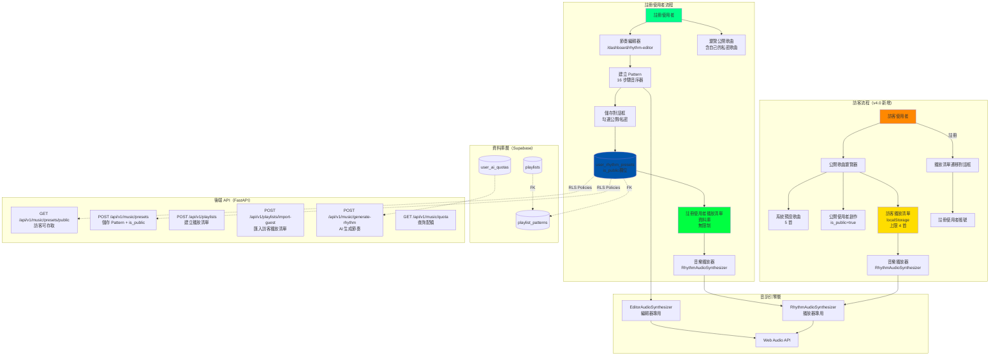
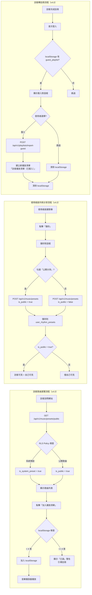
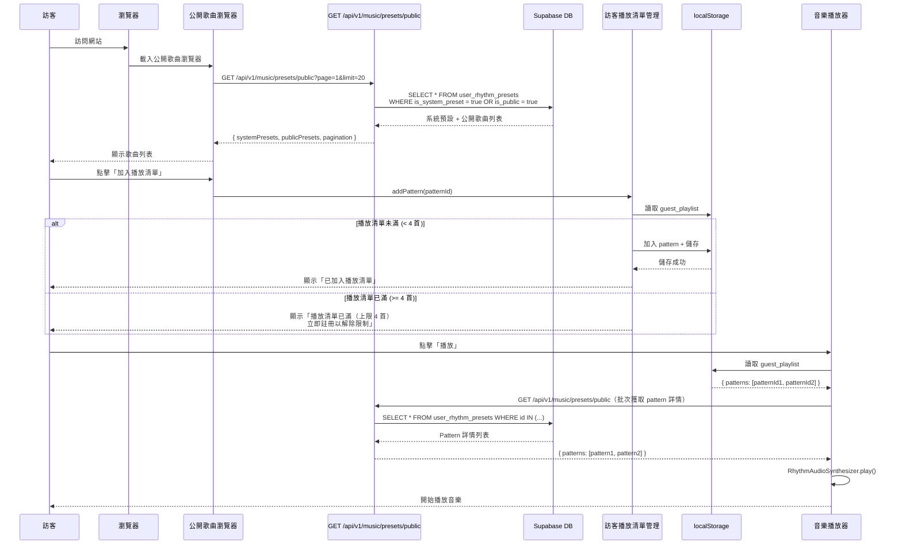
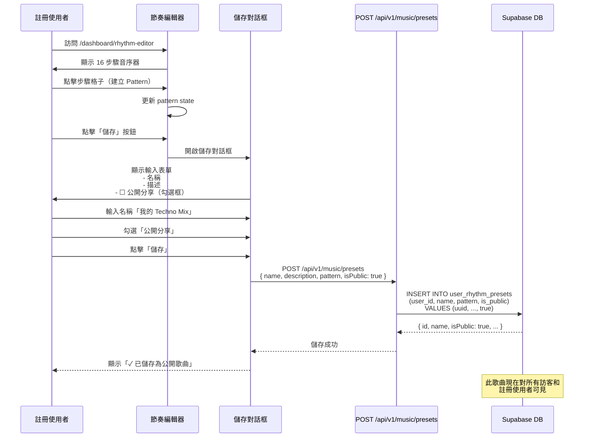
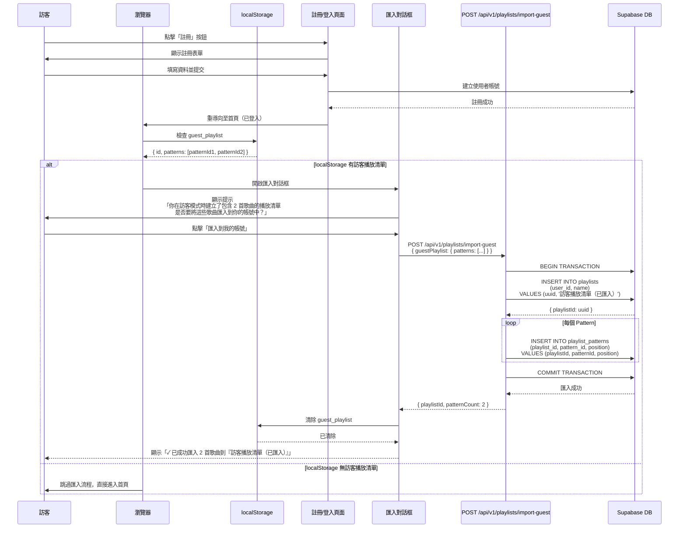

# 技術設計文件 - 音樂系統整合方案（v4.0）

**版本**: 4.0
**建立日期**: 2025-01-10
**更新日期**: 2025-10-13
**語言**: 繁體中文 (zh-TW)

## 概覽

本設計文件涵蓋兩個獨立但互補的音樂系統，以及全新的訪客與公開歌曲分享機制：

### 系統組成

1. **系統 A：播放清單音樂播放器**（前台，訪客 + 註冊使用者）
   - Pattern-Based 播放清單系統
   - RhythmAudioSynthesizer 音訊合成
   - 訪客播放清單（localStorage，上限 4 首）⭐ v4.0
   - 註冊使用者播放清單（資料庫，無限制）⭐ v4.0

2. **系統 B：節奏編輯器**（後台，僅註冊使用者）
   - 16 步驟音序器
   - AI 節奏生成（20 次/日配額）
   - Preset 管理（系統預設 + 使用者自訂）
   - 公開/私密歌曲控制 ⭐ v4.0

3. **系統 C：訪客與公開歌曲系統** ⭐ v4.0 新增
   - 訪客瀏覽公開歌曲
   - 公開歌曲分享機制
   - 訪客轉註冊使用者的資料遷移

### 設計目標

- **Pattern-Based 架構**：所有音樂基於 16 步驟節奏 pattern，由 Web Audio API 即時合成
- **完全使用者控制**：移除自動場景音樂，所有播放由使用者主導
- **訪客友善體驗**：訪客可試用核心功能，鼓勵註冊以解鎖完整功能 ⭐ v4.0
- **社群分享機制**：使用者可選擇公開分享創作，豐富平台內容 ⭐ v4.0
- **系統獨立性**：播放器與節奏編輯器完全獨立，互不干擾

---

## 架構設計

### 系統架構圖



### 資料流圖



---

## 組件設計

### 組件架構

```typescript
// ============================================
// 前端組件層級結構（Component Hierarchy）
// ============================================

// 系統 A：播放器組件（前台，訪客 + 註冊使用者）
MusicPlayerDrawer                           // 主播放器介面（Drawer）
├── PlaybackControls                        // 播放控制按鈕
│   ├── PlayPauseButton
│   ├── PreviousButton
│   ├── NextButton
│   ├── ShuffleButton
│   └── RepeatButton
├── CurrentTrackInfo                        // 當前曲目資訊
│   ├── PatternName
│   ├── PatternDescription
│   └── PlaylistName
├── ProgressBar                             // 播放進度條
├── VolumeControl                           // 音量控制（現有組件）
└── PlaylistButton                          // 開啟播放清單 Sheet 按鈕

PlaylistSheet                               // 播放清單彈窗（Sheet）
├── PublicSongsBrowser ⭐ v4.0 新增          // 公開歌曲瀏覽器
│   ├── SystemPresetsSection               // 系統預設歌曲（5 首）
│   ├── PublicPresetsSection               // 公開使用者創作
│   ├── SearchFilter                       // 搜尋和排序
│   └── PaginationControls                 // 分頁控制
├── GuestPlaylistManager ⭐ v4.0 新增        // 訪客播放清單管理
│   ├── PlaylistHeader                     // 標題「訪客播放清單 (x/4 首)」
│   ├── LimitWarning                       // 限制警告（滿 4 首時）
│   ├── PatternList                        // 歌曲列表
│   └── ClearDataWarning                   // 瀏覽器資料清除警告
├── UserPlaylistManager                     // 註冊使用者播放清單管理
│   ├── PlaylistSelector                   // 切換播放清單下拉選單
│   ├── CreatePlaylistButton               // 建立新播放清單
│   ├── PlaylistPatternList                // Pattern 列表（可拖曳排序）
│   └── PlaylistActions                    // 編輯/刪除播放清單
└── PatternBrowser                          // Pattern 瀏覽器（加入播放清單）
    ├── SystemPresetsList
    └── UserPresetsList

// 系統 B：節奏編輯器組件（後台，僅註冊使用者）
RhythmEditorPage                            // 獨立頁面 /dashboard/rhythm-editor
├── SequencerGrid                           // 16 步驟音序器
│   ├── TrackRow (5 個)                    // Kick, Snare, HiHat, OpenHat, Clap
│   │   ├── TrackLabel
│   │   └── StepButton (16 個)            // 步驟按鈕（可點擊切換）
│   └── PlayheadIndicator                  // 播放頭指示器
├── TransportControls                       // 傳輸控制
│   ├── PlayPauseButton
│   ├── StopButton
│   ├── ClearButton
│   └── TempoSlider                        // BPM 60-180
├── PresetManager                           // Preset 管理
│   ├── SystemPresetButtons (5 個)         // Techno, House, Trap, Breakbeat, Minimal
│   ├── UserPresetList                     // 使用者自訂 Preset 列表（捲動）
│   ├── SavePresetButton                   // 儲存按鈕
│   └── SavePresetDialog ⭐ v4.0 更新       // 儲存對話框
│       ├── NameInput                      // 名稱輸入
│       ├── DescriptionTextarea            // 描述（可選）
│       ├── PublicShareCheckbox ⭐ v4.0     // 公開分享勾選框
│       └── SaveButton
├── AIRhythmGenerator                       // AI 生成區塊
│   ├── PromptInput                        // 提示輸入框（200 字元）
│   ├── QuickKeywordButtons                // 快速關鍵字（808 Cowbell, Glitch 等）
│   ├── GenerateButton                     // 生成按鈕
│   ├── LoadingIndicator                   // 載入動畫
│   └── QuotaDisplay ⭐                     // 配額顯示「15/20 remaining」
└── EditorAudioSynthesizer                  // 獨立音訊合成器（Web Audio API）

// 系統 C：訪客轉換組件（v4.0 新增）
GuestPlaylistMigrationDialog ⭐             // 播放清單匯入對話框
├── MigrationPrompt                         // 提示文字「你在訪客模式時建立了...」
├── PatternCountDisplay                     // 顯示歌曲數量
├── ImportButton                            // 匯入按鈕
├── SkipButton                              // 跳過按鈕
└── SuccessToast                            // 匯入成功提示
```

### 核心組件介面定義

#### 1. PublicSongsBrowser（公開歌曲瀏覽器）⭐ v4.0

**職責**：
- 顯示系統預設歌曲（5 首）
- 顯示公開使用者創作歌曲（is_public = true）
- 提供搜尋、排序、分頁功能
- 支援訪客和註冊使用者存取

**介面**：
```typescript
interface PublicSongsBrowserProps {
  isGuest: boolean;
  onAddToPlaylist: (patternId: string) => void;
}

interface PublicSongsBrowserState {
  systemPresets: SystemPreset[];        // 系統預設
  publicPresets: PublicPreset[];        // 公開使用者創作
  searchQuery: string;
  sortBy: 'created_at_desc' | 'created_at_asc' | 'name_asc' | 'name_desc';
  currentPage: number;
  totalPages: number;
  isLoading: boolean;
}

interface PublicPreset {
  id: string;
  name: string;
  description?: string;
  userId: string;
  userName: string;          // 創作者名稱
  isPublic: true;
  createdAt: string;
}
```

**方法**：
```typescript
class PublicSongsBrowser {
  async fetchPublicSongs(page: number, limit: number, sort: string): Promise<{
    systemPresets: SystemPreset[];
    publicPresets: PublicPreset[];
    pagination: PaginationInfo;
  }>

  handleSearch(query: string): void
  handleSort(sortBy: string): void
  handlePageChange(page: number): void
  handleAddToPlaylist(patternId: string): void
}
```

---

#### 2. GuestPlaylistManager（訪客播放清單管理）⭐ v4.0

**職責**：
- 管理 localStorage 播放清單（上限 4 首）
- 顯示限制警告和註冊導引
- 提供清除警告提示

**介面**：
```typescript
interface GuestPlaylistManagerProps {
  onRegisterClick: () => void;
}

interface GuestPlaylist {
  id: string;           // 固定為 "guest-playlist-local"
  name: string;         // 固定為「訪客播放清單」
  patterns: GuestPlaylistPattern[];
  createdAt: string;
  updatedAt: string;
}

interface GuestPlaylistPattern {
  patternId: string;    // 引用 DB 中的 pattern ID
  position: number;
  addedAt: string;      // ISO timestamp
}

const GUEST_PLAYLIST_LIMIT = 4; // 硬編碼上限
```

**方法**：
```typescript
class GuestPlaylistManager {
  loadFromLocalStorage(): GuestPlaylist | null
  saveToLocalStorage(playlist: GuestPlaylist): void

  addPattern(patternId: string): boolean // 成功返回 true，已滿返回 false
  removePattern(patternId: string): void
  clearPlaylist(): void

  isFull(): boolean      // patterns.length >= 4
  getPatternCount(): number

  exportForMigration(): GuestPlaylistExport // 用於註冊時匯入
}
```

---

#### 3. GuestPlaylistMigrationDialog（播放清單匯入對話框）⭐ v4.0

**職責**：
- 檢測訪客播放清單（localStorage）
- 提示使用者匯入或跳過
- 執行匯入 API 呼叫
- 清除 localStorage

**介面**：
```typescript
interface GuestPlaylistMigrationDialogProps {
  isOpen: boolean;
  onClose: () => void;
  onImportSuccess: (playlistId: string) => void;
}

interface GuestPlaylistMigrationState {
  guestPlaylist: GuestPlaylist | null;
  isImporting: boolean;
  error: string | null;
}
```

**方法**：
```typescript
class GuestPlaylistMigrationDialog {
  async detectGuestPlaylist(): Promise<GuestPlaylist | null>

  async importToUserAccount(): Promise<{
    playlistId: string;
    patternCount: number;
  }>

  clearLocalStorage(): void

  handleSkip(): void    // 跳過匯入並清除 localStorage
  handleImport(): void  // 執行匯入
}
```

---

#### 4. SavePresetDialog（儲存對話框）⭐ v4.0 更新

**職責**：
- 儲存使用者創作的節奏 Pattern
- 提供公開/私密選項 ⭐ v4.0
- 驗證輸入（名稱、描述）

**介面**：
```typescript
interface SavePresetDialogProps {
  isOpen: boolean;
  pattern: Pattern;
  onSave: (preset: SavePresetData) => void;
  onClose: () => void;
}

interface SavePresetData {
  name: string;         // 最多 50 字元
  description?: string; // 最多 200 字元
  pattern: Pattern;
  isPublic: boolean;    // ⭐ v4.0 新增
}
```

**UI 範例**：
```tsx
<Dialog open={isOpen} onOpenChange={onClose}>
  <DialogTitle>儲存節奏</DialogTitle>
  <DialogContent>
    <Input
      label="歌曲名稱"
      value={name}
      maxLength={50}
      required
    />
    <Textarea
      label="描述（可選）"
      value={description}
      maxLength={200}
    />
    <Checkbox
      label="公開分享"
      description="勾選後其他使用者（含訪客）可以查看並使用此節奏"
      checked={isPublic}
      onChange={setIsPublic}
    />
  </DialogContent>
  <DialogActions>
    <Button variant="secondary" onClick={onClose}>取消</Button>
    <Button variant="primary" onClick={handleSave}>儲存</Button>
  </DialogActions>
</Dialog>
```

---

#### 5. RhythmAudioSynthesizer（播放器音訊合成器）

**職責**：
- 播放 Pattern 音訊（Web Audio API）
- 循環播放 Pattern（每個 Pattern 循環 4 次）
- 管理播放清單切換

**介面**：
```typescript
interface RhythmAudioSynthesizerConfig {
  audioContext: AudioContext;
  patterns: Pattern[];      // 播放清單中的所有 Pattern
  tempo: number;            // BPM（預設 120）
  loopCount: number;        // 每個 Pattern 循環次數（預設 4）
}

interface RhythmAudioSynthesizerState {
  isPlaying: boolean;
  currentPatternIndex: number;
  currentStep: number;      // 0-15
  currentLoop: number;      // 1-4
}
```

**方法**：
```typescript
class RhythmAudioSynthesizer {
  constructor(config: RhythmAudioSynthesizerConfig)

  // 播放控制
  play(): void
  pause(): void
  stop(): void
  next(): void              // 下一個 Pattern
  previous(): void          // 上一個 Pattern

  // Pattern 管理
  setPatterns(patterns: Pattern[]): void
  setTempo(bpm: number): void

  // 音效合成（參考 sample.html）
  private playKick(time: number): void
  private playSnare(time: number): void
  private playHiHat(time: number): void
  private playOpenHat(time: number): void
  private playClap(time: number): void

  // 循環邏輯
  private scheduleNextStep(): void
  private handlePatternComplete(): void  // 循環 4 次後切換 Pattern

  // 資源管理
  destroy(): void           // 釋放 AudioContext 資源
}
```

---

## 資料模型

### 核心資料結構定義

#### 1. Pattern（節奏 Pattern）

```typescript
/**
 * 16 步驟節奏 Pattern
 * 每個軌道包含 16 個布林值，true 表示該步驟啟用
 */
interface Pattern {
  kick: boolean[];      // Kick Drum（16 步驟）
  snare: boolean[];     // Snare Drum（16 步驟）
  hihat: boolean[];     // Hi-Hat（16 步驟）
  openhat: boolean[];   // Open Hi-Hat（16 步驟）
  clap: boolean[];      // Clap（16 步驟）
}

// 範例：Techno Pattern
const technoPattern: Pattern = {
  kick:    [true, false, false, false, true, false, false, false, true, false, false, false, true, false, false, false],
  snare:   [false, false, false, false, true, false, false, false, false, false, false, false, true, false, false, false],
  hihat:   [false, false, true, false, false, false, true, false, false, false, true, false, false, false, true, false],
  openhat: [false, false, false, false, false, false, false, false, false, false, false, false, false, false, false, true],
  clap:    [false, false, false, false, true, false, false, false, false, false, false, false, true, false, false, false]
};
```

#### 2. UserRhythmPreset（使用者節奏 Preset）

```typescript
/**
 * 使用者節奏 Preset（對應 DB 表：user_rhythm_presets）
 */
interface UserRhythmPreset {
  id: string;                  // UUID
  userId: string;              // FK to auth.users(id)
  name: string;                // Preset 名稱（最多 50 字元）
  description?: string;        // 描述（可選）
  pattern: Pattern;            // 16 步驟 Pattern（JSONB）
  isSystemPreset: boolean;     // 是否為系統預設
  isPublic: boolean;           // 是否公開分享 ⭐ v4.0
  createdAt: string;           // ISO timestamp
  updatedAt: string;           // ISO timestamp
}
```

#### 3. GuestPlaylist（訪客播放清單）⭐ v4.0

```typescript
/**
 * 訪客播放清單（localStorage 儲存）
 * Key: "guest_playlist"
 */
interface GuestPlaylist {
  id: string;                  // 固定為 "guest-playlist-local"
  name: string;                // 固定為「訪客播放清單」
  patterns: GuestPlaylistPattern[];
  createdAt: string;           // ISO timestamp
  updatedAt: string;           // ISO timestamp
}

interface GuestPlaylistPattern {
  patternId: string;           // 引用 DB 中的 pattern ID（user_rhythm_presets.id）
  position: number;            // 順序（0-based）
  addedAt: string;             // 加入時間（ISO timestamp）
}

// localStorage 儲存範例
const guestPlaylistExample: GuestPlaylist = {
  id: "guest-playlist-local",
  name: "訪客播放清單",
  patterns: [
    {
      patternId: "uuid-techno-preset",
      position: 0,
      addedAt: "2025-10-13T12:00:00Z"
    },
    {
      patternId: "uuid-house-preset",
      position: 1,
      addedAt: "2025-10-13T12:05:00Z"
    }
  ],
  createdAt: "2025-10-13T12:00:00Z",
  updatedAt: "2025-10-13T12:05:00Z"
};

// localStorage API
localStorage.setItem('guest_playlist', JSON.stringify(guestPlaylistExample));
const stored = JSON.parse(localStorage.getItem('guest_playlist') || 'null') as GuestPlaylist | null;
```

---

### 資料模型圖（Mermaid ER Diagram）

```mermaid
erDiagram
    auth_users ||--o{ user_rhythm_presets : creates
    auth_users ||--o{ playlists : owns
    auth_users ||--|| user_ai_quotas : has

    user_rhythm_presets ||--o{ playlist_patterns : references
    playlists ||--o{ playlist_patterns : contains

    user_rhythm_presets {
        uuid id PK
        uuid user_id FK
        text name
        text description
        jsonb pattern
        boolean is_system_preset
        boolean is_public
        timestamp created_at
        timestamp updated_at
    }

    playlists {
        uuid id PK
        uuid user_id FK
        text name
        text description
        boolean is_public
        timestamp created_at
        timestamp updated_at
    }

    playlist_patterns {
        uuid id PK
        uuid playlist_id FK
        uuid pattern_id FK
        integer position
        timestamp created_at
    }

    user_ai_quotas {
        uuid user_id PK_FK
        integer rhythm_quota_used
        integer rhythm_quota_limit
        timestamp quota_reset_at
    }

    auth_users {
        uuid id PK
        text email
        timestamp created_at
    }
```

---

## 業務流程

### 流程 1：訪客瀏覽與播放公開歌曲 ⭐ v4.0



---

### 流程 2：註冊使用者創作並分享公開歌曲 ⭐ v4.0



---

### 流程 3：訪客轉註冊使用者（播放清單遷移）⭐ v4.0



---

## 錯誤處理策略

### 錯誤分類與處理

#### 1. 前端錯誤

| 錯誤類型 | 觸發條件 | 處理方式 | 使用者體驗 |
|---------|---------|---------|----------|
| **訪客播放清單已滿** | 訪客嘗試加入第 5 首歌曲 | 顯示警告對話框，引導註冊 | 「訪客播放清單已滿（上限 4 首），<link>立即註冊</link>以解除限制」 |
| **localStorage 無法寫入** | localStorage 已滿或瀏覽器限制 | 顯示錯誤提示，建議清除資料 | 「無法儲存播放清單，請檢查瀏覽器儲存空間」 |
| **localStorage 資料損壞** | JSON.parse() 失敗 | 清除損壞資料，重新初始化 | 「播放清單資料損壞，已重置為空白清單」 |
| **Pattern 載入失敗** | API 回傳 404/500 | 顯示錯誤提示，移除失效 Pattern | 「歌曲載入失敗，已從播放清單移除」 |
| **AudioContext 初始化失敗** | 瀏覽器不支援 Web Audio API | 停用播放器，顯示不支援提示 | 「您的瀏覽器不支援音樂播放功能」 |

#### 2. 後端 API 錯誤

| HTTP 狀態碼 | 錯誤情境 | API 回應 | 前端處理 |
|-----------|---------|---------|---------|
| **400 Bad Request** | - AI 配額用盡<br/>- Pattern ID 無效<br/>- 請求格式錯誤 | `{ error: "Daily quota exceeded", quotaLimit: 20, quotaUsed: 20, resetAt: "2025-10-14T00:00:00Z" }` | 顯示錯誤訊息，停用生成按鈕直到重置時間 |
| **401 Unauthorized** | - Token 過期<br/>- 未登入存取受保護 API | `{ error: "Unauthorized", message: "Invalid or expired token" }` | 重導向至登入頁面，顯示「Session 已過期，請重新登入」 |
| **403 Forbidden** | - 嘗試存取他人私密歌曲<br/>- 嘗試刪除系統預設 | `{ error: "Forbidden", message: "Cannot delete system preset" }` | 顯示錯誤提示，阻止操作 |
| **404 Not Found** | - Pattern ID 不存在<br/>- Playlist ID 不存在 | `{ error: "Not found", message: "Pattern not found" }` | 從播放清單移除失效項目，顯示提示 |
| **500 Internal Server Error** | - AI Provider 失敗<br/>- DB 連線錯誤 | `{ error: "Internal server error", message: "AI generation failed" }` | 顯示「伺服器錯誤，請稍後重試」，提供重試按鈕 |

#### 3. 訪客轉註冊錯誤處理 ⭐ v4.0

```typescript
// 播放清單匯入失敗處理
async function importGuestPlaylist(guestPlaylist: GuestPlaylist): Promise<void> {
  try {
    const response = await fetch('/api/v1/playlists/import-guest', {
      method: 'POST',
      headers: { 'Content-Type': 'application/json' },
      body: JSON.stringify({ guestPlaylist })
    });

    if (!response.ok) {
      const errorData = await response.json();

      if (errorData.error === 'INVALID_PATTERN_ID') {
        // 部分 Pattern ID 無效（歌曲被刪除）
        showWarning(
          `部分歌曲已無法使用（${errorData.invalidPatternIds.length} 首），` +
          `已匯入其餘 ${guestPlaylist.patterns.length - errorData.invalidPatternIds.length} 首歌曲`
        );
        // 仍清除 localStorage
        localStorage.removeItem('guest_playlist');
      } else {
        throw new Error(errorData.message);
      }
    } else {
      const data = await response.json();
      showSuccess(`已成功匯入 ${data.patternCount} 首歌曲到「訪客播放清單（已匯入）」`);
      localStorage.removeItem('guest_playlist');
    }
  } catch (error) {
    // 匯入失敗，保留 localStorage 資料讓使用者重試
    showError('匯入失敗，請稍後重試。你的訪客播放清單已保留。');
  }
}
```

---

## 測試策略

### 單元測試

#### 1. localStorage 播放清單管理測試 ⭐ v4.0

```typescript
describe('GuestPlaylistManager', () => {
  let manager: GuestPlaylistManager;

  beforeEach(() => {
    localStorage.clear();
    manager = new GuestPlaylistManager();
  });

  test('should initialize empty guest playlist', () => {
    const playlist = manager.loadFromLocalStorage();
    expect(playlist).toBeNull();
  });

  test('should add pattern to guest playlist', () => {
    const success = manager.addPattern('pattern-uuid-1');
    expect(success).toBe(true);
    const playlist = manager.loadFromLocalStorage();
    expect(playlist?.patterns).toHaveLength(1);
  });

  test('should reject adding 5th pattern (exceeds limit)', () => {
    manager.addPattern('pattern-uuid-1');
    manager.addPattern('pattern-uuid-2');
    manager.addPattern('pattern-uuid-3');
    manager.addPattern('pattern-uuid-4');
    const success = manager.addPattern('pattern-uuid-5');
    expect(success).toBe(false);
    expect(manager.isFull()).toBe(true);
  });

  test('should remove pattern from guest playlist', () => {
    manager.addPattern('pattern-uuid-1');
    manager.addPattern('pattern-uuid-2');
    manager.removePattern('pattern-uuid-1');
    const playlist = manager.loadFromLocalStorage();
    expect(playlist?.patterns).toHaveLength(1);
    expect(playlist?.patterns[0].patternId).toBe('pattern-uuid-2');
  });

  test('should export playlist for migration', () => {
    manager.addPattern('pattern-uuid-1');
    manager.addPattern('pattern-uuid-2');
    const exported = manager.exportForMigration();
    expect(exported.patterns).toHaveLength(2);
    expect(exported.patterns[0]).toEqual({ patternId: 'pattern-uuid-1', position: 0 });
  });
});
```

#### 2. RLS Policy 測試（資料庫層）⭐ v4.0

```sql
-- 測試訪客可見系統預設歌曲
BEGIN;
SET LOCAL ROLE anon; -- 模擬訪客（未登入）
SELECT COUNT(*) FROM user_rhythm_presets WHERE is_system_preset = true;
-- Expected: 5（系統預設歌曲）
ROLLBACK;

-- 測試訪客可見公開歌曲
BEGIN;
SET LOCAL ROLE anon;
SELECT COUNT(*) FROM user_rhythm_presets WHERE is_public = true;
-- Expected: > 0（公開使用者創作歌曲）
ROLLBACK;

-- 測試訪客無法見私密歌曲
BEGIN;
SET LOCAL ROLE anon;
SELECT COUNT(*) FROM user_rhythm_presets WHERE is_public = false AND is_system_preset = false;
-- Expected: 0
ROLLBACK;

-- 測試註冊使用者可見自己的私密歌曲
BEGIN;
SET LOCAL jwt.claims.sub = 'user-uuid-123'; -- 模擬登入使用者
SELECT COUNT(*) FROM user_rhythm_presets
WHERE user_id = 'user-uuid-123' AND is_public = false;
-- Expected: 使用者自己的私密歌曲數量
ROLLBACK;
```

---

## 附錄

### A. 系統預設 Pattern 定義

```typescript
const SYSTEM_PRESETS: SystemPreset[] = [
  {
    id: 'system-preset-techno',
    name: 'Techno',
    description: '經典 Techno 四四拍節奏，強勁的 Kick 和規律的 Hi-Hat',
    pattern: {
      kick:    [1,0,0,0,1,0,0,0,1,0,0,0,1,0,0,0],
      snare:   [0,0,0,0,1,0,0,0,0,0,0,0,1,0,0,0],
      hihat:   [0,0,1,0,0,0,1,0,0,0,1,0,0,0,1,0],
      openhat: [0,0,0,0,0,0,0,0,0,0,0,0,0,0,0,1],
      clap:    [0,0,0,0,1,0,0,0,0,0,0,0,1,0,0,0]
    },
    isSystemPreset: true
  },
  {
    id: 'system-preset-house',
    name: 'House',
    description: 'House 音樂節奏，持續的四四拍 Kick 和活潑的 Hi-Hat',
    pattern: {
      kick:    [1,0,0,0,1,0,0,0,1,0,0,0,1,0,0,0],
      snare:   [0,0,0,0,1,0,0,0,0,0,0,0,1,0,0,0],
      hihat:   [1,0,1,0,1,0,1,0,1,0,1,0,1,0,1,0],
      openhat: [0,0,0,1,0,0,0,1,0,0,0,1,0,0,0,1],
      clap:    [0,0,0,0,1,0,0,0,0,0,0,0,1,0,0,0]
    },
    isSystemPreset: true
  },
  {
    id: 'system-preset-trap',
    name: 'Trap',
    description: 'Trap 風格節奏，重低音 Kick 和快速的 Hi-Hat roll',
    pattern: {
      kick:    [1,0,0,0,0,0,0,1,0,0,1,0,0,0,0,0],
      snare:   [0,0,0,0,0,0,0,0,1,0,0,0,0,0,0,0],
      hihat:   [1,0,1,0,1,0,1,0,1,1,0,1,0,1,1,1],
      openhat: [0,0,0,0,0,0,0,0,0,0,0,0,0,1,0,0],
      clap:    [0,0,0,0,0,0,0,0,1,0,0,0,0,0,0,0]
    },
    isSystemPreset: true
  },
  {
    id: 'system-preset-breakbeat',
    name: 'Breakbeat',
    description: 'Breakbeat 碎拍節奏，不規則的 Kick 和 Snare 組合',
    pattern: {
      kick:    [1,0,0,0,0,0,1,0,0,1,0,0,0,0,0,0],
      snare:   [0,0,0,0,1,0,0,0,0,0,0,1,0,0,1,0],
      hihat:   [1,0,1,0,1,0,1,0,1,0,1,0,1,0,1,0],
      openhat: [0,0,0,1,0,0,0,0,0,0,0,0,0,0,0,1],
      clap:    [0,0,0,0,1,0,0,0,0,0,0,1,0,0,0,0]
    },
    isSystemPreset: true
  },
  {
    id: 'system-preset-minimal',
    name: 'Minimal',
    description: 'Minimal 極簡節奏，稀疏的鼓點和空間感',
    pattern: {
      kick:    [1,0,0,0,0,0,0,0,1,0,0,0,0,0,0,0],
      snare:   [0,0,0,0,0,0,0,0,0,0,0,0,1,0,0,0],
      hihat:   [0,0,0,1,0,0,0,0,0,0,1,0,0,0,0,0],
      openhat: [0,0,0,0,0,0,0,1,0,0,0,0,0,0,0,0],
      clap:    [0,0,0,0,0,0,0,0,0,0,0,0,1,0,0,0]
    },
    isSystemPreset: true
  }
];
```

### B. Web Audio API 音效合成參數

```typescript
// Kick Drum 合成參數
private playKick(time: number): void {
  const osc = this.audioContext.createOscillator();
  const gain = this.audioContext.createGain();

  osc.frequency.setValueAtTime(150, time);
  osc.frequency.exponentialRampToValueAtTime(0.01, time + 0.5);

  gain.gain.setValueAtTime(1, time);
  gain.gain.exponentialRampToValueAtTime(0.01, time + 0.5);

  osc.connect(gain);
  gain.connect(this.audioContext.destination);

  osc.start(time);
  osc.stop(time + 0.5);
}

// Snare Drum 合成參數
private playSnare(time: number): void {
  const noiseBuffer = this.createNoiseBuffer();
  const noise = this.audioContext.createBufferSource();
  noise.buffer = noiseBuffer;

  const noiseFilter = this.audioContext.createBiquadFilter();
  noiseFilter.type = 'highpass';
  noiseFilter.frequency.value = 1000;

  const noiseGain = this.audioContext.createGain();
  noiseGain.gain.setValueAtTime(1, time);
  noiseGain.gain.exponentialRampToValueAtTime(0.01, time + 0.2);

  noise.connect(noiseFilter);
  noiseFilter.connect(noiseGain);
  noiseGain.connect(this.audioContext.destination);

  const osc = this.audioContext.createOscillator();
  osc.type = 'triangle';
  osc.frequency.value = 180;

  const oscGain = this.audioContext.createGain();
  oscGain.gain.setValueAtTime(0.7, time);
  oscGain.gain.exponentialRampToValueAtTime(0.01, time + 0.1);

  osc.connect(oscGain);
  oscGain.connect(this.audioContext.destination);

  noise.start(time);
  noise.stop(time + 0.2);
  osc.start(time);
  osc.stop(time + 0.2);
}

// Hi-Hat 合成參數
private playHiHat(time: number): void {
  const osc = this.audioContext.createOscillator();
  osc.type = 'square';
  osc.frequency.value = 10000;

  const filter = this.audioContext.createBiquadFilter();
  filter.type = 'highpass';
  filter.frequency.value = 7000;

  const gain = this.audioContext.createGain();
  gain.gain.setValueAtTime(0.3, time);
  gain.gain.exponentialRampToValueAtTime(0.01, time + 0.05);

  osc.connect(filter);
  filter.connect(gain);
  gain.connect(this.audioContext.destination);

  osc.start(time);
  osc.stop(time + 0.05);
}

// Open Hi-Hat 合成參數
private playOpenHat(time: number): void {
  const osc = this.audioContext.createOscillator();
  osc.type = 'square';
  osc.frequency.value = 10000;

  const filter = this.audioContext.createBiquadFilter();
  filter.type = 'highpass';
  filter.frequency.value = 7000;

  const gain = this.audioContext.createGain();
  gain.gain.setValueAtTime(0.3, time);
  gain.gain.exponentialRampToValueAtTime(0.01, time + 0.3);

  osc.connect(filter);
  filter.connect(gain);
  gain.connect(this.audioContext.destination);

  osc.start(time);
  osc.stop(time + 0.3);
}

// Clap 合成參數
private playClap(time: number): void {
  const noiseBuffer = this.createNoiseBuffer();
  const noise = this.audioContext.createBufferSource();
  noise.buffer = noiseBuffer;

  const filter = this.audioContext.createBiquadFilter();
  filter.type = 'bandpass';
  filter.frequency.value = 1500;

  const gain = this.audioContext.createGain();
  gain.gain.setValueAtTime(1, time);
  gain.gain.exponentialRampToValueAtTime(0.01, time + 0.1);

  noise.connect(filter);
  filter.connect(gain);
  gain.connect(this.audioContext.destination);

  noise.start(time);
  noise.stop(time + 0.1);
}

// 白噪音 Buffer 生成
private createNoiseBuffer(): AudioBuffer {
  const bufferSize = this.audioContext.sampleRate * 0.5;
  const buffer = this.audioContext.createBuffer(1, bufferSize, this.audioContext.sampleRate);
  const output = buffer.getChannelData(0);

  for (let i = 0; i < bufferSize; i++) {
    output[i] = Math.random() * 2 - 1;
  }

  return buffer;
}
```

### C. API 端點完整清單

#### 公開端點（訪客可存取）⭐ v4.0

```
GET  /api/v1/music/presets/public       # 獲取公開歌曲列表
POST /api/v1/music/presets/batch        # 批次獲取 Pattern 詳情
```

#### 認證端點（需登入）

```
# 播放清單管理
GET    /api/v1/playlists                     # 獲取使用者所有播放清單
POST   /api/v1/playlists                     # 建立新播放清單
GET    /api/v1/playlists/{id}                # 獲取播放清單詳情
PUT    /api/v1/playlists/{id}                # 更新播放清單
DELETE /api/v1/playlists/{id}                # 刪除播放清單
POST   /api/v1/playlists/import-guest ⭐      # 匯入訪客播放清單

# Pattern 管理
POST   /api/v1/playlists/{id}/patterns       # 加入 Pattern
DELETE /api/v1/playlists/{id}/patterns/{pid} # 移除 Pattern
PUT    /api/v1/playlists/{id}/patterns/{pid}/position # 調整順序

# Preset 管理
GET    /api/v1/music/presets/available       # 獲取可用 Pattern
POST   /api/v1/music/presets ⭐               # 儲存 Preset（支援 isPublic）
PUT    /api/v1/music/presets/{id} ⭐          # 更新 Preset
DELETE /api/v1/music/presets/{id}            # 刪除 Preset

# AI 生成
POST   /api/v1/music/generate-rhythm         # AI 生成節奏
GET    /api/v1/music/quota                   # 獲取配額狀態
```

---

**設計文件結束**

本設計文件涵蓋了 v4.0 所有核心功能，包括訪客系統、公開歌曲分享機制、播放清單管理和節奏編輯器。所有組件、API 和資料流程均已詳細定義，可直接進入實作階段。
