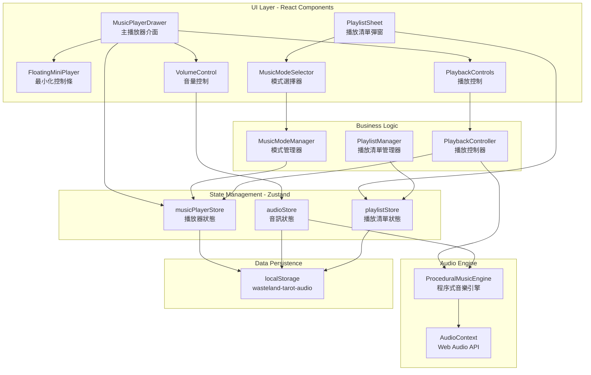
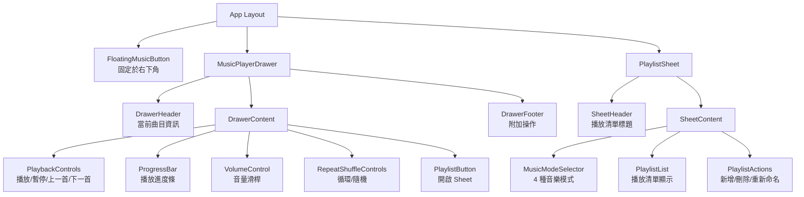
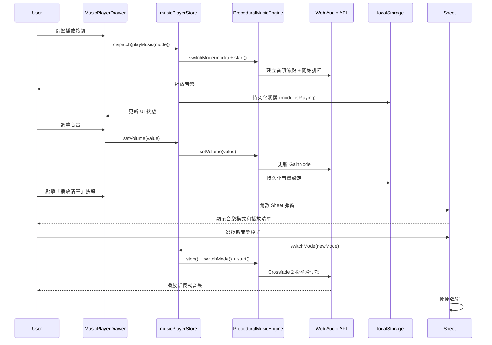
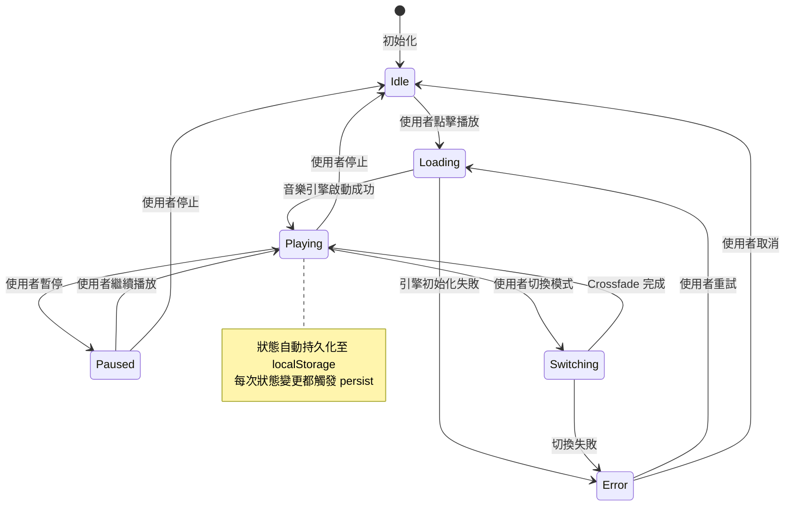

# 技術設計 - 播放清單音樂播放器

## 概述

本設計文件描述了將 Wasteland Tarot 的自動場景音樂系統轉換為使用者主導的播放清單音樂控制系統的技術實現方案。系統採用 shadcn/ui Drawer 作為主播放器介面，Sheet 作為播放清單彈窗，並完全整合現有的 ProceduralMusicEngine 和 audioStore Zustand 狀態管理。

### 設計目標

1. **完全移除自動播放**：移除 SCENE_MUSIC_MAP 場景音樂自動播放邏輯
2. **使用者主導控制**：所有音樂播放由使用者手動啟動和管理
3. **Fallout Pip-Boy 美學**：保持沉浸式終端機風格介面
4. **效能優化**：< 500ms 音樂切換，< 100ms UI 渲染，≤ 50MB 記憶體
5. **無障礙支援**：WCAG 2.1 AA 合規，完整鍵盤導航

## 需求映射

### 設計元件追溯性

每個設計元件對應特定需求（requirements.md）：

#### 播放器架構
- **MusicPlayerDrawer 元件** → 需求 4: Drawer 播放器介面設計（13 條驗收標準）
- **PlaylistSheet 元件** → 需求 12: Sheet 彈窗播放清單介面（14 條驗收標準）
- **MusicModeSelector** → 需求 1: 音樂模式瀏覽與選擇（7 條驗收標準）

#### 播放控制
- **PlaybackControls 元件** → 需求 2: 播放控制功能（9 條驗收標準）
- **VolumeControl 整合** → 需求 5: 音量控制整合（8 條驗收標準）
- **KeyboardNavigation Hook** → 需求 7: 鍵盤導航（8 條驗收標準）

#### 狀態管理
- **musicPlayerStore** → 需求 6: 狀態持久化（8 條驗收標準）
- **PlaylistManager** → 需求 3: 播放清單管理（8 條驗收標準）

#### 自動音樂移除
- **AutoMusicRemoval 重構** → 需求 11: 移除自動場景音樂系統（8 條驗收標準）

#### 效能與無障礙
- **PerformanceOptimizer** → 需求 8: 效能要求（8 條驗收標準）
- **AccessibilityWrapper** → 需求 9: 無障礙支援（8 條驗收標準）
- **ErrorBoundary** → 需求 10: 錯誤處理（8 條驗收標準）

### 使用者故事覆蓋

| 使用者故事 | 技術實現 |
|------------|----------|
| 瀏覽所有可用音樂模式 | `MusicModeSelector` 元件在 Sheet 中顯示 4 種模式，每個模式包含名稱、描述和圖示 |
| 完整播放控制功能 | `PlaybackControls` 元件提供播放/暫停、上一首/下一首、循環模式、隨機播放按鈕 |
| 建立和管理播放清單 | `PlaylistManager` 提供新增、刪除、重新命名播放清單功能，支援拖曳排序 |
| Drawer 播放器介面 | `MusicPlayerDrawer` 從底部滑入，60% 高度可調整（30%-90%），包含完整播放控制 |
| 音量控制整合 | 整合現有 `VolumeControl` 元件，即時更新 audioStore，支援靜音和音量調整 |
| 狀態持久化 | `musicPlayerStore` 使用 Zustand persist middleware，儲存至 localStorage |
| 鍵盤導航 | `useKeyboardShortcuts` hook 實現空白鍵、方向鍵、M、L、Esc 等快捷鍵 |
| 效能要求 | React.memo、useMemo、useCallback 優化渲染，Web Audio API 降低 CPU |
| 無障礙支援 | 完整 ARIA 標籤、role 屬性、螢幕閱讀器支援、焦點管理 |
| 錯誤處理 | ErrorBoundary + 重試機制 + 回退策略 + 使用者友善錯誤訊息 |
| 移除自動音樂 | 移除 SCENE_MUSIC_MAP 場景映射，audioStore.isPlaying.music 預設 false |
| Sheet 播放清單彈窗 | `PlaylistSheet` 從右側滑入，桌面 400px / 行動 90% 寬度 |

## 架構

### 系統架構圖



### 元件階層架構



### 資料流動圖



### 狀態管理流程



## 技術堆疊

基於專案現有技術棧和需求分析：

### 前端框架
- **React 19**: 使用 `use client` 指令的客戶端元件
- **Next.js 15 (App Router)**: 頁面路由和伺服器元件（若需要）
- **TypeScript 5**: 嚴格模式，完整型別定義

### UI 元件庫
- **shadcn/ui**: 基於 Radix UI primitives
  - **Drawer**: 主播放器介面（底部滑入，基於 `vaul` 函式庫）
  - **Sheet**: 播放清單彈窗（右側滑入，基於 `@radix-ui/react-dialog`）
  - **Button, Slider, Popover**: 現有元件重用
- **Tailwind CSS v4**: 樣式系統，Pip-Boy 綠色主題自訂
- **Lucide React**: 圖示庫（Play, Pause, SkipForward, SkipBack, Volume2, List, Repeat, Shuffle 等）

### 狀態管理
- **Zustand 4.5+**: 狀態管理
  - `musicPlayerStore`: 播放器狀態（新增）
  - `audioStore`: 音訊狀態（現有，需擴充）
  - `playlistStore`: 播放清單狀態（新增）
- **Zustand Persist Middleware**: localStorage 持久化

### 音訊引擎
- **ProceduralMusicEngine**: 現有程序式音樂生成引擎
  - 支援 4 種模式：synthwave, divination, lofi, ambient
  - Web Audio API 合成器聲部（Bass, Pad, Lead）
  - 和弦進行演算法
- **Web Audio API**: 原生音訊 API

### 動畫
- **Framer Motion (motion)**: Drawer 和 Sheet 動畫效果
  - 滑入/滑出動畫：300ms ease-out
  - 拖曳手勢支援

### 效能優化
- **React.memo**: 避免不必要的重新渲染
- **useMemo / useCallback**: 優化計算和回調函數
- **Dynamic Import**: 按需載入 Drawer 和 Sheet

### 測試
- **Jest + React Testing Library**: 單元測試和元件測試
- **Playwright**: E2E 測試（播放流程、鍵盤導航、無障礙）

### 架構決策理由

#### 為何選擇 Drawer 作為主播放器？
**研究發現**：
- shadcn/ui Drawer 基於 `vaul` 函式庫，專門為行動裝置底部滑出式 UI 設計
- 支援手勢拖曳、可調整高度（透過 `snapPoints` 或 CSS）
- 符合現代音樂播放器 UX 模式（Spotify、YouTube Music 等）

**技術優勢**：
- 原生支援最小化為浮動控制條（`<Drawer open={isMinimized === false}`）
- 可配置高度：預設 60vh，可拖曳調整至 30vh-90vh
- 內建無障礙支援（ARIA 標籤、焦點陷阱）

#### 為何選擇 Sheet 作為播放清單？
**研究發現**：
- Sheet 基於 `@radix-ui/react-dialog`，從側邊滑入的對話框
- 適合顯示次要內容（播放清單、設定等）
- 可獨立於 Drawer 開啟/關閉

**技術優勢**：
- 響應式寬度控制：桌面 400px，行動 90vw
- 與 Drawer 層級分離，避免 z-index 衝突
- 支援遮罩點擊關閉、Esc 鍵關閉

#### 為何保留 ProceduralMusicEngine？
**整合優勢**：
- 已實現 4 種音樂模式的程序式生成
- 支援即時切換模式（`switchMode()`）
- Web Audio API 效能優異（CPU 使用低於預渲染音訊）

**無需變更**：
- 引擎 API 已符合播放清單需求（start, stop, switchMode, setVolume）
- 僅需擴充 Crossfade 功能以支援平滑切換

#### 為何使用 Zustand Persist？
**localStorage 模式研究**：
- Zustand persist middleware 自動處理序列化/反序列化
- 支援部分持久化（`partialize`），只儲存必要欄位
- 內建版本管理（`version`），支援未來資料遷移

**資料結構**：
```typescript
{
  version: 1,
  state: {
    currentMode: 'synthwave',
    isPlaying: false,
    volume: 0.5,
    playlists: [
      { id: '1', name: '我的最愛', modes: ['synthwave', 'lofi'] }
    ],
    repeatMode: 'off',
    shuffleEnabled: false
  }
}
```

## 元件與介面

### 前端元件

| 元件名稱 | 職責 | 主要 Props/State |
|---------|------|-----------------|
| `MusicPlayerDrawer` | 主播放器 Drawer 容器 | `isOpen`, `isMinimized`, `onOpenChange` |
| `FloatingMiniPlayer` | 最小化浮動控制條 | `currentMode`, `isPlaying`, `onExpand` |
| `PlaybackControls` | 播放控制按鈕組 | `isPlaying`, `onPlay`, `onPause`, `onNext`, `onPrevious` |
| `ProgressBar` | 播放進度條（裝飾性） | `currentTime`, `duration` |
| `RepeatShuffleControls` | 循環和隨機按鈕 | `repeatMode`, `shuffleEnabled`, `onToggle` |
| `PlaylistSheet` | 播放清單彈窗 | `isOpen`, `playlists`, `onClose` |
| `MusicModeSelector` | 音樂模式選擇器 | `modes`, `selectedMode`, `onSelect` |
| `PlaylistList` | 播放清單顯示 | `playlists`, `currentPlaylist`, `onSelect` |
| `PlaylistActions` | 播放清單管理按鈕 | `onAdd`, `onDelete`, `onRename` |
| `VolumeControlWrapper` | 音量控制整合 | 整合現有 `VolumeControl` 元件 |

### 資料模型

#### TypeScript 介面定義

```typescript
/**
 * 音樂模式定義
 * 對應 ProceduralMusicEngine 的 MusicMode
 */
export type MusicMode = 'synthwave' | 'divination' | 'lofi' | 'ambient';

/**
 * 音樂模式資訊
 * 需求 1.6: 每個音樂模式項目顯示名稱、描述和視覺化圖示
 */
export interface MusicModeInfo {
  id: MusicMode;
  name: string;        // 顯示名稱（例如：「賽博龐克 Synthwave」）
  description: string; // 描述（例如：「80 年代電子合成器風格」）
  icon: LucideIcon;    // 圖示元件
  color: string;       // 主題色（Tailwind class）
  bpm: number;         // 預設 BPM
}

/**
 * 播放清單定義
 * 需求 3: 播放清單管理
 */
export interface Playlist {
  id: string;          // UUID
  name: string;        // 使用者自訂名稱（最長 30 字元）
  modes: MusicMode[];  // 播放清單中的音樂模式陣列
  createdAt: Date;     // 建立時間
  updatedAt: Date;     // 更新時間
}

/**
 * 循環模式
 * 需求 2.5-2.7: 單曲循環、列表循環、隨機播放
 */
export type RepeatMode = 'off' | 'one' | 'all';

/**
 * 播放器狀態（musicPlayerStore）
 * 需求 6: 狀態持久化
 */
export interface MusicPlayerState {
  // 播放狀態
  currentMode: MusicMode | null;          // 當前播放模式
  isPlaying: boolean;                     // 是否正在播放
  currentPlaylist: string | null;         // 當前播放清單 ID
  currentModeIndex: number;               // 當前模式在播放清單中的索引

  // 播放設定
  repeatMode: RepeatMode;                 // 循環模式
  shuffleEnabled: boolean;                // 隨機播放

  // UI 狀態
  isDrawerOpen: boolean;                  // Drawer 是否開啟
  isDrawerMinimized: boolean;             // Drawer 是否最小化
  isSheetOpen: boolean;                   // Sheet 是否開啟

  // 持久化資料（儲存至 localStorage）
  playlists: Playlist[];                  // 使用者建立的播放清單

  // Actions
  playMode: (mode: MusicMode) => void;
  pauseMusic: () => void;
  stopMusic: () => void;
  nextMode: () => void;
  previousMode: () => void;
  setRepeatMode: (mode: RepeatMode) => void;
  toggleShuffle: () => void;

  // Drawer 控制
  openDrawer: () => void;
  closeDrawer: () => void;
  toggleDrawer: () => void;
  minimizeDrawer: () => void;
  expandDrawer: () => void;

  // Sheet 控制
  openSheet: () => void;
  closeSheet: () => void;

  // 播放清單管理
  createPlaylist: (name: string) => void;
  deletePlaylist: (id: string) => void;
  renamePlaylist: (id: string, newName: string) => void;
  addModeToPlaylist: (playlistId: string, mode: MusicMode) => void;
  removeModeFromPlaylist: (playlistId: string, mode: MusicMode) => void;
  reorderPlaylistModes: (playlistId: string, modes: MusicMode[]) => void;
  selectPlaylist: (id: string | null) => void;
}

/**
 * audioStore 擴充
 * 整合現有 audioStore（src/lib/audio/audioStore.ts）
 */
export interface AudioStoreExtension {
  // 擴充現有 audioStore
  musicEngine: ProceduralMusicEngine | null;
  initMusicEngine: (audioContext: AudioContext) => void;
  switchMusicMode: (mode: MusicMode) => Promise<void>;
  startMusic: () => void;
  stopMusic: () => void;
}
```

### 資料庫架構

**不需要資料庫**：所有資料儲存在 localStorage。

### localStorage 資料結構

```typescript
// localStorage key: 'wasteland-tarot-audio' (STORAGE_KEY)
interface LocalStorageData {
  version: 1;  // 資料版本，支援未來遷移
  state: {
    // musicPlayerStore 持久化欄位
    currentMode: MusicMode | null;
    repeatMode: RepeatMode;
    shuffleEnabled: boolean;
    playlists: Playlist[];

    // audioStore 持久化欄位（現有）
    volumes: {
      sfx: number;
      music: number;
      voice: number;
    };
    muted: {
      sfx: boolean;
      music: boolean;
      voice: boolean;
    };
    selectedVoice: CharacterVoice;
    isAudioEnabled: boolean;
    isSilentMode: boolean;
  };
}
```

## 錯誤處理

### 錯誤處理策略

```typescript
/**
 * 錯誤類型定義
 * 需求 10: 錯誤處理
 */
export enum MusicPlayerErrorType {
  ENGINE_INIT_FAILED = 'ENGINE_INIT_FAILED',      // 音樂引擎初始化失敗
  MODE_LOAD_FAILED = 'MODE_LOAD_FAILED',          // 音樂模式載入失敗
  AUDIO_CONTEXT_SUSPENDED = 'AUDIO_CONTEXT_SUSPENDED', // AudioContext 被暫停
  STORAGE_WRITE_FAILED = 'STORAGE_WRITE_FAILED',  // localStorage 寫入失敗
  PLAYLIST_CORRUPTED = 'PLAYLIST_CORRUPTED',      // 播放清單資料損壞
}

/**
 * 錯誤處理類別
 */
export class MusicPlayerError extends Error {
  type: MusicPlayerErrorType;
  retryable: boolean;
  userMessage: string;

  constructor(
    type: MusicPlayerErrorType,
    message: string,
    retryable: boolean = true
  ) {
    super(message);
    this.type = type;
    this.retryable = retryable;
    this.userMessage = this.getUserMessage();
  }

  private getUserMessage(): string {
    const messages = {
      [MusicPlayerErrorType.ENGINE_INIT_FAILED]:
        '音樂引擎初始化失敗。請檢查瀏覽器音訊支援。',
      [MusicPlayerErrorType.MODE_LOAD_FAILED]:
        '音樂模式載入失敗。正在重試...',
      [MusicPlayerErrorType.AUDIO_CONTEXT_SUSPENDED]:
        '音訊已被瀏覽器暫停。請點擊任意位置以繼續播放。',
      [MusicPlayerErrorType.STORAGE_WRITE_FAILED]:
        '無法儲存設定。請檢查瀏覽器儲存空間。',
      [MusicPlayerErrorType.PLAYLIST_CORRUPTED]:
        '播放清單資料損壞。已重置為預設設定。',
    };
    return messages[this.type] || '發生未知錯誤';
  }
}
```

### 錯誤處理機制

```typescript
/**
 * 錯誤處理工具
 * 需求 10.2-10.3: 自動重試 3 次，失敗後回退至預設
 */
export class ErrorHandler {
  private static readonly MAX_RETRIES = 3;
  private static readonly ERROR_RATE_THRESHOLD = 0.3;
  private static errorCount = 0;
  private static totalAttempts = 0;

  /**
   * 帶重試的操作執行
   */
  static async withRetry<T>(
    operation: () => Promise<T>,
    operationName: string,
    fallback?: () => T
  ): Promise<T> {
    this.totalAttempts++;

    for (let attempt = 1; attempt <= this.MAX_RETRIES; attempt++) {
      try {
        return await operation();
      } catch (error) {
        logger.warn(`[ErrorHandler] ${operationName} failed (attempt ${attempt}/${this.MAX_RETRIES})`, error);

        if (attempt === this.MAX_RETRIES) {
          this.errorCount++;
          this.checkErrorRate();

          if (fallback) {
            logger.info(`[ErrorHandler] Using fallback for ${operationName}`);
            return fallback();
          }
          throw error;
        }

        // 指數退避
        await this.delay(Math.pow(2, attempt) * 100);
      }
    }

    throw new Error('Unreachable');
  }

  /**
   * 檢查錯誤率
   * 需求 10.4: 錯誤率超過 30% 時停用音樂功能
   */
  private static checkErrorRate(): void {
    const errorRate = this.errorCount / this.totalAttempts;
    if (errorRate > this.ERROR_RATE_THRESHOLD) {
      logger.error(`[ErrorHandler] Error rate ${(errorRate * 100).toFixed(1)}% exceeds threshold. Disabling music.`);
      useAudioStore.getState().setAudioEnabled(false);
    }
  }

  private static delay(ms: number): Promise<void> {
    return new Promise(resolve => setTimeout(resolve, ms));
  }

  /**
   * 重置錯誤計數器
   */
  static resetMetrics(): void {
    this.errorCount = 0;
    this.totalAttempts = 0;
  }
}
```

### React 錯誤邊界

```typescript
/**
 * MusicPlayerErrorBoundary
 * 需求 10.8: 提供「重置播放器」按鈕以恢復預設狀態
 */
export class MusicPlayerErrorBoundary extends React.Component<
  { children: React.ReactNode },
  { hasError: boolean; error: Error | null }
> {
  constructor(props: { children: React.ReactNode }) {
    super(props);
    this.state = { hasError: false, error: null };
  }

  static getDerivedStateFromError(error: Error) {
    return { hasError: true, error };
  }

  componentDidCatch(error: Error, errorInfo: React.ErrorInfo) {
    logger.error('[MusicPlayerErrorBoundary]', error, errorInfo);
  }

  handleReset = () => {
    // 重置播放器狀態至預設
    const { resetToDefaults } = useMusicPlayerStore.getState();
    resetToDefaults();
    this.setState({ hasError: false, error: null });
  };

  render() {
    if (this.state.hasError) {
      return (
        <div className="flex flex-col items-center justify-center min-h-[300px] p-8 border-2 border-pip-boy-green bg-black/80 text-pip-boy-green font-mono">
          <h2 className="text-xl mb-4">音樂播放器發生錯誤</h2>
          <p className="text-sm mb-6 text-center opacity-70">
            {this.state.error?.message || '未知錯誤'}
          </p>
          <button
            onClick={this.handleReset}
            className="px-6 py-2 border-2 border-pip-boy-green bg-pip-boy-green/10 hover:bg-pip-boy-green hover:text-black transition-colors"
          >
            重置播放器
          </button>
        </div>
      );
    }

    return this.props.children;
  }
}
```

## 效能與擴展性

### 效能目標

| 指標 | 目標值 | 測量方式 |
|------|--------|---------|
| 音樂切換延遲 (p95) | < 500ms | 從 `switchMode()` 呼叫到音訊開始播放 |
| UI 渲染時間 (p95) | < 100ms | React DevTools Profiler |
| 記憶體使用上限 | ≤ 50MB | Chrome DevTools Performance Monitor |
| FPS（動畫流暢度） | ≥ 30 FPS | Drawer 拖曳、Sheet 滑入動畫期間 |
| Crossfade 轉場 | 2 秒 | ProceduralMusicEngine 平滑切換 |

### 快取策略

```typescript
/**
 * 音樂模式預載入策略
 * 需求 8.1: 在 500ms 內開始播放
 */
export class MusicModePreloader {
  private static preloadedModes = new Set<MusicMode>();

  /**
   * 預載入常用音樂模式
   */
  static async preloadCommonModes(): Promise<void> {
    const commonModes: MusicMode[] = ['synthwave', 'lofi'];

    for (const mode of commonModes) {
      try {
        // ProceduralMusicEngine 本身不需要預載入（程序式生成）
        // 但可以預先初始化和弦進行資料
        this.preloadedModes.add(mode);
      } catch (error) {
        logger.warn(`[Preloader] Failed to preload mode: ${mode}`, error);
      }
    }
  }

  static isPreloaded(mode: MusicMode): boolean {
    return this.preloadedModes.has(mode);
  }
}
```

### 擴展性方法

#### 水平擴展
- **元件化設計**：每個 UI 元件獨立可重用
- **Store 分離**：`musicPlayerStore` 和 `audioStore` 職責清晰
- **無狀態邏輯**：所有業務邏輯函數純淨（pure functions）

#### 效能優化
```typescript
/**
 * React 元件優化策略
 */

// 1. 使用 React.memo 避免不必要的重新渲染
export const PlaybackControls = React.memo(({ isPlaying, onPlay, onPause }: Props) => {
  // ...
});

// 2. 使用 useMemo 快取昂貴計算
function MusicModeSelector({ modes }: Props) {
  const sortedModes = useMemo(() => {
    return modes.sort((a, b) => a.name.localeCompare(b.name));
  }, [modes]);

  // ...
}

// 3. 使用 useCallback 穩定回調函數
function PlaylistSheet({ onClose }: Props) {
  const handleModeSelect = useCallback((mode: MusicMode) => {
    playMode(mode);
    onClose();
  }, [playMode, onClose]);

  // ...
}

// 4. 動態載入 Drawer 和 Sheet（按需載入）
const MusicPlayerDrawer = React.lazy(() => import('./MusicPlayerDrawer'));
const PlaylistSheet = React.lazy(() => import('./PlaylistSheet'));
```

#### 記憶體管理
```typescript
/**
 * 音訊引擎資源管理
 * 需求 8.6, 9.1: 最小化時釋放不必要資源
 */
export function useAudioEngineCleanup() {
  const { isDrawerMinimized } = useMusicPlayerStore();
  const { musicEngine } = useAudioStore();

  useEffect(() => {
    if (isDrawerMinimized && musicEngine) {
      // 最小化時不需要釋放引擎（音樂繼續播放）
      // 但可以停止不必要的視覺化更新
      logger.info('[Cleanup] Drawer minimized, reducing visual updates');
    }
  }, [isDrawerMinimized, musicEngine]);

  // 元件卸載時清理
  useEffect(() => {
    return () => {
      if (musicEngine && !musicEngine.playing) {
        musicEngine.dispose();
        logger.info('[Cleanup] Music engine disposed on unmount');
      }
    };
  }, [musicEngine]);
}
```

## 測試策略

### 風險矩陣

| 區域 | 風險 | 必須測試 | 可選測試 | 參考需求 |
|------|------|---------|---------|---------|
| 音樂播放控制 | H | Unit, Integration, E2E | - | 2.1-2.9 |
| 狀態持久化 | H | Unit, Integration | Property | 6.1-6.8 |
| Drawer UI 互動 | M | Unit, E2E | A11y | 4.1-4.13 |
| Sheet 播放清單 | M | Unit, E2E | - | 12.1-12.14 |
| 音訊引擎整合 | H | Integration, Contract | - | 8.1-8.8 |
| 鍵盤導航 | M | E2E | A11y | 7.1-7.8 |
| 錯誤處理 | H | Unit, Integration | Chaos | 10.1-10.8 |
| 效能 | M | Performance | Load/Stress | 8.1-8.8 |

### 各層級測試

#### 單元測試（Unit Tests）
- **musicPlayerStore**: 所有 actions 的狀態轉換邏輯
- **PlaylistManager**: 播放清單 CRUD 操作
- **ErrorHandler**: 重試機制、錯誤率監控
- **MusicModePreloader**: 預載入邏輯

```typescript
// 範例：musicPlayerStore 測試
describe('musicPlayerStore', () => {
  beforeEach(() => {
    // 重置 store
    useMusicPlayerStore.getState().reset();
  });

  test('playMode should update currentMode and isPlaying', () => {
    const { playMode } = useMusicPlayerStore.getState();
    playMode('synthwave');

    const state = useMusicPlayerStore.getState();
    expect(state.currentMode).toBe('synthwave');
    expect(state.isPlaying).toBe(true);
  });

  test('nextMode should skip to next in playlist', () => {
    const { createPlaylist, selectPlaylist, playMode, nextMode } = useMusicPlayerStore.getState();

    createPlaylist('Test Playlist');
    const playlist = useMusicPlayerStore.getState().playlists[0];
    addModeToPlaylist(playlist.id, 'synthwave');
    addModeToPlaylist(playlist.id, 'lofi');

    selectPlaylist(playlist.id);
    playMode('synthwave');
    nextMode();

    expect(useMusicPlayerStore.getState().currentMode).toBe('lofi');
  });
});
```

#### 整合測試（Integration Tests）
- **音訊引擎整合**: `ProceduralMusicEngine` 與 `musicPlayerStore` 整合
- **localStorage 持久化**: Zustand persist middleware 運作
- **Drawer + Sheet 互動**: 同時開啟 Drawer 和 Sheet 不衝突

```typescript
// 範例：音訊引擎整合測試
describe('Music Engine Integration', () => {
  let audioContext: AudioContext;
  let musicEngine: ProceduralMusicEngine;

  beforeEach(() => {
    audioContext = new AudioContext();
    musicEngine = new ProceduralMusicEngine(audioContext, audioContext.destination, {
      mode: 'synthwave',
      volume: 0.5,
    });
    useAudioStore.setState({ musicEngine });
  });

  test('switching mode should crossfade smoothly', async () => {
    const { switchMusicMode } = useAudioStore.getState();

    musicEngine.start();
    await switchMusicMode('lofi');

    expect(musicEngine.getCurrentMode()).toBe('lofi');
    expect(musicEngine.playing).toBe(true);
  });
});
```

#### E2E 測試（End-to-End Tests）≤3
使用 Playwright 測試關鍵使用者流程：

1. **主要流程：開啟播放器並播放音樂**
```typescript
test('User can open drawer and play music', async ({ page }) => {
  await page.goto('/');

  // 點擊浮動音樂按鈕
  await page.click('[data-testid="floating-music-button"]');

  // Drawer 應該開啟
  await expect(page.locator('[data-testid="music-player-drawer"]')).toBeVisible();

  // 點擊播放按鈕
  await page.click('[data-testid="play-button"]');

  // 播放狀態應該更新
  await expect(page.locator('[data-testid="play-button"]')).toHaveAttribute('aria-label', '暫停');
});
```

2. **播放清單管理流程**
```typescript
test('User can create and manage playlist', async ({ page }) => {
  await page.goto('/');
  await page.click('[data-testid="floating-music-button"]');

  // 開啟播放清單 Sheet
  await page.click('[data-testid="playlist-button"]');
  await expect(page.locator('[data-testid="playlist-sheet"]')).toBeVisible();

  // 建立新播放清單
  await page.click('[data-testid="create-playlist-button"]');
  await page.fill('[data-testid="playlist-name-input"]', 'My Favorites');
  await page.click('[data-testid="confirm-create"]');

  // 新播放清單應該出現在清單中
  await expect(page.locator('text=My Favorites')).toBeVisible();
});
```

3. **鍵盤導航測試**
```typescript
test('User can control playback with keyboard shortcuts', async ({ page }) => {
  await page.goto('/');
  await page.click('[data-testid="floating-music-button"]');

  // 按空白鍵播放
  await page.keyboard.press('Space');
  await expect(page.locator('[data-testid="play-button"]')).toHaveAttribute('aria-label', '暫停');

  // 按 M 鍵靜音
  await page.keyboard.press('m');
  await expect(page.locator('[data-testid="volume-icon"]')).toHaveClass(/muted/);

  // 按 Esc 鍵最小化
  await page.keyboard.press('Escape');
  await expect(page.locator('[data-testid="music-player-drawer"]')).toHaveAttribute('data-minimized', 'true');
});
```

### CI 階段閘門

| 階段 | 執行測試 | 閘門 | SLA |
|------|---------|------|-----|
| PR | Unit + Integration | 失敗 = 阻擋合併 | ≤ 5 分鐘 |
| Staging | E2E (3 個) | 失敗 = 阻擋部署 | ≤ 10 分鐘 |
| Nightly (可選) | Performance + A11y | 回歸 → 建立 issue | - |

### 退出條件

- ✅ Sev1/Sev2 bug = 0
- ✅ 所有 CI 閘門通過
- ✅ 效能目標達成（< 500ms 切換、< 100ms UI、≤ 50MB 記憶體）
- ✅ 無障礙測試通過（WCAG 2.1 AA）
- ✅ 需求 1-12 的所有驗收標準通過

---

**文檔版本**：1.0
**建立日期**：2025-01-10
**語言**：繁體中文（zh-TW）
**對應需求版本**：requirements.md v1.2
