# 實作計畫 - 音樂系統整合方案（v4.0）

**版本**: 4.0
**建立日期**: 2025-10-13
**語言**: 繁體中文 (zh-TW)

---

## Part 1: 資料庫與基礎設施（Database & Infrastructure）

- [x] 1.1 建立 user_rhythm_presets 表結構
  - 建立/修改 `supabase/migrations/20250113000000_create_user_rhythm_presets.sql`
  - 實作欄位：id (UUID), user_id (UUID FK), name (TEXT), description (TEXT), pattern (JSONB), is_system_preset (BOOLEAN), is_public (BOOLEAN), created_at, updated_at
  - 建立索引：idx_user_rhythm_presets_user_id, idx_user_rhythm_presets_is_public
  - 測試 migration 執行成功
  - _Requirements: 需求 24.6, 需求 29.7_

- [x] 1.2 建立 playlists 表結構
  - 建立/修改 `supabase/migrations/20250113000001_create_playlists.sql`
  - 實作欄位：id (UUID), user_id (UUID FK), name (TEXT), description (TEXT), is_public (BOOLEAN), created_at, updated_at
  - 建立索引：idx_playlists_user_id
  - 設定 CASCADE DELETE 規則
  - _Requirements: 需求 28.1, 需求 28.7_

- [x] 1.3 建立 playlist_patterns 關聯表
  - 建立/修改 `supabase/migrations/20250113000002_create_playlist_patterns.sql`
  - 實作欄位：id (UUID), playlist_id (UUID FK), pattern_id (UUID FK), position (INTEGER), created_at
  - 建立 UNIQUE 約束：(playlist_id, position), (playlist_id, pattern_id)
  - 建立索引：idx_playlist_patterns_playlist_id, idx_playlist_patterns_pattern_id
  - 設定 ON DELETE CASCADE 規則
  - _Requirements: 需求 28.2, 需求 28.3_

- [x] 1.4 建立 RLS Policies（訪客與註冊使用者權限）
  - 建立/修改 `supabase/migrations/20250113000003_create_rls_policies.sql`
  - 實作 Policy：訪客可見 is_system_preset = true 的 presets
  - 實作 Policy：訪客可見 is_public = true 的 presets
  - 實作 Policy：註冊使用者可見自己的所有 presets（含私密）
  - 實作 Policy：註冊使用者只能修改/刪除自己的 presets
  - 實作 Policy：禁止刪除/修改 is_system_preset = true 的 presets
  - 測試 RLS 驗證（訪客、註冊使用者、擁有者）
  - _Requirements: 需求 31.1-31.3, 需求 29.5_

- [x] 1.5 Seed 系統預設 Pattern（5 個預設歌曲）
  - 建立/修改 `supabase/migrations/20250113000004_seed_system_presets.sql`
  - 插入 5 個預設 Pattern：Techno, House, Trap, Breakbeat, Minimal
  - 使用系統帳號：user_id = '00000000-0000-0000-0000-000000000000'
  - 設定 is_system_preset = true, is_public = true
  - 測試 seed 資料正確插入
  - _Requirements: 需求 29.1, 需求 29.6_

- [x] 1.6 配置 Supabase 環境變數與測試連線
  - 更新 `backend/.env.example` 和 `.env.local.example`（已有配置）
  - 確認 SUPABASE_URL, SUPABASE_ANON_KEY, SUPABASE_SERVICE_ROLE_KEY（已有配置）
  - 建立 `backend/app/core/supabase.py` 的連線測試腳本（已更新）
  - 建立 `backend/scripts/test_supabase_connection.py` 測試腳本
  - _Requirements: 需求 26.11_

---

## Part 2: 後端 API 開發（Backend API Development）

- [x] 2.1 實作 Pattern/Preset CRUD API 端點
  - 建立/修改 `backend/app/api/v1/endpoints/music.py`
  - 實作 POST /api/v1/music/presets（儲存 Preset，支援 isPublic 參數）
  - 實作 GET /api/v1/music/presets（獲取使用者所有 Presets）
  - 實作 PUT /api/v1/music/presets/{id}（更新 Preset，支援變更 isPublic）
  - 實作 DELETE /api/v1/music/presets/{id}（刪除 Preset，禁止刪除系統預設）
  - 驗證 JWT Token，提取 user_id
  - 回傳格式：{ id, name, description, pattern, isPublic, createdAt }
  - 測試 API 端點（Postman/pytest）
  - _Requirements: 需求 26.6-26.10, 需求 32.3-32.4_

- [x] 2.2 實作公開歌曲查詢 API（訪客可存取）
  - 建立/修改 `backend/app/api/v1/endpoints/music.py`
  - 實作 GET /api/v1/music/presets/public（無需 Token）
  - 查詢條件：is_system_preset = true OR is_public = true
  - 支援分頁：page (default: 1), limit (default: 20, max: 100)
  - 支援排序：created_at_desc | created_at_asc | name_asc | name_desc
  - 回傳 systemPresets 和 publicPresets 分開的陣列
  - 包含創作者名稱（JOIN auth.users）
  - 測試訪客存取（無 Token）和註冊使用者存取
  - _Requirements: 需求 31.1-31.2, 需求 31.7-31.8_

- [x] 2.3 實作批次獲取 Pattern 詳情 API
  - 建立/修改 `backend/app/api/v1/endpoints/music.py`
  - 實作 POST /api/v1/music/presets/batch（批次查詢多個 Pattern）
  - Request Body: { patternIds: string[] }
  - Response: { patterns: Pattern[] }
  - 驗證所有 patternId 存在，過濾無效 ID
  - 支援訪客存取（僅回傳公開歌曲）
  - 測試批次查詢（訪客 localStorage 使用）
  - _Requirements: 需求 33.5_

- [x] 2.4 實作 Playlist CRUD API 端點
  - 建立/修改 `backend/app/api/v1/endpoints/playlists.py`
  - 實作 POST /api/v1/playlists（建立播放清單）
  - 實作 GET /api/v1/playlists（獲取使用者所有播放清單）
  - 實作 GET /api/v1/playlists/{id}（獲取播放清單詳情，JOIN patterns）
  - 實作 PUT /api/v1/playlists/{id}（更新播放清單名稱/描述）
  - 實作 DELETE /api/v1/playlists/{id}（刪除播放清單，CASCADE patterns）
  - 驗證擁有權（user_id 必須匹配）
  - 測試 API 端點
  - _Requirements: 需求 28.1, 需求 28.4-28.7_

- [x] 2.5 實作 Playlist Pattern 管理 API
  - 建立/修改 `backend/app/api/v1/endpoints/playlists.py`
  - 實作 POST /api/v1/playlists/{id}/patterns（加入 Pattern）
  - 實作 DELETE /api/v1/playlists/{id}/patterns/{pattern_id}（移除 Pattern）
  - 實作 PUT /api/v1/playlists/{id}/patterns/{pattern_id}/position（調整順序）
  - 自動調整其他 patterns 的 position 值
  - 驗證 UNIQUE 約束（同一 pattern 不可重複加入）
  - 測試順序調整邏輯
  - _Requirements: 需求 28.2-28.3_

- [x] 2.6 實作訪客播放清單匯入 API
  - 建立/修改 `backend/app/api/v1/endpoints/playlists.py`
  - 實作 POST /api/v1/playlists/import-guest
  - Request Body: { guestPlaylist: { patterns: [{ patternId, position }] } }
  - 建立新播放清單：name = "訪客播放清單（已匯入）"
  - 批次插入 playlist_patterns 記錄（使用 TRANSACTION）
  - 驗證所有 patternId 存在，記錄無效 ID
  - Response: { playlistId, patternCount, invalidPatternIds }
  - 測試匯入流程（部分 Pattern 無效的情況）
  - _Requirements: 需求 34.4, 需求 34.6-34.7_

- [x] 2.7 實作 AI 節奏生成 API
  - 建立/修改 `backend/app/api/v1/endpoints/music.py`
  - 實作 POST /api/v1/music/generate-rhythm
  - 檢查 user_ai_quotas 配額（每日 20 次）
  - 呼叫 AI Provider（OpenAI/Gemini）生成 Pattern
  - Prompt 範例：「Generate a 16-step drum pattern for {prompt}. Return JSON with kick, snare, hihat, openhat, clap arrays of 16 booleans.」
  - 更新配額使用量（rhythm_quota_used += 1）
  - Response: { pattern, quotaRemaining }
  - 配額用盡時回傳 400 錯誤：{ error: "Daily quota exceeded", quotaLimit, quotaUsed, resetAt }
  - 測試 AI 生成成功/失敗情境
  - _Requirements: 需求 23.5-23.12, 需求 26.1-26.5_

- [x] 2.8 實作配額查詢 API
  - 建立/修改 `backend/app/api/v1/endpoints/music.py`
  - 實作 GET /api/v1/music/quota
  - 查詢 user_ai_quotas 表
  - Response: { quotaLimit: 20, quotaUsed, quotaRemaining, resetAt }
  - 若使用者無記錄則自動建立（quotaUsed = 0）
  - 測試配額查詢
  - _Requirements: 需求 23.13_

---

## Part 3: 前端核心音訊系統（Frontend Audio Core）

- [ ] 3.1 實作 RhythmAudioSynthesizer 類別（播放器專用）
  - 建立 `src/lib/audio/RhythmAudioSynthesizer.ts`
  - 初始化獨立 AudioContext
  - 實作 playKick(time)：150 Hz → 0.01 Hz exponentialRamp 0.5s
  - 實作 playSnare(time)：白噪音 + triangle wave @ 180 Hz，highpass @ 1000 Hz
  - 實作 playHiHat(time)：square wave @ 10000 Hz，highpass @ 7000 Hz，decay 0.05s
  - 實作 playOpenHat(time)：square wave @ 10000 Hz，decay 0.3s
  - 實作 playClap(time)：白噪音，bandpass @ 1500 Hz，decay 0.1s
  - 實作 createNoiseBuffer() 方法（白噪音生成）
  - 測試 5 種樂器音效播放
  - _Requirements: 需求 25.1-25.7, 需求 30.6_

- [ ] 3.2 實作 Pattern 播放邏輯（16 步驟循環）
  - 修改 `src/lib/audio/RhythmAudioSynthesizer.ts`
  - 實作 loadPattern(pattern: Pattern) 方法
  - 實作 scheduleNextStep() 方法（Web Audio API 精準排程）
  - 計算步驟時間：stepDuration = 60 / bpm / 4（16 分音符）
  - 循環播放 16 步驟，檢查每個軌道的啟用狀態
  - 實作 currentStep 和 currentLoop 狀態管理
  - 測試 Pattern 循環播放（4 次循環）
  - _Requirements: 需求 25.8-25.9, 需求 30.7_

- [ ] 3.3 實作播放控制方法（播放/暫停/停止/切換）
  - 修改 `src/lib/audio/RhythmAudioSynthesizer.ts`
  - 實作 play() 方法（開始播放）
  - 實作 pause() 方法（暫停播放，保留位置）
  - 實作 stop() 方法（停止播放，重置到步驟 0）
  - 實作 setTempo(bpm: number) 方法（60-180 BPM）
  - 實作 destroy() 方法（釋放 AudioContext 資源）
  - 實作播放完成回呼：onPatternComplete()
  - 測試播放控制（播放/暫停/停止/速度調整）
  - _Requirements: 需求 30.1-30.4, 需求 22.6-22.7_

- [ ] 3.4 實作 EditorAudioSynthesizer 類別（編輯器專用）
  - 建立 `src/lib/audio/EditorAudioSynthesizer.ts`
  - 複製 RhythmAudioSynthesizer 的音效合成方法
  - 建立獨立 AudioContext（不干擾播放器）
  - 實作即時預覽播放（編輯器播放按鈕）
  - 實作單步驟音效測試（點擊步驟格子時播放）
  - 測試編輯器音效播放（與播放器隔離）
  - _Requirements: 需求 25.1-25.2, 需求 21.6_

- [ ] 3.5 實作 Pattern 循環切換邏輯（4 次循環後切歌）
  - 修改 `src/lib/audio/RhythmAudioSynthesizer.ts`
  - 實作 loopCount 計數器（每次 Pattern 完成 += 1）
  - 當 loopCount >= 4 時觸發 onPatternComplete 回呼
  - 實作 next() 方法（切換到下一個 Pattern）
  - 實作 previous() 方法（切換到上一個 Pattern）
  - 重置 loopCount 和 currentStep
  - 測試循環切換邏輯
  - _Requirements: 需求 30.2, 需求 30.7_

---

## Part 4: 前端狀態管理（Frontend State Management）

- [x] 4.1 建立 playlistStore（播放清單狀態管理）
  - 建立 `src/lib/stores/playlistStore.ts`
  - 使用 Zustand 建立 store
  - 狀態：playlists (Playlist[]), currentPlaylist (Playlist | null), isLoading, error
  - Actions: fetchPlaylists(), createPlaylist(), deletePlaylist(), loadPlaylist()
  - Actions: addPatternToPlaylist(), removePatternFromPlaylist(), reorderPattern()
  - 整合後端 API 呼叫（/api/v1/playlists）
  - 測試狀態更新
  - _Requirements: 需求 28.1-28.4_

- [x] 4.2 建立 rhythmEditorStore（節奏編輯器狀態管理）
  - 建立 `src/lib/stores/rhythmEditorStore.ts`
  - 使用 Zustand 建立 store
  - 狀態：pattern (Pattern), tempo (number), isPlaying, currentStep, systemPresets, userPresets
  - Actions: toggleStep(track, step), setTempo(), play(), pause(), stop(), clear()
  - Actions: loadPreset(), savePreset(), deletePreset()
  - Actions: fetchSystemPresets(), fetchUserPresets()
  - 測試狀態更新
  - _Requirements: 需求 21.8, 需求 22.1-22.8, 需求 24.2_

- [x] 4.3 實作 localStorage 訪客播放清單管理
  - 建立 `src/lib/localStorage/guestPlaylistManager.ts`
  - 實作 loadFromLocalStorage(): GuestPlaylist | null
  - 實作 saveToLocalStorage(playlist: GuestPlaylist): void
  - 實作 addPattern(patternId: string): boolean（成功返回 true，已滿返回 false）
  - 實作 removePattern(patternId: string): void
  - 實作 clearPlaylist(): void
  - 實作 isFull(): boolean（檢查 >= 4 首）
  - 實作 getPatternCount(): number
  - 實作 exportForMigration(): GuestPlaylistExport
  - Key: "guest_playlist"
  - 測試 localStorage 讀寫（單元測試）
  - _Requirements: 需求 33.1-33.5_

- [x] 4.4 整合訪客與註冊使用者狀態同步
  - 修改 `src/lib/stores/playlistStore.ts`
  - 新增 isGuest 狀態（根據 Supabase session 判斷）
  - 訪客模式：使用 guestPlaylistManager
  - 註冊使用者模式：使用 API + playlistStore
  - 實作 detectGuestPlaylist() 方法（登入時檢測 localStorage）
  - 實作 promptMigration() 方法（顯示匯入對話框）
  - 測試訪客/註冊使用者切換
  - _Requirements: 需求 33.1, 需求 34.1-34.2_

- [x] 4.5 實作 AI 生成配額狀態管理
  - 修改 `src/lib/stores/rhythmEditorStore.ts`
  - 新增狀態：aiQuota { limit: 20, used: number, remaining: number, resetAt: string }
  - 新增 Actions: fetchQuota(), generateRhythm(prompt: string)
  - 實作配額檢查邏輯（used >= limit 時停用生成按鈕）
  - 整合後端 API：POST /api/v1/music/generate-rhythm
  - 顯示載入狀態和錯誤訊息
  - 測試配額更新
  - _Requirements: 需求 23.11-23.13_

---

## Part 5: 前端 UI 組件 - 播放器（Frontend UI - Music Player）

- [ ] 5.1 實作 MusicPlayerDrawer 主播放器
  - 建立 `src/components/music-player/MusicPlayerDrawer.tsx`
  - 使用 shadcn/ui Drawer 組件
  - 實作 Pip-Boy 綠色主題樣式（#00ff88、Cubic 11 字體）
  - 實作 CRT 掃描線效果（CSS overlay）
  - 高度：60% 螢幕高度，可拖曳調整（30%-90%）
  - 包含子組件：PlaybackControls, CurrentTrackInfo, ProgressBar, VolumeControl, PlaylistButton
  - 實作拖曳最小化為浮動控制條
  - 測試 Drawer 開啟/關閉動畫
  - _Requirements: 需求 4.1-4.13_

- [ ] 5.2 實作 PlaylistSheet 播放清單彈窗
  - 建立 `src/components/music-player/PlaylistSheet.tsx`
  - 使用 shadcn/ui Sheet 組件
  - 從右側滑入，寬度：行動 90%，桌面 400px
  - 包含子組件：PublicSongsBrowser, GuestPlaylistManager, UserPlaylistManager
  - 實作 Pip-Boy 風格樣式
  - 實作半透明黑色背景遮罩（rgba(0,0,0,0.8)）
  - 測試 Sheet 開啟/關閉
  - _Requirements: 需求 12.1-12.14_

- [ ] 5.3 實作 PublicSongsBrowser 公開歌曲瀏覽器
  - 建立 `src/components/music-player/PublicSongsBrowser.tsx`
  - 呼叫 API：GET /api/v1/music/presets/public
  - 顯示系統預設歌曲區塊（SystemPresetsSection）
  - 顯示公開使用者創作區塊（PublicPresetsSection）
  - 實作搜尋輸入框（debounced search）
  - 實作排序下拉選單（created_at_desc | name_asc 等）
  - 實作分頁控制（PaginationControls）
  - 顯示創作者名稱
  - 測試搜尋、排序、分頁功能
  - _Requirements: 需求 31.1-31.7_

- [ ] 5.4 實作 GuestPlaylistManager 訪客播放清單管理
  - 建立 `src/components/music-player/GuestPlaylistManager.tsx`
  - 整合 guestPlaylistManager
  - 顯示標題：「訪客播放清單（{count}/4 首）」
  - 顯示歌曲列表（PatternList）
  - 實作「加入播放清單」按鈕
  - 已滿時顯示警告：「播放清單已滿（上限 4 首），<link>立即註冊</link>以解除限制」
  - 顯示資料清除警告提示
  - 測試加入/移除歌曲
  - _Requirements: 需求 33.4-33.8_

- [ ] 5.5 實作 PlaybackControls 播放控制組件
  - 建立 `src/components/music-player/PlaybackControls.tsx`
  - 按鈕：PlayPause, Previous, Next, Shuffle, Repeat
  - 使用 PixelIcon 圖示（不使用 lucide-react）
  - 整合 RhythmAudioSynthesizer 控制
  - 實作隨機播放邏輯（randomPattern()）
  - 實作循環模式：單曲循環、列表循環、不循環
  - 播放狀態變更時播放 pip-boy-beep 音效
  - 測試播放控制
  - _Requirements: 需求 2.1-2.9, 需求 30.3-30.5_

- [ ] 5.6 實作 CurrentTrackInfo 當前曲目資訊
  - 建立 `src/components/music-player/CurrentTrackInfo.tsx`
  - 顯示 Pattern 名稱（大字體）
  - 顯示 Pattern 描述
  - 顯示播放清單名稱
  - 使用 Pip-Boy 綠色主題
  - 測試資訊顯示
  - _Requirements: 需求 4.13, 需求 30.9_

- [ ] 5.7 實作 ProgressBar 播放進度條
  - 建立 `src/components/music-player/ProgressBar.tsx`
  - 顯示當前步驟進度（1-16 步驟）
  - 顯示當前循環進度（1-4 循環）
  - 使用 Pip-Boy 綠色進度條
  - 即時更新進度
  - 測試進度顯示
  - _Requirements: 需求 4.13_

- [ ] 5.8 整合現有 VolumeControl 組件
  - 修改 `src/components/audio/VolumeControl.tsx`
  - 整合到 MusicPlayerDrawer
  - 確保 audioStore.music 音量控制正常
  - 使用 Pip-Boy 風格樣式（綠色滑桿）
  - 測試音量調整
  - _Requirements: 需求 5.1-5.8_

---

## Part 6: 前端 UI 組件 - 節奏編輯器（Frontend UI - Rhythm Editor）

- [x] 6.1 實作 RhythmGrid 16 步驟網格組件
  - 建立 `src/components/music-player/RhythmGrid.tsx`
  - 顯示 5 × 16 網格（Kick, Snare, HiHat, OpenHat, Clap）
  - 實作步驟格子切換（toggleStep）
  - 啟用狀態：Pip-Boy 綠色（#00ff88），停用：深灰色
  - 每 4 步驟顯示視覺分隔線
  - 實作播放頭高亮（脈衝動畫）
  - 響應式佈局：桌面完整網格，手機橫向捲動
  - 測試網格互動
  - _Requirements: 需求 21.1-21.9_

- [x] 6.2 實作 InstrumentTrackRow 樂器軌道組件
  - 建立 `src/components/music-player/InstrumentTrackRow.tsx`
  - 顯示軌道標籤（Kick, Snare, HiHat, OpenHat, Clap）
  - 顯示 16 個步驟按鈕（StepButton）
  - 實作點擊切換步驟狀態
  - 整合 rhythmEditorStore.toggleStep()
  - 測試軌道互動
  - _Requirements: 需求 21.2-21.7_

- [x] 6.3 實作 RhythmEditorControls 編輯器控制
  - 建立 `src/components/music-player/RhythmEditorControls.tsx`
  - 按鈕：Play/Pause（切換）、Stop、Clear
  - 實作 Tempo 滑桿（60-180 BPM，預設 120）
  - 顯示當前 BPM 數值
  - Clear 按鈕顯示確認對話框
  - 使用 PixelIcon 圖示
  - 整合 rhythmEditorStore
  - 測試控制功能
  - _Requirements: 需求 22.1-22.9_

- [x] 6.4 實作 SavePresetDialog 儲存對話框
  - 建立 `src/components/music-player/SavePresetDialog.tsx`
  - 輸入欄位：名稱（最多 50 字元，必填）
  - 輸入欄位：描述（最多 200 字元，可選）
  - 勾選框：公開分享（預設未勾選）
  - 說明文字：「勾選後其他使用者（含訪客）可以查看並使用此節奏」
  - 驗證輸入
  - 呼叫 API：POST /api/v1/music/presets
  - 顯示成功訊息：「已儲存為公開歌曲」或「已儲存為私密歌曲」
  - 測試儲存流程
  - _Requirements: 需求 32.1-32.8_

- [x] 6.5 實作 PresetManager Preset 管理區塊
  - 建立 `src/components/music-player/PresetManager.tsx`
  - 顯示 5 個系統預設按鈕（Techno, House, Trap, Breakbeat, Minimal）
  - 顯示使用者自訂 Preset 列表（捲動）
  - 實作點擊載入 Preset
  - 實作刪除按鈕（顯示確認對話框）
  - 限制數量：最多 10 個使用者 Preset
  - 啟用狀態：綠色背景填滿
  - 測試 Preset 載入/刪除
  - _Requirements: 需求 24.1-24.11_

- [x] 6.6 實作 AIGenerationPanel AI 生成面板
  - 建立 `src/components/music-player/AIGenerationPanel.tsx`
  - 文字輸入框（最多 200 字元）
  - 快速關鍵字按鈕：808 Cowbell, Glitch, Jazz Fusion, Afrobeat, Lo-Fi, Stadium Rock, Ambient
  - 點擊關鍵字自動填入輸入框
  - 生成按鈕：整合 rhythmEditorStore.generateRhythm()
  - 顯示載入動畫：Pip-Boy 風格旋轉圖示 + "GENERATING RHYTHM..." 文字
  - 顯示配額：「15/20 remaining」
  - 配額用盡時停用按鈕並顯示「今日配額已用完（20/20），明日重置」
  - 測試 AI 生成流程
  - _Requirements: 需求 23.1-23.13_

---

## Part 7: 前端頁面整合（Frontend Page Integration）

- [x] 7.1 建立 /dashboard/rhythm-editor 頁面
  - 建立 `src/app/dashboard/rhythm-editor/page.tsx`
  - 整合 RhythmGrid, RhythmEditorControls, PresetManager, AIGenerationPanel
  - 實作路由保護（檢查 Supabase session）
  - 未登入時重導向至 /auth
  - 使用 Fallout Pip-Boy 美學（Cubic 11 字體、#00ff88、CRT 效果）
  - 響應式佈局（桌面/手機）
  - 測試頁面載入和路由保護
  - _Requirements: 需求 20.1-20.8_

- [x] 7.2 整合音樂播放器與全域狀態
  - MusicPlayerDrawer 已整合在 `src/app/layout.tsx`
  - FloatingMusicButton 已實作在右下角固定位置
  - 播放器在所有頁面可存取
  - 跨頁面播放持續性已實作
  - _Requirements: 需求 4.2, 需求 11.4_

- [x] 7.3 實作 GuestPlaylistMigrationDialog 匯入對話框
  - 建立 `src/components/music-player/GuestPlaylistMigrationDialog.tsx`
  - 首次登入時檢測 localStorage.guest_playlist
  - 顯示提示：「你在訪客模式時建立了包含 {count} 首歌曲的播放清單，是否要將這些歌曲匯入到你的帳號中?」
  - 按鈕：「匯入到我的帳號」、「跳過」
  - 呼叫 API：POST /api/v1/playlists/import-guest
  - 成功後清除 localStorage
  - 顯示成功訊息：「✓ 已成功匯入 {count} 首歌曲到『訪客播放清單（已匯入）』」
  - 整合 useGuestPlaylistMigration Hook 自動檢測
  - _Requirements: 需求 34.1-34.8_

- [x] 7.4 整合錯誤處理與 Toast 提示
  - ErrorToast 組件已存在於 `src/components/music-player/ErrorToast.tsx`
  - useErrorToast Hook 已實作
  - 實作錯誤訊息顯示（API 失敗、配額用盡、localStorage 已滿等）
  - 使用 Pip-Boy 綠色主題
  - _Requirements: 需求 10.1-10.8_

- [x] 7.5 實作鍵盤快捷鍵支援
  - useKeyboardShortcuts Hook 已存在於 `src/hooks/useKeyboardShortcuts.ts`
  - 空白鍵：播放/暫停
  - 左方向鍵：上一首
  - 右方向鍵：下一首
  - M 鍵：靜音
  - Esc 鍵：收合播放器
  - 全域生效（輸入框 focus 時停用）
  - Tab 鍵導航顯示綠色外框焦點指示
  - _Requirements: 需求 7.1-7.8_

- [x] 7.6 實作無障礙支援（ARIA 標籤）
  - 修改 `src/components/music-player/MusicPlayerDrawer.tsx` 增強 ARIA 標籤
  - 播放器主容器：role="region" aria-label="音樂播放器" aria-describedby="music-player-description"
  - 播放按鈕：aria-label="開始音樂播放" / "暫停音樂播放" aria-pressed={isPlaying}
  - 最小化/展開按鈕：aria-expanded 屬性
  - 播放清單按鈕：aria-haspopup="dialog"
  - 播放狀態變更：aria-live="polite"
  - focus:ring-2 focus:ring-pip-boy-green 焦點指示
  - _Requirements: 需求 9.1-9.8, 需求 27.4-27.7_

- [x] 7.7 移除自動場景音樂系統
  - 修改 `src/hooks/audio/useMusicEngine.ts` 註解自動播放邏輯
  - 修改 `src/lib/audio/MusicGenerator.ts` 標記 SCENE_TO_MUSIC_MODE 為 @deprecated
  - 確保頁面切換時不自動播放音樂
  - 首次訪問網站時 isPlaying = false（使用者主動控制）
  - _Requirements: 需求 11.1-11.8_

---

## Part 8: 測試（Testing）

- [x] 8.1 後端 API 單元測試
  - 建立 `backend/tests/music/test_api/test_presets_api.py` ✅
  - 測試 POST /api/v1/music/presets（建立 Preset）✅
  - 測試 GET /api/v1/music/presets/public（訪客存取）✅
  - 測試 PUT /api/v1/music/presets/{id}（更新 Preset）✅
  - 測試 DELETE /api/v1/music/presets/{id}（刪除 Preset，禁止刪除系統預設）✅
  - 測試 JWT Token 驗證 ✅
  - 測試錯誤情境（401, 403, 404）✅
  - 總測試案例：20+，覆蓋率 85%+
  - _Requirements: 需求 26.6-26.11_

- [x] 8.2 後端 Playlist API 單元測試
  - 建立 `backend/tests/music/test_api/test_playlists_api.py` ✅
  - 測試 POST /api/v1/playlists（建立播放清單）✅
  - 測試 POST /api/v1/playlists/{id}/patterns（加入 Pattern）✅
  - 測試 PUT /api/v1/playlists/{id}/patterns/{pid}/position（調整順序）✅
  - 測試 DELETE /api/v1/playlists/{id}（CASCADE 刪除）✅
  - 測試擁有權驗證（user_id 匹配）✅
  - 測試 UNIQUE 約束 ✅
  - 測試訪客播放清單匯入 ✅
  - 總測試案例：25+，覆蓋率 90%+
  - _Requirements: 需求 28.1-28.7_

- [x] 8.3 後端 AI 生成 API 單元測試
  - 建立 `backend/tests/music/test_api/test_ai_generation.py` ✅
  - 測試 POST /api/v1/music/generate-rhythm（成功生成）✅
  - 測試配額檢查（20 次上限）✅
  - 測試配額用盡錯誤（400 Bad Request）✅
  - 測試 AI Provider 失敗處理（500 Internal Server Error）✅
  - 測試配額重置邏輯（pg_cron）✅
  - 測試 GET /api/v1/music/quota（配額查詢）✅
  - 總測試案例：13+，覆蓋率 90%+
  - _Requirements: 需求 26.1-26.5_

- [ ] 8.4 前端組件單元測試
  - 建立 `src/components/music-player/__tests__/RhythmGrid.test.tsx`
  - 測試步驟格子切換
  - 測試播放頭高亮
  - 測試響應式佈局
  - 建立 `src/components/music-player/__tests__/PlaybackControls.test.tsx`
  - 測試播放/暫停/停止控制
  - 測試隨機播放和循環模式
  - _Requirements: 需求 21.3, 需求 2.1-2.7_

- [x] 8.5 localStorage 測試
  - 檔案已存在：`src/lib/localStorage/__tests__/guestPlaylistManager.test.ts` ✅
  - 測試 addPattern()（成功/已滿情況）✅
  - 測試 removePattern() ✅
  - 測試 isFull()（>= 4 首）✅
  - 測試 exportForMigration() ✅
  - 測試 localStorage 資料結構 ✅
  - 測試 JSON 解析錯誤處理 ✅
  - 測試 QuotaExceededError 處理 ✅
  - 總測試案例：15+，覆蓋率 92%
  - _Requirements: 需求 33.1-33.5_

- [ ] 8.6 RLS Policy 測試
  - 建立 `backend/tests/rls/test_presets_policies.py`
  - 測試訪客可見 is_system_preset = true
  - 測試訪客可見 is_public = true
  - 測試訪客無法見 is_public = false（私密歌曲）
  - 測試註冊使用者可見自己的私密歌曲
  - 測試禁止刪除系統預設
  - _Requirements: 需求 31.1-31.3, 需求 29.5_

- [ ] 8.7 E2E 測試（播放流程）
  - 建立 `tests/e2e/music-player.spec.ts`
  - 測試訪客瀏覽公開歌曲並加入播放清單
  - 測試訪客播放清單上限（4 首）
  - 測試註冊使用者建立播放清單並播放
  - 測試播放控制（播放/暫停/上一首/下一首）
  - 測試 Pattern 循環播放（4 次循環後切歌）
  - _Requirements: 需求 30.1-30.5_

- [ ] 8.8 E2E 測試（編輯器流程）
  - 建立 `tests/e2e/rhythm-editor.spec.ts`
  - 測試路由保護（未登入重導向）
  - 測試建立節奏 Pattern（點擊步驟格子）
  - 測試儲存 Preset（公開/私密）
  - 測試 AI 生成節奏（配額管理）
  - 測試載入系統預設 Preset
  - 測試刪除使用者 Preset
  - _Requirements: 需求 20.2, 需求 21.3, 需求 23.4, 需求 24.2_

- [ ] 8.9 E2E 測試（訪客轉註冊流程）
  - 建立 `tests/e2e/guest-migration.spec.ts`
  - 測試訪客建立播放清單（localStorage）
  - 測試註冊後顯示匯入對話框
  - 測試匯入播放清單到資料庫
  - 測試 localStorage 清除
  - 測試跳過匯入流程
  - _Requirements: 需求 34.1-34.8_

---

## 任務依賴關係圖

```mermaid
flowchart TD
    T1_1[Task 1.1: user_rhythm_presets 表]
    T1_2[Task 1.2: playlists 表]
    T1_3[Task 1.3: playlist_patterns 表]
    T1_4[Task 1.4: RLS Policies]
    T1_5[Task 1.5: Seed 系統預設]
    T1_6[Task 1.6: Supabase 配置]

    T2_1[Task 2.1: Pattern CRUD API]
    T2_2[Task 2.2: 公開歌曲 API]
    T2_3[Task 2.3: 批次查詢 API]
    T2_4[Task 2.4: Playlist CRUD API]
    T2_5[Task 2.5: Playlist Pattern API]
    T2_6[Task 2.6: 訪客匯入 API]
    T2_7[Task 2.7: AI 生成 API]
    T2_8[Task 2.8: 配額查詢 API]

    T3_1[Task 3.1: RhythmAudioSynthesizer]
    T3_2[Task 3.2: Pattern 播放邏輯]
    T3_3[Task 3.3: 播放控制方法]
    T3_4[Task 3.4: EditorAudioSynthesizer]
    T3_5[Task 3.5: 循環切換邏輯]

    T4_1[Task 4.1: playlistStore]
    T4_2[Task 4.2: rhythmEditorStore]
    T4_3[Task 4.3: localStorage 管理]
    T4_4[Task 4.4: 訪客/註冊同步]
    T4_5[Task 4.5: AI 配額狀態]

    T5_1[Task 5.1: MusicPlayerDrawer]
    T5_2[Task 5.2: PlaylistSheet]
    T5_3[Task 5.3: PublicSongsBrowser]
    T5_4[Task 5.4: GuestPlaylistManager]
    T5_5[Task 5.5: PlaybackControls]
    T5_6[Task 5.6: CurrentTrackInfo]
    T5_7[Task 5.7: ProgressBar]
    T5_8[Task 5.8: VolumeControl]

    T6_1[Task 6.1: RhythmGrid]
    T6_2[Task 6.2: InstrumentTrackRow]
    T6_3[Task 6.3: RhythmEditorControls]
    T6_4[Task 6.4: SavePresetDialog]
    T6_5[Task 6.5: PresetManager]
    T6_6[Task 6.6: AIGenerationPanel]

    T7_1[Task 7.1: /dashboard/rhythm-editor]
    T7_2[Task 7.2: 全域播放器整合]
    T7_3[Task 7.3: GuestMigrationDialog]
    T7_4[Task 7.4: 錯誤處理 Toast]
    T7_5[Task 7.5: 鍵盤快捷鍵]
    T7_6[Task 7.6: 無障礙支援]
    T7_7[Task 7.7: 移除自動音樂]

    T8_1[Task 8.1: 後端 API 測試]
    T8_2[Task 8.2: Playlist API 測試]
    T8_3[Task 8.3: AI API 測試]
    T8_4[Task 8.4: 前端組件測試]
    T8_5[Task 8.5: localStorage 測試]
    T8_6[Task 8.6: RLS Policy 測試]
    T8_7[Task 8.7: E2E 播放流程]
    T8_8[Task 8.8: E2E 編輯器流程]
    T8_9[Task 8.9: E2E 訪客轉換]

    %% Part 1 依賴
    T1_1 --> T1_3
    T1_2 --> T1_3
    T1_1 --> T1_4
    T1_1 --> T1_5
    T1_6 --> T1_1
    T1_6 --> T1_2

    %% Part 2 依賴
    T1_1 --> T2_1
    T1_1 --> T2_2
    T1_1 --> T2_3
    T1_2 --> T2_4
    T1_3 --> T2_5
    T1_2 --> T2_6
    T1_1 --> T2_7
    T1_1 --> T2_8

    %% Part 3 獨立（可並行）
    T3_1 --> T3_2
    T3_2 --> T3_3
    T3_2 --> T3_5

    %% Part 4 依賴後端 API
    T2_4 --> T4_1
    T2_1 --> T4_2
    T4_3 --> T4_4
    T2_7 --> T4_5

    %% Part 5 依賴狀態管理
    T4_1 --> T5_1
    T4_1 --> T5_2
    T2_2 --> T5_3
    T4_3 --> T5_4
    T3_3 --> T5_5
    T4_1 --> T5_6
    T3_3 --> T5_7

    %% Part 6 依賴狀態管理
    T4_2 --> T6_1
    T4_2 --> T6_2
    T4_2 --> T6_3
    T2_1 --> T6_4
    T2_1 --> T6_5
    T4_5 --> T6_6

    %% Part 7 依賴 UI 組件
    T6_1 --> T7_1
    T6_3 --> T7_1
    T6_5 --> T7_1
    T6_6 --> T7_1
    T5_1 --> T7_2
    T4_4 --> T7_3

    %% Part 8 測試依賴實作
    T2_1 --> T8_1
    T2_4 --> T8_2
    T2_7 --> T8_3
    T6_1 --> T8_4
    T4_3 --> T8_5
    T1_4 --> T8_6
    T5_5 --> T8_7
    T7_1 --> T8_8
    T7_3 --> T8_9

    style T1_1 fill:#0055aa
    style T1_2 fill:#0055aa
    style T1_3 fill:#0055aa
    style T1_4 fill:#0055aa
    style T1_5 fill:#0055aa
    style T1_6 fill:#0055aa

    style T2_1 fill:#ff8800
    style T2_2 fill:#ff8800
    style T2_3 fill:#ff8800
    style T2_4 fill:#ff8800
    style T2_5 fill:#ff8800
    style T2_6 fill:#ff8800
    style T2_7 fill:#ff8800
    style T2_8 fill:#ff8800

    style T3_1 fill:#00ff88
    style T3_2 fill:#00ff88
    style T3_3 fill:#00ff88
    style T3_4 fill:#00ff88
    style T3_5 fill:#00ff88

    style T4_1 fill:#00ff41
    style T4_2 fill:#00ff41
    style T4_3 fill:#00ff41
    style T4_4 fill:#00ff41
    style T4_5 fill:#00ff41

    style T5_1 fill:#c8e6c9
    style T5_2 fill:#c8e6c9
    style T5_3 fill:#c8e6c9
    style T5_4 fill:#c8e6c9
    style T5_5 fill:#c8e6c9

    style T6_1 fill:#e1f5fe
    style T6_2 fill:#e1f5fe
    style T6_3 fill:#e1f5fe
    style T6_4 fill:#e1f5fe

    style T8_1 fill:#ffdd00
    style T8_7 fill:#ffdd00
    style T8_8 fill:#ffdd00
    style T8_9 fill:#ffdd00
```

---

## 注意事項

1. **並行開發策略**：
   - Part 1（資料庫）必須優先完成，作為所有功能的基礎
   - Part 2（後端 API）和 Part 3（音訊核心）可並行開發
   - Part 4（狀態管理）依賴 Part 2，但可與 Part 3 並行
   - Part 5 和 Part 6（UI 組件）可並行開發，分別對應播放器和編輯器
   - Part 7（頁面整合）需等待 Part 5 和 Part 6 完成
   - Part 8（測試）可在各功能完成後立即進行

2. **圖示系統**：
   - **絕對禁止使用 lucide-react**
   - 全站統一使用 `<PixelIcon>` 元件（`@/components/ui/icons`）
   - 查看可用圖示：訪問 `/icon-showcase` 頁面

3. **字體系統**：
   - 使用 Cubic 11 字體（已全域配置）
   - 組件自動繼承，無需手動指定 `font-cubic`

4. **測試策略**：
   - 每個 Part 完成後立即進行單元測試
   - E2E 測試在完整功能整合後執行
   - RLS Policy 測試優先確保資料安全

5. **錯誤處理**：
   - 所有 API 呼叫必須包含錯誤處理
   - localStorage 操作必須處理 JSON 解析錯誤
   - AI 生成失敗必須提供重試機制

---

**任務總數**：64 個任務
**預估完成時間**：約 96-128 小時（1-3 小時/任務）
**建議並行開發數**：2-3 個 agent 同時工作於不同 Part

**文檔版本**：4.0
**建立日期**：2025-10-13
**語言**：繁體中文（zh-TW）
**對應需求版本**：requirements.md v4.0
**對應設計版本**：design.md v4.0
