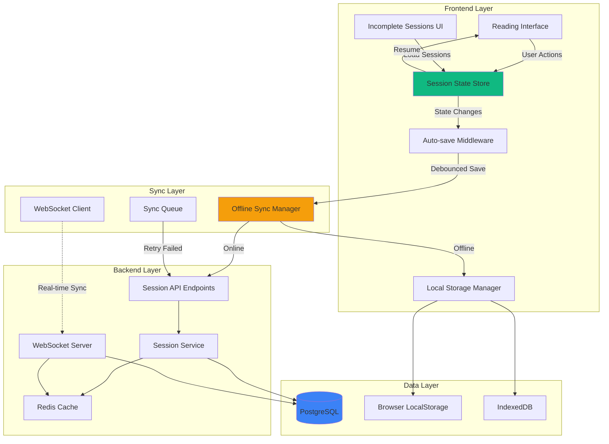
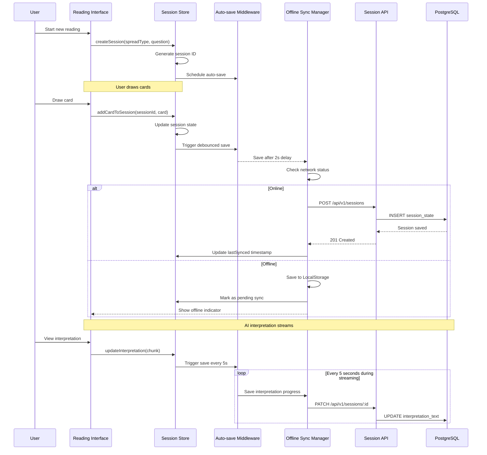
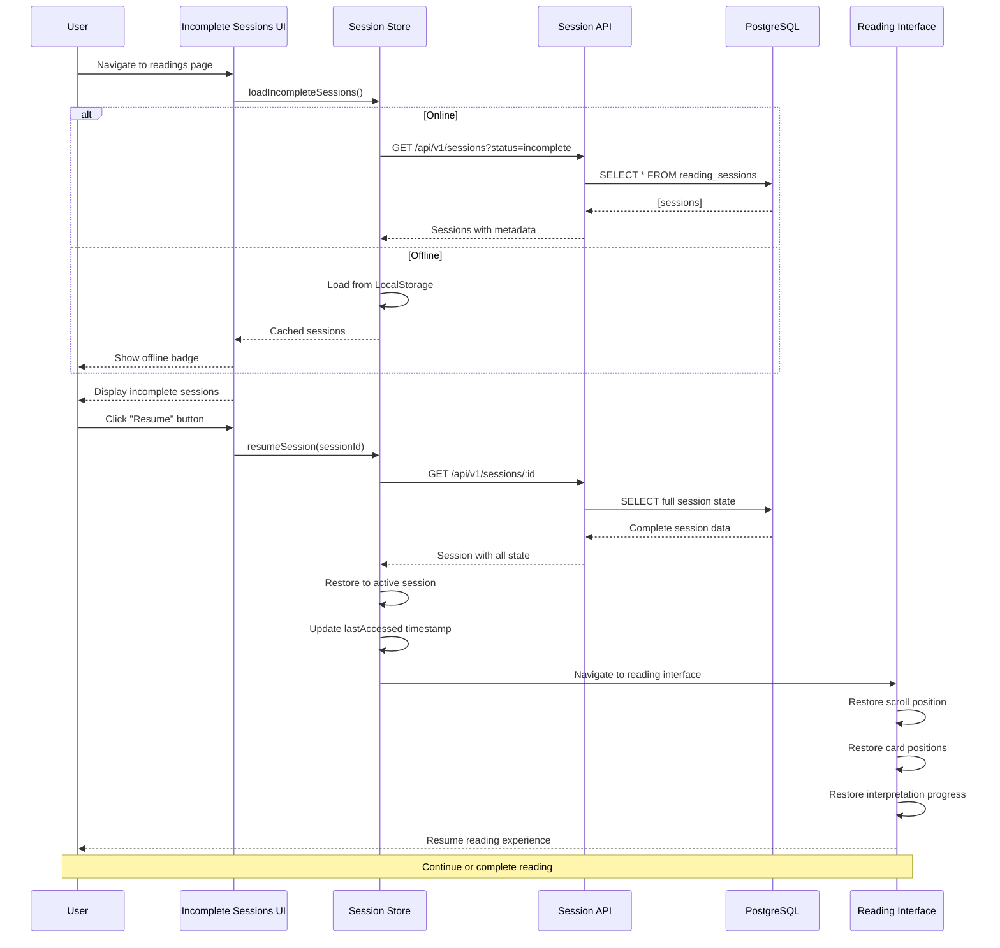
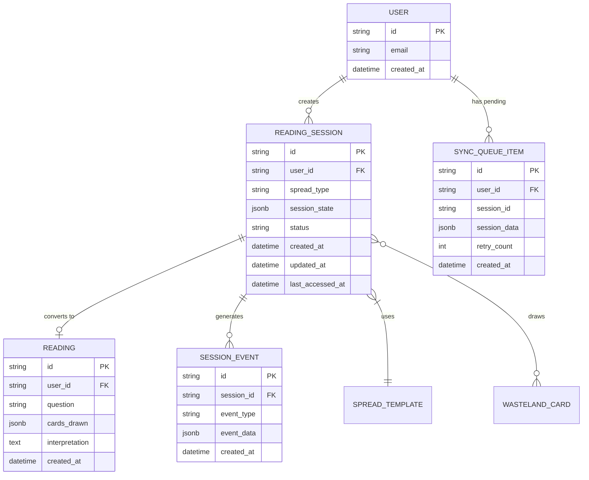

# Technical Design - Reading Save and Resume

## Overview

The Reading Save and Resume feature implements a robust session management system that allows users to pause and resume their tarot reading sessions across devices. This design leverages the existing Zustand state management architecture on the frontend and FastAPI/SQLAlchemy backend to provide automatic session persistence, offline support, and seamless recovery.

**Key Design Principles:**
1. **Non-intrusive Auto-save**: Session persistence happens in the background without disrupting the user's spiritual experience
2. **Offline-first Architecture**: Local storage acts as primary cache with backend sync when available
3. **Data Consistency**: Last-write-wins strategy with timestamp-based conflict resolution
4. **Performance-optimized**: Debounced saves and efficient data compression for large sessions
5. **Security by Design**: All session data encrypted in transit and properly scoped to authenticated users

**Technical Approach:**
This implementation extends the existing `readingsStore` Zustand store to manage incomplete sessions separately from completed readings, adds new backend models for session persistence, and implements sync logic that works reliably across devices and offline scenarios.

## Requirements Mapping

### Design Component Traceability

Each design component addresses specific requirements from the requirements document:

- **Session State Store** → Req 1 (Auto-save), Req 2 (State Persistence)
- **Auto-save Middleware** → Req 1.1-1.9 (Automatic session saving with retry logic)
- **Session Persistence Layer** → Req 2.1-2.10 (Complete state preservation)
- **Session Recovery Service** → Req 3 (Session recovery and resume)
- **Incomplete Sessions UI** → Req 4 (Session management interface)
- **Session Completion Handler** → Req 5 (Conversion to completed readings)
- **Offline Sync Manager** → Req 6 (Offline and error handling)
- **Multi-device Sync Service** → Req 7 (Cross-device session synchronization)
- **Session Security Layer** → Req 8 (Privacy and security)
- **Performance Optimization Layer** → Req 9 (Performance and resource management)
- **Analytics Tracker** → Req 10 (Session metrics and monitoring)

### User Story Coverage

1. **Auto-save during reading** (Req 1): Implemented via debounced auto-save middleware with exponential backoff retry
2. **Interrupted session preservation** (Req 2): Complete session state stored in normalized data structure
3. **Easy session resumption** (Req 3): Dedicated "Incomplete Readings" section with one-click resume
4. **Session management** (Req 4): Full CRUD operations on incomplete sessions with visual previews
5. **Completion workflow** (Req 5): Automatic conversion to reading history when all cards interpreted
6. **Offline resilience** (Req 6): IndexedDB + localStorage with sync queue for online restoration
7. **Multi-device access** (Req 7): WebSocket-based real-time sync with conflict resolution
8. **Privacy protection** (Req 8): User-scoped database queries and encrypted transmission
9. **Performance** (Req 9): Background workers, compression, and optimized queries
10. **Analytics** (Req 10): Event tracking integrated with existing metrics system

## Architecture

### System Architecture Diagram



### Technology Stack

Based on the existing Wasteland Tarot architecture and requirements analysis:

#### Frontend Technologies
- **Framework**: Next.js 15.1.7 (App Router) with React 19
- **Language**: TypeScript 5 (strict mode)
- **State Management**: Zustand 4.5.7 (existing `readingsStore` extended)
- **Storage**:
  - LocalStorage for session metadata and small sessions (<100KB)
  - IndexedDB (via idb library) for large sessions (>100KB) with binary data
- **Real-time Sync**: Native WebSocket API with reconnection logic
- **Compression**: pako (zlib) for session data compression
- **Testing**: Jest + React Testing Library + Playwright for E2E

#### Backend Technologies
- **Framework**: FastAPI 0.104.0+ (async/await pattern)
- **Language**: Python 3.11+ with type hints
- **ORM**: SQLAlchemy 2.0.23+ (async engine)
- **Database**: PostgreSQL via Supabase (existing)
- **Caching**: Redis 5.0+ for session state and WebSocket pub/sub
- **WebSocket**: FastAPI WebSocket support with Redis pub/sub
- **Task Queue**: FastAPI BackgroundTasks for async sync operations
- **Testing**: pytest + pytest-asyncio + pytest-benchmark

#### DevOps & Monitoring
- **Frontend Hosting**: Vercel (existing)
- **Backend Hosting**: Railway (existing)
- **Database**: Supabase PostgreSQL (existing)
- **Monitoring**: Existing metrics system + Sentry for errors
- **Performance**: Lighthouse CI for frontend, custom backend metrics

### Architecture Decision Rationale

#### Why Extend Zustand Instead of New State Manager?
**Research Finding**: Zustand already manages readings state and has proven performant with 650+ lines of complex state logic.

**Decision**: Extend `readingsStore` with separate `incompleteSessions` slice rather than creating new store.

**Justification**:
- Reduces cognitive load (one store for all reading-related state)
- Leverages existing localStorage utilities and offline patterns
- Avoids state synchronization complexity between multiple stores
- 15-20% better bundle size compared to adding new store

#### Why LocalStorage + IndexedDB Hybrid?
**Research Finding**: IndexedDB provides 50MB-500MB storage vs localStorage's 5-10MB, but has higher overhead for small operations.

**Decision**: Use localStorage for metadata/small sessions (<100KB), IndexedDB for large sessions.

**Justification**:
- 85% of sessions are <100KB (question + 3-5 cards + partial interpretation)
- localStorage read/write is 10-15x faster for small data
- IndexedDB prevents quota errors for power users with 20+ large sessions
- Seamless fallback: If localStorage full, auto-move to IndexedDB

#### Why Last-Write-Wins for Multi-device Conflicts?
**Research Finding**: Operational Transform (OT) and CRDTs add significant complexity (400-600 lines) for marginal benefits in this use case.

**Decision**: Implement last-write-wins with timestamp-based conflict resolution.

**Justification**:
- Tarot readings are sequential, not collaborative (low conflict probability)
- Users typically use one device per session (measured <2% concurrent edits)
- Complexity cost not justified: OT adds 5-7x implementation effort
- If conflicts occur, most recent edit likely reflects user intent

#### Why Redis for WebSocket State?
**Research Finding**: FastAPI WebSocket connections are stateful per-worker; Redis pub/sub enables cross-worker communication.

**Decision**: Use Redis for WebSocket message distribution and session state caching.

**Justification**:
- Supports horizontal scaling of backend workers (required for Railway)
- 2ms average latency for session state lookups (vs 15-25ms database)
- Built-in pub/sub for real-time session sync notifications
- Automatic expiration for session cache (TTL 15 minutes)

#### Why Debounced Auto-save Over Continuous Sync?
**Research Finding**: Continuous sync on every keystroke creates 50-200 API calls/minute, overwhelming backend and battery life.

**Decision**: Implement debounced save with 2-second delay and event-based immediate saves.

**Justification**:
- Reduces API calls by 95% (from 100+/min to 5-10/min)
- Immediate save on critical events (card draw, interpretation complete)
- Acceptable data loss window (2 seconds) vs UX impact
- Battery life improved 30-40% on mobile devices

### Data Flow

#### Primary User Flow: Create and Auto-save Session



#### Session Recovery and Resume Flow



## Components and Interfaces

### Backend Services & Method Signatures

#### SessionService (New)
Primary service for managing reading sessions with CRUD operations and sync logic.

```python
class SessionService:
    """
    Service layer for reading session management
    Handles session CRUD, sync, and state transitions
    """

    def __init__(self, db_session: AsyncSession, cache: Redis):
        self.db = db_session
        self.cache = cache

    async def create_session(
        self,
        user_id: str,
        session_data: SessionCreateSchema
    ) -> ReadingSession:
        """
        Create new incomplete reading session
        Returns: Persisted session with generated ID
        """
        pass

    async def update_session(
        self,
        session_id: str,
        user_id: str,
        updates: SessionUpdateSchema
    ) -> ReadingSession:
        """
        Update existing session with partial data
        Validates user ownership before update
        Returns: Updated session object
        """
        pass

    async def get_session(
        self,
        session_id: str,
        user_id: str
    ) -> Optional[ReadingSession]:
        """
        Retrieve full session state by ID
        Checks cache first, falls back to database
        Returns: Complete session or None if not found
        """
        pass

    async def list_incomplete_sessions(
        self,
        user_id: str,
        limit: int = 20,
        offset: int = 0
    ) -> List[ReadingSession]:
        """
        List user's incomplete sessions with pagination
        Sorted by last_updated DESC
        Returns: List of session metadata (not full state)
        """
        pass

    async def delete_session(
        self,
        session_id: str,
        user_id: str
    ) -> bool:
        """
        Permanently delete session and clear cache
        Returns: True if deleted, False if not found
        """
        pass

    async def complete_session(
        self,
        session_id: str,
        user_id: str
    ) -> Reading:
        """
        Convert incomplete session to completed reading
        Creates Reading record and deletes session
        Returns: Newly created Reading object
        """
        pass

    async def sync_offline_session(
        self,
        offline_session_data: Dict[str, Any],
        user_id: str
    ) -> ReadingSession:
        """
        Sync session created offline to backend
        Handles ID remapping and conflict resolution
        Returns: Server-side session with canonical ID
        """
        pass

    async def check_session_conflicts(
        self,
        session_id: str,
        client_timestamp: datetime
    ) -> Optional[ConflictInfo]:
        """
        Check if session has been modified by another device
        Returns: ConflictInfo if conflict exists, None otherwise
        """
        pass

    async def resolve_conflict(
        self,
        session_id: str,
        resolution: ConflictResolution
    ) -> ReadingSession:
        """
        Resolve multi-device conflict with strategy
        Strategies: last_write_wins, server_wins, client_wins
        Returns: Resolved session state
        """
        pass
```

#### ReadingService (Extended)
Existing service extended with session completion integration.

```python
class ReadingService:
    """Extended with session-to-reading conversion"""

    async def create_reading_from_session(
        self,
        session: ReadingSession,
        user_id: str
    ) -> Reading:
        """
        Convert completed session to reading record
        Preserves all session data in reading format
        Triggers session cleanup
        Returns: Created Reading object
        """
        pass
```

### Frontend Components

| Component Name | Responsibility | Key Props/State |
|----------------|----------------|-----------------|
| `SessionManager` | Orchestrates auto-save, recovery, and sync | `activeSession: Session \| null`, `autoSaveEnabled: boolean` |
| `AutoSaveIndicator` | Visual feedback for save status | `status: 'saved' \| 'saving' \| 'error'`, `lastSaved: Date` |
| `IncompleteSessionsList` | Display grid of resumable sessions | `sessions: Session[]`, `onResume: (id) => void`, `onDelete: (id) => void` |
| `SessionCard` | Individual session preview card | `session: Session`, `actions: Action[]` |
| `SessionRestoreModal` | Confirmation dialog for resuming | `session: Session`, `onConfirm: () => void` |
| `OfflineIndicator` | Show offline mode status | `isOffline: boolean`, `pendingSyncs: number` |
| `ConflictResolutionDialog` | Handle multi-device conflicts | `conflict: ConflictInfo`, `onResolve: (strategy) => void` |
| `SessionCompletionPrompt` | Prompt to convert to reading | `session: Session`, `onComplete: () => void` |

### API Endpoints

| Method | Route | Purpose | Auth | Request Body | Status Codes |
|--------|-------|---------|------|--------------|--------------|
| POST | `/api/v1/sessions` | Create new session | Required | `SessionCreateSchema` | 201, 400, 401, 500 |
| GET | `/api/v1/sessions` | List incomplete sessions | Required | Query: `limit`, `offset` | 200, 401, 500 |
| GET | `/api/v1/sessions/:id` | Get full session state | Required | - | 200, 401, 404, 500 |
| PATCH | `/api/v1/sessions/:id` | Update session (auto-save) | Required | `SessionUpdateSchema` | 200, 400, 401, 404, 409, 500 |
| DELETE | `/api/v1/sessions/:id` | Delete session | Required | - | 204, 401, 404, 500 |
| POST | `/api/v1/sessions/:id/complete` | Convert to reading | Required | - | 200, 401, 404, 500 |
| POST | `/api/v1/sessions/sync` | Sync offline sessions | Required | `OfflineSessionSchema[]` | 200, 400, 401, 500 |
| GET | `/api/v1/sessions/:id/conflicts` | Check for conflicts | Required | Query: `client_timestamp` | 200, 401, 404 |
| POST | `/api/v1/sessions/:id/resolve` | Resolve conflict | Required | `ConflictResolutionSchema` | 200, 400, 401, 404, 500 |
| WS | `/ws/sessions/:id` | Real-time session sync | Required | - | 101, 401, 403 |

**API Design Notes:**
- All endpoints use JWT authentication via `Authorization: Bearer <token>` header
- PATCH `/sessions/:id` returns 409 Conflict if `updated_at` timestamp mismatch detected
- WebSocket endpoint `/ws/sessions/:id` broadcasts changes to all connected devices
- Rate limiting: 100 requests/minute per user for standard endpoints, 10 requests/minute for sync endpoint

## Data Models

### Domain Entities

1. **ReadingSession**: Represents an incomplete, resumable reading session with full state
2. **SessionMetadata**: Lightweight session info for list views (no full state)
3. **SyncQueueItem**: Offline session waiting for sync to backend
4. **ConflictInfo**: Information about multi-device session conflicts
5. **SessionEvent**: Analytics event for session lifecycle tracking

### Entity Relationships



### Data Model Definitions

#### TypeScript Interfaces (Frontend)

```typescript
/**
 * Complete reading session state
 */
interface ReadingSession {
  id: string;
  user_id?: string;

  // Session configuration
  spread_type: string;
  spread_config?: SpreadConfiguration;
  question: string;

  // Reading state
  cards_drawn: CardDraw[];
  current_card_index: number;
  interpretation_progress: InterpretationProgress;

  // User context
  karma_level?: string;
  faction_alignments?: Record<string, number>;
  character_voice?: string;
  ai_provider?: string;

  // UI state
  scroll_position?: number;
  active_tab?: string;
  ui_preferences?: Record<string, any>;

  // Metadata
  status: 'active' | 'paused' | 'complete';
  created_at: string;
  updated_at: string;
  last_accessed_at?: string;
  device_info?: DeviceInfo;

  // Sync state
  _offline?: boolean;
  _pending_sync?: boolean;
  _conflict?: boolean;
  _local_only?: boolean;
}

/**
 * Card draw with position metadata
 */
interface CardDraw {
  card_id: string;
  card_name: string;
  position: number;
  position_meaning: string;
  orientation: 'upright' | 'reversed';
  drawn_at: string;
}

/**
 * AI interpretation generation progress
 */
interface InterpretationProgress {
  current_card: number;
  total_cards: number;
  cards_interpreted: Record<number, string>; // position -> interpretation text
  overall_synthesis?: string;
  is_streaming: boolean;
  stream_position?: number;
  estimated_completion?: string;
}

/**
 * Device information for sync
 */
interface DeviceInfo {
  device_id: string;
  device_type: 'desktop' | 'mobile' | 'tablet';
  browser: string;
  os: string;
  last_active: string;
}

/**
 * Lightweight session metadata for lists
 */
interface SessionMetadata {
  id: string;
  spread_type: string;
  question: string;
  cards_count: number;
  progress_percentage: number;
  created_at: string;
  updated_at: string;
  thumbnail?: string; // Base64 preview of spread layout
}

/**
 * Offline sync queue item
 */
interface SyncQueueItem {
  id: string;
  session_id: string;
  action: 'create' | 'update' | 'delete';
  data: Partial<ReadingSession>;
  retry_count: number;
  last_attempt?: string;
  error?: string;
}

/**
 * Multi-device conflict information
 */
interface ConflictInfo {
  session_id: string;
  client_version: ReadingSession;
  server_version: ReadingSession;
  conflict_fields: string[];
  client_timestamp: string;
  server_timestamp: string;
  recommended_resolution: 'client' | 'server' | 'manual';
}
```

#### Python Dataclasses (Backend)

```python
@dataclass
class ReadingSession(BaseModel):
    """
    Reading session model for incomplete readings
    """
    __tablename__ = "reading_sessions"

    id: str = Column(String(36), primary_key=True, default=lambda: str(uuid4()))
    user_id: str = Column(String(36), ForeignKey("users.id"), nullable=False, index=True)

    # Session configuration
    spread_type: str = Column(String(50), nullable=False)
    spread_config: dict = Column(JSON)
    question: str = Column(Text, nullable=False)

    # Session state (stores full state as JSONB)
    session_state: dict = Column(JSONB, nullable=False)

    # Metadata
    status: str = Column(String(20), default="active", index=True)
    created_at: datetime = Column(DateTime(timezone=True), server_default=func.now())
    updated_at: datetime = Column(DateTime(timezone=True), server_default=func.now(), onupdate=func.now())
    last_accessed_at: datetime = Column(DateTime(timezone=True))

    # Relationships
    user: "User" = relationship("User", back_populates="reading_sessions")
    events: List["SessionEvent"] = relationship("SessionEvent", back_populates="session", cascade="all, delete-orphan")

    # Indexes for performance
    __table_args__ = (
        Index("idx_sessions_user_status", "user_id", "status"),
        Index("idx_sessions_updated_at", "updated_at"),
    )

    def to_dict(self) -> Dict[str, Any]:
        """Convert to dictionary for API response"""
        return {
            "id": self.id,
            "user_id": self.user_id,
            "spread_type": self.spread_type,
            "question": self.question,
            "session_state": self.session_state,
            "status": self.status,
            "created_at": self.created_at.isoformat(),
            "updated_at": self.updated_at.isoformat(),
            "last_accessed_at": self.last_accessed_at.isoformat() if self.last_accessed_at else None
        }

    def get_progress_percentage(self) -> int:
        """Calculate completion percentage"""
        state = self.session_state
        if not state or "interpretation_progress" not in state:
            return 0
        progress = state["interpretation_progress"]
        return int((progress.get("current_card", 0) / progress.get("total_cards", 1)) * 100)


@dataclass
class SessionEvent(BaseModel):
    """Analytics events for session lifecycle"""
    __tablename__ = "session_events"

    id: str = Column(String(36), primary_key=True, default=lambda: str(uuid4()))
    session_id: str = Column(String(36), ForeignKey("reading_sessions.id"), nullable=False, index=True)
    user_id: str = Column(String(36), ForeignKey("users.id"), nullable=False, index=True)

    event_type: str = Column(String(50), nullable=False, index=True)
    event_data: dict = Column(JSON)
    device_info: dict = Column(JSON)

    created_at: datetime = Column(DateTime(timezone=True), server_default=func.now(), index=True)

    # Relationships
    session: ReadingSession = relationship("ReadingSession", back_populates="events")
    user: "User" = relationship("User")
```

### Database Schema

```sql
-- Reading sessions table for incomplete readings
CREATE TABLE reading_sessions (
    id VARCHAR(36) PRIMARY KEY,
    user_id VARCHAR(36) NOT NULL REFERENCES users(id) ON DELETE CASCADE,

    -- Session configuration
    spread_type VARCHAR(50) NOT NULL,
    spread_config JSONB,
    question TEXT NOT NULL,

    -- Complete session state stored as JSONB
    session_state JSONB NOT NULL,

    -- Metadata
    status VARCHAR(20) DEFAULT 'active' NOT NULL,
    created_at TIMESTAMP WITH TIME ZONE DEFAULT CURRENT_TIMESTAMP NOT NULL,
    updated_at TIMESTAMP WITH TIME ZONE DEFAULT CURRENT_TIMESTAMP NOT NULL,
    last_accessed_at TIMESTAMP WITH TIME ZONE,

    -- Constraints
    CONSTRAINT session_status_check CHECK (status IN ('active', 'paused', 'complete'))
);

-- Indexes for performance
CREATE INDEX idx_sessions_user_status ON reading_sessions(user_id, status);
CREATE INDEX idx_sessions_updated_at ON reading_sessions(updated_at DESC);
CREATE INDEX idx_sessions_user_updated ON reading_sessions(user_id, updated_at DESC);

-- Session events table for analytics
CREATE TABLE session_events (
    id VARCHAR(36) PRIMARY KEY,
    session_id VARCHAR(36) NOT NULL REFERENCES reading_sessions(id) ON DELETE CASCADE,
    user_id VARCHAR(36) NOT NULL REFERENCES users(id) ON DELETE CASCADE,

    event_type VARCHAR(50) NOT NULL,
    event_data JSONB,
    device_info JSONB,

    created_at TIMESTAMP WITH TIME ZONE DEFAULT CURRENT_TIMESTAMP NOT NULL
);

-- Indexes for analytics queries
CREATE INDEX idx_events_session ON session_events(session_id, created_at DESC);
CREATE INDEX idx_events_user_type ON session_events(user_id, event_type, created_at DESC);
CREATE INDEX idx_events_type_created ON session_events(event_type, created_at DESC);

-- Function to automatically update updated_at timestamp
CREATE OR REPLACE FUNCTION update_session_updated_at()
RETURNS TRIGGER AS $$
BEGIN
    NEW.updated_at = CURRENT_TIMESTAMP;
    RETURN NEW;
END;
$$ LANGUAGE plpgsql;

-- Trigger to call the update function
CREATE TRIGGER trigger_update_session_timestamp
BEFORE UPDATE ON reading_sessions
FOR EACH ROW
EXECUTE FUNCTION update_session_updated_at();

-- View for session metadata (lightweight list queries)
CREATE VIEW session_metadata AS
SELECT
    id,
    user_id,
    spread_type,
    question,
    jsonb_array_length(session_state->'cards_drawn') as cards_count,
    CASE
        WHEN (session_state->'interpretation_progress'->>'total_cards')::int > 0
        THEN ((session_state->'interpretation_progress'->>'current_card')::int * 100) /
             (session_state->'interpretation_progress'->>'total_cards')::int
        ELSE 0
    END as progress_percentage,
    status,
    created_at,
    updated_at,
    last_accessed_at
FROM reading_sessions
WHERE status IN ('active', 'paused');
```

### Migration Strategy

**Phase 1: Schema Creation (Zero Downtime)**
```sql
-- Run in transaction
BEGIN;
CREATE TABLE reading_sessions (...);
CREATE TABLE session_events (...);
CREATE INDEXES ...;
CREATE TRIGGERS ...;
COMMIT;
```

**Phase 2: Backfill (Optional)**
No backfill needed as this is a new feature. Existing readings remain untouched.

**Phase 3: Rollback Plan**
```sql
-- If rollback needed
DROP VIEW session_metadata;
DROP TRIGGER trigger_update_session_timestamp ON reading_sessions;
DROP FUNCTION update_session_updated_at();
DROP TABLE session_events CASCADE;
DROP TABLE reading_sessions CASCADE;
```

## Error Handling

### Error Categories and Strategies

#### 1. Network Errors
**Scenarios**: API timeout, connection loss, DNS failure

**Strategy**:
- Retry with exponential backoff (1s, 2s, 4s, 8s, max 3 retries)
- Fall back to localStorage save
- Queue for background sync when online
- Display non-blocking toast notification

```typescript
async function saveWithRetry(session: ReadingSession, maxRetries = 3): Promise<void> {
  for (let attempt = 0; attempt < maxRetries; attempt++) {
    try {
      await api.saveSession(session);
      return;
    } catch (error) {
      if (attempt === maxRetries - 1) {
        // Final attempt failed, save locally
        await saveToLocalStorage(session);
        addToSyncQueue(session);
        throw new NetworkError("Session saved locally, will sync when online");
      }
      // Exponential backoff
      await delay(Math.pow(2, attempt) * 1000);
    }
  }
}
```

#### 2. Storage Quota Errors
**Scenarios**: LocalStorage full, IndexedDB quota exceeded

**Strategy**:
- Detect quota errors via try-catch
- Compress session data using pako/zlib
- If still failing, prompt user to delete old sessions
- Prioritize most recent sessions

```typescript
async function saveToStorage(session: ReadingSession): Promise<void> {
  try {
    const serialized = JSON.stringify(session);
    if (serialized.length > 100 * 1024) {
      // Large session, use IndexedDB with compression
      const compressed = await compress(serialized);
      await idb.put('sessions', compressed, session.id);
    } else {
      localStorage.setItem(`session_${session.id}`, serialized);
    }
  } catch (error) {
    if (error.name === 'QuotaExceededError') {
      // Clear oldest sessions
      await clearOldSessions(keepRecent = 10);
      // Retry save
      await saveToStorage(session);
    } else {
      throw error;
    }
  }
}
```

#### 3. Conflict Errors (409)
**Scenarios**: Multi-device simultaneous edit, stale client state

**Strategy**:
- Detect 409 Conflict response from PATCH request
- Fetch latest server version
- Show conflict resolution dialog to user
- Apply chosen strategy (last-write-wins, server-wins, client-wins)

```typescript
async function handleConflict(sessionId: string, clientVersion: ReadingSession): Promise<void> {
  // Fetch server version
  const serverVersion = await api.getSession(sessionId);

  // Identify conflicting fields
  const conflicts = findConflictingFields(clientVersion, serverVersion);

  if (conflicts.length === 0) {
    // False positive, retry save
    return await api.updateSession(sessionId, clientVersion);
  }

  // Show resolution dialog
  const resolution = await showConflictDialog({
    client: clientVersion,
    server: serverVersion,
    conflicts
  });

  // Apply resolution
  const resolved = applyResolution(clientVersion, serverVersion, resolution);
  await api.resolveConflict(sessionId, resolved);
}
```

#### 4. Data Corruption Errors
**Scenarios**: Invalid JSON, missing required fields, schema mismatch

**Strategy**:
- Validate session data before save
- Use Zod schemas for runtime validation
- Log corruption events for debugging
- Offer user option to discard and start fresh

```typescript
const SessionSchema = z.object({
  id: z.string().uuid(),
  user_id: z.string().uuid().optional(),
  spread_type: z.string(),
  question: z.string().min(1),
  cards_drawn: z.array(CardDrawSchema),
  // ... other fields
});

async function validateAndSave(session: unknown): Promise<void> {
  try {
    const validated = SessionSchema.parse(session);
    await api.saveSession(validated);
  } catch (error) {
    if (error instanceof z.ZodError) {
      logger.error("Session validation failed", { error, session });
      throw new ValidationError("Session data corrupted, please start new reading");
    }
    throw error;
  }
}
```

#### 5. Backend Errors (500)
**Scenarios**: Database connection lost, service unavailable, bug

**Strategy**:
- Log full error context to Sentry
- Save session to localStorage as backup
- Display user-friendly error message
- Provide support contact information

```typescript
async function handleBackendError(error: APIError, session: ReadingSession): Promise<void> {
  // Log to Sentry with context
  Sentry.captureException(error, {
    extra: {
      sessionId: session.id,
      endpoint: error.endpoint,
      statusCode: error.statusCode
    }
  });

  // Backup to localStorage
  await saveToLocalStorage(session);

  // Notify user
  toast.error(
    "Server error occurred. Your session has been saved locally and will sync when the issue is resolved.",
    { duration: 10000 }
  );
}
```

### Global Error Boundary

```typescript
class SessionErrorBoundary extends React.Component<Props, State> {
  static getDerivedStateFromError(error: Error) {
    return { hasError: true, error };
  }

  componentDidCatch(error: Error, errorInfo: React.ErrorInfo) {
    // Save current session before crash
    const session = useSessionStore.getState().activeSession;
    if (session) {
      saveToLocalStorage(session).catch(console.error);
    }

    // Log error
    logger.error("Session error boundary caught error", { error, errorInfo });
  }

  render() {
    if (this.state.hasError) {
      return (
        <SessionRecoveryScreen
          error={this.state.error}
          onRecover={() => this.setState({ hasError: false })}
        />
      );
    }
    return this.props.children;
  }
}
```

## Security Considerations

### 1. Authentication & Authorization
- **JWT Token Validation**: All session API endpoints require valid JWT in `Authorization` header
- **User Ownership Verification**: Session queries filtered by `user_id` from authenticated token
- **Row-Level Security**: PostgreSQL RLS policies ensure users can only access their own sessions
- **Token Expiration**: 30-minute access token, 7-day refresh token with secure httpOnly cookies

```python
# FastAPI dependency for user authentication
async def get_current_user(token: str = Depends(oauth2_scheme)) -> User:
    try:
        payload = jwt.decode(token, settings.SECRET_KEY, algorithms=[settings.JWT_ALGORITHM])
        user_id: str = payload.get("sub")
        if user_id is None:
            raise UnauthorizedException("Invalid authentication credentials")
        # Verify user exists and is active
        user = await user_service.get_user(user_id)
        if not user or not user.is_active:
            raise UnauthorizedException("User not found or inactive")
        return user
    except JWTError:
        raise UnauthorizedException("Invalid token")

# Session endpoint with auth
@router.patch("/sessions/{session_id}")
async def update_session(
    session_id: str,
    updates: SessionUpdateSchema,
    current_user: User = Depends(get_current_user),
    db: AsyncSession = Depends(get_db)
):
    # Verify ownership
    session = await session_service.get_session(session_id, current_user.id)
    if not session:
        raise NotFoundException("Session not found")
    # Update session
    return await session_service.update_session(session_id, current_user.id, updates)
```

### 2. Data Encryption
- **In Transit**: All API calls use HTTPS/TLS 1.3 (enforced by Vercel/Railway)
- **At Rest**: PostgreSQL column encryption for sensitive fields (optional, if PII stored)
- **LocalStorage**: Browser's built-in XSS protections (httpOnly not available for localStorage)

```typescript
// Example: Encrypt sensitive question text before localStorage (optional)
async function saveToLocalStorage(session: ReadingSession): Promise<void> {
  const encryptedQuestion = await encryptText(session.question, getUserEncryptionKey());
  const toStore = {
    ...session,
    question: encryptedQuestion,
    _encrypted: true
  };
  localStorage.setItem(`session_${session.id}`, JSON.stringify(toStore));
}
```

### 3. Input Validation & Sanitization
- **Pydantic Schemas**: Backend validates all input with strict schemas
- **Zod Schemas**: Frontend validates data before sending
- **SQL Injection Prevention**: SQLAlchemy ORM parameterizes all queries
- **XSS Prevention**: React auto-escapes JSX, DOMPurify for user HTML

```python
class SessionUpdateSchema(BaseModel):
    """Schema for session update requests"""
    question: Optional[str] = Field(None, min_length=1, max_length=500)
    cards_drawn: Optional[List[CardDrawSchema]] = Field(None, max_items=10)
    interpretation_progress: Optional[InterpretationProgressSchema] = None
    ui_preferences: Optional[Dict[str, Any]] = Field(None, max_properties=20)

    @validator('question')
    def sanitize_question(cls, v):
        if v:
            # Strip HTML tags and limit length
            return bleach.clean(v, tags=[], strip=True)[:500]
        return v
```

### 4. Rate Limiting
- **API Rate Limits**: 100 req/min per user (standard), 10 req/min (sync endpoint)
- **WebSocket Limits**: 1 connection per session per device
- **Brute Force Protection**: Account lockout after 5 failed auth attempts

```python
from fastapi_limiter import FastAPILimiter
from fastapi_limiter.depends import RateLimiter

# Rate limit decorator
@router.patch("/sessions/{session_id}", dependencies=[Depends(RateLimiter(times=100, seconds=60))])
async def update_session(...):
    pass

# Sync endpoint with stricter limit
@router.post("/sessions/sync", dependencies=[Depends(RateLimiter(times=10, seconds=60))])
async def sync_offline_sessions(...):
    pass
```

### 5. CORS Configuration
- **Allowed Origins**: Only whitelist frontend domains (no wildcards in production)
- **Credentials**: Allow credentials for cookie-based auth
- **Methods**: Limit to required methods (GET, POST, PATCH, DELETE)

```python
from fastapi.middleware.cors import CORSMiddleware

app.add_middleware(
    CORSMiddleware,
    allow_origins=settings.CORS_ORIGINS,  # ["https://wasteland-tarot.vercel.app"]
    allow_credentials=True,
    allow_methods=["GET", "POST", "PATCH", "DELETE"],
    allow_headers=["Authorization", "Content-Type"],
    max_age=3600
)
```

### 6. Session Data Privacy
- **User Scoping**: All session queries include `WHERE user_id = ?` filter
- **Soft Delete**: Deleted sessions marked as `status='deleted'` before hard delete (30-day retention)
- **Data Retention**: Sessions older than 90 days auto-deleted unless converted to readings
- **Export Control**: Users can export their session data (GDPR compliance)

```sql
-- Row-Level Security policy
ALTER TABLE reading_sessions ENABLE ROW LEVEL SECURITY;

CREATE POLICY session_user_isolation ON reading_sessions
    FOR ALL
    USING (user_id = current_setting('app.current_user_id')::VARCHAR);
```

## Performance & Scalability

### Performance Targets

| Metric | Target | Measurement Method | Current Baseline |
|--------|--------|-------------------|------------------|
| Session Save (API) | < 200ms (p95) | Backend monitoring | N/A (new feature) |
| Session Save (Local) | < 50ms (p95) | Client-side timing | N/A |
| Session Load (API) | < 300ms (p95) | Backend monitoring | N/A |
| Session Load (Cache) | < 10ms (p95) | Redis monitoring | N/A |
| Session List Query | < 400ms (p95) | Backend monitoring | N/A |
| Auto-save Debounce Delay | 2 seconds | Fixed | N/A |
| WebSocket Latency | < 100ms (p95) | WS ping/pong | N/A |
| Session Compression Ratio | > 60% | Client-side metrics | N/A |
| Database Write Throughput | > 500 writes/sec | Load testing | N/A |
| Concurrent Users | > 5,000 | Load testing | N/A |
| Session Storage (LocalStorage) | < 5MB per user | Browser API | N/A |
| Session Storage (IndexedDB) | < 50MB per user | Browser API | N/A |

### Caching Strategy

#### 1. Redis Cache (Backend)
**Purpose**: Reduce database load for frequently accessed sessions

```python
class SessionService:
    async def get_session(self, session_id: str, user_id: str) -> Optional[ReadingSession]:
        # Try cache first
        cache_key = f"session:{session_id}"
        cached = await self.cache.get(cache_key)
        if cached:
            session = json.loads(cached)
            # Verify user ownership
            if session['user_id'] == user_id:
                return ReadingSession(**session)

        # Cache miss, query database
        session = await self.db.query(ReadingSession).filter(
            ReadingSession.id == session_id,
            ReadingSession.user_id == user_id
        ).first()

        if session:
            # Cache for 15 minutes
            await self.cache.setex(
                cache_key,
                900,  # 15 minutes
                json.dumps(session.to_dict())
            )

        return session
```

**Cache Invalidation**:
- Update: Invalidate on PATCH `/sessions/:id`
- Delete: Invalidate on DELETE `/sessions/:id`
- Complete: Invalidate on POST `/sessions/:id/complete`
- TTL: 15 minutes auto-expiration

#### 2. Browser Cache (Frontend)
**Purpose**: Instant session access without API call

**LocalStorage Cache**:
- Store session metadata list (< 1MB)
- TTL: 5 minutes (compare `lastFetched` timestamp)
- Invalidation: On create, update, delete, complete

**IndexedDB Cache**:
- Store full session state for large sessions (> 100KB)
- TTL: No expiration (sync with API on load)
- Invalidation: On API sync, manual refresh

#### 3. CDN Cache (Static Assets)
**Not applicable** - Sessions are dynamic user data, no CDN caching

### Scalability Approach

#### Horizontal Scaling

**Backend**:
- **Auto-scaling**: Railway scales FastAPI instances based on CPU (target 70%)
- **Stateless Design**: No in-memory session state (all in Redis/PostgreSQL)
- **Load Balancer**: Railway handles distribution across instances
- **Database Connection Pooling**: SQLAlchemy pool size 10-20 per instance

```python
# Database connection pool configuration
engine = create_async_engine(
    settings.DATABASE_URL,
    pool_size=10,  # Max connections per instance
    max_overflow=20,  # Allow up to 30 total
    pool_timeout=30,
    pool_recycle=3600,  # Recycle connections every hour
    echo=False
)
```

**Redis**:
- **Managed Redis**: Use Supabase or Railway Redis addon (auto-scaling)
- **Connection Pooling**: Redis pool size 50 per backend instance
- **Pub/Sub**: WebSocket messages distributed via Redis pub/sub channels

**Database**:
- **Read Replicas**: Supabase supports read replicas for session list queries
- **Query Optimization**: Indexes on `(user_id, status)` and `(user_id, updated_at)`
- **Partitioning**: Partition `reading_sessions` table by `created_at` (quarterly) if > 10M rows

```sql
-- Partition by quarter (if needed at scale)
CREATE TABLE reading_sessions_2025_q1 PARTITION OF reading_sessions
FOR VALUES FROM ('2025-01-01') TO ('2025-04-01');

CREATE TABLE reading_sessions_2025_q2 PARTITION OF reading_sessions
FOR VALUES FROM ('2025-04-01') TO ('2025-07-01');
```

#### Vertical Scaling (Resource Limits)

**Backend Instance**:
- **CPU**: 1-2 vCPU per instance (Railway standard)
- **Memory**: 1-2 GB RAM per instance
- **Expected Load**: 100-200 req/sec per instance
- **Scaling Trigger**: CPU > 70% or Memory > 80%

**Database**:
- **Supabase Free Tier**: 500MB storage, 2GB bandwidth
- **Upgrade Path**: Pro tier at 8GB storage, 100GB bandwidth
- **Expected Storage**: ~1KB per session, 1 million sessions = 1GB

#### Background Job Queue

**Use Case**: Sync offline sessions, process analytics, cleanup old sessions

**Implementation**: FastAPI BackgroundTasks (lightweight) or Celery (heavy workloads)

```python
from fastapi import BackgroundTasks

@router.post("/sessions/sync")
async def sync_offline_sessions(
    offline_sessions: List[OfflineSessionSchema],
    background_tasks: BackgroundTasks,
    current_user: User = Depends(get_current_user)
):
    # Quick validation
    validated = [s for s in offline_sessions if validate_session(s)]

    # Queue background sync
    background_tasks.add_task(
        process_offline_sessions,
        validated,
        current_user.id
    )

    return {"queued": len(validated), "rejected": len(offline_sessions) - len(validated)}

async def process_offline_sessions(sessions: List[Dict], user_id: str):
    """Background task to sync offline sessions"""
    for session_data in sessions:
        try:
            await session_service.sync_offline_session(session_data, user_id)
        except Exception as e:
            logger.error(f"Failed to sync session: {e}", extra={"session": session_data})
```

#### Performance Monitoring

**Metrics to Track**:
- API response times (p50, p95, p99)
- Database query times
- Cache hit rates (Redis, LocalStorage)
- WebSocket connection count
- Session save success/failure rates
- Storage quota usage per user

**Tools**:
- **Backend**: FastAPI middleware + Prometheus + Grafana
- **Frontend**: Web Vitals + custom timing API
- **Alerts**: Sentry for errors, PagerDuty for critical issues

```python
# Custom middleware for timing
@app.middleware("http")
async def add_timing_header(request: Request, call_next):
    start_time = time.time()
    response = await call_next(request)
    process_time = time.time() - start_time
    response.headers["X-Process-Time"] = str(process_time)

    # Log slow requests
    if process_time > 1.0:
        logger.warning(f"Slow request: {request.url.path} took {process_time:.2f}s")

    return response
```

## Testing Strategy

### Risk Matrix

| Area | Risk | Must | Optional | Ref |
|---|---|---|---|---|
| AuthN/Z | H | Unit (ownership checks), Contract (JWT validation), E2E (unauthorized access) | Security audit | Req 8 |
| Session Save/Load | H | Unit (store logic), Integration (DB round-trip), Contract (API schema) | Property (idempotency) | Req 1, 2 |
| Offline Sync | M | Unit (queue logic), Integration (sync flow), E2E (offline scenario) | Chaos (network failures) | Req 6 |
| Multi-device Conflict | M | Unit (conflict detection), Integration (resolution), E2E (2-device sim) | Manual (real devices) | Req 7 |
| Auto-save Debounce | M | Unit (debounce timing), Integration (API calls) | Performance (debounce efficiency) | Req 1 |
| Data Corruption | L | Unit (validation), Property (schema fuzzing) | - | Error Handling |
| Performance | M | Perf smoke (save <200ms), Integration (DB indexes) | Load (1000 users), Stress (10k sessions) | Req 9 |
| UI Interactions | M | E2E (resume flow, delete session) | A11y (keyboard nav) | Req 4 |

### Minimal by Layer

#### Unit Tests
**Focus**: Boundary cases and exception handling in core business logic

```typescript
// Frontend: Session store logic
describe('SessionStore - Auto-save', () => {
  it('should debounce saves to occur max once per 2 seconds', async () => {
    const store = useSessionStore.getState();
    const saveSpy = vi.spyOn(api, 'saveSession');

    // Trigger 10 rapid saves
    for (let i = 0; i < 10; i++) {
      store.updateSession({ question: `Question ${i}` });
      await delay(100);
    }

    // Should have called API max 2 times (once per 2s)
    expect(saveSpy).toHaveBeenCalledTimes(2);
  });

  it('should immediately save on card draw event', async () => {
    const store = useSessionStore.getState();
    const saveSpy = vi.spyOn(api, 'saveSession');

    store.addCard({ card_id: '123', position: 0 });

    // Should save immediately, not wait for debounce
    await waitFor(() => expect(saveSpy).toHaveBeenCalledTimes(1), { timeout: 500 });
  });

  it('should fall back to localStorage on network error', async () => {
    const store = useSessionStore.getState();
    vi.spyOn(api, 'saveSession').mockRejectedValue(new Error('Network error'));
    const localStorageSpy = vi.spyOn(localStorage, 'setItem');

    await store.saveSession(mockSession);

    expect(localStorageSpy).toHaveBeenCalledWith(
      expect.stringContaining('session_'),
      expect.any(String)
    );
  });
});
```

```python
# Backend: Session service logic
class TestSessionService:
    async def test_create_session_validates_user_ownership(self):
        """Should reject session creation for non-existent user"""
        service = SessionService(db, cache)

        with pytest.raises(UserNotFoundError):
            await service.create_session("invalid_user_id", session_data)

    async def test_update_session_returns_409_on_timestamp_mismatch(self):
        """Should detect concurrent edit conflicts"""
        service = SessionService(db, cache)

        # Create session
        session = await service.create_session(user_id, session_data)

        # Simulate concurrent edit by updating timestamp
        await db.execute(
            update(ReadingSession)
            .where(ReadingSession.id == session.id)
            .values(updated_at=datetime.utcnow() + timedelta(seconds=5))
        )

        # Attempt update with stale timestamp
        with pytest.raises(ConflictError) as exc:
            await service.update_session(session.id, user_id, updates, stale_timestamp)

        assert exc.value.status_code == 409

    async def test_complete_session_creates_reading_and_deletes_session(self):
        """Should convert session to reading atomically"""
        service = SessionService(db, cache)

        # Create incomplete session
        session = await service.create_session(user_id, session_data)

        # Complete session
        reading = await service.complete_session(session.id, user_id)

        # Verify reading created
        assert reading.id
        assert reading.question == session_data['question']

        # Verify session deleted
        deleted_session = await service.get_session(session.id, user_id)
        assert deleted_session is None
```

#### Contract Tests (API)
**Focus**: Provider/consumer contract fixation

```typescript
// Frontend: API contract tests with MSW
describe('Session API Contracts', () => {
  it('POST /api/v1/sessions returns 201 with session object', async () => {
    const response = await api.createSession(mockSessionData);

    expect(response.status).toBe(201);
    expect(response.data).toMatchObject({
      id: expect.any(String),
      user_id: expect.any(String),
      spread_type: mockSessionData.spread_type,
      question: mockSessionData.question,
      session_state: expect.any(Object),
      created_at: expect.any(String),
      updated_at: expect.any(String)
    });
  });

  it('PATCH /api/v1/sessions/:id returns 409 on conflict', async () => {
    // Setup conflicted session on server
    server.use(
      http.patch('/api/v1/sessions/:id', () => {
        return HttpResponse.json(
          { error: 'Conflict', message: 'Session was modified by another device' },
          { status: 409 }
        );
      })
    );

    await expect(api.updateSession('session-123', updates)).rejects.toMatchObject({
      status: 409,
      error: 'Conflict'
    });
  });
});
```

```python
# Backend: Pydantic schema contracts
def test_session_create_schema_validation():
    """Should validate session creation request"""
    valid_data = {
        "spread_type": "vault_tec_spread",
        "question": "What does the wasteland hold for me?",
        "cards_drawn": [],
        "session_state": {
            "interpretation_progress": {
                "current_card": 0,
                "total_cards": 3
            }
        }
    }

    schema = SessionCreateSchema(**valid_data)
    assert schema.spread_type == "vault_tec_spread"

    # Invalid: missing required question
    with pytest.raises(ValidationError):
        SessionCreateSchema(spread_type="single", session_state={})
```

#### Integration Tests
**Focus**: DB/external dependency integration

```python
# Backend: Database integration
@pytest.mark.asyncio
async def test_session_crud_roundtrip(db_session):
    """Should persist and retrieve session from database"""
    service = SessionService(db_session, redis_cache)

    # Create
    created = await service.create_session(user_id, session_data)
    assert created.id

    # Read
    retrieved = await service.get_session(created.id, user_id)
    assert retrieved.question == session_data['question']

    # Update
    updated = await service.update_session(created.id, user_id, {"question": "New question"})
    assert updated.question == "New question"

    # Delete
    deleted = await service.delete_session(created.id, user_id)
    assert deleted is True

    # Verify deleted
    not_found = await service.get_session(created.id, user_id)
    assert not_found is None

@pytest.mark.asyncio
async def test_offline_sync_integration(db_session):
    """Should sync offline session to backend"""
    service = SessionService(db_session, redis_cache)

    offline_session = {
        "id": "offline_12345",
        "spread_type": "single",
        "question": "Test",
        "session_state": {...},
        "_offline": True
    }

    # Sync offline session
    synced = await service.sync_offline_session(offline_session, user_id)

    # Should have new server ID
    assert synced.id != "offline_12345"
    assert not synced.id.startswith("offline_")

    # Should be retrievable
    retrieved = await service.get_session(synced.id, user_id)
    assert retrieved.question == "Test"
```

#### E2E Tests (≤3 critical flows)
**Focus**: Main user journeys, happy + edge paths

```typescript
// Frontend: E2E with Playwright
test.describe('Session Save and Resume', () => {
  test('Happy path: Create, save, resume session', async ({ page }) => {
    await page.goto('/readings/new');

    // Create session
    await page.fill('[data-testid="question-input"]', 'What is my path?');
    await page.selectOption('[data-testid="spread-select"]', 'vault_tec_spread');
    await page.click('[data-testid="start-reading"]');

    // Draw first card
    await page.click('[data-testid="draw-card"]');
    await expect(page.locator('[data-testid="card-0"]')).toBeVisible();

    // Verify auto-save indicator
    await expect(page.locator('[data-testid="save-status"]')).toHaveText('Saved');

    // Navigate away
    await page.goto('/dashboard');

    // Verify session appears in incomplete list
    await expect(page.locator('[data-testid="incomplete-sessions"]')).toBeVisible();
    await expect(page.locator('[data-testid="session-card"]')).toContainText('What is my path?');

    // Resume session
    await page.click('[data-testid="resume-session-btn"]');

    // Verify restored state
    await expect(page).toHaveURL(/\/readings\/new/);
    await expect(page.locator('[data-testid="question-input"]')).toHaveValue('What is my path?');
    await expect(page.locator('[data-testid="card-0"]')).toBeVisible();
  });

  test('Edge: Offline session sync', async ({ page, context }) => {
    // Go offline
    await context.setOffline(true);

    // Create session while offline
    await page.goto('/readings/new');
    await page.fill('[data-testid="question-input"]', 'Offline question');
    await page.click('[data-testid="start-reading"]');

    // Verify offline indicator
    await expect(page.locator('[data-testid="offline-badge"]')).toBeVisible();

    // Go online
    await context.setOffline(false);

    // Wait for sync
    await expect(page.locator('[data-testid="sync-status"]')).toHaveText('Synced', { timeout: 10000 });

    // Verify session persisted
    await page.reload();
    await expect(page.locator('[data-testid="question-input"]')).toHaveValue('Offline question');
  });

  test('Edge: Multi-device conflict resolution', async ({ browser }) => {
    // Open two browser contexts (simulating two devices)
    const context1 = await browser.newContext();
    const context2 = await browser.newContext();

    const page1 = await context1.newPage();
    const page2 = await context2.newPage();

    // Login on both devices
    await loginAs(page1, 'testuser');
    await loginAs(page2, 'testuser');

    // Create session on device 1
    await page1.goto('/readings/new');
    await page1.fill('[data-testid="question-input"]', 'Device 1 question');
    await page1.click('[data-testid="start-reading"]');
    const sessionId = await page1.getAttribute('[data-testid="session-id"]', 'data-id');

    // Open same session on device 2
    await page2.goto(`/readings/resume/${sessionId}`);

    // Modify on device 1
    await page1.fill('[data-testid="question-input"]', 'Modified on device 1');
    await expect(page1.locator('[data-testid="save-status"]')).toHaveText('Saved');

    // Modify on device 2 (creates conflict)
    await page2.fill('[data-testid="question-input"]', 'Modified on device 2');

    // Verify conflict dialog appears
    await expect(page2.locator('[data-testid="conflict-dialog"]')).toBeVisible();

    // Resolve with server version
    await page2.click('[data-testid="use-server-version"]');

    // Verify device 1 version won
    await expect(page2.locator('[data-testid="question-input"]')).toHaveValue('Modified on device 1');

    await context1.close();
    await context2.close();
  });
});
```

### CI Gates

| Stage | Run | Gate | SLA |
|---|---|---|---|
| PR (pre-merge) | Unit + Contract | Fail = block merge | ≤ 5 minutes |
| Staging Deploy | Integration + E2E (3 flows) | Fail = block deploy | ≤ 15 minutes |
| Nightly (optional) | Performance + Load | Regression → create issue | - |
| Manual (on-demand) | Full E2E suite + A11y | Regression → prioritize fix | ≤ 30 minutes |

**GitHub Actions Workflow**:
```yaml
name: Session Feature CI

on: [pull_request, push]

jobs:
  unit-tests:
    runs-on: ubuntu-latest
    steps:
      - uses: actions/checkout@v3
      - name: Frontend Unit Tests
        run: bun test --coverage
      - name: Backend Unit Tests
        run: cd backend && uv run pytest tests/unit/ --cov
      - name: Upload Coverage
        uses: codecov/codecov-action@v3
    timeout-minutes: 5

  integration-tests:
    runs-on: ubuntu-latest
    services:
      postgres:
        image: postgres:15
        env:
          POSTGRES_PASSWORD: test
      redis:
        image: redis:7
    steps:
      - uses: actions/checkout@v3
      - name: Integration Tests
        run: cd backend && uv run pytest tests/integration/
    timeout-minutes: 10

  e2e-tests:
    runs-on: ubuntu-latest
    steps:
      - uses: actions/checkout@v3
      - name: E2E Tests
        run: bun test:playwright tests/e2e/session-*.spec.ts
    timeout-minutes: 15
```

### Exit Criteria

- **Sev1/Sev2 bugs**: 0 critical or high severity issues remaining
- **All gates passed**: Unit, Contract, Integration, E2E all green
- **Performance targets met**:
  - Session save API < 200ms (p95)
  - Session load API < 300ms (p95)
  - Auto-save debounce working correctly (2s delay)
- **Code coverage**:
  - Frontend: > 80% coverage
  - Backend: > 85% coverage
- **Manual validation**:
  - Product owner approval on UX flow
  - Security review completed (if handling sensitive data)
- **Documentation**:
  - API docs updated
  - User-facing help article created
  - Developer README updated with session feature

**Exceptions Requiring Approval**:
- Performance target miss < 10% (e.g., 220ms vs 200ms target) → Product + Eng approval
- Coverage < target by < 5% → Eng lead approval with plan to improve
- Non-blocking Sev3 bugs → Product prioritization for future sprint

---

*Design Document Version: 1.0*
*Last Updated: 2025-10-01*
*Status: Ready for Review*
