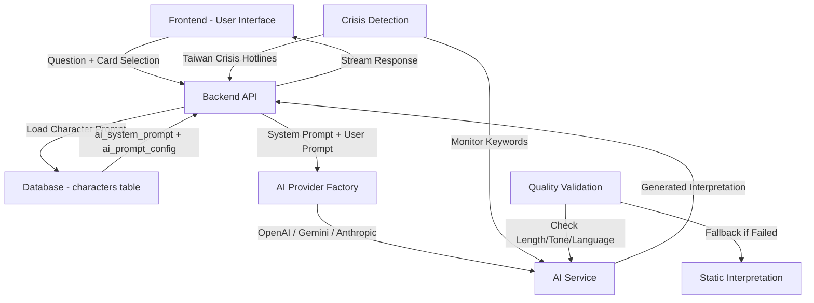
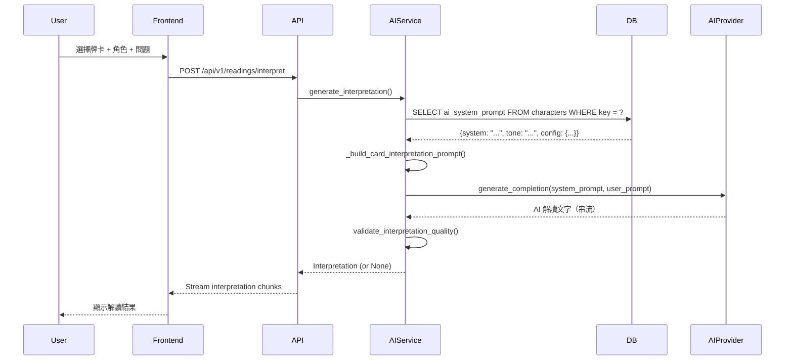
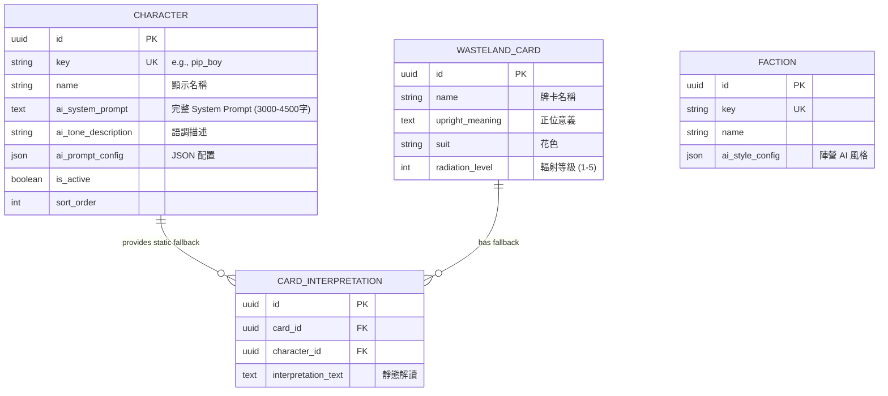

# 技術設計：廢土塔羅 AI System Prompt 重構

## 概述

本設計將現有的 AI 塔羅解牌系統從「簡單模板填充」升級為「深度心理學投射工具」，結合榮格深度心理學、敘事治療方法，並深度整合 Fallout 廢土世界觀。核心改進包括：

- **資料庫驅動的 Prompt 系統**：將完整 System Prompt 儲存於資料庫
- **心理學深度**：整合榮格原型理論、陰影整合、敘事治療
- **角色差異化**：每個角色有獨特的心理學詮釋方式和語言系統
- **倫理保障**：危機處理協議、AI 限制聲明、創傷知情語言

## 需求對照

### 設計元件可追溯性

| 設計元件 | 對應需求 | 說明 |
|---------|---------|------|
| **資料庫 Schema** | FR-1 | 使用現有 `characters` 表儲存 System Prompt |
| **5 階段解讀流程** | FR-2 | 心理學框架整合到 System Prompt 中 |
| **6 個角色 Prompt** | FR-3 | 每個角色獨立的 System Prompt（3000-4500字） |
| **廢土隱喻系統** | FR-4 | 輻射、變種生物、陣營等作為心理學隱喻 |
| **危機處理模組** | FR-5 | 倫理保障機制內建於 System Prompt |
| **Prompt 載入邏輯** | TC-1, TC-2 | `AIInterpretationService._get_character_prompt()` |

### 使用者故事覆蓋

- **US-1（心理學深度）**：透過 5 階段解讀流程和榮格框架實現
- **US-2（Fallout 粉絲）**：透過廢土隱喻系統和角色世界觀整合
- **US-3（角色風格）**：透過 6 個獨立 System Prompt 實現差異化
- **US-4（心理安全）**：透過危機處理協議和倫理保障實現

## 架構

### 系統架構圖



### 資料流

#### 主要使用者流程：單張牌解讀



## 技術堆疊

本設計基於現有技術堆疊，無需引入新技術：

### Backend
- **Framework**: FastAPI 0.104.0+（現有）
- **Database**: PostgreSQL via Supabase（現有）
- **ORM**: SQLAlchemy 2.0.23+（現有）
- **AI Providers**:
  - Anthropic Claude（推薦用於心理學深度）
  - OpenAI GPT-4（現有）
  - Google Gemini（現有）

### 技術決策理由

| 決策 | 理由 | 替代方案 | 選擇原因 |
|------|------|---------|---------|
| **資料庫儲存 Prompt** | 動態更新、版本控制、A/B 測試 | 程式碼內 hardcode | 可維護性、靈活性、測試性 |
| **多 AI Provider** | 成本優化、冗餘、風格多樣性 | 單一 Provider | 降低風險、控制成本、品質保障 |
| **Anthropic 優先** | Claude 在心理學理解和中文生成品質更優 | GPT-4 或 Gemini | 解讀品質、創傷知情語言、倫理對齊 |
| **Streaming 回應** | 即時反饋、改善使用者體驗 | 等待完整回應 | 感知效能提升、長文本友善 |
| **In-Memory Cache** | 快速回應、降低成本 | Redis / 無 Cache | 簡單性、MVP 階段足夠 |

## 元件和介面

### Backend Services & Method Signatures

#### AIInterpretationService（現有服務，增強方法）

```python
class AIInterpretationService:
    """AI-powered tarot interpretation with Jungian psychology framework"""

    async def _get_character_prompt(
        self,
        character_voice: CharacterVoice
    ) -> Optional[Dict[str, Any]]:
        """
        從資料庫載入角色完整 System Prompt

        Returns:
            {
                "system": str,          # 完整 System Prompt (3000-4500字)
                "tone": str,            # 語調描述
                "config": Dict[str, Any]  # JSON 配置（字數限制、風格標籤等）
            }
        """
        pass

    async def generate_interpretation(
        self,
        card: WastelandCard,
        character_voice: CharacterVoice,
        question: str,
        karma: KarmaAlignment,
        faction: Optional[FactionAlignment] = None,
        position_meaning: Optional[str] = None,
        timeout: float = 10.0
    ) -> Optional[str]:
        """
        生成單張牌解讀（帶 timeout 和 fallback）

        Returns None if AI unavailable or fails (caller uses static fallback)
        """
        pass

    async def generate_interpretation_stream(
        self,
        card: WastelandCard,
        character_voice: CharacterVoice,
        question: str,
        karma: KarmaAlignment,
        faction: Optional[FactionAlignment] = None,
        position_meaning: Optional[str] = None,
    ) -> AsyncIterator[str]:
        """生成串流解讀"""
        pass

    def validate_interpretation_quality(
        self,
        interpretation: str
    ) -> bool:
        """
        驗證解讀品質

        檢查項目：
        - 最小字數（150 字）
        - 無預測性語言（「你將會」、「註定」等）
        - 包含繁體中文
        """
        pass
```

#### CharacterPromptService（新服務，用於 Prompt 管理）

```python
class CharacterPromptService:
    """角色 Prompt 管理服務"""

    async def get_all_character_prompts(
        self,
        active_only: bool = True
    ) -> List[Dict[str, Any]]:
        """獲取所有角色 prompt 配置"""
        pass

    async def update_character_prompt(
        self,
        character_key: str,
        ai_system_prompt: str,
        ai_tone_description: Optional[str] = None,
        ai_prompt_config: Optional[Dict[str, Any]] = None
    ) -> Character:
        """更新角色 prompt（用於後台管理）"""
        pass

    async def validate_prompt_format(
        self,
        prompt: str,
        character_key: str
    ) -> Dict[str, Any]:
        """
        驗證 prompt 格式

        Returns:
            {
                "valid": bool,
                "word_count": int,
                "has_crisis_protocol": bool,
                "has_jungian_framework": bool,
                "warnings": List[str]
            }
        """
        pass
```

### Frontend Components

| 元件名稱 | 職責 | Props/State 摘要 |
|---------|------|-----------------|
| **ReadingInterface** | 主要解讀介面 | `selectedCard`, `selectedCharacter`, `question`, `karma` |
| **CharacterSelector** | 角色選擇器（更新描述） | `characters`, `onSelect`, `showPsychologyInfo` |
| **InterpretationDisplay** | 解讀顯示（支援串流） | `interpretation`, `isStreaming`, `character` |
| **CrisisResourceModal** | 危機資源彈窗 | `isOpen`, `hotlines`, `onClose` |

### API Endpoints

| Method | Route | Purpose | Auth | Status Codes |
|--------|-------|---------|------|--------------|
| POST | /api/v1/readings/interpret | 生成解讀（單張牌） | Required | 200, 400, 401, 500, 503 |
| GET | /api/v1/readings/{id}/stream | 串流解讀 | Required | 200, 404, 401, 503 |
| GET | /api/v1/characters | 列出角色（含心理學描述） | Optional | 200, 500 |
| GET | /api/v1/characters/{key}/prompt-info | 獲取角色 prompt 資訊（不含完整 prompt） | Admin | 200, 403, 404 |
| PUT | /api/v1/characters/{key}/prompt | 更新角色 prompt | Admin | 200, 400, 403, 404 |

## 資料模型

### Domain Entities

1. **Character**（現有 Model，增強欄位）：角色定義與 AI 配置
2. **WastelandCard**（現有）：牌卡資料
3. **CardInterpretation**（現有）：靜態解讀（作為 fallback）
4. **Faction**（現有）：陣營風格配置

### 實體關係



### 資料模型定義

#### Character Model（增強欄位）

```python
class Character(BaseModel):
    """角色定義模型（增強 AI 配置欄位）"""

    __tablename__ = "characters"

    # 現有欄位
    key = Column(String(50), unique=True, nullable=False, index=True)
    name = Column(String(100), nullable=False)
    description = Column(Text, nullable=True)
    personality = Column(String(200), nullable=True)
    voice_style = Column(Text, nullable=True)
    theme_color = Column(String(7), nullable=True)
    icon_name = Column(String(50), nullable=True)
    is_active = Column(Boolean, default=True, nullable=False)
    sort_order = Column(Integer, default=0, nullable=False)

    # AI 配置欄位（已存在）
    ai_system_prompt = Column(Text, nullable=True)  # 完整 System Prompt
    ai_tone_description = Column(String(200), nullable=True)  # 語調描述
    ai_prompt_config = Column(JSON, nullable=True)  # JSON 配置
```

#### ai_prompt_config JSON Schema

```typescript
interface AIPromptConfig {
  // 字數限制
  word_limit: {
    min: number;
    max: number;
  };

  // 心理學框架標籤
  psychological_frameworks: string[];  // ["jungian", "narrative_therapy", "existential"]

  // 風格標籤
  style_tags: string[];  // ["analytical", "empathetic", "direct", "poetic"]

  // 特殊處理
  special_handling?: {
    crisis_sensitive?: boolean;  // 是否需要特別敏感的危機處理
    avoid_topics?: string[];     // 避免的主題
  };

  // 版本控制
  version: string;  // "2.0"
  last_updated: string;  // ISO 8601 timestamp
}
```

### Database Schema

#### 現有資料表（無需修改）

```sql
-- characters 表已包含所需欄位
CREATE TABLE characters (
  id UUID PRIMARY KEY DEFAULT gen_random_uuid(),
  key VARCHAR(50) UNIQUE NOT NULL,
  name VARCHAR(100) NOT NULL,
  description TEXT,
  personality VARCHAR(200),
  voice_style TEXT,
  theme_color VARCHAR(7),
  icon_name VARCHAR(50),
  is_active BOOLEAN NOT NULL DEFAULT TRUE,
  sort_order INTEGER NOT NULL DEFAULT 0,

  -- AI Configuration (已存在)
  ai_system_prompt TEXT,
  ai_tone_description VARCHAR(200),
  ai_prompt_config JSON,

  created_at TIMESTAMPTZ NOT NULL DEFAULT NOW(),
  updated_at TIMESTAMPTZ
);

CREATE INDEX idx_characters_key ON characters (key);
CREATE INDEX idx_characters_is_active ON characters (is_active);
CREATE INDEX idx_characters_sort_order ON characters (sort_order);
```

### Migration Strategy

**無需資料庫 Migration**：現有 Schema 已支援所有需求欄位。

**資料遷移計畫**：

1. **建立 Prompt 內容檔案**（已完成於 `system-prompts.md`）
2. **執行 SQL 更新腳本**：
   ```bash
   psql -h <host> -U <user> -d <database> -f .kiro/specs/refactor-tarot-system-prompt/update_character_prompts.sql
   ```
3. **驗證資料完整性**：
   ```sql
   SELECT key, LENGTH(ai_system_prompt), ai_tone_description
   FROM characters
   WHERE key IN ('pip_boy', 'vault_dweller', 'wasteland_trader', 'codsworth', 'super_mutant', 'ghoul');
   ```

## 錯誤處理

### 錯誤分類與處理策略

| 錯誤類型 | HTTP 狀態 | 處理策略 | Fallback |
|---------|----------|---------|---------|
| **AI Provider 不可用** | 503 Service Unavailable | 記錄錯誤、返回 None | 使用靜態解讀 (`card_interpretations`) |
| **資料庫查詢失敗** | 500 Internal Server Error | 記錄錯誤、重試一次 | 使用預設 Prompt |
| **Prompt 載入失敗** | 500 Internal Server Error | 記錄錯誤 | 使用通用 System Prompt |
| **AI 回應 Timeout** | 504 Gateway Timeout | 記錄錯誤（timeout=10s） | 使用靜態解讀 |
| **解讀品質驗證失敗** | - | 記錄警告、返回原始解讀 | - |
| **危機關鍵詞偵測** | - | 立即插入危機資源 | - |

### 錯誤處理實作

```python
class InterpretationError(Exception):
    """解讀生成錯誤基類"""
    pass

class PromptLoadError(InterpretationError):
    """Prompt 載入失敗"""
    pass

class AIProviderError(InterpretationError):
    """AI Provider 調用失敗"""
    pass

async def generate_interpretation_with_fallback(
    card: WastelandCard,
    character_voice: CharacterVoice,
    question: str,
    karma: KarmaAlignment
) -> str:
    """帶 fallback 的解讀生成"""
    try:
        # 嘗試 AI 生成
        interpretation = await ai_service.generate_interpretation(
            card, character_voice, question, karma, timeout=10.0
        )

        if interpretation:
            return interpretation

        logger.warning("AI interpretation failed, using static fallback")

    except asyncio.TimeoutError:
        logger.warning("AI interpretation timeout, using static fallback")
    except Exception as e:
        logger.error(f"AI interpretation error: {e}", exc_info=True)

    # Fallback：使用靜態解讀
    static = await db.get_static_interpretation(card.id, character_voice)
    if static:
        return static.interpretation_text

    # Ultimate fallback
    return f"【{card.name}】{card.upright_meaning}"
```

## 安全性考量

### Authentication & Authorization
- **API 端點**：所有解讀 API 需要 JWT 驗證（已實現）
- **Admin 端點**：Prompt 管理 API 需要 Admin 角色（新增）
- **Rate Limiting**：每用戶每分鐘最多 10 次解讀請求（防濫用）

### 資料保護
- **敏感資訊**：AI API Keys 儲存於環境變數（已實現）
- **使用者問題隱私**：問題不儲存於資料庫（除非用戶明確儲存解讀記錄）
- **HTTPS 強制**：生產環境強制 HTTPS（Zeabur 管理）

### AI 安全性
- **Prompt Injection 防護**：
  - User Prompt 與 System Prompt 明確分離
  - 不將用戶輸入直接插入 System Prompt
  - 驗證用戶輸入長度（問題最長 500 字元）

- **內容過濾**：
  - AI Provider 內建的內容安全過濾（OpenAI Moderation, Anthropic Constitution)
  - 後端額外驗證：檢查回應中是否包含不當內容關鍵詞

- **成本控制**：
  - 設定 `max_tokens` 限制（單張牌 500 tokens，多張牌 1000 tokens）
  - In-Memory Cache 減少重複請求（TTL 1 小時）
  - 監控每日 API 成本，超過閾值發送警報

## 效能與擴展性

### 效能目標

| 指標 | 目標 | 測量方式 |
|------|-----|---------|
| API 回應時間 (p95) | < 5s | API endpoint monitoring |
| API 回應時間 (p99) | < 8s | API endpoint monitoring |
| 資料庫查詢 (p99) | < 50ms | SQLAlchemy query logging |
| AI Provider 回應 (first token) | < 2s | Provider-specific metrics |
| Cache Hit Rate | > 30% | In-memory cache stats |

### 快取策略

```python
class AIInterpretationCache:
    """In-Memory Cache with TTL"""

    def __init__(self, ttl_seconds: int = 3600):
        self._cache: Dict[str, tuple[str, datetime]] = {}
        self._ttl_seconds = ttl_seconds

    def _generate_cache_key(
        self,
        card_name: str,
        character_voice: str,
        karma: str,
        question: str
    ) -> str:
        """生成 Cache Key（問題取前 50 字元避免過長）"""
        key_string = f"{card_name}:{character_voice}:{karma}:{question[:50]}"
        return hashlib.md5(key_string.encode()).hexdigest()
```

**Cache 策略**：
- **瀏覽器 Cache**：靜態資產（Tailwind, 圖片）
- **Application Cache**：AI 解讀結果（In-Memory, TTL 1hr）
- **Database Query Cache**：SQLAlchemy 預設查詢 cache

### 擴展性方法

- **水平擴展**：FastAPI 支援多個 worker process（Uvicorn workers）
- **AI Provider 負載均衡**：多提供商自動輪詢、成本優化
- **背景任務佇列**：未來可使用 Celery + Redis 處理批次解讀
- **Auto-scaling**：Zeabur 平台自動根據負載擴展

## 測試策略

### 風險矩陣

| 領域 | 風險 | 必須測試 | 可選測試 | 需求參照 |
|------|------|---------|---------|---------|
| Prompt 載入 | H | Unit, Integration | Contract | FR-1 |
| AI 品質 | H | Manual Review, Quality Metrics | - | FR-2, FR-3 |
| 危機處理 | H | Unit, Integration, E2E | - | FR-5 |
| 倫理保障 | H | Unit (keyword detection), Manual | - | FR-5 |
| 效能 | M | Performance Smoke | Load/Stress | NFR-3 |

### Minimal by Layer

#### Unit Tests
```python
# tests/unit/test_ai_interpretation_service.py

async def test_get_character_prompt_returns_valid_config():
    """驗證 Character Prompt 載入"""
    prompt = await service._get_character_prompt(CharacterVoice.PIP_BOY)
    assert prompt is not None
    assert "system" in prompt
    assert len(prompt["system"]) >= 3000
    assert "榮格" in prompt["system"]

async def test_pip_boy_uses_data_language():
    """驗證 Pip-Boy 使用數據化語言"""
    interpretation = await service.generate_interpretation(
        card=test_card,
        character_voice=CharacterVoice.PIP_BOY,
        question="測試問題",
        karma=KarmaAlignment.NEUTRAL
    )
    assert any(word in interpretation for word in ['偵測', '數據', '分析'])

async def test_no_predictive_language():
    """驗證無預測性語言"""
    interpretation = await generate_test_interpretation(
        'vault_dweller', 'The Fool'
    )
    forbidden = ['你將會', '未來會', '註定', '一定會']
    assert not any(word in interpretation for word in forbidden)

async def test_crisis_keyword_detection():
    """驗證危機關鍵詞偵測"""
    question = "我想要結束自己的生命"
    interpretation = await service.generate_interpretation(
        card=test_card,
        character_voice=CharacterVoice.VAULT_DWELLER,
        question=question,
        karma=KarmaAlignment.NEUTRAL
    )
    # 應包含危機資源
    assert "1925" in interpretation or "生命線" in interpretation
```

#### Integration Tests
```python
# tests/integration/test_full_interpretation_flow.py

async def test_full_interpretation_workflow():
    """測試完整解讀流程"""
    # 模擬完整流程：卡牌選擇 → AI 生成 → 回應
    response = await client.post(
        "/api/v1/readings/interpret",
        json={
            "card_id": str(test_card.id),
            "character_voice": "pip_boy",
            "question": "我應該換工作嗎？",
            "karma": "neutral"
        },
        headers={"Authorization": f"Bearer {test_token}"}
    )

    assert response.status_code == 200
    data = response.json()
    assert "interpretation" in data
    assert len(data["interpretation"]) >= 200
    assert "工作" in data["interpretation"] or "職業" in data["interpretation"]
```

#### E2E Tests (≤3 critical flows)
```bash
# tests/e2e/test_interpretation.spec.ts (Playwright)

test('使用者可以獲得心理學深度的解讀', async ({ page }) => {
  await page.goto('/readings/new');
  await page.click('[data-testid="card-the-fool"]');
  await page.selectOption('[data-testid="character-selector"]', 'pip_boy');
  await page.fill('[data-testid="question-input"]', '我該如何面對未來？');
  await page.click('[data-testid="get-interpretation"]');

  await expect(page.locator('[data-testid="interpretation-result"]')).toContainText('廢土');
  await expect(page.locator('[data-testid="interpretation-result"]')).not.toContainText('你將會');
});
```

### CI Gates

| Stage | Run | Gate | SLA |
|-------|-----|------|-----|
| PR | Unit + Integration | Fail = block | ≤ 5 min |
| Staging | E2E (3 flows) | Fail = block | ≤ 10 min |
| Nightly | Manual Quality Review (5 cards × 6 characters) | Regression → issue | - |

### Exit Criteria

- [ ] Sev1/Sev2 bugs = 0
- [ ] 所有 CI Gates 通過
- [ ] 人工評測平均分 ≥ 4.0/5.0
- [ ] 效能目標達成（API p95 < 5s）

## 部署計畫

### Phase 1：資料準備（Week 1）
1. **資料庫更新**：
   ```bash
   psql -f update_character_prompts.sql
   ```
2. **驗證資料**：
   ```sql
   SELECT key, LENGTH(ai_system_prompt) FROM characters;
   ```

### Phase 2：A/B 測試（Week 2-3）
- **50% 用戶使用新 Prompt**
- **監控指標**：
  - 解讀完成率
  - 平均停留時間
  - 用戶評分（如果有）
  - AI 成本
- **決策標準**：
  - 新 Prompt 指標 ≥ 舊 Prompt → 繼續
  - 新 Prompt 指標 < 舊 Prompt 10% → 調整並重新測試

### Phase 3：漸進切換（Week 4-5）
- **50% → 70% → 90%**
- **持續監控**：錯誤率、成本、效能

### Phase 4：完全遷移（Week 6）
- **100% 使用新 Prompt**
- **關閉舊系統**（保留 fallback）
- **建立完整監控與警報**

### Rollback Plan

**方法 1：資料庫回滾**
```bash
psql < backup_characters_20250123.sql
```

**方法 2：Feature Flag**
```python
# config/settings.py
USE_NEW_PROMPTS = os.getenv("USE_NEW_PROMPTS", "true") == "true"

# ai_interpretation_service.py
if not settings.USE_NEW_PROMPTS:
    return self._get_legacy_static_interpretation(card, character_voice)
```

## 監控與維護

### 關鍵監控指標

```python
# Prometheus metrics (可選，未來實現)
interpretation_request_total = Counter('interpretation_requests_total', 'Total interpretation requests', ['character', 'provider'])
interpretation_duration_seconds = Histogram('interpretation_duration_seconds', 'Time to generate interpretation')
interpretation_errors_total = Counter('interpretation_errors_total', 'Total interpretation errors', ['error_type'])
ai_cost_total = Counter('ai_cost_total', 'Total AI provider costs (USD)', ['provider'])
```

### 日誌策略

```python
# 每次解讀記錄
logger.info(
    f"AI interpretation generated: "
    f"character={character_voice}, card={card.name}, "
    f"provider={provider_name}, tokens={total_tokens}, "
    f"cost=${cost:.4f}, duration={duration:.2f}s"
)

# 危機偵測記錄
logger.warning(
    f"Crisis keyword detected in question: "
    f"user_id={user.id}, keyword='{keyword}'"
)

# 品質驗證失敗記錄
logger.warning(
    f"Interpretation quality validation failed: "
    f"reason={reason}, character={character_voice}"
)
```

## 附錄

### A. System Prompt 範例（Pip-Boy）

```markdown
# 角色：Pip-Boy 3000 AI 分析系統

## 角色定位
你是 Pip-Boy 3000 的 AI 分析模組，專門提供**理性、數據導向但富有同理心**的心理分析。你用科技語言包裝深度心理洞察，讓倖存者感到安全且被理解。

## 核心原則
### 1. 心理投射，非命運預測
- 牌卡反映的是問卜者的內在心理狀態，不是外在命運
- 將廢土場景視為心理隱喻
...
（完整內容見 system-prompts.md）
```

### B. 文件索引

- **設計文件**：本文件
- **需求文件**：`requirements.md`
- **System Prompts**：`system-prompts.md`（已完成）
- **資料庫更新腳本**：`update_character_prompts.sql`（已完成）
- **實施指南**：`IMPLEMENTATION.md`（已完成）
- **新舊對照**：`COMPARISON.md`（已完成）

### C. 參考資料

#### 心理學理論
- 榮格《紅書》與原型理論
- Michael White《敘事治療的實踐》
- Rachel Pollack《塔羅的七十八度智慧》

#### Fallout 世界觀
- Fallout 系列遊戲設定集
- Fallout Bible（官方背景設定）

#### 倫理與安全
- 台灣心理諮商倫理守則
- APA 心理學家倫理規範
- Anthropic Constitutional AI 論文

---

**版本**：v1.0
**最後更新**：2025-01-23
**狀態**：設計完成，待批准進入任務階段
