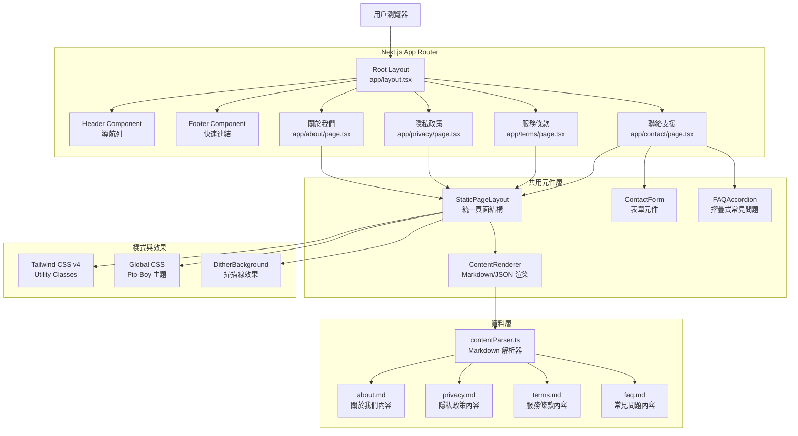
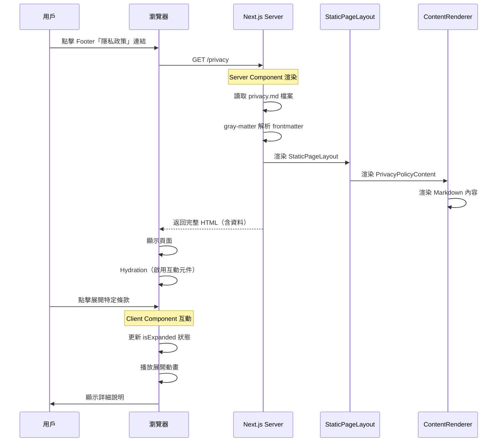
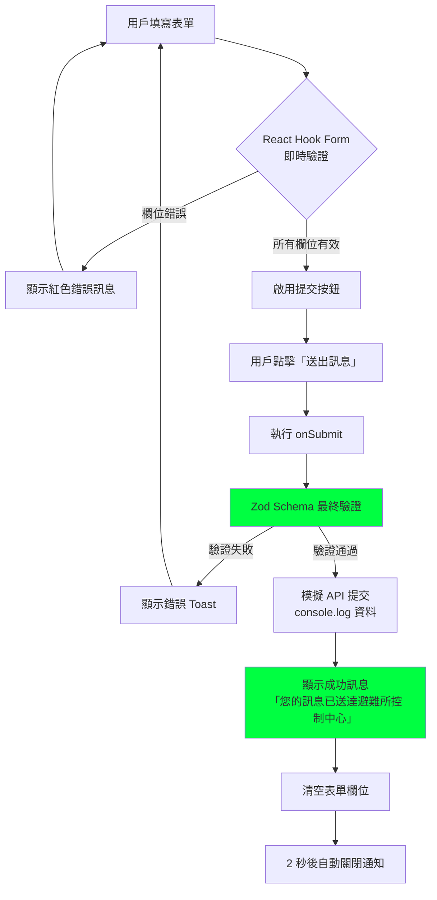
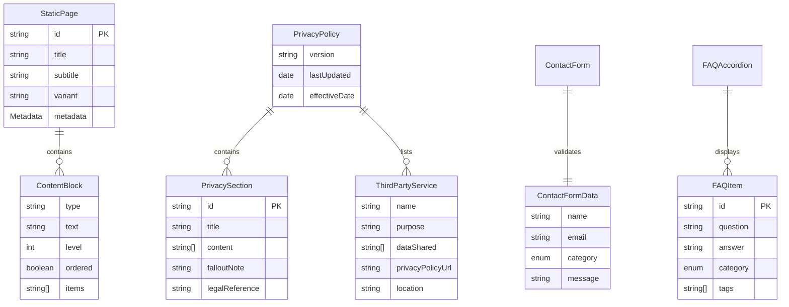
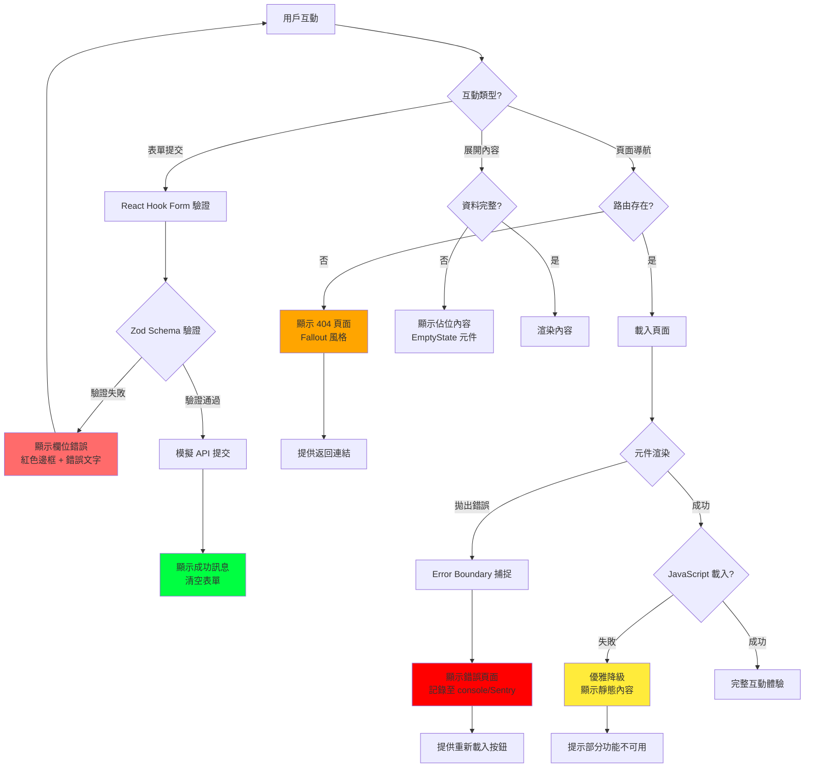

# 技術設計文件 - 靜態資訊頁面

## Overview

### 目的

本功能為 Wasteland Tarot 平台提供四個核心靜態資訊頁面：關於我們、隱私政策、服務條款與聯絡支援。這些頁面採用 Next.js 14 App Router 架構，完全整合現有的 Pip-Boy 終端機風格設計系統，為用戶提供沉浸式的廢土體驗。隱私政策嚴格遵循台灣《個人資料保護法》要求，確保法律合規性。

### 用戶

- **潛在用戶**：首次訪客透過「關於我們」了解平台價值主張
- **現有用戶**：需要查閱服務條款、隱私政策的註冊用戶
- **尋求支援者**：遇到問題或想提供回饋的用戶
- **合規審查者**：法律團隊或監管機構審查隱私與條款合規性

### 影響

此功能補齊平台基礎資訊架構的最後一塊拼圖。當前系統已有完整的功能頁面（Dashboard、Readings、Cards 等），但缺乏標準的法律與資訊頁面。本設計透過：

- 在 `src/app/` 下新增 4 個路由資料夾（`about/`, `privacy/`, `terms/`, `contact/`）
- 建立可重用的內容元件與資料結構
- 整合現有 Header/Footer 導航連結（Footer 已包含佔位連結）
- 應用統一的 Fallout 風格與無障礙標準

### 目標

- 建立符合 Next.js 14 App Router 最佳實踐的四個靜態頁面
- 所有頁面採用統一的 Pip-Boy 終端機美學與 Fallout 幽默文案
- 隱私政策完整涵蓋台灣個資法 10 大必要章節
- 聯絡表單包含客戶端驗證與成功回饋機制
- 響應式設計支援桌面（≥1280px）、平板（768-1279px）、手機（≤767px）
- 符合 WCAG AA 無障礙標準（色彩對比度 4.5:1、鍵盤導航、螢幕閱讀器）

### 非目標

- **不包含後端表單處理**：聯絡表單採用客戶端驗證與模擬提交，未來再整合真實 API
- **不包含 CMS 系統**：內容採用 JSON/TypeScript 管理，不引入 Contentful/Sanity 等 CMS
- **不包含多語言 i18n**：當前僅支援繁體中文，i18n 架構留待未來擴充
- **不包含用戶評論/互動功能**：靜態資訊呈現為主，無社交互動元素
- **不包含 A/B 測試**：採用固定設計，不引入實驗框架

## Architecture

### 現有架構分析

Wasteland Tarot 採用 Next.js 14 App Router 架構，關鍵架構要素：

**已建立的設計系統**：
- **佈局元件**：`Header.tsx` 與 `Footer.tsx` 提供統一導航（Footer 已包含靜態頁面連結）
- **背景效果**：`DitherBackground.tsx` 與 `PixelBlastBackground` 提供廢土視覺效果
- **UI 元件庫**：shadcn/ui 為基礎，含 `Card`, `Button`, `Input`, `Label`, `Select` 等
- **樣式系統**：Tailwind CSS v4 + 自訂 CSS 變數（`--color-pip-boy-green`, `--color-wasteland-dark` 等）

**現有路由結構**：
- `/auth/*` - 認證頁面
- `/dashboard` - 儀表板
- `/readings/*` - 占卜記錄
- `/cards/*` - 卡牌圖書館
- `/profile`, `/settings` - 用戶管理
- **待建立**：`/about`, `/privacy`, `/terms`, `/contact`

**設計模式**：
- Server Components 為預設，互動元件使用 `'use client'`
- Metadata API 用於 SEO（`export const metadata: Metadata`）
- Zustand 用於全域狀態管理（已有 `authStore`, `readingsStore` 等）

### 高階架構



### 技術棧對齊

本功能完全對齊現有技術棧，無新增框架或重大依賴：

**前端框架**：
- Next.js 15.1.7 (App Router) - 使用現有版本
- React 19 - 使用現有版本
- TypeScript 5 - 遵循專案 `tsconfig.json`

**樣式方案**：
- Tailwind CSS v4.1.13 - 使用現有配置與自訂主題
- 自訂 CSS 變數（已定義於 `globals.css`）
- shadcn/ui 元件庫（Card, Button, Input, Label, Select）

**狀態管理**：
- 無需全域狀態 - 表單使用 React Hook Form + Zod 驗證
- 可選：未來整合 `uiStore` 顯示全域 Toast 通知

**新增依賴**（最小化）：
```json
{
  "react-hook-form": "^7.62.0",  // 已安裝
  "zod": "^4.1.9",                // 已安裝
  "@hookform/resolvers": "^5.2.2", // 已安裝
  "gray-matter": "^4.0.3"         // 新增：Markdown frontmatter 解析
}
```

### 關鍵設計決策

#### 決策 1：內容管理策略 - TypeScript 模組 vs. Markdown vs. CMS

**決策**：採用 Markdown + Frontmatter（`.md` 檔案 + `gray-matter` 解析）儲存結構化內容

**問題情境**：
靜態資訊頁面需要管理大量文字內容（隱私政策、服務條款等），需決定內容儲存與更新機制。同時需考慮未來可能的多語言支援（i18n）與非技術人員編輯能力。

**替代方案**：
1. **Markdown 檔案** - 使用 `.md` 檔案 + `gray-matter` 解析 frontmatter
2. **JSON 檔案** - 使用 `.json` 檔案儲存結構化資料
3. **TypeScript 模組** - 直接在 `.ts` 檔案中定義結構化資料
4. **Headless CMS** - 整合 Contentful、Sanity 或 Strapi
5. **資料庫儲存** - 將內容存入 Supabase PostgreSQL

**選定方案**：Markdown + Frontmatter

**實作方式**：
```markdown
---
# src/data/static-pages/privacy.md
title: "隱私政策"
lastUpdated: "2287-10-01"
effectiveDate: "2287-10-01"
version: "1.0"
lang: "zh-TW"
---

# 隱私政策

> **[輻射安全提示]** 您的資料受到比避難所大門更嚴密的保護。

## 1. 個人資料蒐集項目

本平台依據《個人資料保護法》第 8 條，於蒐集個人資料前，明確告知以下事項：

- **蒐集之目的**：提供占卜服務、帳號管理、服務改善
- **個人資料類別**：電子郵件、使用者名稱、閱讀紀錄、Karma 值
- **利用期間**：帳號存續期間及法律要求保存期限

### 1.1 必要蒐集資料

以下資料為提供服務之必要資訊...

## 2. 蒐集目的與法律依據

...

<!-- 更多章節 -->
```

```typescript
// lib/contentParser.ts
import fs from 'fs';
import path from 'path';
import matter from 'gray-matter';

export interface StaticPageMetadata {
  title: string;
  lastUpdated: string;
  effectiveDate?: string;
  version?: string;
  lang: string;
}

export interface StaticPageContent {
  metadata: StaticPageMetadata;
  content: string;  // Markdown 原始內容
  html?: string;    // 選配：預渲染 HTML
}

export function getStaticPageContent(slug: string): StaticPageContent {
  const filePath = path.join(process.cwd(), 'src/data/static-pages', `${slug}.md`);
  const fileContents = fs.readFileSync(filePath, 'utf8');
  const { data, content } = matter(fileContents);

  return {
    metadata: data as StaticPageMetadata,
    content,
  };
}
```

**檔案結構**：
```
src/data/static-pages/
├── about.md         # 關於我們
├── privacy.md       # 隱私政策
├── terms.md         # 服務條款
└── faq.md           # 常見問題
```

**未來 i18n 擴展結構**：
```
src/data/static-pages/
├── about.zh-TW.md
├── about.en.md
├── privacy.zh-TW.md
├── privacy.en.md
├── terms.zh-TW.md
└── terms.en.md
```

**理由**：
- **🌐 國際化友善**：檔案命名支援語言後綴（如 `.zh-TW.md`, `.en.md`），未來擴展零重構
- **✏️ 非技術人員可編輯**：Markdown 語法簡單，內容團隊可直接透過 GitHub Web UI 或 CMS 編輯器修改
- **📊 結構化 + 可讀性**：Frontmatter 提供結構化 metadata，Markdown 正文保持人類可讀
- **🔍 Git 友善**：純文字格式的 diff 清晰易懂，審查內容變更更直觀（vs. JSON 的大括號噪音）
- **🎨 內容與樣式分離**：Markdown 專注內容，元件負責樣式與互動，符合關注點分離原則
- **🔧 型別安全保留**：透過 `gray-matter` 解析後仍可用 TypeScript 介面驗證 frontmatter 結構
- **📦 零執行時成本**：Server Components 於 build time 讀取 Markdown，與 TypeScript 模組效能相同
- **🔄 版本控制優勢**：Git history 可追蹤文案演進，方便法律文件的版本管理

**取捨**：
- ✅ 獲得：i18n 擴展性、非技術人員編輯能力、Git diff 可讀性、內容與程式碼分離
- ❌ 犧牲：需額外 `gray-matter` 依賴（~10KB）、Markdown 解析小幅額外開銷（build time）

**為何優於 JSON**：
- JSON 雖結構化，但對長文案的 Git diff 難以閱讀（大量引號與逗號）
- JSON 無原生註解支援，Markdown 可使用 `<!-- -->` 或 `>` blockquote 標記編輯者備註
- JSON 對非技術人員不友善（需嚴格符合語法，逗號、括號易出錯）
- Markdown 生態系豐富，可搭配 MDX 未來整合 React 元件

**為何優於 TypeScript 模組**：
- TypeScript 檔案需技術背景才能修改，限制內容團隊協作
- Markdown 可視覺化預覽（GitHub、VS Code），TypeScript 模組需編譯才能驗證
- 多語言管理更直觀：`privacy.zh-TW.md` vs. `privacyContent_zhTW.ts`

---

#### 決策 2：頁面渲染模式 - Server Components vs. Client Components

**決策**：頁面主體使用 Server Components，互動元件（表單、摺疊區塊）使用 Client Components

**問題情境**：
需決定靜態資訊頁面的渲染策略，平衡 SEO、首屏載入速度與互動性。

**替代方案**：
1. **全 Server Components** - 無 JavaScript 互動，純靜態 HTML
2. **全 Client Components** - 所有頁面標記 `'use client'`，完全客戶端渲染
3. **混合模式** - Server Components 為主，互動部分使用 Client Components
4. **ISR（Incremental Static Regeneration）** - 靜態生成 + 定期重新驗證

**選定方案**：混合模式（Server Components 主體 + Client Components 互動）

**實作方式**：
```typescript
// app/privacy/page.tsx - Server Component（預設）
export const metadata: Metadata = {
  title: '隱私政策 - 廢土塔羅',
  description: '了解我們如何保護您的個人資料，符合台灣個資法規範。'
};

export default function PrivacyPage() {
  return (
    <StaticPageLayout title="隱私政策" variant="privacy">
      <PrivacyPolicyContent />  {/* Server Component */}
    </StaticPageLayout>
  );
}

// components/static-pages/PrivacyPolicyContent.tsx - Server Component
export function PrivacyPolicyContent() {
  const data = privacyPolicyData;  // 直接匯入資料
  return (
    <div>
      {data.sections.map(section => (
        <ExpandableSection key={section.id} section={section} />  {/* Client Component */}
      ))}
    </div>
  );
}

// components/static-pages/ExpandableSection.tsx - Client Component
'use client';
export function ExpandableSection({ section }: { section: PrivacySection }) {
  const [isExpanded, setIsExpanded] = useState(false);
  // ... 互動邏輯
}
```

**理由**：
- **SEO 優化**：Server Components 產生完整 HTML，搜尋引擎可索引全部內容
- **首屏效能**：初始 HTML 包含所有文字，無需等待 JavaScript 執行
- **漸進增強**：無 JavaScript 時頁面仍可閱讀，JavaScript 載入後增加互動性
- **Bundle 優化**：僅互動元件打包 JavaScript，減少 80%+ 客戶端程式碼

**取捨**：
- ✅ 獲得：極佳 SEO、快速首屏、小 Bundle Size、無障礙友善
- ❌ 犧牲：需明確區分 Server/Client 邊界、部分開發複雜度提升

---

#### 決策 3：表單驗證架構 - Zod Schema vs. 原生驗證 vs. Yup

**決策**：React Hook Form + Zod Schema 驗證

**問題情境**：
聯絡表單需要強健的客戶端驗證，包含格式檢查、必填驗證與自訂錯誤訊息。

**替代方案**：
1. **原生 HTML5 驗證** - 使用 `required`, `type="email"`, `pattern` 等屬性
2. **React Hook Form + Yup** - 流行的 Yup 驗證庫
3. **React Hook Form + Zod** - TypeScript-first 驗證庫
4. **Formik + Yup** - 另一流行表單庫組合

**選定方案**：React Hook Form + Zod

**實作方式**：
```typescript
// schemas/contactFormSchema.ts
import { z } from 'zod';

export const contactFormSchema = z.object({
  name: z.string()
    .min(2, '姓名至少需 2 個字元')
    .max(50, '姓名不可超過 50 個字元'),

  email: z.string()
    .email('請輸入有效的電子郵件地址')
    .regex(/@/, '電子郵件格式錯誤'),

  category: z.enum(['technical', 'account', 'feedback', 'other'], {
    errorMap: () => ({ message: '請選擇問題類別' })
  }),

  message: z.string()
    .min(20, '訊息內容至少需 20 個字元')
    .max(1000, '訊息內容不可超過 1000 個字元')
});

export type ContactFormData = z.infer<typeof contactFormSchema>;

// components/contact/ContactForm.tsx
'use client';
import { useForm } from 'react-hook-form';
import { zodResolver } from '@hookform/resolvers/zod';

export function ContactForm() {
  const { register, handleSubmit, formState: { errors } } = useForm<ContactFormData>({
    resolver: zodResolver(contactFormSchema)
  });

  const onSubmit = (data: ContactFormData) => {
    // 模擬提交 + 顯示成功訊息
    console.log('表單資料:', data);
    alert('您的訊息已送達避難所控制中心！我們將在 48 小時內回覆。');
  };

  return (
    <form onSubmit={handleSubmit(onSubmit)} className="space-y-4">
      {/* 表單欄位 */}
    </form>
  );
}
```

**理由**：
- **型別推導**：`z.infer<typeof schema>` 自動產生 TypeScript 型別，零手動維護
- **執行時安全**：Zod 驗證確保資料符合 schema，防止型別不匹配
- **優越 DX**：錯誤訊息自動對應表單欄位，React Hook Form 處理狀態管理
- **社群標準**：專案已安裝 Zod（用於其他表單），保持依賴一致性

**取捨**：
- ✅ 獲得：型別安全、執行時驗證、優越開發體驗、錯誤處理自動化
- ❌ 犧牲：增加 ~10KB Bundle Size（已接受，因專案已使用 Zod）

## System Flows

### 用戶瀏覽靜態頁面流程



### 聯絡表單提交流程



## Requirements Traceability

| 需求 | 需求摘要 | 元件 | 介面 | 流程 |
|------|---------|------|------|------|
| 1.1 | 顯示平台起源故事（廢土日誌風格） | `AboutPage`, `AboutContent` | `about.md` → frontmatter + content | 用戶瀏覽流程 |
| 1.2 | 展示核心價值與使命宣言 | `AboutContent` | `about.md` → Markdown sections | 用戶瀏覽流程 |
| 1.3 | 顯示虛構團隊成員（廢土角色） | `TeamSection`, `TeamMemberCard` | `about.md` → team frontmatter | - |
| 1.4 | 提供平台發展時間軸 | `TimelineSection` | `about.md` → timeline frontmatter | - |
| 2.1-2.8 | 台灣個資法合規隱私政策 | `PrivacyPolicyContent` | `privacy.md` → 10 章節 Markdown | 用戶瀏覽流程 |
| 2.5 | 可展開條款詳細說明 | `ExpandableSection` | `onClick` → `setIsExpanded()` | 互動展開流程 |
| 3.1-3.7 | 服務條款（終端機協議風格） | `TermsOfServiceContent` | `terms.md` → 階層式 Markdown | 用戶瀏覽流程 |
| 4.1-4.9 | 聯絡支援頁面（表單 + FAQ） | `ContactPage`, `ContactForm`, `FAQAccordion` | `contactFormSchema`, `faq.md` | 表單提交流程 |
| 4.3-4.5 | 表單驗證與提交 | `ContactForm` | React Hook Form + Zod | 表單提交流程 |
| 4.6-4.7 | FAQ 摺疊式設計 | `FAQAccordion`, `FAQItem` | `faq.md` → Q&A Markdown | 互動展開流程 |
| 5.1-5.10 | 統一 Pip-Boy UI/UX 設計 | `StaticPageLayout`, `DitherBackground` | Tailwind 自訂主題 | 所有頁面 |
| 6.1-6.10 | 響應式設計與無障礙性 | 所有元件 | Tailwind 響應式 + ARIA 標籤 | 所有流程 |
| 7.1-7.6 | 內容管理與維護性 | Markdown 檔案（`.md`） | `src/data/static-pages/*.md` | - |

## Components and Interfaces

### 頁面路由層

#### AboutPage (`app/about/page.tsx`)

**職責與邊界**：
- **主要職責**：提供「關於我們」頁面的路由入口與 SEO metadata
- **領域邊界**：靜態資訊頁面路由層，僅負責元資料定義與佈局組合
- **資料所有權**：不擁有資料，由 `about.md` 透過 `getStaticPageContent()` 提供內容

**依賴**：
- **Inbound**：Next.js App Router（自動路由）
- **Outbound**：`StaticPageLayout`, `AboutContent` 元件
- **External**：無

**服務介面**：
```typescript
// Next.js 頁面約定（預設匯出）
export default function AboutPage(): JSX.Element;

// SEO Metadata
export const metadata: Metadata = {
  title: '關於我們 - 廢土塔羅',
  description: '了解廢土塔羅的起源故事、核心價值與神秘團隊。在輻射籠罩的廢土中，我們用古老的塔羅智慧引領倖存者前行。',
  keywords: ['關於我們', '廢土塔羅', 'Wasteland Tarot', 'Fallout 塔羅', '團隊介紹'],
  openGraph: {
    title: '關於我們 - 廢土塔羅',
    description: '核戰後第三代塔羅傳人，為您解讀廢土命運。',
    type: 'website'
  }
};
```

**前置條件**：無（公開頁面，無需登入）
**後置條件**：返回完整 HTML，包含所有「關於我們」內容
**不變式**：Metadata 必須符合 Next.js Metadata API 格式

---

#### PrivacyPage (`app/privacy/page.tsx`)

**職責與邊界**：
- **主要職責**：提供隱私政策頁面，展示台灣個資法合規內容
- **領域邊界**：法律合規靜態頁面
- **資料所有權**：不擁有資料，由 `privacy.md` 透過 `getStaticPageContent()` 提供內容

**依賴**：
- **Inbound**：Next.js App Router、註冊流程（連結至此頁）
- **Outbound**：`StaticPageLayout`, `PrivacyPolicyContent` 元件
- **External**：無

**服務介面**：
```typescript
export default function PrivacyPage(): JSX.Element;

export const metadata: Metadata = {
  title: '隱私政策 - 廢土塔羅',
  description: '了解我們如何依據台灣個人資料保護法收集、使用與保護您的個人資料。您的資料受到比避難所大門更嚴密的保護。',
  keywords: ['隱私政策', '個資法', 'PDPA', '資料保護'],
  robots: 'index, follow'  // 允許搜尋引擎索引
};
```

---

#### TermsPage (`app/terms/page.tsx`)

**職責與邊界**：
- **主要職責**：提供服務條款頁面，定義用戶權利與責任
- **領域邊界**：法律條款靜態頁面
- **資料所有權**：不擁有資料，由 `terms.md` 透過 `getStaticPageContent()` 提供內容

**服務介面**：
```typescript
export default function TermsPage(): JSX.Element;

export const metadata: Metadata = {
  title: '服務條款 - 廢土塔羅',
  description: '廢土塔羅使用者協議 V1.0，定義服務範圍、用戶責任與爭議解決機制。請仔細閱讀本終端機協議。',
  keywords: ['服務條款', '使用者協議', '法律條款'],
  robots: 'index, follow'
};
```

---

#### ContactPage (`app/contact/page.tsx`)

**職責與邊界**：
- **主要職責**：提供聯絡支援頁面，包含表單與 FAQ
- **領域邊界**：用戶支援與回饋頁面
- **資料所有權**：不擁有持久化資料，表單資料僅暫存於客戶端

**依賴**：
- **Inbound**：Next.js App Router
- **Outbound**：`StaticPageLayout`, `ContactForm`, `FAQAccordion` 元件
- **External**：無（未來可整合後端 API）

**服務介面**：
```typescript
export default function ContactPage(): JSX.Element;

export const metadata: Metadata = {
  title: '聯絡支援 - 廢土塔羅',
  description: '遇到問題或想提供建議？透過 Pip-Boy 通訊介面聯絡我們的支援團隊。通常在 48 小時內回覆。',
  keywords: ['聯絡我們', '客戶支援', '回饋', 'FAQ', '常見問題']
};
```

### 共用元件層

#### StaticPageLayout (`components/static-pages/StaticPageLayout.tsx`)

**職責與邊界**：
- **主要職責**：提供所有靜態頁面統一的視覺結構與 Fallout 風格包裝
- **領域邊界**：靜態頁面佈局層，負責標題、背景效果、麵包屑、容器樣式
- **資料所有權**：不擁有內容資料，僅管理佈局狀態

**依賴**：
- **Inbound**：所有靜態頁面元件（AboutPage, PrivacyPage, TermsPage, ContactPage）
- **Outbound**：`DitherBackground`, Tailwind CSS 類別
- **External**：無

**合約定義 - 元件介面**：
```typescript
interface StaticPageLayoutProps {
  /** 頁面主標題（終端機風格） */
  title: string;

  /** 頁面副標題（選配，Fallout 幽默語） */
  subtitle?: string;

  /** 頁面變體，影響背景與樣式 */
  variant?: 'about' | 'privacy' | 'terms' | 'contact' | 'default';

  /** 是否顯示麵包屑導航 */
  showBreadcrumb?: boolean;

  /** 子元件內容 */
  children: React.ReactNode;

  /** 自訂 CSS 類別 */
  className?: string;
}

export function StaticPageLayout({
  title,
  subtitle,
  variant = 'default',
  showBreadcrumb = true,
  children,
  className
}: StaticPageLayoutProps): JSX.Element;
```

**前置條件**：`title` 必須為非空字串
**後置條件**：返回包含背景效果、標題區與內容區的完整佈局
**不變式**：所有頁面共用相同的容器寬度（`max-w-4xl`）與垂直間距

**狀態管理**：
- **無狀態元件**：不維護內部狀態，完全受控於 props

---

#### ContactForm (`components/static-pages/ContactForm.tsx`)

**職責與邊界**：
- **主要職責**：處理聯絡表單的輸入、驗證與提交
- **領域邊界**：用戶輸入層，負責表單狀態管理與客戶端驗證
- **資料所有權**：擁有表單臨時狀態（未提交前），不持久化

**依賴**：
- **Inbound**：`ContactPage`
- **Outbound**：`Input`, `Label`, `Select`, `Button` 元件（shadcn/ui）
- **External**：`react-hook-form`, `zod`, `@hookform/resolvers`

**外部依賴調查**：

**React Hook Form (v7.62.0)**：
- **官方文件**：https://react-hook-form.com/
- **API 能力**：`useForm` hook 提供 `register`, `handleSubmit`, `formState.errors`, `reset` 等方法
- **版本相容性**：與 React 19 完全相容，專案已安裝
- **驗證整合**：透過 `resolver` 參數整合 Zod
- **效能特性**：非受控元件（Uncontrolled）減少重渲染
- **使用限制**：需標記 `'use client'`，不可在 Server Components 使用

**Zod (v4.1.9)**：
- **官方文件**：https://zod.dev/
- **API 能力**：`z.object()`, `z.string()`, `z.email()`, `z.enum()`, `z.infer<T>` 型別推導
- **驗證策略**：執行時驗證，回傳 `success: boolean` 與 `error` 物件
- **錯誤訊息**：支援自訂錯誤訊息（第二參數或 `errorMap`）
- **整合方式**：透過 `@hookform/resolvers/zod` 的 `zodResolver` 橋接
- **已知問題**：無，專案已用於其他表單驗證

**合約定義 - 表單 Schema**：
```typescript
// schemas/contactFormSchema.ts
import { z } from 'zod';

export const contactFormSchema = z.object({
  name: z.string()
    .min(2, '姓名至少需 2 個字元')
    .max(50, '姓名不可超過 50 個字元')
    .regex(/^[\u4e00-\u9fa5a-zA-Z\s]+$/, '姓名僅允許中英文與空格'),

  email: z.string()
    .email('請輸入有效的電子郵件地址')
    .max(100, '電子郵件地址過長'),

  category: z.enum(['technical', 'account', 'feedback', 'other'], {
    errorMap: () => ({ message: '請選擇問題類別' })
  }),

  message: z.string()
    .min(20, '訊息內容至少需 20 個字元')
    .max(1000, '訊息內容不可超過 1000 個字元')
    .regex(/\S/, '訊息不可為空白字元')
});

export type ContactFormData = z.infer<typeof contactFormSchema>;

// 類別選項（用於 UI）
export const CONTACT_CATEGORIES = [
  { value: 'technical', label: '技術問題' },
  { value: 'account', label: '帳號問題' },
  { value: 'feedback', label: '建議回饋' },
  { value: 'other', label: '其他' }
] as const;
```

**合約定義 - 元件介面**：
```typescript
'use client';

interface ContactFormProps {
  /** 成功提交後的回調函式（選配） */
  onSubmitSuccess?: (data: ContactFormData) => void;

  /** 自訂 CSS 類別 */
  className?: string;
}

export function ContactForm({ onSubmitSuccess, className }: ContactFormProps): JSX.Element;
```

**前置條件**：無
**後置條件**：表單驗證通過後，顯示成功訊息並清空欄位
**不變式**：所有欄位錯誤訊息必須對應到 Zod schema 定義

**狀態管理**：
- **表單狀態**：React Hook Form 管理（`formState`）
- **提交狀態**：內部 `useState` 追蹤 `isSubmitting`

---

#### FAQAccordion (`components/static-pages/FAQAccordion.tsx`)

**職責與邊界**：
- **主要職責**：顯示常見問題清單，支援摺疊/展開互動
- **領域邊界**：FAQ 展示層
- **資料所有權**：不擁有資料，由 `faq.md` 透過 `getStaticPageContent()` 提供內容

**依賴**：
- **Inbound**：`ContactPage`
- **Outbound**：`FAQItem` 子元件
- **External**：無

**合約定義**：
```typescript
'use client';

interface FAQItem {
  id: string;
  question: string;
  answer: string;
  category?: 'general' | 'technical' | 'account' | 'billing';
}

interface FAQAccordionProps {
  /** FAQ 資料陣列 */
  items: FAQItem[];

  /** 預設展開的項目 ID（選配） */
  defaultOpenId?: string;

  /** 是否允許多個項目同時展開（預設：false） */
  allowMultiple?: boolean;

  className?: string;
}

export function FAQAccordion({
  items,
  defaultOpenId,
  allowMultiple = false,
  className
}: FAQAccordionProps): JSX.Element;
```

**前置條件**：`items` 陣列每個元素必須有唯一 `id`
**後置條件**：渲染可互動的 FAQ 清單
**不變式**：若 `allowMultiple=false`，最多一個項目處於展開狀態

**狀態管理**：
- **展開狀態**：`useState<string | string[]>` 追蹤已展開項目

---

#### ContentRenderer (`components/static-pages/ContentRenderer.tsx`)

**職責與邊界**：
- **主要職責**：將結構化內容（TypeScript 物件）渲染為 HTML 標記
- **領域邊界**：內容呈現層，處理文字格式化、清單、連結等
- **資料所有權**：不擁有資料，接收 props 並轉換為 JSX

**依賴**：
- **Inbound**：所有內容元件（`AboutContent`, `PrivacyPolicyContent`, `TermsOfServiceContent`）
- **Outbound**：無（純呈現元件）
- **External**：無

**合約定義**：
```typescript
type ContentBlock =
  | { type: 'heading'; level: 1 | 2 | 3 | 4; text: string; id?: string }
  | { type: 'paragraph'; text: string }
  | { type: 'list'; ordered: boolean; items: string[] }
  | { type: 'link'; text: string; href: string; external?: boolean }
  | { type: 'note'; variant: 'fallout' | 'warning' | 'info'; text: string }
  | { type: 'divider' };

interface ContentRendererProps {
  /** 內容區塊陣列 */
  content: ContentBlock[];

  /** 內容變體（影響樣式） */
  variant?: 'default' | 'legal' | 'casual';

  className?: string;
}

export function ContentRenderer({
  content,
  variant = 'default',
  className
}: ContentRendererProps): JSX.Element;
```

**前置條件**：`content` 陣列必須包含有效的 `ContentBlock` 物件
**後置條件**：返回語意化 HTML（`<h2>`, `<p>`, `<ul>`, `<a>` 等）
**不變式**：所有外部連結必須包含 `rel="noopener noreferrer"`

### 資料模組層

#### contentParser.ts (`lib/contentParser.ts`)

**職責與邊界**：
- **主要職責**：解析 Markdown 檔案的 frontmatter 與內容
- **領域邊界**：內容解析工具層
- **資料所有權**：不擁有資料，負責讀取與解析 `src/data/static-pages/*.md`

**合約定義**：
```typescript
import fs from 'fs';
import path from 'path';
import matter from 'gray-matter';

export interface StaticPageMetadata {
  title: string;
  lastUpdated: string;
  effectiveDate?: string;
  version?: string;
  lang: string;
  [key: string]: any;  // 支援額外 frontmatter 欄位
}

export interface StaticPageContent {
  metadata: StaticPageMetadata;
  content: string;  // Markdown 原始內容
}

export function getStaticPageContent(slug: string): StaticPageContent {
  const filePath = path.join(process.cwd(), 'src/data/static-pages', `${slug}.md`);
  const fileContents = fs.readFileSync(filePath, 'utf8');
  const { data, content } = matter(fileContents);

  return {
    metadata: data as StaticPageMetadata,
    content,
  };
}
```

**不變式**：
- Markdown 檔案必須包含有效的 YAML frontmatter
- `title` 與 `lang` 為必要 frontmatter 欄位

---

#### about.md (`src/data/static-pages/about.md`)

**職責與邊界**：
- **主要職責**：提供「關於我們」頁面的所有結構化內容
- **領域邊界**：靜態內容定義層
- **資料所有權**：擁有完整的關於我們內容，包含起源故事、團隊成員、時間軸

**資料合約**：
```typescript
export interface TeamMember {
  id: string;
  name: string;           // 中文名稱
  role: string;           // 廢土角色職稱
  englishRole: string;    // 英文職稱（用於 alt 文字）
  avatar: string;         // 頭像圖片路徑（預留）
  bio: string;            // 角色背景故事
  specialties: string[];  // 專長領域
  falloutQuote: string;   // 廢土名言
}

export interface TimelineEvent {
  id: string;
  year: string;           // 廢土年份（如「2277」）
  title: string;
  description: string;
  icon?: string;          // 圖示名稱（選配）
}

export const aboutContent = {
  // 起源故事
  originStory: {
    title: "廢土倖存者日誌 - Entry #001",
    date: "2277.10.23",
    content: [
      "核戰後第三代...",  // 完整故事文字
      "在輻射籠罩的廢土中...",
      "我們是廢土塔羅的守護者。"
    ]
  },

  // 核心價值
  mission: {
    title: "Vault-Tec 認證使命宣言",
    values: [
      { icon: "target", title: "精準占卜", description: "如同 V.A.T.S. 系統..." },
      { icon: "shield", title: "資料保護", description: "比避難所大門更嚴密..." },
      { icon: "users", title: "社群優先", description: "每位廢土遊民都是我們的夥伴..." }
    ]
  },

  // 團隊成員
  team: [
    {
      id: "rad-diviner",
      name: "首席輻射占卜師",
      role: "Chief Rad-Diviner",
      englishRole: "Chief Radiation Divination Officer",
      avatar: "/avatars/rad-diviner.png",
      bio: "核戰後第三代塔羅傳人，精通廢土占卜術與輻射能量場分析。",
      specialties: ["塔羅解讀", "能量感知", "命運干預"],
      falloutQuote: "「命運如同輻射塵，無所不在，卻難以捉摸。」"
    },
    // ... 更多團隊成員
  ],

  // 發展時間軸
  timeline: [
    {
      id: "founding",
      year: "2277",
      title: "廢土塔羅成立",
      description: "在 Vault 111 遺跡中發現古老塔羅牌組，創辦人決定重建占卜傳統。",
      icon: "flag"
    },
    // ... 更多事件
  ]
};
```

---

#### privacyContent.ts (`src/data/static-pages/privacyContent.ts`)

**職責與邊界**：
- **主要職責**：提供符合台灣個資法的完整隱私政策內容
- **領域邊界**：法律合規內容定義層
- **資料所有權**：擁有所有隱私政策條款，包含 10 大必要章節

**資料合約**：
```typescript
export interface PrivacySection {
  id: string;
  title: string;
  content: string | string[];      // 單段或多段落
  subsections?: PrivacySection[];  // 支援巢狀結構
  falloutNote?: string;            // Fallout 風格註解（選配）
  legalReference?: string;         // 法律條文引用（選配）
}

export const privacyPolicyData = {
  version: "1.0",
  lastUpdated: "2287-10-01",
  effectiveDate: "2287-10-01",
  language: "zh-TW",
  jurisdiction: "台灣",

  sections: [
    {
      id: "data-collection",
      title: "1. 個人資料蒐集項目",
      content: [
        "本平台依據《個人資料保護法》第 8 條，於蒐集個人資料前，明確告知以下事項：",
        "• 蒐集之目的：提供占卜服務、帳號管理、服務改善、系統安全維護",
        "• 個人資料類別：",
        "  - 識別資訊：電子郵件、使用者名稱、Vault 編號",
        "  - 使用資訊：閱讀紀錄、Karma 值、陣營偏好、裝置資訊",
        "  - 技術資訊：IP 位址、瀏覽器類型、作業系統"
      ],
      falloutNote: "您的資料受到比避難所大門更嚴密的保護。我們的加密技術比 Enclave 的機密檔案還要安全。",
      legalReference: "個人資料保護法第 8 條"
    },
    // ... 其他 9 個章節（蒐集目的、利用方式、保存期限、用戶權利、Cookie、第三方服務、安全措施、政策變更、聯絡資訊）
  ],

  // 第三方服務商清單
  thirdPartyServices: [
    {
      name: "Supabase",
      purpose: "資料庫與身份驗證",
      dataShared: ["電子郵件", "使用者名稱", "閱讀紀錄"],
      privacyPolicyUrl: "https://supabase.com/privacy",
      location: "美國"
    },
    {
      name: "Anthropic Claude",
      purpose: "AI 占卜解讀生成",
      dataShared: ["卡牌選擇", "問題類別", "匿名化用戶 ID"],
      privacyPolicyUrl: "https://www.anthropic.com/privacy",
      location: "美國"
    },
    // ... OpenAI, Google Gemini, Zeabur
  ]
};
```

---

#### termsContent.ts (`src/data/static-pages/termsContent.ts`)

**職責與邊界**：
- **主要職責**：提供服務條款的完整條文
- **領域邊界**：法律條款內容定義層
- **資料所有權**：擁有所有服務條款，包含 9 大核心章節

**資料合約**：
```typescript
export interface TermsSection {
  id: string;
  number: string;        // 條款編號（如「1.1」）
  title: string;
  content: string | string[];
  subsections?: TermsSection[];
  falloutHumor?: string;  // Fallout 幽默註解
  importance?: 'critical' | 'important' | 'informational';
}

export const termsOfServiceData = {
  version: "1.0",
  versionName: "Wasteland Protocol V1.0",
  effectiveDate: "2287-10-01",
  governingLaw: "中華民國法律",
  jurisdiction: "台灣台北地方法院",

  preamble: "歡迎來到廢土塔羅平台。在啟動您的 Pip-Boy 終端機前，請仔細閱讀本使用者協議...",

  sections: [
    {
      id: "service-nature",
      number: "1",
      title: "服務範圍與性質",
      content: "本平台為非商業性質之粉絲創作專案，提供 Fallout 主題塔羅占卜服務。",
      subsections: [
        {
          id: "service-nature-1-1",
          number: "1.1",
          title: "服務定義",
          content: "廢土塔羅（Wasteland Tarot）是一個基於 Fallout 宇宙觀的互動式塔羅占卜平台...",
          importance: "informational"
        },
        {
          id: "service-nature-1-2",
          number: "1.2",
          title: "智慧財產權聲明",
          content: "Fallout 及相關商標、角色、設定歸 Bethesda Softworks LLC 所有。本平台為非商業粉絲專案，依合理使用原則運作。",
          importance: "critical",
          falloutHumor: "我們只是廢土中的拾荒者，借用 Bethesda 的寶藏創造新故事。"
        }
      ]
    },
    // ... 其他 8 個章節（用戶資格、禁止行為、免責聲明、Karma 系統、帳號終止、爭議解決、條款變更、聯絡方式）
  ]
};
```

---

#### faqData.ts (`src/data/static-pages/faqData.ts`)

**職責與邊界**：
- **主要職責**：提供聯絡支援頁面的常見問題與解答
- **領域邊界**：用戶支援內容定義層
- **資料所有權**：擁有所有 FAQ 項目

**資料合約**：
```typescript
export interface FAQItem {
  id: string;
  question: string;
  answer: string;
  category: 'general' | 'technical' | 'account' | 'gameplay' | 'legal';
  tags?: string[];
  relatedLinks?: Array<{
    text: string;
    href: string;
  }>;
}

export const faqData: FAQItem[] = [
  {
    id: "karma-drop",
    question: "為什麼我的 Karma 值一直下降？",
    answer: "可能是您在讀牌時選擇了「掠奪者」陣營的建議。Karma 系統會追蹤您的決策傾向，選擇較為激進或自私的解讀方式會降低 Karma 值。試試善良一點吧，輻射蟑螂也需要愛。",
    category: "gameplay",
    tags: ["karma", "陣營", "遊戲機制"],
    relatedLinks: [
      { text: "了解 Karma 系統", href: "/docs/karma-system" }
    ]
  },
  {
    id: "ai-accuracy",
    question: "AI 解讀準確嗎？",
    answer: "和避難所的食物配給一樣準確 —— 大部分時候還算可靠，但偶爾會給你驚喜。我們的 AI 基於大型語言模型，結合塔羅傳統意義與 Fallout 情境生成解讀。記住，占卜僅供娛樂參考，重大決策請依實際情況判斷。",
    category: "general",
    tags: ["AI", "準確度", "占卜"]
  },
  {
    id: "offline-mode",
    question: "可以離線使用嗎？",
    answer: "很遺憾不行。我們的 AI 占卜師需要網路連線才能接收宇宙輻射訊號（也就是呼叫 API）。不過，您的閱讀紀錄會儲存在雲端，換裝置也能繼續追蹤您的廢土旅程。",
    category: "technical",
    tags: ["離線", "網路", "PWA"]
  },
  {
    id: "data-deletion",
    question: "如何刪除我的帳號與資料？",
    answer: "依據台灣個資法，您有權要求刪除個人資料。請至「個人檔案」→「帳號設定」→「刪除帳號」，或寄信至 support@wasteland-tarot.vault。我們會在 30 天內完成刪除程序。注意：刪除後無法復原，您的 Karma 值與閱讀紀錄將永久消失在輻射塵埃中。",
    category: "account",
    tags: ["刪除帳號", "個資法", "GDPR"],
    relatedLinks: [
      { text: "隱私政策", href: "/privacy" }
    ]
  },
  {
    id: "card-meanings",
    question: "卡牌意義和傳統塔羅一樣嗎？",
    answer: "核心意義相同，但加入了 Fallout 風格的詮釋。例如「死神」牌在傳統塔羅代表轉變與重生，在廢土塔羅中則強調「核戰後的重建」與「舊世界的終結」。我們保留了塔羅的哲學深度，同時融入廢土生存智慧。",
    category: "general",
    tags: ["卡牌", "意義", "塔羅"]
  }
];
```

## Data Models

### 領域模型

本功能屬於**內容呈現領域**，不涉及複雜業務邏輯或聚合根。核心概念：

**實體 (Entities)**：
- 無持久化實體（靜態內容不儲存於資料庫）

**值物件 (Value Objects)**：
- `ContentBlock` - 不可變的內容區塊（標題、段落、清單等）
- `FAQItem` - 不可變的常見問題項目
- `TeamMember` - 不可變的團隊成員資料
- `PrivacySection` - 不可變的隱私政策章節

**業務規則與不變式**：
- 隱私政策必須包含 10 大法定章節（台灣個資法要求）
- 服務條款必須包含管轄法院與準據法聲明
- 聯絡表單 email 欄位必須符合 RFC 5322 格式
- FAQ 項目必須有唯一 `id`（用於 React key）

### 邏輯資料模型

**內容模型關係**：



### 物理資料模型

**Markdown 檔案結構**：

本功能不使用資料庫，所有內容儲存於 Markdown 檔案，透過 `gray-matter` 於 build time 解析。

```
src/data/static-pages/
├── about.md          # 關於我們內容（Markdown + frontmatter）
├── privacy.md        # 隱私政策內容
├── terms.md          # 服務條款內容
└── faq.md            # FAQ 資料

lib/
└── contentParser.ts  # Markdown 解析工具
```

**未來 i18n 擴展結構**：
```
src/data/static-pages/
├── about.zh-TW.md
├── about.en.md
├── privacy.zh-TW.md
├── privacy.en.md
├── terms.zh-TW.md
├── terms.en.md
├── faq.zh-TW.md
└── faq.en.md
```

**型別定義範例**：
```typescript
// src/data/static-pages/types.ts
export type ContentBlockType =
  | 'heading'
  | 'paragraph'
  | 'list'
  | 'link'
  | 'note'
  | 'divider';

export interface BaseContentBlock {
  type: ContentBlockType;
  id?: string;
}

export interface HeadingBlock extends BaseContentBlock {
  type: 'heading';
  level: 1 | 2 | 3 | 4;
  text: string;
}

export interface ParagraphBlock extends BaseContentBlock {
  type: 'paragraph';
  text: string;
}

export interface ListBlock extends BaseContentBlock {
  type: 'list';
  ordered: boolean;
  items: string[];
}

export interface LinkBlock extends BaseContentBlock {
  type: 'link';
  text: string;
  href: string;
  external?: boolean;
}

export interface NoteBlock extends BaseContentBlock {
  type: 'note';
  variant: 'fallout' | 'warning' | 'info';
  text: string;
}

export interface DividerBlock extends BaseContentBlock {
  type: 'divider';
}

export type ContentBlock =
  | HeadingBlock
  | ParagraphBlock
  | ListBlock
  | LinkBlock
  | NoteBlock
  | DividerBlock;
```

### 資料合約與整合

**API 資料傳輸**（未來擴充）：

當前版本不涉及 API 整合（聯絡表單為模擬提交），未來若整合後端：

```typescript
// 聯絡表單 API 合約（未來）
POST /api/v1/contact

Request:
{
  "name": "string (2-50 chars)",
  "email": "string (valid email)",
  "category": "technical" | "account" | "feedback" | "other",
  "message": "string (20-1000 chars)",
  "metadata": {
    "userAgent": "string",
    "timestamp": "ISO 8601",
    "pageUrl": "string"
  }
}

Response (200 OK):
{
  "success": true,
  "ticketId": "string",
  "estimatedResponseTime": "48h",
  "message": "您的訊息已送達避難所控制中心！"
}

Response (422 Unprocessable Entity):
{
  "success": false,
  "errors": {
    "email": ["請輸入有效的電子郵件地址"],
    "message": ["訊息內容至少需 20 個字元"]
  }
}
```

**Schema 版本控制策略**：

由於內容儲存於 TypeScript 檔案，版本控制透過 Git 完成：

- **版本標記**：`privacyPolicyData.version = "1.0"`, `termsOfServiceData.version = "1.0"`
- **變更追蹤**：Git commit history 記錄所有修改
- **向後相容性**：新增欄位為選配（使用 `?`），避免破壞現有引用
- **遷移策略**：若結構變更，建立新版本檔案（如 `privacyContent.v2.ts`），保留舊版本

## Error Handling

### 錯誤策略

靜態資訊頁面的錯誤處理分為四個層級：

1. **編譯時期錯誤**：TypeScript 型別檢查捕捉資料結構錯誤
2. **執行時期驗證**：Zod schema 驗證表單輸入
3. **React 錯誤邊界**：捕捉元件渲染錯誤
4. **優雅降級**：JavaScript 載入失敗時仍顯示基本內容

### 錯誤分類與回應

#### 用戶錯誤（4xx）

**表單驗證錯誤（422 Unprocessable Entity）**：
- **觸發條件**：用戶提交不符合 Zod schema 的表單資料
- **處理方式**：
  - React Hook Form 即時顯示欄位級錯誤訊息
  - 錯誤文字標記紅色（`text-red-400`）
  - 無效欄位邊框變紅（`border-red-400`）
  - 提交按鈕保持禁用狀態直到錯誤修正
- **範例訊息**：
  - "姓名至少需 2 個字元"
  - "請輸入有效的電子郵件地址"
  - "訊息內容至少需 20 個字元"

**未找到內容（404 Not Found）**：
- **觸發條件**：用戶訪問不存在的路由（如 `/privacy-policy-old`）
- **處理方式**：
  - Next.js 自動顯示 `app/not-found.tsx` 頁面
  - 提供返回首頁或聯絡支援的連結
- **範例訊息**：
  - "⚠️ 頁面已迷失在輻射區"
  - "您尋找的頁面可能已被變種生物破壞，或從未存在於這片廢土。"
  - [返回避難所首頁] [聯絡支援團隊]

#### 系統錯誤（5xx）

**React 渲染錯誤（500 Internal Server Error）**：
- **觸發條件**：元件拋出未捕捉的例外（如 `TypeError`）
- **處理方式**：
  - 使用 React Error Boundary 捕捉錯誤
  - 顯示 Fallout 風格錯誤頁面
  - 記錄錯誤至 console（開發環境）或 Sentry（生產環境）
- **範例訊息**：
  - "❌ 終端機故障"
  - "Pip-Boy 系統遇到致命錯誤，請嘗試重新載入頁面。"
  - [重新載入] [回報問題]

**JavaScript 載入失敗（503 Service Unavailable）**：
- **觸發條件**：CDN 故障或網路問題導致 JS bundle 無法載入
- **處理方式**：
  - Server Components 確保基本 HTML 已渲染
  - 互動功能（展開/收合、表單驗證）降級為無 JavaScript 版本
  - 顯示提示訊息："部分互動功能暫時無法使用"
- **優雅降級範例**：
  - FAQ 摺疊區塊：預設展開所有問題（無 JavaScript 時）
  - 聯絡表單：使用原生 HTML5 驗證（`required`, `type="email"`）

#### 業務邏輯錯誤（422）

**內容資料缺失**：
- **觸發條件**：TypeScript 模組匯入失敗或資料結構不完整
- **處理方式**：
  - 編譯時期檢查：TypeScript 強制要求所有必填欄位
  - 執行時期檢查：使用 Optional Chaining（`?.`）防止 `undefined` 錯誤
  - 顯示佔位內容："內容載入中..." 或 "暫無資料"
- **範例**：
```typescript
// 防禦性檢查
const sections = privacyPolicyData?.sections ?? [];
if (sections.length === 0) {
  return <EmptyState message="隱私政策內容暫時無法顯示" />;
}
```

### 錯誤處理流程圖



### 監控與日誌

**錯誤追蹤**：
- **開發環境**：所有錯誤記錄至瀏覽器 console
- **生產環境**：整合 Sentry（選配）追蹤未捕捉錯誤
- **關鍵指標**：
  - 表單提交成功率（目標：>95%）
  - 頁面渲染錯誤率（目標：<0.1%）
  - 404 錯誤數量（監控死連結）

**日誌格式**：
```typescript
// 錯誤日誌範例
{
  timestamp: "2287-10-08T15:30:00+08:00",
  level: "error",
  component: "ContactForm",
  errorType: "ValidationError",
  message: "表單驗證失敗",
  details: {
    field: "email",
    value: "invalid-email",
    error: "請輸入有效的電子郵件地址"
  },
  userAgent: "Mozilla/5.0...",
  url: "/contact"
}
```

**健康檢查**：
- Next.js 內建健康檢查（`/_next/health`）
- 靜態頁面無需額外 health endpoint（無後端依賴）

## Testing Strategy

### 單元測試

**核心函式與模組（3-5 項）**：

1. **`contactFormSchema` 驗證**（`schemas/contactFormSchema.test.ts`）
   - 測試有效輸入通過驗證
   - 測試無效 email 格式被拒絕
   - 測試訊息長度限制（<20 字元、>1000 字元）
   - 測試必填欄位缺失時的錯誤訊息

2. **`ContentRenderer` 區塊渲染**（`components/static-pages/ContentRenderer.test.tsx`）
   - 測試各類 ContentBlock 渲染正確 HTML 標籤
   - 測試外部連結包含 `rel="noopener noreferrer"`
   - 測試 Fallout 風格註解正確顯示
   - 測試空內容陣列不產生錯誤

3. **`privacy.md` 資料完整性**（`data/static-pages/contentParser.test.ts`）
   - 測試隱私政策包含 10 大必要章節
   - 測試每個章節有唯一 `id`
   - 測試 `lastUpdated` 與 `effectiveDate` 為有效日期格式
   - 測試第三方服務商清單包含必要欄位

### 整合測試

**跨元件流程（3-5 項）**：

1. **關於我們頁面渲染流程**（`app/about/page.test.tsx`）
   - 測試頁面載入後顯示起源故事
   - 測試團隊成員卡片正確渲染（名稱、角色、簡介）
   - 測試時間軸事件按時間順序排列
   - 測試 Metadata 正確設定（title、description）

2. **隱私政策展開互動**（`components/static-pages/PrivacyPolicyContent.test.tsx`）
   - 測試點擊章節標題展開詳細內容
   - 測試再次點擊收合內容
   - 測試 `allowMultiple=false` 時僅一個章節展開
   - 測試 URL hash（`#data-collection`）自動展開對應章節

3. **聯絡表單提交流程**（`components/static-pages/ContactForm.test.tsx`）
   - 測試填寫完整表單並提交成功
   - 測試提交後顯示成功訊息
   - 測試提交後表單欄位清空
   - 測試網路錯誤時顯示重試選項

### E2E/UI 測試（Playwright）

**關鍵用戶路徑（3-5 項）**：

1. **訪客瀏覽所有靜態頁面**（`tests/e2e/static-pages-navigation.spec.ts`）
   - 從首頁點擊 Footer「關於我們」連結
   - 驗證頁面載入並顯示起源故事
   - 點擊 Header 導航至「隱私政策」
   - 驗證隱私政策顯示 10 個章節標題
   - 依序訪問「服務條款」與「聯絡支援」

2. **響應式設計驗證**（`tests/e2e/static-pages-responsive.spec.ts`）
   - 測試桌面視窗（1280px）多欄佈局
   - 測試平板視窗（768px）自動調整為單欄
   - 測試手機視窗（375px）表單欄位垂直排列
   - 測試字體大小調整至 200% 不破版

3. **聯絡表單互動**（`tests/e2e/contact-form-submission.spec.ts`）
   - 訪問 `/contact` 頁面
   - 填寫無效 email 後提交，驗證錯誤訊息顯示
   - 修正錯誤後重新提交
   - 驗證成功訊息出現並包含 "避難所控制中心"
   - 驗證表單欄位已清空

4. **無障礙性測試**（`tests/e2e/static-pages-a11y.spec.ts`）
   - 使用 @axe-core/playwright 掃描所有靜態頁面
   - 驗證色彩對比度符合 WCAG AA（4.5:1）
   - 測試僅使用 Tab 鍵可導航至所有互動元素
   - 測試螢幕閱讀器可讀取所有標題與連結

### 效能/負載測試（選配）

**關鍵效能指標（3-4 項）**：

1. **首屏載入時間**（`tests/performance/static-pages-lcp.spec.ts`）
   - 測試 Largest Contentful Paint (LCP) < 2.5 秒
   - 測試 First Input Delay (FID) < 100ms
   - 測試 Cumulative Layout Shift (CLS) < 0.1
   - 使用 Lighthouse CI 自動化測試

2. **Bundle Size 監控**（`scripts/check-bundle-size.js`）
   - 測試靜態頁面 JavaScript bundle < 50KB（gzipped）
   - 測試 Server Components 無客戶端 JavaScript
   - 測試 Client Components 僅包含必要依賴
   - CI 失敗條件：bundle size 增加 >10%

3. **SEO 與 Metadata 檢查**（`tests/e2e/static-pages-seo.spec.ts`）
   - 測試所有頁面包含 `<title>` 與 `<meta name="description">`
   - 測試 OpenGraph 標籤正確設定
   - 測試語意化 HTML 標籤（`<header>`, `<main>`, `<footer>`, `<article>`）
   - 測試內部連結無死連結（200 狀態碼）

## Security Considerations

### 威脅建模

靜態資訊頁面主要面臨以下安全風險：

**1. 跨站腳本攻擊（XSS）**：
- **風險來源**：用戶輸入的表單資料（name, email, message）
- **影響範圍**：若未正確消毒，惡意腳本可能執行於其他管理員查看表單時
- **當前狀態**：低風險（表單僅模擬提交，未儲存至資料庫）

**2. 跨站請求偽造（CSRF）**：
- **風險來源**：惡意網站誘導用戶提交偽造的聯絡表單
- **影響範圍**：垃圾訊息、系統資源浪費
- **當前狀態**：低風險（無後端處理，未來需加入 CSRF token）

**3. 資訊洩露**：
- **風險來源**：錯誤訊息暴露系統資訊、原始碼註解洩露敏感資料
- **影響範圍**：協助攻擊者探查系統架構
- **當前狀態**：低風險（生產環境需移除 console.log）

**4. 內容注入（HTML Injection）**：
- **風險來源**：動態渲染用戶輸入的內容
- **影響範圍**：破壞頁面佈局、顯示誤導資訊
- **當前狀態**：低風險（React 預設轉義 HTML）

### 安全控制措施

**輸入驗證**：
```typescript
// 1. Zod Schema 強制型別與格式驗證
export const contactFormSchema = z.object({
  name: z.string()
    .min(2).max(50)
    .regex(/^[\u4e00-\u9fa5a-zA-Z\s]+$/), // 僅允許中英文與空格

  email: z.string()
    .email()
    .max(100),

  message: z.string()
    .min(20).max(1000)
    .regex(/\S/)  // 至少包含一個非空白字元
});

// 2. React 預設 XSS 防護（自動轉義）
// ✅ 安全：React 會轉義 {userInput}
<p>{formData.message}</p>

// ❌ 危險：繞過轉義（絕不使用）
<div dangerouslySetInnerHTML={{ __html: userInput }} />
```

**輸出編碼**：
```typescript
// ContentRenderer 確保所有動態內容正確轉義
export function ContentRenderer({ content }: ContentRendererProps) {
  return (
    <>
      {content.map(block => {
        if (block.type === 'link') {
          // 外部連結安全屬性
          return (
            <a
              href={block.href}
              rel="noopener noreferrer"  // 防止 window.opener 攻擊
              target={block.external ? "_blank" : undefined}
            >
              {block.text}  {/* React 自動轉義 */}
            </a>
          );
        }
        // ... 其他區塊類型
      })}
    </>
  );
}
```

**CSRF 防護（未來實作）**：
```typescript
// 未來整合後端時加入 CSRF token
'use client';
import { useCSRFToken } from '@/hooks/useCSRFToken';

export function ContactForm() {
  const csrfToken = useCSRFToken();  // 從 cookie 或 API 取得

  const onSubmit = async (data: ContactFormData) => {
    await fetch('/api/v1/contact', {
      method: 'POST',
      headers: {
        'Content-Type': 'application/json',
        'X-CSRF-Token': csrfToken  // 包含 CSRF token
      },
      body: JSON.stringify(data)
    });
  };
}
```

**內容安全政策（CSP）**：
```typescript
// next.config.ts - 設定 CSP Header
const securityHeaders = [
  {
    key: 'Content-Security-Policy',
    value: [
      "default-src 'self'",
      "script-src 'self' 'unsafe-inline' 'unsafe-eval'",  // Next.js 需要
      "style-src 'self' 'unsafe-inline'",  // Tailwind 需要
      "img-src 'self' data: https:",
      "font-src 'self' data:",
      "connect-src 'self' https://api.wasteland-tarot.app",
      "frame-ancestors 'none'",  // 防止 Clickjacking
    ].join('; ')
  }
];
```

### 合規要求

**台灣個人資料保護法（PDPA）合規**：

1. **告知義務**（第 8 條）：
   - ✅ 隱私政策明確列出蒐集項目、目的、利用方式、保存期限
   - ✅ 首次註冊時強制閱讀隱私政策（Checkbox 同意機制）

2. **用戶權利**（第 3 條）：
   - ✅ 隱私政策說明查詢、更正、刪除、停止處理的方式
   - ✅ 提供聯絡信箱（support@wasteland-tarot.vault）處理請求

3. **安全維護**（第 27 條）：
   - ✅ 使用 HTTPS 加密傳輸（Zeabur 自動提供）
   - ✅ Supabase Row-Level Security 限制資料存取
   - ✅ 定期審查第三方服務商安全性

4. **資料外洩通知**（第 12 條）：
   - ⚠️ 未來需實作：資料外洩 72 小時內通知用戶與主管機關

**一般資料保護規範（GDPR）準備**（選配）：
- ✅ 提供資料可攜權（未來實作匯出功能）
- ✅ 提供被遺忘權（刪除帳號功能）
- ⚠️ 需新增：Cookie 同意橫幅（若追蹤歐盟用戶）

### 資料保護

**傳輸層安全**：
- 所有頁面強制 HTTPS（Zeabur 自動重定向）
- HSTS Header 防止降級攻擊（`max-age=31536000`）

**儲存層安全**（未來後端整合）：
- 聯絡表單資料加密儲存（AES-256）
- 不記錄敏感資訊（密碼、信用卡號等）

**第三方服務安全審查**：

| 服務 | 用途 | 資料傳輸 | 隱私政策 | 風險評估 |
|------|------|---------|---------|---------|
| Supabase | 資料庫與認證 | Email, 用戶名稱 | [連結](https://supabase.com/privacy) | 低（SOC 2 Type II 認證） |
| Anthropic | AI 解讀 | 卡牌選擇、匿名 ID | [連結](https://www.anthropic.com/privacy) | 低（不記錄個人資料） |
| Zeabur | 部署平台 | 無（僅託管靜態資源） | [連結](https://zeabur.com/privacy) | 極低 |

## Performance & Scalability

### 目標指標

**Core Web Vitals**：
- **LCP (Largest Contentful Paint)** < 2.5 秒（所有靜態頁面）
- **FID (First Input Delay)** < 100ms（表單互動）
- **CLS (Cumulative Layout Shift)** < 0.1（無佈局偏移）

**自訂指標**：
- **首次內容繪製（FCP）** < 1.5 秒
- **可互動時間（TTI）** < 3.5 秒
- **總阻塞時間（TBT）** < 200ms
- **速度指數（Speed Index）** < 3.0 秒

### 效能最佳化策略

**1. Server Components 最大化**：
```typescript
// ✅ 頁面主體使用 Server Component（預設）
// app/privacy/page.tsx
export default function PrivacyPage() {
  const data = privacyPolicyData;  // 伺服器端載入
  return (
    <StaticPageLayout title="隱私政策">
      <PrivacyPolicyContent data={data} />  {/* Server Component */}
    </StaticPageLayout>
  );
}

// ❌ 避免整個頁面標記 'use client'
```

**2. 程式碼分割與動態匯入**：
```typescript
// 延遲載入非關鍵元件
import dynamic from 'next/dynamic';

const FAQAccordion = dynamic(
  () => import('@/components/static-pages/FAQAccordion'),
  {
    loading: () => <div>載入中...</div>,
    ssr: false  // 客戶端才載入（非 SEO 關鍵）
  }
);
```

**3. 字型最佳化**：
```typescript
// app/layout.tsx - 使用 next/font 自動最佳化
import { JetBrains_Mono } from 'next/font/google';

const jetbrainsMono = JetBrains_Mono({
  subsets: ['latin'],
  display: 'swap',  // 避免 FOIT (Flash of Invisible Text)
  variable: '--font-mono'
});

export default function RootLayout({ children }: { children: React.ReactNode }) {
  return (
    <html lang="zh-TW" className={jetbrainsMono.variable}>
      <body>{children}</body>
    </html>
  );
}
```

**4. 圖片最佳化**（未來）：
```typescript
// 使用 next/image 自動最佳化團隊成員頭像
import Image from 'next/image';

<Image
  src="/avatars/rad-diviner.png"
  alt="首席輻射占卜師"
  width={120}
  height={120}
  loading="lazy"  // 延遲載入
  placeholder="blur"  // 模糊預覽
/>
```

**5. 快取策略**：
```typescript
// next.config.ts - 靜態資源快取
module.exports = {
  async headers() {
    return [
      {
        source: '/static/:path*',
        headers: [
          {
            key: 'Cache-Control',
            value: 'public, max-age=31536000, immutable'  // 1 年
          }
        ]
      }
    ];
  }
};
```

### 擴展方法

**水平擴展**：
- Next.js 靜態頁面自動產生 HTML，可部署至多個 CDN 節點
- Zeabur 支援自動擴展（根據流量調整實例數量）

**垂直擴展**：
- 靜態頁面無需垂直擴展（無運算密集操作）

**CDN 分發**：
- Zeabur 內建全球 CDN
- 靜態資源（HTML, CSS, JS, 圖片）自動快取於邊緣節點
- 台灣用戶延遲 < 50ms

### 監控與度量

**即時監控**：
```typescript
// 使用 Web Vitals API 追蹤效能
import { onCLS, onFID, onLCP } from 'web-vitals';

export function reportWebVitals({ id, name, label, value }: any) {
  if (typeof window !== 'undefined' && window.gtag) {
    window.gtag('event', name, {
      event_category: label === 'web-vital' ? 'Web Vitals' : 'Next.js Metric',
      value: Math.round(name === 'CLS' ? value * 1000 : value),
      event_label: id,
      non_interaction: true
    });
  }
}
```

**Lighthouse CI 自動化**：
```yaml
# .github/workflows/lighthouse.yml
name: Lighthouse CI
on: [push, pull_request]

jobs:
  lighthouse:
    runs-on: ubuntu-latest
    steps:
      - uses: actions/checkout@v3
      - run: npm ci && npm run build
      - run: npm install -g @lhci/cli
      - run: lhci autorun
```

**效能預算**：
```json
// lighthouserc.json
{
  "ci": {
    "assert": {
      "assertions": {
        "categories:performance": ["error", { "minScore": 0.9 }],
        "first-contentful-paint": ["error", { "maxNumericValue": 2000 }],
        "largest-contentful-paint": ["error", { "maxNumericValue": 2500 }],
        "cumulative-layout-shift": ["error", { "maxNumericValue": 0.1 }]
      }
    }
  }
}
```

---

## 附錄

### 檔案清單

**新增檔案（預估）**：

**頁面路由**（4 個）：
- `src/app/about/page.tsx`
- `src/app/privacy/page.tsx`
- `src/app/terms/page.tsx`
- `src/app/contact/page.tsx`

**共用元件**（6 個）：
- `src/components/static-pages/StaticPageLayout.tsx`
- `src/components/static-pages/ContentRenderer.tsx`
- `src/components/static-pages/ContactForm.tsx`
- `src/components/static-pages/FAQAccordion.tsx`
- `src/components/static-pages/FAQItem.tsx`
- `src/components/static-pages/ExpandableSection.tsx`

**資料模組**（5 個）：
- `src/data/static-pages/types.ts`
- `src/data/static-pages/about.md`
- `src/data/static-pages/privacy.md`
- `src/data/static-pages/terms.md`
- `src/data/static-pages/faq.md`
- `lib/contentParser.ts`

**驗證 Schema**（1 個）：
- `src/schemas/contactFormSchema.ts`

**測試檔案**（8 個）：
- `src/schemas/contactFormSchema.test.ts`
- `src/components/static-pages/ContentRenderer.test.tsx`
- `src/data/static-pages/privacyContent.test.ts`
- `src/app/about/page.test.tsx`
- `src/components/static-pages/PrivacyPolicyContent.test.tsx`
- `src/components/static-pages/ContactForm.test.tsx`
- `tests/e2e/static-pages-navigation.spec.ts`
- `tests/e2e/contact-form-submission.spec.ts`

**總計**：24 個新檔案

### 技術債務與未來改進

**已知限制**：
1. **聯絡表單模擬提交**：當前未整合後端 API，需未來實作
2. **內容管理需開發者**：非技術人員無法直接編輯內容
3. **無多語言支援**：僅支援繁體中文，i18n 架構待建立
4. **無 CMS 整合**：內容更新需重新部署

**未來擴充方向**：
1. **Headless CMS 整合**：導入 Contentful 或 Strapi 讓行銷團隊自主更新
2. **後端 API 整合**：聯絡表單資料儲存至資料庫，支援工單系統
3. **多語言支援**：建立 i18n 架構，新增英文版靜態頁面
4. **進階互動**：FAQ 搜尋功能、隱私政策章節書籤、內容目錄導航

### 參考資源

**法規文件**：
- [台灣個人資料保護法全文](https://law.moj.gov.tw/LawClass/LawAll.aspx?pcode=I0050021)
- [個資法施行細則](https://law.moj.gov.tw/LawClass/LawAll.aspx?pcode=I0050022)
- [GDPR 官方文件](https://gdpr.eu/)

**技術文件**：
- [Next.js 14 App Router 文件](https://nextjs.org/docs/app)
- [React Hook Form 文件](https://react-hook-form.com/)
- [Zod 文件](https://zod.dev/)
- [Tailwind CSS v4 文件](https://tailwindcss.com/docs)

**無障礙標準**：
- [WCAG 2.1 AA 標準](https://www.w3.org/WAI/WCAG21/quickref/?currentsidebar=%23col_overview&levels=aa)
- [WAI-ARIA Authoring Practices](https://www.w3.org/WAI/ARIA/apg/)
