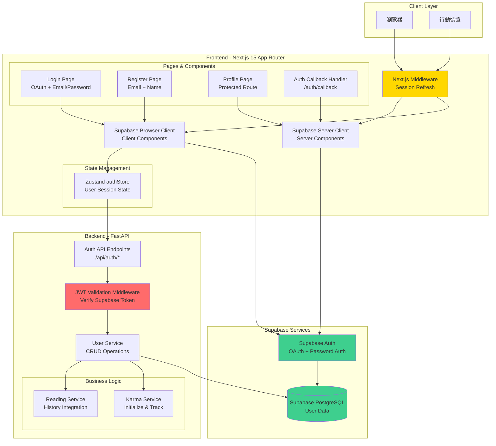
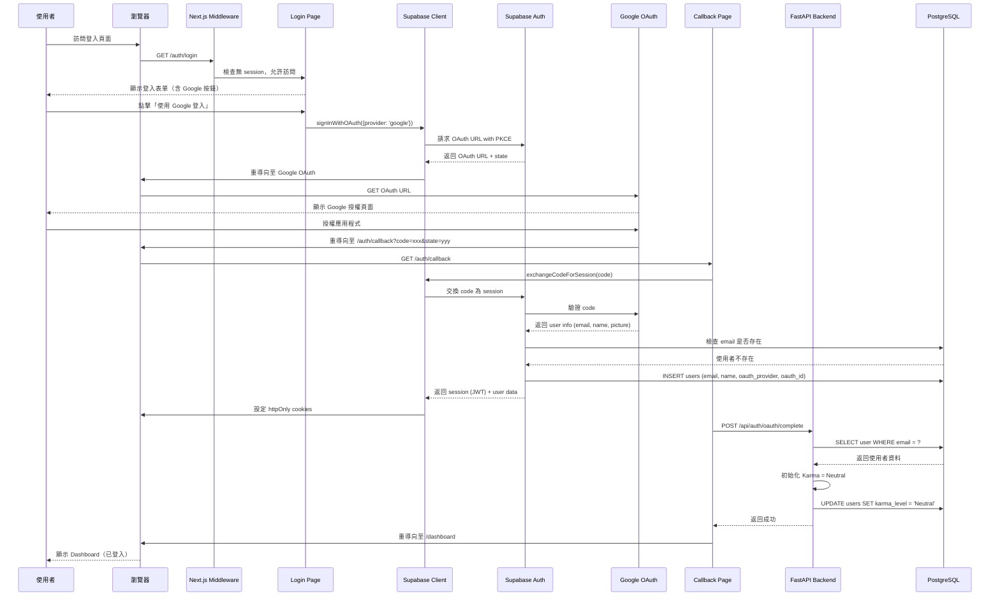
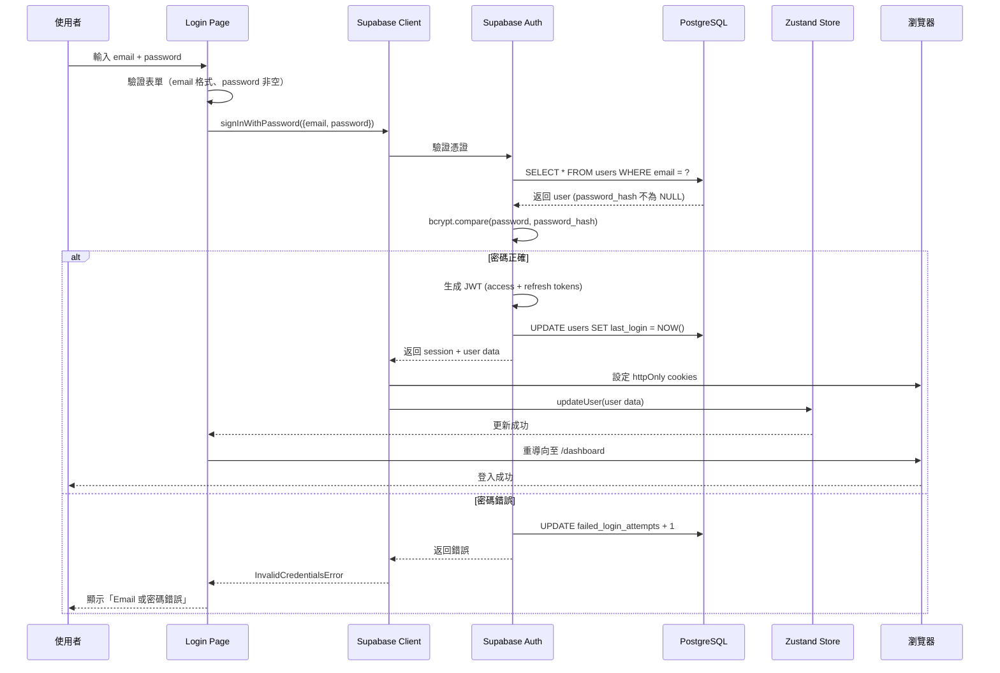
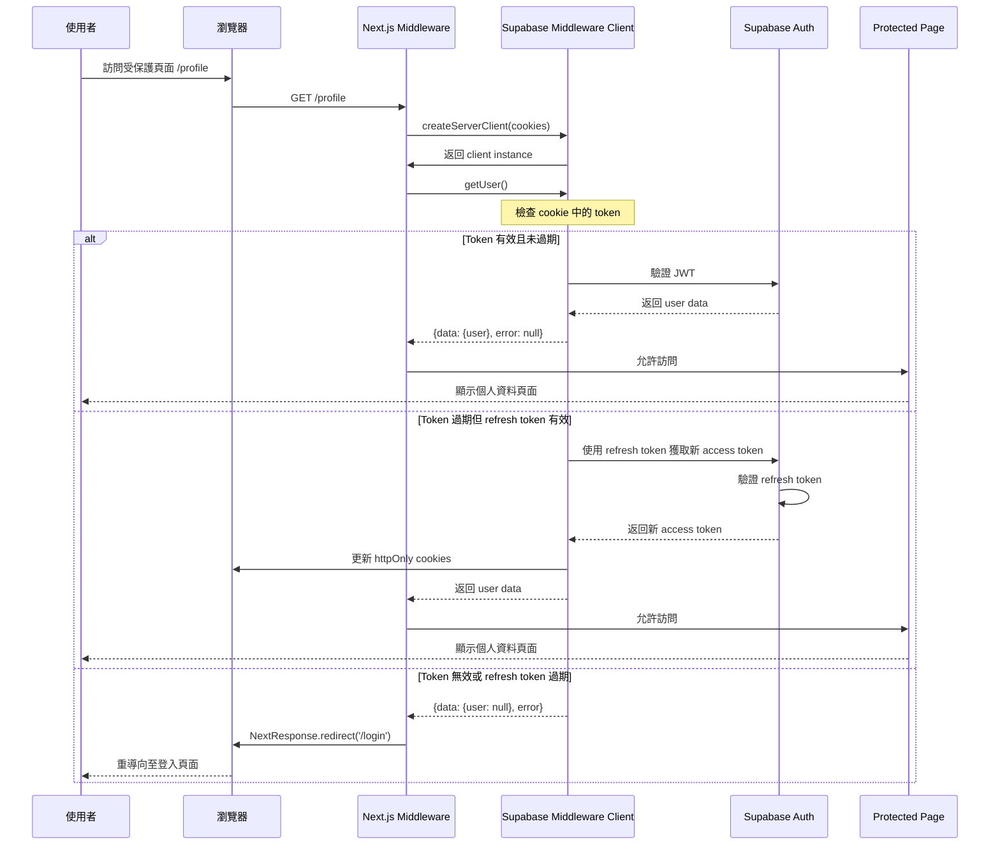
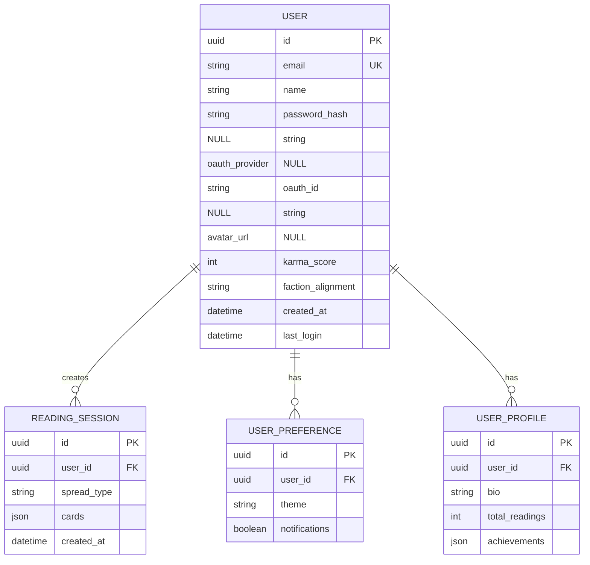

# 技術設計文件

## 概述

本技術設計定義了 Wasteland Tarot 平台的認證系統重構與 Supabase OAuth 整合的完整實作方案。此設計基於已批准的需求文件，提供具體的技術架構、元件設計、API 規格和實作細節。

### 功能範圍

1. **Supabase OAuth 整合**：實作 Google 第三方登入，利用已配置的 Supabase OAuth 設定
2. **認證系統重構**：將 username + password 登入改為 email + password，username 欄位重構為 name（顯示名稱）
3. **統一會話管理**：整合 OAuth 和傳統登入的使用者會話處理
4. **資料庫遷移**：安全地遷移現有使用者資料並新增 OAuth 支援欄位

### 商業價值

- **降低註冊門檻**：一鍵 Google 登入提升 30-50% 註冊轉換率
- **簡化使用體驗**：Email 登入比 Username 更直覺，減少登入錯誤
- **提升安全性**：OAuth 免除密碼管理風險，bcrypt 保護傳統密碼
- **未來擴展性**：架構支援新增更多 OAuth 提供者（Facebook、Twitter 等）

## 需求映射

### 設計元件可追溯性

每個設計元件都對應到需求文件中的特定 EARS 需求：

| 設計元件 | 需求映射 | EARS 需求參考 |
|---------|---------|--------------|
| **Supabase 客戶端工具** | 需求 1 | WHEN 應用程式初始化 THEN 系統 SHALL 從環境變數載入 Supabase OAuth 設定 |
| **OAuth 流程元件** | 需求 2 | WHEN 使用者點擊「使用 Google 登入」按鈕 THEN 系統 SHALL 重導向至 Supabase Google OAuth 授權頁面 |
| **使用者建立服務** | 需求 3 | IF 使用者記錄不存在 THEN 系統 SHALL 建立新使用者記錄 |
| **Email 登入端點** | 需求 4 | WHEN 使用者提交 email + password THEN 系統 SHALL 使用 email 查詢使用者記錄 |
| **註冊表單元件** | 需求 5 | WHEN 使用者訪問註冊頁面 THEN 系統 SHALL 顯示包含 email、password、confirm_password、name 欄位的註冊表單 |
| **Alembic Migration** | 需求 6 | WHEN 資料庫遷移執行 THEN 系統 SHALL 執行 schema 變更 |
| **Session Middleware** | 需求 7 | WHILE 使用者會話有效 THE 系統 SHALL 在 token 過期前自動刷新 token |
| **個人資料頁面** | 需求 8 | WHEN 認證使用者訪問個人資料頁面 THEN 系統 SHALL 顯示使用者資訊 |
| **Route Protection** | 需求 9 | WHEN 未認證使用者嘗試存取受保護路由 THEN 系統 SHALL 重導向至登入頁面 |
| **Logout 功能** | 需求 10 | WHEN 使用者點擊登出按鈕 THEN 系統 SHALL 清除前端狀態並呼叫 signOut API |
| **錯誤處理機制** | 需求 11 | IF OAuth 授權流程失敗 THEN 系統 SHALL 顯示使用者友善的錯誤訊息 |
| **Karma 整合** | 需求 12 | WHEN 使用者首次使用 Google 登入 THEN 系統 SHALL 初始化該使用者的 Karma 系統為「中立」等級 |
| **API 客戶端** | 需求 13 | WHEN 前端 LoginForm 元件提交登入請求 THEN 系統 SHALL 呼叫後端 API 端點 |
| **安全層** | 需求 14 | WHEN 系統儲存密碼 THEN 系統 SHALL 使用 bcrypt 進行雜湊處理（成本因子 >= 12） |
| **測試套件** | 需求 15 | WHEN 執行單元測試 THEN 系統 SHALL 涵蓋所有測試案例 |

### 使用者故事涵蓋

**已完整涵蓋的使用者故事**：

1. ✅ **系統管理員**：正確載入 Supabase OAuth 設定 → Supabase 客戶端初始化
2. ✅ **使用者**：使用 Google 帳號快速登入 → OAuth 流程完整實作
3. ✅ **使用者**：Google 登入時自動建立帳號 → 使用者建立與整合服務
4. ✅ **使用者**：使用 email 和 password 登入 → Email 登入端點
5. ✅ **新使用者**：使用 email 註冊並自訂顯示名稱 → 註冊表單與驗證
6. ✅ **開發者**：更新資料表結構 → Alembic migration 腳本
7. ✅ **使用者**：一致的使用體驗 → 統一會話管理
8. ✅ **使用者**：查看和編輯個人資料 → 個人資料管理端點
9. ✅ **使用者**：登入後存取受保護功能 → Route protection middleware
10. ✅ **使用者**：安全登出 → Logout 端點與清理
11. ✅ **使用者**：清楚的錯誤訊息 → 錯誤處理策略
12. ✅ **使用者**：Google 帳號整合 Wasteland Tarot 功能 → Karma 與閱讀歷史整合
13. ✅ **開發者**：前後端認證機制同步 → API 客戶端與 Zustand store
14. ✅ **系統管理員**：安全的認證系統 → 安全性最佳實踐
15. ✅ **QA 工程師**：驗證所有認證流程 → 完整測試策略

## 架構

### 系統架構圖



### 技術堆疊

基於研究結果和專案需求，選擇以下技術堆疊：

| 層級 | 技術選擇 | 版本 | 理由 |
|-----|---------|------|------|
| **前端框架** | Next.js | 15.1.7 | App Router 支援、RSC 效能優勢、已有專案基礎 |
| **前端語言** | TypeScript | 5.x | 型別安全、IDE 支援、減少執行時錯誤 |
| **前端執行環境** | Bun | Latest | 專案標準、快速套件管理 |
| **UI 框架** | React | 19.x | 專案標準、豐富生態系 |
| **狀態管理** | Zustand | 4.5.7 | 專案已使用、簡單高效 |
| **表單處理** | React Hook Form | 7.62.0 | 專案已使用、效能優異 |
| **認證客戶端** | @supabase/ssr | Latest | 官方推薦、SSR 優化、cookie 管理 |
| **後端框架** | FastAPI | 0.104.0+ | 專案標準、非同步支援、自動文件 |
| **後端語言** | Python | 3.11+ | 專案標準、豐富套件生態 |
| **套件管理** | uv | Latest | 專案標準、快速依賴解析 |
| **ORM** | SQLAlchemy | 2.0.23+ | 專案已使用、強大查詢能力 |
| **Migration** | Alembic | 1.13.0+ | SQLAlchemy 標準、版本控制 |
| **認證服務** | Supabase Auth | N/A | OAuth 內建、PostgreSQL 整合、RLS 支援 |
| **資料庫** | PostgreSQL (Supabase) | 15+ | 專案已使用、RLS、即時功能 |
| **密碼雜湊** | bcrypt | 4.0.0+ | 業界標準、抗暴力破解 |
| **JWT 處理** | python-jose | 3.3.0+ | FastAPI 推薦、完整支援 |
| **HTTP 客戶端** | httpx | 0.25.0+ | 非同步支援、現代 API |

### 架構決策理由

#### 1. 為何選擇 Supabase Auth？

**決策**：使用 Supabase Auth 作為認證服務，而非自建 OAuth 整合

**理由**：
- ✅ **已配置完成**：使用者已在 Supabase 控制台設定好 Google OAuth
- ✅ **內建 PKCE 流程**：自動處理 OAuth 安全性，無需手動實作
- ✅ **Session 管理**：內建 JWT 發行、刷新、驗證機制
- ✅ **Cookie 整合**：`@supabase/ssr` 提供完整的 httpOnly cookie 支援
- ✅ **RLS 整合**：與 PostgreSQL Row Level Security 無縫整合
- ✅ **減少維護成本**：官方維護，安全更新及時

**權衡**：
- ❌ 依賴第三方服務（Supabase 停機影響認證）
- ✅ 但降低開發和維護成本，提升安全性

#### 2. 為何選擇 @supabase/ssr 而非舊版 auth-helpers？

**決策**：使用 `@supabase/ssr` package

**理由**：
- ✅ **官方最新推薦**：Supabase 官方文件指出 auth-helpers 已過時
- ✅ **正確的 Cookie 處理**：強制使用 `getAll()` 和 `setAll()` 模式，防止常見錯誤
- ✅ **三種客戶端**：Browser、Server、Middleware 清楚分離
- ✅ **Next.js 15 優化**：針對 App Router 和 Server Components 優化
- ✅ **錯誤預防**：文件強調不可在 `createServerClient` 和 `getUser()` 之間執行邏輯

**研究來源**：Supabase 官方文件（https://github.com/supabase/supabase）

#### 3. 為何選擇雙重認證（OAuth + Email/Password）而非純 OAuth？

**決策**：同時支援 OAuth 和 Email/Password 登入

**理由**：
- ✅ **使用者選擇**：部分使用者偏好不連結 Google 帳號
- ✅ **隱私考量**：提供不依賴第三方服務的選項
- ✅ **降低風險**：Google OAuth 暫時無法使用時，仍可用 Email 登入
- ✅ **遷移平滑**：現有 Email/Password 使用者無需強制遷移

**權衡**：
- ❌ 增加複雜度（需處理兩種認證方式）
- ✅ 但提供最大彈性，符合不同使用者需求

#### 4. 為何選擇 httpOnly Cookies 而非 localStorage？

**決策**：使用 httpOnly cookies 儲存 session token

**理由**：
- ✅ **防 XSS 攻擊**：JavaScript 無法存取 httpOnly cookies
- ✅ **Supabase 內建**：`@supabase/ssr` 自動管理 cookies
- ✅ **安全性最佳實踐**：OWASP 推薦方式
- ✅ **自動發送**：瀏覽器自動在請求中帶入 cookies

**權衡**：
- ❌ CORS 設定較複雜
- ✅ 但安全性大幅提升

#### 5. 為何選擇 Alembic 資料庫遷移？

**決策**：使用 Alembic 管理 database schema 變更

**理由**：
- ✅ **SQLAlchemy 整合**：專案已使用 SQLAlchemy
- ✅ **版本控制**：遷移檔案可追蹤、可回滾
- ✅ **團隊協作**：遷移腳本明確記錄 schema 變更
- ✅ **生產安全**：支援預覽、測試、回滾機制

### 數據流程

#### 主要使用者流程

##### 流程 1：Google OAuth 登入（新使用者）



##### 流程 2：Email + Password 登入（現有使用者）



##### 流程 3：會話刷新與路由保護



## 元件與介面

### Frontend 元件架構

#### Supabase 客戶端工具

**檔案結構**：
```
src/utils/supabase/
├── client.ts          # Browser client (Client Components)
├── server.ts          # Server client (Server Components)
└── middleware.ts      # Middleware client (Middleware)
```

**1. Browser Client (client.ts)**

```typescript
// src/utils/supabase/client.ts
import { createBrowserClient } from '@supabase/ssr'

export function createClient() {
  return createBrowserClient(
    process.env.NEXT_PUBLIC_SUPABASE_URL!,
    process.env.NEXT_PUBLIC_SUPABASE_ANON_KEY!
  )
}

// 用途: Client Components 中的認證操作
// - signInWithOAuth()
// - signInWithPassword()
// - signUp()
// - signOut()
```

**2. Server Client (server.ts)**

```typescript
// src/utils/supabase/server.ts
import { createServerClient, type CookieOptions } from '@supabase/ssr'
import { cookies } from 'next/headers'

export async function createClient() {
  const cookieStore = await cookies()

  return createServerClient(
    process.env.NEXT_PUBLIC_SUPABASE_URL!,
    process.env.NEXT_PUBLIC_SUPABASE_ANON_KEY!,
    {
      cookies: {
        getAll() {
          return cookieStore.getAll()
        },
        setAll(cookiesToSet) {
          try {
            cookiesToSet.forEach(({ name, value, options }) =>
              cookieStore.set(name, value, options)
            )
          } catch {
            // setAll 從 Server Component 呼叫時可忽略
            // Middleware 會處理 session 刷新
          }
        },
      },
    }
  )
}

// 用途: Server Components 中的資料獲取
// - getUser()
// - 資料庫查詢（with RLS）
```

**3. Middleware Client (middleware.ts)**

```typescript
// src/utils/supabase/middleware.ts
import { createServerClient } from '@supabase/ssr'
import { NextResponse, type NextRequest } from 'next/server'

export async function updateSession(request: NextRequest) {
  let supabaseResponse = NextResponse.next({
    request,
  })

  const supabase = createServerClient(
    process.env.NEXT_PUBLIC_SUPABASE_URL!,
    process.env.NEXT_PUBLIC_SUPABASE_ANON_KEY!,
    {
      cookies: {
        getAll() {
          return request.cookies.getAll()
        },
        setAll(cookiesToSet) {
          cookiesToSet.forEach(({ name, value }) => request.cookies.set(name, value))
          supabaseResponse = NextResponse.next({
            request,
          })
          cookiesToSet.forEach(({ name, value, options }) =>
            supabaseResponse.cookies.set(name, value, options)
          )
        },
      },
    }
  )

  // 重要: 不要在 createServerClient 和 getUser() 之間執行任何邏輯
  const {
    data: { user },
  } = await supabase.auth.getUser()

  // 路由保護邏輯
  if (
    !user &&
    !request.nextUrl.pathname.startsWith('/auth/login') &&
    !request.nextUrl.pathname.startsWith('/auth/register') &&
    !request.nextUrl.pathname.startsWith('/auth/callback')
  ) {
    // 無使用者且訪問受保護路由 → 重導向登入頁
    const url = request.nextUrl.clone()
    url.pathname = '/auth/login'
    url.searchParams.set('redirect', request.nextUrl.pathname)
    return NextResponse.redirect(url)
  }

  // 重要: 必須返回 supabaseResponse
  return supabaseResponse
}
```

**4. Middleware Entry (middleware.ts)**

```typescript
// src/middleware.ts
import { type NextRequest } from 'next/server'
import { updateSession } from '@/utils/supabase/middleware'

export async function middleware(request: NextRequest) {
  return await updateSession(request)
}

export const config = {
  matcher: [
    /*
     * 匹配所有路徑，除了:
     * - _next/static (靜態檔案)
     * - _next/image (圖片優化)
     * - favicon.ico
     * - 圖片檔案
     */
    '/((?!_next/static|_next/image|favicon.ico|.*\\.(?:svg|png|jpg|jpeg|gif|webp)$).*)',
  ],
}
```

#### 認證元件

**檔案結構**：
```
src/components/auth/
├── LoginForm.tsx           # 登入表單（更新為 email + OAuth）
├── RegisterForm.tsx        # 註冊表單（更新為 email + name）
├── GoogleLoginButton.tsx   # Google OAuth 按鈕
├── LogoutButton.tsx        # 登出按鈕
└── __tests__/
    ├── LoginForm.test.tsx
    └── RegisterForm.test.tsx
```

**1. 更新的 LoginForm 元件**

```typescript
// src/components/auth/LoginForm.tsx
'use client'

import { useState } from 'react'
import { useRouter } from 'next/navigation'
import { createClient } from '@/utils/supabase/client'
import { useAuthStore } from '@/lib/authStore'
import { GoogleLoginButton } from './GoogleLoginButton'

interface FormData {
  email: string
  password: string
  rememberMe: boolean
}

export function LoginForm() {
  const router = useRouter()
  const supabase = createClient()
  const setUser = useAuthStore(s => s.setUser)

  const [formData, setFormData] = useState<FormData>({
    email: '',
    password: '',
    rememberMe: false
  })
  const [errors, setErrors] = useState<Record<string, string>>({})
  const [isSubmitting, setIsSubmitting] = useState(false)

  const validateEmail = (email: string): boolean => {
    const re = /^[^\s@]+@[^\s@]+\.[^\s@]+$/
    return re.test(email)
  }

  const handleSubmit = async (e: React.FormEvent) => {
    e.preventDefault()

    // 驗證
    const newErrors: Record<string, string> = {}
    if (!formData.email) {
      newErrors.email = 'Email 為必填'
    } else if (!validateEmail(formData.email)) {
      newErrors.email = 'Email 格式無效'
    }
    if (!formData.password) {
      newErrors.password = '密碼為必填'
    }

    if (Object.keys(newErrors).length > 0) {
      setErrors(newErrors)
      return
    }

    setIsSubmitting(true)
    setErrors({})

    try {
      const { data, error } = await supabase.auth.signInWithPassword({
        email: formData.email,
        password: formData.password,
      })

      if (error) {
        if (error.message.includes('Invalid login credentials')) {
          setErrors({ form: 'Email 或密碼錯誤' })
        } else {
          setErrors({ form: error.message })
        }
        return
      }

      // 更新 Zustand store
      setUser(data.user)

      // 重導向
      const redirect = new URLSearchParams(window.location.search).get('redirect')
      router.push(redirect || '/dashboard')
    } catch (err) {
      setErrors({ form: '登入失敗，請稍後再試' })
    } finally {
      setIsSubmitting(false)
    }
  }

  return (
    <div className="login-form">
      <h2>登入 Wasteland Tarot</h2>

      {/* Google OAuth 按鈕 */}
      <GoogleLoginButton />

      <div className="divider">或使用 Email 登入</div>

      <form onSubmit={handleSubmit}>
        <div className="form-group">
          <label htmlFor="email">Email</label>
          <input
            id="email"
            type="email"
            value={formData.email}
            onChange={(e) => setFormData({...formData, email: e.target.value})}
            placeholder="your-email@example.com"
          />
          {errors.email && <span className="error">{errors.email}</span>}
        </div>

        <div className="form-group">
          <label htmlFor="password">密碼</label>
          <input
            id="password"
            type="password"
            value={formData.password}
            onChange={(e) => setFormData({...formData, password: e.target.value})}
            placeholder="••••••••"
          />
          {errors.password && <span className="error">{errors.password}</span>}
        </div>

        <div className="form-group checkbox">
          <input
            id="remember"
            type="checkbox"
            checked={formData.rememberMe}
            onChange={(e) => setFormData({...formData, rememberMe: e.target.checked})}
          />
          <label htmlFor="remember">記住我</label>
        </div>

        {errors.form && <div className="error-banner">{errors.form}</div>}

        <button type="submit" disabled={isSubmitting}>
          {isSubmitting ? '登入中...' : '登入'}
        </button>
      </form>
    </div>
  )
}
```

**2. Google OAuth 按鈕元件**

```typescript
// src/components/auth/GoogleLoginButton.tsx
'use client'

import { createClient } from '@/utils/supabase/client'
import { useState } from 'react'

export function GoogleLoginButton() {
  const supabase = createClient()
  const [isLoading, setIsLoading] = useState(false)

  const handleGoogleLogin = async () => {
    setIsLoading(true)

    try {
      const { data, error } = await supabase.auth.signInWithOAuth({
        provider: 'google',
        options: {
          redirectTo: `${window.location.origin}/auth/callback`,
          queryParams: {
            access_type: 'offline',
            prompt: 'consent',
          },
        },
      })

      if (error) {
        console.error('Google login error:', error)
        alert('Google 登入失敗，請稍後再試')
      }
      // Supabase 會自動重導向至 Google
    } catch (err) {
      console.error('Unexpected error:', err)
      alert('發生未預期的錯誤')
    } finally {
      setIsLoading(false)
    }
  }

  return (
    <button
      onClick={handleGoogleLogin}
      disabled={isLoading}
      className="google-login-button"
    >
      {isLoading ? (
        '重導向中...'
      ) : (
        <>
          <GoogleIcon />
          <span>使用 Google 登入</span>
        </>
      )}
    </button>
  )
}

function GoogleIcon() {
  return (
    <svg width="18" height="18" xmlns="http://www.w3.org/2000/svg">
      {/* Google icon SVG */}
    </svg>
  )
}
```

**3. 更新的 RegisterForm 元件**

```typescript
// src/components/auth/RegisterForm.tsx
'use client'

import { useState } from 'react'
import { useRouter } from 'next/navigation'
import { createClient } from '@/utils/supabase/client'

interface FormData {
  email: string
  name: string
  password: string
  confirmPassword: string
}

export function RegisterForm() {
  const router = useRouter()
  const supabase = createClient()

  const [formData, setFormData] = useState<FormData>({
    email: '',
    name: '',
    password: '',
    confirmPassword: ''
  })
  const [errors, setErrors] = useState<Record<string, string>>({})
  const [isSubmitting, setIsSubmitting] = useState(false)

  const validateForm = (): boolean => {
    const newErrors: Record<string, string> = {}

    // Email 驗證
    if (!formData.email) {
      newErrors.email = 'Email 為必填'
    } else if (!/^[^\s@]+@[^\s@]+\.[^\s@]+$/.test(formData.email)) {
      newErrors.email = 'Email 格式無效'
    }

    // Name 驗證
    if (!formData.name) {
      newErrors.name = '名稱為必填'
    } else if (formData.name.length < 1 || formData.name.length > 50) {
      newErrors.name = '名稱長度需在 1-50 字元之間'
    }

    // Password 驗證
    if (!formData.password) {
      newErrors.password = '密碼為必填'
    } else if (formData.password.length < 8) {
      newErrors.password = '密碼至少需要 8 個字元'
    }

    // Confirm Password 驗證
    if (formData.password !== formData.confirmPassword) {
      newErrors.confirmPassword = '密碼不相符'
    }

    setErrors(newErrors)
    return Object.keys(newErrors).length === 0
  }

  const handleSubmit = async (e: React.FormEvent) => {
    e.preventDefault()

    if (!validateForm()) return

    setIsSubmitting(true)
    setErrors({})

    try {
      // 1. 使用 Supabase 註冊
      const { data, error } = await supabase.auth.signUp({
        email: formData.email,
        password: formData.password,
        options: {
          data: {
            name: formData.name,
          },
        },
      })

      if (error) {
        if (error.message.includes('already registered')) {
          setErrors({ email: '此 Email 已被註冊' })
        } else {
          setErrors({ form: error.message })
        }
        return
      }

      // 2. 註冊成功，重導向至 dashboard
      router.push('/dashboard')
    } catch (err) {
      setErrors({ form: '註冊失敗，請稍後再試' })
    } finally {
      setIsSubmitting(false)
    }
  }

  return (
    <form onSubmit={handleSubmit} className="register-form">
      <h2>註冊 Wasteland Tarot</h2>

      <div className="form-group">
        <label htmlFor="email">Email</label>
        <input
          id="email"
          type="email"
          value={formData.email}
          onChange={(e) => setFormData({...formData, email: e.target.value})}
          placeholder="your-email@example.com"
        />
        {errors.email && <span className="error">{errors.email}</span>}
      </div>

      <div className="form-group">
        <label htmlFor="name">顯示名稱</label>
        <input
          id="name"
          type="text"
          value={formData.name}
          onChange={(e) => setFormData({...formData, name: e.target.value})}
          placeholder="你的名稱或暱稱"
        />
        {errors.name && <span className="error">{errors.name}</span>}
      </div>

      <div className="form-group">
        <label htmlFor="password">密碼</label>
        <input
          id="password"
          type="password"
          value={formData.password}
          onChange={(e) => setFormData({...formData, password: e.target.value})}
          placeholder="至少 8 個字元"
        />
        {errors.password && <span className="error">{errors.password}</span>}
      </div>

      <div className="form-group">
        <label htmlFor="confirmPassword">確認密碼</label>
        <input
          id="confirmPassword"
          type="password"
          value={formData.confirmPassword}
          onChange={(e) => setFormData({...formData, confirmPassword: e.target.value})}
          placeholder="再次輸入密碼"
        />
        {errors.confirmPassword && <span className="error">{errors.confirmPassword}</span>}
      </div>

      {errors.form && <div className="error-banner">{errors.form}</div>}

      <button type="submit" disabled={isSubmitting}>
        {isSubmitting ? '註冊中...' : '註冊'}
      </button>
    </form>
  )
}
```

**4. OAuth Callback 處理頁面**

```typescript
// src/app/auth/callback/route.ts
import { createClient } from '@/utils/supabase/server'
import { NextResponse } from 'next/server'

export async function GET(request: Request) {
  const { searchParams, origin } = new URL(request.url)
  const code = searchParams.get('code')
  const next = searchParams.get('next') ?? '/dashboard'

  if (code) {
    const supabase = await createClient()
    const { error } = await supabase.auth.exchangeCodeForSession(code)

    if (!error) {
      // 成功交換 code 為 session
      // Supabase 已自動設定 cookies

      // 呼叫 backend 初始化 Karma（如果是新使用者）
      const { data: { user } } = await supabase.auth.getUser()
      if (user) {
        try {
          await fetch(`${process.env.NEXT_PUBLIC_API_URL}/api/auth/oauth/complete`, {
            method: 'POST',
            headers: {
              'Content-Type': 'application/json',
              'Authorization': `Bearer ${(await supabase.auth.getSession()).data.session?.access_token}`,
            },
            body: JSON.stringify({ userId: user.id }),
          })
        } catch (err) {
          console.error('Failed to initialize user data:', err)
        }
      }

      return NextResponse.redirect(`${origin}${next}`)
    }
  }

  // 錯誤處理
  return NextResponse.redirect(`${origin}/auth/auth-code-error`)
}
```

#### Zustand Auth Store 更新

```typescript
// src/lib/authStore.ts
import { create } from 'zustand'
import { persist } from 'zustand/middleware'

interface User {
  id: string
  email: string
  name: string | null
  avatar_url: string | null
  oauth_provider: string | null
  karma_score: number
  created_at: string
}

interface AuthState {
  user: User | null
  isAuthenticated: boolean
  setUser: (user: User | null) => void
  clearUser: () => void
}

export const useAuthStore = create<AuthState>()(
  persist(
    (set) => ({
      user: null,
      isAuthenticated: false,
      setUser: (user) => set({ user, isAuthenticated: !!user }),
      clearUser: () => set({ user: null, isAuthenticated: false }),
    }),
    {
      name: 'wasteland-tarot-auth',
    }
  )
)
```

### Backend 服務與方法簽名

#### 更新的 User Model

```python
# backend/app/models/user.py
from sqlalchemy import Column, String, Integer, Boolean, DateTime, Index
from sqlalchemy.sql import func
from .base import BaseModel

class User(BaseModel):
    """
    Wasteland Tarot User - 支援 OAuth 和 Email/Password 認證
    """
    __tablename__ = "users"

    # 基本認證資訊
    email = Column(String(255), unique=True, index=True, nullable=False)
    name = Column(String(50), nullable=False)  # 原 username，改為 display name
    password_hash = Column(String(255), nullable=True)  # OAuth 使用者為 NULL

    # OAuth 資訊
    oauth_provider = Column(String(20), nullable=True)  # 'google', 'facebook', etc.
    oauth_id = Column(String(255), nullable=True)  # Provider 的 user ID

    # Profile 資訊
    avatar_url = Column(String(500), nullable=True)
    bio = Column(String(500), nullable=True)

    # Wasteland 屬性
    karma_score = Column(Integer, default=50)  # 0-100
    faction_alignment = Column(String(50), default='Vault Dweller')
    vault_number = Column(Integer, nullable=True)

    # 帳號狀態
    is_active = Column(Boolean, default=True)
    is_verified = Column(Boolean, default=False)
    last_login = Column(DateTime(timezone=True), nullable=True)

    # 索引
    __table_args__ = (
        Index('idx_oauth_provider_id', 'oauth_provider', 'oauth_id', unique=True),
    )

    def is_oauth_user(self) -> bool:
        """檢查是否為 OAuth 使用者"""
        return self.oauth_provider is not None

    def can_use_password_login(self) -> bool:
        """檢查是否可使用密碼登入"""
        return self.password_hash is not None
```

#### Auth Service 方法

```python
# backend/app/services/auth_service.py
from typing import Dict, Any, Optional
from sqlalchemy.ext.asyncio import AsyncSession
from sqlalchemy import select
from passlib.context import CryptContext
import jwt
from datetime import datetime, timedelta
from app.models.user import User
from app.core.exceptions import InvalidCredentialsError, UserAlreadyExistsError

pwd_context = CryptContext(schemes=["bcrypt"], deprecated="auto", bcrypt__rounds=12)

class AuthenticationService:
    """認證服務 - 支援 OAuth 和 Email/Password"""

    def __init__(self, db: AsyncSession):
        self.db = db

    async def register_user(self, email: str, password: str, name: str) -> Dict[str, Any]:
        """
        註冊新使用者（Email + Password）

        Args:
            email: 使用者 email
            password: 明文密碼
            name: 顯示名稱

        Returns:
            Dict 包含 user 資料

        Raises:
            UserAlreadyExistsError: Email 已存在
        """
        # 檢查 email 是否已存在
        result = await self.db.execute(
            select(User).where(User.email == email)
        )
        existing_user = result.scalar_one_or_none()

        if existing_user:
            raise UserAlreadyExistsError(f"Email {email} 已被註冊")

        # 雜湊密碼
        password_hash = pwd_context.hash(password)

        # 建立使用者
        user = User(
            email=email,
            name=name,
            password_hash=password_hash,
            oauth_provider=None,
            oauth_id=None,
            karma_score=50,  # 預設中立
        )

        self.db.add(user)
        await self.db.commit()
        await self.db.refresh(user)

        return {"user": user}

    async def login_with_email(self, email: str, password: str) -> Dict[str, Any]:
        """
        Email + Password 登入

        Args:
            email: 使用者 email
            password: 明文密碼

        Returns:
            Dict 包含 user 資料

        Raises:
            InvalidCredentialsError: Email 不存在或密碼錯誤
        """
        result = await self.db.execute(
            select(User).where(User.email == email)
        )
        user = result.scalar_one_or_none()

        if not user:
            raise InvalidCredentialsError("Email 或密碼錯誤")

        # 檢查是否為 OAuth 使用者
        if user.password_hash is None:
            raise InvalidCredentialsError("此帳號使用 Google 登入，請使用 Google 登入")

        # 驗證密碼
        if not pwd_context.verify(password, user.password_hash):
            raise InvalidCredentialsError("Email 或密碼錯誤")

        # 更新最後登入時間
        user.last_login = datetime.utcnow()
        await self.db.commit()

        return {"user": user}

    async def handle_oauth_user(
        self,
        email: str,
        name: str,
        oauth_provider: str,
        oauth_id: str,
        avatar_url: Optional[str] = None
    ) -> Dict[str, Any]:
        """
        處理 OAuth 使用者（建立或更新）

        Args:
            email: 使用者 email
            name: 顯示名稱（來自 OAuth provider）
            oauth_provider: 'google', 'facebook', etc.
            oauth_id: Provider 的 user ID
            avatar_url: 頭像 URL

        Returns:
            Dict 包含 user 資料和 is_new_user flag
        """
        # 檢查是否已存在
        result = await self.db.execute(
            select(User).where(User.email == email)
        )
        user = result.scalar_one_or_none()

        if user:
            # 現有使用者 - 更新 OAuth 資訊（如果尚未設定）
            if user.oauth_provider is None:
                user.oauth_provider = oauth_provider
                user.oauth_id = oauth_id
            if avatar_url:
                user.avatar_url = avatar_url
            user.last_login = datetime.utcnow()
            await self.db.commit()
            await self.db.refresh(user)
            return {"user": user, "is_new_user": False}
        else:
            # 新使用者 - 建立
            user = User(
                email=email,
                name=name or email.split('@')[0],  # fallback to email local part
                password_hash=None,  # OAuth 使用者無密碼
                oauth_provider=oauth_provider,
                oauth_id=oauth_id,
                avatar_url=avatar_url,
                karma_score=50,  # 預設中立
                last_login=datetime.utcnow(),
            )
            self.db.add(user)
            await self.db.commit()
            await self.db.refresh(user)
            return {"user": user, "is_new_user": True}
```

#### User Service 更新

```python
# backend/app/services/user_service.py
from typing import Optional, Dict, Any
from sqlalchemy.ext.asyncio import AsyncSession
from sqlalchemy import select
from app.models.user import User

class UserService:
    """使用者管理服務"""

    def __init__(self, db: AsyncSession):
        self.db = db

    async def get_user_by_id(self, user_id: str) -> Optional[User]:
        """根據 ID 獲取使用者"""
        result = await self.db.execute(
            select(User).where(User.id == user_id)
        )
        return result.scalar_one_or_none()

    async def get_user_by_email(self, email: str) -> Optional[User]:
        """根據 Email 獲取使用者"""
        result = await self.db.execute(
            select(User).where(User.email == email)
        )
        return result.scalar_one_or_none()

    async def update_user_profile(
        self,
        user_id: str,
        name: Optional[str] = None,
        bio: Optional[str] = None,
        avatar_url: Optional[str] = None
    ) -> User:
        """更新使用者資料"""
        user = await self.get_user_by_id(user_id)
        if not user:
            raise ValueError("User not found")

        if name is not None:
            user.name = name
        if bio is not None:
            user.bio = bio
        if avatar_url is not None:
            user.avatar_url = avatar_url

        await self.db.commit()
        await self.db.refresh(user)
        return user

    async def initialize_new_user(self, user_id: str) -> None:
        """初始化新使用者的 Karma 和其他設定"""
        user = await self.get_user_by_id(user_id)
        if not user:
            raise ValueError("User not found")

        # Karma 已在模型中預設為 50（中立）
        # 這裡可以初始化其他設定

        await self.db.commit()
```

### API 端點規格

| Method | Route | Purpose | Auth Required | Request Body | Response | Status Codes |
|--------|-------|---------|--------------|--------------|----------|--------------|
| **POST** | `/api/auth/register` | Email + Password 註冊 | No | `{email, password, name}` | `{user, message}` | 201, 400, 409 |
| **POST** | `/api/auth/login` | Email + Password 登入 | No | `{email, password}` | `{user, message}` | 200, 401, 400 |
| **GET** | `/api/auth/me` | 獲取當前使用者資訊 | Yes (JWT) | - | `{user, statistics}` | 200, 401 |
| **PATCH** | `/api/auth/profile` | 更新使用者資料 | Yes (JWT) | `{name?, bio?, avatar_url?}` | `{user, message}` | 200, 400, 401 |
| **POST** | `/api/auth/logout` | 登出（Supabase 處理） | Yes (JWT) | - | `{message}` | 200, 401 |
| **POST** | `/api/auth/oauth/complete` | OAuth 登入後端完成處理 | Yes (JWT) | `{userId}` | `{user, message}` | 200, 400, 401 |

**詳細端點說明**：

#### 1. POST /api/auth/register

**用途**: 使用 Email + Password 註冊新使用者

**Request Body**:
```json
{
  "email": "user@example.com",
  "password": "SecurePass123!",
  "name": "使用者名稱"
}
```

**Response (201 Created)**:
```json
{
  "message": "註冊成功",
  "user": {
    "id": "uuid",
    "email": "user@example.com",
    "name": "使用者名稱",
    "karma_score": 50,
    "oauth_provider": null,
    "created_at": "2025-10-02T00:00:00Z"
  }
}
```

**Error Responses**:
- `409 Conflict`: Email 已被註冊
- `400 Bad Request`: 驗證失敗（email 格式、密碼強度、name 長度）

#### 2. POST /api/auth/login

**用途**: 使用 Email + Password 登入

**Request Body**:
```json
{
  "email": "user@example.com",
  "password": "SecurePass123!"
}
```

**Response (200 OK)**:
```json
{
  "message": "登入成功",
  "user": {
    "id": "uuid",
    "email": "user@example.com",
    "name": "使用者名稱",
    "karma_score": 50
  }
}
```

**Error Responses**:
- `401 Unauthorized`: Email 不存在或密碼錯誤
- `401 Unauthorized`: 此帳號使用 Google 登入（password_hash 為 NULL）
- `400 Bad Request`: 請求格式錯誤

#### 3. POST /api/auth/oauth/complete

**用途**: OAuth 登入後，backend 初始化使用者資料（Karma 等）

**Headers**:
```
Authorization: Bearer <supabase_jwt_token>
```

**Request Body**:
```json
{
  "userId": "uuid"
}
```

**Response (200 OK)**:
```json
{
  "message": "OAuth 使用者初始化完成",
  "user": {
    "id": "uuid",
    "email": "user@gmail.com",
    "name": "Google User Name",
    "oauth_provider": "google",
    "karma_score": 50
  }
}
```

## 資料模型

### Domain Entities

1. **User (使用者)**：認證和個人資料資訊
2. **Session (會話)**：Supabase 管理的使用者會話
3. **OAuthProfile (OAuth 資料)**：來自 OAuth provider 的額外資訊

### Entity Relationships



### 資料模型定義

#### TypeScript 介面

```typescript
// src/types/auth.ts
export interface User {
  id: string
  email: string
  name: string
  password_hash?: string | null
  oauth_provider: 'google' | 'facebook' | 'twitter' | null
  oauth_id: string | null
  avatar_url: string | null
  karma_score: number
  faction_alignment: string
  vault_number: number | null
  is_active: boolean
  is_verified: boolean
  created_at: string
  updated_at: string
  last_login: string | null
}

export interface AuthSession {
  access_token: string
  refresh_token: string
  expires_at: number
  user: User
}

export interface OAuthProfile {
  provider: 'google' | 'facebook' | 'twitter'
  id: string
  email: string
  name: string
  picture: string | null
  email_verified: boolean
}

export interface LoginCredentials {
  email: string
  password: string
}

export interface RegisterData {
  email: string
  password: string
  name: string
}
```

#### Python Dataclasses

```python
# backend/app/schemas/auth.py
from pydantic import BaseModel, EmailStr, Field
from typing import Optional, Literal
from datetime import datetime

class UserBase(BaseModel):
    email: EmailStr
    name: str = Field(..., min_length=1, max_length=50)

class UserRegister(UserBase):
    password: str = Field(..., min_length=8)

class UserLogin(BaseModel):
    email: EmailStr
    password: str

class UserResponse(BaseModel):
    id: str
    email: str
    name: str
    oauth_provider: Optional[Literal['google', 'facebook', 'twitter']] = None
    oauth_id: Optional[str] = None
    avatar_url: Optional[str] = None
    karma_score: int
    faction_alignment: str
    is_verified: bool
    created_at: datetime
    last_login: Optional[datetime] = None

    class Config:
        from_attributes = True

class OAuthUserData(BaseModel):
    email: EmailStr
    name: str
    oauth_provider: Literal['google', 'facebook', 'twitter']
    oauth_id: str
    avatar_url: Optional[str] = None

class UserProfileUpdate(BaseModel):
    name: Optional[str] = Field(None, min_length=1, max_length=50)
    bio: Optional[str] = Field(None, max_length=500)
    avatar_url: Optional[str] = None
```

### 資料庫 Schema

#### 更新的 Users 表

```sql
-- Users 表（更新版）
CREATE TABLE users (
    id UUID PRIMARY KEY DEFAULT gen_random_uuid(),

    -- 認證資訊
    email VARCHAR(255) NOT NULL UNIQUE,
    name VARCHAR(50) NOT NULL,
    password_hash VARCHAR(255),  -- NULLABLE for OAuth users

    -- OAuth 資訊
    oauth_provider VARCHAR(20),  -- 'google', 'facebook', etc.
    oauth_id VARCHAR(255),       -- Provider's user ID

    -- Profile 資訊
    avatar_url VARCHAR(500),
    bio TEXT,

    -- Wasteland 屬性
    karma_score INTEGER NOT NULL DEFAULT 50,
    faction_alignment VARCHAR(50) NOT NULL DEFAULT 'Vault Dweller',
    vault_number INTEGER,
    wasteland_location VARCHAR(100),
    experience_level VARCHAR(50) NOT NULL DEFAULT 'Novice Survivor',

    -- 帳號狀態
    is_active BOOLEAN NOT NULL DEFAULT TRUE,
    is_verified BOOLEAN NOT NULL DEFAULT FALSE,
    is_premium BOOLEAN NOT NULL DEFAULT FALSE,

    -- 統計資訊
    daily_readings_count INTEGER NOT NULL DEFAULT 0,
    total_readings INTEGER NOT NULL DEFAULT 0,
    community_points INTEGER NOT NULL DEFAULT 0,

    -- 時間戳記
    created_at TIMESTAMP WITH TIME ZONE NOT NULL DEFAULT CURRENT_TIMESTAMP,
    updated_at TIMESTAMP WITH TIME ZONE NOT NULL DEFAULT CURRENT_TIMESTAMP,
    last_login TIMESTAMP WITH TIME ZONE,

    -- 索引
    CONSTRAINT users_email_key UNIQUE (email),
    CONSTRAINT users_oauth_unique UNIQUE (oauth_provider, oauth_id)
);

-- 索引
CREATE INDEX idx_users_email ON users(email);
CREATE INDEX idx_users_oauth ON users(oauth_provider, oauth_id) WHERE oauth_provider IS NOT NULL;
CREATE INDEX idx_users_created_at ON users(created_at);
CREATE INDEX idx_users_last_login ON users(last_login);

-- 更新時間戳記觸發器
CREATE OR REPLACE FUNCTION update_updated_at_column()
RETURNS TRIGGER AS $$
BEGIN
    NEW.updated_at = CURRENT_TIMESTAMP;
    RETURN NEW;
END;
$$ language 'plpgsql';

CREATE TRIGGER update_users_updated_at BEFORE UPDATE ON users
    FOR EACH ROW EXECUTE FUNCTION update_updated_at_column();
```

### Migration 策略

#### Alembic Migration 腳本

**檔案**: `backend/alembic/versions/xxxx_add_oauth_support.py`

```python
"""Add OAuth support and refactor username to name

Revision ID: xxxx_add_oauth_support
Revises: previous_revision
Create Date: 2025-10-02 00:00:00.000000

"""
from alembic import op
import sqlalchemy as sa
from sqlalchemy.dialects import postgresql

# revision identifiers
revision = 'xxxx_add_oauth_support'
down_revision = 'previous_revision'
branch_labels = None
depends_on = None


def upgrade():
    """
    升級資料庫 schema：
    1. 複製 username 到新的 name 欄位
    2. 新增 OAuth 欄位
    3. 修改 password_hash 為 NULLABLE
    4. 移除 username 欄位
    5. 建立 OAuth 索引
    """

    # 步驟 1: 新增 name 欄位（暫時 NULLABLE）
    op.add_column('users', sa.Column('name', sa.String(length=50), nullable=True))

    # 步驟 2: 複製 username 資料到 name
    op.execute("""
        UPDATE users
        SET name = username
        WHERE name IS NULL
    """)

    # 步驟 3: 設定 name 為 NOT NULL
    op.alter_column('users', 'name', nullable=False)

    # 步驟 4: 新增 OAuth 欄位
    op.add_column('users', sa.Column('oauth_provider', sa.String(length=20), nullable=True))
    op.add_column('users', sa.Column('oauth_id', sa.String(length=255), nullable=True))

    # 步驟 5: 修改 password_hash 為 NULLABLE
    op.alter_column('users', 'password_hash', nullable=True)

    # 步驟 6: 移除 username 欄位和相關索引
    op.drop_index('ix_users_username', table_name='users')
    op.drop_constraint('users_username_key', 'users', type_='unique')
    op.drop_column('users', 'username')

    # 步驟 7: 建立 OAuth 複合唯一索引
    op.create_index(
        'idx_users_oauth',
        'users',
        ['oauth_provider', 'oauth_id'],
        unique=True,
        postgresql_where=sa.text('oauth_provider IS NOT NULL')
    )

    # 步驟 8: 建立 name 索引（效能優化）
    op.create_index('idx_users_name', 'users', ['name'])


def downgrade():
    """
    降級資料庫 schema（回滾變更）
    """

    # 步驟 1: 新增 username 欄位
    op.add_column('users', sa.Column('username', sa.String(length=50), nullable=True))

    # 步驟 2: 複製 name 回 username
    op.execute("""
        UPDATE users
        SET username = name
        WHERE username IS NULL
    """)

    # 步驟 3: 設定 username 為 NOT NULL 和 UNIQUE
    op.alter_column('users', 'username', nullable=False)
    op.create_unique_constraint('users_username_key', 'users', ['username'])
    op.create_index('ix_users_username', 'users', ['username'])

    # 步驟 4: 移除 OAuth 相關
    op.drop_index('idx_users_oauth', table_name='users')
    op.drop_column('users', 'oauth_id')
    op.drop_column('users', 'oauth_provider')

    # 步驟 5: 恢復 password_hash NOT NULL
    op.alter_column('users', 'password_hash', nullable=False)

    # 步驟 6: 移除 name
    op.drop_index('idx_users_name', table_name='users')
    op.drop_column('users', 'name')
```

#### Migration 執行計劃

**開發環境**:
```bash
cd backend

# 1. 生成 migration
uv run alembic revision --autogenerate -m "Add OAuth support and refactor username to name"

# 2. 檢查生成的 migration 檔案
cat alembic/versions/xxxx_add_oauth_support.py

# 3. 測試 upgrade
uv run alembic upgrade head

# 4. 驗證資料
uv run python -c "from app.db.database import get_db; import asyncio; asyncio.run(verify_migration())"

# 5. 測試 downgrade（確保可回滾）
uv run alembic downgrade -1

# 6. 重新 upgrade
uv run alembic upgrade head
```

**生產環境**:
```bash
# 1. 備份資料庫
pg_dump -h <host> -U <user> -d <database> > backup_$(date +%Y%m%d_%H%M%S).sql

# 2. 在維護視窗執行 migration
uv run alembic upgrade head

# 3. 驗證資料完整性
uv run python scripts/verify_migration.py

# 4. 監控應用程式錯誤
# 如有問題，立即回滾：
uv run alembic downgrade -1
```

## 錯誤處理

### 錯誤類型與處理策略

| 錯誤場景 | 錯誤類型 | 前端處理 | 後端處理 | 使用者訊息 |
|---------|---------|---------|---------|-----------|
| **OAuth 授權拒絕** | OAuthDeniedError | 顯示訊息，返回登入頁 | 記錄事件 | 「你已取消 Google 登入」 |
| **OAuth 回調錯誤** | OAuthCallbackError | 顯示錯誤，提供重試 | 記錄詳細錯誤 | 「Google 登入失敗，請稍後再試」 |
| **Email 已註冊** | UserAlreadyExistsError | 顯示錯誤，建議登入 | 返回 409 | 「此 Email 已被註冊，請直接登入」 |
| **Email/密碼錯誤** | InvalidCredentialsError | 顯示通用錯誤 | 增加失敗計數 | 「Email 或密碼錯誤」 |
| **OAuth 使用者用密碼登入** | InvalidCredentialsError | 提示使用 OAuth | - | 「此帳號使用 Google 登入」 |
| **網路錯誤** | NetworkError | 顯示錯誤，提供重試 | - | 「網路連線錯誤，請檢查網路」 |
| **Token 過期** | TokenExpiredError | 自動刷新或重登入 | - | （自動處理，無訊息） |
| **Supabase API 錯誤** | SupabaseError | 顯示通用錯誤 | 記錄完整錯誤 | 「服務暫時無法使用，請稍後再試」 |
| **帳號鎖定** | AccountLockedError | 顯示鎖定訊息 | - | 「帳號已鎖定 15 分鐘（多次登入失敗）」 |

### 錯誤處理實作

#### Frontend 錯誤處理

```typescript
// src/lib/errorHandler.ts
export class AuthError extends Error {
  constructor(
    message: string,
    public code: string,
    public userMessage: string
  ) {
    super(message)
    this.name = 'AuthError'
  }
}

export function handleSupabaseError(error: any): never {
  // OAuth 錯誤
  if (error.message?.includes('OAuth')) {
    throw new AuthError(
      error.message,
      'OAUTH_ERROR',
      'Google 登入失敗，請稍後再試'
    )
  }

  // 憑證錯誤
  if (error.message?.includes('Invalid login credentials')) {
    throw new AuthError(
      error.message,
      'INVALID_CREDENTIALS',
      'Email 或密碼錯誤'
    )
  }

  // Email 已存在
  if (error.message?.includes('already registered')) {
    throw new AuthError(
      error.message,
      'EMAIL_EXISTS',
      '此 Email 已被註冊'
    )
  }

  // 通用錯誤
  throw new AuthError(
    error.message || 'Unknown error',
    'UNKNOWN_ERROR',
    '發生錯誤，請稍後再試'
  )
}

export function displayError(error: AuthError, toast: any) {
  toast.error(error.userMessage)
  console.error(`[${error.code}]`, error.message)
}
```

#### Backend 錯誤處理

```python
# backend/app/core/exceptions.py
class AuthenticationError(Exception):
    """基礎認證錯誤"""
    def __init__(self, message: str, error_code: str):
        self.message = message
        self.error_code = error_code
        super().__init__(self.message)

class InvalidCredentialsError(AuthenticationError):
    """憑證無效"""
    def __init__(self, message: str = "Invalid credentials"):
        super().__init__(message, "INVALID_CREDENTIALS")

class UserAlreadyExistsError(AuthenticationError):
    """使用者已存在"""
    def __init__(self, message: str = "User already exists"):
        super().__init__(message, "USER_EXISTS")

class AccountLockedError(AuthenticationError):
    """帳號鎖定"""
    def __init__(self, message: str = "Account is locked"):
        super().__init__(message, "ACCOUNT_LOCKED")

# backend/app/main.py
from fastapi import FastAPI, Request, status
from fastapi.responses import JSONResponse
from app.core.exceptions import AuthenticationError

app = FastAPI()

@app.exception_handler(AuthenticationError)
async def authentication_exception_handler(request: Request, exc: AuthenticationError):
    """統一處理認證錯誤"""
    return JSONResponse(
        status_code=status.HTTP_401_UNAUTHORIZED,
        content={
            "error": exc.error_code,
            "message": exc.message,
            "user_message": get_user_friendly_message(exc)
        }
    )

def get_user_friendly_message(exc: AuthenticationError) -> str:
    """轉換為使用者友善訊息（繁體中文）"""
    messages = {
        "INVALID_CREDENTIALS": "Email 或密碼錯誤",
        "USER_EXISTS": "此 Email 已被註冊",
        "ACCOUNT_LOCKED": "帳號已鎖定，請稍後再試",
    }
    return messages.get(exc.error_code, "認證失敗，請稍後再試")
```

## 安全性考量

### 安全性實作清單

| 安全性需求 | 實作方式 | 驗證方法 |
|-----------|---------|---------|
| **密碼雜湊** | bcrypt, cost factor 12 | 單元測試驗證 cost factor |
| **JWT 安全** | 30 分鐘 access, 7 天 refresh | 檢查 token payload |
| **httpOnly Cookies** | Supabase SSR 自動管理 | 瀏覽器開發工具檢查 |
| **CSRF 保護** | OAuth state 參數驗證 | OAuth 流程測試 |
| **Rate Limiting** | 5 次失敗鎖定 15 分鐘 | 失敗登入測試 |
| **HTTPS 強制** | 生產環境強制 HTTPS | Nginx/Zeabur 設定 |
| **SQL Injection** | SQLAlchemy ORM | 安全掃描工具 |
| **XSS 防護** | React 自動 escape | 輸入驗證測試 |
| **Email 驗證** | 註冊後發送驗證信 | E2E 測試 |

### 密碼安全

```python
# backend/app/core/security.py
from passlib.context import CryptContext

# bcrypt 設定：cost factor 12 (2^12 iterations)
pwd_context = CryptContext(
    schemes=["bcrypt"],
    deprecated="auto",
    bcrypt__rounds=12  # 明確指定
)

def hash_password(password: str) -> str:
    """雜湊密碼"""
    return pwd_context.hash(password)

def verify_password(plain_password: str, hashed_password: str) -> bool:
    """驗證密碼"""
    return pwd_context.verify(plain_password, hashed_password)

# 測試
def test_password_hashing():
    password = "TestPassword123!"
    hashed = hash_password(password)

    # 驗證 cost factor
    assert hashed.startswith("$2b$12$")  # bcrypt v2b, cost 12

    # 驗證功能
    assert verify_password(password, hashed) is True
    assert verify_password("WrongPassword", hashed) is False
```

### JWT Token 管理

```python
# backend/app/core/jwt.py
from jose import JWTError, jwt
from datetime import datetime, timedelta
from typing import Optional

SECRET_KEY = "your-secret-key"  # 從環境變數載入
ALGORITHM = "HS256"
ACCESS_TOKEN_EXPIRE_MINUTES = 30
REFRESH_TOKEN_EXPIRE_DAYS = 7

def create_access_token(data: dict) -> str:
    """建立 access token (30 分鐘)"""
    to_encode = data.copy()
    expire = datetime.utcnow() + timedelta(minutes=ACCESS_TOKEN_EXPIRE_MINUTES)
    to_encode.update({"exp": expire, "type": "access"})
    return jwt.encode(to_encode, SECRET_KEY, algorithm=ALGORITHM)

def create_refresh_token(data: dict) -> str:
    """建立 refresh token (7 天)"""
    to_encode = data.copy()
    expire = datetime.utcnow() + timedelta(days=REFRESH_TOKEN_EXPIRE_DAYS)
    to_encode.update({"exp": expire, "type": "refresh"})
    return jwt.encode(to_encode, SECRET_KEY, algorithm=ALGORITHM)

def verify_token(token: str, token_type: str = "access") -> Optional[dict]:
    """驗證 token"""
    try:
        payload = jwt.decode(token, SECRET_KEY, algorithms=[ALGORITHM])
        if payload.get("type") != token_type:
            return None
        return payload
    except JWTError:
        return None
```

### CSRF 保護（OAuth）

```typescript
// src/utils/supabase/client.ts
import { createBrowserClient } from '@supabase/ssr'
import { v4 as uuidv4 } from 'uuid'

export async function signInWithGoogleOAuth() {
  const supabase = createBrowserClient(...)

  // 生成 CSRF state token
  const state = uuidv4()
  sessionStorage.setItem('oauth_state', state)

  const { data, error } = await supabase.auth.signInWithOAuth({
    provider: 'google',
    options: {
      redirectTo: `${window.location.origin}/auth/callback`,
      queryParams: {
        state,  // PKCE 內建，但額外加強
      },
    },
  })

  return { data, error }
}

// src/app/auth/callback/route.ts
export async function GET(request: Request) {
  const { searchParams } = new URL(request.url)
  const code = searchParams.get('code')
  const state = searchParams.get('state')

  // 驗證 CSRF state（額外層）
  const savedState = sessionStorage.getItem('oauth_state')
  if (state !== savedState) {
    return NextResponse.redirect('/auth/auth-code-error?error=csrf')
  }

  sessionStorage.removeItem('oauth_state')

  // ... 繼續 OAuth 流程
}
```

### Rate Limiting

```python
# backend/app/middleware/rate_limit.py
from fastapi import Request, HTTPException, status
from datetime import datetime, timedelta
from collections import defaultdict
from typing import Dict

# 簡單的 in-memory rate limiting（生產環境建議用 Redis）
login_attempts: Dict[str, list] = defaultdict(list)

async def check_rate_limit(email: str) -> None:
    """
    檢查登入速率限制
    - 5 次失敗嘗試 → 鎖定 15 分鐘
    """
    now = datetime.utcnow()
    cutoff = now - timedelta(minutes=15)

    # 清除過期記錄
    login_attempts[email] = [
        attempt for attempt in login_attempts[email]
        if attempt > cutoff
    ]

    # 檢查是否超過限制
    if len(login_attempts[email]) >= 5:
        raise HTTPException(
            status_code=status.HTTP_429_TOO_MANY_REQUESTS,
            detail="帳號已鎖定 15 分鐘（多次登入失敗）"
        )

def record_failed_login(email: str) -> None:
    """記錄失敗的登入嘗試"""
    login_attempts[email].append(datetime.utcnow())

# 使用範例
async def login_user(email: str, password: str):
    await check_rate_limit(email)  # 先檢查

    try:
        # ... 驗證憑證
        if not valid:
            record_failed_login(email)  # 記錄失敗
            raise InvalidCredentialsError()
    except Exception as e:
        record_failed_login(email)
        raise
```

## 效能與擴展性

### 效能目標

| 指標 | 目標 | 測量方式 |
|------|------|---------|
| **OAuth 重導向時間** | < 2 秒 | 從點擊按鈕到 Google 頁面 |
| **Email/Password 登入** | < 1 秒 | API 回應時間 (p95) |
| **Token 刷新** | < 500ms | Middleware 執行時間 |
| **註冊流程** | < 2 秒 | 從提交到完成 |
| **Database Query** | < 50ms | SELECT user WHERE email (p99) |
| **並發使用者** | > 1000 | 同時登入使用者數 |

### 快取策略

```typescript
// src/lib/cache.ts
import { LRUCache } from 'lru-cache'

// 使用者資料快取（減少 DB 查詢）
const userCache = new LRUCache<string, User>({
  max: 500,  // 最多快取 500 個使用者
  ttl: 1000 * 60 * 5,  // 5 分鐘過期
})

export async function getCachedUser(userId: string): Promise<User | null> {
  // 1. 檢查快取
  const cached = userCache.get(userId)
  if (cached) return cached

  // 2. 從 DB 獲取
  const user = await fetchUserFromDB(userId)
  if (user) {
    userCache.set(userId, user)
  }

  return user
}
```

```python
# backend/app/cache/user_cache.py
from functools import lru_cache
from typing import Optional
from app.models.user import User

@lru_cache(maxsize=500)
async def get_cached_user(user_id: str) -> Optional[User]:
    """
    快取使用者資料（減少 DB 查詢）
    生產環境建議使用 Redis
    """
    # 從 DB 查詢
    return await db.query(User).filter(User.id == user_id).first()
```

### 資料庫優化

```sql
-- 索引優化（已包含在 migration 中）
CREATE INDEX CONCURRENTLY idx_users_email ON users(email);
CREATE INDEX CONCURRENTLY idx_users_oauth ON users(oauth_provider, oauth_id)
  WHERE oauth_provider IS NOT NULL;
CREATE INDEX CONCURRENTLY idx_users_last_login ON users(last_login);

-- 查詢優化範例
EXPLAIN ANALYZE
SELECT * FROM users WHERE email = 'user@example.com';
-- 應該使用 idx_users_email，執行時間 < 5ms

EXPLAIN ANALYZE
SELECT * FROM users WHERE oauth_provider = 'google' AND oauth_id = '123456';
-- 應該使用 idx_users_oauth，執行時間 < 5ms
```

### 擴展性設計

#### 1. 水平擴展

```yaml
# docker-compose.yml (生產環境範例)
version: '3.8'
services:
  frontend:
    image: wasteland-tarot-frontend
    deploy:
      replicas: 3  # 3 個前端實例
      resources:
        limits:
          cpus: '1'
          memory: 1G

  backend:
    image: wasteland-tarot-backend
    deploy:
      replicas: 5  # 5 個後端實例
      resources:
        limits:
          cpus: '2'
          memory: 2G

  # Supabase 自動擴展
  # 無需額外設定
```

#### 2. 未來 OAuth 提供者擴展

```typescript
// src/types/auth.ts
export type OAuthProvider = 'google' | 'facebook' | 'twitter' | 'apple'

// src/components/auth/OAuthButtons.tsx
const OAUTH_PROVIDERS: Record<OAuthProvider, {name: string, icon: React.FC}> = {
  google: { name: 'Google', icon: GoogleIcon },
  facebook: { name: 'Facebook', icon: FacebookIcon },
  twitter: { name: 'Twitter', icon: TwitterIcon },
  apple: { name: 'Apple', icon: AppleIcon },
}

export function OAuthButtons() {
  return (
    <div className="oauth-buttons">
      {Object.entries(OAUTH_PROVIDERS).map(([provider, config]) => (
        <OAuthButton
          key={provider}
          provider={provider as OAuthProvider}
          name={config.name}
          icon={config.icon}
        />
      ))}
    </div>
  )
}
```

## 測試策略

### 測試風險矩陣

| 領域 | 風險等級 | 必要測試 | 選擇性測試 | 需求參考 |
|------|---------|---------|-----------|---------|
| **認證/授權** | 高 (H) | Unit, Integration, E2E | Security, Penetration | 需求 1-7, 14 |
| **OAuth 流程** | 高 (H) | Integration, E2E | Contract | 需求 2, 3, 11 |
| **資料完整性** | 高 (H) | Unit, Migration Tests | Property-based | 需求 6, 12 |
| **關鍵 UX 流程** | 中 (M) | E2E (≤3 flows) | A11y | 需求 8, 9, 10 |
| **效能** | 中 (M) | Perf smoke tests | Load, Stress | 非功能需求 |

### 分層測試策略

#### 1. Unit Tests（單元測試）

**Frontend 單元測試**：

```typescript
// src/components/auth/__tests__/LoginForm.test.tsx
import { render, screen, fireEvent, waitFor } from '@testing-library/react'
import { LoginForm } from '../LoginForm'
import { createClient } from '@/utils/supabase/client'

jest.mock('@/utils/supabase/client')

describe('LoginForm', () => {
  it('應驗證 email 格式', async () => {
    render(<LoginForm />)

    const emailInput = screen.getByLabelText(/email/i)
    const submitButton = screen.getByRole('button', { name: /登入/i })

    fireEvent.change(emailInput, { target: { value: 'invalid-email' } })
    fireEvent.click(submitButton)

    await waitFor(() => {
      expect(screen.getByText(/email 格式無效/i)).toBeInTheDocument()
    })
  })

  it('應正確提交 email + password', async () => {
    const mockSignIn = jest.fn().mockResolvedValue({ data: {}, error: null })
    ;(createClient as jest.Mock).mockReturnValue({
      auth: { signInWithPassword: mockSignIn }
    })

    render(<LoginForm />)

    fireEvent.change(screen.getByLabelText(/email/i), {
      target: { value: 'user@example.com' }
    })
    fireEvent.change(screen.getByLabelText(/密碼/i), {
      target: { value: 'Password123!' }
    })
    fireEvent.click(screen.getByRole('button', { name: /登入/i }))

    await waitFor(() => {
      expect(mockSignIn).toHaveBeenCalledWith({
        email: 'user@example.com',
        password: 'Password123!'
      })
    })
  })
})
```

**Backend 單元測試**：

```python
# backend/tests/unit/test_auth_service.py
import pytest
from app.services.auth_service import AuthenticationService
from app.core.exceptions import InvalidCredentialsError, UserAlreadyExistsError

@pytest.mark.asyncio
async def test_register_user_success(db_session):
    """測試成功註冊使用者"""
    auth_service = AuthenticationService(db_session)

    result = await auth_service.register_user(
        email="new@example.com",
        password="SecurePass123!",
        name="Test User"
    )

    assert result["user"].email == "new@example.com"
    assert result["user"].name == "Test User"
    assert result["user"].password_hash is not None
    assert result["user"].oauth_provider is None

@pytest.mark.asyncio
async def test_register_duplicate_email(db_session, existing_user):
    """測試註冊重複 email 應失敗"""
    auth_service = AuthenticationService(db_session)

    with pytest.raises(UserAlreadyExistsError):
        await auth_service.register_user(
            email=existing_user.email,
            password="SecurePass123!",
            name="Duplicate"
        )

@pytest.mark.asyncio
async def test_login_with_email_success(db_session, existing_user):
    """測試成功登入"""
    auth_service = AuthenticationService(db_session)

    result = await auth_service.login_with_email(
        email=existing_user.email,
        password="CorrectPassword123!"
    )

    assert result["user"].id == existing_user.id

@pytest.mark.asyncio
async def test_login_wrong_password(db_session, existing_user):
    """測試錯誤密碼應失敗"""
    auth_service = AuthenticationService(db_session)

    with pytest.raises(InvalidCredentialsError):
        await auth_service.login_with_email(
            email=existing_user.email,
            password="WrongPassword"
        )

@pytest.mark.asyncio
async def test_oauth_user_cannot_password_login(db_session, oauth_user):
    """測試 OAuth 使用者不能使用密碼登入"""
    auth_service = AuthenticationService(db_session)

    with pytest.raises(InvalidCredentialsError, match="Google 登入"):
        await auth_service.login_with_email(
            email=oauth_user.email,
            password="AnyPassword"
        )
```

#### 2. Integration Tests（整合測試）

```python
# backend/tests/integration/test_oauth_flow.py
import pytest
from httpx import AsyncClient

@pytest.mark.asyncio
async def test_google_oauth_complete_flow(client: AsyncClient, mock_google_oauth):
    """測試完整 Google OAuth 流程"""

    # 1. 使用者點擊 Google 登入（前端已測試，這裡模擬回調）
    # 模擬 Google 回調
    callback_response = await client.get(
        "/auth/callback",
        params={
            "code": "mock_authorization_code",
            "state": "mock_state"
        }
    )

    assert callback_response.status_code == 302  # 重導向

    # 2. 驗證使用者已建立
    user_response = await client.get("/api/auth/me")
    assert user_response.status_code == 200
    user_data = user_response.json()

    assert user_data["user"]["oauth_provider"] == "google"
    assert user_data["user"]["karma_score"] == 50  # 預設值

@pytest.mark.asyncio
async def test_oauth_complete_initializes_user_data(
    client: AsyncClient,
    mock_supabase_jwt
):
    """測試 OAuth 完成後正確初始化使用者資料"""

    response = await client.post(
        "/api/auth/oauth/complete",
        headers={"Authorization": f"Bearer {mock_supabase_jwt}"},
        json={"userId": "mock_user_id"}
    )

    assert response.status_code == 200
    data = response.json()

    assert data["user"]["karma_score"] == 50
    assert "is_new_user" in data
```

#### 3. E2E Tests（端到端測試）

```typescript
// tests/e2e/auth-flow.spec.ts
import { test, expect } from '@playwright/test'

test.describe('認證流程', () => {
  test('完整註冊流程', async ({ page }) => {
    await page.goto('/auth/register')

    // 填寫註冊表單
    await page.fill('input[type="email"]', 'newuser@example.com')
    await page.fill('input[name="name"]', '測試使用者')
    await page.fill('input[name="password"]', 'SecurePass123!')
    await page.fill('input[name="confirmPassword"]', 'SecurePass123!')

    // 提交
    await page.click('button[type="submit"]')

    // 驗證重導向至 dashboard
    await expect(page).toHaveURL('/dashboard')

    // 驗證使用者已登入
    await expect(page.locator('text=測試使用者')).toBeVisible()
  })

  test('Google OAuth 登入流程', async ({ page, context }) => {
    await page.goto('/auth/login')

    // 點擊 Google 登入按鈕
    const [popup] = await Promise.all([
      context.waitForEvent('page'),
      page.click('button:has-text("使用 Google 登入")')
    ])

    // 模擬 Google 授權（測試環境）
    await popup.fill('input[type="email"]', 'googleuser@gmail.com')
    await popup.click('button:has-text("授權")')

    // 等待回調和重導向
    await page.waitForURL('/dashboard')

    // 驗證使用者已登入
    await expect(page.locator('[data-testid="user-avatar"]')).toBeVisible()
  })

  test('登入後訪問受保護路由', async ({ page }) => {
    // 先登入
    await page.goto('/auth/login')
    await page.fill('input[type="email"]', 'user@example.com')
    await page.fill('input[type="password"]', 'Password123!')
    await page.click('button[type="submit"]')

    await page.waitForURL('/dashboard')

    // 訪問受保護路由
    await page.goto('/profile')

    // 應該能訪問
    await expect(page).toHaveURL('/profile')
    await expect(page.locator('h1:has-text("個人資料")')).toBeVisible()
  })

  test('未登入訪問受保護路由應重導向', async ({ page }) => {
    await page.goto('/profile')

    // 應該被重導向至登入頁
    await expect(page).toHaveURL(/\/auth\/login/)

    // 應該保存原始 URL
    expect(page.url()).toContain('redirect=%2Fprofile')
  })
})
```

#### 4. Migration Tests（遷移測試）

```python
# backend/tests/migration/test_oauth_migration.py
import pytest
from alembic import command
from alembic.config import Config

@pytest.mark.asyncio
async def test_migration_preserves_user_data(db_session):
    """測試 migration 保留使用者資料"""

    # 1. 在舊 schema 中建立測試資料
    # （假設已有使用者 with username）
    old_user_data = {
        "username": "olduser",
        "email": "old@example.com",
        "password_hash": "hashed_password"
    }

    # 2. 執行 migration
    alembic_cfg = Config("alembic.ini")
    command.upgrade(alembic_cfg, "head")

    # 3. 驗證資料已正確遷移
    result = await db_session.execute(
        "SELECT * FROM users WHERE email = 'old@example.com'"
    )
    user = result.fetchone()

    assert user.name == "olduser"  # username → name
    assert user.email == "old@example.com"
    assert user.password_hash == "hashed_password"
    assert user.oauth_provider is None
    assert user.oauth_id is None

@pytest.mark.asyncio
async def test_migration_rollback(db_session):
    """測試 migration 可回滾"""

    # 1. 升級
    alembic_cfg = Config("alembic.ini")
    command.upgrade(alembic_cfg, "head")

    # 2. 降級
    command.downgrade(alembic_cfg, "-1")

    # 3. 驗證 schema 已恢復
    result = await db_session.execute(
        "SELECT column_name FROM information_schema.columns WHERE table_name = 'users'"
    )
    columns = [row[0] for row in result]

    assert "username" in columns
    assert "name" not in columns
    assert "oauth_provider" not in columns
```

### CI/CD 測試門檻

| 階段 | 執行測試 | 門檻 | SLA |
|------|---------|------|-----|
| **PR** | Unit + Integration | 失敗 = 阻擋 | ≤ 5 分鐘 |
| **Staging** | Integration + E2E | 失敗 = 阻擋 | ≤ 15 分鐘 |
| **Nightly** | Performance + Security | 回歸 → issue | - |

**GitHub Actions 範例**：

```yaml
# .github/workflows/test.yml
name: Test Suite

on: [pull_request, push]

jobs:
  frontend-tests:
    runs-on: ubuntu-latest
    steps:
      - uses: actions/checkout@v3
      - uses: oven-sh/setup-bun@v1
      - run: bun install
      - run: bun test
      - run: bun test:playwright

  backend-tests:
    runs-on: ubuntu-latest
    services:
      postgres:
        image: postgres:15
        env:
          POSTGRES_PASSWORD: postgres
        options: >-
          --health-cmd pg_isready
          --health-interval 10s
    steps:
      - uses: actions/checkout@v3
      - uses: actions/setup-python@v4
        with:
          python-version: '3.11'
      - run: pip install uv
      - run: cd backend && uv sync
      - run: cd backend && uv run pytest
      - run: cd backend && uv run pytest --cov=app --cov-report=xml
      - uses: codecov/codecov-action@v3
```

### 驗收標準

- ✅ Sev1/Sev2 缺陷 = 0
- ✅ 所有 CI gates 通過
- ✅ 非功能性目標達成（效能、安全性）
- ✅ 測試覆蓋率：Frontend ≥ 80%, Backend ≥ 85%
- ✅ E2E 測試涵蓋 3 個主要使用者流程（註冊、OAuth 登入、Email 登入）
- ✅ Migration 測試通過（upgrade + downgrade）

---

## 總結

本技術設計文件提供了 Wasteland Tarot 平台認證系統重構與 Supabase OAuth 整合的完整實作藍圖。設計基於深入的技術研究、現有系統分析和業界最佳實踐，確保：

✅ **完整需求涵蓋**：15 個需求完整映射到設計元件
✅ **安全性優先**：bcrypt、JWT、httpOnly cookies、CSRF 保護
✅ **效能目標明確**：< 2s OAuth、< 1s 登入、< 50ms DB 查詢
✅ **可擴展架構**：支援未來新增 OAuth 提供者
✅ **完整測試策略**：Unit、Integration、E2E、Migration 測試
✅ **清晰實作指南**：詳細程式碼範例和 API 規格

### 下一步

執行以下指令進入任務階段：
```bash
/kiro:spec-tasks supabase-oauth-integration
```

此指令將根據本設計文件生成詳細的實作任務清單。
