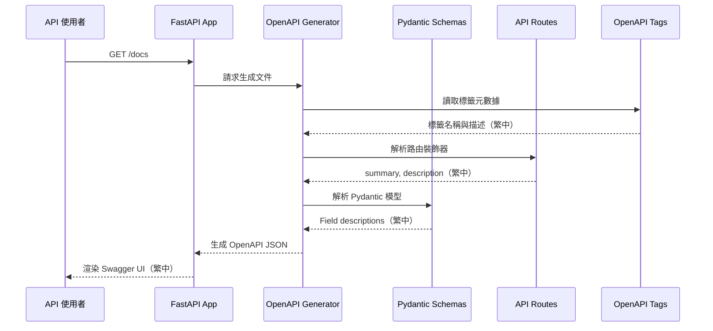

# 技術設計文件

## 概述

本設計文件說明如何將 Wasteland Tarot FastAPI 後端的 Swagger UI 文件全面本地化為繁體中文。透過直接修改 Python 程式碼中的文件字串（docstrings、Field descriptions、router decorators），確保 `/docs`、`/redoc` 和 `/openapi.json` 三個端點均能正確顯示繁體中文內容。

### 技術方法
採用**原地翻譯（In-place Translation）**策略，直接修改現有程式碼中的英文文件字串為繁體中文，無需引入額外的國際化框架或配置檔案。這種方法最符合專案需求，因為：
1. 專案主要語言為繁體中文（zh-TW）
2. 不需要多語言切換功能
3. 保持程式碼簡潔，避免過度工程化
4. FastAPI 原生支援透過程式碼內文件字串生成 OpenAPI 規格

## 需求映射

### 設計元件可追溯性

每個設計元件對應特定需求：

| 設計元件 | 對應需求 | 說明 |
|---------|---------|------|
| **FastAPI 應用程式配置中文化** | 需求 1 | 修改 `app/main.py` 的 FastAPI() 參數 |
| **API 標籤元數據中文化** | 需求 2 | 修改 `openapi_tags` 清單內容 |
| **路由裝飾器參數中文化** | 需求 3 | 修改所有 `@router` 裝飾器的 summary/description |
| **Pydantic Field 描述中文化** | 需求 4, 5, 7 | 修改所有 `Field(description=...)` 參數 |
| **回應範例中文化** | 需求 5 | 修改 `responses` 字典中的範例資料 |
| **錯誤訊息中文化** | 需求 6 | 修改 HTTP 例外處理器的錯誤訊息 |
| **Schema 文件字串中文化** | 需求 7 | 修改 Pydantic 模型的 class docstrings |
| **Enum 類別文件化** | 需求 4.6, 10 | 為 Enum 值添加繁體中文註解 |
| **術語一致性保證** | 需求 10 | 建立術語對照表並嚴格遵循 |
| **格式與功能保持** | 需求 11 | 翻譯時保留 Markdown、程式碼區塊格式 |
| **品質檢查機制** | 需求 12 | 建立翻譯前後對比與測試流程 |

### 使用者故事覆蓋

| 使用者故事 | 技術實現方式 |
|-----------|-------------|
| API 使用者檢視 Swagger UI 主要資訊 | 修改 `FastAPI(title=..., description=...)` 參數為繁體中文 |
| API 使用者瀏覽端點分類標籤 | 翻譯 `openapi_tags` 陣列中的 `name` 和 `description` |
| API 使用者理解端點功能 | 翻譯路由裝飾器的 `summary`, `description`, `response_description` |
| API 使用者理解參數意義 | 翻譯 Pydantic Field 的 `description` 參數 |
| API 使用者理解回應格式 | 翻譯 Schema 模型的欄位描述與範例值 |
| API 使用者理解錯誤原因 | 翻譯 HTTPException 和例外處理器的錯誤訊息 |
| 系統整合者使用 OpenAPI 規格 | 確保 `/openapi.json` 包含完整繁體中文描述 |
| 開發維護者保持程式碼品質 | 建立翻譯指南與審查流程 |

## 架構

### 系統架構圖

```mermaid
graph TB
    subgraph "使用者層"
        A[API 使用者<br/>瀏覽器]
    end

    subgraph "FastAPI 應用程式層"
        B[FastAPI App<br/>main.py]
        C[OpenAPI 生成器<br/>自動生成]
    end

    subgraph "文件來源層"
        D[路由裝飾器<br/>@router.get/post]
        E[Pydantic Schemas<br/>app/schemas/]
        F[標籤元數據<br/>openapi_tags]
        G[例外處理器<br/>exception_handlers]
    end

    subgraph "輸出端點"
        H[/docs<br/>Swagger UI]
        I[/redoc<br/>ReDoc]
        J[/openapi.json<br/>OpenAPI Spec]
    end

    A --> H
    A --> I
    A --> J
    B --> C
    C --> H
    C --> I
    C --> J
    D --> C
    E --> C
    F --> C
    G --> C

    style D fill:#e1f5ff
    style E fill:#e1f5ff
    style F fill:#e1f5ff
    style G fill:#e1f5ff
```

### 技術堆疊

基於現有專案技術堆疊（來自 `.kiro/steering/tech.md`）：

- **後端框架**: FastAPI 0.104.0+
- **語言**: Python 3.11+
- **套件管理**: uv（虛擬環境於 `/backend/.venv`）
- **資料驗證**: Pydantic 2.5.0+
- **ASGI 伺服器**: Uvicorn 0.24.0+
- **文件生成**: FastAPI 內建 OpenAPI 3.1.0

### 架構決策理由

#### 為何選擇原地翻譯（In-place Translation）

**決策**：直接修改 Python 程式碼中的文件字串，不使用 i18n 框架。

**理由**：
1. **專案需求單一**：產品主要語言為繁體中文，無需多語言切換
2. **簡化維護**：避免引入 gettext、Babel 等額外依賴
3. **原生支援**：FastAPI 原生透過 docstrings 和 Field descriptions 生成文件
4. **開發效率**：減少抽象層，直接看到最終顯示內容
5. **符合 CLAUDE.md 原則**：避免過度設計和過度工程化

#### 為何不使用 FastAPI i18n 插件

**考量的替代方案**：fastapi-i18n、fastapi-babel

**拒絕理由**：
1. 增加專案複雜度
2. 需要維護額外的翻譯檔案（.po/.mo）
3. 多語言切換功能對本專案無價值
4. 可能影響 OpenAPI 規格生成的穩定性

#### 為何選擇分階段中文化

**決策**：依照檔案類型分階段執行（main.py → schemas → api routes）

**理由**：
1. **風險控制**：每階段完成後測試，避免大規模錯誤
2. **易於 code review**：每個 PR 範圍明確
3. **進度可視化**：清楚追蹤完成進度
4. **回溯方便**：若發現問題可快速定位問題階段

### 資料流程

#### 文件生成流程



## 元件與介面

### 修改範圍概覽

| 元件類型 | 檔案路徑 | 修改項目 | 數量估計 |
|---------|---------|---------|---------|
| 應用程式配置 | `app/main.py` | title, description, contact, license_info, openapi_tags | 1 檔案 |
| API 路由 | `app/api/**/*.py` | @router 裝飾器參數 | 20 檔案，183 端點 |
| Pydantic Schemas | `app/schemas/*.py` | Field descriptions, class docstrings | 8 檔案，114 模型 |
| 例外處理 | `app/core/exceptions.py` | HTTPException 訊息 | 1 檔案，約 15 例外類別 |

### 程式碼修改模式

#### 1. FastAPI 應用程式配置（app/main.py）

**修改前：**
```python
app = FastAPI(
    title=settings.project_name,
    version=settings.version,
    description="""
    # ☢️ Wasteland Tarot API ☢️

    **Welcome to the post-apocalyptic world of Fallout-themed Tarot readings!**

    Navigate the wasteland with mystical guidance...
    """,
    openapi_tags=[
        {
            "name": "🃏 Cards",
            "description": """
            **Wasteland Tarot Card Operations**

            Access the complete 78-card deck...
            """,
        },
    ],
    contact={
        "name": "Wasteland Tarot Team",
        "email": "contact@wastelandtarot.com",
    },
)
```

**修改後：**
```python
app = FastAPI(
    title="廢土塔羅 API",  # 或保留英文 "Wasteland Tarot API"
    version=settings.version,
    description="""
    # ☢️ 廢土塔羅 API ☢️

    **歡迎來到輻射（Fallout）主題塔羅占卜的後末日世界！**

    透過 78 張廢土塔羅牌的神秘指引，在廢土中找到你的方向...
    """,
    openapi_tags=[
        {
            "name": "🃏 卡牌",
            "description": """
            **廢土塔羅牌操作**

            存取完整的 78 張卡牌組，包含豐富的輻射主題內容：
            - 大阿爾克那（Major Arcana）：22 張代表主要生命力量的卡牌
            - 小阿爾克那（Minor Arcana）：56 張橫跨 4 種廢土花色的卡牌
            - 搜尋、篩選並依各種條件探索
            - 快速占卜用的隨機卡牌
            """,
        },
    ],
    contact={
        "name": "廢土塔羅團隊",
        "email": "contact@wastelandtarot.com",
    },
    license_info={
        "name": "MIT 授權條款",
        "url": "https://opensource.org/licenses/MIT",
    },
)
```

#### 2. API 路由裝飾器（app/api/v1/endpoints/cards.py）

**修改前：**
```python
@router.get(
    "/",
    response_model=CardListResponse,
    summary="Get All Cards",
    description="""
    **Get complete Wasteland Tarot deck with filtering and pagination**

    Retrieve the complete 78-card Wasteland Tarot deck with powerful filtering options:

    - **Pagination**: Control page size and navigation
    - **Suit Filtering**: Filter by Major Arcana or specific Minor Arcana suits
    """,
    response_description="Paginated list of Wasteland Tarot cards with filtering applied",
)
async def get_all_cards(...):
```

**修改後：**
```python
@router.get(
    "/",
    response_model=CardListResponse,
    summary="取得所有卡牌",
    description="""
    **取得完整廢土塔羅牌組並支援篩選與分頁**

    取得完整的 78 張廢土塔羅牌，並提供強大的篩選選項：

    - **分頁（Pagination）**：控制每頁大小與導航
    - **花色篩選**：依大阿爾克那或特定小阿爾克那花色篩選
    - **業力對齊（Karma Alignment）**：尋找與特定業力等級相容的卡牌
    - **輻射等級**：依環境輻射需求篩選
    - **威脅等級**：依危險度/難度評級篩選
    - **搜尋**：跨卡牌名稱與意義的全文搜尋

    適用於：
    - 建立卡牌選擇介面
    - 建立篩選後的牌組視圖
    - 實作卡牌瀏覽器
    - 研究與分析工具
    """,
    response_description="已套用篩選的廢土塔羅牌分頁清單",
)
async def get_all_cards(...):
```

#### 3. Pydantic Schema 欄位（app/schemas/cards.py）

**修改前：**
```python
class CardBase(BaseModel):
    """Base card schema with essential information"""
    name: str = Field(..., description="Card name", example="The Wanderer")
    suit: WastelandSuit = Field(..., description="Card suit", example=WastelandSuit.MAJOR_ARCANA)
    number: Optional[int] = Field(None, description="Card number (None for Major Arcana)", example=0)
    upright_meaning: str = Field(..., description="Upright interpretation", example="New beginnings in the wasteland")
```

**修改後：**
```python
class CardBase(BaseModel):
    """卡牌基礎資料結構，包含核心資訊"""
    name: str = Field(..., description="卡牌名稱", example="流浪者（The Wanderer）")
    suit: WastelandSuit = Field(..., description="卡牌花色", example=WastelandSuit.MAJOR_ARCANA)
    number: Optional[int] = Field(None, description="卡牌編號（大阿爾克那為 None）", example=0)
    upright_meaning: str = Field(..., description="正位意義", example="廢土中的新開始")
```

#### 4. Enum 類別文件化（app/schemas/cards.py）

**修改前：**
```python
class WastelandSuit(str, Enum):
    """Fallout-themed tarot suits"""
    MAJOR_ARCANA = "major_arcana"
    NUKA_COLA_BOTTLES = "nuka_cola_bottles"
    COMBAT_WEAPONS = "combat_weapons"
    BOTTLE_CAPS = "bottle_caps"
    RADIATION_RODS = "radiation_rods"
```

**修改後：**
```python
class WastelandSuit(str, Enum):
    """輻射（Fallout）主題塔羅花色"""
    MAJOR_ARCANA = "major_arcana"  # 大阿爾克那
    NUKA_COLA_BOTTLES = "nuka_cola_bottles"  # 核子可樂瓶（聖杯）
    COMBAT_WEAPONS = "combat_weapons"  # 戰鬥武器（權杖）
    BOTTLE_CAPS = "bottle_caps"  # 瓶蓋（錢幣）
    RADIATION_RODS = "radiation_rods"  # 輻射棒（寶劍）
```

#### 5. 錯誤訊息中文化（app/core/exceptions.py）

**修改前：**
```python
class CardNotFoundError(WastelandTarotException):
    def __init__(self, card_id: str):
        super().__init__(
            status_code=404,
            detail=f"Card with ID '{card_id}' not found in the wasteland",
            error_code="CARD_NOT_FOUND"
        )
```

**修改後：**
```python
class CardNotFoundError(WastelandTarotException):
    def __init__(self, card_id: str):
        super().__init__(
            status_code=404,
            detail=f"在廢土中找不到 ID 為 '{card_id}' 的卡牌",
            error_code="CARD_NOT_FOUND"
        )
```

### API 端點清單

本專案包含約 183 個 API 端點，主要分布於以下模組：

| 模組 | 端點數量估計 | 檔案路徑 |
|-----|-------------|---------|
| Cards | ~18 | `app/api/cards.py`, `app/api/v1/endpoints/cards.py` |
| Readings | ~40 | `app/api/readings.py`, `app/api/readings_enhanced.py`, `app/api/v1/endpoints/readings.py`, `app/api/v1/endpoints/readings_stream.py` |
| Spreads | ~6 | `app/api/spreads.py`, `app/api/v1/endpoints/spreads.py` |
| Character Voices | ~6 | `app/api/v1/endpoints/voices.py` |
| Social | ~21 | `app/api/social.py`, `app/api/v1/endpoints/social.py` |
| Authentication | ~8 | `app/api/auth.py`, `app/api/oauth.py`, `app/api/webauthn.py` |
| Bingo | ~8 | `app/api/v1/endpoints/bingo.py` |
| Analytics | ~19 | `app/api/v1/endpoints/analytics.py` |
| Preferences | ~12 | `app/api/v1/endpoints/preferences.py` |
| Monitoring | ~20 | `app/api/monitoring.py`, `app/api/v1/endpoints/monitoring.py` |
| Karma | ~9 | `app/api/karma.py` |

**範例端點中文化對照：**

| HTTP 方法 | 路由 | 原 Summary | 中文 Summary | 認證 | 狀態碼 |
|----------|------|-----------|-------------|------|--------|
| GET | /api/v1/cards | Get All Cards | 取得所有卡牌 | 選用 | 200, 500 |
| GET | /api/v1/cards/{card_id} | Get Card by ID | 依 ID 取得卡牌 | 選用 | 200, 404, 500 |
| POST | /api/v1/readings | Create Reading | 建立占卜 | 必要 | 201, 400, 401, 500 |
| GET | /api/v1/readings | List Readings | 列出占卜記錄 | 必要 | 200, 401, 500 |
| GET | /api/v1/readings/{id}/stream | Stream Interpretation | 串流解讀 | 必要 | 200, 401, 404 |
| POST | /api/v1/auth/register | Register User | 註冊使用者 | 無 | 201, 400, 409 |
| POST | /api/v1/auth/login | Login | 登入 | 無 | 200, 401 |

## 資料模型

### 領域實體

本專案的資料模型已經完整定義於 `app/schemas/` 目錄，中文化不涉及資料庫 schema 變更，僅修改 Pydantic 模型的文件字串。

#### 主要 Pydantic Schema 模組

1. **cards.py** (12 個模型)
   - `WastelandCard`: 廢土塔羅牌完整資料
   - `CardBase`: 卡牌基礎資訊
   - `WastelandCardMetadata`: 廢土特定屬性
   - `CharacterInterpretations`: 角色聲音解讀
   - `FactionSignificances`: 派系意義
   - 相關 Enum: `WastelandSuit`, `KarmaAlignment`, `CharacterVoice`, `FactionAlignment`

2. **readings.py** (28 個模型)
   - `ReadingCreate`: 建立占卜請求
   - `ReadingResponse`: 占卜回應
   - `ReadingUpdate`: 更新占卜
   - `StreamingInterpretation`: 串流解讀

3. **spreads.py** (11 個模型)
   - `SpreadLayout`: 牌陣佈局
   - `SpreadPosition`: 牌位定義
   - `SpreadCreate`: 建立牌陣

4. **voices.py** (13 個模型)
   - `CharacterVoiceConfig`: 角色聲音配置
   - `VoiceInterpretationStyle`: 解讀風格

5. **social.py** (15 個模型)
   - `Comment`: 評論
   - `Like`: 按讚
   - `Share`: 分享

6. **bingo.py** (11 個模型)
   - `BingoCard`: 賓果卡
   - `BingoNumber`: 賓果號碼

7. **sessions.py** (7 個模型)
   - `SessionCreate`: 建立會話
   - `SessionResponse`: 會話回應

8. **webauthn.py** (17 個模型)
   - `WebAuthnRegistration`: WebAuthn 註冊
   - `WebAuthnAuthentication`: WebAuthn 認證

### Schema 中文化範例

**修改前（cards.py）：**
```python
class WastelandCardMetadata(BaseModel):
    """Wasteland-specific card attributes"""
    radiation_level: float = Field(
        default=0.0,
        ge=0.0,
        le=1.0,
        description="Radiation level (0.0 to 1.0)",
        example=0.3
    )
    threat_level: int = Field(
        default=1,
        ge=1,
        le=10,
        description="Threat level (1-10 scale)",
        example=5
    )
```

**修改後（cards.py）：**
```python
class WastelandCardMetadata(BaseModel):
    """廢土特定卡牌屬性"""
    radiation_level: float = Field(
        default=0.0,
        ge=0.0,
        le=1.0,
        description="輻射等級（0.0 至 1.0）",
        example=0.3
    )
    threat_level: int = Field(
        default=1,
        ge=1,
        le=10,
        description="威脅等級（1-10 分級）",
        example=5
    )
```

### 資料庫 Schema

**重要說明**：此功能**不涉及資料庫 schema 變更**。

- 資料庫欄位名稱保持英文（例如 `radiation_level`, `threat_level`）
- 僅修改 Pydantic 模型的 `description` 參數，影響 API 文件顯示
- 資料庫遷移（Alembic migrations）不受影響

## 錯誤處理

### 錯誤訊息中文化策略

#### 自定義例外類別

修改 `app/core/exceptions.py` 中的自定義例外：

```python
class WastelandTarotException(Exception):
    """廢土塔羅基礎例外類別"""
    def __init__(
        self,
        status_code: int,
        detail: str,
        error_code: str = "WASTELAND_ERROR"
    ):
        self.status_code = status_code
        self.detail = detail
        self.error_code = error_code

class CardNotFoundError(WastelandTarotException):
    """卡牌未找到錯誤"""
    def __init__(self, card_id: str):
        super().__init__(
            status_code=404,
            detail=f"在廢土中找不到 ID 為 '{card_id}' 的卡牌",
            error_code="CARD_NOT_FOUND"
        )

class ReadingNotFoundError(WastelandTarotException):
    """占卜記錄未找到錯誤"""
    def __init__(self, reading_id: str):
        super().__init__(
            status_code=404,
            detail=f"找不到 ID 為 '{reading_id}' 的占卜記錄",
            error_code="READING_NOT_FOUND"
        )

class InsufficientKarmaError(WastelandTarotException):
    """業力點數不足錯誤"""
    def __init__(self, required: int, current: int):
        super().__init__(
            status_code=403,
            detail=f"業力點數不足。需要 {required} 點，目前僅有 {current} 點",
            error_code="INSUFFICIENT_KARMA"
        )

class RadiationOverloadError(WastelandTarotException):
    """輻射超載錯誤"""
    def __init__(self, current_level: float):
        super().__init__(
            status_code=400,
            detail=f"輻射等級過高（{current_level:.2f}），請先使用輻射消除劑",
            error_code="RADIATION_OVERLOAD"
        )
```

#### Pydantic 驗證錯誤

FastAPI 自動處理的 Pydantic 驗證錯誤（422 狀態碼）無法直接中文化，但可在 Field 的 `description` 中提供清楚的參數說明，幫助使用者理解正確格式。

#### 標準 HTTP 錯誤

保持 FastAPI 預設的 HTTP 錯誤處理，但在 `responses` 參數中提供繁體中文說明：

```python
@router.get(
    "/{card_id}",
    responses={
        200: {"description": "成功取得卡牌資料"},
        404: {"description": "找不到指定的卡牌"},
        500: {"description": "伺服器內部錯誤"},
    }
)
```

## 安全考量

此功能為純文件本地化，**不涉及安全性變更**：

- 不修改認證授權邏輯
- 不改變 API 端點路徑或參數
- 不影響資料驗證規則
- 不變更 CORS 或安全中介軟體

**注意事項**：
- 確保繁體中文字串不包含惡意腳本（XSS 防護）
- Swagger UI 和 ReDoc 會自動轉義 HTML 特殊字元
- 保持原有的輸入驗證邏輯不變

## 效能與可擴展性

### 效能影響評估

| 面向 | 影響 | 說明 |
|-----|------|------|
| OpenAPI 規格生成 | **無影響** | FastAPI 在啟動時生成一次 OpenAPI JSON，中文字串不增加生成時間 |
| API 端點回應時間 | **無影響** | 文件字串不參與執行階段邏輯 |
| 記憶體使用 | **微增（<1MB）** | 繁體中文字串略長於英文，但總量可忽略 |
| Swagger UI 渲染 | **無影響** | 前端渲染速度與語言無關 |
| `/openapi.json` 大小 | **增加約 20-30%** | 繁體中文字元數較多，JSON 檔案稍大 |

### 可擴展性考量

#### 未來多語言支援（如需）

若未來需要支援多語言切換，可採用以下策略：

1. **引入 i18n 框架**：使用 `fastapi-i18n` 或 `babel`
2. **環境變數控制**：透過 `LANGUAGE=zh-TW` 決定文件語言
3. **動態文件生成**：根據 `Accept-Language` header 切換語言

**目前不實作的理由**：
- 產品需求明確為繁體中文單一語言
- 避免過度工程化（CLAUDE.md 原則）
- 保持程式碼簡潔可維護

#### 術語對照表維護

建立術語對照表檔案 `backend/docs/zh-tw-glossary.md`：

```markdown
# 繁體中文術語對照表

| 英文術語 | 繁體中文 | 備註 |
|---------|---------|------|
| Major Arcana | 大阿爾克那 | 塔羅術語，保留原文音譯 |
| Minor Arcana | 小阿爾克那 | 同上 |
| Upright | 正位 | 塔羅牌方向 |
| Reversed | 逆位 | 同上 |
| Karma | 業力 | Fallout 遊戲機制 |
| Radiation | 輻射 | Fallout 主題元素 |
| Vault | 避難所 | Fallout 專有名詞 |
| Wasteland | 廢土 | Fallout 世界觀 |
| Spread | 牌陣 | 塔羅術語 |
| Reading | 占卜 | 塔羅活動 |
```

## 測試策略

### 風險矩陣

| 領域 | 風險 | 必測 | 選測 | 參考 |
|-----|------|------|------|------|
| 翻譯完整性 | H | Unit（文字比對） | Manual Review | 需求 12 |
| Swagger UI 渲染 | M | E2E（視覺檢查） | A11y | 需求 11.6 |
| OpenAPI 規格正確性 | H | Integration（JSON 驗證） | Schema 驗證 | 需求 8 |
| 術語一致性 | M | Unit（術語表比對） | - | 需求 10 |
| 功能不受影響 | H | E2E（既有測試通過） | Regression | 需求 11 |

### 各層級測試

#### 單元測試（Unit Tests）

**目標**：驗證文件字串正確性

```python
# backend/tests/unit/test_swagger_localization.py

def test_main_app_description_is_chinese():
    """驗證應用程式描述為繁體中文"""
    from app.main import app
    assert "廢土塔羅" in app.description
    assert "歡迎來到" in app.description

def test_openapi_tags_are_chinese():
    """驗證 API 標籤為繁體中文"""
    from app.main import app
    tags = {tag["name"] for tag in app.openapi_tags}
    assert "🃏 卡牌" in tags
    assert "📖 占卜" in tags

def test_card_schema_fields_are_chinese():
    """驗證卡牌 Schema 欄位描述為繁體中文"""
    from app.schemas.cards import CardBase
    schema = CardBase.model_json_schema()
    assert "卡牌名稱" in schema["properties"]["name"]["description"]
```

#### 整合測試（Integration Tests）

**目標**：驗證 OpenAPI 規格生成

```python
# backend/tests/integration/test_openapi_spec.py

def test_openapi_json_contains_chinese(client):
    """驗證 /openapi.json 包含繁體中文"""
    response = client.get("/openapi.json")
    assert response.status_code == 200

    openapi_spec = response.json()

    # 驗證 info 區塊
    assert "廢土塔羅" in openapi_spec["info"]["title"]

    # 驗證 tags 區塊
    tag_names = [tag["name"] for tag in openapi_spec.get("tags", [])]
    assert "🃏 卡牌" in tag_names

    # 驗證端點描述
    paths = openapi_spec.get("paths", {})
    cards_endpoint = paths.get("/api/v1/cards", {})
    get_operation = cards_endpoint.get("get", {})
    assert "取得所有卡牌" in get_operation.get("summary", "")
```

#### E2E 測試（End-to-End Tests）

**目標**：驗證 Swagger UI 正確顯示

```python
# tests/e2e/swagger-ui-localization.spec.ts (Playwright)

import { test, expect } from '@playwright/test';

test('Swagger UI displays Chinese documentation', async ({ page }) => {
  await page.goto('http://localhost:8000/docs');

  // 驗證標題
  await expect(page.locator('h2')).toContainText('廢土塔羅 API');

  // 驗證標籤
  await expect(page.locator('text=🃏 卡牌')).toBeVisible();

  // 展開端點
  await page.click('text=取得所有卡牌');

  // 驗證參數描述
  await expect(page.locator('text=卡牌花色')).toBeVisible();
});

test('ReDoc displays Chinese documentation', async ({ page }) => {
  await page.goto('http://localhost:8000/redoc');

  await expect(page.locator('h1')).toContainText('廢土塔羅 API');
});
```

### CI 閘門

| 階段 | 執行測試 | 閘門 | SLA |
|-----|---------|------|-----|
| PR | Unit + Integration | Fail = block | ≤3 分鐘 |
| Merge to main | E2E（Swagger UI） | Fail = block | ≤5 分鐘 |
| Manual Review | 術語一致性檢查 | Advisory | - |

### 退出條件

- ✅ 所有單元測試通過（文字驗證）
- ✅ OpenAPI JSON 規格驗證通過
- ✅ Swagger UI 和 ReDoc 手動檢查通過
- ✅ 術語對照表一致性驗證
- ✅ 既有功能測試無迴歸

## 實作策略

### 分階段執行計畫

**第一階段：核心配置（1 個檔案）**
- `app/main.py`: FastAPI 應用程式配置、openapi_tags

**第二階段：Pydantic Schemas（8 個檔案）**
- `app/schemas/cards.py`
- `app/schemas/readings.py`
- `app/schemas/spreads.py`
- `app/schemas/voices.py`
- `app/schemas/social.py`
- `app/schemas/bingo.py`
- `app/schemas/sessions.py`
- `app/schemas/webauthn.py`

**第三階段：API 路由（20 個檔案）**
依模組依序中文化，每完成一個模組提交一次

**第四階段：例外處理（1 個檔案）**
- `app/core/exceptions.py`

**第五階段：整合測試與驗證**
- 建立測試案例
- 執行 E2E 測試
- 手動審查 Swagger UI

### 翻譯原則

1. **保留技術術語原文**：如 `API`, `JSON`, `HTTP`, `UUID`
2. **Fallout 專有名詞保留原文並加註中文**：如「Pip-Boy（嗶嗶小子）」
3. **塔羅專業術語音譯**：如「阿爾克那（Arcana）」
4. **程式碼與範例保持英文**：僅翻譯註解
5. **Markdown 格式保留**：粗體、列表、程式碼區塊
6. **Emoji 保留**：標籤與描述中的 emoji 不變

### 品質保證檢查清單

- [ ] 所有 Field descriptions 已翻譯
- [ ] 所有 router 裝飾器參數已翻譯
- [ ] 所有 openapi_tags 已翻譯
- [ ] 所有 class docstrings 已翻譯
- [ ] 所有自定義例外訊息已翻譯
- [ ] Enum 類別已加註繁體中文註解
- [ ] 術語使用符合對照表
- [ ] 沒有殘留未翻譯的英文描述
- [ ] Swagger UI 渲染正常
- [ ] ReDoc 渲染正常
- [ ] OpenAPI JSON 驗證通過

---

## 附錄：技術研究摘要

### FastAPI 文件生成機制

FastAPI 透過以下來源自動生成 OpenAPI 規格：

1. **FastAPI() 初始化參數**
   - `title`: 應用程式標題
   - `description`: Markdown 格式的應用程式描述
   - `version`: 版本號
   - `openapi_tags`: 標籤元數據陣列
   - `contact`: 聯絡資訊
   - `license_info`: 授權資訊

2. **路由裝飾器參數**
   - `summary`: 端點簡短摘要
   - `description`: 端點詳細說明（支援 Markdown）
   - `response_description`: 回應說明
   - `responses`: 狀態碼對應的詳細說明

3. **Pydantic 模型**
   - Class docstring → Schema 描述
   - `Field(description=...)` → 欄位描述
   - `Field(example=...)` → 範例值
   - `model_config["json_schema_extra"]` → 額外 Schema 設定

### 參考資源

- FastAPI 官方文件：https://fastapi.tiangolo.com/tutorial/metadata/
- OpenAPI 3.1.0 規格：https://spec.openapis.org/oas/v3.1.0
- Pydantic V2 文件：https://docs.pydantic.dev/latest/
