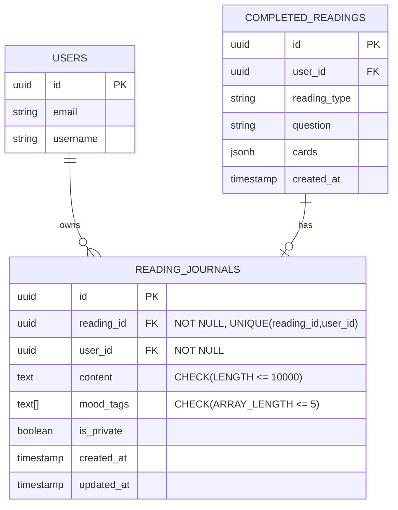

# 技術設計文件 - 塔羅日記系統

## Overview

塔羅日記系統是 Wasteland Tarot 平台的核心功能擴展，讓使用者能在完成占卜後記錄心得、反思與心情，透過長期的日記累積提供個人化的占卜體驗回顧，增強使用者參與度與平台粘性。

**目的**: 提供深度占卜體驗記錄與回顧功能，讓使用者能追蹤自己的心境變化與占卜準確度，透過日記撰寫促進反思，目標提升 20-25% 的使用者留存率。

**使用者**: 所有完成占卜的註冊使用者，特別是需要長期追蹤占卜體驗、進行自我探索、或想要回顧占卜準確度的深度用戶。

**影響**: 日記系統將整合現有的 `CompletedReading` 資料模型，新增獨立的日記儲存與查詢機制，在占卜完成後提供日記撰寫入口，並提供專屬的 `/journal` 頁面供使用者管理所有日記。

### Goals

- 實作完整的日記 CRUD 功能（新增、查詢、更新、刪除）
- 提供 Markdown 編輯與即時預覽（Phase 1 使用簡單的 textarea）
- 支援 8 個預設心情標籤，每篇日記最多 5 個標籤
- 實作客戶端全文搜尋（關鍵字、心情標籤篩選）
- 日記列表支援分頁（每頁 20 篇）
- API 回應時間中位數 < 500ms
- 支援 10,000 字以內的 Markdown 內容

### Non-Goals

- **Phase 1 不包含**：進階 Markdown 編輯器（如 MDX Editor）
- **Phase 1 不包含**：PDF 匯出功能
- **Phase 1 不包含**：後端全文搜尋索引（PostgreSQL FTS）
- **Phase 1 不包含**：自訂心情標籤
- **Phase 1 不包含**：日記分享功能（唯讀連結）
- **Phase 1 不包含**：日記公開/社群功能
- **Phase 1 不包含**：日記統計儀表板

---

## Architecture

### 現有架構分析

**現有系統整合點**:

1. **CompletedReading 模型** (`backend/app/models/reading.py`)
   - `CompletedReading`: 儲存完成的占卜記錄
   - 包含 `user_id`, `reading_type`, `question`, `cards` 等資訊
   - 日記系統將透過 `reading_id` 外鍵關聯此表

2. **使用者認證系統** (`backend/app/core/auth.py`)
   - JWT Token 驗證機制
   - `get_current_user` dependency
   - 日記 API 將使用相同的認證流程

3. **前端路由結構** (`src/app/`)
   - App Router 架構（Next.js 14+）
   - 新增 `/journal` 路由群組
   - 整合現有的 Layout 與 Navigation

**現有架構模式**:
- **Service Layer 模式**: 業務邏輯封裝於 `*_service.py`
- **Repository 模式**: 透過 SQLAlchemy ORM 存取資料
- **Pydantic Schema 驗證**: API 輸入輸出驗證
- **Zustand 前端狀態管理**: 全域狀態儲存

**必須維護的整合點**:
- `CompletedReading` 的外鍵關聯
- 使用者認證的 JWT Token 機制
- 現有的 API 錯誤處理模式（HTTPException）
- 前端的 Layout 與 Navigation 元件

### 高階架構

```mermaid
graph TB
    subgraph "Frontend (Next.js)"
        JournalList[/journal - 日記列表頁]
        JournalDetail[/journal/:id - 日記詳情頁]
        JournalEditor[日記編輯元件]
        SearchBar[搜尋元件]
        Store[journalStore Zustand]
    end

    subgraph "Backend (FastAPI)"
        API[Journal API Endpoints]
        Service[JournalService]
        Validator[Content Validator]

        subgraph "Existing Services"
            AuthService[Auth Service]
            ReadingService[Reading Service]
        end
    end

    subgraph "Data Layer"
        ReadingJournal[ReadingJournal 表]
        CompletedReading[CompletedReading 表]
        Users[Users 表]
        PostgreSQL[(PostgreSQL)]
    end

    JournalList --> Store
    JournalDetail --> Store
    JournalEditor --> Store
    SearchBar --> Store

    Store --> API
    API --> Service
    Service --> Validator
    Service --> AuthService
    Service --> ReadingService

    Service --> ReadingJournal
    ReadingJournal --> CompletedReading
    ReadingJournal --> Users

    ReadingJournal --> PostgreSQL
    CompletedReading --> PostgreSQL
    Users --> PostgreSQL
```

**架構整合說明**:

- **現有模式保留**: 遵循 Service Layer + Repository 模式
- **新增元件理由**:
  - `JournalService`: 統一日記業務邏輯（CRUD、權限檢查）
  - `ContentValidator`: Markdown 內容驗證（長度、XSS 防護）
  - `journalStore`: 前端狀態管理（日記列表、搜尋狀態）
- **技術棧對齊**: 使用現有的 FastAPI + SQLAlchemy + Pydantic
- **Steering 遵循**: 符合 `structure.md` 的 Service Layer 原則

### 技術對齊說明

本功能為**現有系統擴展**，遵循已建立的技術棧與架構模式：

**後端技術對齊**:
- FastAPI 框架：新增 `/api/v1/journal` endpoints
- SQLAlchemy ORM：新增 `ReadingJournal` 模型
- Pydantic Schema：定義 `JournalCreate`, `JournalUpdate`, `JournalResponse` schema
- AsyncIO：所有資料庫操作使用 async/await
- Alembic：資料庫 migration 管理

**前端技術對齊**:
- Next.js App Router：新增 `/journal` 頁面群組
- Zustand：新增 `journalStore`（遵循 `authStore` 模式）
- Tailwind CSS v4：使用現有 Pip-Boy 配色（`#00ff88`, `#ff8800`）
- **PixelIcon**: 使用 RemixIcon 圖示元件（**絕對禁止** lucide-react）
- Cubic 11 字體：自動繼承全域字體設定
- react-markdown：Markdown 渲染（輕量、安全）

**新增依賴項**:
- `react-markdown`: Markdown 渲染（前端）
- `remark-gfm`: GitHub Flavored Markdown 支援（前端）

### 關鍵設計決策

#### 決策 1: Markdown 儲存格式

**決策**: 儲存原始 Markdown 文字，渲染時前端處理

**理由**:
- ✅ 儲存原始格式保留使用者意圖
- ✅ 未來可支援不同渲染器（PDF、Rich Text）
- ✅ 資料庫查詢簡單（純文字）
- ❌ 前端需要處理 XSS 風險（透過 `react-markdown` 自動過濾）

**替代方案**:
- 儲存 HTML：增加 XSS 風險，資料庫空間佔用大
- 儲存結構化 JSON：過度設計，不符合簡單優先原則

#### 決策 2: 搜尋實作策略（Phase 1）

**決策**: 客戶端搜尋（JavaScript `.filter()`）

**理由**:
- ✅ 實作簡單，無需後端索引
- ✅ 適合小數據量（假設單用戶 < 100 篇日記）
- ✅ 即時回應（無網路延遲）
- ❌ 僅搜尋當前分頁（每頁 20 篇）
- ❌ 無法跨分頁搜尋（Phase 2 改進）

**替代方案**:
- PostgreSQL Full-Text Search：過度設計（Phase 3 功能）
- Elasticsearch：殺雞用牛刀

**Phase 2 改進計畫**: 後端 API 支援 `?search=keyword` 參數

#### 決策 3: 日記與占卜的關聯策略

**決策**: 強制綁定（`reading_id NOT NULL` + UNIQUE constraint）

**理由**:
- ✅ 保持簡單：每個占卜最多一篇日記
- ✅ 數據完整性：日記必定有對應的占卜記錄
- ✅ 查詢簡單：JOIN 不需要處理 NULL
- ❌ 無法撰寫「純心情日記」（未來需求再放寬）

**UNIQUE constraint**: `(reading_id, user_id)` 確保每個使用者每個占卜只能有一篇日記

**Phase 3 改進計畫**: 允許 `reading_id NULLABLE`，支援純心情日記

#### 決策 4: 心情標籤實作方式

**決策**: PostgreSQL `TEXT[]` 陣列儲存預設標籤

**理由**:
- ✅ 簡單：不需要額外的 `mood_tags` 表
- ✅ 查詢方便：支援 `ANY(mood_tags)` 查詢
- ✅ 適合預設標籤場景（8 個固定選項）
- ❌ 無法支援自訂標籤（Phase 3 功能）

**替代方案**:
- JSONB: 過度設計，查詢效能較差
- 關聯表（MoodTag + JournalMoodTag）: 適合自訂標籤場景，但 Phase 1 不需要

---

## API Design

### API Endpoints 總覽

| Method | Endpoint | 功能 | 認證 |
|--------|----------|------|------|
| POST | `/api/v1/readings/{reading_id}/journal` | 建立日記 | Required |
| GET | `/api/v1/journal` | 列出我的日記 | Required |
| GET | `/api/v1/journal/{journal_id}` | 查看日記詳情 | Required |
| PUT | `/api/v1/journal/{journal_id}` | 更新日記 | Required |
| DELETE | `/api/v1/journal/{journal_id}` | 刪除日記 | Required |

### 1. 建立日記

**Endpoint**: `POST /api/v1/readings/{reading_id}/journal`

**Request Headers**:
```
Authorization: Bearer {jwt_token}
Content-Type: application/json
```

**Request Body**:
```json
{
  "content": "# 今日占卜心得\n\n今天抽到了「愚者」牌，讓我想起了最近的一次決定...",
  "mood_tags": ["reflective", "hopeful"],
  "is_private": true
}
```

**Pydantic Schema**:
```python
class JournalCreate(BaseModel):
    content: str = Field(..., min_length=1, max_length=10000)
    mood_tags: List[str] = Field(default=[], max_items=5)
    is_private: bool = Field(default=True)

    @validator('mood_tags')
    def validate_mood_tags(cls, v):
        allowed_tags = {
            'happy', 'anxious', 'confused', 'hopeful',
            'peaceful', 'excited', 'worried', 'reflective'
        }
        for tag in v:
            if tag not in allowed_tags:
                raise ValueError(f"Invalid mood tag: {tag}")
        return v
```

**Response** (201 Created):
```json
{
  "id": "550e8400-e29b-41d4-a716-446655440000",
  "reading_id": "660e8400-e29b-41d4-a716-446655440000",
  "user_id": "770e8400-e29b-41d4-a716-446655440000",
  "content": "# 今日占卜心得\n\n今天抽到了「愚者」牌...",
  "mood_tags": ["reflective", "hopeful"],
  "is_private": true,
  "created_at": "2025-10-23T10:30:00Z",
  "updated_at": "2025-10-23T10:30:00Z",
  "reading": {
    "id": "660e8400-e29b-41d4-a716-446655440000",
    "reading_type": "single_card",
    "question": "我今天該注意什麼？",
    "cards": [{"card_id": "major_00", "position": "present"}]
  }
}
```

**Error Responses**:
- `400 Bad Request`: 內容驗證失敗（超過 10000 字、心情標籤超過 5 個）
- `401 Unauthorized`: JWT Token 無效或過期
- `403 Forbidden`: reading_id 不屬於當前使用者
- `404 Not Found`: reading_id 不存在
- `409 Conflict`: 該占卜已有日記存在（違反 UNIQUE constraint）

### 2. 列出我的日記

**Endpoint**: `GET /api/v1/journal?page=1&limit=20`

**Query Parameters**:
- `page` (optional, default=1): 分頁頁碼
- `limit` (optional, default=20, max=50): 每頁筆數

**Response** (200 OK):
```json
{
  "journals": [
    {
      "id": "550e8400-e29b-41d4-a716-446655440000",
      "reading_id": "660e8400-e29b-41d4-a716-446655440000",
      "content_preview": "# 今日占卜心得\n\n今天抽到了「愚者」牌，讓我想起了最近的一次決定...",
      "mood_tags": ["reflective", "hopeful"],
      "is_private": true,
      "created_at": "2025-10-23T10:30:00Z",
      "reading": {
        "reading_type": "single_card",
        "question": "我今天該注意什麼？"
      }
    }
  ],
  "total": 42,
  "page": 1,
  "limit": 20,
  "total_pages": 3
}
```

**Backend Implementation**:
```python
@router.get("/journal", response_model=JournalListResponse)
async def list_journals(
    page: int = Query(1, ge=1),
    limit: int = Query(20, ge=1, le=50),
    current_user: User = Depends(get_current_user),
    db: AsyncSession = Depends(get_db)
):
    offset = (page - 1) * limit

    query = (
        select(ReadingJournal)
        .where(ReadingJournal.user_id == current_user.id)
        .order_by(ReadingJournal.created_at.desc())
        .offset(offset)
        .limit(limit)
        .options(joinedload(ReadingJournal.reading))
    )

    result = await db.execute(query)
    journals = result.scalars().all()

    total_query = select(func.count()).select_from(ReadingJournal).where(
        ReadingJournal.user_id == current_user.id
    )
    total = await db.scalar(total_query)

    return {
        "journals": [
            {
                **journal.__dict__,
                "content_preview": journal.content[:100]  # 前 100 字
            }
            for journal in journals
        ],
        "total": total,
        "page": page,
        "limit": limit,
        "total_pages": (total + limit - 1) // limit
    }
```

### 3. 查看日記詳情

**Endpoint**: `GET /api/v1/journal/{journal_id}`

**Response** (200 OK):
```json
{
  "id": "550e8400-e29b-41d4-a716-446655440000",
  "reading_id": "660e8400-e29b-41d4-a716-446655440000",
  "user_id": "770e8400-e29b-41d4-a716-446655440000",
  "content": "# 今日占卜心得\n\n今天抽到了「愚者」牌...",
  "mood_tags": ["reflective", "hopeful"],
  "is_private": true,
  "created_at": "2025-10-23T10:30:00Z",
  "updated_at": "2025-10-23T10:30:00Z",
  "reading": {
    "id": "660e8400-e29b-41d4-a716-446655440000",
    "reading_type": "single_card",
    "question": "我今天該注意什麼？",
    "cards": [
      {
        "card_id": "major_00",
        "position": "present",
        "name": "愚者",
        "image_url": "/cards/major_00.png"
      }
    ],
    "interpretation": "愚者牌代表新的開始..."
  }
}
```

**Error Responses**:
- `401 Unauthorized`: 未登入
- `403 Forbidden`: 日記不屬於當前使用者
- `404 Not Found`: 日記不存在

**權限檢查**:
```python
@router.get("/journal/{journal_id}", response_model=JournalDetailResponse)
async def get_journal(
    journal_id: UUID,
    current_user: User = Depends(get_current_user),
    db: AsyncSession = Depends(get_db)
):
    journal = await db.get(ReadingJournal, journal_id)

    if not journal:
        raise HTTPException(status_code=404, detail="Journal not found")

    if journal.user_id != current_user.id:
        raise HTTPException(status_code=403, detail="Not authorized to access this journal")

    return journal
```

### 4. 更新日記

**Endpoint**: `PUT /api/v1/journal/{journal_id}`

**Request Body** (部分更新):
```json
{
  "content": "# 更新後的內容\n\n補充一些想法...",
  "mood_tags": ["reflective", "hopeful", "peaceful"],
  "is_private": false
}
```

**Pydantic Schema**:
```python
class JournalUpdate(BaseModel):
    content: Optional[str] = Field(None, min_length=1, max_length=10000)
    mood_tags: Optional[List[str]] = Field(None, max_items=5)
    is_private: Optional[bool] = None

    @validator('mood_tags')
    def validate_mood_tags(cls, v):
        if v is None:
            return v
        allowed_tags = {
            'happy', 'anxious', 'confused', 'hopeful',
            'peaceful', 'excited', 'worried', 'reflective'
        }
        for tag in v:
            if tag not in allowed_tags:
                raise ValueError(f"Invalid mood tag: {tag}")
        return v
```

**Response** (200 OK): 返回更新後的完整 Journal 物件

**Error Responses**:
- `400 Bad Request`: 驗證失敗
- `401 Unauthorized`: 未登入
- `403 Forbidden`: 不是日記擁有者
- `404 Not Found`: 日記不存在

### 5. 刪除日記

**Endpoint**: `DELETE /api/v1/journal/{journal_id}`

**Response** (200 OK):
```json
{
  "message": "Journal deleted successfully",
  "deleted_id": "550e8400-e29b-41d4-a716-446655440000"
}
```

**Error Responses**:
- `401 Unauthorized`: 未登入
- `403 Forbidden`: 不是日記擁有者
- `404 Not Found`: 日記不存在

**Backend Implementation**:
```python
@router.delete("/journal/{journal_id}")
async def delete_journal(
    journal_id: UUID,
    current_user: User = Depends(get_current_user),
    db: AsyncSession = Depends(get_db)
):
    journal = await db.get(ReadingJournal, journal_id)

    if not journal:
        raise HTTPException(status_code=404, detail="Journal not found")

    if journal.user_id != current_user.id:
        raise HTTPException(status_code=403, detail="Not authorized to delete this journal")

    await db.delete(journal)
    await db.commit()

    return {"message": "Journal deleted successfully", "deleted_id": str(journal_id)}
```

---

## Data Model

### ReadingJournal 資料表

**Schema Definition**:
```python
from sqlalchemy import Column, String, Text, Boolean, TIMESTAMP, ForeignKey, ARRAY, CheckConstraint, UniqueConstraint
from sqlalchemy.dialects.postgresql import UUID
from sqlalchemy.orm import relationship
import uuid

class ReadingJournal(Base):
    __tablename__ = "reading_journals"

    id = Column(UUID(as_uuid=True), primary_key=True, default=uuid.uuid4)
    reading_id = Column(UUID(as_uuid=True), ForeignKey("completed_readings.id", ondelete="CASCADE"), nullable=False)
    user_id = Column(UUID(as_uuid=True), ForeignKey("users.id", ondelete="CASCADE"), nullable=False)
    content = Column(Text, nullable=False)
    mood_tags = Column(ARRAY(Text), default=[])
    is_private = Column(Boolean, default=True, nullable=False)
    created_at = Column(TIMESTAMP(timezone=True), server_default=func.now(), nullable=False)
    updated_at = Column(TIMESTAMP(timezone=True), server_default=func.now(), onupdate=func.now(), nullable=False)

    # Relationships
    reading = relationship("CompletedReading", back_populates="journal")
    user = relationship("User", back_populates="journals")

    # Constraints
    __table_args__ = (
        UniqueConstraint('reading_id', 'user_id', name='uq_reading_user_journal'),
        CheckConstraint('LENGTH(content) <= 10000', name='check_content_length'),
        CheckConstraint('ARRAY_LENGTH(mood_tags, 1) <= 5', name='check_mood_tags_count'),
    )
```

**Alembic Migration**:
```python
"""create_reading_journals_table

Revision ID: abc123def456
Revises: previous_revision
Create Date: 2025-10-23 10:00:00.000000
"""
from alembic import op
import sqlalchemy as sa
from sqlalchemy.dialects import postgresql

def upgrade():
    op.create_table(
        'reading_journals',
        sa.Column('id', postgresql.UUID(as_uuid=True), primary_key=True),
        sa.Column('reading_id', postgresql.UUID(as_uuid=True), nullable=False),
        sa.Column('user_id', postgresql.UUID(as_uuid=True), nullable=False),
        sa.Column('content', sa.Text(), nullable=False),
        sa.Column('mood_tags', postgresql.ARRAY(sa.Text()), server_default='{}'),
        sa.Column('is_private', sa.Boolean(), server_default='true', nullable=False),
        sa.Column('created_at', sa.TIMESTAMP(timezone=True), server_default=sa.func.now()),
        sa.Column('updated_at', sa.TIMESTAMP(timezone=True), server_default=sa.func.now()),

        sa.ForeignKeyConstraint(['reading_id'], ['completed_readings.id'], ondelete='CASCADE'),
        sa.ForeignKeyConstraint(['user_id'], ['users.id'], ondelete='CASCADE'),

        sa.UniqueConstraint('reading_id', 'user_id', name='uq_reading_user_journal'),
        sa.CheckConstraint('LENGTH(content) <= 10000', name='check_content_length'),
        sa.CheckConstraint('ARRAY_LENGTH(mood_tags, 1) <= 5', name='check_mood_tags_count'),
    )

    # Indexes
    op.create_index('idx_reading_journals_user_id', 'reading_journals', ['user_id'])
    op.create_index('idx_reading_journals_reading_id', 'reading_journals', ['reading_id'])
    op.create_index('idx_reading_journals_user_created', 'reading_journals', ['user_id', sa.text('created_at DESC')])

def downgrade():
    op.drop_index('idx_reading_journals_user_created')
    op.drop_index('idx_reading_journals_reading_id')
    op.drop_index('idx_reading_journals_user_id')
    op.drop_table('reading_journals')
```

### 索引策略

| 索引名稱 | 欄位 | 用途 |
|---------|------|------|
| `idx_reading_journals_user_id` | `user_id` | 查詢使用者所有日記 |
| `idx_reading_journals_reading_id` | `reading_id` | 查詢特定占卜的日記 |
| `idx_reading_journals_user_created` | `(user_id, created_at DESC)` | 支援分頁排序查詢 |

**查詢效能分析**:
- 列出日記（`GET /journal`）：使用 `idx_reading_journals_user_created`，支援 `ORDER BY created_at DESC` + 分頁
- 查詢特定日記：透過 primary key `id` 直接查詢
- 檢查占卜是否已有日記：使用 `UNIQUE(reading_id, user_id)` 約束自動建立的索引

### 關聯關係



**外鍵行為**:
- `ON DELETE CASCADE`: 當 `CompletedReading` 或 `User` 被刪除時，自動刪除關聯的日記
- 這確保資料一致性，避免孤兒記錄

---

## Frontend Design

### 頁面結構

```
/journal                    # 日記列表頁
  ├── components/
  │   ├── JournalList.tsx   # 日記列表元件
  │   ├── JournalCard.tsx   # 單篇日記卡片
  │   └── SearchBar.tsx     # 搜尋元件
  └── page.tsx

/journal/[id]              # 日記詳情頁
  ├── components/
  │   ├── JournalDetail.tsx # 日記詳情元件
  │   ├── JournalEditor.tsx # 日記編輯元件
  │   └── DeleteConfirm.tsx # 刪除確認對話框
  └── page.tsx
```

### 核心元件設計

#### 1. JournalEditor 元件

**功能**: Markdown 編輯與即時預覽

**Props**:
```typescript
interface JournalEditorProps {
  initialContent?: string;
  initialMoodTags?: string[];
  initialIsPrivate?: boolean;
  readingId: string;
  journalId?: string; // 編輯模式時提供
  onSave: (data: JournalFormData) => Promise<void>;
  onCancel: () => void;
}
```

**實作範例** (簡化版):
```tsx
'use client';

import { useState } from 'react';
import ReactMarkdown from 'react-markdown';
import remarkGfm from 'remark-gfm';
import { PixelIcon } from '@/components/ui/icons';

const MOOD_TAGS = [
  { id: 'happy', label: '開心', icon: 'emotion-happy' },
  { id: 'anxious', label: '焦慮', icon: 'emotion-sad' },
  { id: 'confused', label: '困惑', icon: 'question' },
  { id: 'hopeful', label: '充滿希望', icon: 'star' },
  { id: 'peaceful', label: '平靜', icon: 'heart' },
  { id: 'excited', label: '興奮', icon: 'fire' },
  { id: 'worried', label: '擔憂', icon: 'alert' },
  { id: 'reflective', label: '反思', icon: 'book' },
];

export function JournalEditor({ initialContent = '', initialMoodTags = [], initialIsPrivate = true, onSave, onCancel }: JournalEditorProps) {
  const [content, setContent] = useState(initialContent);
  const [moodTags, setMoodTags] = useState<string[]>(initialMoodTags);
  const [isPrivate, setIsPrivate] = useState(initialIsPrivate);
  const [showPreview, setShowPreview] = useState(false);
  const [isSaving, setIsSaving] = useState(false);

  const handleToggleMoodTag = (tag: string) => {
    if (moodTags.includes(tag)) {
      setMoodTags(moodTags.filter(t => t !== tag));
    } else if (moodTags.length < 5) {
      setMoodTags([...moodTags, tag]);
    }
  };

  const handleSave = async () => {
    if (content.length > 10000) {
      alert('日記內容不能超過 10,000 字');
      return;
    }

    setIsSaving(true);
    try {
      await onSave({ content, mood_tags: moodTags, is_private: isPrivate });
    } finally {
      setIsSaving(false);
    }
  };

  return (
    <div className="max-w-4xl mx-auto p-6 space-y-6">
      {/* 工具列 */}
      <div className="flex items-center justify-between">
        <div className="flex gap-2">
          <button
            onClick={() => setShowPreview(false)}
            className={`px-4 py-2 ${!showPreview ? 'bg-pip-boy-green text-black' : 'bg-gray-700 text-pip-boy-green'}`}
          >
            編輯
          </button>
          <button
            onClick={() => setShowPreview(true)}
            className={`px-4 py-2 ${showPreview ? 'bg-pip-boy-green text-black' : 'bg-gray-700 text-pip-boy-green'}`}
          >
            預覽
          </button>
        </div>

        <div className="text-sm text-gray-400">
          {content.length} / 10,000 字
        </div>
      </div>

      {/* 編輯區 / 預覽區 */}
      {showPreview ? (
        <div className="prose prose-invert prose-pip-boy max-w-none p-6 bg-black/50 border border-pip-boy-green/30 rounded min-h-[400px]">
          <ReactMarkdown remarkPlugins={[remarkGfm]}>
            {content || '*還沒有內容...*'}
          </ReactMarkdown>
        </div>
      ) : (
        <textarea
          value={content}
          onChange={(e) => setContent(e.target.value)}
          placeholder="在此撰寫你的占卜心得...支援 Markdown 格式"
          className="w-full min-h-[400px] p-6 bg-black/50 border border-pip-boy-green/30 text-pip-boy-green rounded resize-none focus:outline-none focus:border-pip-boy-green"
        />
      )}

      {/* 心情標籤選擇器 */}
      <div className="space-y-3">
        <label className="block text-sm text-pip-boy-green">
          心情標籤 (最多 5 個)
        </label>
        <div className="flex flex-wrap gap-2">
          {MOOD_TAGS.map(tag => (
            <button
              key={tag.id}
              onClick={() => handleToggleMoodTag(tag.id)}
              className={`flex items-center gap-2 px-3 py-2 border rounded ${
                moodTags.includes(tag.id)
                  ? 'bg-pip-boy-green text-black border-pip-boy-green'
                  : 'bg-transparent text-pip-boy-green border-pip-boy-green/30 hover:border-pip-boy-green'
              }`}
              disabled={!moodTags.includes(tag.id) && moodTags.length >= 5}
            >
              <PixelIcon name={tag.icon} sizePreset="xs" decorative />
              {tag.label}
            </button>
          ))}
        </div>
      </div>

      {/* 隱私設定 */}
      <label className="flex items-center gap-3 cursor-pointer">
        <input
          type="checkbox"
          checked={isPrivate}
          onChange={(e) => setIsPrivate(e.target.checked)}
          className="w-5 h-5"
        />
        <span className="text-sm text-pip-boy-green">設為私密日記</span>
      </label>

      {/* 操作按鈕 */}
      <div className="flex justify-end gap-3">
        <button
          onClick={onCancel}
          className="px-6 py-2 border border-pip-boy-green/30 text-pip-boy-green hover:border-pip-boy-green"
          disabled={isSaving}
        >
          取消
        </button>
        <button
          onClick={handleSave}
          className="px-6 py-2 bg-pip-boy-green text-black hover:bg-pip-boy-green/90 disabled:opacity-50"
          disabled={isSaving || content.trim().length === 0}
        >
          {isSaving ? '儲存中...' : '儲存'}
        </button>
      </div>
    </div>
  );
}
```

#### 2. JournalList 元件

**功能**: 顯示日記列表 + 分頁 + 搜尋

**State Management** (Zustand):
```typescript
// stores/journalStore.ts
import { create } from 'zustand';

interface JournalState {
  journals: Journal[];
  total: number;
  page: number;
  limit: number;
  searchKeyword: string;
  selectedMoodTags: string[];
  isLoading: boolean;

  fetchJournals: () => Promise<void>;
  setPage: (page: number) => void;
  setSearchKeyword: (keyword: string) => void;
  toggleMoodTag: (tag: string) => void;
  deleteJournal: (id: string) => Promise<void>;
}

export const useJournalStore = create<JournalState>((set, get) => ({
  journals: [],
  total: 0,
  page: 1,
  limit: 20,
  searchKeyword: '',
  selectedMoodTags: [],
  isLoading: false,

  fetchJournals: async () => {
    set({ isLoading: true });
    try {
      const { page, limit } = get();
      const response = await fetch(`/api/v1/journal?page=${page}&limit=${limit}`, {
        headers: { Authorization: `Bearer ${getToken()}` }
      });
      const data = await response.json();
      set({ journals: data.journals, total: data.total, isLoading: false });
    } catch (error) {
      set({ isLoading: false });
      console.error('Failed to fetch journals:', error);
    }
  },

  setPage: (page) => {
    set({ page });
    get().fetchJournals();
  },

  setSearchKeyword: (keyword) => set({ searchKeyword: keyword }),

  toggleMoodTag: (tag) => {
    const { selectedMoodTags } = get();
    set({
      selectedMoodTags: selectedMoodTags.includes(tag)
        ? selectedMoodTags.filter(t => t !== tag)
        : [...selectedMoodTags, tag]
    });
  },

  deleteJournal: async (id) => {
    await fetch(`/api/v1/journal/${id}`, {
      method: 'DELETE',
      headers: { Authorization: `Bearer ${getToken()}` }
    });
    get().fetchJournals(); // 重新載入列表
  },
}));
```

**客戶端搜尋邏輯**:
```typescript
// 在元件中使用
const filteredJournals = useMemo(() => {
  return journals.filter(journal => {
    // 關鍵字搜尋
    if (searchKeyword) {
      const keyword = searchKeyword.toLowerCase();
      const matchContent = journal.content.toLowerCase().includes(keyword);
      const matchQuestion = journal.reading.question.toLowerCase().includes(keyword);
      if (!matchContent && !matchQuestion) return false;
    }

    // 心情標籤篩選
    if (selectedMoodTags.length > 0) {
      const hasTag = selectedMoodTags.some(tag => journal.mood_tags.includes(tag));
      if (!hasTag) return false;
    }

    return true;
  });
}, [journals, searchKeyword, selectedMoodTags]);
```

#### 3. JournalCard 元件

**功能**: 單篇日記預覽卡片

```tsx
interface JournalCardProps {
  journal: Journal;
  onClick: () => void;
}

export function JournalCard({ journal, onClick }: JournalCardProps) {
  // 移除 Markdown 語法，取前 100 字
  const plainText = journal.content
    .replace(/#+\s/g, '')
    .replace(/\*\*(.+?)\*\*/g, '$1')
    .replace(/\*(.+?)\*/g, '$1')
    .slice(0, 100);

  return (
    <div
      onClick={onClick}
      className="p-6 bg-black/50 border border-pip-boy-green/30 hover:border-pip-boy-green cursor-pointer transition-colors"
    >
      {/* 占卜資訊 */}
      <div className="flex items-center justify-between mb-3">
        <span className="text-sm text-radiation-orange">
          {journal.reading.reading_type} - {journal.reading.question}
        </span>
        <span className="text-xs text-gray-500">
          {new Date(journal.created_at).toLocaleDateString('zh-TW')}
        </span>
      </div>

      {/* 日記預覽 */}
      <p className="text-pip-boy-green mb-4 line-clamp-3">
        {plainText}...
      </p>

      {/* 心情標籤 */}
      {journal.mood_tags.length > 0 && (
        <div className="flex gap-2 flex-wrap">
          {journal.mood_tags.slice(0, 3).map(tag => (
            <span key={tag} className="px-2 py-1 text-xs bg-pip-boy-green/10 text-pip-boy-green border border-pip-boy-green/30">
              {MOOD_TAG_LABELS[tag]}
            </span>
          ))}
          {journal.mood_tags.length > 3 && (
            <span className="px-2 py-1 text-xs text-gray-500">
              +{journal.mood_tags.length - 3}
            </span>
          )}
        </div>
      )}

      {/* 私密標記 */}
      {journal.is_private && (
        <div className="mt-3 flex items-center gap-1 text-xs text-gray-500">
          <PixelIcon name="lock" sizePreset="xs" decorative />
          私密
        </div>
      )}
    </div>
  );
}
```

### 響應式設計

**Tailwind Breakpoints**:
- **Mobile** (< 640px): 單欄列表，編輯器全寬
- **Tablet** (640px - 1024px): 單欄列表，編輯器固定寬度
- **Desktop** (> 1024px): 雙欄網格列表，編輯器最大寬度 4xl

**範例**:
```tsx
<div className="grid grid-cols-1 md:grid-cols-2 lg:grid-cols-3 gap-4">
  {journals.map(journal => (
    <JournalCard key={journal.id} journal={journal} />
  ))}
</div>
```

---

## Security

### 認證與授權

**所有 API 必須驗證使用者身份**:
```python
from app.core.auth import get_current_user

@router.post("/readings/{reading_id}/journal")
async def create_journal(
    reading_id: UUID,
    data: JournalCreate,
    current_user: User = Depends(get_current_user),  # JWT 驗證
    db: AsyncSession = Depends(get_db)
):
    # 檢查 reading_id 是否屬於 current_user
    reading = await db.get(CompletedReading, reading_id)
    if not reading or reading.user_id != current_user.id:
        raise HTTPException(status_code=403, detail="Not authorized")

    # ... 建立日記邏輯
```

**權限檢查矩陣**:
| 操作 | 條件 | 錯誤碼 |
|------|------|--------|
| 建立日記 | `reading.user_id == current_user.id` | 403 Forbidden |
| 查看日記 | `journal.user_id == current_user.id` | 403 Forbidden |
| 編輯日記 | `journal.user_id == current_user.id` | 403 Forbidden |
| 刪除日記 | `journal.user_id == current_user.id` | 403 Forbidden |

### XSS 防護

**Markdown 渲染安全**:
```tsx
import ReactMarkdown from 'react-markdown';
import remarkGfm from 'remark-gfm';

// react-markdown 預設過濾危險 HTML
<ReactMarkdown
  remarkPlugins={[remarkGfm]}
  components={{
    // 禁止 <script> 標籤
    script: () => null,
    // 禁止 <iframe> 標籤
    iframe: () => null,
  }}
>
  {content}
</ReactMarkdown>
```

**不允許的 Markdown 語法**:
- `<script>alert('XSS')</script>` → 自動移除
- `<iframe src="..."></iframe>` → 自動移除
- `` → 移除 onerror 屬性

### SQL Injection 防護

**使用 ORM Parameterized Queries**:
```python
# ✅ 安全：使用 SQLAlchemy ORM
query = select(ReadingJournal).where(ReadingJournal.user_id == current_user.id)

# ❌ 不安全：字串拼接（絕對禁止）
# query = f"SELECT * FROM reading_journals WHERE user_id = '{user_id}'"
```

### 速率限制

**建議實作** (Phase 2):
```python
from slowapi import Limiter
from slowapi.util import get_remote_address

limiter = Limiter(key_func=get_remote_address)

@router.post("/readings/{reading_id}/journal")
@limiter.limit("10/minute")  # 每分鐘最多 10 次建立日記
async def create_journal(...):
    ...
```

---

## Performance

### 資料庫查詢優化

**1. 使用索引**:
```sql
-- 已建立的索引
CREATE INDEX idx_reading_journals_user_created ON reading_journals(user_id, created_at DESC);
```

**2. 避免 N+1 查詢**:
```python
# ✅ 使用 joinedload 預載關聯資料
query = (
    select(ReadingJournal)
    .options(joinedload(ReadingJournal.reading))  # 一次 JOIN 載入 reading 資料
    .where(ReadingJournal.user_id == current_user.id)
)

# ❌ 會產生 N+1 查詢
journals = await db.execute(select(ReadingJournal).where(...))
for journal in journals:
    reading = await db.get(CompletedReading, journal.reading_id)  # 每次額外查詢
```

**3. 分頁限制**:
```python
limit: int = Query(20, ge=1, le=50)  # 最大 50 筆，避免過大查詢
```

### 前端效能優化

**1. 虛擬化長列表** (Phase 2):
```tsx
// 使用 react-window 處理超過 100 篇日記的情況
import { FixedSizeList } from 'react-window';

<FixedSizeList
  height={800}
  itemCount={journals.length}
  itemSize={200}
>
  {({ index, style }) => (
    <div style={style}>
      <JournalCard journal={journals[index]} />
    </div>
  )}
</FixedSizeList>
```

**2. Debounce 搜尋輸入**:
```tsx
import { useDebouncedCallback } from 'use-debounce';

const handleSearch = useDebouncedCallback((keyword: string) => {
  setSearchKeyword(keyword);
}, 300); // 300ms 延遲
```

### 效能監控指標

| 指標 | 目標 | 測量方式 |
|------|------|----------|
| API 回應時間（列表） | < 500ms | Server logs |
| API 回應時間（詳情） | < 300ms | Server logs |
| 前端 TTI | < 2s | Lighthouse |
| 客戶端搜尋 | < 100ms | Performance API |

---

## Testing

### 後端測試

**單元測試** (`tests/unit/test_journal_service.py`):
```python
import pytest
from app.services.journal_service import JournalService

@pytest.mark.asyncio
async def test_create_journal_success(db_session, test_user, test_reading):
    """測試成功建立日記"""
    service = JournalService(db_session)

    journal_data = {
        "content": "# Test Journal\n\nTest content",
        "mood_tags": ["happy", "reflective"],
        "is_private": True
    }

    journal = await service.create_journal(
        reading_id=test_reading.id,
        user_id=test_user.id,
        data=journal_data
    )

    assert journal.content == journal_data["content"]
    assert journal.mood_tags == ["happy", "reflective"]
    assert journal.reading_id == test_reading.id

@pytest.mark.asyncio
async def test_create_journal_duplicate_fails(db_session, test_user, test_reading):
    """測試重複建立日記失敗（UNIQUE constraint）"""
    service = JournalService(db_session)

    # 建立第一篇日記
    await service.create_journal(test_reading.id, test_user.id, {...})

    # 嘗試建立第二篇日記（應該失敗）
    with pytest.raises(IntegrityError):
        await service.create_journal(test_reading.id, test_user.id, {...})

@pytest.mark.asyncio
async def test_create_journal_content_too_long(db_session, test_user, test_reading):
    """測試內容超過 10000 字失敗"""
    service = JournalService(db_session)

    journal_data = {
        "content": "A" * 10001,  # 超過限制
        "mood_tags": [],
        "is_private": True
    }

    with pytest.raises(ValidationError):
        await service.create_journal(test_reading.id, test_user.id, journal_data)

@pytest.mark.asyncio
async def test_list_journals_pagination(db_session, test_user):
    """測試分頁功能"""
    service = JournalService(db_session)

    # 建立 25 篇日記
    for i in range(25):
        reading = await create_test_reading(test_user)
        await service.create_journal(reading.id, test_user.id, {...})

    # 查詢第一頁（20 篇）
    result = await service.list_journals(test_user.id, page=1, limit=20)
    assert len(result.journals) == 20
    assert result.total == 25
    assert result.total_pages == 2

    # 查詢第二頁（5 篇）
    result = await service.list_journals(test_user.id, page=2, limit=20)
    assert len(result.journals) == 5

@pytest.mark.asyncio
async def test_delete_journal_unauthorized(db_session, test_user, other_user):
    """測試刪除他人日記失敗"""
    service = JournalService(db_session)

    # test_user 建立日記
    reading = await create_test_reading(test_user)
    journal = await service.create_journal(reading.id, test_user.id, {...})

    # other_user 嘗試刪除（應該失敗）
    with pytest.raises(PermissionError):
        await service.delete_journal(journal.id, other_user.id)
```

**整合測試** (`tests/integration/test_journal_api.py`):
```python
import pytest
from httpx import AsyncClient

@pytest.mark.asyncio
async def test_create_journal_api(client: AsyncClient, auth_headers, test_reading):
    """測試建立日記 API"""
    response = await client.post(
        f"/api/v1/readings/{test_reading.id}/journal",
        headers=auth_headers,
        json={
            "content": "# Test Journal",
            "mood_tags": ["happy"],
            "is_private": True
        }
    )

    assert response.status_code == 201
    data = response.json()
    assert data["content"] == "# Test Journal"
    assert "id" in data

@pytest.mark.asyncio
async def test_get_journal_unauthorized(client: AsyncClient, other_user_headers, test_journal):
    """測試查看他人日記返回 403"""
    response = await client.get(
        f"/api/v1/journal/{test_journal.id}",
        headers=other_user_headers
    )

    assert response.status_code == 403
```

### 前端測試

**元件測試** (`__tests__/JournalEditor.test.tsx`):
```tsx
import { render, screen, fireEvent, waitFor } from '@testing-library/react';
import { JournalEditor } from '@/components/journal/JournalEditor';

test('顯示字數統計', () => {
  render(<JournalEditor readingId="123" onSave={jest.fn()} onCancel={jest.fn()} />);

  const textarea = screen.getByPlaceholderText(/撰寫你的占卜心得/);
  fireEvent.change(textarea, { target: { value: 'Test content' } });

  expect(screen.getByText(/12 \/ 10,000 字/)).toBeInTheDocument();
});

test('最多選擇 5 個心情標籤', () => {
  render(<JournalEditor readingId="123" onSave={jest.fn()} onCancel={jest.fn()} />);

  // 選擇前 5 個標籤
  for (let i = 0; i < 5; i++) {
    fireEvent.click(screen.getAllByRole('button')[i]);
  }

  // 第 6 個標籤應該被禁用
  expect(screen.getAllByRole('button')[5]).toBeDisabled();
});

test('內容超過 10000 字時顯示警告', async () => {
  const mockSave = jest.fn();
  render(<JournalEditor readingId="123" onSave={mockSave} onCancel={jest.fn()} />);

  const textarea = screen.getByPlaceholderText(/撰寫你的占卜心得/);
  fireEvent.change(textarea, { target: { value: 'A'.repeat(10001) } });

  fireEvent.click(screen.getByText('儲存'));

  await waitFor(() => {
    expect(window.alert).toHaveBeenCalledWith('日記內容不能超過 10,000 字');
  });

  expect(mockSave).not.toHaveBeenCalled();
});
```

### E2E 測試

**Playwright 測試** (`e2e/journal.spec.ts`):
```typescript
import { test, expect } from '@playwright/test';

test('完整日記撰寫流程', async ({ page }) => {
  // 登入
  await page.goto('/login');
  await page.fill('input[name="email"]', 'test@example.com');
  await page.fill('input[name="password"]', 'password123');
  await page.click('button[type="submit"]');

  // 完成占卜
  await page.goto('/reading/single-card');
  await page.click('button:has-text("抽牌")');
  await page.waitForSelector('.interpretation-result');

  // 撰寫日記
  await page.click('button:has-text("撰寫日記")');
  await page.fill('textarea', '# 今日占卜\n\n抽到了愚者牌');
  await page.click('button:has-text("開心")');
  await page.click('button:has-text("儲存")');

  // 驗證跳轉到日記詳情頁
  await expect(page).toHaveURL(/\/journal\/[a-f0-9-]+/);
  await expect(page.locator('h1')).toContainText('今日占卜');
});

test('日記列表搜尋功能', async ({ page }) => {
  await page.goto('/journal');

  // 輸入搜尋關鍵字
  await page.fill('input[placeholder*="搜尋"]', '愚者');

  // 驗證只顯示包含「愚者」的日記
  const cards = page.locator('[data-testid="journal-card"]');
  await expect(cards).toHaveCount(1);
  await expect(cards.first()).toContainText('愚者');
});
```

---

## Deployment & Migration

### 部署檢查清單

**後端部署**:
- [ ] 執行 Alembic migration: `alembic upgrade head`
- [ ] 驗證 `reading_journals` 表已建立
- [ ] 驗證索引已建立（3 個索引）
- [ ] 檢查 API endpoints 可訪問（Swagger UI）
- [ ] 執行整合測試套件

**前端部署**:
- [ ] 安裝新依賴：`bun add react-markdown remark-gfm`
- [ ] 建立 `/journal` 路由
- [ ] 驗證 Cubic 11 字體正確載入
- [ ] 驗證 PixelIcon 圖示正確顯示
- [ ] 執行 E2E 測試

**資料庫 Migration 驗證**:
```bash
# 1. 執行 migration
cd backend
alembic upgrade head

# 2. 驗證表結構
psql -d wasteland_tarot -c "\d reading_journals"

# 3. 驗證索引
psql -d wasteland_tarot -c "\di reading_journals*"

# 4. 驗證約束
psql -d wasteland_tarot -c "SELECT conname, contype FROM pg_constraint WHERE conrelid = 'reading_journals'::regclass;"
```

### Rollback 計畫

**如果需要回滾**:
```bash
# 回滾到前一版本
alembic downgrade -1

# 完全移除 reading_journals 表
alembic downgrade <previous_revision_id>
```

**前端回滾**:
```bash
# 移除相關檔案
rm -rf src/app/journal
rm -rf src/components/journal
rm -rf src/stores/journalStore.ts

# 移除依賴
bun remove react-markdown remark-gfm
```

---

## Future Enhancements (Phase 2 & 3)

### Phase 2: 進階功能
- **進階 Markdown 編輯器**: 整合 MDX Editor 或類似工具
- **Markdown 匯出**: 下載所有日記為單一 `.md` 檔案
- **後端搜尋 API**: `GET /api/v1/journal?search=keyword`
- **日記統計**: 總日記數、最常用心情標籤、撰寫習慣分析

### Phase 3: 高階功能
- **PDF 匯出**: 包含占卜結果與日記內容的精美 PDF
- **PostgreSQL Full-Text Search**: 後端全文搜尋索引
- **自訂心情標籤**: 允許使用者建立個人化標籤
- **日記分享**: 生成唯讀連結分享給他人
- **日記公開/社群**: 選擇性公開日記，建立社群功能
- **AI 建議**: 根據日記內容提供反思建議（整合現有 AI 系統）

---

## Appendices

### A. 心情標籤完整定義

| Tag ID | 中文名稱 | 英文名稱 | RemixIcon 圖示 | 使用場景 |
|--------|---------|---------|---------------|---------|
| happy | 開心 | Happy | emotion-happy | 占卜結果正面、心情愉悅 |
| anxious | 焦慮 | Anxious | emotion-sad | 對未來擔憂、不安 |
| confused | 困惑 | Confused | question | 對解讀感到疑惑 |
| hopeful | 充滿希望 | Hopeful | star | 對未來抱持期待 |
| peaceful | 平靜 | Peaceful | heart | 內心平靜、接納現狀 |
| excited | 興奮 | Excited | fire | 對新機會感到興奮 |
| worried | 擔憂 | Worried | alert | 對特定事項感到憂慮 |
| reflective | 反思 | Reflective | book | 深度思考、自我反省 |

### B. Markdown 支援語法

**Phase 1 支援**:
- 標題（H1-H6）: `# 標題`
- 粗體: `**粗體**`
- 斜體: `*斜體*`
- 列表: `- 項目` 或 `1. 項目`
- 連結: `[文字](URL)`
- 引用: `> 引用文字`

**Phase 1 不支援**:
- 圖片上傳（安全性考量）
- 內嵌 HTML
- 程式碼語法高亮（不需要）

### C. API 錯誤回應範例

```json
// 400 Bad Request
{
  "detail": [
    {
      "loc": ["body", "content"],
      "msg": "ensure this value has at most 10000 characters",
      "type": "value_error.any_str.max_length"
    }
  ]
}

// 403 Forbidden
{
  "detail": "Not authorized to access this journal"
}

// 404 Not Found
{
  "detail": "Journal not found"
}

// 409 Conflict
{
  "detail": "A journal for this reading already exists"
}
```

---

## Conclusion

本技術設計文件遵循 **Linus 簡單優先原則**，Phase 1 使用最直接的實作方式：

✅ **簡單**：textarea + Markdown 預覽，不引入複雜編輯器
✅ **高效**：客戶端搜尋，避免後端索引過度設計
✅ **安全**：react-markdown 自動 XSS 防護，ORM 防止 SQL Injection
✅ **可擴展**：資料模型支援未來 Phase 2/3 功能擴展

**Ready for Implementation** ✨
