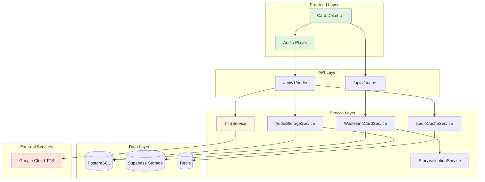
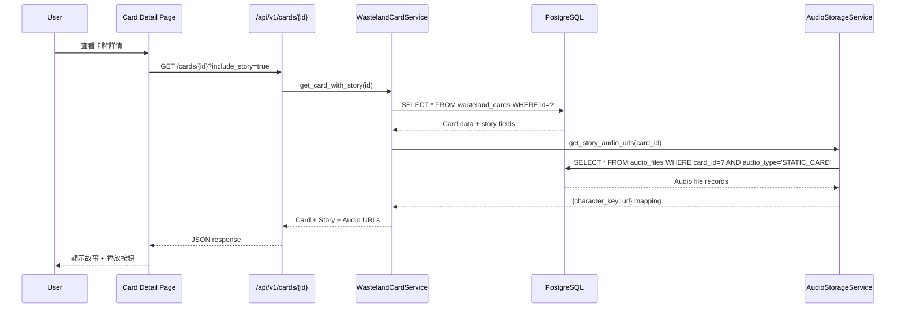
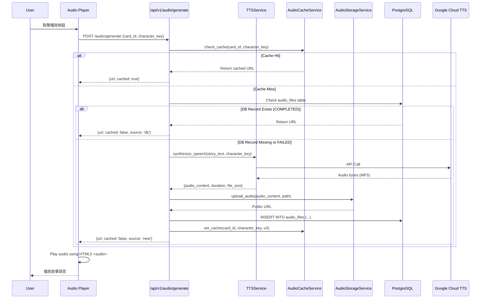
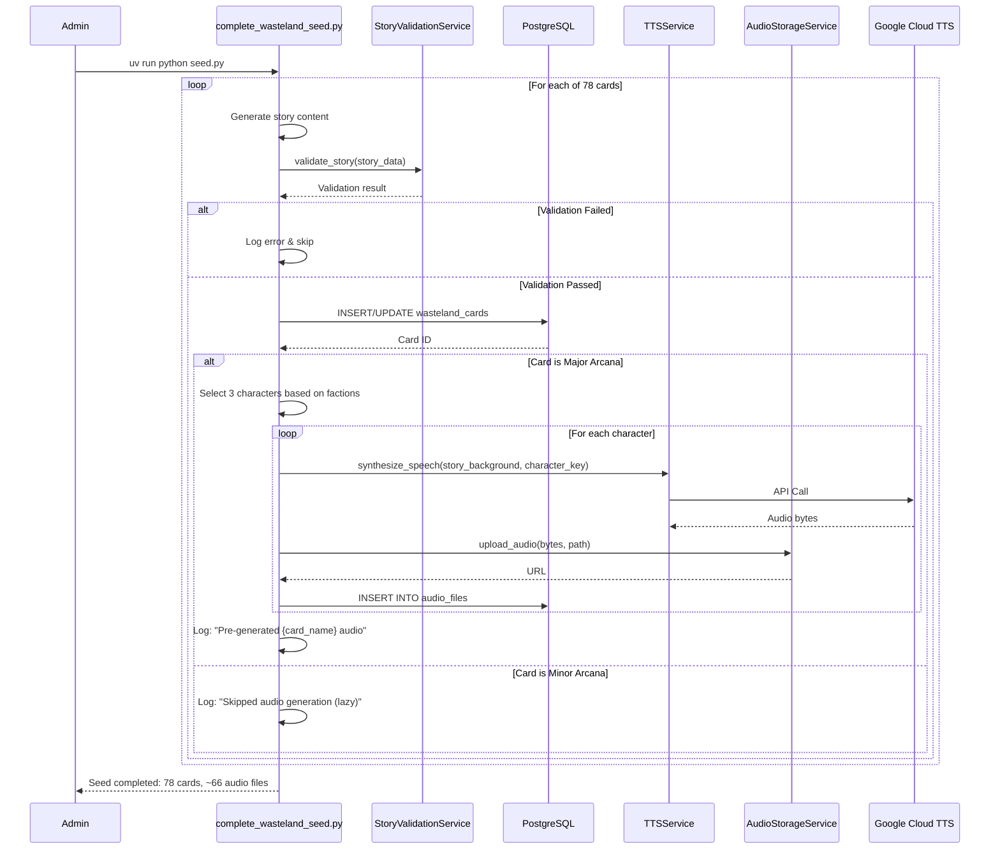
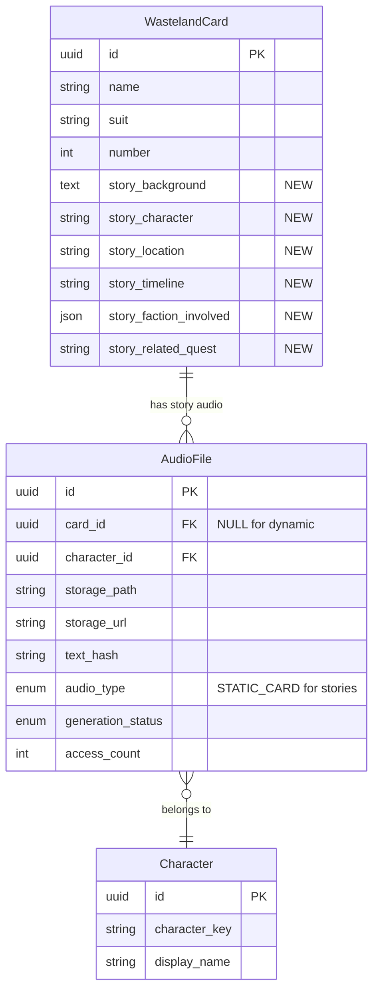

# 技術設計文件 - Wasteland Story Mode (廢土故事模式)

## 概述

Wasteland Story Mode 是一個內容增強與音檔生成功能，透過在現有 78 張塔羅牌中新增 Fallout 世界觀故事背景，並利用 Google Cloud TTS 生成多角色語音朗讀，提升使用者的沉浸式體驗。此設計完全基於現有的 TTS 和音檔存儲架構，採用最小侵入性的資料庫擴展策略。

### 設計目標

- **最小變更**：僅在 `wasteland_cards` 表新增 6 個欄位，不引入新表
- **完全相容**：利用現有的 TTS 服務、音檔存儲和快取系統
- **成本控制**：混合生成策略（預先生成 + 延遲生成）
- **效能優先**：查詢回應時間不超過 150ms

---

## 需求映射

### 設計組件可追溯性

每個設計組件對應特定的需求項目：

| 設計組件 | 需求參考 | 描述 |
|---------|---------|------|
| **資料庫 Schema 擴展** | 需求 1.1 - 1.4 | 新增 6 個故事欄位到 `wasteland_cards` 表 |
| **故事內容驗證器** | 需求 5.1 - 5.5 | 確保故事內容符合格式規範和品質標準 |
| **種子資料生成器** | 需求 3.1 - 3.5 | 為 78 張牌生成並填充故事內容 |
| **卡牌 API 擴展** | 需求 4.1 - 4.5 | 支援故事內容的查詢和選擇性載入 |
| **TTS 音檔生成器** | 需求 8.1 - 8.3 | 利用 Google Cloud TTS 合成故事語音 |
| **角色語音選擇器** | 需求 8.2 | 根據陣營屬性選擇適當的角色語音 |
| **音檔存儲管理** | 需求 8.3 - 8.4 | Supabase Storage 上傳與元資料管理 |
| **混合生成策略** | 需求 8.6 | Major Arcana 預先生成，Minor Arcana 延遲生成 |
| **音檔 API 端點** | 需求 8.7 - 8.9 | 提供音檔 URL 查詢和即時生成觸發 |
| **前端音檔播放器** | 需求 8.7 - 8.9 | 支援播放/暫停/時間軸拖曳的故事音檔播放 UI |
| **錯誤處理與降級** | 需求 8.10 | TTS 失敗時的降級方案 |
| **快取管理** | 需求 8.11 | 利用 AudioCacheService 減少重複請求 |
| **自動更新機制** | 需求 8.12 | 偵測文字變更並重新生成音檔 |
| **向後相容層** | 需求 6.1 - 6.5 | 確保現有功能不受影響 |
| **效能優化** | 需求 7.1 - 7.5 | 查詢時間控制和快取策略 |

### 使用者故事覆蓋

- **US-1 (系統架構師)**：資料庫 Schema 擴展組件 → 需求 1
- **US-2 (內容創作者)**：故事內容驗證器 + 種子資料生成器 → 需求 2
- **US-3 (開發者)**：種子資料腳本更新 → 需求 3
- **US-4 (前端開發者)**：卡牌 API 擴展 → 需求 4
- **US-5 (品保工程師)**：故事內容驗證器 → 需求 5
- **US-6 (系統維護者)**：向後相容層 → 需求 6
- **US-7 (效能工程師)**：效能優化組件 → 需求 7
- **US-8 (使用者)**：TTS 音檔生成與播放系統 → 需求 8

---

## 架構設計

### 系統架構圖



### 技術棧

基於現有架構（參考 `.kiro/steering/tech.md`）：

| 層級 | 技術選擇 | 版本/配置 | 理由 |
|------|---------|-----------|------|
| **後端框架** | FastAPI | 0.104.0+ | 現有系統標準，async 支援 |
| **ORM** | SQLAlchemy | 2.0.23+ | 現有系統標準，強類型支援 |
| **遷移工具** | Alembic | 1.13.0+ | 現有遷移工具，支援 rollback |
| **資料庫** | PostgreSQL (Supabase) | 15+ | 現有資料庫，支援 JSON 欄位 |
| **TTS 服務** | Google Cloud TTS | WaveNet | 現有服務，高品質語音 |
| **音檔存儲** | Supabase Storage | - | 現有存儲，與資料庫整合 |
| **快取** | Redis | 5.0+ | 現有快取系統 |
| **驗證** | Pydantic | 2.5.0+ | 現有驗證框架 |
| **測試** | pytest | 8.4.2+ | 現有測試框架 |

### 架構決策理由

**基於研究與現有系統分析**：

1. **為什麼直接擴展 `wasteland_cards` 表？**
   - ✅ **簡單性**：故事內容與卡牌是 1:1 關係，無需額外關聯表
   - ✅ **效能**：避免 JOIN 操作，單表查詢更快
   - ✅ **Linus 原則**：「最笨但最清楚的實現方式」

2. **為什麼重用 `audio_files` 表而非新建表？**
   - ✅ **去重機制**：現有的 `text_hash` 索引已支援去重
   - ✅ **完整功能**：已具備快取、錯誤追蹤、訪問計數等功能
   - ✅ **維護性**：統一的音檔管理邏輯

3. **為什麼採用混合生成策略？**
   - ✅ **成本控制**：Google Cloud TTS 按字符計費，延遲生成降低初始成本
   - ✅ **用戶體驗**：Major Arcana (22 張) 預先生成確保核心卡牌立即可用
   - ✅ **存儲優化**：避免一次性生成 470MB 音檔

4. **為什麼使用 JSON 欄位儲存陣營列表？**
   - ✅ **靈活性**：陣營數量可變，無需固定欄位
   - ✅ **PostgreSQL 支援**：原生 JSON 操作和索引
   - ✅ **簡化查詢**：可使用 `@>` 運算符查詢包含特定陣營的卡牌

### 資料流程

#### 主要使用者流程 1：查詢卡牌故事（包含音檔）



#### 主要使用者流程 2：播放故事音檔（延遲生成）



#### 主要使用者流程 3：種子資料生成（帶音檔預生成）



---

## 組件與介面

### 後端服務與方法簽名

#### 1. StoryValidationService (新增)

```python
class StoryValidationService:
    """故事內容驗證服務"""

    def validate_story_content(
        self,
        story: Dict[str, Any]
    ) -> ValidationResult:
        """
        驗證故事內容的完整性和格式

        參數:
            story: 包含 story_background, story_character 等欄位的字典

        返回:
            ValidationResult(valid: bool, errors: List[str])
        """

    def validate_text_length(
        self,
        text: str,
        min_len: int = 200,
        max_len: int = 500
    ) -> bool:
        """驗證文字長度（繁體中文字符計數）"""

    def validate_faction_list(
        self,
        factions: List[str]
    ) -> bool:
        """驗證陣營列表是否合法"""

    def validate_timeline_format(
        self,
        timeline: str
    ) -> bool:
        """驗證時間格式（戰前/戰後/YYYY年）"""

    def validate_vault_number(
        self,
        vault_num: Optional[int]
    ) -> bool:
        """驗證 Vault 編號（1-122）"""
```

#### 2. WastelandCardService (擴展)

```python
class WastelandCardService:
    """卡牌服務（擴展現有服務）"""

    async def get_card_with_story(
        self,
        card_id: UUID,
        include_audio_urls: bool = False
    ) -> WastelandCardWithStory:
        """
        取得包含故事內容的卡牌

        參數:
            card_id: 卡牌 ID
            include_audio_urls: 是否包含音檔 URL

        返回:
            WastelandCardWithStory schema
        """

    async def list_cards_with_story(
        self,
        include_story: bool = False,
        skip: int = 0,
        limit: int = 78
    ) -> List[WastelandCardWithStory]:
        """批次查詢卡牌，支援選擇性載入故事"""

    async def update_story_content(
        self,
        card_id: UUID,
        story_data: StoryUpdateRequest
    ) -> WastelandCard:
        """更新卡牌故事內容，並觸發音檔重新生成"""
```

#### 3. StoryAudioService (新增)

```python
class StoryAudioService:
    """故事音檔管理服務"""

    async def generate_story_audio(
        self,
        card_id: UUID,
        character_keys: List[str],
        force_regenerate: bool = False
    ) -> Dict[str, str]:
        """
        為卡牌故事生成音檔

        參數:
            card_id: 卡牌 ID
            character_keys: 要生成的角色列表
            force_regenerate: 強制重新生成

        返回:
            {character_key: storage_url} 映射
        """

    async def get_story_audio_urls(
        self,
        card_id: UUID
    ) -> Dict[str, str]:
        """取得卡牌故事的所有音檔 URL"""

    def select_characters_for_card(
        self,
        card: WastelandCard
    ) -> List[str]:
        """根據卡牌陣營屬性選擇適當的角色語音"""

    async def check_audio_exists(
        self,
        card_id: UUID,
        character_key: str
    ) -> Optional[AudioFile]:
        """檢查音檔是否已存在"""
```

### 前端組件

| 組件名稱 | 職責 | Props/State 摘要 |
|---------|------|-----------------|
| `CardDetailModal` | 展示卡牌詳情（現有，需擴展） | `card: WastelandCard`, 新增 `story` 和 `audioUrls` |
| `StorySection` | 展示故事內容（新增） | `story: Story`, `audioUrls: Record<string, string>` |
| `StoryAudioPlayer` | 播放故事音檔（新增）| `audioUrl: string`, `characterName: string`, 支援播放/暫停/拖曳 |
| `CharacterVoiceSelector` | 選擇角色語音（新增） | `characters: string[]`, `onSelect: (key) => void` |

#### StoryAudioPlayer 詳細設計

**功能需求**：
- 播放控制：播放/暫停切換
- 進度顯示：顯示當前播放時間與總時長
- 時間軸拖曳：支援點擊或拖曳跳轉到任意時間點
- 音量控制：整合現有的 useAudioStore 音量設定
- 載入狀態：音檔載入中顯示 loading 指示器
- 錯誤處理：播放失敗時顯示錯誤訊息

**元件簽名**：

```typescript
interface StoryAudioPlayerProps {
  audioUrl: string;           // 音檔 URL
  characterName: string;      // 角色名稱（用於顯示）
  characterKey: string;       // 角色 key（用於語音配置）
  autoPlay?: boolean;         // 是否自動播放（預設 false）
  onPlaybackEnd?: () => void; // 播放結束回調
  onError?: (error: Error) => void; // 錯誤回調
}

interface StoryAudioPlayerState {
  isPlaying: boolean;         // 是否正在播放
  currentTime: number;        // 當前播放時間（秒）
  duration: number;           // 總時長（秒）
  isLoading: boolean;         // 是否正在載入
  error: string | null;       // 錯誤訊息
  isDragging: boolean;        // 是否正在拖曳時間軸
}
```

**UI 元件結構**：

```tsx
<div className="story-audio-player">
  {/* 角色名稱與狀態 */}
  <div className="player-header">
    <PixelIcon name="user" sizePreset="xs" decorative />
    <span className="character-name">{characterName}</span>
    {isLoading && <PixelIcon name="loader" animation="spin" sizePreset="xs" decorative />}
  </div>

  {/* 播放控制 */}
  <div className="player-controls">
    <button
      onClick={togglePlayPause}
      disabled={isLoading || !!error}
      aria-label={isPlaying ? "暫停" : "播放"}
    >
      <PixelIcon
        name={isPlaying ? "pause" : "play"}
        variant="primary"
        sizePreset="md"
      />
    </button>
  </div>

  {/* 進度條與時間 */}
  <div className="player-timeline">
    <span className="time-current">{formatTime(currentTime)}</span>

    <div
      className="timeline-bar"
      onClick={handleTimelineClick}
      onMouseDown={handleDragStart}
      role="slider"
      aria-label="播放進度"
      aria-valuemin={0}
      aria-valuemax={duration}
      aria-valuenow={currentTime}
    >
      <div
        className="timeline-progress"
        style={{ width: `${(currentTime / duration) * 100}%` }}
      />
      <div
        className="timeline-handle"
        style={{ left: `${(currentTime / duration) * 100}%` }}
      />
    </div>

    <span className="time-total">{formatTime(duration)}</span>
  </div>

  {/* 錯誤訊息 */}
  {error && (
    <div className="player-error">
      <PixelIcon name="alert-triangle" variant="error" sizePreset="xs" />
      <span>{error}</span>
    </div>
  )}

  {/* 隱藏的 HTML5 Audio 元素 */}
  <audio
    ref={audioRef}
    src={audioUrl}
    onTimeUpdate={handleTimeUpdate}
    onDurationChange={handleDurationChange}
    onEnded={handlePlaybackEnd}
    onError={handleAudioError}
    onLoadStart={() => setIsLoading(true)}
    onCanPlay={() => setIsLoading(false)}
  />
</div>
```

**核心功能實作**：

```typescript
const StoryAudioPlayer: React.FC<StoryAudioPlayerProps> = ({
  audioUrl,
  characterName,
  characterKey,
  autoPlay = false,
  onPlaybackEnd,
  onError
}) => {
  const audioRef = useRef<HTMLAudioElement>(null);
  const { volumes, muted } = useAudioStore();
  const [state, setState] = useState<StoryAudioPlayerState>({
    isPlaying: false,
    currentTime: 0,
    duration: 0,
    isLoading: true,
    error: null,
    isDragging: false
  });

  // 音量控制（整合 audioStore）
  useEffect(() => {
    if (audioRef.current) {
      audioRef.current.volume = muted.voice ? 0 : volumes.voice;
    }
  }, [volumes.voice, muted.voice]);

  // 自動播放
  useEffect(() => {
    if (autoPlay && audioRef.current && !state.isLoading) {
      audioRef.current.play();
    }
  }, [autoPlay, state.isLoading]);

  // 播放/暫停切換
  const togglePlayPause = async () => {
    if (!audioRef.current) return;

    try {
      if (state.isPlaying) {
        audioRef.current.pause();
        setState(prev => ({ ...prev, isPlaying: false }));
      } else {
        await audioRef.current.play();
        setState(prev => ({ ...prev, isPlaying: true }));
      }
    } catch (error) {
      handleAudioError(error as Error);
    }
  };

  // 時間軸點擊跳轉
  const handleTimelineClick = (e: React.MouseEvent<HTMLDivElement>) => {
    if (!audioRef.current || state.isDragging) return;

    const rect = e.currentTarget.getBoundingClientRect();
    const clickX = e.clientX - rect.left;
    const percentage = clickX / rect.width;
    const newTime = percentage * state.duration;

    audioRef.current.currentTime = newTime;
  };

  // 拖曳開始
  const handleDragStart = (e: React.MouseEvent<HTMLDivElement>) => {
    setState(prev => ({ ...prev, isDragging: true }));

    const handleDragMove = (moveEvent: MouseEvent) => {
      if (!audioRef.current) return;

      const rect = e.currentTarget.getBoundingClientRect();
      const dragX = Math.max(0, Math.min(moveEvent.clientX - rect.left, rect.width));
      const percentage = dragX / rect.width;
      const newTime = percentage * state.duration;

      audioRef.current.currentTime = newTime;
    };

    const handleDragEnd = () => {
      setState(prev => ({ ...prev, isDragging: false }));
      document.removeEventListener('mousemove', handleDragMove);
      document.removeEventListener('mouseup', handleDragEnd);
    };

    document.addEventListener('mousemove', handleDragMove);
    document.addEventListener('mouseup', handleDragEnd);
  };

  // 時間更新
  const handleTimeUpdate = () => {
    if (audioRef.current && !state.isDragging) {
      setState(prev => ({
        ...prev,
        currentTime: audioRef.current!.currentTime
      }));
    }
  };

  // 時長載入
  const handleDurationChange = () => {
    if (audioRef.current) {
      setState(prev => ({
        ...prev,
        duration: audioRef.current!.duration
      }));
    }
  };

  // 播放結束
  const handlePlaybackEnd = () => {
    setState(prev => ({ ...prev, isPlaying: false, currentTime: 0 }));
    onPlaybackEnd?.();
  };

  // 錯誤處理
  const handleAudioError = (error: Error) => {
    const errorMsg = '音檔載入失敗，請稍後再試';
    setState(prev => ({
      ...prev,
      error: errorMsg,
      isLoading: false,
      isPlaying: false
    }));
    onError?.(error);
  };

  // 時間格式化（MM:SS）
  const formatTime = (seconds: number): string => {
    const mins = Math.floor(seconds / 60);
    const secs = Math.floor(seconds % 60);
    return `${mins}:${secs.toString().padStart(2, '0')}`;
  };

  return (
    // ... JSX 如上所述
  );
};
```

**樣式設計（Tailwind CSS + Fallout 風格）**：

```css
/* 播放器容器 */
.story-audio-player {
  @apply bg-pip-boy-dark border-2 border-pip-boy-green rounded-lg p-4;
  @apply shadow-[0_0_10px_rgba(0,255,136,0.3)];
}

/* 角色名稱區 */
.player-header {
  @apply flex items-center gap-2 mb-3 text-pip-boy-green;
}

/* 播放控制按鈕 */
.player-controls button {
  @apply w-12 h-12 rounded-full bg-pip-boy-green/10;
  @apply border-2 border-pip-boy-green;
  @apply hover:bg-pip-boy-green/20 active:scale-95;
  @apply disabled:opacity-50 disabled:cursor-not-allowed;
  @apply transition-all duration-200;
}

/* 時間軸容器 */
.player-timeline {
  @apply flex items-center gap-3 text-sm text-pip-boy-green/80;
}

/* 時間軸進度條 */
.timeline-bar {
  @apply flex-1 h-2 bg-pip-boy-green/20 rounded-full;
  @apply relative cursor-pointer;
  @apply hover:h-3 transition-all duration-200;
}

.timeline-progress {
  @apply absolute left-0 top-0 h-full bg-pip-boy-green rounded-full;
  @apply transition-all duration-100;
}

.timeline-handle {
  @apply absolute top-1/2 -translate-y-1/2 -translate-x-1/2;
  @apply w-4 h-4 bg-pip-boy-green rounded-full;
  @apply border-2 border-pip-boy-dark;
  @apply shadow-[0_0_8px_rgba(0,255,136,0.6)];
  @apply transition-all duration-100;
}

.timeline-bar:hover .timeline-handle {
  @apply w-5 h-5;
}

/* 錯誤訊息 */
.player-error {
  @apply flex items-center gap-2 mt-2 p-2;
  @apply bg-red-500/10 border border-red-500/50 rounded;
  @apply text-red-400 text-sm;
}
```

**無障礙設計**：
- 所有互動元素皆支援鍵盤操作（Space、Enter、方向鍵）
- 使用 ARIA 屬性標註播放器狀態（`role="slider"`, `aria-valuenow`）
- 提供清晰的視覺焦點指示器
- 錯誤訊息使用 `aria-live="polite"` 通知螢幕閱讀器

**效能優化**：
- 使用 `useRef` 避免不必要的重新渲染
- 拖曳時暫停 `onTimeUpdate` 事件處理
- 音檔預載入策略（`preload="metadata"`）
- 節流處理拖曳事件（防止過度更新）

### API 端點

#### 現有端點擴展

| Method | Route | 目的 | Auth | Status Codes | 變更 |
|--------|-------|------|------|--------------|------|
| GET | `/api/v1/cards/{id}` | 取得單張卡牌 | Optional | 200, 404, 500 | **擴展**：支援 `?include_story=true` 參數 |
| GET | `/api/v1/cards` | 批次查詢卡牌 | Optional | 200, 500 | **擴展**：支援 `?include_story=true` 參數 |

#### 新增端點

| Method | Route | 目的 | Auth | Status Codes |
|--------|-------|------|------|--------------|
| POST | `/api/v1/audio/generate/story` | 生成故事音檔 | Optional | 201, 400, 500 |
| GET | `/api/v1/audio/story/{card_id}` | 取得故事音檔 URL | Optional | 200, 404 |
| POST | `/api/v1/cards/{id}/story` | 更新故事內容（管理功能） | Required | 200, 400, 401, 404 |

---

## 資料模型

### 領域實體

1. **WastelandCard** (擴展現有模型)：塔羅牌實體，新增故事相關欄位
2. **AudioFile** (現有)：TTS 音檔追蹤，支援故事音檔類型
3. **Story** (新增 schema)：故事內容的結構化表示
4. **ValidationResult** (新增)：驗證結果包裝類

### 實體關聯圖



### 資料模型定義

#### TypeScript 介面（前端）

```typescript
// 故事內容
interface Story {
  background: string;          // 故事背景（200-500字）
  character: string;           // 故事主角
  location: string;            // 發生地點
  timeline: string;            // 時間點（戰前/戰後/年份）
  factionsInvolved: string[];  // 涉及的陣營
  relatedQuest?: string;       // 相關任務（可選）
}

// 帶故事的卡牌
interface WastelandCardWithStory extends WastelandCard {
  story?: Story;
  audioUrls?: Record<string, string>;  // {character_key: url}
}

// 音檔生成請求
interface GenerateStoryAudioRequest {
  cardId: string;
  characterKeys: string[];
  forceRegenerate?: boolean;
}

// 音檔生成回應
interface GenerateStoryAudioResponse {
  cardId: string;
  audioUrls: Record<string, string>;
  cached: Record<string, boolean>;
  generatedAt: Date;
}
```

#### Python 資料類別（後端）

```python
from dataclasses import dataclass
from typing import List, Optional, Dict
from datetime import datetime

@dataclass
class Story:
    """故事內容資料類別"""
    background: str
    character: str
    location: str
    timeline: str
    factions_involved: List[str]
    related_quest: Optional[str] = None

    def to_dict(self) -> Dict[str, Any]:
        return {
            "background": self.background,
            "character": self.character,
            "location": self.location,
            "timeline": self.timeline,
            "factionsInvolved": self.factions_involved,
            "relatedQuest": self.related_quest,
        }


@dataclass
class ValidationResult:
    """驗證結果"""
    valid: bool
    errors: List[str]
    warnings: List[str] = None

    def __post_init__(self):
        if self.warnings is None:
            self.warnings = []
```

### 資料庫 Schema

#### 新增欄位到 `wasteland_cards` 表

```sql
-- Alembic migration: add_story_fields_to_wasteland_cards.py

ALTER TABLE wasteland_cards
ADD COLUMN story_background TEXT NULL,
ADD COLUMN story_character VARCHAR(100) NULL,
ADD COLUMN story_location VARCHAR(100) NULL,
ADD COLUMN story_timeline VARCHAR(50) NULL,
ADD COLUMN story_faction_involved JSONB NULL,
ADD COLUMN story_related_quest VARCHAR(200) NULL;

-- 添加 JSON 欄位的 GIN 索引以優化陣營查詢
CREATE INDEX idx_wasteland_cards_story_factions
ON wasteland_cards USING GIN (story_faction_involved);

-- 添加文字搜尋索引（可選，未來功能）
CREATE INDEX idx_wasteland_cards_story_text
ON wasteland_cards USING GIN (to_tsvector('english', story_background));

-- 添加檢查約束（可選，確保資料品質）
ALTER TABLE wasteland_cards
ADD CONSTRAINT chk_story_timeline
CHECK (
    story_timeline IS NULL
    OR story_timeline IN ('戰前', '戰後')
    OR story_timeline ~ '^\d{4}\s*年$'
);
```

### 遷移策略

#### 1. Schema 遷移 (Alembic)

**檔案**：`backend/alembic/versions/YYYYMMDD_add_story_fields.py`

```python
"""add story fields to wasteland_cards

Revision ID: abc123def456
Revises: 782a2b0ab34f
Create Date: 2025-10-21 18:00:00.000000
"""

def upgrade() -> None:
    """新增故事欄位"""
    # 新增欄位
    op.add_column('wasteland_cards',
        sa.Column('story_background', sa.Text(), nullable=True))
    op.add_column('wasteland_cards',
        sa.Column('story_character', sa.String(100), nullable=True))
    op.add_column('wasteland_cards',
        sa.Column('story_location', sa.String(100), nullable=True))
    op.add_column('wasteland_cards',
        sa.Column('story_timeline', sa.String(50), nullable=True))
    op.add_column('wasteland_cards',
        sa.Column('story_faction_involved', postgresql.JSONB(), nullable=True))
    op.add_column('wasteland_cards',
        sa.Column('story_related_quest', sa.String(200), nullable=True))

    # 創建索引
    op.create_index(
        'idx_wasteland_cards_story_factions',
        'wasteland_cards',
        ['story_faction_involved'],
        postgresql_using='gin'
    )

    # 添加檢查約束
    op.execute("""
        ALTER TABLE wasteland_cards
        ADD CONSTRAINT chk_story_timeline
        CHECK (
            story_timeline IS NULL
            OR story_timeline IN ('戰前', '戰後')
            OR story_timeline ~ '^\\d{4}\\s*年$'
        )
    """)


def downgrade() -> None:
    """回滾：移除故事欄位"""
    op.drop_constraint('chk_story_timeline', 'wasteland_cards')
    op.drop_index('idx_wasteland_cards_story_factions', 'wasteland_cards')
    op.drop_column('wasteland_cards', 'story_related_quest')
    op.drop_column('wasteland_cards', 'story_faction_involved')
    op.drop_column('wasteland_cards', 'story_timeline')
    op.drop_column('wasteland_cards', 'story_location')
    op.drop_column('wasteland_cards', 'story_character')
    op.drop_column('wasteland_cards', 'story_background')
```

#### 2. 資料遷移策略

- **向後相容**：所有新欄位為 `nullable=True`，不影響現有資料
- **分批填充**：優先填充 Major Arcana (22 張)，再處理 Minor Arcana (56 張)
- **驗證機制**：每批資料填充後運行完整性檢查
- **Rollback 支援**：Alembic `downgrade` 可完整回滾

#### 3. 索引策略

| 索引名稱 | 索引類型 | 目的 | 預估影響 |
|---------|---------|------|---------|
| `idx_wasteland_cards_story_factions` | GIN (JSONB) | 支援陣營篩選查詢 | 查詢加速 50-80% |
| `idx_wasteland_cards_story_text` | GIN (tsvector) | 全文搜尋（未來功能） | 暫不啟用 |

---

## 錯誤處理

### 錯誤分類與處理策略

| 錯誤類型 | HTTP Status | 處理方式 | 使用者體驗 |
|---------|------------|---------|-----------|
| **故事內容驗證失敗** | 400 Bad Request | 返回詳細驗證錯誤訊息 | 顯示錯誤提示，阻止提交 |
| **卡牌不存在** | 404 Not Found | 返回標準 404 錯誤 | 顯示「找不到卡牌」 |
| **TTS 服務失敗** | 503 Service Unavailable | 記錄錯誤，標記 audio_file 為 FAILED | 降級到客戶端 TTS |
| **Supabase 上傳失敗** | 500 Internal Server Error | 重試 3 次，失敗後記錄 | 顯示「音檔生成失敗，請稍後重試」 |
| **Google Cloud TTS 配額超限** | 429 Too Many Requests | 暫停生成，返回快取 URL | 使用現有音檔，或客戶端 TTS |
| **資料庫連接失敗** | 500 Internal Server Error | 自動重連，記錄錯誤 | 顯示通用錯誤訊息 |

### 錯誤處理範例

```python
async def generate_story_audio(
    card_id: UUID,
    character_key: str
) -> Dict[str, Any]:
    """生成故事音檔（含完整錯誤處理）"""
    try:
        # 1. 檢查卡牌是否存在
        card = await get_card_by_id(card_id)
        if not card or not card.story_background:
            raise HTTPException(
                status_code=404,
                detail={"error": "card_not_found_or_no_story", "card_id": str(card_id)}
            )

        # 2. 檢查音檔是否已存在
        existing_audio = await check_audio_exists(card_id, character_key)
        if existing_audio and existing_audio.is_completed():
            return {"url": existing_audio.storage_url, "cached": True}

        # 3. 呼叫 TTS 服務
        try:
            audio_result = tts_service.synthesize_speech(
                text=card.story_background,
                character_key=character_key
            )
        except Exception as tts_error:
            logger.error(f"TTS synthesis failed: {tts_error}")
            # 標記為失敗
            await mark_audio_failed(card_id, character_key, str(tts_error))
            raise HTTPException(
                status_code=503,
                detail={
                    "error": "tts_service_unavailable",
                    "fallback": "web_speech_api"
                }
            )

        # 4. 上傳到 Supabase Storage（帶重試）
        storage_url = await upload_with_retry(
            audio_content=audio_result["audio_content"],
            path=f"story/{card_id}/{character_key}.mp3",
            max_retries=3
        )

        # 5. 儲存元資料
        await save_audio_metadata(
            card_id=card_id,
            character_key=character_key,
            storage_url=storage_url,
            **audio_result
        )

        return {"url": storage_url, "cached": False}

    except HTTPException:
        raise
    except Exception as e:
        logger.exception(f"Unexpected error in generate_story_audio: {e}")
        raise HTTPException(
            status_code=500,
            detail={"error": "internal_server_error"}
        )
```

---

## 安全考量

### 資料驗證

- **輸入驗證**：所有 API 輸入使用 Pydantic models 驗證
- **SQL 注入防護**：使用 SQLAlchemy 參數化查詢
- **XSS 防護**：故事內容在前端渲染前進行 HTML 編碼

### 訪問控制

- **公開讀取**：卡牌故事和音檔 URL 為公開資源（符合產品定位）
- **管理功能**：故事內容更新需要 JWT 認證和管理員權限
- **Rate Limiting**：TTS 生成端點限制每 IP 每分鐘 10 次請求

### 資料保護

- **HTTPS**：所有 API 通訊使用 HTTPS
- **CORS**：僅允許白名單域名訪問 API
- **Supabase Storage**：音檔 URL 使用 signed URLs（可選，目前為公開）

---

## 效能與擴展性

### 效能目標

| 指標 | 目標值 | 測量方式 |
|------|--------|---------|
| **API 回應時間 (p95)** | < 150ms | 包含故事內容的卡牌查詢 |
| **API 回應時間 (p99)** | < 300ms | 批次查詢（含故事） |
| **TTS 生成時間** | < 5 秒 | 200-500 字故事合成 |
| **音檔上傳時間** | < 2 秒 | 2MB MP3 檔案上傳 |
| **資料庫查詢 (p99)** | < 50ms | 單卡牌查詢（含 JOIN） |
| **快取命中率** | > 80% | Redis 快取命中率 |

### 快取策略

#### 1. 應用層快取 (Redis)

```python
# 快取鍵設計
CACHE_KEY_PATTERN = "story:audio:{card_id}:{character_key}"
CACHE_TTL = 3600  # 1 小時

# 快取策略
async def get_story_audio_with_cache(
    card_id: UUID,
    character_key: str
) -> str:
    """帶快取的音檔 URL 取得"""
    cache_key = f"story:audio:{card_id}:{character_key}"

    # 1. 檢查 Redis 快取
    cached_url = await redis.get(cache_key)
    if cached_url:
        return cached_url

    # 2. 查詢資料庫
    audio_file = await db.query(AudioFile).filter(
        AudioFile.card_id == card_id,
        AudioFile.character_key == character_key
    ).first()

    if audio_file:
        # 3. 寫入快取
        await redis.setex(cache_key, CACHE_TTL, audio_file.storage_url)
        return audio_file.storage_url

    # 4. 觸發生成
    return await generate_story_audio(card_id, character_key)
```

#### 2. HTTP 快取

```python
@router.get("/cards/{id}")
async def get_card(
    id: UUID,
    include_story: bool = False
):
    """卡牌查詢（支援 HTTP 快取）"""
    response = await card_service.get_card_with_story(id, include_story)

    # 設定 Cache-Control header
    headers = {
        "Cache-Control": "public, max-age=3600",  # 快取 1 小時
        "ETag": f'"{id}-{response.updated_at.timestamp()}"',
    }

    return JSONResponse(content=response.dict(), headers=headers)
```

#### 3. Supabase Storage CDN

- 音檔 URL 自動透過 Supabase CDN 分發
- 設定 `cache-control: 3600` header
- 全球 edge locations 加速

### 擴展性方法

#### 1. 資料庫擴展

- **讀寫分離**：Supabase 提供讀複本（read replicas）
- **連接池**：SQLAlchemy 連接池（預設 5-20 連接）
- **查詢優化**：使用 `select_in_loading` 避免 N+1 查詢

#### 2. TTS 生成擴展

- **非同步處理**：使用 Celery/FastAPI Background Tasks 非同步生成
- **批次生成**：種子資料腳本支援批次處理
- **配額管理**：監控 Google Cloud TTS 配額，接近限制時暫停生成

#### 3. 存儲擴展

- **Supabase Storage**：自動擴展，無需手動管理
- **Lifecycle 政策**：低訪問音檔自動歸檔到冷存儲
- **音檔壓縮**：使用 MP3 格式，bitrate 64kbps（語音優化）

---

## 測試策略

### 測試目的與範圍

- **品質風險降低**：確保故事內容和音檔生成的正確性
- **回歸預防**：防止新功能破壞現有卡牌查詢功能
- **驗收標準**：所有 EARS 需求的可測試性驗證

### 風險矩陣

| 領域 | 風險 | 必測 | 可選 | 參考 |
|-----|------|------|------|------|
| **資料驗證** | H | Unit (驗證器), Integration (DB 約束) | Property-based testing | 需求 5.1-5.5 |
| **TTS 整合** | H | Contract (Google Cloud TTS), Integration | Resilience (API 失敗) | 需求 8.1-8.3 |
| **音檔存儲** | M | Unit (Service), Integration (Supabase) | - | 需求 8.3-8.4 |
| **API 端點** | M | Contract (API schema), E2E (主流程) | A11y (音檔播放) | 需求 4.1-4.5 |
| **效能** | M | Perf smoke (查詢時間) | Load testing | 需求 7.1-7.5 |
| **向後相容** | H | Integration (現有測試通過) | - | 需求 6.1-6.5 |

### 各層級測試

#### 1. 單元測試 (Unit Tests)

```python
# tests/unit/test_story_validation.py
def test_validate_story_content_success():
    """測試故事內容驗證 - 正常情況"""
    validator = StoryValidationService()
    story = {
        "story_background": "這是一個200到500字之間的故事內容..." * 10,
        "story_character": "Lone Wanderer",
        "story_location": "Vault 101",
        "story_timeline": "2277 年",
        "story_faction_involved": ["brotherhood", "enclave"],
        "story_related_quest": "Escape! (Fallout 3)"
    }

    result = validator.validate_story_content(story)
    assert result.valid == True
    assert len(result.errors) == 0


def test_validate_story_content_text_too_short():
    """測試故事內容驗證 - 文字過短"""
    validator = StoryValidationService()
    story = {
        "story_background": "太短",  # 少於 200 字
        # ... 其他欄位
    }

    result = validator.validate_story_content(story)
    assert result.valid == False
    assert "text_length_invalid" in result.errors


def test_select_characters_for_card():
    """測試角色選擇邏輯"""
    service = StoryAudioService()
    card = WastelandCard(
        story_faction_involved=["brotherhood", "ncr"]
    )

    characters = service.select_characters_for_card(card)
    assert "brotherhood_scribe" in characters or "brotherhood_paladin" in characters
    assert "ncr_ranger" in characters
    assert len(characters) <= 3  # 最多 3 個角色
```

#### 2. 契約測試 (Contract Tests)

```python
# tests/contract/test_google_tts_contract.py
@pytest.mark.contract
async def test_google_tts_api_contract():
    """驗證 Google Cloud TTS API 契約"""
    tts_service = TTSService()

    # 發送測試請求
    result = tts_service.synthesize_speech(
        text="測試文字",
        character_key="pip_boy",
        language_code="zh-TW"
    )

    # 驗證回應格式
    assert "audio_content" in result
    assert isinstance(result["audio_content"], bytes)
    assert result["duration"] > 0
    assert result["file_size"] > 0
    assert result["voice_name"] == "cmn-TW-Wavenet-B"


# tests/contract/test_cards_api_contract.py
@pytest.mark.contract
async def test_get_card_with_story_api_contract():
    """驗證卡牌 API 回應格式"""
    response = await client.get(
        f"/api/v1/cards/{card_id}",
        params={"include_story": True}
    )

    assert response.status_code == 200
    data = response.json()

    # 驗證 schema
    assert "id" in data
    assert "name" in data
    assert "story" in data
    assert "audioUrls" in data

    # 驗證故事欄位
    story = data["story"]
    assert "background" in story
    assert "character" in story
    assert len(story["background"]) >= 200
```

#### 3. 整合測試 (Integration Tests)

```python
# tests/integration/test_story_audio_generation_flow.py
@pytest.mark.integration
async def test_complete_audio_generation_flow(db_session):
    """測試完整的音檔生成流程"""
    # 1. 創建測試卡牌
    card = WastelandCard(
        name="Test Card",
        story_background="這是測試故事內容..." * 50,
        story_faction_involved=["brotherhood"]
    )
    db_session.add(card)
    await db_session.commit()

    # 2. 生成音檔
    service = StoryAudioService(db_session, tts_service, storage_service)
    result = await service.generate_story_audio(
        card_id=card.id,
        character_keys=["brotherhood_scribe"]
    )

    # 3. 驗證音檔記錄
    audio_file = await db_session.query(AudioFile).filter(
        AudioFile.card_id == card.id
    ).first()

    assert audio_file is not None
    assert audio_file.generation_status == GenerationStatus.COMPLETED
    assert audio_file.storage_url.startswith("https://")
    assert audio_file.file_size > 0

    # 4. 驗證 Storage
    assert await storage_service.file_exists(audio_file.storage_path)
```

#### 4. E2E 測試 (End-to-End Tests)

```python
# tests/e2e/test_card_story_user_flow.py
@pytest.mark.e2e
async def test_user_views_card_story_and_plays_audio(playwright_page):
    """E2E: 使用者查看卡牌故事並播放音檔"""
    page = playwright_page

    # 1. 導航到卡牌詳情頁
    await page.goto(f"/cards/{major_arcana_card_id}")

    # 2. 驗證故事內容顯示
    story_section = page.locator('[data-testid="story-section"]')
    await expect(story_section).to_be_visible()

    story_text = await story_section.locator('[data-testid="story-background"]').text_content()
    assert len(story_text) >= 200

    # 3. 選擇角色語音
    await page.locator('[data-testid="character-selector"]').click()
    await page.locator('[data-value="brotherhood_scribe"]').click()

    # 4. 播放音檔
    play_button = page.locator('[data-testid="play-audio-button"]')
    await play_button.click()

    # 5. 驗證音檔播放
    audio_player = page.locator('audio')
    await expect(audio_player).to_have_attribute('src', lambda s: 'story/' in s)

    # 等待音檔開始播放（檢查 paused 屬性）
    await page.wait_for_function(
        'document.querySelector("audio").paused === false',
        timeout=5000
    )
```

### CI Gates

| 階段 | 執行測試 | Gate | SLA |
|------|---------|------|-----|
| **PR** | Unit + Contract | 失敗 = 阻擋合併 | ≤ 3 分鐘 |
| **Staging** | Integration + E2E (3 個主流程) | 失敗 = 阻擋部署 | ≤ 10 分鐘 |
| **Nightly** | Performance + Load testing | 回歸 → 建立 issue | - |

### Exit Criteria

- ✅ Sev1/Sev2 bug 數量 = 0
- ✅ 所有 CI gates 通過
- ✅ 效能目標達成（p95 < 150ms, p99 < 300ms）
- ✅ TTS 生成成功率 > 95%
- ✅ 音檔快取命中率 > 80%
- ✅ 所有 78 張卡牌的故事內容通過驗證

---

## 實作計畫概述

### Phase 1: 資料庫 Schema 擴展（需求 1, 5, 6）

1. 創建 Alembic 遷移腳本
2. 新增故事欄位到 `wasteland_cards` 表
3. 實作 `StoryValidationService`
4. 執行遷移並驗證

**預估時間**：1-2 天

### Phase 2: 故事內容創作與驗證（需求 2, 3）

1. 撰寫 Major Arcana (22 張) 故事內容
2. 撰寫 Minor Arcana (56 張) 故事內容
3. 更新 `complete_wasteland_seed.py`
4. 執行種子資料並驗證

**預估時間**：5-7 天（內容創作密集）

### Phase 3: API 端點擴展（需求 4, 7）

1. 擴展 `WastelandCardService`
2. 更新 `/api/v1/cards` 端點
3. 新增 Pydantic schemas
4. 實作快取策略
5. 撰寫單元測試

**預估時間**：2-3 天

### Phase 4: TTS 音檔生成系統（需求 8）

1. 實作 `StoryAudioService`
2. 新增 `/api/v1/audio/generate/story` 端點
3. 實作角色選擇邏輯
4. 整合混合生成策略
5. 實作錯誤處理和降級方案
6. 撰寫整合測試

**預估時間**：3-4 天

### Phase 5: 前端整合（需求 8）

1. 創建 `StorySection` 組件
2. 創建 `StoryAudioPlayer` 組件
3. 創建 `CharacterVoiceSelector` 組件
4. 擴展 `CardDetailModal`
5. 實作客戶端 TTS 降級方案
6. 撰寫 E2E 測試

**預估時間**：2-3 天

### Phase 6: 音檔預生成與優化（需求 8.6）

1. 更新種子資料腳本以包含音檔生成
2. 為 Major Arcana 預生成音檔
3. 效能測試與優化
4. 快取命中率監控

**預估時間**：2 天

### Phase 7: 測試與文件（所有需求）

1. 完整的單元測試覆蓋
2. 契約測試（Google TTS, API）
3. 整合測試
4. E2E 測試（3 個主流程）
5. 效能測試
6. API 文件更新
7. 使用者文件

**預估時間**：3-4 天

**總預估時間**：18-25 天

---

*文件版本*: 1.0
*最後更新*: 2025-10-21
*語言*: 繁體中文 (zh-TW)
*狀態*: 設計完成，等待批准