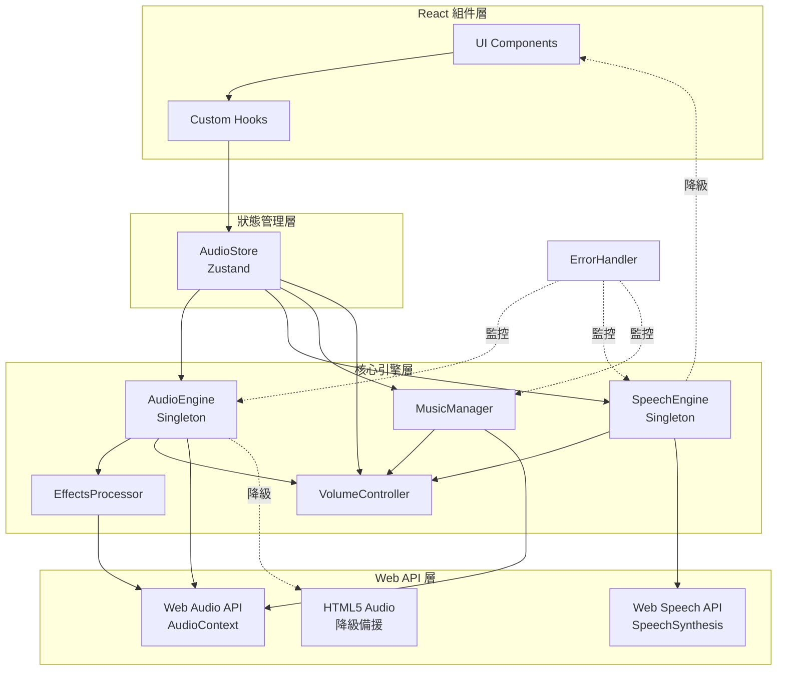
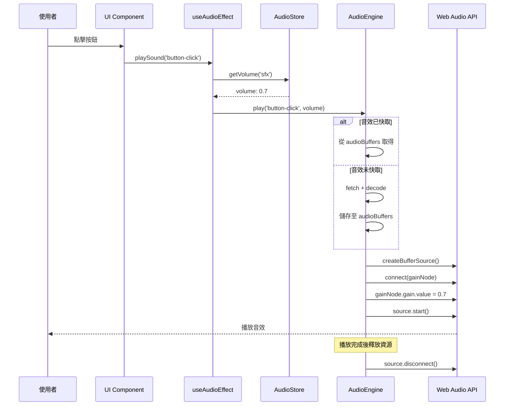
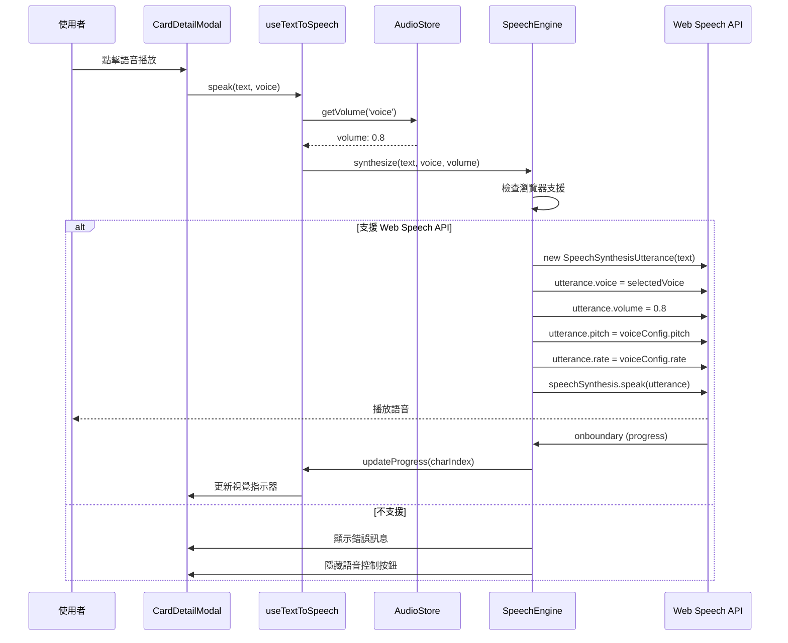
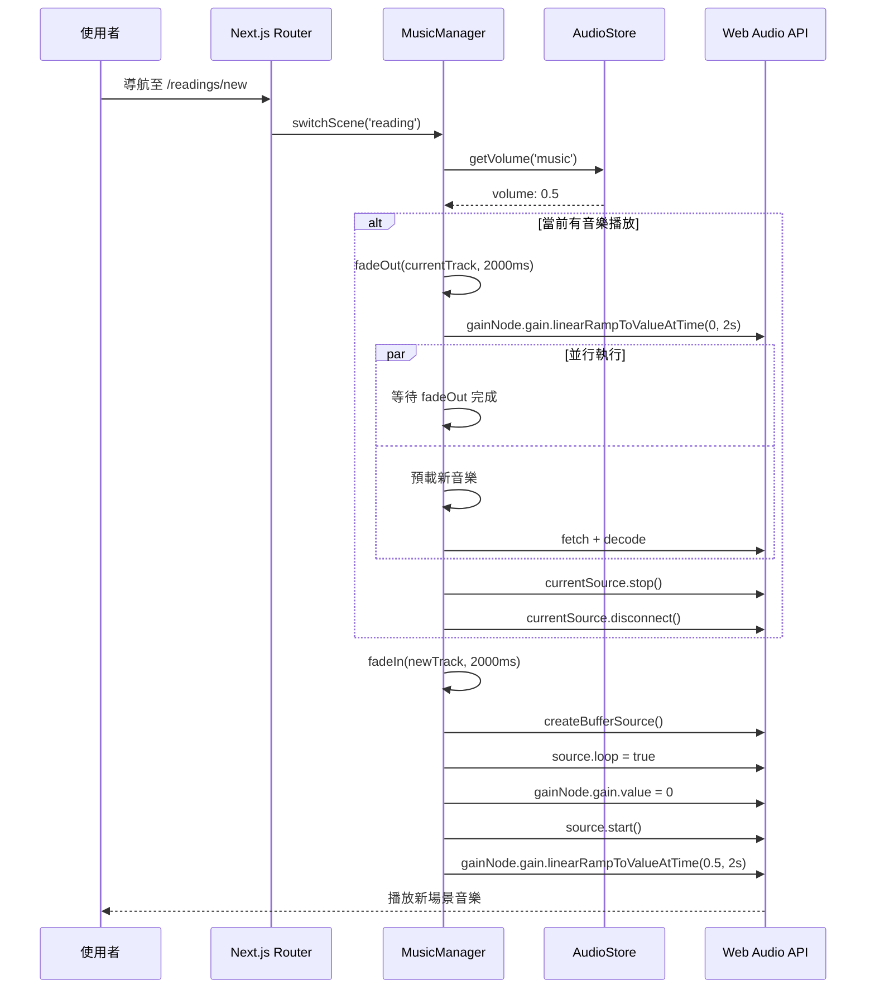

# 技術設計文件 - Web Audio System

## 概述

本文件定義 Wasteland Tarot 平台的 Web Audio 系統技術架構，使用 Web Audio API 和 Web Speech API 實現沉浸式 Fallout 主題音效體驗。系統採用模組化設計，支援音效播放、語音合成、背景音樂管理、音量控制和音訊效果處理。

### 核心技術選擇理由

- **Web Audio API**：原生瀏覽器 API，提供低延遲、高品質音訊處理能力
- **Web Speech API**：原生 TTS 支援，無需外部依賴，降低成本
- **Zustand Store**：與專案現有狀態管理保持一致，提供響應式音訊狀態
- **TypeScript**：類型安全，降低音訊處理中的執行時錯誤
- **React Hooks**：封裝音訊邏輯為可重用 hooks，符合專案架構模式

## 需求映射

### 設計組件可追溯性

每個設計組件對應特定需求：

| 組件 | 對應需求 | EARS 需求參考 |
|------|---------|--------------|
| **AudioEngine** | 需求 1, 5, 6, 9 | 1.1-1.7, 5.1-5.6, 6.1-6.6, 9.1-9.6 |
| **SpeechEngine** | 需求 2, 10 | 2.1-2.7, 10.1-10.6 |
| **MusicManager** | 需求 3 | 3.1-3.6 |
| **VolumeController** | 需求 4 | 4.1-4.7 |
| **EffectsProcessor** | 需求 7 | 7.1-7.6 |
| **ErrorHandler** | 需求 8 | 8.1-8.6 |
| **AudioStore (Zustand)** | 需求 4, 9, 10 | 4.6, 9.6, 10.1-10.6 |
| **Hooks Layer** | 需求 1-10 | 全部需求的 React 整合 |

### 使用者故事覆蓋

- **故事 1**（廢土旅者互動音效）：`AudioEngine` + `EffectsProcessor` 提供 Pip-Boy 音效和蓋革計數器
- **故事 2**（視覺障礙使用者 TTS）：`SpeechEngine` 提供語音合成和角色語音切換
- **故事 3**（背景音樂沉浸）：`MusicManager` 提供場景音樂和 crossfade 切換
- **故事 4**（音量自訂）：`VolumeController` 提供獨立音量控制和持久化
- **故事 5**（快速播放）：`AudioEngine` 的預載和快取機制確保低延遲
- **故事 6**（行動裝置支援）：`AudioEngine` 的行動優化和 AudioContext 解鎖
- **故事 7**（Fallout 音效特色）：`EffectsProcessor` 提供濾鏡和效果處理
- **故事 8**（降級支援）：`ErrorHandler` 提供 HTML5 Audio 備援
- **故事 9**（效能優化）：記憶體管理、並發限制、FPS 監控
- **故事 10**（無障礙控制）：鍵盤快捷鍵、ARIA 標籤、視覺指示器

## 系統架構

### 整體架構圖



### 技術棧

- **前端框架**：Next.js 15 (App Router) + React 19
- **狀態管理**：Zustand 4.5.7
- **類型系統**：TypeScript 5
- **音訊處理**：Web Audio API + Web Speech API
- **降級備援**：HTML5 `<audio>` 元素
- **持久化**：localStorage
- **測試框架**：Jest + React Testing Library
- **建置工具**：Bun

### 架構決策理由

#### 為何使用 Singleton Pattern（AudioEngine, SpeechEngine）
- **Web Audio API 限制**：每個頁面應只有一個 AudioContext 實例
- **資源管理**：避免重複初始化造成的記憶體浪費
- **狀態一致性**：全域唯一實例確保音訊狀態同步

#### 為何整合 Zustand
- **專案一致性**：專案已使用 Zustand 管理 auth、readings、UI 狀態
- **響應式更新**：音量、播放狀態變化自動觸發 UI 更新
- **持久化支援**：Zustand persist middleware 簡化 localStorage 整合

#### 為何使用 Factory Pattern（音效類型）
- **不同處理管道**：SFX、Music、Voice 需要不同的 GainNode 和 EffectNode 配置
- **效能優化**：根據類型套用不同的快取和預載策略
- **音量獨立控制**：每種類型有獨立的 GainNode

#### 為何使用 Custom Hooks
- **符合專案模式**：專案已有 useAuth, useStreamingText 等 hooks
- **邏輯重用**：音效播放邏輯可在多個組件中重用
- **React 整合**：自動處理 useEffect 清理和狀態更新

### 資料流程

#### 音效播放流程



#### TTS 語音合成流程



#### 背景音樂場景切換流程



## 組件和介面設計

### 核心引擎類別

#### AudioEngine (Singleton)

```typescript
/**
 * 音效引擎核心類別 - 管理所有音效播放、快取和資源
 * Singleton 模式確保全域唯一 AudioContext
 */
class AudioEngine {
  private static instance: AudioEngine;
  private audioContext: AudioContext | null = null;
  private audioBuffers: Map<string, AudioBuffer> = new Map();
  private activeSourceNodes: Set<AudioBufferSourceNode> = new Set();
  private gainNodes: Map<AudioType, GainNode> = new Map();
  private isUnlocked: boolean = false;
  private readonly MAX_CONCURRENT_SOUNDS = 8;
  private readonly MAX_MEMORY_MB = 50;

  /**
   * 獲取單例實例
   */
  static getInstance(): AudioEngine;

  /**
   * 初始化 AudioContext（需使用者互動後呼叫）
   * 需求 6.1: WHEN 使用者在行動裝置上首次互動
   */
  async initialize(): Promise<void>;

  /**
   * 預載關鍵音效檔案
   * 需求 5.1: WHEN 應用程式初始化時 THEN 系統 SHALL 預載所有關鍵音效
   */
  async preloadSounds(soundList: SoundConfig[]): Promise<void>;

  /**
   * 播放音效
   * 需求 1.1: WHEN 使用者點擊按鈕 THEN 系統 SHALL 播放對應音效
   * 需求 1.7: WHERE 音效已預載 THE 系統 SHALL 在 100ms 內開始播放
   */
  async play(soundId: string, options?: PlayOptions): Promise<void>;

  /**
   * 停止特定音效
   */
  stop(soundId: string): void;

  /**
   * 停止所有音效
   */
  stopAll(): void;

  /**
   * 設定音效類型音量
   * 需求 4.2: WHEN 使用者調整音效音量滑桿 THEN 系統 SHALL 即時調整
   */
  setVolume(type: AudioType, volume: number): void;

  /**
   * 清除快取（記憶體管理）
   * 需求 5.3: IF 記憶體使用超過 50MB THEN 系統 SHALL 清除最少使用的快取
   */
  clearCache(strategy: 'lru' | 'all'): void;

  /**
   * 獲取當前記憶體使用量（MB）
   */
  getMemoryUsage(): number;

  /**
   * 降級至 HTML5 Audio
   * 需求 8.1: IF 瀏覽器不支援 Web Audio API THEN 系統 SHALL 降級
   */
  private fallbackToHTML5Audio(): void;
}

interface PlayOptions {
  volume?: number;
  loop?: boolean;
  fadeDuration?: number;
  effectsChain?: AudioEffect[];
}

interface SoundConfig {
  id: string;
  url: string;
  type: AudioType;
  priority: 'critical' | 'normal' | 'low';
}

type AudioType = 'sfx' | 'music' | 'voice';

type AudioEffect = 'reverb' | '8bit' | 'radio' | 'distortion';
```

#### SpeechEngine (Singleton)

```typescript
/**
 * 語音合成引擎 - 管理 TTS 功能
 */
class SpeechEngine {
  private static instance: SpeechEngine;
  private synthesis: SpeechSynthesis | null = null;
  private currentUtterance: SpeechSynthesisUtterance | null = null;
  private voiceConfigs: Map<CharacterVoice, VoiceConfig> = new Map();
  private isSupported: boolean = false;

  static getInstance(): SpeechEngine;

  /**
   * 初始化語音合成
   * 需求 2.6: IF 瀏覽器不支援 THEN 系統 SHALL 顯示錯誤並隱藏按鈕
   */
  initialize(): boolean;

  /**
   * 合成並播放語音
   * 需求 2.1: WHEN 使用者啟用語音播放 THEN 系統 SHALL 朗讀文字
   * 需求 2.3: IF 使用者選擇特定角色語音 THEN 系統 SHALL 調整參數
   */
  speak(text: string, options: SpeechOptions): void;

  /**
   * 暫停語音播放
   * 需求 2.4: WHEN 點擊暫停 THEN 系統 SHALL 立即暫停
   */
  pause(): void;

  /**
   * 恢復語音播放
   */
  resume(): void;

  /**
   * 停止語音播放
   * 需求 2.5: WHEN 點擊停止 THEN 系統 SHALL 停止並重置位置
   */
  stop(): void;

  /**
   * 設定語音音量
   * 需求 4.4: WHEN 使用者調整語音音量 THEN 系統 SHALL 即時調整
   */
  setVolume(volume: number): void;

  /**
   * 獲取可用語音列表
   */
  getAvailableVoices(): SpeechSynthesisVoice[];

  /**
   * 設定角色語音配置
   */
  setVoiceConfig(character: CharacterVoice, config: VoiceConfig): void;
}

interface SpeechOptions {
  voice?: CharacterVoice;
  volume?: number;
  onProgress?: (charIndex: number) => void;
  onComplete?: () => void;
}

interface VoiceConfig {
  pitch: number;      // 0.0 - 2.0
  rate: number;       // 0.1 - 10.0
  voiceName?: string; // 特定語音名稱
}

type CharacterVoice = 'pip_boy' | 'mr_handy' | 'brotherhood_scribe' | 'vault_overseer';
```

#### MusicManager

```typescript
/**
 * 背景音樂管理器 - 處理場景音樂切換和循環播放
 */
class MusicManager {
  private audioEngine: AudioEngine;
  private currentTrack: string | null = null;
  private currentSource: AudioBufferSourceNode | null = null;
  private gainNode: GainNode | null = null;
  private sceneMusic: Map<string, string> = new Map();

  constructor(audioEngine: AudioEngine);

  /**
   * 切換場景音樂
   * 需求 3.2: WHEN 使用者開始占卜 THEN 系統 SHALL 切換至占卜音樂
   * 需求 3.5: WHEN 背景音樂切換時 THEN 系統 SHALL 在 2 秒內完成 crossfade
   */
  async switchScene(sceneName: string): Promise<void>;

  /**
   * 播放音樂（循環）
   * 需求 3.1: WHEN 使用者進入主頁面 THEN 系統 SHALL 播放循環背景音樂
   * 需求 3.4: WHILE 背景音樂播放中 THE 系統 SHALL 支援無縫循環
   */
  async play(trackId: string): Promise<void>;

  /**
   * 停止音樂
   * 需求 3.3: IF 使用者關閉背景音樂 THEN 系統 SHALL 停止所有背景音樂
   */
  stop(): void;

  /**
   * 淡出音樂
   */
  private async fadeOut(duration: number): Promise<void>;

  /**
   * 淡入音樂
   */
  private async fadeIn(duration: number): Promise<void>;

  /**
   * 設定音樂音量
   * 需求 4.3: WHEN 使用者調整音樂音量 THEN 系統 SHALL 即時調整
   */
  setVolume(volume: number): void;
}
```

#### VolumeController

```typescript
/**
 * 音量控制器 - 管理獨立音量控制和持久化
 */
class VolumeController {
  private volumes: Map<AudioType, number> = new Map();
  private readonly STORAGE_KEY = 'wasteland-tarot-audio-volumes';

  constructor();

  /**
   * 初始化（從 localStorage 載入）
   * 需求 4.6: WHEN 使用者調整音量 THEN 系統 SHALL 將設定儲存至 localStorage
   */
  initialize(): void;

  /**
   * 設定音量
   * 需求 4.2-4.4: 即時調整各類別音量
   */
  setVolume(type: AudioType, volume: number): void;

  /**
   * 獲取音量
   */
  getVolume(type: AudioType): number;

  /**
   * 靜音/取消靜音
   * 需求 4.5: IF 使用者將音量設為 0 THEN 系統 SHALL 靜音該類別
   */
  setMute(type: AudioType, muted: boolean): void;

  /**
   * 檢查是否靜音
   */
  isMuted(type: AudioType): boolean;

  /**
   * 儲存至 localStorage
   */
  private save(): void;

  /**
   * 從 localStorage 載入
   */
  private load(): void;
}
```

#### EffectsProcessor

```typescript
/**
 * 音訊效果處理器 - 套用 Fallout 主題濾鏡和效果
 */
class EffectsProcessor {
  private audioContext: AudioContext;
  private effectsCache: Map<AudioEffect, AudioNode> = new Map();

  constructor(audioContext: AudioContext);

  /**
   * 建立效果鏈
   * 需求 7.1: WHEN 播放角色語音 THEN 系統 SHALL 套用對應濾鏡
   */
  createEffectsChain(effects: AudioEffect[]): AudioNode[];

  /**
   * 建立 Reverb（迴響）效果
   * 需求 7.2: WHEN 使用者在 Vault 場景 THEN 系統 SHALL 套用迴響
   */
  private createReverb(): ConvolverNode;

  /**
   * 建立 8-bit 降採樣效果
   * 需求 7.4: IF 使用者啟用經典模式 THEN 系統 SHALL 套用 8-bit 濾鏡
   */
  private create8BitEffect(): WaveShaperNode;

  /**
   * 建立無線電效果
   * 需求 7.1: 機械音、無線電效果
   */
  private createRadioEffect(): BiquadFilterNode;

  /**
   * 建立類比失真效果
   * 需求 7.5: WHEN 終端機音效 THEN 系統 SHALL 套用類比失真
   */
  private createDistortion(): WaveShaperNode;

  /**
   * 連接效果鏈
   */
  connectEffects(source: AudioNode, effects: AudioNode[], destination: AudioNode): void;

  /**
   * 清理效果節點
   */
  cleanup(): void;
}
```

### Zustand Store

```typescript
/**
 * 音訊狀態 Store - 管理全域音訊狀態
 */
interface AudioState {
  // 音量狀態
  volumes: {
    sfx: number;
    music: number;
    voice: number;
  };
  muted: {
    sfx: boolean;
    music: boolean;
    voice: boolean;
  };

  // 播放狀態
  isPlaying: {
    music: boolean;
    voice: boolean;
  };
  currentTrack: string | null;
  speechProgress: number;

  // 設定
  isAudioEnabled: boolean;
  isSilentMode: boolean;
  selectedVoice: CharacterVoice;

  // 效能監控
  memoryUsage: number;
  activeSoundsCount: number;

  // Actions
  setVolume: (type: AudioType, volume: number) => void;
  setMute: (type: AudioType, muted: boolean) => void;
  setCurrentTrack: (trackId: string | null) => void;
  setSpeechProgress: (progress: number) => void;
  setAudioEnabled: (enabled: boolean) => void;
  setSilentMode: (silent: boolean) => void;
  setSelectedVoice: (voice: CharacterVoice) => void;
  updateMetrics: (usage: number, count: number) => void;
}

/**
 * 建立音訊 Store
 * 需求 4.6: localStorage 持久化
 * 需求 10.6: 完全靜音模式
 */
const useAudioStore = create<AudioState>()(
  persist(
    (set) => ({
      volumes: { sfx: 0.7, music: 0.5, voice: 0.8 },
      muted: { sfx: false, music: false, voice: false },
      isPlaying: { music: false, voice: false },
      currentTrack: null,
      speechProgress: 0,
      isAudioEnabled: true,
      isSilentMode: false,
      selectedVoice: 'pip_boy',
      memoryUsage: 0,
      activeSoundsCount: 0,

      setVolume: (type, volume) => set((state) => ({
        volumes: { ...state.volumes, [type]: volume }
      })),

      setMute: (type, muted) => set((state) => ({
        muted: { ...state.muted, [type]: muted }
      })),

      // ... 其他 actions
    }),
    {
      name: 'wasteland-tarot-audio',
      partialize: (state) => ({
        volumes: state.volumes,
        muted: state.muted,
        isAudioEnabled: state.isAudioEnabled,
        selectedVoice: state.selectedVoice,
      }),
    }
  )
);
```

### React Hooks 層

```typescript
/**
 * 音效播放 Hook
 * 簡化組件中的音效播放邏輯
 */
function useAudioEffect() {
  const { volumes, muted } = useAudioStore();
  const audioEngine = AudioEngine.getInstance();

  const playSound = useCallback((soundId: string, options?: PlayOptions) => {
    if (muted.sfx) return;
    const volume = options?.volume ?? volumes.sfx;
    audioEngine.play(soundId, { ...options, volume });
  }, [volumes.sfx, muted.sfx]);

  return { playSound };
}

/**
 * 文字轉語音 Hook
 * 需求 2: 語音合成功能
 */
function useTextToSpeech() {
  const { volumes, muted, selectedVoice, setSpeechProgress } = useAudioStore();
  const speechEngine = SpeechEngine.getInstance();
  const [isSpeaking, setIsSpeaking] = useState(false);
  const [isSupported, setIsSupported] = useState(false);

  useEffect(() => {
    const supported = speechEngine.initialize();
    setIsSupported(supported);
  }, []);

  const speak = useCallback((text: string) => {
    if (!isSupported || muted.voice) return;

    setIsSpeaking(true);
    speechEngine.speak(text, {
      voice: selectedVoice,
      volume: volumes.voice,
      onProgress: (charIndex) => setSpeechProgress(charIndex),
      onComplete: () => setIsSpeaking(false),
    });
  }, [isSupported, muted.voice, volumes.voice, selectedVoice]);

  const pause = () => speechEngine.pause();
  const resume = () => speechEngine.resume();
  const stop = () => {
    speechEngine.stop();
    setIsSpeaking(false);
  };

  return { speak, pause, resume, stop, isSpeaking, isSupported };
}

/**
 * 背景音樂 Hook
 * 需求 3: 背景音樂管理
 */
function useBackgroundMusic() {
  const { volumes, muted, setCurrentTrack } = useAudioStore();
  const [musicManager] = useState(() => new MusicManager(AudioEngine.getInstance()));
  const pathname = usePathname();

  useEffect(() => {
    // 根據路由自動切換場景音樂
    const sceneMap: Record<string, string> = {
      '/': 'wasteland-ambient',
      '/readings/new': 'divination-theme',
      '/dashboard': 'vault-theme',
    };

    const scene = sceneMap[pathname] || 'wasteland-ambient';
    if (!muted.music) {
      musicManager.switchScene(scene);
      setCurrentTrack(scene);
    }

    return () => {
      musicManager.stop();
    };
  }, [pathname, muted.music]);

  useEffect(() => {
    musicManager.setVolume(muted.music ? 0 : volumes.music);
  }, [volumes.music, muted.music]);

  return { musicManager };
}

/**
 * 音訊初始化 Hook
 * 需求 6.1: 行動裝置首次互動時初始化
 */
function useAudioInitialization() {
  const [isInitialized, setIsInitialized] = useState(false);
  const audioEngine = AudioEngine.getInstance();

  useEffect(() => {
    const handleFirstInteraction = async () => {
      if (!isInitialized) {
        await audioEngine.initialize();
        setIsInitialized(true);
        document.removeEventListener('click', handleFirstInteraction);
        document.removeEventListener('touchstart', handleFirstInteraction);
      }
    };

    document.addEventListener('click', handleFirstInteraction);
    document.addEventListener('touchstart', handleFirstInteraction);

    return () => {
      document.removeEventListener('click', handleFirstInteraction);
      document.removeEventListener('touchstart', handleFirstInteraction);
    };
  }, [isInitialized]);

  return { isInitialized };
}
```

### 前端組件

| 組件名稱 | 職責 | Props/State 摘要 |
|---------|------|-----------------|
| `AudioControls` | 顯示音量控制滑桿和靜音按鈕 | `type: AudioType`, `onChange: (volume) => void` |
| `VoiceSelector` | 角色語音選擇下拉選單 | `selectedVoice: CharacterVoice`, `onChange` |
| `SpeechControls` | TTS 播放/暫停/停止控制 | `text: string`, `onPlay`, `onPause`, `onStop` |
| `AudioVisualizer` | 語音播放視覺指示器（波形） | `isPlaying: boolean`, `progress: number` |
| `AudioSettings` | 音訊設定頁面（完整控制面板） | N/A（使用 Zustand store） |
| `SoundEffectTrigger` | 觸發音效的包裝組件 | `soundId: string`, `trigger: 'click' \| 'hover'`, `children` |

### API 端點

本功能為純前端實作，不需要後端 API 端點。所有音訊處理在瀏覽器端完成。

**音效資源 CDN 端點**（靜態檔案）：

| 方法 | 路徑 | 用途 | 快取策略 |
|-----|------|------|---------|
| GET | `/sounds/sfx/{soundId}.mp3` | 獲取音效檔案 | CDN 快取 1 年 |
| GET | `/sounds/music/{trackId}.mp3` | 獲取音樂檔案 | CDN 快取 1 年 |
| GET | `/sounds/manifest.json` | 獲取音效清單配置 | CDN 快取 1 小時 |

**音效清單配置範例** (`/sounds/manifest.json`):
```json
{
  "version": "1.0.0",
  "sounds": [
    {
      "id": "button-click",
      "type": "sfx",
      "url": "/sounds/sfx/button-click.mp3",
      "priority": "critical",
      "size": 15360
    },
    {
      "id": "card-flip",
      "type": "sfx",
      "url": "/sounds/sfx/card-flip.mp3",
      "priority": "critical",
      "size": 22400
    },
    {
      "id": "geiger-low",
      "type": "sfx",
      "url": "/sounds/sfx/geiger-low.mp3",
      "priority": "normal",
      "size": 18900
    }
  ],
  "music": [
    {
      "id": "wasteland-ambient",
      "url": "/sounds/music/wasteland-ambient.mp3",
      "scene": "home",
      "size": 2048000
    }
  ]
}
```

## 資料模型

### 領域實體

1. **SoundEffect**：音效檔案資料
2. **MusicTrack**：音樂軌道資料
3. **VoiceConfig**：角色語音配置
4. **AudioSettings**：使用者音訊設定

### TypeScript 介面定義

```typescript
/**
 * 音效檔案
 */
interface SoundEffect {
  id: string;
  url: string;
  type: AudioType;
  priority: 'critical' | 'normal' | 'low';
  size: number; // bytes
  buffer?: AudioBuffer; // 快取的解碼緩衝區
  lastUsed?: number; // timestamp for LRU
}

/**
 * 音樂軌道
 */
interface MusicTrack {
  id: string;
  url: string;
  scene: string;
  size: number;
  duration?: number;
  buffer?: AudioBuffer;
}

/**
 * 角色語音配置
 */
interface VoiceConfig {
  character: CharacterVoice;
  pitch: number;      // 0.0 - 2.0
  rate: number;       // 0.1 - 10.0
  volume: number;     // 0.0 - 1.0
  voiceName?: string; // 系統語音名稱
  effects?: AudioEffect[]; // 套用的效果
}

/**
 * 音訊設定（儲存至 localStorage）
 */
interface AudioSettings {
  volumes: {
    sfx: number;
    music: number;
    voice: number;
  };
  muted: {
    sfx: boolean;
    music: boolean;
    voice: boolean;
  };
  selectedVoice: CharacterVoice;
  isAudioEnabled: boolean;
  prefersReducedMotion: boolean; // 需求 10.1
}

/**
 * 音訊清單配置
 */
interface AudioManifest {
  version: string;
  sounds: SoundEffect[];
  music: MusicTrack[];
  lastUpdated: string;
}

/**
 * 播放選項
 */
interface PlayOptions {
  volume?: number;
  loop?: boolean;
  fadeDuration?: number;
  effectsChain?: AudioEffect[];
  onComplete?: () => void;
}

/**
 * 語音合成選項
 */
interface SpeechOptions {
  voice?: CharacterVoice;
  volume?: number;
  onProgress?: (charIndex: number) => void;
  onComplete?: () => void;
  onError?: (error: Error) => void;
}

/**
 * 音訊類型
 */
type AudioType = 'sfx' | 'music' | 'voice';

/**
 * 音訊效果類型
 */
type AudioEffect = 'reverb' | '8bit' | 'radio' | 'distortion';

/**
 * 角色語音類型
 */
type CharacterVoice =
  | 'pip_boy'
  | 'mr_handy'
  | 'brotherhood_scribe'
  | 'vault_overseer'
  | 'wasteland_wanderer';
```

### 資料庫結構

**不需要資料庫**。所有音訊設定儲存在瀏覽器 localStorage：

```typescript
// localStorage key: 'wasteland-tarot-audio'
{
  "state": {
    "volumes": { "sfx": 0.7, "music": 0.5, "voice": 0.8 },
    "muted": { "sfx": false, "music": false, "voice": false },
    "selectedVoice": "pip_boy",
    "isAudioEnabled": true
  },
  "version": 1
}
```

## 錯誤處理

### 錯誤處理策略

```typescript
/**
 * 音訊錯誤處理器
 * 需求 8: 錯誤處理和降級策略
 */
class AudioErrorHandler {
  private errorCount: Map<string, number> = new Map();
  private readonly ERROR_THRESHOLD = 0.3; // 30% 錯誤率

  /**
   * 處理 AudioContext 初始化錯誤
   * 需求 8.1: IF 瀏覽器不支援 Web Audio API THEN 降級使用 HTML5 Audio
   */
  handleInitializationError(error: Error): void {
    logger.error('[AudioEngine] Initialization failed', error);

    if (!this.isWebAudioSupported()) {
      logger.warn('[AudioEngine] Falling back to HTML5 Audio');
      this.enableHTML5AudioFallback();
    } else {
      this.showUserFriendlyError('音訊系統初始化失敗，請重新整理頁面');
    }
  }

  /**
   * 處理音效載入錯誤
   * 需求 8.5: WHEN 音訊檔案 404 THEN 重試最多 3 次
   */
  async handleLoadError(soundId: string, error: Error): Promise<void> {
    const retryCount = this.errorCount.get(soundId) || 0;

    if (retryCount < 3) {
      this.errorCount.set(soundId, retryCount + 1);
      logger.warn(`[AudioEngine] Retrying load for ${soundId} (${retryCount + 1}/3)`);
      await this.retryLoad(soundId);
    } else {
      logger.error(`[AudioEngine] Failed to load ${soundId} after 3 retries`, error);
      this.errorCount.delete(soundId);
      // 跳過該音效，繼續運作
    }
  }

  /**
   * 處理播放錯誤
   * 需求 8.3: WHEN 音訊初始化失敗 THEN 記錄並顯示友善訊息
   */
  handlePlaybackError(soundId: string, error: Error): void {
    logger.error(`[AudioEngine] Playback error for ${soundId}`, error);

    // 檢查錯誤率
    const totalErrors = Array.from(this.errorCount.values()).reduce((a, b) => a + b, 0);
    const errorRate = totalErrors / this.errorCount.size;

    // 需求 8.6: IF 錯誤率超過 30% THEN 自動停用音效系統
    if (errorRate > this.ERROR_THRESHOLD) {
      logger.error('[AudioEngine] Error rate exceeded 30%, disabling audio system');
      this.disableAudioSystem();
      this.showUserFriendlyError('音效系統遇到問題，已暫時停用');
    }
  }

  /**
   * 處理 Web Speech API 不支援
   * 需求 8.2: IF 瀏覽器不支援 Web Speech API THEN 隱藏語音功能
   */
  handleSpeechAPINotSupported(): void {
    logger.warn('[SpeechEngine] Web Speech API not supported');
    useAudioStore.getState().setSpeechSupported(false);
    // UI 組件會自動隱藏語音控制按鈕
  }

  /**
   * 處理使用者拒絕音訊權限
   * 需求 8.4: IF 使用者拒絕音訊權限 THEN 靜默運作
   */
  handlePermissionDenied(): void {
    logger.info('[AudioEngine] User denied audio permission');
    useAudioStore.getState().setAudioEnabled(false);
    // 靜默運作，不再嘗試播放
  }

  private isWebAudioSupported(): boolean {
    return 'AudioContext' in window || 'webkitAudioContext' in window;
  }

  private enableHTML5AudioFallback(): void {
    // 實作 HTML5 Audio 備援邏輯
  }

  private disableAudioSystem(): void {
    useAudioStore.getState().setAudioEnabled(false);
    AudioEngine.getInstance().stopAll();
  }

  private showUserFriendlyError(message: string): void {
    useUIStore.getState().addNotification({
      type: 'error',
      message,
      duration: 5000,
    });
  }

  private async retryLoad(soundId: string): Promise<void> {
    // 重試載入邏輯
  }
}
```

### 錯誤類型定義

```typescript
class AudioInitializationError extends Error {
  constructor(message: string, public readonly cause?: Error) {
    super(message);
    this.name = 'AudioInitializationError';
  }
}

class SoundLoadError extends Error {
  constructor(
    message: string,
    public readonly soundId: string,
    public readonly cause?: Error
  ) {
    super(message);
    this.name = 'SoundLoadError';
  }
}

class PlaybackError extends Error {
  constructor(
    message: string,
    public readonly soundId: string,
    public readonly cause?: Error
  ) {
    super(message);
    this.name = 'PlaybackError';
  }
}
```

## 安全性考量

### 內容安全政策 (CSP)

```typescript
// next.config.ts
const cspHeader = `
  default-src 'self';
  script-src 'self' 'unsafe-eval' 'unsafe-inline';
  style-src 'self' 'unsafe-inline';
  media-src 'self' https://cdn.wasteland-tarot.com;
  connect-src 'self' https://api.wasteland-tarot.com;
  img-src 'self' blob: data:;
`;
```

### 自動播放政策遵守

```typescript
/**
 * 確保符合瀏覽器自動播放政策
 * 需求：安全性需求 - 遵守瀏覽器自動播放政策
 */
async function unlockAudioContext(): Promise<void> {
  // 需要使用者互動後才初始化 AudioContext
  const audioContext = new AudioContext();

  if (audioContext.state === 'suspended') {
    await audioContext.resume();
  }

  // 播放靜音音訊解鎖（iOS Safari 需要）
  const buffer = audioContext.createBuffer(1, 1, 22050);
  const source = audioContext.createBufferSource();
  source.buffer = buffer;
  source.connect(audioContext.destination);
  source.start(0);
}
```

### 資源完整性驗證

```typescript
/**
 * 驗證音效檔案完整性（可選）
 */
async function verifyAudioIntegrity(
  url: string,
  expectedHash?: string
): Promise<boolean> {
  if (!expectedHash) return true;

  const response = await fetch(url);
  const buffer = await response.arrayBuffer();
  const hashBuffer = await crypto.subtle.digest('SHA-256', buffer);
  const hash = Array.from(new Uint8Array(hashBuffer))
    .map(b => b.toString(16).padStart(2, '0'))
    .join('');

  return hash === expectedHash;
}
```

## 效能與可擴展性

### 效能目標

| 指標 | 目標值 | 測量方式 |
|------|--------|---------|
| 音效播放延遲 (p95) | < 100ms | Performance API 測量觸發到播放時間 |
| 音效播放延遲 (p99) | < 150ms | Performance API |
| 音效檔案載入時間 (關鍵) | < 2 秒 | Network timing |
| 記憶體使用 | < 50MB | `performance.memory.usedJSHeapSize` |
| CPU 使用（閒置） | < 5% | Performance Monitor |
| CPU 使用（播放） | < 15% | Performance Monitor |
| 並發播放數 | 8 個 | 程式碼限制 |
| 首次互動初始化時間 | < 500ms | Performance API |

### 快取策略

#### 瀏覽器快取
```typescript
// 音效檔案 HTTP headers（CDN 設定）
Cache-Control: public, max-age=31536000, immutable
Content-Type: audio/mpeg
ETag: "v1.0.0-button-click"
```

#### 應用程式快取（AudioEngine）
```typescript
class AudioEngine {
  private audioBuffers: Map<string, CachedBuffer> = new Map();

  /**
   * LRU 快取策略
   * 需求 5.3: IF 記憶體超過 50MB THEN 清除最少使用的快取
   */
  private evictLRU(): void {
    const entries = Array.from(this.audioBuffers.entries())
      .sort((a, b) => (a[1].lastUsed || 0) - (b[1].lastUsed || 0));

    let freedMemory = 0;
    const targetMemory = 40 * 1024 * 1024; // 釋放到 40MB

    for (const [id, cached] of entries) {
      if (cached.priority === 'critical') continue; // 保留關鍵音效

      const bufferSize = cached.buffer.length * cached.buffer.numberOfChannels * 4;
      this.audioBuffers.delete(id);
      freedMemory += bufferSize;

      if (this.getMemoryUsage() < targetMemory) break;
    }

    logger.info(`[AudioEngine] Evicted ${freedMemory / 1024 / 1024}MB from cache`);
  }
}

interface CachedBuffer {
  buffer: AudioBuffer;
  priority: 'critical' | 'normal' | 'low';
  lastUsed: number;
}
```

### 可擴展性方法

#### 水平擴展（CDN）
- 音效檔案透過 CDN 分發（Vercel Edge Network 或 Cloudflare CDN）
- 支援多區域快取，降低載入延遲
- 自動壓縮和格式優化（WebP audio 未來支援）

#### 效能優化策略
```typescript
/**
 * 預載關鍵音效（應用程式啟動時）
 */
async function preloadCriticalSounds(): Promise<void> {
  const manifest = await fetchAudioManifest();
  const criticalSounds = manifest.sounds.filter(s => s.priority === 'critical');

  // 並行載入，最多 3 個同時
  const CONCURRENCY = 3;
  for (let i = 0; i < criticalSounds.length; i += CONCURRENCY) {
    const batch = criticalSounds.slice(i, i + CONCURRENCY);
    await Promise.all(batch.map(s => AudioEngine.getInstance().preloadSounds([s])));
  }
}

/**
 * 延遲載入非關鍵音效（閒置時）
 */
function lazyLoadNonCriticalSounds(): void {
  if ('requestIdleCallback' in window) {
    requestIdleCallback(async () => {
      const manifest = await fetchAudioManifest();
      const nonCritical = manifest.sounds.filter(s => s.priority !== 'critical');
      await AudioEngine.getInstance().preloadSounds(nonCritical);
    });
  }
}
```

#### 行動裝置優化
```typescript
/**
 * 偵測行動裝置並調整策略
 * 需求 6.5: IF iOS 低電量模式 THEN 減少音效複雜度
 */
function optimizeForMobile(): void {
  const isMobile = /iPhone|iPad|iPod|Android/i.test(navigator.userAgent);

  if (isMobile) {
    // 降低音訊品質
    const audioContext = AudioEngine.getInstance().getContext();
    if (audioContext.sampleRate > 44100) {
      logger.info('[AudioEngine] Reducing sample rate for mobile');
    }

    // 減少並發數
    AudioEngine.MAX_CONCURRENT_SOUNDS = 4;

    // 檢查電池狀態
    if ('getBattery' in navigator) {
      (navigator as any).getBattery().then((battery: any) => {
        if (battery.level < 0.2) {
          logger.info('[AudioEngine] Low battery detected, reducing music volume');
          useAudioStore.getState().setVolume('music', 0.3);
        }
      });
    }
  }
}
```

#### Service Worker 快取（未來擴展）
```javascript
// sw.js - 快取音效檔案
self.addEventListener('fetch', (event) => {
  if (event.request.url.includes('/sounds/')) {
    event.respondWith(
      caches.match(event.request).then((response) => {
        return response || fetch(event.request).then((fetchResponse) => {
          return caches.open('audio-v1').then((cache) => {
            cache.put(event.request, fetchResponse.clone());
            return fetchResponse;
          });
        });
      })
    );
  }
});
```

## 測試策略

### 風險矩陣

| 領域 | 風險 | 必須測試 | 可選測試 | 參考需求 |
|-----|------|---------|---------|---------|
| Web Audio API 相容性 | 高 | Unit, Integration | Browser Matrix | 8.1 |
| AudioContext 初始化 | 高 | Unit, E2E | Performance | 6.1, 8.1 |
| 音效播放延遲 | 中 | Performance | Load | 1.7, 效能需求 |
| 記憶體洩漏 | 高 | Unit, Integration | Memory Profiling | 5.3, 9.5 |
| 語音合成支援 | 中 | Contract, Integration | Cross-browser | 2.1, 8.2 |
| 音量控制準確性 | 中 | Unit | UX | 4.1-4.7 |
| 錯誤降級機制 | 高 | Unit, Integration | Resilience | 8.1-8.6 |
| 行動裝置自動播放 | 高 | E2E (Mobile) | Device Matrix | 6.1 |
| localStorage 持久化 | 中 | Unit, Integration | - | 4.6 |
| 無障礙功能 | 中 | A11y, E2E | Screen Reader | 10.1-10.6 |

### 分層測試

#### Unit Tests (Jest + React Testing Library)

```typescript
describe('AudioEngine', () => {
  let audioEngine: AudioEngine;

  beforeEach(() => {
    audioEngine = AudioEngine.getInstance();
  });

  describe('初始化', () => {
    it('應該建立單例實例', () => {
      const instance1 = AudioEngine.getInstance();
      const instance2 = AudioEngine.getInstance();
      expect(instance1).toBe(instance2);
    });

    it('應該在初始化後解鎖 AudioContext', async () => {
      await audioEngine.initialize();
      expect(audioEngine.isUnlocked).toBe(true);
    });
  });

  describe('音效播放', () => {
    it('應該在 100ms 內播放預載音效', async () => {
      await audioEngine.preloadSounds([{
        id: 'test-sound',
        url: '/sounds/test.mp3',
        type: 'sfx',
        priority: 'critical',
      }]);

      const startTime = performance.now();
      await audioEngine.play('test-sound');
      const duration = performance.now() - startTime;

      expect(duration).toBeLessThan(100);
    });

    it('應該限制並發播放數為 8 個', async () => {
      const promises = Array.from({ length: 10 }, (_, i) =>
        audioEngine.play(`sound-${i}`)
      );

      await Promise.all(promises);
      expect(audioEngine.getActiveSoundsCount()).toBeLessThanOrEqual(8);
    });
  });

  describe('記憶體管理', () => {
    it('應該在記憶體超過 50MB 時清除快取', async () => {
      // 模擬大量音效載入
      const largeSounds = Array.from({ length: 100 }, (_, i) => ({
        id: `large-sound-${i}`,
        url: `/sounds/large-${i}.mp3`,
        type: 'sfx' as AudioType,
        priority: 'normal' as const,
      }));

      await audioEngine.preloadSounds(largeSounds);
      expect(audioEngine.getMemoryUsage()).toBeLessThan(50 * 1024 * 1024);
    });
  });
});

describe('SpeechEngine', () => {
  let speechEngine: SpeechEngine;

  beforeEach(() => {
    speechEngine = SpeechEngine.getInstance();
  });

  describe('語音合成', () => {
    it('應該在不支援時返回 false', () => {
      // Mock speechSynthesis 為 undefined
      Object.defineProperty(window, 'speechSynthesis', {
        value: undefined,
        configurable: true,
      });

      const isSupported = speechEngine.initialize();
      expect(isSupported).toBe(false);
    });

    it('應該根據角色調整語音參數', () => {
      const mockUtterance = {
        pitch: 0,
        rate: 0,
        volume: 0,
      };

      speechEngine.setVoiceConfig('mr_handy', {
        pitch: 1.5,
        rate: 1.2,
        voiceName: 'Google UK English Male',
      });

      // 驗證參數設定
      // ...
    });
  });
});

describe('useAudioEffect Hook', () => {
  it('應該在靜音時不播放音效', () => {
    const { result } = renderHook(() => useAudioEffect(), {
      wrapper: ({ children }) => (
        <AudioStoreProvider initialState={{ muted: { sfx: true } }}>
          {children}
        </AudioStoreProvider>
      ),
    });

    const playSpy = jest.spyOn(AudioEngine.getInstance(), 'play');
    result.current.playSound('test-sound');

    expect(playSpy).not.toHaveBeenCalled();
  });
});
```

#### Integration Tests

```typescript
describe('音訊系統整合測試', () => {
  it('應該從 manifest 載入並播放音效', async () => {
    // Mock fetch for manifest
    global.fetch = jest.fn().mockResolvedValue({
      json: async () => ({
        version: '1.0.0',
        sounds: [
          {
            id: 'button-click',
            url: '/sounds/sfx/button-click.mp3',
            type: 'sfx',
            priority: 'critical',
          },
        ],
      }),
    });

    const audioEngine = AudioEngine.getInstance();
    await audioEngine.initialize();

    const manifest = await fetchAudioManifest();
    await audioEngine.preloadSounds(manifest.sounds);

    await audioEngine.play('button-click');

    expect(audioEngine.getActiveSoundsCount()).toBeGreaterThan(0);
  });

  it('應該正確處理音量變化並持久化', async () => {
    const { result } = renderHook(() => useAudioStore());

    act(() => {
      result.current.setVolume('sfx', 0.5);
    });

    // 驗證 localStorage
    const stored = JSON.parse(localStorage.getItem('wasteland-tarot-audio')!);
    expect(stored.state.volumes.sfx).toBe(0.5);

    // 驗證 AudioEngine 同步
    const audioEngine = AudioEngine.getInstance();
    expect(audioEngine.getVolume('sfx')).toBe(0.5);
  });
});
```

#### E2E Tests (Playwright)

```typescript
import { test, expect } from '@playwright/test';

test.describe('Web Audio System E2E', () => {
  test('應該在首次點擊後初始化音訊', async ({ page }) => {
    await page.goto('/');

    // 首次互動
    await page.click('button:has-text("開始占卜")');

    // 驗證 AudioContext 已初始化
    const isInitialized = await page.evaluate(() => {
      return (window as any).__audioEngineInitialized === true;
    });

    expect(isInitialized).toBe(true);
  });

  test('應該播放按鈕點擊音效', async ({ page, context }) => {
    // 授權音訊自動播放
    await context.grantPermissions(['audio-capture']);

    await page.goto('/');

    // 監聽音訊播放事件
    let audioPlayed = false;
    await page.exposeFunction('onAudioPlay', () => {
      audioPlayed = true;
    });

    await page.click('button');

    // 等待音效播放
    await page.waitForTimeout(200);
    expect(audioPlayed).toBe(true);
  });

  test('應該正確切換背景音樂場景', async ({ page }) => {
    await page.goto('/');
    await page.click('body'); // 解鎖音訊

    // 首頁應播放廢土環境音
    let currentTrack = await page.evaluate(() => {
      return (window as any).__currentMusicTrack;
    });
    expect(currentTrack).toBe('wasteland-ambient');

    // 導航至占卜頁面
    await page.goto('/readings/new');
    await page.waitForTimeout(2500); // 等待 crossfade 完成

    currentTrack = await page.evaluate(() => {
      return (window as any).__currentMusicTrack;
    });
    expect(currentTrack).toBe('divination-theme');
  });

  test('應該保存並恢復音量設定', async ({ page, context }) => {
    await page.goto('/settings');

    // 調整音效音量
    await page.fill('input[aria-label="音效音量"]', '0.3');

    // 重新載入頁面
    await page.reload();

    // 驗證音量已恢復
    const volume = await page.inputValue('input[aria-label="音效音量"]');
    expect(parseFloat(volume)).toBe(0.3);
  });
});

test.describe('行動裝置音訊', () => {
  test.use({ viewport: { width: 375, height: 667 } }); // iPhone SE

  test('應該在觸控後初始化音訊', async ({ page }) => {
    await page.goto('/');

    // 模擬觸控
    await page.tap('button');

    const isInitialized = await page.evaluate(() => {
      return (window as any).__audioEngineInitialized === true;
    });

    expect(isInitialized).toBe(true);
  });
});
```

#### Accessibility Tests

```typescript
import { test, expect } from '@playwright/test';
import { injectAxe, checkA11y } from 'axe-playwright';

test.describe('音訊無障礙測試', () => {
  test('音訊控制應該有適當的 ARIA 標籤', async ({ page }) => {
    await page.goto('/settings');
    await injectAxe(page);

    // 檢查音量控制
    await checkA11y(page, 'section[aria-label="音訊控制"]', {
      detailedReport: true,
      detailedReportOptions: {
        html: true,
      },
    });
  });

  test('應該支援鍵盤控制音量', async ({ page }) => {
    await page.goto('/settings');

    // Focus 音效音量滑桿
    await page.focus('input[aria-label="音效音量"]');

    // 使用上箭頭增加音量
    await page.keyboard.press('ArrowUp');

    const volume = await page.inputValue('input[aria-label="音效音量"]');
    expect(parseFloat(volume)).toBeGreaterThan(0);
  });

  test('應該提供語音播放的視覺指示器', async ({ page }) => {
    await page.goto('/readings/123');

    // 啟動語音播放
    await page.click('button[aria-label="播放語音"]');

    // 驗證視覺指示器存在
    const indicator = await page.locator('[data-testid="speech-visualizer"]');
    await expect(indicator).toBeVisible();
    await expect(indicator).toHaveClass(/pulsing/);
  });
});
```

### CI 閘門

| 階段 | 執行測試 | 閘門條件 | SLA |
|-----|---------|---------|-----|
| PR | Unit + Component | 失敗 = 阻擋合併 | ≤ 3 分鐘 |
| Staging | Integration + E2E (關鍵流程) | 失敗 = 阻擋部署 | ≤ 10 分鐘 |
| Nightly | Performance + A11y + Browser Matrix | 回歸 → 建立 issue | - |
| Release | 全部測試 + Load Testing | 失敗 = 阻擋發布 | ≤ 30 分鐘 |

### 退出標準

- ✅ Sev1/Sev2 錯誤 = 0
- ✅ 所有 CI 閘門通過
- ✅ 程式碼覆蓋率 ≥ 80%
- ✅ 效能目標達成（播放延遲 <100ms, 記憶體 <50MB）
- ✅ 無障礙測試通過（WCAG AA 等級）
- ✅ 跨瀏覽器測試通過（Chrome, Firefox, Safari, Edge）
- ✅ 行動裝置測試通過（iOS 14+, Android 10+）

---

*文件版本*：1.0
*建立日期*：2025-10-01
*語言*：繁體中文（zh-TW）
*狀態*：待審核
