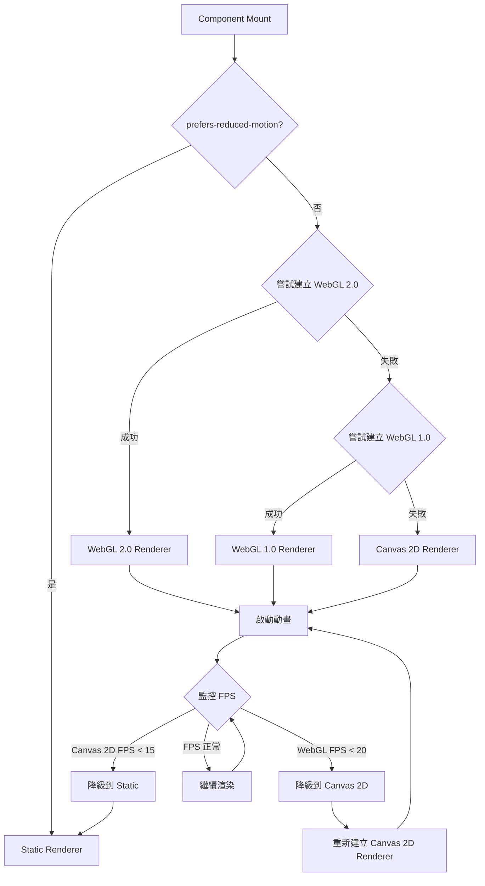

# WebGL ASCII Donut Loading - 規格總覽

## 專案概述

**目標**：將現有的 Canvas 2D ASCII Donut Loading 動畫優化為 WebGL 版本，利用 GPU 加速解決手機端效能問題。

**問題陳述**：
- 桌面效能：24 FPS（達標）
- 手機效能：1.3 FPS（嚴重不足，使用者體驗差）

**解決方案**：
- 使用 WebGL 將 3D 數學計算移至 GPU
- 在 Fragment Shader 中實現 ASCII 字元映射
- 保持 100% API 相容性
- 實作完整的三級降級策略（WebGL → Canvas 2D → Static）

## 效能目標

| 指標 | 現況（Canvas 2D） | 目標（WebGL） | 提升比例 |
|------|------------------|--------------|---------|
| **桌面 FPS** | 24 | 60 | 2.5x |
| **手機 FPS** | 1.3 | 30-40 | 23-30x |
| **初始化時間** | < 100ms | < 150ms | -50ms（可接受） |
| **記憶體使用** | ~7KB | ~60KB | 8.5x（紋理開銷） |
| **CPU 使用率** | 25-30% | < 10% | 降低 60-70% |
| **GPU 使用率** | 0% | 30-40% | N/A |

## 技術方案

### 核心技術決策

1. **字元渲染方式**：使用預先生成的字元紋理圖集（Texture Atlas）
2. **GPU 計算策略**：在 Vertex Shader 中完整計算環面幾何、旋轉、投影
3. **渲染 Primitive**：使用 Point Primitives（gl.POINTS）渲染字元
4. **降級策略**：三級降級（WebGL 2.0 → WebGL 1.0 → Canvas 2D → Static）

### 架構設計

```
src/lib/
  ├── donutRenderer.ts              (現有 - Canvas 2D)
  ├── webgl/
  │   ├── WebGLDonutRenderer.ts     (新增 - WebGL 渲染器)
  │   ├── shaders.ts                (新增 - Shader 原始碼)
  │   ├── textureAtlas.ts           (新增 - 字元紋理生成)
  │   ├── webglUtils.ts             (新增 - WebGL 工具函數)
  │   └── types.ts                  (新增 - WebGL 型別定義)
  └── rendererFactory.ts            (新增 - 渲染器工廠)

src/components/loading/
  └── AsciiDonutLoading.tsx         (修改 - 使用渲染器工廠)
```

### 降級策略



## 開發階段

### Phase 1: 概念驗證（PoC）（2-3 天）

**目標**：驗證 WebGL 字元渲染的可行性

**關鍵任務**：
- 建立 WebGL context 和基礎 shader pipeline
- 實作字元紋理圖集生成
- 渲染單一 ASCII 字元到 WebGL canvas
- 驗證視覺效果與 Canvas 2D 一致

**驗收標準**：
- ✅ 成功渲染字元 "@" 到 WebGL canvas
- ✅ 字元顏色為 Pip-Boy 綠色
- ✅ 字元清晰可辨識

### Phase 2: 核心實作（4-5 天）

**目標**：實作完整的 WebGL 渲染器

**關鍵任務**：
- 實作完整的 Vertex Shader（環面幾何 + 旋轉 + 投影）
- 實作完整的 Fragment Shader（光照 + 字元映射）
- 實作 WebGLDonutRenderer 類別
- 單元測試驗證

**驗收標準**：
- ✅ Vertex Shader 正確計算 3D 座標和投影
- ✅ Fragment Shader 正確渲染字元
- ✅ 所有單元測試通過

### Phase 3: 整合與降級策略（2-3 天）

**目標**：整合 WebGL 渲染器到現有系統

**關鍵任務**：
- 定義統一渲染器介面（IDonutRenderer）
- 實作 RendererFactory（自動選擇最佳渲染器）
- 修改 AsciiDonutLoading 組件支援多渲染器
- 實作三級降級邏輯

**驗收標準**：
- ✅ 自動偵測並選擇最佳渲染器
- ✅ 降級邏輯正常運作
- ✅ 整合測試通過

### Phase 4: 效能優化與測試（2-3 天）

**目標**：達到效能目標並確保品質

**關鍵任務**：
- 桌面效能測試（目標：60 FPS）
- 手機效能測試（目標：30+ FPS）
- E2E 視覺回歸測試
- 跨瀏覽器測試（Chrome, Firefox, Safari）

**驗收標準**：
- ✅ 桌面達到 60 FPS
- ✅ 手機達到 30+ FPS
- ✅ 所有 E2E 測試通過
- ✅ 跨瀏覽器測試通過

### Phase 5: 文件與發布（1 天）

**目標**：完成文件並發布

**關鍵任務**：
- 撰寫技術文件
- 準備 PR 和 Code Review
- 建立 Feature Flag 機制
- 部署到 production 並監控

**驗收標準**：
- ✅ 文件完整
- ✅ Code Review 通過
- ✅ Production 部署成功

## 規格文件

1. **[requirements.md](./requirements.md)** - 詳細的需求分析
   - 10 個主要需求（WebGL 可行性、GPU 加速、Shader 實作、API 相容性等）
   - 非功能需求（效能、瀏覽器支援、無障礙）
   - 成功標準與風險評估

2. **[design.md](./design.md)** - 架構設計和實作細節
   - 技術可行性分析（WebGL vs Canvas 2D 效能對比）
   - 4 個關鍵設計決策（紋理圖集、Vertex Shader 計算、Point Primitives、降級策略）
   - 完整的 Shader 程式碼範例（Vertex Shader + Fragment Shader）
   - WebGL 初始化與渲染流程圖
   - 錯誤處理與資源管理策略

3. **[tasks.md](./tasks.md)** - 可執行的開發任務清單
   - 25 個詳細任務，分為 5 個階段
   - 每個任務包含：目標、依賴、步驟、產出、驗收標準、程式碼範例、預估時間
   - 總時程：11-15 天
   - 風險管理與緩解措施

## 關鍵技術亮點

### 1. GPU 平行計算

**現有 Canvas 2D 方式（CPU）**：
```typescript
// 序列處理每個點
for (let theta = 0; theta < 2π; theta += 0.07) {
  for (let phi = 0; phi < 2π; phi += 0.02) {
    // 計算 3D 座標、旋轉、投影、光照
    // 約 2000-3000 次循環，手機 CPU 單核處理慢
  }
}
```

**WebGL 方式（GPU）**：
```glsl
// Vertex Shader - GPU 並行處理所有點
void main() {
  // 每個點的計算在不同的 GPU 核心上並行執行
  // 2000-3000 個點同時計算，速度提升 20-30x
  vec3 position = calculateTorusPoint(a_theta, a_phi);
  gl_Position = projectToScreen(position);
}
```

### 2. ASCII 字元在 GPU 上的實現

**創新方案：字元紋理圖集**
```typescript
// 動態生成包含所有 ASCII 字元的紋理
const atlasCanvas = generateCharacterAtlas({
  characters: '.,-~:;=!*#$@',
  charWidth: 8,
  charHeight: 16
});
// 紋理尺寸：96x16 (12 個字元 x 8 寬度)

// Fragment Shader 根據亮度選擇字元
float charIndex = floor(luminance * 11.0); // 0-11
float charU = (charIndex + gl_PointCoord.x) / 12.0;
vec4 charColor = texture(u_charAtlas, vec2(charU, gl_PointCoord.y));
```

### 3. 完整的降級策略

**三級降級確保所有裝置可用**：
1. **WebGL 2.0**（最佳效能）→ 桌面 60 FPS, 手機 40+ FPS
2. **WebGL 1.0**（次佳效能）→ 桌面 50+ FPS, 手機 30+ FPS
3. **Canvas 2D**（基準效能）→ 桌面 24 FPS, 手機 1.3 FPS
4. **Static**（最終回退）→ 靜態 ASCII 圖案

## API 相容性

**100% 向後相容**：
```typescript
// 現有 API（不變）
<AsciiDonutLoading
  message="LOADING..."
  config={{ width: 80, height: 24 }}
/>

// 新增功能（可選）
<AsciiDonutLoading
  message="LOADING..."
  config={{ width: 80, height: 24 }}
  // URL 參數強制使用特定渲染器（測試用）
  // ?renderer=webgl|canvas|static
/>

// 環境變數控制預設渲染器
NEXT_PUBLIC_DEFAULT_RENDERER=webgl|canvas|auto
```

## 效能數據預估

### 計算密集度分析

**環面表面點數**：約 2000-3000 個點
- `theta` 步進：0.07 → 約 90 個點
- `phi` 步進：0.02 → 約 314 個點
- 總點數：90 × 314 ≈ 28,260 個點（但投影後約 2000-3000 個可見點）

**每點運算量**：
- 三角函數：4 次（sin/cos theta, sin/cos phi）
- 矩陣乘法：約 20 次浮點運算
- 光照計算：約 10 次浮點運算
- **總計**：約 50 次浮點運算 / 點

**Canvas 2D（CPU）效能**：
- 手機單核效能：約 1 GFLOPS
- 總運算量：2500 點 × 50 運算 × 24 FPS = 3 MFLOPS
- 但 JavaScript 解釋執行效率低，實際只達到 1.3 FPS

**WebGL（GPU）效能**：
- 手機 GPU：約 100 GFLOPS（100 個處理單元並行）
- 相同運算量在 GPU 上並行執行
- 預估 FPS：30-40 FPS（提升 20-30x）

## 風險管理

### 技術風險

| 風險 | 機率 | 影響 | 緩解措施 |
|------|------|------|---------|
| WebGL 字元渲染效果不理想 | 中 | 高 | PoC 階段驗證，視覺回歸測試 |
| 跨瀏覽器 WebGL 相容性問題 | 中 | 中 | 完整降級策略，廣泛測試 |
| 效能提升未達預期 | 低 | 中 | 保留 Canvas 2D 版本，可回退 |
| Shader 除錯困難 | 中 | 低 | 提供詳細錯誤訊息和開發工具 |

### 緩解措施

1. **PoC 優先**：Phase 1 先驗證技術可行性，失敗時可及早調整方案
2. **完整降級策略**：確保所有裝置都能正常使用（即使效能受限）
3. **保留現有版本**：WebGL 版本作為增強，不移除 Canvas 2D 版本
4. **Feature Flag**：可隨時透過環境變數切換渲染器

## 成功標準

### 量化指標

1. ✅ **手機 FPS 提升 20x**：從 1.3 FPS 提升到 30+ FPS
2. ✅ **桌面 FPS 提升 2.5x**：從 24 FPS 提升到 60 FPS
3. ✅ **零破壞性變更**：100% API 相容性，現有程式碼無需修改
4. ✅ **95%+ 瀏覽器支援**：透過降級機制支援幾乎所有瀏覽器

### 質化指標

1. ✅ **使用者體驗**：手機端動畫流暢，無明顯卡頓
2. ✅ **開發體驗**：清晰的錯誤訊息，良好的偵錯工具
3. ✅ **可維護性**：程式碼清晰，文件完整，易於擴展

## 下一步行動

### 立即開始（Phase 1: PoC）

1. **建立 WebGL 基礎結構**（任務 1.1）
   - 建立 `src/lib/webgl/` 目錄
   - 實作 `createWebGLContext()` 函數
   - 實作基本的 shader 編譯函數

2. **實作字元紋理圖集**（任務 1.2）
   - 實作 `generateCharacterAtlas()` 函數
   - 實作 `uploadTextureToGPU()` 函數

3. **撰寫簡單 Shader**（任務 1.3）
   - 撰寫 PoC Vertex/Fragment Shader
   - 實作 shader 編譯和連結函數

4. **PoC Demo**（任務 1.4）
   - 整合以上元件
   - 成功渲染單一字元 "@"
   - 驗證視覺效果

**預估時間**：2-3 天

### 驗證標準

如果 PoC 成功（字元渲染效果良好），則繼續 Phase 2 核心實作。
如果 PoC 失敗，則重新評估技術方案或保留現有 Canvas 2D 版本。

## 參考資料

### 技術文件
- [WebGL Fundamentals](https://webglfundamentals.org/)
- [MDN: WebGL API](https://developer.mozilla.org/en-US/docs/Web/API/WebGL_API)
- [WebGL2 Fundamentals](https://webgl2fundamentals.org/)
- [ASCII Art in WebGL](https://github.com/mattdesl/ascii-art-in-webgl)

### 專案相關
- 現有規格：`.kiro/specs/ascii-donut-loading/`
- Steering 文件：`.kiro/steering/tech.md`
- 現有實作：`src/lib/donutRenderer.ts`, `src/components/loading/AsciiDonutLoading.tsx`

---

**建立時間**：2025-10-09
**狀態**：規劃完成，等待實作
**預估總時程**：11-15 天
**優先級**：高（手機效能嚴重不足）
