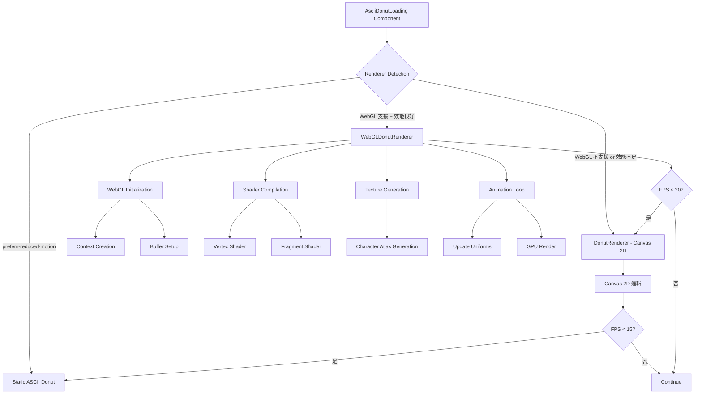
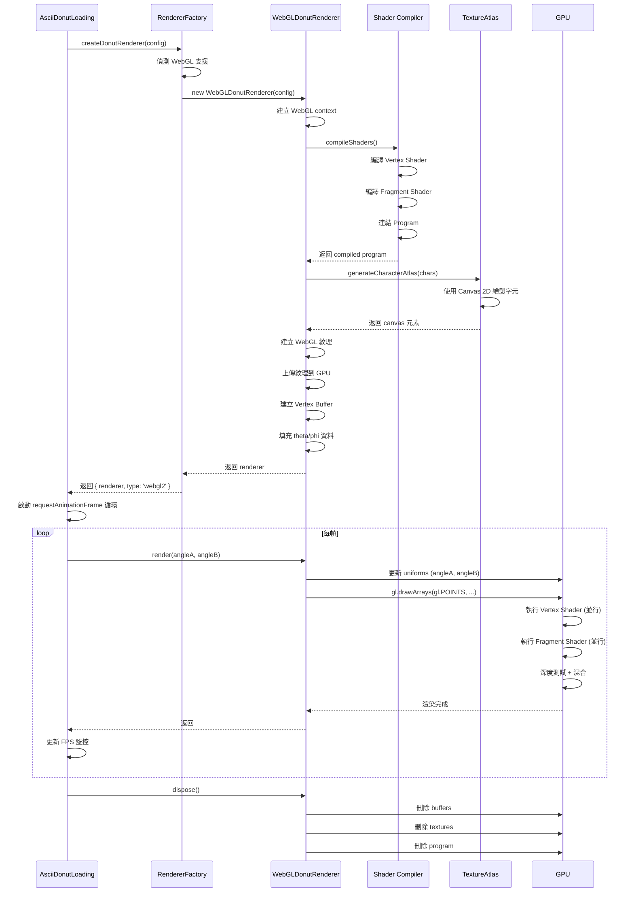
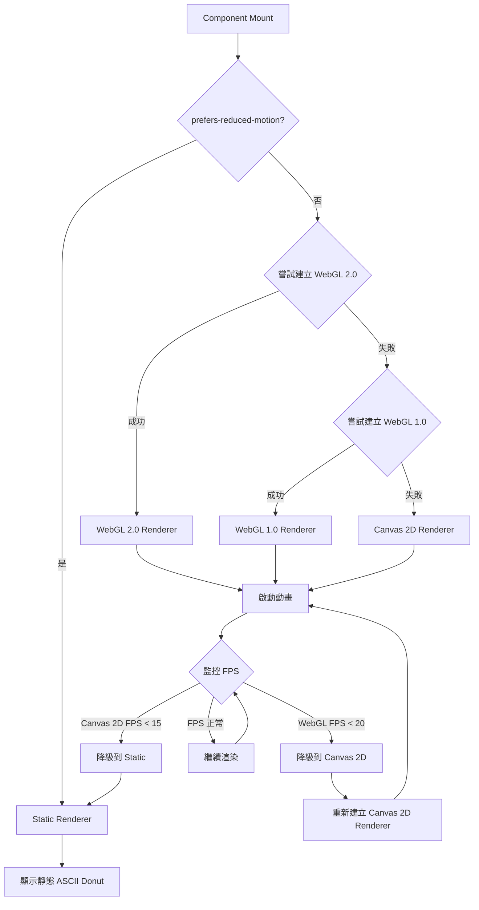

# WebGL ASCII Donut Loading - 技術設計文件

## 概述

### 目的
將現有的 Canvas 2D ASCII Donut Loading 動畫優化為 WebGL 版本，利用 GPU 加速解決手機端效能問題（從 1.3 FPS 提升到 30+ FPS）。此優化版本將保持 100% API 相容性，並實作完整的三級降級策略（WebGL → Canvas 2D → Static）。

**使用者**：所有訪問應用程式的使用者，特別是手機端使用者將獲得顯著的效能提升。

**影響**：大幅提升手機端載入動畫的流暢度，減少 CPU 負擔，延長電池壽命，提供更專業的使用者體驗。

### 目標
- **核心目標**：手機端 FPS 從 1.3 提升到 30+，桌面從 24 提升到 60
- **技術目標**：在 GPU 上實現 ASCII 字元渲染，保持與 Canvas 2D 版本視覺一致
- **架構目標**：保持 API 相容性，實作完整降級策略，確保所有裝置可用

### 非目標
- 不實作其他 3D 形狀（目前僅限環面 torus）
- 不實作使用者互動控制（使用者無法控制旋轉或視角）
- 不在此階段支援多個甜甜圈或複雜場景
- 不實作即時陰影或高階光照模型（僅使用 Lambertian 反射）

## 架構

### 技術可行性分析

#### WebGL 適合 ASCII 藝術渲染的原因

**優勢**：
1. **GPU 平行計算**：環面表面的數千個點可以並行計算，而非 CPU 序列處理
2. **內建深度測試**：WebGL depth buffer 取代 CPU 的 z-buffer，硬體加速深度排序
3. **Fragment Shader 靈活性**：可在 GPU 上實現亮度計算和字元映射邏輯
4. **紋理映射支援**：使用字元紋理圖集渲染 ASCII 字元

**挑戰與解決方案**：

| 挑戰 | 解決方案 | 技術細節 |
|------|---------|---------|
| WebGL 渲染像素而非字元 | 使用字元紋理圖集（texture atlas） | 動態生成包含所有 ASCII 字元的紋理，Fragment Shader 根據亮度選擇對應字元紋理座標 |
| 等寬字體美感保持 | 固定字元網格佈局 | 每個字元佔據固定的螢幕空間（例如：8x16 像素），確保等寬排列 |
| 深度測試實作 | 使用 WebGL depth buffer | 啟用 `gl.DEPTH_TEST`，自動處理前後遮蔽關係 |
| API 相容性 | 抽象渲染器介面 | 實作 `IDonutRenderer` 介面，WebGL 和 Canvas 2D 版本共享相同介面 |

#### 效能差異預估

**計算密集度分析**：
- **環面表面點數**：約 2000-3000 個點（theta: 0.07 step, phi: 0.02 step）
- **每點運算**：三角函數（sin, cos）、矩陣乘法、投影計算、光照計算

**Canvas 2D（CPU）**：
- 序列處理：一次計算一個點
- JavaScript 執行：解釋執行，無 SIMD 優化
- 手機 CPU：單核效能弱，熱節流嚴重
- **結果**：1.3 FPS（手機）

**WebGL（GPU）**：
- 並行處理：數千個點同時計算（GPU 有數百個處理單元）
- 硬體加速：原生機器碼執行，SIMD 優化
- 手機 GPU：專為圖形運算設計，熱管理較好
- **預估**：30-60 FPS（手機），提升 20-40x

**記憶體使用對比**：
- Canvas 2D：z-buffer (Float32Array, ~2KB) + output buffer (string[][], ~5KB)
- WebGL：vertex buffer (~10KB) + texture (~50KB) + depth buffer (硬體管理)
- **結論**：WebGL 記憶體使用略高（~60KB vs ~7KB），但在可接受範圍內

### 高階架構



### 架構整合

#### 1. 抽象渲染器介面

為了保持 API 相容性並支援多種渲染後端，我們定義統一的渲染器介面：

```typescript
/**
 * 統一的 Donut 渲染器介面
 * Canvas 2D 和 WebGL 版本都實作此介面
 */
export interface IDonutRenderer {
  /**
   * 渲染單一幀
   * @param angleA - X 軸旋轉角度（弧度）
   * @param angleB - Z 軸旋轉角度（弧度）
   * @returns Canvas 2D: ASCII 字串, WebGL: void（直接渲染到 canvas）
   */
  render(angleA: number, angleB: number): string | void;

  /**
   * 清理資源
   */
  dispose(): void;

  /**
   * 取得渲染器類型（用於偵錯）
   */
  getType(): 'canvas-2d' | 'webgl' | 'webgl2';
}
```

#### 2. 新增元件與檔案結構

**新增檔案**：
```
src/lib/
  ├── donutRenderer.ts              (現有 - Canvas 2D)
  ├── webgl/
  │   ├── WebGLDonutRenderer.ts     (新增 - WebGL 渲染器)
  │   ├── shaders.ts                (新增 - Shader 原始碼)
  │   ├── textureAtlas.ts           (新增 - 字元紋理生成)
  │   ├── webglUtils.ts             (新增 - WebGL 工具函數)
  │   └── types.ts                  (新增 - WebGL 型別定義)
  └── rendererFactory.ts            (新增 - 渲染器工廠)

src/components/loading/
  └── AsciiDonutLoading.tsx         (修改 - 使用渲染器工廠)
```

**保留的現有模式**：
- TypeScript strict mode
- React functional components with hooks
- 模組化設計（邏輯與 UI 分離）
- 配置管理（DonutRendererConfig）

**新增模式的理由**：
1. **渲染器工廠模式**：根據瀏覽器支援度和效能自動選擇最佳渲染器
2. **WebGL 模組獨立**：所有 WebGL 邏輯隔離在 `src/lib/webgl/` 目錄，不污染現有程式碼
3. **統一介面**：IDonutRenderer 介面確保渲染器可互換，降低耦合

## 技術對齊

### 與現有技術棧的整合

**無需新增第三方依賴**：
- WebGL 為瀏覽器原生 API
- 字元紋理使用 Canvas 2D API 動態生成
- 繼續使用 React 19, TypeScript 5, Tailwind CSS v4

### Shader 技術選擇

**GLSL 版本**：
- 優先使用 GLSL ES 3.00（WebGL 2.0）
- 回退到 GLSL ES 1.00（WebGL 1.0）

**Shader 程式碼管理**：
```typescript
// src/lib/webgl/shaders.ts
export const vertexShaderSource = {
  webgl2: `#version 300 es
    // WebGL 2.0 Vertex Shader
    ...
  `,
  webgl1: `
    // WebGL 1.0 Vertex Shader
    ...
  `
};

export const fragmentShaderSource = {
  webgl2: `#version 300 es
    // WebGL 2.0 Fragment Shader
    ...
  `,
  webgl1: `
    // WebGL 1.0 Fragment Shader
    ...
  `
};
```

## 關鍵設計決策

### 決策 1: 字元紋理圖集（Texture Atlas）vs 即時字元渲染

**決策**：使用預先生成的字元紋理圖集

**情境**：需要在 Fragment Shader 中渲染 ASCII 字元

**替代方案**：
1. **字元紋理圖集**：初始化時生成包含所有字元的紋理，Shader 使用 UV 映射選擇字元
2. **即時字元渲染**：每幀使用 Canvas 2D 繪製字元並上傳為紋理
3. **SDF 字元**（Signed Distance Fields）：使用向量化字元表示，支援任意縮放

**選擇的方法**：字元紋理圖集

**實作細節**：
```typescript
// 生成字元紋理圖集
function generateCharacterAtlas(
  chars: string,
  fontSize: number,
  color: string
): HTMLCanvasElement {
  const charCount = chars.length;
  const charWidth = 8;  // 固定寬度
  const charHeight = 16; // 固定高度

  const canvas = document.createElement('canvas');
  canvas.width = charWidth * charCount;
  canvas.height = charHeight;

  const ctx = canvas.getContext('2d')!;
  ctx.font = `${fontSize}px monospace`;
  ctx.fillStyle = color;
  ctx.textBaseline = 'top';

  for (let i = 0; i < charCount; i++) {
    ctx.fillText(chars[i], i * charWidth, 0);
  }

  return canvas;
}
```

**理由**：
- **效能**：紋理只生成一次，每幀僅需 UV 映射
- **簡單性**：Fragment Shader 邏輯簡單，僅需計算紋理座標
- **品質**：使用 Canvas 2D 的文字渲染引擎，確保字元清晰度
- **相容性**：所有支援 WebGL 的瀏覽器都支援紋理映射

**權衡**：
- **獲得**：高效能、簡單實作、良好品質
- **犧牲**：不支援動態字型變化（但需求中不需要）、紋理記憶體使用（~50KB，可接受）

### 決策 2: Vertex Shader 計算 vs CPU 預計算 + Attribute

**決策**：在 Vertex Shader 中完整計算環面幾何

**情境**：需要決定環面表面點的 3D 座標計算位置

**替代方案**：
1. **Vertex Shader 完整計算**：在 GPU 計算環面參數方程式、旋轉矩陣、投影
2. **CPU 預計算**：CPU 計算所有頂點座標，傳遞給 Vertex Shader 作為 attribute
3. **混合模式**：CPU 計算靜態幾何，GPU 計算動態變換

**選擇的方法**：Vertex Shader 完整計算

**實作細節**：
```glsl
// Vertex Shader (GLSL ES 3.00)
#version 300 es

// Attributes (只傳遞 theta 和 phi 參數)
in float a_theta;
in float a_phi;

// Uniforms (傳遞旋轉角度和配置)
uniform float u_angleA;
uniform float u_angleB;
uniform float u_R1;
uniform float u_R2;
uniform float u_K1;
uniform float u_K2;
uniform float u_width;
uniform float u_height;

// Outputs
out float v_luminance;

void main() {
  // Step 1: 環面參數方程式
  float cosTheta = cos(a_theta);
  float sinTheta = sin(a_theta);
  float cosPhi = cos(a_phi);
  float sinPhi = sin(a_phi);

  float circleX = u_R2 + u_R1 * cosTheta;
  float circleY = u_R1 * sinTheta;

  // Step 2: 旋轉矩陣
  float sinA = sin(u_angleA);
  float cosA = cos(u_angleA);
  float sinB = sin(u_angleB);
  float cosB = cos(u_angleB);

  float x = circleX * (cosB * cosPhi + sinA * sinB * sinPhi) - circleY * cosA * sinB;
  float y = circleX * (sinB * cosPhi - sinA * cosB * sinPhi) + circleY * cosA * cosB;
  float z = u_K2 + cosA * circleX * sinPhi + circleY * sinA;

  // Step 3: 透視投影
  float ooz = 1.0 / z;
  float screenX = (u_width / 2.0) + u_K1 * ooz * x;
  float screenY = (u_height / 2.0) - u_K1 * ooz * y;

  // Step 4: 轉換到 NDC (Normalized Device Coordinates)
  float ndcX = (screenX / u_width) * 2.0 - 1.0;
  float ndcY = (screenY / u_height) * 2.0 - 1.0;

  gl_Position = vec4(ndcX, ndcY, ooz, 1.0);
  gl_PointSize = 16.0; // 字元大小

  // Step 5: 光照計算（傳遞給 Fragment Shader）
  float nx = cosTheta * (cosB * cosPhi + sinA * sinB * sinPhi) - sinTheta * cosA * sinB;
  float ny = cosTheta * (sinB * cosPhi - sinA * cosB * sinPhi) + sinTheta * cosA * cosB;
  float nz = cosA * cosTheta * sinPhi + sinTheta * sinA;

  vec3 lightDir = normalize(vec3(0.0, 0.7071, -0.7071));
  float luminance = dot(vec3(nx, ny, nz), lightDir);
  v_luminance = (luminance + 1.0) / 2.0; // 正規化到 [0, 1]
}
```

**理由**：
- **最大化 GPU 利用**：所有數學計算在 GPU 並行執行
- **減少頻寬**：只傳遞 theta/phi 參數（每頂點 2 個 float），而非完整座標（每頂點 3-4 個 float）
- **動態更新效率**：更新旋轉角度只需修改 uniform，無需重新上傳 vertex buffer

**權衡**：
- **獲得**：最佳效能、最小頻寬、動態更新快速
- **犧牲**：Vertex Shader 較複雜（但可維護性仍良好）

### 決策 3: Point Primitives vs Quad Meshes for 字元渲染

**決策**：使用 Point Primitives（gl.POINTS）

**情境**：需要選擇 WebGL primitive 類型來渲染字元

**替代方案**：
1. **Point Primitives (gl.POINTS)**：每個環面表面點渲染為一個 point，Fragment Shader 繪製字元
2. **Quad Meshes (gl.TRIANGLES)**：每個字元渲染為兩個三角形組成的四邊形
3. **Instanced Quads**：使用 instanced rendering 渲染多個四邊形

**選擇的方法**：Point Primitives

**實作細節**：
```javascript
// 設定 point size 和渲染
gl.enable(gl.PROGRAM_POINT_SIZE); // 允許 Vertex Shader 設定 point size
gl.drawArrays(gl.POINTS, 0, vertexCount);
```

```glsl
// Fragment Shader (GLSL ES 3.00)
#version 300 es
precision highp float;

in float v_luminance;
out vec4 fragColor;

uniform sampler2D u_charAtlas;
uniform float u_charCount;

void main() {
  // 根據亮度選擇字元索引
  float charIndex = floor(v_luminance * (u_charCount - 1.0));

  // 計算紋理座標（UV mapping）
  float charU = (charIndex + gl_PointCoord.x) / u_charCount;
  float charV = gl_PointCoord.y;

  vec4 charColor = texture(u_charAtlas, vec2(charU, charV));
  fragColor = charColor;
}
```

**理由**：
- **簡化幾何**：無需建立複雜的 quad mesh 和 index buffer
- **自動插值**：`gl_PointCoord` 自動提供點內的紋理座標
- **效能**：減少頂點數量（Point: N 個頂點, Quad: 4N 個頂點）

**權衡**：
- **獲得**：簡單實作、較少頂點、良好效能
- **犧牲**：Point size 在某些行動裝置有限制（最大 64-128 pixels），但我們的字元大小（16px）遠小於此限制

### 決策 4: 三級降級策略實作

**決策**：使用效能偵測 + Feature Detection 的混合降級策略

**情境**：需要確保所有裝置都能顯示動畫

**降級流程**：

```typescript
// src/lib/rendererFactory.ts
export enum RendererType {
  WEBGL2 = 'webgl2',
  WEBGL = 'webgl',
  CANVAS_2D = 'canvas-2d',
  STATIC = 'static'
}

export function createDonutRenderer(
  config: DonutRendererConfig,
  preferredType?: RendererType
): {
  renderer: IDonutRenderer;
  type: RendererType;
} {
  // Step 1: 檢查 prefers-reduced-motion
  if (window.matchMedia('(prefers-reduced-motion: reduce)').matches) {
    return { renderer: new StaticRenderer(), type: RendererType.STATIC };
  }

  // Step 2: 嘗試 WebGL 2.0
  if (!preferredType || preferredType === RendererType.WEBGL2) {
    const webgl2Renderer = tryCreateWebGL2Renderer(config);
    if (webgl2Renderer) {
      return { renderer: webgl2Renderer, type: RendererType.WEBGL2 };
    }
  }

  // Step 3: 嘗試 WebGL 1.0
  if (!preferredType || preferredType === RendererType.WEBGL) {
    const webglRenderer = tryCreateWebGLRenderer(config);
    if (webglRenderer) {
      return { renderer: webglRenderer, type: RendererType.WEBGL };
    }
  }

  // Step 4: 回退到 Canvas 2D
  if (!preferredType || preferredType === RendererType.CANVAS_2D) {
    return {
      renderer: new DonutRenderer(config),
      type: RendererType.CANVAS_2D
    };
  }

  // Step 5: 最終回退到靜態模式
  return { renderer: new StaticRenderer(), type: RendererType.STATIC };
}

// 效能監控觸發降級
function monitorPerformanceAndDegrade(
  currentType: RendererType,
  fps: number
): RendererType | null {
  if (currentType === RendererType.WEBGL2 || currentType === RendererType.WEBGL) {
    if (fps < 20) {
      console.warn('[Renderer] WebGL FPS < 20, degrading to Canvas 2D');
      return RendererType.CANVAS_2D;
    }
  }

  if (currentType === RendererType.CANVAS_2D) {
    if (fps < 15) {
      console.warn('[Renderer] Canvas 2D FPS < 15, degrading to Static');
      return RendererType.STATIC;
    }
  }

  return null; // 無需降級
}
```

**理由**：
- **彈性**：支援手動選擇渲染器（測試用）和自動選擇
- **健壯性**：多層降級確保所有裝置可用
- **效能優先**：優先使用最高效能的渲染器

## 系統流程

### WebGL 初始化與渲染流程



### 降級流程



## 需求追溯

| 需求 | 需求摘要 | 元件 | 介面 | 流程 |
|------|---------|------|------|------|
| 1.1-1.5 | WebGL 技術可行性驗證 | RendererFactory | `createDonutRenderer()` | 降級流程 |
| 2.1-2.5 | GPU 加速 3D 數學計算 | WebGLDonutRenderer, Vertex Shader | `render()`, Shader uniforms | WebGL 初始化與渲染流程 |
| 3.1-3.5 | Fragment Shader ASCII 字元映射 | Fragment Shader, TextureAtlas | `generateCharacterAtlas()` | WebGL 初始化與渲染流程 |
| 4.1-4.5 | API 相容性與漸進式遷移 | IDonutRenderer, RendererFactory | `IDonutRenderer` 介面 | 所有流程 |
| 5.1-5.6 | 三級降級策略 | RendererFactory, AsciiDonutLoading | `createDonutRenderer()`, `monitorPerformanceAndDegrade()` | 降級流程 |
| 6.1-6.6 | 效能目標與監控 | AsciiDonutLoading, WebGLDonutRenderer | FPS 監控邏輯 | WebGL 初始化與渲染流程 |
| 7.1-7.6 | 字元紋理圖集產生 | TextureAtlas | `generateCharacterAtlas()` | WebGL 初始化與渲染流程 |
| 8.1-8.6 | Shader 程式設計與編譯 | ShaderCompiler | `compileShader()`, `linkProgram()` | WebGL 初始化與渲染流程 |
| 9.1-9.6 | WebGL Context 管理 | WebGLDonutRenderer | `dispose()`, context event listeners | WebGL 初始化與渲染流程 |
| 10.1-10.6 | 開發體驗與偵錯工具 | 各元件 | 偵錯工具介面 | 所有流程 |

## 元件與介面

### WebGL Domain

#### WebGLDonutRenderer 類別

**職責與邊界**：
- **主要職責**：使用 WebGL 渲染 ASCII donut 動畫到 canvas
- **領域邊界**：WebGL 渲染層，負責 GPU 資源管理和渲染循環
- **資料擁有權**：WebGL context, buffers, textures, shaders
- **事務邊界**：單一 render() 呼叫為一個 GPU 渲染命令提交

**依賴關係**：
- **Inbound**：RendererFactory（建立）, AsciiDonutLoading（呼叫 render）
- **Outbound**：ShaderCompiler, TextureAtlas, WebGLUtils
- **External**：WebGL API

**合約定義**：

```typescript
export class WebGLDonutRenderer implements IDonutRenderer {
  private gl: WebGLRenderingContext | WebGL2RenderingContext;
  private program: WebGLProgram;
  private buffers: {
    vertex: WebGLBuffer;
  };
  private texture: WebGLTexture;
  private uniforms: {
    angleA: WebGLUniformLocation;
    angleB: WebGLUniformLocation;
    R1: WebGLUniformLocation;
    R2: WebGLUniformLocation;
    K1: WebGLUniformLocation;
    K2: WebGLUniformLocation;
    width: WebGLUniformLocation;
    height: WebGLUniformLocation;
    charAtlas: WebGLUniformLocation;
    charCount: WebGLUniformLocation;
  };

  constructor(
    canvas: HTMLCanvasElement,
    config: DonutRendererConfig
  );

  render(angleA: number, angleB: number): void;
  dispose(): void;
  getType(): 'webgl' | 'webgl2';
}
```

**前置條件**：
- `canvas` 元素存在且可取得 WebGL context
- `config` 參數有效

**後置條件**：
- 每次 `render()` 呼叫後，canvas 顯示更新後的 ASCII donut
- `dispose()` 呼叫後，所有 WebGL 資源被釋放

**不變性**：
- WebGL context 在渲染器生命週期內不變
- 配置參數在渲染器生命週期內不變

#### TextureAtlas 模組

**職責與邊界**：
- **主要職責**：動態生成 ASCII 字元紋理圖集
- **領域邊界**：紋理生成層
- **資料擁有權**：Canvas 2D 繪製的字元圖集

**合約定義**：

```typescript
export interface CharacterAtlasOptions {
  characters: string;
  fontSize: number;
  fontFamily: string;
  color: string;
  charWidth: number;
  charHeight: number;
}

export function generateCharacterAtlas(
  options: CharacterAtlasOptions
): HTMLCanvasElement;

export function uploadTextureToGPU(
  gl: WebGLRenderingContext | WebGL2RenderingContext,
  atlasCanvas: HTMLCanvasElement
): WebGLTexture;
```

**前置條件**：
- `options.characters.length > 0`
- `options.fontSize > 0`

**後置條件**：
- 返回的 canvas 包含所有字元的網格佈局
- 紋理成功上傳到 GPU

#### ShaderCompiler 模組

**職責與邊界**：
- **主要職責**：編譯和連結 Vertex/Fragment Shaders
- **領域邊界**：Shader 編譯層
- **資料擁有權**：編譯後的 WebGLProgram

**合約定義**：

```typescript
export function compileShader(
  gl: WebGLRenderingContext | WebGL2RenderingContext,
  type: number, // gl.VERTEX_SHADER | gl.FRAGMENT_SHADER
  source: string
): WebGLShader | null;

export function linkProgram(
  gl: WebGLRenderingContext | WebGL2RenderingContext,
  vertexShader: WebGLShader,
  fragmentShader: WebGLShader
): WebGLProgram | null;

export function getUniformLocations(
  gl: WebGLRenderingContext | WebGL2RenderingContext,
  program: WebGLProgram,
  names: string[]
): Record<string, WebGLUniformLocation>;
```

**前置條件**：
- Shader 原始碼語法正確
- WebGL context 有效

**後置條件**：
- 編譯失敗時返回 `null` 並記錄錯誤
- 編譯成功時返回有效的 shader/program

#### RendererFactory 模組

**職責與邊界**：
- **主要職責**：根據瀏覽器支援度和效能自動選擇渲染器
- **領域邊界**：渲染器建立和管理層
- **資料擁有權**：渲染器實例

**合約定義**：

```typescript
export function createDonutRenderer(
  canvas: HTMLCanvasElement,
  config: DonutRendererConfig,
  preferredType?: RendererType
): {
  renderer: IDonutRenderer;
  type: RendererType;
} | null;

export function monitorPerformanceAndDegrade(
  currentType: RendererType,
  fps: number
): RendererType | null;
```

## 資料模型

### WebGL 資料結構

#### Vertex Buffer

```typescript
interface VertexData {
  // 每個頂點儲存 theta 和 phi 參數
  // Float32Array, size = vertexCount * 2
  positions: Float32Array;
}

// 產生 vertex data
function generateVertexData(config: DonutRendererConfig): VertexData {
  const vertices: number[] = [];

  for (let theta = 0; theta < Math.PI * 2; theta += config.thetaSpacing) {
    for (let phi = 0; phi < Math.PI * 2; phi += config.phiSpacing) {
      vertices.push(theta, phi);
    }
  }

  return {
    positions: new Float32Array(vertices)
  };
}
```

#### Uniform 資料

```typescript
interface UniformData {
  // 旋轉角度
  angleA: number;
  angleB: number;

  // 環面參數
  R1: number;
  R2: number;
  K1: number;
  K2: number;

  // 螢幕尺寸
  width: number;
  height: number;

  // 字元紋理
  charAtlas: WebGLTexture;
  charCount: number;
}
```

#### Texture 資料

```typescript
interface TextureAtlasData {
  // Canvas 元素（用於產生紋理）
  canvas: HTMLCanvasElement;

  // 紋理尺寸
  width: number;  // charWidth * charCount
  height: number; // charHeight

  // 字元資訊
  charCount: number;
  charWidth: number;
  charHeight: number;
}
```

## 錯誤處理

### WebGL 錯誤處理策略

#### 1. WebGL Context 建立失敗

```typescript
function createWebGLContext(
  canvas: HTMLCanvasElement
): WebGLRenderingContext | WebGL2RenderingContext | null {
  try {
    // 嘗試 WebGL 2.0
    const gl2 = canvas.getContext('webgl2');
    if (gl2) return gl2;

    // 回退到 WebGL 1.0
    const gl = canvas.getContext('webgl') || canvas.getContext('experimental-webgl');
    if (gl) return gl;

    console.warn('[WebGL] Context creation failed, WebGL not supported');
    return null;
  } catch (e) {
    console.error('[WebGL] Exception during context creation:', e);
    return null;
  }
}
```

**回應**：降級到 Canvas 2D 渲染器

#### 2. Shader 編譯錯誤

```typescript
function compileShader(
  gl: WebGLRenderingContext | WebGL2RenderingContext,
  type: number,
  source: string
): WebGLShader | null {
  const shader = gl.createShader(type);
  if (!shader) return null;

  gl.shaderSource(shader, source);
  gl.compileShader(shader);

  if (!gl.getShaderParameter(shader, gl.COMPILE_STATUS)) {
    const info = gl.getShaderInfoLog(shader);
    console.error(`[WebGL] Shader compilation failed:\n${info}\nSource:\n${source}`);
    gl.deleteShader(shader);
    return null;
  }

  return shader;
}
```

**回應**：降級到 Canvas 2D 渲染器

#### 3. WebGL Context Lost

```typescript
class WebGLDonutRenderer {
  constructor(canvas: HTMLCanvasElement, config: DonutRendererConfig) {
    // ...

    // 監聽 context lost 事件
    canvas.addEventListener('webglcontextlost', (e) => {
      e.preventDefault();
      console.warn('[WebGL] Context lost');
      this.handleContextLost();
    });

    canvas.addEventListener('webglcontextrestored', () => {
      console.log('[WebGL] Context restored');
      this.handleContextRestored();
    });
  }

  private handleContextLost() {
    // 停止渲染循環
    // 觸發降級到 Canvas 2D
    this.emit('context-lost');
  }

  private handleContextRestored() {
    // 嘗試重新初始化 WebGL
    // 若失敗，保持降級狀態
  }
}
```

**回應**：降級到 Canvas 2D 渲染器

#### 4. 效能不足

```typescript
function monitorFPSAndDegrade(
  renderer: IDonutRenderer,
  fps: number
): boolean {
  if (renderer.getType() === 'webgl' || renderer.getType() === 'webgl2') {
    if (fps < 20) {
      console.warn(`[WebGL] Low FPS detected (${fps.toFixed(1)}), degrading to Canvas 2D`);
      return true; // 需要降級
    }
  }
  return false;
}
```

**回應**：降級到 Canvas 2D 渲染器

## 測試策略

### 單元測試

#### 1. TextureAtlas 測試

```typescript
describe('TextureAtlas', () => {
  it('should generate atlas with correct dimensions', () => {
    const atlas = generateCharacterAtlas({
      characters: '.,-~:;=!*#$@',
      fontSize: 14,
      fontFamily: 'monospace',
      color: '#00ff00',
      charWidth: 8,
      charHeight: 16
    });

    expect(atlas.width).toBe(8 * 12); // 12 個字元
    expect(atlas.height).toBe(16);
  });

  it('should render characters with correct color', () => {
    const atlas = generateCharacterAtlas({...});
    const ctx = atlas.getContext('2d');
    const imageData = ctx.getImageData(0, 0, 1, 1);

    // 驗證顏色為 Pip-Boy 綠色
    expect(imageData.data[0]).toBe(0);   // R
    expect(imageData.data[1]).toBe(255); // G
    expect(imageData.data[2]).toBe(0);   // B
  });
});
```

#### 2. ShaderCompiler 測試

```typescript
describe('ShaderCompiler', () => {
  let gl: WebGLRenderingContext;

  beforeEach(() => {
    const canvas = document.createElement('canvas');
    gl = canvas.getContext('webgl')!;
  });

  it('should compile valid vertex shader', () => {
    const shader = compileShader(gl, gl.VERTEX_SHADER, validVertexShaderSource);
    expect(shader).not.toBeNull();
  });

  it('should return null for invalid shader', () => {
    const shader = compileShader(gl, gl.VERTEX_SHADER, 'invalid code');
    expect(shader).toBeNull();
  });

  it('should link program successfully', () => {
    const vs = compileShader(gl, gl.VERTEX_SHADER, validVertexShaderSource);
    const fs = compileShader(gl, gl.FRAGMENT_SHADER, validFragmentShaderSource);
    const program = linkProgram(gl, vs!, fs!);
    expect(program).not.toBeNull();
  });
});
```

#### 3. RendererFactory 測試

```typescript
describe('RendererFactory', () => {
  it('should create WebGL renderer when supported', () => {
    const canvas = document.createElement('canvas');
    const result = createDonutRenderer(canvas, DEFAULT_DONUT_CONFIG);

    expect(result).not.toBeNull();
    expect(result!.type).toMatch(/webgl|webgl2/);
  });

  it('should fallback to Canvas 2D when WebGL not supported', () => {
    // Mock WebGL 不支援
    jest.spyOn(HTMLCanvasElement.prototype, 'getContext').mockReturnValue(null);

    const canvas = document.createElement('canvas');
    const result = createDonutRenderer(canvas, DEFAULT_DONUT_CONFIG);

    expect(result!.type).toBe('canvas-2d');
  });

  it('should recommend degradation when FPS < 20', () => {
    const degradeTo = monitorPerformanceAndDegrade('webgl2', 18);
    expect(degradeTo).toBe('canvas-2d');
  });
});
```

### 整合測試

#### WebGLDonutRenderer 整合測試

```typescript
describe('WebGLDonutRenderer Integration', () => {
  let canvas: HTMLCanvasElement;
  let renderer: WebGLDonutRenderer;

  beforeEach(() => {
    canvas = document.createElement('canvas');
    canvas.width = 800;
    canvas.height = 600;
    renderer = new WebGLDonutRenderer(canvas, DEFAULT_DONUT_CONFIG);
  });

  afterEach(() => {
    renderer.dispose();
  });

  it('should initialize without errors', () => {
    expect(renderer).toBeDefined();
    expect(renderer.getType()).toMatch(/webgl|webgl2/);
  });

  it('should render multiple frames', () => {
    expect(() => {
      renderer.render(0, 0);
      renderer.render(0.1, 0.05);
      renderer.render(0.2, 0.1);
    }).not.toThrow();
  });

  it('should clean up resources on dispose', () => {
    const gl = (renderer as any).gl;
    const spy = jest.spyOn(gl, 'deleteTexture');

    renderer.dispose();

    expect(spy).toHaveBeenCalled();
  });
});
```

### E2E 測試（Playwright）

#### 視覺回歸測試

```typescript
test('WebGL ASCII Donut renders correctly', async ({ page }) => {
  await page.goto('/?renderer=webgl');

  // 等待動畫開始
  await page.waitForSelector('[data-testid="ascii-donut-canvas"]');

  // 等待至少 3 幀渲染
  await page.waitForTimeout(150);

  // 截圖比對
  await expect(page).toHaveScreenshot('webgl-donut-frame1.png');

  await page.waitForTimeout(100);
  await expect(page).toHaveScreenshot('webgl-donut-frame2.png');
});
```

#### 效能測試

```typescript
test('WebGL renderer achieves target FPS', async ({ page }) => {
  await page.goto('/?renderer=webgl');

  // 監控 FPS
  const fps = await page.evaluate(() => {
    return new Promise<number>((resolve) => {
      let frameCount = 0;
      const start = performance.now();

      function countFrames() {
        frameCount++;
        if (performance.now() - start < 1000) {
          requestAnimationFrame(countFrames);
        } else {
          resolve(frameCount);
        }
      }

      requestAnimationFrame(countFrames);
    });
  });

  // 桌面應達到 60 FPS（允許 ±10%）
  expect(fps).toBeGreaterThan(54);
});
```

#### 降級測試

```typescript
test('degrades to Canvas 2D when WebGL fails', async ({ page, context }) => {
  // 模擬 WebGL 不支援
  await context.addInitScript(() => {
    HTMLCanvasElement.prototype.getContext = function(type) {
      if (type === 'webgl' || type === 'webgl2') return null;
      return Object.getPrototypeOf(this).getContext.call(this, type);
    };
  });

  await page.goto('/');

  // 應顯示 Canvas 2D 版本
  const rendererType = await page.evaluate(() => {
    return (window as any).__donutRendererType;
  });

  expect(rendererType).toBe('canvas-2d');
});
```

## 效能與可擴展性

### 效能目標

| 指標 | Canvas 2D（現有） | WebGL（目標） | 提升比例 |
|------|------------------|--------------|---------|
| 桌面 FPS | 24 | 60 | 2.5x |
| 手機 FPS | 1.3 | 30-40 | 23-30x |
| 初始化時間 | < 100ms | < 150ms | -50ms（可接受） |
| 記憶體使用 | ~7KB | ~60KB | 8.5x（紋理開銷） |
| CPU 使用率 | 25-30% | < 10% | 降低 60-70% |
| GPU 使用率 | 0% | 30-40% | N/A |

### 效能優化策略

#### 1. Vertex Buffer 最小化

```typescript
// 僅傳遞 theta/phi 參數，所有計算在 GPU
interface VertexAttribute {
  theta: number; // 4 bytes
  phi: number;   // 4 bytes
}
// Total: 8 bytes per vertex

// 若傳遞完整座標和法向量
interface VertexAttributeFull {
  x: number;     // 4 bytes
  y: number;     // 4 bytes
  z: number;     // 4 bytes
  nx: number;    // 4 bytes
  ny: number;    // 4 bytes
  nz: number;    // 4 bytes
}
// Total: 24 bytes per vertex

// 節省頻寬：(24 - 8) / 24 = 66.7%
```

#### 2. 紋理壓縮（未來優化）

```typescript
// 目前：每個字元 8x16 = 128 pixels
// 未來：使用 SDF（Signed Distance Field）字元，支援任意縮放且紋理更小
```

#### 3. Shader 優化

```glsl
// 優化：使用內建函數和向量運算
// 不佳範例（標量運算）
float x = circleX * cosB * cosPhi + circleX * sinA * sinB * sinPhi - circleY * cosA * sinB;

// 良好範例（向量運算，GPU 可並行）
vec3 circle = vec3(circleX * cosPhi, circleX * sinPhi, circleY);
mat3 rotation = mat3(...); // 旋轉矩陣
vec3 rotated = rotation * circle;
float x = rotated.x;
```

### 可擴展性策略

#### 1. 支援其他 3D 形狀（未來）

```typescript
// 抽象幾何介面
interface IGeometry {
  generateVertices(config: any): Float32Array;
  getVertexShader(): string;
}

class TorusGeometry implements IGeometry { /* 環面 */ }
class SphereGeometry implements IGeometry { /* 球體 */ }
class CubeGeometry implements IGeometry { /* 立方體 */ }

// 渲染器使用幾何介面
class WebGLDonutRenderer {
  constructor(
    canvas: HTMLCanvasElement,
    geometry: IGeometry, // 注入幾何
    config: DonutRendererConfig
  ) {
    // ...
  }
}
```

#### 2. 多種字元集支援（未來）

```typescript
// 擴展配置支援多種字元集
interface ExtendedDonutConfig extends DonutRendererConfig {
  characterSets: {
    ascii: string;          // ".,-~:;=!*#$@"
    braille: string;        // "⠀⠁⠂⠃⠄⠅⠆⠇⠈⠉⠊⠋⠌⠍⠎⠏"
    blocks: string;         // " ▁▂▃▄▅▆▇█"
  };
  activeCharacterSet: 'ascii' | 'braille' | 'blocks';
}
```

#### 3. WebGL 2.0 專屬功能（未來）

```glsl
// WebGL 2.0: 使用 Transform Feedback 實現粒子系統
#version 300 es
layout(location = 0) in vec2 a_position;
out vec2 v_newPosition;

void main() {
  v_newPosition = a_position + velocity * deltaTime;
  gl_Position = vec4(v_newPosition, 0.0, 1.0);
}
```

## 遷移策略

### 階段 1: 概念驗證（PoC）（2-3 天）

**目標**：驗證 WebGL 字元渲染的可行性

**任務**：
1. 建立簡單的 WebGL context 和 shader
2. 生成字元紋理圖集
3. 渲染單一靜態字元到 canvas
4. 驗證視覺效果與 Canvas 2D 一致

**驗收標準**：
- 成功渲染 ASCII 字元 "@" 到 WebGL canvas
- 字元顏色為 Pip-Boy 綠色
- 字元清晰可辨識

### 階段 2: 核心實作（4-5 天）

**目標**：實作完整的 WebGL 渲染器

**任務**：
1. 實作 Vertex Shader（環面幾何 + 旋轉 + 投影）
2. 實作 Fragment Shader（光照 + 字元映射）
3. 實作 WebGLDonutRenderer 類別
4. 實作 TextureAtlas, ShaderCompiler 模組
5. 單元測試驗證

**驗收標準**：
- Vertex Shader 正確計算 3D 座標和投影
- Fragment Shader 正確渲染字元
- 所有單元測試通過

### 階段 3: 整合與降級策略（2-3 天）

**目標**：整合 WebGL 渲染器到現有系統

**任務**：
1. 實作 RendererFactory
2. 實作三級降級邏輯
3. 修改 AsciiDonutLoading 組件支援多種渲染器
4. 整合測試

**驗收標準**：
- 自動選擇最佳渲染器
- 降級邏輯正常運作
- 整合測試通過

### 階段 4: 效能優化與測試（2-3 天）

**目標**：達到效能目標

**任務**：
1. 效能測試（桌面 + 手機）
2. Shader 優化
3. E2E 測試
4. 跨瀏覽器測試

**驗收標準**：
- 桌面達到 60 FPS
- 手機達到 30+ FPS
- 所有 E2E 測試通過

### 階段 5: 文件與發布（1 天）

**目標**：完成文件並發布

**任務**：
1. 撰寫技術文件
2. 更新 README
3. 建立 PR
4. Code Review

**驗收標準**：
- 文件完整
- Code Review 通過
- 合併到 main

### Feature Flag 機制

```typescript
// 環境變數控制預設渲染器
const DEFAULT_RENDERER = process.env.NEXT_PUBLIC_DEFAULT_RENDERER || 'auto';

// URL 參數強制使用特定渲染器（測試用）
const urlParams = new URLSearchParams(window.location.search);
const forcedRenderer = urlParams.get('renderer') as RendererType | null;

// 優先順序：URL 參數 > 環境變數 > 自動偵測
const preferredRenderer = forcedRenderer ||
  (DEFAULT_RENDERER === 'auto' ? undefined : DEFAULT_RENDERER);
```

### 回滾計畫

**回滾觸發條件**：
- E2E 測試失敗率 > 10%
- WebGL 版本在 >5% 裝置上無法運作
- 嚴重效能退化（手機 FPS < 5）

**回滾步驟**：
1. 設定環境變數 `NEXT_PUBLIC_DEFAULT_RENDERER=canvas-2d`
2. 重新部署（WebGL 程式碼保留，但不使用）
3. 監控降級率，確認問題解決

**向後相容性保證**：
- WebGL 版本與 Canvas 2D 版本共存
- 預設使用自動偵測，可隨時切換
- API 100% 相容，移除 WebGL 版本無影響

## 風險管理

### 技術風險

| 風險 | 機率 | 影響 | 緩解措施 |
|------|------|------|---------|
| WebGL 字元渲染效果不理想 | 中 | 高 | PoC 階段驗證，視覺回歸測試 |
| 跨瀏覽器 WebGL 相容性問題 | 中 | 中 | 完整降級策略，廣泛測試 |
| 效能提升未達預期 | 低 | 中 | 保留 Canvas 2D 版本，可回退 |
| Shader 除錯困難 | 中 | 低 | 提供詳細錯誤訊息和開發工具 |

### 開發風險

| 風險 | 機率 | 影響 | 緩解措施 |
|------|------|------|---------|
| 時程延誤 | 中 | 中 | 分階段實作，PoC 先行 |
| 技術複雜度高 | 高 | 低 | 充分的技術研究和設計 |

## 附錄

### 參考資料

**WebGL 技術文件**：
- [WebGL Fundamentals](https://webglfundamentals.org/)
- [MDN: WebGL API](https://developer.mozilla.org/en-US/docs/Web/API/WebGL_API)
- [WebGL2 Fundamentals](https://webgl2fundamentals.org/)

**ASCII 藝術與 WebGL**：
- [ASCII Art in WebGL](https://github.com/mattdesl/ascii-art-in-webgl)
- [GPU Text Rendering with Vector Textures](https://wdobbie.com/post/gpu-text-rendering-with-vector-textures/)

**專案相關**：
- 現有規格：`.kiro/specs/ascii-donut-loading/`
- Steering 文件：`.kiro/steering/tech.md`

### Shader 完整原始碼範例

**Vertex Shader (GLSL ES 3.00)**：

```glsl
#version 300 es

// Attributes
in float a_theta;
in float a_phi;

// Uniforms
uniform float u_angleA;
uniform float u_angleB;
uniform float u_R1;
uniform float u_R2;
uniform float u_K1;
uniform float u_K2;
uniform float u_width;
uniform float u_height;

// Outputs
out float v_luminance;

void main() {
  // Step 1: Torus parametric equations
  float cosTheta = cos(a_theta);
  float sinTheta = sin(a_theta);
  float cosPhi = cos(a_phi);
  float sinPhi = sin(a_phi);

  float circleX = u_R2 + u_R1 * cosTheta;
  float circleY = u_R1 * sinTheta;

  // Step 2: Rotation matrices
  float sinA = sin(u_angleA);
  float cosA = cos(u_angleA);
  float sinB = sin(u_angleB);
  float cosB = cos(u_angleB);

  // X-axis rotation
  float x = circleX * (cosB * cosPhi + sinA * sinB * sinPhi) - circleY * cosA * sinB;
  float y = circleX * (sinB * cosPhi - sinA * cosB * sinPhi) + circleY * cosA * cosB;
  float z = u_K2 + cosA * circleX * sinPhi + circleY * sinA;

  // Step 3: Perspective projection
  float ooz = 1.0 / z;
  float screenX = (u_width / 2.0) + u_K1 * ooz * x;
  float screenY = (u_height / 2.0) - u_K1 * ooz * y;

  // Step 4: Convert to NDC
  float ndcX = (screenX / u_width) * 2.0 - 1.0;
  float ndcY = (screenY / u_height) * 2.0 - 1.0;

  gl_Position = vec4(ndcX, ndcY, ooz, 1.0);
  gl_PointSize = 16.0;

  // Step 5: Lighting calculation (Lambertian)
  float nx = cosTheta * (cosB * cosPhi + sinA * sinB * sinPhi) - sinTheta * cosA * sinB;
  float ny = cosTheta * (sinB * cosPhi - sinA * cosB * sinPhi) + sinTheta * cosA * cosB;
  float nz = cosA * cosTheta * sinPhi + sinTheta * sinA;

  vec3 normal = normalize(vec3(nx, ny, nz));
  vec3 lightDir = normalize(vec3(0.0, 0.7071, -0.7071));

  float luminance = dot(normal, lightDir);
  v_luminance = (luminance + 1.0) / 2.0; // Map to [0, 1]
}
```

**Fragment Shader (GLSL ES 3.00)**：

```glsl
#version 300 es
precision highp float;

// Inputs
in float v_luminance;

// Uniforms
uniform sampler2D u_charAtlas;
uniform float u_charCount;

// Outputs
out vec4 fragColor;

void main() {
  // Map luminance to character index
  float charIndex = floor(v_luminance * (u_charCount - 1.0));

  // Calculate texture coordinates (UV mapping)
  float charU = (charIndex + gl_PointCoord.x) / u_charCount;
  float charV = gl_PointCoord.y;

  // Sample character texture
  vec4 charColor = texture(u_charAtlas, vec2(charU, charV));

  // Output final color
  fragColor = charColor;
}
```
