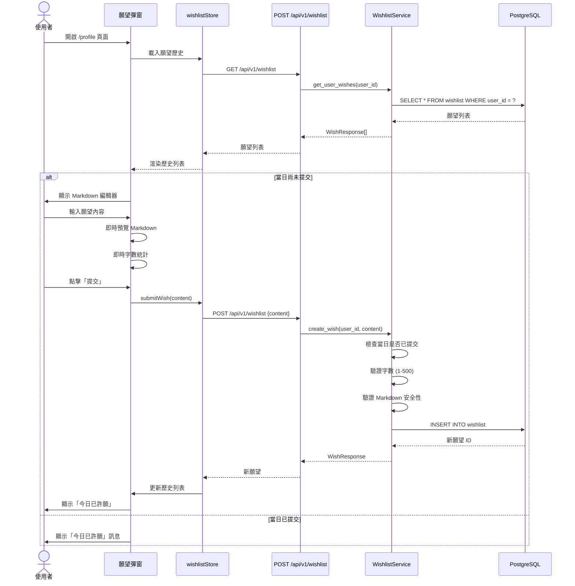
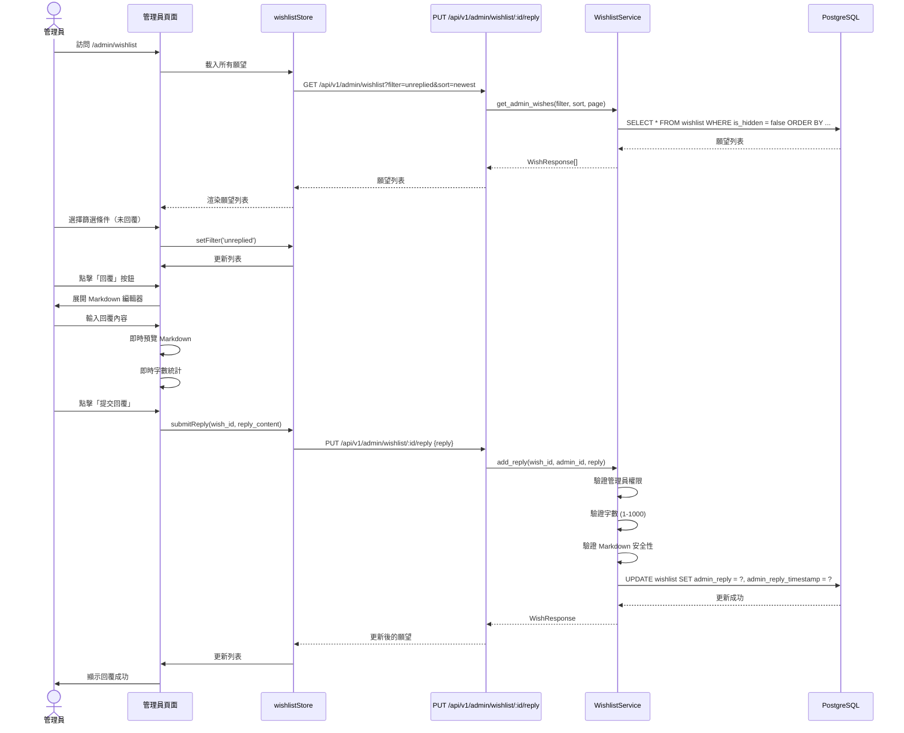
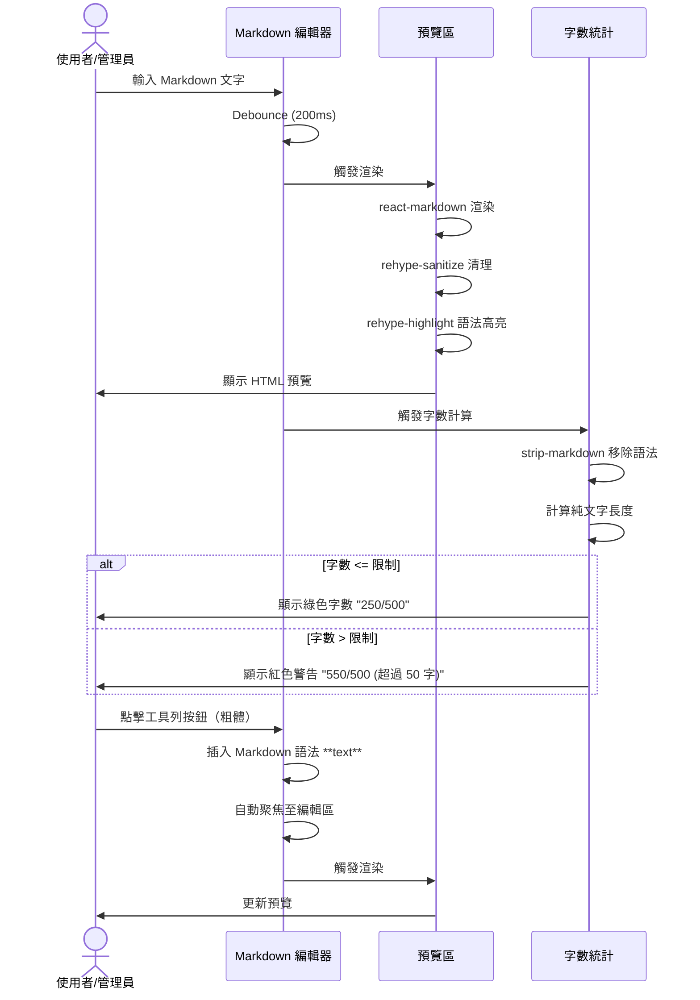
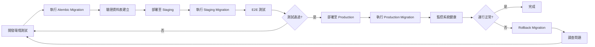

# 技術設計文件 - 使用者願望功能

## Overview

使用者願望功能是 Wasteland Tarot 平台的使用者反饋與社群互動機制，讓使用者能每日提交一則願望、查看歷史記錄及管理員回覆。此功能部署於 `/profile` 頁面的彈窗介面，提供使用者與平台的雙向溝通管道。

**目的**: 建立使用者反饋系統，讓平台能收集產品需求、使用者意見與期待，同時透過管理員回覆機制增強使用者參與度與品牌好感度。目標提升 30%+ 的使用者參與率與 70%+ 的回覆滿意度。

**使用者**: 所有註冊使用者可每日提交一則願望（最多 500 字），平台管理員可查看、回覆並管理所有願望（回覆最多 1000 字），兩者皆支援 Markdown 格式編寫與即時預覽。

**影響**: 擴展現有的 `/profile` 頁面功能，新增獨立的 `wishlist` 資料表與 API endpoints，整合現有的 User 認證系統與 Admin 角色權限，提供 Markdown 編輯器與即時預覽元件。

### Goals

- 實作完整的願望 CRUD 功能（使用者：新增、編輯；管理員：新增回覆、編輯回覆、隱藏）
- 每日一願限制（UTC+8 時區計算）
- Markdown 編輯器與即時預覽（上下兩欄佈局）
- 字數限制：使用者 500 字、管理員 1000 字（計算渲染後純文字長度）
- 管理員願望管理介面（篩選、排序、分頁）
- 願望歷史列表即時更新（無需重新載入彈窗）
- API 回應時間中位數 < 500ms
- XSS 防護與輸入驗證

### Non-Goals

- **不包含**: 願望的公開展示或社群分享功能
- **不包含**: 願望投票或點讚機制
- **不包含**: 使用者之間的願望互動
- **不包含**: 願望分類或標籤系統（由管理員手動分析）
- **不包含**: 願望匯出為 PDF 或其他格式
- **不包含**: 即時通知系統（管理員回覆時通知使用者）
- **不包含**: 進階 Markdown 功能（表格、圖片嵌入、原始 HTML）

---

## Architecture

### 現有架構分析

**現有系統整合點**:

1. **使用者認證系統** (`backend/app/core/dependencies.py`)
   - JWT Token 驗證機制
   - `get_current_user` dependency 取得當前使用者
   - `get_current_admin_user` dependency 驗證管理員權限
   - 願望 API 將使用相同的認證流程

2. **User 模型** (`backend/app/models/user.py`)
   - `is_admin` 欄位用於管理員權限檢查
   - `id` (UUID) 作為願望表的外鍵
   - 已有完整的使用者管理機制

3. **前端路由結構** (`src/app/profile/`)
   - App Router 架構（Next.js 15）
   - `/profile` 頁面已存在
   - 願望功能將以彈窗方式整合至此頁面

4. **Modal Dialog 元件** (`src/components/ui/dialog.tsx`)
   - 基於 @radix-ui/react-dialog
   - 已有 Pip-Boy 風格樣式
   - 支援 ARIA 無障礙標籤

**現有架構模式**:
- **Service Layer 模式**: 業務邏輯封裝於 `*_service.py`
- **Pydantic Schema 驗證**: API 輸入輸出驗證
- **Zustand 前端狀態管理**: 全域狀態儲存（參考 `authStore`, `journalStore` 模式）
- **PixelIcon 圖示系統**: 使用 RemixIcon（**禁止** lucide-react）

**必須維護的整合點**:
- User 表的外鍵關聯與 CASCADE 刪除策略
- JWT Token 認證機制
- 現有的 API 錯誤處理模式（HTTPException）
- 前端的 Cubic 11 字體自動繼承
- PixelIcon 元件使用規範

### 高階架構

```mermaid
graph TB
    subgraph "Frontend (Next.js)"
        ProfilePage[/profile - 個人資料頁]
        WishlistModal[願望彈窗元件]
        WishEditor[Markdown 編輯器]
        WishHistory[願望歷史列表]
        AdminPage[/admin/wishlist - 管理員頁面]
        Store[wishlistStore Zustand]
    end

    subgraph "Backend (FastAPI)"
        UserAPI[User API: GET, POST, PUT]
        AdminAPI[Admin API: GET, PUT hide/unhide/reply]
        Service[WishlistService]
        Validator[Content Validator]
        TimezoneUtil[Timezone Utility UTC+8]

        subgraph "Existing Services"
            AuthDep[Auth Dependencies]
            UserModel[User Model]
        end
    end

    subgraph "Data Layer"
        Wishlist[wishlist 表]
        Users[users 表]
        PostgreSQL[(PostgreSQL)]
    end

    ProfilePage --> WishlistModal
    WishlistModal --> WishEditor
    WishlistModal --> WishHistory
    AdminPage --> Store

    WishEditor --> Store
    WishHistory --> Store

    Store --> UserAPI
    Store --> AdminAPI

    UserAPI --> Service
    AdminAPI --> Service

    Service --> Validator
    Service --> TimezoneUtil
    Service --> AuthDep

    Service --> Wishlist
    Wishlist --> Users
    Wishlist --> PostgreSQL
    Users --> PostgreSQL
```

**架構整合說明**:

- **現有模式保留**: 遵循 Service Layer + Repository 模式
- **新增元件理由**:
  - `WishlistService`: 統一願望業務邏輯（CRUD、權限檢查、每日限制）
  - `ContentValidator`: Markdown 內容驗證（長度、XSS 防護、字數計算）
  - `TimezoneUtil`: UTC+8 時區轉換與每日限制計算
  - `wishlistStore`: 前端狀態管理（願望列表、提交狀態、篩選條件）
- **技術棧對齊**: 使用現有的 FastAPI + SQLAlchemy + Pydantic
- **Steering 遵循**: 符合 `structure.md` 的 Service Layer 原則與 `tech.md` 的技術棧

### 技術對齊說明

本功能為**現有系統擴展**，遵循已建立的技術棧與架構模式：

**後端技術對齊**:
- FastAPI 框架：新增 `/api/v1/wishlist` endpoints
- SQLAlchemy ORM：新增 `Wishlist` 模型
- Pydantic Schema：定義 `WishCreate`, `WishUpdate`, `WishResponse`, `AdminReplyRequest` schema
- AsyncIO：所有資料庫操作使用 async/await
- Alembic：資料庫 migration 管理
- Python 3.11+ 型別提示

**前端技術對齊**:
- Next.js App Router：在現有 `/profile` 頁面新增彈窗元件
- Zustand：新增 `wishlistStore`（遵循 `authStore` 模式）
- Tailwind CSS v4：使用現有 Pip-Boy 配色（`#00ff88`, `#ff8800`）
- **PixelIcon**: 使用 RemixIcon 圖示元件（**絕對禁止** lucide-react）
- Cubic 11 字體：自動繼承全域字體設定
- @radix-ui/react-dialog：使用現有 Dialog 元件

**新增依賴項**:

前端依賴：
```json
{
  "react-markdown": "^9.0.0",
  "rehype-sanitize": "^6.0.0",
  "rehype-highlight": "^7.0.0",
  "remark-gfm": "^4.0.0",
  "strip-markdown": "^6.0.0"
}
```

後端依賴：
```toml
# 無新增依賴，使用現有套件
```

### 關鍵設計決策

#### 決策 1: Markdown 儲存與渲染策略

**決策**: 儲存原始 Markdown 文字，前端渲染時處理

**背景**: 願望與回覆需支援格式化文字，同時確保安全性與資料完整性

**替代方案**:
1. 儲存 HTML：增加 XSS 風險，資料庫空間佔用大
2. 儲存純文字：無法支援格式化
3. 儲存結構化 JSON：過度設計，不符合簡單優先原則

**選定方案**: 儲存原始 Markdown 文字

**理由**:
- ✅ 保留使用者原始意圖與格式
- ✅ 未來可支援不同渲染器（PDF、Rich Text）
- ✅ 資料庫查詢簡單（純文字欄位）
- ✅ react-markdown 自動過濾危險標籤（安全）
- ❌ 前端需要處理渲染邏輯（可接受的複雜度）

**取捨**:
- **獲得**: 資料靈活性、安全性、可維護性
- **犧牲**: 輕微的前端渲染負擔（< 50ms）

#### 決策 2: 每日限制的時區計算策略

**決策**: 資料庫儲存 UTC 時間，應用層計算 UTC+8 每日限制

**背景**: 使用者位於台灣（UTC+8），需精確計算「每日一願」

**替代方案**:
1. 資料庫直接儲存 UTC+8：違反最佳實踐，時區變更困難
2. 前端計算每日限制：不可靠，使用者可繞過
3. 使用 PostgreSQL `TIMEZONE` 函數：增加查詢複雜度

**選定方案**: 資料庫儲存 UTC，後端轉換為 UTC+8 計算

**理由**:
- ✅ 符合資料庫最佳實踐（UTC 儲存）
- ✅ 後端統一時區邏輯，前端僅展示
- ✅ 未來支援多時區擴展
- ✅ 精確計算每日邊界（00:00-23:59 UTC+8）

**實作邏輯**:
```python
from datetime import datetime, timezone, timedelta

def get_utc8_today_range():
    """取得 UTC+8 今日的 UTC 時間範圍"""
    utc8 = timezone(timedelta(hours=8))
    now_utc8 = datetime.now(utc8)
    today_start_utc8 = now_utc8.replace(hour=0, minute=0, second=0, microsecond=0)
    today_end_utc8 = today_start_utc8 + timedelta(days=1)

    # 轉換為 UTC
    today_start_utc = today_start_utc8.astimezone(timezone.utc)
    today_end_utc = today_end_utc8.astimezone(timezone.utc)

    return today_start_utc, today_end_utc
```

**取捨**:
- **獲得**: 時區正確性、可擴展性、可維護性
- **犧牲**: 輕微的計算負擔（可忽略）

#### 決策 3: 字數限制的計算方式

**決策**: 計算 Markdown 渲染後的純文字長度（移除語法符號）

**背景**: 使用者 500 字、管理員 1000 字限制需精確計算

**替代方案**:
1. 計算原始 Markdown 長度：不公平（語法符號佔用字數）
2. 計算 HTML 長度：包含大量標籤（不合理）
3. 前端計算：不可靠，使用者可繞過

**選定方案**: 後端與前端皆使用 `strip-markdown` 計算純文字長度

**理由**:
- ✅ 公平計算（僅計算實際內容）
- ✅ 前後端一致驗證（防止繞過）
- ✅ 使用者體驗佳（即時字數顯示）

**實作邏輯**:

前端（TypeScript）:
```typescript
import stripMarkdown from 'strip-markdown'
import { remark } from 'remark'

async function getPlainTextLength(markdown: string): Promise<number> {
  const processed = await remark()
    .use(stripMarkdown)
    .process(markdown)
  return processed.toString().trim().length
}
```

後端（Python）:
```python
import re

def get_plain_text_length(markdown: str) -> int:
    """移除 Markdown 語法，計算純文字長度"""
    # 移除程式碼區塊
    text = re.sub(r'```[\s\S]*?```', '', markdown)
    # 移除行內程式碼
    text = re.sub(r'`[^`]+`', '', text)
    # 移除連結但保留文字 [text](url) -> text
    text = re.sub(r'\[([^\]]+)\]\([^\)]+\)', r'\1', text)
    # 移除標題符號
    text = re.sub(r'^#+\s+', '', text, flags=re.MULTILINE)
    # 移除粗體、斜體符號
    text = re.sub(r'[*_]{1,2}', '', text)
    # 移除引用符號
    text = re.sub(r'^>\s+', '', text, flags=re.MULTILINE)
    # 移除清單符號
    text = re.sub(r'^[-*+]\s+', '', text, flags=re.MULTILINE)
    text = re.sub(r'^\d+\.\s+', '', text, flags=re.MULTILINE)
    return len(text.strip())
```

**取捨**:
- **獲得**: 公平性、一致性、良好的使用者體驗
- **犧牲**: 輕微的計算複雜度（可接受）

#### 決策 4: 願望編輯策略（僅一次機會）

**決策**: 使用者僅可在管理員回覆前編輯一次，編輯後永久鎖定

**背景**: 防止使用者無限修改導致管理員回覆失效

**替代方案**:
1. 無限編輯：管理員回覆可能失效
2. 完全禁止編輯：使用者體驗差
3. 限制時間內編輯（如 24 小時）：實作複雜

**選定方案**: 僅允許編輯一次，使用 `has_been_edited` 欄位追蹤

**理由**:
- ✅ 平衡使用者體驗與管理員工作負擔
- ✅ 實作簡單（布林欄位）
- ✅ 規則清晰易懂

**資料庫欄位**:
```sql
has_been_edited BOOLEAN DEFAULT FALSE
```

**編輯邏輯**:
```python
if wish.admin_reply is not None:
    raise HTTPException(status_code=403, detail="已有管理員回覆，無法編輯")
if wish.has_been_edited:
    raise HTTPException(status_code=403, detail="已編輯過，無法再次編輯")

wish.content = new_content
wish.has_been_edited = True
wish.updated_at = datetime.now(timezone.utc)
```

**取捨**:
- **獲得**: 簡單性、可維護性、清晰的業務規則
- **犧牲**: 使用者僅有一次編輯機會

---

## System Flows

### 使用者提交願望流程



### 管理員回覆願望流程



### Markdown 編輯器互動流程



---

## Requirements Traceability

| 需求編號 | 需求摘要 | 實現元件 | 介面/API | 流程圖 |
|---------|---------|----------|---------|-------|
| **1.1-1.7** | 願望提交功能 | `WishlistModal`, `MarkdownEditor`, `WishlistService` | `POST /api/v1/wishlist`, `WishCreate` schema | 使用者提交願望流程 |
| **2.1-2.6** | 願望歷史查詢 | `WishHistory`, `WishCard`, `WishlistService` | `GET /api/v1/wishlist`, `WishResponse[]` | 使用者提交願望流程 |
| **3.1-3.7** | 願望編輯功能 | `WishEditForm`, `WishlistService` | `PUT /api/v1/wishlist/:id`, `WishUpdate` schema | - |
| **4.1-4.7** | 管理員願望管理 | `AdminWishlistPage`, `FilterBar`, `WishlistService` | `GET /api/v1/admin/wishlist?filter&sort&page` | 管理員回覆願望流程 |
| **5.1-5.7** | 管理員回覆功能 | `AdminReplyForm`, `MarkdownEditor`, `WishlistService` | `PUT /api/v1/admin/wishlist/:id/reply`, `AdminReplyRequest` | 管理員回覆願望流程 |
| **6.1-6.7** | 隱藏/封存功能 | `AdminWishlistPage`, `WishlistService` | `PUT /api/v1/admin/wishlist/:id/hide`, `PUT /api/v1/admin/wishlist/:id/unhide` | - |
| **7.1-7.8** | 介面佈局與互動 | `WishlistModal`, `Dialog` (Radix UI) | - | Markdown 編輯器互動流程 |
| **8.1-8.6** | 資料管理與一致性 | `Wishlist` 模型, `WishlistService`, Alembic migration | 資料庫 schema | - |
| **9.1-9.6** | 時區處理 | `TimezoneUtil`, `WishlistService` | `get_utc8_today_range()` utility | - |
| **10.1-10.9** | 設計風格與無障礙性 | 所有前端元件, `PixelIcon`, ARIA 標籤 | - | - |
| **11.1-11.12** | Markdown 格式支援 | `MarkdownEditor`, `MarkdownPreview`, `ContentValidator` | `react-markdown`, `rehype-sanitize`, `rehype-highlight` | Markdown 編輯器互動流程 |

---

## Components and Interfaces

### Backend Layer

#### Wishlist Model (資料模型)

**主要職責**: 定義願望資料結構與資料庫映射

**領域邊界**: 願望管理領域（Wishlist Domain）

**資料所有權**: 擁有願望內容、回覆、隱藏狀態等所有願望相關資料

**依賴關係**:
- **Inbound**: `WishlistService` 透過 ORM 操作此模型
- **Outbound**: 依賴 `User` 模型（外鍵關聯）
- **External**: SQLAlchemy, PostgreSQL

**資料庫 Schema**:

```python
# backend/app/models/wishlist.py

from sqlalchemy import Column, String, Text, Boolean, DateTime, ForeignKey, Index
from sqlalchemy.dialects.postgresql import UUID
from sqlalchemy.orm import relationship
from sqlalchemy.sql import func
from .base import BaseModel
import uuid

class Wishlist(BaseModel):
    """
    Wishlist Model - 使用者願望記錄
    """
    __tablename__ = "wishlist"

    # Primary Key
    id = Column(UUID(as_uuid=True), primary_key=True, default=uuid.uuid4)

    # Foreign Keys
    user_id = Column(UUID(as_uuid=True), ForeignKey("users.id", ondelete="CASCADE"), nullable=False)

    # Content Fields
    content = Column(Text, nullable=False)  # 原始 Markdown 文字
    admin_reply = Column(Text, nullable=True)  # 管理員回覆（Markdown）

    # Timestamps
    created_at = Column(DateTime(timezone=True), server_default=func.now(), nullable=False)
    updated_at = Column(DateTime(timezone=True), server_default=func.now(), onupdate=func.now(), nullable=False)
    admin_reply_timestamp = Column(DateTime(timezone=True), nullable=True)

    # Status Fields
    has_been_edited = Column(Boolean, default=False, nullable=False)
    is_hidden = Column(Boolean, default=False, nullable=False)

    # Relationships
    user = relationship("User", back_populates="wishlists")

    # Indexes for Performance
    __table_args__ = (
        Index('idx_wishlist_user_id', 'user_id'),
        Index('idx_wishlist_created_at', 'created_at'),
        Index('idx_wishlist_is_hidden', 'is_hidden'),
        Index('idx_wishlist_user_created', 'user_id', 'created_at'),  # 複合索引：查詢使用者的願望列表
    )

    def __repr__(self):
        return f"<Wishlist(id={self.id}, user_id={self.user_id}, created_at={self.created_at})>"
```

**索引策略**:
- `idx_wishlist_user_id`: 單一使用者的願望查詢（使用者端）
- `idx_wishlist_created_at`: 按時間排序（管理員端）
- `idx_wishlist_is_hidden`: 篩選隱藏狀態（管理員端）
- `idx_wishlist_user_created`: 複合索引，優化使用者的時間排序查詢

**Alembic Migration**:
```python
# backend/alembic/versions/xxxx_create_wishlist_table.py

def upgrade():
    op.create_table(
        'wishlist',
        sa.Column('id', postgresql.UUID(as_uuid=True), primary_key=True),
        sa.Column('user_id', postgresql.UUID(as_uuid=True), nullable=False),
        sa.Column('content', sa.Text(), nullable=False),
        sa.Column('admin_reply', sa.Text(), nullable=True),
        sa.Column('created_at', sa.DateTime(timezone=True), server_default=sa.func.now(), nullable=False),
        sa.Column('updated_at', sa.DateTime(timezone=True), server_default=sa.func.now(), nullable=False),
        sa.Column('admin_reply_timestamp', sa.DateTime(timezone=True), nullable=True),
        sa.Column('has_been_edited', sa.Boolean(), server_default='false', nullable=False),
        sa.Column('is_hidden', sa.Boolean(), server_default='false', nullable=False),
        sa.ForeignKeyConstraint(['user_id'], ['users.id'], ondelete='CASCADE'),
    )

    # Create Indexes
    op.create_index('idx_wishlist_user_id', 'wishlist', ['user_id'])
    op.create_index('idx_wishlist_created_at', 'wishlist', ['created_at'])
    op.create_index('idx_wishlist_is_hidden', 'wishlist', ['is_hidden'])
    op.create_index('idx_wishlist_user_created', 'wishlist', ['user_id', 'created_at'])

def downgrade():
    op.drop_index('idx_wishlist_user_created', table_name='wishlist')
    op.drop_index('idx_wishlist_is_hidden', table_name='wishlist')
    op.drop_index('idx_wishlist_created_at', table_name='wishlist')
    op.drop_index('idx_wishlist_user_id', table_name='wishlist')
    op.drop_table('wishlist')
```

#### WishlistService (業務邏輯服務)

**主要職責**: 願望的業務邏輯處理（CRUD、權限檢查、每日限制、字數驗證）

**領域邊界**: 願望管理領域（Wishlist Domain）

**依賴關係**:
- **Inbound**: API endpoints 呼叫此服務
- **Outbound**: `Wishlist` 模型、`User` 模型、`ContentValidator`、`TimezoneUtil`
- **External**: SQLAlchemy Session

**Service Interface**:

```python
# backend/app/services/wishlist_service.py

from typing import List, Optional, Tuple
from datetime import datetime, timezone
from sqlalchemy.ext.asyncio import AsyncSession
from sqlalchemy import select, and_, or_
from app.models.wishlist import Wishlist
from app.models.user import User
from app.schemas.wishlist import WishCreate, WishUpdate, AdminReplyRequest, WishResponse
from app.core.exceptions import (
    AlreadySubmittedTodayError,
    WishNotFoundError,
    UnauthorizedError,
    ContentTooLongError,
    EditNotAllowedError,
)
from app.utils.timezone import get_utc8_today_range
from app.utils.content_validator import ContentValidator

class WishlistService:
    """願望業務邏輯服務"""

    def __init__(self, db: AsyncSession):
        self.db = db
        self.validator = ContentValidator()

    async def get_user_wishes(
        self, user_id: UUID, include_hidden: bool = False
    ) -> List[WishResponse]:
        """
        取得使用者的願望列表（按時間降序）

        Preconditions:
        - user_id 必須有效

        Postconditions:
        - 回傳使用者所有未隱藏的願望（除非 include_hidden=True）
        - 按 created_at 降序排列
        """
        query = select(Wishlist).where(Wishlist.user_id == user_id)

        if not include_hidden:
            query = query.where(Wishlist.is_hidden == False)

        query = query.order_by(Wishlist.created_at.desc())

        result = await self.db.execute(query)
        wishes = result.scalars().all()

        return [WishResponse.from_orm(wish) for wish in wishes]

    async def check_daily_limit(self, user_id: UUID) -> bool:
        """
        檢查使用者今日（UTC+8）是否已提交願望

        Returns:
            True: 今日已提交
            False: 今日未提交
        """
        today_start_utc, today_end_utc = get_utc8_today_range()

        query = select(Wishlist).where(
            and_(
                Wishlist.user_id == user_id,
                Wishlist.created_at >= today_start_utc,
                Wishlist.created_at < today_end_utc
            )
        )

        result = await self.db.execute(query)
        return result.scalar_one_or_none() is not None

    async def create_wish(self, user_id: UUID, wish_data: WishCreate) -> WishResponse:
        """
        建立新願望

        Preconditions:
        - 使用者今日尚未提交願望
        - 內容長度 1-500 字（純文字）

        Postconditions:
        - 新願望儲存至資料庫
        - 回傳 WishResponse

        Raises:
            AlreadySubmittedTodayError: 今日已提交
            ContentTooLongError: 內容超過限制
        """
        # 檢查每日限制
        if await self.check_daily_limit(user_id):
            raise AlreadySubmittedTodayError("您今日已提交願望，請明日再試")

        # 驗證內容
        self.validator.validate_wish_content(wish_data.content)

        # 建立願望
        wish = Wishlist(
            user_id=user_id,
            content=wish_data.content,
        )

        self.db.add(wish)
        await self.db.commit()
        await self.db.refresh(wish)

        return WishResponse.from_orm(wish)

    async def update_wish(
        self, wish_id: UUID, user_id: UUID, wish_data: WishUpdate
    ) -> WishResponse:
        """
        更新願望（僅限一次編輯，且無管理員回覆）

        Preconditions:
        - 願望存在且屬於該使用者
        - 尚未收到管理員回覆
        - 尚未編輯過

        Postconditions:
        - 更新內容與 has_been_edited 欄位
        - 回傳更新後的 WishResponse

        Raises:
            WishNotFoundError: 願望不存在或無權限
            EditNotAllowedError: 已編輯過或已有回覆
            ContentTooLongError: 內容超過限制
        """
        wish = await self._get_user_wish(wish_id, user_id)

        # 檢查編輯權限
        if wish.admin_reply is not None:
            raise EditNotAllowedError("已有管理員回覆，無法編輯")
        if wish.has_been_edited:
            raise EditNotAllowedError("已編輯過，無法再次編輯")

        # 驗證內容
        self.validator.validate_wish_content(wish_data.content)

        # 更新願望
        wish.content = wish_data.content
        wish.has_been_edited = True
        wish.updated_at = datetime.now(timezone.utc)

        await self.db.commit()
        await self.db.refresh(wish)

        return WishResponse.from_orm(wish)

    async def get_admin_wishes(
        self,
        filter_status: Optional[str] = None,
        sort_order: str = "newest",
        page: int = 1,
        page_size: int = 50,
    ) -> Tuple[List[WishResponse], int]:
        """
        取得管理員願望列表（支援篩選、排序、分頁）

        Args:
            filter_status: "all", "replied", "unreplied", "hidden", "unhidden"
            sort_order: "newest", "oldest"
            page: 頁碼（從 1 開始）
            page_size: 每頁數量（預設 50）

        Returns:
            (願望列表, 總數)
        """
        query = select(Wishlist)

        # 篩選條件
        if filter_status == "replied":
            query = query.where(Wishlist.admin_reply.isnot(None))
        elif filter_status == "unreplied":
            query = query.where(Wishlist.admin_reply.is_(None))
        elif filter_status == "hidden":
            query = query.where(Wishlist.is_hidden == True)
        elif filter_status == "unhidden":
            query = query.where(Wishlist.is_hidden == False)

        # 排序
        if sort_order == "oldest":
            query = query.order_by(Wishlist.created_at.asc())
        else:  # newest
            query = query.order_by(Wishlist.created_at.desc())

        # 計算總數
        count_query = select(func.count()).select_from(query.subquery())
        total_count = await self.db.scalar(count_query)

        # 分頁
        offset = (page - 1) * page_size
        query = query.offset(offset).limit(page_size)

        result = await self.db.execute(query)
        wishes = result.scalars().all()

        return [WishResponse.from_orm(wish) for wish in wishes], total_count

    async def add_reply(
        self, wish_id: UUID, admin_id: UUID, reply_data: AdminReplyRequest
    ) -> WishResponse:
        """
        新增或編輯管理員回覆

        Preconditions:
        - admin_id 必須是管理員
        - 回覆內容 1-1000 字（純文字）

        Postconditions:
        - 更新 admin_reply 與 admin_reply_timestamp
        - 回傳更新後的 WishResponse

        Raises:
            WishNotFoundError: 願望不存在
            UnauthorizedError: 非管理員
            ContentTooLongError: 回覆超過限制
        """
        wish = await self._get_wish(wish_id)

        # 驗證管理員權限（由 dependency 處理，此處僅驗證內容）
        self.validator.validate_reply_content(reply_data.reply)

        # 更新回覆
        wish.admin_reply = reply_data.reply
        wish.admin_reply_timestamp = datetime.now(timezone.utc)
        wish.updated_at = datetime.now(timezone.utc)

        await self.db.commit()
        await self.db.refresh(wish)

        return WishResponse.from_orm(wish)

    async def toggle_hidden(self, wish_id: UUID, is_hidden: bool) -> WishResponse:
        """
        切換願望的隱藏狀態

        Postconditions:
        - 更新 is_hidden 與 updated_at
        - 回傳更新後的 WishResponse
        """
        wish = await self._get_wish(wish_id)

        wish.is_hidden = is_hidden
        wish.updated_at = datetime.now(timezone.utc)

        await self.db.commit()
        await self.db.refresh(wish)

        return WishResponse.from_orm(wish)

    async def _get_wish(self, wish_id: UUID) -> Wishlist:
        """內部方法：取得願望（不檢查權限）"""
        wish = await self.db.get(Wishlist, wish_id)
        if not wish:
            raise WishNotFoundError(f"願望不存在: {wish_id}")
        return wish

    async def _get_user_wish(self, wish_id: UUID, user_id: UUID) -> Wishlist:
        """內部方法：取得使用者的願望（檢查所有權）"""
        wish = await self._get_wish(wish_id)
        if wish.user_id != user_id:
            raise UnauthorizedError("無權限操作此願望")
        return wish
```

#### ContentValidator (內容驗證工具)

**主要職責**: 驗證 Markdown 內容的長度與安全性

**依賴關係**:
- **Inbound**: `WishlistService` 呼叫驗證方法
- **Outbound**: 無
- **External**: `re` (正則表達式)

```python
# backend/app/utils/content_validator.py

import re
from app.core.exceptions import ContentTooLongError, ContentEmptyError

class ContentValidator:
    """Markdown 內容驗證工具"""

    MAX_WISH_LENGTH = 500
    MAX_REPLY_LENGTH = 1000

    @staticmethod
    def get_plain_text_length(markdown: str) -> int:
        """
        移除 Markdown 語法，計算純文字長度

        移除：
        - 程式碼區塊 ```code```
        - 行內程式碼 `code`
        - 連結 [text](url) -> text
        - 標題符號 #, ##, ###
        - 粗體、斜體符號 **, *, _, __
        - 引用符號 >
        - 清單符號 -, *, +, 1.
        """
        text = markdown

        # 移除程式碼區塊
        text = re.sub(r'```[\s\S]*?```', '', text)
        # 移除行內程式碼
        text = re.sub(r'`[^`]+`', '', text)
        # 移除連結但保留文字 [text](url) -> text
        text = re.sub(r'\[([^\]]+)\]\([^\)]+\)', r'\1', text)
        # 移除標題符號
        text = re.sub(r'^#+\s+', '', text, flags=re.MULTILINE)
        # 移除粗體、斜體符號
        text = re.sub(r'[*_]{1,2}', '', text)
        # 移除引用符號
        text = re.sub(r'^>\s+', '', text, flags=re.MULTILINE)
        # 移除清單符號
        text = re.sub(r'^[-*+]\s+', '', text, flags=re.MULTILINE)
        text = re.sub(r'^\d+\.\s+', '', text, flags=re.MULTILINE)

        return len(text.strip())

    def validate_wish_content(self, content: str) -> None:
        """
        驗證願望內容

        Raises:
            ContentEmptyError: 內容為空
            ContentTooLongError: 超過 500 字
        """
        if not content or not content.strip():
            raise ContentEmptyError("願望內容不可為空")

        plain_length = self.get_plain_text_length(content)

        if plain_length > self.MAX_WISH_LENGTH:
            raise ContentTooLongError(
                f"願望內容超過限制 {self.MAX_WISH_LENGTH} 字 (目前: {plain_length} 字)"
            )

    def validate_reply_content(self, content: str) -> None:
        """
        驗證管理員回覆內容

        Raises:
            ContentEmptyError: 內容為空
            ContentTooLongError: 超過 1000 字
        """
        if not content or not content.strip():
            raise ContentEmptyError("回覆內容不可為空")

        plain_length = self.get_plain_text_length(content)

        if plain_length > self.MAX_REPLY_LENGTH:
            raise ContentTooLongError(
                f"回覆內容超過限制 {self.MAX_REPLY_LENGTH} 字 (目前: {plain_length} 字)"
            )
```

#### API Endpoints

**API Contract**:

| Method | Endpoint | Request | Response | Errors |
|--------|----------|---------|----------|--------|
| GET | `/api/v1/wishlist` | Headers: Authorization | `WishResponse[]` | 401 Unauthorized |
| POST | `/api/v1/wishlist` | `WishCreate` | `WishResponse` | 400 Bad Request, 409 Already Submitted |
| PUT | `/api/v1/wishlist/:id` | `WishUpdate` | `WishResponse` | 400, 403 Forbidden, 404 Not Found |
| GET | `/api/v1/admin/wishlist` | Query: `?filter&sort&page&page_size` | `{wishes: WishResponse[], total: number}` | 401, 403 |
| PUT | `/api/v1/admin/wishlist/:id/reply` | `AdminReplyRequest` | `WishResponse` | 400, 403, 404 |
| PUT | `/api/v1/admin/wishlist/:id/hide` | - | `WishResponse` | 403, 404 |
| PUT | `/api/v1/admin/wishlist/:id/unhide` | - | `WishResponse` | 403, 404 |

**Pydantic Schemas**:

```python
# backend/app/schemas/wishlist.py

from pydantic import BaseModel, Field, validator
from typing import Optional
from datetime import datetime
from uuid import UUID

class WishCreate(BaseModel):
    """建立願望請求"""
    content: str = Field(..., min_length=1, max_length=10000, description="願望內容（Markdown）")

class WishUpdate(BaseModel):
    """更新願望請求"""
    content: str = Field(..., min_length=1, max_length=10000, description="願望內容（Markdown）")

class AdminReplyRequest(BaseModel):
    """管理員回覆請求"""
    reply: str = Field(..., min_length=1, max_length=20000, description="回覆內容（Markdown）")

class WishResponse(BaseModel):
    """願望回應"""
    id: UUID
    user_id: UUID
    content: str
    admin_reply: Optional[str] = None
    created_at: datetime
    updated_at: datetime
    admin_reply_timestamp: Optional[datetime] = None
    has_been_edited: bool
    is_hidden: bool

    class Config:
        from_attributes = True  # Pydantic v2

class AdminWishListResponse(BaseModel):
    """管理員願望列表回應"""
    wishes: list[WishResponse]
    total: int
    page: int
    page_size: int
```

**API Implementation**:

```python
# backend/app/api/v1/endpoints/wishlist.py

from fastapi import APIRouter, Depends, Query
from sqlalchemy.ext.asyncio import AsyncSession
from typing import Optional
from uuid import UUID

from app.core.dependencies import get_db, get_current_user, get_current_admin_user
from app.models.user import User
from app.services.wishlist_service import WishlistService
from app.schemas.wishlist import (
    WishCreate,
    WishUpdate,
    AdminReplyRequest,
    WishResponse,
    AdminWishListResponse,
)

router = APIRouter(prefix="/wishlist", tags=["wishlist"])

# 使用者 Endpoints

@router.get("", response_model=list[WishResponse])
async def get_user_wishes(
    current_user: User = Depends(get_current_user),
    db: AsyncSession = Depends(get_db),
):
    """取得當前使用者的願望列表"""
    service = WishlistService(db)
    return await service.get_user_wishes(current_user.id)

@router.post("", response_model=WishResponse, status_code=201)
async def create_wish(
    wish_data: WishCreate,
    current_user: User = Depends(get_current_user),
    db: AsyncSession = Depends(get_db),
):
    """提交新願望"""
    service = WishlistService(db)
    return await service.create_wish(current_user.id, wish_data)

@router.put("/{wish_id}", response_model=WishResponse)
async def update_wish(
    wish_id: UUID,
    wish_data: WishUpdate,
    current_user: User = Depends(get_current_user),
    db: AsyncSession = Depends(get_db),
):
    """編輯願望（僅一次機會）"""
    service = WishlistService(db)
    return await service.update_wish(wish_id, current_user.id, wish_data)

# 管理員 Endpoints

@router.get("/admin/wishlist", response_model=AdminWishListResponse)
async def get_admin_wishes(
    filter_status: Optional[str] = Query(None, regex="^(all|replied|unreplied|hidden|unhidden)$"),
    sort_order: str = Query("newest", regex="^(newest|oldest)$"),
    page: int = Query(1, ge=1),
    page_size: int = Query(50, ge=1, le=100),
    admin_user: User = Depends(get_current_admin_user),
    db: AsyncSession = Depends(get_db),
):
    """取得管理員願望列表（支援篩選、排序、分頁）"""
    service = WishlistService(db)
    wishes, total = await service.get_admin_wishes(filter_status, sort_order, page, page_size)

    return AdminWishListResponse(
        wishes=wishes,
        total=total,
        page=page,
        page_size=page_size,
    )

@router.put("/admin/wishlist/{wish_id}/reply", response_model=WishResponse)
async def add_reply(
    wish_id: UUID,
    reply_data: AdminReplyRequest,
    admin_user: User = Depends(get_current_admin_user),
    db: AsyncSession = Depends(get_db),
):
    """新增或編輯管理員回覆"""
    service = WishlistService(db)
    return await service.add_reply(wish_id, admin_user.id, reply_data)

@router.put("/admin/wishlist/{wish_id}/hide", response_model=WishResponse)
async def hide_wish(
    wish_id: UUID,
    admin_user: User = Depends(get_current_admin_user),
    db: AsyncSession = Depends(get_db),
):
    """隱藏願望"""
    service = WishlistService(db)
    return await service.toggle_hidden(wish_id, is_hidden=True)

@router.put("/admin/wishlist/{wish_id}/unhide", response_model=WishResponse)
async def unhide_wish(
    wish_id: UUID,
    admin_user: User = Depends(get_current_admin_user),
    db: AsyncSession = Depends(get_db),
):
    """取消隱藏願望"""
    service = WishlistService(db)
    return await service.toggle_hidden(wish_id, is_hidden=False)
```

#### TimezoneUtil (時區工具)

```python
# backend/app/utils/timezone.py

from datetime import datetime, timezone, timedelta
from typing import Tuple

UTC8 = timezone(timedelta(hours=8))

def get_utc8_today_range() -> Tuple[datetime, datetime]:
    """
    取得 UTC+8 今日的 UTC 時間範圍

    Returns:
        (today_start_utc, today_end_utc)

    Example:
        UTC+8: 2025-11-02 10:30
        今日範圍: 2025-11-02 00:00 ~ 2025-11-03 00:00 (UTC+8)
        轉換為 UTC: 2025-11-01 16:00 ~ 2025-11-02 16:00 (UTC)
    """
    now_utc8 = datetime.now(UTC8)

    # 今日 00:00 (UTC+8)
    today_start_utc8 = now_utc8.replace(hour=0, minute=0, second=0, microsecond=0)
    # 明日 00:00 (UTC+8)
    today_end_utc8 = today_start_utc8 + timedelta(days=1)

    # 轉換為 UTC
    today_start_utc = today_start_utc8.astimezone(timezone.utc)
    today_end_utc = today_end_utc8.astimezone(timezone.utc)

    return today_start_utc, today_end_utc

def format_utc8_datetime(dt_utc: datetime) -> str:
    """
    將 UTC 時間格式化為 UTC+8 時區顯示

    Args:
        dt_utc: UTC 時間

    Returns:
        格式化字串: "YYYY-MM-DD HH:mm (UTC+8)"
    """
    dt_utc8 = dt_utc.astimezone(UTC8)
    return dt_utc8.strftime("%Y-%m-%d %H:%M (UTC+8)")
```

### Frontend Layer

#### WishlistStore (Zustand 狀態管理)

**主要職責**: 管理願望的前端狀態（列表、提交狀態、篩選條件）

**依賴關係**:
- **Inbound**: React 元件呼叫 store 方法
- **Outbound**: API client (`lib/api.ts`)
- **External**: Zustand

```typescript
// src/lib/wishlistStore.ts

import { create } from 'zustand'
import { api } from '@/lib/api'

interface Wish {
  id: string
  user_id: string
  content: string
  admin_reply: string | null
  created_at: string
  updated_at: string
  admin_reply_timestamp: string | null
  has_been_edited: boolean
  is_hidden: boolean
}

interface WishlistState {
  // State
  wishes: Wish[]
  isLoading: boolean
  error: string | null
  hasSubmittedToday: boolean

  // Admin State
  adminWishes: Wish[]
  adminFilter: 'all' | 'replied' | 'unreplied' | 'hidden' | 'unhidden'
  adminSort: 'newest' | 'oldest'
  adminPage: number
  adminTotal: number

  // Actions - User
  fetchUserWishes: () => Promise<void>
  submitWish: (content: string) => Promise<void>
  updateWish: (wishId: string, content: string) => Promise<void>

  // Actions - Admin
  fetchAdminWishes: () => Promise<void>
  setAdminFilter: (filter: WishlistState['adminFilter']) => void
  setAdminSort: (sort: WishlistState['adminSort']) => void
  setAdminPage: (page: number) => void
  submitReply: (wishId: string, reply: string) => Promise<void>
  toggleHidden: (wishId: string, isHidden: boolean) => Promise<void>

  // Utilities
  checkDailyLimit: () => void
  reset: () => void
}

export const useWishlistStore = create<WishlistState>((set, get) => ({
  // Initial State
  wishes: [],
  isLoading: false,
  error: null,
  hasSubmittedToday: false,
  adminWishes: [],
  adminFilter: 'unreplied',
  adminSort: 'newest',
  adminPage: 1,
  adminTotal: 0,

  // Actions - User
  fetchUserWishes: async () => {
    set({ isLoading: true, error: null })
    try {
      const wishes = await api.get<Wish[]>('/api/v1/wishlist')
      set({ wishes, isLoading: false })
      get().checkDailyLimit()
    } catch (error: any) {
      set({ error: error.message, isLoading: false })
    }
  },

  submitWish: async (content: string) => {
    set({ isLoading: true, error: null })
    try {
      const newWish = await api.post<Wish>('/api/v1/wishlist', { content })
      set((state) => ({
        wishes: [newWish, ...state.wishes],
        isLoading: false,
        hasSubmittedToday: true,
      }))
    } catch (error: any) {
      set({ error: error.message, isLoading: false })
      throw error
    }
  },

  updateWish: async (wishId: string, content: string) => {
    set({ isLoading: true, error: null })
    try {
      const updatedWish = await api.put<Wish>(`/api/v1/wishlist/${wishId}`, { content })
      set((state) => ({
        wishes: state.wishes.map((w) => (w.id === wishId ? updatedWish : w)),
        isLoading: false,
      }))
    } catch (error: any) {
      set({ error: error.message, isLoading: false })
      throw error
    }
  },

  // Actions - Admin
  fetchAdminWishes: async () => {
    set({ isLoading: true, error: null })
    try {
      const { adminFilter, adminSort, adminPage } = get()
      const response = await api.get<{ wishes: Wish[]; total: number }>(
        `/api/v1/admin/wishlist?filter=${adminFilter}&sort=${adminSort}&page=${adminPage}&page_size=50`
      )
      set({
        adminWishes: response.wishes,
        adminTotal: response.total,
        isLoading: false,
      })
    } catch (error: any) {
      set({ error: error.message, isLoading: false })
    }
  },

  setAdminFilter: (filter) => {
    set({ adminFilter, adminPage: 1 })
    get().fetchAdminWishes()
  },

  setAdminSort: (sort) => {
    set({ adminSort })
    get().fetchAdminWishes()
  },

  setAdminPage: (page) => {
    set({ adminPage: page })
    get().fetchAdminWishes()
  },

  submitReply: async (wishId: string, reply: string) => {
    set({ isLoading: true, error: null })
    try {
      const updatedWish = await api.put<Wish>(`/api/v1/admin/wishlist/${wishId}/reply`, { reply })
      set((state) => ({
        adminWishes: state.adminWishes.map((w) => (w.id === wishId ? updatedWish : w)),
        isLoading: false,
      }))
    } catch (error: any) {
      set({ error: error.message, isLoading: false })
      throw error
    }
  },

  toggleHidden: async (wishId: string, isHidden: boolean) => {
    set({ isLoading: true, error: null })
    try {
      const endpoint = isHidden ? 'hide' : 'unhide'
      const updatedWish = await api.put<Wish>(`/api/v1/admin/wishlist/${wishId}/${endpoint}`)
      set((state) => ({
        adminWishes: state.adminWishes.map((w) => (w.id === wishId ? updatedWish : w)),
        isLoading: false,
      }))
    } catch (error: any) {
      set({ error: error.message, isLoading: false })
      throw error
    }
  },

  // Utilities
  checkDailyLimit: () => {
    const { wishes } = get()
    if (wishes.length === 0) {
      set({ hasSubmittedToday: false })
      return
    }

    // 檢查最新的願望是否在今日（UTC+8）
    const latestWish = wishes[0]
    const wishDate = new Date(latestWish.created_at)
    const now = new Date()

    // 轉換為 UTC+8
    const utc8Offset = 8 * 60 * 60 * 1000
    const wishDateUTC8 = new Date(wishDate.getTime() + utc8Offset)
    const nowUTC8 = new Date(now.getTime() + utc8Offset)

    // 比較日期（忽略時間）
    const wishDay = wishDateUTC8.toISOString().split('T')[0]
    const todayDay = nowUTC8.toISOString().split('T')[0]

    set({ hasSubmittedToday: wishDay === todayDay })
  },

  reset: () => {
    set({
      wishes: [],
      isLoading: false,
      error: null,
      hasSubmittedToday: false,
      adminWishes: [],
      adminFilter: 'unreplied',
      adminSort: 'newest',
      adminPage: 1,
      adminTotal: 0,
    })
  },
}))
```

#### WishlistModal (願望彈窗元件)

**主要職責**: 願望彈窗的主容器元件（包含輸入表單與歷史列表）

**依賴關係**:
- **Inbound**: `/profile` 頁面觸發開啟
- **Outbound**: `Dialog` (Radix UI), `MarkdownEditor`, `WishHistory`, `wishlistStore`

```typescript
// src/components/wishlist/WishlistModal.tsx

'use client'

import { useEffect } from 'react'
import {
  Dialog,
  DialogContent,
  DialogHeader,
  DialogTitle,
  DialogDescription,
} from '@/components/ui/dialog'
import { PixelIcon } from '@/components/ui/icons/PixelIcon'
import { useWishlistStore } from '@/lib/wishlistStore'
import { MarkdownEditor } from './MarkdownEditor'
import { WishHistory } from './WishHistory'

interface WishlistModalProps {
  isOpen: boolean
  onClose: () => void
}

export function WishlistModal({ isOpen, onClose }: WishlistModalProps) {
  const { fetchUserWishes, hasSubmittedToday, isLoading } = useWishlistStore()

  useEffect(() => {
    if (isOpen) {
      fetchUserWishes()
    }
  }, [isOpen, fetchUserWishes])

  return (
    <Dialog open={isOpen} onOpenChange={onClose}>
      <DialogContent
        className="max-w-4xl max-h-[90vh] overflow-hidden flex flex-col border-2 border-pip-boy-green bg-black/95"
        aria-labelledby="wishlist-modal-title"
        aria-describedby="wishlist-modal-description"
      >
        <DialogHeader>
          <DialogTitle
            id="wishlist-modal-title"
            className="text-2xl text-pip-boy-green flex items-center gap-2"
          >
            <PixelIcon name="heart" size={24} variant="primary" />
            願望許願池
          </DialogTitle>
          <DialogDescription id="wishlist-modal-description" className="text-gray-400">
            每日限制一則願望，管理員將回覆您的期待
          </DialogDescription>
        </DialogHeader>

        <div className="flex-1 overflow-hidden flex flex-col gap-6">
          {/* 上半部：輸入區域 */}
          <div className="border-2 border-pip-boy-green/30 p-4 rounded-md bg-black/60">
            {hasSubmittedToday ? (
              <div className="text-center py-8 text-pip-boy-green">
                <PixelIcon name="check-circle" size={48} variant="success" decorative className="mx-auto mb-4" />
                <p className="text-lg">今日已許願</p>
                <p className="text-sm text-gray-400 mt-2">請明日再來</p>
              </div>
            ) : (
              <MarkdownEditor maxLength={500} />
            )}
          </div>

          {/* 下半部：歷史列表 */}
          <div className="flex-1 overflow-y-auto border-2 border-pip-boy-green/30 rounded-md bg-black/60">
            <WishHistory />
          </div>
        </div>
      </DialogContent>
    </Dialog>
  )
}
```

#### MarkdownEditor (Markdown 編輯器元件)

**主要職責**: Markdown 編輯與即時預覽（上下兩欄佈局）

**依賴關係**:
- **Inbound**: `WishlistModal`, `AdminReplyForm` 使用此元件
- **Outbound**: `MarkdownPreview`, `MarkdownToolbar`, `useMarkdownCharCount` hook

```typescript
// src/components/wishlist/MarkdownEditor.tsx

'use client'

import { useState, useCallback } from 'react'
import { MarkdownPreview } from './MarkdownPreview'
import { MarkdownToolbar } from './MarkdownToolbar'
import { useMarkdownCharCount } from '@/hooks/useMarkdownCharCount'
import { Button } from '@/components/ui/button'
import { useWishlistStore } from '@/lib/wishlistStore'

interface MarkdownEditorProps {
  maxLength: number // 500 (wish) or 1000 (reply)
  onSubmit?: (content: string) => Promise<void>
  initialContent?: string
  placeholder?: string
}

export function MarkdownEditor({
  maxLength,
  onSubmit,
  initialContent = '',
  placeholder = '輸入您的願望...',
}: MarkdownEditorProps) {
  const [content, setContent] = useState(initialContent)
  const [isSubmitting, setIsSubmitting] = useState(false)
  const { charCount, isOverLimit } = useMarkdownCharCount(content, maxLength)
  const { submitWish } = useWishlistStore()

  const handleSubmit = useCallback(async () => {
    if (isOverLimit || !content.trim()) return

    setIsSubmitting(true)
    try {
      if (onSubmit) {
        await onSubmit(content)
      } else {
        await submitWish(content)
      }
      setContent('')
    } catch (error) {
      console.error('提交失敗:', error)
    } finally {
      setIsSubmitting(false)
    }
  }, [content, isOverLimit, onSubmit, submitWish])

  const handleToolbarInsert = useCallback((syntax: string) => {
    setContent((prev) => prev + syntax)
  }, [])

  return (
    <div className="flex flex-col gap-4">
      {/* Markdown 工具列 */}
      <MarkdownToolbar onInsert={handleToolbarInsert} />

      <div className="grid grid-cols-1 md:grid-cols-2 gap-4">
        {/* 編輯區 */}
        <div className="flex flex-col">
          <label htmlFor="markdown-editor" className="text-sm text-pip-boy-green mb-2">
            編輯區
          </label>
          <textarea
            id="markdown-editor"
            value={content}
            onChange={(e) => setContent(e.target.value)}
            placeholder={placeholder}
            className="flex-1 min-h-[300px] p-3 bg-black/80 border-2 border-pip-boy-green/50 rounded-md text-pip-boy-green resize-none focus:border-pip-boy-green focus:outline-none"
            aria-multiline="true"
            role="textbox"
          />
        </div>

        {/* 預覽區 */}
        <div className="flex flex-col">
          <label className="text-sm text-pip-boy-green mb-2">即時預覽</label>
          <div className="flex-1 min-h-[300px] p-3 bg-black/60 border-2 border-pip-boy-green/30 rounded-md overflow-y-auto">
            <MarkdownPreview content={content} />
          </div>
        </div>
      </div>

      {/* 字數統計與提交按鈕 */}
      <div className="flex items-center justify-between">
        <div
          className={`text-sm ${isOverLimit ? 'text-red-500' : 'text-gray-400'}`}
          aria-live="polite"
        >
          {charCount} / {maxLength} 字
          {isOverLimit && ` (超過 ${charCount - maxLength} 字)`}
        </div>

        <Button
          onClick={handleSubmit}
          disabled={isSubmitting || isOverLimit || !content.trim()}
          className="bg-pip-boy-green text-black hover:bg-pip-boy-green/80"
        >
          {isSubmitting ? '提交中...' : '提交願望'}
        </Button>
      </div>
    </div>
  )
}
```

#### MarkdownPreview (Markdown 預覽元件)

**主要職責**: 渲染 Markdown 為安全的 HTML

**依賴關係**:
- **Inbound**: `MarkdownEditor` 呼叫此元件
- **Outbound**: `react-markdown`, `rehype-sanitize`, `rehype-highlight`

```typescript
// src/components/wishlist/MarkdownPreview.tsx

'use client'

import ReactMarkdown from 'react-markdown'
import rehypeSanitize, { defaultSchema } from 'rehype-sanitize'
import rehypeHighlight from 'rehype-highlight'
import remarkGfm from 'remark-gfm'
import 'highlight.js/styles/atom-one-dark.css'

interface MarkdownPreviewProps {
  content: string
}

export function MarkdownPreview({ content }: MarkdownPreviewProps) {
  // 配置 rehype-sanitize 以允許 highlight.js 的 class
  const sanitizeSchema = {
    ...defaultSchema,
    attributes: {
      ...defaultSchema.attributes,
      span: [
        ...(defaultSchema.attributes?.span || []),
        ['className', /^hljs-./], // 允許所有 hljs- 開頭的 class
      ],
      code: [
        ...(defaultSchema.attributes?.code || []),
        ['className'],
      ],
    },
    tagNames: [...(defaultSchema.tagNames || []), 'span'],
  }

  return (
    <div
      className="markdown-preview text-pip-boy-green/90 prose prose-invert prose-sm max-w-none"
      role="region"
      aria-label="Markdown 預覽"
    >
      <ReactMarkdown
        remarkPlugins={[remarkGfm]}
        rehypePlugins={[
          rehypeHighlight,
          [rehypeSanitize, sanitizeSchema],
        ]}
        components={{
          // 自訂樣式
          h1: ({ children }) => <h1 className="text-xl font-bold text-pip-boy-green mb-2">{children}</h1>,
          h2: ({ children }) => <h2 className="text-lg font-semibold text-pip-boy-green mb-2">{children}</h2>,
          h3: ({ children }) => <h3 className="text-base font-medium text-pip-boy-green mb-1">{children}</h3>,
          p: ({ children }) => <p className="mb-2 leading-relaxed">{children}</p>,
          a: ({ href, children }) => (
            <a href={href} className="text-radiation-orange underline hover:text-pip-boy-green" target="_blank" rel="noopener noreferrer">
              {children}
            </a>
          ),
          code: ({ inline, children }) =>
            inline ? (
              <code className="bg-pip-boy-green/20 px-1 py-0.5 rounded text-pip-boy-green">{children}</code>
            ) : (
              <code className="block bg-black/80 p-2 rounded overflow-x-auto">{children}</code>
            ),
          blockquote: ({ children }) => (
            <blockquote className="border-l-4 border-pip-boy-green pl-4 italic text-gray-400">
              {children}
            </blockquote>
          ),
        }}
      >
        {content || '*尚無內容*'}
      </ReactMarkdown>
    </div>
  )
}
```

#### useMarkdownCharCount (字數計算 Hook)

```typescript
// src/hooks/useMarkdownCharCount.ts

import { useMemo } from 'react'
import stripMarkdown from 'strip-markdown'
import { remark } from 'remark'

export function useMarkdownCharCount(content: string, maxLength: number) {
  const charCount = useMemo(() => {
    if (!content) return 0

    try {
      // 使用 strip-markdown 移除語法
      const processed = remark()
        .use(stripMarkdown)
        .processSync(content)

      return processed.toString().trim().length
    } catch (error) {
      console.error('字數計算失敗:', error)
      return content.length // Fallback
    }
  }, [content])

  const isOverLimit = charCount > maxLength

  return { charCount, isOverLimit }
}
```

---

## Data Models

### Physical Data Model

**Wishlist Table (PostgreSQL)**:

```sql
CREATE TABLE wishlist (
    id UUID PRIMARY KEY DEFAULT gen_random_uuid(),
    user_id UUID NOT NULL REFERENCES users(id) ON DELETE CASCADE,

    -- Content Fields
    content TEXT NOT NULL,
    admin_reply TEXT,

    -- Timestamps
    created_at TIMESTAMPTZ NOT NULL DEFAULT NOW(),
    updated_at TIMESTAMPTZ NOT NULL DEFAULT NOW(),
    admin_reply_timestamp TIMESTAMPTZ,

    -- Status Fields
    has_been_edited BOOLEAN NOT NULL DEFAULT FALSE,
    is_hidden BOOLEAN NOT NULL DEFAULT FALSE,

    -- Constraints
    CONSTRAINT check_content_not_empty CHECK (LENGTH(TRIM(content)) > 0),
    CONSTRAINT check_reply_not_empty CHECK (admin_reply IS NULL OR LENGTH(TRIM(admin_reply)) > 0)
);

-- Indexes
CREATE INDEX idx_wishlist_user_id ON wishlist(user_id);
CREATE INDEX idx_wishlist_created_at ON wishlist(created_at DESC);
CREATE INDEX idx_wishlist_is_hidden ON wishlist(is_hidden);
CREATE INDEX idx_wishlist_user_created ON wishlist(user_id, created_at DESC);

-- Trigger for updated_at
CREATE OR REPLACE FUNCTION update_updated_at_column()
RETURNS TRIGGER AS $$
BEGIN
    NEW.updated_at = NOW();
    RETURN NEW;
END;
$$ LANGUAGE plpgsql;

CREATE TRIGGER trigger_wishlist_updated_at
BEFORE UPDATE ON wishlist
FOR EACH ROW
EXECUTE FUNCTION update_updated_at_column();
```

**Data Contracts (API)**:

```typescript
// Request Schemas
interface WishCreateRequest {
  content: string // 1-10000 chars (前端限制 500 純文字)
}

interface WishUpdateRequest {
  content: string // 1-10000 chars (前端限制 500 純文字)
}

interface AdminReplyRequest {
  reply: string // 1-20000 chars (前端限制 1000 純文字)
}

// Response Schema
interface WishResponse {
  id: string
  user_id: string
  content: string
  admin_reply: string | null
  created_at: string // ISO 8601
  updated_at: string // ISO 8601
  admin_reply_timestamp: string | null // ISO 8601
  has_been_edited: boolean
  is_hidden: boolean
}
```

---

## Error Handling

### Error Strategy

**錯誤分類與回應**:

| 錯誤類型 | HTTP Status | 回應策略 |
|---------|------------|---------|
| **使用者錯誤** (4xx) | | |
| 願望內容為空 | 400 Bad Request | 欄位級別驗證提示：「願望內容不可為空」 |
| 願望內容超過限制 | 400 Bad Request | 字數統計提示：「超過 500 字 (目前: 550 字)」 |
| 今日已提交願望 | 409 Conflict | 提示訊息：「今日已許願，請明日再試」 |
| 未授權訪問 | 401 Unauthorized | 重導向至登入頁 |
| 非管理員訪問管理功能 | 403 Forbidden | 提示：「無管理員權限」 |
| 願望不存在 | 404 Not Found | 提示：「願望不存在或已刪除」 |
| 已編輯過，無法再次編輯 | 403 Forbidden | 提示：「已編輯過，無法再次編輯」 |
| 已有回覆，無法編輯 | 403 Forbidden | 提示：「已有管理員回覆，無法編輯」 |
| **系統錯誤** (5xx) | | |
| 資料庫連線失敗 | 503 Service Unavailable | 重試機制（3 次），顯示：「服務暫時無法使用」 |
| API 逾時 | 504 Gateway Timeout | 重試機制，顯示：「請求逾時，請稍後再試」 |
| 內部伺服器錯誤 | 500 Internal Server Error | 記錄錯誤日誌，顯示：「系統錯誤，請聯繫管理員」 |

**Error Handling Implementation**:

```python
# backend/app/core/exceptions.py

from fastapi import HTTPException, status

class WishlistException(HTTPException):
    """願望系統基礎異常"""
    pass

class AlreadySubmittedTodayError(WishlistException):
    def __init__(self, detail: str = "今日已提交願望，請明日再試"):
        super().__init__(status_code=status.HTTP_409_CONFLICT, detail=detail)

class ContentTooLongError(WishlistException):
    def __init__(self, detail: str):
        super().__init__(status_code=status.HTTP_400_BAD_REQUEST, detail=detail)

class ContentEmptyError(WishlistException):
    def __init__(self, detail: str = "內容不可為空"):
        super().__init__(status_code=status.HTTP_400_BAD_REQUEST, detail=detail)

class WishNotFoundError(WishlistException):
    def __init__(self, detail: str = "願望不存在"):
        super().__init__(status_code=status.HTTP_404_NOT_FOUND, detail=detail)

class EditNotAllowedError(WishlistException):
    def __init__(self, detail: str):
        super().__init__(status_code=status.HTTP_403_FORBIDDEN, detail=detail)

class UnauthorizedError(WishlistException):
    def __init__(self, detail: str = "無權限操作"):
        super().__init__(status_code=status.HTTP_403_FORBIDDEN, detail=detail)
```

**Frontend Error Display**:

```typescript
// src/components/wishlist/ErrorAlert.tsx

interface ErrorAlertProps {
  error: string | null
  onDismiss: () => void
}

export function ErrorAlert({ error, onDismiss }: ErrorAlertProps) {
  if (!error) return null

  return (
    <div
      role="alert"
      className="bg-red-900/50 border-2 border-red-500 text-red-300 p-4 rounded-md flex items-start gap-3"
    >
      <PixelIcon name="alert-triangle" variant="error" size={24} aria-label="錯誤" />
      <div className="flex-1">
        <p className="font-semibold">錯誤</p>
        <p className="text-sm">{error}</p>
      </div>
      <button onClick={onDismiss} className="text-red-300 hover:text-red-100">
        <PixelIcon name="close" size={20} aria-label="關閉" />
      </button>
    </div>
  )
}
```

### Monitoring

**錯誤追蹤**:
- 所有 5xx 錯誤記錄至 FastAPI logger
- 前端錯誤透過 `console.error` 記錄
- 關鍵錯誤（如每日限制繞過嘗試）記錄使用者 ID 與 IP

**日誌格式**:
```python
logger.error(
    f"Wishlist Error | User: {user_id} | Error: {error_type} | Detail: {detail}"
)
```

**健康檢查**:
```python
# backend/app/api/health.py

@router.get("/health/wishlist")
async def wishlist_health_check(db: AsyncSession = Depends(get_db)):
    """願望系統健康檢查"""
    try:
        # 測試資料庫連線
        await db.execute(select(Wishlist).limit(1))
        return {"status": "healthy", "service": "wishlist"}
    except Exception as e:
        return {"status": "unhealthy", "error": str(e)}
```

---

## Testing Strategy

### Unit Tests

**後端單元測試**:

```python
# backend/tests/unit/test_wishlist_service.py

import pytest
from app.services.wishlist_service import WishlistService
from app.core.exceptions import AlreadySubmittedTodayError, ContentTooLongError

async def test_create_wish_success(db_session, test_user):
    """測試成功建立願望"""
    service = WishlistService(db_session)
    wish_data = WishCreate(content="我希望平台能新增 XXX 功能")

    wish = await service.create_wish(test_user.id, wish_data)

    assert wish.content == wish_data.content
    assert wish.user_id == test_user.id
    assert wish.has_been_edited is False

async def test_create_wish_daily_limit(db_session, test_user, existing_wish_today):
    """測試每日限制"""
    service = WishlistService(db_session)
    wish_data = WishCreate(content="第二則願望")

    with pytest.raises(AlreadySubmittedTodayError):
        await service.create_wish(test_user.id, wish_data)

async def test_content_validation_too_long(db_session, test_user):
    """測試字數限制"""
    service = WishlistService(db_session)
    long_content = "a" * 600  # 超過 500 字
    wish_data = WishCreate(content=long_content)

    with pytest.raises(ContentTooLongError):
        await service.create_wish(test_user.id, wish_data)

async def test_edit_wish_only_once(db_session, test_user, existing_wish):
    """測試僅可編輯一次"""
    service = WishlistService(db_session)

    # 第一次編輯成功
    updated = await service.update_wish(existing_wish.id, test_user.id, WishUpdate(content="更新內容"))
    assert updated.has_been_edited is True

    # 第二次編輯失敗
    with pytest.raises(EditNotAllowedError):
        await service.update_wish(existing_wish.id, test_user.id, WishUpdate(content="再次更新"))

async def test_timezone_utc8_calculation():
    """測試 UTC+8 時區計算"""
    from app.utils.timezone import get_utc8_today_range

    today_start, today_end = get_utc8_today_range()

    # 驗證時間範圍
    assert (today_end - today_start).days == 1
    assert today_start.tzinfo is not None
    assert today_end.tzinfo is not None
```

**前端單元測試**:

```typescript
// src/components/wishlist/__tests__/MarkdownEditor.test.tsx

import { render, screen, fireEvent, waitFor } from '@testing-library/react'
import { MarkdownEditor } from '../MarkdownEditor'

describe('MarkdownEditor', () => {
  it('renders editor and preview', () => {
    render(<MarkdownEditor maxLength={500} />)

    expect(screen.getByLabelText('編輯區')).toBeInTheDocument()
    expect(screen.getByText('即時預覽')).toBeInTheDocument()
  })

  it('displays character count', async () => {
    render(<MarkdownEditor maxLength={500} />)

    const textarea = screen.getByRole('textbox')
    fireEvent.change(textarea, { target: { value: '**測試內容**' } })

    // strip-markdown 後應顯示 "4 / 500 字"
    await waitFor(() => {
      expect(screen.getByText(/4 \/ 500 字/)).toBeInTheDocument()
    })
  })

  it('warns when over limit', async () => {
    render(<MarkdownEditor maxLength={10} />)

    const textarea = screen.getByRole('textbox')
    fireEvent.change(textarea, { target: { value: 'a'.repeat(15) } })

    await waitFor(() => {
      expect(screen.getByText(/超過 5 字/)).toBeInTheDocument()
    })
  })

  it('disables submit button when over limit', async () => {
    render(<MarkdownEditor maxLength={10} />)

    const textarea = screen.getByRole('textbox')
    const submitButton = screen.getByRole('button', { name: /提交願望/ })

    fireEvent.change(textarea, { target: { value: 'a'.repeat(15) } })

    await waitFor(() => {
      expect(submitButton).toBeDisabled()
    })
  })
})
```

### Integration Tests

**API 整合測試**:

```python
# backend/tests/integration/test_wishlist_api.py

import pytest
from httpx import AsyncClient

async def test_user_wishlist_flow(client: AsyncClient, auth_headers):
    """測試完整的使用者願望流程"""

    # 1. 取得願望列表（初始為空）
    response = await client.get("/api/v1/wishlist", headers=auth_headers)
    assert response.status_code == 200
    assert response.json() == []

    # 2. 提交願望
    wish_data = {"content": "我希望能新增 XXX 功能"}
    response = await client.post("/api/v1/wishlist", json=wish_data, headers=auth_headers)
    assert response.status_code == 201
    wish = response.json()
    assert wish["content"] == wish_data["content"]

    # 3. 再次提交（應失敗）
    response = await client.post("/api/v1/wishlist", json=wish_data, headers=auth_headers)
    assert response.status_code == 409

    # 4. 編輯願望
    updated_data = {"content": "我希望能新增 YYY 功能"}
    response = await client.put(f"/api/v1/wishlist/{wish['id']}", json=updated_data, headers=auth_headers)
    assert response.status_code == 200
    updated_wish = response.json()
    assert updated_wish["has_been_edited"] is True

    # 5. 再次編輯（應失敗）
    response = await client.put(f"/api/v1/wishlist/{wish['id']}", json=updated_data, headers=auth_headers)
    assert response.status_code == 403

async def test_admin_reply_flow(client: AsyncClient, admin_headers, user_wish):
    """測試管理員回覆流程"""

    # 1. 取得願望列表
    response = await client.get("/api/v1/admin/wishlist?filter=unreplied", headers=admin_headers)
    assert response.status_code == 200
    data = response.json()
    assert data["total"] > 0

    # 2. 新增回覆
    reply_data = {"reply": "感謝您的建議！我們會評估此功能。"}
    response = await client.put(
        f"/api/v1/admin/wishlist/{user_wish.id}/reply",
        json=reply_data,
        headers=admin_headers
    )
    assert response.status_code == 200
    replied_wish = response.json()
    assert replied_wish["admin_reply"] == reply_data["reply"]

    # 3. 編輯回覆
    updated_reply = {"reply": "感謝您的建議！此功能已排入開發計畫。"}
    response = await client.put(
        f"/api/v1/admin/wishlist/{user_wish.id}/reply",
        json=updated_reply,
        headers=admin_headers
    )
    assert response.status_code == 200
```

### E2E Tests

**前端 E2E 測試 (Playwright)**:

```typescript
// tests/e2e/wishlist.spec.ts

import { test, expect } from '@playwright/test'

test.describe('Wishlist Feature', () => {
  test('user can submit and view wish', async ({ page }) => {
    // 登入
    await page.goto('/auth/login')
    await page.fill('input[name="email"]', 'user@example.com')
    await page.fill('input[name="password"]', 'password123')
    await page.click('button[type="submit"]')

    // 訪問 Profile 頁面
    await page.goto('/profile')

    // 開啟願望彈窗
    await page.click('button:has-text("願望")')
    await expect(page.locator('text=願望許願池')).toBeVisible()

    // 輸入願望
    await page.fill('textarea#markdown-editor', '我希望能新增**離線模式**功能')

    // 驗證字數統計
    await expect(page.locator('text=/\\d+ \\/ 500 字/')).toBeVisible()

    // 驗證即時預覽
    await expect(page.locator('.markdown-preview strong:has-text("離線模式")')).toBeVisible()

    // 提交願望
    await page.click('button:has-text("提交願望")')

    // 驗證成功訊息
    await expect(page.locator('text=今日已許願')).toBeVisible()

    // 驗證歷史列表包含新願望
    await expect(page.locator('text=我希望能新增')).toBeVisible()
  })

  test('admin can reply to wish', async ({ page }) => {
    // 登入管理員
    await page.goto('/auth/login')
    await page.fill('input[name="email"]', 'admin@example.com')
    await page.fill('input[name="password"]', 'admin123')
    await page.click('button[type="submit"]')

    // 訪問管理員願望頁面
    await page.goto('/admin/wishlist')

    // 篩選未回覆的願望
    await page.selectOption('select[name="filter"]', 'unreplied')

    // 點擊第一個願望的「回覆」按鈕
    await page.click('button:has-text("回覆")').first()

    // 輸入回覆
    await page.fill('textarea#admin-reply-editor', '感謝您的建議！我們已將此功能排入開發計畫。')

    // 提交回覆
    await page.click('button:has-text("提交回覆")')

    // 驗證回覆成功
    await expect(page.locator('text=回覆成功')).toBeVisible()
  })
})
```

### Performance Tests

**API 效能測試**:

```python
# backend/tests/performance/test_wishlist_performance.py

import pytest
import asyncio
from httpx import AsyncClient

async def test_concurrent_wish_submissions(client: AsyncClient, auth_headers_list):
    """測試並發提交願望（100 個使用者）"""

    async def submit_wish(headers):
        response = await client.post(
            "/api/v1/wishlist",
            json={"content": "並發測試願望"},
            headers=headers
        )
        return response.status_code

    # 100 個並發請求
    tasks = [submit_wish(headers) for headers in auth_headers_list[:100]]
    results = await asyncio.gather(*tasks)

    # 驗證所有請求成功
    assert all(status in [201, 409] for status in results)

    # 驗證回應時間 < 500ms (測試中實際量測)
    # 此處僅驗證功能，效能測試需使用 pytest-benchmark

async def test_admin_wishlist_pagination_performance(client: AsyncClient, admin_headers):
    """測試管理員列表分頁效能（1000+ 筆資料）"""

    # 假設資料庫已有 1000+ 筆願望
    response = await client.get(
        "/api/v1/admin/wishlist?page=1&page_size=50",
        headers=admin_headers
    )

    assert response.status_code == 200
    data = response.json()
    assert len(data["wishes"]) <= 50
    # 驗證回應時間 < 1s (實際量測)
```

---

## Security Considerations

### XSS 防護

**Markdown 渲染安全性**:
- 使用 `react-markdown` (預設不允許原始 HTML)
- 使用 `rehype-sanitize` 清除潛在危險標籤
- 禁止 `<script>`, `<iframe>`, `<object>`, `<embed>` 標籤
- 禁止 `javascript:`, `data:`, `vbscript:` 協定連結
- 禁止 `on*` 事件屬性（如 `onclick`, `onerror`）

**rehype-sanitize 配置**:
```typescript
const sanitizeSchema = {
  ...defaultSchema,
  attributes: {
    ...defaultSchema.attributes,
    // 僅允許安全的屬性
    a: [['href', /^https?:\/\//], 'title'],
    span: [['className', /^hljs-./]],
  },
  protocols: {
    href: ['http', 'https', 'mailto'],
  },
  tagNames: [
    ...defaultSchema.tagNames,
    'span', // 用於語法高亮
  ],
  // 明確禁止危險標籤
  clobberPrefix: 'user-content-',
  clobber: ['name', 'id'],
}
```

### SQL Injection 防護

**SQLAlchemy 參數化查詢**:
```python
# ✅ 安全：使用 SQLAlchemy ORM
query = select(Wishlist).where(Wishlist.user_id == user_id)

# ❌ 危險：字串拼接（絕對禁止）
query = f"SELECT * FROM wishlist WHERE user_id = '{user_id}'"
```

**Pydantic 輸入驗證**:
- 所有 API 輸入透過 Pydantic schema 驗證
- 型別檢查（UUID, str, int）
- 長度限制（max_length）
- 正則表達式驗證（如 email 格式）

### Authentication & Authorization

**JWT Token 驗證**:
```python
# backend/app/core/dependencies.py

async def get_current_user(token: str = Depends(oauth2_scheme)) -> User:
    """驗證 JWT token 並取得當前使用者"""
    try:
        payload = jwt.decode(token, SECRET_KEY, algorithms=[ALGORITHM])
        user_id = payload.get("sub")
        if user_id is None:
            raise HTTPException(status_code=401, detail="Invalid token")
    except JWTError:
        raise HTTPException(status_code=401, detail="Invalid token")

    user = await get_user_by_id(user_id)
    if user is None:
        raise HTTPException(status_code=401, detail="User not found")

    return user

async def get_current_admin_user(current_user: User = Depends(get_current_user)) -> User:
    """驗證管理員權限"""
    if not current_user.is_admin:
        raise HTTPException(status_code=403, detail="Admin access required")
    return current_user
```

**前端 Token 管理**:
```typescript
// src/lib/api.ts

import { useAuthStore } from '@/lib/authStore'

export const api = {
  async request<T>(url: string, options: RequestInit = {}): Promise<T> {
    const token = useAuthStore.getState().token

    const response = await fetch(url, {
      ...options,
      headers: {
        'Content-Type': 'application/json',
        ...(token && { Authorization: `Bearer ${token}` }),
        ...options.headers,
      },
    })

    if (!response.ok) {
      if (response.status === 401) {
        // Token 過期，重導向至登入
        useAuthStore.getState().logout()
        window.location.href = '/auth/login'
      }
      const error = await response.json()
      throw new Error(error.detail || 'Request failed')
    }

    return response.json()
  },

  get: <T>(url: string) => api.request<T>(url, { method: 'GET' }),
  post: <T>(url: string, data: any) => api.request<T>(url, { method: 'POST', body: JSON.stringify(data) }),
  put: <T>(url: string, data: any) => api.request<T>(url, { method: 'PUT', body: JSON.stringify(data) }),
}
```

### Rate Limiting

**API Rate Limiting** (FastAPI Middleware):
```python
# backend/app/middleware/rate_limit.py

from slowapi import Limiter
from slowapi.util import get_remote_address

limiter = Limiter(key_func=get_remote_address)

# 應用至 API endpoints
@router.post("/wishlist")
@limiter.limit("5/minute")  # 每分鐘最多 5 次提交
async def create_wish(...):
    ...
```

---

## Performance & Scalability

### Target Metrics

| 指標 | 目標值 | 量測方式 |
|-----|-------|---------|
| API 回應時間（中位數） | < 500ms | FastAPI 中介層記錄 |
| API 回應時間（P95） | < 1s | FastAPI 中介層記錄 |
| 願望列表載入時間 | < 1s | 前端效能監控 |
| Markdown 預覽渲染 | < 200ms | Debounce + React profiler |
| 並發支援 | 100+ 使用者 | 負載測試 |
| 資料庫查詢 | < 100ms | PostgreSQL EXPLAIN ANALYZE |

### Optimization Strategies

**資料庫索引策略**:
- `idx_wishlist_user_id`: 單一使用者查詢（使用者端）
- `idx_wishlist_created_at`: 時間排序（管理員端）
- `idx_wishlist_user_created`: 複合索引（最常用查詢）

**分頁策略**:
```python
# 管理員列表分頁（每頁 50 筆）
query = query.offset((page - 1) * page_size).limit(page_size)

# 前端虛擬滾動（未來優化）
# 使用 react-window 或 react-virtualized
```

**Debouncing 策略**:
```typescript
// Markdown 預覽 debounce (200ms)
import { useDebouncedCallback } from 'use-debounce'

const debouncedRender = useDebouncedCallback((content: string) => {
  setPreviewContent(content)
}, 200)
```

**Caching 策略**:
```python
# Redis 快取管理員願望列表（30 秒 TTL）
from redis import Redis
import json

cache = Redis.from_url(REDIS_URL)

async def get_admin_wishes_cached(...):
    cache_key = f"admin_wishes:{filter_status}:{sort_order}:{page}"
    cached = cache.get(cache_key)

    if cached:
        return json.loads(cached)

    wishes, total = await service.get_admin_wishes(...)
    cache.setex(cache_key, 30, json.dumps({"wishes": wishes, "total": total}))

    return wishes, total
```

---

## Migration Strategy

願望功能為全新功能，無需資料遷移，僅需執行資料庫 schema migration。



**Migration Steps**:

1. **開發環境**:
   ```bash
   cd backend
   uv run alembic revision --autogenerate -m "create wishlist table"
   uv run alembic upgrade head
   ```

2. **Staging 環境**:
   ```bash
   # 備份資料庫
   pg_dump -h staging-db -U user wasteland_tarot > backup_staging.sql

   # 執行 migration
   uv run alembic upgrade head

   # 驗證
   psql -h staging-db -U user wasteland_tarot -c "\d wishlist"
   ```

3. **Production 環境**:
   ```bash
   # 備份資料庫
   pg_dump -h prod-db -U user wasteland_tarot > backup_prod_YYYYMMDD.sql

   # 執行 migration
   uv run alembic upgrade head

   # 驗證
   psql -h prod-db -U user wasteland_tarot -c "SELECT COUNT(*) FROM wishlist;"
   ```

**Rollback Plan**:
```bash
# 如果 migration 失敗，rollback 至前一版本
uv run alembic downgrade -1

# 恢復資料庫備份（最後手段）
psql -h prod-db -U user wasteland_tarot < backup_prod_YYYYMMDD.sql
```

**Validation Checkpoints**:
- ✅ 資料表建立成功（`wishlist` 表存在）
- ✅ 索引建立成功（4 個索引）
- ✅ 外鍵約束正確（`user_id` → `users.id`）
- ✅ Trigger 建立成功（`updated_at` 自動更新）
- ✅ 無資料遺失（備份可恢復）

---

**文件版本**: 1.0
**最後更新**: 2025-11-02
**狀態**: Design Generated - 待核准
