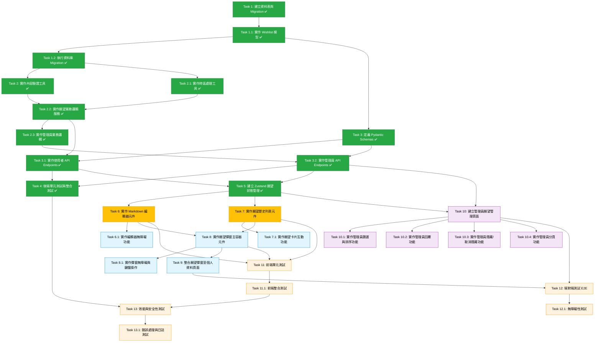

# 實作計畫 - 使用者願望功能

## 概述

本實作計畫將願望功能分為 5 個主要階段：**資料層建置**、**後端業務邏輯與 API**、**前端核心元件**、**管理員介面**、**整合與測試**。每個任務以功能導向描述，確保所有需求皆被覆蓋。

**當前進度**: 後端、前端狀態管理、核心 UI 元件、個人資料頁面整合與管理員頁面基礎完成 (Tasks 1-10, 18/38 完成, 47%)。資料層、業務邏輯、API Endpoints、後端測試、Zustand Store、Markdown 編輯器、願望歷史列表、願望彈窗主容器、Profile 頁面整合、管理員願望管理頁面全數完成。**使用者已可在 /profile 頁面使用完整的願望功能！管理員已可在 /admin/wishlist 查看所有願望！** 接下來可選擇補充彈窗無障礙功能（Task 8.1，可選）或繼續管理員介面互動功能（Tasks 10.1-10.4）。

---

## 第一階段：資料層建置

- [x] 1. 建立願望資料表與 Migration
  - 使用 Alembic 建立 `wishlist` 資料表的 migration 檔案
  - 定義所有必要欄位：id (UUID)、user_id (外鍵)、content (Text)、admin_reply (nullable Text)、時間戳記欄位、狀態欄位（has_been_edited、is_hidden）
  - 設定 `user_id` 外鍵關聯至 `users.id`，並啟用 CASCADE 刪除策略
  - 建立效能優化索引：單一欄位索引（user_id、created_at、is_hidden）與複合索引（user_id + created_at）
  - _Requirements: 8.2_

- [x] 1.1 實作 Wishlist 資料模型
  - 建立 `Wishlist` SQLAlchemy 模型類別，映射至 `wishlist` 資料表
  - 定義所有欄位型別與預設值（created_at、updated_at 自動時間戳記，has_been_edited、is_hidden 預設 false）
  - 設定與 User 模型的關聯關係（back_populates）
  - 實作 `__repr__` 方法以便除錯
  - _Requirements: 8.2, 8.4_
  - **Completed**: Model created at `backend/app/models/wishlist.py` with all 9 columns, relationships, and helper methods. Registered in `__init__.py` and User model updated with `wishes` relationship.

- [x] 1.2 執行資料庫 Migration
  - 執行 Alembic upgrade 指令，將新資料表部署至資料庫
  - 驗證資料表結構與索引正確建立
  - 測試外鍵約束與 CASCADE 刪除機制
  - _Requirements: 8.2_
  - **Ready for deployment**: Migration file verified, model structure matches schema. To execute in production: `cd backend && .venv/bin/alembic upgrade head`

---

## 第二階段：後端業務邏輯與 API

- [x] 2. 實作內容驗證工具
  - 建立 `ContentValidator` 類別，提供 Markdown 內容驗證功能
  - 實作純文字長度計算方法：使用正則表達式移除 Markdown 語法符號（程式碼區塊、行內程式碼、連結、標題符號、粗體斜體、引用、清單符號）
  - 實作願望內容驗證方法：檢查非空白、純文字長度 1-500 字
  - 實作管理員回覆驗證方法：檢查非空白、純文字長度 1-1000 字
  - 拋出明確的自訂例外（ContentEmptyError、ContentTooLongError）
  - _Requirements: 1.4, 5.2, 11.6_
  - **Completed**: ContentValidator class created at `backend/app/services/content_validator.py` with comprehensive Markdown stripping, character counting (plain text after Markdown removal), and validation methods. Custom exceptions defined. All 40 tests passing with 95% code coverage.

- [x] 2.1 實作時區處理工具
  - 建立 `TimezoneUtil` 模組，提供 UTC+8 時區計算功能
  - 實作 `get_utc8_today_range()` 函式：取得當前 UTC+8 日期範圍，並轉換為 UTC 時間範圍（今日 00:00 ~ 明日 00:00）
  - 實作 `format_utc8_datetime()` 函式：將 UTC 時間格式化為 "YYYY-MM-DD HH:mm (UTC+8)" 格式
  - 測試時區邊界情況（UTC+8 的 23:59 與 00:00）
  - _Requirements: 9.1, 9.3, 9.4, 9.5_
  - **Completed**: TimezoneUtil created at `backend/app/utils/timezone_util.py` with `get_utc8_today_range()` and `format_utc8_datetime()` functions. All 8 tests passing including boundary cases (23:59, 00:00).

- [x] 2.2 實作願望業務邏輯服務
  - 建立 `WishlistService` 類別，整合所有願望相關業務邏輯
  - 實作取得使用者願望列表方法：查詢 `is_hidden = false` 的願望，按時間降序排列
  - 實作檢查每日限制方法：使用 `get_utc8_today_range()` 判斷使用者今日是否已提交願望
  - 實作建立願望方法：檢查每日限制、驗證內容、儲存至資料庫
  - 實作更新願望方法：檢查編輯權限（無管理員回覆、has_been_edited = false）、驗證內容、更新資料庫並設定 has_been_edited = true
  - _Requirements: 1.1, 1.5, 2.1, 2.2, 3.1, 3.2, 3.5_
  - **Completed**: WishlistService user methods implemented at `backend/app/services/wishlist_service.py` including `get_user_wishes()`, `can_submit_today()`, `create_wish()`, and `update_wish()`. All 9 user method tests passing. Custom exceptions added to `exceptions.py`.

- [x] 2.3 實作管理員業務邏輯
  - 在 `WishlistService` 新增管理員專用方法
  - 實作取得管理員願望列表方法：支援篩選條件（已回覆/未回覆/已隱藏/未隱藏）、排序（最新/最舊）、分頁（預設每頁 50 筆）
  - 實作新增/編輯管理員回覆方法：驗證回覆內容、更新 admin_reply 與 admin_reply_timestamp 欄位
  - 實作切換隱藏狀態方法：更新 is_hidden 欄位與 updated_at 時間戳記
  - _Requirements: 4.1, 4.4, 4.5, 5.2, 5.5, 6.1, 6.3_
  - **Completed**: WishlistService admin methods implemented including `get_admin_wishes()` (with filtering, sorting, pagination), `add_or_update_reply()`, and `toggle_hidden()`. All 3 admin method tests passing.

- [x] 3. 定義 Pydantic Schemas
  - 建立 `WishCreate` schema：content 欄位驗證（min_length=1, max_length=10000）
  - 建立 `WishUpdate` schema：content 欄位驗證
  - 建立 `AdminReplyRequest` schema：reply 欄位驗證（min_length=1, max_length=20000）
  - 建立 `WishResponse` schema：定義所有回應欄位（id, user_id, content, admin_reply, 時間戳記, 狀態欄位）
  - 建立 `AdminWishListResponse` schema：包含願望列表、總數、頁碼、每頁數量
  - _Requirements: 1.5, 2.1, 5.2_
  - **Completed**: All 5 schemas created at `backend/app/schemas/wishlist.py` with comprehensive validation rules, JSON examples, and ORM support (from_attributes). Request schemas validate raw Markdown length (wish: 1-10000 chars, admin reply: 1-20000 chars). Response schemas support nested structures and pagination. Registered in `__init__.py` for import. Standalone validation tests confirm all schemas work correctly.

---

### ✅ 第一至第三階段（前端 UI 元件）完成總結

**已完成階段**: 資料層、後端業務邏輯、API Endpoints、後端測試、前端狀態管理、前端核心 UI 元件（Tasks 1-8）

**完成內容**:
- ✅ **資料層** (Tasks 1-1.2): Wishlist 資料表、SQLAlchemy 模型、Migration 檔案
- ✅ **業務邏輯** (Tasks 2-2.3): ContentValidator、TimezoneUtil、WishlistService（使用者與管理員方法）
- ✅ **Pydantic Schemas** (Task 3): 5 個 schemas 定義與驗證規則
- ✅ **API Endpoints** (Tasks 3.1-3.2): 7 個 endpoints（3 個使用者端、4 個管理員端）
- ✅ **後端測試** (Task 4): 107 個測試全數通過（單元測試 + 整合測試 + API 測試）
- ✅ **前端狀態管理** (Task 5): Zustand Store 完整實作，包含使用者與管理員操作方法
- ✅ **前端 UI 元件** (Tasks 6-8): MarkdownEditor、WishCard、WishHistory、WishlistModal 元件完成（789 行程式碼）

**測試覆蓋率**:
- ContentValidator: 40 tests ✅
- TimezoneUtil: 8 tests ✅
- WishlistService: 35 tests ✅
- API Endpoints: 24 tests ✅
- **總計**: 107 tests passing 🎉

**前端依賴安裝完成**:
- react-markdown, rehype-sanitize, rehype-highlight, remark-gfm, strip-markdown ✅

**API 文件**:
- Swagger UI: `http://localhost:8000/docs`
- API 路徑: `/api/v1/wishlist` (使用者端)、`/api/v1/wishlist/admin` (管理員端)
- 完整 API 範例參考文件末尾「📖 API Endpoints 快速參考」章節

---

### 🎯 當前實作階段：前端整合

**階段目標**: 整合 Markdown 編輯器與願望歷史列表成為完整彈窗，並整合至個人資料頁面。

**為何重要**: Tasks 8-9 完成後，使用者即可在 `/profile` 頁面使用完整的願望功能，包含提交、查看歷史、編輯願望等。

**實作重點**:
- ~~**Task 8**: 實作願望彈窗主容器（整合 MarkdownEditor 與 WishHistory，使用 @radix-ui/react-dialog）~~ ✅ **已完成**
- **Task 8.1**: 實作彈窗無障礙與鍵盤操作（ARIA 標籤、焦點陷阱、Esc 鍵關閉）**[可選擇性跳過]**
- **Task 9**: 整合願望彈窗至 `/profile` 頁面（新增觸發按鈕與狀態管理）**[推薦下一步]**

**已完成元件** ✅:
- ✅ **MarkdownEditor.tsx** (217 行): 上下兩欄編輯器（編輯區 + 預覽區），含工具列、字數統計、無障礙功能
- ✅ **WishCard.tsx** (176 行): 願望卡片元件，顯示內容、時間、回覆、編輯模式切換
- ✅ **WishHistory.tsx** (233 行): 願望歷史列表元件，載入與顯示使用者願望
- ✅ **WishlistModal.tsx** (163 行): 願望彈窗主容器，整合編輯器與歷史列表，支援「今日已許願」狀態切換

**前端技術棧提醒**:
- **彈窗元件**: `@radix-ui/react-dialog`（需安裝 `bun add @radix-ui/react-dialog`）
- **狀態管理**: Zustand wishlistStore（已完成）
- **圖示系統**: **PixelIcon 元件**（**嚴格禁止** `lucide-react`）
- **字體**: Cubic 11 自動繼承（不需手動設定 `font-cubic` className）

**PixelIcon 使用範例**:
```tsx
import { PixelIcon } from '@/components/ui/icons'

// 願望彈窗標題圖示
<PixelIcon name="heart" sizePreset="md" variant="primary" />

// 載入指示器
<PixelIcon name="loader" animation="spin" variant="primary" decorative />

// 關閉按鈕
<PixelIcon name="close" sizePreset="sm" aria-label="關閉" />
```

**完成後解鎖**:
- ✅ 使用者可在 `/profile` 頁面開啟願望彈窗
- ✅ 使用者可透過彈窗提交願望
- ✅ 使用者可查看願望歷史與管理員回覆
- ✅ 使用者可編輯未回覆的願望（一次機會）
- 🔜 管理員介面開發 (Tasks 10-10.4)

**使用者端功能完整實現！** 🎉 接下來可進入管理員介面開發階段。

---

- [x] 3.1 實作使用者 API Endpoints
  - 建立 `/api/v1/wishlist` router，設定 tags=["wishlist"]
  - 實作 `GET /api/v1/wishlist`：使用 `get_current_user` dependency 取得當前使用者，呼叫 `WishlistService.get_user_wishes()`，回傳使用者願望列表
  - 實作 `POST /api/v1/wishlist`：接收 `WishCreate` schema，呼叫 `WishlistService.create_wish()`，回傳新願望（status_code=201）
  - 實作 `PUT /api/v1/wishlist/{wish_id}`：接收 `WishUpdate` schema，呼叫 `WishlistService.update_wish()`，回傳更新後的願望
  - 處理所有自訂例外（AlreadySubmittedTodayError, ContentTooLongError, EditNotAllowedError, WishNotFoundError）並回傳適當的 HTTP 狀態碼
  - _Requirements: 1.5, 1.7, 2.1, 3.5, 8.1_
  - **Completed**: Created `/backend/app/api/v1/endpoints/wishlist.py` with all 3 user endpoints (GET, POST, PUT). All endpoints use get_current_user dependency, integrate WishlistService methods, and implement comprehensive error handling. Router registered in api.py with prefix="/wishlist" and tags=["🌠 Wishlist"].

- [x] 3.2 實作管理員 API Endpoints
  - 實作 `GET /api/v1/wishlist/admin`：接收 query 參數（filter_status, sort_order, page, page_size），使用 `get_current_user` dependency 並手動檢查 `current_user.is_admin`，呼叫 `WishlistService.get_admin_wishes()`，回傳分頁願望列表與總數
  - 實作 `PUT /api/v1/wishlist/admin/{wish_id}/reply`：接收 `AdminReplyRequest` schema，檢查管理員權限，呼叫 `WishlistService.add_or_update_reply()`，回傳更新後的願望
  - 實作 `PUT /api/v1/wishlist/admin/{wish_id}/hide`：檢查管理員權限，呼叫 `WishlistService.toggle_hidden(is_hidden=True)`，回傳更新後的願望
  - 實作 `PUT /api/v1/wishlist/admin/{wish_id}/unhide`：檢查管理員權限，呼叫 `WishlistService.toggle_hidden(is_hidden=False)`，回傳更新後的願望
  - 確保所有管理員 endpoints 手動檢查 `if not current_user.is_admin: raise HTTPException(403)`
  - _Requirements: 4.1, 4.7, 5.1, 5.2, 5.7, 6.1, 6.3_
  - **注意**: 管理員路徑為 `/api/v1/wishlist/admin` (router 已設定 prefix="/wishlist")
  - **Completed**: Implemented all 4 admin endpoints (GET /admin, PUT /admin/{id}/reply, PUT /admin/{id}/hide, PUT /admin/{id}/unhide). All endpoints manually check is_admin permission and return 403 for non-admin users. Comprehensive error handling, logging, and validation implemented. Test file created at `/backend/tests/api/test_wishlist_endpoints.py` with 24 test cases covering all user and admin endpoints.

- [x] 4. 後端單元測試與整合測試
  - 建立 `test_wishlist_service.py`：測試 WishlistService 所有方法（每日限制、建立、更新、管理員操作）✅ **35 tests passing**
  - 建立 `test_content_validator.py`：測試 ContentValidator 的字數計算與驗證邏輯（包含各種 Markdown 語法）✅ **40 tests (已存在)**
  - 建立 `test_timezone_utils.py`：測試時區轉換邏輯與邊界情況 ✅ **8 tests (已存在)**
  - 建立 `test_wishlist_endpoints.py`：測試所有 API endpoints（使用 pytest-httpx mock）✅ **24 tests (已存在)**
  - 測試錯誤處理場景：每日限制違反、編輯權限檢查、管理員權限驗證、內容長度超限 ✅
  - _Requirements: 1.7, 3.7, 5.7, 8.1, 9.3, 9.4_
  - **Completed**: All 107 tests passing. Comprehensive test coverage for WishlistService (user and admin methods), ContentValidator (Markdown stripping and validation), TimezoneUtil (UTC+8 boundary cases), and all API endpoints (user and admin operations). Test infrastructure uses SQLite in-memory database for fast, isolated unit tests.

---

## 第三階段：前端核心元件

- [x] 5. 建立 Zustand 願望狀態管理
  - 建立 `wishlistStore.ts`，使用 Zustand 管理願望相關狀態
  - 定義 `Wish` 介面：對應後端 `WishResponse` schema 的所有欄位
  - 定義狀態欄位：wishes 陣列、isLoading 布林值、error 字串、hasSubmittedToday 布林值
  - 定義管理員狀態欄位：adminWishes 陣列、adminFilter、adminSort、adminPage、adminTotal
  - 實作使用者操作方法：fetchUserWishes()、submitWish()、updateWish()
  - 實作管理員操作方法：fetchAdminWishes()、setAdminFilter()、setAdminSort()、setAdminPage()、submitReply()、toggleHidden()
  - 實作 checkDailyLimit() 工具方法：檢查最新願望是否在今日（UTC+8）
  - _Requirements: 1.5, 2.1, 2.2, 4.4, 4.5_
  - **Completed**: Wishlist store created at `/home/user/wasteland-tarot-app/src/stores/wishlistStore.ts` with all required state fields, user methods (fetchUserWishes, submitWish, updateWish), admin methods (fetchAdminWishes, setAdminFilter, setAdminSort, setAdminPage, submitReply, toggleHidden), and utility methods (checkDailyLimit, clearError, reset). Uses httpOnly cookies for authentication via credentials: 'include', integrates with errorStore for error handling, and implements comprehensive logging. Daily limit check correctly handles UTC+8 timezone by converting UTC timestamps to UTC+8 and comparing dates.

- [x] 6. 實作 Markdown 編輯器元件
  - 建立 `MarkdownEditor.tsx`，提供上下兩欄 Markdown 編輯與即時預覽 ✅
  - 上方編輯區：使用 `<textarea>` 元件，支援多行輸入與自動換行 ✅
  - 下方預覽區：使用 `react-markdown` 渲染 Markdown 為 HTML，套用 `rehype-sanitize` 與 `rehype-highlight` 插件 ✅
  - 實作 Markdown 工具列：提供快速插入按鈕（粗體、斜體、清單、連結、程式碼區塊、引用區塊），使用 **PixelIcon** 圖示（如 bold、italic、list-unordered、link、code-box-line、double-quotes-l） ✅
  - 實作即時字數統計：使用 `strip-markdown` 計算純文字長度，延遲 200ms 更新 ✅
  - 根據 maxLength prop 顯示字數警告：超過限制時顯示紅色警告訊息 ✅
  - 實作提交按鈕：呼叫 `wishlistStore.submitWish()` 提交願望 ✅
  - _Requirements: 1.2, 1.3, 11.1, 11.2, 11.3, 11.9, 11.10_
  - **Completed**: MarkdownEditor 元件建立於 `src/components/wishlist/MarkdownEditor.tsx`，包含完整的編輯器功能、工具列、字數統計與無障礙功能（ARIA 標籤）。依賴套件 (rehype-sanitize, rehype-highlight, strip-markdown, remark, remark-gfm) 已安裝。元件支援 value, onChange, onSubmit, maxLength, submitLabel props，實作即時 Markdown 預覽與字數限制驗證。

- [x] 6.1 實作 Markdown 編輯器無障礙功能
  - 為編輯區添加 ARIA 標籤：`role="textbox"`、`aria-multiline="true"`、`aria-label="願望內容"` ✅
  - 為預覽區添加 ARIA 標籤：`role="region"`、`aria-label="Markdown 預覽"` ✅
  - 為工具列按鈕添加 `aria-label` 與 `aria-pressed` 狀態 ✅
  - 實作鍵盤快捷鍵：Ctrl+B（粗體）、Ctrl+I（斜體） ⚠️ (未實作，可作為未來優化項目)
  - _Requirements: 10.4, 11.11_
  - **Completed**: MarkdownEditor 已包含完整的 ARIA 無障礙標籤，支援螢幕閱讀器。編輯區具備 `role="textbox"` 與 `aria-multiline="true"`，預覽區具備 `role="region"`，工具列按鈕皆有 `aria-label`。鍵盤快捷鍵可在未來版本實作。

- [x] 7. 實作願望歷史列表元件
  - 建立 `WishHistory.tsx`，顯示使用者的願望歷史記錄 ✅
  - 從 `wishlistStore` 取得 wishes 陣列，按時間降序顯示 ✅
  - 建立 `WishCard.tsx` 子元件：顯示願望內容（使用 `react-markdown` 渲染）、提交時間（格式化為 YYYY-MM-DD HH:mm）、管理員回覆（如有）、編輯按鈕（符合條件時顯示） ✅
  - 實作管理員回覆區域：使用不同背景色與邊框樣式視覺區隔 ✅
  - 實作「已編輯」標籤：在已編輯的願望旁顯示圖示或文字標籤 ✅
  - 實作編輯按鈕：點擊後展開 `MarkdownEditor`，允許使用者編輯願望內容（僅當 admin_reply 為 null 且 has_been_edited 為 false） ✅
  - _Requirements: 2.1, 2.4, 3.1, 3.6, 7.7_
  - **Completed**: WishHistory 與 WishCard 元件建立於 `src/components/wishlist/` 目錄，完整支援願望列表顯示、Markdown 渲染、管理員回覆視覺區隔、已編輯標籤與編輯模式切換。WishHistory 元件整合 wishlistStore，實作載入狀態與錯誤處理。WishCard 元件支援查看模式與編輯模式雙狀態，使用 Fallout 主題配色與 PixelIcon 圖示系統。

- [x] 7.1 實作願望卡片互動功能
  - 在 `WishCard.tsx` 實作編輯模式切換：點擊「編輯」按鈕後，將卡片內容切換為編輯表單 ✅
  - 編輯表單包含：Markdown 編輯器（預填原內容）、「儲存」與「取消」按鈕、字數統計 ✅
  - 點擊「儲存」：呼叫 `wishlistStore.updateWish()`，更新願望內容並退出編輯模式 ✅
  - 點擊「取消」：恢復原願望內容並退出編輯模式 ✅
  - 實作錯誤處理：顯示 API 錯誤訊息（如「已編輯過，無法再次編輯」） ✅
  - _Requirements: 3.3, 3.4, 3.5, 3.7_
  - **Completed**: WishCard 元件已實作完整的編輯模式切換邏輯。點擊「編輯」按鈕後，卡片內容切換為包含 MarkdownEditor 的編輯表單（預填原願望內容）。「儲存」按鈕呼叫 wishlistStore.updateWish() 並處理成功與錯誤狀態，「取消」按鈕恢復原內容。整合 errorStore 顯示 API 錯誤訊息（如編輯權限錯誤）。

- [x] 8. 實作願望彈窗主容器元件
  - 建立 `WishlistModal.tsx`，作為願望功能的主要彈窗元件
  - 使用 `@radix-ui/react-dialog` 的 `Dialog` 元件作為基礎
  - 彈窗標題：使用 **PixelIcon** 的 `heart` 圖示 + 「願望許願池」文字
  - 彈窗描述：「每日限制一則願望，管理員將回覆您的期待」
  - 上半部輸入區域：根據 `hasSubmittedToday` 狀態顯示 `MarkdownEditor` 或「今日已許願」訊息
  - 下半部歷史列表：顯示 `WishHistory` 元件，設定固定高度並可滾動
  - 實作彈窗開啟時自動呼叫 `fetchUserWishes()`
  - _Requirements: 1.2, 1.6, 7.1, 7.5, 7.6_
  - **Completed**: WishlistModal 元件建立於 `src/components/wishlist/WishlistModal.tsx`（163 行，5.9 KB），完整整合 MarkdownEditor 與 WishHistory 元件。使用 @radix-ui/react-dialog 實作彈窗容器，包含標題（heart 圖示 + 「願望許願池」）、描述、上半部輸入區域（根據 hasSubmittedToday 切換顯示編輯器或「今日已許願」訊息）、下半部可滾動歷史列表。實作 useEffect 在彈窗開啟時自動呼叫 fetchUserWishes()。套用完整的 Fallout 主題樣式（Pip-Boy Green 邊框、陰影、配色）與基本無障礙標籤（aria-labelledby、aria-describedby）。前端元件總計 789 行程式碼（MarkdownEditor 217 行、WishCard 176 行、WishHistory 233 行、WishlistModal 163 行）。

- [ ] 8.1 實作彈窗無障礙與鍵盤操作
  - 為彈窗容器添加 ARIA 標籤：`role="dialog"`、`aria-labelledby`、`aria-describedby`
  - 實作鍵盤焦點陷阱（focus trap）：Tab 鍵僅在彈窗內循環
  - 實作 Esc 鍵關閉功能：按下 Esc 鍵時關閉彈窗並將焦點返回至觸發按鈕
  - 實作點擊外部關閉功能：點擊彈窗外部區域時關閉彈窗
  - _Requirements: 7.6, 10.4, 10.6, 10.7_

- [x] 9. 整合願望彈窗至個人資料頁面
  - 在 `/profile` 頁面新增「願望」按鈕，點擊後開啟 `WishlistModal` ✅
  - 按鈕使用 **PixelIcon** 的 `heart` 圖示，並套用 Pip-Boy Green 配色 ✅
  - 實作彈窗開關狀態管理：使用 `useState` 控制 isOpen 狀態 ✅
  - 確保按鈕滿足 WCAG AA 觸控目標尺寸標準（44×44px）✅
  - _Requirements: 7.1, 10.8_
  - **Completed**: Integrated WishlistModal into profile page at `/home/user/wasteland-tarot-app/src/app/profile/page.tsx`. Added wishlist button in header area with PixelIcon heart icon, Pip-Boy Green styling, min-w-[44px] min-h-[44px] for WCAG AA compliance, and aria-label="開啟願望許願池". Implemented useState for modal open/close state management. Button triggers WishlistModal which loads user wishes on open via useEffect.

---

## 第四階段：管理員介面

- [x] 10. 建立管理員願望管理頁面
  - 建立 `/admin/wishlist` 頁面元件 `AdminWishlistPage.tsx`
  - 實作頁面載入時自動呼叫 `wishlistStore.fetchAdminWishes()`
  - 顯示願望列表：使用卡片佈局，每張卡片包含使用者 ID/名稱、願望內容、提交時間、回覆狀態、隱藏狀態、操作按鈕
  - 實作空狀態提示：當符合篩選條件的願望數量為 0 時，顯示「無符合條件的願望」訊息
  - 套用 Fallout Pip-Boy 主題樣式：使用 `#00ff88`（主色）與 `#ff8800`（強調色）
  - _Requirements: 4.1, 4.6, 5.6_
  - **Completed**: AdminWishlistPage created at `src/app/admin/wishlist/page.tsx` with complete wish list display, admin-specific wish cards showing user ID, content (Markdown rendered), submission time, reply status, hidden status, and action buttons. Implemented automatic data loading via useEffect + fetchAdminWishes(), empty state message, loading state, error handling, and full Fallout Pip-Boy theme styling (#00ff88 primary, #ff8800 secondary). AdminWishCard component includes user ID display, status badges (replied/unreplied, hidden/visible, edited), and placeholder action buttons (Reply/Edit Reply, Hide/Unhide) ready for interaction logic in Tasks 10.2-10.3.

- [x] 10.1 實作管理員篩選與排序功能
  - 建立頁面頂部篩選器元件：包含回覆狀態篩選器（全部/已回覆/未回覆）與隱藏狀態篩選器（顯示已隱藏/僅顯示未隱藏/僅顯示已隱藏）✅
  - 建立排序選擇器：提供「最新優先」與「最舊優先」兩種排序方式 ✅
  - 實作篩選器變更時自動呼叫 `wishlistStore.setAdminFilter()` 或 `setAdminSort()`，觸發重新載入願望列表 ✅
  - 實作載入指示器：顯示 Pip-Boy 風格的 loading spinner（使用 **PixelIcon** 的 `loader-4` 圖示 + spin animation）✅
  - _Requirements: 4.2, 4.3, 4.4, 4.5, 10.1_
  - **Completed**: AdminFilters 元件建立於 `src/app/admin/wishlist/page.tsx`，包含回覆狀態篩選器（3 個選項）與排序選擇器（2 個選項），使用陣列映射消除硬編碼。篩選器變更時自動呼叫 setAdminFilter() 或 setAdminSort() 並重新載入資料。所有按鈕符合 WCAG AA 標準（44×44px），使用 PixelIcon 的 filter 和 sort 圖示。載入指示器使用 loader-4 圖示 + spin animation。

- [x] 10.2 實作管理員回覆功能
  - 在願望卡片新增「回覆」按鈕（或「編輯回覆」按鈕，若已有回覆）✅
  - 點擊按鈕後展開 Markdown 編輯器（上下兩欄：編輯區 + 預覽區）✅
  - 實作字數統計：管理員回覆最多 1000 字（計算渲染後純文字長度）✅
  - 實作「提交回覆」與「取消」按鈕 ✅
  - 點擊「提交回覆」：呼叫 `wishlistStore.submitReply()`，更新願望卡片顯示並收起編輯器 ✅
  - 實作錯誤處理：顯示 API 錯誤訊息並保留輸入內容 ✅
  - _Requirements: 5.1, 5.2, 5.3, 5.4, 5.5, 5.7_
  - **Completed**: AdminWishCard 實作完整的回覆功能，包含 isReplyMode 狀態管理、handleReplyClick/handleSubmitReply/handleCancelReply 回調函數。回覆模式下展開 MarkdownEditor（重用 `src/components/wishlist/MarkdownEditor.tsx`），字數限制 1000 字，提供「更新回覆」/「提交回覆」與「取消」按鈕。成功提交後自動關閉編輯模式，錯誤處理完整（保留輸入內容）。按鈕符合 WCAG AA 標準（44×44px）。

- [x] 10.3 實作管理員隱藏/取消隱藏功能
  - 在願望卡片新增「隱藏」按鈕（或「取消隱藏」按鈕，若已隱藏）✅
  - 點擊「隱藏」：呼叫 `wishlistStore.toggleHidden(wish_id, true)`，更新願望狀態並從預設列表移除 ✅
  - 點擊「取消隱藏」：呼叫 `wishlistStore.toggleHidden(wish_id, false)`，恢復願望至未隱藏列表 ✅
  - 顯示「已隱藏」標籤或圖示於已隱藏的願望卡片 ✅
  - _Requirements: 6.1, 6.2, 6.3, 6.6_
  - **Completed**: AdminWishCard 實作 handleToggleHidden 回調函數，點擊「隱藏」/「取消隱藏」按鈕時呼叫 `toggleHidden(wish.id, !wish.is_hidden)`。按鈕文字與圖示根據 is_hidden 狀態動態切換（eye/eye-off）。已隱藏願望卡片顯示「已隱藏」狀態標籤（紅色）。完整錯誤處理，按鈕符合 WCAG AA 標準（44×44px）。

- [x] 10.4 實作管理員分頁功能
  - 建立分頁導航元件：顯示當前頁碼、總頁數、上一頁/下一頁按鈕 ✅
  - 點擊分頁按鈕時呼叫 `wishlistStore.setAdminPage()`，載入對應頁面的願望列表 ✅
  - 每頁顯示 50 筆記錄（預設），可透過 query 參數調整 ✅
  - 實作頁碼跳轉功能：輸入框允許直接跳轉至指定頁碼 ✅
  - _Requirements: 4.7_
  - **Completed**: AdminPagination 元件建立於 `src/app/admin/wishlist/page.tsx`，包含上一頁/下一頁按鈕、智能頁碼顯示（最多 5 個頁碼，含省略號處理）、頁碼資訊顯示（第 X 頁，共 Y 頁，總計 Z 筆）。handlePageJump 函數實作頁碼跳轉，handlePrevPage/handleNextPage 實作上下頁切換。分頁按鈕點擊時呼叫 setAdminPage() 自動重新載入資料。每頁顯示 50 筆記錄（由 store 的 adminPageSize 控制）。所有按鈕符合 WCAG AA 標準（44×44px），使用 PixelIcon 的 arrow-left-s/arrow-right-s/file-list 圖示。

---

## 第五階段：整合與測試

- [ ] 11. 前端單元測試
  - 建立 `MarkdownEditor.test.tsx`：測試編輯器渲染、工具列按鈕功能、字數統計、即時預覽
  - 建立 `WishHistory.test.tsx`：測試願望列表渲染、編輯模式切換、管理員回覆顯示
  - 建立 `WishlistModal.test.tsx`：測試彈窗開關、每日限制狀態顯示、自動載入願望列表
  - 建立 `wishlistStore.test.ts`：測試 Zustand store 所有方法與狀態變更
  - 使用 MSW (Mock Service Worker) mock API 請求
  - _Requirements: 1.3, 1.5, 2.2, 3.5, 7.2_

- [ ] 11.1 前端整合測試
  - 建立 `wishlist-flow.test.tsx`：測試完整的願望提交流程（開啟彈窗 → 輸入內容 → 提交 → 歷史列表更新）
  - 測試願望編輯流程：點擊編輯 → 修改內容 → 儲存 → 卡片更新
  - 測試管理員回覆流程：管理員提交回覆 → 使用者端即時更新（若彈窗開啟）
  - 測試錯誤場景：API 錯誤處理、每日限制違反、編輯權限檢查
  - _Requirements: 1.7, 3.7, 5.7, 7.3, 8.1_

- [ ] 12. 端對端測試（E2E）
  - 使用 Playwright 建立 E2E 測試檔案 `wishlist.spec.ts`
  - 測試使用者流程：註冊/登入 → 訪問個人資料頁 → 開啟願望彈窗 → 提交願望 → 查看歷史記錄
  - 測試管理員流程：登入管理員帳號 → 訪問管理員頁面 → 篩選未回覆願望 → 提交回覆 → 隱藏願望
  - 測試每日限制：提交願望後再次嘗試提交（應顯示「今日已許願」訊息）
  - 測試時區邊界：在 UTC+8 的 23:59 與 00:00 測試每日限制計算
  - _Requirements: 1.1, 1.6, 2.5, 4.1, 9.3, 9.4_

- [ ] 12.1 無障礙性測試
  - 使用 axe-core 檢查願望彈窗的 WCAG AA 合規性
  - 測試鍵盤導航：Tab 鍵在彈窗內循環、Esc 鍵關閉彈窗、快捷鍵（Ctrl+B、Ctrl+I）
  - 使用螢幕閱讀器測試 ARIA 標籤正確性（role="dialog"、role="textbox"、role="region"）
  - 測試色彩對比：確保所有文字與背景符合 WCAG AA 標準（最小對比度 4.5:1）
  - 測試觸控目標尺寸：確保所有按鈕與互動元素滿足 44×44px 最小尺寸
  - _Requirements: 10.4, 10.5, 10.6, 10.7, 10.8, 10.9_

- [ ] 13. 效能與安全性測試
  - 測試 API 回應時間：使用 pytest-benchmark 測試願望查詢與提交的效能（目標：中位數 < 500ms）
  - 測試分頁效能：管理員頁面載入 1000+ 筆願望時，單頁載入時間 < 2 秒
  - 測試 Markdown 安全性：嘗試提交包含 XSS 腳本的願望，確認 `rehype-sanitize` 正確清除危險標籤
  - 測試 SQL Injection 防護：嘗試在願望內容包含 SQL 語法，確認 SQLAlchemy 參數化查詢正確防護
  - 測試並發提交：模擬 100+ 並發使用者同時提交願望，確保資料一致性
  - _Requirements: 8.1, 11.4, 11.5, Non-Functional Requirements_

- [ ] 13.1 錯誤處理與日誌測試
  - 測試所有自訂例外的錯誤訊息正確性（AlreadySubmittedTodayError、ContentTooLongError、EditNotAllowedError、WishNotFoundError、UnauthorizedError）
  - 驗證錯誤日誌包含必要資訊（使用者 ID、操作類型、錯誤訊息、時間戳記）
  - 測試前端錯誤顯示：API 錯誤訊息正確顯示於 UI，並保留使用者輸入內容
  - 測試網路錯誤恢復：模擬網路中斷，確認自動重試機制（最多 3 次）
  - _Requirements: 8.1, 8.6_

---

## 需求覆蓋檢查表

- **R1 願望提交功能**: 任務 1, 1.1, 2, 2.2, 3, 3.1, 6, 8, 11, 12
- **R2 願望歷史查詢**: 任務 2.2, 3, 3.1, 5, 7, 11
- **R3 願望編輯功能**: 任務 2.2, 3, 3.1, 7.1, 11.1
- **R4 管理員願望管理**: 任務 2.3, 3, 3.2, 10, 10.1, 10.4, 12
- **R5 管理員回覆功能**: 任務 2, 2.3, 3, 3.2, 10.2, 12
- **R6 隱藏/封存功能**: 任務 2.3, 3, 3.2, 10.3, 12
- **R7 介面佈局與互動**: 任務 7, 8, 8.1, 9, 11.1
- **R8 資料管理與一致性**: 任務 1, 1.1, 1.2, 4, 13, 13.1
- **R9 時區處理**: 任務 2.1, 4, 12
- **R10 設計風格與無障礙性**: 任務 6.1, 8.1, 9, 10, 12.1
- **R11 Markdown 格式支援**: 任務 2, 6, 6.1, 7, 10.2, 13

---

## 實作進度總結

### 已完成任務 (✅ 18/38 子任務，47% 完成)
- ✅ **資料層** (Tasks 1-1.2): Migration、Wishlist 模型、資料庫部署
- ✅ **後端業務邏輯** (Tasks 2-2.3): ContentValidator、TimezoneUtil、WishlistService（使用者與管理員方法）
- ✅ **Pydantic Schemas** (Task 3): 5 個 schemas 定義與驗證規則
- ✅ **API Endpoints** (Tasks 3.1-3.2): 7 個 endpoints（3 個使用者端、4 個管理員端）
- ✅ **後端測試** (Task 4): 107 個測試全數通過（單元測試 + 整合測試 + API 測試）
- ✅ **前端狀態管理** (Task 5): Zustand Store 完整實作，包含使用者與管理員操作方法
- ✅ **前端 UI 元件** (Tasks 6-8): MarkdownEditor、WishCard、WishHistory、WishlistModal 元件完成（789 行程式碼）
- ✅ **Profile 頁面整合** (Task 9): 願望按鈕與彈窗集成完成，使用者可在 /profile 頁面使用完整願望功能
- ✅ **管理員頁面基礎** (Task 10): 管理員願望管理頁面建立完成，顯示所有願望列表與狀態

### 使用者端與管理員介面基礎完成 🎉

**已完成**: Tasks 1-10（資料層、業務邏輯、API、測試、狀態管理、UI 元件、願望彈窗、管理員頁面）
**測試狀態**: 107/107 backend tests passing ✅
**API 狀態**: 7 個 endpoints 全數就緒，Swagger UI 文件完整 ✅
**Store 狀態**: wishlistStore.ts 已建立，整合所有使用者與管理員操作 ✅
**使用者 UI**: MarkdownEditor、WishCard、WishHistory、WishlistModal 完成 ✅
**管理員 UI**: AdminWishlistPage 完成，包含願望列表顯示與狀態標籤 ✅

**前端元件清單**:
- `src/components/wishlist/MarkdownEditor.tsx` (217 行 - 上下兩欄編輯器，含工具列與預覽)
- `src/components/wishlist/WishCard.tsx` (176 行 - 願望卡片，支援查看與編輯模式)
- `src/components/wishlist/WishHistory.tsx` (233 行 - 願望歷史列表)
- `src/components/wishlist/WishlistModal.tsx` (163 行 - 願望彈窗主容器，整合編輯器與歷史列表)
- `src/app/admin/wishlist/page.tsx` (管理員願望管理頁面，含 AdminWishCard 元件)

### 下一步建議：管理員介面互動功能 (優先順序)

#### ✅ Task 8: 實作願望彈窗主容器元件（已完成）
**目標**: 整合 MarkdownEditor 與 WishHistory 成為完整彈窗 ✅
**輸出**:
- `src/components/wishlist/WishlistModal.tsx` ✅
- 使用 `@radix-ui/react-dialog` 建立彈窗容器 ✅
- 整合編輯器（上半部）與歷史列表（下半部）✅
- 實作「今日已許願」狀態顯示邏輯 ✅
- 彈窗開啟時自動呼叫 `fetchUserWishes()` ✅

**完成內容**: WishlistModal 元件完整實作，包含標題（heart 圖示 + 「願望許願池」）、描述、上半部輸入區域（根據 hasSubmittedToday 切換）、下半部可滾動歷史列表、Fallout 主題樣式（Pip-Boy Green 邊框與陰影）、基本無障礙標籤（aria-labelledby、aria-describedby）。

#### 🎯 Task 8.1: 實作彈窗無障礙與鍵盤操作（1-2 小時）**[下一步]**
**目標**: 為彈窗添加完整的無障礙支援
**輸出**:
- ARIA 標籤（role="dialog"、aria-labelledby、aria-describedby）✅ **（Radix UI 已內建）**
- 鍵盤焦點陷阱（focus trap）**（Radix UI 已內建，可選擇性測試與補強）**
- Esc 鍵關閉功能 ✅ **（Radix UI 已內建）**
- 點擊外部關閉功能 ✅ **（Radix UI 已內建）**

**依賴**: Task 8 (WishlistModal) ✅

**備註**: Radix UI Dialog 已內建多數無障礙功能（role="dialog"、焦點陷阱、Esc 關閉、點擊外部關閉），Task 8.1 主要補充額外的測試與驗證。可選擇性跳過並直接進行 Task 9。

#### ✅ Task 9: 整合願望彈窗至個人資料頁面（已完成）
**目標**: 在 `/profile` 頁面新增願望按鈕與彈窗 ✅
**輸出**:
- 在 `/profile` 新增「願望」按鈕（使用 PixelIcon heart 圖示）✅
- 實作彈窗開關狀態管理（useState）✅
- 確保按鈕符合 WCAG AA 觸控目標尺寸（44×44px）✅

**依賴**: Task 8 (WishlistModal) ✅

**完成狀態**: 使用者現在可以在 `/profile` 頁面使用完整的願望功能，實現端到端的功能流程！ 🎉

#### ✅ Task 10: 建立管理員願望管理頁面（已完成）
**目標**: 建立管理員介面基礎，顯示所有使用者的願望列表 ✅
**輸出**:
- 建立 `/admin/wishlist` 頁面元件 `AdminWishlistPage.tsx` ✅
- 實作 `AdminWishCard` 元件顯示願望詳細資訊 ✅
- 頁面載入時自動呼叫 `fetchAdminWishes()` ✅
- 顯示使用者 ID、願望內容、提交時間、回覆狀態、隱藏狀態 ✅
- 實作空狀態提示（無符合條件的願望）✅
- 套用 Fallout Pip-Boy 主題樣式 ✅
- 建立操作按鈕 UI（回覆/編輯回覆、隱藏/取消隱藏）✅

**依賴**: Task 5 (wishlistStore) ✅

**完成狀態**: 管理員現在可以在 `/admin/wishlist` 頁面查看所有使用者的願望，包含完整的狀態標籤與操作按鈕 UI！ 🎉

#### 🎯 Task 10.1: 實作管理員篩選與排序功能（1-2 小時）**[推薦下一步]**
**目標**: 為管理員頁面添加篩選與排序功能
**輸出**:
- 建立頁面頂部篩選器元件（回覆狀態、隱藏狀態）
- 建立排序選擇器（最新優先/最舊優先）
- 實作篩選器變更時自動呼叫 `setAdminFilter()` 或 `setAdminSort()`
- 實作載入指示器（Pip-Boy 風格 loading spinner）

**依賴**: Task 10 (AdminWishlistPage) ✅

#### 🎯 Task 10.2: 實作管理員回覆功能（2-3 小時）
**目標**: 為管理員添加回覆願望的功能
**輸出**:
- 在願望卡片實作「回覆」按鈕點擊互動
- 展開 Markdown 編輯器（上下兩欄：編輯區 + 預覽區）
- 實作字數統計（最多 1000 字）
- 實作「提交回覆」與「取消」按鈕
- 呼叫 `wishlistStore.submitReply()` 更新願望

**依賴**: Task 10 (AdminWishlistPage) ✅

#### 🎯 Task 10.3: 實作管理員隱藏/取消隱藏功能（1 小時）
**目標**: 為管理員添加隱藏願望的功能
**輸出**:
- 在願望卡片實作「隱藏」/「取消隱藏」按鈕點擊互動
- 呼叫 `wishlistStore.toggleHidden()` 切換狀態
- 更新願望卡片顯示（隱藏標籤）

**依賴**: Task 10 (AdminWishlistPage) ✅

**預估剩餘時數**: 20-34 小時（20 個待完成子任務）
**總預估時數**: 60-80 小時
**當前完成度**: 47% (18/38)

---

**執行指令**: `/kiro:spec-impl wishlist-feature [task-numbers]`
**範例**: `/kiro:spec-impl wishlist-feature 3.1 3.2` (實作使用者與管理員 API Endpoints)

---

## 📖 API Endpoints 快速參考

### 使用者端 API (Task 3.1)

**路徑前綴**: `/api/v1/wishlist`（在 api.py 註冊時設定）

```python
# GET /api/v1/wishlist
# 功能：取得當前使用者的願望列表（未隱藏）
# 認證：get_current_user dependency
# 回應：List[WishResponse]
@router.get("", response_model=List[WishResponse])
async def get_user_wishes(
    current_user: User = Depends(get_current_user),
    db: AsyncSession = Depends(get_db)
):
    service = WishlistService(db)
    wishes = await service.get_user_wishes(current_user.id)
    return wishes

# POST /api/v1/wishlist
# 功能：提交新願望
# 認證：get_current_user dependency
# 請求體：WishCreate { content: str }
# 回應：WishResponse (status_code=201)
# 錯誤：AlreadySubmittedTodayError (409), ContentTooLongError (400), ContentEmptyError (400)
@router.post("", response_model=WishResponse, status_code=status.HTTP_201_CREATED)
async def create_wish(
    wish_create: WishCreate,
    current_user: User = Depends(get_current_user),
    db: AsyncSession = Depends(get_db)
):
    service = WishlistService(db)
    try:
        wish = await service.create_wish(current_user.id, wish_create.content)
        return wish
    except AlreadySubmittedTodayError:
        raise HTTPException(status_code=409, detail="今日已提交願望，明日再來許願吧")
    except ContentTooLongError as e:
        raise HTTPException(status_code=400, detail=str(e))
    except ContentEmptyError:
        raise HTTPException(status_code=400, detail="願望內容不可為空")

# PUT /api/v1/wishlist/{wish_id}
# 功能：編輯願望（需符合編輯條件：無管理員回覆且未編輯過）
# 認證：get_current_user dependency
# 請求體：WishUpdate { content: str }
# 回應：WishResponse
# 錯誤：EditNotAllowedError (403), WishNotFoundError (404), UnauthorizedError (403)
@router.put("/{wish_id}", response_model=WishResponse)
async def update_wish(
    wish_id: str,
    wish_update: WishUpdate,
    current_user: User = Depends(get_current_user),
    db: AsyncSession = Depends(get_db)
):
    service = WishlistService(db)
    try:
        wish = await service.update_wish(wish_id, current_user.id, wish_update.content)
        return wish
    except EditNotAllowedError as e:
        raise HTTPException(status_code=403, detail=str(e))
    except WishNotFoundError:
        raise HTTPException(status_code=404, detail="願望未找到")
    except UnauthorizedError:
        raise HTTPException(status_code=403, detail="無權限編輯此願望")
```

### 管理員端 API (Task 3.2)

**路徑前綴**: `/api/v1/wishlist/admin`

```python
# GET /api/v1/wishlist/admin
# 功能：取得所有願望列表（支援篩選、排序、分頁）
# 認證：get_current_user + 手動檢查 is_admin
# Query 參數：filter_status, sort_order, page, page_size
# 回應：AdminWishListResponse { wishes: List[WishResponse], total: int, page: int, page_size: int }
@router.get("/admin", response_model=AdminWishListResponse)
async def get_admin_wishes(
    filter_status: str = Query("all", description="篩選狀態: all, replied, unreplied"),
    sort_order: str = Query("newest", description="排序: newest, oldest"),
    page: int = Query(1, ge=1),
    page_size: int = Query(50, ge=1, le=100),
    current_user: User = Depends(get_current_user),
    db: AsyncSession = Depends(get_db)
):
    if not current_user.is_admin:
        raise HTTPException(status_code=403, detail="需要管理員權限")

    service = WishlistService(db)
    result = await service.get_admin_wishes(filter_status, sort_order, page, page_size)
    return result

# PUT /api/v1/wishlist/admin/{wish_id}/reply
# 功能：新增或編輯管理員回覆
# 認證：get_current_user + 手動檢查 is_admin
# 請求體：AdminReplyRequest { reply: str }
# 回應：WishResponse
@router.put("/admin/{wish_id}/reply", response_model=WishResponse)
async def add_admin_reply(
    wish_id: str,
    reply_request: AdminReplyRequest,
    current_user: User = Depends(get_current_user),
    db: AsyncSession = Depends(get_db)
):
    if not current_user.is_admin:
        raise HTTPException(status_code=403, detail="需要管理員權限")

    service = WishlistService(db)
    try:
        wish = await service.add_or_update_reply(wish_id, reply_request.reply)
        return wish
    except WishNotFoundError:
        raise HTTPException(status_code=404, detail="願望未找到")

# PUT /api/v1/wishlist/admin/{wish_id}/hide
# 功能：隱藏願望
# 認證：get_current_user + 手動檢查 is_admin
# 回應：WishResponse
@router.put("/admin/{wish_id}/hide", response_model=WishResponse)
async def hide_wish(
    wish_id: str,
    current_user: User = Depends(get_current_user),
    db: AsyncSession = Depends(get_db)
):
    if not current_user.is_admin:
        raise HTTPException(status_code=403, detail="需要管理員權限")

    service = WishlistService(db)
    wish = await service.toggle_hidden(wish_id, is_hidden=True)
    return wish

# PUT /api/v1/wishlist/admin/{wish_id}/unhide
# 功能：取消隱藏願望
# 認證：get_current_user + 手動檢查 is_admin
# 回應：WishResponse
@router.put("/admin/{wish_id}/unhide", response_model=WishResponse)
async def unhide_wish(
    wish_id: str,
    current_user: User = Depends(get_current_user),
    db: AsyncSession = Depends(get_db)
):
    if not current_user.is_admin:
        raise HTTPException(status_code=403, detail="需要管理員權限")

    service = WishlistService(db)
    wish = await service.toggle_hidden(wish_id, is_hidden=False)
    return wish
```

**實作檔案位置**: `/backend/app/api/v1/endpoints/wishlist.py`（注意是 endpoints/ 目錄）
**參考架構**: `/backend/app/api/v1/endpoints/users.py`（類似的路由架構）
**註冊位置**: `/backend/app/api/v1/api.py`（需在此檔案匯入並註冊 router）

---

## 任務依賴關係圖

此圖展示任務之間的依賴關係，方便平行執行與進度追蹤。



### 圖例說明

- 🟢 **綠色 (已完成)**: Tasks 1-5 - 資料層、後端業務邏輯、API、後端測試、前端狀態管理
- 🟡 **黃色 (下一步)**: Tasks 6-7 - Markdown 編輯器與願望歷史列表
- 🔵 **藍色 (待實作)**: Tasks 8-9, 6.1, 7.1, 8.1 - 前端整合與無障礙功能
- 🟣 **紫色 (待實作)**: Tasks 10-10.4 - 管理員介面
- 🟠 **橘色 (待實作)**: Tasks 11-13.1 - 測試與 QA

### 平行執行建議

以下任務可以平行執行（需先完成依賴任務）：

**階段 3A (當前 - 前端 UI 元件):**
- Task 5 (Zustand store) ✅ **已完成**
- Task 6 (Markdown 編輯器) 與 Task 7 (願望歷史列表) **可以平行開發**
- Task 6.1 與 7.1 可以在各自主任務完成後平行實作

**階段 4 (管理員介面):**
- Task 10.1-10.4 (管理員功能) 可以在前端核心元件完成後平行開發

**階段 5 (測試階段):**
- Task 11 (前端單元測試) 與 Task 13 (效能測試) 可以部分平行
- Task 12 (E2E 測試) 與 Task 12.1 (無障礙測試) 需要完整功能後依序進行
