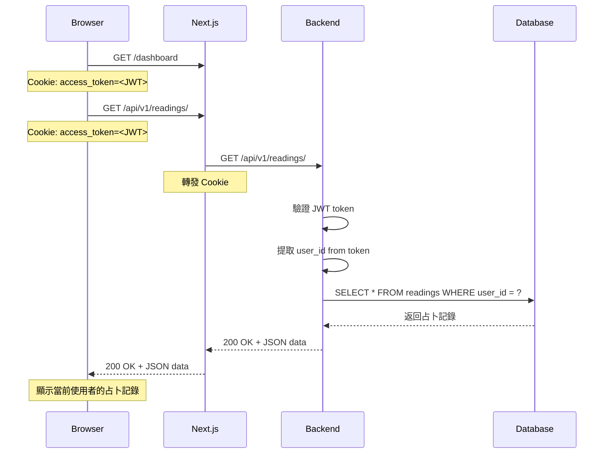

# 身份驗證流程文檔

## 概述

Wasteland Tarot 使用 **JWT Token + httpOnly Cookie** 的身份驗證機制，確保安全且自動識別使用者。

## 核心原理

### ✅ 正確設計：基於 Cookie 的自動身份識別

使用者身份**不需要在 API 請求中明確傳遞**，而是透過以下機制自動識別：

1. **登入時**：後端設置 httpOnly Cookie（`access_token`）
2. **每次請求**：瀏覽器自動發送 Cookie 到後端
3. **後端驗證**：從 Cookie 中提取並驗證 JWT token
4. **自動注入**：透過 FastAPI Dependency Injection 自動獲取 `current_user`

### ❌ 不正確的設計：在 URL 中傳遞 User ID

```typescript
// ❌ 錯誤示例（不安全）
GET /api/v1/readings/?user_id=xxx

// 問題：
// 1. 任何人都可以修改 user_id 查看他人資料
// 2. 無法確保請求者的真實身份
```

### ✅ 正確的設計：基於 JWT Token

```typescript
// ✅ 正確示例（安全）
GET /api/v1/readings/
Cookie: access_token=<JWT>

// 優點：
// 1. JWT token 存在 httpOnly Cookie 中，JavaScript 無法讀取（防 XSS）
// 2. 後端自動從 token 中提取 user_id
// 3. 確保請求者身份真實可靠
```

## 技術架構

### 1. 後端身份驗證 (FastAPI)

**檔案**：`backend/app/core/dependencies.py`

```python
async def get_current_user(
    request: Request,
    access_token: Optional[str] = Cookie(None),      # 從 httpOnly Cookie 取得
    credentials: Optional[HTTPAuthorizationCredentials] = Depends(security),  # 備用：從 Header
    db: AsyncSession = Depends(get_db)
) -> User:
    """
    驗證優先順序：
    1. httpOnly Cookie (access_token) - 主要方法
    2. Authorization Header (Bearer <token>) - 備用方法
    """
    # 1. 從 Cookie 或 Header 取得 JWT token
    token = access_token or (credentials.credentials if credentials else None)
    
    if not token:
        raise HTTPException(401, "No access token provided")
    
    # 2. 驗證 token 有效性
    payload = verify_token(token)
    
    # 3. 提取 user_id
    user_id = payload.get("sub")
    
    # 4. 從資料庫查詢使用者
    user = await user_service.get_user_by_id(user_id)
    
    # 5. 返回 User 物件
    return user
```

### 2. API 端點使用

**檔案**：`backend/app/api/v1/endpoints/readings.py`

```python
@router.get("/")
async def get_readings(
    page: int = Query(default=1),
    page_size: int = Query(default=20),
    current_user: User = Depends(get_current_user)  # 自動注入當前使用者
) -> ReadingListResponse:
    """
    取得當前使用者的占卜記錄
    
    注意：
    - 不需要在 URL 中傳遞 user_id
    - current_user 透過 JWT token 自動識別
    - 查詢自動過濾為當前使用者的資料
    """
    query = select(ReadingSessionModel).where(
        ReadingSessionModel.user_id == current_user.id  # 只查詢當前使用者
    )
    
    result = await db.execute(query)
    readings = result.scalars().all()
    
    return ReadingListResponse(readings=readings, ...)
```

### 3. 前端 API 客戶端

**檔案**：`src/lib/api.ts`

```typescript
export async function apiRequest<T>(endpoint: string, options: RequestInit = {}): Promise<T> {
  const response = await timedFetch(`${API_BASE_URL}${endpoint}`, {
    ...options,
    credentials: 'include',  // 自動發送 httpOnly Cookie
    headers: {
      'Content-Type': 'application/json',
      ...options.headers,
    },
  })
  
  // 處理 401 自動刷新 token
  if (response.status === 401) {
    const refreshSucceeded = await refreshToken()
    if (refreshSucceeded) {
      // 重試原始請求
    }
  }
  
  return response.json()
}

// Readings API
export const readingsAPI = {
  // ✅ 正確：不需要傳遞 userId（向後相容保留參數但不使用）
  getUserReadings: (userId?: string): Promise<ReadingsResponse> =>
    apiRequest(`/api/v1/readings/?page=1&page_size=100`),
    // userId 參數被忽略，後端透過 Cookie 自動識別使用者
}
```

### 4. Next.js API 代理

**檔案**：`src/app/api/v1/[...path]/route.ts`

```typescript
async function proxyRequest(request: NextRequest, pathSegments: string[], method: string) {
  // 轉發 Cookie 到後端
  const cookies = request.cookies.getAll()
  const cookieHeader = cookies.map(c => `${c.name}=${c.value}`).join('; ')
  headers.set('Cookie', cookieHeader)
  
  // 發送請求到後端
  const response = await fetch(backendUrl, {
    method,
    headers,
    credentials: 'include',
  })
  
  // 轉發 Set-Cookie 回到客戶端
  const setCookieHeaders = response.headers.getSetCookie()
  setCookieHeaders.forEach(cookieHeader => {
    nextResponse.cookies.set(/* parse cookie */)
  })
  
  return nextResponse
}
```

## 完整請求流程

### 場景：用戶訪問 Dashboard 並載入占卜記錄



## 安全性考量

### ✅ 優點

1. **防止 XSS 攻擊**：httpOnly Cookie 無法被 JavaScript 讀取
2. **防止 CSRF 攻擊**：使用 SameSite=Lax Cookie 屬性
3. **自動過期處理**：Token 過期自動刷新
4. **身份確認可靠**：無法偽造或篡改其他使用者身份

### 🔒 最佳實踐

1. **永遠不要在 URL 中傳遞敏感資訊**
2. **永遠不要相信客戶端傳來的 user_id**
3. **永遠從 JWT token 中提取使用者身份**
4. **使用 httpOnly Cookie 儲存 token**
5. **在生產環境啟用 HTTPS + Secure Cookie**

## 常見問題

### Q1: 為什麼 `getUserReadings(userId)` 有 userId 參數但不使用？

**A**: 這是為了向後相容。實際上：
- 舊代碼可能傳入 `userId`，但會被忽略
- 後端自動從 JWT token 中提取真實的 `user_id`
- 確保安全性，防止查看他人資料

### Q2: 如何測試 API 端點？

```bash
# 方法 1：使用瀏覽器（自動帶 Cookie）
# 在登入後的瀏覽器中打開 DevTools > Network

# 方法 2：使用 curl（需要手動設置 Cookie）
curl -X GET "http://localhost:3000/api/v1/readings/" \
  -H "Cookie: access_token=<your_jwt_token>"

# 方法 3：使用 Postman/Insomnia
# 設置 Cookie: access_token=<your_jwt_token>
```

### Q3: Token 過期怎麼辦？

**A**: 系統會自動處理：
1. 檢測到 401 錯誤
2. 自動呼叫 `/api/v1/auth/refresh` 刷新 token
3. 重試原始請求
4. 如果刷新失敗，重定向到登入頁面

### Q4: 如何在開發環境調試身份驗證？

```typescript
// 在 browser console 中檢查 cookies
document.cookie

// 查看 JWT token payload（不包含簽名）
const token = "your.jwt.token"
const payload = JSON.parse(atob(token.split('.')[1]))
console.log(payload)
// { sub: "user-id", type: "access", exp: 1234567890, ... }
```

## 相關檔案

- **後端依賴注入**：`backend/app/core/dependencies.py`
- **後端安全模組**：`backend/app/core/security.py`
- **API 端點**：`backend/app/api/v1/endpoints/readings.py`
- **前端 API 客戶端**：`src/lib/api.ts`
- **Next.js 代理**：`src/app/api/v1/[...path]/route.ts`

## 總結

Wasteland Tarot 採用業界標準的 JWT + httpOnly Cookie 身份驗證機制：

✅ **安全**：防止 XSS 和身份偽造  
✅ **自動**：使用者身份自動識別，無需手動傳遞  
✅ **可靠**：Token 驗證確保請求者真實身份  
✅ **易用**：前端只需 `credentials: 'include'`，後端只需 `Depends(get_current_user)`

---

**更新日期**：2025-11-05  
**版本**：1.0
