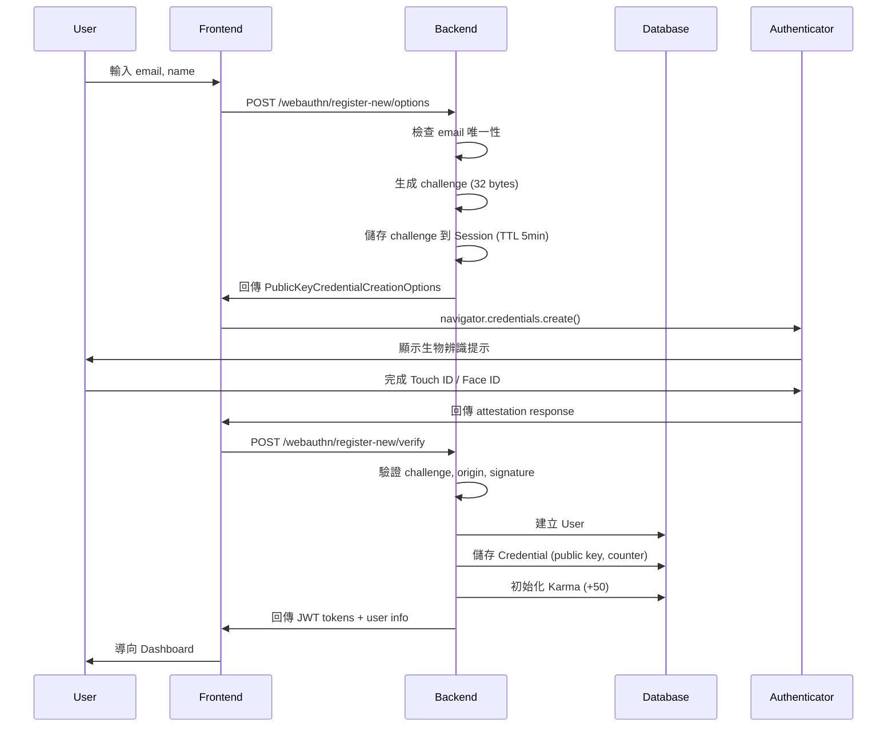
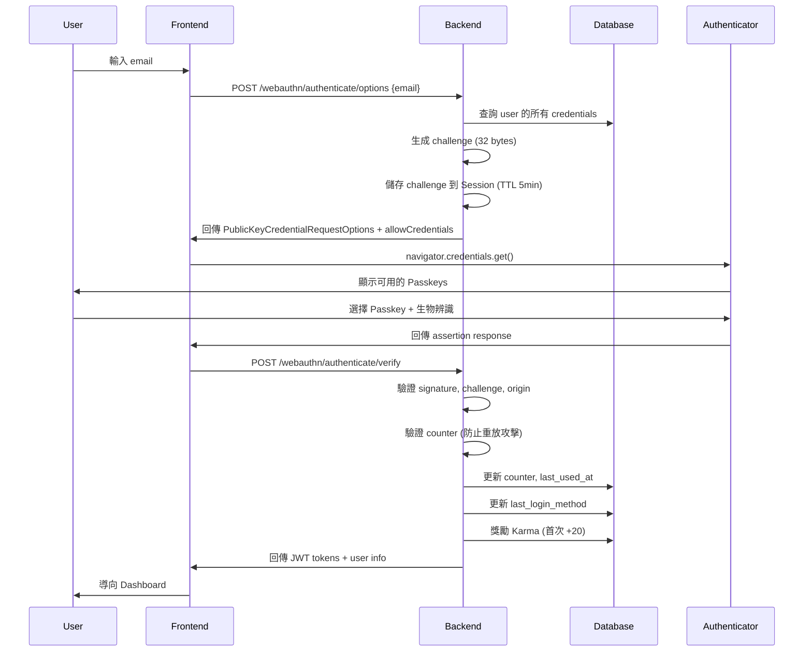

# Passkey 開發者指南

> **Wasteland Tarot - Passkey Authentication System**
>
> 完整的 WebAuthn 實作指南，從架構設計到測試部署。

---

## 目錄

1. [專案架構](#專案架構)
2. [WebAuthn 流程詳解](#webauthn-流程詳解)
3. [安全性考量](#安全性考量)
4. [測試指南](#測試指南)
5. [如何擴充功能](#如何擴充功能)
6. [API 參考](#api-參考)
7. [疑難排解](#疑難排解)
8. [貢獻指南](#貢獻指南)

---

## 專案架構

### 目錄結構

```
wasteland-tarot/
├── backend/
│   ├── app/
│   │   ├── api/
│   │   │   └── webauthn.py              # WebAuthn API 端點
│   │   ├── services/
│   │   │   ├── webauthn_service.py      # WebAuthn 業務邏輯
│   │   │   ├── challenge_store.py       # Challenge 儲存（Redis/Session）
│   │   │   ├── security_logger.py       # 安全事件日誌
│   │   │   └── auth_helpers.py          # 認證輔助函式
│   │   ├── models/
│   │   │   ├── user.py                  # User model
│   │   │   └── credential.py            # Credential model
│   │   ├── schemas/
│   │   │   └── webauthn.py              # Pydantic schemas
│   │   ├── middleware/
│   │   │   ├── error_handler.py         # 統一錯誤處理
│   │   │   ├── rate_limit.py            # Rate Limiting
│   │   │   └── security.py              # Security Headers
│   │   └── core/
│   │       ├── webauthn.py              # WebAuthn 配置
│   │       └── exceptions.py            # 自訂異常
│   └── migrations/
│       └── versions/                     # Alembic 遷移
│
├── frontend/
│   └── src/
│       ├── lib/webauthn/
│       │   ├── utils.ts                  # WebAuthn 工具函式
│       │   ├── api.ts                    # API Client
│       │   ├── types.ts                  # TypeScript 型別
│       │   ├── errorHandler.ts           # 錯誤處理
│       │   └── index.ts                  # 模組入口
│       ├── components/auth/
│       │   ├── PasskeyRegistrationForm.tsx
│       │   ├── PasskeyLoginForm.tsx
│       │   ├── AddPasskeyButton.tsx
│       │   └── CredentialManagementPage.tsx
│       └── lib/
│           └── authStore.ts              # 認證狀態管理（Zustand）
│
└── tests/
    ├── unit/                             # 單元測試
    │   ├── webauthn/
    │   └── middleware/
    ├── integration/                      # 整合測試
    └── e2e/                             # E2E 測試
        └── passkey-*.spec.ts
```

---

## WebAuthn 流程詳解

### 1. 註冊流程（Registration）

#### 新用戶註冊（Passwordless）



#### 已登入用戶新增 Passkey

流程類似，但：
- 需要 JWT authentication
- 不建立新 User
- 使用 `excludeCredentials` 防止重複註冊
- 檢查 10 個上限

---

### 2. 登入流程（Authentication）

#### Email-guided 登入



#### Usernameless 登入（Conditional UI）

流程類似，但：
- 不需要 email
- `allowCredentials` 為空陣列
- Authenticator 顯示所有可用 Passkeys
- 適合行動裝置 autofill

---

### 3. Credential 管理流程

#### 列出 Passkeys

```typescript
// Frontend
const credentials = await getCredentials();

// Backend
GET /api/v1/webauthn/credentials
Response: [
  {
    id: UUID,
    credential_id: "truncated...",
    device_name: "iPhone 15 Pro",
    created_at: "2025-10-28T12:00:00Z",
    last_used_at: "2025-10-28T14:30:00Z",
    ...
  }
]
```

#### 更新名稱

```typescript
// Frontend
await updateCredentialName(credentialId, "New Name");

// Backend
PATCH /api/v1/webauthn/credentials/{id}/name
Body: { device_name: "New Name" }
```

#### 刪除 Passkey

```typescript
// Frontend
await deleteCredential(credentialId);

// Backend
DELETE /api/v1/webauthn/credentials/{id}

// 檢查：不能刪除最後一個認證方式
if (user.credentials.length == 1 && !user.has_password && !user.oauth_provider):
    raise CannotDeleteLastAuthMethodError
```

---

## 安全性考量

### 1. Challenge 安全性

#### 產生

```python
# backend/app/services/challenge_store.py
import secrets

def generate_challenge() -> bytes:
    """生成密碼學安全的 challenge（32 bytes）"""
    return secrets.token_bytes(32)
```

**重點**:
- 使用 `secrets` 模組（不是 `random`）
- 32 bytes = 256 bits（符合 WebAuthn 建議）
- 每次請求都產生新的 challenge

#### 儲存

```python
# Redis (推薦，production)
redis.setex(
    key=f"webauthn:challenge:{user_id}",
    value=challenge.hex(),
    time=300  # 5 分鐘 TTL
)

# Session (備用，development)
request.session["webauthn_challenge"] = challenge.hex()
```

**重點**:
- TTL 5 分鐘（足夠完成驗證，但不會太長）
- Single-use（取出後立即刪除）
- User-specific key（防止 race condition）

#### 驗證

```python
# 取得 expected challenge
expected_challenge = get_challenge_from_session(request)
if not expected_challenge:
    raise InvalidChallengeError("Challenge 已過期或不存在")

# 驗證（在 verify_registration_response 或 verify_authentication_response 中）
if challenge != expected_challenge:
    raise InvalidChallengeError("Challenge 不一致")
```

---

### 2. Origin 驗證

```python
# backend/app/core/webauthn.py
WEBAUTHN_ORIGIN = os.getenv("WEBAUTHN_ORIGIN")  # https://wastelandtarot.com
WEBAUTHN_RP_ID = os.getenv("WEBAUTHN_RP_ID")    # wastelandtarot.com

# py_webauthn 自動驗證 origin
options = generate_registration_options(
    rp_id=WEBAUTHN_RP_ID,
    rp_name="Wasteland Tarot",
    user_id=user.id.bytes,
    user_name=user.email,
    ...
)

credential = verify_registration_response(
    credential=credential,
    expected_challenge=expected_challenge,
    expected_origin=WEBAUTHN_ORIGIN,  # 驗證 origin
    expected_rp_id=WEBAUTHN_RP_ID,
    ...
)
```

**重點**:
- Origin 必須包含協議（`https://`）
- RP ID 不包含協議（只有 domain）
- Production 必須使用 HTTPS
- 驗證失敗會拋出 `InvalidOriginError`

---

### 3. Counter 驗證（防止重放攻擊）

```python
# backend/app/models/credential.py
class Credential(Base):
    sign_count = Column(Integer, default=0)

    def increment_counter(self, new_count: int):
        """驗證並更新 counter"""
        if new_count <= self.sign_count:
            # Counter 回退或不變 = 可能的複製裝置攻擊
            raise CounterError(
                f"Counter 回退偵測：期望 > {self.sign_count}，實際 {new_count}"
            )
        self.sign_count = new_count
        self.last_used_at = datetime.utcnow()
```

**重點**:
- Counter 必須嚴格遞增
- Counter 回退 = 警報（CRITICAL 級別日誌）
- 可能原因：複製裝置、時間扭曲、攻擊

---

### 4. Public Key 儲存

```python
# backend/app/models/credential.py
class Credential(Base):
    public_key = Column(LargeBinary, nullable=False)  # 儲存原始 bytes
    credential_id = Column(String(512), unique=True, nullable=False)
```

**重點**:
- 儲存完整的 public key（用於驗證 signature）
- Credential ID 必須 unique
- 不儲存 private key（永遠不會離開使用者裝置）

---

### 5. Rate Limiting

```python
# backend/app/middleware/rate_limit.py
from slowapi import Limiter

limiter = Limiter(
    key_func=get_identifier,  # user_id > email > IP
    storage_uri=os.getenv("REDIS_URL")
)

# 套用到端點
@router.post("/register-new/options")
@limiter.limit("10/minute")  # 每分鐘最多 10 次
async def generate_new_user_registration_options(...):
    pass
```

**防止**:
- 暴力破解
- Credential 枚舉
- DDoS 攻擊

---

### 6. Security Headers

```python
# backend/app/middleware/security.py
class SecurityHeadersMiddleware:
    def __init__(self, app):
        self.app = app

    async def __call__(self, scope, receive, send):
        # 自動加入 security headers
        if scope["type"] == "http":
            # HSTS (僅 production)
            if ENVIRONMENT == "production":
                headers.append((b"strict-transport-security", b"max-age=31536000; includeSubDomains; preload"))

            # 其他 headers
            headers.extend([
                (b"x-content-type-options", b"nosniff"),
                (b"x-frame-options", b"DENY"),
                (b"x-xss-protection", b"1; mode=block"),
                ...
            ])
```

---

## 測試指南

### 測試架構

我們使用 **TDD（Test-Driven Development）**：

1. **紅燈**: 先寫測試（測試失敗）
2. **綠燈**: 實作功能（測試通過）
3. **重構**: 優化程式碼（測試仍通過）

### 測試層級

```
測試金字塔:

         /\
        /  \  E2E Tests (32 tests)
       /____\
      /      \
     /        \ Integration Tests (21 tests)
    /__________\
   /            \
  /              \ Unit Tests (200+ tests)
 /________________\
```

---

### 1. 單元測試（Unit Tests）

測試獨立函式和類別。

#### 範例：測試 Challenge Store

```python
# tests/unit/services/test_challenge_store.py
import pytest
from app.services.challenge_store import ChallengeStore

def test_generate_challenge():
    """測試產生 32 bytes challenge"""
    store = ChallengeStore()
    challenge = store.generate_challenge()
    assert len(challenge) == 32
    assert isinstance(challenge, bytes)

def test_store_and_retrieve_challenge():
    """測試儲存和取出 challenge"""
    store = ChallengeStore()
    user_id = "user-123"
    challenge = store.generate_challenge()

    # 儲存
    store.store_challenge(user_id, challenge)

    # 取出
    retrieved = store.get_challenge(user_id)
    assert retrieved == challenge

def test_challenge_single_use():
    """測試 challenge 單次使用"""
    store = ChallengeStore()
    user_id = "user-123"
    challenge = store.generate_challenge()

    store.store_challenge(user_id, challenge)

    # 第一次取出成功
    assert store.get_challenge(user_id) == challenge

    # 第二次取出失敗（已刪除）
    assert store.get_challenge(user_id) is None
```

執行：

```bash
pytest tests/unit/services/test_challenge_store.py -v
```

---

### 2. 整合測試（Integration Tests）

測試模組間互動。

#### 範例：測試 WebAuthn 註冊 API

```python
# tests/integration/test_webauthn_registration.py
import pytest
from fastapi.testclient import TestClient
from app.main import app

client = TestClient(app)

def test_registration_options_success():
    """測試取得註冊選項（成功）"""
    response = client.post(
        "/api/v1/webauthn/register-new/options",
        json={"email": "new@example.com", "name": "New User"}
    )
    assert response.status_code == 200
    data = response.json()
    assert "options" in data
    assert "challenge" in data

def test_registration_options_email_exists():
    """測試 email 已註冊（409 Conflict）"""
    # 先註冊一個使用者
    # ...

    # 嘗試用相同 email 註冊
    response = client.post(
        "/api/v1/webauthn/register-new/options",
        json={"email": "existing@example.com", "name": "Test"}
    )
    assert response.status_code == 409
    assert "已註冊" in response.json()["detail"]
```

執行：

```bash
pytest tests/integration/ -v
```

---

### 3. E2E 測試（End-to-End Tests）

測試完整使用者流程（需要前後端運行）。

#### 範例：Passkey 註冊 E2E 測試

```typescript
// tests/e2e/passkey-registration.spec.ts
import { test, expect } from '@playwright/test';
import { setupVirtualAuthenticator } from './helpers/webauthn';

test.describe('Passkey Registration', () => {
  test('新用戶可以使用 Passkey 註冊', async ({ page, context }) => {
    // 設定 Virtual Authenticator
    const cdp = await context.newCDPSession(page);
    await setupVirtualAuthenticator(cdp);

    // 訪問註冊頁面
    await page.goto('http://localhost:3000/register');

    // 輸入 email 和 name
    await page.fill('input[name="email"]', 'test@example.com');
    await page.fill('input[name="name"]', 'Test User');

    // 點擊「使用 Passkey 註冊」
    await page.click('button:has-text("使用 Passkey 註冊")');

    // 等待註冊完成
    await expect(page).toHaveURL(/\/dashboard/);

    // 驗證 Karma 獎勵
    await expect(page.locator('text=+50 Karma')).toBeVisible();
  });
});
```

執行：

```bash
# 啟動前後端
cd backend && uvicorn app.main:app &
cd frontend && bun dev &

# 執行 E2E 測試
cd tests/e2e
bun test
```

---

### 測試覆蓋率

```bash
# 後端測試覆蓋率
cd backend
pytest --cov=app --cov-report=html

# 查看報告
open htmlcov/index.html
```

**目標**:
- 後端: ≥85%
- 前端: ≥80%

---

## 如何擴充功能

### 1. 新增 Authenticator 類型支援

#### 步驟 1：更新 Credential Model

```python
# backend/app/models/credential.py
class Credential(Base):
    __tablename__ = "credentials"

    # 新增欄位
    attestation_type = Column(String(50))  # "none", "basic", "self", "attca"
    aaguid = Column(String(36))  # Authenticator AAGUID
```

#### 步驟 2：建立資料庫遷移

```bash
cd backend
alembic revision --autogenerate -m "add attestation_type and aaguid to credentials"
alembic upgrade head
```

#### 步驟 3：更新 WebAuthnService

```python
# backend/app/services/webauthn_service.py
def verify_registration_response(self, ...) -> Credential:
    verified_credential = verify_registration_response(...)

    credential = Credential(
        user_id=user.id,
        credential_id=verified_credential.credential_id,
        public_key=verified_credential.credential_public_key,
        attestation_type=verified_credential.attestation_type,  # 新增
        aaguid=verified_credential.aaguid,  # 新增
        ...
    )
    return credential
```

#### 步驟 4：更新前端型別

```typescript
// frontend/src/lib/webauthn/types.ts
export interface CredentialResponse {
  id: string;
  credential_id: string;
  device_name: string;
  attestation_type?: string;  // 新增
  aaguid?: string;  // 新增
  ...
}
```

#### 步驟 5：撰寫測試

```python
# tests/unit/webauthn/test_registration.py
def test_attestation_type_stored():
    """測試 attestation type 正確儲存"""
    # ...測試邏輯
```

---

### 2. 新增安全日誌事件

#### 步驟 1：新增事件類型

```python
# backend/app/services/security_logger.py
class SecurityEventType(str, Enum):
    # 現有事件
    PASSKEY_REGISTRATION = "passkey_registration"
    PASSKEY_LOGIN = "passkey_login"
    # ...

    # 新增事件
    SUSPICIOUS_ACTIVITY = "suspicious_activity"  # 新增
```

#### 步驟 2：在適當位置記錄事件

```python
# backend/app/services/webauthn_service.py
def verify_authentication_response(self, ...):
    # 如果偵測到可疑行為
    if is_suspicious(user_agent):
        security_logger.log_event(
            event_type=SecurityEventType.SUSPICIOUS_ACTIVITY,
            user_id=str(user.id),
            success=True,
            metadata={"reason": "unusual_user_agent"}
        )
```

#### 步驟 3：撰寫測試

```python
# tests/unit/services/test_security_logger.py
def test_log_suspicious_activity():
    """測試可疑活動記錄"""
    # ...測試邏輯
```

---

### 3. 新增自訂錯誤類型

#### 步驟 1：定義異常

```python
# backend/app/core/exceptions.py
class CustomWebAuthnError(WastelandTarotException):
    """自訂 WebAuthn 錯誤"""
    def __init__(self, message: str = "自訂錯誤訊息（Fallout 風格）"):
        self.message = message
        super().__init__(message)
```

#### 步驟 2：在錯誤處理中介軟體加入映射

```python
# backend/app/middleware/error_handler.py
ERROR_MESSAGES = {
    # 現有映射
    "WebAuthnRegistrationError": "生物辨識註冊失敗...",
    # 新增映射
    "CustomWebAuthnError": "Pip-Boy 偵測到異常...",  # 新增
}
```

#### 步驟 3：撰寫測試

```python
# tests/unit/middleware/test_error_handler.py
def test_custom_webauthn_error():
    """測試自訂錯誤處理"""
    # ...測試邏輯
```

---

## API 參考

### 註冊端點

#### POST /api/v1/webauthn/register-new/options

產生新用戶註冊選項。

**Request**:
```json
{
  "email": "user@example.com",
  "name": "User Name"
}
```

**Response (200)**:
```json
{
  "options": {
    "challenge": "base64url...",
    "rp": {"name": "Wasteland Tarot", "id": "localhost"},
    "user": {...},
    "pubKeyCredParams": [...],
    ...
  },
  "challenge": "hex..."
}
```

**Errors**:
- `409 Conflict`: Email 已註冊
- `429 Too Many Requests`: Rate limit
- `501 Not Implemented`: Passkey 未啟用

---

#### POST /api/v1/webauthn/register-new/verify

驗證新用戶註冊。

**Request**:
```json
{
  "email": "user@example.com",
  "name": "User Name",
  "credential_id": "base64url...",
  "client_data_json": "base64url...",
  "attestation_object": "base64url...",
  "device_name": "iPhone 15 Pro"
}
```

**Response (201)**:
```json
{
  "access_token": "jwt...",
  "refresh_token": "jwt...",
  "user": {...},
  "credential": {...}
}
```

---

### 登入端點

#### POST /api/v1/webauthn/authenticate/options

產生認證選項。

**Request**:
```json
{
  "email": "user@example.com"  // 可選，不提供則為 Usernameless
}
```

**Response (200)**:
```json
{
  "options": {
    "challenge": "base64url...",
    "rpId": "localhost",
    "allowCredentials": [...],  // Email-guided 有清單，Usernameless 為空
    ...
  },
  "challenge": "hex..."
}
```

---

#### POST /api/v1/webauthn/authenticate/verify

驗證認證回應。

**Request**:
```json
{
  "credential_id": "base64url...",
  "client_data_json": "base64url...",
  "authenticator_data": "base64url...",
  "signature": "base64url..."
}
```

**Response (200)**:
```json
{
  "access_token": "jwt...",
  "refresh_token": "jwt...",
  "user": {...},
  "credential": {...}
}
```

---

### Credential 管理端點

#### GET /api/v1/webauthn/credentials

列出所有 Passkeys（需認證）。

**Response (200)**:
```json
{
  "credentials": [
    {
      "id": "uuid",
      "credential_id": "truncated...",
      "device_name": "iPhone 15 Pro",
      "created_at": "2025-10-28T12:00:00Z",
      "last_used_at": "2025-10-28T14:30:00Z",
      ...
    }
  ],
  "total": 3
}
```

---

#### PATCH /api/v1/webauthn/credentials/{id}/name

更新 Passkey 名稱（需認證）。

**Request**:
```json
{
  "device_name": "New Name"
}
```

**Response (200)**:
```json
{
  "credential": {...}
}
```

---

#### DELETE /api/v1/webauthn/credentials/{id}

刪除 Passkey（需認證）。

**Response (200)**:
```json
{
  "success": true
}
```

**Errors**:
- `400 Bad Request`: 無法刪除最後一個認證方式
- `404 Not Found`: Credential 不存在

---

## 疑難排解

### 開發環境問題

#### 問題 1: localhost 無法使用 WebAuthn

**原因**: WebAuthn 需要 Secure Context（HTTPS 或 localhost）。

**解決方案**:
- Development: 使用 `localhost`（不是 `127.0.0.1`）
- Production: 必須使用 HTTPS

---

#### 問題 2: Virtual Authenticator 無法運作

**原因**: 只有 Chromium 和 Firefox 完整支援。

**解決方案**:
- 使用 Chrome 或 Edge 執行測試
- 或在實體裝置上測試

---

#### 問題 3: Redis 連線失敗

**原因**: Redis 未啟動或 `REDIS_URL` 錯誤。

**解決方案**:

```bash
# 啟動 Redis
redis-server

# 測試連線
redis-cli ping

# 檢查環境變數
echo $REDIS_URL
```

---

### Production 問題

#### 問題 1: CORS 錯誤

**原因**: `BACKEND_CORS_ORIGINS` 未包含前端 origin。

**解決方案**:

```bash
# 確認環境變數包含正確的 origin（包含協議）
BACKEND_CORS_ORIGINS=https://wastelandtarot.com,https://www.wastelandtarot.com
```

---

#### 問題 2: Rate Limiting 過於嚴格

**原因**: 限制設定太低。

**解決方案**:

```python
# backend/app/middleware/rate_limit.py
# 調整限制
@limiter.limit("20/minute")  # 從 10 調整到 20
```

---

## 貢獻指南

### 開發流程

1. **Fork 專案**

```bash
git clone https://github.com/your-username/wasteland-tarot.git
cd wasteland-tarot
```

2. **建立 feature branch**

```bash
git checkout -b feature/your-feature-name
```

3. **遵循 TDD**

- 先寫測試（紅燈）
- 實作功能（綠燈）
- 重構（保持綠燈）

4. **確保所有測試通過**

```bash
# 後端
cd backend
pytest

# 前端
cd frontend
bun test
```

5. **確保程式碼風格一致**

```bash
# 後端（Black + Flake8）
cd backend
black app/
flake8 app/

# 前端（Prettier + ESLint）
cd frontend
bun lint
bun format
```

6. **提交 Pull Request**

```bash
git add .
git commit -m "feat: 新增功能描述"
git push origin feature/your-feature-name
```

然後到 GitHub 提交 PR。

---

### Commit Message 規範

使用 [Conventional Commits](https://www.conventionalcommits.org/)：

```
<type>(<scope>): <subject>

<body>

<footer>
```

**Type**:
- `feat`: 新功能
- `fix`: Bug 修復
- `docs`: 文件更新
- `style`: 程式碼風格（不影響功能）
- `refactor`: 重構
- `test`: 測試
- `chore`: 雜項（建置、CI 等）

**範例**:

```
feat(webauthn): 新增 YubiKey 支援

- 新增 USB 認證器偵測
- 更新 transports 處理邏輯
- 新增相關測試

Closes #123
```

---

### Code Review Checklist

PR 提交前檢查：

- [ ] 所有測試通過
- [ ] 測試覆蓋率 ≥85%（後端）或 ≥80%（前端）
- [ ] 程式碼風格一致（Black, Prettier）
- [ ] 無 TypeScript 錯誤
- [ ] 無安全性問題（敏感資訊洩漏）
- [ ] 錯誤訊息使用 Fallout 主題
- [ ] API 文件已更新（如有新端點）
- [ ] 使用者文件已更新（如有使用者可見變更）
- [ ] Commit message 符合規範

---

## 參考資源

### WebAuthn 規範

- [WebAuthn Level 3 Specification](https://www.w3.org/TR/webauthn-3/)
- [WebAuthn Guide](https://webauthn.guide/)
- [FIDO Alliance](https://fidoalliance.org/)

### 工具與套件

#### 後端
- [py_webauthn](https://github.com/duo-labs/py_webauthn) - Python WebAuthn 實作
- [FastAPI](https://fastapi.tiangolo.com/) - Web Framework
- [SQLAlchemy](https://www.sqlalchemy.org/) - ORM
- [Alembic](https://alembic.sqlalchemy.org/) - 資料庫遷移
- [slowapi](https://github.com/laurents/slowapi) - Rate Limiting

#### 前端
- [SimpleWebAuthn](https://simplewebauthn.dev/) - WebAuthn 客戶端（未使用，我們自己實作）
- [TypeScript](https://www.typescriptlang.org/)
- [React](https://react.dev/)
- [Zustand](https://github.com/pmndrs/zustand) - 狀態管理

#### 測試
- [pytest](https://docs.pytest.org/) - Python 測試框架
- [Playwright](https://playwright.dev/) - E2E 測試（支援 Virtual Authenticator）

---

## 聯絡方式

- **技術問題**: tech@wastelandtarot.com
- **GitHub Issues**: [https://github.com/wasteland-tarot/issues](https://github.com/wasteland-tarot/issues)
- **Discord 開發者頻道**: [https://discord.gg/wasteland-tarot-dev](https://discord.gg/wasteland-tarot-dev)

---

**文件版本**: 1.0.0
**最後更新**: 2025-10-28
**維護者**: Wasteland Tarot Development Team

---

> **Happy Coding in the Wasteland! 🎮**
>
> "War. War never changes. But authentication does." - Pip-Boy 系統訊息
