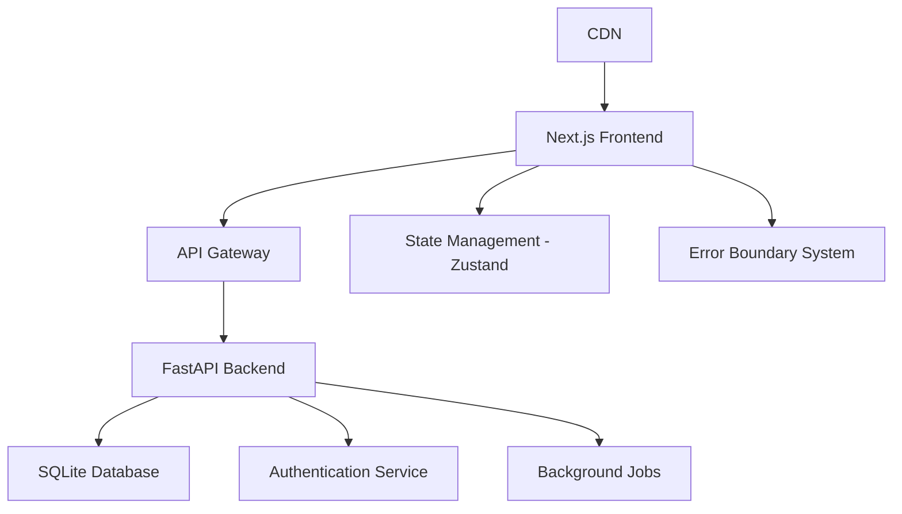
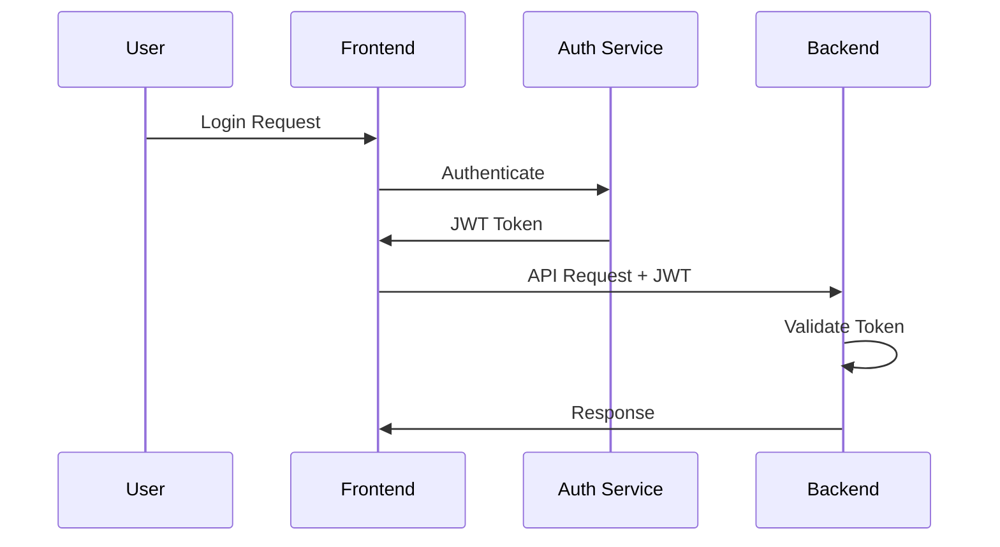
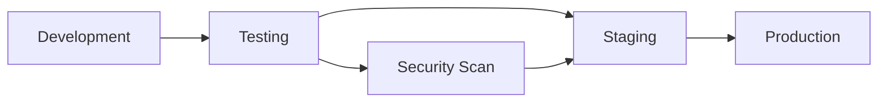

# Wasteland Tarot - Technical Design Document

## Architecture Overview

The application will maintain its current Next.js + FastAPI architecture while implementing strategic improvements for scalability and maintainability.



## Frontend Architecture Improvements

### State Management Migration
**Current State:** Mixed localStorage and React state
**Target State:** Centralized Zustand store

```typescript
// Store Structure
interface AppState {
  auth: AuthState;
  readings: ReadingsState;
  ui: UIState;
  cache: CacheState;
}
```

### Error Handling System
**Implementation:** React Error Boundaries + Global Error Store
**Features:**
- Automatic error recovery
- User-friendly error messages
- Error reporting to logging service

### Component Architecture
```
src/
├── components/
│   ├── common/          # Reusable UI components
│   ├── forms/           # Form components with validation
│   ├── layout/          # Layout components
│   └── reading/         # Reading-specific components
├── hooks/               # Custom React hooks
├── stores/              # Zustand stores
├── utils/               # Utility functions
└── types/               # TypeScript definitions
```

## Backend Enhancements

### Database Schema Extensions
```sql
-- New tables for enhanced functionality
CREATE TABLE reading_templates (
    id INTEGER PRIMARY KEY,
    name VARCHAR(100) NOT NULL,
    description TEXT,
    positions JSON NOT NULL,
    created_at TIMESTAMP DEFAULT CURRENT_TIMESTAMP
);

CREATE TABLE user_preferences (
    id INTEGER PRIMARY KEY,
    user_id INTEGER REFERENCES users(id),
    reading_style VARCHAR(50),
    preferred_spreads JSON,
    notification_settings JSON,
    created_at TIMESTAMP DEFAULT CURRENT_TIMESTAMP
);

CREATE TABLE reading_analytics (
    id INTEGER PRIMARY KEY,
    user_id INTEGER REFERENCES users(id),
    reading_id INTEGER REFERENCES readings(id),
    engagement_time INTEGER,
    cards_clicked JSON,
    created_at TIMESTAMP DEFAULT CURRENT_TIMESTAMP
);
```

### API Enhancements
**New Endpoints:**
```python
# Reading Templates
GET /api/v1/templates/
POST /api/v1/templates/
GET /api/v1/templates/{template_id}

# User Analytics
GET /api/v1/analytics/readings
GET /api/v1/analytics/trends

# Enhanced Readings
POST /api/v1/readings/complex
GET /api/v1/readings/recommendations
```

## Performance Optimization Strategy

### Frontend Optimizations
1. **Code Splitting:** Route-based and component-based splitting
2. **Image Optimization:** Next.js Image component with WebP format
3. **Caching Strategy:** SWR for API calls with cache invalidation
4. **Bundle Analysis:** Regular bundle size monitoring

### Backend Optimizations
1. **Database Indexing:** Optimize queries with proper indexes
2. **Caching Layer:** Redis for session and frequently accessed data
3. **API Rate Limiting:** Implement rate limiting for API protection
4. **Background Processing:** Async processing for heavy operations

## Testing Strategy

### Frontend Testing
```typescript
// Test Structure
tests/
├── unit/                # Component unit tests
├── integration/         # API integration tests
├── e2e/                # End-to-end tests
└── performance/        # Performance tests
```

**Testing Tools:**
- Jest + React Testing Library (Unit/Integration)
- Cypress (E2E)
- Lighthouse CI (Performance)

### Backend Testing
```python
# Test Structure
tests/
├── unit/               # Function unit tests
├── integration/        # API endpoint tests
├── load/              # Load testing
└── security/          # Security testing
```

## Security Enhancements

### Authentication Flow


### Data Protection
- JWT token rotation every 15 minutes
- Refresh token strategy with secure httpOnly cookies
- API request signing for sensitive operations
- Input validation and sanitization

## Monitoring and Analytics

### Application Monitoring
- Error tracking with Sentry integration
- Performance monitoring with Web Vitals
- User analytics with privacy-first approach
- API performance metrics

### Business Intelligence
```typescript
interface AnalyticsEvent {
  event: 'reading_completed' | 'card_clicked' | 'spread_selected';
  properties: Record<string, any>;
  timestamp: Date;
  userId?: string;
}
```

## Deployment Strategy

### Development Workflow


### Infrastructure
- **Frontend:** Vercel deployment with edge functions
- **Backend:** Railway deployment with auto-scaling
- **Database:** Hosted SQLite with backup strategy
- **CDN:** Cloudflare for static assets

## Migration Plan

### Phase 1: Foundation (Week 1-2)
1. Set up Zustand store structure
2. Implement error boundary system
3. Add comprehensive logging

### Phase 2: Enhancement (Week 3-6)
1. Migrate state management
2. Implement advanced spreads
3. Add reading history enhancements

### Phase 3: Optimization (Week 7-12)
1. Performance optimization
2. Comprehensive testing suite
3. Analytics implementation

### Phase 4: Advanced Features (Month 4-6)
1. Personalization engine
2. Social features
3. Mobile app development

## Risk Mitigation

### Technical Risks
- **State Migration:** Gradual migration with fallback mechanisms
- **Performance:** Regular monitoring and optimization
- **Security:** Regular security audits and updates

### Business Risks
- **User Experience:** A/B testing for major changes
- **Data Loss:** Comprehensive backup and recovery procedures
- **Scalability:** Monitoring and auto-scaling capabilities