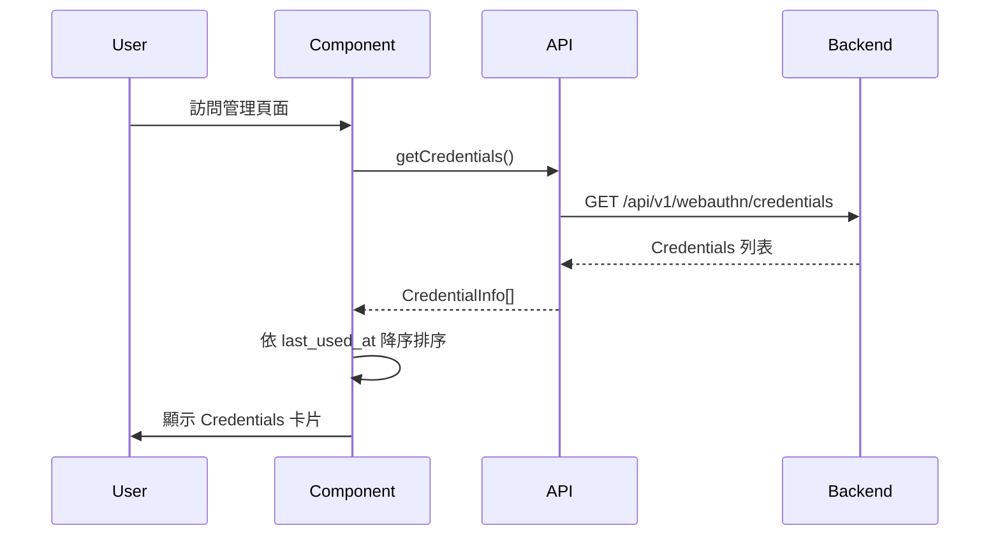
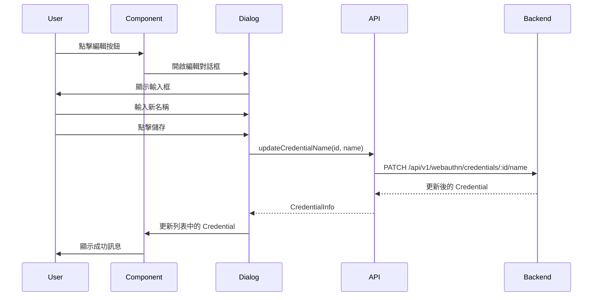
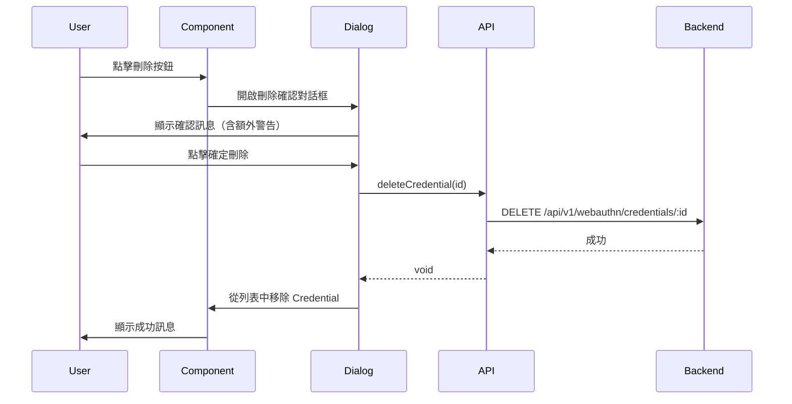

# Credential Management Components

**Passkey 管理元件** - Fallout 廢土主題 UI

## 概述

本模組提供完整的 Passkey（WebAuthn Credential）管理介面，包含列表顯示、新增、編輯名稱、刪除等功能，並整合 Fallout Pip-Boy 主題。

## 元件

### 1. CredentialManagementPage

**主要管理頁面**，提供完整的 Credential 管理功能。

**功能特性**：
- 載入並顯示用戶所有 Credentials（依 `last_used_at` 降序排序）
- 空狀態 UI（無 Credentials 時顯示提示）
- 新增 Passkey（整合 `AddPasskeyButton`）
- 編輯 Credential 名稱（使用 Dialog）
- 刪除 Credential（含確認對話框，最後一個 Credential 有額外警告）
- 10 個 Credentials 上限檢查與提示
- 錯誤處理與重試機制
- 載入狀態與 Skeleton UI

**使用範例**：

```tsx
import { CredentialManagementPage } from '@/components/auth/CredentialManagementPage';

// 在帳號設定頁面使用
export default function AccountSettingsPage() {
  return (
    <div>
      <h1>帳號設定</h1>
      <CredentialManagementPage />
    </div>
  );
}
```

**API 依賴**：
- `getCredentials()` - 取得 Credentials 列表
- `updateCredentialName(id, name)` - 更新名稱
- `deleteCredential(id)` - 刪除 Credential

**檔案位置**: `/src/components/auth/CredentialManagementPage.tsx`

---

### 2. CredentialCard

**單個 Credential 卡片元件**，顯示詳細資訊並提供操作按鈕。

**顯示資訊**：
- Credential 名稱（device_name）
- 建立日期（created_at）
- 最後使用日期（last_used_at，若無則顯示「從未使用」）
- 裝置類型圖示（根據 `transports` 推測）
- Transports（連線方式：USB, NFC, 藍牙, 平台內建）
- Device Type（平台認證器 / 可移除認證器）
- Counter（使用次數，如果有）
- Credential ID（截斷顯示）
- 狀態指示器（已啟用 / 未使用）

**操作按鈕**：
- 編輯按鈕（觸發編輯名稱）
- 刪除按鈕（觸發刪除確認）

**使用範例**：

```tsx
import { CredentialCard } from '@/components/auth/CredentialCard';

<CredentialCard
  credential={credential}
  onEdit={(cred) => handleEdit(cred)}
  onDelete={(cred) => handleDelete(cred)}
/>
```

**Props**：

```typescript
interface CredentialCardProps {
  credential: CredentialInfo & { counter?: number };
  onEdit: (credential: CredentialInfo) => void;
  onDelete: (credential: CredentialInfo) => void;
}
```

**裝置圖示推測邏輯**：
- `usb` transport → `usb` 圖示
- `nfc` transport → `nfc` 圖示
- `ble` transport → `bluetooth` 圖示
- `internal` transport → `fingerprint` 圖示
- 預設 → `fingerprint` 圖示

**檔案位置**: `/src/components/auth/CredentialCard.tsx`

---

## 主題設計

### Fallout Pip-Boy 風格

**顏色**：
- **主色**: Pip-Boy Green (`#00ff88`) - 用於邊框、標題、圖示
- **警告色**: Radiation Orange (`#ff8800`) - Hover 效果
- **錯誤色**: Deep Red (`#ef4444`) - 刪除按鈕、錯誤訊息
- **背景**: `bg-background-card` - 卡片背景
- **文字**: `text-pip-boy-green`, `text-text-primary`, `text-text-muted`

**UI 元素**：
- **圖示**: 使用 `PixelIcon` 元件（pixelarticons 套件）
- **按鈕**: Fallout 風格按鈕（Hover 時變色）
- **對話框**: Pip-Boy 綠色邊框、廢土背景
- **狀態指示器**: 脈衝動畫（已啟用）、灰色（未使用）

**文案風格**：
- 使用 Pip-Boy 術語（例如：「避難所生物辨識資料庫」）
- 警告訊息使用 `[Pip-Boy 警告]` 前綴
- 錯誤訊息使用 `[Pip-Boy 錯誤]` 前綴
- 成功訊息使用 `[Pip-Boy 成功]` 前綴

---

## 資料流程

### 載入 Credentials



### 編輯 Credential 名稱



### 刪除 Credential



---

## 錯誤處理

### API 載入錯誤

當 `getCredentials()` 失敗時：
1. 顯示錯誤訊息（Fallout 風格）
2. 顯示重試按鈕
3. 點擊重試按鈕重新載入

### 更新名稱錯誤

當 `updateCredentialName()` 失敗時：
1. 顯示 Toast 錯誤訊息
2. Dialog 保持開啟
3. 用戶可重試或取消

### 刪除錯誤

當 `deleteCredential()` 失敗時：
1. 顯示 Toast 錯誤訊息
2. Dialog 保持開啟
3. 用戶可重試或取消

### 最後一個 Credential 警告

當嘗試刪除最後一個 Credential 時：
- 顯示額外警告訊息：「⚠️ 這是你最後一個 Passkey！刪除後將無法使用 Passkey 登入。建議先設定密碼或新增其他 Passkey。」
- 使用 Warning 主題色（黃色背景、黃色文字）

---

## 測試

### 單元測試

**CredentialManagementPage 測試** (`src/components/auth/__tests__/CredentialManagementPage.test.tsx`):
- 頁面渲染測試（標題、載入狀態、空狀態）
- Credentials 列表顯示測試（排序、詳細資訊）
- 新增 Passkey 功能測試（上限檢查、成功回調）
- 編輯名稱測試（Dialog 開啟、提交、錯誤處理）
- 刪除測試（確認對話框、最後一個 Credential 警告、成功刪除）
- 錯誤處理測試（API 錯誤、重試按鈕）

**CredentialCard 測試** (`src/components/auth/__tests__/CredentialCard.test.tsx`):
- 基本渲染測試（名稱、日期、裝置名稱）
- 裝置類型圖示測試（USB, NFC, 藍牙, 指紋）
- 操作按鈕測試（編輯、刪除）
- Fallout 主題樣式測試（邊框顏色、背景）
- Transports 顯示測試（多個 transports）
- Counter 顯示測試（使用次數）
- Credential ID 截斷測試

**執行測試**：

```bash
# 執行所有測試
bun test src/components/auth/__tests__/CredentialManagementPage.test.tsx
bun test src/components/auth/__tests__/CredentialCard.test.tsx

# 執行單個測試
bun test src/components/auth/__tests__/CredentialManagementPage.test.tsx -t "應該正確渲染頁面標題"
```

---

## 相關檔案

### 元件檔案
- `/src/components/auth/CredentialManagementPage.tsx` - 主管理頁面
- `/src/components/auth/CredentialCard.tsx` - Credential 卡片
- `/src/components/auth/AddPasskeyButton.tsx` - 新增 Passkey 按鈕（已存在）

### 測試檔案
- `/src/components/auth/__tests__/CredentialManagementPage.test.tsx` - 25 個測試
- `/src/components/auth/__tests__/CredentialCard.test.tsx` - 15 個測試

### API 檔案
- `/src/lib/webauthn/api.ts` - WebAuthn API Client
- `/src/lib/webauthn/types.ts` - 型別定義

### UI 元件
- `/src/components/ui/icons/PixelIcon.tsx` - 圖示元件
- `/src/components/ui/button.tsx` - 按鈕元件
- `/src/components/ui/dialog.tsx` - 對話框元件
- `/src/components/ui/card.tsx` - 卡片元件
- `/src/components/ui/input.tsx` - 輸入框元件

---

## 開發指南

### 新增功能

如果要新增功能（例如：匯出 Credentials、批次操作），請遵循 TDD 流程：

1. **紅燈（Red）**: 先寫測試
2. **綠燈（Green）**: 實作功能讓測試通過
3. **重構（Refactor）**: 優化程式碼

### 樣式修改

如果要修改 Fallout 主題樣式：
- 修改 `CredentialCard.tsx` 的 `className`
- 修改 `CredentialManagementPage.tsx` 的對話框樣式
- 確保使用 Pip-Boy 綠色（`#00ff88`）作為主色

### 圖示修改

如果要更換圖示：
- 使用 `PixelIcon` 元件
- 參考 `/src/components/ui/icons/README.md` 查看可用圖示
- 修改 `getDeviceIcon()` 函式邏輯

---

## 常見問題 FAQ

### Q: 如何整合到帳號設定頁面？

A: 在帳號設定頁面匯入並使用 `CredentialManagementPage` 元件：

```tsx
import { CredentialManagementPage } from '@/components/auth/CredentialManagementPage';

export default function SettingsPage() {
  return (
    <div>
      <h1>帳號設定</h1>
      <section>
        <h2>Passkey 管理</h2>
        <CredentialManagementPage />
      </section>
    </div>
  );
}
```

### Q: 如何自訂 Credential 卡片樣式？

A: 修改 `CredentialCard.tsx` 的 JSX 和 `className`。記得保持 Fallout 主題一致性。

### Q: 如何處理 Credential 數量上限？

A: 上限在 `CredentialManagementPage` 中硬編碼為 10 個。如果要修改：
1. 修改 `isMaxReached` 判斷邏輯
2. 修改警告訊息中的數字

### Q: 如何測試「最後一個 Credential」警告？

A: 模擬 `credentials.length === 1` 的狀態，點擊刪除按鈕，檢查是否顯示額外警告訊息。

---

## 更新日誌

### 2025-10-27
- ✅ 實作 `CredentialManagementPage` 元件
- ✅ 實作 `CredentialCard` 子元件
- ✅ 撰寫 25 個單元測試（CredentialManagementPage）
- ✅ 撰寫 15 個單元測試（CredentialCard）
- ✅ 整合 Fallout Pip-Boy 主題
- ✅ 實作錯誤處理與重試機制
- ✅ 實作 10 個 Credentials 上限檢查
- ✅ 實作最後一個 Credential 刪除警告

---

**參考文件**：
- [WebAuthn API Client README](/src/lib/webauthn/README.md)
- [PixelIcon 使用指南](/src/components/ui/icons/README.md)
- [Passkey Authentication Design](/kiro/specs/passkey-authentication/design.md)
- [Passkey Authentication Requirements](/.kiro/specs/passkey-authentication/requirements.md)
